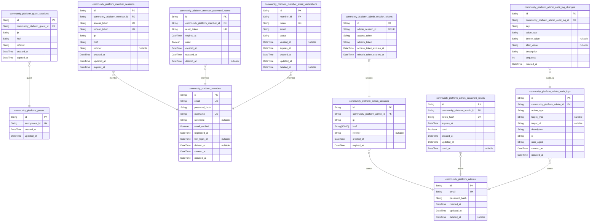
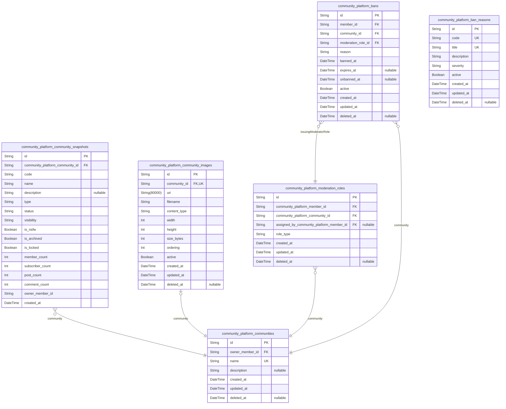
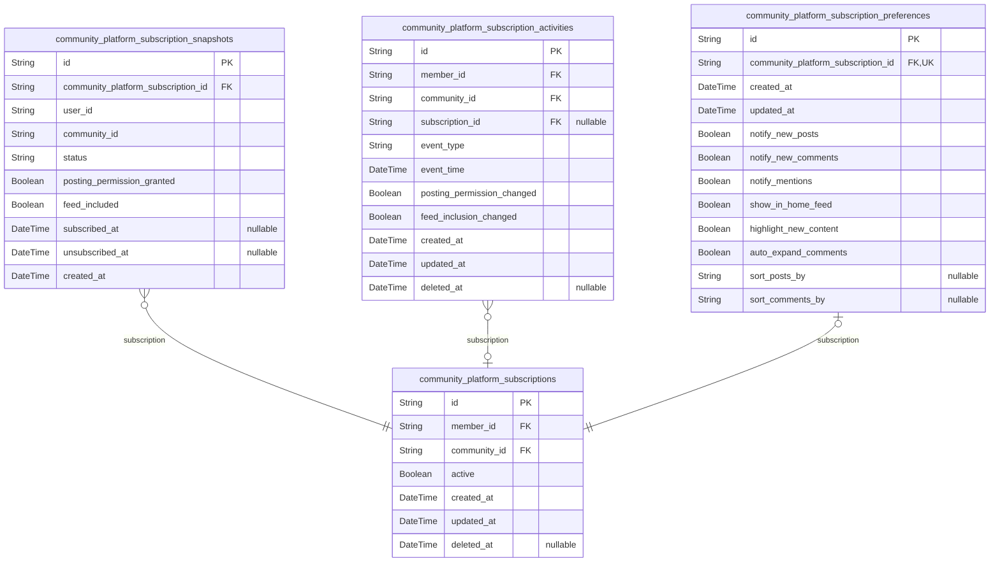
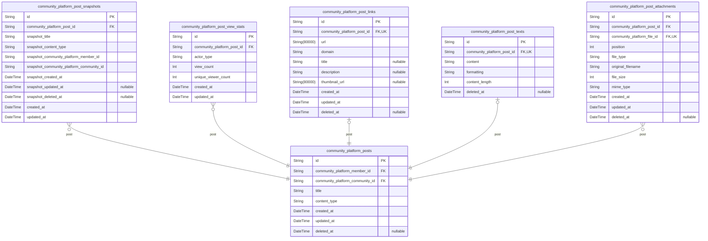
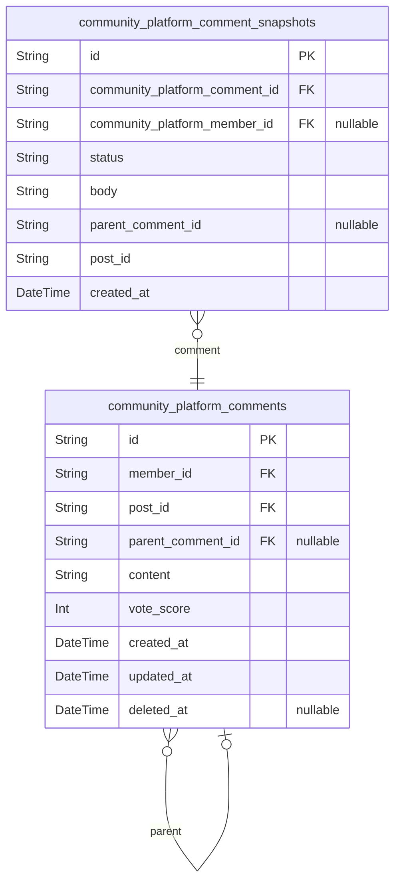
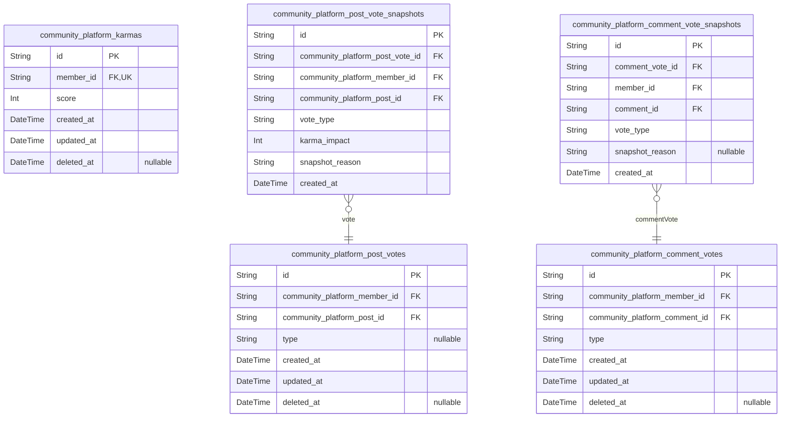
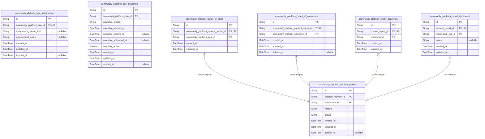
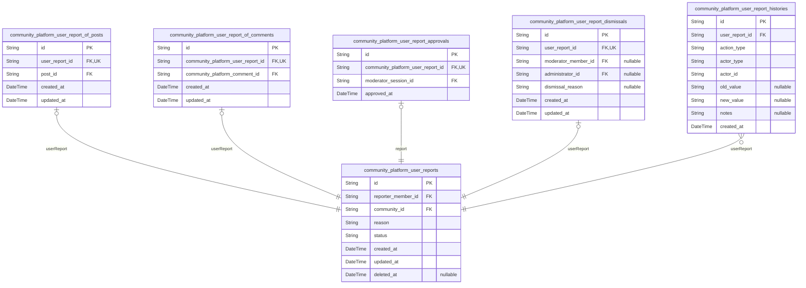
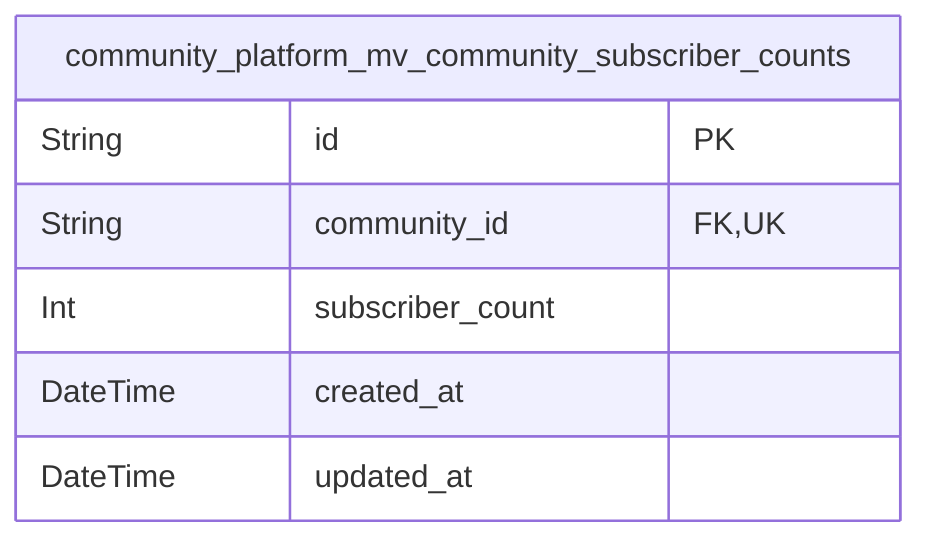

# Prisma Markdown

> Generated by [`prisma-markdown`](https://github.com/samchon/prisma-markdown)

- [Actors](#actors)
- [Systematic](#systematic)
- [Communities](#communities)
- [Subscriptions](#subscriptions)
- [Posts](#posts)
- [Comments](#comments)
- [Votes](#votes)
- [Moderation](#moderation)
- [Reports](#reports)
- [default](#default)

## Actors

### `community_platform_guests`

Temporary guest accounts identified by device fingerprint or anonymous
identifier for unauthenticated users browsing public content.

Guest accounts provide anonymous access to public platform features
without registration. They are automatically created when users browse
without authentication and enable session persistence across browsing
sessions. Guests can view popular posts, community feeds, and user
profiles but cannot create content or participate in community
activities.

Each guest account is uniquely identified by an anonymous device
fingerprint or browser identifier, allowing temporary personalization
while maintaining user privacy. Guest accounts have no authentication
credentials and are automatically cleaned up after prolonged inactivity.

Properties as follows:

- `id`: Primary Key.
- `anonymous_id`
  > Unique anonymous identifier or device fingerprint for guest account
  > tracking. Generated client-side and persists across browsing sessions to
  > enable guest continuity without authentication.
- `created_at`
  > Timestamp when the guest account was automatically created upon first
  > anonymous visit.
- `updated_at`
  > Timestamp when the guest account was last accessed or modified for
  > activity tracking.

### `community_platform_guest_sessions`

Temporary session tokens for guest access allowing persistent
identification across browsing sessions without authentication.

This table stores session information for unauthenticated guest users,
providing temporary identity persistence for browsing sessions. Each
session is tied to a specific guest actor and contains connection
metadata including IP address, current page URL, and referrer information
for tracking browsing context. Sessions have expiration timestamps to
ensure automatic cleanup of inactive guest sessions.

Sessions support persistent identification across browsing sessions while
maintaining guest anonymity. The expired_at field ensures sessions are
automatically invalidated after a period of inactivity. This table
follows the session table pattern for guest actors, complementing the
[community_platform_guests](#community_platform_guests) table.

Properties as follows:

- `id`: Primary Key.
- `community_platform_guest_id`: Belonged guest's [community_platform_guests.id](#community_platform_guests).
- `ip`
  > IP address of the guest's connection for security and geolocation
  > tracking.
- `href`: Current page URL where the session was created or last accessed.
- `referrer`
  > HTTP referrer header indicating the previous page the guest navigated
  > from.
- `created_at`: Timestamp when the session was initially created for the guest.
- `expired_at`: Timestamp when the session will automatically expire for security cleanup.

### `community_platform_members`

Registered member accounts with email/password authentication, unique
username, and profile information for users who can create content and
communities.

Members are the primary authenticated actors who can create posts,
comments, communities, vote on content, and participate in all
interactive features. Each member has a unique username that cannot be
changed, a password hash for authentication, and a profile for public
presentation. Members are distinguished from guests (temporary anonymous
users) and admins (platform administrators).

Members own and manage all their created content including posts,
comments, communities, and subscriptions. Their account lifecycle
includes registration, email verification, password changes, and account
deletion which removes all associated content and relationships.

[community_platform_member_sessions](#community_platform_member_sessions) records member authentication
sessions. [community_platform_member_password_resets](#community_platform_member_password_resets) handles
forgotten password recovery. {@link
community_platform_member_email_verifications} manages email address
confirmation.

Stance classification as "actor" because members have distinct
authentication flows, own sessions, serve as canonical identity for
content ownership, and require separate profile management from guests
and admins.

Properties as follows:

- `id`: Primary Key.
- `email`: Email address used for registration, authentication, and notifications.
- `password_hash`
  > Hashed password for secure authentication using bcrypt or similar
  > algorithm. Never stored in plain text.
- `username`
  > Unique public identifier chosen during registration. Cannot be changed
  > after creation. Appears alongside all user content.
- `nickname`
  > Alternative public display name that members can set and change at any
  > time for personal branding.
- `email_verified`
  > Indicates whether the member's email address has been verified through
  > confirmation email.
- `registered_at`
  > Timestamp when the member registered their account. Used for account age
  > verification and analytics.
- `last_login_at`
  > Timestamp of the member's last successful authentication. Used for
  > activity tracking and session management.
- `deleted_at`
  > Timestamp when the member's account was deleted, enabling soft deletion
  > while preserving referential integrity.
- `created_at`: Timestamp when this member record was created in the database.
- `updated_at`: Timestamp when this member record was last updated in the database.

### `community_platform_member_sessions`

JWT session tokens with access and refresh token support for member
authentication and authorization.

Stores session information for authenticated members including access and
refresh tokens for JWT-based authentication. Each session records
connection metadata (IP, URL, referrer) for security auditing and has a
configurable expiration time. Sessions are managed through authentication
flows and automatically expire based on the expired_at timestamp.

Sessions reference the member through {@link
community_platform_members.id} and are used to validate authenticated
requests across the platform. The access_token is used for short-term API
access, while the refresh_token enables obtaining new access tokens
without requiring re-authentication.

Properties as follows:

- `id`: Primary Key.
- `community_platform_member_id`: Belonged member's [community_platform_members.id](#community_platform_members).
- `access_token`
  > JWT access token for short-term API authentication. Used to authorize
  > requests during the session lifetime.
- `refresh_token`
  > JWT refresh token for obtaining new access tokens without
  > re-authentication. Has longer validity than access tokens.
- `ip`
  > IP address from which the session was created. Used for security auditing
  > and anomaly detection.
- `href`
  > Full URL of the page where the session was initiated. Used for contextual
  > auditing and user experience tracking.
- `referrer`
  > HTTP referrer header value indicating the previous page. Used for traffic
  > source analysis and security auditing.
- `created_at`
  > Timestamp when the session was created. Used for session lifecycle
  > management and auditing.
- `updated_at`
  > Timestamp when the session was last updated. Tracks modifications to
  > session metadata.
- `expired_at`
  > Timestamp when the session expires and becomes invalid. Sessions
  > automatically expire after this time for security.

### `community_platform_member_password_resets`

Password reset tokens with expiration timestamps for member
authentication recovery.

Stores secure tokens generated when members request password resets,
supporting the 'forgot password' workflow. Each token is single-use with
a limited validity period and references the target member account. After
a successful password reset, tokens are marked as used and soft-deleted
for security.

Tokens provide secure password change capability without requiring the
old password, implementing standard authentication recovery patterns. The
token mechanism ensures only authorized password changes through verified
email links.

Properties as follows:

- `id`: Primary Key.
- `community_platform_member_id`
  > Target member account requiring password reset. {@link
  > community_platform_members.id}.
- `reset_token`
  > Secure random token for password reset authentication. Used in reset URLs
  > to verify identity without exposing credentials.
- `expires_at`
  > Timestamp when the reset token becomes invalid for security. After this
  > time, tokens cannot be used for password changes.
- `used`
  > Indicates whether this token has been used for a successful password
  > reset. Used tokens cannot be reused for security.
- `created_at`
  > Timestamp when the reset token was created, typically when the member
  > requested password reset.
- `updated_at`
  > Timestamp when the reset token record was last updated, such as when
  > marked as used.
- `deleted_at`
  > Soft delete timestamp for security cleanup after token use or expiration.
  > Used tokens are soft-deleted to prevent reuse.

### `community_platform_member_email_verifications`

Email verification tokens for member registration confirmation and email
change validation.

This table stores temporary tokens sent to members' email addresses for
verification purposes. Each token is uniquely generated and expires after
a configurable period. The verification process confirms email ownership
during registration and when members change their email address.

Verification tokens are associated with specific members via {@link
community_platform_members.id} and track the verification status
lifecycle from 'pending' to 'verified' or 'expired'. Verified tokens
include timestamps for when confirmation occurred, while expired tokens
remain for audit trail purposes.

This table supports both initial registration verification and subsequent
email change validation workflows within the platform's authentication
system.

Properties as follows:

- `id`: Primary Key.
- `member_id`
  > Member requiring email verification. {@link
  > community_platform_members.id}.
- `token`
  > Unique verification token sent to the member's email address for
  > confirmation.
- `email`: Email address being verified for member registration or email change.
- `status`
  > Verification status: 'pending' (awaiting confirmation), 'verified'
  > (successfully confirmed), or 'expired' (token no longer valid).
- `verified_at`
  > Timestamp when the member successfully verified their email address. Null
  > while pending or expired.
- `expires_at`
  > Timestamp when the verification token expires and can no longer be used
  > for confirmation.
- `created_at`: Timestamp when this verification token was generated and stored.
- `updated_at`: Timestamp when this verification token record was last updated.
- `deleted_at`
  > Timestamp when this verification token was soft-deleted for cleanup
  > purposes. Null if active.

### `community_platform_admins`

Administrator accounts with email/password authentication and elevated
system-wide management privileges.

This table stores the canonical identity records for platform
administrators who have system-wide authority beyond individual community
boundaries. Administrators can perform platform-level management tasks,
oversee community operations, and access administrative features not
available to regular members.

Each administrator authenticates with email and password. Child tables
track sessions, password resets, and audit logs for accountability and
security. Administrators are distinguished from regular members by their
system-wide permissions and ability to manage platform configuration,
monitor system health, and oversee community governance.

[community_platform_admin_sessions.id](#community_platform_admin_sessions) stores session information
for administrator logins.
[community_platform_admin_password_resets.id](#community_platform_admin_password_resets) handles password
recovery tokens for administrators.
[community_platform_admin_audit_logs.id](#community_platform_admin_audit_logs) records audit trails of
administrative actions.

Properties as follows:

- `id`: Primary Key.
- `email`
  > Email address for administrator authentication and communication. Must be
  > unique across all administrator accounts. Used as the login identifier
  > for system access.
- `password_hash`
  > Securely hashed password for administrator authentication. Stores the
  > cryptographic hash of the administrator's password for secure login
  > verification.
- `created_at`
  > Timestamp when the administrator account was created. Records the initial
  > creation time for audit and tracking purposes.
- `updated_at`
  > Timestamp when the administrator account was last updated. Tracks the
  > most recent modification for synchronization and auditing.
- `deleted_at`
  > Timestamp when the administrator account was soft deleted. Allows for
  > account deactivation without permanent data loss, supporting potential
  > recovery scenarios. Null indicates the account is active.

### `community_platform_admin_sessions`

JWT session tokens with access and refresh token support for
administrator authentication and privileged operations.

Stores session information for admin users including connection context
(IP, referrer), JWT tokens for authentication, and expiration timestamps.
Each session is associated with a single admin user and is used to
maintain authenticated state for administrative operations across the
platform.

When an admin logs in, a new session is created with access and refresh
tokens. The session remains active until the expired_at timestamp, after
which the session is considered invalid and the admin must
re-authenticate. This table supports secure session management with
proper audit trail of admin login activity.

Properties as follows:

- `id`: Primary Key.
- `community_platform_admin_id`: Administrator's [community_platform_admins.id](#community_platform_admins).
- `ip`
  > IP address from which the admin authenticated, used for security audit
  > and suspicious activity detection.
- `href`
  > Full URL where the admin initiated the login session, capturing the
  > specific page context.
- `referrer`
  > HTTP Referer header value indicating the previous page that directed the
  > admin to the login page.
- `created_at`: Timestamp when the admin session was created, marking the login event.
- `expired_at`
  > Timestamp when the session expires and becomes invalid, requiring
  > re-authentication.

### `community_platform_admin_password_resets`

Password reset tokens for administrator accounts with expiration and
one-time use security.

Each record represents a password reset request initiated by an
administrator who has forgotten their password. The token is generated
when the reset request is initiated and must be used within the
expiration window. Once used or expired, the token cannot be reused.

This table supports the password reset flow by providing secure token
storage with expiration tracking and usage status. Administrators request
password resets via email, receive a unique token link, and can then set
a new password using that token before it expires.

The token is stored in hashed form for security, and the used flag
prevents token reuse. Each token is associated with exactly one
administrator account through [community_platform_admins.id](#community_platform_admins).

Properties as follows:

- `id`: Primary Key.
- `community_platform_admin_id`
  > Administrator account requesting password reset. {@link
  > community_platform_admins.id}.
- `token_hash`
  > Hashed password reset token for secure storage. The token is generated
  > when a password reset is requested and sent to the administrator's email.
- `expires_at`
  > Timestamp when this password reset token expires and becomes invalid.
  > After this time, the token cannot be used to reset the password.
- `used`
  > Indicates whether this password reset token has been used successfully.
  > Once true, the token cannot be reused for security reasons.
- `created_at`: Timestamp when this password reset request was created.
- `updated_at`: Timestamp when this password reset record was last updated.
- `used_at`
  > Timestamp when this password reset token was successfully used to change
  > the password. Null until the token is used.

### `community_platform_admin_audit_logs`

Audit trail of administrative actions and system changes for
accountability and security monitoring.

This table records all administrative operations performed by platform
administrators, including user management, content moderation, system
configuration changes, and security events. Each entry captures the
action details, the administrator who performed it, the target entity
affected, and contextual information such as IP address and user agent
for forensic analysis.

Audit logs are append-only and immutable, providing a permanent record
for compliance, security investigations, and operational transparency.
They support accountability by linking every administrative action to a
specific administrator and timestamp.

[community_platform_admins.id](#community_platform_admins)

Properties as follows:

- `id`: Primary Key.
- `community_platform_admin_id`
  > Administrator who performed the action. {@link
  > community_platform_admins.id}
- `action_type`
  > Type of administrative action performed. Common values: 'create',
  > 'update', 'delete', 'system_change', 'security_event', 'user_management',
  > 'content_moderation', 'configuration_update'.
- `target_type`
  > Type of entity affected by the action. Values: 'user', 'post', 'comment',
  > 'community', 'system_setting', 'file', 'report', 'ban',
  > 'moderation_role'.
- `target_id`
  > Identifier of the specific entity affected by the action. References the
  > primary key of the target_type entity.
- `description`
  > Detailed human-readable description of what changed, including the
  > rationale for the action and any notable conditions.
- `ip`
  > IP address from which the administrative action was performed, for
  > security monitoring and geolocation tracking.
- `user_agent`
  > HTTP User-Agent header from the client that performed the action,
  > identifying browser/device information.
- `created_at`
  > Timestamp when the administrative action was recorded. Audit logs are
  > append-only and should not be modified after creation.
- `updated_at`
  > Timestamp when this audit log entry was last updated. Typically matches
  > created_at as audit logs are immutable, but allows for correction of
  > metadata if needed.

### `community_platform_admin_session_tokens`

Stores JWT access and refresh tokens for administrator sessions in a
separate 1:1 relationship table following normalization patterns.

This table decouples token storage from session metadata to avoid
nullable fields in the main session table and improves security by
isolating token data. Each token record belongs to exactly one {@link
community_platform_admin_sessions} record.

The 1:1 relationship ensures token management aligns with session
lifecycle - tokens are created with sessions and invalidated when
sessions expire. Token expiration timestamps enable automatic cleanup of
expired credentials.

Security Considerations: Tokens are stored as plain strings but should be
hashed or encrypted in application layer. This table provides the storage
structure while leaving encryption implementation to the application.

Properties as follows:

- `id`: Primary Key.
- `admin_session_id`
  > Associated admin session's [community_platform_admin_sessions.id](#community_platform_admin_sessions).
  > Each token set belongs to exactly one session.
- `access_token`
  > JWT access token string used for authentication. Should be hashed or
  > encrypted at application layer.
- `refresh_token`
  > JWT refresh token string used to obtain new access tokens. Should be
  > hashed or encrypted at application layer.
- `access_token_expires_at`
  > Expiration timestamp for the access token. After this time, the token
  > becomes invalid and a new access token must be obtained via refresh
  > token.
- `refresh_token_expires_at`
  > Expiration timestamp for the refresh token. After this time, both tokens
  > expire and user must re-authenticate.

### `community_platform_admin_audit_log_changes`

Key-value pairs capturing state changes made by administrative actions,
normalized for 1NF compliance. Stores before/after values with sequence
ordering for forensic analysis and rollback capability.

Each record represents a single field change captured during an
administrative audit event. The table decomposes JSON-like change data
from audit logs into normalized key-value pairs, enabling structured
querying of what specific fields were modified during administrative
operations. This supports detailed forensic analysis, compliance
reporting, and potential rollback scenarios by preserving exact
before/after states in the order they occurred.

Changes are linked to parent [community_platform_admin_audit_logs](#community_platform_admin_audit_logs)
records which provide the overall audit context including actor, action
type, and timestamp. The sequence field preserves the order of multiple
changes within a single administrative action.

Properties as follows:

- `id`: Primary Key.
- `community_platform_admin_audit_log_id`
  > Parent audit log record capturing the administrative action. {@link
  > community_platform_admin_audit_logs.id}.
- `key`
  > Field name or property path that was changed during the administrative
  > action. Examples: 'user.role', 'system.config.maxFileSize',
  > 'community.moderatorPermissions'.
- `value_type`
  > Data type of the changed value for proper serialization/deserialization.
  > Supported types: 'string', 'number', 'boolean', 'array', 'object',
  > 'null'.
- `before_value`
  > Previous value of the field before the administrative change, serialized
  > according to value_type. Null indicates the field didn't exist
  > previously.
- `after_value`
  > New value of the field after the administrative change, serialized
  > according to value_type. Null indicates the field was deleted or set to
  > null.
- `description`
  > Contextual description of what this specific change represents within the
  > administrative action. Example: 'Changed user role from moderator to
  > administrator'.
- `sequence`
  > Ordering sequence of this change within the parent audit log. Starts at 1
  > for the first change and increments for subsequent changes in the same
  > administrative action.
- `created_at`
  > Timestamp when this specific change was recorded. Matches the parent
  > audit log's timestamp for consistency.

## Systematic

```mermaid
erDiagram
"community_platform_files" {
  String id PK
  String name
  String type
  Int size
  String storage_path
  String(80000) public_url "nullable"
  String status
  String actor_type
  String actor_id
  DateTime created_at
  DateTime updated_at
  DateTime deleted_at "nullable"
}
"community_platform_configurations" {
  String id PK
  String key UK
  String description
  String data_type
  String default_value
  String current_value "nullable"
  String component "nullable"
  String environment "nullable"
  String validation_rules "nullable"
  Boolean is_feature_flag
  Boolean is_sensitive
  Boolean is_required
  DateTime created_at
  DateTime updated_at
  DateTime deleted_at "nullable"
}
"community_platform_audit_logs" {
  String id PK
  String action
  String resource_type
  String resource_path "nullable"
  String description
  String client_ip
  String user_agent
  String(80000) referrer "nullable"
  String http_method
  Int http_status_code
  String(80000) request_uri
  Boolean success
  String error_message "nullable"
  DateTime occurred_at
  DateTime created_at
  DateTime updated_at
  DateTime deleted_at "nullable"
}
"community_platform_metadata" {
  String id PK
  String creator_id FK "nullable"
  String updater_id FK "nullable"
  String key UK
  String value
  String description
  String data_type
  Int version
  String status
  DateTime created_at
  DateTime updated_at
  DateTime deleted_at "nullable"
}
"community_platform_migrations" {
  String id PK
  String version UK
  String name
  String migration_type
  String status
  String script_path
  String checksum
  String environment
  String executed_by
  DateTime applied_at
  DateTime created_at
  DateTime updated_at
  DateTime deleted_at "nullable"
}
"community_platform_scheduled_jobs" {
  String id PK
  String name UK
  String description "nullable"
  String schedule_type
  String schedule_expression
  String parameters "nullable"
  String status
  Int priority
  DateTime next_run_at "nullable"
  DateTime last_run_at "nullable"
  String last_run_status "nullable"
  Int retry_count
  Int max_retries
  Int timeout_seconds
  Boolean is_enabled
  String failure_action
  DateTime created_at
  DateTime updated_at
  DateTime deleted_at "nullable"
}
"community_platform_system_notifications" {
  String id PK
  String member_id FK
  String notification_type
  String title
  String body
  String status
  String entity_type "nullable"
  String entity_id "nullable"
  DateTime read_at "nullable"
  DateTime created_at
  DateTime updated_at
  DateTime deleted_at "nullable"
}
"community_platform_system_metrics" {
  String id PK
  String component
  String metric_name
  String aggregation_period
  DateTime period_start
  DateTime period_end
  Float metric_value
  String value_type
  String dimensions "nullable"
  String notes "nullable"
  DateTime created_at
  DateTime updated_at
}
"community_platform_cache_data" {
  String id PK
  String cache_key UK
  String cache_value
  String cache_type
  DateTime expires_at "nullable"
  DateTime created_at
  DateTime updated_at
}
"community_platform_file_processes" {
  String id PK
  String community_platform_file_id FK
  DateTime started_at "nullable"
  DateTime completed_at "nullable"
  String error_message "nullable"
  DateTime created_at
  DateTime updated_at
  DateTime deleted_at "nullable"
}
"community_platform_temp_uploads" {
  String id PK
  String community_platform_file_id FK,UK
  String community_platform_member_id FK
  String status
  String original_filename
  String mime_type
  Int file_size
  String content_hash
  String upload_ip
  String user_agent
  DateTime expires_at
  DateTime created_at
  DateTime updated_at
  DateTime deleted_at "nullable"
}
"community_platform_health_checks" {
  String id PK
  String component_name
  String status
  Int response_time_ms
  String check_type
  String error_message "nullable"
  DateTime next_check_due "nullable"
  DateTime created_at
  DateTime updated_at
}
"community_platform_audit_log_metadatas" {
  String id PK
  String community_platform_audit_log_id FK
  String key
  String value_type
  String string_value "nullable"
  Float numeric_value "nullable"
  Boolean boolean_value "nullable"
  DateTime datetime_value "nullable"
  String(80000) uri_value "nullable"
  DateTime created_at
}
"community_platform_audit_log_of_guests" {
  String id PK
  String audit_log_id FK,UK
  String guest_id FK
  DateTime created_at
  DateTime updated_at
}
"community_platform_audit_log_of_members" {
  String id PK
  String audit_log_id FK
  String member_id FK
  DateTime created_at
  DateTime updated_at
  DateTime deleted_at "nullable"
}
"community_platform_audit_log_of_admins" {
  String id PK
  String community_platform_audit_log_id FK
  String community_platform_admin_id FK
  DateTime created_at
  DateTime updated_at
  DateTime deleted_at "nullable"
}
"community_platform_migration_metadata" {
  String id PK
  String community_platform_migration_id FK
  String key
  String value
  String data_type
  DateTime created_at
}
"community_platform_file_process_steps" {
  String id PK
  String community_platform_file_process_id FK
  String step_name
  String status
  String metadata "nullable"
  DateTime created_at
}
"community_platform_file_process_transformations" {
  String id PK
  String community_platform_file_process_step_id FK,UK
  String transformation_name
  String result
  String status
}
"community_platform_health_check_metadata" {
  String id PK
  String community_platform_health_check_id FK
  String key
  String value "nullable"
  String type
  String context "nullable"
  DateTime created_at
  DateTime updated_at
  DateTime deleted_at "nullable"
}
"community_platform_file_process_transformation_metadatas" {
  String id PK
  String community_platform_file_process_transformation_id FK
  String key
  String value
  String data_type
  DateTime created_at
  DateTime updated_at
}
"community_platform_file_process_step_metadatas" {
  String id PK
  String community_platform_file_process_step_id FK
  String key
  String value
  String data_type
  DateTime created_at
  DateTime updated_at
}
"community_platform_file_processes" }o--|| "community_platform_files" : file
"community_platform_temp_uploads" |o--|| "community_platform_files" : file
"community_platform_audit_log_metadatas" }o--|| "community_platform_audit_logs" : auditLog
"community_platform_audit_log_of_guests" |o--|| "community_platform_audit_logs" : auditLog
"community_platform_audit_log_of_members" }o--|| "community_platform_audit_logs" : auditLog
"community_platform_audit_log_of_admins" }o--|| "community_platform_audit_logs" : auditLog
"community_platform_migration_metadata" }o--|| "community_platform_migrations" : migration
"community_platform_file_process_steps" }o--|| "community_platform_file_processes" : fileProcess
"community_platform_file_process_transformations" |o--|| "community_platform_file_process_steps" : fileProcessStep
"community_platform_health_check_metadata" }o--|| "community_platform_health_checks" : healthCheck
"community_platform_file_process_transformation_metadatas" }o--|| "community_platform_file_process_transformations" : transformation
"community_platform_file_process_step_metadatas" }o--|| "community_platform_file_process_steps" : fileProcessStep
```

### `community_platform_files`

Stores metadata and processing information for all uploaded files across
the platform, including avatars, community icons, and post images.

This table serves as the central registry for all file attachments used
throughout the platform. It tracks file metadata (name, type, size),
storage location, processing status, and ownership context. Files can be
owned by various actor types (users uploading avatars, communities
uploading icons, members uploading post images) using a generic ownership
pattern.

The file processing workflow includes status tracking from upload through
processing to completion or failure. Processed files generate public URLs
for access while original files are stored securely. This systematic
table enables cross-component file management without tight coupling to
specific business domains.

Related tables: [community_platform_file_processes](#community_platform_file_processes) tracks
individual processing steps for each file.

Properties as follows:

- `id`: Primary Key.
- `name`
  > Original filename as uploaded by the user, preserved for reference and
  > download purposes.
- `type`
  > MIME type of the uploaded file (e.g., 'image/jpeg', 'image/png',
  > 'application/pdf'). Determines how the file is processed and displayed.
- `size`
  > File size in bytes. Used for storage quota enforcement and processing
  > optimization.
- `storage_path`
  > Internal storage path where the original file is securely stored. Not
  > publicly accessible.
- `public_url`
  > Publicly accessible URL for the processed file. Generated after
  > successful processing and available for embedding in content.
- `status`
  > Current processing status of the file. Values: 'uploaded' (file uploaded
  > but not processed), 'processing' (currently being transformed),
  > 'completed' (successfully processed), 'failed' (processing failed with
  > error).
- `actor_type`
  > Type of actor who uploaded or owns this file. Values: 'member',
  > 'community', 'admin'. Used with actor_id to establish generic ownership.
- `actor_id`
  > Identifier of the specific actor who uploaded or owns this file.
  > References the appropriate actor table based on actor_type.
- `created_at`: Timestamp when the file was initially uploaded to the platform.
- `updated_at`
  > Timestamp when the file record was last updated, typically when status
  > changes or processing completes.
- `deleted_at`
  > Timestamp when the file was soft-deleted. Null indicates the file is
  > active and available.

### `community_platform_configurations`

System-wide configuration settings and feature flags that affect platform
behavior across all components.

This table stores configuration key-value pairs with type validation,
component scoping, and audit information. Configuration values control
feature flags, system behaviors, business rules, and operational
parameters across the entire platform. Each configuration has a unique
key, data type, validation rules, and supports environment-specific
overrides.

Configurations are managed by platform administrators and impact global
platform behavior. They can be scoped to specific components or apply
platform-wide. Changes to configuration values are audited through the
snapshot system for compliance and troubleshooting.

Properties as follows:

- `id`: Primary Key.
- `key`
  > Unique configuration key identifier used to reference this setting across
  > the platform. Must follow naming convention:
  > 'component.setting_name.version' where component is optional for
  > platform-wide settings.
- `description`
  > Human-readable description explaining the purpose, usage, and impact of
  > this configuration setting.
- `data_type`
  > Data type of the configuration value. Valid values: 'boolean', 'string',
  > 'integer', 'float', 'json', 'timestamp', 'uri'. Determines how the value
  > is parsed and validated.
- `default_value`
  > Default configuration value as string representation. Will be converted
  > to appropriate data type based on data_type field.
- `current_value`
  > Current active configuration value as string representation. When null,
  > the default_value is used.
- `component`
  > Component namespace this configuration applies to. When null,
  > configuration applies platform-wide to all components.
- `environment`
  > Deployment environment this configuration applies to (e.g.,
  > 'development', 'staging', 'production'). When null, configuration applies
  > to all environments.
- `validation_rules`
  > JSON string containing validation rules for the configuration value.
  > Structure depends on data_type: for integers might include min/max, for
  > strings might include regex pattern, for booleans might be empty.
- `is_feature_flag`
  > Whether this configuration represents a feature flag that can be toggled
  > on/off to enable/disable platform features.
- `is_sensitive`
  > Whether this configuration contains sensitive information that should be
  > masked in logs and audit trails.
- `is_required`
  > Whether this configuration must have a non-null current_value to consider
  > the platform operational.
- `created_at`: Timestamp when this configuration was first created in the system.
- `updated_at`: Timestamp when this configuration was last modified.
- `deleted_at`
  > Timestamp when this configuration was soft-deleted. When null,
  > configuration is active.

### `community_platform_audit_logs`

Records audit trail of system operations and changes across all
components for compliance and troubleshooting.

This table serves as the central logging system for platform-wide
activities, capturing security events, administrative actions, data
changes, and system operations across all components. Each audit log
entry includes action context, affected resources, and outcome details.

Used for compliance monitoring, debugging, and security analysis,
providing timestamped evidence of what occurred, when, and with what
result. Enables tracing data modifications, permission changes, and
system events across the entire platform infrastructure.

Relationship to actor-specific audit log subtype tables: {@link
community_platform_audit_log_of_guests}, {@link
community_platform_audit_log_of_members}, {@link
community_platform_audit_log_of_admins}

Properties as follows:

- `id`: Primary Key.
- `action`
  > Type of action performed (e.g., create, update, delete, login, logout,
  > download, upload).
- `resource_type`
  > Type of resource affected by the action (e.g., user, post, comment,
  > community, file).
- `resource_path`: Logical path or identifier of the affected resource for correlation.
- `description`: Detailed description of what changed or occurred.
- `client_ip`: IP address of the client who performed the action.
- `user_agent`: User agent string from the client's HTTP request.
- `referrer`: Referrer URL from the client's HTTP request.
- `http_method`: HTTP method used for the action (GET, POST, PUT, DELETE, etc.).
- `http_status_code`: HTTP status code returned for the action.
- `request_uri`: Request URI or endpoint path invoked.
- `success`: Whether the action was successful.
- `error_message`: Error message or failure reason if the action was not successful.
- `occurred_at`: Timestamp when the audit event occurred.
- `created_at`: Timestamp when the audit log record was created in the database.
- `updated_at`: Timestamp when the audit log record was last updated in the database.
- `deleted_at`: Timestamp when the audit log record was soft deleted, or null if active.

### `community_platform_metadata`

Stores platform-wide metadata for versioning, data consistency checks,
and cross-component synchronization.

This table maintains system configuration data that spans multiple
components, including schema version tracking, migration states, feature
flags, and consistency timestamps. Each metadata entry consists of a
unique key-value pair with type information and version tracking.

Metadata is managed by platform administrators for system maintenance and
configuration updates. The table supports atomic updates with version
conflict detection and audit trails of modifications.

Properties as follows:

- `id`: Primary Key.
- `creator_id`
  > User who created this metadata entry. {@link
  > community_platform_members.id} for member creators or {@link
  > community_platform_admins.id} for admin creators.
- `updater_id`
  > User who last updated this metadata entry. {@link
  > community_platform_members.id} for member updaters or {@link
  > community_platform_admins.id} for admin updaters.
- `key`
  > Unique identifier for this metadata entry. Used for lookups and
  > configuration references across the platform.
- `value`
  > Configuration value stored as string. May contain structured data in
  > appropriate format based on data_type.
- `description`
  > Human-readable description explaining the purpose and usage of this
  > metadata entry.
- `data_type`
  > Type of data stored in value field. Common values: 'string', 'number',
  > 'boolean', 'json', 'timestamp'.
- `version`
  > Version number for optimistic concurrency control. Incremented on each
  > update.
- `status`
  > Current status of this metadata entry. Values: 'active', 'inactive',
  > 'deprecated'.
- `created_at`: Timestamp when this metadata entry was created.
- `updated_at`: Timestamp when this metadata entry was last updated.
- `deleted_at`: Timestamp when this metadata entry was soft-deleted. Null if active.

### `community_platform_migrations`

Manages data migration records and version history for schema and data
transformations across the platform.

This table tracks all database migration operations including schema
changes, data transformations, and seed data operations. It provides an
audit trail of database evolution, enabling rollback capabilities and
ensuring consistent deployment across environments.

Each record captures a specific migration version, its execution
timestamp, migration type, and outcome status. This serves as the
authoritative source for which migrations have been applied and prevents
duplicate execution.

Migration records are critical for database consistency, team
collaboration, and CI/CD pipelines where multiple developers work with
evolving database schemas. The table supports both automated deployment
tools and manual verification processes.

[community_platform_configurations.id](#community_platform_configurations) reference for
migration-specific configuration settings.

Properties as follows:

- `id`: Primary Key.
- `version`
  > Unique version identifier for the migration following semantic versioning
  > or timestamp-based naming conventions.
- `name`
  > Display name of the migration for human readability and debugging
  > purposes.
- `migration_type`
  > Type of migration operation being performed, such as schema change, data
  > migration, or seed operation.
- `status`
  > Execution status of the migration indicating success, failure, or
  > in-progress state.
- `script_path`
  > Path or reference to the migration script file within the codebase or
  > deployment package.
- `checksum`
  > Hash of the migration script contents for integrity verification and
  > change detection.
- `environment`
  > Execution environment where the migration was applied, such as
  > development, staging, or production.
- `executed_by`: User or system account that executed the migration operation.
- `applied_at`: Timestamp when the migration was applied to the database.
- `created_at`: Timestamp when the migration record was created in the tracking system.
- `updated_at`
  > Timestamp when the migration record was last updated for status changes
  > or metadata modifications.
- `deleted_at`
  > Optional timestamp for soft deletion of migration records when cleaning
  > up historical data.

### `community_platform_scheduled_jobs`

Stores scheduled job information for background processing and automated
tasks across the platform.

This table manages system-wide background jobs including cron jobs,
recurring tasks, and one-time scheduled operations. Each job includes
schedule configuration, execution parameters, status tracking, and retry
logic. Administrators can create, monitor, and manage scheduled jobs
through dedicated management interfaces.

Jobs support various schedule types including cron expressions, fixed
intervals, and one-time executions. The system automatically processes
jobs based on their next_run_at timestamps and status. Failed jobs can be
retried according to configured retry policies.

This table does not store job execution logs or detailed output; those
are tracked in separate audit and log tables for performance and
scalability.

Properties as follows:

- `id`: Primary Key.
- `name`
  > Unique identifier name for the scheduled job, used for reference and
  > identification in system logs.
- `description`
  > Human-readable description explaining the job's purpose and functionality
  > for administrative reference.
- `schedule_type`
  > Type of schedule configuration: 'cron' for cron expressions, 'interval'
  > for fixed time intervals, 'one_time' for single execution.
- `schedule_expression`
  > Schedule configuration string. For cron jobs: cron expression (e.g., '0 *
  > * * *'). For interval jobs: interval in seconds as string. For one-time
  > jobs: execution timestamp.
- `parameters`
  > JSON string containing job execution parameters and configuration
  > specific to the job type.
- `status`
  > Current execution status: 'pending' (waiting to run), 'running'
  > (currently executing), 'completed' (successfully finished), 'failed'
  > (execution failed), 'cancelled' (manually cancelled).
- `priority`
  > Execution priority level from 1 (lowest) to 10 (highest). Higher priority
  > jobs are processed before lower priority ones.
- `next_run_at`
  > Scheduled timestamp for the next execution of this job. System processes
  > jobs when current time exceeds this value.
- `last_run_at`
  > Timestamp of the most recent execution attempt, regardless of success or
  > failure.
- `last_run_status`
  > Status of the last execution attempt: 'success', 'failure', 'timeout',
  > 'cancelled'.
- `retry_count`
  > Current number of retry attempts for failed executions. Resets to zero
  > after successful execution.
- `max_retries`
  > Maximum number of retry attempts allowed before marking the job as
  > permanently failed.
- `timeout_seconds`
  > Maximum execution time in seconds before the job is considered timed out
  > and forcibly terminated.
- `is_enabled`
  > Whether the job is currently active and eligible for execution. Disabled
  > jobs are skipped by the scheduler.
- `failure_action`
  > Action to take when job fails beyond retry limits: 'disable' (disable the
  > job), 'notify' (send notification), 'ignore' (continue scheduling).
- `created_at`: Timestamp when this job record was created in the system.
- `updated_at`
  > Timestamp when this job record was last modified, including status
  > changes and configuration updates.
- `deleted_at`
  > Timestamp when this job was soft-deleted (deactivated) for audit
  > purposes. Null indicates active job.

### `community_platform_system_notifications`

Centralized system for tracking notifications and alerts generated across
all platform components for user communication.

This table serves as the unified notification hub where all components
can create notifications for users. It supports different notification
types including system alerts, content updates, community announcements,
and direct messages. Each notification tracks delivery status, read
status, and includes optional links to related content.

Notifications are delivered to specific users identified by {@link
community_platform_members.id} and can reference any entity in the system
using polymorphic entity references. The status lifecycle ensures
reliable delivery tracking from creation through sending, delivery, and
reading.

All platform components use this table for user communication, ensuring
consistent notification handling and user experience.

Properties as follows:

- `id`: Primary Key.
- `member_id`
  > The member who receives this notification. {@link
  > community_platform_members.id}
- `notification_type`
  > Type of notification indicating its purpose and category. Values include:
  > 'system_alert', 'content_update', 'community_announcement',
  > 'direct_message', 'moderation_action', 'report_update',
  > 'vote_notification', 'subscription_alert'.
- `title`: Brief title or subject line of the notification displayed to users.
- `body`
  > Detailed message content of the notification providing full context and
  > information.
- `status`
  > Delivery and read status lifecycle of the notification. Values: 'pending'
  > (created but not sent), 'sent' (delivered to user's notification queue),
  > 'delivered' (available in user interface), 'read' (user has viewed).
- `entity_type`
  > Optional reference to the type of entity that triggered this notification
  > (e.g., 'post', 'comment', 'community', 'report'). Used with entity_id to
  > create a link to related content.
- `entity_id`
  > Optional reference to the specific entity that triggered this
  > notification. Links to the primary key of the entity specified in
  > entity_type.
- `read_at`
  > Timestamp when the user marked this notification as read. Null indicates
  > the notification is still unread.
- `created_at`: Timestamp when this notification was created by the system.
- `updated_at`
  > Timestamp when this notification was last updated, typically when status
  > changes.
- `deleted_at`
  > Timestamp when this notification was soft-deleted by the user. Null
  > indicates the notification is active.

### `community_platform_system_metrics`

Stores platform statistics and metrics aggregated across all components
for monitoring and analytics.

This table serves as the central repository for aggregated platform
metrics that span multiple components. It captures cross-domain
statistics such as user engagement, content activity, community growth,
and system performance indicators. Metrics are calculated periodically
(daily, weekly, monthly) and stored as snapshots to enable trend analysis
and performance monitoring.

The table supports various metric types including counts, averages,
percentages, and ratios. Each metric record is tagged with its component
origin and dimension attributes to allow for flexible aggregation and
filtering. Historical data is preserved to track platform evolution over
time and support capacity planning decisions.

Metrics include user registrations, active sessions, post creation rates,
comment volumes, vote activity, subscription trends, and moderation
workload. These aggregates are used for dashboard reporting, alerting,
and business intelligence without requiring real-time queries against
operational tables.

Properties as follows:

- `id`: Primary Key.
- `component`
  > Component or domain area that the metric belongs to (e.g., 'auth',
  > 'communities', 'posts', 'comments', 'votes', 'subscriptions',
  > 'moderation').
- `metric_name`
  > Specific metric name identifier that uniquely identifies the measurement
  > (e.g., 'daily_active_users', 'weekly_new_posts', 'monthly_vote_ratio').
- `aggregation_period`
  > Time period aggregation window for the metric (e.g., 'daily', 'weekly',
  > 'monthly', 'quarterly', 'yearly').
- `period_start`
  > Start timestamp of the aggregation window, inclusive. For daily metrics,
  > this would be 00:00:00 of the day.
- `period_end`
  > End timestamp of the aggregation window, exclusive. For daily metrics,
  > this would be 00:00:00 of the next day.
- `metric_value`
  > Numeric value of the metric measurement. Can represent counts, sums,
  > averages, percentages, or ratios depending on the metric type.
- `value_type`
  > Data type of the metric value to indicate how it should be interpreted
  > (e.g., 'count', 'sum', 'average', 'percentage', 'ratio').
- `dimensions`
  > Optional JSON object containing additional dimension breakdowns or
  > metadata about the metric calculation (e.g., breakdown by user segment,
  > geographic distribution, device types).
- `notes`
  > Optional notes about the metric calculation, data quality, or exceptional
  > circumstances affecting the measurement.
- `created_at`: Standard creation timestamp for when this metric record was generated.
- `updated_at`: Standard update timestamp for when this metric record was last modified.

### `community_platform_cache_data`

Stores platform-wide cache data and temporary storage for performance
optimization across components.

This table maintains a centralized caching system for computed results,
frequently accessed data, and temporary storage that benefits multiple
components. Each cache entry includes a unique key, serialized value,
data type classification, and expiration timestamp for automated cleanup.
The cache supports various performance optimization strategies including
computed aggregations, session data, and intermediate query results.

Cache entries are automatically cleaned up based on expiration timestamps
or manual invalidation. The system supports both time-based expiration
and explicit invalidation for maintaining data freshness across the
platform. [community_platform_files](#community_platform_files) for file-based caching and
[community_platform_system_metrics](#community_platform_system_metrics) for cache performance
monitoring.

Properties as follows:

- `id`: Primary Key.
- `cache_key`
  > Unique identifier for the cache entry used for retrieval. Should be
  > deterministic and consistently generated across application instances for
  > cache hits.
- `cache_value`
  > Serialized cache data stored as string. The actual data type depends on
  > the cache_type field, which determines how to deserialize this value.
- `cache_type`
  > Classification of cache data type for proper deserialization. Common
  > types: 'json' for structured data, 'text' for plain text, 'number' for
  > numeric values, 'boolean' for true/false values.
- `expires_at`
  > Timestamp when this cache entry becomes stale and should be invalidated.
  > Null indicates persistent cache that doesn't expire automatically.
- `created_at`: Timestamp when the cache entry was originally created.
- `updated_at`: Timestamp when the cache entry was last updated or refreshed.

### `community_platform_file_processes`

Tracks file processing status and transformations for uploaded
attachments across the platform.

This table monitors the lifecycle of file processing operations,
including status transitions, error handling, and processing timestamps.
Each record represents a processing attempt for a specific file, allowing
administrators to monitor processing health and troubleshoot failures.

Related to the main file entity via [community_platform_files.id](#community_platform_files).
Processing status is tracked through timestamps rather than duplicating
the parent file's status field.

Properties as follows:

- `id`: Primary Key.
- `community_platform_file_id`
  > The file being processed. References the main file entity's {@link
  > community_platform_files.id}.
- `started_at`: Timestamp when processing began. Null if not yet started.
- `completed_at`: Timestamp when processing completed or failed. Null if still in progress.
- `error_message`
  > Detailed error description if processing failed. Null on successful
  > completion.
- `created_at`: Timestamp when this processing record was created.
- `updated_at`: Timestamp when this processing record was last updated.
- `deleted_at`
  > Timestamp when this processing record was soft-deleted for audit
  > purposes. Null if active.

### `community_platform_temp_uploads`

Stores temporary file upload data during the attachment processing
workflow before final association with business entities. Temporary
uploads are created when users start uploading files but haven't yet
completed the form or attached them to posts, comments, or other content.
These records ensure file uploads can be processed incrementally and
attached to entities once user confirmation is received.

Each temporary upload tracks the uploaded file's metadata, processing
status, and ownership information. Temporary uploads are automatically
cleaned up after expiration or when successfully attached to entities.
This table works in conjunction with [community_platform_files](#community_platform_files)
which stores the final file associations.

Properties as follows:

- `id`: Primary Key.
- `community_platform_file_id`
  > Reference to the uploaded file's metadata record in the files system.
  > Temporary uploads always reference a file that has been physically stored
  > but not yet associated with business content. {@link
  > community_platform_files.id}
- `community_platform_member_id`
  > Reference to the user who initiated the temporary upload. This user owns
  > the temporary upload and is the only one who can attach it to content
  > before expiration. [community_platform_members.id](#community_platform_members)
- `status`
  > Processing status of the temporary upload. Controls workflow from
  > creation through attachment or cleanup. Valid values: 'pending' (uploaded
  > but not attached), 'processing' (being attached to entity), 'attached'
  > (successfully associated), 'expired' (expired before attachment),
  > 'failed' (attachment failed).
- `original_filename`
  > Name of the uploaded file as provided by the user during the upload
  > process. Preserves original filename for user reference.
- `mime_type`
  > MIME type of the uploaded file as detected during upload processing. Used
  > for content validation and client-side rendering.
- `file_size`
  > Size of the uploaded file in bytes. Used for storage quota enforcement
  > and client-side display.
- `content_hash`
  > Hash of the uploaded file content for integrity verification and
  > duplicate detection. Uses SHA-256 algorithm.
- `upload_ip`
  > IP address of the user who initiated the upload. Used for audit and
  > security purposes.
- `user_agent`
  > User agent string from the upload request. Used for client identification
  > and analytics.
- `expires_at`
  > Timestamp when the temporary upload will expire and be automatically
  > cleaned up if not attached to an entity. Typically 24 hours after
  > creation.
- `created_at`: Timestamp when the temporary upload was created.
- `updated_at`: Timestamp when the temporary upload record was last updated.
- `deleted_at`
  > Timestamp when the temporary upload was soft deleted. Null indicates the
  > upload is still active.

### `community_platform_health_checks`

Tracks system health check results for monitoring component availability
and performance across the platform.

This table stores results of periodic health checks performed on various
system components and services. Each record represents a single health
check execution with status, timing information, and any error details.
Health checks are used for system monitoring, alerting, and performance
analysis.

Health checks reference system components by name rather than foreign key
to allow monitoring of external services and infrastructure components
that don't have database representations. The status field indicates
component health state, while response_time_ms provides performance
metrics for trend analysis.

Related to [community_platform_system_metrics](#community_platform_system_metrics) for aggregated
performance data and [community_platform_scheduled_jobs](#community_platform_scheduled_jobs) for
automated health check execution scheduling.

Properties as follows:

- `id`: Primary Key.
- `component_name`
  > Name of the system component or service being monitored (e.g.,
  > 'database', 'api-gateway', 'cache-service', 'file-storage').
- `status`
  > Health status result of the check. Valid values: 'healthy' (component
  > functioning normally), 'degraded' (component experiencing issues but
  > operational), 'failed' (component unavailable or malfunctioning),
  > 'unknown' (check could not determine status).
- `response_time_ms`
  > Time taken to complete the health check in milliseconds. Measures
  > performance of the monitored component.
- `check_type`
  > Type of health check performed (e.g., 'ping', 'api-endpoint',
  > 'database-query', 'disk-space', 'memory-usage', 'custom-script').
- `error_message`
  > Error message or details if the health check failed or returned degraded
  > status. Null when status is 'healthy'.
- `next_check_due`
  > Scheduled timestamp for the next health check of this component. Used for
  > monitoring schedule compliance and alerting on missed checks.
- `created_at`: Timestamp when the health check was executed and result recorded.
- `updated_at`
  > Timestamp when the health check record was last updated. For health
  > checks, this typically matches created_at unless status corrections are
  > applied.

### `community_platform_audit_log_metadatas`

Stores key-value metadata for audit log entries, enabling structured
storage of additional context instead of JSON strings. Each metadata
entry belongs to exactly one audit log record, following 1NF
normalization principles by decomposing JSON data from the main audit
logs table.

This table supports various metadata types including strings, numbers,
booleans, dates, and URIs, with the appropriate value field populated
based on the value_type classification. Metadata keys are unique within
each audit log entry to prevent duplicate context information.

Used by the systematic audit logging system to capture structured
diagnostic information, user context, request parameters, and other
relevant data associated with audited operations across all platform
components.

Properties as follows:

- `id`: Primary Key.
- `community_platform_audit_log_id`
  > Parent audit log entry that this metadata belongs to. {@link
  > community_platform_audit_logs.id}
- `key`
  > Metadata key identifying the type of contextual information stored, such
  > as 'user_agent', 'ip_address', 'request_id', 'action_type', or
  > 'error_code'.
- `value_type`
  > Classification of the metadata value type, determining which value field
  > contains the actual data. Allowed values: 'string', 'number', 'boolean',
  > 'datetime', 'uri'.
- `string_value`
  > String representation of metadata value when value_type is 'string'.
  > Stores textual context like user agent strings, error messages, or
  > descriptive tags.
- `numeric_value`
  > Numeric representation of metadata value when value_type is 'number'.
  > Stores quantitative context like request duration, item counts, or
  > performance metrics.
- `boolean_value`
  > Boolean representation of metadata value when value_type is 'boolean'.
  > Stores true/false context like feature flags, success indicators, or
  > conditional states.
- `datetime_value`
  > Timestamp representation of metadata value when value_type is 'datetime'.
  > Stores temporal context like event timestamps, expiration times, or
  > schedule dates.
- `uri_value`
  > URI representation of metadata value when value_type is 'uri'. Stores
  > resource references like API endpoints, file locations, or external
  > links.
- `created_at`
  > Timestamp when this metadata entry was created, matching the audit log
  > creation time for consistency.

### `community_platform_audit_log_of_guests`

Links audit log entries to guest actors, establishing the relationship
when a guest performed the audited action. Each record belongs to exactly
one audit log entry and one guest actor.

This table implements the polymorphic ownership pattern for audit logs,
where each audit log can be linked to exactly one actor of a specific
type (guest, member, or admin). By using separate linking tables for each
actor type, we avoid nullable foreign keys in the main audit log table
while maintaining referential integrity.

The [community_platform_audit_logs](#community_platform_audit_logs) table contains the audit event
details, while this table establishes which guest actor performed the
action. The unique constraint on `audit_log_id` ensures each audit log
can only be associated with one guest actor, preventing duplicate
associations.

When querying audit logs by actor type, this table enables efficient
filtering and joins to retrieve all audit actions performed by a specific
guest.

Properties as follows:

- `id`: Primary Key.
- `audit_log_id`
  > Reference to the audit log entry recording this action. {@link
  > community_platform_audit_logs.id}
- `guest_id`
  > Reference to the guest actor who performed the audited action. {@link
  > community_platform_guests.id}
- `created_at`
  > Timestamp when this audit log actor relationship was created.
  > Automatically set when the audit log is recorded.
- `updated_at`
  > Timestamp when this audit log actor relationship was last updated.
  > Automatically updated on modification.

### `community_platform_audit_log_of_members`

Establishes the relationship between audit log entries and member actors
when a member performed the audited action. Each record links exactly one
audit log entry to one member, following the pattern of separate tables
for different actor types to maintain data integrity.

This table enables tracking of which members performed specific audited
actions, supporting accountability and audit trail completeness. The
relationship is established at the time of audit log creation and should
remain immutable for historical accuracy. {@link
community_platform_audit_logs.id} and {@link
community_platform_members.id} are referenced to maintain referential
integrity across the systematic and authorization domains.

Properties as follows:

- `id`: Primary Key.
- `audit_log_id`
  > Reference to the audit log entry being linked. {@link
  > community_platform_audit_logs.id}.
- `member_id`
  > Reference to the member actor who performed the audited action. {@link
  > community_platform_members.id}.
- `created_at`: Timestamp when the audit log to member relationship was established.
- `updated_at`
  > Timestamp when the relationship record was last modified, though
  > typically immutable for audit integrity.
- `deleted_at`
  > Timestamp when the relationship was soft deleted, allowing audit trails
  > to be marked inactive without permanent removal.

### `community_platform_audit_log_of_admins`

Links audit log entries to admin actors, establishing the relationship
when an admin performed the audited action. Each record belongs to
exactly one audit log entry and one admin.

This junction table creates a many-to-many relationship between audit
logs and admin actors, allowing tracking of which admin was responsible
for each system action logged for accountability purposes. The
relationship ensures audit trails remain comprehensive and traceable to
specific administrators.

Business rules: Each admin can be linked to multiple audit log entries
for their actions, and each audit log can reference at most one admin
(when applicable) depending on the audit event type. The unique
constraint prevents duplicate entries for the same audit log and admin
combination.

Properties as follows:

- `id`: Primary Key.
- `community_platform_audit_log_id`: Associated audit log entry. [community_platform_audit_logs.id](#community_platform_audit_logs).
- `community_platform_admin_id`
  > Admin actor who performed the audited action. {@link
  > community_platform_admins.id}.
- `created_at`: Timestamp when the audit log-to-admin relationship was established.
- `updated_at`: Timestamp when the relationship record was last updated.
- `deleted_at`
  > Timestamp when the relationship was soft-deleted, allowing historical
  > tracking while maintaining referential integrity.

### `community_platform_migration_metadata`

Key-value metadata entries for migration operations, providing normalized
storage for structured metadata that would otherwise be stored as JSON in
the migrations table.

Each migration operation can have multiple metadata entries that capture
contextual information, configuration parameters, or operational details
about the migration execution. This table follows 1NF (First Normal Form)
by decomposing JSON-like metadata into atomic key-value pairs with proper
data type tracking.

Metadata entries are created during migration execution and are immutable
after creation. They support various data types including strings,
numbers, booleans, and JSON strings for complex values.

This table is subsidiary to [community_platform_migrations](#community_platform_migrations) and
provides detailed operational context for audit and debugging purposes.

Properties as follows:

- `id`: Primary Key.
- `community_platform_migration_id`
  > Parent migration operation that this metadata belongs to. {@link
  > community_platform_migrations.id}.
- `key`
  > Metadata key identifying the type of information stored (e.g.,
  > 'source_table', 'row_count', 'batch_size', 'validation_errors').
- `value`
  > Metadata value associated with the key, stored as string representation
  > of the data.
- `data_type`
  > Data type of the value for proper interpretation and casting (e.g.,
  > 'string', 'integer', 'boolean', 'json', 'timestamp').
- `created_at`: Timestamp when this metadata entry was created during migration execution.

### `community_platform_file_process_steps`

Tracks individual processing steps executed during file processing
operations.

Each record represents a single step in a file processing workflow,
capturing the step name, execution status, and timing information. Steps
belong to parent file processing operations and provide granular
visibility into the processing pipeline for debugging, monitoring, and
auditing purposes.

Common step examples include: validation, virus scanning, format
conversion, resizing, optimization, and storage. The status field
indicates whether the step is pending, in-progress, completed, or failed,
while timestamps track execution timing. {@link
community_platform_file_processes.id}

Properties as follows:

- `id`: Primary Key.
- `community_platform_file_process_id`
  > Parent file processing operation that this step belongs to. {@link
  > community_platform_file_processes.id}
- `step_name`
  > Name identifying the processing step, such as 'validation', 'virus_scan',
  > 'resize', or 'optimization'. Should be descriptive and consistent across
  > similar processing operations.
- `status`
  > Execution status of the processing step. Common values: 'pending',
  > 'in_progress', 'completed', 'failed', 'skipped'. Indicates the current
  > state of step execution.
- `metadata`
  > Additional JSON metadata about the step execution, such as configuration
  > parameters, processing metrics, or custom attributes specific to the step
  > type.
- `created_at`: Timestamp when this processing step record was created.

### `community_platform_file_process_transformations`

Records specific transformations applied during file processing operations.

Each transformation record is uniquely associated with a single file
processing step via 1:1 relationship. Transformations represent atomic
operations performed as part of broader file processing workflows, such
as image resizing, format conversion, or metadata extraction.

This table maintains transformation-specific data while temporal tracking
(started_at, completed_at, error_message, created_at, updated_at) is
inherited from the parent [community_platform_file_process_steps](#community_platform_file_process_steps)
table through foreign key relationship.

Properties as follows:

- `id`: Primary Key.
- `community_platform_file_process_step_id`
  > The file processing step that executed this transformation. {@link
  > community_platform_file_process_steps.id}.
- `transformation_name`
  > Name or type of the transformation applied (e.g., 'resize_to_thumbnail',
  > 'compress_jpeg', 'extract_metadata', 'convert_to_webp').
- `result`
  > Result code or outcome of the transformation (e.g., 'success',
  > 'partial_success', 'failed', 'skipped'). For successful transformations,
  > may include result details like output file path or processing
  > statistics.
- `status`
  > Execution status of the transformation. Values: 'pending', 'processing',
  > 'completed', 'failed'.

### `community_platform_health_check_metadata`

Stores normalized key-value metadata pairs for health check records,
enabling 1NF compliance by extracting JSON data from the main table.

Each record contains a single key-value pair with its data type and
business context, preventing the need to store JSON as strings in the
parent table. This table supports structured metadata storage for health
monitoring across the platform.

Related to [community_platform_health_checks](#community_platform_health_checks) as child metadata
records.

Properties as follows:

- `id`: Primary Key.
- `community_platform_health_check_id`
  > Reference to the parent health check record. {@link
  > community_platform_health_checks.id}.
- `key`: Metadata key name identifying the type of information stored.
- `value`: Metadata value associated with the key, stored as string representation.
- `type`
  > Data type of the value (e.g., 'string', 'number', 'boolean', 'json',
  > 'datetime').
- `context`: Additional context or description about this metadata entry's purpose.
- `created_at`: Timestamp when this metadata record was created.
- `updated_at`: Timestamp when this metadata record was last updated.
- `deleted_at`: Timestamp when this metadata record was soft-deleted, if applicable.

### `community_platform_file_process_transformation_metadatas`

Stores individual key-value metadata attributes for file processing
transformations in a normalized 1NF-compliant structure.

Each record represents a single metadata attribute associated with a file
processing transformation, such as configuration parameters, output
dimensions, quality settings, or processing metrics. This table
decomposes JSON metadata from the parent transformation table into atomic
key-value pairs to ensure First Normal Form compliance.

Examples of stored metadata include: image width/height after resizing,
compression quality level, format conversion settings, processing
algorithm parameters, or validation results. The data_type field
indicates the type of value stored (string, number, boolean, JSON).

[community_platform_file_process_transformations.id](#community_platform_file_process_transformations) references the
parent transformation that this metadata belongs to, establishing a
many-to-one relationship where each transformation can have multiple
metadata attributes.

Properties as follows:

- `id`: Primary Key.
- `community_platform_file_process_transformation_id`
  > Parent transformation record that this metadata attribute belongs to.
  > [community_platform_file_process_transformations.id](#community_platform_file_process_transformations).
- `key`
  > Metadata attribute key identifying the type of metadata stored. Examples:
  > 'width', 'height', 'quality', 'algorithm', 'format', 'duration_ms'.
- `value`
  > String representation of the metadata value. For complex data types, this
  > field stores serialized JSON.
- `data_type`
  > Data type of the value stored in the value field. Allowed values:
  > 'string', 'number', 'boolean', 'json', 'timestamp', 'duration'.
- `created_at`: Timestamp when this metadata attribute was created.
- `updated_at`: Timestamp when this metadata attribute was last updated.

### `community_platform_file_process_step_metadatas`

Stores individual key-value metadata attributes for file processing steps
in a normalized 1NF-compliant structure instead of JSON strings. Each
record contains a single metadata attribute for a file processing step,
such as configuration parameters, processing metrics, or step-specific
settings.

This table enables structured storage of metadata that would otherwise be
stored as JSON strings in the parent file processing step table, ensuring
proper querying and type safety. Each metadata entry belongs to exactly
one file processing step and cannot exist independently.

Properties as follows:

- `id`: Primary Key.
- `community_platform_file_process_step_id`
  > The file processing step that this metadata belongs to. {@link
  > community_platform_file_process_steps.id}.
- `key`: Metadata attribute key identifying the type of information stored.
- `value`
  > String representation of the metadata value. All values are stored as
  > strings with type information in the data_type field.
- `data_type`
  > Data type of the metadata value for proper type conversion. Values:
  > 'string', 'integer', 'double', 'boolean'.
- `created_at`: Timestamp when this metadata record was created.
- `updated_at`: Timestamp when this metadata record was last updated.

## Communities

### `community_platform_communities`

Central community table storing unique communities with ownership
information.

Communities are the primary organizational unit where users gather to
discuss topics. Each community has a unique name, description, and is
owned by a member who created it. Communities serve as containers for
posts and establish boundaries for moderation, subscriptions, and user
interactions.

Communities reference their owner through {@link
community_platform_members.id} and maintain basic metadata like creation
date and update timestamps. The unique name ensures each community is
identifiable across the platform while the description provides context
for potential subscribers.

This table does not store community icons—those are managed separately in
[community_platform_community_images](#community_platform_community_images)—nor does it track subscriber
counts, which are computed in materialized view {@link
community_platform_mv_community_subscriber_counts}.

Properties as follows:

- `id`: Primary Key.
- `owner_member_id`
  > Community owner member's [community_platform_members.id](#community_platform_members). The
  > member who created this community and has ultimate ownership authority.
- `name`
  > Unique community name identifier. Must be lowercase, alphanumeric with
  > hyphens, and globally unique across the platform. Example:
  > 'programming-discussions', 'gaming-news'.
- `description`
  > Detailed community description explaining its purpose, topics, and
  > guidelines. Provides context for users deciding whether to subscribe.
- `created_at`: Creation timestamp recorded when the community is first created.
- `updated_at`
  > Last update timestamp automatically updated when community metadata
  > changes.
- `deleted_at`
  > Soft deletion timestamp marking when the community was archived. Null
  > indicates active community.

### `community_platform_community_snapshots`

Point-in-time snapshots of community data for audit and historical tracking.

This table stores historical versions of community records, capturing all
community attributes at specific moments in time. Each snapshot
represents the complete state of a community when changes occur, enabling
audit trails, change tracking, and historical analysis. Snapshots are
created automatically when community details are modified and are never
directly updated or deleted.

Each record includes a full denormalized copy of the community's
properties plus metadata about when the snapshot was captured. This
enables reconstructing community history, analyzing growth patterns, and
supporting moderation decisions with historical context.

Related to the main community entity via {@link
community_platform_communities.id}.

Properties as follows:

- `id`: Primary Key.
- `community_platform_community_id`
  > Reference to the community being snapshotted. {@link
  > community_platform_communities.id}.
- `code`: Unique community code identifier used for URL slugs and API references.
- `name`: Display name of the community shown to users.
- `description`: Detailed description explaining the community's purpose and focus.
- `type`
  > Community type classification such as 'public', 'private', or
  > 'restricted'.
- `status`: Current operational status like 'active', 'archived', or 'banned'.
- `visibility`: Visibility setting determining who can find and access the community.
- `is_nsfw`: Flag indicating whether community contains Not Safe For Work content.
- `is_archived`: Whether the community has been archived and no longer accepts new content.
- `is_locked`: Whether the community is locked for maintenance or disciplinary reasons.
- `member_count`: Number of members (users with posting permissions) in the community.
- `subscriber_count`: Number of users subscribed to the community for feed inclusion.
- `post_count`: Total number of posts created within the community.
- `comment_count`: Total number of comments made within the community.
- `owner_member_id`
  > Reference to the community owner member. {@link
  > community_platform_members.id}.
- `created_at`
  > Timestamp when this snapshot was captured, representing the point-in-time
  > state.

### `community_platform_community_images`

Stores images uploaded as community icons, supporting multiple images per
community.

Each community can have multiple icon images uploaded by community owners
or moderators. This table supports the ability to change community icons
over time while maintaining historical records. Images are stored with
metadata including dimensions, file size, and content type for proper
display optimization.

Icons can be marked as active/inactive to control which image is
currently displayed as the community icon. The ordering field allows for
prioritization when multiple images are available.

[community_platform_communities.id](#community_platform_communities) for community ownership reference.

Properties as follows:

- `id`: Primary Key.
- `community_id`
  > Reference to the community that owns this image. {@link
  > community_platform_communities.id}.
- `uri`
  > URL or file path to the stored image resource. This points to the actual
  > image file stored in the file storage system.
- `filename`
  > Original filename of the uploaded image as provided by the user during
  > upload.
- `content_type`
  > MIME type of the image file (e.g., image/jpeg, image/png, image/gif).
  > Used for proper content delivery and browser rendering.
- `width`
  > Width of the image in pixels. Helps with responsive display and layout
  > calculations.
- `height`
  > Height of the image in pixels. Helps with responsive display and layout
  > calculations.
- `size_bytes`
  > File size of the image in bytes. Used for storage management and upload
  > size validation.
- `ordering`
  > Display order priority for multiple community images. Lower numbers
  > appear first. Default is 0.
- `active`
  > Whether this image is currently active as the community's icon. Only one
  > image per community should be active at a time.
- `created_at`: Timestamp when the image was uploaded and created in the system.
- `updated_at`
  > Timestamp when the image record was last updated (metadata changes,
  > activation status, etc.).
- `deleted_at`
  > Timestamp when the image was soft-deleted. Null indicates the image is
  > still active.

### `community_platform_moderation_roles`

Tracks moderation roles assigned to users within specific communities,
supporting both owner and moderator roles with hierarchical authority.

Each record represents a user's role assignment within a community,
including the role type (owner or moderator), assignment timestamp, and
the user who made the assignment. Owners are automatically created when a
community is established, while moderators are assigned by existing
administrators (owners or other moderators). The table enforces unique
role assignments per user per community.

Role management follows strict hierarchy: owners have permanent authority
and can add/remove moderators, while moderators can add other moderators
but cannot remove the owner or other moderators. All role assignments are
community-specific—a user's moderator status in one community does not
affect their permissions elsewhere on the platform.

Deletion of records represents role removal, supporting soft delete
patterns for audit trails while maintaining referential integrity. {@link
community_platform_members.id} as role holders, {@link
community_platform_communities.id} for community context.

Properties as follows:

- `id`: Primary Key.
- `community_platform_member_id`
  > Member assigned the moderation role. References {@link
  > community_platform_members.id}.
- `community_platform_community_id`
  > Community where the moderation role applies. References {@link
  > community_platform_communities.id}.
- `assigned_by_community_platform_member_id`
  > Member who assigned this moderation role. References {@link
  > community_platform_members.id}. Nullable for initial owner creation
  > during community establishment.
- `role_type`
  > Type of moderation role: 'owner' for community creators with permanent
  > authority, or 'moderator' for assigned administrators with limited
  > permissions.
- `created_at`
  > Timestamp when the moderation role was assigned. For owners, this matches
  > community creation time.
- `updated_at`
  > Timestamp when the moderation role record was last modified.
  > Automatically updated on role changes.
- `deleted_at`
  > Timestamp when the moderation role was removed. Null indicates active
  > role; non-null indicates soft deletion for audit purposes.

### `community_platform_bans`

Tracks user bans from specific communities preventing post and comment
creation.

Bans are issued by community moderators (including owners) to restrict
user participation within a specific community. Each ban record includes
the banned user, enforcing community, issuing moderator, reason for the
ban, and temporal information about the ban duration and status. Banned
users cannot create posts or comments in the community but can still view
content.

Bans can be temporary (with expiration date) or permanent (no
expiration). Moderators can lift bans (unban) which updates the status
but preserves the historical record. The table supports soft deletion for
audit trail preservation while allowing bans to be effectively removed
from active enforcement.

Related entities: [community_platform_members](#community_platform_members) (banned user),
[community_platform_communities](#community_platform_communities) (enforcing community), {@link
community_platform_moderation_roles} (issuing moderator).

Properties as follows:

- `id`: Primary Key.
- `member_id`: Banned user's identity. [community_platform_members.id](#community_platform_members).
- `community_id`: Community enforcing the ban. [community_platform_communities.id](#community_platform_communities).
- `moderation_role_id`
  > Moderator role that issued the ban. {@link
  > community_platform_moderation_roles.id}.
- `reason`: Text explanation for why the ban was issued, provided by the moderator.
- `banned_at`: Timestamp when the ban took effect and enforcement began.
- `expires_at`: Timestamp when the ban automatically expires (null for permanent bans).
- `unbanned_at`: Timestamp when the ban was lifted by a moderator (null if still active).
- `active`: Whether the ban is currently active and enforcing restrictions.
- `created_at`: Timestamp when the ban record was created in the system.
- `updated_at`: Timestamp when the ban record was last modified.
- `deleted_at`: Timestamp when the ban record was soft deleted (null if active).

### `community_platform_ban_reasons`

Standardized reasons for community bans with descriptions and severity
levels.

This table provides a catalog of pre-defined ban reasons that moderators
can select when banning users from communities. Each reason includes a
descriptive text explaining the violation and a severity level that
influences ban duration and enforcement actions. Standardized reasons
ensure consistency across communities and help users understand why they
were banned.

Community moderators can reference these reasons when banning users via
[community_platform_bans](#community_platform_bans). The severity level helps determine
appropriate consequences and may trigger automated actions in the future.

Properties as follows:

- `id`: Primary Key.
- `code`
  > Unique identifier code for the ban reason, used for programmatic
  > reference and consistency.
- `title`: Descriptive title summarizing the ban reason for quick identification.
- `description`: Detailed explanation of the violation and its consequences.
- `severity`: Severity level of the ban reason (low/medium/high/critical).
- `active`: Whether this ban reason is active and available for use by moderators.
- `created_at`: Timestamp when the ban reason was created.
- `updated_at`: Timestamp when the ban reason was last updated.
- `deleted_at`: Timestamp when the ban reason was soft deleted.

## Subscriptions

### `community_platform_subscriptions`

Core subscription relationship between users and communities with status
tracking for posting permissions and feed inclusion.

Represents a member's subscription to a community, granting posting
permissions and including the community's posts in the member's home
feed. Each subscription can be active (subscribed) or inactive
(unsubscribed), with active subscriptions required for creating posts in
the community.

Tracks the lifecycle of subscription relationships with timestamps for
creation, updates, and soft deletion (unsubscription). Users manage their
subscriptions independently and can view their subscribed communities
list through this table. [community_platform_members](#community_platform_members) can have many
subscriptions, and [community_platform_communities](#community_platform_communities) can have many
subscribers.

Subscription status determines whether a member can create posts in the
community and whether the community's posts appear in the member's home
feed. Inactive subscriptions preserve historical data while preventing
posting and feed inclusion.

Properties as follows:

- `id`: Primary Key.
- `member_id`
  > The subscribed member's [community_platform_members.id](#community_platform_members). Required
  > for all subscriptions.
- `community_id`
  > The subscribed community's [community_platform_communities.id](#community_platform_communities).
  > Required for all subscriptions.
- `active`
  > Whether the subscription is currently active (subscribed) or inactive
  > (unsubscribed). Active subscriptions grant posting permissions and
  > include community posts in the member's home feed. Inactive subscriptions
  > preserve historical data while preventing posting and feed inclusion.
- `created_at`
  > Timestamp when the subscription was initially created. Represents when
  > the member first subscribed to the community.
- `updated_at`
  > Timestamp when the subscription was last modified. Updated when
  > subscription status changes (active/inactive) or when other subscription
  > attributes are modified.
- `deleted_at`
  > Timestamp when the subscription was soft-deleted (unsubscribed). Null for
  > active subscriptions, populated when a member unsubscribes to preserve
  > historical data while preventing posting and feed inclusion.

### `community_platform_subscription_snapshots`

Point-in-time snapshots of subscription status changes for audit and
historical analysis.

Captures the complete state of a user's subscription to a community at
specific moments, typically when subscription status changes occur. This
denormalized snapshot includes all relevant subscription attributes from
the main subscription table, allowing historical tracking of subscription
relationships without modifying original records.

Used for auditing subscription changes, analyzing subscription patterns
over time, and providing historical context for user-community
relationships. Each snapshot represents a frozen state that can be
referenced to understand subscription status at any point in the past.

References the main subscription entity {@link
community_platform_subscriptions.id} and captures subscription attributes
at snapshot creation time.

Properties as follows:

- `id`: Primary Key.
- `community_platform_subscription_id`
  > The subscription being snapshotted. {@link
  > community_platform_subscriptions.id}.
- `user_id`
  > User who owns the subscription at snapshot time. Reference to user
  > identity for historical tracking.
- `community_id`
  > Community the user was subscribed to at snapshot time. Reference to
  > community for historical tracking.
- `status`
  > Subscription status at snapshot time (e.g., 'active', 'inactive',
  > 'pending'). Captures the exact state when snapshot was created.
- `posting_permission_granted`
  > Whether the user had posting permission in the community at snapshot
  > time. Captures permission state for audit purposes.
- `feed_included`
  > Whether the community was included in the user's home feed at snapshot
  > time. Captures feed inclusion state for historical analysis.
- `subscribed_at`
  > Original subscription timestamp captured at snapshot time. Preserves
  > historical subscription date.
- `unsubscribed_at`
  > Unsubscription timestamp captured at snapshot time if applicable.
  > Preserves historical unsubscription date.
- `created_at`
  > Timestamp when this snapshot was created. Represents the exact moment the
  > subscription state was captured.

### `community_platform_subscription_activities`

Tracks all subscription and unsubscription events with timestamps, actor
information, and status changes. Users subscribe to communities to gain
posting access and receive content in their home feed, and can
unsubscribe at any time. This table provides a complete audit trail of
subscription lifecycle events for compliance, analytics, and user
activity tracking.

Each record captures a single subscription state change: either a user
subscribing to a community or unsubscribing from a community. It includes
who performed the action (the user), the affected community, the
timestamp, and whether it was a subscription or unsubscription event.
This supports business requirements for tracking subscribe/unsubscribe
timestamps, permission grant/revocation events, and feed inclusion
changes.

Relationships: References the user who initiated the action {@link
community_platform_members.id} and the affected community {@link
community_platform_communities.id}. Also links to the core subscription
record [community_platform_subscriptions.id](#community_platform_subscriptions) for the ongoing
subscription status.

Properties as follows:

- `id`: Primary Key.
- `member_id`
  > User who performed the subscription or unsubscription action. {@link
  > community_platform_members.id}.
- `community_id`
  > Community affected by the subscription or unsubscription action. {@link
  > community_platform_communities.id}.
- `subscription_id`
  > Core subscription relationship record that this activity modifies. {@link
  > community_platform_subscriptions.id}.
- `event_type`
  > Type of subscription event: 'subscribed' when user joins a community,
  > 'unsubscribed' when user leaves a community.
- `event_time`
  > Timestamp when the subscription or unsubscription event occurred. Used
  > for chronological ordering and audit trail.
- `posting_permission_changed`
  > Whether posting permission was granted (for subscribe) or revoked (for
  > unsubscribe) with this event.
- `feed_inclusion_changed`
  > Whether the community's posts were added to (for subscribe) or removed
  > from (for unsubscribe) the user's home feed with this event.
- `created_at`: Record creation timestamp for system tracking.
- `updated_at`: Record update timestamp for system tracking.
- `deleted_at`: Soft delete timestamp, null for active records.

### `community_platform_subscription_preferences`

User-configurable settings for subscribed communities including
notification preferences and display customizations.

This table stores personalized preferences that users can set for each
community they subscribe to, such as notification settings for new posts,
new comments, mentions, and display options for how community content
appears in their feed. These preferences are tied to the subscription
relationship and are removed when a user unsubscribes from a community.

Each record represents a user's settings for a specific subscribed
community, enabling customized community experiences while maintaining
the core subscription relationship in the main subscriptions table.
[community_platform_subscriptions](#community_platform_subscriptions)

Properties as follows:

- `id`: Primary Key.
- `community_platform_subscription_id`
  > Reference to the parent subscription relationship that these preferences
  > modify. [community_platform_subscriptions.id](#community_platform_subscriptions)
- `created_at`: Timestamp when the subscription preferences were initially created.
- `updated_at`: Timestamp when the subscription preferences were last modified.
- `notify_new_posts`
  > Whether to send notifications when new posts are created in this
  > community.
- `notify_new_comments`
  > Whether to send notifications when new comments are posted on subscribed
  > posts.
- `notify_mentions`
  > Whether to send notifications when the user is mentioned in this
  > community.
- `show_in_home_feed`: Whether to include this community's posts in the user's home feed.
- `highlight_new_content`: Whether to visually highlight new content from this community.
- `auto_expand_comments`: Whether to automatically expand comment threads from this community.
- `sort_posts_by`
  > Preferred sorting method for posts in this community (hot, new, top,
  > controversial).
- `sort_comments_by`
  > Preferred sorting method for comments in this community (best, new,
  > controversial).

## Posts

### `community_platform_posts`

Main posts table storing user-created content within communities.

Posts are the primary content unit in the community platform, containing
titles, content types (text/link/image), and belonging to specific
communities. Each post tracks its author, community membership, content
type, and temporal lifecycle for feeds, sorting, and moderation
workflows. Vote scores and comment counts are calculated from related
tables to maintain normalization.

Posts support three content types: TEXT posts with textual content stored
in [community_platform_post_texts](#community_platform_post_texts), LINK posts with URLs stored in
[community_platform_post_links](#community_platform_post_links), and IMAGE posts with uploaded
files stored in [community_platform_post_attachments](#community_platform_post_attachments). Historical
versions are captured in [community_platform_post_snapshots](#community_platform_post_snapshots) for
audit trails.

Properties as follows:

- `id`: Primary Key.
- `community_platform_member_id`: Author who created the post. [community_platform_members.id](#community_platform_members).
- `community_platform_community_id`
  > Community where the post was created. {@link
  > community_platform_communities.id}.
- `title`: Post title displayed in feeds and post pages. Required for all post types.
- `content_type`
  > Type of post content: TEXT for text posts, LINK for URL posts, IMAGE for
  > image posts. Determines which content table stores the actual content.
- `created_at`
  > Timestamp when the post was initially created. Used for chronological
  > sorting in feeds.
- `updated_at`
  > Timestamp when the post was last modified. Updated on title or content
  > edits.
- `deleted_at`
  > Timestamp when the post was soft deleted, typically when author account
  > is deleted. Null indicates active post.

### `community_platform_post_snapshots`

Historical point-in-time snapshots of post data for audit trail and
version control.

This table captures the complete state of a post whenever it is created
or edited, preserving all fields as they existed at that moment in time.
Each snapshot maintains a frozen copy of the post's attributes including
title, content type, community reference, author information, and
temporal fields. Snapshots are automatically created when posts are
initially created and each time they are subsequently edited, enabling
full audit trails of post modifications and allowing users to view past
versions.

[community_platform_posts](#community_platform_posts) entities can have multiple snapshots
representing their evolution over time, with each snapshot linked back to
the original post for context and traceability.

Properties as follows:

- `id`: Primary Key.
- `community_platform_post_id`
  > The parent post for which this snapshot was captured. {@link
  > community_platform_posts.id}.
- `snapshot_title`
  > Title of the post at the time of snapshot capture, preserved as
  > historical record.
- `snapshot_content_type`
  > Content type of the post at snapshot time. Valid values: 'text', 'link',
  > or 'image'.
- `snapshot_community_platform_member_id`
  > Author of the post at snapshot time. {@link
  > community_platform_members.id}.
- `snapshot_community_platform_community_id`
  > Community hosting the post at snapshot time. {@link
  > community_platform_communities.id}.
- `snapshot_created_at`: Original creation timestamp of the post at snapshot time.
- `snapshot_updated_at`: Last update timestamp of the post at snapshot time.
- `snapshot_deleted_at`: Soft deletion timestamp of the post at snapshot time, if applicable.
- `created_at`
  > Timestamp when this snapshot was created, representing the exact moment
  > the post state was captured.
- `updated_at`
  > Timestamp when this snapshot record was last updated, typically matches
  > created_at for immutable snapshots.

### `community_platform_post_view_stats`

Tracks post viewing statistics including view counts and unique viewer
metrics for analytics and engagement measurement.

This table records aggregate viewing metrics for posts to support
popularity analysis, user engagement tracking, and content performance
evaluation. The actor_type field distinguishes between authenticated
member views and anonymous guest views for segmentation analysis.

[community_platform_posts.id](#community_platform_posts)

Properties as follows:

- `id`: Primary Key.
- `community_platform_post_id`: The post being viewed. [community_platform_posts.id](#community_platform_posts)
- `actor_type`
  > Type of viewer actor: 'member' for authenticated users, 'guest' for
  > anonymous viewers.
- `view_count`: Total number of views recorded for this post view statistic.
- `unique_viewer_count`: Count of distinct viewers for this post view statistic.
- `created_at`: Timestamp when this view statistic was recorded.
- `updated_at`: Timestamp when this view statistic was last updated.

### `community_platform_post_links`

Stores URL and metadata for link-type posts, enabling rich link previews
and domain extraction for display.

Link posts contain external URLs that users share within communities.
This table captures the full URL along with extracted metadata such as
domain name, page title, description, and thumbnail for enhanced display
in feeds. The domain extraction supports the feed display requirement
where link posts show the domain name (e.g., 'youtube.com') instead of
the full URL.

Each link record has a strict 1:1 relationship with its parent post
through the unique constraint on community_platform_post_id. This ensures
that link content remains properly associated with the post content while
maintaining normalization by separating URL data from the main post
structure.

Link metadata is typically populated during post creation or updated
through background processes that fetch page metadata, allowing the
platform to display rich link previews without requiring user-provided
descriptions.

[community_platform_posts.id](#community_platform_posts) {@link
community_platform_post_snapshots.id}

Properties as follows:

- `id`: Primary Key.
- `community_platform_post_id`
  > Reference to the parent post that contains this link. {@link
  > community_platform_posts.id}
- `url`
  > Full URL of the linked content. Must be a valid, accessible URL that
  > meets platform security requirements for external links. Used for
  > redirecting users to the original content.
- `domain`
  > Extracted domain name from the URL for display purposes (e.g.,
  > 'youtube.com', 'github.com'). Automatically populated during link
  > processing to support feed display requirements where link posts show the
  > domain name.
- `title`
  > Title extracted from the linked webpage for preview display. Populated
  > automatically through metadata fetching processes and used to enhance
  > link presentation in feeds.
- `description`
  > Description or summary extracted from the linked webpage for preview
  > display. Provides additional context about the link content without
  > requiring users to click through.
- `thumbnail_url`
  > URL to a thumbnail image associated with the linked content for visual
  > previews. Extracted from Open Graph metadata or similar page markup when
  > available.
- `created_at`
  > Timestamp when this link record was created, typically matching the
  > parent post creation time. Used for audit tracking and chronological
  > ordering.
- `updated_at`
  > Timestamp when this link record was last updated, such as when metadata
  > is refreshed or URL is changed during post editing. Used for
  > synchronization and change tracking.
- `deleted_at`
  > Timestamp when this link record was soft-deleted, preserving the data for
  > recovery or audit purposes while marking it as inactive. Null indicates
  > the link is active.

### `community_platform_post_texts`

Stores text content for text-type posts with formatting and length tracking.

This table contains the actual text content for posts of type 'text',
separate from the main post metadata to support normalization and
efficient storage. Each text post has exactly one entry in this table,
establishing a 1:1 relationship with the parent post. The content field
stores the full text, while formatting indicates whether the text uses
markdown, plain text, or other formatting standards. Content length is
tracked for display purposes and to support preview generation (e.g.,
first 200 characters in post lists).

Text content is managed through the parent post entity and is
automatically deleted or archived when the parent post is removed. {@link
community_platform_posts.id}

Properties as follows:

- `id`: Primary Key.
- `community_platform_post_id`
  > Reference to the parent text post. Each post can have only one text
  > content entry, establishing a 1:1 relationship. {@link
  > community_platform_posts.id}
- `content`
  > Full text content of the post. This field stores the complete text that
  > users write for text-type posts. Supports extended length for detailed
  > content.
- `formatting`
  > Formatting standard used for the text content. Common values: 'markdown',
  > 'plain', 'html'. Determines how the content should be rendered and
  > processed.
- `content_length`
  > Character count of the content for display optimization and preview
  > generation. Automatically calculated to support features like showing
  > 'first 200 characters' in post lists.
- `deleted_at`
  > Timestamp when the text content was soft-deleted, supporting audit trails
  > and content recovery workflows. Null indicates the content is active.

### `community_platform_post_attachments`

File attachments for posts, supporting multiple files per post including
images, documents, and other media types.

Each attachment represents a single file uploaded to a post, with
metadata about the file type, original filename, size, and MIME type.
Attachments are ordered within a post using the position field to control
display sequence. When a post is deleted, all its attachments are
soft-deleted via the deleted_at field.

File content is stored in the [community_platform_files](#community_platform_files) table from
the Systematic component, while this table maintains the association
between posts and their files.

Properties as follows:

- `id`: Primary Key.
- `community_platform_post_id`
  > The post that this attachment belongs to. {@link
  > community_platform_posts.id}
- `community_platform_file_id`
  > The file content referenced by this attachment. {@link
  > community_platform_files.id}
- `position`
  > Display order of this attachment within its post, starting from 0. Lower
  > numbers appear first when rendering multiple attachments.
- `file_type`
  > Categorization of file type such as 'image', 'document', 'video', or
  > 'audio' for content-specific rendering.
- `original_filename`
  > Original filename as uploaded by the user, preserved for download and
  > reference purposes.
- `file_size`
  > Size of the file in bytes, used for storage management and user
  > information.
- `mime_type`
  > MIME type identifier for the file content, used for proper content-type
  > headers and browser handling.
- `created_at`: Timestamp when this attachment was created and associated with the post.
- `updated_at`: Timestamp when this attachment's metadata was last updated.
- `deleted_at`
  > Timestamp when this attachment was soft-deleted, typically when its
  > parent post is deleted.

## Comments

### `community_platform_comments`

Main comment table storing user comments on posts with hierarchical reply
structure supporting unlimited nesting depth. Comments are created by
authenticated members and can be edited or deleted by their authors.

Each comment belongs to exactly one post and one member (author).
Comments can have a parent comment for reply chains, enabling threaded
discussions with unlimited nesting. The vote_score field is denormalized
for performance and updated by vote operations to reflect current
upvote/downvote balance.

Comments support soft deletion through the deleted_at field, allowing
content removal while preserving referential integrity. When a comment is
deleted, its replies are preserved but displayed with appropriate context
indicators. [community_platform_members](#community_platform_members) as authors, {@link
community_platform_posts} as parent posts, and {@link
community_platform_comment_snapshots} for edit history tracking.

Properties as follows:

- `id`: Primary Key.
- `member_id`
  > Authoring member who created this comment. {@link
  > community_platform_members.id}.
- `post_id`
  > Parent post that this comment belongs to. {@link
  > community_platform_posts.id}.
- `parent_comment_id`
  > Parent comment for reply threads, enabling hierarchical nesting. Null for
  > top-level comments. [community_platform_comments.id](#community_platform_comments).
- `content`
  > Text content of the comment written by the member. Supports markdown or
  > rich text formatting as specified by platform requirements.
- `vote_score`
  > Denormalized vote score calculated as total upvotes minus total
  > downvotes. Updated by vote operations for performance optimization in
  > sorting and display.
- `created_at`
  > Timestamp when the comment was initially created. Used for sorting by
  > 'New' and displaying time since posting.
- `updated_at`
  > Timestamp when the comment was last modified. Updated on content edits to
  > track modification history.
- `deleted_at`
  > Timestamp when the comment was soft-deleted. Null indicates active
  > comment. Used for content removal while preserving referential integrity.

### `community_platform_comment_snapshots`

Historical snapshots of comments for audit trail and version control.

Captures the complete state of a comment at the moment it is created,
edited, or deleted. This enables tracking comment changes over time,
supporting features like edit history, content moderation audit trails,
and data recovery. Each snapshot contains a denormalized copy of all
comment fields, including text content, parent relationships, and status
at that point in time.

Snapshots reference the original comment via {@link
community_platform_comments.id} and optionally the member who performed
the edit via [community_platform_members.id](#community_platform_members) (null for
system-initiated deletions). The snapshot status indicates whether the
comment was being created, edited, or deleted at that moment.

Properties as follows:

- `id`: Primary Key.
- `community_platform_comment_id`
  > The original comment being snapshotted. {@link
  > community_platform_comments.id}.
- `community_platform_member_id`
  > Member who performed the edit that triggered this snapshot. Null for
  > system-initiated deletions or auto-generated snapshots. {@link
  > community_platform_members.id}.
- `status`: Snapshot trigger status indicating why this snapshot was created.
- `body`: Full text content of the comment at snapshot time.
- `parent_comment_id`: Parent comment ID for nested replies, captured at snapshot time.
- `post_id`: Post ID that this comment belongs to, captured at snapshot time.
- `created_at`: Timestamp when this snapshot was created.

## Votes

### `community_platform_post_votes`

Records user votes on posts, tracking upvote/downvote status and ensuring
each user has exactly one vote per post. Votes affect post sorting in
feeds and contribute to both the post's score and the post author's karma
score. Users can change their vote between upvote and downvote or remove
it entirely, with real-time updates to post scores and karma
calculations.

Each vote establishes a relationship between a user (member) and a post,
with the vote type determining the mathematical contribution to both post
score (sum of upvotes minus downvotes) and author karma (+1 for upvotes,
-1 for downvotes). Vote changes are captured through snapshot tables
[community_platform_post_vote_snapshots](#community_platform_post_vote_snapshots) for audit purposes and
karma adjustment tracking. [community_platform_members.id](#community_platform_members) {@link
community_platform_posts.id}

Properties as follows:

- `id`: Primary Key.
- `community_platform_member_id`
  > Member who cast the vote. The vote is attached to the user who performed
  > the voting action, not the post author. {@link
  > community_platform_members.id}
- `community_platform_post_id`
  > Post that received the vote. Each vote targets exactly one post and
  > contributes to its score calculation. [community_platform_posts.id](#community_platform_posts)
- `type`
  > Type of vote cast by the user. 'up' for upvote (+1), 'down' for downvote
  > (-1), null for removed vote. Vote changes trigger karma recalculations
  > for the post author.
- `created_at`
  > Timestamp when the vote was cast or last changed. Updated whenever vote
  > type changes.
- `updated_at`
  > Timestamp when the vote was last modified. Initially same as created_at,
  > updated on vote changes.
- `deleted_at`: Timestamp when the vote was soft deleted. Null indicates active vote.

### `community_platform_comment_votes`

Votes cast by members on comments, tracking upvote/downvote status and
ensuring one vote per user per comment.

This table represents the voting relationship between members and
comments. Each vote influences the comment's visibility in sorting
algorithms and contributes to the comment author's karma score. The
system enforces a business rule that each member can cast only one vote
per comment, which can be either upvote or downvote. Votes can be changed
or removed by the member who cast them, affecting both comment score and
author karma in real-time.

Relationships: Each vote belongs to a specific member through {@link
community_platform_members.id} and targets a specific comment through
[community_platform_comments.id](#community_platform_comments). The system maintains referential
integrity to ensure votes are automatically removed if either the member
or comment is deleted.

Properties as follows:

- `id`: Primary Key.
- `community_platform_member_id`: The member who cast this vote. [community_platform_members.id](#community_platform_members)
- `community_platform_comment_id`
  > The comment that received this vote. {@link
  > community_platform_comments.id}
- `type`
  > The vote type indicating whether this is an upvote (positive) or downvote
  > (negative). Values: 'upvote' or 'downvote'.
- `created_at`: Timestamp when the vote was initially cast by the member.
- `updated_at`
  > Timestamp when the vote was last modified, including type changes or
  > removal.
- `deleted_at`
  > Timestamp when the vote was soft deleted, allowing for data retention
  > compliance and potential restoration.

### `community_platform_karmas`

Stores karma scores for users, tracking community reputation impacted by
votes on their posts and comments.

Karma represents a user's community standing based on community feedback
through voting. Each user has exactly one karma score that increases by
+1 when others upvote their content, decreases by -1 when downvoted, and
adjusts when votes are removed. Karma scores can be negative and are
displayed on user profiles as the primary reputation metric.

This table maintains a 1:1 relationship with users ({@link
community_platform_members}), with real-time updates triggered by vote
operations. Karma is calculated automatically and cannot be manually
adjusted.

Properties as follows:

- `id`: Primary Key.
- `member_id`
  > User whose karma is being tracked. Each user has exactly one karma
  > record. [community_platform_members.id](#community_platform_members)
- `score`
  > Current karma score representing the user's community reputation.
  > Positive values indicate net appreciation, negative values indicate net
  > criticism. Real-time calculated from vote operations.
- `created_at`
  > Timestamp when this karma record was first created, typically when the
  > user account is created.
- `updated_at`
  > Timestamp when this karma score was last updated, tracking changes from
  > vote operations.
- `deleted_at`
  > Timestamp when this karma record was soft deleted, allowing for data
  > recovery and audit trail.

### `community_platform_post_vote_snapshots`

Point-in-time snapshots of post votes for auditing vote changes and karma
adjustments.

Captures historical states of votes on posts to enable tracking of karma
score changes and vote modifications. Each snapshot records the complete
state of a vote at a specific moment, including vote type
(upvote/downvote), voter identity, and post reference. These snapshots
support auditing requirements for karma adjustments and provide an
immutable record of vote lifecycle changes.

Used in conjunction with [community_platform_post_votes](#community_platform_post_votes) to
maintain both current vote state and historical audit trail. References
[community_platform_members](#community_platform_members) to identify the voting user and {@link
community_platform_posts} to identify the content being voted on.

Properties as follows:

- `id`: Primary Key.
- `community_platform_post_vote_id`
  > The original vote being snapshotted for audit trail. {@link
  > community_platform_post_votes.id}.
- `community_platform_member_id`
  > Member who cast the vote for karma attribution tracking. {@link
  > community_platform_members.id}.
- `community_platform_post_id`
  > Post that received the vote for content reference. {@link
  > community_platform_posts.id}.
- `vote_type`
  > Type of vote captured in this snapshot: 'upvote' or 'downvote'.
  > Determines karma impact (+1 for upvote, -1 for downvote).
- `karma_impact`
  > Karma impact value captured at snapshot time: +1 for upvote, -1 for
  > downvote, ±2 for vote changes. Used for audit verification.
- `snapshot_reason`
  > Reason for creating this snapshot: 'initial_vote', 'vote_change',
  > 'vote_removal', or 'audit_capture'. Provides context for the historical
  > record.
- `created_at`
  > Timestamp when this snapshot was created. Represents the point-in-time
  > capture moment.

### `community_platform_comment_vote_snapshots`

Point-in-time snapshots of comment votes for auditing vote changes and
karma adjustments.

Captures the state of comment votes at specific moments in time, enabling
audit trails of vote modifications and tracking karma score adjustments.
Each snapshot records whether a vote was an upvote or downvote, the
timestamp when the snapshot was taken, and references to the comment vote
being captured, the voting member, and the target comment.

Used for compliance, debugging, and historical analysis of voting
patterns and karma calculations. {@link
community_platform_comment_votes.id}, {@link
community_platform_members.id}, [community_platform_comments.id](#community_platform_comments)

Properties as follows:

- `id`: Primary Key.
- `comment_vote_id`
  > The comment vote being snapshotted. {@link
  > community_platform_comment_votes.id}
- `member_id`: The member who cast the vote. [community_platform_members.id](#community_platform_members)
- `comment_id`: The comment that was voted on. [community_platform_comments.id](#community_platform_comments)
- `vote_type`: Type of vote at snapshot time: 'upvote' or 'downvote'.
- `snapshot_reason`
  > Optional description of why this snapshot was created, e.g.,
  > 'vote_created', 'vote_changed', 'vote_removed', 'karma_adjustment'.
- `created_at`: Timestamp when this snapshot was created.

## Moderation

### `community_platform_ban_assignments`

Implementation details for ban assignments, linking specific enforcement
parameters to parent ban records. Stores assignment-specific information
like custom reason text and enforcement details that supplement the core
ban metadata in the parent table.

This subsidiary table provides additional context for how bans are
implemented and enforced, supporting detailed audit trails and specific
enforcement parameters beyond the basic ban definition. Each assignment
references exactly one parent ban record from {@link
community_platform_bans.id} and provides space for assignment-specific
data that doesn't belong in the core ban record.

References parent [community_platform_bans.id](#community_platform_bans) for core ban
relationship and may include additional implementation details for
complex ban scenarios.

Properties as follows:

- `id`: Primary Key.
- `community_platform_ban_id`
  > Parent ban record that this assignment implements. Links to the core ban
  > metadata and enforcement context. [community_platform_bans.id](#community_platform_bans)
- `assignment_reason_text`
  > Assignment-specific custom reason text providing additional context
  > beyond the standardized ban reason. Used when moderators need to provide
  > implementation-specific details.
- `enforcement_notes`
  > Moderator notes about enforcement details, special conditions, or
  > implementation instructions for this specific ban assignment.
- `created_at`: Standard temporal field recording when this assignment record was created.
- `updated_at`
  > Standard temporal field recording when this assignment record was last
  > modified.
- `deleted_at`: Soft deletion timestamp for assignment records.

### `community_platform_ban_snapshots`

Audit trail for ban modifications, capturing historical snapshots of ban
records including reason and timestamp changes.

This table serves as an append-only audit log of all modifications to ban
records. Each time a ban is created, updated (reason changes), or
terminated, a snapshot is created preserving the ban's state at that
point in time. This supports compliance requirements, moderator
accountability, and historical analysis of moderation patterns.

The table captures the complete ban state including ban reason, dates,
and status at the moment of snapshot creation. Each snapshot references
the specific ban it documents, allowing reconstruction of the ban's full
lifecycle.

Snapshot creation occurs automatically whenever ban records are modified.
This historical tracking is essential for moderation transparency and
community governance. Related to [community_platform_bans.id](#community_platform_bans) for
the parent ban record.

Properties as follows:

- `id`: Primary Key.
- `community_platform_ban_id`
  > The ban being documented in this snapshot. {@link
  > community_platform_bans.id}.
- `snapshot_reason`
  > The reason text for the ban as documented at the time of snapshot
  > creation. Captures the exact reason that was active when the snapshot was
  > taken.
- `snapshot_banned_at`
  > The banned_at timestamp as recorded at snapshot creation time. Preserves
  > historical start time even if original ban's banned_at changes.
- `snapshot_expires_at`
  > The expires_at timestamp as recorded at snapshot creation time. Preserves
  > historical expiration time even if original ban's expires_at changes.
- `snapshot_unbanned_at`
  > The unbanned_at timestamp as recorded at snapshot creation time.
  > Preserves historical unban time even if original ban's unbanned_at
  > changes.
- `snapshot_active`
  > The active status as recorded at snapshot creation time. Preserves
  > historical active status even if original ban's active changes.
- `created_at`
  > Standard temporal field recording when this snapshot was created in the
  > system. Used for audit trails and chronological ordering.
- `updated_at`
  > Standard temporal field recording when this snapshot record was last
  > modified. Automatically updated on changes to track updates.
- `deleted_at`
  > Soft deletion timestamp for snapshot records. Allows historical
  > preservation while removing from active queries when null.

### `community_platform_content_reports`

Main report entity storing user reports against content with status
lifecycle and reason text. Reports can target either posts or comments
through separate subtype relationships.

Users can report any post or comment by providing a required reason text.
Reports start in "pending" status and are reviewed by community
moderators who can either approve (deleting the content) or dismiss
(keeping the content). The status lifecycle ensures proper workflow
tracking from creation through resolution.

This entity uses a polymorphic pattern with subtype tables {@link
community_platform_report_of_posts} and {@link
community_platform_report_of_comments} to handle different target types
while maintaining referential integrity and normalization. Each report
belongs to a specific community context for moderator assignment and
review workflow.

Reports are community-specific and can only be reviewed by moderators
from the same community as the reported content. This maintains community
autonomy while providing robust reporting mechanisms.

Properties as follows:

- `id`: Primary Key.
- `reporter_member_id`
  > Reporting user's identity. The member who submitted this content report.
  > [community_platform_members.id](#community_platform_members)
- `community_id`
  > Community context where the report was submitted and where moderators
  > have jurisdiction. This determines which moderators can review the
  > report. [community_platform_communities.id](#community_platform_communities)
- `reason`
  > User-provided explanation for why the content should be moderated.
  > Required text explaining the reported issue.
- `status`
  > Current status of the report in the review workflow. Valid values:
  > "pending" (awaiting review), "approved" (content deleted), "dismissed"
  > (content kept). [community_platform_content_report_statuses](#community_platform_content_report_statuses)
- `created_at`: Timestamp when this report was created by the reporting user.
- `updated_at`
  > Timestamp when this report was last updated, typically during status
  > changes or moderator actions.
- `deleted_at`
  > Timestamp when this report was soft-deleted. Null for active reports.
  > [community_platform_content_report_deletions](#community_platform_content_report_deletions)

### `community_platform_report_of_posts`

Subtype table specifically for reports targeting posts, linking to the
main report entity and the reported post.

This table establishes a one-to-one relationship between content reports
and post targets, implementing the subtype pattern for polymorphic report
targeting. Each record indicates that a specific report ({@link
community_platform_content_reports.id}) targets a particular post ({@link
community_platform_posts.id}). The unique constraint on the content
report foreign key ensures that each report can only target one type of
content (either post or comment, not both).

Used by moderators when reviewing reports to identify the specific post
content that has been reported, enabling targeted moderation actions and
audit trails.

Properties as follows:

- `id`: Primary Key.
- `community_platform_content_report_id`
  > Reference to the main content report entity. {@link
  > community_platform_content_reports.id}.
- `community_platform_post_id`
  > Reference to the reported post content. {@link
  > community_platform_posts.id}.
- `created_at`: Timestamp when this post report subtype record was created.
- `updated_at`: Timestamp when this post report subtype record was last updated.

### `community_platform_report_of_comments`

Subtype table for reports targeting comments, implementing polymorphic
ownership pattern.

Links the main report entity to the specific comment being reported,
enabling content moderation for comments without requiring nullable
foreign keys in the main reports table. Each report can target either a
post or a comment, but not both, enforced through separate subtype
tables.

Relationships:
- References the main report entity {@link
community_platform_content_reports.id} to inherit report metadata and
status
- References the target comment [community_platform_comments.id](#community_platform_comments)
that is being reported
- Maintains a 1:1 relationship with the main report through a unique
constraint

Properties as follows:

- `id`: Primary Key.
- `community_platform_content_report_id`
  > Main report entity containing shared report metadata and status. {@link
  > community_platform_content_reports.id}.
- `community_platform_comment_id`
  > Target comment being reported by users. {@link
  > community_platform_comments.id}.
- `created_at`: Timestamp when this comment report subtype was created.
- `updated_at`: Timestamp when this comment report subtype was last updated.
- `deleted_at`
  > Timestamp when this comment report subtype was soft-deleted, or null if
  > still active.

### `community_platform_report_approvals`

Records moderator decisions to approve user reports and delete reported
content.

When a moderator reviews a pending report and determines the content
violates community rules, they approve the report. This action deletes
the reported content and creates an approval record tracking which
moderator made the decision and when. Each report can have only one
approval decision (1:1 relationship).

The approval timestamp indicates when the content was deleted, and the
moderator reference provides accountability for moderation actions. This
table supports audit trails and transparency in community moderation
processes.

Related entities: [community_platform_content_reports](#community_platform_content_reports) for the
original report, [community_platform_members](#community_platform_members) for the approving
moderator.

Properties as follows:

- `id`: Primary Key.
- `content_report_id`
  > The report that was approved. {@link
  > community_platform_content_reports.id}.
- `moderator_id`
  > The moderator who approved the report and deleted the content. {@link
  > community_platform_members.id}.
- `created_at`: Timestamp when the moderator approved the report and deleted the content.
- `updated_at`: Timestamp when the approval record was last updated.

### `community_platform_report_dismissals`

Records moderator decisions to dismiss user reports and keep the reported
content unchanged.

When a moderator reviews a reported post or comment and determines it
doesn't violate community guidelines, they dismiss the report through
this action. The dismissal records which moderator made the decision,
when it was made, and any optional notes explaining the rationale.
Dismissed reports remain in the system for audit purposes but are removed
from the active review queue.

Each dismissal is tied to exactly one report via {@link
community_platform_content_reports.id} and references the moderator
through their [community_platform_moderation_roles.id](#community_platform_moderation_roles). The
dismissal decision is final and cannot be reversed, though the same
content may receive new reports in the future.

Properties as follows:

- `id`: Primary Key.
- `content_report_id`: The report being dismissed. [community_platform_content_reports.id](#community_platform_content_reports).
- `moderation_role_id`
  > The moderator who dismissed the report. {@link
  > community_platform_moderation_roles.id}.
- `notes`
  > Optional explanation from the moderator about why the report was
  > dismissed. May include context about community guidelines or rationale
  > for keeping the content.
- `created_at`: When the dismissal decision was recorded.
- `updated_at`: When the dismissal record was last updated.

## Reports

### `community_platform_user_reports`

Main report entity storing user reports against content with status
lifecycle and reason text.

Users can submit reports against posts or comments in communities they
participate in. Each report includes a required reason text explaining
the violation, and progresses through a status lifecycle (pending,
approved, dismissed, resolved). Reports are reviewed by community
moderators who can approve (delete content) or dismiss (keep content).
The reporter's identity is tracked for accountability but may be
anonymized in some cases.

The report entity references the reporting user via {@link
community_platform_members.id} and the community via {@link
community_platform_communities.id} where the content resides. Specific
content targeting is handled through subtype tables for posts and
comments.

Properties as follows:

- `id`: Primary Key.
- `reporter_member_id`: Reporting user's identity. [community_platform_members.id](#community_platform_members)
- `community_id`
  > Community where the reported content resides. {@link
  > community_platform_communities.id}
- `reason`
  > Required explanation from the reporter describing why the content
  > violates community guidelines.
- `status`
  > Current state in the report lifecycle. Valid values: 'pending' (awaiting
  > review), 'approved' (moderator approved, content deleted), 'dismissed'
  > (moderator dismissed, content kept), 'resolved' (action taken, resolved).
- `created_at`: Timestamp when the report was submitted by the user.
- `updated_at`
  > Timestamp when the report was last modified (status change, note
  > addition, etc.).
- `deleted_at`: Soft delete timestamp for GDPR compliance and data retention policies.

### `community_platform_user_report_of_posts`

Subtype table specifically for reports targeting posts. Links the main
user report entity to the specific post being reported, enabling the
polymorphic reporting pattern where both posts and comments can be
reported through separate subtype tables.

Each record represents a post that has been reported, connecting the
general report metadata (reason, status, reporter) from the main report
table with the specific post content being flagged for moderation review.

[community_platform_user_reports](#community_platform_user_reports) contains the core report
information while this table provides the post-specific targeting. This
separation allows for clean polymorphic relationships without nullable
foreign keys, following the subtype pattern for different content types
that can be reported.

Properties as follows:

- `id`: Primary Key.
- `user_report_id`
  > Reference to the main user report containing the reason, status, and
  > reporter information. [community_platform_user_reports.id](#community_platform_user_reports).
- `post_id`
  > Reference to the post that has been reported for moderation review.
  > [community_platform_posts.id](#community_platform_posts).
- `created_at`
  > Timestamp when this post-specific report record was created, typically
  > when the user submits the report.
- `updated_at`
  > Timestamp when this post-specific report record was last updated,
  > tracking any modifications to the report targeting.

### `community_platform_user_report_of_comments`

Subtype table specifically for reports targeting comments, linking
user-submitted reports to the specific comment being reported.

This table establishes the connection between a {@link
community_platform_user_reports} main report entity and a {@link
community_platform_comments} comment. Each comment report record must
reference exactly one main report (1:1 relationship enforced by unique
constraint) and exactly one comment. This subtype pattern enables the
polymorphic reporting system where reports can target different content
types while maintaining referential integrity and normalized data
structure.

When a user reports a comment, a main report entity is created in {@link
community_platform_user_reports} and a corresponding record is created in
this table linking to the specific comment. Moderators review the report
through the main report entity, with decisions tracked in {@link
community_platform_user_report_approvals} or {@link
community_platform_user_report_dismissals}.

Properties as follows:

- `id`: Primary Key.
- `community_platform_user_report_id`
  > The main report entity this comment report belongs to. {@link
  > community_platform_user_reports.id}
- `community_platform_comment_id`
  > The specific comment being reported in this report. {@link
  > community_platform_comments.id}
- `created_at`: Timestamp when this comment report linkage was created.
- `updated_at`: Timestamp when this comment report linkage was last updated.

### `community_platform_user_report_approvals`

Records moderator decisions to approve reports and delete content. This
table captures the approval workflow where moderators review
user-submitted reports and decide to take action by deleting reported
content. Each approval represents a moderator's decision that the
reported content violates community guidelines and should be removed.

Approval decisions include the specific moderator who made the decision,
the timestamp of approval, and reference to the original report. This
creates an audit trail of moderation actions and supports transparency in
content moderation processes.

Each approval is linked to exactly one report and references the
moderator's session for authentication context. The approval process
typically follows review of the reported content against community
guidelines. [community_platform_user_reports.id](#community_platform_user_reports) {@link
community_platform_moderation_roles.user_id}

Properties as follows:

- `id`: Primary Key.
- `community_platform_user_report_id`
  > The report being approved for content deletion. {@link
  > community_platform_user_reports.id}
- `moderator_session_id`
  > Moderator's session during the approval decision for authentication
  > context. [community_platform_member_sessions.id](#community_platform_member_sessions)
- `approved_at`: Timestamp when the moderator approved the report and deleted the content.

### `community_platform_user_report_dismissals`

Records moderator decisions to dismiss user-submitted reports and keep
the reported content unchanged. Tracks which moderator made the dismissal
decision, when it occurred, and any explanatory notes.

This table implements the dismissal workflow described in requirement
analysis section 32, where moderators determine reports are unfounded and
choose not to take action against the reported content. Dismissal
decisions result in the report status changing from 'pending' to
'dismissed' while leaving the reported content visible and unchanged.
Dismissed reports remain in the system for audit purposes but are removed
from active review lists.

Each dismissal is linked to a specific report through {@link
community_platform_user_reports.id} and records the moderator who made
the decision through [community_platform_members.id](#community_platform_members) (for community
moderators) or [community_platform_admins.id](#community_platform_admins) (for platform
administrators). The dismissal action may include explanatory notes for
transparency.

Properties as follows:

- `id`: Primary Key.
- `user_report_id`
  > The report being dismissed. References the main user report entity {@link
  > community_platform_user_reports.id}.
- `moderator_member_id`
  > Member moderator who dismissed the report. References the member acting
  > as community moderator [community_platform_members.id](#community_platform_members). Nullable
  > when dismissal is made by an administrator.
- `administrator_id`
  > Platform administrator who dismissed the report. References the
  > administrator account [community_platform_admins.id](#community_platform_admins). Nullable when
  > dismissal is made by a community moderator.
- `dismissal_reason`
  > Optional explanation for why the report was dismissed. Provides
  > transparency to the reporting user and audit trail for moderation
  > decisions.
- `created_at`: Timestamp when the dismissal decision was recorded.
- `updated_at`: Timestamp when the dismissal record was last updated.

### `community_platform_user_report_histories`

Audit trail of report status changes and moderator actions for compliance.

Records all significant events in a report's lifecycle including
creation, status updates, moderator decisions (approval/dismissal), and
other administrative actions. Each entry captures who performed the
action (moderator or reporting user), what action was taken, when it
occurred, and any relevant old/new values for changed attributes.

This table supports compliance requirements by providing a complete
historical record of report handling, enabling transparency in moderation
workflows and accountability for administrative decisions. Historical
data can be analyzed for patterns in reporting behavior, moderator
response times, and decision consistency across similar cases.

[community_platform_user_reports.id](#community_platform_user_reports) serves as the primary
reference for the report being audited. Actor references may point to
moderators or users depending on the action type.

Properties as follows:

- `id`: Primary Key.
- `user_report_id`: The report being audited. [community_platform_user_reports.id](#community_platform_user_reports).
- `action_type`
  > Type of audit action performed. Valid values: 'created' (report created),
  > 'status_changed' (status updated), 'approved' (moderator approved),
  > 'dismissed' (moderator dismissed), 'assigned' (assigned to moderator),
  > 'note_added' (administrative note).
- `actor_type`
  > Type of actor who performed the action. Valid values: 'moderator'
  > (community moderator), 'user' (reporting user), 'system' (automated
  > system action).
- `actor_id`
  > Identifier of the actor who performed the action. When actor_type is
  > 'moderator', references a moderator user ID. When actor_type is 'user',
  > references the reporting user ID. When actor_type is 'system', contains a
  > system-generated identifier.
- `old_value`
  > Previous value before the action (optional). For status changes, contains
  > previous status. For other changes, contains relevant previous attribute
  > value.
- `new_value`
  > New value after the action (optional). For status changes, contains new
  > status. For other changes, contains relevant new attribute value.
- `notes`
  > Additional context or explanation for the action (optional). May contain
  > moderator notes, user comments, or system-generated explanations.
- `created_at`
  > When the audit event was recorded. Timestamp reflects when the action
  > actually occurred, not when it was logged.

## default

### `community_platform_mv_community_subscriber_counts`

Materialized view tracking real-time subscriber counts per community for
performance optimization.

This view pre-computes and caches the total number of active subscribers
for each community, eliminating the need to count subscriptions
dynamically during high-traffic operations. The counts are refreshed
periodically or on subscription changes to maintain accuracy.

References the community entity [community_platform_communities](#community_platform_communities)
for which the count is calculated and aggregates data from the
subscriptions table [community_platform_subscriptions](#community_platform_subscriptions). This
denormalized approach improves performance when displaying community
subscriber counts in lists, feeds, and community pages.

Materialized views are read-only and updated through refresh operations
rather than direct writes.

Properties as follows:

- `id`: Primary Key.
- `community_id`
  > Community for which subscriber count is calculated. {@link
  > community_platform_communities.id}.
- `subscriber_count`
  > Total number of active subscribers for this community. Counts only active
  > subscriptions (not unsubscribed).
- `created_at`: Timestamp when this materialized view record was created.
- `updated_at`: Timestamp when this materialized view record was last refreshed.
