**communityPlatform — Actor definitions, permission matrix, authentication, session, account lifecycle**

Actor definitions, permission matrix, authentication, session, account lifecycle

# Actor Definitions

Define all user actor types with their identity, permissions, and access boundaries.

## guest Actor

Guests are non-logged-in users who can browse the platform content but cannot interact with it. They have read-only access to public content across the platform. Guests can view the Popular Feed which shows posts from all communities, allowing them to discover trending content. They can browse specific community feeds to see posts from individual communities. Guests can search for communities by name and view community details including subscriber counts. They can view user profiles to see display names, bios, avatars, karma scores, post histories, and comment histories. However, guests cannot vote on posts or comments, create content, subscribe to communities, or report inappropriate content. They also cannot access the Home Feed which requires authentication. Guests represent anonymous visitors exploring the platform without creating an account.

### Guest Access to Public Content

### Guest Access to Public Content

Guests (non-logged-in users) have read-only access to all public platform content. This includes the ability to browse posts, view user profiles, and explore communities without creating an account.

**Scope of Public Content:**
- All posts across the platform are accessible
- All user profiles are visible
- All communities are browseable
- All comments on posts are viewable

**Excluded from Guest Access:**
- Home Feed (requires user subscription data)
- Creating new content
- Voting on posts or comments
- Subscribing to communities
- Reporting content
- Editing any content

Guests represent anonymous visitors who can discover platform content without authentication.

### Browsing and Discovery Capabilities

### Browsing and Discovery Capabilities

Guests can explore platform content through several discovery mechanisms:

**Feed Access:**
- Can view the Popular Feed showing posts from all communities
- Can view individual Community Feeds for specific communities
- Cannot access the Home Feed (requires authentication)

**Community Discovery:**
- Can search for communities by name
- Can browse all communities in a list
- Can view community details including:
  - Community name and description
  - Icon image
  - Subscriber count

**Content Sorting:**
All feeds available to guests support the same sorting options:
- Hot: recent posts with many upvotes appear first
- New: most recently created posts appear first
- Top: highest vote score first (with time filter: today, this week, this month, this year, all time)
- Controversial: posts with many votes but score close to zero appear first

All feeds are paginated for manageable content display.

### Profile and Content Viewing

### Profile and Content Viewing

Guests can view user profiles and associated content without restrictions:

**Profile Details Visible:**
- Display name
- Biography text
- Avatar image
- Total karma score
- Lists of all posts created by the user
- Lists of all comments written by the user

**Content Display in Lists:**
When viewing posts in any feed, guests see:
- Post title
- Author username
- Community name
- Vote score
- Comment count
- Time since posted (e.g., "3 hours ago")
- For text posts: first 200 characters of content
- For image posts: thumbnail of the image
- For link posts: the domain name of the URL (e.g., "youtube.com")

**Post Detail Viewing:**
When viewing a single post, guests see:
- Post title
- Full content (text, image, or link)
- Author information
- Community information
- Vote score
- Comment count
- When it was posted
- All comments with:
  - Author information
  - Content
  - Vote score
  - Time since posted
  - Nested replies

**Comment Sorting:**
Comments can be sorted by:
- Best: highest vote score first
- New: most recent first
- Controversial: many votes but score close to zero

### Interaction Restrictions

### Interaction Restrictions

Guests have significant restrictions on platform interaction to maintain content integrity and user accountability:

**Content Creation Prohibited:**
- Cannot create posts of any type (text, link, or image)
- Cannot write comments on posts
- Cannot reply to existing comments
- Cannot create communities

**Voting Prohibited:**
- Cannot upvote posts
- Cannot downvote posts
- Cannot change or remove votes (no voting capability)
- Cannot upvote comments
- Cannot downvote comments

**Community Interaction Prohibited:**
- Cannot subscribe to communities
- Cannot unsubscribe from communities
- Cannot view list of subscribed communities (requires account)
- Cannot become community moderators

**Reporting Prohibited:**
- Cannot report posts
- Cannot report comments
- Cannot view reports (moderator-only feature)

**Account Management Prohibited:**
- Cannot create accounts (requires registration flow)
- Cannot log in (requires authentication)
- Cannot change passwords
- Cannot delete accounts
- Cannot edit profiles (display name, bio, or avatar)

These restrictions ensure that content creation and interaction are reserved for authenticated users who can be held accountable for their contributions.

## member Actor

Members are authenticated users who have registered with email, password, and unique username. They have full platform participation rights including content creation, interaction, and community engagement. Members can create and manage their own profile with display name, bio, and avatar image. They can create communities and become owners with full administrative control. Members can subscribe to communities to access their Home Feed and create posts within subscribed communities. They can vote on posts and comments, affecting karma scores of other users. Members can create, edit, and delete their own posts and comments, including replying to other comments. They can report posts and comments with a reason text for moderator review. Members can change their password or delete their account, which removes all their associated content. They have access to the Home Feed showing posts from subscribed communities only. Members represent the core user base that drives platform content and community growth through active participation.

### Member Definition and Scope

Members are authenticated users who have registered with email, password, and unique username. They have full platform participation rights including content creation, interaction, and community engagement.

Members can create and manage their own profile with display name, bio, and avatar image. They can create communities and become owners with full administrative control.

Members can subscribe to communities to access their Home Feed and create posts within subscribed communities. They can vote on posts and comments, affecting karma scores of other users.

Members can create, edit, and delete their own posts and comments, including replying to other comments. They can report posts and comments with a reason text for moderator review.

Members can change their password or delete their account, which removes all their associated content. They have access to the Home Feed showing posts from subscribed communities only.

Members represent the core user base that drives platform content and community growth through active participation.

### Platform Participation Rights

Members have the following platform participation rights:

1. **Content Creation**: Create text, link, and image posts in subscribed communities
2. **Content Interaction**: Vote on posts and comments, reply to comments with nested replies
3. **Community Engagement**: Subscribe to communities, create new communities, view community content
4. **Profile Management**: Create and edit their own profile with display name, bio, and avatar
5. **Content Ownership**: Edit and delete their own posts and comments
6. **Community Reporting**: Report posts and comments with reason text for moderator review
7. **Account Management**: Change password, delete account with all associated content
8. **Feed Access**: Access the Home Feed showing posts from subscribed communities only

Members cannot perform moderator actions such as banning users, deleting other users' content, or assigning moderator roles unless they are the community owner.

### Profile Creation and Management

Members can create and manage their profile with the following attributes:

| Attribute | Description | Edit Permission |
|-----------|-------------|-----------------|
| Display Name | Public-facing name shown to other users | Member can edit their own display name |
| Bio Text | Personal description or biography | Member can edit their own bio text |
| Avatar Image | Profile picture or icon | Member can upload or change their own avatar image |

All profile attributes are publicly viewable to all users on the platform. When a member edits their profile, the changes are immediately visible across the platform.

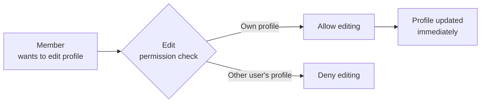

Profile management does not require moderator approval or verification.

### Community Creation and Ownership

Any member can create a new community with the following requirements:

1. **Community Creation**: Members can create a community by providing:
   - Unique community name
   - Description text
   - Icon image (optional)

2. **Ownership Assignment**: The member who creates a community becomes its owner

3. **Owner Authority**: Community owners have full administrative control including:
   - Adding and removing moderators
   - Deleting any post or comment in the community
   - Banning and unbanning users from the community
   - Managing community reports

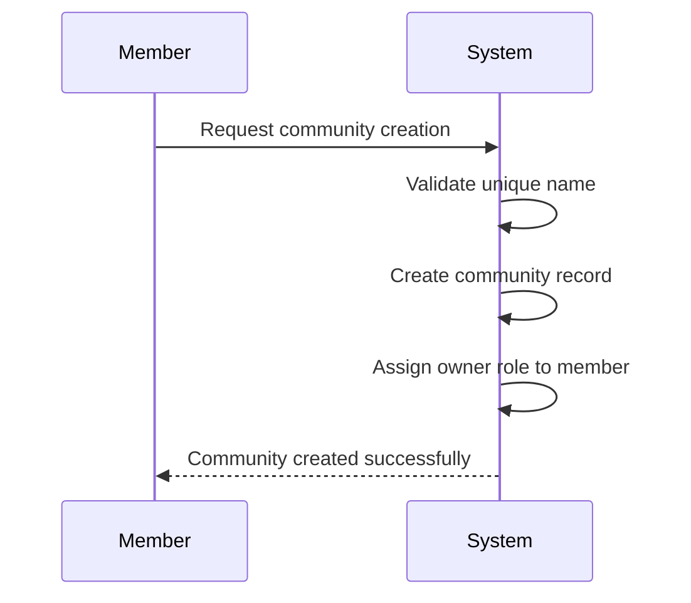

Once a community is created, the owner member automatically gains all moderator capabilities for that community. Ownership cannot be transferred to another user.

### Subscription-Based Posting Requirements

Members must subscribe to communities to create posts within them:

1. **Subscription Requirement**: Members can only create posts in communities they are subscribed to
2. **Subscription Process**: Members can subscribe to any community by choosing to subscribe
3. **Unsubscription**: Members can unsubscribe from communities they previously subscribed to
4. **Subscription Management**: Members can view a list of all their subscribed communities
5. **Posting Access**: Once subscribed, members can create posts of any type (text, link, image) in that community

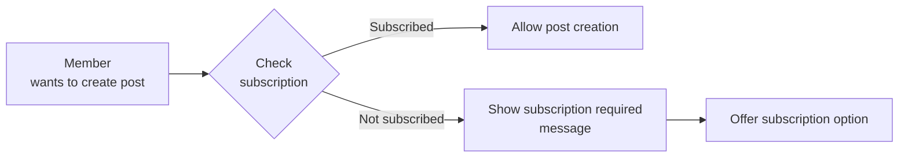

Subscription status determines access to the Home Feed, which only shows posts from subscribed communities.

### Post and Comment Voting

Members can vote on posts and comments to affect content visibility and karma scores:

1. **Voting Capability**: Members can upvote or downvote any post or comment
2. **Vote Limits**: Each member can vote only once per post or comment
3. **Vote Changes**: Members can change their vote from upvote to downvote or vice versa
4. **Vote Removal**: Members can remove their vote entirely
5. **Karma Impact**: When a member votes on another user's content:
   - Upvote increases the content creator's karma by 1
   - Downvote decreases the content creator's karma by 1
   - Vote removal adjusts karma accordingly

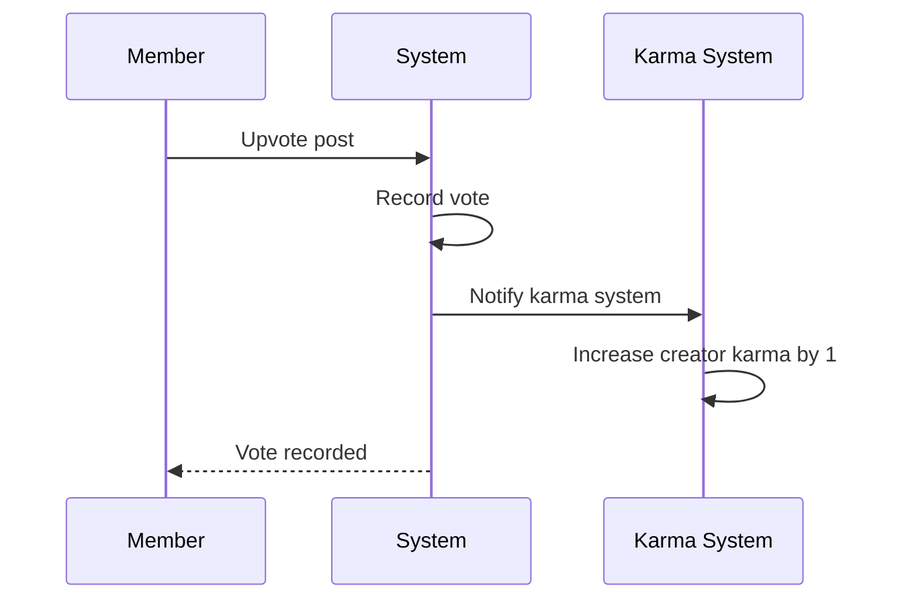

Votes affect both the visible score on content and the creator's overall karma score.

### Karma Score Impact

Members' voting actions directly impact other users' karma scores:

1. **Karma System**: Every user has a single karma score (can be positive or negative)
2. **Score Calculation**: Karma = total upvotes received - total downvotes received
3. **Impact Mechanism**:
   - When a member upvotes someone's post or comment, that person's karma increases by 1
   - When a member downvotes someone's post or comment, that person's karma decreases by 1
   - When a member removes their vote, the karma adjustment is reversed

4. **Karma Visibility**: Karma scores are publicly visible on user profiles
5. **No Self-Karma**: Members cannot affect their own karma through their own votes

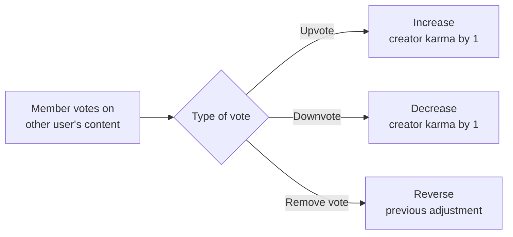

Karma serves as a reputation metric reflecting the community's assessment of a user's contributions.

### Content Creation and Editing

Members have full content creation and editing capabilities:

| Content Type | Creation Rights | Editing Rights | Deletion Rights |
|--------------|-----------------|----------------|-----------------|
| Post | Create in subscribed communities | Edit own posts | Delete own posts |
| Comment | Write on any post | Edit own comments | Delete own comments |
| Reply | Reply to any comment | Edit own replies | Delete own replies |

**Content Creation Rules**:
1. Posts require a title and must be one of three types: text, link, or image
2. Comments and replies contain text content only
3. There is no depth limit for comment replies

**Editing Rules**:
1. Members can edit their own content at any time
2. Edited content shows as updated to other users
3. There is no approval required for edits

**Deletion Rules**:
1. Members can delete their own content
2. Deleted content is removed from public view
3. Content deletion is immediate and irreversible

### Comment Reply Nesting

Members can participate in threaded discussions through comment replies:

1. **Reply Creation**: Members can reply to any comment on a post
2. **Nested Structure**: Replies can have replies, creating unlimited nesting depth
3. **Reply Management**: Members can edit and delete their own replies
4. **Thread Visibility**: All replies are visible within the comment thread

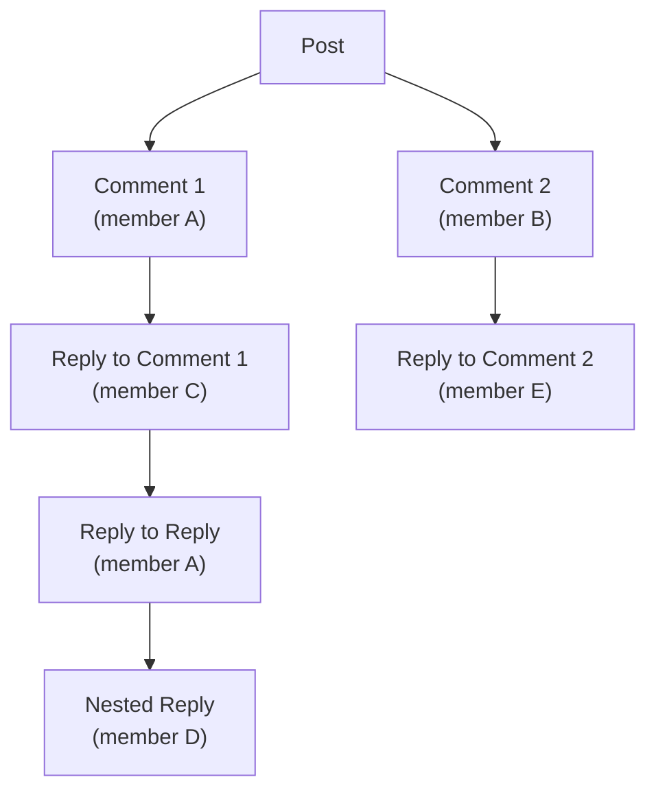

Comment replies follow the same voting and reporting rules as top-level comments. Members receive karma from votes on their replies just as they do from their original comments.

### Content Reporting with Reason

Members can report inappropriate content for moderator review:

1. **Reporting Authority**: Members can report any post or comment
2. **Reason Requirement**: When reporting, members must provide a reason text
3. **Report Visibility**: Reports are visible only to community moderators
4. **Multiple Reports**: Multiple members can report the same content

**Report Process**:
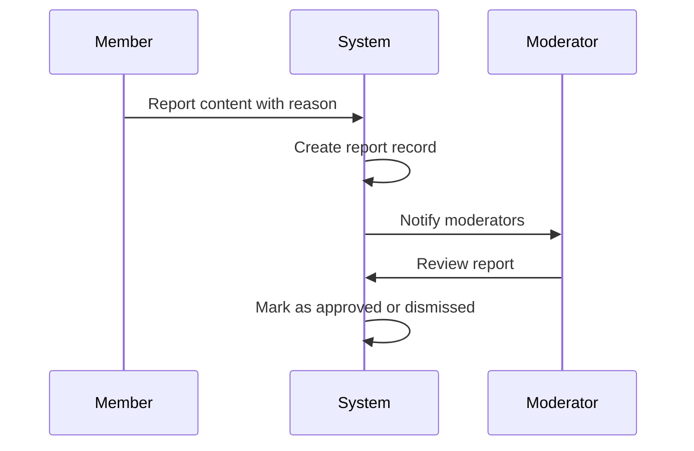

**Member Limits**:
- Members cannot report their own content
- Members cannot see reports made by other users
- Members are not notified of report resolution

Reports serve as the primary mechanism for community members to flag content that violates community standards.

### Account Password Management

Members have control over their account security through password management:

1. **Password Change**: Members can change their password at any time
2. **Change Process**: Password changes require:
   - Current password verification
   - New password entry
   - New password confirmation
3. **Security Effect**: After password change:
   - All existing sessions are invalidated
   - Member must log in with new password
   - Account access remains otherwise unchanged

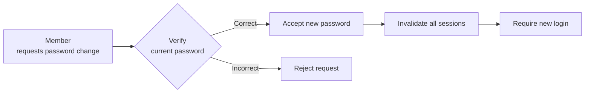

Password changes do not affect profile data, content, subscriptions, or karma score. Members cannot change passwords for other accounts.

### Account Deletion with Content Removal

Members can permanently delete their account, which removes all associated content:

1. **Account Deletion Request**: Members can initiate account deletion
2. **Deletion Confirmation**: System requires confirmation before proceeding
3. **Content Removal**: When account is deleted:
   - All posts created by the member are deleted
   - All comments written by the member are deleted
   - The member's profile is removed
   - All votes cast by the member are removed
   - Subscription records are deleted

4. **Community Impact**:
   - Communities owned by the member remain active
   - Ownership cannot be transferred; communities become orphaned
   - Moderator roles held by the member are removed

5. **Irreversibility**: Account deletion is permanent and cannot be undone

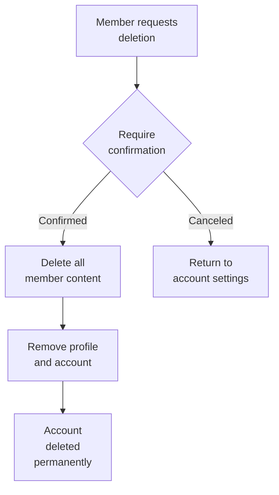

Karma scores from deleted accounts are removed from the platform, affecting overall community statistics.

### Home Feed Access for Subscribers

Members have access to a personalized Home Feed showing content from their subscribed communities:

1. **Feed Eligibility**: Only logged-in members can access the Home Feed
2. **Content Source**: Home Feed shows posts only from communities the member is subscribed to
3. **Sorting Options**: Home Feed supports the same sorting as public feeds:
   - Hot: recent posts with many upvotes
   - New: most recently created posts
   - Top: highest vote score (with time filters)
   - Controversial: many votes but score close to zero

4. **Feed Elements**: Each post in the Home Feed shows:
   - Title, author username, community name
   - Vote score, comment count, time since posted
   - Content preview (text/link/image specific)

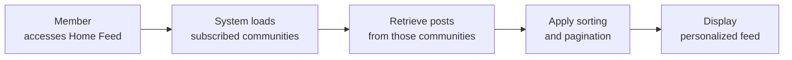

The Home Feed is the primary content discovery mechanism for members, tailored to their community subscriptions.

### Active Community Engagement

Members drive platform growth through active community engagement:

1. **Content Contribution**: Members create posts and comments that form the platform's content base
2. **Community Building**: Members create and populate communities with diverse content
3. **Quality Signaling**: Through voting, members signal content quality and relevance
4. **Community Health**: Through reporting, members help maintain community standards
5. **Network Effects**: Member subscriptions create personalized content networks

**Engagement Metrics**:
- Post creation frequency
- Comment participation
- Voting activity
- Community subscriptions
- Report submissions

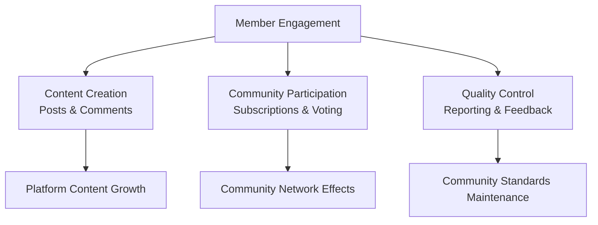

Member engagement directly correlates with platform vitality, content diversity, and community health.

## admin Actor

Admins are community owners and moderators who have elevated permissions within their assigned communities. The community creator automatically becomes the owner with highest authority over that community. Owners can add moderators to assist with community management and can remove any moderator they previously added. Moderators can add other moderators but cannot remove them - only owners can remove moderators. Neither moderators nor owners can remove the community owner role. Admins can delete any post or comment within their community regardless of who created it. They can ban users from their community, preventing them from creating posts or comments while still allowing content viewing. Admins can unban previously banned users and maintain a list of all banned users. They receive and review reports submitted by members, with ability to approve reports (deleting content) or dismiss reports (keeping content). Dismissed reports are removed from the review list. Admins ensure community quality and enforce content guidelines through their moderation actions.

### Community Owner Authority

The community owner is the user who created the community and holds the highest authority within that community. They have ultimate control over all administrative functions and cannot be removed from their owner role by any other user. The owner's authority is community-specific—they have elevated permissions only within the community they own, not across the entire platform. Their primary responsibilities include:

- Setting and enforcing community content guidelines
- Managing the moderator team through addition and removal
- Overseeing community moderation actions
- Final decision authority on content disputes and user restrictions

While owners have the same content removal and user management capabilities as moderators, their unique authority lies in moderator team management and the permanent, non-transferable nature of their role.

### Moderator Role Assignment

Moderator roles are assigned by existing administrators (owners or other moderators) to assist with community management. There are two distinct assignment workflows:

**Owner Assignment**
- The community owner can directly add any member as a moderator
- The owner can remove any moderator they previously added

**Moderator Assignment**
- Existing moderators can add other members as moderators
- Moderators cannot remove other moderators—only the owner has removal authority

All moderator assignments are recorded with the assigning user, timestamp, and specific community context. Moderators gain elevated permissions within their assigned community only, maintaining standard member permissions elsewhere on the platform.

### Owner-Moderator Hierarchy

The community administrative hierarchy consists of two distinct levels with clear authority boundaries:

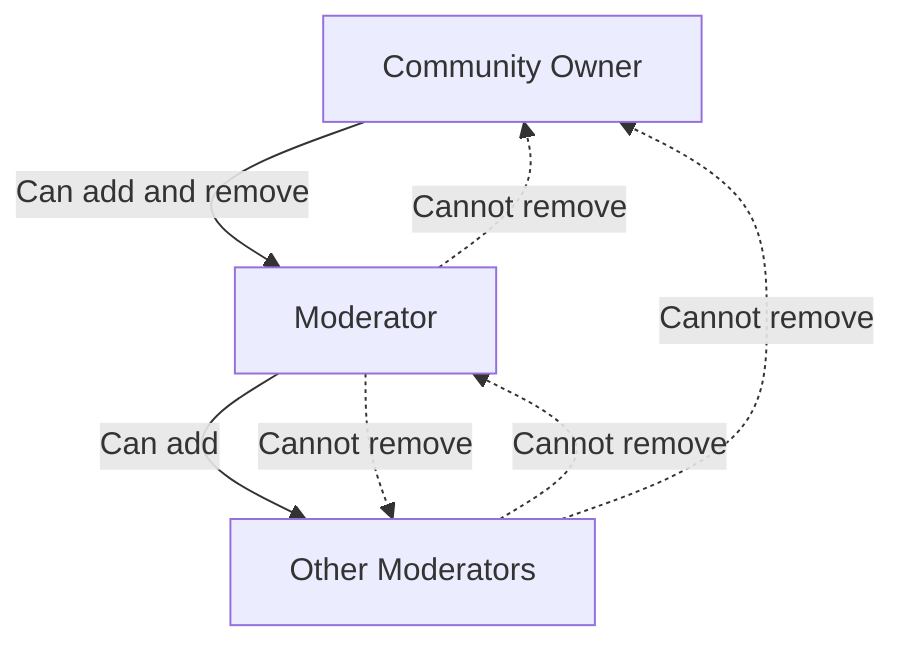

**Owner Authority**:
- Created automatically when establishing a community
- Permanent and non-removable by any user
- Full moderator management (add/remove)
- Full content and user management capabilities

**Moderator Authority**:
- Assigned by owner or other moderators
- Can be removed only by the owner who added them
- Can add other moderators
- Cannot remove other moderators or the owner
- Full content and user management within the community

This hierarchy ensures community stability while distributing moderation workload.

### Content Removal Permissions

Administrators (owners and moderators) have comprehensive content removal authority within their assigned communities:

**Post Removal**
- Administrators can delete any post in their community regardless of who created it
- Removal is permanent and cannot be undone by the original author
- Removed posts disappear from all feeds and community listings

**Comment Removal**
- Administrators can delete any comment on posts within their community
- Removed comments are permanently deleted from the conversation

**Content Removal Triggers**
Administrators may remove content when:
- It violates community content guidelines
- It is reported by members and approved during review
- It disrupts community quality or discussion

Administrators exercise judgment in content removal decisions, balancing community standards with member expression.

### User Banning Capabilities

Administrators can restrict user participation within their communities through the banning system:

**Banning Authority**
- Owners and moderators can ban any user from their community
- Bans prevent the user from creating posts or comments in that community
- Banned users retain read-only access to view community content

**Ban Implementation**
When banning a user, administrators:
- Provide a reason for the ban
- Record the ban with timestamp and issuing administrator
- Add the user to the community's banned users list

**Ban Duration**
Bans are indefinite by default but administrators may:
- Set temporary bans with expiration dates
- Manually lift bans through the unban process

Banned users receive notification of their restriction and the reason provided by the administrator.

### Ban List Management

Administrators maintain and manage the community's banned users list:

**Ban List Contents**
The ban list shows:
- Username of banned user
- Ban reason provided by administrator
- Date and time of ban
- Administrator who issued the ban
- Ban status (active/expired)
- Expiration date for temporary bans

**Ban List Management**
Administrators can:
- View the complete list of banned users
- Filter and search the ban list
- Review ban details and history
- Unban users by removing them from the list
- See which administrator issued each ban

**Access Control**
Only administrators of the community can view and manage its ban list. The list is not visible to regular members or users from other communities.

### Report Review Workflow

Administrators receive and process content reports submitted by community members:

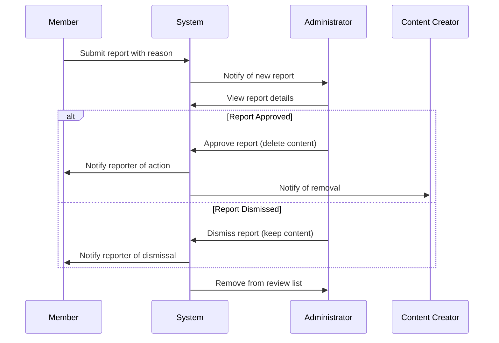

**Report Review Process**
1. Administrators view all pending reports for their community
2. Each report shows the reported content, reporting member, and reason
3. Administrators examine the content against community guidelines
4. Administrators make one of two decisions:
   - **Approve**: Delete the content and notify involved parties
   - **Dismiss**: Keep the content and notify the reporter
5. Processed reports are removed from the active review list

This workflow ensures timely response to community concerns while maintaining administrator discretion.

### Community Quality Enforcement

Administrators actively maintain community quality through systematic enforcement:

**Content Quality Standards**
Administrators ensure:
- Posts and comments adhere to community topic guidelines
- Discussions remain civil and respectful
- Spam and low-quality content are removed
- Community-specific rules are consistently applied

**Quality Enforcement Tools**
Administrators use:
- Content removal for guideline violations
- User bans for repeated or severe violations
- Report review to address member concerns
- Public or private warnings when appropriate

**Community Culture Development**
Administrators shape community culture by:
- Modeling positive interaction standards
- Encouraging constructive discussions
- Balancing free expression with community norms
- Addressing conflicts before they escalate

Quality enforcement is ongoing and adapts to community growth and changing dynamics.

### Moderator Addition Rights

Administrators can expand the moderation team through controlled addition processes:

**Owner Addition Rights**
- Community owners can add any platform member as a moderator
- Owner additions do not require approval from existing moderators
- Owners can add multiple moderators as community needs grow

**Moderator Addition Rights**
- Existing moderators can add other members as moderators
- Moderator additions help distribute team growth responsibilities
- New moderators gain the same permissions as existing moderators

**Addition Process**
When adding a moderator, administrators:
- Select the member from platform user listings
- Confirm the addition within the specific community context
- Record the addition with timestamp and assigning administrator
- The new moderator receives notification of their appointment

**Limitations**
- Administrators cannot add users who are already community moderators
- Administrators cannot add users who are banned from the community
- Additions are community-specific and don't affect other communities

### Moderator Removal Restrictions

Moderator removal follows strict hierarchical constraints to maintain community stability:

**Owner Removal Authority**
- Community owners can remove any moderator they previously added
- Owners can remove moderators added by other administrators
- Owner removal is immediate and requires no additional approval

**Moderator Removal Restrictions**
- Moderators cannot remove other moderators
- Moderators cannot remove the community owner
- Moderators have no authority over moderator team composition

**Removal Process**
When removing a moderator, owners:
- Select the moderator from the community's moderator list
- Confirm the removal decision
- Record the removal with timestamp and reason
- The removed moderator receives notification and loses all administrative permissions

**Protection Mechanisms**
- Removed moderators cannot immediately be re-added by other moderators
- Removal history is recorded for accountability
- The system prevents circular removal conflicts

These restrictions prevent moderator conflicts while preserving owner authority.

### Owner Role Protection

The community owner role has permanent protection mechanisms:

**Non-Removable Status**
- No user can remove the community owner from their role
- The owner role persists regardless of administrator changes
- The system prevents any removal attempts against the owner

**Role Permanence**
- Owner status is tied to community creation
- Ownership cannot be transferred to another user
- If the owner leaves the platform, the community retains its owner role (though inactive)

**Hierarchical Protection**
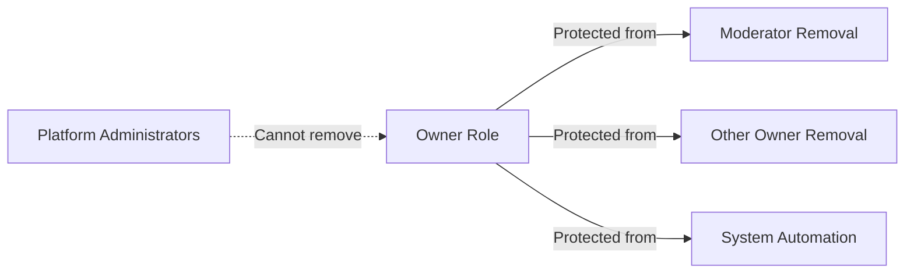

**Owner Authority Maintenance**
- Owners retain full moderator management rights despite protection
- Protection doesn't limit owner's ability to perform community administration
- The system ensures owner authority remains intact through all community changes

This protection guarantees community continuity and prevents hostile takeovers.

### Community-Specific Administration

Administrative authority is strictly confined to specific community boundaries:

**Community-Specific Permissions**
- Owners and moderators have elevated permissions only within their assigned community
- Outside their community, administrators function as regular members
- Administrative actions don't affect other communities

**Action Scope Limitations**
Administrators can only:
- Remove content posted within their community
- Ban users from their specific community
- Review reports about their community's content
- Manage moderators for their community

**Cross-Community Considerations**
- Being an administrator in one community doesn't grant privileges in others
- Users banned from one community can participate normally in others
- Content removal in one community doesn't affect identical content elsewhere

**Administration Interface**
The system provides community-specific administration tools that:
- Clearly indicate which community is being managed
- Filter content, users, and reports by community context
- Prevent accidental cross-community administrative actions

This scope limitation ensures administrators focus on their community's needs without platform-wide authority.

### Report Approval Actions

Administrators process member reports through formal approval actions:

**Approval Decision**
When administrators approve a report:
- The reported content (post or comment) is permanently deleted
- The content creator receives notification of the removal
- The reporter receives confirmation of action taken
- The report status changes from "pending" to "approved"

**Approval Considerations**
Administrators approve reports when:
- Content violates community guidelines
- Content disrupts community discussion quality
- The reported reason aligns with community standards
- Multiple reports indicate consensus about problematic content

**Approval Process**
1. Administrator reviews the reported content and reason
2. Administrator evaluates against community guidelines
3. Administrator selects "Approve" action
4. System executes content deletion and notifications
5. Report is removed from active review list

**Approval Authority**
Both owners and moderators can approve reports within their community. Approval decisions are final and cannot be reversed by other administrators.

### Report Dismissal Handling

Administrators handle reports they deem unfounded through dismissal actions:

**Dismissal Decision**
When administrators dismiss a report:
- The reported content remains unchanged and visible
- The reporter receives notification that the report was dismissed
- The report status changes from "pending" to "dismissed"
- No action is taken against the content creator

**Dismissal Considerations**
Administrators dismiss reports when:
- Content doesn't violate community guidelines
- The report appears to be frivolous or malicious
- Content falls within acceptable discussion boundaries
- The reported reason doesn't justify content removal

**Dismissal Process**
1. Administrator reviews the reported content and reason
2. Administrator determines content doesn't require action
3. Administrator selects "Dismiss" action
4. System updates report status and notifies reporter
5. Report is removed from active review list

**Dismissal Authority**
Both owners and moderators can dismiss reports within their community. Dismissal decisions don't prevent future reports about the same content.

### Content Guideline Enforcement

Administrators systematically enforce community content guidelines:

**Guideline Establishment**
- Community owners establish initial content guidelines during community creation
- Guidelines define acceptable topics, tone, and content standards
- Administrators may update guidelines as community evolves

**Enforcement Mechanisms**
Administrators enforce guidelines through:
- **Preventive measures**: Clear guideline publication and member education
- **Reactive measures**: Content removal for guideline violations
- **Corrective measures**: User restrictions for repeated violations
- **Educational measures**: Explanations of guideline applications

**Consistent Application**
Administrators ensure:
- Guidelines are applied uniformly to all members
- Similar violations receive similar consequences
- Enforcement decisions can be explained by guideline references
- Members understand why specific content was removed

**Guideline Evolution**
As communities grow, administrators may:
- Refine guidelines based on community feedback
- Address new types of content or behaviors
- Balance guideline enforcement with community culture
- Document guideline changes for member awareness

Effective enforcement maintains community quality while respecting member expression.

### Community Management Tools

The system provides comprehensive community management tools for administrators:

**Content Management Tools**
- **Post Management**: View, filter, and remove community posts
- **Comment Management**: Review and delete comments across posts
- **Bulk Actions**: Process multiple content items simultaneously

**User Management Tools**
- **Member Directory**: Browse community members with activity metrics
- **Ban Management**: Issue, review, and lift user bans
- **Moderator Management**: Add and remove moderator team members

**Report Management Tools**
- **Report Queue**: Prioritized list of pending reports
- **Report History**: Archive of processed reports with decisions
- **Reporting Analytics**: Patterns in report types and frequencies

**Community Analytics Tools**
- **Activity Metrics**: Post volume, comment counts, member engagement
- **Growth Statistics**: Subscriber trends, new member rates
- **Quality Indicators**: Report frequency, content removal rates

**Administration Interface**
Tools are accessible through a dedicated administration section that:
- Clearly separates administrative functions from regular browsing
- Provides quick access to urgent items (new reports, recent violations)
- Offers search and filtering for efficient management
- Maintains audit trails of all administrative actions

These tools empower administrators to effectively maintain community quality.

### User Restriction Management

Administrators manage user participation restrictions through structured systems:

**Restriction Types**
- **Content Creation Bans**: Prevent posting and commenting while allowing reading
- **Temporary Restrictions**: Time-limited participation limits
- **Warning Systems**: Formal notifications before restriction escalation

**Restriction Implementation**
When restricting users, administrators:
- Document the reason for restriction
- Specify restriction duration (if temporary)
- Notify the user of the restriction and reason
- Record the restriction in the user's community history

**Restriction Management**
Administrators can:
- Review all active restrictions
- Modify restriction duration or terms
- Lift restrictions early when appropriate
- Track restriction effectiveness and user behavior changes

**Restriction Escalation**
For repeated violations, administrators may:
- Increase restriction severity
- Extend restriction duration
- Combine multiple restriction types
- Consider permanent bans for severe cases

**Fair Restriction Practices**
Administrators ensure restrictions are:
- Proportional to the violation
- Consistently applied across similar cases
- Communicated clearly to affected users
- Subject to review and adjustment

Effective restriction management maintains community standards while offering redemption opportunities.

### Moderation Authority Boundaries

Administrative authority has clearly defined boundaries within the community context:

**Hierarchical Boundaries**
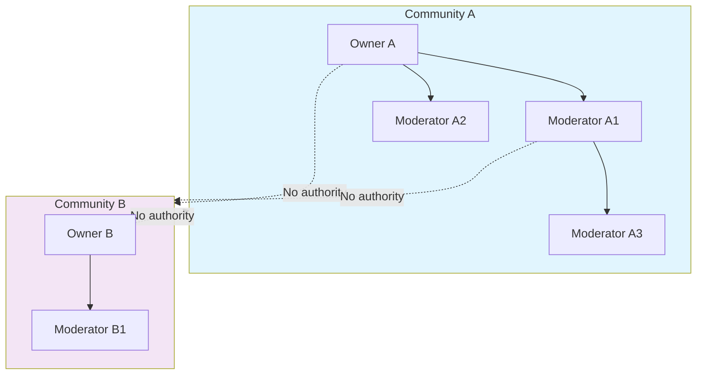

**Authority Limitations**
Administrators cannot:
- Affect content or users in other communities
- Override platform-wide rules or policies
- Access private member data beyond community context
- Perform actions outside their assigned community

**Action Validation**
The system validates all administrative actions against:
- Community assignment of the administrator
- Hierarchical permissions (owner vs moderator)
- Existing restrictions or conflicts
- Platform policy compliance

**Boundary Enforcement**
Technical safeguards ensure:
- Administrative interfaces filter by community context
- Cross-community actions are prevented
- Permission checks occur before action execution
- Audit logs record community context for all actions

These boundaries prevent authority overreach while enabling effective community management.

# Authentication Flows

Registration, login, logout, and session management from a user perspective.

## Registration and Login

Define user registration and login flows including validation and error handling.

### Registration and Login Flows

### User Registration

Users can register for an account by providing:

- Email address (required, must be unique)
- Password (required)
- Username (required, must be unique)

**Registration Flow:**
1. User enters email, password, and username
2. System validates uniqueness of email and username
3. If email or username already exists, the registration is rejected
4. Upon successful validation, system creates a new account with:
   - Default display name (same as username initially)
   - Empty bio text
   - Default avatar image
   - Zero karma score
   - Account status set to active
5. User is automatically logged in after successful registration

### Login Process

Users can log in to the platform by providing:

- Email address (must match a registered account)
- Password (must match the account's stored password)

**Login Flow:**
1. User enters email and password
2. System verifies the email exists in the system
3. System verifies the password matches the stored password
4. If email doesn't exist or password doesn't match, login is rejected
5. Upon successful verification, the system:
   - Creates a user session
   - Grants access to member-only features
   - Redirects user to their home feed

### Authentication Requirements

**Email Validation:**
- Email address must follow standard email format (contains '@' and domain)
- Email must be unique across all accounts

**Password Requirements:**
- Password must be provided during registration and login
- System stores password securely (password hashing)
- System does not expose password requirements in this section (see business rules for specific constraints)

**Username Validation:**
- Username must be unique across all accounts
- Username must be provided during registration

**Authentication States:**
1. **Unauthenticated (Guest):** User has no active session, can only access public content
2. **Authenticated (Member):** User has valid session, can access all member features
3. **Session Management:** System maintains session state until user logs out or session expires

**Error Conditions:**
- If registration email already exists, the request is rejected
- If registration username already exists, the request is rejected
- If login email doesn't exist, the request is rejected
- If login password doesn't match, the request is rejected
- If user account is deleted, the request is rejected

**Success Outcomes:**
- Successful registration creates a new user account and automatically logs in the user
- Successful login creates a new session and grants member access privileges

## Session and Logout

Define session behavior and logout from a user perspective.

### Session Management

## Session Management

### Session Establishment and Duration

- When a user successfully authenticates with valid email and password, the system establishes a user session
- The session remains active and allows the user to access member-only features until explicitly terminated or expires
- Session expiration policies are determined by system configuration

### Session-Based Authentication

- All subsequent requests after login must include the active session identifier
- The session identifier grants access to member-only functionality
- Without a valid session, users can only access public content available to guests

### Session Validation

- The system validates the session identifier on every request that requires authentication
- If the session is invalid, expired, or terminated, the system denies access to member features
- Invalid sessions result in automatic logout from the user's perspective

### User Logout

## User Logout

### Manual Logout

- Users can manually terminate their current session by selecting the logout option
- When users choose to logout, the system immediately invalidates the current session
- After logout, users are redirected to the public home page and can only access guest-level features

### Logout Confirmation

- The system may optionally confirm logout action before proceeding
- After successful logout, users receive visual confirmation that they are no longer logged in

### Logout Behavior

- Logout affects only the current session - other sessions on different devices remain active
- Users must authenticate again to regain access to member features after logging out

### Account Security and Session Protection

## Account Security and Session Protection

### Concurrent Session Management

- Users can have multiple active sessions across different devices
- Each device maintains its own independent session
- Session management does not automatically terminate other sessions when logging out from one device

### Session Security Considerations

- Users are responsible for protecting their session credentials
- If users suspect unauthorized access, they can change their password (which may invalidate existing sessions)
- Account deletion terminates all active sessions immediately

### Security Recommendations

- Users should logout from shared or public devices after use
- Users should not share session credentials with others
- Regular password changes are recommended for maintaining account security

# Account Lifecycle

Account creation, deletion, and password management.

## Account Management

Define how users create accounts, delete accounts, and change passwords.

### Account Creation

### Account Creation

1. **Email-based registration**
   - Users register with an email address that must not already exist in the system
   - Users provide a password that meets basic security requirements (minimum length, complexity not specified)
   - Users must choose a unique username not already used by another active user

2. **Registration constraints**
   - Each email address can only be associated with one active account
   - Each username must be unique across all active accounts
   - The system prevents registration with duplicate email addresses or usernames

3. **Account status**
   - Upon successful registration, the account is set to "active" status
   - The user is automatically logged in after account creation
   - A default profile is created with empty display name, bio, and avatar

4. **Error handling**
   - If the email already exists, registration fails
   - If the username already exists, registration fails
   - If required fields are missing, registration fails

### Account Deletion

### Account Deletion

1. **User-initiated deletion**
   - Only account owners can request deletion of their own account
   - Account deletion is permanent and cannot be undone
   - Deletion removes all user-associated data according to data retention policies

2. **Data removal scope**
   - All posts created by the user are deleted
   - All comments written by the user are deleted
   - The user's profile information (display name, bio, avatar) is deleted
   - All votes cast by the user are removed from the system
   - All subscriptions to communities are canceled
   - All karma records associated with the user are deleted
   - All moderation roles held by the user are revoked
   - All bans issued by the user are reassigned to the system administrator
   - All reports submitted by the user are kept but marked as submitted by "deleted user"

3. **Community impact**
   - Communities created by the user are reassigned to a system administrator
   - The user's name is removed from all community subscriber lists

4. **Execution flow**
   - Deletion requires the user to be logged in
   - The system should confirm deletion with the user before proceeding
   - After successful deletion, the user is logged out and redirected to the home page

### Password Change

### Password Change

1. **Change requirements**
   - Users must be logged in to change their password
   - Users must provide their current password for verification
   - The new password must be different from the current password
   - The new password must meet basic security requirements (minimum length, complexity not specified)

2. **Security considerations**
   - Password changes invalidate all existing sessions for the user except the current one
   - The system should confirm the new password by requiring it to be entered twice
   - After successful password change, the user remains logged in

3. **Error handling**
   - If the current password is incorrect, the change fails
   - If the new password does not meet requirements, the change fails
   - If the new password is the same as the current password, the change fails
   - If the user is not logged in, the change fails

4. **Session management**
   - All other active sessions for the user are terminated when password changes
   - The current session remains active to prevent user inconvenience
   - Users receive notification that their password has been changed