**communityPlatform — Business concepts, relationships, and states from user perspective**

Business concepts, relationships, and states from user perspective

# Domain Concepts

Describe what each concept means in the business domain and its key attributes.

## User Concept

A User represents an individual account holder in the community platform who can participate in discussions and content creation. Each user has a unique username that serves as their public identifier across the platform. The user provides an email address for authentication purposes, which remains private and is used for account recovery and notifications. Users create a password that secures their account and enables login functionality. Every user account is associated with a Profile that contains public-facing information like display name and biography. Users can create communities, posts, and comments based on their permissions and subscription status. The system tracks user karma score based on community voting activity. Users have ownership over their content and can manage their account settings and profile information.

### User Identity and Account Holder

A User is an individual account holder within the community platform who can participate in discussions, create content, and interact with other users. Each User represents a distinct human participant with their own identity and preferences.

Every User account has a unique username that serves as their primary public identifier across the platform. This username appears next to all their content and is how other users recognize them. Once chosen during registration, the username cannot be changed by the user.

The User's account maintains ownership over all content they create, including posts, comments, and any communities they establish. This ownership relationship allows Users to edit or delete their own content and manage their communities.

### Authentication Credentials

Users authenticate to the platform using an email address and password combination. The email address serves as the primary login credential and is also used for account recovery and system notifications. Email addresses must be unique across all User accounts to prevent duplicate registrations.

The password provides security for the User's account and must meet minimum complexity requirements to protect against unauthorized access. Users can change their password at any time through their account settings, and password changes require verification of the current password.

Together, the email address and password form the complete authentication mechanism that verifies a User's identity and grants access to platform features.

### Profile Association

Each User has exactly one Profile associated with their account. The Profile contains public-facing information that represents the User's identity to other platform participants. While the User account handles authentication and ownership, the Profile handles presentation and personal expression.

The Profile includes a display name that appears prominently alongside the User's username, a biography text where Users can describe themselves, and an avatar image that provides visual representation. Users can edit their Profile information at any time to update how they appear to others.

The relationship between User and Profile is one-to-one and permanent—when a User account is deleted, the associated Profile is also removed.

### Karma Tracking System

Every User has a single karma score that represents their reputation within the community platform. Karma is a numerical value that increases or decreases based on how other Users vote on the User's content.

The karma system tracks voting activity on both posts and comments created by the User. When another User upvotes content created by a User, that User's karma increases by one point. When another User downvotes content created by a User, that User's karma decreases by one point. If a vote is removed, the karma adjustment is reversed.

Karma can be positive or negative, and there is no upper or lower limit to the score. The current karma total is displayed on the User's Profile page and serves as a visible indicator of their contribution quality and community standing.

### Content Creation Capabilities

Users have several content creation capabilities based on their participation level:

1. **Community Creation**: Any User can create a new community, becoming its owner with full administrative privileges.
2. **Post Creation**: Users can create posts within communities they have subscribed to. Posts can be text-based, link-based, or image-based depending on the User's intent.
3. **Comment Creation**: Users can write comments on any post and reply to existing comments, enabling threaded discussions.
4. **Voting**: Users can upvote or downvote posts and comments to express approval or disapproval.
5. **Reporting**: Users can report content that violates community guidelines.

These capabilities allow Users to actively participate in the platform's social ecosystem and contribute to community discussions.

### Community Participation

Users participate in communities through several mechanisms:

**Subscriptions**: Users can subscribe to communities to express interest and gain posting privileges. Subscribed communities appear in the User's home feed.

**Posting**: Once subscribed to a community, Users can create posts within that community following the community's content guidelines.

**Commenting**: Users can comment on any post in any community, regardless of subscription status.

**Voting**: Users can vote on posts and comments throughout the platform to influence content visibility and author karma.

**Moderation**: Users who create communities become owners, and owners can appoint other Users as moderators to help manage community content.

The degree of a User's community participation influences their experience, with subscribed communities providing more personalized content and posting opportunities.

## Profile Concept

A Profile represents the public-facing identity information for a user that other community members can view. Each user has exactly one profile that displays their chosen public identity elements. The profile includes a display name which may differ from the user's unique username and provides a more personalized identifier. A biography text field allows users to share information about themselves, interests, or background. An avatar image serves as a visual representation of the user across the platform, appearing next to their posts and comments. Profiles are always visible to other users regardless of privacy settings, fostering community transparency. The profile also displays the user's accumulated karma score as a measure of their community contribution. Profile information helps other users understand who is participating in discussions and creating content.

### Public-Facing Identity

A profile serves as the public-facing identity of a user within the community platform. Unlike the private account credentials used for authentication, the profile represents how a user appears to others during community interactions. This identity includes personalized elements that distinguish one user from another and fosters recognition across posts, comments, and community participation. All users have exactly one profile associated with their account, which becomes their public persona throughout the platform.

### Display Name Personalization

The display name allows users to personalize their public identity. While the username serves as a unique technical identifier for login and system operations, the display name provides a more human-readable, friendly name that appears to other community members. Users can choose a display name that may differ from their username, enabling them to present themselves in a way that feels authentic or appropriate for the community context. The display name appears on the user's profile page, next to their posts and comments, and in any user lists or mentions.

### Biography Text Description

The biography text field enables users to share information about themselves with the community. This optional text description allows users to provide context about their interests, background, expertise, or anything else they wish to share. The biography appears on the user's profile page where other members can read it to better understand the person behind the posts and comments. Users can edit their biography at any time to reflect current interests or updates.

### Avatar Image Visual Representation

The avatar image serves as a visual representation of the user across the platform. This image appears next to the user's display name on their profile page, alongside their posts and comments, and in any user interface elements where users are referenced. The avatar helps other community members quickly recognize and identify the user in discussions. Users can upload or change their avatar image to choose a visual identity that represents them.

### Karma Score Display

The user's total karma score is displayed on their profile page as part of their public identity. Karma represents a numerical measure of the user's contributions to the community, calculated from the net votes received on their posts and comments. This single aggregated number provides a public indication of community standing and contribution quality. The karma score appears alongside other profile information, allowing others to see at a glance the user's reputation within the platform.

### Community Transparency

Profile visibility supports community transparency by making user identities known to others. When users participate in discussions, create content, or interact with others, their profile information (display name, avatar, and karma) is visible to all community members. This transparency helps establish accountability, encourages constructive participation, and fosters a sense of community by putting faces (via avatars) and context (via biographies) to usernames. Knowing who is behind content contributes to more meaningful interactions.

### User Identity Elements

A profile comprises several identity elements that together create a complete public persona:

1. **Display Name** - The primary name others see
2. **Biography** - Contextual information about the user
3. **Avatar Image** - Visual representation
4. **Karma Score** - Community contribution metric

These elements work together to present a coherent identity that others can recognize across different contexts within the platform. The combination of these elements helps users establish their presence and reputation within the community ecosystem.

### Profile Visibility Policy

User profiles are always visible to all platform users, regardless of their relationship to the profile owner. This includes:

- **Logged-in members** can view any user's profile
- **Logged-out guests** can view any user's profile
- Profile information appears alongside posts and comments
- Profile pages are accessible via direct links
- No privacy settings exist to hide profile information

This universal visibility supports the platform's community-oriented nature, where understanding who is contributing content enhances the quality of discussions and interactions.

## Community Concept

A Community represents a dedicated discussion space focused on a specific topic or interest within the larger platform. Each community has a unique name that distinguishes it from all other communities and serves as its primary identifier. A description text field provides context about the community's purpose, rules, and topical focus. An icon image visually represents the community across the platform interfaces. Communities have an owner who created them and maintains ultimate authority over community management. The community tracks its subscriber count, indicating how many users have chosen to follow and participate in that space. Communities serve as containers for posts, organizing discussions into topical groupings. Each community operates as a semi-autonomous space with its own moderation structure and membership.

### Community as Dedicated Discussion Space

A Community represents a dedicated discussion space focused on a specific topic, interest, or theme within the platform. Each community serves as a self-contained environment where users gather to share and discuss content related to a common subject. Communities provide topic-focused grouping of conversations, allowing users to find and participate in discussions aligned with their interests.

Communities enable the organization of platform content into logical categories, making it easier for users to discover relevant posts and engage with like-minded individuals. The community structure creates distinct sub-communities within the larger platform ecosystem, each with its own identity, culture, and membership.

The dedicated nature of each community means discussions should remain relevant to the community's stated purpose and topic focus. Users can join multiple communities to participate in various topics of interest while maintaining a coherent experience within each individual community.

### Community Identity Attributes

Each community is identified by three primary attributes that define its public identity:

**Unique Name**
Every community has a unique name that serves as its primary identifier across the platform. The name must be distinct from all other community names and cannot be duplicated. The community name appears in URLs, user interfaces, and when referencing the community in feeds and discussions.

**Description Text**
The description provides contextual information about the community's purpose, rules, topical focus, and guidelines for participation. This text helps users understand what content is appropriate for the community and what discussions are expected. The description is visible to all users viewing the community.

**Icon Image**
The icon serves as a visual representation of the community across the platform interface. It appears next to the community name in feeds, post headers, subscription lists, and community directories. The icon helps users quickly identify and recognize communities they follow or interact with regularly.

These three attributes together create the community's public identity and help users understand what each community represents before deciding to subscribe or participate.

### Community Ownership Structure

**Community Creator as Owner**
The user who creates a community becomes its owner. The owner has ultimate authority over all aspects of community management and moderation. The owner role cannot be transferred to another user once assigned and persists for the lifetime of the community.

**Owner Authority**
The community owner maintains highest-level privileges, including:
- Adding other users as moderators
- Removing moderators from their positions
- Managing community settings and attributes
- Performing all moderator actions (deleting posts, banning users, etc.)
- The owner cannot be removed from their position by any other user

**Moderator Roles**
The owner can appoint other users as moderators to assist with community management. Moderators have authority to:
- Delete posts and comments within the community
- Ban users from the community
- Unban previously banned users
- View reports submitted against community content
- Approve or dismiss reports

**Moderator Management**
Moderators can appoint other moderators (with owner approval), but cannot remove other moderators. Only the community owner can remove moderators from their positions. This hierarchical structure ensures clear accountability and prevents conflicts within the moderation team.

### Community Membership and Content

**Subscriber Count Tracking**
The system tracks the number of users who have subscribed to each community. This subscriber count serves as a public metric of community popularity and engagement level. The count is displayed alongside the community name in directories, search results, and community pages. Subscriber count updates in real-time as users subscribe or unsubscribe.

**Post Container Function**
Each community acts as a container for posts, organizing discussions into topical groupings. All posts created by users are associated with exactly one community. This association determines where the post appears in feeds and who can view it. Posts inherit the community's identity when displayed across the platform.

**Subscription Requirement for Post Creation**
Users must be subscribed to a community before they can create posts within it. This requirement ensures users have some level of engagement with the community before contributing content. Subscription establishes a connection between the user and community that authorizes post creation.

**Community Feeds**
Users can view posts from a specific community through the community feed, which shows all posts belonging to that community regardless of the viewer's subscription status. This allows both subscribers and non-subscribers to browse community content.

## Post Concept

A Post represents a content submission within a community that initiates discussion or shares information. Every post requires a title that succinctly describes its content and serves as the primary identifier in lists. Posts exist in one of three content types: text posts contain written content, link posts reference external URLs, and image posts feature uploaded visual content. Each post belongs to exactly one community where it appears in that community's feed. Posts have an author who created them and maintains ownership over the content. The vote score represents community sentiment through upvotes and downvotes from other users. Comment count tracks engagement by measuring responses to the post content. Posts have a creation timestamp indicating when they were published to the community.

### Post Definition and Purpose

A Post represents a content submission within a community that initiates discussion or shares information. Posts are the primary unit of content in the platform where users express ideas, share links, or upload images for community engagement. Each post serves as a conversation starter that can receive comments and votes from other community members.

Posts exist to:
- Share information, opinions, or questions within a community
- Initiate discussions that generate comments
- Receive community feedback through voting
- Organize content within topic-specific communities

A post is fundamentally a submission of content by a user to a specific community for the purpose of sharing and discussion.

### Title Requirement

Every post must have a title that succinctly describes its content and serves as the primary identifier in post lists. The title:
- Is required for all posts
- Appears prominently in feed displays
- Helps users quickly understand the post's topic
- Must be provided by the author during post creation

The title serves as the main identifying element when posts appear in feeds, allowing users to scan and identify interesting content without viewing the full post details.

### Content Types

A post must be one of three distinct content types:

**Text Post**: Contains written content in text form. Text posts are used for sharing thoughts, asking questions, or providing detailed explanations without external references.

**Link Post**: Contains a URL to external content. Link posts direct users to content outside the platform, such as articles, videos, or other websites, while providing a discussion context within the community.

**Image Post**: Contains an uploaded image file. Image posts share visual content for viewing and discussion within the community.

Each post type serves different communication purposes while maintaining the same structural role in the platform.

### Community Membership

Each post belongs to exactly one community where it appears in that community's feed. The community:
- Determines where the post is visible
- Provides context for the post's content
- Establishes the audience for the post
- Must be specified when creating the post

Posts are intrinsically tied to their community and cannot exist independently of community membership. This relationship ensures content is organized within appropriate discussion spaces.

### Author Ownership

Each post has an author who created it and maintains ownership over the content. The author:
- Is the user who originally submitted the post
- Has the right to edit or delete their own posts
- Is credited whenever the post is displayed
- Receives karma adjustments based on votes on their posts

Author ownership establishes accountability and attribution for content submitted to the platform.

### Vote Score as Community Sentiment

The vote score represents community sentiment through upvotes and downvotes from other users. This score:
- Is calculated as the difference between total upvotes and total downvotes
- Provides immediate feedback about community reception
- Can be positive (more upvotes), negative (more downvotes), or zero (balanced votes)
- Directly affects the author's karma score

The vote score serves as a visible indicator of how the community perceives the quality or relevance of the post content.

### Comment Count as Engagement Metric

The comment count tracks engagement by measuring responses to the post content. This metric:
- Shows the total number of comments on a post
- Indicates the level of discussion generated
- Helps users identify active conversations
- Is displayed alongside posts in feeds

The comment count provides a quick indicator of how much discussion a post has generated, helping users identify popular or controversial topics.

### Creation Timestamp

Posts have a creation timestamp indicating when they were published to the community. This timestamp:
- Records the exact date and time of post submission
- Determines sorting in "New" feed views
- Is displayed to users as relative time (e.g., "3 hours ago")
- Cannot be modified after creation

The creation timestamp establishes a temporal context for posts, allowing users to understand when content was shared and enabling time-based filtering and sorting.

### Post Relationships Diagram

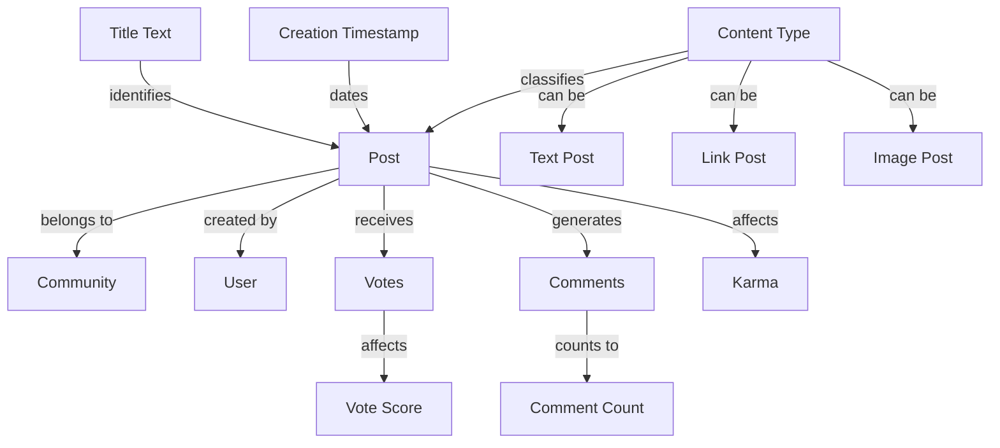

The diagram illustrates how a Post relates to other business concepts:
- Belongs to exactly one Community for organizational context
- Created by one User who maintains authorship
- Receives Votes from community members, affecting the vote score
- Generates Comments that contribute to engagement metrics
- Affects the author's Karma based on vote outcomes
- Is identified by its Title Text in displays
- Classified by Content Type (text, link, or image)
- Dated by its Creation Timestamp for temporal context

## Comment Concept

A Comment represents a response to either a post or another comment, forming threaded discussions within the platform. Comments contain text content that contributes to ongoing conversations and community dialogue. Each comment has an author who wrote it and maintains ownership over the response content. Comments can reply to posts directly or nest within other comments, creating hierarchical conversation threads. The vote score reflects community approval or disagreement with the comment's content through upvotes and downvotes. Comments include a creation timestamp indicating when they were published within the discussion. Threaded comments enable multi-level conversations where users can respond to specific points within larger discussions. Comments appear in context with their parent post or comment, maintaining conversation flow.

### Comment as Response to Content

A Comment represents a user's response to content published on the platform. Comments can be responses to posts, enabling discussion around published submissions. Comments can also be responses to other comments, creating conversation threads within larger discussions. Each comment expresses a user's perspective, feedback, or contribution to ongoing community dialogue. Comments are the primary mechanism for users to engage with content and other community members.

The response nature of comments means they always exist in context of another piece of content. A comment without a parent post or comment cannot exist. Responses maintain connection to their parent content, allowing users to follow discussion threads from original content through responses.

### Text Content for Discussion

Comments contain text content that users write to participate in discussions. The text content represents the user's thoughts, opinions, questions, or feedback expressed through written language. Text content enables asynchronous written conversations where users exchange ideas over time. Comments support the platform's core purpose of facilitating community dialogue and knowledge sharing through text-based communication.

Text content in comments is visible to other users who can read and respond to it. The content contributes to ongoing discussions by adding new perspectives or information. Users can express complex ideas through written text, enabling detailed conversations beyond simple reactions. Text content forms the substance of community discussions and relationship-building.

### Author Ownership and Responsibility

Each comment has an author who created and owns the text content. The author maintains control over their comment content and can modify or remove it. Author ownership establishes accountability for comment content within the community. Users are responsible for the content they contribute through comments.

The author's identity is associated with their comment content, allowing other users to recognize who contributed which ideas. This association enables reputation building and community recognition based on comment quality and frequency. Author ownership includes the right to edit comment content to correct errors or clarify meaning. Authors bear responsibility for ensuring their comments comply with community guidelines and platform policies.

### Reply Hierarchy Structure

Comments can reply to other comments, creating a hierarchical structure of responses. Replies create parent-child relationships where a comment responds directly to another comment. The hierarchy organizes conversations by topic and relevance, grouping related responses together. Users can navigate reply hierarchies to follow specific discussion threads within larger conversations.

Reply hierarchy depth has no technical limit, allowing conversations to extend through multiple levels of response. Each reply maintains connection to its parent comment, preserving conversation context. The hierarchy enables users to respond specifically to points within ongoing discussions rather than only to the original post. Hierarchical organization helps users understand which comments respond to which previous statements.

### Threaded Conversation Organization

Comments organize into threaded conversations where multiple discussion paths branch from original content. Threads represent independent discussion lines that users can follow separately. Threaded conversations allow parallel discussions to occur simultaneously within the same comment section. Users can participate in multiple threads without disrupting other ongoing conversations.

Thread organization emerges from the reply hierarchy structure, with each top-level comment potentially starting a new thread. Threads can diverge into subtopics while maintaining connection to the original post. The threaded nature supports complex discussions where users explore multiple aspects of a topic. Thread organization helps users find discussions relevant to their interests within larger comment sections.

### Vote Score as Community Sentiment Reflection

Each comment has a vote score that reflects community sentiment about its content. The vote score represents the net difference between upvotes and downvotes received. A positive score indicates more users found the comment valuable or agreeable. A negative score indicates more users disagreed with or disapproved of the comment.

The vote score provides visible feedback to comment authors about how the community perceives their contribution. Other users can use vote scores to identify high-quality comments within discussions. Vote scores help surface valuable contributions while indicating problematic content. The score serves as a community-driven quality indicator without moderator intervention.

### Creation Timestamp for Chronology

Each comment records when it was created through a creation timestamp. The timestamp establishes when the comment was published within the discussion. Chronological ordering based on creation time helps users follow discussion flow over time. Timestamps enable sorting comments by age to see most recent contributions first.

The creation timestamp provides context for understanding discussion evolution and response timing. Users can see how conversations develop over hours, days, or weeks. Timestamps help identify which comments responded to which previous statements based on timing. The chronological record supports understanding of discussion patterns and community engagement timing.

### Multi-Level Discussion Support

Comments support multi-level discussions through unlimited reply nesting. Multi-level discussions enable deep conversations where users can respond to responses, creating detailed exploration of topics. Each reply level allows more specific focus on particular aspects of the conversation. Multi-level structure organizes complex discussions into manageable segments.

Users can participate at any discussion level, choosing whether to respond to the original post or specific comments within threads. Multi-level discussions accommodate different conversation styles, from broad overviews to detailed technical debates. The structure supports both linear conversations and branching discussions with multiple simultaneous threads. Multi-level capability enables rich, nuanced community dialogue beyond simple question-and-answer formats.

## Vote Concept

A Vote represents a user's expression of approval or disapproval toward either a post or a comment within the community. Votes come in two types: upvotes indicate positive sentiment and support for the content, while downvotes indicate negative sentiment or disagreement. Each vote is cast by a specific user who maintains the ability to change or retract their expression. Votes target either posts or comments, applying the same voting mechanism to both content types. The system enforces that each user can cast only one vote per target item, preventing manipulation through multiple votes. Votes directly influence the visible score of content items, which displays the net difference between upvotes and downvotes. Voting serves as the primary mechanism for community feedback and content quality signaling.

### Vote Types

A Vote represents a user's expression of approval or disapproval toward content.

### Expression Types

- **Upvote**: An expression of approval or positive sentiment toward a post or comment
- **Downvote**: An expression of disapproval or negative sentiment toward a post or comment

### Vote Characteristics

- Each vote is cast by exactly one user who maintains the ability to change or retract their expression
- A vote targets exactly one content item, which may be either a post or a comment
- Votes come in two distinct types only: upvote and downvote (no neutral votes)
- Users cannot cast multiple votes on the same content item

### State Requirements

- Votes must track which user created them
- Votes must identify whether they target a post or a comment
- Votes must indicate their type (upvote or downvote)
- Votes must record when they were created or last updated

### Vote Targets

The voting mechanism applies consistently to two types of content: posts and comments.

### Post Target Voting

- Users can upvote or downvote posts to express approval or disapproval of the content
- Post votes influence the post's visible score, which shows the net difference between upvotes and downvotes
- Each user can cast only one vote per post
- Post voting follows the same rules as comment voting

### Comment Target Voting

- Users can upvote or downvote comments to express approval or disapproval of the response
- Comment votes influence the comment's visible score, which shows the net difference between upvotes and downvotes
- Each user can cast only one vote per comment
- Comment voting follows the same rules as post voting

### Target Identification

- The system must distinguish between votes targeting posts versus votes targeting comments
- Each vote must be associated with exactly one target content item (post or comment)
- Votes cannot target users, communities, or other system entities

### Voting Limitations

To prevent manipulation and ensure fair content evaluation, the system enforces specific voting limitations.

### Single Vote per User

- Each user can cast at most one vote on any given content item (post or comment)
- If a user attempts to vote on an item they have already voted on, the system updates their existing vote rather than creating a new one
- Users cannot cast multiple votes on the same item even if they change the vote type

### Score Influence Mechanism

- The visible score of a content item is calculated as: total upvotes minus total downvotes
- Upvotes increase the score by +1 each
- Downvotes decrease the score by -1 each
- When users remove their vote, the score adjusts accordingly (removing either +1 or -1)
- When users change their vote type (e.g., from upvote to downvote), the score changes by -2 (removing +1 and adding -1)

### Content Qualification

- Votes can only be cast on content that exists and is accessible to the user
- Users cannot vote on their own content
- Deleted or removed content cannot receive votes

### Voting as Community Feedback

The voting system serves as the primary mechanism for community feedback and content quality signaling.

### Feedback System Purpose

- Votes signal community approval or disapproval of content
- High-scoring content rises in visibility through feed sorting algorithms (Hot, Top)
- Low-scoring or controversial content may be flagged for review
- Voting patterns help identify popular topics and community preferences

### Quality Signaling

- Upvotes indicate content that adds value to discussions
- Downvotes indicate content that detracts from discussions or violates community norms
- The collective voting patterns of the community establish content standards and norms
- Users can gauge content quality by observing vote scores

### Community Governance

- Voting provides a democratic mechanism for content moderation
- Highly downvoted content may be automatically collapsed or hidden
- Communities may establish voting thresholds for content visibility
- Voting behavior can inform moderation decisions and community rules

## Subscription Concept

A Subscription represents a user's ongoing interest in a community, creating a connection that enables participation and content visibility. Subscriptions link users to specific communities they wish to follow and engage with regularly. Each subscription has a status indicating whether the user is actively subscribed or has unsubscribed from the community. Subscriptions determine which communities' posts appear in a user's personalized home feed when logged in. The subscription requirement for post creation ensures that only invested community members can contribute content. Subscription counts are publicly visible on each community, indicating its popularity and engagement level. Subscriptions represent voluntary membership choices rather than mandatory participation requirements.

### Subscription Purpose and Voluntary Membership

A subscription represents a user's voluntary expression of interest in participating within a specific community. Users subscribe to communities they wish to follow and engage with regularly, establishing a voluntary membership relationship. This connection enables personalized content visibility and participation privileges. Unlike mandatory memberships, users can unsubscribe at any time, maintaining control over their community involvement. The subscription count displayed on each community page serves as a public indicator of that community's popularity and engagement level, reflecting the collective voluntary participation choices of the platform's user base.

**Key Business Attributes:**
- **User Interest Expression:** Subscriptions represent users' explicit choice to follow specific communities
- **Voluntary Membership:** Users control which communities they join and can leave anytime
- **Public Subscription Count:** The total number of active subscribers is displayed on each community page

### Subscription Status and Community Connection

Each subscription has an active status that determines whether the user is currently connected to the community. An active subscription establishes the community connection required for full participation. When a user subscribes, their subscription status becomes active, enabling them to view the community's posts in their home feed and create new posts within that community. If a user unsubscribes, the subscription status becomes inactive, terminating the community connection for post creation purposes while still allowing content viewing through public feeds.

**Subscription Lifecycle:**
1. **Active Subscription:** User can create posts and see community content in home feed
2. **Inactive Subscription:** User cannot create posts but can still view community content through public feeds

**Business Rules:**
- **Active Subscription Status:** Required for post creation in the community
- **Community Connection:** Active subscriptions establish user-to-community relationships
- **Content Visibility Control:** Active subscriptions determine which communities' posts appear in the home feed

### Subscription Functional Relationships

Subscriptions serve as the primary mechanism controlling users' access to community features and content visibility. They determine which posts appear in the personalized home feed for logged-in users, creating a curated experience based on their interests. The subscription requirement for post creation ensures that only users who have expressed ongoing interest in a community can contribute content, maintaining quality and relevance within community discussions.

**Functional Relationships Diagram:**
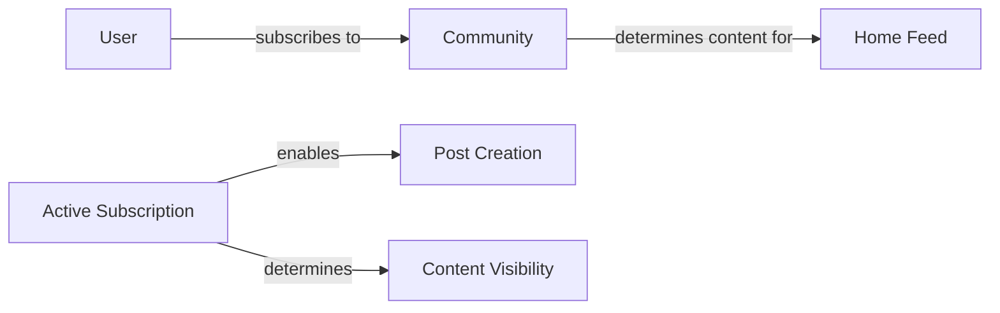

**Key Relationships:**
- **Home Feed Determination:** Active subscriptions define which communities' posts appear in the user's home feed
- **Post Creation Requirement:** Active subscription is required to create posts within a community
- **Content Visibility Control:** Subscriptions personalize content visibility for logged-in users

## Karma Concept

Karma represents a numerical reputation score that reflects a user's overall contribution quality as judged by the community. Each user has exactly one karma score that accumulates throughout their platform participation. Karma increases when other users upvote the user's posts or comments, indicating positive community reception. Karma decreases when other users downvote the user's content, indicating negative community reception. The karma score can be negative if a user receives more downvotes than upvotes across their contributions. Karma serves as a public metric of user standing within the community ecosystem. The system maintains karma as a single aggregated number rather than separate scores for different content types. Karma reflects long-term contribution patterns rather than temporary voting fluctuations.

### Karma Score Definition

Karma is a numerical reputation score that represents a user's overall contribution quality as judged by the community. Each user has exactly one karma score that accumulates throughout their platform participation. Karma increases when other users upvote the user's posts or comments, indicating positive community reception. Karma decreases when other users downvote the user's content, indicating negative community reception. The karma score can be negative if a user receives more downvotes than upvotes across their contributions. Karma serves as a public metric of user standing within the community ecosystem. The system maintains karma as a single aggregated number rather than separate scores for different content types. Karma reflects long-term contribution patterns rather than temporary voting fluctuations.

### Karma Calculation

Karma calculation follows these principles:

1. **Single aggregated number**: Each user has exactly one karma score that aggregates all voting activity across their posts and comments.
2. **Increase from upvotes**: When another user upvotes a post or comment created by a user, the creator's karma increases by 1.
3. **Decrease from downvotes**: When another user downvotes a post or comment created by a user, the creator's karma decreases by 1.
4. **Vote removal adjustment**: When a user removes their vote from a post or comment, the affected user's karma adjusts accordingly (-1 if removing an upvote, +1 if removing a downvote).
5. **Vote change adjustment**: When a user changes their vote from upvote to downvote, the affected user's karma decreases by 2 (loses the upvote and gains a downvote). When a user changes their vote from downvote to upvote, the affected user's karma increases by 2 (loses the downvote and gains an upvote).
6. **Negative score possibility**: Karma can be negative if a user receives more downvotes than upvotes across their contributions.

### Karma Visibility and Impact

Karma serves multiple purposes in the community platform:

**Public standing metric**: Karma is publicly visible on user profiles and serves as an indicator of community reception.

**Community reception indicator**: Higher karma indicates generally well-received contributions, while lower karma suggests content that the community finds less valuable.

**Long-term contribution reflection**: Karma represents accumulated reputation over time rather than temporary popularity. It reflects consistent contribution quality across multiple posts and comments.

**Karma display**: User profiles show the user's total karma score prominently alongside their posts and comments.

**No operational impact**: Karma is a reputation metric only and does not grant special privileges, access, or restrictions within the system.

**No artificial limits**: There are no minimum or maximum karma values, and the system does not cap karma accumulation.

**No karma decay**: Karma does not decrease over time due to inactivity or age of contributions.

## ModerationRole Concept

A ModerationRole represents a user's authority level within a specific community for content management and member oversight. Two role types exist: owner represents the original creator who holds ultimate authority over community governance, and moderator represents users granted management privileges by the owner. The owner role cannot be transferred or removed except through account deletion, ensuring stable community leadership. Moderator roles can be assigned by either the owner or existing moderators to distribute management responsibilities. Each moderation role applies to exactly one community, with no cross-community authority implied by the role. Role assignment creates a hierarchical structure where owners oversee moderators within their community. Moderation roles enable responsible community management while maintaining clear lines of authority and responsibility.

### Community Authority Levels

Moderation roles define different levels of administrative authority within a community. The system supports two authority levels:

- **Owner**: The user who originally created the community holds the owner role. This role represents the highest level of authority and includes ultimate decision-making power over all community operations.

- **Moderator**: Users granted management privileges by the owner or existing moderators hold moderator roles. This role represents delegated authority for day-to-day community management while operating under the owner's oversight.

Authority is strictly hierarchical: owner > moderator > member > guest. Each community operates as an independent authority domain with no cross-community permissions implied by a moderation role.

### Owner Authority and Non-Transferability

The owner role possesses ultimate authority within the community and cannot be transferred or removed except through account deletion:

- **Ultimate authority**: The owner has final decision-making power over all community operations, including moderator management, content removal, user banning, and report resolution.

- **Non-transferable role**: The owner role is permanently tied to the user who created the community. It cannot be reassigned, transferred, or voluntarily relinquished to another user.

- **Account deletion exception**: If the owner's account is deleted, the community becomes ownerless but remains functional under existing moderator leadership.

- **Role permanence**: Once established, the owner's authority persists indefinitely unless the owner account ceases to exist.

### Moderator Privileges and Assignment

Moderators are granted management privileges through explicit assignment by users with appropriate authority:

- **Assignment capability**: Owner users can assign moderator roles to any member of their community. Moderators can also assign moderator roles to other members, creating a distributed management structure.

- **Management privileges**: Moderators receive authority to delete posts and comments, ban users from the community, and resolve reports within their assigned community.

- **Scope limitation**: A moderator's authority applies only to the specific community where they hold the moderator role, with no permissions extending to other communities.

- **Role hierarchy**: While moderators possess significant management capabilities, they remain subordinate to the owner within the community's authority structure.

### Single-Community Scope

Each moderation role applies to exactly one community, establishing clear boundaries of authority:

- **Authority isolation**: A moderation role in Community A grants no authority in Community B, even if the same user holds moderator roles in both communities.

- **Independent operations**: Moderators manage content and members within their specific community without cross-community coordination requirements.

- **No implied permissions**: Holding a moderator role in one community does not grant any special viewing or posting permissions in other communities.

- **Community-specific governance**: Each community develops its own moderation practices and standards independent of other communities.

### Hierarchical Management Structure

Moderation roles create a clear hierarchical structure within each community:

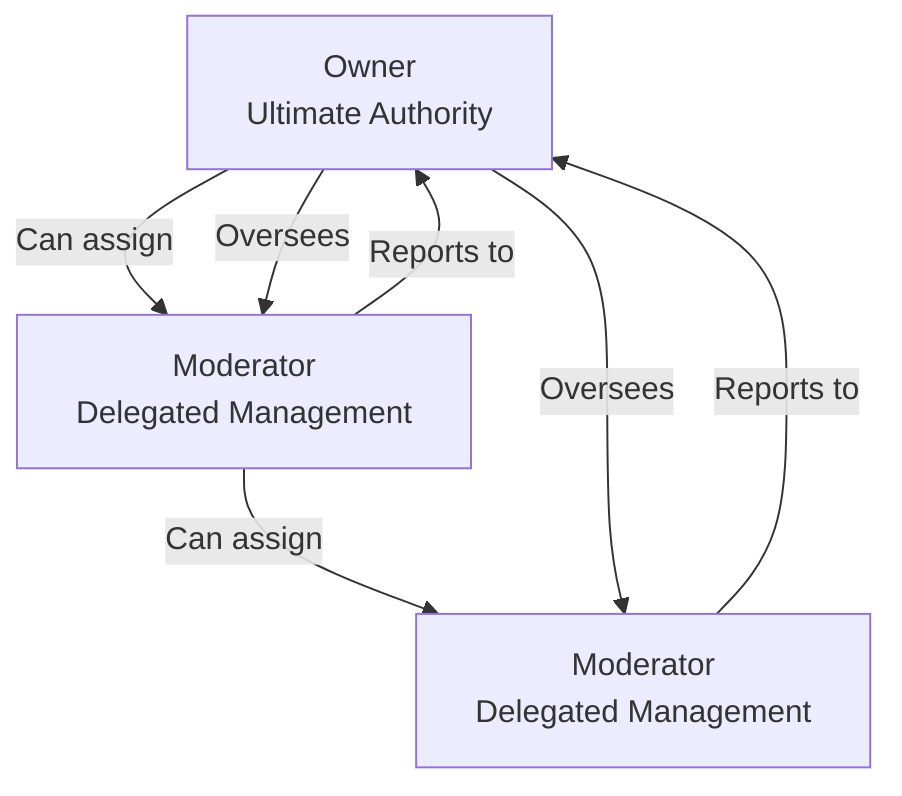

The hierarchy establishes:

- **Clear reporting lines**: Moderators operate under the owner's oversight
- **Distributed assignment**: Both owners and moderators can assign new moderators
- **Unified accountability**: All moderators ultimately report to the owner
- **Scalable management**: Communities can grow their moderation team while maintaining authority structure

### Content Oversight Responsibility

Moderation roles carry responsibility for maintaining content quality and enforcing community standards:

- **Content quality**: Moderators ensure posts and comments meet community standards of relevance, appropriateness, and quality.

- **Rule enforcement**: Moderators apply community-specific rules consistently across all content submissions.

- **Proactive monitoring**: Moderators actively review content to identify violations before they require user reports.

- **Standards maintenance**: Moderators help establish and evolve community content standards over time.

### Member Management Capability

Moderation roles include authority over community membership and participation:

- **Participation control**: Moderators can ban users from creating posts or comments while allowing continued viewing access.

- **Behavior enforcement**: Moderators address member behavior that violates community standards or disrupts discussion.

- **Access regulation**: Moderators manage the balance between open participation and quality discussion within their community.

- **Community health**: Moderators foster constructive interaction while minimizing disruptive behavior.

## Ban Concept

A Ban represents a restriction placed on a user within a specific community, limiting their participation while maintaining viewing access. Bans are issued by community moderators or owners as a disciplinary measure for rule violations or inappropriate behavior. Each ban includes a reason text explaining why the restriction was applied, providing transparency about the decision. Bans have a start timestamp indicating when the restriction began affecting the user's privileges. While bans can be temporary with an end timestamp, the system also supports permanent bans without expiration. Banned users retain the ability to view community content but cannot create posts or comments within that community. Each ban applies to exactly one community-user pair, allowing targeted restrictions without platform-wide consequences. Bans serve as a moderation tool to maintain community standards and protect discussion quality.

### Ban Definition and Purpose

A Ban represents a participation restriction placed on a specific user within a single community. It serves as a moderator disciplinary measure to enforce community standards when users violate rules or engage in inappropriate behavior. The primary purpose is to limit problematic user participation while maintaining community access for viewing content. Each ban is a targeted community restriction affecting only the specified community, not the entire platform.

### Ban Attributes

Each Ban includes several key attributes:

- **Ban Reason**: A text explanation describing why the restriction was applied, providing transparency about the disciplinary decision.
- **Start Timestamp**: The date and time when the ban begins to restrict the user's participation.
- **End Timestamp**: An optional attribute indicating when a temporary ban will expire, allowing for time-limited restrictions.
- **Ban Status**: Indicates whether the ban is currently active, expired, or manually revoked.

These attributes support both temporary ban possibility and permanent ban possibility within the system.

### Restriction Scope

Bans enforce community-specific limitations that target specific privileges while preserving others:

- **Post Creation Prevention**: Banned users cannot create new posts within the community where the ban applies.
- **Comment Creation Prevention**: Banned users cannot write comments on any posts within the affected community.
- **Content Viewing Retention**: Banned users retain the ability to view all community content, including posts, comments, and user profiles.

This selective restriction approach allows moderators to limit problematic participation without completely removing users from community discussions.

### Community-Specific Nature

Each ban applies to exactly one community-user pair, creating a targeted community restriction. This design allows:

- Platform-wide participation: Users banned from one community can still participate in other communities where they are not banned.
- Granular moderation: Communities can enforce their own standards independently.
- Proportional consequences: Restrictions match the severity and scope of rule violations.

A user may have multiple bans across different communities, each with its own reason, duration, and restrictions.

### Temporal Characteristics

Bans can have different timeframes based on moderator decisions:

- **Temporary Bans**: Have both start and end timestamps, automatically expiring when the end timestamp is reached.
- **Permanent Bans**: Have only a start timestamp with no expiration, remaining active until manually revoked by a moderator.
- **Start Timestamp Restriction**: The ban's restrictions become effective immediately when the start timestamp is reached.

Temporary bans support rehabilitative approaches, while permanent bans address severe or repeated violations.

## Report Concept

A Report represents a user's formal complaint about specific content that may violate community guidelines or platform rules. Users can report either posts or comments that they find inappropriate, offensive, or rule-breaking. Each report requires a reason text explaining why the content should be reviewed by moderators. Reports have a status indicating whether they are pending review, approved for action, or dismissed as invalid. The reporting user's identity is recorded but may not be visible to all parties depending on privacy considerations. Reports target specific content items, creating a direct link between complaint and alleged violation. Moderators review reports to determine appropriate action, including content removal or dismissal. Reports serve as a community policing mechanism that empowers users to flag problematic content for moderator attention.

### Report Definition

A Report represents a formal complaint submitted by users about content they believe violates community guidelines or platform rules. Users can report posts or comments that they find inappropriate, offensive, or rule-breaking. Each report requires a written reason explaining why the content should be reviewed by moderators.

### Report Status Lifecycle

Reports progress through a three-state lifecycle:

- **Pending**: The report has been submitted and is awaiting moderator review. This is the initial status for all new reports.
- **Approved**: A moderator has reviewed the report and determined the content violates rules. The reported content is deleted, and the report is considered resolved.
- **Dismissed**: A moderator has reviewed the report and determined the content does not violate rules. The content remains, and the report is considered resolved without action.

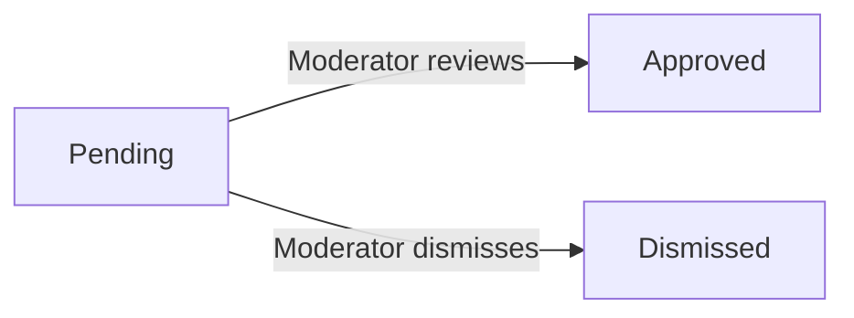

### Required Reason Explanation

Every report must include a written reason explaining why the user is reporting the content. The reason is required and cannot be empty. The reason text provides context to moderators about the alleged violation and helps them make informed decisions during review.

### Reporting User Identity

The system records which user submitted each report. The reporting user's identity is recorded for accountability and may be visible to moderators reviewing the report. The identity of the reporting user may not be visible to other users or the author of the reported content, depending on privacy considerations.

### Content Targeting

Reports target specific content items in the system. A report can target either:

- **Post**: A user's submission in a community (text, link, or image post)
- **Comment**: A user's response to a post or another comment

Each report is directly linked to one specific content item, creating a clear connection between the complaint and the alleged violation.

### Moderator Review Mechanism

Reports serve as the primary mechanism for bringing potentially problematic content to moderator attention. When a report is submitted:

1. The report appears in the moderator queue for the relevant community
2. Moderators review the reported content along with the reason provided
3. Moderators make a determination: approve (delete content) or dismiss (keep content)
4. The report status is updated accordingly

This mechanism enables efficient community policing by distributing moderation workload to users who identify content of concern.

### Community Policing Tool

Reports function as a community policing tool that:

- Empowers users to contribute to content quality by flagging problematic material
- Creates a transparent record of moderation decisions for accountability
- Distributes the responsibility for content monitoring across the community
- Provides a structured process for handling content disputes
- Helps moderators identify patterns of problematic behavior across the platform

# Domain Relationships

Describe how concepts relate to each other from a business perspective.

## Conceptual Relationships

Describe how concepts relate to each other in business terms.

### Core Relationship Definitions

The platform's business model centers around relationships between users, content, and communities. These relationships determine visibility, permissions, and interactions.

1. **User Relationship to Content**: Users create, own, and interact with content they produce
2. **Community Relationship to Content**: Communities contain and organize user-generated content
3. **User Relationship to Community**: Users connect to communities through subscriptions and moderation roles
4. **Content Relationship to User Engagement**: Content receives engagement through votes and comments

Each relationship follows clear ownership and association patterns that define business rules and permissions.

### User-to-Content Ownership

Users have direct ownership relationships with content they create, granting them specific privileges.

**User owns Posts**:
- A user creates posts and remains the permanent author of those posts
- Ownership grants the user editing rights to modify their posts
- Ownership grants the user deletion rights to remove their posts
- The original author is always displayed with the post content

**User owns Comments**:
- A user writes comments and remains the permanent author of those comments
- Ownership grants the user editing rights to modify their comments
- Ownership grants the user deletion rights to remove their comments
- The original author is always displayed with the comment content

**User owns Votes**:
- A user casts votes on posts and comments
- Each vote is uniquely associated with the user who cast it
- Users can modify or remove their own votes
- Users cannot vote on their own content

**User owns Profile**:
- Each user has exactly one profile
- The user has exclusive editing rights to their profile
- Profile information is publicly viewable

These ownership relationships define who can modify or delete content and what content appears in a user's profile listings.

### Community-to-Content Association

Communities organize and contain user-generated content through clear belonging relationships.

**Community contains Posts**:
- Every post is created within exactly one community
- The community provides context and audience for the post
- Posts appear in the community feed when sorted or filtered
- Posts inherit community moderation rules
- Post deletion in a community removes it from the community feed

**Community contains Comments**:
- Comments are associated with posts, which belong to communities
- Comments inherit the community context of their parent post
- Community moderation rules apply to all comments within community posts
- Comment deletion removes it from the community discussion

**Community displays Profile Information**:
- Community members see other users' display names and avatars
- Community pages show post authors' usernames
- Community pages show comment authors' usernames
- Community pages display karma scores of users

These associations ensure content is properly contextualized within community boundaries and follows community-specific rules.

### User-to-Community Association

Users connect to communities through subscriptions and moderation roles, creating multi-faceted relationships.

**User subscribes to Communities**:
- Users can subscribe to multiple communities
- Subscriptions appear in the user's subscribed communities list
- Subscriptions determine which posts appear in the user's home feed
- Subscriptions are required for creating posts in a community
- Users can unsubscribe from communities they previously subscribed to

**User moderates Communities**:
- Community owners have ultimate authority over their communities
- Owners can assign moderator roles to other users
- Moderators can perform moderation actions within their communities
- Users can hold moderator roles in multiple communities
- Community moderation roles are community-specific

**User is banned from Communities**:
- Users can be banned from specific communities
- Bans prevent users from creating posts or comments in that community
- Bans do not prevent users from viewing community content
- Users can be unbanned by community moderators
- Each ban is specific to one community

These associations determine user participation rights, content visibility, and community management responsibilities.

### Content Engagement Relationships

Content interacts with users through voting and commenting systems, creating engagement feedback loops.

**Post receives Votes**:
- Posts can receive multiple votes from different users
- Each vote contributes to the post's vote score
- Vote score affects post sorting in feeds
- Vote score contributes to the author's karma
- Posts display their current vote score publicly

**Post receives Comments**:
- Posts can receive multiple comments
- Comments create threaded discussions on posts
- Comment count affects post visibility and engagement metrics
- Posts display their comment count publicly

**Comment receives Votes**:
- Comments can receive votes just like posts
- Comment votes contribute to the comment author's karma
- Comment votes affect comment sorting within posts
- Comments display their vote score

**Comment receives Replies**:
- Comments can receive replies from other users
- Replies can themselves receive replies, creating threads
- There is no depth limit for comment threads
- All replies inherit the community context of the original post

These relationships create the engagement dynamics that drive content visibility and user reputation.

## Lifecycle and Retention

Describe concept lifecycle states and transitions only. Detailed retention/recovery policies belong in 05-non-functional. Operation details belong in 03-functional-requirements.

### User Account Lifecycle

### User Account Lifecycle

A user account transitions through distinct stages throughout its existence on the platform.

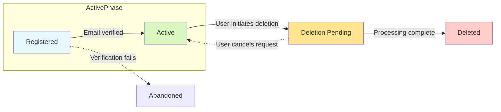

**Active Phase**
- **Registered**: Account created with email, password, and unique username. Account is functional but may require email verification. The user can log in and begin using platform features.
- **Active**: The primary operational state. User has full access to all features permitted for authenticated members, including creating content, voting, and joining communities.

**Termination Phase**
- **Deletion Pending**: User has requested account deletion. The account remains accessible for a brief period (e.g., to allow for cancellation of the request), but new content creation is disabled. All user-generated content (posts, comments, votes) is scheduled for removal.
- **Deleted**: The final state. The account record is permanently removed from the system. Associated data (posts, comments, profile, karma) is removed as per the deletion policy. The username becomes available for new registration.

**Transitions**
- A user can only cancel a deletion request while in the "Deletion Pending" state.
- The transition from "Registered" to "Abandoned" occurs if the system cannot complete email verification.

### Content Retention and Deletion

### Content Retention and Deletion

User-generated content is retained based on the user's active participation and explicit deletion actions.

**Retention During Active Membership**
- All posts, comments, and votes created by a user are retained while the user's account is active.
- User profiles, karma scores, and subscription lists are maintained and updated in real-time.

**Deletion Triggers**
1. **User-Initiated Deletion**: When a user deletes their own post or comment, the content is immediately removed from public view.
2. **Moderator-Initiated Deletion**: When a moderator deletes a post or comment for violating community rules, the content is removed.
3. **Account Deletion Cascade**: When a user deletes their account, the system initiates a cascade deletion of all content owned by that user, including posts, comments, and votes. This process is irreversible.

**Archival for Moderated Content**
- Content deleted by moderators (via approved reports) is removed from public feeds and community listings.
- A record of the deletion (including the report reason and moderator) may be retained in a separate moderation log for accountability, but the content itself is not preserved.

**Data Recovery**
- Users cannot recover content they have personally deleted.
- Moderators cannot restore content they have deleted; such actions are considered final.
- The platform does not provide a "recycle bin" or "undo delete" feature for user or moderator deletions.

### Community and Moderation Data Lifecycle

### Community and Moderation Data Lifecycle

Communities and associated moderation records have their own distinct lifecycle management.

**Community Lifecycle**
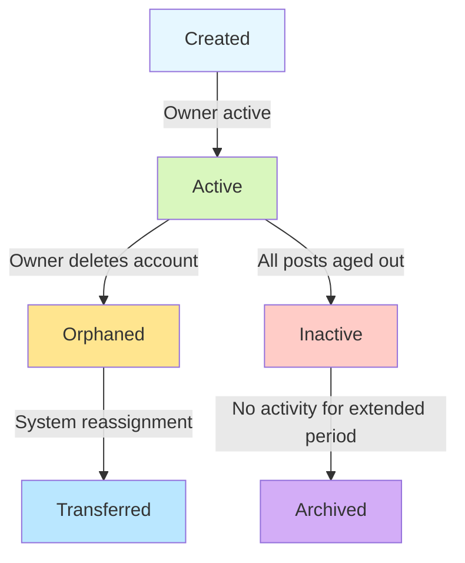

- **Active**: The community has an active owner, subscribers, and recent posts. It appears in community listings and feeds.
- **Orphaned**: The community owner has deleted their account. The community remains viewable but cannot accept new posts until a new owner is assigned by the system.
- **Inactive**: A community with no new posts or comments for an extended period (e.g., 1 year). It remains listed but is filtered out of default community browsing.
- **Archived**: A community that has been inactive for a very long period. It is removed from public listings but its historical content remains accessible via direct links.

**Moderation Record Retention**
- User bans have a defined lifecycle: they can be active (restricting participation) or expired (no longer enforcing restrictions).
- Reports move through states: **Pending** (awaiting review), **Approved** (content deleted), or **Dismissed** (no action taken).
- Approved and dismissed reports are removed from the active review queue but may be retained in a historical log for moderator reference.
- Bans and report histories are retained for the duration of the community's existence to inform future moderation decisions.

### Data Retention Policy

### Data Retention Policy

The platform establishes clear retention periods for different types of data based on business needs and user privacy.

**User Account Data**
- Active user accounts: Retained indefinitely until user requests deletion.
- Deleted user accounts: All personal identifiers (email, username) are permanently removed. Anonymized activity logs may be retained for platform analytics.
- Abandoned accounts (never verified): Removed after a short grace period (e.g., 30 days).

**User-Generated Content**
- Posts and comments: Retained as long as the author's account is active, unless deleted by the user or a moderator.
- Votes: Retained as long as the voting user's account is active. Votes are removed if the voter deletes their account.
- User profiles (display name, bio, avatar): Retained while the account is active. Removed upon account deletion.

**System and Moderation Data**
- Karma scores: Calculated in real-time from active votes. If a vote is removed or a voter's account is deleted, the affected user's karma is recalculated accordingly.
- Subscription lists: Retained while the user account is active. Removed upon account deletion.
- Moderation roles (owner, moderator): Retained while the community exists and the user account is active. Removed if the user leaves the role or deletes their account.
- Ban records: Retained for the duration of the ban's active period. Historical ban records may be archived for community safety reference.
- Report history: Approved and dismissed reports are archived for moderator review and community safety analysis.

**Data Recovery Scope**
- The platform does not perform routine backups of individual user content for recovery purposes.
- System-wide disaster recovery mechanisms protect against data center failures but are not designed to restore individual deleted posts or comments.
- Users are responsible for preserving any content they wish to keep long-term.

# Business Categories and State Flows

Business category classifications and state flow definitions.

## Business Category Definitions

Define all business category classifications with their allowed values and descriptions.

### Content Type Classification

The platform classifies posts into three distinct content types based on how information is shared. Each type has specific characteristics that determine how content is displayed and consumed.

### Text Post
A text post contains written content created directly within the platform. Users compose a title and a body of text that appears as the primary content. Text posts are ideal for discussions, stories, and content that doesn't require external resources.

### Link Post
A link post references external content via a URL. Users provide a title and a web address, and the platform extracts and displays the domain name for identification. Link posts are used to share articles, videos, and other web content without uploading the content directly.

### Image Post
An image post contains visual content uploaded by the user. Users provide a title and an image file, and the platform generates a thumbnail for display in feeds. Image posts are designed for sharing photographs, memes, artwork, and other visual media.

**Classification Rules:**
- Every post must be exactly one of these three types
- The content type cannot be changed after creation
- Each type has specific display requirements in feeds and detail views

**Allowed Values:** text, link, image
**Status Type:** Content type is immutable once assigned

### Vote and Karma Classification

The platform uses a voting system to gauge community sentiment and a karma score to measure user reputation. Both systems follow specific classifications that ensure consistency and fairness.

### Vote Types
Users can express their opinion on posts and comments through two vote types:

**Upvote** - Indicates approval, agreement, or appreciation of the content. Upvotes increase both the content's vote score and the author's karma by 1 point.

**Downvote** - Indicates disagreement, poor quality, or irrelevance. Downvotes decrease both the content's vote score and the author's karma by 1 point.

### Vote Change Classification
Users can modify their voting expression through these allowed actions:
- **Cast vote** - Apply an upvote or downvote to content
- **Change vote** - Switch from upvote to downvote or vice versa
- **Remove vote** - Withdraw any previous vote entirely

### Karma Score Classification
Karma is a single numerical value representing a user's overall contribution quality:
- **Positive karma** - Indicates generally well-received contributions
- **Negative karma** - Indicates generally poorly-received contributions
- **Neutral karma** - Score of zero, indicating balanced reception

**Allowed Values:** vote types: upvote, downvote; karma: any integer
**Status Type:** Vote status is active/changed/removed; karma is calculated real-time

### Feed and Sorting Classification

The platform provides different ways to browse content through feed types and sorting methods. These classifications determine what content users see and how it's organized.

### Feed Types
Three distinct feeds serve different browsing purposes:

**Home Feed** - Shows posts only from communities the user is subscribed to. Available exclusively to logged-in users, this feed provides a personalized content experience.

**Popular Feed** - Shows posts from all communities across the platform. Available to all users (including logged-out visitors), this feed highlights content with broad appeal.

**Community Feed** - Shows posts from a single, specific community. Available to all users, this feed focuses on content within a particular interest area.

### Post Sorting Methods
All feeds support the same set of sorting options:

**Hot** - Prioritizes recent posts with many upvotes, balancing recency and popularity. This is the default sorting for most feeds.

**New** - Orders posts strictly by creation time, with the most recent posts appearing first.

**Top** - Orders posts by their vote score (upvotes minus downvotes), with the highest scores appearing first. Supports time filters: today, this week, this month, this year, all time.

**Controversial** - Highlights posts with many votes but scores close to zero, indicating divided opinions.

### Comment Sorting Methods
Comments on individual posts can be sorted by:

**Best** - Orders comments by their vote score, with highest scores first.

**New** - Orders comments by creation time, with most recent first.

**Controversial** - Highlights comments with many votes but scores close to zero.

**Allowed Values:** feed types: home, popular, community; post sorting: hot, new, top, controversial; comment sorting: best, new, controversial
**Status Type:** Feed selection is user preference; sorting is applied dynamically

### Moderation and Report Classification

The platform's moderation system relies on clear classifications for roles, actions, and processes to maintain community standards.

### Moderation Role Types
Community authority is structured through two distinct role types:

**Owner** - The user who created the community. Owners have ultimate authority including:
- Adding and removing moderators
- Performing all moderator actions
- Cannot be removed from the owner role
- Cannot transfer ownership (implied by requirement)

**Moderator** - Users appointed by the owner or other moderators (as allowed). Moderators can:
- Add other moderators (with owner's ability to do so)
- Perform content moderation actions
- Cannot remove other moderators (only owner can)
- Cannot remove the owner

### Ban Status Classification
When users are banned from communities, their status is tracked:

**Active Ban** - The user is currently prohibited from creating posts or comments in the community. They can still view content but cannot participate.

**Expired Ban** - A temporary ban that has reached its end date, or a permanent ban that was lifted. The user regains normal participation rights.

### Report Status Classification
Content reports progress through a review workflow:

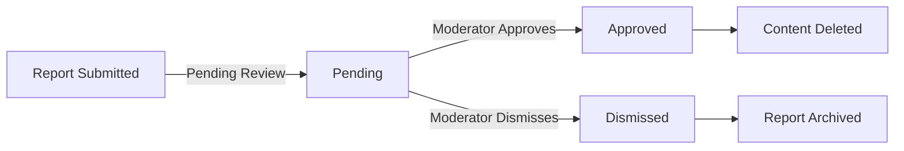

**Pending** - The report has been submitted but not yet reviewed by a moderator.

**Approved** - A moderator has reviewed and accepted the report, resulting in content deletion.

**Dismissed** - A moderator has reviewed and rejected the report, keeping the content visible.

**Allowed Values:** roles: owner, moderator; ban status: active, expired; report status: pending, approved, dismissed
**Status Type:** Role status is assigned/active; ban status is time-based; report status follows review workflow

## State Transitions

Define valid state transition paths for stateful concepts.

### User Account State Flow

A user account moves through states based on user actions and system policies.

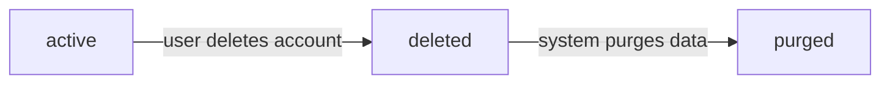

### State Definitions

- **active**: The user can log in, create content, vote, and perform all member functions.
- **deleted**: The user initiated account deletion. All their posts and comments are marked as deleted but may still be visible in some contexts (e.g., with "[deleted]" author label). The user cannot log in.
- **purged**: The system has permanently removed all user data after the retention period. No trace of the user remains.

### Transition Rules

1. From **active** to **deleted**: The user chooses to delete their account.
2. From **deleted** to **purged**: The system automatically purges data after the configured retention period.
3. No user action can reverse a deletion—once deleted, an account cannot be reactivated.

### Effects on Related Entities

- When a user account transitions to **deleted**, all their posts and comments are also marked as deleted.
- The user's karma score is preserved but no longer updates.
- The user's profile information (display name, bio, avatar) becomes hidden.
- Communities owned by the user remain active but show "[deleted]" as the owner.
- Moderator roles held by the user in communities are removed.
- Subscriptions and votes cast by the user remain in the system but are anonymized.

### Comment Status Transitions

Comments can exist in three statuses, with controlled transitions between them.

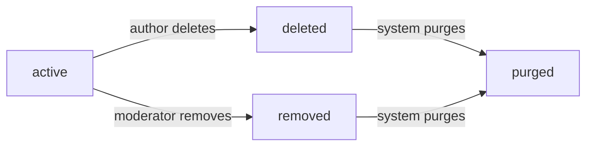

### Status Definitions

- **active**: The comment is visible to all users who can view the post.
- **deleted**: The comment author chose to delete it. The comment text is replaced with "[deleted]", but the author attribution and vote score remain visible.
- **removed**: A moderator removed the comment for violating community rules. The comment text is replaced with "[removed]", with a note indicating moderator action.
- **purged**: The system has permanently removed the comment content after retention periods (for deleted/removed comments).

### Transition Rules

1. From **active** to **deleted**: Only the comment author can delete their own comments.
2. From **active** to **removed**: Only moderators of the community containing the post can remove comments.
3. From **deleted** or **removed** to **purged**: System automatically purges after retention period.

### Note on Hierarchy

- When a parent comment is deleted or removed, its replies remain visible but show the parent as "[deleted]" or "[removed]".
- Deleting a comment does not affect votes cast on it—the vote score remains visible.
- Moderators cannot delete comments (only authors can); moderators can only remove them.

### Report Resolution Workflow

User reports move through a review and resolution process managed by community moderators.

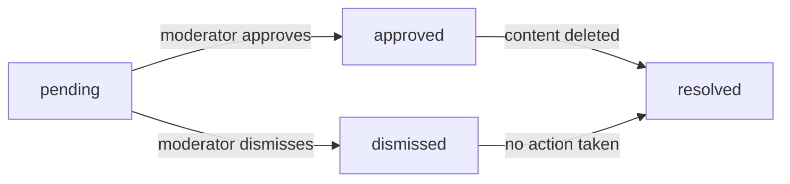

### Status Definitions

- **pending**: A user has submitted a report against content (post or comment), but no moderator has reviewed it yet.
- **approved**: A moderator reviewed the report and agreed the content violates community rules. The reported content is deleted.
- **dismissed**: A moderator reviewed the report and determined no rule violation occurred. The content remains visible.
- **resolved**: The report has been fully processed (either approved or dismissed) and no longer requires moderator attention.

### Transition Rules

1. From **pending** to **approved**: A moderator with authority in the relevant community approves the report.
2. From **pending** to **dismissed**: A moderator with authority in the relevant community dismisses the report.
3. From **approved** or **dismissed** to **resolved**: System automatically marks as resolved after content deletion (for approved) or immediately after dismissal.

### Moderation Visibility

- Only moderators of the community where the reported content exists can transition reports from pending.
- The reporting user can see the final status of their report (approved/dismissed) but not detailed moderator discussion.
- Dismissed reports are removed from the active report list but remain in moderation history.

### Community Ban Status Changes

User bans within a community have temporal states that control participation restrictions.

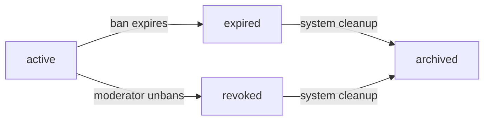

### Status Definitions

- **active**: The ban is currently in effect. The banned user cannot create posts or comments in the community, but can still view content.
- **expired**: A temporary ban reached its end timestamp and is no longer enforced. The user can participate normally.
- **revoked**: A moderator manually ended the ban before its scheduled expiration. The user can participate normally.
- **archived**: The ban record is kept for moderation history but no longer affects user permissions.

### Transition Rules

1. From **active** to **expired**: The system automatically transitions when the ban's end timestamp is reached (for temporary bans).
2. From **active** to **revoked**: A community moderator chooses to unban the user.
3. From **expired** or **revoked** to **archived**: The system archives old ban records after a retention period.

### Ban Types

- **Permanent bans**: Have no end timestamp and remain active until manually revoked by a moderator.
- **Temporary bans**: Have both start and end timestamps, automatically expiring when the end timestamp is reached.

### Moderation Actions

- Only community moderators can create active bans.
- Only community moderators can revoke active bans.
- The ban reason is visible to moderators but not to the banned user.
- Expired and revoked bans remain in the ban list for moderator reference.