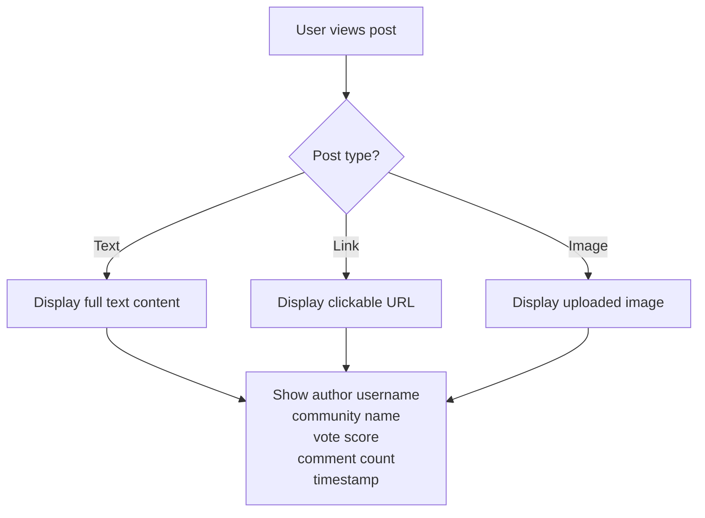
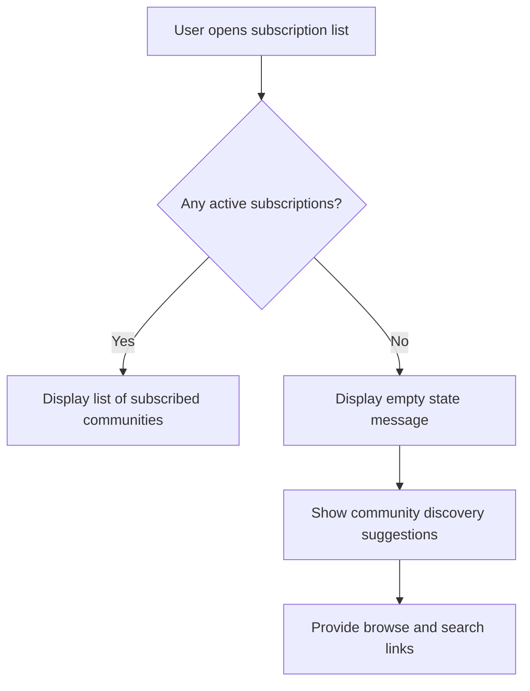
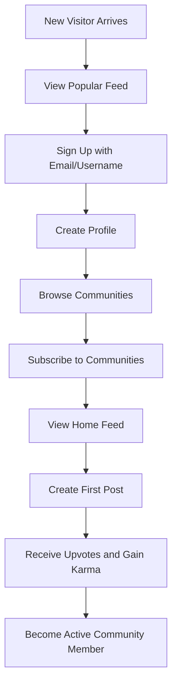
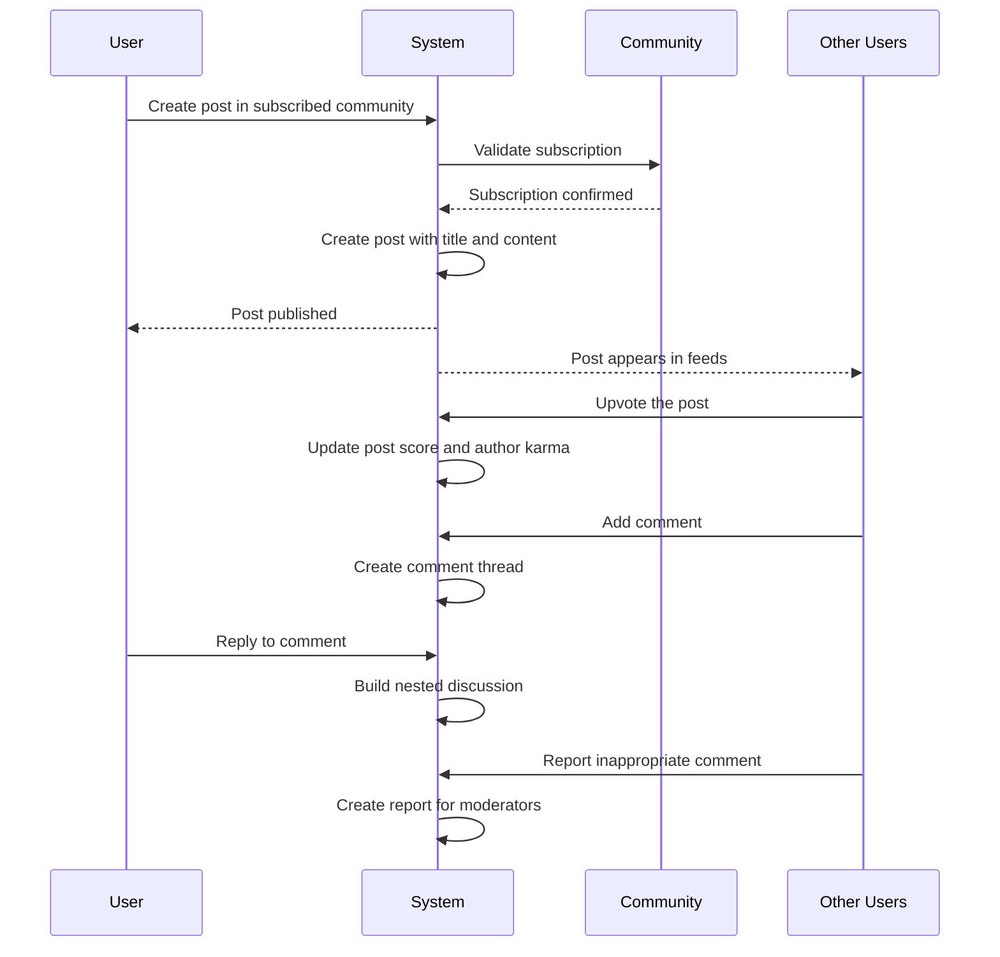
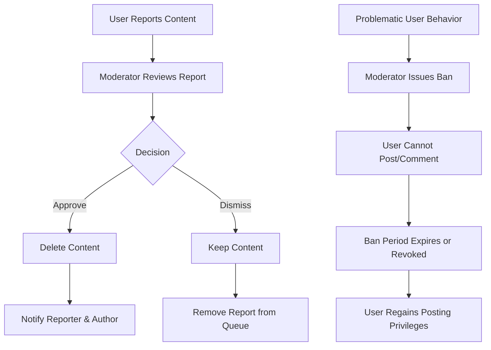
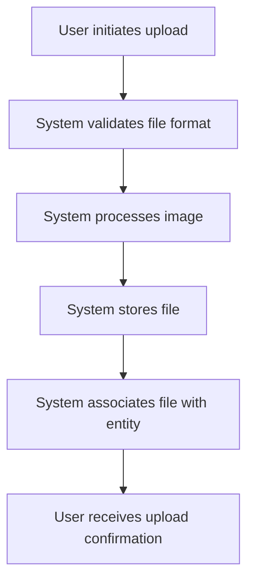
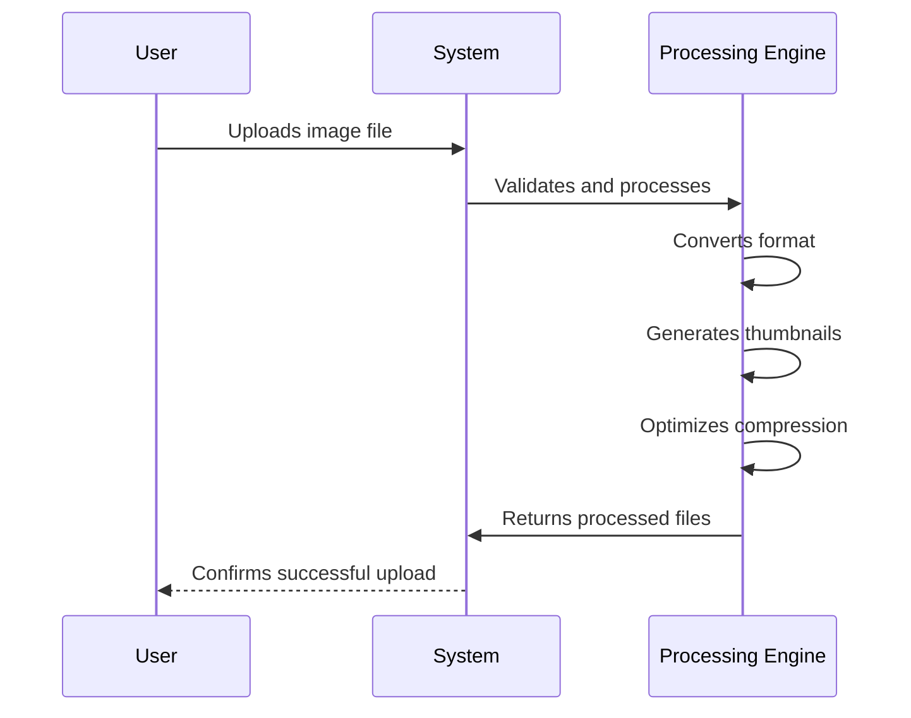
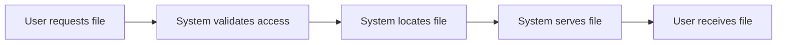
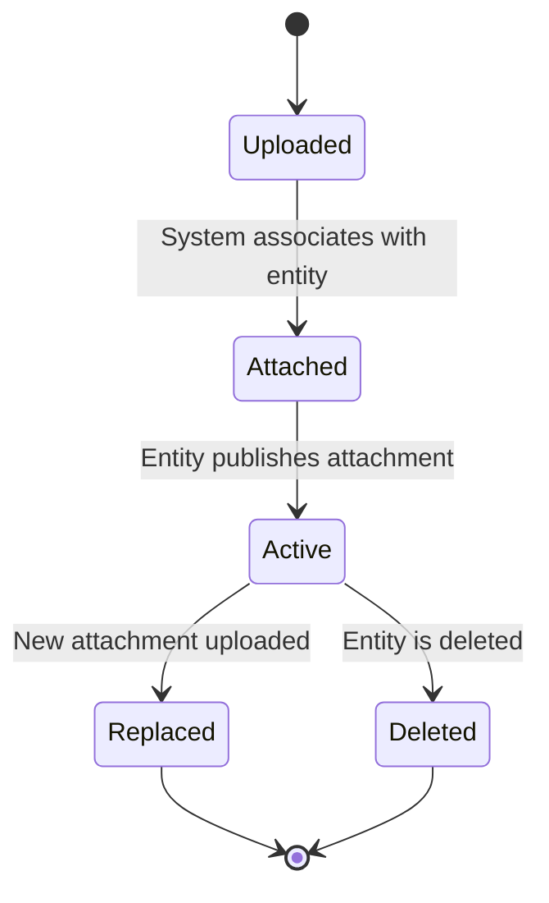

**communityPlatform — What operations users can perform, use cases, business workflows**

What operations users can perform, use cases, business workflows

# Core Business Operations

What the system must do for each business concept.

## User Operations

Users can create accounts by providing email and password, and choosing a unique username that no other user has. Users log in using their email and password combination to access the platform. Users can change their password if they forget it or want to improve security. Users can permanently delete their account, which automatically removes all their posts, comments, and associated data from the system. When a user attempts to log in with incorrect credentials, the system rejects the request. The system ensures username uniqueness and prevents duplicate usernames. Users cannot delete another user's account; only their own. Deleted accounts cannot be recovered.

### User Account Registration

### User Account Registration

THE communityPlatform SHALL allow guests to create a user account.

WHEN a guest provides an email address, password, and username during registration, THE communityPlatform SHALL create a new user account.

THE communityPlatform SHALL require the email address to be unique across all user accounts.

THE communityPlatform SHALL require the username to be unique across all user accounts.

IF the provided email address is already registered to another user account, THEN THE communityPlatform SHALL reject the registration request.

IF the provided username is already taken by another user account, THEN THE communityPlatform SHALL reject the registration request.

THE communityPlatform SHALL validate that the password meets minimum security requirements.

IF the password does not meet minimum security requirements, THEN THE communityPlatform SHALL reject the registration request.

THE communityPlatform SHALL automatically create a user profile with default values upon successful registration.

THE communityPlatform SHALL automatically initialize the user's karma score to zero upon successful registration.

UPON successful account registration, THE communityPlatform SHALL automatically log the user into their new account.

### User Authentication

### User Authentication

THE communityPlatform SHALL allow users to authenticate using their registered email address and password.

WHEN a user provides a valid email address and correct password combination, THE communityPlatform SHALL grant access to the authenticated session.

IF a user provides an email address that is not registered to any user account, THEN THE communityPlatform SHALL reject the login request.

IF a user provides an incorrect password for a registered email address, THEN THE communityPlatform SHALL reject the login request.

THE communityPlatform SHALL not reveal whether the email address exists or the password is incorrect when rejecting login requests.

THE communityPlatform SHALL maintain an authenticated session for users who successfully log in.

THE communityPlatform SHALL allow authenticated users to end their session by logging out.

WHEN a user logs out, THE communityPlatform SHALL terminate their authenticated session.

### Password Management

### Password Management

THE communityPlatform SHALL allow authenticated users to change their account password.

WHEN an authenticated user requests to change their password, THE communityPlatform SHALL require them to provide their current password.

IF the current password provided does not match the user's actual password, THEN THE communityPlatform SHALL reject the password change request.

THE communityPlatform SHALL validate that the new password meets minimum security requirements.

IF the new password does not meet minimum security requirements, THEN THE communityPlatform SHALL reject the password change request.

WHEN a user's password is successfully changed, THE communityPlatform SHALL require them to re-authenticate with the new password for subsequent logins.

THE communityPlatform SHALL securely store passwords using industry-standard hashing algorithms.

### Account Deletion

### Account Deletion

THE communityPlatform SHALL allow authenticated users to permanently delete their own account.

WHEN a user requests to delete their account, THE communityPlatform SHALL require them to confirm their password.

IF the provided password does not match the user's actual password, THEN THE communityPlatform SHALL reject the account deletion request.

WHEN a user account is deleted, THE communityPlatform SHALL permanently remove all posts created by that user.

WHEN a user account is deleted, THE communityPlatform SHALL permanently remove all comments written by that user.

WHEN a user account is deleted, THE communityPlatform SHALL permanently remove all votes cast by that user.

WHEN a user account is deleted, THE communityPlatform SHALL permanently remove all subscriptions created by that user.

WHEN a user account is deleted, THE communityPlatform SHALL permanently remove the user's profile.

WHEN a user account is deleted, THE communityPlatform SHALL permanently remove the user's karma record.

IF a user is a community owner, THEN THE communityPlatform SHALL prevent account deletion until ownership is transferred or the community is deleted.

THE communityPlatform SHALL not allow users to delete another user's account.

THE communityPlatform SHALL not provide any recovery mechanism for deleted accounts.

WHEN a user account is deleted, THE communityPlatform SHALL permanently remove all associated data from the system.

### Username Management

### Username Management

THE communityPlatform SHALL enforce username uniqueness across all user accounts.

THE communityPlatform SHALL prevent duplicate usernames during account registration.

THE communityPlatform SHALL prevent duplicate usernames during username changes (if username changes are supported).

THE communityPlatform SHALL validate username format requirements.

IF a username contains prohibited characters or patterns, THEN THE communityPlatform SHALL reject the registration request.

THE communityPlatform SHALL reserve certain usernames for system use and prevent their registration.

THE communityPlatform SHALL check username availability in real-time during the registration process.

THE communityPlatform SHALL maintain a global registry of all usernames to ensure uniqueness.

## Profile Operations

Users can create a profile with display name, biography text, and avatar image when they sign up. Users can view any other user's profile to see their display name, biography, avatar, karma score, posts, and comments. Users can edit their own display name, biography, and avatar image at any time. Profile pages show the user's total karma score prominently. Profile pages display lists of all posts created by the user and all comments written by the user. Users cannot edit another user's profile information. Profile information is publicly visible to all platform users. The system ensures avatar images are properly displayed on profile pages.

### Profile Creation

### Profile Creation

THE system SHALL automatically create a profile for a user when the user completes account registration.

WHEN a user registers an account, THE system SHALL create a profile with default values:
- Display name: initially set to the user's chosen username
- Biography: initially empty text
- Avatar: initially a system-provided default image

WHERE the profile is automatically created, THE system SHALL associate it with the newly created user account.

IF the user registration fails, THEN THE system SHALL not create a profile.

WHERE a profile is created, THE system SHALL allow the user to immediately edit its display name, biography, and avatar.

THE system SHALL ensure each user has exactly one profile.

IF a user attempts to create a second profile, THEN THE system SHALL reject the request.

### Profile Viewing

Users can view profiles of any user on the platform.

WHEN viewing any user's profile page, THE system SHALL display:
- The user's display name
- The user's biography text
- The user's avatar image
- The user's total karma score
- A list of all posts created by that user
- A list of all comments written by that user

WHERE a user views another user's profile, THE system SHALL not disclose private account information such as email address or password.

WHERE a user's profile is viewed, THE system SHALL update the view timestamp.

IF the requested user account does not exist or has been deleted, THEN THE system SHALL return an error indicating the profile is not available.

### Profile Editing

Users can edit their own profile information.

THE system SHALL allow users to edit their display name.

THE system SHALL allow users to edit their biography text.

THE system SHALL allow users to change their avatar image.

WHEN a user edits their profile, THE system SHALL:
- Validate the display name is not empty or containing only whitespace
- Validate the biography text length does not exceed the maximum limit
- Validate the avatar image file size does not exceed the maximum limit
- Validate the avatar image format is supported

IF validation fails, THEN THE system SHALL reject the edit and provide appropriate error messages.

WHERE a profile edit is successful, THE system SHALL update the profile update timestamp.

### Profile Karma Display

Each user's profile page prominently displays their total karma score.

THE system SHALL calculate karma score as: total upvotes received on posts and comments minus total downvotes received on posts and comments.

WHEN karma score changes due to voting activity, THE system SHALL update the karma score display on the user's profile.

WHERE karma is displayed, THE system SHALL show it as a single integer number.

WHERE karma can be negative, THE system SHALL display negative values with appropriate formatting.

### Profile Content Lists

User profiles display lists of content created by the user.

WHEN viewing a user's profile, THE system SHALL display a list of all posts created by that user.

FOR each post in the profile posts list, THE system SHALL display:
- Post title
- Community name where the post was created
- Post vote score
- Post comment count
- Time since the post was created
- Post type indicator (text/link/image)

WHEN viewing a user's profile, THE system SHALL display a list of all comments written by that user.

FOR each comment in the profile comments list, THE system SHALL display:
- The first portion of the comment content
- The post title where the comment was written
- Comment vote score
- Time since the comment was created

WHERE content lists are displayed, THE system SHALL paginate the results.

### Profile Access Control

Users cannot edit other users' profiles.

THE system SHALL prevent users from editing any profile other than their own.

IF a user attempts to edit another user's profile, THEN THE system SHALL reject the request.

WHERE a profile edit request is made, THE system SHALL verify the requesting user is the profile owner.

THE system SHALL allow users to view any other user's profile regardless of account status.

IF a user account is deleted, THEN THE system SHALL make the profile unavailable for editing but may retain viewable content based on retention policies.

### Profile Visibility

Profile information is publicly visible to all platform users.

THE system SHALL make all user profiles accessible to:
- Registered users (members)
- Unregistered users (guests)

WHERE profile visibility is concerned, THE system SHALL not restrict access based on:
- Subscription status
- Community membership
- Relationship between users
- User karma score

THE system SHALL ensure that all profile information defined in the profile viewing requirements is visible to all users.

IF a user explicitly requests privacy controls in future features, THEN THE system SHALL handle those requests separately.

### Avatar Image Management

Profile pages properly display avatar images.

THE system SHALL store avatar images in a supported format.

WHEN a user uploads an avatar image, THE system SHALL:
- Resize the image to appropriate dimensions
- Optimize the image for web display
- Store the image in a persistent location
- Generate URLs for accessing the image

WHERE an avatar image is displayed, THE system SHALL:
- Serve appropriate image sizes for different display contexts
- Provide fallback behavior when images cannot be loaded
- Cache images for performance
- Handle image loading failures gracefully

THE system SHALL allow users to remove their avatar image and revert to the default system avatar.

IF an avatar image fails to upload or process, THEN THE system SHALL maintain the previous avatar image or default avatar.

## Community Operations

Any user can create a community by providing a unique name, description text, and icon image. The user who creates a community becomes its owner with full administrative authority. Users can browse all communities in a list view that shows each community's name, description, icon, and subscriber count. Users can search for communities by name to find specific communities. Community details page shows the community name, description, icon, subscriber count, and posts from that community. Community owners cannot have their ownership transferred automatically. Users cannot create a community with a name that already exists. Communities remain visible even if they have no subscribers.

### Community Operations

### Community Creation

WHEN a member provides a unique community name, description text, and icon image, THE system SHALL create a community with those properties.

THE system SHALL assign the member as the owner of the newly created community.

IF the provided community name already exists, THEN THE system SHALL reject the creation request.

### Community Browsing

WHEN a guest or member requests to view communities, THE system SHALL present a list of all communities.

THE system SHALL display for each community in the list: community name, description text, icon image, and subscriber count.

### Community Search

WHEN a guest or member provides search text, THE system SHALL search for communities by name.

THE system SHALL display matching communities showing community name, description text, icon image, and subscriber count.

IF no communities match the search text, THEN THE system SHALL present an empty results list.

### Community Details View

WHEN a guest or member selects a community, THE system SHALL display the community details page.

THE system SHALL show on the details page: community name, description text, icon image, subscriber count, and posts from that community.

### Community Ownership

THE system SHALL ensure the community creator remains the permanent owner.

THE system SHALL NOT allow transfer of ownership to another user.

### Community Visibility

THE system SHALL keep communities visible even if they have zero subscribers.

### Community List Pagination

WHERE the community list exceeds a single page, THE system SHALL provide paginated results with a consistent number of communities per page.

## Post Operations

Users can create posts in communities they are subscribed to, with a required title and one of three content types: text posts with text content, link posts with a URL, or image posts with an uploaded image. Users can edit their own posts to update title or content. Users can delete their own posts, removing them from public view. When viewing a single post, users see title, full content, author username, community name, vote score, comment count, and posting timestamp. Users cannot create posts in communities they are not subscribed to. Posts require a title; the system rejects posts without titles. Deleted posts are removed from all feeds and cannot be recovered. Users cannot edit or delete posts created by other users.

### Post Creation

Users can create posts in communities they are subscribed to. Each post must have a title. The system supports three post types:

- **Text post**: Contains text content
- **Link post**: Contains a URL
- **Image post**: Contains an uploaded image

When creating a post, users must select one of these three types and provide the appropriate content. The post is automatically associated with the creating user and their chosen community.

If the user attempts to create a post in a community they are not subscribed to, the request is rejected. If the post lacks a title, the request is rejected.

The system records the creation timestamp and makes the post visible in the community feed and the creator's home feed.

### Post Editing

Users can edit their own posts to update the title or content. The system preserves the original post type (text, link, or image) but allows changes to the content within that type:

- Text posts can have their text content modified
- Link posts can have their URL updated
- Image posts can have their uploaded image replaced

Users cannot edit posts created by other users. When a post is edited, the system updates the edit timestamp and may display an indication that the post has been modified. Users cannot change the post type after creation (e.g., from text to image).

### Post Deletion

Users can delete their own posts. When a post is deleted:

- It is removed from all feeds (home feed, popular feed, community feed)
- It is no longer visible to other users
- Comments on the deleted post may be preserved or removed according to system policy (defined elsewhere)
- The post cannot be recovered through normal user operations

Users cannot delete posts created by other users. The system records the deletion timestamp and updates the post status to reflect removal.

### Post Viewing

When viewing a single post, users see:

- Post title
- Full content (text, URL, or image)
- Author username
- Community name
- Vote score (total upvotes minus total downvotes)
- Comment count
- Posting timestamp

For text posts, the full text content is displayed. For link posts, the URL is displayed and may be clickable. For image posts, the uploaded image is displayed at its full resolution.

The system calculates the time since posting (e.g., "3 hours ago") and displays this alongside the exact timestamp. Users can navigate from the post view to the author's profile or the community page.

### Post Validation Rules

The system enforces these validation rules during post creation and editing:

1. **Title required**: Every post must have a non-empty title. Posts without titles are rejected.

2. **Subscription requirement**: Users can only create posts in communities they are subscribed to. Attempts to post in unsubscribed communities are rejected.

3. **Content type consistency**: Once a post is created as a specific type (text, link, or image), it cannot be changed to another type.

4. **Ownership validation**: Users can only edit or delete posts they created. Attempts to modify or remove other users' posts are rejected.

5. **Content format validation**:
   - Text posts must contain text content
   - Link posts must contain a valid URL
   - Image posts must contain an uploaded image file

These validation rules ensure data integrity and enforce business constraints throughout the post lifecycle.

## Comment Operations

Users can write comments on any post, including replies to existing comments with unlimited nesting depth. Users can edit their own comments to update the text content. Users can delete their own comments, removing them from the discussion. Comment display includes author username, comment content, vote score, timestamp, and nested replies when applicable. Users cannot edit or delete comments written by other users. Deleted comments are removed from the comment thread and cannot be recovered. Comment sorting options include best (highest vote score), new (most recent), and controversial (many votes but score near zero). Each comment shows its position in the reply hierarchy for context.

### Comment Creation and Replying

### Comment Creation and Replying

WHEN a user wants to add a comment to a post, THE system SHALL allow them to write and submit text content.

WHERE the user is viewing any post, THE system SHALL provide a comment input field.

WHEN submitting a comment, IF the comment text is empty, THEN THE system SHALL reject the submission.

WHERE a user creates a comment, THE system SHALL automatically associate it with their account.

WHEN a user views any existing comment, THE system SHALL allow them to reply to that comment.

WHERE replying to a comment, THE system SHALL treat the reply as a new comment with a reference to its parent.

WHEN replying to a comment that is itself a reply, THE system SHALL create nested comments with unlimited depth.

WHERE a comment thread exists, THE system SHALL maintain the hierarchical relationship between comments and their replies.

IF a post has been deleted, THEN THE system SHALL prevent new comments from being added to that post.

IF a user attempts to comment on a non-existent post, THEN THE system SHALL reject the request.

WHERE a user is banned from a community, THE system SHALL prevent them from creating comments on posts in that community.

WHERE a user creates a comment, THE system SHALL store the creation timestamp for display and sorting purposes.

WHEN a user submits a comment, THE system SHALL immediately make it visible to other users viewing the post.

### Comment Editing and Deletion

### Comment Editing and Deletion

WHEN a user views their own comment, THE system SHALL provide an option to edit the comment text.

WHEN editing a comment, THE system SHALL allow modification of the text content while preserving the comment's position in the thread.

IF a user attempts to edit another user's comment, THEN THE system SHALL reject the request.

WHERE a user edits their comment, THE system SHALL update the content while maintaining the original creation timestamp and vote score.

WHEN a user saves an edited comment, THE system SHALL store an updated timestamp to track when the comment was last modified.

WHERE a user views their own comment, THE system SHALL provide an option to delete the comment.

WHEN deleting a comment, THE system SHALL remove it from the comment thread and prevent further replies.

IF a user attempts to delete another user's comment, THEN THE system SHALL reject the request.

WHERE a comment is deleted, THE system SHALL remove all associated votes from karma calculations.

WHEN a comment with replies is deleted, THE system SHALL preserve the replies but indicate the parent comment was deleted.

WHERE a moderator deletes a comment in their community, THE system SHALL remove the comment regardless of authorship.

WHEN a user deletes their account, THE system SHALL automatically delete all comments authored by that user.

WHERE a user deletes a comment, THE system SHALL prevent them from recovering it later.

IF a user attempts to edit or delete a comment on a deleted post, THEN THE system SHALL reject the request.

### Comment Display

### Comment Display

WHEN viewing a comment, THE system SHALL display the author's username.

WHERE a comment exists, THE system SHALL display its text content.

WHEN displaying a comment, THE system SHALL show its current vote score (upvotes minus downvotes).

WHERE a comment is displayed, THE system SHALL show the time since it was posted in a human-readable format (e.g., "3 hours ago").

WHEN a comment has been edited, THE system SHALL indicate it was modified.

WHERE a comment has replies, THE system SHALL display them nested underneath in hierarchical order.

WHEN viewing a comment thread, THE system SHALL visually represent the reply hierarchy with indentation or visual cues.

WHERE a comment has many nested replies, THE system SHALL allow users to expand or collapse sections of the thread.

IF a comment has been deleted, THEN THE system SHALL display a placeholder indicating the comment was removed.

WHERE a deleted comment has replies, THE system SHALL still display the replies with appropriate hierarchy indicators.

WHEN displaying a comment, THE system SHALL show whether the current user has voted on it and their vote type.

WHERE a comment author's profile exists, THE system SHALL link their username to their profile page.

WHEN a comment is from a banned user, THE system SHALL still display it but may indicate the user is banned.

WHERE a comment is displayed, THE system SHALL show any moderator actions taken on it (if applicable).

### Comment Sorting

### Comment Sorting

WHEN viewing comments on a post, THE system SHALL provide sorting options for organizing comments.

WHERE the "Best" sorting option is selected, THE system SHALL display comments with the highest vote score first.

WHERE the "New" sorting option is selected, THE system SHALL display the most recently created comments first.

WHERE the "Controversial" sorting option is selected, THE system SHALL display comments with many votes but a score close to zero first.

WHEN applying any sorting option, THE system SHALL maintain the hierarchical relationship between comments and their replies.

WHERE sorting is applied, THE system SHALL sort the top-level comments according to the selected criteria.

WHEN replies are displayed under their parent comments, THE system SHALL sort them using the same criteria as top-level comments.

WHERE no sorting option is explicitly selected, THE system SHALL use a default sorting method.

IF a post has many comments, THEN THE system SHALL apply pagination to limit the number displayed at once.

WHERE pagination is used, THE system SHALL maintain the selected sorting method across pages.

WHEN changing sorting options, THE system SHALL reorder comments immediately without requiring page refresh.

WHERE a user selects a sorting preference, THE system SHALL remember it for their future visits to that post.

### Comment Feed and Listing

### Comment Feed and Listing

WHEN viewing a user's profile, THE system SHALL display a list of all comments they have written.

WHERE viewing a user's comment history, THE system SHALL show each comment with its content, post title, and timestamp.

WHEN browsing a user's comments, THE system SHALL allow filtering by post or community.

WHERE a comment feed is displayed, THE system SHALL support pagination to handle large numbers of comments.

WHEN viewing a post, THE system SHALL load comments incrementally as the user scrolls.

WHERE a comment thread is deeply nested, THE system SHALL allow users to navigate directly to specific reply levels.

IF a user has many comments, THEN THE system SHALL provide search functionality within their comment history.

WHERE comment feeds are generated, THE system SHALL exclude comments from deleted posts unless specifically requested.

WHEN a comment is reported, THE system SHALL continue to display it until a moderator takes action.

WHERE a comment has been removed by a moderator, THE system SHALL indicate this in feeds and lists.

WHEN viewing controversial comments, THE system SHALL highlight those with many votes but balanced scores.

WHERE comment lists are generated, THE system SHALL include metadata such as post title, community name, and vote count.

IF a comment's parent post is deleted, THEN THE system SHALL still include it in user comment history with appropriate context.

WHERE a user wants to find their most upvoted comments, THE system SHALL provide sorting by vote score in their history.

## Vote Operations

Users can upvote posts and comments, which increases the target's vote score by one and the author's karma by one. Users can downvote posts and comments, which decreases the target's vote score by one and the author's karma by one. Each user can only vote once per post or comment; subsequent votes replace the previous vote. Users can change their vote from upvote to downvote or vice versa, updating both vote score and karma accordingly. Users can remove their vote entirely, which reverses the karma effect (upvote removal decreases karma, downvote removal increases karma). Vote score calculation shows total upvotes minus total downvotes. Users cannot vote on their own posts or comments. Voting is available to all logged-in users.

### Vote Creation - Upvoting

### Upvoting Posts and Comments

WHEN a logged-in user upvotes a post or comment, THE system shall:
- Increment the vote score of the target post or comment by one
- Increase the author's karma score by one
- Record the upvote with the user's identity
- Prevent the user from voting on their own content
- Reject the request if the user is not logged in
- Reject the request if the target post or comment does not exist
- Reject the request if the user has already voted on this content (requires vote change instead of new vote)

### Upvote Effects

THE system shall apply the following business effects when an upvote is cast:
- Author karma increases by one point
- Target vote score increases by one point
- The vote is associated with both the voting user and the target content
- The vote timestamp is recorded for time-based calculations

### Vote Creation - Downvoting

### Downvoting Posts and Comments

WHEN a logged-in user downvotes a post or comment, THE system shall:
- Decrement the vote score of the target post or comment by one
- Decrease the author's karma score by one
- Record the downvote with the user's identity
- Prevent the user from voting on their own content
- Reject the request if the user is not logged in
- Reject the request if the target post or comment does not exist
- Reject the request if the user has already voted on this content (requires vote change instead of new vote)

### Downvote Effects

THE system shall apply the following business effects when a downvote is cast:
- Author karma decreases by one point
- Target vote score decreases by one point
- The vote is associated with both the voting user and the target content
- The vote timestamp is recorded for time-based calculations

### Negative Karma

WHERE a user receives downvotes, THE system shall:
- Allow the user's karma score to become negative
- Display negative karma scores without special formatting
- Track negative karma in the same manner as positive karma

### Single Vote Per User Constraint

### One Vote Per User Per Item

THE system shall enforce that each user can only have one active vote per post or comment at any given time.

WHEN a user attempts to vote on content they have already voted on, THE system shall:
- Reject the request to create a duplicate vote
- Return an error indicating the user must change their existing vote instead
- Preserve the existing vote state

### Vote Uniqueness

THE system shall maintain a unique relationship between:
- Each user
- Each post or comment they have voted on
- The type of vote (upvote or downvote) currently active

WHERE multiple votes would be created for the same user-content pair, THE system shall prevent duplicate vote creation.

### Vote Modification Operations

### Changing Vote from Upvote to Downvote

WHEN a logged-in user changes their vote from upvote to downvote on a post or comment, THE system shall:
- Update the vote type from upvote to downvote
- Decrease the target vote score by two (removing +1 upvote and adding -1 downvote = net -2)
- Decrease the author's karma by two (removing +1 karma from upvote and adding -1 karma from downvote = net -2)
- Record the vote change timestamp
- Preserve the single-vote-per-user constraint
- Reject the request if the user is not logged in
- Reject the request if the user does not have an existing upvote on the content
- Reject the request if the target content does not exist

### Changing Vote from Downvote to Upvote

WHEN a logged-in user changes their vote from downvote to upvote on a post or comment, THE system shall:
- Update the vote type from downvote to upvote
- Increase the target vote score by two (removing -1 downvote and adding +1 upvote = net +2)
- Increase the author's karma by two (removing -1 karma from downvote and adding +1 karma from upvote = net +2)
- Record the vote change timestamp
- Preserve the single-vote-per-user constraint
- Reject the request if the user is not logged in
- Reject the request if the user does not have an existing downvote on the content
- Reject the request if the target content does not exist

### Vote Removal

### Removing Vote Entirely

WHEN a logged-in user removes their vote entirely from a post or comment, THE system shall:
- Remove the user's vote record for that content
- Adjust the target vote score accordingly:
  - If removing an upvote: decrease vote score by one
  - If removing a downvote: increase vote score by one
- Adjust the author's karma accordingly:
  - If removing an upvote: decrease author karma by one
  - If removing a downvote: increase author karma by one
- Record the vote removal timestamp
- Reject the request if the user is not logged in
- Reject the request if the user does not have an existing vote on the content
- Reject the request if the target content does not exist

### Vote Removal Effects

THE system shall ensure vote removal reverses the original vote's effects:
- Upvote removal undoes both the vote score increase and karma increase
- Downvote removal undoes both the vote score decrease and karma decrease
- After removal, the user has no active vote on the content
- The user may vote again on the same content in the future

### Vote Score Calculation and Display

### Vote Score Calculation

THE system shall calculate vote scores as:
- Vote score = total upvotes minus total downvotes
- Each upvote contributes +1 to the score
- Each downvote contributes -1 to the score
- Vote removal adjusts the score accordingly

### Real-Time Score Updates

WHERE votes are cast, changed, or removed, THE system shall:
- Update vote scores immediately
- Ensure vote scores reflect the current state of all votes
- Propagate score changes to all displayed instances of the content
- Maintain consistency across all views and feeds

### Vote Score Display

THE system shall display vote scores:
- On post list items in feeds
- On individual post pages
- On comments in comment threads
- Without formatting for positive or negative values (negative scores shown as negative numbers)

### Vote Authorization and Restrictions

### Voting Requires Logged-In User

THE system shall restrict voting operations to logged-in users only.

WHEN a user who is not logged in attempts to vote, THE system shall:
- Reject the vote request
- Return an authentication error
- Not modify any vote scores or karma
- Not create any vote records

### Preventing Voting on Own Content

THE system shall prevent users from voting on their own posts and comments.

WHEN a user attempts to vote on content they created, THE system shall:
- Reject the vote request
- Return an authorization error
- Not modify any vote scores or karma
- Not create any vote records

### Content Availability for Voting

THE system shall only allow voting on active, non-deleted content.

WHEN a user attempts to vote on deleted or non-existent content, THE system shall:
- Reject the vote request
- Return a content not found error
- Not modify any vote scores or karma
- Not create any vote records

### Karma Adjustment on Vote Changes

### Karma Impact of Voting Operations

THE system shall adjust user karma scores based on all voting operations.

WHEN a user receives an upvote on their post or comment, THE system shall:
- Increase that user's karma score by one
- Record the karma change timestamp
- Display updated karma on the user's profile

WHEN a user receives a downvote on their post or comment, THE system shall:
- Decrease that user's karma score by one
- Record the karma change timestamp
- Display updated karma on the user's profile

### Karma Adjustment During Vote Changes

WHEN a vote changes from upvote to downvote on a user's content, THE system shall:
- Decrease the user's karma by two total:
  - Remove the +1 karma from the original upvote
  - Apply the -1 karma from the new downvote
- Record the karma adjustment timestamp

WHEN a vote changes from downvote to upvote on a user's content, THE system shall:
- Increase the user's karma by two total:
  - Remove the -1 karma from the original downvote
  - Apply the +1 karma from the new upvote
- Record the karma adjustment timestamp

### Karma Adjustment During Vote Removal

WHEN a vote is removed from a user's content, THE system shall:
- Adjust karma based on the removed vote type:
  - If removing an upvote: decrease karma by one
  - If removing a downvote: increase karma by one
- Record the karma adjustment timestamp

### Karma Calculation Rules

THE system shall calculate karma as:
- Single integer score per user
- Accumulated from all votes on their posts and comments
- Updated in real-time with each vote operation
- Displayed on user profiles as their total karma score

## Subscription Operations

Users can subscribe to any community to receive its posts in their home feed and gain posting permission. Users can unsubscribe from any community they are currently subscribed to. Users can view a list of all communities they are subscribed to for easy navigation. Subscription is required before a user can create posts in that community. The system tracks subscription status and updates home feed content accordingly. Users can subscribe to multiple communities simultaneously. Subscriber count is publicly visible for each community. Users cannot be forced to subscribe to communities. Unsubscribing removes the community from the user's home feed and revokes posting permission for that community.

### Subscribing to Communities

### Subscribing to Communities

Users can subscribe to any community they wish to follow.

**Business Requirements:**
1. WHEN a user chooses to subscribe to a community, THE system SHALL add the user to that community's list of subscribers.
2. THE system SHALL record the subscription timestamp when a user subscribes.
3. AFTER a user subscribes to a community, THE system SHALL add that community's posts to the user's home feed.
4. AFTER a user subscribes to a community, THE system SHALL grant that user permission to create posts in that community.
5. THE system SHALL increment the community's subscriber count by one when a user subscribes.
6. IF a user attempts to subscribe to a community that does not exist, THE system SHALL reject the request.
7. IF a user attempts to subscribe to a community they are already subscribed to, THE system SHALL reject the request as a duplicate subscription.
8. Users can subscribe to multiple communities simultaneously without limitation.
9. Subscription is voluntary - users cannot be forced to subscribe to any community.

### Unsubscribing from Communities

### Unsubscribing from Communities

Users can unsubscribe from any community they are currently subscribed to.

**Business Requirements:**
1. WHEN a user chooses to unsubscribe from a community, THE system SHALL remove the user from that community's list of subscribers.
2. THE system SHALL record the unsubscription timestamp when a user unsubscribes.
3. AFTER a user unsubscribes from a community, THE system SHALL remove that community's posts from the user's home feed.
4. AFTER a user unsubscribes from a community, THE system SHALL revoke that user's permission to create posts in that community.
5. THE system SHALL decrement the community's subscriber count by one when a user unsubscribes.
6. IF a user attempts to unsubscribe from a community they are not subscribed to, THE system SHALL reject the request.
7. Unsubscribing does not delete any posts or comments the user has previously created in that community.
8. Unsubscribing does not affect the user's ability to view content in that community.
9. Users can resubscribe to a community after unsubscribing from it.

### Viewing Subscribed Communities List

### Viewing Subscribed Communities List

Users can view a list of all communities they are subscribed to.

**Business Requirements:**
1. WHEN a user requests their list of subscribed communities, THE system SHALL return all communities the user is currently subscribed to.
2. THE system SHALL display each subscribed community with its name, description, and icon.
3. THE system SHALL display the current subscriber count for each community in the list.
4. THE list SHALL be sorted alphabetically by community name by default.
5. Users can navigate directly to any community from their subscribed communities list.
6. IF a user has no subscribed communities, THE system SHALL display an empty list message.
7. The subscribed communities list serves as quick navigation to communities the user frequently visits.
8. Users can view their subscribed communities list at any time while logged in.

### Subscription Requirements for Posting

### Subscription Requirements for Posting

Subscription to a community is required before a user can create posts in that community.

**Business Requirements:**
1. WHEN a user attempts to create a post in a community, THE system SHALL verify that the user is subscribed to that community.
2. IF a user is not subscribed to the community, THE system SHALL reject the post creation request.
3. Users must be subscribed to a community at the time of post creation - past subscriptions do not grant posting permission.
4. Subscription is verified at the moment of post creation, not cached.
5. Users who unsubscribe from a community lose permission to create new posts in that community immediately.
6. Users retain ownership and editing rights over posts they created while subscribed, even after unsubscribing.
7. The subscription requirement applies only to post creation, not to commenting or voting.
8. The subscription requirement ensures users have demonstrated interest in a community before contributing content to it.

### Subscription Tracking for Home Feed

### Subscription Tracking for Home Feed

The system tracks user subscriptions to determine which posts appear in their home feed.

**Business Requirements:**
1. THE home feed SHALL contain posts only from communities the user is currently subscribed to.
2. WHEN a user subscribes to a new community, THE system SHALL immediately include that community's posts in the user's home feed.
3. WHEN a user unsubscribes from a community, THE system SHALL immediately remove that community's posts from the user's home feed.
4. Posts from newly subscribed communities appear in the home feed regardless of when they were created.
5. The home feed dynamically updates as the user's subscription list changes.
6. Users cannot manually add or remove specific communities from their home feed - it is automatically managed based on subscriptions.
7. The home feed is only available to logged-in users.
8. Users without any subscriptions see an empty home feed with suggestions for communities to join.

### Public Subscriber Count Display

### Public Subscriber Count Display

Each community's subscriber count is publicly visible to all users.

**Business Requirements:**
1. THE system SHALL display the current subscriber count for every community.
2. The subscriber count SHALL be visible on the community details page.
3. The subscriber count SHALL be visible next to the community name in community lists.
4. The subscriber count SHALL update in real-time as users subscribe and unsubscribe.
5. The subscriber count helps users gauge a community's popularity and activity level.
6. Even logged-out users (guests) can see community subscriber counts.
7. The subscriber count is a simple integer showing the total number of current subscribers.
8. The subscriber count does not include historical subscribers who have since unsubscribed.
9. Users can use subscriber count as one factor when deciding whether to join a community.

## Karma Operations

Every user has a single karma score that represents their reputation on the platform. Karma increases by one when someone upvotes the user's post or comment. Karma decreases by one when someone downvotes the user's post or comment. When someone removes their vote, karma adjusts accordingly (removing upvote decreases karma, removing downvote increases karma). Karma can be negative if a user receives more downvotes than upvotes. Karma score is prominently displayed on user profiles. Karma changes are calculated in real-time as votes are cast or changed. Users cannot manually adjust their own karma score. Karma reflects the community's evaluation of a user's contributions.

### Single Karma Score Management

THE system SHALL maintain a single karma score for each user.

WHEN a user account is created, THE system SHALL initialize the user's karma score to zero.

WHERE karma tracking, THE system SHALL ensure each user has exactly one karma score throughout their account lifetime.

### Karma Increase from Upvotes

THE system SHALL increase a user's karma by one when another user upvotes that user's post or comment.

WHEN a vote is cast as an upvote, THE system SHALL apply the karma increase to the content creator's karma score.

WHERE multiple upvotes, THE system SHALL apply each upvote as a separate +1 increase to the creator's karma.

### Karma Decrease from Downvotes

THE system SHALL decrease a user's karma by one when another user downvotes that user's post or comment.

WHEN a vote is cast as a downvote, THE system SHALL apply the karma decrease to the content creator's karma score.

WHERE multiple downvotes, THE system SHALL apply each downvote as a separate -1 decrease to the creator's karma.

### Karma Adjustment on Vote Removal

THE system SHALL adjust karma scores when votes are removed.

WHEN a user removes an upvote they previously cast, THE system SHALL decrease the content creator's karma by one.

WHEN a user removes a downvote they previously cast, THE system SHALL increase the content creator's karma by one.

WHERE vote changes, THE system SHALL handle vote type transitions (upvote to downvote, downvote to upvote) by applying both removal and addition adjustments in sequence.

### Negative Karma Support

THE system SHALL allow karma scores to be negative values.

WHEN a user's total downvotes exceed their total upvotes, THE system SHALL display and maintain the resulting negative karma score.

WHERE negative karma representation, THE system SHALL treat negative karma scores the same as positive scores for all display and calculation purposes.

### Karma Display on User Profiles

THE system SHALL display each user's karma score on their profile page.

WHERE profile display, THE system SHALL show karma as a numeric value, prominently visible alongside the user's display name and biography.

WHEN viewing any user's profile, THE system SHALL include the current karma score in the profile information.

### Real-time Karma Calculation

THE system SHALL calculate karma score changes in real-time as votes are cast, changed, or removed.

WHEN a vote operation completes, THE system SHALL immediately update the affected user's karma score.

WHERE karma calculation, THE system SHALL ensure karma scores reflect the current vote state without requiring manual refresh or batch processing.

### Preventing Manual Karma Adjustment

THE system SHALL prevent users from manually adjusting their own karma score or any other user's karma score.

IF a user attempts to directly modify karma scores through any interface, THEN THE system SHALL reject the request.

WHILE karma maintenance, THE system SHALL only allow karma changes through legitimate vote operations (upvotes, downvotes, and vote removals).

### Karma as Community Reputation Metric

THE system SHALL use karma as the primary metric representing a user's reputation within the community.

WHERE reputation representation, THE system SHALL treat karma as an aggregate measure of community appreciation for a user's contributions.

WHEN displaying user reputation, THE system SHALL reference karma as the quantitative indicator of community standing.

## ModerationRole Operations

The community creator automatically becomes the owner with highest authority. Owners can add other users as moderators for their community. Owners can remove moderators from their community. Moderators can add other moderators (but cannot remove them). Moderators cannot remove the community owner. Moderator roles are specific to each community; a user can be moderator in multiple communities. Moderator actions include deleting posts, deleting comments, banning users, and managing reports. Users can view which users are moderators for a community. Owner status cannot be transferred; only the original creator remains owner. Moderators cannot remove other moderators; only the owner can remove moderators.

### Community Creator Becomes Owner

THE system SHALL automatically assign the creator of a community the role of community owner.

WHEN a user successfully creates a community, THE system SHALL assign that user the owner role for that community with the highest authority.

THE system SHALL treat the community owner as the primary administrator for all moderation actions within that community.

### Owner Adding Moderators

THE system SHALL allow a community owner to add other users as moderators for their community.

WHEN a community owner requests to add a user as a moderator for their community, THE system SHALL verify the user exists and is not already a moderator for that community.

IF the user exists and is not already a moderator, THEN THE system SHALL assign the moderator role to that user for that specific community.

THE system SHALL record the time when a moderator is added to a community.

WHEN a moderator is successfully added, THE system SHALL update the community's moderator list to include the new moderator.

### Owner Removing Moderators

THE system SHALL allow a community owner to remove moderators from their community.

WHEN a community owner requests to remove a moderator from their community, THE system SHALL verify the target user is currently a moderator for that community.

IF the target user is a moderator, THEN THE system SHALL remove the moderator role from that user for that specific community.

THE system SHALL prevent the community owner from removing themselves as owner through this moderator removal process.

WHEN a moderator is successfully removed, THE system SHALL update the community's moderator list to exclude the removed moderator.

### Moderators Adding Other Moderators

THE system SHALL allow existing moderators to add other users as moderators for their community.

WHEN a moderator requests to add a user as a moderator for their community, THE system SHALL verify the requesting user has moderator privileges for that community.

IF the requesting user is a moderator, THEN THE system SHALL proceed to verify the target user exists and is not already a moderator.

IF the target user exists and is not already a moderator, THEN THE system SHALL assign the moderator role to that user for that specific community.

THE system SHALL record the time when a moderator adds another moderator to a community.

### Moderators Cannot Remove Owner

THE system SHALL prevent moderators from removing the community owner role.

WHEN a moderator attempts to remove a user's moderator role, THE system SHALL verify whether the target user is the community owner.

IF the target user is the community owner, THEN THE system SHALL reject the removal request.

THE system SHALL provide an error message indicating that moderators cannot remove the community owner.

THE system SHALL maintain the community owner's role as permanent and non-removable by moderators.

### Moderator Roles Are Community-Specific

THE system SHALL treat moderator roles as specific to individual communities.

WHERE a user is a moderator for one community, THE system SHALL NOT automatically grant moderator privileges for other communities.

THE system SHALL allow a user to hold moderator roles in multiple communities simultaneously.

THE system SHALL manage each community's moderator list independently of other communities.

WHEN displaying a user's moderator status, THE system SHALL indicate which specific communities the user moderates.

### Moderator Actions: Content Management and User Bans

THE system SHALL allow moderators to delete any post in their community.

THE system SHALL allow moderators to delete any comment in their community.

THE system SHALL allow moderators to ban users from their community.

THE system SHALL allow moderators to unban users from their community.

WHEN a moderator performs any of these actions, THE system SHALL record which moderator performed the action and when it occurred.

THE system SHALL apply moderator actions only within the specific community where the moderator has privileges.

### Viewing Community Moderators

THE system SHALL allow any user to view the list of moderators for any community.

WHEN viewing a community, THE system SHALL display the list of moderators including the community owner and all assigned moderators.

THE system SHALL clearly distinguish the community owner from other moderators in the displayed list.

THE system SHALL display moderator information including their display name and when they were added as a moderator.

THE system SHALL update the moderator list display immediately when moderators are added or removed.

### Owner Status Is Not Transferable

THE system SHALL prevent the transfer of community ownership from the original creator to another user.

WHERE a community exists, THE system SHALL maintain the original creator as the permanent owner.

THE system SHALL NOT provide any functionality for the current owner to transfer ownership to another user.

WHEN a user attempts to change community ownership, THE system SHALL reject the request.

THE system SHALL treat the community creator's owner role as immutable and non-transferable throughout the community's existence.

### Only Owner Can Remove Moderators

THE system SHALL restrict moderator removal privileges to the community owner only.

WHEN a moderator attempts to remove another moderator, THE system SHALL verify whether the requesting user is the community owner.

IF the requesting user is not the community owner, THEN THE system SHALL reject the removal request.

THE system SHALL provide an error message indicating that only the community owner can remove moderators.

WHERE a user is a moderator but not the owner, THE system SHALL NOT grant them permission to remove other moderators from the community.

## Ban Operations

Moderators can ban users from their community, preventing them from creating posts or comments while still allowing content viewing. Moderators can unban previously banned users, restoring their posting and commenting privileges. Moderators can view a list of all users currently banned from their community. Banned users receive notification that they cannot post or comment in that community. Banning does not affect a user's ability to view community content or vote. Users cannot ban themselves from a community. Bans are community-specific; a user banned from one community can still participate in others. Moderators should provide a reason for banning when possible. Unbanning immediately restores all community privileges.

### User Banning

Moderators can ban users from their community. When banning a user, moderators can optionally provide a reason for the ban. The ban prevents the user from creating posts or comments in that community. Banned users can still view all community content and vote on posts and comments. Users cannot ban themselves from a community. A ban applies only to the specific community where it was issued; users banned from one community can still participate in other communities. The system notifies the banned user that they can no longer create posts or comments in that community.

### User Unbanning

Moderators can unban previously banned users from their community. When a user is unbanned, all their posting and commenting privileges are immediately restored for that community. The system removes the ban from the list of active bans. Unbanning does not affect any content the user created before being banned.

### Banned Users List

Moderators can view a list of all users currently banned from their community. The list shows each banned user's username, the date and time they were banned, and the reason for the ban if one was provided. The list can be filtered by username and sorted by ban date. When a user is unbanned, their entry is removed from the active banned users list.

### Ban Restrictions and Notifications

Banned users receive a notification that they cannot post or comment in the community where they are banned. The notification includes the community name and, if provided, the reason for the ban. When a banned user attempts to create a post or comment in the banned community, the system prevents the action and reminds the user they are banned. Banned users can still view all community content, vote on posts and comments, and subscribe to the community. Users cannot be banned from a community where they hold moderator or owner status.

### Ban Management Rules

The community owner can ban any user from their community, including moderators. Moderators can ban regular users but cannot ban other moderators or the owner. Only moderators and the owner can unban users. When a user is banned from a community, their existing posts and comments remain visible unless deleted by moderators. If a user is deleted from the platform, all bans associated with that user are automatically removed. Moderators are encouraged to provide a reason when banning users to help maintain transparency and community standards.

## Report Operations

Users can report any post or comment by providing a reason text explaining the violation. Moderators can view all reports for their community, showing the reported content, reporting user, and reason. Moderators can approve a report, which deletes the reported content from the community. Moderators can dismiss a report, which keeps the content and removes it from the report list. Dismissed reports are archived and no longer appear in the active report list. Reports help moderators identify inappropriate content according to community guidelines. Users cannot report their own content. Multiple users can report the same content, creating multiple report entries. Moderators should review reports promptly to maintain community quality.

### Reporting Posts and Comments with Reason

Users can report any post or comment by providing a reason text explaining the violation.

THE communityPlatform SHALL allow any authenticated user to submit a report against any post or comment.

WHEN a user initiates a report on a post or comment, THE communityPlatform SHALL present a form requiring a reason text field.

WHERE the reason text field is present, THE communityPlatform SHALL require it to be non-empty before accepting the report.

THE communityPlatform SHALL NOT allow users to report their own posts or comments.

IF a user attempts to report their own content, THEN THE communityPlatform SHALL reject the request with an appropriate error message.

### Moderators Viewing All Community Reports

Community moderators can view all reports submitted for content within their community.

THE communityPlatform SHALL provide moderators with a dedicated reports management interface for their community.

WHEN a moderator accesses the reports interface, THE communityPlatform SHALL display a list of all active (pending) reports for that community.

WHERE reports are displayed, THE communityPlatform SHALL include the reported content, reporting user, and reason text.

THE communityPlatform SHALL organize reports by the community they belong to, ensuring moderators only see reports from communities they moderate.

### Report Details Display

Each report must clearly show the reported content, the user who reported it, and the reason provided.

THE communityPlatform SHALL display for each report:
- The full content of the reported post or comment
- The username of the user who submitted the report
- The reason text provided with the report
- The timestamp when the report was submitted
- The community where the content exists

WHEN viewing a report, THE communityPlatform SHALL allow moderators to see the reported content in its original context (e.g., within the post and comment thread).

### Approving Reports and Content Deletion

Moderators can approve reports, which results in deletion of the reported content.

WHEN a moderator approves a report, THE communityPlatform SHALL delete the reported post or comment from the community.

WHERE content is deleted due to report approval, THE communityPlatform SHALL notify the content author that their content was removed.

THE communityPlatform SHALL record the approval action, including which moderator approved it and when.

IF a moderator approves a report, THEN THE communityPlatform SHALL remove the report from the active reports list and mark it as approved.

### Dismissing Reports and Keeping Content

Moderators can dismiss reports, which keeps the content visible and removes the report from the active list.

WHEN a moderator dismisses a report, THE communityPlatform SHALL keep the reported post or comment visible in the community.

WHERE a report is dismissed, THE communityPlatform SHALL remove it from the active reports list and mark it as dismissed.

THE communityPlatform SHALL record the dismissal action, including which moderator dismissed it and when.

IF a moderator dismisses a report, THEN THE communityPlatform SHALL NOT notify the content author about the report.

### Dismissed Reports Management

Dismissed reports are removed from the active reports list and archived.

THE communityPlatform SHALL move dismissed reports from the active reports list to an archived reports section.

WHERE reports are archived after dismissal, THE communityPlatform SHALL still retain them for reference but exclude them from the moderator's primary review interface.

THE communityPlatform SHALL allow moderators to view dismissed reports in a separate archive view if needed for historical reference.

### Report Purpose for Content Moderation

Reports serve to help moderators identify inappropriate content according to community guidelines.

THE communityPlatform SHALL use reports as the primary mechanism for users to flag content that violates community rules.

WHERE reports are submitted, THE communityPlatform SHALL present them to moderators as items requiring review and action.

THE communityPlatform SHALL consider the report system as essential for maintaining community quality and enforcing community standards.

### Preventing Self-Reporting

Users cannot report their own content to prevent abuse of the reporting system.

THE communityPlatform SHALL validate that the reporting user is not the author of the content being reported.

IF a user attempts to report their own post or comment, THEN THE communityPlatform SHALL prevent the report submission and display an error message explaining that self-reporting is not allowed.

WHERE self-reporting is attempted, THE communityPlatform SHALL log the attempt for moderation review if patterns of abuse are suspected.

### Multiple Reports for Same Content

Multiple users can report the same content, creating multiple distinct report entries.

THE communityPlatform SHALL allow multiple users to report the same post or comment.

WHERE the same content receives multiple reports, THE communityPlatform SHALL create separate report entries for each submission.

THE communityPlatform SHALL display to moderators the total number of reports received for each piece of content.

IF multiple reports exist for the same content, THEN THE communityPlatform SHALL group them in the moderator interface to show all reports against that content in one view.

### Timely Report Review by Moderators

Moderators should review reports promptly to maintain community quality.

THE communityPlatform SHALL display the age of each report (how long it has been pending) to help moderators prioritize review.

WHERE reports remain pending for extended periods, THE communityPlatform SHALL highlight them in the moderator interface as requiring attention.

THE communityPlatform SHALL provide moderators with tools to filter and sort reports by submission date to facilitate timely review.

IF a report has been pending for more than 24 hours, THEN THE communityPlatform MAY highlight it differently to draw moderator attention (optional based on community settings).

# Error Scenarios and Edge Cases

Business-level error scenarios, edge case coverage, and expected system behaviors for exceptional conditions.

## User Error Scenarios

When users attempt to sign up, the system must reject requests with email addresses that are already registered to another account. Usernames must be unique across all users, and attempts to use an existing username result in an error. Password changes fail if the current password provided doesn't match what's on file. Account deletion requires the user to confirm their password; incorrect password prevents deletion and returns an error. Login attempts with incorrect email or password combinations are denied with a generic authentication error. If a user tries to delete their account while still owning communities, the system prevents deletion until ownership is transferred or the communities are deleted. Attempts to perform actions requiring authentication while logged out result in an access denied message.

### User Account Registration Errors

WHEN a guest attempts to sign up with an email address that is already registered to another account, THE system SHALL reject the signup request and inform the user that the email is already in use.

WHERE the username is not unique during registration, THE system SHALL reject the signup attempt and notify the user that the username is already taken.

WHERE a guest attempts to sign up without providing a unique username and valid email address, THE system SHALL prevent account creation and require unique credentials.

### Authentication and Password Management Errors

WHEN a user attempts to change their password but provides an incorrect current password, THE system SHALL reject the password change request and notify the user of the mismatch.

WHEN a user attempts to delete their account with an incorrect password, THE system SHALL prevent account deletion and require correct authentication.

WHEN any attempt to log in is made with an incorrect email and password combination, THE system SHALL deny access with a generic authentication error message.

WHEN failed authentication occurs due to incorrect credentials, THE system SHALL not reveal whether the email or password was incorrect.

### Account Management Constraint Errors

IF a user attempts to delete their account while they still own one or more communities, THEN THE system SHALL prevent deletion and inform the user they must transfer ownership or delete those communities first.

IF an unauthenticated user attempts to perform any operation requiring authentication, THEN THE system SHALL deny access with an appropriate 'access denied' message.

## Profile Error Scenarios

Users cannot edit another user's profile; attempts to modify display name, bio, or avatar for someone else's profile result in an access denied error. Profile edits that contain only whitespace for display name are rejected. When uploading an avatar image, excessively large files cause upload failures. Viewing a profile for a user that no longer exists shows a profile not found message. Attempts to update bio text beyond reasonable length limits are rejected. If a user tries to set their display name to an empty string, the system prevents this change. When accessing a user's profile page during system maintenance or if the profile data is unavailable, appropriate error messages are displayed.

### Unauthorized Profile Modification Attempts

WHEN a user attempts to edit the display name, bio, or avatar image of another user's profile, THEN the system SHALL reject the request with an access denied error message. The error message SHALL clearly indicate that users can only edit their own profile information. The system SHALL preserve the original profile data unchanged and SHALL not log the unauthorized attempt in public audit logs.

### Invalid Display Name Validation

WHERE a user attempts to update their display name, THE system SHALL validate that the display name is not empty. IF the display name consists only of whitespace characters, THEN THE system SHALL reject the update and display an error message indicating that the display name must contain non-whitespace characters. IF the user attempts to set an empty string as their display name, THEN THE system SHALL prevent this change and maintain the previous display name value.

### Avatar Image Size Limit Enforcement

WHEN a user uploads an avatar image file, THE system SHALL check the file size against a reasonable limit. IF the avatar image file exceeds the maximum allowed size, THEN THE system SHALL reject the upload and display an error message indicating that the file is too large. The system SHALL provide guidance on acceptable file dimensions and size limits. The user's current avatar image SHALL remain unchanged following a failed upload attempt.

### Profile Not Found Scenarios

WHEN a user attempts to view the profile of another user whose account has been deleted, THEN THE system SHALL display a profile not found message instead of the profile page. The message SHALL be user-friendly and avoid technical details about account deletion. The system SHALL not attempt to retrieve or display any profile information for deleted users in any context.

### Bio Text Length Validation

WHERE a user edits their bio text, THE system SHALL validate that the bio content does not exceed reasonable length limits. IF the bio text exceeds the maximum allowed character count, THEN THE system SHALL reject the update and display an error message indicating the character limit. The system SHALL preserve the user's previous bio text content and SHALL provide feedback on the current character count versus the limit during editing.

### Profile Data Availability Errors

WHILE the profile data service is undergoing maintenance or experiencing temporary unavailability, AND a user attempts to view or edit a profile, THEN THE system SHALL display an appropriate error message indicating that profile information is temporarily unavailable. The error message SHALL avoid technical details about service outages and SHALL provide a timeframe for retry if available. User profile viewing and editing functionality SHALL be restored automatically once the underlying service becomes available.

## Community Error Scenarios

Creating a community with a name that already exists results in a duplicate community error. Attempts to create a community with an invalid name containing special characters or exceeding length limits are rejected. When searching for communities, empty search results return no matches found messages. Browsing the community list with no existing communities shows an empty state message. Users cannot create communities with names that are reserved or contain inappropriate content based on platform rules. Viewing a community that has been deleted or removed shows a community not available message. Attempts to access community management features without proper moderator permissions result in access denied errors.

### Community Creation Validation Failures

When a user attempts to create a new community, the system validates several aspects of the community name:

- The community name must be unique across all existing communities on the platform. If a user tries to create a community with a name that already exists, the system rejects the request and informs the user that the community name is already taken.
- The community name must follow specific format requirements. The system rejects community names that contain special characters not allowed by platform rules (such as symbols, emojis, or punctuation beyond basic alphanumeric characters and underscores).
- The community name must be within acceptable length limits (minimum and maximum character counts as defined by platform guidelines). Names that are too short or too long are rejected.
- The system prevents the creation of communities with names that are reserved by the platform (such as names that conflict with system functionality or administrative terms) or contain inappropriate content (profanity, hate speech, or other prohibited terms). These names are rejected with appropriate messaging.
- If any validation fails during community creation, the user receives a clear error message explaining which requirement was not met, allowing them to correct their input and try again.
- The system does not allow community creation attempts when the user is not logged in or does not have an active account.

Users can attempt to create communities multiple times with different names until all validation criteria are satisfied.

### Community Search and Browsing Error Conditions

When users browse or search for communities, the system handles several error and edge case scenarios:

- When a user searches for a community by name and no communities match the search criteria, the system displays a clear message indicating that no matching communities were found. The search interface remains available for the user to try different search terms.
- When browsing the complete list of all communities on the platform, if there are no communities at all (empty platform state), the system displays an appropriate empty state message indicating that no communities exist yet, and may provide guidance on how to create the first community.
- Search functionality operates case-insensitively, but exact or partial matches are required. Searching with empty or whitespace-only terms returns no results.
- Users can browse communities even when not logged in (as guests), but the browsing experience may be limited compared to logged-in users (for example, subscription status is not shown).
- Pagination of community lists handles edge cases gracefully: when requesting a page beyond the available results, the system returns an empty result set with appropriate pagination metadata.
- If the community list becomes temporarily unavailable due to system issues, users receive a generic error message about the service being temporarily unavailable, rather than specific community data errors.

### Deleted Community Access Scenarios

When a community has been deleted or removed from the platform, access attempts are handled as follows:

- Users attempting to view a deleted community's page receive a clear message that the community is no longer available. The message does not disclose details about why the community was deleted (privacy consideration).
- Any attempt to interact with a deleted community (such as subscribing, creating posts, or commenting) is rejected with an appropriate error message indicating the community is unavailable.
- Links to deleted communities from other parts of the platform (such as in user post histories or search results) should either be removed or clearly marked as unavailable.
- Moderators and community owners who delete their communities can no longer access moderation features for those communities after deletion.
- If a user attempts to access a community that never existed (invalid community identifier), they receive a similar 'community not found' message, without distinguishing between 'never existed' and 'was deleted' for security reasons.
- Users who were subscribed to a deleted community are automatically unsubscribed, and the community no longer appears in their subscription lists.
- Posts and comments from deleted communities may be preserved in user profiles (as the original requirement states users can view 'all posts they have created' and 'all comments they have written'), but references to the deleted community should indicate it is no longer available.

### Community Management Authorization Errors

Access to community management features is restricted based on user roles and permissions:

- Only the community owner and moderators appointed by the owner can access community management features (such as moderator management, ban lists, and report review).
- When a user who is not the owner or a moderator attempts to access community management features, the system rejects the request with a clear 'access denied' or 'unauthorized' message.
- Community owners cannot remove themselves as owners through the standard management interface (the original requirements state 'Moderators cannot remove the owner').
- Attempts to add a user as a moderator when they are already a moderator are rejected with an appropriate message.
- Attempts to remove a user as a moderator when they are not currently a moderator are rejected with an appropriate message.
- Non-owners attempting to add or remove moderators receive authorization error messages.
- Users attempting to access management features for communities that do not exist or that they do not have permission to manage receive consistent authorization error messages without revealing whether the community exists (security consideration).
- Authorization checks occur before any management action is performed, preventing partial execution of unauthorized operations.
- Error messages for authorization failures are generic enough to not leak information about community structure or moderator lists, while still being clear enough to guide legitimate users.

## Post Error Scenarios

Creating a post without a title results in a validation error requiring title input. Attempts to create posts in communities where the user is not subscribed are rejected with subscription requirement messages. Post creation with empty content for text posts or invalid URLs for link posts fails validation. Editing or deleting posts created by other users results in unauthorized action errors. Attempting to view a post that has been deleted shows a post removed message. Creating image posts with unsupported file formats or excessively large images causes upload failures. When a user tries to create a post in a community where they are banned, the system prevents posting and informs them of their ban status.

### Post Creation Without Title

When a user attempts to create a post without providing a title, the system shall reject the request and display an error message indicating that a title is required. The user must provide a non-empty title before the post can be created. The post creation process shall not proceed until a valid title is provided.

### Posting in Unsubscribed Community

When a user attempts to create a post in a community they are not subscribed to, the system shall reject the request and display an error message indicating that subscription to the community is required for posting. The user must first subscribe to the community before they can create posts in it.

### Empty Text Post Content Validation

When a user attempts to create a text post with empty content, the system shall reject the request and display an error message indicating that text content cannot be empty for text posts. The user must provide non-empty text content for the post to be created.

### Invalid URL in Link Post

When a user attempts to create a link post with an invalid URL, the system shall reject the request and display an error message indicating that a valid URL is required. The system shall validate the URL format before accepting the post. The user must provide a properly formatted URL for the post to be created.

### Attempt to Edit Another User's Post

When a user attempts to edit a post created by another user, the system shall reject the request and display an error message indicating that users can only edit their own posts. The edit functionality shall only be available to the original author of the post.

### Deleted Post Access Attempt

When a user attempts to view a post that has been deleted, the system shall display a message indicating that the post is no longer available. The system shall not display the post content, author information, or comments for deleted posts.

### Unsupported Image Format in Post

When a user attempts to create an image post with an unsupported file format, the system shall reject the request and display an error message indicating that the image format is not supported. The system shall only accept commonly supported image formats (such as JPEG, PNG, GIF). The user must provide an image in a supported format for the post to be created.

### Banned User Attempting to Create Post

When a user who is banned from a community attempts to create a post in that community, the system shall reject the request and display an error message indicating that they are banned from posting in that community. Banned users cannot create new posts in communities they are banned from, even if they are subscribed to those communities.

## Comment Error Scenarios

Writing comments on posts that have been deleted results in a post unavailable error. Attempts to reply to comments that no longer exist show comment not found messages. Editing or deleting comments created by other users causes unauthorized action errors. Comment creation with empty or whitespace-only content is rejected. When users try to comment on posts in communities where they are banned, the system prevents commenting and notifies them of their ban status. Nested comment replies that exceed system depth limits may be restricted or cause performance warnings. Attempting to view comments on a post that has been removed shows appropriate content unavailable messages.

### Commenting on Deleted Posts

WHEN a user attempts to comment on a post that has been deleted, THE system SHALL reject the attempt with an error message stating the post is unavailable. The post ID may remain in the URL or user interface, but comment creation is prohibited. The user's comment text is not saved, and no draft is created. The user receives immediate feedback that they cannot comment on deleted content.

### Replying to Non-Existent Comments

WHEN a user attempts to reply to a comment that no longer exists (deleted by its author or removed by moderation), THE system SHALL reject the attempt with an error message indicating the comment could not be found. The reply form must not submit. The user is returned to the post's comment thread with a notification that the parent comment is unavailable. No orphaned replies are created.

### Editing Another User's Comments

WHEN a user attempts to edit a comment created by another user, THE system SHALL reject the attempt with an unauthorized action error. Edit permissions are strictly limited to the comment author and community moderators. The editing interface must not appear for unauthorized users, or if accessed directly via URL, the request fails. The system logs unauthorized edit attempts for moderation review.

### Empty Comment Content Validation

IF a user submits a comment with empty or whitespace-only content, THEN THE system SHALL reject the comment creation or edit. The comment must contain visible, non-whitespace characters. The user is prompted to enter content before submission. No placeholder text is accepted. Whitespace trimming occurs before validation to prevent accidental empty submissions.

### Banned User Comment Attempts

WHILE a user is banned from a community, THE system SHALL prevent that user from creating comments on posts within that community. WHEN a banned user attempts to comment, THE system SHALL reject the attempt and display a notification explaining their ban status. Banned users may still view posts and existing comments. The ban enforcement applies regardless of subscription status.

### Excessive Comment Nesting Depth

WHERE comment replies can be nested without a technical depth limit, THE system SHALL implement performance warnings for deeply nested threads. IF a comment thread exceeds a depth threshold that impacts rendering performance, THEN THE system SHALL collapse or truncate deep levels to maintain usability. Users can expand collapsed levels as needed. Comment creation remains possible at any depth, but visual feedback may change.

### Comment Access on Removed Posts

WHEN a user attempts to view comments on a post that has been removed (by author deletion or moderator action), THE system SHALL display a content unavailable message. Existing comments may be hidden entirely or shown with a removal notice. Comment voting and reply actions are disabled. The post's comment count may show zero or the original count with a removal overlay.

### Unauthorized Comment Modification Attempts

WHEN a user attempts to delete or edit a comment they did not author and lack moderator permissions for, THE system SHALL reject the request with an unauthorized action error. Modification actions (edit, delete) are strictly limited to comment authors and community moderators. Direct API calls, bookmarking, or manual URL manipulation for unauthorized modification must fail. Audit logs record these attempts.

## Vote Error Scenarios

Users cannot vote on their own posts or comments; attempts result in self-voting prevention messages. Voting on content that has been deleted shows content unavailable errors. Attempting to vote when not logged in results in authentication requirement messages. Users trying to vote multiple times on the same content receive already voted notifications. Changing votes on content that no longer exists causes content not found errors. Removing a vote when no vote exists results in no vote to remove messages. Voting on posts or comments in communities where the user is banned may be restricted or prevented.

### Self-Voting Prevention

WHEN a user attempts to vote on their own post, THE system SHALL reject the request with a message indicating that voting on one's own content is not permitted.

WHEN a user attempts to vote on their own comment, THE system SHALL reject the request with a message indicating that voting on one's own content is not permitted.

### Voting on Deleted Content

WHEN a user attempts to vote on a post that has been deleted, THE system SHALL reject the request with a message indicating that the content is no longer available.

WHEN a user attempts to vote on a comment that has been deleted, THE system SHALL reject the request with a message indicating that the content is no longer available.

### Unauthenticated Voting Attempts

WHEN a guest user attempts to vote on any content, THE system SHALL reject the request with a message indicating that authentication is required to vote.

### Multiple Votes on Same Content

WHEN a user attempts to vote on content they have already voted on, THE system SHALL reject the request with a message indicating that they have already voted on this content.

WHERE a user has already voted on content, THE system SHALL allow them to change their vote (from upvote to downvote or vice versa).

WHERE a user has already voted on content, THE system SHALL allow them to remove their vote.

### Changing Vote on Non-Existent Content

WHEN a user attempts to change their vote (from upvote to downvote or vice versa) on content that no longer exists, THE system SHALL reject the request with a message indicating that the content could not be found.

### Removing Non-Existent Vote

WHEN a user attempts to remove a vote that does not exist (they have not voted on the content), THE system SHALL reject the request with a message indicating that there is no vote to remove.

### Banned User Voting Restrictions

WHEN a user attempts to vote on content in a community from which they are banned, THE system SHALL reject the request with a message indicating that they are banned from that community and cannot vote on its content.

### Self-Voting Prevention Mechanism

THE system SHALL prevent users from voting on their own posts and comments.

THE system SHALL compare the user identifier of the voter with the user identifier of the content author before processing any vote.

WHERE the user identifier of the voter matches the user identifier of the content author, THE system SHALL reject the vote request.

## Subscription Error Scenarios

Attempting to subscribe to a community that doesn't exist results in community not found errors. Users trying to subscribe to a community they're already subscribed to receive already subscribed notifications. Unsubscribing from communities not currently subscribed to shows not subscribed messages. Viewing the subscription list when not subscribed to any communities displays an empty subscriptions message. Attempts to subscribe to a community while banned from that community result in subscription blocked notifications. Subscription operations fail when the target community has been deleted or removed from the platform. Users cannot subscribe to communities that have been set to private or restricted access without proper permissions.

### Subscribing to Non-Existent Community

WHEN a user attempts to subscribe to a community that does not exist, THE system SHALL reject the request and inform the user that the community could not be found.

The system SHALL:
- Validate that the community name or identifier exists before processing the subscription
- Display a clear error message indicating the community was not found
- Provide suggestions for finding communities (e.g., browse list or search)
- Not create any subscription record for the non-existent community

### Duplicate Subscription Attempt

WHEN a user attempts to subscribe to a community they are already subscribed to, THE system SHALL prevent duplicate subscription and inform the user they are already subscribed.

The system SHALL:
- Check the user's current subscription status before processing the request
- Display a notification indicating the user is already a subscriber
- Provide options to view the community or unsubscribe
- Not create a duplicate subscription record

### Unsubscribing from Non-Subscribed Community

WHEN a user attempts to unsubscribe from a community they are not currently subscribed to, THE system SHALL reject the request and inform the user they are not subscribed.

The system SHALL:
- Validate that the user has an active subscription to the community
- Display a clear error message indicating the user is not subscribed
- Provide suggestions to browse or search for communities to subscribe to
- Not modify any subscription records

### Empty Subscription List Viewing

WHEN a user views their subscription list while not subscribed to any communities, THE system SHALL display an appropriate empty state message.

The system SHALL:
- Show a message indicating the user is not subscribed to any communities
- Provide suggestions for discovering and joining communities
- Include links to browse all communities or search for specific topics
- Maintain a consistent user interface with the subscription list view

### Banned User Subscription Attempt

WHEN a banned user attempts to subscribe to a community that has banned them, THE system SHALL block the subscription and inform the user they are banned from the community.

The system SHALL:
- Check the user's ban status in the community before processing the subscription
- Display a clear message indicating the user is banned and cannot subscribe
- Include information about the ban duration if applicable
- Provide contact information for appealing the ban if the community allows it
- Not create any subscription record for banned users

### Subscription to Deleted Community

WHEN a user attempts to subscribe to a community that has been deleted or removed from the platform, THE system SHALL reject the request and inform the user the community no longer exists.

The system SHALL:
- Validate that the community is active and not deleted
- Display an error message indicating the community has been removed
- Remove references to the deleted community from user interfaces
- Not create any subscription record for deleted communities

### Restricted Community Subscription Access

WHEN a user attempts to subscribe to a community that has restricted access (private or invitation-only), THE system SHALL restrict subscription based on permission requirements.

The system SHALL:
- Check the community's access settings before processing subscriptions
- Display appropriate messaging based on the community's privacy settings
- For private communities: inform users they cannot subscribe without an invitation
- For restricted communities: provide information on how to request access if available
- Not create unauthorized subscription records

### Already Subscribed Community Notification

WHEN a user attempts to subscribe to a community they are already subscribed to, THE system SHALL provide clear notification feedback.

WHEN displaying community information to users, THE system SHALL clearly indicate subscription status.

THE system SHALL:
- Provide immediate visual feedback (e.g., button state changes) when users are already subscribed
- Include a notification message confirming the user is already a subscriber
- Offer one-click unsubscribe option from the notification if available
- Update user interface elements to reflect current subscription status

## Karma Error Scenarios

Karma adjustments fail when the content being voted on no longer exists, requiring the system to handle missing content gracefully. When a user deletes their account, their karma score is removed from the system along with all their content. Attempts to view karma for a user that doesn't exist result in user not found errors. Karma calculations must correctly handle edge cases where votes are changed or removed after content deletion. The system prevents karma manipulation through coordinated voting patterns, though specific detection mechanisms are implementation details. Karma display on profiles may show temporary inconsistencies during vote processing or system updates. Negative karma values are displayed normally without special error conditions.

### Karma Adjustments When Content Is Deleted

WHEN a user attempts to vote on content that has been deleted, THE system SHALL prevent the vote from being recorded.

WHEN the system attempts to adjust karma for a vote on content that no longer exists, THE system SHALL handle the missing content gracefully by ignoring the karma adjustment request.

WHEN a vote is removed after the target content has been deleted, THE system SHALL treat the removal as if the content still exists for karma calculation purposes, adjusting karma appropriately.

WHEN a vote is changed after the target content has been deleted, THE system SHALL apply the appropriate karma adjustment as if the content still exists.

IF content is permanently deleted and cannot be restored, THEN THE system SHALL maintain the historical karma adjustments that occurred while the content was active.

### Karma Removal with Account Deletion

WHEN a user deletes their account, THE system SHALL remove their karma score from all visible displays.

WHEN a user's account is deleted, THE system SHALL treat their karma score as zero for any future references.

WHEN viewing historical content created by a deleted user, THE system SHALL display the karma score as it existed at the time of account deletion.

IF a user deletes their account, THEN THE system SHALL ensure no karma calculations reference that user's score in ongoing operations.

### Viewing Karma for Non-Existent Users

WHEN a user attempts to view karma for a user that doesn't exist, THE system SHALL respond with a user not found error.

WHEN searching for a non-existent user's karma profile, THE system SHALL indicate the user could not be found rather than showing zero karma.

IF a URL or request references a user ID that has been deleted or never existed, THEN THE system SHALL prevent access to karma information for that user.

### Vote Change and Removal with Deleted Content

WHEN a user changes their vote on content that has since been deleted, THE system SHALL calculate the karma adjustment based on the vote change as if the content still exists.

WHEN a user removes their vote on deleted content, THE system SHALL reverse the original karma impact that was recorded when the vote was cast.

IF the original content author's account has been deleted when a vote change occurs, THEN THE system SHALL still process the karma adjustment for historical accuracy.

WHEN processing vote changes on content that no longer exists, THE system SHALL maintain data integrity by ensuring karma adjustments are correctly applied to the appropriate user's historical record.

### Karma Manipulation Prevention

THE system SHALL prevent coordinated voting patterns that artificially inflate or deflate karma scores.

THE system SHALL detect and prevent vote manipulation attempts through multiple accounts.

WHEN suspicious voting activity is detected, THE system SHALL take appropriate action to maintain karma integrity.

IF a user attempts to manipulate their own karma through artificial means, THEN THE system SHALL have mechanisms to identify and prevent such behavior.

### Temporary Karma Display Inconsistencies

WHEN karma calculations are being processed during system updates, THE system SHALL display the most recent known karma value.

WHEN vote processing causes temporary discrepancies in karma display, THE system SHALL eventually resolve to the correct value.

IF users notice temporary inconsistencies in their karma score, THEN THE system SHALL provide accurate values once processing completes.

WHEN multiple votes occur simultaneously, THE system SHALL handle concurrency to minimize display inconsistencies.

### Negative Karma Value Display

THE system SHALL display negative karma values normally without special error conditions.

WHEN a user's karma score is negative, THE system SHALL show the exact negative integer value.

IF a user has negative karma, THEN THE system SHALL not restrict their ability to participate based solely on karma value.

WHEN displaying karma on user profiles, THE system SHALL format negative values consistently with positive values.

### Graceful Missing Content Karma Adjustment

WHEN content referenced in a karma adjustment request cannot be found, THE system SHALL handle the missing content gracefully without crashing or producing errors.

WHEN a karma adjustment fails due to missing content, THE system SHALL log the incident for monitoring purposes.

IF karma adjustments cannot be completed due to content deletion, THEN THE system SHALL continue processing other unrelated karma operations normally.

WHEN the system encounters orphaned karma references to deleted content, THE system SHALL maintain system stability while preserving historical karma records.

## ModerationRole Error Scenarios

Non-owners attempting to add or remove moderators receive insufficient permissions errors. Attempts to add a user as moderator who is already a moderator show already moderator notifications. Removing a moderator who doesn't have moderator status results in not a moderator error. Owners cannot remove themselves as owner; attempting this shows owner removal prevention message. Adding moderators to communities that don't exist causes community not found errors. Users trying to perform moderation actions without any moderation role receive unauthorized access messages. When a community has no moderators due to all being removed, only the owner can add new moderators. Attempting to assign moderation roles to users who have been banned from the community may be restricted.

### Non-Owner Attempting Moderator Management

### Non-Owner Attempting Moderator Management

**Description**: When a user who is not the owner attempts to add or remove a moderator, they lack sufficient permissions for this administrative action.

**Business Requirements**:

WHEN a non-owner attempts to add a moderator to a community,
THEN THE system SHALL reject the request and respond with an insufficient permissions error message.

WHEN a non-owner attempts to remove a moderator from a community,
THEN THE system SHALL reject the request and respond with an insufficient permissions error message.

**User Experience**:
The user sees a clear error indicating they lack the required owner authority to perform moderator management actions.

**Error Message Example**: "Only community owners can add or remove moderators."

### Adding Already Moderator User

### Adding Already Moderator User

**Description**: Attempting to assign moderator status to a user who already holds moderator privileges for the same community.

**Business Requirements**:

WHEN the owner attempts to add a user as moderator who is already a moderator for that community,
THEN THE system SHALL reject the request and notify the owner that the user is already a moderator.

**User Experience**:
The owner receives feedback indicating the operation is unnecessary because the user already has moderator status.

**Error Message Example**: "This user is already a moderator for this community."

**Edge Cases**:
- User has moderator role in multiple communities (acceptable)
- User was previously moderator but role was removed (acceptable to add again)
- User is both moderator and banned from community (requires separate handling)

### Removing Non-Moderator User

### Removing Non-Moderator User

**Description**: Attempting to remove moderator status from a user who does not currently have moderator privileges for that community.

**Business Requirements**:

WHEN the owner attempts to remove a moderator role from a user who is not a moderator for that community,
THEN THE system SHALL reject the request and indicate the user does not have moderator status.

**User Experience**:
The owner receives feedback that the operation cannot be completed because the target user lacks moderator status.

**Error Message Example**: "This user is not a moderator for this community."

**Edge Cases**:
- User previously had moderator role but was already removed (error)
- User never had moderator role in this community (error)
- User is the owner attempting to remove themselves (covered separately)

### Owner Self-Removal Attempt

### Owner Self-Removal Attempt

**Description**: When a community owner attempts to remove their own owner status or moderator role.

**Business Requirements**:

WHEN the owner attempts to remove themselves as owner or moderator,
THEN THE system SHALL prevent the action and display a message explaining that owners cannot remove themselves.

**User Experience**:
The owner receives a clear message that they cannot relinquish ownership through this interface.

**Error Message Example**: "Community owners cannot remove themselves. To transfer ownership, contact platform support."

**System Behavior**:
The owner role remains unchanged, and the community maintains at least one owner at all times.

**Alternative Path**:
If owners need to leave the community permanently, they must delete their account (which deletes all their content) or transfer ownership through a separate administrative process.

### Moderator Assignment to Non-Existent Community

### Moderator Assignment to Non-Existent Community

**Description**: Attempting to add a moderator to a community that does not exist or has been deleted.

**Business Requirements**:

WHEN a user attempts to add a moderator to a community that does not exist,
THEN THE system SHALL reject the request and respond with a community not found error.

**User Experience**:
The user receives feedback that the specified community cannot be found, preventing moderator assignment to invalid communities.

**Error Message Example**: "The specified community does not exist or has been deleted."

**Edge Cases**:
- Community existed but was recently deleted (error)
- User mistyped community name (error)
- User lacks permission to view private community (error - permission vs existence distinction)

### Unauthorized Moderation Action Attempts

### Unauthorized Moderation Action Attempts

**Description**: Users without moderator or owner roles attempting to perform moderation actions such as deleting posts, deleting comments, banning users, or managing reports.

**Business Requirements**:

WHEN a user without moderator or owner role attempts to perform a moderation action (delete post, delete comment, ban user, manage report),
THEN THE system SHALL reject the request and respond with an unauthorized access message.

**User Experience**:
Regular users see clear feedback that moderation actions are restricted to community moderators and owners.

**Error Message Example**: "You must be a moderator or owner to perform this action."

**Scope of Moderation Actions**:
- Deleting posts in the community
- Deleting comments in the community
- Banning users from the community
- Unbanning users from the community
- Viewing reports for the community
- Approving or dismissing reports

**Permission Hierarchy**:
- Owners: All moderation actions + moderator management
- Moderators: All moderation actions except moderator management
- Regular users: No moderation actions

### Community With No Moderators State

### Community With No Moderators State

**Description**: A community where all moderators have been removed, leaving only the owner with moderation capabilities.

**Business Requirements**:

WHEN a community has no moderators (all have been removed),
THEN THE system SHALL allow only the owner to add new moderators.

WHILE a community has no moderators,
THE system SHALL maintain normal functionality for all other operations (posting, commenting, voting).

**User Experience**:
Regular community operations continue uninterrupted. Only moderator management is affected.

**Owner Responsibility**:
The owner retains full moderation capabilities and is responsible for adding new moderators when needed.

**Edge Cases**:
- Owner removes all moderators intentionally (acceptable)
- Moderators leave the platform (owner must add replacements)
- Community is new and has no moderators besides owner (normal state)

**System Stability**:
The absence of moderators does not affect community visibility, subscription, posting, or other user activities.

### Moderator Assignment to Banned User

### Moderator Assignment to Banned User

**Description**: Attempting to assign moderator role to a user who is currently banned from the same community.

**Business Requirements**:

WHEN the owner attempts to assign moderator role to a user who is banned from that community,
THEN THE system SHALL reject the request and indicate that banned users cannot become moderators.

WHERE a user is banned from a community,
THE system SHALL prevent that user from receiving moderator status for that community.

**User Experience**:
The owner receives feedback that moderator assignment cannot proceed until the user is unbanned.

**Error Message Example**: "This user is currently banned from the community. Unban them first before assigning moderator role."

**Required Sequence**:
1. Owner must first unban the user from the community
2. Then owner can assign moderator role to the user

**Edge Cases**:
- User was previously banned but ban has expired (acceptable to add as moderator)
- User is banned in one community but moderator in another (acceptable)
- Moderator becomes banned (moderator status should be reviewed/revoked)

**Consistency Rule**:
A user cannot simultaneously hold banned status and moderator role for the same community.

## Ban Error Scenarios

Attempting to ban a user who is already banned results in already banned notification. Banning users who don't exist causes user not found errors. Non-moderators trying to ban users receive insufficient permissions messages. Unbanning users who aren't currently banned shows not banned error. Moderators cannot ban other moderators or the owner; attempts result in insufficient authority notifications. Viewing the banned users list for a community that doesn't exist returns community not found error. Attempting to ban a user from a community where the moderator lacks permissions shows unauthorized action message. Temporary ban expirations that overlap with permanent bans require clear precedence rules.

### Attempting to Ban Already Banned Users

WHEN a moderator attempts to ban a user from a community, IF the user is already banned from that community, THEN THE system SHALL reject the request with an appropriate error message indicating the user is already banned.

The system SHALL maintain a consistent state by not creating duplicate ban records.

To verify the user's current ban status, THE system SHALL check the community's banned users list before processing any new ban request.

### Banning Non-Existent Users

WHEN a moderator attempts to ban a user from a community, IF the target user does not exist in the system, THEN THE system SHALL reject the request with an error message indicating the user was not found.

To prevent processing invalid data, THE system SHALL verify the existence of the target user account before creating any ban record.

A non-existent user SHALL not appear in the community's banned users list, even if a ban was attempted.

### Non-Moderator Ban Attempts

WHEN a user attempts to ban another user from a community, IF the requesting user is not a moderator of that community, THEN THE system SHALL reject the request with an error message indicating insufficient permissions.

To enforce proper authorization, THE system SHALL verify the requesting user's moderator role in the target community before processing any ban request.

Users who are not moderators SHALL not be able to view the ban management interface for communities they do not moderate.

### Unbanning Non-Banned Users

WHEN a moderator attempts to unban a user from a community, IF the user is not currently banned from that community, THEN THE system SHALL reject the request with an error message indicating the user is not banned.

To maintain data consistency, THE system SHALL verify the existence of an active ban record before processing any unban request.

The community's banned users list SHALL accurately reflect only currently banned users.

### Attempting to Ban Moderators or the Owner

WHEN a moderator attempts to ban another user from a community, IF the target user is a moderator or the owner of that community, THEN THE system SHALL reject the request with an error message indicating insufficient authority.

To protect community leadership, THE system SHALL prevent moderators from banning other moderators or the community owner.

Only the community owner SHALL have the authority to remove moderators through the proper moderator management interface, not through the ban system.

Community owners SHALL never be subject to bans in their own communities.

### Viewing Bans for Non-Existent Communities

WHEN a moderator attempts to view the banned users list for a community, IF the community does not exist, THEN THE system SHALL reject the request with an error message indicating the community was not found.

To prevent processing invalid requests, THE system SHALL verify the existence of the community before displaying any banned users list.

No banned users list SHALL be displayed for non-existent communities.

### Unauthorized Community Ban Attempts

WHEN a moderator attempts to ban a user from a community, IF the moderator does not have ban permissions in that specific community, THEN THE system SHALL reject the request with an error message indicating unauthorized action.

To ensure proper scope of authority, THE system SHALL verify that the moderator's role applies to the target community before processing any ban request.

Moderators SHALL only be able to ban users from communities where they have explicit moderator permissions.

### Temporary and Permanent Ban Conflict Resolution

WHEN a moderator attempts to apply a temporary ban to a user, IF the user already has a permanent ban from the same community, THEN THE system SHALL maintain the permanent ban as the effective restriction.

WHEN a moderator attempts to apply a permanent ban to a user, IF the user already has a temporary ban from the same community, THEN THE system SHALL replace the temporary ban with the permanent ban.

To ensure clear precedence rules, THE system SHALL treat permanent bans as superseding temporary bans for the same user in the same community.

The ban status display SHALL clearly indicate whether a user is permanently or temporarily banned, with permanent bans taking precedence in enforcement.

## Report Error Scenarios

Reporting content that has already been deleted results in content unavailable error. Attempts to report the same content multiple times by the same user may be prevented or show already reported notification. Reports without a reason text are rejected with reason required validation. Non-moderators trying to view or manage reports for a community receive insufficient permissions errors. Approving or dismissing reports for content that no longer exists requires appropriate handling of stale reports. Reporting content in communities where the user is banned may be restricted. Attempting to report content that doesn't exist returns content not found error. Moderators from one community cannot view or act on reports from other communities.

### Reporting Deleted Content

### Reporting Deleted Content

WHEN a user attempts to report a post or comment that has already been deleted,
THE system SHALL prevent the report submission.

WHERE the content no longer exists,
THE system SHALL inform the user that the content is no longer available for reporting.

WHEN a user attempts to report content that has been deleted after opening the report form,
THE system SHALL validate content existence before accepting the report submission.

WHEN a user attempts to report deleted content via direct link or bookmark,
THE system SHALL display a content not found error.

WHEN a user attempts to report content that has been removed by a moderator,
THE system SHALL treat it as deleted content and prevent the report submission.

### Duplicate Report from Same User

### Duplicate Report from Same User

WHEN a user attempts to report the same post or comment multiple times,
THE system SHALL prevent duplicate report submissions.

WHERE a user has already submitted a report for specific content,
THE system SHALL indicate that the content has already been reported by them.

WHEN a user attempts to report content they previously reported,
THE system SHALL provide an option to view or update their existing report.

WHERE duplicate reporting is attempted,
THE system SHALL maintain a single active report per user per content item.

WHEN a user's previous report has been resolved (approved or dismissed),
THE system SHALL allow them to submit a new report for the same content if needed.

### Report Without Reason Text

### Report Without Reason Text

WHEN a user attempts to submit a report without providing a reason,
THE system SHALL reject the report submission.

WHERE the reason field is empty or contains only whitespace,
THE system SHALL require the user to enter a valid reason before submission.

WHEN a user submits a report with insufficient reason text (e.g., single character),
THE system SHALL enforce minimum length requirements for reason text.

WHEN a user attempts to bypass the reason requirement,
THE system SHALL prevent submission until all required fields are properly completed.

WHERE report validation fails due to missing reason,
THE system SHALL provide clear guidance on what constitutes a valid reason.

### Non-Moderator Report Management Attempt

### Non-Moderator Report Management Attempt

WHEN a non-moderator user attempts to view reports for a community,
THE system SHALL prevent access to the moderation report interface.

WHERE a user without moderator privileges attempts to approve or dismiss reports,
THE system SHALL reject the action with insufficient permissions error.

WHEN a user tries to access report management features via direct URL manipulation,
THE system SHALL verify moderator status before granting access.

WHERE a former moderator attempts to access reports after being removed,
THE system SHALL revoke access to report management capabilities.

WHEN a banned user attempts to access community reports,
THE system SHALL deny access regardless of any previous moderator status.

### Handling Reports for Deleted Content

### Handling Reports for Deleted Content

WHEN a moderator attempts to approve a report for content that has been deleted,
THE system SHALL treat the report as resolved and mark it appropriately.

WHERE content referenced in a report no longer exists when a moderator reviews it,
THE system SHALL allow the moderator to dismiss the report as stale.

WHEN a report is approved but the content has already been deleted,
THE system SHALL not attempt redundant deletion and mark the report as resolved.

WHERE multiple reports exist for content that gets deleted,
THE system SHALL update all associated reports to reflect the content's removal.

WHEN moderators view reports for deleted content,
THE system SHALL clearly indicate that the referenced content no longer exists.

### Banned User Reporting Restriction

### Banned User Reporting Restriction

WHEN a user banned from a community attempts to report content within that community,
THE system SHALL prevent the report submission.

WHERE a banned user attempts to report community content,
THE system SHALL inform them that reporting is restricted due to their ban status.

WHEN a user becomes banned after submitting reports,
THE system SHALL allow existing reports to remain in the system for moderator review.

WHERE a banned user attempts to report content via alternative methods,
THE system SHALL enforce the ban restriction across all reporting mechanisms.

WHEN a user is unbanned from a community,
THE system SHALL restore their ability to submit reports in that community.

### Reporting Non-Existent Content

### Reporting Non-Existent Content

WHEN a user attempts to report content that does not exist (invalid ID or reference),
THE system SHALL reject the report with a content not found error.

WHERE a user provides a malformed or invalid content identifier,
THE system SHALL validate the existence of referenced content before accepting reports.

WHEN a user attempts to report content from a non-existent community,
THE system SHALL reject the report and indicate that the community does not exist.

WHERE a user tries to report content that has been permanently removed from the system,
THE system SHALL treat it as non-existent content and prevent report submission.

WHEN automated systems or scripts attempt to report invalid content,
THE system SHALL validate content existence and reject invalid requests.

### Cross-Community Report Access Prevention

### Cross-Community Report Access Prevention

WHEN a moderator from one community attempts to view reports from another community,
THE system SHALL restrict access to reports only from their assigned communities.

WHERE a moderator tries to approve or dismiss reports outside their community jurisdiction,
THE system SHALL reject the action with insufficient permissions error.

WHEN a moderator attempts to access report management via community ID manipulation,
THE system SHALL verify community membership before granting report access.

WHERE a user holds moderator roles in multiple communities,
THE system SHALL only display reports from communities where they have active moderator status.

WHEN a former moderator attempts to access reports from a community where they no longer have privileges,
THE system SHALL prevent cross-community report access and revoke previous permissions.

# End-to-End User Scenarios

Cross-domain user scenarios that span multiple concepts, describing complete user journeys.

## Cross-Domain User Scenarios

Define end-to-end user scenarios that span multiple concepts, describing complete user journeys from start to finish.

### New User Onboarding Journey

### New User Onboarding Journey

This scenario describes the complete journey of a new user signing up, exploring the platform, and becoming an active participant.

**Ubiquitous Requirements:**
- THE system SHALL allow unauthenticated users to view the Popular Feed.
- THE system SHALL allow unauthenticated users to browse communities.
- THE system SHALL provide a user registration process with email, password, and unique username.
- THE system SHALL create an empty profile for new users after successful registration.

**Event-driven Requirements:**
- WHEN a new user completes registration, THEN THE system SHALL create a default profile with the username as display name.
- WHEN a new user subscribes to their first community, THEN THE system SHALL update their Home Feed to include content from that community.
- WHEN a new user creates their first post, THEN THE system SHALL make that post visible in the community feed and their Home Feed.
- WHEN other users upvote the new user's content, THEN THE system SHALL increase the user's karma score accordingly.

**State-driven Requirements:**
- WHILE a user has an empty profile, THE system SHALL prompt them to add a display name, bio, and avatar.
- WHILE a user has no community subscriptions, THE system SHALL display suggestions for popular communities to join.

**Unwanted Behavior Requirements:**
- IF a user attempts to create a post without being subscribed to the target community, THEN THE system SHALL prevent the post creation and display an error message.
- IF a user attempts to vote on their own content, THEN THE system SHALL prevent the vote from counting toward karma.

**Optional Feature Requirements:**
- WHERE a user completes their profile information, THE system SHALL highlight them as an active member in community listings.

### Community Creation and Management Journey

### Community Creation and Management Journey

This scenario describes how a user creates a community, manages it as owner, and grows its subscriber base.

```mermaid
graph LR
    A["User Creates New Community"] --> B["Set Community Name & Description"]
    B --> C["Upload Community Icon"]
    C --> D["Promote Community"]
    D --> E["Users Subscribe"]
    E --> F["Subscribers Create Content"]
    F --> G["Manage Content as Moderator"]
    G --> H["Handle Reports and Bans"]
    H --> I["Community Thrives with Active Moderation"]
```

**Ubiquitous Requirements:**
- THE system SHALL allow any authenticated user to create a new community with a unique name.
- THE system SHALL automatically assign the community creator as the owner.
- THE system SHALL display the subscriber count for each community.

**Event-driven Requirements:**
- WHEN a user creates a community, THEN THE system SHALL automatically subscribe them to that community.
- WHEN a user creates their first post in a community, THEN THE system SHALL make that post appear in the community feed and Popular Feed.
- WHEN a user subscribes to a community, THEN THE system SHALL increment the community's subscriber count.
- WHEN a user unsubscribes from a community, THEN THE system SHALL decrement the community's subscriber count.

**State-driven Requirements:**
- WHILE a user is the owner of a community, THE system SHALL allow them to add and remove moderators.
- WHILE a user is a moderator of a community, THE system SHALL allow them to delete posts, delete comments, and ban users from that community.

**Unwanted Behavior Requirements:**
- IF a user attempts to create a community with a name that already exists, THEN THE system SHALL prevent the creation and suggest alternative names.
- IF a user attempts to delete another user's post without being a moderator, THEN THE system SHALL prevent the deletion.

**Optional Feature Requirements:**
- WHERE a community has active moderation, THE system SHALL display a moderation badge on the community page.

### Content Creation and Discussion Journey

### Content Creation and Discussion Journey

This scenario describes the complete lifecycle of a post from creation through discussion and voting.

**Ubiquitous Requirements:**
- THE system SHALL allow subscribed users to create posts in communities.
- THE system SHALL allow any user to view posts in community feeds.
- THE system SHALL allow any authenticated user to comment on posts.
- THE system SHALL track vote scores for all posts and comments.

**Event-driven Requirements:**
- WHEN a user creates a post, THEN THE system SHALL display it in the community feed, Popular Feed, and subscribers' Home Feeds.
- WHEN a user upvotes a post, THEN THE system SHALL increment the post's score and the author's karma.
- WHEN a user comments on a post, THEN THE system SHALL increment the post's comment count.
- WHEN a user edits their comment, THEN THE system SHALL update the comment content and preserve the edit history.

**State-driven Requirements:**
- WHILE a post has active comments, THE system SHALL allow users to reply and create nested discussions.
- WHILE a post exists in the system, THE system SHALL allow users to vote on it according to voting rules.

**Unwanted Behavior Requirements:**
- IF a user attempts to create a post without a title, THEN THE system SHALL prevent the post creation.
- IF a user attempts to vote on their own content, THEN THE system SHALL prevent the vote from affecting karma.

**Optional Feature Requirements:**
- WHERE a post receives significant engagement, THE system SHALL prioritize it in 'Hot' sorting algorithms.

### Moderation and Community Management Journey

### Moderation and Community Management Journey

This scenario describes how moderators and owners maintain community standards through reporting and moderation actions.

**Ubiquitous Requirements:**
- THE system SHALL allow any user to report posts or comments with a reason.
- THE system SHALL allow moderators to view all reports for their community.
- THE system SHALL allow moderators to ban users from their community.
- THE system SHALL allow moderators to delete any post or comment in their community.

**Event-driven Requirements:**
- WHEN a moderator approves a report, THEN THE system SHALL delete the reported content and notify both the reporter and content author.
- WHEN a moderator dismisses a report, THEN THE system SHALL remove the report from the queue and keep the content.
- WHEN a moderator bans a user, THEN THE system SHALL prevent that user from creating posts or comments in that community.
- WHEN a moderator unbans a user, THEN THE system SHALL restore the user's posting privileges in that community.

**State-driven Requirements:**
- WHILE a user is banned from a community, THE system SHALL allow them to view content but not create new posts or comments.
- WHILE reports are pending review, THE system SHALL display them in the moderator's report queue.

**Unwanted Behavior Requirements:**
- IF a non-moderator attempts to view the report queue, THEN THE system SHALL prevent access.
- IF a moderator attempts to ban the community owner, THEN THE system SHALL prevent the ban action.

**Optional Feature Requirements:**
- WHERE a community has active moderation, THE system SHALL display moderation statistics on the community page.

# File Storage

File upload capabilities, media processing, and storage requirements.

## File Upload and Management

Define file upload capabilities, supported formats, processing requirements, and access control for stored files.

### File Upload Operations

### File Upload Operations

Users can upload files for three specific purposes on the platform:

1. **Avatar Image Upload**
   - Users can upload an image to serve as their profile avatar
   - The system accepts image files in common formats (JPEG, PNG, GIF)
   - The uploaded image replaces any existing avatar
   - The system automatically associates the uploaded image with the user's profile

2. **Community Icon Upload**
   - Community owners can upload an image to serve as their community's icon
   - The system accepts image files in common formats (JPEG, PNG, GIF)
   - The uploaded image becomes the visual identifier for the community
   - The system automatically associates the uploaded image with the community

3. **Image Post Upload**
   - Users can upload an image when creating an image-type post
   - The system accepts image files in common formats (JPEG, PNG, PNG, GIF)
   - The uploaded image becomes the primary content of the post
   - The system automatically generates a thumbnail version of the image for display in feeds

**Upload Process Flow:**

**User Permissions:**
- Any authenticated user can upload avatar images for their own profile
- Only community owners can upload community icons for communities they own
- Any user who is subscribed to a community can upload images for posts in that community

**File Limitations:**
- Each upload operation processes one file at a time
- The system validates file format before accepting the upload
- If the file format is unsupported, the upload is rejected

**Error Handling:**
- If the upload fails due to network issues, the user can retry
- If the file format is invalid, the system informs the user which formats are supported
- If the user lacks permission to upload to the target entity, the upload is rejected

### Media Processing and Optimization

### Media Processing and Optimization

When users upload image files, the system performs several processing steps to ensure optimal display and storage efficiency:

**Image Format Conversion:**
- The system converts uploaded images to a consistent format for storage
- Original images may be preserved in their uploaded format
- Processed versions are optimized for web display

**Thumbnail Generation:**
- For avatar images, the system generates a small thumbnail for use in comment sections and user listings
- For community icons, the system generates multiple sizes for different display contexts
- For image posts, the system generates a thumbnail version for display in post feeds

**Image Optimization:**
- The system compresses images to reduce file size while maintaining visual quality
- Images are resized to appropriate dimensions for their intended use
- The system preserves the original aspect ratio during resizing

**Processing Sequence:**

**Quality Preservation:**
- For avatar images, facial features remain recognizable in thumbnails
- For community icons, important visual elements remain visible at all sizes
- For image posts, the main subject remains clear in thumbnail views

**Processing Errors:**
- If an image cannot be processed (corrupt file, unsupported format), the upload fails
- If thumbnail generation fails, the system uses a fallback placeholder image
- If optimization fails, the system stores the original image without optimization

### File Storage and Access

### File Storage and Access

The system stores uploaded files in a structured manner and provides appropriate access controls:

**Storage Organization:**
- Avatar images are stored in a user-specific directory structure
- Community icons are stored in a community-specific directory structure
- Image posts are stored in a post-specific directory structure
- Each file is assigned a unique identifier to prevent naming conflicts

**File Access Permissions:**
- Avatar images are publicly accessible to all platform users
- Community icons are publicly accessible to all platform users
- Image post files are publicly accessible to all platform users
- Original uploaded files may have restricted access for security

**File Retrieval:**
- The system provides URLs for accessing stored files
- Thumbnail versions have separate URLs from original images
- Files are served efficiently to support multiple concurrent users
- The system ensures files remain available even after content edits

**Storage Lifecycle:**
- Avatar images persist as long as the user account exists
- Community icons persist as long as the community exists
- Image post files persist as long as the post exists
- When an entity (user, community, post) is deleted, its associated files are also deleted

**Access Flow:**

**Public Access Rules:**
- All uploaded images are intended for public viewing on the platform
- No authentication is required to view avatar images, community icons, or image posts
- The system does not restrict access based on user subscription status or community membership

**Storage Maintenance:**
- The system monitors storage usage
- Orphaned files (not associated with any active entity) are periodically cleaned up
- Storage is optimized to handle the platform's growth over time

### Attachment Management

### Attachment Management

Uploaded files become attachments to specific platform entities with defined relationships and behaviors:

**Attachment Types:**
1. **Profile Attachments** - Avatar images attached to user profiles
   - Each user profile can have one active avatar attachment
   - New avatar uploads replace previous attachments
   - Avatar attachments are visible on the user's profile page

2. **Community Attachments** - Icon images attached to communities
   - Each community can have one active icon attachment
   - New icon uploads replace previous attachments
   - Icon attachments are visible on the community page and in community listings

3. **Post Attachments** - Image files attached to image-type posts
   - Each image post contains exactly one image attachment
   - Image attachments cannot be changed after post creation
   - Image attachments are the primary content of image posts

**Attachment Relationships:**
- Avatar attachments have a one-to-one relationship with user profiles
- Community icon attachments have a one-to-one relationship with communities
- Post image attachments have a one-to-one relationship with image posts
- Attachments cannot be shared between multiple entities

**Attachment Lifecycle:**

**Attachment Visibility:**
- Avatar attachments appear next to usernames in posts, comments, and user listings
- Community icon attachments appear next to community names in feeds and community pages
- Post image attachments appear as the main content in image posts and as thumbnails in feeds

**Attachment Management Operations:**
- Users can replace their avatar attachment at any time
- Community owners can replace their community icon attachment at any time
- Post authors cannot change image attachments after post creation
- When an entity is deleted, its attachment is automatically removed

**Attachment Constraints:**
- Each entity can only have one attachment of its designated type
- Attachments cannot be transferred between entities
- Deleted attachments cannot be recovered unless the deletion is undone at the entity level
- Attachment changes are immediately reflected across the platform