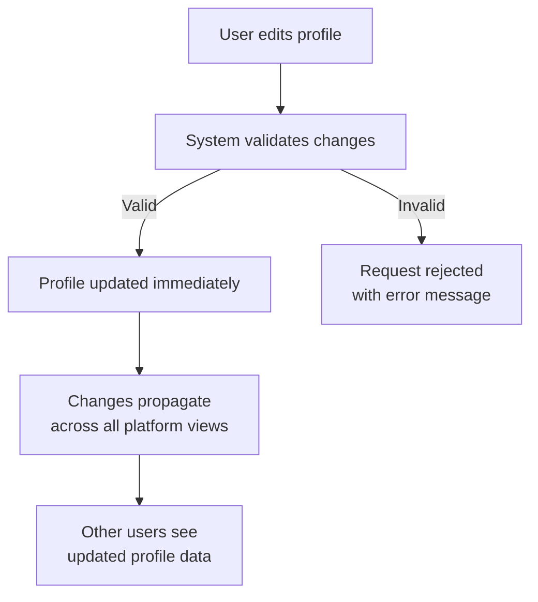
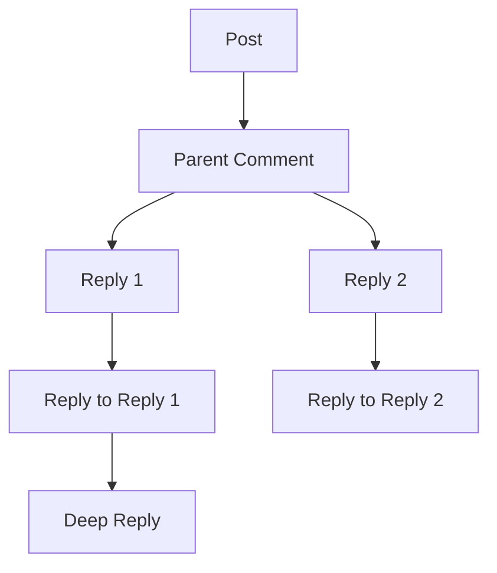
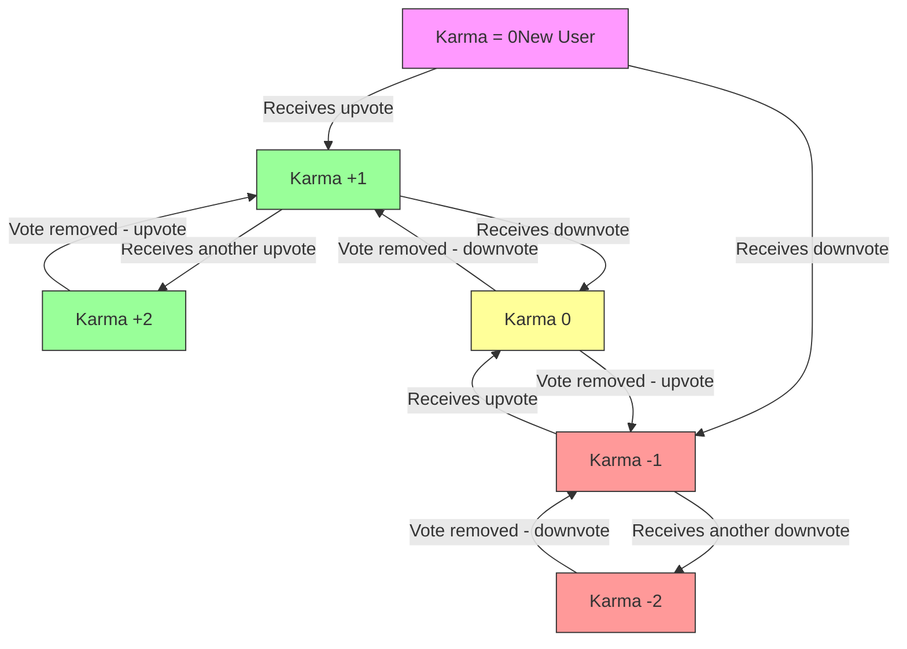

**communityPlatform — Business rules, validation constraints, data browsing expectations, error scenarios**

Business rules, validation constraints, data browsing expectations, error scenarios

# Domain Business Rules

Per-concept business rules, validation logic, and domain constraints.

## User Rules

Users must sign up with an email address and password, and choose a unique username that distinguishes them from other users. Email addresses serve as the primary authentication identifier for login purposes. Usernames must be unique across the entire platform to prevent conflicts. Users can change their password through a dedicated password change flow. Account deletion results in the removal of all associated user data including posts and comments. Users cannot create multiple accounts with the same email address. The system ensures that username uniqueness is enforced at creation and during username changes. Password changes require verification of the user's current password for security. Deleted accounts are permanently removed with no option for recovery. User authentication requires both email and password to match stored credentials.

### Email Requirements for User Accounts

### Email Requirements for User Accounts

When a user signs up, they must provide an email address.
The email address is required for all sign-up requests.

The email address serves as the primary authentication identifier for login purposes.
Users must log in using their email address and password.

Each email address can only be associated with one user account.
If a user attempts to sign up with an email address already in use, the request is rejected.
Users cannot create multiple accounts with the same email address.

### Username Uniqueness Rules

### Username Uniqueness Rules

When a user signs up, they must choose a username.
The username must be unique across the entire platform.

If a user attempts to sign up with a username already in use by another user, the request is rejected.
The system enforces username uniqueness at account creation.

The uniqueness constraint applies to all username operations, including potential future username changes.
Two users cannot have identical usernames at any time.

### Password Security and Verification

### Password Security and Verification

When a user signs up, they must provide a password.
The password is required for all sign-up requests.

When a user logs in, the system verifies that the provided email address and password match the stored credentials.
If the email address or password does not match, the login request is rejected.

When a user changes their password, they must verify their current password.
If the current password verification fails, the password change request is rejected.
Password changes require successful verification of the user's current password for security purposes.

### Account Deletion Rules

### Account Deletion Rules

When a user deletes their account, all their associated data is removed.
This includes all posts created by the user and all comments written by the user.

Account deletion results in permanent removal of the user account.
Deleted accounts cannot be recovered.

All user data removal occurs as part of the account deletion process.
The system ensures that all posts and comments authored by the user are removed when the account is deleted.

## Profile Rules

Every user has exactly one profile containing a display name, biography text, and avatar image. Users can edit their own profile details including display name, bio, and avatar at any time. Profiles are publicly viewable to all users regardless of authentication status. Display names can be changed independently of usernames and do not need to be unique. Biography text has length limitations to prevent excessively long descriptions. Avatar images must meet platform file size and format requirements. Profile pages display the user's total karma score alongside their profile information. The system ensures that profile updates are immediately reflected across the platform. Users cannot edit another user's profile information. Profile data persists even when users are temporarily inactive.

### Profile Creation and Ownership

### Profile Creation and Ownership

Every user who successfully registers with the system automatically receives exactly one profile. The profile is created at the moment of account registration and remains permanently associated with that user.

Users exclusively own their own profile and cannot edit or modify another user's profile.

The profile contains three core elements: a display name, biography text, and an avatar image.

When a user deletes their account, their associated profile is permanently deleted along with all profile information.

### Display Name Rules

### Display Name Rules

Users can edit their display name at any time, independent of their username.

The display name does not need to be unique across the platform; multiple users may have identical display names.

Display names support Unicode characters and can include spaces and punctuation marks.

Users can choose to have no display name, in which case their username will be displayed instead.

Display name changes are effective immediately and propagate throughout the platform.

### Biography Text Constraints

### Biography Text Constraints

Biography text is optional; users may choose to leave their biography blank.

When biography text is provided, it must be plain text only—no formatting codes, HTML, or markdown is supported.

The biography text has a maximum length of 500 characters. If a user attempts to enter more than 500 characters, the request is rejected.

Users can edit their biography text at any time, with previous versions not retained.

Biography text is visible to all users who can view the profile.

### Avatar Image Requirements

### Avatar Image Requirements

Avatar images are optional; users may choose to have no avatar image.

When an avatar image is provided, it must be in JPEG, PNG, or GIF format.

The maximum file size for avatar images is 2MB. If a user attempts to upload a larger file, the request is rejected.

Avatar images must be square dimensions (equal width and height). If a non-square image is uploaded, the system automatically crops it to the largest possible square region centered in the image.

Users can change their avatar image at any time, with previous avatars not retained.

All avatar images are publicly accessible to anyone who can view the profile.

### Profile Visibility and Access

### Profile Visibility and Access

User profiles are publicly viewable to all users regardless of authentication status—both logged-in users and guests can view profiles.

When viewing another user's profile, visitors can see:
- The user's display name
- The user's biography text (if provided)
- The user's avatar image (if provided)
- The user's total karma score
- A list of all posts created by the user
- A list of all comments written by the user

Profile information cannot be hidden or made private—all profiles are fully public.

Users cannot restrict access to specific parts of their profile; all profile elements are equally visible.

### Karma Score Display Rules

### Karma Score Display Rules

Every user's profile displays their current total karma score.

The karma score shown is a single integer that can be positive, negative, or zero.

Karma scores are updated in real-time when votes are cast on the user's posts or comments.

Users cannot manually adjust their own karma score—it is calculated solely from vote activity.

The karma score displayed on a profile is the same value used throughout the platform for that user.

When viewing a profile, the karma score is always visible alongside other profile information.

### Profile Editing Permissions

### Profile Editing Permissions

Users can edit only their own profile—editing another user's profile is prohibited.

Profile editing includes modifying the display name, biography text, and avatar image.

Profile editing does not require special permissions or approval—users can edit their profiles at any time.

Profile changes are effective immediately upon saving and do not require system review.

There are no limits to how frequently users can edit their profiles.

Users cannot delegate profile editing rights to other users.

### Profile Persistence Rules

### Profile Persistence Rules

Profiles persist as long as the associated user account exists.

When a user deletes their account, their profile is permanently deleted along with:
- Display name
- Biography text
- Avatar image
- Profile metadata

Profile data is not archived or retained after account deletion.

Temporary account deactivation (such as suspension) does not delete profile data—the profile remains intact and becomes accessible again if the account is reinstated.

Profile information is never transferred between users.

### Profile Completeness Requirements

### Profile Completeness Requirements

Profiles have no required fields—users can have a completely empty profile if they choose.

The three profile elements (display name, biography text, avatar image) are all optional.

Users can have a display name without a biography or avatar, or any combination of the three elements.

An empty profile (no display name, no biography text, no avatar image) is valid and functional.

Profile completeness does not affect any platform functionality—users with incomplete profiles can perform all normal platform actions.

The system does not prompt users to complete their profiles.

### Profile Update Propagation

### Profile Update Propagation

Profile changes are immediately visible throughout the platform.

When a user changes their display name, the new name appears:
- On their profile page
- On all their posts and comments
- In any lists showing their username
- In moderator and reporting interfaces

When a user changes their avatar image, the new image appears:
- On their profile page
- Next to all their posts and comments
- In any user lists showing avatars

When a user changes their biography text, the new biography appears only on their profile page.

Profile updates do not require page refresh—users viewing content will see updated profile information in real-time.

There is no delay between making a profile change and the change being visible to other users.

## Community Rules

Any authenticated user can create a community by providing a unique name, description text, and icon image. Community names must be unique across the platform to avoid confusion. The creator automatically becomes the community owner with highest authority. Communities require both a name and description to be created. Icon images must adhere to platform specifications for size and format. Community descriptions provide context about the community's purpose and rules. Users can browse all communities through a paginated list view. Community search functionality allows finding communities by name or description keywords. Each community displays its current subscriber count publicly. Community names cannot be changed after creation to maintain consistency. The system enforces uniqueness checks during community creation.

### Community Creation

#### Community Creation

Every authenticated user may create a community.
To create a community, the user must provide a unique name and a description.
The community's icon image is optional.
The user who creates a community is assigned as its owner.
When a user provides a duplicate name, the creation is rejected.
When a user does not provide a name, the creation is rejected.
When a user does not provide a description, the creation is rejected.

### Community Name

#### Community Name

A community's name must be unique across the entire platform.
A community's name cannot be changed after creation.
The system must validate the uniqueness of a community name during creation.
If a duplicate name is found, the request must be rejected.

### Community Owner

#### Community Owner

The user who creates a community automatically becomes its owner.
The owner has the highest authority in the community.
Ownership cannot be transferred.
The owner cannot be removed from the community by any other user.

### Community Description

#### Community Description

A community must have a description.
The description can be edited after creation.
The description provides context about the community's purpose and rules.

### Community Icon

#### Community Icon

A community's icon image is optional.
The icon must adhere to the platform's file size and format specifications.
If the icon does not meet specifications, the request must be rejected.
The icon can be changed after creation.

### Community Browsing

#### Community Browsing

Users can browse a paginated list of all communities.
The list must display each community's name, description, icon, and subscriber count.
Browsing is available to all users, including guests.
The list can be filtered by name using search functionality.

### Community Search

#### Community Search

Users can search for communities by name.
The search must return matching communities in a paginated list.
Search results must show the same information as the community browsing list.
The search functionality is available to all users, including guests.

### Subscriber Count Display

#### Subscriber Count Display

Each community must display its current subscriber count publicly.
The subscriber count must be visible on the community's page and in community lists.
The subscriber count updates whenever a user subscribes or unsubscribes.

## Post Rules

Users can create posts only in communities they are subscribed to. Every post requires a title that cannot be empty. Posts must be one of three types: text posts with content text, link posts with valid URLs, or image posts with uploaded images. Each post type has specific content requirements that must be met. Users can edit their own posts to update title or content. Post deletion removes the post and all associated comments permanently. When viewing a post, users see the title, full content, author details, community information, vote score, comment count, and timestamp. Text posts require content text beyond just the title. Link posts require valid URLs that follow web address formatting. Image posts require successfully uploaded image files. The system validates post type requirements before accepting creation.

### Community Subscription Requirement for Posting

Users can only create posts in communities they are currently subscribed to.

WHEN a user attempts to create a post, THE system SHALL verify the user has an active subscription to the target community.

IF the user does not have an active subscription to the community, THEN THE system SHALL reject the post creation request.

Users must maintain their subscription status to continue creating new posts in a community. If a user unsubscribes from a community while having existing posts, those posts remain visible but the user cannot create new posts until resubscribing.

### Post Title Requirements

Every post must have a title that is not empty.

WHEN a user creates a post, THE system SHALL require a title.

IF the title is empty or contains only whitespace, THEN THE system SHALL reject the post creation request.

The title serves as the primary identifier for the post in feeds and lists. Users can edit the title after creation, but the edited title must also not be empty.

IF a user attempts to save a post with an empty title during editing, THEN THE system SHALL reject the edit request.

### Post Type Categorization

Posts must be categorized as one of three types: text, link, or image.

WHEN a user creates a post, THE system SHALL require the user to select one post type.

The post type determines which additional content fields are required:
- Text posts require text content
- Link posts require a URL
- Image posts require an uploaded image

IF a user does not select a post type, THEN THE system SHALL reject the post creation request.

The post type cannot be changed after creation. If a user wants a different type, they must create a new post.

### Text Post Content Requirements

Text posts must contain text content beyond just the title.

WHEN a user creates a text post, THE system SHALL require text content.

IF the text content is empty or contains only whitespace, THEN THE system SHALL reject the post creation request.

The text content supports formatting that preserves user-entered line breaks and spacing.

Users can edit text post content after creation, but the edited content must also not be empty.

IF a user attempts to save a text post with empty content during editing, THEN THE system SHALL reject the edit request.

### Link Post URL Validation

Link posts must contain a valid URL.

WHEN a user creates a link post, THE system SHALL validate the URL format.

IF the URL is empty, THEN THE system SHALL reject the post creation request.

IF the URL format is invalid (does not match web address patterns), THEN THE system SHALL reject the post creation request.

The system extracts the domain name from link posts for display purposes (e.g., "youtube.com").

Users can edit link post URLs after creation, but the edited URL must also pass validation.

IF a user attempts to save a link post with an invalid URL during editing, THEN THE system SHALL reject the edit request.

### Image Post Upload Requirements

Image posts must contain a successfully uploaded image.

WHEN a user creates an image post, THE system SHALL require an uploaded image file.

IF no image file is uploaded, THEN THE system SHALL reject the post creation request.

The system generates a thumbnail from uploaded images for display in post lists.

Once an image post is created, the image cannot be replaced with a different image. Users can only edit the title of image posts.

IF a user attempts to upload an invalid image file (corrupted or unsupported format), THEN THE system SHALL reject the post creation request.

### Post Editing Authorization

Users can only edit their own posts.

WHEN a user attempts to edit a post, THE system SHALL verify the user is the author of the post.

IF the user is not the author of the post, THEN THE system SHALL reject the edit request.

Users can edit post titles and content based on post type:
- Text posts: title and text content
- Link posts: title and URL
- Image posts: title only

Post type cannot be changed through editing.

Edited posts retain their original creation timestamp but display an "edited" indicator.

### Post Deletion and Cascading Removal

Users can delete their own posts, which permanently removes the post and all associated content.

WHEN a user deletes a post, THE system SHALL remove:
- The post itself
- All comments on the post
- All votes on the post
- All votes on comments within the post
- All reports on the post and its comments

Karma adjustments from deleted votes are not reversed.

Users cannot recover deleted posts.

IF a user attempts to delete a post they did not create, THEN THE system SHALL reject the deletion request.

Post deletion affects the community's post count and the author's post list.

### Post View Information Display

When viewing a single post, users see comprehensive information:
- Post title
- Full content (text, URL, or image depending on post type)
- Author username
- Community name
- Vote score (total upvotes minus total downvotes)
- Comment count
- Time since posted (relative timestamp)
- Post type indicator

For text posts in lists, only the first 200 characters of content are displayed.

For image posts in lists, a thumbnail of the image is displayed.

For link posts in lists, the domain name of the URL is displayed.

All post views show the same core information regardless of the viewer's subscription status.

### Post Type Validation Logic

The system validates post content based on the selected post type.

WHEN validating a text post, THE system SHALL:
- Require non-empty title
- Require non-empty text content

WHEN validating a link post, THE system SHALL:
- Require non-empty title
- Require non-empty URL
- Validate URL format

WHEN validating an image post, THE system SHALL:
- Require non-empty title
- Require uploaded image file
- Validate image file

IF a post fails type-specific validation, THEN THE system SHALL reject the creation request with a clear error message indicating which requirement failed.

Validation occurs both during post creation and post editing.

### Community Posting Permissions

Posting permissions in communities are governed by subscription status and ban status.

Users with active subscriptions to a community can create posts in that community.

Users banned from a community cannot create posts in that community, even if subscribed.

Community moderators can create posts regardless of subscription status.

Community owners can create posts regardless of subscription status.

WHEN checking posting permissions, THE system SHALL evaluate:
1. Is the user subscribed to the community? (Required for regular members)
2. Is the user banned from the community? (Prohibits all posting)
3. Is the user a moderator or owner of the community? (Bypasses subscription requirement)

IF a regular member attempts to post without subscription, THEN THE system SHALL reject the request.

IF a banned user attempts to post, THEN THE system SHALL reject the request regardless of subscription status.

## Comment Rules

Users can write comments on any post regardless of subscription status. Comments support unlimited nesting with replies to replies creating threaded discussions. Each comment requires text content that cannot be empty. Users can edit their own comments to modify content. Comment deletion removes the comment and any nested replies permanently. Comments display author information, content text, vote score, timestamp, and nested replies. The system ensures comment threads maintain proper parent-child relationships. Users cannot edit comments written by other users. Comment content must adhere to platform content guidelines. Deleted comments are permanently removed from view. Comment editing preserves the original timestamp for creation but updates modification time.

### Comment Creation

### Comment Creation

Users can write comments on any post, regardless of whether they are subscribed to the community. The system shall require non-empty text content for every comment. Each comment must be associated with a valid post. The system shall ensure users can only comment on posts that are visible and active.

**Error scenarios:**
- If the post does not exist, the comment creation request shall be rejected.
- If the post has been deleted or removed, the comment creation request shall be rejected.
- If the user is banned from the community, the comment creation request shall be rejected.
- If the comment text content is empty or contains only whitespace, the comment creation request shall be rejected.

### Comment Nesting and Replies

### Comment Nesting and Replies

The system shall support unlimited nesting of comments through replies. Users can reply to any comment, including replies to replies, creating threaded discussions. Each comment must maintain proper parent-child relationships within the thread. The system shall ensure that comment threads preserve their structure even when individual comments are edited or deleted.

**Error scenarios:**
- If the parent comment does not exist, the reply creation request shall be rejected.
- If the parent comment has been deleted, the reply creation request shall be rejected.
- If the thread depth exceeds system limits (if any exist), the reply creation request shall be rejected.

### Comment Content Requirements

### Comment Content Requirements

Every comment shall have text content. The system shall require comment text to be non-empty and not consist solely of whitespace characters. Comments may contain any characters supported by the platform's text encoding. The system shall apply content guidelines to ensure appropriate language and prevent abuse.

**Content guidelines:**
- Comments shall not contain hate speech, harassment, or threats.
- Comments shall not contain spam, promotional content, or advertisements.
- Comments shall respect community-specific rules where applicable.
- Comments shall not contain personally identifiable information of other users.

**Error scenarios:**
- If comment content violates platform guidelines, the comment creation or edit request shall be rejected.
- If comment content exceeds maximum length limits (if defined), the request shall be rejected.
- If comment contains prohibited characters or formatting, the request shall be rejected.

### Comment Editing

### Comment Editing

Users can edit their own comments to modify the text content. The system shall preserve the original creation timestamp when a comment is edited. The system shall update the modification timestamp to reflect when the edit occurred. Edited comments shall maintain their position in the comment thread and all relationships with parent and child comments.

**Error scenarios:**
- If a user attempts to edit a comment they did not create, the edit request shall be rejected.
- If a comment has been deleted, the edit request shall be rejected.
- If the edited content is empty or contains only whitespace, the edit request shall be rejected.
- If the comment is too old to be edited (based on platform policy), the edit request shall be rejected.

### Comment Deletion

### Comment Deletion

Users can delete their own comments. When a comment is deleted, all its nested replies shall also be deleted permanently. The system shall remove deleted comments and their replies from view immediately. Deleted comments cannot be recovered through normal user actions.

**Error scenarios:**
- If a user attempts to delete a comment they did not create, the deletion request shall be rejected.
- If the comment has already been deleted, the deletion request shall be rejected.
- If the comment is part of an active moderation action, the deletion request may be restricted.

### Comment Thread Relationships

### Comment Thread Relationships

The system shall maintain parent-child relationships between comments to preserve thread structure. Each comment shall reference its parent comment (if any) and maintain a list of child comments. The system shall ensure that comment threads remain coherent even when individual comments are deleted or edited.

**Relationship rules:**
- A comment without a parent is a top-level comment attached directly to a post.
- A comment with a parent is a reply within a thread.
- When a parent comment is deleted, all child comments shall also be deleted.
- Comment relationships shall be preserved during editing operations.

**Error scenarios:**
- If a comment references a non-existent parent, the system shall reject the relationship.
- If circular references are detected in comment relationships, the system shall reject the configuration.
- If orphaned comments are detected (parent deleted but child remains), the system shall clean up the inconsistency.

### Comment Display Information

### Comment Display Information

When displaying a comment, the system shall show:
- Author's username
- Text content
- Vote score (total upvotes minus total downvotes)
- Time since posted (relative timestamp, e.g., "3 hours ago")
- Nested replies displayed in their proper hierarchical position
- Indication if the comment has been edited

**Display rules:**
- Deleted comments shall not be displayed to users.
- Comments by banned users shall still be visible unless removed by moderators.
- Edited comments shall display an indication that they have been modified.
- Comment threads shall be displayed with proper indentation to show nesting levels.

**Error scenarios:**
- If comment data is incomplete or corrupted, the system shall display an appropriate error message instead of the comment.
- If a comment's author information cannot be retrieved, the system shall display a generic placeholder.

### Comment Ownership and Editing Restrictions

### Comment Ownership and Editing Restrictions

Only the author of a comment can edit that comment. The system shall verify comment ownership before allowing any edit operations. Users cannot edit comments written by other users under any circumstances. Comment editing permissions are tied to the original creator and do not transfer to other users.

**Ownership rules:**
- Comment ownership is established at creation time and cannot be transferred.
- Moderators cannot edit user comments, only delete them.
- Community owners cannot edit user comments, only delete them.
- System administrators follow platform-wide policies for comment management.

**Error scenarios:**
- If ownership verification fails, the edit request shall be rejected.
- If the comment author's account has been deleted, the comment becomes read-only and cannot be edited.
- If there is a conflict in ownership records, the system shall prevent editing until the conflict is resolved.

### Comment Content Guidelines Enforcement

### Comment Content Guidelines Enforcement

The system shall enforce content guidelines for all comments. Comments that violate platform rules shall be subject to moderation actions. The system shall provide mechanisms for users to report guideline violations.

**Guideline enforcement rules:**
- Comments containing prohibited content shall be subject to removal by moderators.
- Repeated guideline violations by a user may result in temporary or permanent restrictions.
- Community-specific guidelines shall be enforced within their respective communities.
- Automated content filtering may flag comments for moderator review.

**Error scenarios:**
- If automated filtering incorrectly flags legitimate content, users shall have a mechanism to appeal.
- If guideline enforcement conflicts with community-specific rules, community rules shall take precedence within that community.
- If content review processes fail, the system shall default to preserving the comment pending manual review.

### Comment Timestamp Preservation

### Comment Timestamp Preservation

The system shall preserve the original creation timestamp of comments. When a comment is edited, the creation timestamp shall remain unchanged. The system shall maintain a separate modification timestamp that updates with each edit. Both timestamps shall be stored and available for display purposes.

**Timestamp rules:**
- Creation timestamp: when the comment was originally posted
- Modification timestamp: when the comment was last edited (null if never edited)
- Displayed "time since posted" shall always reference the creation timestamp
- Edited comments may display both creation and last edit times

**Error scenarios:**
- If timestamp data is corrupted or missing, the system shall use the earliest available timestamp.
- If modification timestamps precede creation timestamps, the system shall correct the inconsistency.
- If timestamp synchronization fails, the system shall use server time as a fallback.

## Vote Rules

Users can vote on both posts and comments within the platform. Each user can cast only one vote per post or comment, either upvote or downvote. Users can change their vote from upvote to downvote or vice versa at any time. Votes can be removed entirely, returning the item to a non-voted state. Vote scores are calculated as total upvotes minus total downvotes. Upvotes add 1 to the item's score while downvotes subtract 1. Removing a vote adjusts the score by reversing the previous vote's effect. The system prevents users from voting on their own posts or comments. Vote changes are reflected immediately in both the score and user karma. Vote history tracks changes but only the current vote state affects scores.

### Single Vote Per Item

### Single Vote Per Item

THE system SHALL ensure each user can cast only one vote per post or comment.
WHEN a user attempts to cast a vote on a post or comment they have already voted on, THEN THE system SHALL prevent the duplicate vote.
WHERE a vote exists, THE system SHALL allow vote type change or removal instead of creating a new vote.

### Vote Type Change Allowed

### Vote Type Change Allowed

THE system SHALL allow users to change their vote type from upvote to downvote or vice versa.
WHEN a user changes their vote type, THEN THE system SHALL update the vote score accordingly.
WHERE a vote is changed, THE system SHALL adjust both the item's vote score and the affected user's karma.

### Vote Removal Functionality

### Vote Removal Functionality

THE system SHALL allow users to remove their vote entirely.
WHEN a user removes their vote, THEN THE system SHALL revert the vote's effect on the item's score.
WHERE a vote is removed, THE system SHALL also revert the karma adjustment for the affected user.

### Vote Score Calculation

### Vote Score Calculation

THE system SHALL calculate vote scores as total upvotes minus total downvotes.
WHEN votes are cast, changed, or removed, THEN THE system SHALL recalculate the vote score immediately.
THE system SHALL store vote scores as integers that can be positive, negative, or zero.

### Upvote Effect on Score

### Upvote Effect on Score

THE system SHALL add 1 to the item's vote score when a user upvotes.
WHEN a user changes from downvote to upvote, THEN THE system SHALL increase the score by 2 (removing -1 and adding +1).
WHERE a user removes an upvote, THEN THE system SHALL decrease the score by 1.

### Downvote Effect on Score

### Downvote Effect on Score

THE system SHALL subtract 1 from the item's vote score when a user downvotes.
WHEN a user changes from upvote to downvote, THEN THE system SHALL decrease the score by 2 (removing +1 and adding -1).
WHERE a user removes a downvote, THEN THE system SHALL increase the score by 1.

### Self-Voting Prevention

### Self-Voting Prevention

THE system SHALL prevent users from voting on their own posts or comments.
WHEN a user attempts to vote on content they created, THEN THE system SHALL reject the vote request.
THE system SHALL provide a clear error message indicating self-voting is not allowed.

### Vote Change Karma Adjustment

### Vote Change Karma Adjustment

THE system SHALL adjust a user's karma when votes on their content are changed.
WHEN a vote on a user's content changes from upvote to downvote, THEN THE system SHALL decrease the user's karma by 2.
WHEN a vote on a user's content changes from downvote to upvote, THEN THE system SHALL increase the user's karma by 2.
WHERE a vote is removed, THEN THE system SHALL reverse the karma effect of that vote.

### Vote State Tracking

### Vote State Tracking

THE system SHALL track the current vote state for each user on each post or comment.
THE system SHALL maintain vote history to support vote changes and removals.
WHERE a vote exists, THE system SHALL record the vote type, timestamp, and associated user.

### Immediate Vote Reflection

### Immediate Vote Reflection

THE system SHALL reflect vote changes immediately in both vote scores and user karma.
WHEN a user changes their vote, THEN THE system SHALL update the displayed vote score and karma without requiring page refresh.
THE system SHALL ensure vote counts and scores are consistent across all views of the same content.

## Subscription Rules

Users can subscribe to any community on the platform. Subscriptions are required for users to create posts within a community. Users can unsubscribe from communities at any time. Each subscription creates a relationship between user and community. Users can view a list of all communities they are currently subscribed to. The system tracks subscription status as active or inactive. Subscribing to a community adds it to the user's home feed. Unsubscribing removes the community from the home feed. Users cannot be subscribed to the same community multiple times. Subscription status affects post creation permissions validation. The subscription list helps users manage their content consumption preferences.

### Subscription to Communities

Users can subscribe to any community on the platform. Users cannot subscribe to the same community more than once. If a user attempts to subscribe to a community they are already subscribed to, the request is rejected.

### Post Creation Subscription Requirement

Users must be subscribed to a community to create posts in that community. If a user attempts to create a post in a community they are not subscribed to, the request is rejected. This requirement applies only to post creation; users can view and comment on posts in communities they are not subscribed to.

### Unsubscription Functionality

Users can unsubscribe from any community at any time. Unsubscribing does not delete content the user has already posted in that community. After unsubscribing, the community is removed from the user's home feed and the user can no longer create new posts in that community unless they resubscribe.

### Subscription Relationship Creation

When a user subscribes to a community, a subscription relationship is created between the user and the community. This relationship includes the subscription timestamp. Each subscription relationship is unique to the user-community pair. The subscription relationship has an active status by default.

### Subscription List Viewing

Users can view a list of all communities they are currently subscribed to. The list shows each community's name, description, icon, and subscriber count. Users cannot view other users' subscription lists unless the other user shares it publicly (which is not a standard feature). The subscription list can be filtered and sorted by community name, subscription date, or subscriber count.

### Subscription Status Tracking

The system tracks whether a user's subscription to a community is active or inactive. When a user subscribes, the status becomes active. When a user unsubscribes, the status becomes inactive. Only active subscriptions affect post creation permissions. Users can resubscribe to a community they previously unsubscribed from, which changes the status back to active.

### Home Feed Subscription Effect

Subscribing to a community adds posts from that community to the user's home feed. Unsubscribing from a community removes posts from that community from the user's home feed. The home feed only shows posts from communities the user is currently subscribed to with active subscription status. Posts from communities the user is not subscribed to do not appear in the home feed.

### Single Subscription Per Community

A user can have only one subscription to each community. The system prevents duplicate subscriptions. If a user attempts to subscribe to the same community multiple times, the request is rejected. This ensures that vote counts and other community engagement metrics are not duplicated.

### Post Permission Validation

When a user attempts to create a post, the system validates that the user has an active subscription to the target community. If the user's subscription is inactive or does not exist, the post creation request is rejected. This validation occurs before any post content is saved to the system.

### Subscription Management

Users can manage their subscriptions through a dedicated subscription management interface. Management actions include viewing subscribed communities, subscribing to new communities, and unsubscribing from communities. Subscription changes take effect immediately. There is no limit to the number of communities a user can subscribe to.

## Karma Rules

Every user has a single karma score represented as an integer. Karma increases by 1 when someone upvotes the user's post or comment. Karma decreases by 1 when someone downvotes the user's post or comment. Removing a vote adjusts karma by reversing the previous vote's effect. Karma can be negative if downvotes outweigh upvotes. Karma scores are displayed on user profile pages. The system recalculates karma whenever votes are added, changed, or removed. Karma reflects overall community appreciation of a user's contributions. Users cannot directly manipulate their own karma score. Karma changes are applied immediately when votes are cast or modified. Karma serves as a reputation metric within the platform.

### Single Karma Score Per User

THE communityPlatform SHALL maintain exactly one karma score per user account. The karma score SHALL be represented as an integer that can be positive, negative, or zero. Each user's karma SHALL NOT have multiple sub-scores or category-specific karma values. When a user account is created, the system SHALL initialize their karma score to zero.

### Karma Adjustment from Votes

WHEN a user upvotes another user's post or comment, THE communityPlatform SHALL increase the recipient's karma score by 1.

WHEN a user downvotes another user's post or comment, THE communityPlatform SHALL decrease the recipient's karma score by 1.

WHEN a user changes their vote from upvote to downvote on a post or comment, THE communityPlatform SHALL adjust the recipient's karma by decreasing it by 2 (removing the +1 from the upvote and applying the -1 from the downvote).

WHEN a user changes their vote from downvote to upvote on a post or comment, THE communityPlatform SHALL adjust the recipient's karma by increasing it by 2 (removing the -1 from the downvote and applying the +1 from the upvote).

WHEN a user removes their vote entirely from a post or comment, THE communityPlatform SHALL adjust the recipient's karma by reversing the effect of their previous vote (+1 for upvote removal, -1 for downvote removal).

### Negative Karma Validation

THE communityPlatform SHALL allow karma scores to be negative integers. There SHALL be no minimum lower bound for karma scores. Users with negative karma SHALL retain full platform functionality as defined by their role permissions. Negative karma SHALL be displayed with a minus sign prefix (e.g., "-15") wherever karma is shown.

### Karma Profile Display

WHERE a user profile is viewed, THE communityPlatform SHALL display the user's current karma score prominently. The karma score SHALL be displayed as a formatted integer (e.g., "1,234" for positive scores, "-56" for negative scores). Karma SHALL be visible to all users who can view the profile, regardless of their authentication status. The displayed karma SHALL be the real-time current score, not a cached or delayed value.

### Karma Recalculation Triggers

THE communityPlatform SHALL recalculate a user's karma score WHEN:
1. Any vote is cast on their posts or comments
2. Any existing vote on their posts or comments is changed
3. Any vote on their posts or comments is removed
4. Any of their posts or comments are deleted
5. Any vote is cast on comments they have written (regardless of comment nesting depth)

Recalculation SHALL consider all votes on all active posts and comments authored by the user. Deleted or removed content SHALL NOT contribute to karma calculations after deletion.

### Karma as Reputation Metric

THE communityPlatform SHALL treat karma as a reputation metric representing the community's overall assessment of a user's contributions. Karma SHALL reflect the cumulative effect of all votes received on all posts and comments. Higher karma SHALL indicate greater community approval. Lower or negative karma SHALL indicate community disapproval. Karma SHALL serve as a public indicator of contribution quality and community standing.

### Karma Manipulation Prevention

THE communityPlatform SHALL prevent users from directly manipulating their own karma scores. Users SHALL NOT be able to:
1. Set or reset their karma to any value
2. Award themselves karma points
3. Create artificial voting patterns to inflate their karma
4. Remove legitimate votes on their content to avoid karma decreases
5. Transfer karma between user accounts

Karma adjustments SHALL only occur as a side effect of legitimate voting actions by other users on the user's content.

### Immediate Karma Updates

THE communityPlatform SHALL apply karma score updates immediately when the triggering event occurs. There SHALL be no delay, batching, or scheduled updates for karma calculations. When a vote is cast, changed, or removed, the recipient's karma SHALL be updated before the voting action is confirmed to the voting user. All subsequent views of the recipient's profile or content SHALL reflect the updated karma score.

### Karma State Transitions

The diagram above illustrates common karma state transitions based on voting actions. Each transition represents an immediate update to the user's karma score based on the type of vote received or removed.

## ModerationRole Rules

The community creator automatically becomes the owner with highest authority. Owners can add other users as moderators for their community. Owners can remove moderators from their moderation roles. Moderators can add other users as moderators but cannot remove them. Moderators cannot remove the community owner under any circumstances. Moderators cannot remove other moderators; only owners have that privilege. Each moderation role has a type designation: owner or moderator. Role assignments are timestamped for tracking purposes. The system validates role hierarchy before allowing moderation actions. Owners maintain ultimate control over community moderation team composition. Role assignments affect permission levels for community management tasks.

### Moderation Role Creation

### Creation of Owner Role

When a user creates a community, THE system SHALL automatically create a moderation role for that user with the role type "owner".

THE system SHALL timestamp the role assignment with the current date and time when the community is created.

THE system SHALL validate that the user creating the community has an active account and is not banned from the platform.

IF the user attempting to create a community is banned from the platform, THEN THE system SHALL reject the community creation request.

### Role Hierarchy and Owner Authority

OWNER ultimate authority: While the moderation role type is "owner", THE system SHALL grant the user the highest level of authority over the community, including the ability to add and remove moderators, manage bans, and delete any content within the community.

OWNER removal restriction: IF any attempt is made to remove a moderation role with type "owner", THEN THE system SHALL reject the request and maintain the owner role assignment unchanged.

OWNER creation from community creator: THE system SHALL ensure that every community has exactly one user assigned as the owner, and this assignment is created automatically when the community is established.

### Moderator Assignment and Removal

### Adding Moderators

Moderator addition by owner: WHEN a user with an "owner" moderation role requests to add another user as a moderator for the community, THE system SHALL create a moderation role for the target user with the role type "moderator".

THE system SHALL timestamp the moderator role assignment with the current date and time when the addition is approved.

Moderator addition by moderators: WHEN a user with a "moderator" moderation role requests to add another user as a moderator, THE system SHALL create a moderation role for the target user with the role type "moderator".

### Removing Moderators

Moderator removal by owner: WHEN a user with an "owner" moderation role requests to remove a moderator from their role, THE system SHALL deactivate the moderator's moderation role.

Moderator removal restriction: IF a user with a "moderator" moderation role attempts to remove another moderator, THEN THE system SHALL reject the removal request.

IF a user with a "moderator" moderation role attempts to remove the owner, THEN THE system SHALL reject the removal request.

### Role Assignment Validation

Role hierarchy validation: BEFORE creating or modifying any moderation role, THE system SHALL validate that the requesting user has sufficient authority based on their current moderation role type.

WHERE role assignment, THE system SHALL ensure the target user is not already assigned a moderation role for the same community with an active status.

IF the target user already has an active moderation role for the community, THEN THE system SHALL reject the assignment request.

### Moderation Role Properties and Permissions

### Role Type Definitions

Moderation role types: THE system SHALL support exactly two moderation role types: "owner" and "moderator".

Role assignment timestamping: THE system SHALL record the exact date and time when each moderation role is assigned to a user.

Role status tracking: THE system SHALL maintain a status for each moderation role (active/inactive) to track whether the role is currently in effect.

### Permission Levels

Moderation permission levels: WHERE role type is "owner", THE system SHALL grant permissions to:
- Add moderators to the community
- Remove moderators from the community
- Manage all moderation actions (delete posts/comments, ban/unban users)
- View all reports for the community
- Approve or dismiss reports

WHERE role type is "moderator", THE system SHALL grant permissions to:
- Add other users as moderators to the community
- Delete any post in the community
- Delete any comment in the community
- Ban users from the community
- Unban users from the community
- View the list of banned users
- View all reports for the community
- Approve or dismiss reports

### Permission Validation

THE system SHALL validate the user's moderation role type and status BEFORE allowing any moderation action.

IF a user attempts a moderation action without an active moderation role for the community, THEN THE system SHALL reject the action.

WHERE role hierarchy validation, THE system SHALL check that:
1. Owners can perform all moderation actions
2. Moderators can perform all moderation actions except removing other moderators
3. No user can remove the owner from their role

### Error Conditions and Validation Rules

### Error Scenarios

WHEN a user attempts to assign a moderation role to themselves, THEN THE system SHALL reject the request.

WHEN a user attempts to assign a moderation role to a user who is banned from the community, THEN THE system SHALL reject the request.

WHEN a user attempts to assign a moderation role to a user who is banned from the platform, THEN THE system SHALL reject the request.

WHEN a user attempts to modify a moderation role that does not exist, THEN THE system SHALL reject the request.

WHEN a non-member user attempts any moderation action, THEN THE system SHALL reject the request.

### Business Constraints

THE system SHALL ensure that every community has exactly one owner at all times.

IF a community owner deletes their account, THEN THE system SHALL reassign ownership to the most senior moderator based on role assignment timestamp.

IF a community has no moderators when the owner deletes their account, THEN THE system SHALL mark the community as orphaned and prevent new posts until a new owner is assigned by platform administrators.

THE system SHALL prevent circular moderation role assignments (e.g., User A assigning User B who then assigns User A).

### State Transition Validation

BEFORE deactivating a moderation role, THE system SHALL validate that:
1. The requesting user has authority to perform the removal
2. The target role is not the owner role (unless handled by platform administrators)
3. The community will still have at least one active moderator if removing a moderator

IF any validation fails, THEN THE system SHALL reject the role modification request.

## Ban Rules

Moderators can ban users from their community to restrict participation. Banned users cannot create new posts or comments in that community. Banned users can still view community content but cannot interact. Moderators can unban users, restoring their posting and commenting privileges. Each ban includes a reason text explaining why the user was banned. Bans are specific to individual communities, not platform-wide. The system maintains a list of banned users for each community. Moderators can view the banned user list to manage restrictions. Bans override normal user permissions for the affected community. Unbanning removes all restrictions immediately. Ban reasons help users understand why they were restricted.

### Ban Creation Rules

### Ban Creation Rules

**Rule BR-BAN-001: Ban Authorization**
WHERE moderators manage community participation, THE system SHALL allow moderators to ban users from their community.

**Rule BR-BAN-002: Ban Reason Requirement**
WHEN a moderator bans a user, THE system SHALL require a reason text explaining why the user was banned.

**Rule BR-BAN-003: Community-Specific Restriction**
WHEN a user is banned from a community, THE system SHALL restrict the ban's effect to that specific community only.

**Rule BR-BAN-004: Post Creation Restriction**
WHILE a user is banned from a community, THE system SHALL prevent the user from creating new posts in that community.

**Rule BR-BAN-005: Comment Creation Restriction**
WHILE a user is banned from a community, THE system SHALL prevent the user from creating new comments in that community.

**Rule BR-BAN-006: Content Viewing Permission**
WHILE a user is banned from a community, THE system SHALL allow the user to continue viewing community content.

**Rule BR-BAN-007: Ban Permission Override**
WHILE a user is banned from a community, THE system SHALL override the user's normal posting and commenting permissions for that community.

**Rule BR-BAN-008: Banned User List Maintenance**
WHEN a user is banned or unbanned, THE system SHALL maintain an accurate list of banned users for each community.

**Rule BR-BAN-009: Ban List Viewing**
WHERE moderators manage community restrictions, THE system SHALL allow moderators to view the list of banned users for their community.

### Unban Rules

### Unban Rules

**Rule BR-UBAN-001: Unban Authorization**
WHERE moderators manage community participation, THE system SHALL allow moderators to unban users from their community.

**Rule BR-UBAN-002: Immediate Unban Effect**
WHEN a moderator unbans a user, THE system SHALL immediately remove all posting and commenting restrictions for that user in that community.

**Rule BR-UBAN-003: Permission Restoration**
WHEN a user is unbanned from a community, THE system SHALL restore the user's normal posting and commenting permissions for that community.

**Rule BR-UBAN-004: Ban List Update**
WHEN a user is unbanned, THE system SHALL remove the user from the community's banned user list.

**Rule BR-UBAN-005: Unban Without Reason**
WHEN a moderator unbans a user, THE system SHALL NOT require a reason for unbanning.

### Ban Enforcement Scenarios

### Ban Enforcement Scenarios

**Scenario BR-BAN-SCEN-001: Attempt to Post While Banned**
WHEN a banned user attempts to create a post in the community they are banned from, THE system SHALL reject the request and inform the user they are banned from that community.

**Scenario BR-BAN-SCEN-002: Attempt to Comment While Banned**
WHEN a banned user attempts to create a comment in the community they are banned from, THE system SHALL reject the request and inform the user they are banned from that community.

**Scenario BR-BAN-SCEN-003: Viewing Content While Banned**
WHEN a banned user attempts to view posts or comments in the community they are banned from, THE system SHALL allow the request and display the content.

**Scenario BR-BAN-SCEN-004: Unban Validation**
WHEN a moderator attempts to unban a user who is not currently banned, THE system SHALL reject the request and inform the moderator that the user is not banned.

**Scenario BR-BAN-SCEN-005: Cross-Community Posting**
WHEN a user banned from Community A attempts to post in Community B, THE system SHALL allow the request if the user is not banned from Community B.

**Scenario BR-BAN-SCEN-006: Moderator Self-Ban Prevention**
WHEN a moderator attempts to ban themselves from their own community, THE system SHALL reject the request and prevent self-banning.

## Report Rules

Users can report any post or comment they find inappropriate. Reporting requires providing a reason text explaining the concern. Reports are submitted to the moderators of the relevant community. Moderators can view all pending reports for their community. Each report shows the reported content, reporting user, and reason text. Moderators can approve reports, resulting in content deletion. Moderators can dismiss reports, keeping the content visible. Dismissed reports are removed from the active report list. Approved reports trigger immediate removal of the reported content. The system tracks report status as pending, approved, or dismissed. Reports help maintain community standards and content quality. Moderators must review reports before taking action.

### Reporting Requirements

Users can report any post they find inappropriate for any reason.
Users can report any comment they find inappropriate for any reason.
When submitting a report, users must provide a reason text explaining their concern.
The system sends all submitted reports to the moderators of the relevant community.
Reports cannot be submitted without providing a reason text.
Users cannot report their own posts or comments.
Users can only report each post or comment once.
Reports cannot be submitted for content that has already been deleted.
Report submissions are timestamped with the date and time of submission.

### Report Status and Lifecycle

Every report has a status that indicates its current state.
The system tracks report status as pending, approved, or dismissed.
When a report is first submitted, its status is pending.
Moderators review pending reports and decide whether to approve or dismiss them.
When a moderator approves a report, the status changes to approved.
When a moderator dismisses a report, the status changes to dismissed.
Approved reports trigger immediate removal of the reported content.
Dismissed reports are removed from the active report list and do not affect content.
The system records the date and time when a report changes status.
The system records which moderator made the approval or dismissal decision.
Approved reports cannot be reopened or redismissed.
Dismissed reports cannot be reopened or reapproved.
The system maintains a complete history of all report status changes for audit purposes.

### Moderator Review Process

Moderators can view all pending reports for their community.
Each report in the list shows:
- The reported content (post title and first 200 characters or comment text)
- The username of the user who submitted the report
- The reason text provided by the reporting user
- The date and time the report was submitted

Moderators must review reports before taking any action.
When reviewing a report, moderators can view the full content of the reported post or comment.
Moderators can also view the reporting user's profile to understand their reporting history.

For each report, moderators can choose one of two actions:
1. Approve the report, which deletes the reported content
2. Dismiss the report, which keeps the content visible

When a moderator approves a report:
- The reported content is immediately deleted
- If the content is a post, all comments on that post are also deleted
- The user who created the content receives a notification about the removal
- The karma of the content creator is affected by the deletion (as per deletion rules)

When a moderator dismisses a report:
- The reported content remains visible
- The report is removed from the active report list
- The user who submitted the report does not receive a notification about the dismissal

Moderators cannot approve or dismiss reports for content in other communities.
Moderators cannot approve or dismiss reports that have already been processed.
If a moderator tries to take action on a report that no longer exists, the request is rejected.

### Content Visibility During Reporting

When a report is pending, the reported content remains visible to all users.
Users can continue to view, vote on, and comment on content that has been reported.
The reporting process does not affect the visibility or functionality of the reported content.
Only after a report is approved does the content become invisible to all users.
If a post has multiple pending reports, it remains visible until a moderator approves one of the reports.
If a comment has multiple pending reports, it remains visible until a moderator approves one of the reports.
When content is deleted due to an approved report, all associated reports for that content are automatically marked as resolved.

### Validation and Error Scenarios

If a user tries to report a post or comment that does not exist, the request is rejected.
If a user tries to report their own post or comment, the request is rejected.
If a user tries to report a post or comment they have already reported, the request is rejected.
If a user tries to submit a report without providing a reason text, the request is rejected.
If a user tries to submit a report for content that has already been deleted, the request is rejected.
If a moderator tries to view reports for a community they do not moderate, they see an empty list.
If a moderator tries to approve or dismiss a report that has already been processed, the request is rejected.
If a moderator tries to approve or dismiss a report for content in another community, the request is rejected.
If a moderator tries to approve a report but the content has already been deleted by its author, the approval succeeds but no content deletion occurs.
If a moderator tries to approve a report but the content has already been deleted by another moderator, the approval succeeds but no content deletion occurs.
If a user tries to view a report list without being a moderator, the request is rejected.
If a user tries to take action on a report without being a moderator, the request is rejected.

### Community Standards Enforcement

The reporting system helps moderators enforce community standards.
Moderators use reports to identify content that violates community guidelines.
When moderators approve reports, they remove content that does not meet community standards.
When moderators dismiss reports, they affirm that content meets community standards.
The system helps maintain content quality across all communities.
Moderators should review reports in a timely manner to ensure prompt content moderation.
Frequent reporting by a user does not affect their ability to submit new reports.
Users who submit many reports that are consistently dismissed may be subject to review by moderators.
Moderators can use the reporting system to identify patterns of problematic content or users.
The reporting system provides transparency in content moderation decisions.
All moderator actions on reports are recorded for accountability and audit purposes.

# Data Browsing Expectations

Business expectations for how users browse, find, and navigate through lists of data.

## List Browsing Expectations

Define business expectations for how users find, filter, and browse lists.

### Filtering Rules

### Filtering Rules

#### Community Feed Filtering
WHERE viewing a community feed, THE system SHALL display posts only from that specific community.

#### Home Feed Filtering
WHERE viewing the home feed, THE system SHALL display posts only from communities the user is subscribed to.

#### Popular Feed Filtering
WHERE viewing the popular feed, THE system SHALL display posts from all communities across the platform.

#### Guest Access Filtering
WHILE a user is logged out, THE system SHALL prevent access to the home feed.

#### Banned User Filtering
WHERE a user is banned from a community, THE system SHALL prevent them from creating posts or comments in that community.

#### Active Content Filtering
WHEN viewing any feed, THE system SHALL display only posts and comments that have not been deleted or removed by moderators.

#### User Profile Content Filtering
WHERE viewing a user profile page, THE system SHALL display all posts and comments created by that user, regardless of their current status.

### Sorting Rules

### Sorting Rules

#### Feed Sorting Options
WHERE viewing any feed (home, popular, or community), THE system SHALL provide the same sorting options: Hot, New, Top, and Controversial.

#### Hot Sorting
WHEN sorting by "Hot", THE system SHALL prioritize recent posts with many upvotes appearing first.

#### New Sorting
WHEN sorting by "New", THE system SHALL prioritize most recently created posts appearing first.

#### Top Sorting
WHEN sorting by "Top", THE system SHALL prioritize posts with the highest vote score first.

#### Top Sorting Time Filters
WHERE sorting by "Top", THE system SHALL provide time filter options: today, this week, this month, this year, and all time.

#### Controversial Sorting
WHEN sorting by "Controversial", THE system SHALL prioritize posts with many votes but score close to zero appearing first.

#### Comment Sorting Options
WHERE viewing comments on a post, THE system SHALL provide sorting options: Best, New, and Controversial.

#### Best Comment Sorting
WHEN sorting comments by "Best", THE system SHALL prioritize comments with the highest vote score first.

#### New Comment Sorting
WHEN sorting comments by "New", THE system SHALL prioritize most recent comments first.

#### Controversial Comment Sorting
WHEN sorting comments by "Controversial", THE system SHALL prioritize comments with many votes but score close to zero first.

#### Default Sorting
WHEN no sorting option is explicitly selected, THE system SHALL use a default sorting method appropriate for the context (e.g., Hot for feeds, Best for comments).

### Pagination Rules

### Pagination Rules

#### Feed Pagination
WHERE viewing any feed (home, popular, or community), THE system SHALL implement pagination to manage the display of posts.

#### Comment Pagination
WHERE viewing comments on a post, THE system SHALL implement pagination when the number of comments exceeds a reasonable display limit.

#### User Content Pagination
WHERE viewing a user's posts or comments on their profile page, THE system SHALL implement pagination when the number of items exceeds a reasonable display limit.

#### Community List Pagination
WHERE browsing the list of all communities, THE system SHALL implement pagination when the number of communities exceeds a reasonable display limit.

#### Subscription List Pagination
WHERE viewing the list of communities a user is subscribed to, THE system SHALL implement pagination when the number of subscriptions exceeds a reasonable display limit.

#### Report List Pagination
WHERE moderators view reports for their community, THE system SHALL implement pagination when the number of reports exceeds a reasonable display limit.

#### Banned Users List Pagination
WHERE moderators view the list of banned users for their community, THE system SHALL implement pagination when the number of bans exceeds a reasonable display limit.

#### Consistent Page Size
WHEN implementing pagination, THE system SHALL use consistent page sizes appropriate for each type of content (e.g., posts, comments, communities).

#### Navigation Information
WHERE pagination is implemented, THE system SHALL provide clear navigation controls and information about the current page and total items.

#### Performance Consideration
WHILE implementing pagination, THE system SHALL ensure that page loads remain responsive regardless of the total number of items in the dataset.

# Error Conditions

Business error scenarios and how the system should respond.

## Error Scenarios

Describe error conditions and expected system responses in natural language.

### User Account Error Scenarios

### User Account Error Scenarios

#### Signup Failure Cases
- When a user attempts to sign up with an email address that is already registered, the request is rejected.
- When a user attempts to sign up with a username that is already taken, the request is rejected.
- When a user attempts to sign up without providing an email address, the request is rejected.
- When a user attempts to sign up without providing a password, the request is rejected.
- When a user attempts to sign up with an invalid email format (e.g., missing '@' symbol), the request is rejected.

#### Login Error Conditions
- When a user attempts to log in with an email format that cannot be processed, the request is rejected.
- When a user attempts to sign up with a password that does not meet minimum security requirements (not explicitly stated in user requirements, so cannot define specific criteria).

#### Login Failure Cases
- When a user attempts to log in with an email address that is not registered, the request is rejected.
- When a user attempts to log in with an incorrect password, the request is rejected.
- When a user attempts to log in with a deleted account, the request is rejected.
- When a user attempts to log in without providing an email address or password, the request is rejected.

#### Account Management Error Scenarios
- When a user attempts to change their password but provides an incorrect current password, the request is rejected.
- When a user attempts to delete their account while not logged in, the request is rejected.
- When a user attempts to access another user's account information without proper authorization, the request is rejected.

### User Profile Error Scenarios

### User Profile Error Scenarios

#### Profile Viewing Exceptions
- When a user attempts to view a profile for a user that does not exist, the request is rejected.
- When a user attempts to view a profile for a deleted user, the request is rejected (or shows user no longer exists message).

#### Profile Editing Restrictions
- When a user attempts to edit another user's profile, the request is rejected.
- When a user attempts to set a display name that contains prohibited content (not defined in user requirements, but general system policy applies), the request is rejected.
- When a user attempts to upload an avatar image that exceeds reasonable file size limits (not explicitly defined in user requirements, but general system policy applies), the request is rejected.
- When a user attempts to view a profile of a user who has deleted their account, the request is rejected.
- When a user attempts to edit their profile while their account is in a suspended or restricted state (not explicitly mentioned but could be implied), the request is rejected.

#### Profile Viewing Constraints
- When a guest attempts to view a user profile page that requires authentication (not specified, but user profiles are likely public), access is allowed (but original requirements say "Users can view any other user's profile" so no error scenario).

### Community Creation and Subscription Error Scenarios

### Community Creation and Subscription Error Scenarios

#### Community Creation Failures
- When a user attempts to create a community with a name that already exists, the request is rejected.
- When a user attempts to create a community without providing a name, the request is rejected.
- When a user attempts to create a community with a name containing prohibited characters or violating naming policies (not defined in requirements), the request is rejected.
- When a user attempts to create a community while not logged in, the request is rejected.

#### Subscription Error Conditions
- When a user attempts to subscribe to a community that does not exist, the request is rejected.
- When a user attempts to subscribe to a community they are already subscribed to, the request is rejected (or treated as idempotent—not specified).
- When a user attempts to unsubscribe from a community they are not subscribed to, the request is rejected (or treated as idempotent).
- When a user attempts to create a post in a community they are not subscribed to, the request is rejected (as subscription is required per requirements).
- When a banned user attempts to subscribe to a community, the request is rejected.

#### Community Access Restrictions
- When a user attempts to browse or search for communities while not logged in (allowed for guests per requirements), not an error.

- When a user attempts to view a community feed while not logged in, access is allowed).

### Post and Comment Error Scenarios

### Post and Comment Error Scenarios

#### Post Creation Failures
- When a user attempts to create a post without a title, the request is rejected.
- When a user attempts to create a post in a community that does not exist, the request is rejected.
- When a user attempts to create a post of invalid type (not defined in requirements, the request is rejected).
- When a user attempts to create a

# File Validation Rules

Validation rules and policies for file uploads and storage.

## File Validation and Policies

Define file type restrictions, virus scanning requirements, content validation, and retention policies for uploaded files.

### File Validation Requirements

THE SYSTEM SHALL validate all uploaded files for acceptable content types.

WHEN a user attempts to upload a file, THE SYSTEM SHALL check that the file type matches one of the allowed types.

WHERE image uploads are concerned, THE SYSTEM SHALL support common web image formats.

IF a file type is not supported, THEN THE SYSTEM SHALL reject the upload with an error message.

### Virus Scanning

THE SYSTEM SHALL scan all uploaded files for malware and viruses.

WHEN a file is uploaded, THE SYSTEM SHALL perform a virus scan before storing it.

IF a virus is detected, THEN THE SYSTEM SHALL reject the upload and notify the user.

WHILE the virus scanning is in progress, THE SYSTEM SHALL prevent access to the uploaded file.

### Content Type Validation

THE SYSTEM SHALL validate the actual content of uploaded files matches their declared type.

WHEN a file claims to be an image, THE SYSTEM SHALL verify it contains valid image data.

IF file content does not match its declared type, THEN THE SYSTEM SHALL reject the upload.

WHERE image files are concerned, THE SYSTEM SHALL verify proper dimensions and aspect ratios.

### File Retention Policies

THE SYSTEM SHALL retain uploaded files as long as the associated content exists.

WHEN user content (post or profile) is deleted, THE SYSTEM SHALL remove associated files.

WHERE orphaned files exist (files with no associated content), THE SYSTEM SHALL automatically clean them up after a retention period.

IF a file violates community guidelines, THEN moderators can request immediate removal of the file.