# Prisma Markdown

> Generated by [`prisma-markdown`](https://github.com/samchon/prisma-markdown)

- [Actors](#actors)
- [Systematic](#systematic)
- [Customers](#customers)
- [Sellers](#sellers)
- [Categories](#categories)
- [Products](#products)
- [Shopping](#shopping)
- [Orders](#orders)
- [Shipments](#shipments)
- [Reviews](#reviews)
- [Requests](#requests)
- [Administration](#administration)

## Actors

```mermaid
erDiagram
"ecommerce_mall_customers" {
  String id PK
  String email UK
  String password_hash
  String status
  DateTime last_login_at "nullable"
  DateTime created_at
  DateTime updated_at
  DateTime deleted_at "nullable"
}
"ecommerce_mall_customer_sessions" {
  String id PK
  String customer_id FK
  String ip
  String href
  String referrer
  DateTime created_at
  DateTime expired_at
}
"ecommerce_mall_customer_password_resets" {
  String id PK
  String customer_id FK
  String token
  String token_hash UK
  DateTime expired_at
  DateTime consumed_at "nullable"
  String ip "nullable"
  DateTime created_at
  DateTime updated_at
}
"ecommerce_mall_customer_email_verifications" {
  String id PK
  String customer_id FK
  String token UK
  DateTime expires_at
  DateTime verified_at "nullable"
  DateTime created_at
  DateTime updated_at
  DateTime deleted_at "nullable"
}
"ecommerce_mall_sellers" {
  String id PK
  String email UK
  String password_hash
  String approval_status
  String rejection_reason "nullable"
  String account_status
  DateTime created_at
  DateTime updated_at
  DateTime deleted_at "nullable"
}
"ecommerce_mall_seller_sessions" {
  String id PK
  String seller_id FK
  String ip
  String href
  String referrer
  DateTime created_at
  DateTime expired_at
}
"ecommerce_mall_seller_password_resets" {
  String id PK
  String ecommerce_mall_seller_id FK
  String token UK
  DateTime expires_at
  DateTime used_at "nullable"
  DateTime created_at
  DateTime updated_at
  DateTime deleted_at "nullable"
}
"ecommerce_mall_seller_email_verifications" {
  String id PK
  String ecommerce_mall_seller_id FK
  String token UK
  String email
  DateTime expires_at
  DateTime used_at "nullable"
  DateTime created_at
  DateTime updated_at
  DateTime deleted_at "nullable"
}
"ecommerce_mall_administrators" {
  String id PK
  String email UK
  String password_hash
  Boolean email_verified
  String grade
  String status
  DateTime created_at
  DateTime updated_at
  DateTime deleted_at "nullable"
}
"ecommerce_mall_administrator_sessions" {
  String id PK
  String ecommerce_mall_administrator_id FK
  String ip
  String href
  String referrer
  DateTime created_at
  DateTime expired_at
}
"ecommerce_mall_administrator_password_resets" {
  String id PK
  String ecommerce_mall_administrator_id FK
  String token UK
  DateTime expires_at
  Boolean used
  DateTime created_at
  DateTime updated_at
  DateTime deleted_at "nullable"
}
"ecommerce_mall_administrator_audit_logs" {
  String id PK
  String administrator_id FK
  String target_customer_id FK "nullable"
  String target_seller_id FK "nullable"
  String target_administrator_id FK "nullable"
  String action_type
  String action_description
  String action_details "nullable"
  String ip_address "nullable"
  String user_agent "nullable"
  DateTime created_at
  DateTime updated_at
}
"ecommerce_mall_customer_sessions" }o--|| "ecommerce_mall_customers" : customer
"ecommerce_mall_customer_password_resets" }o--|| "ecommerce_mall_customers" : customer
"ecommerce_mall_customer_email_verifications" }o--|| "ecommerce_mall_customers" : customer
"ecommerce_mall_seller_sessions" }o--|| "ecommerce_mall_sellers" : seller
"ecommerce_mall_seller_password_resets" }o--|| "ecommerce_mall_sellers" : seller
"ecommerce_mall_seller_email_verifications" }o--|| "ecommerce_mall_sellers" : seller
"ecommerce_mall_administrator_sessions" }o--|| "ecommerce_mall_administrators" : administrator
"ecommerce_mall_administrator_password_resets" }o--|| "ecommerce_mall_administrators" : administrator
"ecommerce_mall_administrator_audit_logs" }o--|| "ecommerce_mall_administrators" : administrator
"ecommerce_mall_administrator_audit_logs" }o--o| "ecommerce_mall_customers" : targetCustomer
"ecommerce_mall_administrator_audit_logs" }o--o| "ecommerce_mall_sellers" : targetSeller
"ecommerce_mall_administrator_audit_logs" }o--o| "ecommerce_mall_administrators" : targetAdministrator
```

### `ecommerce_mall_customers`

Customer accounts with email/password authentication and account status
tracking.

Customers are registered users who can browse products, make purchases,
manage their profiles and addresses. Each customer account requires a
unique email address and password for authentication. The account status
tracks whether the customer is active or banned from the platform.

Customer authentication is handled through separate session tables that
reference this table, and password reset flows are managed through
dedicated password reset token tables. When a customer deletes their
account, their profile and personal data are removed while order history
and reviews are preserved for legal and seller records.

All customers must be logged in to access any platform features as guest
browsing is not supported.

Properties as follows:

- `id`: Primary Key.
- `email`
  > Unique email address used for customer authentication and communication.
  > Must be unique across all user accounts on the platform. Validated for
  > proper email format during registration.
- `password_hash`
  > Securely hashed and salted password for customer authentication. Stored
  > using industry-standard hashing algorithms to ensure password security.
- `status`
  > Account status indicating whether the customer can access the platform.
  > Valid values: 'active' for normal accounts, 'banned' for accounts
  > suspended by administrators. Defaults to 'active' upon registration.
- `last_login_at`
  > Timestamp of the customer's most recent successful login. Updated each
  > time the customer authenticates successfully.
- `created_at`
  > Timestamp when the customer account was created. Automatically set during
  > registration.
- `updated_at`
  > Timestamp when the customer account was last updated. Automatically
  > updated when any fields are modified.
- `deleted_at`
  > Timestamp when the customer account was soft-deleted. Null indicates the
  > account is active; non-null indicates the account has been deleted by the
  > customer or administrator. When set, the account cannot authenticate and
  > personal data is removed while order history is preserved.

### `ecommerce_mall_customer_sessions`

Customer authentication sessions storing JWT tokens and connection metadata.

Tracks active customer login sessions with JWT access and refresh token
support. Each session is associated with a customer account and includes
connection information such as IP address, current URL, and referrer. The
system enforces single active session policy - new logins automatically
terminate previous sessions.

Sessions expire after a period of inactivity and can be manually
terminated. All session activities are logged for security auditing
purposes. [ecommerce_mall_customers.id](#ecommerce_mall_customers)

Properties as follows:

- `id`: Primary Key.
- `customer_id`: Associated customer account. [ecommerce_mall_customers.id](#ecommerce_mall_customers)
- `ip`: IP address of the client connection where the session was established.
- `href`: Current URL or endpoint where the login request originated.
- `referrer`: Referring URL that directed the user to the login page.
- `created_at`: Timestamp when the session was created during successful login.
- `expired_at`
  > Planned expiration timestamp for the session. Sessions automatically
  > expire after this time for security.

### `ecommerce_mall_customer_password_resets`

Password reset requests for customer accounts, managing token generation,
expiration, and usage tracking.

This table handles the password reset workflow where customers request
password reset links via email. Each record contains a unique token,
expiration timestamp, and usage status to ensure security. The token is
sent to the customer's registered email and can only be used once within
a limited time window.

Tokens are single-use and expire after a configurable period (typically
24 hours). Once used, the token is marked as consumed and cannot be
reused. This prevents unauthorized password changes and ensures account
security.

Relationship: Each password reset request belongs to a specific {@link
ecommerce_mall_customers.id} through the customer_id foreign key.

Properties as follows:

- `id`: Primary Key.
- `customer_id`
  > Customer who requested password reset. {@link
  > ecommerce_mall_customers.id}.
- `token`
  > Unique token sent to customer email for password reset verification.
  > Typically a cryptographically secure random string.
- `token_hash`
  > Hashed version of the token stored for security comparison. The raw token
  > is never stored in the database.
- `expired_at`
  > Timestamp when the password reset token expires and becomes invalid.
  > Typically 24 hours from creation.
- `consumed_at`
  > Timestamp when the password reset token was successfully used to reset
  > password. Null indicates unused token.
- `ip`
  > IP address of the device where the password reset was requested, recorded
  > for security audit purposes.
- `created_at`: Timestamp when the password reset request was created and token generated.
- `updated_at`: Timestamp when the password reset record was last updated.

### `ecommerce_mall_customer_email_verifications`

Email verification tokens for customer registration and email confirmation.

This table stores unique verification tokens sent to customers during the
registration process. Each token has an expiration time for security
purposes and tracks when verification is completed. Tokens are used to
confirm the validity of customer email addresses before allowing full
account access.

Tokens are generated during registration and sent via email (external
service). Once the customer clicks the verification link, the token is
validated and marked as verified. Unverified tokens expire after a
configured period and cannot be used for account verification.

[ecommerce_mall_customers.id](#ecommerce_mall_customers)

Properties as follows:

- `id`: Primary Key.
- `customer_id`: Customer who needs email verification. [ecommerce_mall_customers.id](#ecommerce_mall_customers)
- `token`
  > Unique verification token sent to the customer's email address. Used to
  > validate email ownership through verification links.
- `expires_at`
  > Timestamp when this verification token expires and becomes invalid.
  > Security measure to prevent indefinite token validity.
- `verified_at`
  > Timestamp when the customer successfully verified their email using this
  > token. Null if verification not yet completed.
- `created_at`
  > Timestamp when this verification token was created, typically during
  > customer registration.
- `updated_at`: Timestamp when this verification token record was last updated.
- `deleted_at`
  > Timestamp when this verification token was soft deleted. Null if not
  > deleted.

### `ecommerce_mall_sellers`

Seller accounts with email/password authentication and administrator
approval workflow.

This table represents seller identities in the platform, storing
authentication credentials, approval status, and account management
fields. Sellers register with email and password, then undergo
administrator approval before gaining selling privileges. The approval
workflow includes pending, approved, and rejected states with rejection
reason tracking for transparency.

Sellers can delete their accounts only under specific conditions: no
pending orders (paid or shipped status) and no pending cancellation or
refund requests. When deleted, seller products are removed from listings
while order history and snapshots are preserved for legal and
record-keeping purposes.

This table connects to child session tables {@link
ecommerce_mall_seller_sessions} for authentication, password reset tables
[ecommerce_mall_seller_password_resets](#ecommerce_mall_seller_password_resets) for account recovery, and
email verification tables {@link
ecommerce_mall_seller_email_verifications} for registration confirmation.

Properties as follows:

- `id`: Primary Key.
- `email`
  > Email address used for seller registration and login. Must be unique
  > across all seller accounts. Used as the primary identifier for
  > authentication purposes.
- `password_hash`
  > Hashed password for seller authentication using industry-standard
  > cryptographic hashing. Stored securely and never transmitted in
  > plaintext.
- `approval_status`
  > Administrator approval status determining seller selling privileges.
  > Values: 'pending' (awaiting review), 'approved' (can sell products),
  > 'rejected' (registration denied). Sellers with 'pending' status cannot
  > create products or receive orders.
- `rejection_reason`
  > Explanation provided by administrators when rejecting a seller
  > registration. Required when approval_status is 'rejected', null
  > otherwise. Helps sellers understand rejection criteria for potential
  > resubmission.
- `account_status`
  > Overall account lifecycle status. Values: 'active' (normal operation),
  > 'suspended' (administrator suspension), 'deleted' (soft deleted).
  > Suspended sellers cannot create/edit products but can process existing
  > orders.
- `created_at`
  > Timestamp when the seller account was first registered in the system.
  > Used for account age tracking and reporting.
- `updated_at`
  > Timestamp when the seller account was last modified. Updated
  > automatically on any field change for change tracking.
- `deleted_at`
  > Timestamp when the seller account was soft deleted. Null while account is
  > active. Enables account recovery and preserves order history as required
  > by platform retention policies.

### `ecommerce_mall_seller_sessions`

JWT session tokens for seller authentication with access and refresh
token support.

Each record represents an active login session for a seller, containing
connection metadata (IP address, referrer, href) and token information.
Sessions expire automatically based on the expired_at timestamp and
support single-session-per-user security policies by invalidating
previous sessions when new ones are created.

This table follows the standard session pattern with immutable created_at
timestamp and configurable expiration. Connection context is preserved
for audit and security monitoring purposes. {@link
ecommerce_mall_sellers.id}

Properties as follows:

- `id`: Primary Key.
- `seller_id`: Associated seller account. [ecommerce_mall_sellers.id](#ecommerce_mall_sellers)
- `ip`: Client IP address at time of session creation.
- `href`: Full URL path where the session was created.
- `referrer`: HTTP Referrer header value from the session creation request.
- `created_at`: Timestamp when the session was created.
- `expired_at`
  > Timestamp when the session expires. Sessions beyond this time are no
  > longer valid.

### `ecommerce_mall_seller_password_resets`

Password reset tokens for sellers with expiration and usage tracking.

This table stores one-time use tokens that allow sellers to reset their
passwords securely. Each token is generated when a seller requests a
password reset and is valid for a limited time period. Tokens are
automatically invalidated after use or expiration to prevent unauthorized
access.

Tokens are associated with specific seller accounts and include
expiration tracking to enforce security policies. When a token is used to
complete a password reset, the `used_at` timestamp is recorded,
preventing reuse of the same token. [ecommerce_mall_sellers.id](#ecommerce_mall_sellers)

Properties as follows:

- `id`: Primary Key.
- `ecommerce_mall_seller_id`
  > Seller account associated with this password reset token. {@link
  > ecommerce_mall_sellers.id}
- `token`
  > Unique secure token used for password reset verification. This token is
  > sent to the seller's email and must be provided to reset the password.
- `expires_at`
  > Date and time when this password reset token expires and becomes invalid.
  > After this timestamp, the token cannot be used for password reset.
- `used_at`
  > Date and time when this token was successfully used to reset a password.
  > Null indicates the token has not been used yet.
- `created_at`
  > Timestamp when this password reset token was generated and stored in the
  > system.
- `updated_at`: Timestamp when this password reset token record was last updated.
- `deleted_at`
  > Timestamp when this password reset token was soft deleted. Null indicates
  > the token is active and valid.

### `ecommerce_mall_seller_email_verifications`

Email verification tokens for seller registration and email confirmation.

Stores secure verification tokens sent to seller email addresses for
account registration and email change confirmations. Each token has a
limited validity period and can only be used once. When a seller
registers or requests an email change, a verification token is generated
and sent to their email address. The token must be validated within the
expiration window to complete the verification process.

This table maintains an audit trail of all verification attempts,
tracking when tokens are created, used, and expired. Tokens are
automatically cleaned up after expiration to maintain database hygiene.
The relationship with [ecommerce_mall_sellers](#ecommerce_mall_sellers) ensures each
verification request is associated with a specific seller account.

Properties as follows:

- `id`: Primary Key.
- `ecommerce_mall_seller_id`
  > Seller account this verification token belongs to. {@link
  > ecommerce_mall_sellers.id}.
- `token`
  > Secure verification token hash used for email confirmation. Should be
  > cryptographically random and stored as a hash for security.
- `email`
  > Email address to which the verification token was sent. Must match the
  > format of a valid email address.
- `expires_at`
  > Timestamp when this verification token expires and can no longer be used.
  > Typically set to 24 hours after creation.
- `used_at`
  > Timestamp when this verification token was successfully used to confirm
  > email. Null indicates the token has not been used yet.
- `created_at`: Timestamp when this verification token was created.
- `updated_at`
  > Timestamp when this verification token was last updated. Automatically
  > updated when token is marked as used.
- `deleted_at`
  > Timestamp when this verification token was soft deleted. Null indicates
  > the token is active and not deleted.

### `ecommerce_mall_administrators`

Administrator accounts with email/password authentication and privilege
levels.

This table serves as the canonical identity record for platform
administrators, storing login credentials, privilege grades (regular vs
super), and account status tracking. Administrators authenticate via
email and password, with separate session tables tracking login sessions
and audit logs recording administrative actions.

Administrators have elevated permissions for platform oversight including
category management, seller approval, product oversight, and user
management. Each administrator's actions are tracked through the audit
log system for accountability.

[ecommerce_mall_administrator_sessions.id](#ecommerce_mall_administrator_sessions), {@link
ecommerce_mall_administrator_password_resets.id}, {@link
ecommerce_mall_administrator_audit_logs.id}

Properties as follows:

- `id`: Primary Key.
- `email`
  > Administrator email address for login and communication. Must be unique
  > across all administrators. Email format is validated during registration
  > and used for password reset notifications.
- `password_hash`
  > Securely hashed password for administrator authentication. Uses
  > industry-standard password hashing algorithm with salt and appropriate
  > work factor for security.
- `email_verified`
  > Indicates whether the administrator has verified their email address
  > through the verification process. Unverified accounts cannot perform
  > sensitive administrative actions.
- `grade`
  > Administrator privilege level determining access permissions. 'regular'
  > administrators have standard oversight capabilities, while 'super'
  > administrators have additional privileges including hierarchy management
  > and super administrator status changes.
- `status`
  > Administrator account lifecycle status. 'pending': account created but
  > not yet activated; 'active': account fully functional; 'suspended':
  > account temporarily disabled; 'banned': account permanently banned from
  > the system.
- `created_at`
  > Timestamp when the administrator account was first created in the system.
  > This field is immutable and serves as the baseline for account age
  > calculations.
- `updated_at`
  > Timestamp when the administrator account was last updated. This field is
  > automatically updated whenever any field in the administrator record is
  > modified.
- `deleted_at`
  > Timestamp when the administrator account was soft-deleted. Null indicates
  > the account is active; non-null indicates deletion with preserved data
  > for audit purposes.

### `ecommerce_mall_administrator_sessions`

JWT session tokens for administrator authentication with access and
refresh token support.

This table tracks login sessions for administrators, storing connection
context information and session expiration timestamps. Each session
represents an authenticated administrator connection to the platform,
used for authorization and audit trail purposes. Sessions automatically
expire based on the expired_at timestamp, requiring re-authentication for
continued access.

Related entities: [ecommerce_mall_administrators](#ecommerce_mall_administrators) for administrator
identity reference.

Properties as follows:

- `id`: Primary Key.
- `ecommerce_mall_administrator_id`
  > The authenticated administrator's identity reference. {@link
  > ecommerce_mall_administrators.id}.
- `ip`
  > IP address from which the administrator authenticated, used for security
  > monitoring and audit trails.
- `href`
  > URL path where the administrator initiated the login session, capturing
  > the entry point context.
- `referrer`
  > HTTP referrer header value indicating where the administrator came from
  > before logging in.
- `created_at`
  > Timestamp when the session was created upon successful administrator
  > login.
- `expired_at`
  > Timestamp when the session expires and requires re-authentication for
  > continued access.

### `ecommerce_mall_administrator_password_resets`

Password reset tokens for administrators with expiration and usage tracking.

This table stores temporary password reset tokens generated when
administrators request password resets. Each token is unique, has an
expiration timestamp, and tracks whether it has been used to successfully
reset a password. Tokens are invalidated after use or expiration for
security purposes.

Tokens are generated during password reset requests and validated during
the reset confirmation process. This table supports the password reset
workflow outlined in section 34 (Password Change Management)
requirements, providing secure temporary access for administrators to
change their passwords without their current password.

[ecommerce_mall_administrators.id](#ecommerce_mall_administrators)

Properties as follows:

- `id`: Primary Key.
- `ecommerce_mall_administrator_id`
  > Reference to the administrator who requested the password reset. {@link
  > ecommerce_mall_administrators.id}
- `token`
  > Unique token string used for password reset verification. Generated as a
  > cryptographically secure random string and included in password reset
  > emails.
- `expires_at`
  > Timestamp when this password reset token expires and becomes invalid.
  > Tokens cannot be used after this time for security reasons.
- `used`
  > Whether this token has been used to successfully reset a password. Once
  > used, tokens cannot be reused for additional password resets.
- `created_at`: Timestamp when this password reset token was created.
- `updated_at`: Timestamp when this password reset token record was last updated.
- `deleted_at`
  > Timestamp when this password reset token was soft-deleted. Allows for
  > audit trail while removing tokens from active use.

### `ecommerce_mall_administrator_audit_logs`

Audit log of administrator actions tracking ban/unban operations,
privilege changes, and other administrative decisions.

This table records all significant administrator activities for audit and
compliance purposes. Each entry includes the administrator who performed
the action, the action type, target entity, timestamp, and descriptive
details. This supports transparency in administrative decisions and
provides historical context for privilege changes and user management
actions.

Records in this table are immutable once created, serving as a permanent
audit trail. The table references the main administrator table for actor
identification and can link to various target entities throughout the
system.

Properties as follows:

- `id`: Primary Key.
- `administrator_id`
  > Administrator who performed the action. {@link
  > ecommerce_mall_administrators.id}.
- `target_customer_id`
  > Customer who was targeted by the action, if applicable. {@link
  > ecommerce_mall_customers.id}.
- `target_seller_id`
  > Seller who was targeted by the action, if applicable. {@link
  > ecommerce_mall_sellers.id}.
- `target_administrator_id`
  > Other administrator who was targeted by the action, if applicable. {@link
  > ecommerce_mall_administrators.id}.
- `action_type`
  > Type of administrative action performed (e.g., 'ban', 'unban',
  > 'privilege_change', 'suspension', 'unsuspension').
- `action_description`
  > Detailed description of the action performed, including context and
  > justification.
- `action_details`
  > Additional details or metadata about the action, such as specific
  > privilege changes or policy references.
- `ip_address`
  > IP address from which the action was performed, for security audit
  > purposes.
- `user_agent`
  > User agent string from which the action was performed, for browser/device
  > identification.
- `created_at`: Timestamp when the audit log entry was created.
- `updated_at`: Timestamp when the audit log entry was last updated.

## Systematic

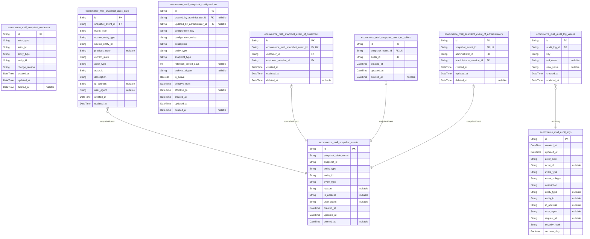

### `ecommerce_mall_snapshot_events`

Centralized tracking of all snapshot creation events across the platform
with comprehensive metadata.

This table records every snapshot creation event, capturing what data was
preserved, when it occurred, which actor initiated the change, and where
the snapshot is stored. It serves as the master index for all audit
trails across product edits, order purchases, review updates, and request
processing.

Each record references a specific snapshot table through the
`snapshot_table_name` and `snapshot_id` combination, enabling direct
lookup of the preserved data state. The actor information is captured
through subtype tables to support customer, seller, and
administrator-initiated changes while maintaining proper normalization.

This centralized event tracking enables comprehensive platform auditing,
dispute resolution, and historical analysis while maintaining referential
integrity to the actual snapshot data stored in domain-specific tables.

Properties as follows:

- `id`: Primary Key.
- `snapshot_table_name`
  > Name of the database table where the snapshot is stored (e.g.,
  > 'ecommerce_mall_product_snapshots', 'ecommerce_mall_review_snapshots').
- `snapshot_id`: Primary key ID of the snapshot record in the referenced table.
- `entity_type`
  > Type of entity that was snapshotted (e.g., 'product', 'variant',
  > 'seller_profile', 'review', 'cancellation_request').
- `entity_id`
  > Primary key ID of the entity that was snapshotted (the original entity,
  > not the snapshot).
- `event_type`
  > Type of snapshot event: 'create' for initial creation, 'update' for edit
  > snapshot, 'delete' for deletion snapshot.
- `reason`
  > Optional description or reason for creating the snapshot, such as 'price
  > update', 'customer requested edit', or 'policy compliance'.
- `ip_address`
  > IP address of the client that initiated the snapshot creation, captured
  > for audit trail completeness.
- `user_agent`
  > HTTP User-Agent header of the client that initiated the snapshot
  > creation, captured for audit trail completeness.
- `created_at`
  > Timestamp when the snapshot event was recorded. This matches the
  > snapshot's creation timestamp for consistency.
- `updated_at`
  > Timestamp when the snapshot event record was last updated. Typically
  > matches created_at as these records are immutable, but retained for
  > consistency with other tables.
- `deleted_at`
  > Timestamp when the snapshot event record was soft deleted. Null indicates
  > active record.

### `ecommerce_mall_audit_logs`

General audit log for system events, user actions, and administrative
operations across the platform. This centralized log captures immutable
records of all significant system activities including user
authentication, administrator actions, policy enforcement, and system
events. Each entry records who performed what action, when, with full
context including IP addresses, user agents, and entity references. Audit
logs support compliance monitoring, security investigation, and
operational troubleshooting.

Audit logs are organized by actor type (customer, seller, administrator)
and can be filtered by event type, severity, and success status. The logs
preserve both successful and failed operations to provide complete
visibility into system activity. Entity references allow linking audit
entries to specific business records like orders, products, or user
accounts.

This table implements the platform's audit trail requirement for
financial transparency and security compliance, complementing
domain-specific snapshot tables with system-wide event logging.

Properties as follows:

- `id`: Primary Key.
- `created_at`
  > Timestamp when the audit log entry was created. This represents when the
  > audited event occurred.
- `updated_at`
  > Timestamp when the audit log entry was last updated. For immutable audit
  > logs, this typically matches created_at but allows for rare corrections.
- `actor_type`
  > Type of actor who performed the audited action. Valid values: 'customer',
  > 'seller', 'administrator', 'system'.
- `actor_id`
  > Reference to the actor who performed the action. When actor_type is
  > 'customer', references [ecommerce_mall_customers.id](#ecommerce_mall_customers). When
  > 'seller', references [ecommerce_mall_sellers.id](#ecommerce_mall_sellers). When
  > 'administrator', references [ecommerce_mall_administrators.id](#ecommerce_mall_administrators).
  > When 'system', this field is null.
- `event_type`
  > Broad category of the audited event. Examples: 'authentication',
  > 'authorization', 'order_operation', 'product_operation',
  > 'user_management', 'system_event'.
- `event_subtype`
  > Specific subtype within the event_type category. Examples: for
  > 'authentication' type: 'login', 'logout', 'password_change'. For
  > 'order_operation': 'order_created', 'order_cancelled', 'order_refunded'.
- `description`
  > Human-readable description of the audited event including context and
  > details. Should provide enough information for investigation and
  > understanding without requiring cross-referencing other tables.
- `entity_type`
  > Type of business entity affected by the audited action. Examples:
  > 'order', 'order_item', 'product', 'product_variant', 'customer',
  > 'seller', 'category', 'review', 'cancellation_request', 'refund_request'.
- `entity_id`
  > Reference to the specific business entity affected by the action.
  > Combined with entity_type to identify the exact record. For system events
  > without a specific entity, this field is null.
- `ip_address`
  > IP address from which the action was performed. Captured for security
  > investigation and geographic analysis.
- `user_agent`
  > User agent string from the client making the request. Helps identify
  > client type, browser, and device for security analysis.
- `request_id`
  > Unique identifier for the HTTP request that triggered the audited action.
  > Used for correlating related audit entries across microservices and
  > tracing request flows.
- `severity_level`
  > Severity level of the audited event. Valid values: 'info', 'warning',
  > 'error', 'critical'. Used for filtering and alerting on significant
  > events.
- `success_flag`
  > Whether the audited action was successful. Records both successful and
  > failed operations for complete audit trail. False indicates the action
  > failed or was rejected.

### `ecommerce_mall_snapshot_metadata`

Central registry of all snapshot creation events across the platform,
capturing timestamps, actor information, entity types, and change reasons
for cross-domain audit trails.

This table serves as the master index for all snapshot activities,
enabling system-wide queries and compliance monitoring. Each record
represents a single snapshot creation event, linking to the specific
actor who initiated it and the entity that was snapshotted. The
entity_type field classifies what kind of object was snapshotted
(product, variant, order, review, etc.), while the entity_id references
the specific instance.

Snapshots are created whenever editable data is modified in compliance
with the Snapshot Principle, which requires immutable audit trails for
all financial transactions and data modifications. This metadata table
provides the foundational layer for cross-domain audit queries, dispute
resolution investigations, and historical analysis of platform
activities.

Administrators use this table to monitor snapshot frequency, identify
unusual activity patterns, and generate compliance reports. The central
registry design eliminates the need to query individual snapshot tables
across multiple domains when conducting system-wide audits. {@link
ecommerce_mall_customers.id}, [ecommerce_mall_sellers.id](#ecommerce_mall_sellers), {@link
ecommerce_mall_administrators.id}

Properties as follows:

- `id`: Primary Key.
- `actor_type`
  > Type of actor who initiated the snapshot creation. Must be one of:
  > 'customer', 'seller', 'administrator'. Indicates which actor table to
  > reference for actor_id.
- `actor_id`
  > Identifier of the actor who created the snapshot. References the primary
  > key of the corresponding actor table based on actor_type.
- `entity_type`
  > Type of entity that was snapshotted. Must be one of: 'product',
  > 'product_variant', 'seller_profile', 'customer_profile',
  > 'customer_address', 'category', 'order', 'order_item', 'shipment',
  > 'review', 'cancellation_request', 'refund_request',
  > 'administrator_request'.
- `entity_id`
  > Identifier of the specific entity that was snapshotted. References the
  > primary key of the corresponding entity table based on entity_type.
- `change_reason`
  > Reason why the snapshot was created. Common values: 'product_edit',
  > 'variant_edit', 'order_purchase', 'review_edit', 'request_status_change',
  > 'profile_update', 'address_update', 'category_edit', 'shipment_creation',
  > 'administrator_action'.
- `created_at`
  > Timestamp when the snapshot metadata record was created. This represents
  > when the snapshot creation event occurred.
- `updated_at`
  > Timestamp when the snapshot metadata record was last updated. Typically
  > only changes if metadata corrections are needed.
- `deleted_at`
  > Timestamp when the snapshot metadata record was soft-deleted. Snapshots
  > themselves are immutable and cannot be deleted, but metadata records may
  > be soft-deleted for data privacy compliance.

### `ecommerce_mall_snapshot_audit_trails`

Immutable audit trail of snapshot state transitions, deletions, and
access events for complete financial transaction transparency.

This table provides a comprehensive audit trail for all snapshot-related
activities across the platform, ensuring financial integrity and dispute
resolution capabilities. Each record captures a specific audit event
including state transitions (created → accessed → archived → deleted),
deletion events when snapshots are purged, and access events when
snapshots are viewed for dispute resolution by relevant parties (owners,
administrators).

Audit trails are created automatically whenever snapshot events occur and
cannot be modified once created, providing an immutable record for
compliance and transparency. The polymorphic reference pattern allows
this table to track audit events for any type of snapshot entity in the
system, including product snapshots, variant snapshots, seller profile
snapshots, and order item snapshots.

Financial transaction integrity is maintained through complete lifecycle
tracking of all snapshot modifications, supporting the platform's money
exchange transparency requirements. {@link
ecommerce_mall_snapshot_events} provides the central snapshot creation
events that these audit trails reference.

Properties as follows:

- `id`: Primary Key.
- `snapshot_event_id`
  > Reference to the central snapshot creation event that this audit trail
  > entry relates to. [ecommerce_mall_snapshot_events.id](#ecommerce_mall_snapshot_events).
- `event_type`
  > Type of audit event recorded. Valid values: 'state_transition' for
  > snapshot state changes, 'deletion_event' for snapshot deletion/purge
  > events, 'access_event' for snapshot view/access events,
  > 'modification_attempt' for attempted modifications.
- `source_entity_type`
  > Type of the source entity that this audit trail entry relates to.
  > Examples: 'product_snapshots', 'variant_snapshots',
  > 'seller_profile_snapshots', 'order_item_snapshots'. Used with
  > source_entity_id for polymorphic reference.
- `source_entity_id`
  > ID of the source entity that this audit trail entry relates to. Combined
  > with source_entity_type to reference any snapshot table in the system.
- `previous_state`
  > Previous state of the snapshot before this audit event. Valid values:
  > 'created', 'accessed', 'archived', 'deleted', or null for initial
  > creation events.
- `current_state`
  > Current state of the snapshot after this audit event. Valid values:
  > 'created', 'accessed', 'archived', 'deleted'.
- `actor_type`
  > Type of actor who performed the audited action. Valid values: 'customer',
  > 'seller', 'administrator'.
- `actor_id`
  > ID of the actor who performed the audited action. References the
  > appropriate actor table based on actor_type.
- `description`
  > Human-readable description of the audit event, including context and
  > details for transparency and dispute resolution.
- `ip_address`
  > IP address from which the audited action was performed, captured for
  > security and compliance purposes.
- `user_agent`
  > HTTP User-Agent header from the client that performed the audited action,
  > captured for forensic analysis.
- `created_at`
  > Timestamp when this audit trail entry was created. Audit trails are
  > immutable once created.
- `updated_at`
  > Timestamp when this audit trail entry was last updated. Initially equals
  > created_at, but supports index optimization.

### `ecommerce_mall_snapshot_configurations`

System-wide configuration table for snapshot policies, retention periods,
archival triggers, and cross-domain behavior rules.

This table stores all configuration parameters that control the snapshot
system across the platform. Each configuration entry defines rules for
specific entity types (product, variant, order, review, etc.) and
snapshot types (edit, deletion, purchase, etc.). Configurations support
versioning through effective date ranges, allowing policy changes over
time.

Configuration values may include retention periods in days, archival
trigger conditions (time-based, event-based), and cross-domain behavior
rules for snapshot propagation. Administrators can create, update, and
deactivate configurations, with all changes tracked through foreign key
relationships to administrator records.

This table is critical for maintaining financial transparency and audit
trail consistency across the e-commerce platform as required by the
Snapshot Principle.

Properties as follows:

- `id`: Primary Key.
- `created_by_administrator_id`
  > Administrator who created this configuration version. {@link
  > ecommerce_mall_administrators.id}.
- `updated_by_administrator_id`
  > Administrator who last updated this configuration version. {@link
  > ecommerce_mall_administrators.id}.
- `configuration_key`
  > Unique identifier for the configuration parameter (e.g.,
  > 'product_edit_retention_days', 'order_purchase_archival_trigger'). Used
  > for programmatic access and reference.
- `configuration_value`
  > Configuration value stored as string. For complex configurations, can be
  > serialized as JSON but stored as string per normalization rules.
  > Examples: '365' for retention days, 'AFTER_90_DAYS' for archival trigger,
  > or JSON object for complex rules.
- `description`
  > Human-readable description of what this configuration controls and its
  > business purpose.
- `entity_type`
  > Type of entity this configuration applies to (e.g., 'product', 'variant',
  > 'order', 'review', 'seller_profile', 'customer_profile'). Use 'system'
  > for cross-domain configurations.
- `snapshot_type`
  > Type of snapshot this configuration controls (e.g., 'edit', 'deletion',
  > 'purchase', 'status_change', 'creation'). Use 'all' for configurations
  > applying to all snapshot types.
- `retention_period_days`
  > Number of days snapshots should be retained before archival or deletion.
  > Zero indicates permanent retention.
- `archival_trigger`
  > Condition that triggers snapshot archival (e.g.,
  > 'AFTER_RETENTION_PERIOD', 'WHEN_SPACE_NEEDED', 'MANUAL_ONLY',
  > 'AFTER_ORDER_COMPLETION').
- `is_active`
  > Whether this configuration version is currently active and should be
  > applied by the snapshot system.
- `effective_from`
  > Date and time when this configuration version becomes effective. Used for
  > configuration versioning and policy changes over time.
- `effective_to`
  > Date and time when this configuration version expires. Null indicates
  > indefinite effectiveness until replaced by newer version.
- `created_at`: Timestamp when this configuration version was created.
- `updated_at`: Timestamp when this configuration version was last updated.
- `deleted_at`
  > Timestamp when this configuration version was soft-deleted. Null
  > indicates active configuration.

### `ecommerce_mall_snapshot_event_of_customers`

Links snapshot events to specific customer actors who initiated the
snapshot creation, implementing the polymorphic ownership pattern.

This table establishes a 1:1 relationship between snapshot events and
customer actors, allowing the system to track which customer was
responsible for creating each snapshot. This is essential for audit
trails and accountability in financial transactions, particularly for
order modifications, cancellations, and refunds where customer actions
must be traceable.

Each record connects a snapshot event to both the customer who initiated
it and their active session at the time, providing complete traceability
for all snapshot creation activities in the platform. The unique
constraint on ecommerce_mall_snapshot_event_id ensures each snapshot
event is linked to exactly one customer actor.

Access parent snapshot event data via the foreign key join to {@link
ecommerce_mall_snapshot_events}, and customer details via {@link
ecommerce_mall_customers} and [ecommerce_mall_customer_sessions](#ecommerce_mall_customer_sessions).

Properties as follows:

- `id`: Primary Key.
- `ecommerce_mall_snapshot_event_id`
  > Reference to the snapshot event that was initiated by this customer.
  > [ecommerce_mall_snapshot_events.id](#ecommerce_mall_snapshot_events)
- `customer_id`
  > Customer who initiated the snapshot event. {@link
  > ecommerce_mall_customers.id}
- `customer_session_id`
  > Customer session active at the time of snapshot creation. {@link
  > ecommerce_mall_customer_sessions.id}
- `created_at`: Timestamp when this customer-snapshot relationship was created.
- `updated_at`: Timestamp when this customer-snapshot relationship was last updated.
- `deleted_at`
  > Timestamp when this customer-snapshot relationship was soft-deleted, if
  > applicable.

### `ecommerce_mall_snapshot_event_of_sellers`

Links snapshot creation events to specific seller actors who initiated
the snapshot creation.

Implements the polymorphic ownership pattern for snapshot events,
connecting each snapshot event to exactly one seller actor when the
snapshot was seller-initiated. This table establishes the specific
relationship between snapshot events in {@link
ecommerce_mall_snapshot_events} and seller identities in {@link
ecommerce_mall_sellers}, ensuring proper audit trail attribution and data
ownership boundaries.

The table enforces a 1:1 relationship between snapshot events and sellers
through the unique constraint on snapshot_event_id, guaranteeing that
each snapshot event can be attributed to at most one seller actor while
maintaining referential integrity across the snapshot audit system.

Properties as follows:

- `id`: Primary Key.
- `snapshot_event_id`
  > Reference to the snapshot creation event. {@link
  > ecommerce_mall_snapshot_events.id}.
- `seller_id`
  > Reference to the seller actor who initiated the snapshot creation. {@link
  > ecommerce_mall_sellers.id}.
- `created_at`
  > Timestamp when this snapshot-seller link was created, recording when the
  > attribution was established.
- `updated_at`
  > Timestamp when this snapshot-seller link was last updated, tracking
  > modifications to the attribution relationship.
- `deleted_at`
  > Timestamp when this snapshot-seller link was soft deleted, preserving the
  > historical attribution even after relationship termination.

### `ecommerce_mall_snapshot_event_of_administrators`

Links snapshot events to administrator actors who initiated the snapshot
creation, implementing the polymorphic ownership pattern.

This table connects snapshot events with specific administrator actors
and their active sessions, enabling comprehensive audit trails for
financial transparency. Each record establishes that a particular
administrator (via a specific session) created a snapshot event, which is
essential for tracking who was responsible for which snapshot in a
financial platform context.

Administrators create snapshot events when performing actions that
require audit trails, such as product deletions, order interventions, or
policy enforcement actions. This linking ensures accountability and
supports dispute resolution by preserving the chain of responsibility.

The table maintains a 1:1 relationship with snapshot events ({@link
ecommerce_mall_snapshot_events.id}) and references the administrator
([ecommerce_mall_administrators.id](#ecommerce_mall_administrators)) and their active session
([ecommerce_mall_administrator_sessions.id](#ecommerce_mall_administrator_sessions)) at the time of
snapshot creation.

Properties as follows:

- `id`: Primary Key.
- `snapshot_event_id`
  > The snapshot event being linked to an administrator. This establishes
  > which audit event was created by this administrator. {@link
  > ecommerce_mall_snapshot_events.id}.
- `administrator_id`
  > The administrator actor who created the snapshot event. References the
  > administrator's identity record. {@link
  > ecommerce_mall_administrators.id}.
- `administrator_session_id`
  > The administrator's active session at the time of snapshot creation.
  > Tracks the specific login session used for the action. {@link
  > ecommerce_mall_administrator_sessions.id}.
- `created_at`
  > Timestamp when this administrator-snapshot event link was created.
  > Automatically set when the record is inserted.
- `updated_at`
  > Timestamp when this administrator-snapshot event link was last updated.
  > Automatically updated on record modification.
- `deleted_at`
  > Timestamp when this administrator-snapshot event link was soft deleted.
  > Allows for restoration of deleted audit links while maintaining
  > referential integrity.

### `ecommerce_mall_audit_log_values`

Key-value audit trail data for storing old and new values from audit
events. Normalizes the JSON/array data that would otherwise violate 1NF
in the main audit log table.

Each record represents a single key-value pair associated with an audit
log entry, capturing both the old value (before change) and new value
(after change). This enables detailed audit trails for data modifications
across the system while maintaining proper normalization.

Related audit log metadata is stored in [ecommerce_mall_audit_logs](#ecommerce_mall_audit_logs).

Properties as follows:

- `id`: Primary Key.
- `audit_log_id`
  > Parent audit log entry that this key-value pair belongs to. {@link
  > ecommerce_mall_audit_logs.id}.
- `key`
  > Property name that was changed in the audit event. Example: 'email',
  > 'status', 'price', 'quantity'.
- `old_value`
  > Previous value of the property before the audit event occurred. Null
  > indicates the property was created (no previous value).
- `new_value`
  > New value of the property after the audit event occurred. Null indicates
  > the property was deleted (no new value).
- `created_at`
  > Timestamp when this key-value record was created. Matches the parent
  > audit log creation time.
- `updated_at`: Timestamp when this key-value record was last updated.

## Customers

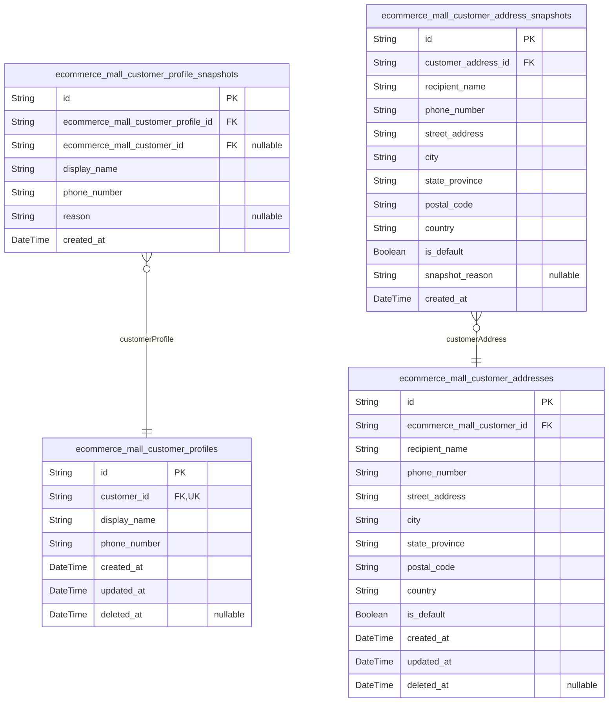

### `ecommerce_mall_customer_profiles`

Customer public-facing identity information separate from authentication
credentials.

Stores display name and phone number that customers can edit
independently of their login credentials. Each customer has exactly one
profile record that is created during account registration. Profile
information is used throughout the platform for public identification in
reviews, orders, and customer interactions.

Changes to profile information are tracked through {@link
ecommerce_mall_customer_profile_snapshots} for audit compliance with the
Snapshot Principle. The profile is distinct from the authentication
credentials stored in [ecommerce_mall_customers](#ecommerce_mall_customers) to separate
identity management from login security.

Properties as follows:

- `id`: Primary Key.
- `customer_id`
  > Associated customer's authentication record. {@link
  > ecommerce_mall_customers.id}.
- `display_name`
  > Public-facing name that customers choose for identification throughout
  > the platform. Appears in reviews, order history, and customer
  > interactions. Customers can edit this value through their account
  > settings.
- `phone_number`
  > Customer contact phone number for order notifications and delivery
  > coordination. Customers can edit this value through their account
  > settings.
- `created_at`
  > Timestamp when the customer profile was initially created during account
  > registration.
- `updated_at`
  > Timestamp when the customer profile was last modified. Updated
  > automatically on any change to profile fields.
- `deleted_at`
  > Timestamp when the customer profile was soft-deleted. Set when a customer
  > deletes their account while preserving order history and reviews.

### `ecommerce_mall_customer_addresses`

Shipping addresses for customers with recipient information, complete
street details, regional location data, and default address designation.

Each address record contains all necessary information for successful
package delivery, including recipient identification, contact
information, and precise location details. Customers can maintain
multiple addresses for different delivery needs, with one address
designated as the default for convenient checkout selection. Address
modifications create snapshots in the related snapshot table for audit
trail compliance.

[ecommerce_mall_customers.id](#ecommerce_mall_customers)

Properties as follows:

- `id`: Primary Key.
- `ecommerce_mall_customer_id`: Owning customer's [ecommerce_mall_customers.id](#ecommerce_mall_customers).
- `recipient_name`
  > Full name of the person who will receive the package at the delivery
  > location.
- `phone_number`: Contact phone number for delivery coordination and recipient verification.
- `street_address`
  > Complete physical location details including building number, street
  > name, and unit/apartment number.
- `city`: City or municipality where the delivery destination is located.
- `state_province`
  > State, province, or regional administrative division for the delivery
  > address.
- `postal_code`: Postal code or ZIP code for mail routing and delivery sorting.
- `country`
  > Country where the delivery address is located for international shipping
  > purposes.
- `is_default`
  > Indicates whether this address is the customer's default shipping address
  > for checkout.
- `created_at`: Timestamp when the address record was first created.
- `updated_at`: Timestamp when the address record was last modified.
- `deleted_at`
  > Timestamp when the address was soft-deleted by the customer, preserving
  > historical records.

### `ecommerce_mall_customer_profile_snapshots`

Immutable snapshot records of customer profile modifications preserving
previous states as required by the Snapshot Principle.

This table captures the exact state of a customer's profile before any
modification, including display name and phone number values. Each
snapshot is created when a customer edits their profile information,
providing an audit trail for dispute resolution and compliance purposes.
The snapshots are append-only and cannot be modified or deleted, ensuring
complete historical transparency.

[ecommerce_mall_customer_profiles](#ecommerce_mall_customer_profiles) represents the current active
customer profile, while this table preserves all previous versions. Each
snapshot references the specific customer profile version it captured and
optionally includes the customer actor who made the change for audit
purposes.

Properties as follows:

- `id`: Primary Key.
- `ecommerce_mall_customer_profile_id`
  > The customer profile that was modified. This snapshot captures the state
  > of the profile before the change. {@link
  > ecommerce_mall_customer_profiles.id}
- `ecommerce_mall_customer_id`
  > The customer actor who initiated the profile modification. Optional for
  > audit trail purposes when the change was made by the customer themselves.
  > [ecommerce_mall_customers.id](#ecommerce_mall_customers)
- `display_name`
  > The display name value captured at the time of snapshot creation.
  > Preserves how the customer's name appeared publicly before the
  > modification.
- `phone_number`
  > The phone number value captured at the time of snapshot creation.
  > Preserves the customer's contact information before the modification.
- `reason`
  > Optional context about why the profile was modified, such as 'customer
  > update', 'administrative correction', or 'data migration'. Provides
  > additional audit information for the change.
- `created_at`
  > Timestamp when this snapshot was created. Indicates when the profile
  > state was captured before modification.

### `ecommerce_mall_customer_address_snapshots`

Historical snapshots of customer address modifications, preserving
previous address states as required by the Snapshot Principle.

Captures the complete state of a customer's shipping address at a
specific point in time whenever the address is modified. This includes
all recipient information, street details, regional location data, and
default address designation. Snapshots are immutable records that cannot
be modified or deleted, serving as audit trails for address changes and
supporting dispute resolution.

Each snapshot links to the original {@link
ecommerce_mall_customer_addresses} record and includes a timestamp of
when the snapshot was created. The snapshot_reason field can optionally
document why the address was changed (e.g., 'Customer moved', 'Address
correction').

Properties as follows:

- `id`: Primary Key.
- `customer_address_id`
  > Reference to the original customer address record that was modified.
  > [ecommerce_mall_customer_addresses.id](#ecommerce_mall_customer_addresses)
- `recipient_name`
  > Full name of the recipient for delivery purposes, as captured in the
  > address snapshot.
- `phone_number`
  > Contact phone number for delivery coordination, preserved from the
  > address snapshot.
- `street_address`
  > Complete street address including building number, street name, and any
  > additional location details.
- `city`: City or town name for the shipping address.
- `state_province`: State, province, or region identifier for the shipping address.
- `postal_code`: Postal or ZIP code for mail delivery routing.
- `country`: Country name for international shipping classification.
- `is_default`
  > Whether this address was marked as the default shipping address at the
  > time of the snapshot.
- `snapshot_reason`
  > Optional description of why the address was changed, providing context
  > for the snapshot creation. Can include reasons like 'Customer moved',
  > 'Address correction', or 'Shipping preference update'.
- `created_at`
  > Timestamp when this address snapshot was created, marking the point in
  > time when the address state was captured.

## Sellers

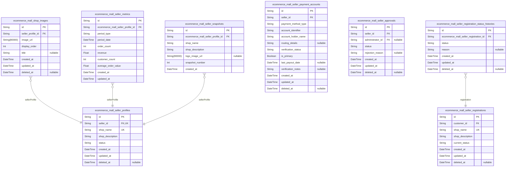

### `ecommerce_mall_seller_profiles`

Seller business profile for public-facing shop identity.

Stores shop branding information including shop name, description, and
optional logo. This profile represents the seller's public business
identity separate from authentication credentials. Customers can view
seller profiles to establish trust and verify business legitimacy.

Every modification to seller profile data creates a historical snapshot
for audit trail purposes. The profile supports soft deletion and includes
status tracking for administrative suspension actions.

Related to: [ecommerce_mall_sellers](#ecommerce_mall_sellers), {@link
ecommerce_mall_shop_images}, [ecommerce_mall_seller_snapshots](#ecommerce_mall_seller_snapshots)

Properties as follows:

- `id`: Primary Key.
- `seller_id`: Owner seller's authentication identity. [ecommerce_mall_sellers.id](#ecommerce_mall_sellers).
- `shop_name`
  > Unique business name of the seller's shop. Displayed on product listings,
  > order details, and customer-facing pages.
- `shop_description`
  > Detailed description of the seller's business, products, and services.
  > Used to establish trust and provide business context to customers.
- `status`
  > Current profile status indicating operational availability. 'active':
  > visible and operational, 'inactive': suspended or temporarily
  > unavailable.
- `created_at`: Timestamp when the seller profile was initially created.
- `updated_at`: Timestamp when the seller profile was last modified.
- `deleted_at`
  > Timestamp when the seller profile was soft deleted. Null indicates active
  > profile.

### `ecommerce_mall_shop_images`

Seller shop images including logos and gallery images with ordering support.

Each seller can have multiple shop images for branding and product
display. The first image (lowest display_order) is typically used as the
shop's logo or main visual. Images can be reordered by sellers to control
their gallery arrangement. When a seller profile snapshot is created,
shop image states are preserved through separate snapshot tables.

This table supports the shop branding requirements for sellers to upload
logos and additional shop images that appear on their profile pages. The
ordering mechanism ensures consistent display across the platform.

[ecommerce_mall_seller_profiles](#ecommerce_mall_seller_profiles)

Properties as follows:

- `id`: Primary Key.
- `seller_profile_id`
  > Reference to the seller profile that owns these shop images. {@link
  > ecommerce_mall_seller_profiles.id}
- `image_url`
  > URL pointing to the shop image storage location. Supports logos and
  > gallery images for shop branding.
- `display_order`
  > Position in the shop image gallery. Lower values appear first. The image
  > with order 0 is typically used as the shop's primary logo.
- `title`
  > Optional title or description for the shop image. Used for accessibility
  > and image management.
- `created_at`: Timestamp when this shop image was uploaded to the system.
- `updated_at`: Timestamp when this shop image record was last modified.
- `deleted_at`: Soft delete timestamp. Null indicates the shop image is active.

### `ecommerce_mall_seller_metrics`

Daily and monthly aggregated metrics for seller dashboard reporting.

This table stores pre-calculated performance metrics for sellers to
support dashboard display without expensive real-time calculations.
Metrics include order counts, revenue totals, customer engagement
statistics, and average order values aggregated by period (daily or
monthly).

Sellers can query their historical performance through dashboard
interfaces that access these pre-aggregated values, enabling fast
response times for trend analysis and performance monitoring. Each record
represents a specific seller's metrics for a specific time period, with
uniqueness enforced at the seller-profile-period level.

All metric values are derived from order data through scheduled
aggregation jobs and are not directly editable by users. Historical
metrics provide the foundation for seller dashboard charts, revenue
reports, and performance trend analysis. {@link
ecommerce_mall_seller_profiles}

Properties as follows:

- `id`: Primary Key.
- `ecommerce_mall_seller_profile_id`
  > Seller profile these metrics belong to. {@link
  > ecommerce_mall_seller_profiles.id}.
- `period_type`
  > Aggregation period type: 'day' for daily metrics, 'month' for monthly
  > metrics. Determines how period_date is interpreted.
- `period_date`
  > Start date of the aggregation period. For daily metrics: the specific day
  > at 00:00:00. For monthly metrics: the first day of the month at 00:00:00.
- `order_count`
  > Total number of orders placed during this period. Counts distinct orders
  > from the seller, regardless of order status.
- `revenue`
  > Total revenue generated during this period. Sum of order item prices
  > (excluding cancelled/refunded items where applicable).
- `customer_count`
  > Number of unique customers who placed orders during this period. Counts
  > distinct customer profiles, not order count.
- `average_order_value`
  > Average revenue per order for this period. Calculated as revenue /
  > order_count when order_count > 0.
- `created_at`: Timestamp when this metrics record was created by the aggregation job.
- `updated_at`
  > Timestamp when this metrics record was last updated by the aggregation
  > job.

### `ecommerce_mall_seller_snapshots`

Immutable historical snapshots of seller profile modifications for audit
trails and dispute resolution.

Captures the complete state of a seller's profile (shop name, shop
description, and logo image) whenever any profile field is edited.
Snapshots are created automatically before changes are applied to ensure
data integrity for financial transparency requirements.

These snapshots preserve the exact business representation that customers
saw at specific points in time, supporting historical order accuracy and
seller reputation tracking. Administrators and profile owners can view
snapshots to understand profile evolution and resolve disputes about what
information was displayed to customers.

Each snapshot is permanent and cannot be modified or deleted, creating a
complete audit trail of all seller profile changes throughout the
business lifecycle. [ecommerce_mall_seller_profiles](#ecommerce_mall_seller_profiles)

Properties as follows:

- `id`: Primary Key.
- `ecommerce_mall_seller_profile_id`
  > Reference to the seller profile that was modified. {@link
  > ecommerce_mall_seller_profiles.id}
- `shop_name`
  > Shop name as it appeared at the time of snapshot creation. This is the
  > primary business identifier that customers see when browsing products and
  > making purchases.
- `shop_description`
  > Shop description explaining the seller's business, values, and product
  > offerings as displayed to customers at snapshot time.
- `logo_image_url`
  > URL to the seller's logo image used for visual branding and customer
  > recognition at the time of snapshot creation.
- `snapshot_number`
  > Sequential version number of this snapshot within the seller's profile
  > history. Increments with each profile modification to establish
  > chronological order.
- `created_at`
  > Exact date and time when this snapshot was created, recording when the
  > profile modification occurred.

### `ecommerce_mall_seller_registrations`

Tracks seller registration requests submitted by users before
administrative approval.

This table stores initial seller registration data including shop name
and description that users submit when requesting to become sellers on
the platform. Each registration goes through an approval workflow where
administrators review and decide whether to approve or reject the
request. Approved registrations result in the creation of a seller
account in the [ecommerce_mall_sellers](#ecommerce_mall_sellers) table and a seller profile
in [ecommerce_mall_seller_profiles](#ecommerce_mall_seller_profiles).

The registration has lifecycle statuses: pending (awaiting review),
approved, rejected, and withdrawn. Status transitions are tracked in the
separate [ecommerce_mall_seller_registration_status_histories](#ecommerce_mall_seller_registration_status_histories)
table for audit purposes. Each user can have only one pending
registration at a time, but may have multiple historical registrations
with different statuses.

This table is subsidiary to the user entity since registrations are
submitted by and managed through user accounts.

Properties as follows:

- `id`: Primary Key.
- `customer_id`
  > The customer who submitted this seller registration request. {@link
  > ecommerce_mall_customers.id}.
- `shop_name`
  > Requested shop name for the seller's business. This name will be used for
  > the seller's public shop profile if approved. Must be unique among active
  > shops.
- `shop_description`
  > Description of the seller's business, products, and shop concept.
  > Provides context for administrators during approval review.
- `current_status`
  > Current status of the registration request. Values: pending (awaiting
  > review), approved (administrator approved), rejected (administrator
  > rejected), withdrawn (user cancelled). Derived from the latest status
  > history entry.
- `created_at`: Timestamp when the user submitted this registration request.
- `updated_at`: Timestamp when this registration record was last updated.
- `deleted_at`
  > Timestamp when this registration record was soft deleted. Allows for
  > audit trail preservation while removing from active queries.

### `ecommerce_mall_seller_payment_accounts`

Seller payment account details for receiving payouts from sales.

Stores secure payment information including bank account details, digital
wallet addresses, or payment gateway integration credentials. Each seller
can have multiple payment accounts but only one can be active at a time
for receiving payouts.

Payment accounts undergo verification processes before being activated
for payouts. Account details are stored with appropriate security
measures to protect sensitive financial information.

All account modifications are tracked for audit purposes, and deleted
accounts are soft-deleted to maintain historical payout records. {@link
ecommerce_mall_sellers.id}

Properties as follows:

- `id`: Primary Key.
- `seller_id`
  > Reference to the seller who owns this payment account. {@link
  > ecommerce_mall_sellers.id}
- `payment_method_type`
  > Type of payment method: 'bank_account', 'digital_wallet',
  > 'payment_gateway', or 'card'.
- `account_identifier`
  > Secure identifier for the payment account (masked account number, wallet
  > address, or gateway token).
- `account_holder_name`: Name of the account holder as registered with the payment provider.
- `routing_details`
  > Additional routing information such as bank routing number, BIC/SWIFT
  > code, or wallet network.
- `verification_status`
  > Current verification status: 'pending_verification', 'verified',
  > 'suspended', or 'rejected'.
- `is_primary`: Indicates if this is the primary payment account for receiving payouts.
- `last_payout_date`: Date of the most recent successful payout to this account.
- `verification_notes`
  > Administrator notes regarding account verification, including rejection
  > reasons if applicable.
- `created_at`: Timestamp when the payment account was created.
- `updated_at`: Timestamp when the payment account was last modified.
- `deleted_at`
  > Timestamp when the payment account was soft-deleted. Null indicates
  > active account.

### `ecommerce_mall_seller_approvals`

Tracks the seller approval workflow including status changes, rejection
reasons, and administrator decisions.

This table records the complete history of a seller's approval journey
from initial registration through potential rejections and re-submissions
to final approval. Each record represents a specific status transition in
the approval process, allowing administrators to track decision timelines
and sellers to understand their approval status.

When a seller first registers, an initial 'pending' record is created.
Administrators can then approve or reject the seller, recording their
decision and any rejection reason. If rejected, sellers can submit a new
registration request, creating additional approval records. Approved
sellers have a final 'approved' record that grants them selling
privileges.

[ecommerce_mall_sellers.id](#ecommerce_mall_sellers) identifies the seller being approved,
while [ecommerce_mall_administrators.id](#ecommerce_mall_administrators) identifies the
administrator who made the decision (null for pending status).

Properties as follows:

- `id`: Primary Key.
- `seller_id`: The seller being approved. [ecommerce_mall_sellers.id](#ecommerce_mall_sellers).
- `administrator_id`
  > The administrator who approved or rejected the seller. Null when status
  > is pending. [ecommerce_mall_administrators.id](#ecommerce_mall_administrators).
- `status`: Current approval status: 'pending', 'approved', or 'rejected'.
- `rejection_reason`
  > Detailed explanation provided by administrator when rejecting a seller
  > registration. Required when status is 'rejected', null otherwise.
- `created_at`: Timestamp when this approval record was created.
- `updated_at`: Timestamp when this approval record was last modified.
- `deleted_at`
  > Timestamp when this approval record was soft-deleted. Null indicates
  > active record.

### `ecommerce_mall_seller_registration_status_histories`

Tracks status history and timestamps for seller registration requests,
separating temporal data from core registration entity.

Each record captures a specific status transition in the seller
registration approval workflow, including the status change timestamp and
optional reason for status changes. This historical tracking enables
audit trails of registration decisions and supports seller approval
process transparency.

Status transitions follow the seller registration lifecycle: pending
(initial submission), approved (administrator approval), or rejected
(administrator rejection with reason). Multiple history records may exist
for the same registration if sellers resubmit after rejection.

[ecommerce_mall_seller_registrations.id](#ecommerce_mall_seller_registrations)

Properties as follows:

- `id`: Primary Key.
- `ecommerce_mall_seller_registration_id`
  > Reference to the seller registration request being tracked. {@link
  > ecommerce_mall_seller_registrations.id}
- `status`
  > Registration status at this point in time. Values: 'pending' (awaiting
  > review), 'approved' (registration accepted), 'rejected' (registration
  > denied).
- `reason`
  > Optional explanation for status changes, particularly important for
  > rejection reasons to inform sellers why their registration was denied.
- `created_at`
  > Timestamp when this status history record was created, marking when the
  > registration status changed.
- `updated_at`
  > Timestamp when this status history record was last updated. Rarely
  > changes as status history records are largely immutable after creation.
- `deleted_at`
  > Timestamp when this status history record was soft-deleted. Allows for
  > audit trail preservation while supporting data privacy requirements.

## Categories

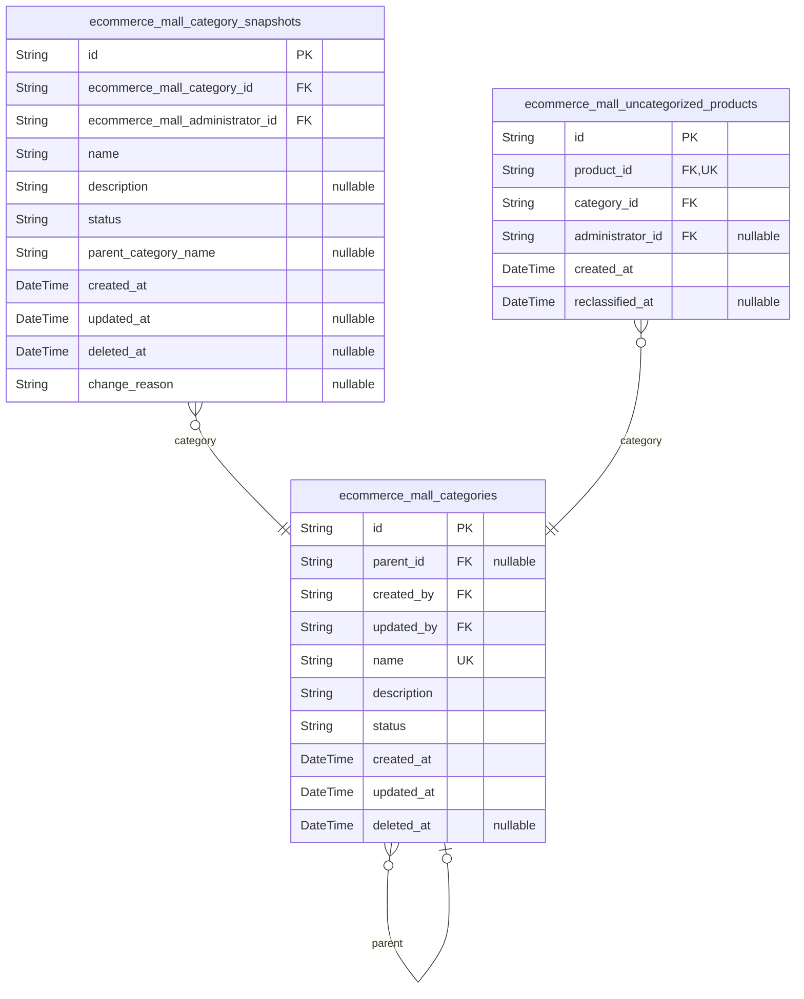

### `ecommerce_mall_categories`

Main category table storing all product categories and subcategories with
hierarchical relationships.

Categories serve as logical product groupings for marketplace
organization, supporting one-level nesting of subcategories within parent
categories. Each category includes a name, description, and status to
control visibility and lifecycle. Categories are exclusively managed by
platform administrators for consistent product classification.

Subcategories inherit the organizational structure of parent categories
while providing more specific product grouping. The hierarchical
relationship enables efficient navigation from broad product categories
to specific subcategories.

[ecommerce_mall_administrators.id](#ecommerce_mall_administrators) as creator and modifier for
administrator management tracking.
[ecommerce_mall_categories.id](#ecommerce_mall_categories) for parent-child relationships
enabling one-level subcategory nesting.

Properties as follows:

- `id`: Primary Key.
- `parent_id`
  > Parent category for hierarchical nesting. References parent category's
  > [ecommerce_mall_categories.id](#ecommerce_mall_categories). Null for top-level categories.
- `created_by`
  > Administrator who created this category. References {@link
  > ecommerce_mall_administrators.id}.
- `updated_by`
  > Administrator who last modified this category. References {@link
  > ecommerce_mall_administrators.id}.
- `name`
  > Category name for product classification. Must be clear and descriptive
  > for customer navigation.
- `description`
  > Detailed description explaining the category scope and included product
  > types.
- `status`
  > Category lifecycle status. Active categories are visible in product
  > listings, Archived categories are hidden but preserved, Deleted
  > categories are soft-deleted.
- `created_at`: Timestamp when this category was created.
- `updated_at`: Timestamp when this category was last modified.
- `deleted_at`: Timestamp when this category was soft-deleted. Null for active categories.

### `ecommerce_mall_category_snapshots`

Historical snapshots of category changes, preserving previous states for
audit trails.

Created automatically whenever categories are modified, archived, or
deleted by administrators. This table serves as an immutable audit trail
that captures the complete state of a category at specific points in
time, including all fields such as name, description, status, and parent
relationships.

Each snapshot records which administrator made the change and when it
occurred, providing full traceability for category management operations.
These records are preserved even if the original category is deleted,
maintaining compliance with the platform's Snapshot Principle for
financial transparency.

[ecommerce_mall_categories](#ecommerce_mall_categories) for the current category state.
[ecommerce_mall_administrators](#ecommerce_mall_administrators) for administrator information.

Properties as follows:

- `id`: Primary Key.
- `ecommerce_mall_category_id`: The category that was snapshotted. [ecommerce_mall_categories.id](#ecommerce_mall_categories).
- `ecommerce_mall_administrator_id`
  > The administrator who made the change that triggered the snapshot. {@link
  > ecommerce_mall_administrators.id}.
- `name`: Category name as it existed at snapshot time.
- `description`: Category description as it existed at snapshot time.
- `status`
  > Category status at snapshot time. Must be one of: 'Active', 'Archived',
  > 'Deleted'.
- `parent_category_name`
  > Name of parent category at snapshot time, denormalized for historical
  > reference. Null if category was top-level.
- `created_at`
  > Timestamp when this snapshot was created. Represents the exact moment the
  > category state was captured.
- `updated_at`
  > Timestamp when this snapshot record was last updated. Typically null for
  > immutable snapshots.
- `deleted_at`
  > Timestamp when this snapshot was soft-deleted. Allows for audit trail
  > preservation while supporting data retention policies.
- `change_reason`
  > Optional reason for the change that triggered this snapshot, provided by
  > the administrator.

### `ecommerce_mall_uncategorized_products`

Tracks products that have become uncategorized due to category deletion,
enabling administrators to reclassify them properly.

When a category is deleted (status changed to 'Deleted'), all products
previously classified under that category become uncategorized. This
table captures those products with references to the deleted category for
historical context. Administrators can later review this list and
reassign products to appropriate active categories.

Each record represents a single product that needs reclassification. The
product remains in this table until an administrator assigns it to a new
category, at which point the reclassified_at timestamp is set and the
administrator responsible is recorded.

This table ensures no products are lost in classification limbo and
provides an audit trail of category deletion impacts on product
organization. [ecommerce_mall_products.id](#ecommerce_mall_products), {@link
ecommerce_mall_categories.id}, [ecommerce_mall_administrators.id](#ecommerce_mall_administrators)

Properties as follows:

- `id`: Primary Key.
- `product_id`: The product that became uncategorized. [ecommerce_mall_products.id](#ecommerce_mall_products)
- `category_id`
  > The category that was deleted, causing the product to become
  > uncategorized. This is a historical reference to the category at the time
  > of deletion. [ecommerce_mall_categories.id](#ecommerce_mall_categories)
- `administrator_id`
  > The administrator who reclassified the product into a new category, if
  > reclassification has occurred. [ecommerce_mall_administrators.id](#ecommerce_mall_administrators)
- `created_at`: When the product became uncategorized due to category deletion.
- `reclassified_at`
  > When the product was reclassified into a new category by an
  > administrator. Null indicates the product is still awaiting
  > reclassification.

## Products

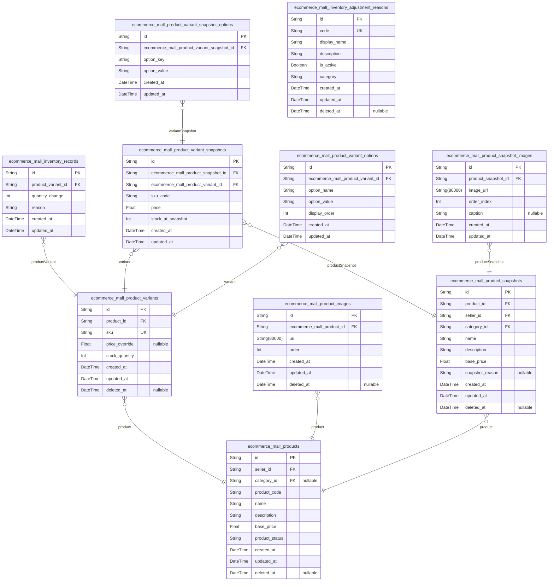

### `ecommerce_mall_products`

Main product entity containing core product information like name,
description, category, base price, and seller reference.

Products represent sellable items in the marketplace that belong to
specific sellers and are classified under categories. Each product can
have multiple variants (different SKUs) and images. The product record
includes essential metadata for display, search, and filtering.

Whenever a product is edited, a snapshot {@link
ecommerce_mall_product_snapshots} must be created to preserve the
previous state as required by the Snapshot Principle for financial audit
trails. This ensures that customers see the exact product state at the
time of purchase.

Products can exist in different statuses: draft (unpublished), published
(available for purchase), archived (hidden but preserved), and deleted
(soft-deleted with preservation).

Properties as follows:

- `id`: Primary Key.
- `seller_id`: Seller who owns this product. [ecommerce_mall_sellers.id](#ecommerce_mall_sellers)
- `category_id`
  > Category classification for product organization. {@link
  > ecommerce_mall_categories.id}
- `product_code`
  > Seller-defined unique product code for internal reference and tracking.
  > Must be unique within the seller's product catalog.
- `name`
  > Product name displayed to customers in listings and detail pages. Should
  > be descriptive and searchable.
- `description`
  > Detailed product description including features, specifications, and
  > usage information. Supports rich text formatting.
- `base_price`
  > Base price for the product in the marketplace currency. Individual
  > variants may override this with specific prices.
- `product_status`
  > Current lifecycle status of the product. Allowed values: 'draft'
  > (unpublished), 'published' (available for purchase), 'archived' (hidden
  > from listings), 'deleted' (soft-deleted).
- `created_at`: Timestamp when the product was initially created by the seller.
- `updated_at`: Timestamp when the product was last modified. Updates on any field change.
- `deleted_at`
  > Timestamp when the product was soft-deleted. Null indicates the product
  > is active.

### `ecommerce_mall_product_variants`

Product variants representing specific configurations with unique SKU
codes, option values, price overrides, and stock tracking.

Each variant belongs to exactly one product and can have multiple option
values (e.g., color, size) that define its specific configuration. The
SKU code must be unique across all variants. Variants can override the
parent product's base price and maintain their own stock quantity, which
is managed through inventory records rather than direct updates.

Variants support soft deletion to preserve historical references in
orders and snapshots. When deleted, they become unavailable for new
purchases but remain visible in historical contexts. All variant
modifications trigger snapshot creation in the {@link
ecommerce_mall_product_variant_snapshots} table to maintain audit trails
as required by the Snapshot Principle.

Properties as follows:

- `id`: Primary Key.
- `product_id`: Belonged product's [ecommerce_mall_products.id](#ecommerce_mall_products).
- `sku`
  > Stock Keeping Unit code uniquely identifying this variant across the
  > platform. Used for inventory management, order processing, and supplier
  > references.
- `price_override`
  > Optional variant-specific price that overrides the parent product's base
  > price. When null, the parent product's base price applies to this
  > variant.
- `stock_quantity`
  > Current available stock quantity for this variant. Updated through
  > inventory records rather than direct modifications. Zero indicates out of
  > stock.
- `created_at`: Timestamp when this variant was created.
- `updated_at`: Timestamp when this variant was last modified.
- `deleted_at`
  > Timestamp when this variant was soft deleted. Null indicates active
  > variant.

### `ecommerce_mall_product_images`

Product images supporting multiple images per product with ordering and
thumbnail designation.

Sellers can upload multiple images for their products to create product
galleries. The first image in the ordered sequence serves as the main
thumbnail image displayed in product listings. Images can be reordered by
sellers to control gallery presentation, and images can be deleted when
no longer needed.

Image changes are captured in product snapshots via {@link
ecommerce_mall_product_snapshot_images} to preserve historical states for
audit trails. Each image belongs to exactly one product through {@link
ecommerce_mall_products.id}.

Images are stored as URIs pointing to external storage services, allowing
scalable image hosting separate from the database. The order field
determines display sequence in product galleries.

Properties as follows:

- `id`: Primary Key.
- `ecommerce_mall_product_id`: Parent product this image belongs to. [ecommerce_mall_products.id](#ecommerce_mall_products).
- `uri`
  > Image URI pointing to the stored image file location. Supports external
  > storage services for scalable image hosting.
- `order`
  > Display order within the product gallery. Lower values appear first. The
  > image with order 0 serves as the main thumbnail image.
- `created_at`: Timestamp when this image was uploaded to the product.
- `updated_at`: Timestamp when this image was last modified (reordered).
- `deleted_at`: Timestamp when this image was deleted. Null indicates the image is active.

### `ecommerce_mall_inventory_records`

Inventory history records tracking all stock changes for variants with
reasons and timestamps.

Each record represents a single change in stock quantity, providing a
complete audit trail of all inventory movements. Positive quantity
changes indicate stock increases (restocking, cancellation refunds),
while negative quantity changes indicate stock decreases (order
placements, adjustments). The current stock for a variant is calculated
by summing all quantity changes for that variant.

These records serve as an immutable audit trail for inventory
transparency, enabling sellers to track stock movements and
administrators to verify inventory activities. Records cannot be modified
or deleted once created, ensuring a non-repudiable history for dispute
resolution and regulatory compliance.

Linked to [ecommerce_mall_product_variants](#ecommerce_mall_product_variants) to track stock changes
per specific variant configuration.

Properties as follows:

- `id`: Primary Key.
- `product_variant_id`
  > The specific product variant whose stock changed. {@link
  > ecommerce_mall_product_variants.id}
- `quantity_change`
  > Amount of stock added or removed. Positive values indicate stock
  > increases (restocking, cancellation refunds), negative values indicate
  > stock decreases (order placements, adjustments).
- `reason`
  > Explanation of why the inventory change occurred. Common reasons include
  > 'restock', 'order placement', 'cancellation refund', 'refund processing',
  > 'adjustment loss', or 'system correction'.
- `created_at`
  > When the inventory change was recorded. Automatically set to the exact
  > moment the record is created, ensuring accurate chronological ordering of
  > inventory events.
- `updated_at`
  > When the record was last updated by the system for internal tracking
  > purposes.

### `ecommerce_mall_product_snapshots`

Immutable snapshots capturing complete product state at specific points
in time for audit trails and historical preservation.

Whenever a product is edited or modified, a snapshot is created that
preserves all product fields (name, description, category, base price) as
they existed before the change. This table serves as the foundation for
the platform's financial transparency requirements, ensuring that
customers, sellers, and administrators can reference exactly what was
displayed at any historical moment.

Each snapshot links to variant snapshots captured at the same moment
through [ecommerce_mall_product_variant_snapshots.snapshot_id](#ecommerce_mall_product_variant_snapshots) and
image snapshots through {@link
ecommerce_mall_product_snapshot_images.snapshot_id}. The denormalized
data structure allows historical queries without complex joins to
reconstruct past product states.

Snapshots are created automatically by the system during product edits
and are never modified or deleted, maintaining a complete audit trail for
dispute resolution, compliance verification, and customer confidence in
marketplace transactions.

Properties as follows:

- `id`: Primary Key.
- `product_id`
  > The product that was captured in this snapshot. {@link
  > ecommerce_mall_products.id}.
- `seller_id`
  > The seller who owned the product at snapshot time. {@link
  > ecommerce_mall_sellers.id}.
- `category_id`
  > The product's category at snapshot time. {@link
  > ecommerce_mall_categories.id}.
- `name`
  > Product name as it existed at snapshot time. Preserved exactly as
  > displayed to customers.
- `description`
  > Product description as it existed at snapshot time. Preserved exactly as
  > displayed to customers.
- `base_price`
  > Product base price as it existed at snapshot time, in the platform's base
  > currency.
- `snapshot_reason`
  > Optional explanation of why this snapshot was created, such as 'product
  > edit', 'price change', or 'category update'. Provides context for
  > historical analysis.
- `created_at`
  > Timestamp when this snapshot was created. Represents the exact moment
  > when the product state was captured.
- `updated_at`
  > Timestamp when this snapshot was last updated. For snapshots, this
  > typically matches created_at as snapshots are immutable.
- `deleted_at`
  > Timestamp when this snapshot was soft-deleted. Snapshots are never
  > deleted, so this should remain null to maintain complete audit trail.

### `ecommerce_mall_product_variant_snapshots`

Variant snapshots preserving variant details (SKU, options, price, and
stock quantity) at specific points in time, linked to product snapshots.

Each record represents the complete state of a product variant at the
moment a product snapshot was created. This includes the SKU code, price,
stock quantity, and option values (stored in the separate
ecommerce_mall_product_variant_snapshot_options table). These snapshots
are immutable and serve as audit trails for financial transparency and
dispute resolution, especially important for order items where the exact
variant configuration at purchase time must be preserved.

The snapshot references both the original variant ({@link
ecommerce_mall_product_variants.id}) for lineage tracking and the parent
product snapshot ([ecommerce_mall_product_snapshots.id](#ecommerce_mall_product_snapshots)) to
maintain the complete product state context.

Properties as follows:

- `id`: Primary Key.
- `ecommerce_mall_product_snapshot_id`
  > Reference to the parent product snapshot that this variant snapshot
  > belongs to. The product snapshot captures the complete product state
  > including all variant snapshots at a specific point in time. {@link
  > ecommerce_mall_product_snapshots.id}
- `ecommerce_mall_product_variant_id`
  > Reference to the original product variant that was snapshotted. This
  > maintains lineage and allows tracking of changes to the same variant over
  > time. [ecommerce_mall_product_variants.id](#ecommerce_mall_product_variants)
- `sku_code`
  > SKU code of the variant at the time of snapshot creation. This is
  > preserved exactly as it was configured in the original variant and is
  > used for inventory tracking and order item reference.
- `price`
  > Price of the variant at the time of snapshot creation. For order items,
  > this price is preserved for the purchased quantity and used for financial
  > calculations and refunds.
- `stock_at_snapshot`
  > Stock quantity of the variant at the exact moment of snapshot creation.
  > This captures the inventory level and is important for audit trails and
  > inventory discrepancy resolution.
- `created_at`
  > Timestamp when this variant snapshot was created. This marks the exact
  > moment when the variant state was captured for historical preservation.
- `updated_at`
  > Timestamp when this variant snapshot was last updated. Note: Variant
  > snapshots are generally immutable, but this field exists for system
  > consistency and potential metadata updates.

### `ecommerce_mall_product_snapshot_images`

Immutable snapshots of product images captured at the time of product
snapshot creation.

When a product snapshot is created (due to product edits), this table
preserves the exact state of all product images including their URLs,
ordering positions, and any captions. Each record represents a single
image as it existed at the snapshot moment, maintaining the gallery
configuration for audit trails and historical reference.

This table supports the Snapshot Principle requirement for financial
transparency, ensuring that product image changes are tracked alongside
other product modifications. Images are captured in their exact order at
snapshot time, allowing reconstruction of the product's visual
presentation for any historical point.

[ecommerce_mall_product_snapshots.id](#ecommerce_mall_product_snapshots)

Properties as follows:

- `id`: Primary Key.
- `product_snapshot_id`
  > Reference to the parent product snapshot containing this image. {@link
  > ecommerce_mall_product_snapshots.id}
- `image_url`
  > URL of the product image as it existed at snapshot time. This preserves
  > the exact image location and content visible to customers when the
  > snapshot was created.
- `order_index`
  > Position of this image within the product's gallery at snapshot time.
  > Lower numbers indicate earlier positions (e.g., 0 for primary/thumbnail
  > image). Preserves the exact visual presentation order.
- `caption`
  > Optional descriptive text associated with the image at snapshot time. May
  > include alt text, product feature descriptions, or contextual
  > information.
- `created_at`
  > Timestamp when this image snapshot was created (matches parent snapshot
  > creation time).
- `updated_at`
  > Timestamp when this image snapshot was last updated (typically matches
  > creation time for immutable snapshots).

### `ecommerce_mall_product_variant_snapshot_options`

Option key-value pairs for product variant snapshots, preserving the
exact option configuration at snapshot time.

When a product variant snapshot is created (during product edits), this
table stores all option values that defined the variant at that moment,
such as color, size, material, or other product-specific attributes. Each
option is stored as a separate key-value pair to maintain atomic values
and support flexible attribute structures across different product types.

These records are immutable once created and serve as part of the
complete audit trail for product changes. The options preserved here are
referenced when reconstructing the historical state of a product variant
for dispute resolution, customer service inquiries, or regulatory
compliance.

Properties as follows:

- `id`: Primary Key.
- `ecommerce_mall_product_variant_snapshot_id`
  > Reference to the parent variant snapshot containing these option values.
  > [ecommerce_mall_product_variant_snapshots.id](#ecommerce_mall_product_variant_snapshots).
- `option_key`
  > The option attribute name (e.g., 'color', 'size', 'material', 'weight').
  > This represents the type of option being configured for the product
  > variant.
- `option_value`
  > The specific value for this option (e.g., 'Red', 'Large', 'Cotton',
  > '500g'). This preserves the exact configuration that was available to
  > customers at the time of snapshot creation.
- `created_at`
  > Timestamp when this option value was recorded as part of the variant
  > snapshot. This matches the parent snapshot creation time.
- `updated_at`
  > Timestamp when this record was last updated. For immutable snapshot data,
  > this should typically match created_at.

### `ecommerce_mall_inventory_adjustment_reasons`

Predefined reasons for inventory adjustments like restocking, order
fulfillment, returns, or loss. These standardized reasons categorize
stock changes for reporting, analytics, and audit purposes. Each reason
has a code for internal reference and a display name for user interfaces.
[ecommerce_mall_inventory_records.adjustment_reason_id](#ecommerce_mall_inventory_records)

Properties as follows:

- `id`: Primary Key.
- `code`
  > Unique internal code for the adjustment reason. Used for programmatic
  > reference and API operations.
- `display_name`: User-friendly name shown in interfaces for selecting adjustment reasons.
- `description`
  > Detailed explanation of when to use this adjustment reason and its
  > business context.
- `is_active`
  > Indicates whether this adjustment reason is available for selection.
  > Inactive reasons are hidden from current selections but preserved for
  > historical records.
- `category`
  > Broad category grouping similar adjustment reasons. Examples:
  > 'restocking', 'order_processing', 'returns', 'loss_adjustment'.
- `created_at`: Timestamp when this adjustment reason was added to the system.
- `updated_at`: Timestamp when this adjustment reason was last modified.
- `deleted_at`
  > Timestamp when this adjustment reason was soft-deleted. Null indicates
  > the reason is active.

### `ecommerce_mall_product_variant_options`

Stores option name-value pairs for product variants in a normalized
structure.

Each record represents a single option configuration for a product
variant, such as color: 'Red' or size: 'Large'. This table enables
flexible variant configuration without using JSON fields, supporting any
number of options per variant while maintaining data integrity.

Options are managed through the parent product variant and cannot be
independently created or searched. The ordering field allows sellers to
control display sequence of options on product pages.

[ecommerce_mall_product_variants.id](#ecommerce_mall_product_variants)

Properties as follows:

- `id`: Primary Key.
- `ecommerce_mall_product_variant_id`
  > Parent product variant that this option belongs to. {@link
  > ecommerce_mall_product_variants.id}.
- `option_name`
  > Name of the option such as 'color', 'size', 'material', or 'style'. Used
  > to group related option values.
- `option_value`
  > Value of the option such as 'Red', 'Large', 'Cotton', or 'Classic'.
  > Represents the specific selection for this option name.
- `display_order`
  > Order in which this option should be displayed relative to other options
  > for the same variant. Lower numbers appear first.
- `created_at`: Timestamp when this option was first created.
- `updated_at`: Timestamp when this option was last modified.

## Shopping

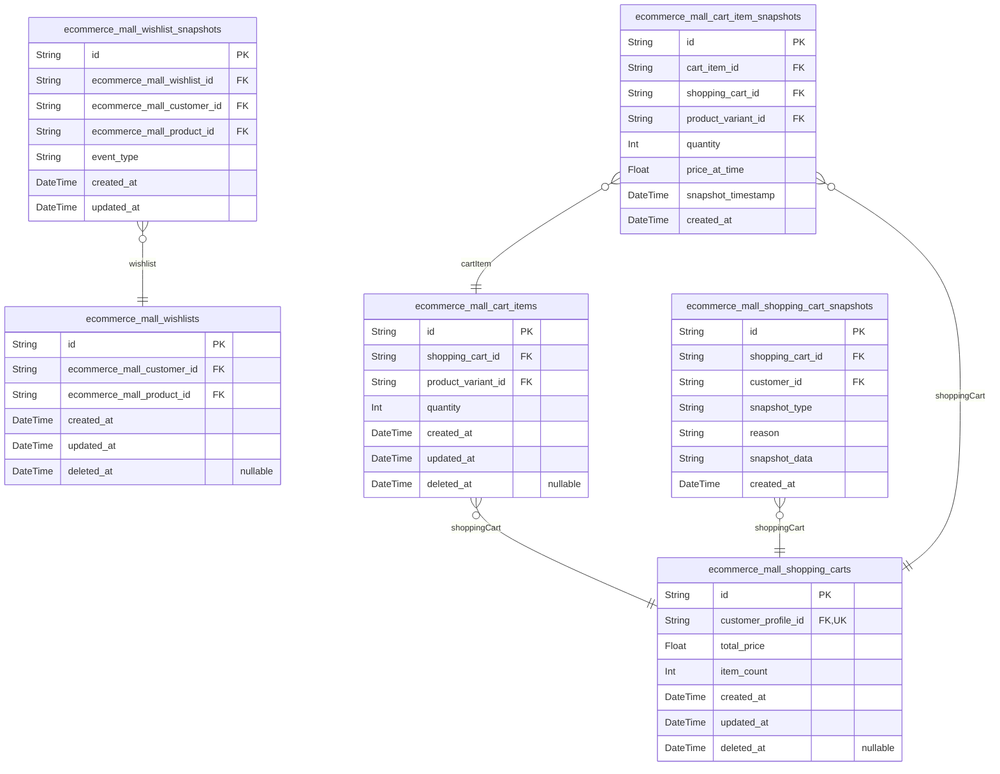

### `ecommerce_mall_wishlists`

Tracks customer product interests for future consideration, automatically
removes deleted products.

Each wishlist entry represents a customer's interest in a specific
product for potential future purchase. Customers can add products to
their wishlist to track items they're interested in but not ready to
purchase immediately. When a product is deleted by its seller, all
associated wishlist entries are automatically removed through foreign key
cascade constraints.

Wishlist entries are managed independently by customers through add,
remove, and view operations. The system ensures duplicate prevention
through unique constraints on customer-product combinations.

Related entities: [ecommerce_mall_customers.id](#ecommerce_mall_customers) for customer
ownership, [ecommerce_mall_products.id](#ecommerce_mall_products) for product reference.

Properties as follows:

- `id`: Primary Key.
- `ecommerce_mall_customer_id`
  > Customer who added the product to their wishlist. {@link
  > ecommerce_mall_customers.id}.
- `ecommerce_mall_product_id`
  > Product that the customer is interested in. {@link
  > ecommerce_mall_products.id}.
- `created_at`: Timestamp when the product was added to the customer's wishlist.
- `updated_at`
  > Timestamp when the wishlist entry was last modified (typically same as
  > created_at since wishlist entries are not edited).
- `deleted_at`
  > Timestamp when the wishlist entry was removed by the customer or
  > automatically due to product deletion. Null indicates active wishlist
  > entry.

### `ecommerce_mall_shopping_carts`

Persistent customer shopping cart for pre-purchase item assembly with
total price calculation.

Each registered customer has exactly one active shopping cart that serves
as a temporary holding area for product variants before checkout. The
cart automatically combines quantities when the same variant is added
multiple times, calculates subtotals for each line item, and provides a
running total of all items.

Shopping carts bridge the browsing experience to the purchase commitment
by allowing customers to assemble items from multiple sellers, adjust
quantities, and review the total price before proceeding to checkout.
[ecommerce_mall_customer_profiles.id](#ecommerce_mall_customer_profiles) own their shopping carts,
while [ecommerce_mall_cart_items.id](#ecommerce_mall_cart_items) represent the individual line
items within the cart.

Deleted carts are soft-deleted to preserve historical data while removing
them from active customer interactions.

Properties as follows:

- `id`: Primary Key.
- `customer_profile_id`
  > Owning customer's profile reference. Each customer has exactly one active
  > shopping cart for pre-purchase item assembly. {@link
  > ecommerce_mall_customer_profiles.id}.
- `total_price`
  > Calculated total price of all items in the cart, representing the sum of
  > all cart item subtotals (price × quantity). This value is updated
  > whenever cart items are added, removed, or modified.
- `item_count`
  > Total number of distinct product variants in the cart, counting each
  > variant once regardless of quantity. Used for quick display of cart size
  > without loading all cart items.
- `created_at`
  > Timestamp when the shopping cart was first created for the customer,
  > typically during initial account setup or first product addition.
- `updated_at`
  > Timestamp when the shopping cart was last modified, including any changes
  > to cart items, quantities, or pricing calculations.
- `deleted_at`
  > Timestamp when the shopping cart was soft-deleted, preserving historical
  > data while removing the cart from active customer interactions. Null
  > indicates an active cart.

### `ecommerce_mall_cart_items`

Variant-specific lines within customer shopping carts with quantity
management and automatic combination of duplicate variants.

Each cart item represents a specific product variant added to a shopping
cart, with a quantity and price reference. The system automatically
combines quantities when the same variant is added multiple times. Cart
items belong to a parent shopping cart and reference the specific product
variant being purchased.

Business rules: 1) The same variant cannot appear multiple times in the
same cart - quantities are combined, 2) Cart items are removed from cart
when checkout completes, 3) Cart items become unavailable when variant
stock is insufficient or variant is deleted.

Properties as follows:

- `id`: Primary Key.
- `shopping_cart_id`
  > Parent shopping cart that contains this cart item. {@link
  > ecommerce_mall_shopping_carts.id}.
- `product_variant_id`
  > Specific product variant being added to cart. {@link
  > ecommerce_mall_product_variants.id}.
- `quantity`
  > Number of units of this variant in the cart. When same variant is added
  > multiple times, quantities are combined into this single field.
- `created_at`: Timestamp when this cart item was first added to the cart.
- `updated_at`
  > Timestamp when this cart item was last modified (quantity changed or
  > refreshed).
- `deleted_at`
  > Timestamp when this cart item was removed from the cart (soft delete).
  > Null while still active in cart.

### `ecommerce_mall_wishlist_snapshots`

Immutable snapshots of wishlist changes for audit trails, preserving
previous states when products are added or removed.

This table records each addition or removal event for products in
customer wishlists, creating a complete audit trail of wishlist
modifications. Each snapshot captures the wishlist entry state at the
time of change, including the customer, product, and timestamp of the
event. Snapshots are created whenever a product is added to or removed
from a wishlist, ensuring compliance with the platform's Snapshot
Principle requirement for financial transparency and dispute resolution.

These records serve as historical evidence for customer preferences,
support dispute resolution regarding product availability claims, and
enable analytics on wishlist behavior patterns. {@link
ecommerce_mall_wishlists.id} represents the parent wishlist entity, while
[ecommerce_mall_customers.id](#ecommerce_mall_customers) and {@link
ecommerce_mall_products.id} provide direct references to the involved
actors and catalog items.

Properties as follows:

- `id`: Primary Key.
- `ecommerce_mall_wishlist_id`
  > Reference to the parent wishlist entity. {@link
  > ecommerce_mall_wishlists.id}
- `ecommerce_mall_customer_id`
  > Denormalized reference to the customer who owns the wishlist. Improves
  > query performance for customer history analysis. {@link
  > ecommerce_mall_customers.id}
- `ecommerce_mall_product_id`
  > Reference to the product that was added or removed from the wishlist.
  > [ecommerce_mall_products.id](#ecommerce_mall_products)
- `event_type`
  > Type of wishlist change event. 'added' indicates the product was added to
  > the wishlist, 'removed' indicates the product was removed from the
  > wishlist.
- `created_at`
  > Timestamp when this snapshot was created, representing when the wishlist
  > change occurred.
- `updated_at`
  > Timestamp when this snapshot was last updated. For immutable snapshots,
  > this equals created_at but is included for consistency with temporal
  > field patterns.

### `ecommerce_mall_shopping_cart_snapshots`

Immutable snapshots of shopping cart changes for audit trails, preserving
cart states before modifications.

This table implements the Snapshot Principle for shopping cart
operations. Whenever a shopping cart is created, updated, or emptied, a
snapshot is automatically created to preserve the complete cart state at
that moment. Each snapshot includes the cart contents, pricing, and
metadata, enabling full audit trails for dispute resolution and
historical analysis.

Snapshots are immutable records that cannot be modified or deleted. They
capture the exact cart state before any modification, including all
items, quantities, and prices. The snapshot_data field preserves the
complete cart structure for historical reference. {@link
ecommerce_mall_shopping_carts} is the parent cart being snapshotted, and
[ecommerce_mall_customers](#ecommerce_mall_customers) identifies who triggered the snapshot.

Snapshots are essential for financial transparency and customer support,
allowing administrators to reconstruct cart states at any point in time
for order disputes or system audits.

Properties as follows:

- `id`: Primary Key.
- `shopping_cart_id`
  > The shopping cart being snapshotted. This immutable reference preserves
  > which cart state was captured at this moment. {@link
  > ecommerce_mall_shopping_carts.id}
- `customer_id`
  > The customer who triggered the snapshot. This records which actor
  > initiated the cart change that caused this snapshot. {@link
  > ecommerce_mall_customers.id}
- `snapshot_type`
  > Type of snapshot event that occurred. Indicates what operation triggered
  > the snapshot creation.
  >
  > Allowed values:
  > - 'cart_created': Initial cart creation
  > - 'cart_updated': Cart contents modified (items added/removed, quantities
  > changed)
  > - 'cart_emptied': All items removed from cart
  > - 'checkout_initiated': Customer started checkout process
  >
  > This categorization helps filter and analyze different types of cart
  > changes.
- `reason`
  > Reason for creating this snapshot. Typically describes what change
  > occurred in the cart.
  >
  > Examples:
  > - 'Added product variant Red/Large'
  > - 'Changed quantity from 2 to 3'
  > - 'Removed out of stock item'
  > - 'Customer initiated checkout'
  > - 'Cart emptied by customer'
  >
  > This human-readable description provides context for why the snapshot was
  > created.
- `snapshot_data`
  > Complete JSON representation of the shopping cart state at snapshot time.
  >
  > This field preserves the exact cart structure including:
  > - Cart items with product names, variant options, and prices
  > - Quantities and subtotals for each item
  > - Total cart price and tax calculations
  > - Applied discounts or promotions
  > - Cart metadata and timestamps
  >
  > The JSON structure allows full reconstruction of the cart state for audit
  > purposes.
- `created_at`
  > Timestamp when this snapshot was created. This immutable timestamp
  > records exactly when the cart state was captured, enabling chronological
  > audit trails and time-based analysis.

### `ecommerce_mall_cart_item_snapshots`

Immutable snapshots of cart item changes for audit trails, preserving
quantity and variant selections before modifications.

This table captures the complete state of a cart item at the moment
before a change occurs, providing a historical record for dispute
resolution and audit compliance. Each snapshot preserves the shopping
cart reference, product variant selection, quantity, and price at the
time of capture. Snapshots are created automatically when cart items are
modified or removed from the cart, ensuring financial transparency and
compliance with the platform's Snapshot Principle requirements.

Snapshots cannot be modified or deleted once created, serving as
permanent audit trails for shopping cart activity. Administrators can
view cart item snapshots to investigate cart manipulation or resolve
customer disputes about price changes during shopping sessions.

Properties as follows:

- `id`: Primary Key.
- `cart_item_id`
  > Reference to the original cart item being snapshotted. {@link
  > ecommerce_mall_cart_items.id}
- `shopping_cart_id`
  > Reference to the shopping cart containing the snapshotted item. {@link
  > ecommerce_mall_shopping_carts.id}
- `product_variant_id`
  > Reference to the product variant selected in the cart item at snapshot
  > time. [ecommerce_mall_product_variants.id](#ecommerce_mall_product_variants)
- `quantity`
  > Quantity of the product variant in the cart at the time of snapshot
  > capture. This preserves how many units the customer had selected before
  > modification or removal.
- `price_at_time`
  > Price of the product variant at the moment of snapshot capture. Preserves
  > the exact unit price that was displayed to the customer during their
  > shopping session.
- `snapshot_timestamp`
  > Timestamp indicating when the captured cart item state existed. This
  > represents the moment before the change that triggered the snapshot
  > creation.
- `created_at`: Timestamp when this snapshot record was created in the system.

## Orders

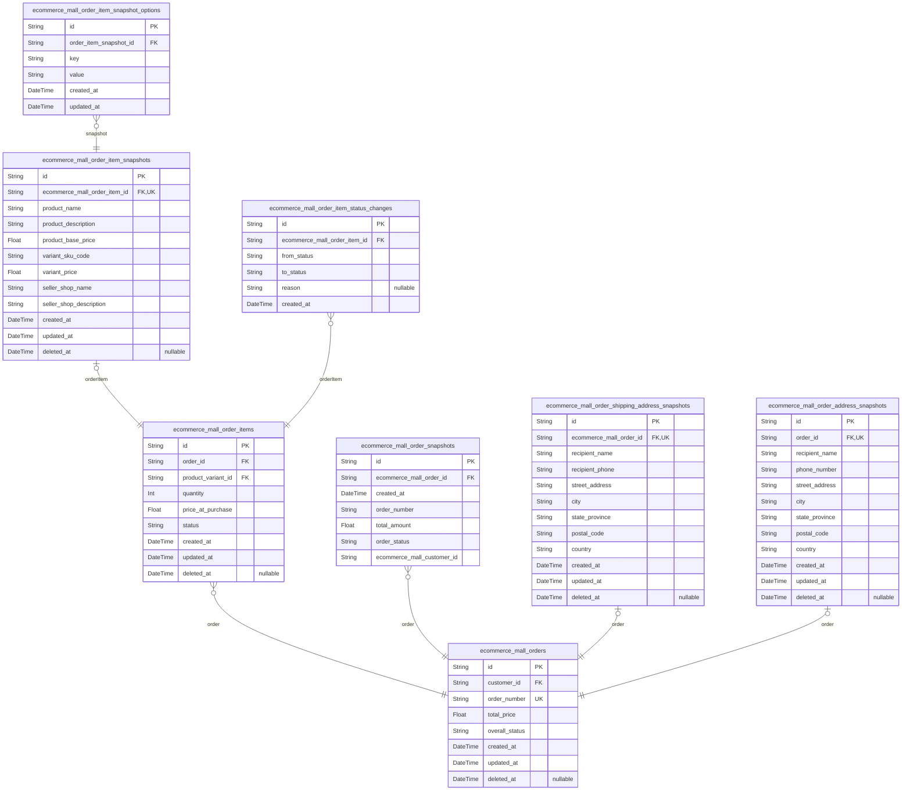

### `ecommerce_mall_orders`

Main order headers representing completed purchase transactions. Each
order contains a unique order number, total purchase amount, customer
reference, and derived overall status based on its order items.

Orders serve as the formal purchase commitment record and basis for all
fulfillment activities. They capture the customer's intent to purchase
specific items from potentially multiple sellers in a single transaction.
The overall order status is dynamically derived from the statuses of
individual order items according to business rules defined in section
250.

Order data persists indefinitely for historical and legal record-keeping
purposes as specified in section 251. Customers cannot delete orders,
ensuring a complete audit trail of all purchase transactions. The
shipping address snapshot is preserved immutably with each order to
maintain delivery record integrity.

Orders reference the purchasing customer through {@link
ecommerce_mall_customers.id} and contain multiple order items through
[ecommerce_mall_order_items.order_id](#ecommerce_mall_order_items). The overall status provides
a high-level view of order progress while individual item statuses enable
granular tracking and independent processing.

Properties as follows:

- `id`: Primary Key.
- `customer_id`
  > Reference to the purchasing customer's account. {@link
  > ecommerce_mall_customers.id}
- `order_number`
  > Unique business identifier for the order, used for customer and seller
  > reference throughout the order lifecycle. This number is permanent and
  > never changes once assigned.
- `total_price`
  > Total financial amount of the purchase, calculated as the sum of all
  > order item prices multiplied by their quantities at the time of purchase.
  > This value remains fixed regardless of later price changes.
- `overall_status`
  > High-level order status derived from individual order item statuses
  > according to business rules. Valid values: 'paid' (all items paid),
  > 'shipped' (any item shipped, none delivered), 'delivered' (all items
  > delivered), 'cancelled' (all items cancelled), 'refunded' (all items
  > refunded), 'partially completed' (mixed statuses).
- `created_at`: Timestamp when the order was created after successful payment processing.
- `updated_at`
  > Timestamp when the order was last updated, typically when overall status
  > changes due to item status updates.
- `deleted_at`
  > Timestamp when the order was soft-deleted, allowing persistence for legal
  > record-keeping while removing from active views. Orders are never
  > physically deleted per section 251 requirements.

### `ecommerce_mall_order_items`

Individual purchased product variants within customer orders,
representing specific SKU purchases with quantity and preserved purchase
price.

Each order item records a customer's purchase of a specific product
variant at a particular moment in time, preserving the exact price paid
regardless of future price changes. Order items have independent status
tracking (paid, shipped, delivered, cancelled, refunded) and serve as the
foundation for shipment bundling, cancellation requests, and refund
processing.

Order items reference both the parent order ({@link
ecommerce_mall_orders}) and the specific product variant ({@link
ecommerce_mall_product_variants}) that was purchased. Historical
snapshots of product, variant, and seller information at purchase time
are preserved through [ecommerce_mall_order_item_snapshots](#ecommerce_mall_order_item_snapshots) for
audit and dispute resolution.

Properties as follows:

- `id`: Primary Key.
- `order_id`: Parent order containing this item. [ecommerce_mall_orders.id](#ecommerce_mall_orders)
- `product_variant_id`
  > Product variant that was purchased. {@link
  > ecommerce_mall_product_variants.id}
- `quantity`: Number of units purchased for this variant. Must be greater than 0.
- `price_at_purchase`
  > Price per unit at the time of purchase, preserved immutably for financial
  > records and dispute resolution.
- `status`
  > Current lifecycle status of this order item. Valid values: 'paid'
  > (payment completed), 'shipped' (seller has shipped), 'delivered'
  > (customer confirmed delivery), 'cancelled' (item was cancelled),
  > 'refunded' (item was refunded).
- `created_at`: Timestamp when this order item was created during order placement.
- `updated_at`
  > Timestamp when this order item was last updated (status changes, quantity
  > adjustments).
- `deleted_at`
  > Timestamp when this order item was soft deleted, preserving historical
  > records while removing from active queries.

### `ecommerce_mall_order_snapshots`

Point-in-time snapshots of order changes for audit and historical reference.

Captures the complete state of an order at specific moments when changes
occur, preserving order number, total amount, status, and customer
reference for dispute resolution and historical analysis. This table
implements the Snapshot Principle requirement for financial transparency
in order modifications.

Each snapshot records all relevant order fields at the time of creation,
providing an immutable historical record that can be referenced by
relevant parties (owners, administrators) for compliance and auditing
purposes. [ecommerce_mall_orders.id](#ecommerce_mall_orders)

Properties as follows:

- `id`: Primary Key.
- `ecommerce_mall_order_id`
  > Reference to the parent order that was snapshotted. {@link
  > ecommerce_mall_orders.id}
- `created_at`
  > Timestamp when this snapshot was created, indicating when the order state
  > was captured.
- `order_number`
  > The order number at the time of snapshot, preserved for historical
  > reference.
- `total_amount`
  > The total order amount in the currency's smallest unit at the time of
  > snapshot.
- `order_status`
  > The overall order status at the time of snapshot (paid, shipped,
  > delivered, cancelled, refunded, partially_completed).
- `ecommerce_mall_customer_id`
  > Reference to the customer who placed the order, preserved at snapshot
  > time for historical accuracy.

### `ecommerce_mall_order_item_snapshots`

Immutable preservation of product, variant, and seller data at the exact
moment of purchase for each order item.

Captures the complete transactional state including product details,
variant configuration, and seller profile information as they existed
when the customer completed their purchase. This ensures accurate
historical records for dispute resolution, customer service, and
financial auditing.

Each snapshot is created once when an order is placed and cannot be
modified, preserving the integrity of the purchase transaction. The
snapshot links to the specific [ecommerce_mall_order_items.id](#ecommerce_mall_order_items) and
serves as a permanent reference to what was actually purchased.

Three critical data sets are preserved:
1. Product snapshot: Name, description, category, base price
2. Variant snapshot: SKU code, option values (stored in normalized child
table), specific price
3. Seller snapshot: Shop name, description, business identity

Properties as follows:

- `id`: Primary Key.
- `ecommerce_mall_order_item_id`
  > Reference to the specific order item this snapshot preserves. {@link
  > ecommerce_mall_order_items.id}.
- `product_name`
  > Name of the product as it appeared at the moment of purchase. Preserves
  > the exact product name the customer saw and purchased.
- `product_description`
  > Product description text as it appeared at the moment of purchase.
  > Captures the complete product information presented to the customer.
- `product_base_price`
  > Base price of the product at the moment of purchase. This is the
  > product's standard price before any variant-specific pricing.
- `variant_sku_code`
  > SKU (Stock Keeping Unit) code of the specific variant purchased. Unique
  > identifier for the variant configuration.
- `variant_price`
  > Specific price of this variant at the moment of purchase. May differ from
  > the product's base price if the variant has a price override.
- `seller_shop_name`
  > Shop name of the seller as it appeared at the moment of purchase.
  > Preserves the business identity under which the purchase was made.
- `seller_shop_description`
  > Shop description of the seller as it appeared at the moment of purchase.
  > Captures the seller's business information presented to customers.
- `created_at`
  > Timestamp when this snapshot was created, which should match the order
  > creation time. Immutable creation timestamp for audit trail.
- `updated_at`
  > Timestamp when this snapshot was last updated. Since snapshots are
  > immutable, this field remains unchanged after creation but maintains
  > consistency with other business entities.
- `deleted_at`
  > Soft deletion timestamp. Although snapshots are typically preserved
  > forever, this field supports consistent deletion patterns across all
  > entities.

### `ecommerce_mall_order_item_status_changes`

Historical tracking of order item status transitions throughout their
lifecycle.

This table captures every status change for order items, including
transitions between statuses like paid → shipped, shipped → delivered,
paid → cancelled, delivered → refunded. Each record preserves the exact
timestamp of the status change, the before and after status values, and
optional contextual information about why the change occurred. This
historical trail supports order dispute resolution, customer service
inquiries, and seller performance analytics.

[ecommerce_mall_order_items.id](#ecommerce_mall_order_items)

Properties as follows:

- `id`: Primary Key.
- `ecommerce_mall_order_item_id`: Order item whose status changed. [ecommerce_mall_order_items.id](#ecommerce_mall_order_items)
- `from_status`
  > Status before the change. Valid values: 'paid', 'shipped', 'delivered',
  > 'cancelled', 'refunded'. This represents the order item's state before
  > the transition.
- `to_status`
  > Status after the change. Valid values: 'paid', 'shipped', 'delivered',
  > 'cancelled', 'refunded'. This represents the new state of the order item
  > after the transition.
- `reason`
  > Optional context explaining why the status change occurred. For example:
  > 'Seller shipped the item', 'Customer confirmed delivery', 'Cancellation
  > approved by seller', 'Refund processed by payment gateway'. This provides
  > human-readable explanation for audit purposes.
- `created_at`
  > Timestamp when the status change was recorded. This represents the exact
  > moment the order item transitioned to the new status.

### `ecommerce_mall_order_shipping_address_snapshots`

Immutable shipping address snapshots preserved with each order for
delivery records.

Captures the exact shipping address at the moment of order creation,
including all recipient and location information as specified in address
format requirements. This snapshot ensures that delivery information
cannot be altered after order placement, providing a permanent record for
shipping labels, delivery verification, and dispute resolution.

Each order has exactly one shipping address snapshot created at order
creation time. The snapshot includes all address fields required for
international shipping: recipient name, phone number, street address,
city, state/province, postal code, and country. These values are
preserved exactly as provided by the customer at checkout.

[ecommerce_mall_orders](#ecommerce_mall_orders)

Properties as follows:

- `id`: Primary Key.
- `ecommerce_mall_order_id`
  > The order this shipping address snapshot belongs to. {@link
  > ecommerce_mall_orders.id}.
- `recipient_name`: Full name of the person receiving the shipment as provided at checkout.
- `recipient_phone`: Phone number for delivery contact as provided at checkout.
- `street_address`
  > Complete street address including building number, street name, and any
  > apartment/suite details.
- `city`: City or locality for delivery.
- `state_province`: State, province, or region for delivery.
- `postal_code`: Postal code or ZIP code for delivery location.
- `country`: Country for international shipping.
- `created_at`
  > Timestamp when this shipping address snapshot was created (order creation
  > time).
- `updated_at`
  > Timestamp when this record was last updated (should rarely change as
  > snapshots are immutable).
- `deleted_at`: Timestamp when this snapshot was soft-deleted for audit purposes.

### `ecommerce_mall_order_address_snapshots`

Immutable shipping address snapshots preserved with each order for
delivery and dispute resolution.

This table stores the complete shipping address as captured at order
placement time, following the snapshot principle for financial
transparency. Each record contains recipient information and full address
components that cannot be modified after order creation, ensuring address
changes made by customers post-order do not affect existing orders.

Created in reference to ecommerce_mall_orders.id when an order is placed
to preserve the delivery address for fulfillment. The 1:1 relationship
ensures each order has exactly one address snapshot that remains
unchanged throughout the order lifecycle.

Properties as follows:

- `id`: Primary Key.
- `order_id`
  > Reference to the parent order that contains this address snapshot. {@link
  > ecommerce_mall_orders.id}
- `recipient_name`: Full name of the person receiving the shipment at the delivery address.
- `phone_number`: Contact phone number for delivery coordination and order communications.
- `street_address`: Primary street address line including building number and street name.
- `city`: City or locality name for the delivery address.
- `state_province`: State, province, or regional administrative division for the address.
- `postal_code`: Postal or ZIP code for mail routing and delivery.
- `country`: Country name for international shipping and customs purposes.
- `created_at`
  > Timestamp when this address snapshot was created, typically at order
  > placement time.
- `updated_at`
  > Timestamp when this address snapshot was last updated. For immutable
  > snapshots, this should match created_at unless system modifications
  > occur.
- `deleted_at`
  > Timestamp when this address snapshot was soft-deleted, allowing for data
  > retention and recovery. Null indicates active record.

### `ecommerce_mall_order_item_snapshot_options`

Normalized key-value storage for product variant option values captured
in order item snapshots.

Stores the exact option configuration (e.g., color, size, material) as it
existed at the moment of purchase, supporting First Normal Form (1NF)
normalization instead of JSON string storage. Each record represents one
option name-value pair for a specific order item snapshot.

This table ensures data integrity by preventing duplicate option names
per snapshot and enables efficient querying of specific option values
across historical orders. Used for preserving product specifications for
order history, customer service inquiries, and dispute resolution.

Properties as follows:

- `id`: Primary Key.
- `order_item_snapshot_id`
  > Reference to the order item snapshot containing these option values.
  > [ecommerce_mall_order_item_snapshots.id](#ecommerce_mall_order_item_snapshots)
- `key`
  > Option name identifying the type of attribute (e.g., 'color', 'size',
  > 'material'). Serves as the key in the key-value pair.
- `value`
  > Option value representing the specific attribute selection (e.g., 'Red',
  > 'Large', 'Cotton'). Serves as the value in the key-value pair.
- `created_at`
  > Timestamp when this option value was recorded. Automatically set when the
  > snapshot is created.
- `updated_at`
  > Timestamp when this option value was last updated. Automatically updated
  > on record modification.

## Shipments

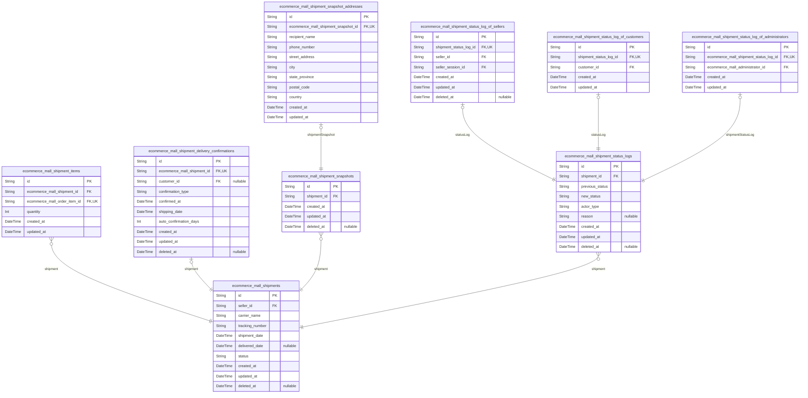

### `ecommerce_mall_shipments`

Main shipment entity representing a physical package sent by a seller to
a customer. Contains tracking information, carrier details, and shipment
dates. Serves as the digital-physical fulfillment bridge connecting
online orders to physical delivery.

Shipments bundle multiple order items from the same seller with shared
tracking information. Each shipment is created by a seller when they
dispatch purchased items for delivery. Shipment creation changes the
status of all included order items from 'paid' to 'shipped'. Customers
can view tracking information and confirm delivery per shipment, not per
individual item.

This table tracks carrier information, shipment date, delivery
confirmation, and provides the foundation for the shipment lifecycle from
creation to delivery confirmation. [ecommerce_mall_sellers](#ecommerce_mall_sellers) create
shipments for their sold items. [ecommerce_mall_shipment_items](#ecommerce_mall_shipment_items)
links shipments to specific order items. {@link
ecommerce_mall_shipment_delivery_confirmations} tracks delivery
confirmation events.

Properties as follows:

- `id`: Primary Key.
- `seller_id`
  > The seller who created and dispatched this shipment. All items in a
  > shipment must be from the same seller. [ecommerce_mall_sellers.id](#ecommerce_mall_sellers).
- `carrier_name`
  > Name of the shipping carrier handling the package delivery. Examples
  > include 'USPS', 'FedEx', 'DHL', or local delivery services. Used by
  > customers to identify which carrier to track their package with.
- `tracking_number`
  > Unique identifier assigned by the carrier for tracking package progress
  > through the delivery system. Customers use this number to monitor
  > shipment status on carrier websites or apps. Must be unique per carrier
  > to ensure accurate tracking.
- `shipment_date`
  > Date and time when the seller dispatched the package for delivery. Marks
  > the beginning of the physical fulfillment process and starts the
  > countdown for automatic delivery confirmation (14 days after this date if
  > not manually confirmed).
- `delivered_date`
  > Date and time when the shipment was confirmed as delivered. Initially
  > null until either the customer confirms delivery or automatic delivery
  > confirmation occurs 14 days after shipment_date. Used to complete the
  > shipment lifecycle.
- `status`
  > Current status of the shipment lifecycle. Derived from the latest entry
  > in [ecommerce_mall_shipment_status_logs](#ecommerce_mall_shipment_status_logs). Common values: 'created',
  > 'in_transit', 'out_for_delivery', 'delivered', 'cancelled'. Helps
  > customers and sellers track shipment progress.
- `created_at`
  > Timestamp when this shipment record was created in the system. Used for
  > audit trail and chronological ordering of shipments.
- `updated_at`
  > Timestamp when this shipment record was last updated. Tracks
  > modifications to shipment information such as status changes or
  > delivered_date updates.
- `deleted_at`
  > Timestamp when this shipment record was soft-deleted. Null indicates the
  > shipment is active; non-null indicates it has been deleted while
  > preserving referential integrity for historical records.

### `ecommerce_mall_shipment_items`

Junction table connecting shipments to order items, tracking which
specific items are included in each shipment bundle.

Each record represents a specific order item that is part of a physical
shipment package. This table enables sellers to bundle multiple order
items from the same customer order into a single shipment, reducing
shipping costs and simplifying fulfillment. The quantity field tracks how
many units of a particular variant are included in the shipment.

Key business rules:
- Each order item can be included in at most one shipment (enforced by
unique constraint)
- Shipments can contain multiple order items from the same seller
- Different sellers always ship separately (ensured by application logic,
not database constraints)
- Items are moved from 'paid' to 'shipped' status when included in a
shipment
- Quantity in shipment must match or be less than order item quantity
(validated by application logic)

This table serves as the bridge between digital orders and physical
fulfillment, supporting the requirement for customers to confirm delivery
per shipment rather than per individual item.

Related entities: [ecommerce_mall_shipments](#ecommerce_mall_shipments), {@link
ecommerce_mall_order_items}

Properties as follows:

- `id`: Primary Key.
- `ecommerce_mall_shipment_id`: Belonged shipment's [ecommerce_mall_shipments.id](#ecommerce_mall_shipments).
- `ecommerce_mall_order_item_id`: Included order item's [ecommerce_mall_order_items.id](#ecommerce_mall_order_items).
- `quantity`
  > Number of units of this order item variant included in the shipment. Must
  > be greater than 0 and cannot exceed the original order item quantity.
  > Used for partial shipments where not all units of an order item are
  > shipped together.
- `created_at`
  > Timestamp when this shipment item record was created, representing when
  > the order item was added to the shipment bundle.
- `updated_at`
  > Timestamp when this shipment item record was last updated. Typically
  > updated if quantity is adjusted or item is removed from shipment.

### `ecommerce_mall_shipment_delivery_confirmations`

Delivery confirmation records for shipments, tracking when customers
confirm delivery and automatic delivery confirmation after timeout
period.

Each shipment receives exactly one delivery confirmation record, which is
created either manually by the customer confirming receipt or
automatically by the system after the configured timeout period (default
14 days). This table supports the requirement that customers confirm
delivery per shipment, not per individual order item.

Manual confirmations include a reference to the confirming customer and
the exact timestamp when they acknowledged delivery. Automatic
confirmations are system-generated when the shipment's shipping date
exceeds the auto-confirmation threshold without manual confirmation.

Delivery confirmations trigger status changes for all order items in the
shipment, transitioning them from 'shipped' to 'delivered' status. This
provides the audit trail required for order fulfillment completion.

[ecommerce_mall_shipments](#ecommerce_mall_shipments) for the shipment being confirmed. {@link
ecommerce_mall_customers} for manual confirmations.

Properties as follows:

- `id`: Primary Key.
- `ecommerce_mall_shipment_id`: The shipment being confirmed. [ecommerce_mall_shipments.id](#ecommerce_mall_shipments).
- `customer_id`
  > The customer who manually confirmed delivery, or null for automatic
  > confirmations. [ecommerce_mall_customers.id](#ecommerce_mall_customers).
- `confirmation_type`
  > Type of confirmation: 'manual' when customer explicitly confirms
  > delivery, or 'automatic' when system confirms after timeout period.
- `confirmed_at`
  > Timestamp when delivery was confirmed, either by customer action or
  > system automation.
- `shipping_date`
  > Original shipping date of the shipment, used to calculate automatic
  > confirmation timing. This is copied from the shipment's shipping date at
  > confirmation time for historical accuracy.
- `auto_confirmation_days`
  > Number of days after shipping date when automatic confirmation occurs.
  > Default is 14 days per requirements.
- `created_at`: Timestamp when this delivery confirmation record was created.
- `updated_at`: Timestamp when this delivery confirmation record was last updated.
- `deleted_at`
  > Timestamp when this delivery confirmation record was soft deleted, or
  > null if active.

### `ecommerce_mall_shipment_snapshots`

Immutable snapshots of shipment state changes for audit and dispute
resolution, preserving the complete shipment state at specific points in
time.

This table captures the exact state of shipments whenever significant
changes occur, serving as an audit record for dispute resolution and
financial transparency under the platform's Snapshot Principle. Unlike
regular entities, snapshot tables store denormalized copies of parent
data to preserve historical context while maintaining referential
integrity.

Shipment snapshots are created automatically when shipment details are
modified or when status changes occur. They provide a complete historical
record needed to resolve disputes about delivery timelines, carrier
performance, or shipment tracking accuracy. These snapshots are
append-only records that cannot be modified or deleted, ensuring a
complete audit trail of all shipment modifications throughout the
fulfillment process.

Access parent shipment data through the foreign key relationship.
Historical shipping addresses are preserved in the separate
ecommerce_mall_shipment_snapshot_addresses table to maintain 1NF
compliance. [ecommerce_mall_shipments.id](#ecommerce_mall_shipments)

Properties as follows:

- `id`: Primary Key.
- `shipment_id`
  > Reference to the parent shipment entity. {@link
  > ecommerce_mall_shipments.id}
- `created_at`
  > Timestamp when this snapshot was created, representing the exact moment
  > of shipment state capture.
- `updated_at`
  > Timestamp when this snapshot was last updated. For snapshot tables, this
  > typically matches created_at unless corrections are made.
- `deleted_at`
  > Timestamp when this snapshot was soft-deleted, if applicable. Null
  > indicates the snapshot is active.

### `ecommerce_mall_shipment_status_logs`

Historical log of shipment status transitions throughout the lifecycle
from created to delivered or cancelled.

Each record captures a single status change event for a shipment,
including the previous status, new status, timestamp, and the actor who
initiated the change. This provides a complete audit trail of shipment
lifecycle progression and supports dispute resolution, delivery
confirmation tracking, and compliance with the platform's financial
transparency requirements.

Status transitions are triggered by various system events: shipment
creation by sellers, delivery confirmation by customers, automatic
timeout deliveries, and administrative interventions. The log preserves
the complete history of how each shipment progressed through its
lifecycle.

Actor type tracking uses discriminator field 'actor_type' with values:
'seller', 'customer', 'system', 'administrator'. Specific actor
references are maintained in separate subtype tables for referential
integrity and proper normalization.

[ecommerce_mall_shipments](#ecommerce_mall_shipments)

Properties as follows:

- `id`: Primary Key.
- `shipment_id`
  > Reference to the shipment whose status is being logged. {@link
  > ecommerce_mall_shipments.id}.
- `previous_status`
  > The shipment status before this transition occurred. This field preserves
  > the historical state for audit trail purposes and helps reconstruct the
  > exact sequence of status changes.
- `new_status`
  > The new shipment status after this transition. This represents the
  > updated state of the shipment as recorded at the time of the status
  > change event.
- `actor_type`
  > Type of actor who initiated the status change. Possible values: 'seller',
  > 'customer', 'system', 'administrator'. This identifies which role
  > performed the action that triggered the status transition.
- `reason`
  > Optional human-readable reason or note explaining why the status change
  > occurred. Used for manual status updates, administrative interventions,
  > or exceptional circumstances that require documentation.
- `created_at`
  > Timestamp when this status transition was recorded. Represents the exact
  > moment when the shipment changed from the previous status to the new
  > status.
- `updated_at`
  > Timestamp when this status log record was last updated. Maintains audit
  > trail of modifications to the status log itself.
- `deleted_at`
  > Timestamp when this status log record was soft-deleted. Allows recovery
  > of audit trail data while supporting data retention policies.

### `ecommerce_mall_shipment_snapshot_addresses`

Normalized shipping address information for shipment snapshots, storing
address components individually to maintain 1NF compliance and avoid JSON
string storage.

This table captures the complete shipping address state at the time of
shipment creation, including recipient details, phone number for delivery
coordination, and full location information. Each record preserves the
exact address configuration used for a specific shipment, ensuring audit
trail integrity and dispute resolution capability.

Address snapshots are immutable and cannot be modified after creation,
providing a permanent record of the delivery location as it existed when
the shipment was processed. This supports the Snapshot Principle
requirement for financial transparency in the shipping process.

[ecommerce_mall_shipment_snapshots.id](#ecommerce_mall_shipment_snapshots)

Properties as follows:

- `id`: Primary Key.
- `ecommerce_mall_shipment_snapshot_id`
  > Reference to the shipment snapshot containing this address. {@link
  > ecommerce_mall_shipment_snapshots.id}
- `recipient_name`
  > Full name of the person receiving the package at the delivery address,
  > used by carriers for identity verification and successful delivery
  > completion.
- `phone_number`
  > Contact phone number for delivery coordination, allowing carriers to
  > schedule deliveries or resolve delivery issues with the recipient.
- `street_address`
  > Complete physical location details including building number, street
  > name, apartment or unit number, and any specific location identifiers
  > necessary for precise delivery.
- `city`
  > City or municipality where the delivery address is located, used for
  > regional routing and distribution center assignment.
- `state_province`
  > State or province designation for proper regional sorting and carrier
  > territory assignment.
- `postal_code`
  > Postal or zip code enabling precise geographic sorting and delivery area
  > identification for carrier systems.
- `country`
  > Country designation ensuring proper international shipping procedures and
  > customs documentation when applicable.
- `created_at`
  > Timestamp when the address snapshot was created, recording the exact
  > moment the address was captured for shipment processing.
- `updated_at`
  > Timestamp when the address snapshot was last updated, though typically
  > immutable after creation as required by the Snapshot Principle.

### `ecommerce_mall_shipment_status_log_of_sellers`

Links shipment status logs to seller actors when actor_type is 'seller'.
Provides referential integrity and proper relationship normalization for
seller-initiated status changes.

This table implements the polymorphic ownership pattern where
shipment_status_logs can have different actor types (seller, customer,
administrator). When the actor_type field in shipment_status_logs is
'seller', this table establishes the specific seller relationship. It
tracks which seller initiated the status change and includes their
session context for audit purposes.

The table maintains a 1:1 relationship with shipment_status_logs to
ensure each seller-initiated status log has exactly one seller reference.

Properties as follows:

- `id`: Primary Key.
- `shipment_status_log_id`
  > Reference to the shipment status log that was initiated by a seller.
  > [ecommerce_mall_shipment_status_logs.id](#ecommerce_mall_shipment_status_logs)
- `seller_id`
  > Reference to the seller who initiated the status change. {@link
  > ecommerce_mall_sellers.id}
- `seller_session_id`
  > Reference to the seller session at the time of status change initiation.
  > [ecommerce_mall_seller_sessions.id](#ecommerce_mall_seller_sessions)
- `created_at`: Timestamp when this seller status log relationship was created.
- `updated_at`: Timestamp when this seller status log relationship was last updated.
- `deleted_at`
  > Timestamp when this seller status log relationship was soft deleted, or
  > null if still active.

### `ecommerce_mall_shipment_status_log_of_customers`

Links shipment status logs to customer actors when actor_type is
'customer'. This implements the polymorphic ownership pattern for
customer-initiated shipment status changes.

Each shipment status log can have at most one customer actor association,
ensuring referential integrity when shipment status changes are initiated
by customers. This table provides the customer-specific context for
status logs that have actor_type 'customer'.

This is a subsidiary entity that depends on the main {@link
ecommerce_mall_shipment_status_logs} table for its existence and is
managed through the shipment status log lifecycle.

Properties as follows:

- `id`: Primary Key.
- `shipment_status_log_id`
  > Reference to the shipment status log entry. This implements the
  > polymorphic ownership pattern where each status log can have exactly one
  > customer association when actor_type is 'customer'. {@link
  > ecommerce_mall_shipment_status_logs.id}
- `customer_id`
  > Reference to the customer actor who initiated the status change. Links to
  > the customer's authentication record for auditing purposes. {@link
  > ecommerce_mall_customers.id}
- `created_at`: Timestamp when this customer-shipment status log association was created.
- `updated_at`
  > Timestamp when this customer-shipment status log association was last
  > updated.

### `ecommerce_mall_shipment_status_log_of_administrators`

Links shipment status logs to administrator actors when actor_type is
'administrator'. Implements the subtype pattern for polymorphic
ownership, providing referential integrity and proper relationship
normalization for administrator-initiated shipment status changes.

This table connects the main [ecommerce_mall_shipment_status_logs](#ecommerce_mall_shipment_status_logs)
entity to the [ecommerce_mall_administrators](#ecommerce_mall_administrators) actor table, ensuring
that administrator actions on shipment status transitions are properly
tracked and auditable. The 1:1 relationship with shipment status logs
enforces that each status log can have at most one administrator actor
reference when the actor_type indicates administrator involvement.

As an append-only audit table, this record is never soft-deleted and
serves as a permanent reference for accountability tracking and
maintaining referential integrity between shipment status changes and the
administrators who initiated them.

Properties as follows:

- `id`: Primary Key.
- `ecommerce_mall_shipment_status_log_id`
  > Reference to the shipment status log being linked to an administrator.
  > [ecommerce_mall_shipment_status_logs.id](#ecommerce_mall_shipment_status_logs).
- `ecommerce_mall_administrator_id`
  > Reference to the administrator actor who initiated the shipment status
  > change. [ecommerce_mall_administrators.id](#ecommerce_mall_administrators).
- `created_at`
  > Timestamp when this administrator linkage was created. Automatically set
  > when the record is inserted. As an append-only audit table, this
  > timestamp provides chronological ordering of administrator actions.
- `updated_at`
  > Timestamp when this administrator linkage was last updated. Automatically
  > updated on record modifications.

## Reviews

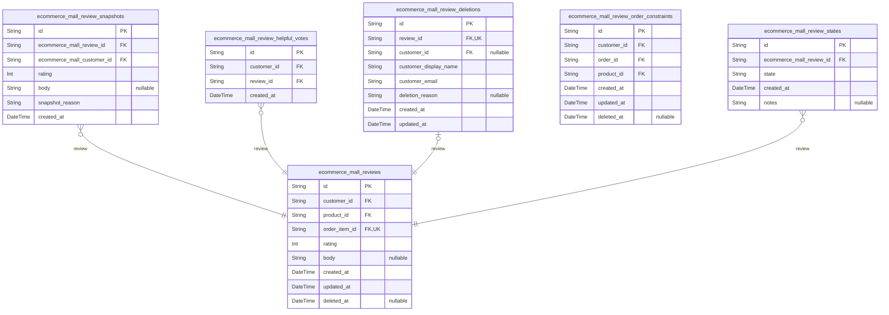

### `ecommerce_mall_reviews`

...

Properties as follows:

- `id`: Primary Key.
- `customer_id`: Reviewing customer's [ecommerce_mall_customers.id](#ecommerce_mall_customers).
- `product_id`: Reviewed product's [ecommerce_mall_products.id](#ecommerce_mall_products).
- `order_item_id`
  > Specific delivered order item that enabled this review. {@link
  > ecommerce_mall_order_items.id}.
- `rating`
  > Star rating from 1 to 5 representing customer satisfaction. Required for
  > every review.
- `body`
  > Optional text feedback providing details about product quality, features,
  > or performance.
- `created_at`: Timestamp when the review was first written. Auto-generated at creation.
- `updated_at`: Timestamp when the review was last modified. Auto-updated on changes.
- `deleted_at`: Timestamp when the review was deleted. Null means review is active.

### `ecommerce_mall_review_snapshots`

Historical snapshots of review modifications, preserving previous review
states for audit trails and version control.

When a customer edits their review, a snapshot captures the complete
review state immediately before the edit. This includes the rating, text
content, and metadata. Snapshots are immutable and serve as a permanent
audit trail for review modifications, supporting the platform's financial
integrity requirements.

Each snapshot is linked to the original review through {@link
ecommerce_mall_reviews.id} and records the customer who made the review
through [ecommerce_mall_customers.id](#ecommerce_mall_customers) for accountability. The
snapshot_reason field documents why the snapshot was created (e.g.,
'edit', 'moderation', 'correction').

Snapshots cannot be modified or deleted, ensuring a complete historical
record of all review changes for dispute resolution and compliance
purposes.

Properties as follows:

- `id`: Primary Key.
- `ecommerce_mall_review_id`
  > Original review that this snapshot captures. {@link
  > ecommerce_mall_reviews.id}.
- `ecommerce_mall_customer_id`
  > Customer who authored the original review. Preserved for audit trail even
  > if customer account is deleted. [ecommerce_mall_customers.id](#ecommerce_mall_customers).
- `rating`: Review rating from 1 to 5 stars as captured at snapshot time.
- `body`
  > Review text content as captured at snapshot time. May be empty if the
  > review had no text content.
- `snapshot_reason`
  > Reason why this snapshot was created, such as 'edit', 'moderation',
  > 'correction', or 'system_update'.
- `created_at`
  > Timestamp when this snapshot was created, representing the exact moment
  > the review state was captured.

### `ecommerce_mall_review_helpful_votes`

Customer votes on review helpfulness to improve review quality and ranking.

This table tracks which customers have marked which reviews as helpful,
creating a social proof system that surfaces valuable reviews to other
shoppers. Each vote represents a customer's assessment that a review
provided useful information for making purchasing decisions.

The vote system contributes to the marketplace trust ecosystem by
allowing customers to collectively identify high-quality reviews. Helpful
votes influence review ranking in product detail pages, prioritizing
reviews that other customers have found valuable.

A customer can vote each review only once, and votes are immutable once
cast. When a customer deletes their account, their votes are preserved to
maintain the integrity of the review ranking system. {@link
ecommerce_mall_customers.id} [ecommerce_mall_reviews.id](#ecommerce_mall_reviews)

Properties as follows:

- `id`: Primary Key.
- `customer_id`
  > Customer who voted the review as helpful. {@link
  > ecommerce_mall_customers.id}.
- `review_id`: Review that received the helpful vote. [ecommerce_mall_reviews.id](#ecommerce_mall_reviews).
- `created_at`: Timestamp when the customer voted the review as helpful.

### `ecommerce_mall_review_deletions`

Tracks review deletion events and preserves customer references for audit
trail.

When a customer deletes their review, this table records the deletion
event with timestamp and preserves the customer's identity even if they
later delete their account. This supports the requirement to show deleted
reviews as originating from a 'deleted user' while maintaining an audit
trail of who performed the deletion.

The table stores the customer's display name and email at the time of
deletion, ensuring these details remain available for display and audit
purposes regardless of account status changes.

[ecommerce_mall_reviews](#ecommerce_mall_reviews) for the deleted review reference.
[ecommerce_mall_customers](#ecommerce_mall_customers) for the customer who performed the
deletion.

Properties as follows:

- `id`: Primary Key.
- `review_id`: Reference to the deleted review. [ecommerce_mall_reviews.id](#ecommerce_mall_reviews).
- `customer_id`
  > Reference to the customer who performed the deletion. May be null if
  > customer account is deleted before the review deletion event is recorded.
  > [ecommerce_mall_customers.id](#ecommerce_mall_customers).
- `customer_display_name`
  > Customer's display name at the time of review deletion. Preserved even if
  > customer later changes name or deletes account.
- `customer_email`
  > Customer's email address at the time of review deletion. Preserved for
  > audit trail and 'deleted user' display.
- `deletion_reason`
  > Optional reason for deletion provided by the customer. May be null if no
  > reason given.
- `created_at`: Timestamp when the review was deleted.
- `updated_at`
  > Timestamp when the deletion record was last updated. Initially matches
  > created_at.

### `ecommerce_mall_review_order_constraints`

Enforces the business constraint that customers can write at most one
review for a given product within a single order. This table tracks which
product-order combinations have already been reviewed to prevent
duplicate reviews while allowing reviews of the same product in
subsequent orders. The composite unique constraint on customer, order,
and product ensures the one-review-per-product-per-order rule is
maintained.

This table serves as a constraint mechanism rather than a business
entity, providing referential integrity for review creation workflows. It
exists solely to enforce the business rule specified in requirements and
has no independent lifecycle outside of review creation.

Properties as follows:

- `id`: Primary Key.
- `customer_id`
  > Reference to the customer who wrote the review. {@link
  > ecommerce_mall_customers.id}
- `order_id`
  > Reference to the order containing the reviewed product. {@link
  > ecommerce_mall_orders.id}
- `product_id`
  > Reference to the product that was reviewed. {@link
  > ecommerce_mall_products.id}
- `created_at`
  > Timestamp when the constraint record was created (when the review was
  > first created). This serves as an audit trail for when the product-order
  > combination was first reviewed.
- `updated_at`
  > Timestamp when the constraint record was last updated. Required for all
  > business entities to track modifications.
- `deleted_at`
  > Timestamp when the constraint record was soft-deleted, if applicable.
  > Allows for audit trail and potential recovery of constraint records.

### `ecommerce_mall_review_states`

Tracks review lifecycle state transitions including active, edited, and
deleted states with timestamps.

This table maintains an audit trail of review state changes to support
the snapshot principle and preserve review lifecycle history even after
account deletion. Each record represents a specific state that a review
has been in at a particular time, enabling historical queries about
review status changes.

Relationship: Each state record belongs to a specific {@link
ecommerce_mall_reviews.id} and provides chronological tracking of that
review's status transitions.

Properties as follows:

- `id`: Primary Key.
- `ecommerce_mall_review_id`: Reference to the parent review. [ecommerce_mall_reviews.id](#ecommerce_mall_reviews).
- `state`
  > Review lifecycle state at the time of this record. Values: 'active' for
  > initial publication, 'edited' for after modifications, 'deleted' for soft
  > deletion while preserving snapshots.
- `created_at`
  > Timestamp when this state was applied to the review. Used for
  > chronological tracking of state transitions.
- `notes`
  > Optional notes about the state transition, such as reasons for deletion
  > or edit details.

## Requests

```mermaid
erDiagram
"ecommerce_mall_administrator_requests" {
  String id PK
  String reviewing_administrator_id FK "nullable"
  String reason
  String status
  DateTime processed_at "nullable"
  DateTime created_at
  DateTime updated_at
  DateTime deleted_at "nullable"
}
"ecommerce_mall_cancellation_requests" {
  String id PK
  String customer_id FK
  String order_item_id FK,UK
  String seller_id FK
  String reason
  String status
  DateTime created_at
  DateTime updated_at
}
"ecommerce_mall_refund_requests" {
  String id PK
  String customer_id FK
  String order_item_id FK
  String seller_id FK
  String reason
  String status
  String seller_response_reason "nullable"
  DateTime delivery_confirmed_at
  DateTime expires_at
  DateTime responded_at "nullable"
  DateTime created_at
  DateTime updated_at
  DateTime deleted_at "nullable"
}
"ecommerce_mall_administrator_request_snapshots" {
  String id PK
  String ecommerce_mall_administrator_request_id FK
  String reviewed_by_admin_id FK "nullable"
  String status
  String reason
  String admin_response "nullable"
  DateTime created_at
  DateTime updated_at
}
"ecommerce_mall_cancellation_request_snapshots" {
  String id PK
  String cancellation_request_id FK
  DateTime created_at
}
"ecommerce_mall_refund_request_snapshots" {
  String id PK
  String ecommerce_mall_refund_request_id FK
  String customer_id FK
  String seller_id FK
  String order_item_id FK
  String snapshot_status
  String customer_reason
  String seller_response_reason "nullable"
  String response_status "nullable"
  DateTime created_at
  DateTime updated_at
  DateTime deleted_at "nullable"
}
"ecommerce_mall_cancellation_request_responses" {
  String id PK
  String ecommerce_mall_cancellation_request_id FK,UK
  String seller_id FK
  String decision
  String explanation
  DateTime created_at
  DateTime updated_at
  DateTime deleted_at "nullable"
}
"ecommerce_mall_refund_request_responses" {
  String id PK
  String refund_request_id FK,UK
  String seller_id FK
  String seller_session_id FK
  String decision
  String explanation "nullable"
  DateTime created_at
  DateTime updated_at
}
"ecommerce_mall_administrator_request_customers" {
  String id PK
  String administrator_request_id FK,UK
  String customer_id FK
  DateTime created_at
  DateTime updated_at
  DateTime deleted_at "nullable"
}
"ecommerce_mall_administrator_request_sellers" {
  String id PK
  String administrator_request_id FK,UK
  String seller_id FK
  DateTime created_at
  DateTime updated_at
}
"ecommerce_mall_administrator_request_snapshots" }o--|| "ecommerce_mall_administrator_requests" : administratorRequest
"ecommerce_mall_cancellation_request_snapshots" }o--|| "ecommerce_mall_cancellation_requests" : cancellationRequest
"ecommerce_mall_refund_request_snapshots" }o--|| "ecommerce_mall_refund_requests" : refundRequest
"ecommerce_mall_cancellation_request_responses" |o--|| "ecommerce_mall_cancellation_requests" : cancellationRequest
"ecommerce_mall_refund_request_responses" |o--|| "ecommerce_mall_refund_requests" : refundRequest
"ecommerce_mall_administrator_request_customers" |o--|| "ecommerce_mall_administrator_requests" : administratorRequest
"ecommerce_mall_administrator_request_sellers" |o--|| "ecommerce_mall_administrator_requests" : administratorRequest
```

### `ecommerce_mall_administrator_requests`

Administrator requests submitted by users wanting to become
administrators. Tracks request submissions with reason text, status
workflow, and review processing. Any authenticated user (customer or
seller) can submit a request to become an administrator. Super
administrators review and approve or reject these requests. Duplicate
pending requests from the same user are prevented to avoid spamming. When
a request is approved, the user becomes a regular administrator with
platform management privileges.

The request includes the submission reason, current status, and
timestamps for submission and processing. Each request is reviewed by a
super administrator who provides approval or rejection. The snapshot
principle applies - all status changes create immutable snapshots for
audit trails via the {@link
ecommerce_mall_administrator_request_snapshots} table.

This table serves as the central registry for administrator promotion
requests, with subtype tables {@link
ecommerce_mall_administrator_request_customers} and {@link
ecommerce_mall_administrator_request_sellers} handling the specific actor
relationships using the proper main entity + subtype pattern for
polymorphic ownership.

Status field values: 'pending' (awaiting review), 'approved' (request
granted), 'rejected' (request denied). Status transitions follow
workflow: pending → approved/rejected.

Properties as follows:

- `id`: Primary Key.
- `reviewing_administrator_id`
  > Super administrator who reviewed this request. Null while request is
  > pending. [ecommerce_mall_administrators.id](#ecommerce_mall_administrators)
- `reason`
  > User-provided reason for requesting administrator privileges. Explains
  > why the user wants to become an administrator and what they intend to
  > contribute to platform management.
- `status`
  > Current status of the administrator request. 'pending': awaiting review,
  > 'approved': request granted and user promoted to administrator,
  > 'rejected': request denied. Status transitions follow defined workflow
  > rules.
- `processed_at`
  > Timestamp when a super administrator reviewed and processed this request.
  > Null while request is pending.
- `created_at`: Timestamp when the user submitted this administrator request.
- `updated_at`
  > Timestamp when this request record was last modified, including status
  > changes and processing updates.
- `deleted_at`: Timestamp when this request was soft deleted. Null if request is active.

### `ecommerce_mall_cancellation_requests`

Cancellation requests for order items that have not yet shipped, enabling
customers to formally request item cancellation with seller approval
workflow.

Customers can submit cancellation requests for individual order items
with 'paid' status (pre-shipment), providing a reason for the
cancellation. Each request is linked to the specific customer submitting
it, the order item being requested for cancellation, and the seller
responsible for approval decisions.

The request status tracks progression through the approval workflow:
'pending' (awaiting seller response), 'approved' (seller agreed to
cancel), or 'rejected' (seller declined). When a seller responds to a
cancellation request through {@link
ecommerce_mall_cancellation_request_responses}, a snapshot is
automatically created via {@link
ecommerce_mall_cancellation_request_snapshots} for audit trail purposes.

Approved cancellation requests trigger financial reimbursement to the
customer and stock quantity restoration for the cancelled variant via
automatic inventory record creation. Rejected requests preserve the
seller's decision reason and maintain the order item in its current
'paid' status.

Each order item can have only one active ('pending') cancellation request
at any time, preventing duplicate request submissions. Deleted customer
accounts preserve their cancellation requests, but are displayed with
appropriate anonymization.

Properties as follows:

- `id`: Primary Key.
- `customer_id`
  > Customer who submitted the cancellation request. {@link
  > ecommerce_mall_customers.id}
- `order_item_id`
  > Order item being requested for cancellation. Must have 'paid' status.
  > [ecommerce_mall_order_items.id](#ecommerce_mall_order_items)
- `seller_id`
  > Seller responsible for approving or rejecting the cancellation request.
  > [ecommerce_mall_sellers.id](#ecommerce_mall_sellers)
- `reason`
  > Customer's explanation for requesting cancellation of the order item.
  > Provides context to help sellers make informed approval decisions.
- `status`
  > Current state of the cancellation request in the approval workflow. Valid
  > values: 'pending' (awaiting seller response), 'approved' (seller agreed
  > to cancel), 'rejected' (seller declined).
- `created_at`
  > Timestamp when the cancellation request was initially submitted by the
  > customer.
- `updated_at`
  > Timestamp when the cancellation request was last modified, including
  > status changes.

### `ecommerce_mall_refund_requests`

Refund requests for delivered order items within 7-day window. Customers
can request refunds for items with 'delivered' status within 7 days of
delivery, providing a reason for the request. Sellers can approve or
reject the request with optional explanation.

When a refund request is approved, the customer receives financial
reimbursement for the specific order item and the stock quantity is
restored via inventory record. If rejected, the seller's response reason
provides closure to the customer. All decisions create immutable
snapshots for audit trails and dispute resolution.

Refund requests follow strict business constraints: 7-day submission
window from delivery confirmation, delivered status requirement, one
active request per order item, and seller-specific ownership for
decision-making. This structured process ensures accountability while
supporting post-purchase issue resolution.

Properties as follows:

- `id`: Primary Key.
- `customer_id`
  > Customer who submitted the refund request. {@link
  > ecommerce_mall_customers.id}.
- `order_item_id`
  > Order item being requested for refund. Must have 'delivered' status and
  > be within 7-day window from delivery confirmation. {@link
  > ecommerce_mall_order_items.id}.
- `seller_id`
  > Seller responsible for evaluating and deciding on the refund request.
  > [ecommerce_mall_sellers.id](#ecommerce_mall_sellers).
- `reason`
  > Customer's explanation for requesting the refund, describing the specific
  > issue with the delivered item such as damage, incorrect product, quality
  > problems, or unmet expectations.
- `status`
  > Current state of the refund request in the evaluation workflow. Valid
  > values: 'pending' (awaiting seller response), 'approved' (seller agreed
  > to refund), 'rejected' (seller declined refund).
- `seller_response_reason`
  > Optional explanation provided by the seller when rejecting a refund
  > request, helping customers understand the decision and providing closure.
- `delivery_confirmed_at`
  > Timestamp when the order item was confirmed as delivered, used to
  > calculate the 7-day refund eligibility window.
- `expires_at`
  > Calculated expiration timestamp representing the deadline for refund
  > request submission (7 days after delivery confirmation). Used for
  > automatic validation of eligibility window.
- `responded_at`
  > Timestamp when the seller approved or rejected the refund request, or
  > when an administrator intervened.
- `created_at`: Timestamp when the refund request was submitted by the customer.
- `updated_at`
  > Timestamp when the refund request was last modified (status change,
  > seller response, etc.).
- `deleted_at`
  > Timestamp when the refund request was soft-deleted. Preserved for
  > historical reference while removing from active queries.

### `ecommerce_mall_administrator_request_snapshots`

Immutable snapshot records capturing the complete state of administrator
request changes for audit trails and historical reference.

When an administrator request's status changes (pending →
approved/rejected), a snapshot is automatically created to preserve the
previous state. This ensures full transparency in the administrator
approval workflow and provides an audit trail for platform management
decisions.

Each snapshot contains a denormalized copy of all relevant administrator
request fields at the moment of status change, including the request
reason, current status, any administrator response, and timestamps.
Snapshots cannot be modified or deleted, maintaining the integrity of the
administrator approval audit trail.

This table works with [ecommerce_mall_administrator_requests](#ecommerce_mall_administrator_requests) to
provide comprehensive oversight of the administrator appointment process,
supporting platform integrity requirements.

Properties as follows:

- `id`: Primary Key.
- `ecommerce_mall_administrator_request_id`
  > The administrator request being snapshotted. {@link
  > ecommerce_mall_administrator_requests.id}.
- `reviewed_by_admin_id`
  > The administrator who reviewed the request, if the status has been
  > changed from pending. [ecommerce_mall_administrators.id](#ecommerce_mall_administrators).
- `status`
  > The status of the administrator request at the time of snapshot creation.
  > Typically 'pending', 'approved', or 'rejected'.
- `reason`
  > The reason provided by the user requesting administrator status, as
  > recorded at snapshot time.
- `admin_response`
  > The response from the reviewing administrator (if any), explaining
  > approval or rejection decision.
- `created_at`
  > Timestamp when this snapshot was created, recording the exact moment of
  > administrator request state capture.
- `updated_at`
  > Timestamp when this snapshot record was last updated. For audit purposes,
  > should typically match created_at as snapshots are immutable.

### `ecommerce_mall_cancellation_request_snapshots`

Immutable snapshot records capturing the reference to cancellation
requests at the moment of status changes.

Created automatically whenever a seller responds to a cancellation
request (approves or rejects), this table preserves only the reference to
the original request and creation timestamp for audit trails. All request
attributes (reason, status, customer, seller, order item) are accessed
through the parent cancellation request via foreign key join, maintaining
proper normalization.

These snapshots support financial transparency requirements by providing
an immutable record of when cancellation request changes occurred. They
can be reviewed by relevant parties (customers, sellers, administrators)
to understand the timing of status transitions while avoiding data
duplication. [ecommerce_mall_cancellation_requests.id](#ecommerce_mall_cancellation_requests)

Properties as follows:

- `id`: Primary Key.
- `cancellation_request_id`
  > Reference to the original cancellation request that this snapshot
  > captures. [ecommerce_mall_cancellation_requests.id](#ecommerce_mall_cancellation_requests)
- `created_at`
  > Timestamp when this snapshot was created, capturing the exact moment of
  > request state preservation.

### `ecommerce_mall_refund_request_snapshots`

Immutable snapshot records capturing the complete state of refund
requests at the moment of status changes, preserving previous states for
audit trails and dispute resolution.

This table captures the exact state of a refund request whenever a seller
responds to it. Each snapshot preserves the refund request's status,
customer's reason, seller's response, and all actor references at the
moment before the response is processed. Snapshots are created whenever a
seller approves or rejects a refund request, ensuring financial
transparency and audit compliance as required by the Snapshot Principle.

Snapshots include foreign key references to all related entities
(customer, seller, order_item) to provide complete context for
independent audit analysis. They are immutable and cannot be modified or
deleted, providing a permanent record for dispute resolution and
financial auditing.

References the parent [ecommerce_mall_refund_requests](#ecommerce_mall_refund_requests) and serves
as historical documentation of the refund workflow lifecycle.

Properties as follows:

- `id`: Primary Key.
- `ecommerce_mall_refund_request_id`
  > Parent refund request that this snapshot captures. {@link
  > ecommerce_mall_refund_requests.id}.
- `customer_id`
  > Customer who submitted the refund request. {@link
  > ecommerce_mall_customers.id}.
- `seller_id`
  > Seller responsible for responding to the refund request. {@link
  > ecommerce_mall_sellers.id}.
- `order_item_id`: Order item being refunded. [ecommerce_mall_order_items.id](#ecommerce_mall_order_items).
- `snapshot_status`
  > Status captured at the moment of snapshot creation. This is the status
  > from the parent refund request at the time the snapshot was taken,
  > preserving the historical state for audit purposes.
- `customer_reason`
  > Customer's reason for requesting a refund, preserved exactly as submitted
  > at the time of snapshot creation. This duplicates the parent's reason
  > field for historical accuracy in audits.
- `seller_response_reason`
  > Seller's response reason captured at snapshot time, if a response
  > existed. Nullable because snapshots may capture pending states before
  > seller response.
- `response_status`
  > Seller's response status at snapshot time (approved, rejected, or null if
  > pending). Captures the decision state for audit purposes.
- `created_at`
  > Timestamp when this snapshot was created. Represents the exact moment
  > when the refund request state was captured for audit purposes.
- `updated_at`
  > Timestamp when this snapshot record was last updated. For snapshots, this
  > should rarely change as they are meant to be immutable after creation.
- `deleted_at`
  > Timestamp when this snapshot was marked as deleted. Since snapshots are
  > immutable audit records, this should typically be null unless exceptional
  > administrative action is required.

### `ecommerce_mall_cancellation_request_responses`

Seller responses to cancellation requests with decision and explanation.

When a seller receives a cancellation request from a customer for an
order item, they must respond with an 'approved' or 'rejected' decision
and provide an explanation for their decision. This table records the
seller's formal response, which triggers the cancellation workflow and
creates a snapshot for audit purposes.

Each response is tied to exactly one cancellation request and records
which seller made the decision. The response determines whether the order
item will be cancelled and its stock restored, or whether the
cancellation request is denied and the order proceeds normally.

This table is part of the financial audit trail required for the
platform's money handling. All responses are immutable once created and
are referenced in snapshots for dispute resolution.

Properties as follows:

- `id`: Primary Key.
- `ecommerce_mall_cancellation_request_id`
  > The cancellation request being responded to. {@link
  > ecommerce_mall_cancellation_requests.id}.
- `seller_id`
  > The seller who made the response decision. {@link
  > ecommerce_mall_sellers.id}.
- `decision`
  > The seller's decision on the cancellation request. Must be either
  > 'approved' or 'rejected'. Approved decisions trigger order item
  > cancellation, refund processing, and stock restoration. Rejected
  > decisions leave the order item in 'paid' status to proceed with shipping.
- `explanation`
  > The seller's explanation for their decision. Provides business context
  > for why the cancellation was approved or rejected, which customers can
  > view and administrators can reference for dispute resolution.
- `created_at`
  > Timestamp when the seller submitted their response. This records when the
  > decision was made in the cancellation workflow.
- `updated_at`
  > Timestamp when the response was last updated. Responses are generally
  > immutable once created, but this field supports potential corrections
  > during the review window.
- `deleted_at`
  > Timestamp when the response was soft-deleted. Responses should not be
  > deleted under normal circumstances as they are part of the financial
  > audit trail, but this supports exceptional cases.

### `ecommerce_mall_refund_request_responses`

Seller responses to customer refund requests with approval/rejection
decisions and explanatory text.

Each refund request for a delivered order item can receive exactly one
seller response. The response includes the seller's decision (approve or
reject) and an optional explanation. When a seller responds, a snapshot
of the refund request state is automatically created as required by the
Snapshot Principle. Approved refunds trigger refund processing and
restore stock quantities via inventory records.

This table maintains a 1:1 relationship with {@link
ecommerce_mall_refund_requests} through the unique foreign key
constraint. Each response must be associated with an active seller
session for audit purposes.

Properties as follows:

- `id`: Primary Key.
- `refund_request_id`
  > The refund request being responded to. {@link
  > ecommerce_mall_refund_requests.id}.
- `seller_id`
  > Seller who made the decision on the refund request. {@link
  > ecommerce_mall_sellers.id}.
- `seller_session_id`
  > Active seller session during the decision. {@link
  > ecommerce_mall_seller_sessions.id}.
- `decision`
  > Seller's decision on the refund request. Must be either 'approved' or
  > 'rejected'.
- `explanation`
  > Optional text explaining the decision rationale. Provides transparency to
  > customers about why refunds were approved or rejected.
- `created_at`: Timestamp when the seller response was created.
- `updated_at`
  > Timestamp when the seller response was last updated. Typically matches
  > created_at since responses are immutable after creation.

### `ecommerce_mall_administrator_request_customers`

Links administrator requests to specific customer actors who submitted them.

Implements the subtype pattern for customer-originated administrator
requests with 1:1 relationship to main request table. Each record
represents a customer's submission of an administrator request,
maintaining the connection between the request and the customer actor for
accountability and tracking purposes.

Related to [ecommerce_mall_administrator_requests](#ecommerce_mall_administrator_requests) as the main
request entity and [ecommerce_mall_customers](#ecommerce_mall_customers) as the submitting
actor.

Properties as follows:

- `id`: Primary Key.
- `administrator_request_id`
  > The administrator request being linked to this customer submission.
  > [ecommerce_mall_administrator_requests.id](#ecommerce_mall_administrator_requests).
- `customer_id`
  > The customer actor who submitted this administrator request. {@link
  > ecommerce_mall_customers.id}.
- `created_at`: Timestamp when this customer request submission was created.
- `updated_at`: Timestamp when this customer request submission was last updated.
- `deleted_at`
  > Timestamp when this customer request submission was soft-deleted. Null if
  > active.

### `ecommerce_mall_administrator_request_sellers`

Links administrator requests to specific seller actors who submitted
them. Implements the subtype pattern for seller-originated administrator
requests with 1:1 relationship to main request table.

This table records which sellers have submitted requests to become
administrators, maintaining the connection between the administrator
request and the seller actor's identity. The 1:1 constraint ensures each
administrator request can have at most one seller origin, while the
foreign key to sellers ensures proper actor authentication and identity
tracking.

[ecommerce_mall_administrator_requests](#ecommerce_mall_administrator_requests) for the main request being
linked.
[ecommerce_mall_sellers](#ecommerce_mall_sellers) for the seller actor who submitted the
request.

Properties as follows:

- `id`: Primary Key.
- `administrator_request_id`
  > Main administrator request being linked to a seller. {@link
  > ecommerce_mall_administrator_requests.id}.
- `seller_id`
  > Seller actor who submitted the administrator request. {@link
  > ecommerce_mall_sellers.id}.
- `created_at`: Timestamp when the seller was linked to this administrator request.
- `updated_at`: Timestamp when this link record was last updated.

## Administration

```mermaid
erDiagram
"ecommerce_mall_administrator_grades" {
  String id PK
  String administrator_id FK
  String assigned_by_administrator_id FK "nullable"
  String assigned_grade
  DateTime assigned_at
  DateTime expires_at "nullable"
  String reason "nullable"
  DateTime created_at
  DateTime updated_at
  DateTime deleted_at "nullable"
}
"ecommerce_mall_administrator_action_logs" {
  String id PK
  String administrator_id FK
  String customer_id FK "nullable"
  String seller_id FK "nullable"
  String product_id FK "nullable"
  String order_id FK "nullable"
  String category_id FK "nullable"
  String action_type
  String description
  String status
  DateTime created_at
  DateTime updated_at
  DateTime deleted_at "nullable"
}
"ecommerce_mall_administrator_seller_suspensions" {
  String id PK
  String seller_id FK
  String administrator_id FK
  String reason
  String status
  DateTime start_date
  DateTime end_date "nullable"
  DateTime ended_at "nullable"
  DateTime created_at
  DateTime updated_at
  DateTime deleted_at "nullable"
}
"ecommerce_mall_administrator_category_actions" {
  String id PK
  String administrator_id FK
  String category_id FK "nullable"
  String action_type
  String action_status
  String old_category_name "nullable"
  String new_category_name "nullable"
  String old_category_description "nullable"
  String new_category_description "nullable"
  String old_parent_category_id "nullable"
  String new_parent_category_id "nullable"
  String old_status "nullable"
  String new_status "nullable"
  String failure_reason "nullable"
  String ip_address "nullable"
  String user_agent "nullable"
  DateTime created_at
  DateTime updated_at
  DateTime deleted_at "nullable"
}
"ecommerce_mall_administrator_product_deletions" {
  String id PK
  String administrator_id FK
  String product_id FK
  String deletion_reason
  DateTime created_at
  DateTime updated_at
}
"ecommerce_mall_administrator_order_interventions" {
  String id PK
  String administrator_id FK
  String order_id FK
  String order_item_id FK "nullable"
  String intervention_type
  String reason
  String status
  DateTime executed_at "nullable"
  String error_message "nullable"
  DateTime created_at
  DateTime updated_at
  DateTime deleted_at "nullable"
}
"ecommerce_mall_administrator_customer_bans" {
  String id PK
  String administrator_id FK
  String customer_id FK
  String ban_reason
  String status
  DateTime effective_from
  DateTime effective_until "nullable"
  DateTime revoked_at "nullable"
  String revoked_reason "nullable"
  DateTime created_at
  DateTime updated_at
  DateTime deleted_at "nullable"
}
"ecommerce_mall_administrator_platform_oversight_logs" {
  String id PK
  String administrator_id FK
  String target_seller_id FK "nullable"
  String target_customer_id FK "nullable"
  String target_product_id FK "nullable"
  String target_category_id FK "nullable"
  String target_order_id FK "nullable"
  String action_type
  String description
  String details
  String outcome
  String ip_address
  String user_agent
  DateTime created_at
  DateTime updated_at
}
"ecommerce_mall_administrator_decision_snapshots" {
  String id PK
  String administrator_id FK
  String decision_type
  String target_entity_type
  String target_entity_id "nullable"
  String decision_outcome
  String decision_reason "nullable"
  String decision_notes "nullable"
  String before_state_json "nullable"
  String after_state_json "nullable"
  DateTime created_at
  DateTime updated_at
}
"ecommerce_mall_administrator_access_logs" {
  String id PK
  String administrator_id FK
  String session_id FK "nullable"
  String activity_type
  String ip_address
  String user_agent "nullable"
  Boolean success
  String failure_reason "nullable"
  String metadata "nullable"
  DateTime created_at
  DateTime updated_at
}
"ecommerce_mall_administrator_users" {
  String id PK
  String administrator_id FK,UK
  String administrator_grade_id FK
  DateTime created_at
  DateTime updated_at
}
"ecommerce_mall_administrator_promotion_histories" {
  String id PK
  String target_administrator_id FK
  String performing_administrator_id FK
  String previous_grade
  String new_grade
  String reason "nullable"
  DateTime created_at
  DateTime updated_at
}
"ecommerce_mall_administrator_review_logs" {
  String id PK
  String administrator_id FK
  String administrator_session_id FK
  String entity_type
  String entity_id
  String decision_type
  String reason "nullable"
  DateTime created_at
  DateTime updated_at
  DateTime deleted_at "nullable"
}
"ecommerce_mall_administrator_decision_records" {
  String id PK
  String administrator_user_id FK
  String reviewed_by_administrator_id FK "nullable"
  String seller_suspension_id FK,UK "nullable"
  String product_deletion_id FK,UK "nullable"
  String order_intervention_id FK,UK "nullable"
  String customer_ban_id FK,UK "nullable"
  String category_action_id FK,UK "nullable"
  String administrator_promotion_history_id FK,UK "nullable"
  String affected_seller_id FK "nullable"
  String affected_product_id FK "nullable"
  String affected_order_item_id FK "nullable"
  String affected_customer_id FK "nullable"
  String affected_category_id FK "nullable"
  String affected_administrator_id FK "nullable"
  String decision_type
  String reason
  String status
  String(80000) reference_url "nullable"
  String review_notes "nullable"
  DateTime created_at
  DateTime updated_at
  DateTime reviewed_at "nullable"
  DateTime implemented_at "nullable"
}
"ecommerce_mall_administrator_customer_ban_snapshots" {
  String id PK
  String ecommerce_mall_administrator_customer_ban_id FK
  String administrator_id FK
  String reason
  String status
  DateTime banned_from
  DateTime banned_until "nullable"
  String snapshot_metadata "nullable"
  DateTime created_at
  DateTime updated_at
}
"ecommerce_mall_administrator_action_log_metadata" {
  String id PK
  String administrator_action_log_id FK
  String key
  String value
  DateTime created_at
  DateTime updated_at
  DateTime deleted_at "nullable"
}
"ecommerce_mall_administrator_users" }o--|| "ecommerce_mall_administrator_grades" : grade
"ecommerce_mall_administrator_decision_records" }o--|| "ecommerce_mall_administrator_users" : administratorUser
"ecommerce_mall_administrator_decision_records" }o--o| "ecommerce_mall_administrator_users" : reviewedByAdministrator
"ecommerce_mall_administrator_decision_records" |o--o| "ecommerce_mall_administrator_seller_suspensions" : sellerSuspension
"ecommerce_mall_administrator_decision_records" |o--o| "ecommerce_mall_administrator_product_deletions" : productDeletion
"ecommerce_mall_administrator_decision_records" |o--o| "ecommerce_mall_administrator_order_interventions" : orderIntervention
"ecommerce_mall_administrator_decision_records" |o--o| "ecommerce_mall_administrator_customer_bans" : customerBan
"ecommerce_mall_administrator_decision_records" |o--o| "ecommerce_mall_administrator_category_actions" : categoryAction
"ecommerce_mall_administrator_decision_records" |o--o| "ecommerce_mall_administrator_promotion_histories" : administratorPromotionHistory
"ecommerce_mall_administrator_decision_records" }o--o| "ecommerce_mall_administrator_users" : affectedAdministrator
"ecommerce_mall_administrator_customer_ban_snapshots" }o--|| "ecommerce_mall_administrator_customer_bans" : customerBan
"ecommerce_mall_administrator_action_log_metadata" }o--|| "ecommerce_mall_administrator_action_logs" : actionLog
```

### `ecommerce_mall_administrator_grades`

Administrator hierarchy and grade assignment history tracking regular vs
super administrator status changes.

This table maintains historical grade assignments for administrators,
distinguishing between regular and super administrator privileges at
specific points in time. Super administrators have exclusive authority to
manage the administrator hierarchy, including promotion and demotion of
other administrators, while regular administrators have elevated platform
management permissions but cannot modify the hierarchy.

Each record represents a historical grade assignment for a specific
administrator, with validity periods to track when grade changes occur.
The assigned_grade captures the privilege level at that historical
moment, which may differ from the administrator's current grade. This
historical tracking supports audit trails of hierarchy changes and
provides context for administrative decision-making. {@link
ecommerce_mall_administrators}

Properties as follows:

- `id`: Primary Key.
- `administrator_id`
  > Reference to the administrator whose grade assignment history is being
  > tracked. [ecommerce_mall_administrators.id](#ecommerce_mall_administrators)
- `assigned_by_administrator_id`
  > Reference to the administrator who assigned this historical grade. For
  > initial assignments, this may be the same as administrator_id. For
  > promotions/demotions, this tracks which super administrator performed the
  > action. [ecommerce_mall_administrators.id](#ecommerce_mall_administrators)
- `assigned_grade`
  > Historical administrator grade indicating privilege level at assignment
  > time. Must be either 'regular' or 'super'. Captures the grade value at
  > that historical moment, which may differ from current administrator
  > grade. Super administrators have additional privileges including
  > hierarchy management and promotion/demotion authority.
- `assigned_at`
  > Timestamp when this historical grade assignment became effective. For the
  > current active grade, this should match the most recent valid assignment.
- `expires_at`
  > Timestamp when this historical grade assignment expires or is superseded.
  > Null indicates this is the current active grade assignment. When a new
  > grade is assigned, the previous grade's expires_at should be set to the
  > new assignment time.
- `reason`
  > Reason for the historical grade assignment, promotion, or demotion. This
  > provides context for hierarchy changes and helps maintain audit trail of
  > administrative decisions.
- `created_at`: Timestamp when this historical grade assignment record was created.
- `updated_at`: Timestamp when this historical grade assignment record was last updated.
- `deleted_at`
  > Timestamp when this historical grade assignment record was soft deleted.
  > Allows tracking of historical grade assignments while maintaining
  > referential integrity.

### `ecommerce_mall_administrator_action_logs`

Log of administrative actions taken across the platform for auditing and
oversight.

Records all significant actions performed by administrators including
user management (ban/unban), seller approvals/suspensions, product
deletions, order interventions, category management, and platform
oversight activities. Each log entry captures what action was performed,
by which administrator, when, and the target entity affected. This table
serves as the primary audit trail for all administrative activities,
enabling compliance monitoring, dispute resolution, and historical
analysis of platform governance.

Actions are categorized by type and status, with optional metadata
providing additional context about the action. The log preserves deleted
records via soft delete to maintain complete audit trails even for
removed administrative actions.

Properties as follows:

- `id`: Primary Key.
- `administrator_id`
  > Administrator who performed the action. {@link
  > ecommerce_mall_administrators.id}
- `customer_id`
  > Customer affected by the action, if applicable. {@link
  > ecommerce_mall_customers.id}
- `seller_id`
  > Seller affected by the action, if applicable. {@link
  > ecommerce_mall_sellers.id}
- `product_id`
  > Product affected by the action, if applicable. {@link
  > ecommerce_mall_products.id}
- `order_id`
  > Order affected by the action, if applicable. {@link
  > ecommerce_mall_orders.id}
- `category_id`
  > Category affected by the action, if applicable. {@link
  > ecommerce_mall_categories.id}
- `action_type`
  > Type of administrative action performed. Examples: 'customer_ban',
  > 'seller_approval', 'product_deletion', 'order_intervention',
  > 'category_management', 'platform_oversight'.
- `description`
  > Detailed description of what action was performed, including context and
  > rationale.
- `status`
  > Status of the action: 'success' for completed actions, 'failed' for
  > attempted actions that did not complete successfully, 'pending' for
  > actions requiring follow-up.
- `created_at`: Timestamp when the action was performed and logged.
- `updated_at`: Timestamp when the action log entry was last updated.
- `deleted_at`
  > Timestamp when the action log entry was soft-deleted. Null indicates
  > active record.

### `ecommerce_mall_administrator_seller_suspensions`

Tracks seller account suspensions enforced by administrators for policy
violations or platform integrity concerns.

Administrators can independently create, search, filter, and manage
suspension records. When a seller is suspended, their products are hidden
from search and category listings, and they cannot create or edit
products. However, suspended sellers can still process existing orders
including shipping items and responding to cancellation/refund requests.

Each suspension record includes the suspension reason, effective period
(with optional end date for temporary suspensions), and the administrator
who enforced it. Suspensions can be manually ended by administrators
(unsuspension) or automatically expire based on end date.

This table supports the requirement that administrators can suspend and
unsuspend seller accounts while preserving the ability for sellers to
fulfill existing obligations.

Related entities: [ecommerce_mall_sellers](#ecommerce_mall_sellers) (suspended seller),
[ecommerce_mall_administrators](#ecommerce_mall_administrators) (enforcing administrator).

Properties as follows:

- `id`: Primary Key.
- `seller_id`: Suspended seller's identity. [ecommerce_mall_sellers.id](#ecommerce_mall_sellers).
- `administrator_id`
  > Administrator who enforced the suspension. {@link
  > ecommerce_mall_administrators.id}.
- `reason`
  > Detailed explanation for the suspension, providing transparency about
  > policy violations or platform integrity concerns.
- `status`
  > Current suspension status: 'active' (currently enforced), 'expired' (end
  > date passed), or 'manually_ended' (administrator unsuspended).
- `start_date`
  > Date and time when the suspension takes effect, marking when seller
  > restrictions begin.
- `end_date`
  > Optional end date for temporary suspensions. If null, suspension is
  > indefinite until manually ended.
- `ended_at`
  > Date and time when the suspension was manually ended by an administrator
  > (unsuspension). Null for active or expired suspensions.
- `created_at`: Timestamp when this suspension record was created in the system.
- `updated_at`: Timestamp when this suspension record was last updated.
- `deleted_at`
  > Timestamp when this suspension record was soft deleted. Null for active
  > records.

### `ecommerce_mall_administrator_category_actions`

Tracks all administrative actions performed on categories for audit and
compliance purposes.

This table records when administrators create, edit, delete, archive, or
restore categories in the system. Each action includes details about what
was changed, who performed the action, and when it occurred. This
provides a complete audit trail for category management as required by
the Snapshot Principle and platform compliance requirements.

Actions reference the administrator who performed them via {@link
ecommerce_mall_administrators.id} and the affected category via {@link
ecommerce_mall_categories.id} (when applicable). For category creation
actions, the category_id may be null until the category is created, then
linked via subsequent update.

All category management operations are captured here, including status
transitions between Active, Archived, and Deleted states.

Properties as follows:

- `id`: Primary Key.
- `administrator_id`
  > Administrator who performed the category action. {@link
  > ecommerce_mall_administrators.id}.
- `category_id`
  > Category affected by the action. Null for creation actions before
  > category is created. [ecommerce_mall_categories.id](#ecommerce_mall_categories).
- `action_type`
  > Type of administrative action performed on the category. CREATE for new
  > categories, EDIT for modifications, DELETE for removal, ARCHIVE for
  > hiding, RESTORE for unarchiving.
- `action_status`
  > Status of the action execution. SUCCESSFUL for completed actions, FAILED
  > for errors, PENDING for in-progress operations.
- `old_category_name`
  > Previous category name before EDIT action. Null for CREATE and other
  > non-edit actions.
- `new_category_name`: New category name after EDIT action or created name for CREATE action.
- `old_category_description`
  > Previous category description before EDIT action. Null for CREATE and
  > other non-edit actions.
- `new_category_description`
  > New category description after EDIT action or created description for
  > CREATE action.
- `old_parent_category_id`
  > Previous parent category ID before EDIT action that changes hierarchy.
  > Null for CREATE and other non-edit actions.
- `new_parent_category_id`
  > New parent category ID after EDIT action that changes hierarchy. Null for
  > CREATE and other non-edit actions.
- `old_status`
  > Previous category status before status change action. One of: ACTIVE,
  > ARCHIVED, DELETED.
- `new_status`
  > New category status after status change action. One of: ACTIVE, ARCHIVED,
  > DELETED.
- `failure_reason`
  > Error message or reason when action_status is FAILED. Null for successful
  > actions.
- `ip_address`
  > IP address of the administrator when performing the action for security
  > auditing.
- `user_agent`: User agent string of the administrator's browser/device for audit trail.
- `created_at`: Timestamp when the administrative action was initiated.
- `updated_at`: Timestamp when the action record was last updated.
- `deleted_at`: Timestamp for soft deletion of the action record. Null for active records.

### `ecommerce_mall_administrator_product_deletions`

Administrative product deletion records for policy violations, preserving
deletion reasons and timestamps for audit purposes.

This table captures when administrators delete products from the platform
for policy violations or other administrative reasons. Each record
includes the administrator who performed the deletion, the product being
deleted, the reason for deletion, and timestamps. These records serve as
an audit trail for platform oversight and ensure accountability for
product removals.

The deletion reason is required and provides justification for the
action, which can be reviewed by other administrators or used for dispute
resolution. Records are immutable and cannot be modified after creation
to maintain audit integrity.

[ecommerce_mall_administrators.id](#ecommerce_mall_administrators) for administrator accountability
[ecommerce_mall_products.id](#ecommerce_mall_products) for the product being deleted

Properties as follows:

- `id`: Primary Key.
- `administrator_id`
  > Administrator who performed the product deletion. {@link
  > ecommerce_mall_administrators.id}
- `product_id`
  > Product that was deleted by the administrator. {@link
  > ecommerce_mall_products.id}
- `deletion_reason`
  > Reason for the administrative product deletion, providing justification
  > for the action.
- `created_at`: Timestamp when the administrative deletion record was created.
- `updated_at`: Timestamp when the administrative deletion record was last updated.

### `ecommerce_mall_administrator_order_interventions`

Tracks administrative order interventions where administrators can
force-cancel or force-refund order items or entire orders.

This table records all platform administrator interventions on orders,
including force cancellations (refunds customer and restores stock) and
force refunds. Each intervention captures the administrator who performed
it, the target order and optional specific order item, intervention type,
reason for the action, and execution status for auditing purposes.

These records serve as an audit trail for platform integrity enforcement
and are referenced in administrative oversight logs. {@link
ecommerce_mall_administrators.id} identifies the administrator who
performed the intervention, while [ecommerce_mall_orders.id](#ecommerce_mall_orders) and
optionally [ecommerce_mall_order_items.id](#ecommerce_mall_order_items) identify the affected
order and specific item.

Properties as follows:

- `id`: Primary Key.
- `administrator_id`
  > Administrator who performed the intervention. {@link
  > ecommerce_mall_administrators.id}.
- `order_id`
  > Target order affected by the intervention. {@link
  > ecommerce_mall_orders.id}.
- `order_item_id`
  > Specific order item targeted (nullable for order-level interventions).
  > [ecommerce_mall_order_items.id](#ecommerce_mall_order_items).
- `intervention_type`
  > Type of administrative intervention: 'force_cancel' for pre-shipment
  > cancellations with refund, or 'force_refund' for post-delivery refunds.
- `reason`
  > Administrator's reason or justification for the intervention, required
  > for audit trail and transparency.
- `status`
  > Execution status of the intervention: 'pending' for scheduled actions,
  > 'executing' for in-progress, 'completed' for successful execution, or
  > 'failed' for unsuccessful attempts.
- `executed_at`
  > Timestamp when the intervention was actually executed (processing
  > completed).
- `error_message`
  > Error message if the intervention failed during execution, null for
  > successful interventions.
- `created_at`: Timestamp when the intervention record was created.
- `updated_at`: Timestamp when the intervention record was last updated.
- `deleted_at`
  > Timestamp when the intervention record was soft deleted (for audit trail
  > preservation).

### `ecommerce_mall_administrator_customer_bans`

Customer account ban records tracking ban periods, reasons, and
administrative oversight.

This table records administrative actions where customers are banned from
the platform. Each ban includes the administrator who imposed the ban,
the customer who was banned, the effective period of the ban, the reason
for the ban, and the current status. Bans can be temporary (with an
expiration date) or indefinite (no expiration). When a customer is
banned, they cannot log in or access the platform until the ban is
lifted.

Administrators can view all active bans, search by customer or
administrator, and manage ban status. The ban status tracks whether the
ban is currently active, has expired, or has been manually revoked by an
administrator. Ban records are preserved for audit purposes even after
they expire or are revoked.

Bans affect customer login capabilities and platform access. When a ban
is active, the customer's login attempts are blocked. When a ban expires
or is revoked, the customer can resume normal platform access.

Related tables: [ecommerce_mall_administrators](#ecommerce_mall_administrators) (who performed the
ban), [ecommerce_mall_customers](#ecommerce_mall_customers) (who was banned).

Properties as follows:

- `id`: Primary Key.
- `administrator_id`
  > Administrator who imposed the ban. This references the administrator who
  > took the action. [ecommerce_mall_administrators.id](#ecommerce_mall_administrators).
- `customer_id`
  > Customer who was banned. This references the customer account that is
  > subject to the ban. [ecommerce_mall_customers.id](#ecommerce_mall_customers).
- `ban_reason`
  > Reason for the ban as entered by the administrator. This provides
  > justification for the administrative action and is visible to other
  > administrators for oversight. Should be clear and specific to support
  > audit requirements.
- `status`
  > Current status of the ban. Values: 'active' (ban is currently in effect),
  > 'expired' (ban period has ended), 'revoked' (administrator manually
  > lifted the ban before expiration).
- `effective_from`
  > Date and time when the ban becomes effective. This is typically when the
  > administrator creates the ban record, but can be set to a future date for
  > scheduled bans.
- `effective_until`
  > Date and time when the ban expires. If null, the ban is indefinite (no
  > expiration). For temporary bans, this defines the ban duration. After
  > this date, the status automatically changes to 'expired'.
- `revoked_at`
  > Date and time when an administrator manually revoked the ban before its
  > expiration. Null if the ban has not been revoked. When set, the status
  > should be 'revoked'.
- `revoked_reason`
  > Reason for revoking the ban, if applicable. This provides audit trail for
  > why a ban was lifted before its expiration date.
- `created_at`: Timestamp when this ban record was created in the system.
- `updated_at`: Timestamp when this ban record was last updated.
- `deleted_at`
  > Timestamp when this ban record was soft-deleted. Null if not deleted.
  > Allows administrators to remove ban records from active views while
  > preserving audit history.

### `ecommerce_mall_administrator_platform_oversight_logs`

Audit log of all platform oversight actions performed by administrators
for compliance monitoring and accountability.

This table records every oversight action taken by administrators across
the platform, including seller management, customer account oversight,
product oversight, category management, and order interventions. Each
record captures who performed the action, what action was taken, which
entity was affected, and the outcome. These logs serve as an immutable
audit trail for compliance monitoring, dispute resolution, and platform
integrity verification.

Records in this table are never modified or deleted, providing a complete
historical record of all administrative oversight activities as required
by the Snapshot Principle and financial audit requirements.

Properties as follows:

- `id`: Primary Key.
- `administrator_id`
  > Administrator who performed the oversight action. {@link
  > ecommerce_mall_administrators.id}.
- `target_seller_id`
  > Target seller affected by the oversight action, if applicable. {@link
  > ecommerce_mall_sellers.id}.
- `target_customer_id`
  > Target customer affected by the oversight action, if applicable. {@link
  > ecommerce_mall_customers.id}.
- `target_product_id`
  > Target product affected by the oversight action, if applicable. {@link
  > ecommerce_mall_products.id}.
- `target_category_id`
  > Target category affected by the oversight action, if applicable. {@link
  > ecommerce_mall_categories.id}.
- `target_order_id`
  > Target order affected by the oversight action, if applicable. {@link
  > ecommerce_mall_orders.id}.
- `action_type`
  > Type of oversight action performed. Valid values: 'seller_suspension',
  > 'seller_unsuspension', 'customer_ban', 'customer_unban',
  > 'product_deletion', 'category_creation', 'category_modification',
  > 'category_deletion', 'order_force_cancellation', 'order_force_refund',
  > 'seller_approval', 'seller_rejection', 'administrator_promotion',
  > 'administrator_demotion'.
- `description`
  > Human-readable description of the oversight action, explaining what was
  > done and why.
- `details`
  > Detailed information about the action, including any specific parameters,
  > values changed, or additional context. This field may contain structured
  > data in JSON format to capture complex action details.
- `outcome`
  > Result or outcome of the oversight action. Valid values: 'success',
  > 'failed', 'partial_success', 'pending', 'cancelled'.
- `ip_address`
  > IP address from which the oversight action was performed, for security
  > auditing purposes.
- `user_agent`
  > User agent string of the browser or client used to perform the oversight
  > action, for client identification.
- `created_at`
  > Timestamp when the oversight action was recorded. This represents when
  > the action actually occurred in the system.
- `updated_at`
  > Timestamp when the oversight action record was last updated. For audit
  > logs, this should rarely change once created.

### `ecommerce_mall_administrator_decision_snapshots`

string

Properties as follows:

- `id`: Primary Key.
- `administrator_id`
  > Administrator who made the decision. {@link
  > ecommerce_mall_administrators.id}
- `decision_type`
  > Type of administrative decision being recorded. Valid values:
  > 'seller_approval', 'seller_suspension', 'seller_unsuspension',
  > 'product_deletion', 'category_action', 'order_intervention',
  > 'customer_ban', 'customer_unban', 'administrator_promotion',
  > 'administrator_demotion', 'platform_integrity_action'.
- `target_entity_type`
  > Type of entity affected by the decision. Valid values: 'seller',
  > 'customer', 'product', 'category', 'order_item', 'administrator',
  > 'platform'.
- `target_entity_id`
  > ID of the target entity affected by the decision. References the primary
  > key of the corresponding entity table based on target_entity_type.
- `decision_outcome`
  > Outcome of the administrative decision. Valid values: 'approved',
  > 'rejected', 'suspended', 'unsuspended', 'deleted', 'cancelled',
  > 'refunded', 'banned', 'unbanned', 'promoted', 'demoted', 'enforced'.
- `decision_reason`
  > Administrator's reason or justification for the decision. Provides
  > context for why the action was taken, which may be referenced during
  > disputes or compliance reviews.
- `decision_notes`
  > Additional notes or details about the decision that may be relevant for
  > historical context or future reference.
- `before_state_json`
  > JSON representation of the target entity's state before the decision was
  > made. Captures relevant attributes and values that existed prior to the
  > administrative action.
- `after_state_json`
  > JSON representation of the target entity's state after the decision was
  > made. Captures the resulting state following the administrative action.
- `created_at`
  > Timestamp when the decision snapshot was created. This represents when
  > the administrative decision was formally recorded in the system.
- `updated_at`
  > Timestamp when the decision snapshot was last updated. While snapshots
  > are typically immutable, this field tracks any metadata updates.

### `ecommerce_mall_administrator_access_logs`

Comprehensive access logging for administrator activities including login
attempts, session management, and security events.

Tracks all administrator access patterns for security monitoring, anomaly
detection, and audit trail compliance. Each record captures the access
context including IP address, user agent, success status, and activity
type to support forensic analysis and security incident investigation.

This table supports the platform's security posture by providing detailed
visibility into administrator access patterns, enabling detection of
suspicious activities, and maintaining compliance with security audit
requirements. [ecommerce_mall_administrators.id](#ecommerce_mall_administrators)

Properties as follows:

- `id`: Primary Key.
- `administrator_id`
  > The administrator who performed the access activity. {@link
  > ecommerce_mall_administrators.id}
- `session_id`
  > The session associated with this access activity, if applicable. {@link
  > ecommerce_mall_administrator_sessions.id}
- `activity_type`
  > Type of access activity performed, such as 'login_attempt',
  > 'session_renewal', 'logout', 'failed_authentication', 'password_change',
  > or 'access_denied'.
- `ip_address`
  > IP address from which the access activity originated, supporting
  > geo-location analysis and IP-based security controls.
- `user_agent`
  > HTTP User-Agent header from the client browser or application, supporting
  > device and browser fingerprinting.
- `success`
  > Indicates whether the access activity was successful (true) or failed
  > (false).
- `failure_reason`
  > Reason for access failure, such as 'invalid_credentials',
  > 'expired_session', 'ip_blocked', 'account_suspended', or
  > 'rate_limit_exceeded'.
- `metadata`
  > Additional context information in JSON format, such as request headers,
  > query parameters, or security context details for forensic analysis.
- `created_at`
  > Timestamp when the access activity was recorded, serving as the audit
  > trail reference point.
- `updated_at`
  > Timestamp when the access log record was last updated, supporting data
  > integrity monitoring.

### `ecommerce_mall_administrator_users`

Links administrator users to their current administrator grade assignments.

This table establishes which users (from the administrator actor table)
have administrator privileges and what grade (regular or super
administrator) they currently hold. Each administrator can have only one
active grade assignment at a time, tracked through this relationship
table. When administrators are promoted or demoted, new records are
created to maintain historical tracking of grade changes.

The relationship is essential for enforcing the administrator hierarchy
where super administrators have additional privileges including the
ability to promote/demote other administrators. This table serves as the
authoritative source for determining an administrator's current grade and
associated permissions within the platform.

[ecommerce_mall_administrators.id](#ecommerce_mall_administrators) references the administrator
user identity, while [ecommerce_mall_administrator_grades.id](#ecommerce_mall_administrator_grades)
references the specific grade configuration currently assigned to that
administrator.

Properties as follows:

- `id`: Primary Key.
- `administrator_id`
  > Reference to the administrator user identity. {@link
  > ecommerce_mall_administrators.id}.
- `administrator_grade_id`
  > Reference to the administrator grade configuration currently assigned.
  > [ecommerce_mall_administrator_grades.id](#ecommerce_mall_administrator_grades).
- `created_at`
  > Timestamp when this grade assignment was created, typically when an
  > administrator is initially assigned a grade or promoted/demoted.
- `updated_at`
  > Timestamp when this grade assignment was last updated, useful for
  > tracking recent changes to administrator privileges.

### `ecommerce_mall_administrator_promotion_histories`

Historical records of administrator grade changes including promotion and
demotion actions.

Tracks when administrators are promoted from regular to super
administrator status or demoted from super to regular administrator
status. Each record includes the administrator being changed, the
administrator performing the change, previous and new grades, reason for
the change, and timestamp for audit purposes.

Super administrators can promote regular administrators to super status
and demote other super administrators to regular status. Super
administrators cannot demote themselves as enforced by business rules.
Historical records are immutable and serve as an audit trail for
administrator hierarchy management.

Properties as follows:

- `id`: Primary Key.
- `target_administrator_id`
  > The administrator whose grade is being changed. References {@link
  > ecommerce_mall_administrators.id}.
- `performing_administrator_id`
  > The administrator performing the grade change. References {@link
  > ecommerce_mall_administrators.id}.
- `previous_grade`
  > Previous administrator grade before the change. Valid values are
  > 'regular' for regular administrator or 'super' for super administrator.
- `new_grade`
  > New administrator grade after the change. Valid values are 'regular' for
  > regular administrator or 'super' for super administrator.
- `reason`
  > Reason for the grade change, explaining why the promotion or demotion was
  > performed. Provides context for audit trail and historical reference.
- `created_at`
  > Timestamp when the grade change record was created. This represents when
  > the promotion or demotion action occurred.
- `updated_at`
  > Timestamp when the grade change record was last updated. Since historical
  > records are typically immutable, this usually matches created_at unless
  > corrections are made.

### `ecommerce_mall_administrator_review_logs`

Detailed logs of administrator review activities including approvals,
rejections, and decisions. This table serves as a comprehensive audit
trail for all administrative review actions across the platform.

Records include seller registration approvals/rejections, seller
suspension/unsuspension actions, administrator promotions/demotions,
category management, product deletions, order interventions, customer
bans, and administrator request reviews. Each log entry captures the
administrator's decision, reason, and related session context for full
accountability and historical reference.

Logs are immutable once created and form part of the platform's integrity
assurance system as described in section 25 (Policy Enforcement and
Platform Integrity).

Properties as follows:

- `id`: Primary Key.
- `administrator_id`
  > Administrator who performed the review action. {@link
  > ecommerce_mall_administrators.id}.
- `administrator_session_id`
  > Administrator session during which the review was performed. {@link
  > ecommerce_mall_administrator_sessions.id}.
- `entity_type`
  > Type of entity being reviewed. Valid values: 'seller_registration',
  > 'seller_suspension', 'administrator_promotion', 'category', 'product',
  > 'order', 'customer_ban', 'administrator_request'.
- `entity_id`
  > ID of the entity being reviewed. References the primary key of the
  > corresponding entity table.
- `decision_type`
  > Type of decision made. Valid values: 'approved', 'rejected', 'suspended',
  > 'unsuspended', 'promoted', 'demoted', 'created', 'edited', 'deleted',
  > 'banned', 'unbanned', 'force_cancelled', 'force_refunded'.
- `reason`
  > Reason provided for the decision. Required for rejections and
  > suspensions, optional for other decision types.
- `created_at`: Timestamp when the review log entry was created.
- `updated_at`: Timestamp when the review log entry was last updated.
- `deleted_at`: Timestamp when the review log entry was soft-deleted, if applicable.

### `ecommerce_mall_administrator_decision_records`

Individual decision records capturing administrator reasoning and
justification for actions across the platform.

This table serves as the central audit trail for all administrator
decisions, including seller approvals/rejections, seller suspensions,
product deletions, order interventions, customer bans, category
management actions, and administrator promotions/demotions. Each record
preserves the complete context of a decision: who made it, when, why,
what entity was affected, and what the outcome was.

Decision records support platform integrity by documenting justification
for enforcement actions and providing transparency for dispute
resolution. They reference specific administrative action tables while
maintaining a separate audit trail of the decision-making rationale.
[ecommerce_mall_administrator_users.id](#ecommerce_mall_administrator_users) identifies the
administrator who made the decision, while various foreign keys reference
the affected entities and related action records.

Properties as follows:

- `id`: Primary Key.
- `administrator_user_id`
  > Administrator who made the decision. {@link
  > ecommerce_mall_administrator_users.id}.
- `reviewed_by_administrator_id`
  > Administrator who reviewed the decision (for multi-level approval
  > workflows). [ecommerce_mall_administrator_users.id](#ecommerce_mall_administrator_users).
- `seller_suspension_id`
  > Reference to specific seller suspension action. {@link
  > ecommerce_mall_administrator_seller_suspensions.id}.
- `product_deletion_id`
  > Reference to specific product deletion action. {@link
  > ecommerce_mall_administrator_product_deletions.id}.
- `order_intervention_id`
  > Reference to specific order intervention action. {@link
  > ecommerce_mall_administrator_order_interventions.id}.
- `customer_ban_id`
  > Reference to specific customer ban action. {@link
  > ecommerce_mall_administrator_customer_bans.id}.
- `category_action_id`
  > Reference to specific category management action. {@link
  > ecommerce_mall_administrator_category_actions.id}.
- `administrator_promotion_history_id`
  > Reference to specific administrator promotion/demotion history. {@link
  > ecommerce_mall_administrator_promotion_histories.id}.
- `affected_seller_id`: Seller affected by the decision. [ecommerce_mall_sellers.id](#ecommerce_mall_sellers).
- `affected_product_id`: Product affected by the decision. [ecommerce_mall_products.id](#ecommerce_mall_products).
- `affected_order_item_id`
  > Order item affected by the decision. {@link
  > ecommerce_mall_order_items.id}.
- `affected_customer_id`: Customer affected by the decision. [ecommerce_mall_customers.id](#ecommerce_mall_customers).
- `affected_category_id`: Category affected by the decision. [ecommerce_mall_categories.id](#ecommerce_mall_categories).
- `affected_administrator_id`
  > Administrator affected by the decision (for promotions/demotions). {@link
  > ecommerce_mall_administrator_users.id}.
- `decision_type`
  > Type of administrative decision being recorded. Values include:
  > seller_approval, seller_rejection, seller_suspension,
  > seller_unsuspension, product_deletion, order_force_cancellation,
  > order_force_refund, customer_ban, customer_unban, category_creation,
  > category_edition, category_deletion, administrator_promotion,
  > administrator_demotion.
- `reason`
  > Detailed justification and reasoning for the administrative decision.
  > This field captures the administrator's explanation for the action taken,
  > including policy references, evidence, and business rationale.
- `status`
  > Current status of the decision. Values: pending_review (awaiting review
  > by another administrator), approved (decision approved for
  > implementation), rejected (decision rejected during review), implemented
  > (decision successfully executed), cancelled (decision cancelled before
  > implementation).
- `reference_url`
  > Optional URL reference to supporting evidence, documentation, or external
  > records that informed the decision. Used for providing additional context
  > or proof for enforcement actions.
- `review_notes`
  > Comments and notes from the reviewing administrator during multi-level
  > approval workflows. Captures feedback, questions, or additional
  > requirements for the decision.
- `created_at`
  > Timestamp when the decision record was initially created. This represents
  > when the administrator first proposed or documented the decision.
- `updated_at`
  > Timestamp when the decision record was last modified. Updated whenever
  > the status, reason, or other fields are changed.
- `reviewed_at`
  > Timestamp when the decision was reviewed by another administrator. Null
  > until review occurs in multi-level approval workflows.
- `implemented_at`
  > Timestamp when the decision was successfully implemented and executed.
  > Null until the associated administrative action is completed.

### `ecommerce_mall_administrator_customer_ban_snapshots`

Snapshot records of customer ban modifications for audit trail and
historical reference.

This table preserves previous states when customer bans are created,
modified, revoked, or deleted by administrators. Each snapshot captures
the complete state of a customer ban at a specific point in time,
including ban reason, status, effective dates, and administrative
metadata. Snapshots are immutable and cannot be modified or deleted once
created, ensuring a complete audit trail for compliance and dispute
resolution.

Snapshots are created automatically whenever an administrator modifies a
customer ban, including initial creation, status changes, reason updates,
or deletion. The snapshot preserves the values before the change,
allowing historical reconstruction of ban states. For ban deletions, the
final state before deletion is captured.

This table supports the platform's financial integrity requirements by
providing transparent tracking of all customer account restrictions and
administrative actions affecting user access.

Properties as follows:

- `id`: Primary Key.
- `ecommerce_mall_administrator_customer_ban_id`
  > Reference to the customer ban record that was modified. {@link
  > ecommerce_mall_administrator_customer_bans.id}.
- `administrator_id`
  > Administrator who performed the ban modification. {@link
  > ecommerce_mall_administrators.id}.
- `reason`
  > Reason for the customer ban as recorded at the time of snapshot creation.
  > This captures the administrative justification for the ban action.
- `status`
  > Ban status at the time of snapshot creation. Common values include
  > 'active', 'suspended', 'revoked', or 'pending_review'. This preserves the
  > operational state of the ban.
- `banned_from`
  > Effective start date of the ban period as recorded in the snapshot. This
  > preserves when the ban was scheduled to begin taking effect.
- `banned_until`
  > Scheduled end date of the ban period as recorded in the snapshot. Null
  > indicates an indefinite or permanent ban. This preserves the intended
  > duration at the time of the ban modification.
- `snapshot_metadata`
  > Additional contextual metadata about the snapshot creation, such as
  > system context, change type (create, update, delete), or administrative
  > notes. Used for detailed audit trail analysis.
- `created_at`
  > Timestamp when this snapshot record was created. This represents when the
  > ban state was captured for historical preservation.
- `updated_at`
  > Timestamp when this snapshot record was last updated. For immutable
  > snapshots, this typically matches created_at unless metadata corrections
  > are applied.

### `ecommerce_mall_administrator_action_log_metadata`

Key-value metadata storage for administrator action logs, normalizing
additional JSON data into separate table for First Normal Form (1NF)
compliance.

Each administrator action log can have multiple metadata key-value pairs
that provide additional context or structured data about the
administrative action. This table stores those pairs in normalized form
rather than as JSON strings in the main action log table, ensuring proper
database normalization and query capabilities.

Metadata examples might include: request payload details, affected entity
identifiers, action-specific parameters, or system context information
that supplements the main log entry.

This table is managed indirectly through administrator action log
operations and provides supporting data for audit trails and
administrative oversight. {@link
ecommerce_mall_administrator_action_logs}

Properties as follows:

- `id`: Primary Key.
- `administrator_action_log_id`
  > Associated administrator action log. {@link
  > ecommerce_mall_administrator_action_logs.id}
- `key`
  > Metadata key identifying the type of additional data stored. Examples:
  > 'affected_user_id', 'policy_rule', 'request_payload', 'system_context'.
- `value`
  > Metadata value associated with the key. Contains the actual data in
  > string format, which can represent identifiers, JSON strings, or other
  > structured information.
- `created_at`
  > Timestamp when this metadata record was created. Automatically set when
  > the metadata is added to an action log.
- `updated_at`
  > Timestamp when this metadata record was last updated. Updated whenever
  > metadata values are modified.
- `deleted_at`
  > Timestamp when this metadata record was soft-deleted. Null indicates the
  > metadata is active and not deleted.
