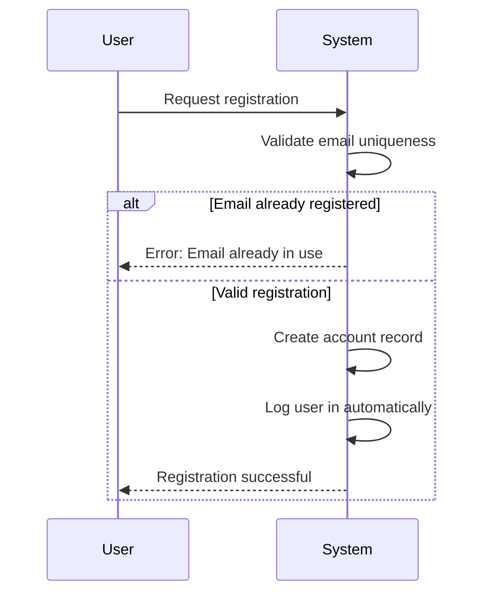
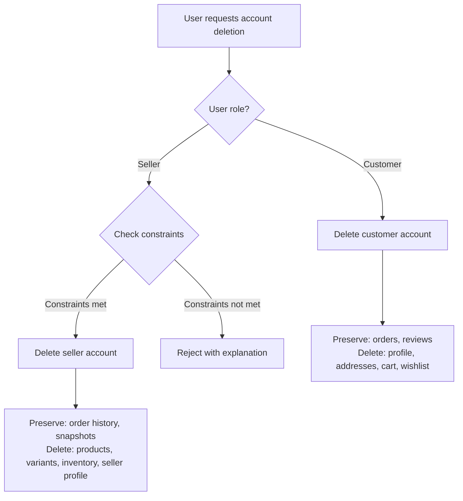
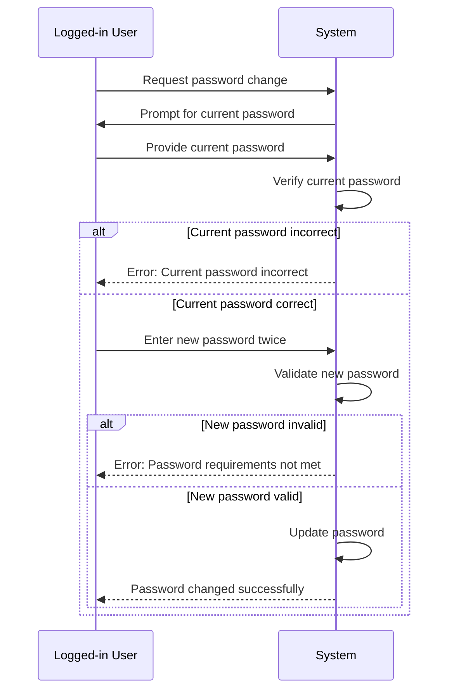

**ecommerceMall — Actor definitions, permission matrix, authentication, session, account lifecycle**

Actor definitions, permission matrix, authentication, session, account lifecycle

# Actor Definitions

Define all user actor types with their identity, permissions, and access boundaries.

## customer Actor

A customer is a registered user who can browse and purchase products on the platform. Customers must have an account and be logged in to use any feature, as guest browsing is not permitted. They can maintain a personal profile with display name and phone number, and manage multiple shipping addresses. Customers can add items to their wishlist and shopping cart, proceed to checkout, and place orders. They have the ability to view their order history and request cancellations or refunds on eligible items. Customers can also write reviews for products they have purchased and submitted administrator requests if they wish to become platform administrators. Their permissions focus on personal data management, purchasing activities, and providing feedback on purchased items.

### Customer Identity Definition

A customer is a registered user who has created an account on the platform using an email address and a password. The platform does not permit guest browsing; all platform features require a customer to be logged in. A customer's identity is uniquely associated with their email address, which is used as their primary login credential. Each customer account must have a valid email address and a password.

### Required Login for Access

All features of the platform are gated behind a logged-in session. A customer must successfully log in using their email and password before they can perform any action on the platform, including viewing products, adding items to a cart, or accessing their profile. There is no guest or anonymous user access mode.

### Customer Profile Management

A customer has a personal profile associated with their account. The profile contains a display name and a phone number. The customer can edit their own display name and phone number at any time.

### Shipping Address Management

A customer can manage multiple shipping addresses. For each address, the customer can provide a recipient name, phone number, street address, city, state/province, postal code, and country. The customer can add new addresses, edit existing ones, and delete addresses they no longer need. A customer can designate one of their shipping addresses as their default shipping address, which can be used as a pre-selected option during checkout.

### Wishlist Management

A customer can add products (not specific variants) to their personal wishlist. The wishlist is a paginated list that the customer can view. The customer can remove products from their wishlist. If a product in the wishlist is deleted by its seller, that product is automatically removed from all customer wishlists.

### Shopping Cart Operations

A customer can add specific product variants to their shopping cart by specifying a quantity. If the same variant is already in the cart, the quantity is updated (combined) rather than creating a duplicate line item. The customer can view their cart, which displays each item with product name, variant details, price, quantity, and subtotal. The customer can change the quantity of an item in the cart or remove items entirely. The cart shows a total price for all items. The cart provides warnings if an item's stock quantity is insufficient for the requested cart quantity or if an item becomes unavailable (out of stock or deleted).

### Checkout and Order Placement

From the cart, a customer can proceed to checkout. During checkout, the customer must select a shipping address (or use their default). The customer is shown an order summary for review, which includes the list of items with their prices, the selected shipping address, and the total price. After review, the customer confirms and places the order. Once an order is successfully placed, the selected shipping address is locked and cannot be changed for that order. Items are removed from the customer's cart upon successful order creation.

### Order History and Tracking

A customer can view a paginated list of all their past orders, sorted with the newest orders first. For each order in the list, they can see the order number, date, total price, and overall order status. The customer can view the full details of any specific order, which includes:
- A list of all items with product name, variant details, quantity, purchase price, and item status.
- The shipping address used for the order.
- A list of shipments (if any) with their tracking information, showing which items are included in each shipment. Customers can view tracking information for shipments and can confirm delivery per shipment.

### Cancellation and Refund Requests

A customer can submit a cancellation request for an individual order item that is in the "paid" status (not yet shipped). The request must include a reason. The customer can submit a refund request for an individual order item that is in the "delivered" status, provided the request is made within 7 days of the item being delivered. The refund request must include a reason.

### Product Reviews and Ratings

After a purchased order item reaches "delivered" status, the customer can write a review for that product. A customer can write one review per product per order. A review consists of a rating (1 to 5 stars) and optional text content. Customers can edit their own reviews. Customers can delete their own reviews.

### Administrator Requests

Any customer can submit a request to become a platform administrator. The request must include a reason (text). The customer can view the status of their own administrator request (pending, approved, or rejected).

## seller Actor

A seller is a user who has registered and received administrative approval to sell products on the platform. Sellers have full control over their shop profile including shop name, description, and logo. They can create, edit, and delete their own products and product variants. Sellers manage inventory by restocking and adjusting stock levels, and they handle order fulfillment by creating shipments with tracking information. They are responsible for responding to customer cancellation and refund requests for their products. Sellers have a dashboard that shows their shop statistics, order items, and pending requests. Their account deletion is restricted if they have pending orders or active requests. Sellers can only access and modify data related to their own shop and products.

### Seller Status and Profile Management

### Seller Status and Profile Management

**Approved Seller Status**
- A seller must receive administrative approval before they can sell products on the platform.
- Sellers can view their approval status (pending, approved, or rejected).
- If rejected, sellers can view the rejection reason provided by administrators.
- Rejected sellers can submit a new registration request.
- Approved sellers gain access to seller-specific features: product management, order fulfillment, and shop customization.

**Shop Profile**
- Each seller has a profile consisting of: shop name, shop description, and logo image.
- Sellers can edit their shop name, description, and logo.
- Every edit to the shop profile creates a snapshot to preserve the previous state.
- Customers can view seller profiles to see shop information.
- The shop profile is included in order snapshots to preserve what customers saw at purchase time.

**Account Deletion Restrictions**
- Sellers can delete their account only if:
  - They have no pending orders (items with paid or shipped status)
  - They have no pending cancellation or refund requests
- When a seller deletes their account:
  - Their products are deleted from listings
  - Order history and snapshots are preserved
  - Their shop name in past orders is preserved for customer reference

### Product and Variant Management

### Product and Variant Management

**Product Creation**
- Approved sellers can create products for sale.
- Each product requires: name, description, category, and base price.
- Products belong exclusively to the seller who created them.
- A product must have at least one variant to be purchasable.
- Products with no variants are visible in search but shown as "unavailable".

**Product Editing**
- Sellers can edit their own products.
- Every edit creates a snapshot that preserves the previous state of all product fields.
- Product edits include changes to: name, description, category, base price, and images.
- Sellers can delete their own products only if:
  - There are no pending order items (paid or shipped status) for any variant
  - There are no pending cancellation or refund requests for any variant
- Deleting a product also deletes all its variants and inventory records.

**Variant Management**
- Sellers can add multiple variants to each product.
- Each variant represents a specific combination of options (e.g., "Red / Large", "Blue / Small").
- Each variant requires: SKU code (unique identifier), option values, and stock quantity.
- Variants can have their own price that overrides the product's base price.
- Sellers can edit variant details: SKU code, option values, and price.
- Every variant edit creates a snapshot.
- Sellers can delete variants only if:
  - There are no pending order items (paid or shipped status) for that variant
  - There are no pending cancellation or refund requests for that variant

**Inventory Control**
- Each variant maintains its own stock quantity.
- Sellers can add inventory (restock) with a quantity and reason.
- Sellers can subtract inventory (adjustment/loss) with a quantity and reason.
- Stock quantity is managed through inventory history records showing all changes.
- Sellers can view the full inventory history for each variant.
- When stock reaches 0, the variant is shown as "out of stock" and cannot be added to cart.
- Out-of-stock variants cannot be purchased.

### Order Fulfillment and Customer Interactions

### Order Fulfillment and Customer Interactions

**Order Fulfillment**
- Sellers can view order items for their products that need shipping.
- Sellers are responsible for fulfilling orders for their own products.
- Each order item has its own status: paid, shipped, delivered, cancelled, or refunded.
- Sellers can only ship items that are in "paid" status.
- Shipped items change status from "paid" to "shipped".

**Shipment Creation and Tracking**
- A shipment is a package sent by a seller containing one or more order items.
- A shipment can only contain items from the same seller.
- Sellers select which of their items to include in a shipment.
- When creating a shipment, sellers must enter tracking information: carrier name and tracking number.
- All items in the same shipment share the same tracking information.
- When a shipment is created, all included items change to status "shipped".
- Sellers can view tracking information for their shipments.

**Cancellation Responses**
- Customers can request cancellation for individual items with "paid" status.
- Sellers can view pending cancellation requests for their products.
- Sellers can approve or reject cancellation requests.
- When responding to a cancellation request, a snapshot of the request state is created.
- If approved, the item is cancelled and refund is processed for that item only.
- Cancelled items restore their stock quantities.
- The seller's decision is final and recorded in the snapshot.

**Refund Responses**
- Customers can request refunds for items with "delivered" status within 7 days of delivery.
- Sellers can view pending refund requests for their products.
- Sellers can approve or reject refund requests.
- When responding to a refund request, a snapshot of the request state is created.
- If approved, the item is refunded.
- Refunded items restore their stock quantities.
- The seller's decision is final and recorded in the snapshot.

### Seller Dashboard and Data Ownership

### Seller Dashboard and Data Ownership

**Seller Dashboard**
- Sellers have access to a dashboard showing their shop summary.
- The dashboard provides statistics about the seller's business.

**Shop Statistics**
- The dashboard shows total number of products in the seller's shop.
- The dashboard shows total number of order items for the seller's products.
- The dashboard shows number of pending cancellation requests.
- The dashboard shows number of pending refund requests.
- Statistics help sellers monitor business performance.

**Pending Requests Management**
- Sellers can view a list of all order items for their products.
- Sellers can filter order items by status (paid, shipped, delivered, cancelled, refunded).
- Sellers can see which items have pending cancellation or refund requests.
- The dashboard highlights items that require seller action.

**Data Ownership Boundaries**
- Sellers can only access and modify data related to their own shop and products.
- Sellers cannot view or modify products, orders, or data belonging to other sellers.
- Sellers can only respond to cancellation and refund requests for their own products.
- Sellers can only create shipments for their own order items.
- Sellers can only view inventory history for their own product variants.
- Sellers can only view snapshots of their own products and variants.
- Sellers can only edit their own shop profile, not other sellers' profiles.
- Each seller's data is isolated from other sellers' data.

## administrator Actor

Administrators are platform managers with elevated permissions divided into regular and super administrator grades. They oversee platform operations including approving or rejecting seller registrations and administrator requests. Administrators can manage categories by creating, editing, and deleting them, which affects product organization. They have oversight over all user accounts with the ability to ban or suspend customers and sellers. Administrators can view snapshots of any product and delete products for policy violations. They can monitor all orders and force-cancel or force-refund items when necessary. Super administrators have additional privileges to promote or demote other administrators and manage the administrator hierarchy. Administrators ensure platform integrity and enforce policies across all user activities.

### Administrator Identity and Grades

Administrators are platform managers who oversee platform operations, enforce policies, and maintain platform integrity. There are two administrator grades: regular administrator and super administrator.

Regular administrators have elevated permissions to manage platform operations but cannot modify the administrator hierarchy.

Super administrators have all regular administrator permissions plus additional privileges to promote or demote other administrators and manage the administrator hierarchy.

Both grades of administrators ensure platform integrity and enforce policies across all user activities. Administrators are distinguished from customers and sellers by their platform management responsibilities rather than commercial activities.

### Seller Registration Approval and Suspension

Administrators review and approve or reject seller registration requests. They can view the list of pending seller approvals and examine each request.

When approving a seller registration, the seller account becomes active and the seller can begin creating products and selling.

When rejecting a seller registration, administrators must provide a reason for rejection. Rejected sellers can view the rejection reason and submit a new registration request.

Administrators can suspend seller accounts for policy violations or other administrative reasons. When a seller is suspended:
- Their products are hidden from search and category listings
- Their products cannot be purchased
- They can still process existing orders (ship items, respond to cancellation/refund requests)
- They cannot create new products or edit existing products

Administrators can unsuspend seller accounts, making their products visible again.

Administrators cannot delete seller accounts; only sellers can delete their own accounts under specific conditions.

### Administrator Request Management

Administrators review and approve or reject requests from users (customers or sellers) to become administrators. The request includes a reason provided by the user.

Super administrators can view the list of pending administrator requests and examine each request.

When a request is approved, the user becomes a regular administrator.

When a request is rejected, the user remains in their original role (customer or seller).

Only super administrators have the authority to review administrator requests.

### User Account Oversight and Restrictions

Administrators can view all customer and seller accounts on the platform to monitor user activity and enforce platform policies.

Administrators can ban customer accounts. When a customer is banned, they cannot log in to the platform. Their existing account data, including orders and reviews, is preserved.

Administrators can unban previously banned customers, restoring their access to the platform.

Administrators can ban seller accounts. When a seller is banned, they cannot log in to the platform. Their existing orders remain intact for legal and record-keeping purposes.

Administrators cannot directly delete user accounts; users must initiate their own account deletion according to defined business rules.

Administrators can view the status of all user accounts, including whether accounts are active, banned, suspended, or pending approval.

### Category Management Authority

Administrators are responsible for creating and managing product categories and subcategories that organize the platform's products.

Administrators can create new categories, specifying a name and description for each category.

Administrators can edit existing categories, modifying the name or description as needed.

Administrators can delete categories. When a category is deleted, products previously assigned to that category become uncategorized.

Administrators can create subcategories (one level of nesting only) under existing categories.

Only administrators have permission to create, edit, or delete categories; customers and sellers can only browse and view categories.

Category management ensures organized product discovery and browsing for customers.

### Product Oversight and Snapshot Access

Administrators can view all products on the platform, regardless of which seller created them or what category they belong to.

Administrators can access snapshots of any product, including viewing all historical edits and changes made to the product. This includes seeing:
- When product changes were made
- What was changed
- The values before and after each change
- Snapshots of all product variants at the time of each product snapshot

Product snapshots are immutable and cannot be deleted, allowing administrators to examine the complete history of any product.

Administrators can use product snapshots for dispute resolution, policy enforcement, and auditing purposes.

Unlike sellers who can only view snapshots of their own products, administrators can view snapshots of any product on the platform.

### Product Deletion Authority

Administrators can delete any product on the platform for policy violations or other administrative reasons.

When an administrator deletes a product:
- The product and all its variants are removed from listings
- The product no longer appears in search or category listings
- The product's inventory records are deleted
- Snapshots of the product are preserved for historical reference
- The product is automatically removed from all customer wishlists
- The product cannot be added to shopping carts

Administrator product deletion overrides normal seller deletion restrictions. While sellers can only delete their products under specific conditions (no pending orders or requests), administrators can delete any product regardless of order or request status.

Administrator product deletion is an enforcement action taken when products violate platform policies.

### Order Monitoring and Intervention

Administrators can view all orders on the platform, including orders from all customers and involving all sellers.

Administrators can examine order details, including:
- Order items with product and variant information
- Shipping addresses
- Order status and individual item statuses
- Shipment and tracking information
- Payment and price information

Administrators can force-cancel individual order items or entire orders. When an order item is force-cancelled:
- The customer is refunded for that item
- The item's stock quantity is restored via inventory record
- The item status changes to "cancelled"

Administrators can force-refund individual order items or entire orders. When an order item is force-refunded:
- The customer is refunded for that item
- The item's stock quantity is restored via inventory record if applicable
- The item status changes to "refunded"

Administrator order interventions override normal cancellation and refund processes, which typically require customer requests and seller approvals. These interventions are used for dispute resolution, policy violations, or exceptional circumstances.

Administrators can view snapshots of cancellation and refund requests to understand the history of customer-seller interactions.

### Administrator Hierarchy Management

Super administrators have exclusive authority to manage the administrator hierarchy through promotion and demotion actions.

Super administrators can promote regular administrators to super administrator status, granting them all super administrator privileges.

Super administrators can demote other super administrators to regular administrator status, removing their super administrator privileges while retaining regular administrator permissions.

Super administrators cannot demote themselves; this prevents accidental loss of super administrator privileges.

Regular administrators cannot promote or demote other administrators; only super administrators have this authority.

The administrator hierarchy ensures proper oversight and prevents unauthorized changes to platform management structure.

Administrator grade changes affect access to specific administrator-only functions, particularly those involving administrator request review and hierarchy management.

### Policy Enforcement and Platform Integrity

Administrators are responsible for enforcing platform policies across all user activities to maintain platform integrity.

Administrators monitor user behavior, product listings, and transactions to ensure compliance with platform rules and guidelines.

When policy violations are identified, administrators take appropriate enforcement actions, which may include:
- Suspending or banning user accounts
- Deleting products that violate policies
- Intervening in orders through force-cancellation or force-refunds
- Providing guidance or warnings to users

Administrators maintain platform integrity by ensuring:
- Accurate product information through snapshot monitoring
- Fair transaction practices through order oversight
- Appropriate user conduct through account management
- Organized product discovery through category management
- Secure platform operations through proper access controls

Administrators balance enforcement actions with user support, providing reasons for rejections, suspensions, or bans when applicable.

Platform integrity is maintained through consistent application of policies, transparent decision-making, and preservation of historical data through snapshots for auditing and dispute resolution.

# Authentication Flows

Registration, login, logout, and session management from a user perspective.

## Registration and Login

Define user registration and login flows including validation and error handling.

### Registration Requirements

### Registration Requirements

All users must register before using any features of the platform. There is no guest browsing.

THE ecommerceMall SHALL support registration for two distinct user types: customers and sellers.

**Customer Registration**
- WHEN a user wants to create a customer account, THE system SHALL require the user to provide an email address and password.
- THE system SHALL create a customer profile with default values after successful registration.
- THE system SHALL send a confirmation email (assumed external service).

**Seller Registration**
- WHEN a user wants to create a seller account, THE system SHALL require the user to provide an email address and password.
- THE system SHALL mark the seller's approval status as "pending" upon registration.
- THE system SHALL send a confirmation email (assumed external service).
- THE seller account SHALL remain in "pending" status until approved by an administrator.
- Rejected sellers SHALL be allowed to submit a new registration request.

**Common Registration Rules**
- THE system SHALL ensure email addresses are unique across all users.
- THE system SHALL require passwords to meet basic security requirements (minimum length, complexity).
- THE system SHALL encrypt passwords before storage.
- WHERE registration fails due to duplicate email or invalid password, THE system SHALL reject the request with an appropriate error message.

**Account Status After Registration**
- New customers SHALL have an account status of "active".
- New sellers SHALL have an account status of "active" but with an approval status of "pending".
- Users SHALL be able to log in immediately after registration (even sellers with "pending" approval).

### Login Requirements

### Login Requirements

All registered users must authenticate via login to access platform features.

**Login Credentials**
- WHEN a user attempts to log in, THE system SHALL require the user to provide their registered email address and password.
- THE system SHALL verify the provided credentials against stored encrypted credentials.

**Login Success**
- IF credentials are valid and the account is not banned, THEN THE system SHALL create a user session.
- THE system SHALL grant access to features based on the user's role (customer, seller, administrator).

**Login Failure**
- IF the email address is not registered, THEN THE system SHALL reject the login attempt.
- IF the password is incorrect, THEN THE system SHALL reject the login attempt.
- IF the account is banned, THEN THE system SHALL reject the login attempt.
- WHERE a login attempt fails, THE system SHALL NOT indicate whether the email exists or the password is incorrect (security measure).

**Seller-Specific Login**
- Sellers with "pending" approval status SHALL be able to log in but SHALL have limited access to seller features.
- Sellers with "rejected" approval status SHALL be able to log in and view their rejection reason.
- Sellers with "approved" status SHALL have full access to seller features upon login.

### Authentication and Session Management

### Authentication and Session Management

**Session Creation**
- WHEN a user successfully logs in, THE system SHALL create a new session associated with the user's account.
- THE session SHALL track the user's role (customer, seller, administrator) and permissions.
- THE session SHALL expire after a period of inactivity (assumed standard session timeout).

**Authentication State**
- WHILE a user is authenticated, THE system SHALL maintain the user's identity and role for all subsequent requests.
- THE system SHALL allow the user to access features appropriate to their role.
- IF a session expires, THEN THE system SHALL require the user to log in again.

**Multi-Role Authentication**
- Users with multiple roles (e.g., a user who is both a customer and a seller) SHALL be authenticated as a single user with combined permissions.
- THE system SHALL determine available features based on the intersection of all active roles.

**Security Considerations**
- THE system SHALL protect authentication endpoints against brute-force attacks (assumed standard security measures).
- THE system SHALL encrypt session tokens (assumed standard security practice).
- Password change operations SHALL require re-authentication for sensitive actions.

**Account Status Impact on Authentication**
- IF a customer account is banned, THEN THE system SHALL prevent login.
- IF a seller account is suspended, THEN THE system SHALL allow login but restrict seller-specific features.
- IF a seller account is banned, THEN THE system SHALL prevent login.

## Session and Logout

Define session behavior and logout from a user perspective.

### Session Management

Users remain logged in after successful authentication until they explicitly log out.

When a user successfully logs in with their email and password, a session is established that allows them to access platform features.

The session persists across browser tabs and navigation events while the user remains active on the platform.

If a user's session becomes invalid or expires (due to security measures), they must log in again to continue using the platform.

All users (customers, sellers, administrators) require an active session to perform any actions on the platform, as no guest browsing is permitted.

### Logout Functionality

Users can explicitly log out from any part of the platform where they have an active session.

When a user logs out, their current session is terminated immediately.

After logging out, users cannot perform any platform actions and are returned to the login screen.

Users must log in again with their email and password to regain access to platform features.

Logout is available to all authenticated users (customers, sellers, administrators).

### Account Security Measures

Only one active session is permitted per user account at any given time.

If a user logs in from a new device or browser while already having an active session, the previous session is terminated automatically.

Users are notified when their session has been terminated due to login from another location.

Users can change their password while logged in, which does not automatically terminate their current session.

If a user's account is banned by an administrator, all active sessions for that account are terminated immediately.

Session security prevents unauthorized access to account features and protects user data.

# Account Lifecycle

Account creation, deletion, and password management.

## Account Management

Define how users create accounts, delete accounts, and change passwords.

### Account Creation

### Registration Process

Any user can create a customer account by providing an email address and password. The system does not support guest browsing - registration is required to use any features.

**Customer Account Creation:**
- Users provide a unique email address and password to create a customer account
- Upon successful registration, the user becomes a customer with the ability to create a profile, manage addresses, browse products, and make purchases
- The account is immediately active and usable

**Seller Account Creation:**
- Users can create a seller account by providing an email address and password
- Unlike customer accounts, seller accounts require administrator approval before the seller can list products or sell on the platform
- After registration, the seller account enters 'pending' approval status
- While pending, the user cannot create products, manage inventory, or access seller dashboard features
- The user remains as a customer and can continue to shop using the same account

**Email Uniqueness:**
- Each email address can only be associated with one account on the platform
- The system prevents duplicate email registrations

**Registration Success:**
- Successful registration results in automatic login
- Failed registration (duplicate email, invalid password format) returns an error with explanation

### Account Deletion

### Account Deletion Rights and Constraints

Both customers and sellers can delete their own accounts, but with different constraints and preservation rules.

**Customer Account Deletion:**
- Customers can delete their account at any time
- When a customer deletes their account:
  - Their profile information (display name, phone number) is permanently deleted
  - Their shipping addresses are permanently deleted
  - Their shopping cart and wishlist contents are deleted
  - Their orders and order history are preserved for seller records and legal purposes
  - Their reviews are preserved but displayed as 'deleted user' rather than showing their profile information
  - Account deletion is irreversible

**Seller Account Deletion Constraints:**
- Sellers can only delete their account if:
  - They have no pending orders (items with 'paid' or 'shipped' status)
  - They have no pending cancellation or refund requests for their products
- If a seller attempts to delete their account while these constraints are not met, the system rejects the request with an explanation

**Seller Account Deletion Effects:**
- When a seller successfully deletes their account:
  - Their products are deleted from all listings and search results
  - Their product variants and inventory records are deleted
  - Order history and snapshots are preserved
  - Their shop name in past orders is preserved (from snapshots taken at purchase time)
  - Their seller profile information is deleted
  - The user account becomes a regular customer account (retaining any previous customer activities)

**Administrative Account Actions:**
- Administrators can ban customer and seller accounts
- Banned users cannot log in
- Administrators can unban accounts
- Banned accounts are not deleted - their data is preserved

### Password Change Management

### Password Update Process

All authenticated users (customers, sellers, and administrators) can change their password at any time.

**Password Change Requirements:**
- Users must be logged in to change their password
- Users must provide their current password for verification
- Users must enter the new password twice for confirmation
- The system validates that the new password meets security requirements (format, length, complexity)
- The new password cannot be the same as the current password

**Successful Password Change:**
- Upon successful password change, the user remains logged in
- No re-authentication is required
- All existing sessions remain valid (session continuity)

**Failed Password Change Scenarios:**
- If the current password is incorrect, the request is rejected
- If the new password does not meet security requirements, the request is rejected with specific feedback
- If the new password matches the current password, the request is rejected
- If the two new password entries do not match, the request is rejected

**Password Change and Account Security:**
- Changing password does not affect account status
- Password changes are logged in the system's security audit trail
- Users can change their password as frequently as desired
- There are no limitations on the number of password changes

**Password Recovery vs. Password Change:**
- Password change requires knowledge of the current password
- Password recovery (for forgotten passwords) is a separate process not covered in account management

