**ecommerceMall — Business concepts, relationships, and states from user perspective**

Business concepts, relationships, and states from user perspective

# Domain Concepts

Describe what each concept means in the business domain and its key attributes.

## User Concept

A User represents any individual who interacts with the platform, serving as the base identity for all participants. This concept encompasses both customers and sellers, providing access to platform features. A User's primary attributes include a unique email address used for identification and a password for authentication. Users have an account status that indicates whether they are active, banned, or suspended. The User concept forms the foundation for differentiating between customer and seller roles, with each role accessing distinct sets of platform capabilities. Users who delete their accounts have their profiles removed while preserving their order histories and reviews for business records. This separation allows the platform to maintain transactional integrity while respecting user privacy preferences.

### User Definition and Purpose

A User represents any individual who participates in the e-commerce platform. This is the foundational identity that enables access to platform features and services. Every User has a single, persistent identity that spans their entire interaction with the platform, regardless of whether they act as a customer, seller, or both.

The User concept serves as the base for all platform participation. All activities, from browsing and purchasing to selling and reviewing, are tied to a User identity. This ensures accountability and enables personalized experiences throughout the platform.

### Authentication Attributes

Each User is identified by a unique email address that serves as their primary identifier across the platform. The email address must be unique—no two Users can share the same email address. This email is used for login, communication, and account recovery purposes.

Users authenticate using a password that is stored securely. The password must meet platform security requirements for complexity and length. Users can change their password at any time through the account settings.

### Account Status Types

A User's account can be in one of three statuses:

- **Active**: The User can fully access the platform according to their role permissions. This is the default status for new registrations that complete all required steps.
- **Banned**: The User cannot log in to the platform. This status is applied by administrators for policy violations or security concerns. A banned User's existing data (orders, reviews) remains visible but they cannot perform any new actions.
- **Suspended**: The User's access is temporarily restricted. This status applies specifically to sellers when administrators need to temporarily disable their selling capabilities while investigating potential issues. Suspended sellers can still process existing orders but cannot create or edit products.

Status changes are logged and can be viewed by administrators for audit purposes.

### Role Differentiation

Users can have one or both of two primary roles on the platform:

- **Customer Role**: Users with this role can browse products, make purchases, manage their profile and addresses, create wishlists, write reviews, and perform other buying-related activities. A User becomes a customer upon registration.
- **Seller Role**: Users with this role can create and manage products, handle inventory, process orders, respond to cancellation and refund requests, and manage their shop profile. A User must apply for and receive administrator approval to become a seller.

A single User can simultaneously hold both customer and seller roles, allowing them to both buy and sell on the platform. This dual-role capability enables entrepreneurs and small business owners to participate in the marketplace while also being customers themselves.

Role-specific data (customer profile, seller profile) is maintained separately but linked to the same User identity.

### Account Deletion and Preservation

Users can request deletion of their account. When a User deletes their account:

- Their User identity and authentication credentials (email and password) are removed from the system
- Their personal profile information (display name, phone number) is deleted
- All shipping addresses they created are deleted
- Their wishlist items are removed
- Their shopping cart contents are cleared

However, certain business-critical data is preserved for legal and operational reasons:

- All orders and order history remain intact, including order numbers, dates, items purchased, and prices paid
- Product reviews written by the User are preserved but displayed as "deleted user" to maintain review integrity while protecting privacy
- Seller shop names in past orders are preserved for historical accuracy
- Order snapshots that include User information at the time of purchase remain unchanged

This preservation ensures business continuity and legal compliance while respecting the User's desire to remove their personal identity from the platform.

## CustomerProfile Concept

A CustomerProfile contains the personal information that customers display to others and use for identification within the platform. This concept represents how customers present themselves while shopping and interacting with sellers. The profile includes a display name that appears on reviews and order communications, and a phone number for contact purposes. Customers manage this information to control their public presence and ensure accurate communication channels. The CustomerProfile is distinct from the User account credentials, focusing on identity presentation rather than authentication. This separation allows customers to update their public information without affecting their login credentials. The profile serves as the customer-facing identity throughout their shopping journey.

### CustomerProfile Definition

A CustomerProfile represents a customer's personal information used for public display and identification within the platform. Unlike the User account (which handles authentication), the CustomerProfile focuses on how customers present themselves to sellers and other users while shopping and interacting on the platform. Each registered customer has exactly one CustomerProfile that contains their public-facing identity information.

### Personal Information for Public Display

The CustomerProfile holds the personal information that customers choose to display publicly:

- **Display name**: A user-facing name that appears on reviews, order communications, and customer interactions
- **Phone number**: Contact information for order-related communications and delivery coordination

This information allows customers to be identified by sellers during order processing and creates accountability for reviews and feedback.

### Display Name for Reviews and Orders

The display name is the customer's chosen public identifier that appears in multiple contexts:

1. **Product reviews**: The display name is shown alongside each review the customer writes
2. **Order details**: Sellers see the customer's display name when processing orders
3. **Customer interactions**: The display name is used in any platform communications where customers are identified

Customers can edit their display name to reflect personal preferences while maintaining a consistent public identity for order history and seller recognition.

### Phone Number for Contact Purposes

The phone number serves as a contact channel for practical order-related communications:

1. **Delivery coordination**: Shipping carriers may contact customers regarding delivery issues
2. **Order status updates**: Sellers or the platform may contact customers about order delays or issues
3. **Customer service**: Support teams may use the phone number for urgent matters

Unlike the display name, the phone number is not displayed publicly to other customers but is accessible to sellers for order-specific communications and to administrators for customer service purposes.

### Profile Distinct from Login Credentials

The CustomerProfile is a separate concept from the User account credentials:

**User Account (login credentials)**
- Email address (used for authentication)
- Password (used for authentication)
- Account status (active/banned/suspended)
- Role differentiation (customer/seller/administrator)

**CustomerProfile (public identity)**
- Display name (public-facing identifier)
- Phone number (contact information)
- Addresses (shipping locations, defined separately)

This separation allows customers to:
- Update their public information without affecting their login credentials
- Maintain a consistent identity even if they change email addresses
- Control what personal information is publicly visible versus what is private

### Customer-Facing Identity Presentation

The CustomerProfile manages how customers present themselves throughout their shopping journey:

**Public Presentation**
- Customers appear to sellers and other customers by their display name
- Reviews and ratings are attributed to the customer's display name
- Order history maintains consistent customer identification

**Business Context**
- Sellers can identify repeat customers by their display name
- Administrators can track customer behavior and feedback patterns
- The platform maintains accountability for customer actions through consistent identity

**Identity Evolution**
- Customers can update their display name and phone number as needed
- Past reviews and orders retain the display name used at the time of the interaction
- The CustomerProfile evolves with the customer's preferences while maintaining business continuity

## Address Concept

An Address represents a physical location where goods can be shipped, serving as a destination for customer orders. This concept contains all necessary information for successful package delivery. Each address includes the recipient's name for identification at delivery, a phone number for delivery coordination, and a complete street address for location finding. The address also specifies city, state or province, postal code, and country for regional routing and customs. Customers can maintain multiple addresses to accommodate different shipping needs, such as home, work, or gift recipients. One address can be designated as the default shipping address for convenience during checkout. This concept ensures that orders reach their intended destinations accurately and efficiently.

### Address Domain Concept

An Address represents a physical location where goods can be shipped, serving as a destination for customer orders. This concept contains all necessary information for successful package delivery. Each address exists as a record that can be selected during checkout and is associated with a specific customer's profile for personal use.

### Recipient Information for Delivery

Each address includes a recipient name that identifies the person who will receive the package at the delivery location. This name is used by delivery personnel to confirm identity and ensure the package reaches the correct individual. The address also includes a phone number for delivery coordination, allowing carriers to contact the recipient if delivery issues arise or to schedule delivery times.

### Complete Street Address Details

The street address field contains the full physical location details necessary for finding the delivery destination. This includes building number, street name, apartment or unit number (if applicable), and any other specific location identifiers. This information provides the precise guidance needed for carriers to navigate to the exact delivery point.

### Regional Location Information

Each address specifies the city, state or province, postal code, and country for proper regional routing and customs processing. The city and state/province help carriers determine regional distribution centers and delivery routes. The postal code enables precise sorting and delivery area identification. The country designation ensures proper international shipping procedures and customs documentation when applicable.

### Multiple Address Management

Customers can maintain multiple address records to accommodate different shipping needs and scenarios. This allows customers to have separate addresses for home delivery, work delivery, gift recipients, or seasonal locations. Each address is stored independently and can be individually edited, deleted, or selected during checkout based on the current shipping requirement.

### Default Shipping Address Designation

Customers can designate one address as their default shipping address for convenience during checkout. The default address is automatically pre-selected in the shipping address selection step, reducing the need for manual selection during each purchase. Customers can change their default address designation at any time, and only one address can be marked as default per customer.

## SellerProfile Concept

A SellerProfile represents a seller's business identity and storefront within the platform. This concept contains the information that customers see when browsing products and making purchasing decisions. The profile includes a shop name that identifies the seller's business, a shop description that explains what they offer, and a logo image for visual branding. Customers view seller profiles to learn about the businesses they're buying from and establish trust. The profile serves as the seller's public face, influencing customer perceptions and purchase decisions. Each profile is unique to a seller and cannot be shared between different seller accounts. This concept enables sellers to build their brand identity within the marketplace environment.

### SellerProfile Core Concept

A SellerProfile represents a seller's business identity and storefront within the e-commerce platform. This concept encapsulates all the information that defines how a seller presents their business to potential customers. It serves as the digital storefront where sellers can showcase their brand, explain their business offerings, and build customer trust through professional presentation. Each SellerProfile is unique to a single seller account and cannot be shared or duplicated across different sellers.

The SellerProfile exists independently of the seller's user account credentials, focusing instead on the public-facing business information that customers interact with when making purchasing decisions. When customers browse products or make purchases, the SellerProfile provides context about the business behind the product, helping customers make informed buying decisions and establishing a professional marketplace environment.

### Shop Name as Business Identifier

The shop name is the primary identifier for a seller's business within the platform. This name appears in multiple customer-facing contexts:

- On product listings and product detail pages
- In search results as the source of products
- On order confirmations and order history
- In customer reviews and ratings
- On the seller's dedicated profile page

The shop name must be unique across the platform to prevent customer confusion and ensure proper business identification. Customers use the shop name to recognize and differentiate between sellers, especially when purchasing from multiple businesses within the marketplace. The shop name becomes part of the product's context, influencing customer trust and purchase decisions based on brand recognition and reputation.

### Shop Description for Business Explanation

The shop description provides sellers with the opportunity to explain their business to potential customers. This text field allows sellers to communicate:

- Their business philosophy and values
- The types of products they specialize in
- Their expertise or unique selling propositions
- Quality standards or sourcing practices
- Customer service commitments

Customers read shop descriptions to understand the business behind the products they're considering purchasing. A comprehensive shop description helps build customer confidence by providing transparency about the seller's business practices, expertise, and values. This information complements product descriptions and helps customers make informed purchasing decisions based on both product quality and seller reputation.

### Logo Image for Visual Branding

The logo image serves as the visual representation of the seller's brand within the platform. This image appears alongside the shop name in various customer interfaces:

- Product listings and detail pages
- Seller profile pages
- Order confirmations and history
- Search results when filtered or sorted by seller

The logo image helps with brand recognition and creates a professional appearance for the seller's business. Customers can quickly identify products from familiar sellers by recognizing their logo. The visual branding element contributes to the overall marketplace experience by making the platform feel more like a collection of distinct businesses rather than a generic product aggregator. Professional logos can increase customer trust and perception of seller legitimacy.

### Public Business Representation

The SellerProfile serves as the public face of the seller's business to all platform customers. This representation includes:

- **Visibility**: The profile is visible to all registered customers
- **Consistency**: The same profile information appears across all customer touchpoints
- **Permanence**: Profile information is preserved in order snapshots for historical accuracy
- **Professionalism**: The profile presents the seller as a legitimate business entity

Customers interact with SellerProfiles when:
1. Browsing products and seeing which seller offers them
2. Viewing product details and checking seller information
3. Making purchase decisions based on seller reputation
4. Reviewing order history and seeing which sellers they purchased from
5. Seeking customer support or dispute resolution

The public representation establishes the seller's business identity within the marketplace ecosystem.

### Trust Establishment Mechanism

The SellerProfile functions as a trust-building mechanism between sellers and customers through several aspects:

- **Transparency**: Providing business information (name, description) creates openness
- **Professionalism**: Complete profiles with logos appear more legitimate
- **Accountability**: Public identification encourages responsible business practices
- **Recognition**: Consistent branding helps customers remember and trust familiar sellers

When customers can see detailed information about who they're buying from, they feel more confident in their purchases. The SellerProfile reduces the anonymity that can undermine trust in online marketplaces by giving businesses a face and identity. Customers can make purchasing decisions not just based on product attributes but also on seller reputation and presentation.

The platform's snapshot system further enhances trust by preserving the exact state of the SellerProfile at the time of each purchase, ensuring that customers can always reference the business information that was presented to them when they made their buying decision.

### Unique Seller Identity

Each SellerProfile represents a unique business identity that cannot be shared or duplicated. This uniqueness is enforced through several mechanisms:

- **One-to-one relationship**: Each seller account has exactly one SellerProfile
- **Shop name uniqueness**: No two sellers can have identical shop names
- **Profile ownership**: Profiles cannot be transferred between seller accounts
- **Identity preservation**: Even if a seller deletes their account, their shop name is preserved in historical order snapshots

This unique identity is important for:
1. **Customer clarity**: Customers can clearly distinguish between different sellers
2. **Reputation building**: Sellers can build their own brand reputation independently
3. **Accountability**: Business actions can be properly attributed to the correct seller
4. **Marketplace organization**: The platform maintains clear business distinctions

The unique identity ensures that each seller's business presence on the platform is distinct and recognizable, supporting both customer trust and seller brand development.

## Category Concept

A Category represents a logical grouping of similar products, organizing the marketplace for easier browsing and discovery. This concept helps customers find what they're looking for by providing structured navigation paths. Each category has a name that clearly identifies the type of products it contains and a description that explains its scope. Categories can have subcategories for more specific groupings, allowing one level of nesting for better organization. Products are assigned to categories to help customers locate them within the marketplace structure. Categories are managed exclusively by administrators to maintain consistent organization across the platform. This concept provides the foundational structure for product discovery and marketplace organization.

### Category as Logical Product Grouping

A Category represents a logical grouping of similar products within the marketplace, serving as the primary organizational structure for product discovery. Categories help customers navigate the platform by collecting related items under meaningful labels, making it easier to find specific types of products without browsing through unrelated listings. This grouping follows business logic rather than technical implementation, with categories reflecting how customers naturally search for and purchase products. The category concept is fundamental to marketplace organization, providing structured access to the product catalog.

### Category Attributes: Name and Description

Each category has two core attributes that define its purpose and scope:

**Category Name** - A clear, descriptive label that identifies the type of products contained within the category. The name should be immediately recognizable to customers and reflect common shopping terminology.

**Category Description** - An explanatory text that clarifies the category's scope, including what types of products belong there and any specific criteria for inclusion. The description helps both customers and administrators understand the category's boundaries and purpose.

These attributes work together to create meaningful groupings that customers can understand at a glance.

### Subcategory Nesting for Organizational Specificity

Categories support one level of subcategory nesting to provide more granular organization within broad product groupings. This hierarchical structure allows for:

- **Broad Parent Categories** - High-level groupings that cover wide product ranges (e.g., "Electronics", "Clothing", "Home Goods")
- **Specific Child Subcategories** - More focused groupings within parent categories (e.g., "Smartphones" under "Electronics", "Men's T-Shirts" under "Clothing")

The single-level nesting limitation prevents overly complex navigation structures while still providing sufficient specificity for effective product discovery. Subcategories inherit the organizational purpose of categories but apply it to more narrowly defined product sets.

### Category as Product Classification Tool

Categories serve as the primary classification mechanism for products in the marketplace, providing:

**Product Discovery Framework** - Categories structure the product catalog into browsable sections, enabling customers to explore related items without needing to search.

**Administrator-Managed Organization** - Categories and their structure are created and maintained exclusively by platform administrators to ensure consistent organization across the entire marketplace.

**Product Assignment Basis** - Each product must be assigned to a category (or subcategory) to establish its position within the marketplace structure.

**Navigation Foundation** - The category hierarchy forms the backbone of the platform's navigation system, guiding customers from broad interest areas to specific product selections.

This classification approach transforms an unstructured product collection into an organized marketplace where customers can efficiently find what they're looking for.

## Product Concept

A Product represents a sellable item offered by a seller within the marketplace. This concept contains the core information that customers evaluate when making purchasing decisions. Each product has a name that identifies what it is, a description that provides details about its features and uses, and a category that places it within the marketplace structure. The product includes a base price that serves as the default cost before variant-specific adjustments. Products belong to specific sellers, establishing ownership and responsibility for inventory and customer service. The product concept serves as the container for all variations and options available to customers. This foundation enables customers to understand what they're purchasing and sellers to present their offerings effectively.

### Product as Sellable Marketplace Item

A Product is the fundamental unit of commerce within the e-commerce shopping mall. It represents a specific sellable item that a seller offers to customers for purchase. Each product exists as an independent listing in the marketplace and serves as the entry point for customer consideration, comparison, and eventual purchase. Products are the primary objects that generate transactions and revenue across the platform.

Products form the core inventory of the marketplace, creating the diversity of offerings that attracts customers. Every product listing provides customers with the information they need to make purchasing decisions, establishing a direct commercial relationship between sellers and buyers through the platform's transactional systems.

### Product Identification and Description

Each product has a name that serves as its primary identifier in the marketplace. The product name should clearly and accurately represent what the product is, allowing customers to recognize it in search results, category listings, and during browsing. A well-chosen product name facilitates discovery and helps customers understand what they're considering.

The product description provides detailed information about the product's features, uses, specifications, and benefits. This text content helps customers understand exactly what they are purchasing, including dimensions, materials, functionality, and any other relevant details. The description complements the product name by offering the depth of information needed for informed purchasing decisions.

### Product Classification and Pricing

Products are classified into categories to organize the marketplace and help customers find what they're looking for. Each product belongs to exactly one category (which may be a subcategory), placing it within the hierarchical structure of the marketplace. Category classification enables systematic browsing, targeted discovery, and logical organization of the diverse product offerings.

Every product has a base price that represents the standard cost for that item before any variant-specific adjustments. The base price serves as the reference point for pricing calculations and provides customers with an initial understanding of the product's cost. When variants have different prices, the base price may serve as the starting point or default value that individual variants can override.

### Seller Ownership

Each product is owned by exactly one seller who created and listed it. Seller ownership establishes responsibility for the product's accuracy, inventory management, customer service, and fulfillment. The owner-seller relationship ensures accountability throughout the product lifecycle, from listing creation through order fulfillment and customer support.

Ownership determines who can edit, update, or delete the product, and who receives payment for sales. It also establishes the business identity associated with the product, as customers can view the seller's shop name and profile when considering a purchase. This ownership relationship is fundamental to the marketplace structure, enabling multiple independent sellers to coexist within the same platform.

### Product as Variation Container

A product serves as the container for all available variations of that item. While the product defines the common characteristics (name, description, category), variations handle specific configurations that customers can purchase. This container relationship allows sellers to offer multiple options (like colors, sizes, or materials) without creating separate product listings for each combination.

The product-to-variation relationship enables efficient management of complex product offerings. Customers can view all available options within a single product page, comparing prices and availability across different configurations. This container model simplifies both seller inventory management and customer shopping experience by grouping related options together logically.

## ProductImage Concept

A ProductImage represents a visual representation of a product, helping customers understand what they're purchasing. This concept contains images that showcase products from different angles, demonstrate features, or show the product in use. Each image has a specific display order that determines its position within the product gallery, with the first image serving as the main thumbnail. Sellers upload multiple images to provide comprehensive visual information about their products. Images can be reordered to highlight the most important or attractive views first. When changes are made to product images, these modifications are captured in product snapshots for historical tracking. This visual component significantly influences customer purchasing decisions and reduces uncertainty about product appearance.

### Product Image as Visual Product Representation

A ProductImage represents a visual depiction of a product within the e-commerce platform. This concept serves as the primary means for customers to visually assess products before making purchase decisions. Unlike textual descriptions, ProductImages provide immediate visual understanding of product appearance, size, color, texture, and other physical characteristics. 

In the business domain, ProductImages bridge the gap between online shopping and in-person examination by allowing customers to examine products from the comfort of their digital devices. They play a critical role in reducing purchase uncertainty and increasing buyer confidence, directly impacting conversion rates and customer satisfaction.

The visual representation must accurately portray the actual product to maintain platform trust and minimize returns. Misleading or inaccurate images can lead to customer dissatisfaction and potential disputes between buyers and sellers.

### Multiple Angle Showcase

Products can be displayed from multiple angles through separate ProductImage entries. This capability allows sellers to present comprehensive visual coverage of their products, addressing common customer questions about appearance from different perspectives.

Typical multi-angle showcases include:
- Front, back, and side views of products
- Close-up details of materials, textures, or craftsmanship
- In-use scenarios demonstrating product functionality
- Scale references showing product size relative to common objects
- Different color or finish options when applicable

Each angle serves a specific informational purpose. For example, clothing items might show front, back, side, and detail shots of fabric texture, while electronics might display front, back, ports, and screens in operation.

The ability to provide multiple images addresses the inherent limitation of online shopping—the inability to physically examine products—by offering visual substitutes for tactile inspection.

### Display Order and Gallery Arrangement

Each ProductImage has a display order attribute that determines its position within the product's image gallery. This ordering creates a structured visual presentation that guides customers through the product's visual story.

Key aspects of display order:
1. **First Image as Main Thumbnail**: The image with display order 1 serves as the primary thumbnail shown in product listings, search results, and category pages. This image should be the most representative and appealing view of the product.
2. **Sequential Presentation**: Subsequent images appear in ascending display order, creating a logical flow from most important to supplementary views.
3. **Gallery Navigation**: Customers can browse through the ordered gallery, typically using next/previous navigation or thumbnail selection.

The display order is not merely technical sequencing but a strategic business decision. Sellers must consider which image will capture attention in search results (thumbnail) and which sequence will best inform potential buyers.

### Comprehensive Visual Information

ProductImages collectively provide comprehensive visual information that supplements textual product descriptions. This visual coverage addresses multiple dimensions of product understanding:

**Dimensional Coverage**: Images showing products from different angles provide spatial understanding that text cannot convey effectively.

**Material and Texture Representation**: Close-up shots reveal material quality, texture, and finish details that influence purchasing decisions.

**Functional Demonstration**: Images showing products in use help customers understand practical applications and scale.

**Color and Variant Accuracy**: Accurate color representation is critical for products where appearance significantly impacts satisfaction.

**Quality Assurance**: Multiple images allow customers to assess build quality, stitching, seams, and other quality indicators.

The completeness of visual information directly correlates with reduced return rates and increased customer confidence. Inadequate visual coverage can lead to mismatched expectations and dissatisfaction.

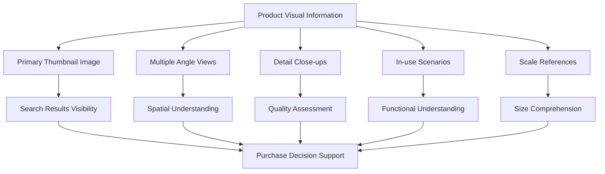

### Image Reordering Capability

Sellers can modify the display order of ProductImages after initial upload. This reordering capability allows sellers to optimize their product presentations based on performance data, seasonal changes, or updated marketing strategies.

Business implications of image reordering:

**Performance Optimization**: Sellers can promote higher-performing images to primary thumbnail positions based on conversion data.

**Seasonal Updates**: Product presentations can be refreshed for different seasons or promotions without changing the actual images.

**A/B Testing**: Different image sequences can be tested to determine optimal presentation strategies.

**Error Correction**: Incorrectly ordered images can be repositioned without requiring re-upload.

The reordering process maintains all existing images while changing their display sequence. This flexibility supports continuous improvement of product presentations without the overhead of managing multiple image uploads.

When images are reordered, the system creates a snapshot of the change, preserving the previous display order for historical reference and potential dispute resolution.

### Snapshot-Included Visual Changes

All modifications to ProductImages are captured in product snapshots as part of the platform's comprehensive audit trail. This includes:

**Image Uploads**: When new images are added to a product, the snapshot records which images were added and their initial display order.

**Image Deletions**: When images are removed from a product, the snapshot preserves which images were deleted and their positions at the time of removal.

**Display Order Changes**: When images are reordered, the snapshot captures both the previous and new display sequences.

**Image Replacement**: If an image is replaced with a different visual, the snapshot records both the removed and added images.

Snapshot documentation includes:
- Timestamp of the change
- Identity of the seller making the change
- Specific images affected
- Display order before and after (if applicable)
- Reason for change if provided

These snapshots serve multiple business purposes:
1. **Dispute Resolution**: If customers claim product appearance differs from advertised, snapshots provide historical evidence of what was shown at the time of purchase.
2. **Seller Accountability**: Sellers cannot misrepresent products through image changes without creating an audit trail.
3. **Platform Integrity**: The immutable record of visual changes maintains platform trustworthiness.
4. **Regulatory Compliance**: In jurisdictions requiring accurate product representations, snapshots provide compliance documentation.

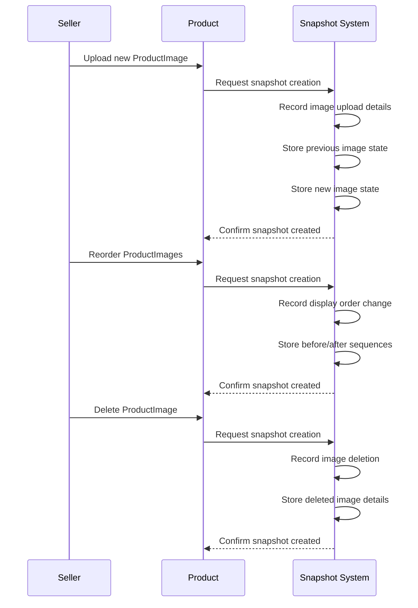

## ProductVariant Concept

A ProductVariant represents a specific configuration of a product with unique characteristics and pricing. This concept captures the different options available for a single product, such as color, size, or material variations. Each variant has a unique SKU code that serves as its identifier within inventory and ordering systems. Option values specify the exact characteristics of the variant, like 'Red' for color or 'Large' for size. The variant may have its own price that overrides the product's base price when specified. Stock quantity tracks how many units of this specific variant are available for purchase. Variants enable sellers to offer multiple options for a single product while maintaining clear inventory and pricing for each specific combination.

### Product Variant Definition

A ProductVariant represents a specific configuration of a product that customers can purchase. It captures the exact combination of options that distinguish one version of a product from another, such as different colors, sizes, materials, or other product characteristics.

Each variant is a distinct, purchasable item with its own inventory and pricing. While a product defines the general item being sold, variants represent the specific forms that item can take.

Example variants:
- A t-shirt product might have variants: "Red / Large", "Blue / Medium", "Black / Small"
- A smartphone product might have variants: "128GB / Black", "256GB / Silver"
- A coffee mug might have variants: "White / 12oz", "Black / 16oz"

### Unique SKU Code Identifier

Every ProductVariant must have a unique SKU (Stock Keeping Unit) code that serves as its primary business identifier. The SKU code is used for inventory management, order tracking, and seller operations.

Key characteristics:
- **Unique across the entire platform**: No two variants can share the same SKU code
- **Required field**: A variant cannot be created without a SKU code
- **Business identifier**: Used in inventory systems, order management, and seller dashboards
- **Human-readable**: Designed to be understood by sellers and administrators for business operations

The SKU code is distinct from internal system IDs and serves as the business-facing reference for the specific variant configuration.

### Option Values and Characteristics

Option values define the specific characteristics that make this variant different from other variants of the same product. These represent the selectable attributes that customers choose when purchasing.

**Structure**:
- Options are defined as key-value pairs (e.g., "color": "Red", "size": "Large")
- Each variant has a complete set of option values for all product options
- Option values are specific to each variant

**Business Purpose**:
- **Customer selection**: Customers choose variants based on option values
- **Inventory differentiation**: Each unique combination of option values creates a distinct variant
- **Display and filtering**: Option values appear on product pages and can be used for filtering

Example option value sets:
```
{
  "color": "Red",
  "size": "Large",
  "material": "Cotton"
}
```
```
{
  "storage": "128GB",
  "color": "Midnight Black"
}
```

### Price Override Capability

A ProductVariant can have its own price that overrides the product's base price when specified. This allows sellers to price different variants differently based on costs, demand, or market positioning.

**Price hierarchy**:
1. **Variant-specific price** (takes precedence when set)
2. **Product base price** (used when variant price is not set)

**Business scenarios**:
- **Premium variants**: Larger sizes or premium materials priced higher
- **Sale variants**: Specific colors or options on sale
- **Cost-based pricing**: Variants with different production costs

**Rules**:
- Variant price is optional - if not set, the product base price applies
- When set, the variant price applies to all purchases of that specific variant
- Price changes are captured in snapshots for order history preservation

### Stock Quantity Tracking

Each ProductVariant maintains its own stock quantity that tracks how many units of this specific configuration are available for purchase. Stock is managed separately for each variant, allowing precise inventory control.

**Current stock calculation**:
- **Initial value**: 0 for newly created variants
- **Updated via**: Inventory records (positive for restocking, negative for sales)
- **Current stock** = Sum of all inventory records for the variant

**Business impact**:
- **Purchase availability**: Customers can only purchase variants with stock > 0
- **Cart validation**: Shopping carts warn when quantity exceeds available stock
- **Out-of-stock status**: Variants with stock = 0 are marked as unavailable

Stock quantity is a real-time value that changes with each purchase, cancellation, or restocking action.

### Variant-Specific Inventory Management

Inventory is tracked at the variant level, not the product level. Each variant has its own inventory history that records all stock changes.

**Inventory structure**:
- **Granular tracking**: Each variant's stock is tracked independently
- **History records**: Every stock change creates an inventory record
- **Current stock**: Calculated from the sum of all inventory records

**Inventory change types**:
| Change Type | Quantity Sign | Examples |
|-------------|---------------|----------|
| Restocking | Positive | +50 (seller adds stock) |
| Order purchase | Negative | -2 (customer buys 2 units) |
| Cancellation | Positive | +1 (order cancelled, stock restored) |
| Refund | Positive | +1 (refund approved, stock restored) |
| Adjustment | Positive/Negative | -5 (damaged inventory write-off) |

**Business importance**:
- **Accurate availability**: Customers see exact stock for each variant
- **Seller operations**: Sellers manage inventory per variant, not per product
- **Order fulfillment**: Each variant's stock decreases when purchased

### Multiple Option Combinations

A single product can have multiple variants representing different combinations of option values. Each unique combination creates a distinct variant with its own SKU, price, and inventory.

**Combination examples**:
For a t-shirt product with options:
- Colors: [Red, Blue, Black]
- Sizes: [Small, Medium, Large]

Possible variants (3 × 3 = 9 combinations):
1. Red / Small
2. Red / Medium
3. Red / Large
4. Blue / Small
5. Blue / Medium
6. Blue / Large
7. Black / Small
8. Black / Medium
9. Black / Large

**Business requirements**:
- **At least one variant**: Products must have at least one variant to be purchasable
- **Unique combinations**: Each combination of option values must be unique within a product
- **Independent management**: Each variant combination is managed separately
- **Customer selection**: Customers select their preferred combination during purchase

**Visual representation**:
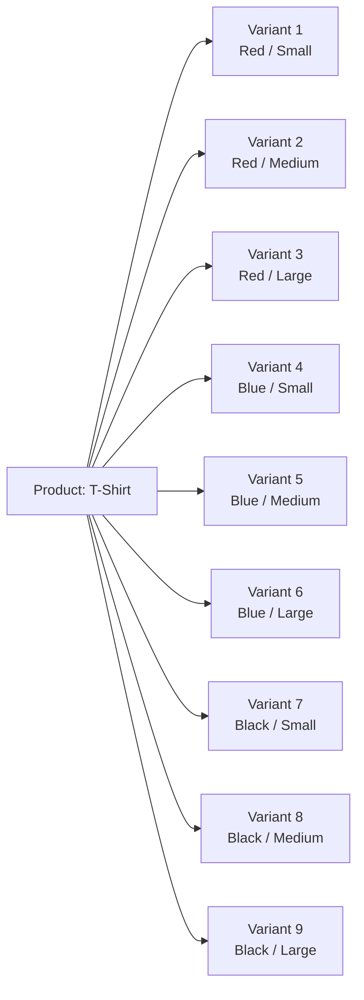

### Variant Relationships

A ProductVariant exists within specific business relationships that define its context and usage within the platform.

**Core relationships**:
1. **Belongs to a Product**: Every variant is associated with exactly one product
2. **Has inventory records**: Each variant has a history of stock changes
3. **Appears in order items**: When purchased, variants become order items with purchase snapshots
4. **Can be in shopping carts**: Customers add specific variants to their carts
5. **Can be out of stock**: Variants become unavailable when stock reaches 0

**Business context**:
- **Product dependency**: Variants cannot exist without a parent product
- **Inventory dependency**: Variants require inventory tracking for availability
- **Purchase dependency**: Variants are the actual items purchased (not products)
- **Seller ownership**: Variants inherit their seller from the parent product

**Lifecycle dependency**:
- **Creation**: Variants are created after the parent product exists
- **Deletion**: Variants can be deleted if no pending orders exist
- **Visibility**: Variants appear in product detail pages for customer selection

## InventoryRecord Concept

An InventoryRecord represents a single change in stock quantity, providing an audit trail of inventory movements. This concept tracks every adjustment to stock levels, whether from restocking, sales, or adjustments. Each record contains a quantity change value that indicates how much stock was added (positive) or removed (negative). The reason field explains why the change occurred, such as 'restock', 'order placement', or 'adjustment loss'. Timestamps record exactly when each inventory change took place for historical tracking. Current stock levels are calculated by summing all inventory records rather than being stored separately. This approach provides complete transparency into inventory history and supports accurate stock management. Inventory records form the basis for determining when variants are out of stock and unavailable for purchase.

### InventoryRecord Definition

An InventoryRecord represents a single change in stock quantity, providing an audit trail of all inventory movements. This business concept is fundamental for tracking stock levels accurately, as every adjustment—whether from restocking, sales, or corrections—creates a permanent record. Inventory records serve as the complete historical ledger of inventory changes, enabling businesses to trace stock quantities back to their source and providing transparency for both sellers and the platform.

Key attributes:
- **Quantity change**: A numeric value indicating how much stock was added or removed (positive for additions, negative for reductions)
- **Reason**: A descriptive explanation of why the inventory change occurred (e.g., 'restock', 'order placement', 'cancellation refund', 'adjustment loss')
- **Timestamp**: The exact date and time when the inventory change was recorded

### Stock Quantity Change Audit

The platform maintains a complete audit trail of all stock quantity changes through InventoryRecords. Every inventory movement—whether from seller actions (restocking, adjustments) or system events (order placement, cancellations, refunds)—generates an immutable record. This audit trail provides:
- **Full transparency** into when and why stock levels changed
- **Non-repudiable evidence** for dispute resolution
- **Historical analysis** for business planning
- **Regulatory compliance** for financial reporting

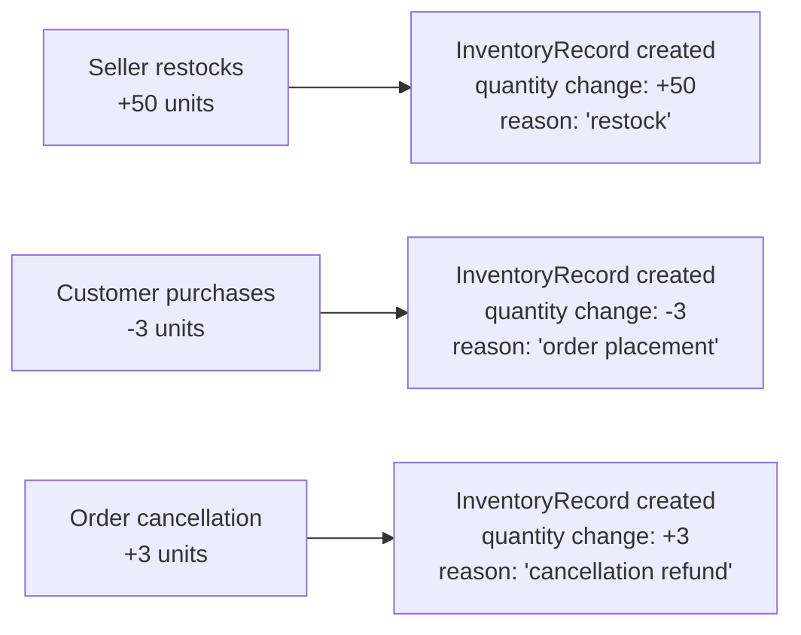

### Positive and Negative Quantity Changes

Inventory records distinguish between stock additions and reductions through positive and negative quantity changes:

| Quantity Change | Meaning | Business Context |
|----------------|---------|------------------|
| **Positive (+)** | Stock increase | Restocking, order cancellation refunds, adjustment corrections |
| **Negative (-)** | Stock decrease | Order placements, adjustment losses, inventory write-offs |

The sign of the quantity change immediately indicates whether stock was added to or removed from inventory. This binary distinction is essential for understanding inventory flow direction and calculating current stock levels accurately.

### Reason for Inventory Adjustment

Each InventoryRecord includes a reason explaining why the inventory change occurred. The reason field serves multiple purposes:
- **Context provision**: Explains the business circumstance behind the change
- **Category identification**: Groups similar inventory movements
- **Audit clarification**: Provides human-readable justification
- **Problem diagnosis**: Helps identify issues in inventory management

Common reason categories:
- **Restocking**: Seller adds inventory intentionally
- **Order placement**: Customer purchases reduce stock
- **Cancellation refund**: Order cancellation restores stock
- **Refund processing**: Product return restores stock
- **Adjustment loss**: Seller corrects inventory discrepancies
- **System correction**: Platform fixes inventory errors

The reason is recorded exactly as provided by the seller or generated by the system, preserving the original context for historical reference.

### Timestamp for Historical Tracking

Every InventoryRecord includes a precise timestamp recording when the inventory change occurred. This temporal metadata enables:
- **Chronological ordering** of inventory events
- **Period analysis** (daily, weekly, monthly inventory flows)
- **Troubleshooting** by pinpointing when issues began
- **Compliance verification** showing exact timing of stock movements

The timestamp is automatically generated by the system at the moment the inventory record is created, ensuring accuracy and preventing manipulation. This creates an immutable timeline of all inventory activities that can be reconstructed for any historical period.

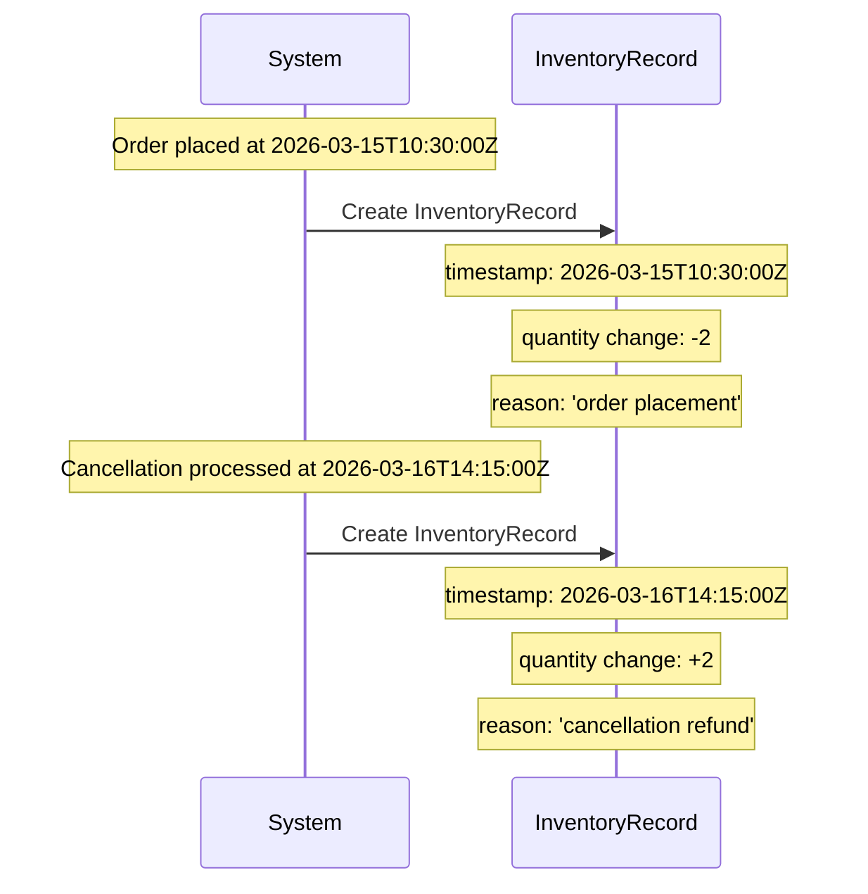

### Calculated Current Stock

Current stock quantity is not stored as a separate attribute but is dynamically calculated by summing all inventory records for a variant. This calculation approach:
- **Eliminates synchronization issues**: No risk of stock quantity becoming out of sync with inventory movements
- **Provides audit trail transparency**: Every unit of stock can be traced to its origin
- **Enables historical reconstruction**: Stock at any past point can be recalculated
- **Reduces data duplication**: Avoids storing the same information in two places

The calculation formula:
```
Current stock = Sum of all quantity changes for the variant
           = (Initial restock) + (Additional restocks) - (Sales) + (Cancellations) - (Adjustments)
```
This method ensures that stock quantities are always accurate and verifiable against the complete inventory history.

### Inventory Transparency

Inventory records provide complete transparency into stock movements for both sellers and the platform administration. This transparency manifests in several ways:
- **Seller visibility**: Sellers can view the complete inventory history for each variant, understanding exactly how stock levels changed over time
- **Platform oversight**: Administrators can audit inventory activities across the entire marketplace
- **Customer confidence**: While customers don't see inventory records directly, the accurate stock information builds trust in availability claims
- **Dispute resolution**: When discrepancies arise, the inventory record history serves as authoritative evidence

The transparency extends to the reason field, which explains not just that stock changed, but why it changed. This prevents ambiguity and supports informed decision-making by all parties involved in inventory management.

### Stock Movement Audit Trail

The collection of inventory records forms a comprehensive audit trail for all stock movements. This audit trail serves as:
- **Legal record**: Documents inventory changes for tax, accounting, and regulatory purposes
- **Operational tool**: Helps sellers optimize inventory management and identify trends
- **Security mechanism**: Prevents unauthorized or unexplained stock changes
- **Quality assurance**: Ensures inventory data integrity through complete traceability

Key audit trail characteristics:
- **Immutable**: Once created, inventory records cannot be modified or deleted
- **Complete**: Every stock change generates a record, leaving no gaps in the history
- **Verifiable**: Each record includes sufficient information to validate its accuracy
- **Accessible**: Authorized parties can review the audit trail for their relevant variants

This audit trail transforms inventory management from a simple quantity tracking exercise into a fully accountable business process with complete historical visibility.

## Wishlist Concept

A Wishlist represents a customer's collection of products they're interested in but not ready to purchase immediately. This concept allows customers to save products for future consideration or purchase. Customers add entire products to their wishlist rather than specific variants, indicating general interest in the item. The wishlist serves as a personalized shopping assistant, helping customers remember products they liked. When products are deleted by sellers, they are automatically removed from all wishlists to maintain accuracy. Wishlists are paginated to handle large collections efficiently while providing good user experience. This feature supports customer engagement by allowing them to curate their own collections of desired items within the platform.

### Wishlist as Product Interest Collection

The wishlist represents a customer's curated collection of products they find interesting but are not ready to purchase immediately. This is a business concept where customers save entire products (not specific variants) to their personal collection for future consideration. The wishlist functions as a customer's personal shopping assistant, helping them remember products they liked while browsing the marketplace. This concept supports customer engagement by allowing them to create personalized collections of desired items.

When a customer adds a product to their wishlist, they express general interest in the entire product line rather than a specific configuration. This distinction is important because customers may be interested in a product regardless of its available variants at the moment of saving.

The wishlist concept includes the automatic removal of deleted products to maintain accuracy. When sellers delete products from the marketplace, those products are automatically removed from all wishlists to prevent customers from seeing unavailable items in their collections.

### Pagination and Display Characteristics

Wishlists are displayed in a paginated format to handle potentially large collections efficiently. This ensures good user experience even when customers have saved many products over time. The paginated display shows products with basic information to help customers identify items quickly.

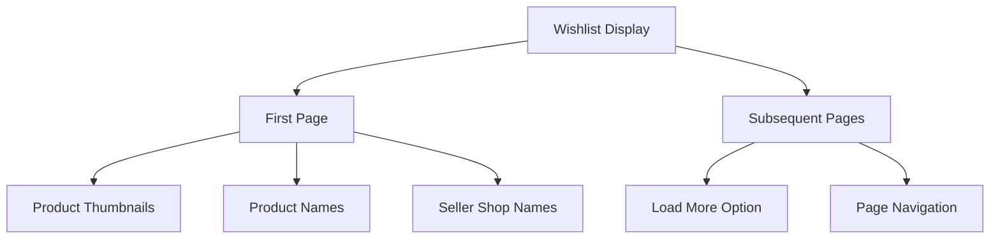

The wishlist serves as a customer engagement tool by encouraging continued platform interaction. Customers can return to their wishlist to reconsider products, track items they're interested in, and make purchase decisions based on their saved collection.

## ShoppingCart Concept

A ShoppingCart represents a customer's current selection of items they intend to purchase. This concept serves as a temporary holding area where customers assemble their order before checkout. The cart contains specific product variants rather than just products, ensuring precise selection of options like color and size. Customers specify quantities for each variant in their cart, with quantities combined when the same variant is added multiple times. The cart calculates the total price of all items to provide immediate cost feedback. Items in the cart reflect current stock availability, with warnings shown for insufficient stock. This concept bridges browsing and purchasing, allowing customers to collect items before committing to payment.

### ShoppingCart Business Concept

A ShoppingCart represents a customer's current selection of items they intend to purchase within the e-commerce platform. It serves as a digital counterpart to a physical shopping cart, allowing customers to collect items from different sellers before committing to purchase. Each customer has exactly one active shopping cart at any time, which persists across their browsing sessions. The cart is associated with the customer's profile and exists independently of any particular browsing activity or product category.

Key attributes include:
- **Association with customer**: The cart belongs to exactly one customer profile
- **Temporary storage**: Items remain in the cart until removed or purchased
- **Multi-seller support**: Can contain items from different sellers
- **Session persistence**: Remains accessible across multiple browsing sessions until cleared
- **Pre-purchase state**: Represents items the customer is considering but hasn't yet committed to purchase

### Temporary Purchase Selection

The shopping cart functions as a temporary holding area where customers assemble items they may purchase. Unlike orders which represent completed transactions, the shopping cart represents potential purchases that the customer is still evaluating. Items can be added, removed, or have their quantities adjusted freely without financial commitment. The cart's temporary nature means:

- **No financial obligation**: Items in the cart do not reserve stock or require payment
- **Flexible modification**: Customers can change their selections at any time before checkout
- **Session-independent**: The cart persists beyond single browsing sessions but remains temporary until checkout
- **No seller notification**: Sellers are not notified when their items are added to carts

This temporary selection process allows customers to gather items from across the platform before deciding what to actually purchase.

### Specific Variant Selection

When customers add items to their shopping cart, they must select specific product variants rather than generic products. This ensures precise selection of options like color, size, material, or other variant-specific characteristics. The requirement for variant-level selection ensures:

- **Exact item identification**: Each cart item represents a specific configuration with unique SKU code
- **Accurate pricing**: Variants may have different prices than the product base price
- **Stock accuracy**: Stock quantities are tracked at the variant level
- **Purchase precision**: Customers know exactly what options they're selecting

For example, a customer adding a "T-shirt" product must choose between "Red / Large," "Blue / Medium," or other available variant combinations. The cart cannot contain generic "T-shirt" items without specific variant attributes.

### Quantity Specification and Combination

Customers specify quantities for each variant they add to their cart. When the same variant is added multiple times, the system combines quantities rather than creating duplicate cart items. This quantity management approach ensures:

- **Consolidated representation**: Each unique variant appears only once in the cart with its total quantity
- **Simplified management**: Customers see a single line item for each variant they want
- **Clear quantity tracking**: Easy to see how many of each variant are intended for purchase
- **Efficient checkout**: Reduces complexity during the purchase process

For example, if a customer adds 2 units of "Red / Large T-shirt" and later adds 3 more of the same variant, their cart shows one "Red / Large T-shirt" item with quantity 5, not two separate items.

Customers can adjust quantities directly in the cart, increasing or decreasing as needed before checkout.

### Total Price Calculation

The shopping cart calculates and displays the total price of all items it contains. This calculation provides customers with immediate feedback on their potential purchase cost. The price calculation process includes:

- **Item subtotals**: Each cart item shows quantity × variant price (or product base price if variant price isn't specified)
- **Running total**: The cart displays the sum of all item subtotals
- **Real-time updates**: Price calculations update immediately when quantities change or items are added/removed
- **Seller-independent pricing**: Each item's price is based on the specific seller's pricing for that variant

This total price calculation helps customers make informed decisions about their purchases and understand the financial commitment before proceeding to checkout.

### Stock Availability Warnings

The shopping cart monitors and displays stock availability information for items it contains. Since stock levels can change between when items are added to the cart and when checkout occurs, the cart provides warnings about insufficient stock. This functionality includes:

- **Real-time stock checks**: The cart verifies current stock levels when displayed
- **Insufficient stock warnings**: If a variant's available stock is less than the quantity in the cart, a warning is shown
- **Out-of-stock marking**: If a variant becomes completely unavailable, it is marked as such in the cart
- **Checkout prevention**: Items with insufficient stock cannot be checked out

These warnings help customers avoid disappointment at checkout by alerting them to stock issues before they attempt to purchase unavailable items.

### Pre-Checkout Assembly Area

The shopping cart serves as the final assembly area where customers prepare their order before proceeding to checkout. In this role, the cart provides:

- **Comprehensive review**: Customers can see all selected items together before payment
- **Last-minute adjustments**: Quantities can be modified and items removed before commitment
- **Total cost confirmation**: The final purchase amount is clearly displayed
- **Stock verification**: Availability of all items is confirmed
- **Multi-item management**: Customers can manage items from multiple sellers in one place

This assembly function transforms individual browsing selections into a cohesive purchase plan, ensuring customers have considered their complete order before beginning the checkout process.

### Browsing to Purchase Bridge

The shopping cart bridges the gap between product browsing and purchase completion. It transforms the customer experience from exploration to transaction by:

- **Collecting discoveries**: Allows customers to save interesting items found during browsing
- **Enabling deliberation**: Provides a space to consider purchases before committing funds
- **Facilitating comparison**: Lets customers review multiple items together before deciding what to buy
- **Supporting phased shopping**: Customers can add items over multiple sessions before purchasing
- **Simplifying checkout**: Gathers all purchase intentions into one streamlined process

Without the shopping cart, customers would need to purchase items immediately upon finding them or remember specific items to purchase later. The cart enables the natural shopping behavior of gathering items before making final purchase decisions.

## CartItem Concept

A CartItem represents a single line in a shopping cart, specifying exactly what variant and quantity a customer wants to purchase. This concept captures the customer's specific selection within their shopping cart. Each cart item includes the exact product variant chosen, ensuring the correct options like color and size are recorded. The quantity indicates how many units of this specific variant the customer intends to buy. Cart items calculate their individual subtotal by multiplying quantity by the variant's current price. When the same variant is added multiple times, quantities combine into a single cart item rather than creating duplicates. This concept provides the granular detail needed for accurate order preparation and stock reservation.

### Cart Item Domain Concept

A cart item represents a single entry in a customer's shopping cart, capturing the customer's specific purchase intention for a particular product configuration. It serves as the fundamental unit that connects a customer's shopping selection with the marketplace inventory system, enabling precise tracking of what a customer intends to buy.

### Specific Shopping Cart Line

Each cart item constitutes one line in the shopping cart, representing a distinct selection choice made by the customer. This line-based structure allows customers to view, modify, and manage multiple different product selections independently within their shopping session, with each line showing a clear separation between different product variants.

### Exact Variant Selection

A cart item must specify the exact product variant the customer intends to purchase, including all specific option values such as color, size, or material. This ensures the customer receives precisely what they selected, not just the general product category. The variant selection includes both the product identity and the specific configuration attributes that differentiate it from other variants of the same product.

### Purchase Quantity Specification

Each cart item includes a quantity value representing how many units of the selected variant the customer wants to purchase. This quantity must be a positive whole number (minimum 1) and reflects the customer's purchase intent for that specific variant. The quantity specification enables accurate inventory management and order fulfillment planning.

### Individual Subtotal Calculation

Each cart item calculates its individual subtotal by multiplying the variant's current price by the specified quantity. This calculation occurs at the cart item level, allowing customers to see the cost breakdown for each selection before proceeding to checkout. The subtotal represents the total cost for that specific cart item before any order-level calculations are applied.

### Quantity Combination for Duplicates

When a customer adds the same product variant to their cart multiple times, the system combines these additions into a single cart item rather than creating duplicate lines. The quantities from all additions are summed together, maintaining a single unified entry for each distinct variant. This prevents clutter in the shopping cart and ensures accurate quantity management.

### Order Preparation Detail

Cart items provide the granular detail necessary for order preparation, serving as the definitive source of what the customer intends to purchase. This detail includes the specific product variant, exact quantity, and calculated cost, which together form the basis for creating order items during the checkout process. The precision of cart item data ensures that completed orders accurately reflect customer selections.

### Stock Reservation Basis

Cart items serve as the basis for stock reservation calculations, indicating which variants and quantities are currently being considered for purchase. While not representing formal stock holds, cart items provide visibility into potential inventory allocation, helping customers understand availability and preventing overselling situations where multiple customers attempt to purchase the same limited stock.

## Order Concept

An Order represents a completed purchase transaction containing one or more items from the customer. This concept serves as the formal record of a customer's purchase, grouping related items together. Each order has a unique order number that identifies it throughout the fulfillment process. The order captures the total price representing the complete cost of all included items. An overall order status provides a high-level view of the order's progress through fulfillment stages. Orders can contain items from multiple sellers, with each seller responsible for their portion of the order. This concept represents the customer's commitment to purchase and forms the basis for all fulfillment activities. Orders preserve the transactional history between customers and sellers.

### Order as Completed Purchase Transaction

An Order represents a completed purchase transaction that formalizes a customer's commitment to purchase one or more items. This business concept serves as the primary record of a successful purchase where payment has been processed and the transaction is considered complete from a business perspective. Each Order captures the customer's intent to acquire specific items and commits both the customer and sellers to the fulfillment process. The order becomes the central reference point for all subsequent activities including shipping, delivery, and any post-purchase support or modifications.

### Unique Order Number Identification

Every Order is assigned a unique order number that serves as its primary business identifier throughout the entire lifecycle of the purchase. This identifier is:

- **Unique across all orders**: No two orders share the same order number
- **Permanent**: Once assigned, the order number never changes
- **Referenceable**: Used by customers, sellers, and administrators to identify specific orders
- **Traceable**: Links all related activities back to the original purchase transaction

The order number provides a consistent reference point that allows all parties (customers, sellers, and administrators) to communicate about the same order without confusion.

### Total Price Aggregation

Each Order includes a total price that represents the complete financial commitment of the purchase. This total price is:

- **Calculated at order creation**: Sum of all purchased items' prices multiplied by their quantities
- **Fixed for the order**: Remains unchanged throughout the order's lifecycle, even if product prices change later
- **Transparent**: Represents the exact amount paid by the customer
- **Comprehensive**: Includes all items in the order

The total price serves as the definitive financial record of the transaction amount between the customer and the platform.

### Overall Order Status Derivation

An Order has an overall status that provides a high-level view of the order's progress through the fulfillment process. This status is:

- **Derived**: Calculated based on the individual statuses of all items within the order
- **Dynamic**: Updates automatically as item statuses change
- **Hierarchical**: Represents the most progressed status applicable to the entire order
- **Informative**: Helps customers and sellers quickly understand the order's current state

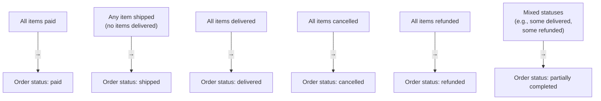

The overall order status gives all parties a consolidated view of where the order stands in the fulfillment pipeline.

### Multi-Seller Order Capability

A single Order can contain items from multiple sellers, enabling customers to purchase from different shops in one transaction. This capability means:

- **Unified purchase**: Customers can buy items from different sellers without multiple checkout processes
- **Separate fulfillment**: Each seller is responsible only for their own items within the order
- **Independent status tracking**: Items from different sellers progress through fulfillment independently
- **Individual seller responsibility**: Each seller handles shipping, delivery, and support for their own items

This multi-seller capability reflects the shopping mall nature of the platform, where customers can browse and purchase from various stores in a single shopping experience.

### Order as Purchase Commitment Record

The Order serves as the formal, binding record of the customer's purchase commitment. This record:

- **Documents the agreement**: Captures the specific terms of purchase including items, quantities, and prices
- **Creates obligations**: Establishes the customer's obligation to pay and the sellers' obligation to deliver
- **Preserves transaction details**: Saves all relevant information needed for fulfillment and support
- **Provides audit trail**: Creates a permanent record for financial, legal, and customer service purposes

The order represents the point where browsing and selection transitions to a committed purchase with associated responsibilities for all parties.

### Order as Fulfillment Activity Basis

The Order forms the foundation for all subsequent fulfillment activities across the platform. As the basis for fulfillment:

- **Triggers inventory updates**: Stock quantities are decreased for purchased items
- **Initiates shipping processes**: Sellers begin preparing items for shipment
- **Starts delivery tracking**: Tracking information is associated with order items
- **Enables post-purchase activities**: Reviews, cancellations, and refunds all reference the original order
- **Coordinates multi-party collaboration**: Brings together customers, sellers, and administrators around shared fulfillment goals

Every fulfillment activity, from inventory deduction to final delivery confirmation, traces back to and operates within the context of the original order.

### Order Structure and Composition

An Order is composed of one or more order items, with each item representing a specific product variant purchased in a specific quantity. The structure is:

- **Hierarchical**: Order contains items, each item represents a purchased variant
- **Quantity-aware**: Items record both the specific variant and the quantity purchased
- **Seller-specific**: Items maintain their association with the selling shop
- **Snapshot-preserving**: Each item preserves the product, variant, and seller profile information from the moment of purchase

When a customer purchases three units of the same variant, this becomes one order item with quantity three, maintaining data efficiency while accurately representing the purchase.

## OrderItem Concept

An OrderItem represents a single purchased product variant within an order, specifying exactly what was bought. This concept captures the precise details of each purchase, including the specific variant selected by the customer. Each order item records the quantity purchased, indicating how many units of this variant were bought. The price at purchase preserves the exact price the customer paid, regardless of future price changes. Individual item status tracks the progress of this specific item through fulfillment stages. Order items are linked to product and seller snapshots that preserve their state at the time of purchase. This concept enables independent processing of each item within an order, supporting partial cancellations and refunds. Order items form the building blocks of order fulfillment and customer satisfaction tracking.

### Order Item Concept

An order item represents a single purchased product variant within an order. This business concept captures the precise details of what a customer actually bought, including the specific variant configuration selected from the available options. Each order item documents a discrete purchase transaction component, enabling detailed tracking and individual processing separate from other items in the same order.

The order item serves as the fundamental building block of order fulfillment, connecting the customer's purchase decision with inventory management, seller operations, and post-purchase services. It preserves the exact state of the product and seller at the moment of purchase, ensuring transactional integrity even if product details change later.

Key business significance includes:
- Enabling per-item status tracking for complex orders with multiple sellers
- Supporting partial order modifications (cancellations, refunds) without affecting other items
- Providing accurate historical records for customer service and dispute resolution
- Facilitating precise inventory management at the variant level
- Creating clear attribution between purchases and seller revenue

### Specific Purchased Variant and Quantity

Each order item records exactly which product variant was purchased. A variant represents a specific configuration of a product, defined by option values like color, size, or other attributes. The order item preserves the exact combination selected by the customer at purchase time.

The order item includes a quantity field indicating how many units of this specific variant were purchased. For example, if a customer buys 3 units of a "Red / Large" t-shirt variant, this creates a single order item with quantity 3, not three separate order items.

This approach ensures:
- Clear identification of precisely what was purchased (not just which product)
- Accurate inventory deduction calculations
- Proper shipping and fulfillment planning
- Precise pricing calculations
- Accurate review attribution to specific product configurations

### Price Preservation and Snapshot Linkage

Order items preserve the exact price the customer paid at the moment of purchase. This price is captured regardless of future changes to the product's base price or variant pricing. Price preservation ensures transactional integrity and accurate historical records.

Each order item links to three critical snapshots:

**Product Snapshot**: Preserves the product name, description, category, base price, and all images as they appeared at purchase time. This ensures customers receive what they saw when making their purchase decision.

**Product Variant Snapshot**: Preserves the specific SKU code, option values, and variant-specific price (if different from base price). This captures the exact configuration purchased.

**Seller Profile Snapshot**: Preserves the seller's shop name, description, and logo as they appeared at purchase time. This maintains the business identity under which the purchase was made.

These snapshots are immutable and cannot be modified, ensuring a permanent record of the transaction state.

### Individual Status Tracking and Independent Processing

Each order item maintains its own status independent of other items in the same order. The status indicates where the item is in the fulfillment process:
- **Paid**: Payment completed, waiting for seller to ship
- **Shipped**: Seller has shipped the item
- **Delivered**: Item has been delivered to the customer
- **Cancelled**: Item was cancelled (before shipping)
- **Refunded**: Item was refunded (after delivery)

This individual tracking enables:
- Partial order cancellations where some items proceed while others are cancelled
- Separate shipping schedules for items from different sellers
- Independent refund processing for specific items
- Accurate order status aggregation at the order level
- Granular customer service and dispute resolution

Order items function as independent processing units within the larger order structure. Each can be shipped, cancelled, or refunded separately based on its specific circumstances, customer requests, and seller actions. This granularity supports complex multi-seller, multi-product orders while maintaining clear accountability and processing efficiency.

## Shipment Concept

A Shipment represents a physical package sent by a seller containing one or more order items. This concept tracks the physical delivery of goods from seller to customer. Each shipment includes carrier information identifying which shipping company is handling the delivery. A tracking number allows both sellers and customers to monitor the package's progress through the delivery system. The shipment date records when the seller dispatched the package for delivery. Shipments can contain multiple order items from the same seller, enabling efficient bundling of purchases. All items within a shipment share the same tracking information and delivery timeline. This concept bridges the digital order record with the physical delivery process, providing visibility into fulfillment progress.

### Shipment Domain Concept

A Shipment represents a physical delivery package containing one or more order items from the same seller. This concept enables the digital tracking of physical goods as they move from seller to customer, bridging the gap between online transactions and real-world fulfillment.

**Key Attributes:**
- **Carrier Name**: Identifies which shipping company is handling the delivery (e.g., "USPS", "FedEx", "DHL").
- **Tracking Number**: A unique identifier assigned by the carrier that allows both sellers and customers to monitor the package's progress through the delivery system.
- **Shipment Date**: The date when the seller dispatched the package for delivery, marking the beginning of the physical fulfillment process.
- **Delivered Date**: The date when the customer confirmed delivery or when automatic delivery confirmation occurred (after 14 days from shipment).

### Multi-Item Bundling Capability

A shipment can contain multiple order items from the same seller, allowing for efficient packaging and shipping of related purchases. This bundling capability reduces shipping costs and environmental impact while providing customers with consolidated deliveries.

**Bundling Rules:**
- Only order items from the same seller can be bundled into a single shipment.
- Different sellers always ship separately (different shipments).
- Sellers can choose to ship items individually or bundle multiple items based on operational preferences.
- All items within a shipment share the same carrier information, tracking number, and delivery timeline.

### Shared Tracking and Delivery

All order items within the same shipment share identical tracking information and delivery confirmation. This creates a unified delivery experience where multiple products travel together as a single physical package.

**Tracking Characteristics:**
- **Unified Tracking**: All items in a shipment share the same carrier name and tracking number.
- **Collective Status Updates**: When tracking indicates movement or delivery, it applies to all items in the shipment simultaneously.
- **Grouped Delivery Confirmation**: Customers confirm delivery per shipment, not per individual item. When delivery is confirmed, all items in the shipment transition to "delivered" status together.
- **Automatic Delivery**: If not manually confirmed, items automatically change to "delivered" status 14 days after the shipment date.

### Digital-Physical Fulfillment Bridge

The Shipment concept serves as the critical link between digital order records and physical fulfillment operations. It transforms abstract purchase transactions into tangible delivery events that customers can track and confirm.

**Bridging Functions:**
- **Status Synchronization**: When a seller creates a shipment with tracking information, all included order items change from "paid" to "shipped" status, signaling the start of physical fulfillment.
- **Delivery Verification**: Customer confirmation of shipment delivery updates all contained items to "delivered" status, completing the purchase cycle.
- **Dispute Resolution**: Tracking information provides evidence of shipping and delivery for customer service inquiries or disputes.
- **Operational Visibility**: Sellers can manage fulfillment efficiency, and customers gain transparency into delivery progress.

**Visualization of Shipment Relationships:**
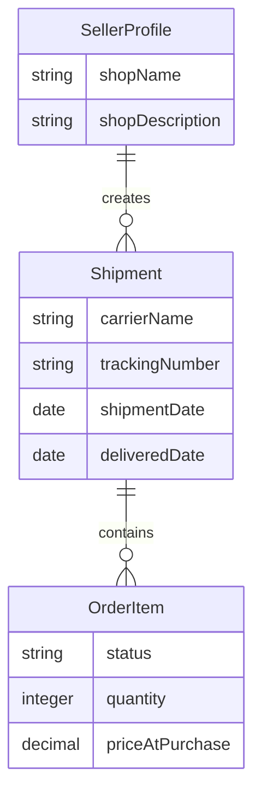

The diagram illustrates how shipments bundle order items from the same seller, with each shipment tracking physical delivery progress while maintaining connections to the seller who created it.

## Review Concept

A Review represents a customer's evaluation and feedback about a product they've purchased. This concept captures customer opinions to help future buyers make informed decisions. Each review includes a rating from one to five stars that quantifies the customer's satisfaction level. Text content provides detailed feedback about the product's quality, features, or performance. Reviews can only be written after the purchased item has been delivered to ensure authentic feedback. Customers can write one review per product per order, preventing duplicate feedback. This concept influences product reputation and helps other customers assess product quality before purchasing. Reviews contribute to the marketplace's trust ecosystem by providing transparent customer experiences.

### Review Domain Concept

A **Review** represents a customer's evaluation and feedback about a product they have purchased. It captures the customer's opinion, including a quantifiable rating and optional text feedback, to help future buyers make informed decisions. The review is permanently associated with the product and the customer who wrote it (even if the customer later deletes their account, the review is preserved but shown as originating from a "deleted user").

Key business attributes include:
- **Rating**: A whole number from 1 to 5 stars representing the customer's satisfaction level. This value is required for every review.
- **Text content**: Optional written feedback providing details about the product's quality, features, or performance.
- **Product**: The specific product being evaluated.
- **Customer**: The customer who wrote the review.
- **Order item**: The specific purchased variant that triggered the review eligibility.
- **Creation timestamp**: When the review was first written.
- **Last edit timestamp**: When the review was last modified (if edited).

Reviews are a foundational component of the marketplace's trust ecosystem, allowing customers to share authentic experiences and influencing product reputation through aggregated ratings.

### Review Creation Constraints

**Post-delivery feedback requirement**
A customer can only write a review after the specific order item (product variant) has been delivered and its status is "delivered". This ensures that reviews are based on actual product receipt and usage, maintaining authenticity and preventing speculative feedback.

**One review per product per order**
A customer can write at most one review for a given product within a single order. If a customer purchases multiple variants of the same product in one order (e.g., red and blue versions), they still write only one review covering the product overall. This prevents review spam and ensures each review represents a distinct purchase experience.

This constraint does not prevent a customer from reviewing the same product again if they purchase it in a subsequent order; each order provides a separate opportunity for review.

### Review Lifecycle and States

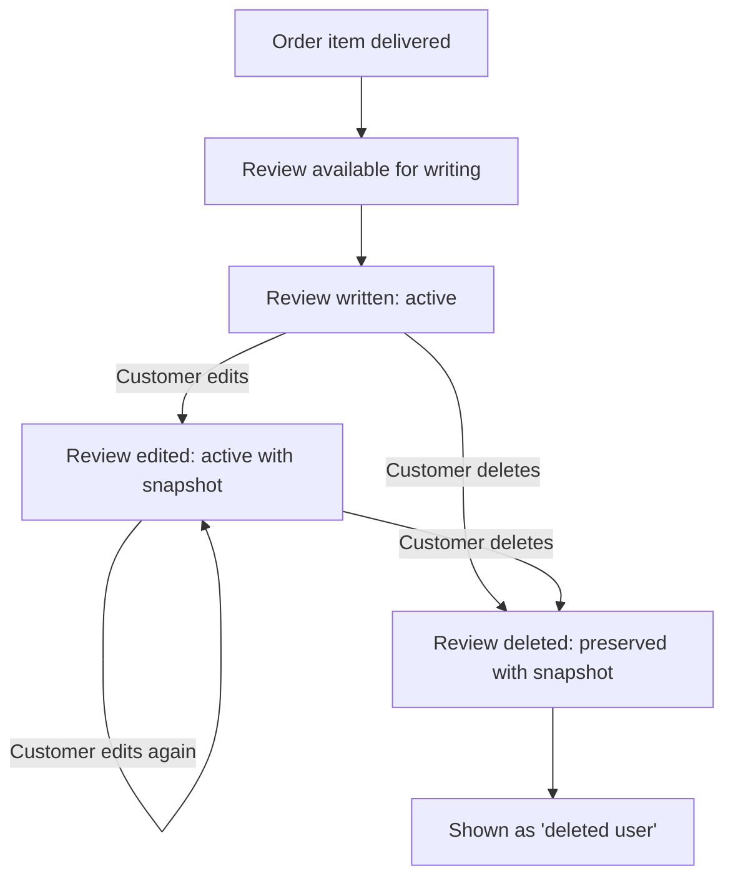

**Active review**: The customer's current evaluation is visible on the product detail page, contributing to the product's average rating and total review count.

**Edited review**: When a customer edits their review, a snapshot of the previous version is created, preserving the original rating and text content. The updated review replaces the previous version in public display, but administrators and the reviewing customer can view the change history.

**Deleted review**: When a customer deletes their review, it is removed from public display on the product detail page. However, all snapshots of the review (including its original content and any edits) are preserved and can be viewed by administrators for dispute resolution or historical reference. If the customer's account is also deleted, the review continues to exist but is shown as originating from a "deleted user".

Deleted reviews do not contribute to the product's average rating calculation.

### Review Impact on Product Reputation

**Product reputation influence**
Each review directly contributes to the product's overall reputation through two mechanisms:
1. **Average rating calculation**: The product's displayed average rating is computed from all active (non-deleted) reviews. This calculation uses the 1–5 star ratings from each review to produce a numerical average that helps customers quickly assess overall product satisfaction.
2. **Social proof through review count**: The total number of active reviews is displayed alongside the average rating, providing additional context about how many customers have shared their experiences.

**Marketplace trust ecosystem**
Reviews collectively create a transparent feedback system that benefits all marketplace participants:
- **For customers**: Reviews provide authentic, peer-based information to inform purchasing decisions, reducing uncertainty about product quality.
- **For sellers**: Reviews offer direct customer feedback that can inform product improvements and demonstrate product quality to potential buyers.
- **For the platform**: The review system builds trust in the marketplace by ensuring customers can share honest experiences and hold sellers accountable for product quality.

The review ecosystem operates on principles of authenticity (ensuring reviews come from actual purchasers), transparency (showing both positive and negative feedback), and permanence (preserving review history through snapshots).

## CancellationRequest Concept

A CancellationRequest represents a customer's formal request to cancel a specific order item before it ships. This concept provides a structured process for handling order changes that affect individual items. Each request includes a reason explaining why the customer wants to cancel the item. The request captures the current status as it moves through the approval workflow. Cancellation requests apply only to items with 'paid' status that haven't yet been shipped. When approved, these requests trigger refund processing and stock restoration for the affected items. This concept enables precise order modifications without requiring full order cancellation. Cancellation requests preserve the business context for why items were removed from orders.

### Cancellation Request Definition

A cancellation request represents a formal business process where a customer requests to cancel a specific order item before it has been shipped. This concept provides a structured mechanism for handling changes to orders at the item level rather than requiring full order cancellation. Each cancellation request creates a documented record of the customer's intent to cancel, preserving the business context for why an item was removed from an order. Cancellation requests enable precise order modifications while maintaining accountability and auditability in financial transactions.

### Cancellation Request Components

Each cancellation request contains specific components that define the business context:

**Reason for Cancellation**: A text explanation provided by the customer describing why they want to cancel the specific order item. This reason helps sellers understand customer motivations and may influence approval decisions.

**Request Status**: The current state of the cancellation request as it moves through the approval workflow. Status values track whether the request is pending seller review, has been approved, or has been rejected.

**Associated Entities**: Each cancellation request is linked to:
- The customer who made the request
- The specific order item being requested for cancellation  
- The seller who must approve or reject the request

**Temporal Context**: The request records when it was created and when any status changes occurred, providing a complete timeline of the cancellation process.

### Cancellation Request Business Rules

Cancellation requests operate under specific business constraints that define their applicability:

**Eligibility Requirement**: A cancellation request can only be created for order items with 'paid' status. Items that have already been shipped cannot be cancelled through this process, as they are already in transit.

**Precision Limitation**: Cancellation requests apply to individual order items, not entire orders. This enables customers to cancel specific items while allowing remaining items in the same order to proceed normally.

**Trigger Mechanism**: When a cancellation request is approved, it triggers two business processes:
1. **Refund Processing**: The customer receives a refund for the cancelled item
2. **Stock Restoration**: The inventory quantity for the cancelled item's variant is restored via an inventory record

**Business Context Preservation**: All cancellation requests and their status changes create immutable snapshots that preserve the complete business context, including the original reason and approval decisions.

## RefundRequest Concept

A RefundRequest represents a customer's formal request for a refund on a specific delivered order item. This concept provides a structured process for handling post-delivery dissatisfaction or issues. Each request includes a reason explaining why the customer is seeking a refund. The request captures the current status as it moves through seller evaluation and decision. Refund requests can only be made within seven days of item delivery to ensure timely resolution. These requests apply only to items with 'delivered' status that have reached the customer. When approved, refund requests trigger financial reimbursement and stock restoration. This concept supports customer satisfaction by providing a clear path for addressing post-purchase issues.

### Refund Request Domain Concept

A RefundRequest is a formal business request made by a customer seeking financial reimbursement for a specific delivered order item. This concept exists to provide a structured, auditable mechanism for handling post-purchase dissatisfaction or issues that arise after delivery. Unlike cancellation requests which occur before shipping, refund requests specifically address items that have already been received by the customer. Each refund request is tied to exactly one order item and one seller, ensuring clear ownership and responsibility for resolution. The concept supports customer satisfaction while maintaining business integrity through documented processes and accountability.

Refund requests represent the customer's right to seek remedy for problems with delivered goods, such as damage, quality issues, or incorrect items. They provide a formal channel for expressing dissatisfaction that can be tracked, evaluated, and resolved according to platform policies. The existence of this concept acknowledges that even after successful delivery, circumstances may warrant reversing the transaction.

This business concept creates a transparent record of customer concerns and seller responses, which can be referenced for dispute resolution, quality analysis, and continuous improvement of the marketplace experience. All refund requests are immutable once created, ensuring an accurate historical record of customer-seller interactions around product quality and satisfaction.

### Refund Request Attributes and Constraints

### Core Attributes

- **Reason**: A textual explanation from the customer describing why they are requesting a refund. This field captures the specific issue with the delivered item, such as damage, incorrect product, quality problems, or unmet expectations.

- **Status**: The current state of the refund request as it moves through the evaluation process. Valid statuses include 'pending' (awaiting seller response), 'approved' (seller has agreed to refund), and 'rejected' (seller has declined the refund).

- **Creation Timestamp**: The date and time when the customer submitted the refund request. This timestamp establishes when the customer formally initiated the refund process.

- **Response Timestamp**: The date and time when the seller approved or rejected the request, or when an administrator intervened. This records when the decision was made.

- **Seller Response Reason**: An optional field where sellers can provide explanation when rejecting a refund request, helping customers understand the decision.

### Business Constraints

- **Seven-Day Window**: Refund requests can only be submitted within seven days of the specific order item being marked as 'delivered'. This time limitation ensures timely resolution and prevents indefinite uncertainty for both customers and sellers.

- **Delivered Status Requirement**: A refund request can only be created for order items that have reached 'delivered' status. Items that are still 'paid' or 'shipped' must use the cancellation request process instead.

- **One Request Per Item**: Only one active refund request can exist for a given order item at any time. Customers cannot submit multiple refund requests for the same item simultaneously.

- **Seller Ownership**: Each refund request is associated with the specific seller who sold the item, ensuring the responsible party handles the evaluation and decision.

- **Item-Level Scope**: Refund requests apply to individual order items, not entire orders. Customers can request refunds for specific items while keeping others.

- **Post-Delivery Focus**: Refund requests specifically address issues that become apparent after the customer has received and examined the delivered goods.

### Refund Request Outcomes and Resolution

### Financial Reimbursement Process

When a refund request is approved, the customer receives financial reimbursement for the specific order item. The reimbursement amount equals the price at purchase for that item multiplied by the quantity purchased. The financial transaction reverses the original payment flow, returning funds to the customer's original payment method through the platform's payment gateway integration.

Simultaneously with the financial reimbursement, the system creates a positive inventory record for the refunded variant, effectively restoring the stock quantity that was reduced when the order was placed. This stock restoration maintains accurate inventory counts and makes the items available for future purchases.

### Post-Purchase Issue Resolution

The refund request concept serves as the primary mechanism for resolving post-purchase issues that emerge after delivery. It provides a formal, documented process through which customers can seek remedy for problems with received goods. The structured nature of the request ensures that both parties have clear expectations and responsibilities.

For customers, the refund request offers a legitimate path to address dissatisfaction with delivered items, supporting consumer confidence in the platform. For sellers, it provides a controlled framework for handling customer complaints while maintaining business records and accountability.

When a refund request is approved, it represents a complete resolution of the customer's issue—both financially through reimbursement and operationally through stock restoration. When rejected, the seller's response reason provides closure and explanation to the customer.

All refund request decisions (approvals and rejections) are preserved in the platform's snapshot system, creating an immutable historical record. This supports dispute resolution, quality trend analysis, and platform policy enforcement by maintaining a complete audit trail of all refund-related decisions and their justifications.

## Snapshot Concept

A Snapshot represents an immutable record of an entity's state at a specific point in time. This concept preserves historical data for audit purposes and dispute resolution in a financial transaction platform. Each snapshot captures exactly when a change occurred through its timestamp recording. The entity type identifies what kind of data was modified, such as product, variant, or seller profile. The entity ID specifies exactly which item underwent the change for precise tracking. Snapshots record both the previous values and the new values to show exactly what changed. These records cannot be deleted or modified once created, ensuring data integrity. Snapshots apply to various entities including products, variants, seller profiles, order items, reviews, and requests.

### Snapshot Definition

A Snapshot is an immutable historical record that captures the complete state of an entity at a specific moment in time. Snapshots are created whenever editable data is modified on the platform to preserve historical data for audit purposes, financial transparency, and dispute resolution. Each snapshot cannot be deleted or modified once created, ensuring data integrity and providing a permanent audit trail.

### Snapshot Components

Every snapshot consists of:
- **Timestamp**: The exact date and time when the change was made, recorded at the moment of snapshot creation
- **Entity Type**: Identifies what kind of data was modified (e.g., product, variant, seller profile, order item, review, cancellation request, refund request)
- **Entity ID**: Specifies exactly which item underwent the change for precise tracking
- **Before Values**: The complete state of all entity fields before the change occurred
- **After Values**: The complete state of all entity fields after the change was applied
- **Change Details**: Documentation of what specific fields were modified and how they changed

### Snapshot Creation Triggers

Snapshots are automatically created when any of the following editable data is modified:
- **Product fields** (name, description, category, base price)
- **Product images** (upload, reorder, deletion)
- **Product variant fields** (SKU code, option values, price, stock quantity via inventory records)
- **Seller profile fields** (shop name, shop description, logo image)
- **Order item data** at time of purchase (product information, variant options, price, seller profile)
- **Review content** (rating, text content)
- **Cancellation request status** changes (pending, approved, rejected)
- **Refund request status** changes (pending, approved, rejected)

Each edit creates exactly one snapshot capturing the complete entity state before and after the change.

### Snapshot Preservation Rules

Snapshots follow these preservation rules:
1. **Immutable**: Once created, a snapshot cannot be modified, edited, or deleted
2. **Permanent Retention**: Snapshots are preserved indefinitely, even after the original entity is deleted
3. **Complete State Capture**: Each snapshot includes all entity fields, not just the changed ones
4. **Linked Entity Inclusion**: For product snapshots, the snapshot includes snapshots of all variants at that moment (product-snapshot → product-snapshot-SKU)
5. **Financial Transaction Requirement**: Because money is exchanged on the platform, all data modifications must be recorded via snapshots
6. **Dispute Resolution Support**: Snapshots can be viewed by relevant parties (owners, administrators) to resolve disputes about what changed and when

### Snapshot Visibility and Access

Different actors can view snapshots based on their relationship to the data:
- **Product Owners**: Sellers can view snapshots of their own products
- **Data Owners**: Users can view snapshots of their own reviews
- **Administrators**: Administrators can view snapshots of any entity on the platform
- **Order Participants**: Customers can view snapshots of products and seller profiles captured with their order items
- **Dispute Resolution**: Relevant parties involved in cancellation or refund requests can view associated snapshots

Access to snapshots is controlled to ensure privacy while supporting transparency for financial transactions and dispute resolution.

# Domain Relationships

Describe how concepts relate to each other from a business perspective.

## Conceptual Relationships

Describe how concepts relate to each other in business terms.

### User and Profile Relationships

### User and Profile Relationships

The platform distinguishes between base user identity and specialized profiles:

**User as Base Identity**
- Every participant in the platform has a user account
- The user account provides email authentication and password security
- User status (active, banned, suspended) controls platform access

**Customer Profile Relationship**
- A user can have one customer profile (one-to-one relationship)
- The customer profile contains public-facing information: display name and phone number
- The customer profile is created automatically when a user registers as a customer
- Customer profile information is used in reviews, orders, and public interactions

**Seller Profile Relationship**
- A user can have one seller profile (one-to-one relationship)
- The seller profile represents a business identity: shop name, shop description, and logo
- Seller profiles require administrator approval before becoming active
- A seller profile can be in pending, approved, or rejected status

**User Role Differentiation**
- The same user cannot be both a customer and a seller; they must choose one role
- Role is determined during registration (customer registration vs seller registration)
- Account functionality differs based on the user's role

**Profile Ownership**
- Users own their profiles; they can edit display name, phone number (customer) or shop name, description, logo (seller)
- Profile edits create snapshots to preserve historical states
- Users can delete their accounts, which removes their profiles but preserves relevant transactional history

### Product Structure Relationships

### Product Structure Relationships

Products have hierarchical relationships with their components:

**Product as Container**
- A product is the main sellable item with name, description, category, and base price
- Products belong to sellers (one seller owns many products)
- Products are organized into categories (one category contains many products)

**Product Variants (has-many)**
- A product can have multiple variants (one-to-many relationship)
- Each variant represents a specific configuration (e.g., "Red / Large")
- Variants have their own SKU code, option values, price (optional), and stock quantity
- A product must have at least one variant to be purchasable

**Product Images (has-many)**
- A product can have multiple images (one-to-many relationship)
- Images are ordered, with the first image serving as the main thumbnail
- Image changes are captured in product snapshots

**Category Hierarchy (belongs-to)**
- Products belong to categories (a product has one category)
- Categories can have subcategories (one level of nesting only)
- A product can belong directly to a category or to a subcategory
- When browsing, products in subcategories are included when viewing parent categories

**Inventory Association**
- Each product variant has its own inventory records (one-to-many relationship)
- Inventory records track all stock changes with reasons and timestamps
- Current stock is calculated by summing all inventory records for a variant

**Review Collection**
- A product can have multiple reviews (one-to-many relationship)
- Reviews are written by customers who have purchased and received the product
- Each product displays its average rating calculated from all non-deleted reviews

### Shopping and Order Relationships

### Shopping and Order Relationships

The shopping journey involves several connected entities:

**Wishlist Relationship**
- A customer can have multiple products in their wishlist (one-to-many relationship)
- Wishlist items are at the product level, not variant level
- Products are automatically removed from wishlists if deleted by sellers

**Shopping Cart Structure**
- Each customer has one shopping cart (one-to-one relationship)
- A shopping cart contains multiple cart items (one-to-many relationship)
- Each cart item is a specific variant with a quantity
- If the same variant is added twice, quantities are combined, not added as separate items

**Order Creation Relationship**
- An order is created from a shopping cart during checkout
- The order contains multiple order items (one-to-many relationship)
- Each order item represents a purchased variant with quantity and price at purchase
- Order items can be from different sellers, resulting in multiple shipments

**Order Item Status Association**
- Each order item has its own status (paid, shipped, delivered, cancelled, refunded)
- The overall order status is derived from the statuses of its items
- Mixed statuses across items result in "partially completed" order status

**Shipment Grouping**
- A shipment contains one or more order items from the same seller (one-to-many relationship)
- Different sellers always have separate shipments
- All items in a shipment share the same tracking information
- When a shipment is delivered, all items in it become delivered

**Address Usage**
- Customers can have multiple shipping addresses (one-to-many relationship)
- One address can be set as the default shipping address
- During checkout, customers select one shipping address for the entire order
- The selected address is saved with the order and cannot be changed after placement

### Inventory and Stock Relationships

### Inventory and Stock Relationships

Inventory tracking connects product variants with transactional activities:

**Variant and Inventory Association**
- Each product variant has its own inventory records (one-to-many relationship)
- Inventory records track all stock changes: positive for restocking, negative for sales
- Each record includes quantity change, reason, and timestamp
- Current stock is calculated by summing all inventory records for that variant

**Order Impact on Inventory**
- When an order is placed, negative inventory records are created for each purchased variant
- When an order item is cancelled or refunded, positive inventory records restore stock
- Inventory changes are automatic based on order status transitions

**Stock Availability Rules**
- Variants with zero stock are shown as "out of stock"
- Out of stock variants cannot be added to shopping carts
- If a variant in a cart becomes out of stock, it is marked as unavailable
- Unavailable items cannot proceed through checkout

**Seller Inventory Ownership**
- Sellers own the inventory of their product variants
- Only sellers can manually adjust inventory (add or subtract stock)
- Sellers can view the complete inventory history for each variant
- Inventory adjustments require a reason to be recorded

**Automatic Stock Management**
- The system automatically manages stock based on:
  - Order placement (decreases stock)
  - Order cancellation (increases stock)
  - Order refund (increases stock)
- Manual adjustments are for restocking or correcting discrepancies

**Stock and Product Availability**
- A product's overall availability depends on its variants' stock
- If all variants are out of stock, the product is shown as unavailable
- Products with no variants are always shown as unavailable

### Review and Request Relationships

### Review and Request Relationships

Customer feedback and transaction modifications have specific associations:

**Review Ownership**
- Customers own their reviews (one customer can have many reviews)
- A review is associated with a specific product (one product can have many reviews)
- Customers can only review products they have purchased and received
- Each customer can write one review per product per order

**Review Edit History**
- When a customer edits a review, a snapshot is created
- Snapshots preserve the previous rating and text content
- Customers can delete their reviews, but snapshots are preserved
- Deleted reviews are not included in average rating calculations

**Cancellation Request Association**
- Cancellation requests are associated with specific order items
- Only order items with "paid" status (not yet shipped) can be cancelled
- The customer who purchased the item owns the cancellation request
- The seller of that item must respond to the request

**Refund Request Association**
- Refund requests are associated with specific order items
- Only order items with "delivered" status can be refunded
- Refunds must be requested within 7 days of delivery
- The customer who purchased the item owns the refund request
- The seller of that item must respond to the request

**Request Status Tracking**
- Both cancellation and refund requests have statuses: pending, approved, rejected
- When a seller responds to a request, a snapshot is created
- Snapshot preserves the request state, reason, and decision
- Approved requests trigger automatic status changes and inventory adjustments

**Administrator Request Relationship**
- Users can submit requests to become administrators
- Administrator requests have statuses: pending, approved, rejected
- Super administrators review and decide on these requests
- When approved, the user becomes a regular administrator

**Seller Approval Relationship**
- Seller registration requires administrator approval
- Seller approval requests have statuses: pending, approved, rejected
- Administrators must provide a reason when rejecting seller registration
- Rejected sellers can submit new registration requests

## Lifecycle and Retention

Describe concept lifecycle states and transitions only. Detailed retention/recovery policies belong in 05-non-functional. Operation details belong in 03-functional-requirements.

### Entity Lifecycle Management

All platform entities follow distinct lifecycle patterns with retention policies designed to balance data integrity with operational needs.

**Lifecycle States and Transitions:**

1. **Active Entities** - In use and visible in the system
   - Products, variants, customer profiles, seller profiles, active orders
   - Can be modified, viewed, and interacted with

2. **Archived Entities** - No longer active but preserved for reference
   - Deleted customer accounts (profile removed, order history preserved)
   - Deleted seller accounts (products removed, order history preserved)
   - Cancelled and refunded order items (status changed, data preserved)
   - All immutable snapshots regardless of entity status

3. **Pending Entities** - Awaiting action or approval
   - Seller registration awaiting administrator approval
   - Administrator requests awaiting super administrator review
   - Pending cancellation and refund requests
   - Products with no variants (unavailable for purchase)

**Retention Principles:**
- Transactional data (orders, snapshots) is preserved indefinitely for legal and audit purposes
- User-generated content (reviews, shop descriptions) is preserved with attribution
- Deleted accounts have personal information removed but transaction records retained
- All deletions are soft-deletions with preservation of historical context

**Lifecycle Triggers:**
- Time-based triggers (7-day refund window, 14-day auto-delivery)
- User actions (account deletion, product editing)
- Administrative decisions (approvals, suspensions)
- Business rules (stock depletion, variant deletion constraints)

**Retention Dependencies:**
- Product retention depends on variant existence and order status
- Account deletion respects pending transactions
- Snapshots preserve entity states across all lifecycle changes

### Data Retention Policies

**Transactional Data Preservation:**
- Orders and order items are preserved indefinitely, even when customer accounts are deleted
- All snapshots are immutable and cannot be deleted under any circumstances
- Order items retain snapshots of product, variant, and seller profile at time of purchase
- Cancellation and refund requests preserve their entire history including approval/rejection decisions

**Account Data Retention:**
- Customer accounts: Profile information (display name, phone number) is deleted upon account deletion
- Seller accounts: Shop name, description, and logo are preserved in order snapshots after account deletion
- Deleted customer reviews are preserved but displayed as "deleted user"
- Deleted seller products are removed from listings but preserved in order snapshots

**Operational Data Retention:**
- Inventory records are maintained permanently to track stock changes
- Product variants without pending orders can be deleted
- Categories can be deleted, causing products to become uncategorized
- Wishlist items are automatically removed when products are deleted
- Shopping cart items are cleared upon order placement

**Retention Exceptions:**
- Products with pending order items (paid or shipped) cannot be deleted
- Product variants with pending order items cannot be deleted
- Seller accounts with pending orders or cancellation/refund requests cannot be deleted
- Reviews can be deleted by customers but snapshots preserve original content

**Data Linkage Preservation:**
- Order items maintain references to their original product, variant, and seller even after deletion
- Reviews maintain reference to the product even if the customer account is deleted
- Cancellation/refund requests maintain links to order items, customers, and sellers throughout their lifecycle

### Archival Mechanisms

**Snapshot-Based Archival:**
- All data modifications create immutable snapshots preserving previous states
- Snapshots capture: timestamp, entity type, entity ID, and before/after values
- Product snapshots include complete product state plus variant snapshots at that moment
- Order item snapshots preserve product, variant, and seller profile states at purchase time

**Status-Based Archival:**
- Completed order items (delivered, cancelled, refunded) are archived as historical records
- Deleted accounts have their profiles archived while transaction data remains linked
- Rejected seller registrations preserve rejection reasons for future reference
- Admin decisions (approvals, suspensions) are recorded with timestamps and reasons

**Temporal Archival:**
- Orders are automatically marked as delivered after 14 days from shipping if not confirmed
- Refund requests can only be submitted within 7 days of delivery
- Order history is available indefinitely but paginated for performance
- Inventory records are maintained permanently for audit purposes

**Archival Triggers:**
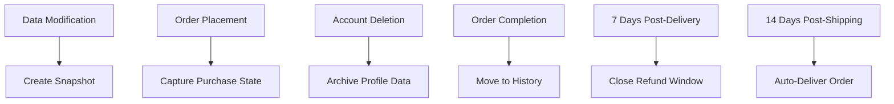

**Archival Access:**
- Customers can view their own order history and snapshots
- Sellers can view snapshots of their own products and profiles
- Administrators can view snapshots of any entity
- Historical data is read-only and cannot be modified

### Deletion Policies and Constraints

**Account Deletion Constraints:**

**Customer Accounts:**
- Profile information (display name, phone number) is deleted
- Order history and snapshots are preserved
- Reviews are preserved but shown as "deleted user"
- No pending transactions required for deletion

**Seller Accounts:**
- Can only be deleted if:
  - No pending orders (paid or shipped status) for their products
  - No pending cancellation or refund requests for their products
- Upon deletion:
  - Products are deleted from listings
  - Order history and snapshots are preserved
  - Shop name in past orders is preserved via snapshots

**Product Deletion Constraints:**
- Can only be deleted if:
  - No pending order items (paid or shipped) for any variant
  - No pending cancellation or refund requests for any variant
- Upon deletion:
  - All variants and inventory records are deleted
  - Product no longer appears in search or category listings
  - Snapshots are preserved for existing orders
  - Automatically removed from all customer wishlists

**Variant Deletion Constraints:**
- Can only be deleted if:
  - No pending order items (paid or shipped) for that variant
  - No pending cancellation or refund requests for that variant
- Product must have at least one remaining variant to be purchasable
- Products with no variants are visible but shown as "unavailable"

**Category Deletion:**
- Administrators can delete categories
- Products in deleted categories become uncategorized
- No constraints based on product existence

**Review Deletion:**
- Customers can delete their own reviews
- Snapshots of original reviews are preserved
- Product's average rating is recalculated excluding deleted reviews

### Data Recovery and Restoration

**Account Recovery:**
- Banned customers can be unbanned by administrators, restoring full access
- Suspended sellers can be unsuspended, making products visible and purchasable again
- Rejected sellers can submit new registration requests with updated information
- Password changes can be initiated by account owners at any time

**Order Recovery Scenarios:**

**Cancellation Recovery:**
- Cancelled order items restore stock quantities via inventory records
- Cancellation does not affect other items in the same order
- If all items in an order are cancelled, order status becomes "cancelled"
- Customers can view cancelled items in order history

**Refund Recovery:**
- Refunded order items restore stock quantities via inventory records
- Refund windows close 7 days after delivery
- Refunded items remain in order history with "refunded" status
- Refunds do not affect seller's ability to process other orders

**Administrative Recovery Actions:**
- Administrators can force-cancel individual items or entire orders
- Administrators can force-refund individual items or entire orders
- Administrators can restore deleted categories (products remain uncategorized)
- Administrators cannot restore deleted accounts or permanently deleted data

**Data Loss Prevention:**
- All modifications create snapshots before changes are applied
- Deletion constraints prevent removal of data with active dependencies
- Transactional integrity ensures order data survives account deletions
- Inventory records provide complete audit trail of stock changes

**Recovery Limitations:**
- Deleted customer profile information cannot be recovered
- Deleted seller products cannot be restored to active listings
- Deleted variants cannot be recreated with same historical data
- Once a snapshot is created, the previous state is preserved but not restorable as active entity

# Business Categories and State Flows

Business category classifications and state flow definitions.

## Business Category Definitions

Define all business category classifications with their allowed values and descriptions.

### Business Category Classifications

### Business Category Classifications

Business categories define logical groupings for products within the e-commerce platform. These classifications help customers navigate the marketplace and find products of interest.

**Category Definition**
A business category is a logical grouping of similar products. Each category has:
- **Name**: A short, descriptive identifier for the category (e.g., "Electronics", "Clothing", "Home Goods")
- **Description**: A longer explanation of what types of products belong to the category
- **Parent Category**: An optional reference to a parent category for creating one level of nesting (subcategories)

**Category Hierarchy Rules**
1. Categories support one level of nesting only (main categories → subcategories)
2. Subcategories cannot have further nested categories
3. Main categories have no parent category
4. Subcategories must have exactly one parent category

**Allowed Values for Category Status**
- **Active**: The category is visible to customers and available for product classification
- **Archived**: The category is hidden from customers but preserved for historical data (products in archived categories remain accessible through direct links)
- **Deleted**: The category is marked for removal (products in deleted categories become uncategorized)

**Category Lifecycle**
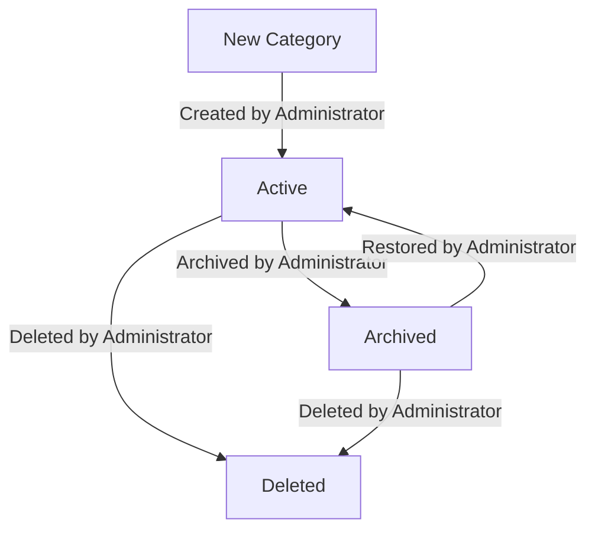

**Product Categorization Rules**
1. Each product must belong to exactly one category (which can be a main category or subcategory)
2. Products cannot belong directly to multiple categories
3. When browsing a main category, all products in its subcategories are included in the product list
4. When a category is deleted, all products within that category become uncategorized until manually reclassified

### Classification System Structure

### Classification System Structure

The classification system organizes products through a simple hierarchical structure with clear relationships between categories and products.

**Main Categories**
- Represent broad product groupings (e.g., Electronics, Fashion, Home & Garden)
- Can contain zero or more subcategories
- Directly contain products (when no appropriate subcategory exists)
- Are visible in the main category navigation menu

**Subcategories**
- Represent specific product types within a main category (e.g., Smartphones under Electronics, Dresses under Fashion)
- Must have exactly one parent main category
- Cannot contain further subcategories (one-level nesting only)
- Are visible when browsing their parent category

**Category Relationships**
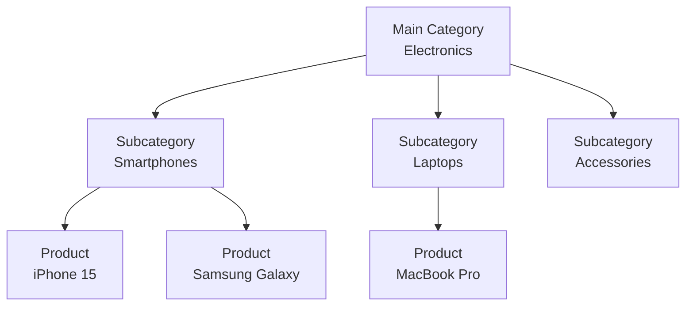

**Classification Rules**
1. When creating a product, sellers must select exactly one category from the available options
2. The category selection includes both main categories and their subcategories
3. Products can be moved between categories by the seller
4. Category changes do not affect existing orders or order item snapshots
5. Administrators can recategorize products when necessary for platform organization

**Uncategorized Products**
- Products without an assigned category are considered "uncategorized"
- Uncategorized products remain visible in search results
- Uncategorized products do not appear in any category browsing pages
- Administrators can assign categories to uncategorized products

### Allowed Category Values and Constraints

### Allowed Category Values and Constraints

**Category Name Constraints**
- **Length**: 2 to 50 characters
- **Format**: Must be alphanumeric with spaces and basic punctuation
- **Uniqueness**: Must be unique within the same level (no two main categories with the same name; no two subcategories with the same name under the same parent)
- **Examples**: "Electronics", "Men's Clothing", "Home & Kitchen", "Sports Equipment"

**Category Description Constraints**
- **Length**: 10 to 500 characters
- **Purpose**: Must clearly describe the types of products that belong in the category
- **Format**: Plain text only (no HTML or special formatting)
- **Examples**: "Devices and accessories including smartphones, laptops, tablets, and audio equipment"

**Parent Category Constraints**
- **Allowed values**: Any existing main category or null (for main categories)
- **Restriction**: Cannot reference a subcategory as a parent
- **Validation**: A category cannot be its own parent

**Category Status Allowed Values**
- **Active**: The category is visible and usable
- **Archived**: The category is hidden from customers but preserved for existing products
- **Deleted**: The category is marked for removal (products become uncategorized)

**Category Creation Rules**
1. Only administrators can create categories
2. New categories default to "Active" status
3. When creating a subcategory, the parent category must be in "Active" status
4. Categories cannot be created with duplicate names at the same hierarchy level

**Category Modification Rules**
1. Only administrators can modify categories
2. Category name changes do not affect existing products
3. Changing a main category to a subcategory requires selecting a parent category
4. Changing a subcategory to a main category removes its parent relationship

**Category Deletion Rules**
1. Only administrators can delete categories
2. Deleting a category changes its status to "Deleted"
3. Products in deleted categories become uncategorized
4. Deleted categories are removed from all navigation and filtering options

### Status Type Definitions

### Status Type Definitions

**Category Status Types**
1. **Active**
   - Visible to customers in category browsing
   - Available for product classification by sellers
   - Included in search filters and navigation menus
   - Can contain products and subcategories

2. **Archived**
   - Hidden from customer-facing category browsing
   - Preserved for historical product classification
   - Products within archived categories remain accessible via direct links
   - Cannot be selected for new product classifications
   - Cannot have new subcategories created under them

3. **Deleted**
   - Removed from all platform interfaces
   - Products within become uncategorized
   - Cannot be restored (requires recreation with same name if needed)
   - Preserved in historical data for audit purposes

**Status Transition Rules**
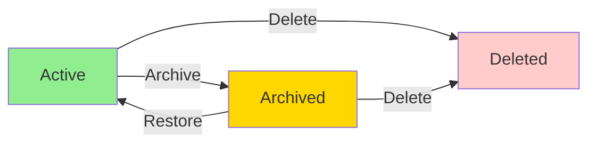

**Status Impact on Products**
| Category Status | Product Visibility | Product Classification | Search Inclusion |
|----------------|-------------------|------------------------|------------------|
| **Active** | Visible in category pages | Can be selected | Included |
| **Archived** | Hidden from category pages | Cannot be selected | Included via direct links only |
| **Deleted** | Removed from all views | Products become uncategorized | Included (as uncategorized) |

**Status Impact on Navigation**
- **Active categories**: Appear in main navigation menus, category browsing pages, and search filters
- **Archived categories**: Do not appear in navigation but preserve URL structure for existing links
- **Deleted categories**: Removed from all navigation structures and URL redirects return 404

**Administrator Status Management**
1. Only administrators can change category status
2. Status changes are logged in the audit trail
3. Bulk status changes are allowed for multiple categories
4. Status changes are applied immediately (no approval required)

## State Transitions

Define valid state transition paths for stateful concepts.

### Seller Account Approval and Suspension Workflows

### Seller Account Approval and Suspension Workflows

**Seller Approval Status Flow**
A seller's account progresses through approval states managed by administrators:
- **Pending**: Initial state after registration, awaiting administrator review
- **Approved**: Administrators have approved the seller to sell on the platform
- **Rejected**: Administrators have rejected the registration request

**Transitions**:
- New seller registration → Pending (automatic transition)
- Pending → Approved (administrator approves)
- Pending → Rejected (administrator rejects with reason)
- Rejected → Pending (seller submits new registration request)

**Seller Suspension Workflow**
Administrators can manage seller account accessibility:
- **Active**: Seller can operate normally (create products, make sales)
- **Suspended**: Seller's products are hidden from search and category listings; existing orders continue processing

**Transitions**:
- Active → Suspended (administrator suspends account)
- Suspended → Active (administrator unsuspends account)

**Business Rules**:
- Only sellers with "Approved" status can create and sell products
- Rejected sellers can view their rejection reason and submit new registration requests
- Suspended sellers can still ship existing orders and handle cancellation/refund requests
- Suspended sellers cannot create new products or edit existing products
- When a seller is suspended, their products remain in the system but are not visible to customers

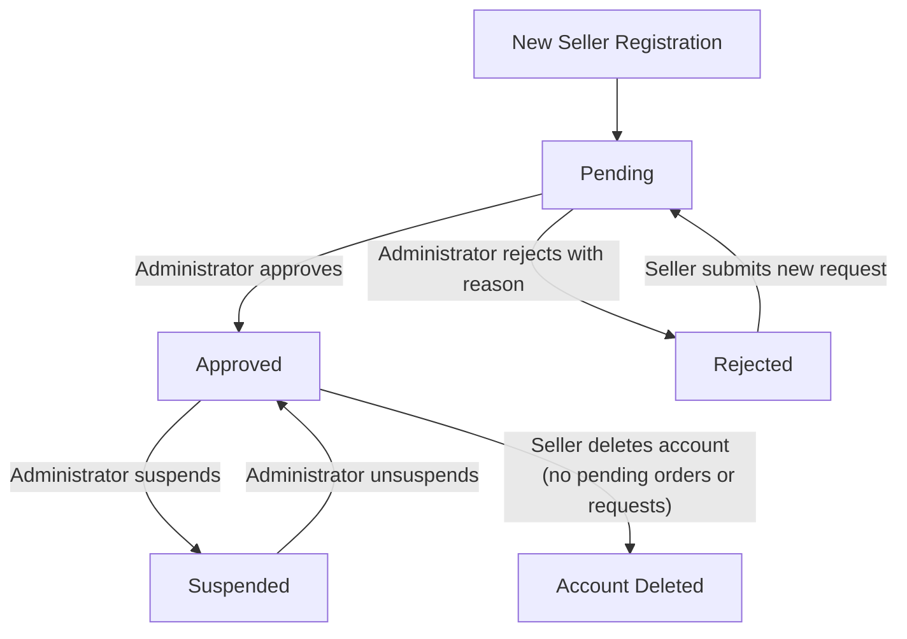

### Product and Variant Lifecycle Management

### Product and Variant Lifecycle Management

**Product Availability States**
A product progresses through availability states based on seller actions and variant presence:
- **Draft**: Product created but has no variants (not purchasable)
- **Available**: Product has at least one variant with stock > 0 (purchasable)
- **Unavailable**: Product exists but all variants have 0 stock
- **Deleted**: Seller or administrator has removed the product

**Product Deletion Conditions**
A product can only be deleted when:
- No pending order items (paid or shipped status) for any variant
- No pending cancellation or refund requests for any variant

**Variant Lifecycle**
Each product variant follows a separate lifecycle:
- **Active**: Variant exists and can be purchased
- **Out of Stock**: Stock quantity reaches 0
- **Deleted**: Seller removes the variant

**Variant Deletion Conditions**
A variant can only be deleted when:
- No pending order items (paid or shipped status) for that variant
- No pending cancellation or refund requests for that variant

**State Transitions**:
- New product creation → Draft (no variants)
- Draft → Available (seller adds first variant with stock > 0)
- Available → Unavailable (all variants reach 0 stock)
- Unavailable → Available (seller restocks any variant)
- Any state → Deleted (seller deletes product when conditions met)
- Deleted → [No return] (deleted products remain in snapshots only)

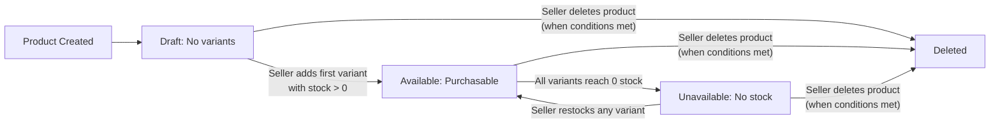

**Note**: Product and variant deletions are permanent for customer-facing listings but snapshots preserve historical state for order history and dispute resolution.

### Order Item Status Flow and Order Aggregation

### Order Item Status Flow and Order Aggregation

**Order Item Status Definitions**
Each purchased item in an order has its own status progression:
- **Paid**: Payment completed, waiting for seller to ship
- **Shipped**: Seller has shipped the item in a shipment
- **Delivered**: Item has been delivered to the customer
- **Cancelled**: Item was cancelled before shipping (or by administrator force)
- **Refunded**: Item was refunded after delivery

**Valid Order Item Status Transitions**:
- Paid → Shipped (seller creates shipment)
- Paid → Cancelled (seller approves cancellation request or administrator force-cancels)
- Shipped → Delivered (customer confirms delivery or 14-day auto-delivery)
- Delivered → Refunded (seller approves refund request or administrator force-refunds)

**Order Overall Status Calculation**
The overall order status is derived from its constituent items:
- **Paid**: All items have status "paid"
- **Shipped**: At least one item is "shipped" and none are "delivered" yet
- **Delivered**: All items are "delivered"
- **Cancelled**: All items are "cancelled"
- **Refunded**: All items are "refunded"
- **Partially Completed**: Mixed statuses (e.g., some delivered, some refunded)

**Workflow**:
1. Order placement sets all items to "paid" status
2. Sellers ship items, moving them to "shipped" status
3. Delivery confirmation moves items to "delivered" status
4. Cancellation/refund requests can interrupt this flow at appropriate stages

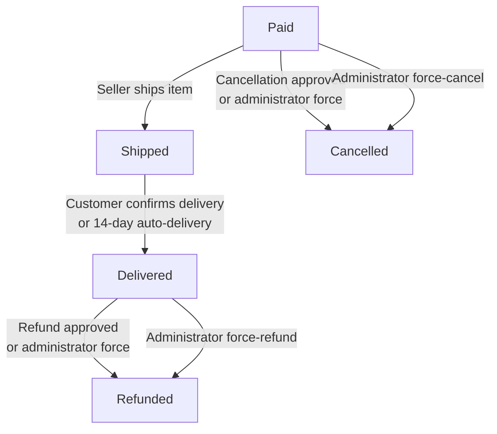

**Business Rules**:
- Only items with status "paid" can be shipped
- Only items with status "shipped" can become "delivered"
- Only items with status "delivered" can be refunded (within 7-day window)
- Only items with status "paid" can be cancelled
- Administrators can force transitions at any appropriate stage

### Cancellation and Refund Request Workflows

### Cancellation and Refund Request Workflows

**Cancellation Request Status Flow**
Customers can request cancellation for individual order items with status "paid":
- **Pending**: Customer has submitted cancellation request, awaiting seller response
- **Approved**: Seller has approved the cancellation
- **Rejected**: Seller has rejected the cancellation

**Cancellation Request Transitions**:
- Customer submits request → Pending
- Pending → Approved (seller approves)
- Pending → Rejected (seller rejects)
- Approved → [Order item status becomes "cancelled"]
- Rejected → [No change to order item status]

**Refund Request Status Flow**
Customers can request refunds for delivered items within 7 days of delivery:
- **Pending**: Customer has submitted refund request, awaiting seller response
- **Approved**: Seller has approved the refund
- **Rejected**: Seller has rejected the refund

**Refund Request Transitions**:
- Customer submits request → Pending (if within 7-day window)
- Pending → Approved (seller approves)
- Pending → Rejected (seller rejects)
- Approved → [Order item status becomes "refunded"]
- Rejected → [No change to order item status]

**Workflow Integration**:
- Cancellation requests automatically restore stock quantities when approved
- Refund requests automatically restore stock quantities when approved
- Both request types create snapshots when sellers respond
- Administrators can force-approve or force-reject either request type

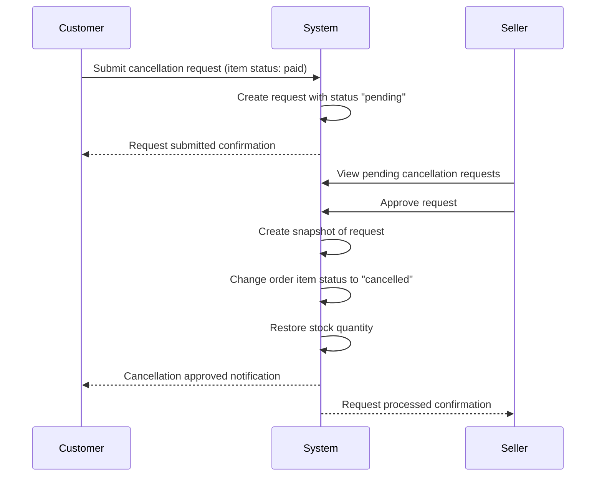

**Business Rules**:
- Cancellation requests only allowed for items with "paid" status
- Refund requests only allowed for items with "delivered" status within 7 days
- Each request creates a snapshot when the seller responds
- Approved requests automatically update order item status and restore inventory

### Inventory Stock Flow and Shipment Tracking

### Inventory Stock Flow and Shipment Tracking

**Inventory State Management**
Stock quantity is managed through inventory records, not direct updates:
- **In Stock**: Current stock quantity > 0
- **Out of Stock**: Current stock quantity = 0
- **Low Stock**: Current stock quantity ≤ predefined threshold (seller configurable)

**Inventory Flow Events**:
- **Restocking**: Seller adds inventory (positive quantity change)
- **Sale**: Order placement reduces inventory (negative quantity change)
- **Cancellation**: Approved
- **Cancellation**: Cancelled order restores stock (positive quantity change)
- **Refund**: Refunded order restores stock (positive quantity change)
- **Adjustment**: Manual correction by seller (positive or negative)

**Shipment Status Flow**
Each shipment tracks delivery progress:
- **Created**: Seller has created shipment with tracking information
- **In Transit**: Carrier has accepted the shipment
- **Out for Delivery**: Carrier is delivering to recipient
- **Delivered**: Shipment has reached the customer
- **Failed Delivery**: Delivery attempt unsuccessful

**Shipment-to-Item Status Synchronization**:
- When seller creates shipment → All included items move to "shipped" status
- When customer confirms delivery → All items in shipment move to "delivered" status
- 14-day auto-delivery → Items automatically move to "delivered" status

**Inventory State Transitions**:
- Stock > 0 → Stock = 0 (sale or adjustment depletes stock)
- Stock = 0 → Stock > 0 (restocking or cancellation/refund restores stock)
- Low stock threshold triggers seller notifications

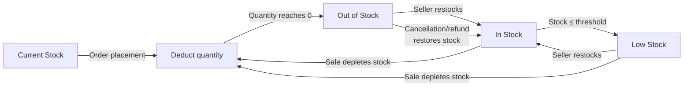

**Business Rules**:
- Current stock is calculated by summing all inventory records
- Each inventory change creates an immutable record with reason and timestamp
- Out of stock variants cannot be added to cart
- Shipments can contain multiple items from the same seller
- Different sellers always have separate shipments