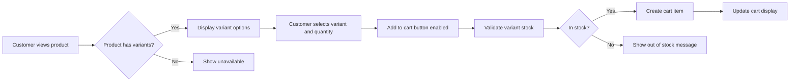
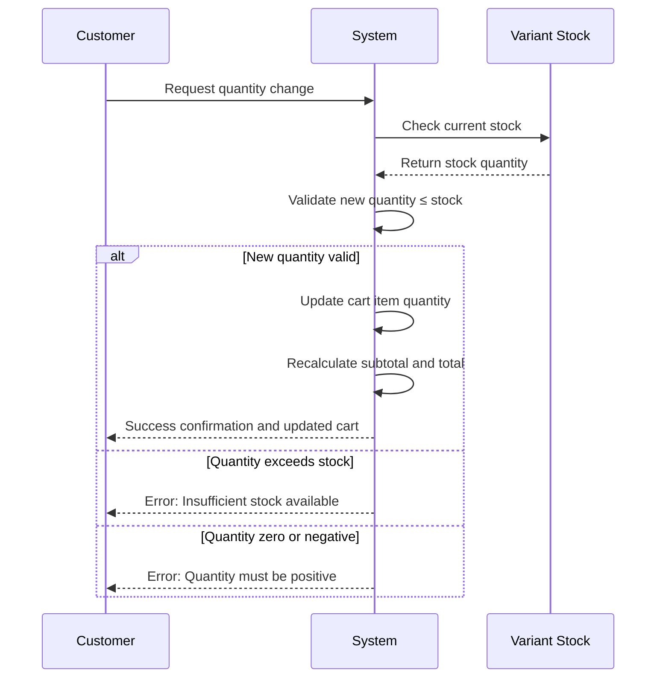
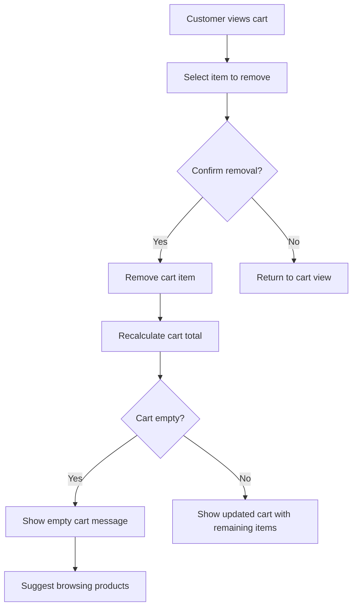
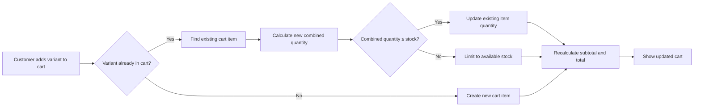
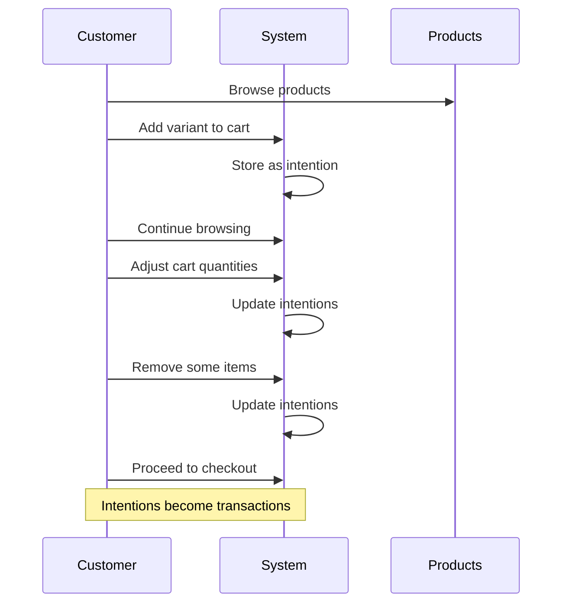
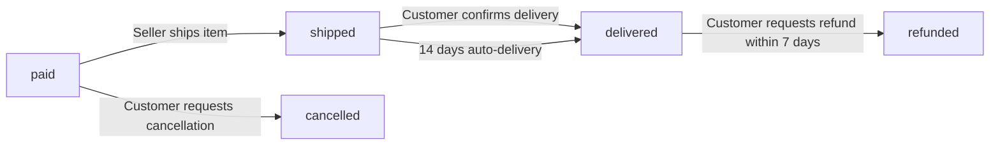
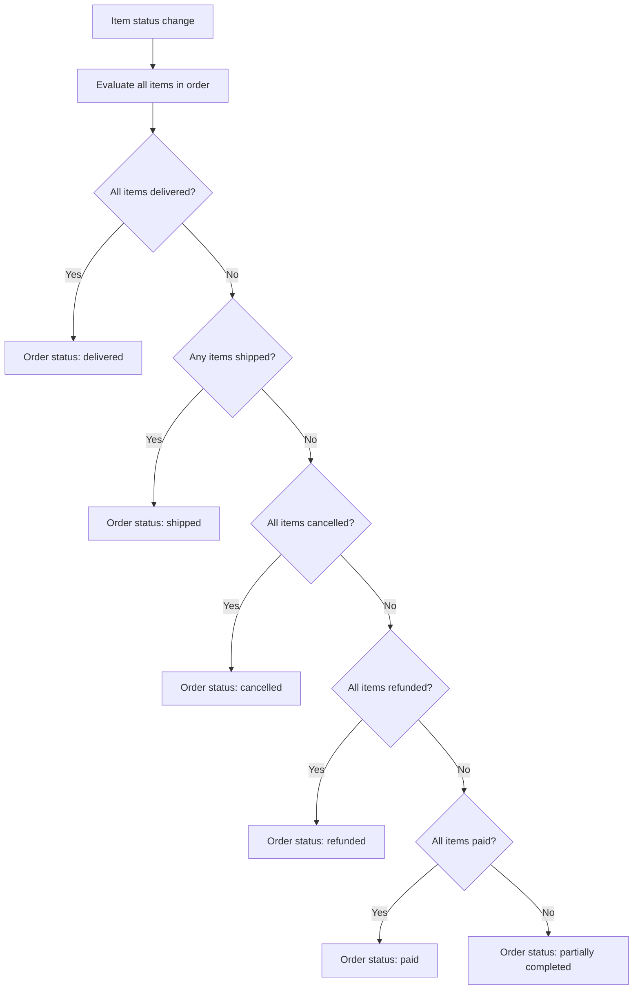

**ecommerceMall — What operations users can perform, use cases, business workflows**

What operations users can perform, use cases, business workflows

# Core Business Operations

What the system must do for each business concept.

## User Operations

Users must register before using any platform features, requiring email and password for sign-up. Customers and sellers have distinct registration flows, with seller accounts needing administrator approval before they can sell. Users can log in using their email and password combination, changing their password when needed. Account deletion rules differ: customers can delete accounts anytime, with their profile data removed but orders preserved; sellers can only delete accounts if they have no pending orders or cancellation/refund requests. The system enforces registration requirements for all platform access and manages approval workflows for sellers, including rejection reasons and resubmission capabilities. Administrators can ban users, preventing login while preserving existing order data for sellers. All user operations follow the snapshot principle for audit trails where applicable.

### User Registration

### User Registration

1. **Registration Requirement**:
   - All users must register before accessing any platform features.
   - No guest browsing is allowed; registration is mandatory to view or interact with the platform.

2. **Customer Registration**:
   - Customers can register by providing an email address and creating a password.
   - After registration, customers can immediately access customer features.

3. **Seller Registration**:
   - Sellers can register by providing an email address and creating a password.
   - New seller accounts require administrator approval before they can list or sell products.
   - During the approval period, sellers cannot create products or access seller features.

4. **Email Validation**:
   - The system validates that the email address is in a proper format.
   - The system prevents registration with an email address that is already registered in the system.

5. **Password Requirements**:
   - Users must create a password during registration.
   - The system enforces password strength requirements.

6. **Registration Confirmation**:
   - After successful registration, users are logged into the system.
   - Customers have immediate access to their account and customer features.
   - Sellers can view their approval status but cannot sell until approved.

7. **Registration Failure**:
   - If the email is already registered, the registration request is rejected.
   - If the password does not meet requirements, the registration request is rejected.
   - If required fields are missing, the registration request is rejected.

### Email and Password Login

### Email and Password Login

1. **Login Method**:
   - Users can log into the system using their registered email address and password.
   - The login process validates the credentials against the registered account.

2. **Successful Login**:
   - When credentials are correct, the user is logged into their account.
   - Customers are directed to customer features and dashboard.
   - Sellers are directed to their seller dashboard and can view their approval status.
   - Administrators are directed to the administrator dashboard.

3. **Login Failure**:
   - If the email is not registered, the login request is rejected.
   - If the password is incorrect, the login request is rejected.
   - If the account is banned, the login request is rejected.

4. **Account Status Impact**:
   - Suspended sellers can log in but cannot create or edit products.
   - Banned users cannot log in at all.
   - Pending seller accounts can log in but cannot sell.

5. **Session Management**:
   - After successful login, the user remains logged in until they log out or the session expires.
   - Users can log out manually from their account settings.

6. **Concurrent Sessions**:
   - Users cannot be logged in from multiple devices simultaneously (prevents session conflicts).

7. **Forgotten Password**:
   - Users who forget their password can initiate a password reset process.
   - Password reset requires email verification and password confirmation.

8. **Security Considerations**:
   - After multiple failed login attempts, temporary account lockout may be enforced.
   - Login attempts are monitored for suspicious activity.

### Password Change

### Password Change

1. **Password Change Request**:
   - Users can request to change their password from their account settings.
   - The change requires entering the current password for verification.

2. **Current Password Verification**:
   - The system verifies that the entered current password matches the user's current password.
   - If the current password is incorrect, the password change request is rejected.

3. **New Password Requirements**:
   - The new password must meet the system's password strength requirements.
   - The new password cannot be the same as the current password.
   - Users must confirm the new password by entering it twice.

4. **Password Update Process**:
   - Upon successful verification, the system updates the user's password to the new value.
   - The change takes effect immediately for all subsequent logins.

5. **Session Impact**:
   - Password change does not automatically log out existing sessions.
   - Existing sessions continue until they expire or the user logs out manually.

6. **Security Measures**:
   - Password changes are logged for security auditing purposes.
   - The system prevents rapid successive password changes (rate limiting).

7. **Change Confirmation**:
   - Users receive confirmation that their password has been successfully changed.
   - If the change fails, users receive an error message explaining why.

### Customer Account Deletion

### Customer Account Deletion

1. **Deletion Request**:
   - Customers can request to delete their account from their account settings.
   - The deletion request requires password confirmation for security.

2. **Deletion Rules**:
   - Customers can delete their account at any time, regardless of order status.
   - There are no restrictions based on pending orders, cancellations, or refunds.

3. **Data Preservation Rules**:
   - When a customer deletes their account, their profile information is deleted.
   - Their orders and order history are preserved for seller records and legal purposes.
   - Their reviews are preserved but displayed as "deleted user".
   - Shipping addresses associated with the account are deleted.

4. **Wishlist and Cart Impact**:
   - The customer's wishlist is deleted along with the account.
   - The customer's shopping cart is cleared and deleted.

5. **Order Preservation Details**:
   - Past orders remain in the system with the customer's information removed.
   - Order items retain their product, variant, and seller snapshots as recorded at purchase time.
   - Order tracking and shipment information remains accessible to sellers.

6. **Review Anonymization**:
   - Reviews written by the deleted customer remain visible on product pages.
   - The reviewer is displayed as "deleted user" instead of the customer's display name.
   - Review ratings continue to contribute to product average ratings.

7. **Deletion Confirmation**:
   - Once deleted, the account cannot be recovered.
   - The customer receives confirmation that their account has been deleted.
   - Any active sessions are terminated immediately upon account deletion.

### Seller Account Approval Process

### Seller Account Approval Process

1. **Approval Requirement**:
   - All new seller accounts require administrator approval before they can sell.
   - During the approval period, sellers cannot create products or access selling features.

2. **Approval Status Tracking**:
   - Sellers can view their approval status (pending, approved, or rejected).
   - The status is displayed prominently in the seller dashboard.

3. **Administrator Review**:
   - Administrators can view a list of pending seller approval requests.
   - Administrators review each request and decide to approve or reject.

4. **Approval Decision**:
   - If approved, the seller account is activated for selling.
   - The seller can immediately create products and access all seller features.
   - The approval status changes from "pending" to "approved".

5. **Rejection Handling**:
   - If rejected, administrators must provide a rejection reason.
   - The seller can view the rejection reason in their dashboard.
   - The seller's approval status changes from "pending" to "rejected".

6. **Rejected Seller Options**:
   - Rejected sellers can submit a new registration request.
   - The new request goes through the same approval process.
   - Previous rejection reasons do not automatically apply to new requests.

7. **Approval Timeline**:
   - There is no fixed timeline for approval; it depends on administrator review.
   - Sellers are notified when their status changes from pending.

8. **Post-Approval Changes**:
   - Once approved, sellers can immediately begin selling.
   - Sellers can edit their shop name, description, and logo as needed.
   - All profile edits create snapshots for audit purposes.

### Account Ban Enforcement

### Account Ban Enforcement

1. **Ban Authority**:
   - Administrators can ban customer accounts.
   - Administrators can ban seller accounts.
   - Super administrators can ban regular administrator accounts.

2. **Ban Effect on Login**:
   - Banned users cannot log into the system.
   - Login attempts with banned accounts are rejected.

3. **Ban Effect on Existing Data**:
   - For customers: All existing data (orders, reviews, etc.) is preserved.
   - For sellers: Existing orders remain for processing; products are hidden from listings.
   - For administrators: Access to administrative functions is revoked.

4. **Product Visibility for Banned Sellers**:
   - When a seller is banned, their products are hidden from search and category listings.
   - Their products cannot be purchased by customers.
   - Sellers can still process existing orders (ship items, respond to requests).
   - Banned sellers cannot create new products or edit existing products.

5. **Unban Process**:
   - Administrators can unban customer accounts, restoring login access.
   - Administrators can unban seller accounts, making products visible again.
   - Super administrators can unban regular administrator accounts.

6. **Ban Justification**:
   - Administrators should have a reason for banning accounts.
   - The reason is recorded internally but not shown to the banned user.

7. **Immediate Effect**:
   - Banning takes effect immediately upon administrator action.
   - Any active sessions of the banned user are terminated.
   - The user is logged out from all devices.

8. **Notification**:
   - Banned users receive notification that their account has been banned.
   - The notification may include the reason for the ban at administrator discretion.

### Seller Registration Resubmission

### Seller Registration Resubmission

1. **Resubmission Eligibility**:
   - Sellers whose registration was rejected can submit a new registration request.
   - There is no limit to the number of resubmission attempts.

2. **Resubmission Process**:
   - Rejected sellers can initiate a new registration request from their dashboard.
   - The request goes through the same approval process as initial registrations.

3. **Previous Rejection Context**:
   - Previous rejection reasons do not automatically apply to new requests.
   - Administrators review each new request independently.
   - Previous rejection history is visible to administrators for context.

4. **Approval Status During Resubmission**:
   - During the resubmission review period, the seller's status remains "rejected".
   - Sellers cannot sell or create products while in rejected status.
   - Sellers can view the status of their resubmission request.

5. **Notification of Resubmission Outcome**:
   - Sellers are notified when their resubmission request is approved or rejected.
   - If approved, the seller status changes to "approved" and selling features are enabled.
   - If rejected, the seller receives the new rejection reason.

6. **Resubmission Data Requirements**:
   - Sellers may need to provide updated information in their resubmission.
   - The system may prompt for clarification based on previous rejections.
   - All submitted information goes through the same validation as initial registration.

7. **Administrator Review Considerations**:
   - Administrators consider the new request on its own merits.
   - Previous rejection reasons may inform the review but do not predetermine the outcome.
   - Multiple rejections may require higher-level administrator review.

### Platform Access Enforcement

### Platform Access Enforcement

1. **Registration Requirement**:
   - All platform features require user registration and login.
   - No guest browsing or anonymous access is allowed.

2. **Role-Based Access**:
   - Customers can access customer features (browsing, shopping, orders).
   - Sellers can access seller features (product management, order fulfillment).
   - Administrators can access administrative features (user management, oversight).

3. **Approval-Gated Features**:
   - Seller selling features are gated behind administrator approval.
   - Pending sellers cannot create products or access selling tools.
   - Approved sellers have full access to selling features.

4. **Status-Based Restrictions**:
   - Banned users cannot access any platform features.
   - Suspended sellers have restricted access (can process orders but not create products).
   - Active users have full access according to their role.

5. **Feature-Specific Enforcement**:
   - Product creation requires seller account with approved status.
   - Order placement requires customer account.
   - Administrative actions require administrator account with appropriate grade.
   - Review writing requires customer account with delivered order items.

6. **Session Validation**:
   - All feature requests validate that the user is logged in.
   - Session timeouts automatically log out inactive users.
   - Expired sessions require re-authentication.

7. **Cross-Role Prevention**:
   - Users cannot simultaneously act as customer and seller in the same session.
   - Role switching requires explicit action and may require separate accounts.
   - Administrator access is separate from customer/seller roles.

8. **Access Denial Response**:
   - When access is denied, users receive a clear explanation.
   - Denied access to selling features directs pending sellers to check approval status.
   - Denied access due to banning shows appropriate messaging.

### Account Status Tracking

### Account Status Tracking

1. **Customer Account Statuses**:
   - Active: Customer can log in and use all customer features.
   - Banned: Customer cannot log in; all existing data is preserved.
   - Deleted: Account is deleted; profile data removed, orders preserved.

2. **Seller Account Statuses**:
   - Pending: Registration submitted, awaiting administrator approval.
   - Approved: Registration approved, can sell and access all seller features.
   - Rejected: Registration rejected, cannot sell but can resubmit.
   - Active: Approved and currently selling (normal operation).
   - Suspended: Temporarily restricted (products hidden, cannot create/edit products).
   - Banned: Cannot log in; products hidden; can process existing orders.
   - Deleted: Account deleted under specific conditions.

3. **Administrator Account Statuses**:
   - Active: Can perform administrative functions.
   - Banned: Cannot log in; administrative access revoked.
   - Demoted: Super administrator demoted to regular administrator.

4. **Status Visibility**:
   - Users can view their own account status in their dashboard.
   - Sellers can see approval status (pending/approved/rejected) prominently.
   - Administrators can view all user statuses in the administration panel.

5. **Status Transitions**:
   - Customer: Active → Banned (by administrator), Active → Deleted (by customer).
   - Seller: Pending → Approved (by administrator), Pending → Rejected (by administrator), Approved → Suspended (by administrator), Approved → Banned (by administrator), Approved → Deleted (by seller under conditions).
   - Administrator: Regular → Super (promotion by super admin), Super → Regular (demotion by super admin), Any → Banned (by super admin).

6. **Status Impact Determination**:
   - Each status has specific effects on platform access and capabilities.
   - Status changes take effect immediately upon administrator action.
   - Users are notified of status changes that affect their access.

7. **Status History**:
   - Account status changes are recorded for audit purposes.
   - Administrators can view the status history of any account.
   - Status change reasons are recorded where applicable (e.g., ban reason).

8. **Multi-Status Handling**:
   - Some accounts may have multiple status aspects (e.g., seller who is also suspended).
   - The most restrictive status takes precedence for access control.
   - Status combinations are handled according to predefined rules.

## CustomerProfile Operations

Customers automatically get a profile upon registration containing display name and phone number fields. Customers can edit their display name and phone number at any time through profile management interfaces. Profile information is stored alongside the user account but follows different deletion rules—when customers delete their accounts, profile data is removed while order history remains. The system ensures profile completeness by requiring display name and phone number for all customer accounts. Customers cannot view other customers' profiles directly, as profiles are personal information stores rather than public-facing entities. Profile operations are simple CRUD operations with no complex business rules beyond basic validation of contact information formats. No snapshot tracking applies to customer profiles since they don't involve financial transactions directly.

### Customer Profile Creation

### Customer Profile Creation

WHEN a customer registers successfully with email and password, THE system SHALL automatically create a customer profile for that user.

THE system SHALL initialize the customer profile with empty values for display name and phone number.

THE system SHALL associate the customer profile with the newly created user account.

WHERE a customer profile exists for a user, THE system SHALL require that the display name and phone number fields be populated before the customer can place an order.

IF a customer attempts to place an order without a complete profile (missing display name or phone number), THEN THE system SHALL prevent order placement and require profile completion.

THE system SHALL provide a profile setup interface where customers can enter their display name and phone number after registration.

WHEN viewing their profile for the first time, THE system SHALL clearly indicate which fields need to be completed.

THE system SHALL preserve the customer profile for the lifetime of the user account, except during account deletion as defined in profile deletion rules.

### Display Name Management

### Display Name Management

THE system SHALL allow customers to edit their display name through their profile management interface.

WHEN a customer updates their display name, THE system SHALL validate that the display name is not empty.

IF the display name is empty, THEN THE system SHALL reject the update and display an error message.

THE system SHALL allow display names to contain letters, numbers, spaces, and common punctuation characters.

THE system SHALL prevent display names from exceeding 100 characters in length.

THE system SHALL immediately update the display name in the customer profile after successful validation.

THE system SHALL reflect the updated display name across all customer-facing interfaces where the customer's name is displayed.

WHERE an order has been placed, THE system SHALL continue to show the display name that was used at the time of order placement in order history views.

THE system SHALL allow customers to change their display name at any time, regardless of order status.

WHILE a customer is banned, THE system SHALL prevent display name editing.

### Phone Number Management

### Phone Number Management

THE system SHALL allow customers to edit their phone number through their profile management interface.

WHEN a customer updates their phone number, THE system SHALL validate that the phone number follows a valid international format.

IF the phone number does not follow a valid format, THEN THE system SHALL reject the update and display an error message.

THE system SHALL accept phone numbers from different countries with appropriate country codes.

THE system SHALL store phone numbers in a standardized format for consistency.

THE system SHALL prevent phone numbers from exceeding 20 characters in length.

THE system SHALL immediately update the phone number in the customer profile after successful validation.

THE system SHALL use the phone number as contact information for shipping notifications and order updates.

WHERE an order has been placed, THE system SHALL continue to show the phone number that was used at the time of order placement in order history views.

THE system SHALL allow customers to change their phone number at any time, regardless of order status.

WHILE a customer is banned, THE system SHALL prevent phone number editing.

### Profile Data Lifecycle

### Profile Data Lifecycle

WHEN a customer deletes their account, THE system SHALL delete the associated customer profile information.

THE system SHALL permanently remove the display name and phone number from the customer profile.

WHILE preserving order history for legal and seller record purposes, THE system SHALL remove all personal contact information from the customer's profile.

THE system SHALL ensure that deleted profile data is not recoverable through standard system interfaces.

WHERE order history is preserved after account deletion, THE system SHALL display generic identifiers (e.g., "deleted user") instead of the customer's personal information.

THE system SHALL process profile deletion as part of the account deletion workflow, not as a separate operation.

THE system SHALL prevent profile deletion independent of account deletion - customers cannot delete their profile while keeping their account active.

WHEN a customer's account is banned by an administrator, THE system SHALL preserve the customer profile data but restrict access to profile editing functions.

### Contact Information Validation

### Contact Information Validation

WHEN a customer enters or updates contact information in their profile, THE system SHALL validate the format and completeness.

THE system SHALL require that the display name contains at least one non-whitespace character.

THE system SHALL require that the phone number follows a recognizable international phone number format.

IF the display name contains only whitespace characters, THEN THE system SHALL reject the profile update.

IF the phone number contains invalid characters (letters, special symbols not used in phone numbers), THEN THE system SHALL reject the profile update.

THE system SHALL provide clear error messages indicating which contact information field failed validation and why.

THE system SHALL perform validation both when customers attempt to save profile changes and when they attempt to place orders with incomplete profiles.

WHERE a customer profile has invalid contact information, THE system SHALL prevent order placement until the profile is corrected.

THE system SHALL allow customers to correct validation errors immediately without losing other entered data.

### Profile Completeness Requirements

### Profile Completeness Requirements

THE system SHALL require that all customer profiles have both a display name and phone number before allowing order placement.

WHEN a customer attempts to place their first order, THE system SHALL check if their profile is complete.

IF the customer profile is missing either display name or phone number, THEN THE system SHALL redirect the customer to complete their profile before proceeding with checkout.

THE system SHALL clearly indicate which profile fields are missing and required for order placement.

THE system SHALL prevent customers from bypassing profile completion requirements through direct API calls or alternative navigation paths.

WHERE a customer profile becomes incomplete (e.g., after editing and removing required information), THE system SHALL prevent further order placement until the profile is complete again.

THE system SHALL allow customers to browse products, add items to cart, and use wishlists even with incomplete profiles.

THE system SHALL only enforce profile completeness at the point of order placement, not during general platform usage.

WHILE a customer has an incomplete profile, THE system SHALL display reminders in their account dashboard about the missing information.

### Personal Information Privacy

### Personal Information Privacy

THE system SHALL restrict access to customer profiles to the profile owner and authorized administrators only.

THE system SHALL prevent customers from viewing other customers' profiles.

THE system SHALL prevent sellers from viewing customer profiles, except for order-specific contact information provided during checkout.

WHERE order information is displayed to sellers, THE system SHALL only show the contact information necessary for shipping (recipient name, phone number, address) and not the customer's full profile.

THE system SHALL ensure that customer display names are not used as public identifiers across the platform - customers are identified by their order history and reviews, not by profile information.

WHEN displaying reviews, THE system SHALL show the reviewer's display name at the time of review writing, not their current display name.

IF a customer deletes their account, THEN THE system SHALL remove their display name from any public-facing content where it was previously displayed.

THE system SHALL protect phone numbers from being exposed in public interfaces - phone numbers should only be visible to the customer, administrators, and sellers with active orders involving that customer.

WHERE customer data is accessed by administrators for support purposes, THE system SHALL log such access for audit purposes.

### Customer Identification Data

### Customer Identification Data

THE system SHALL use the customer's email address as the primary unique identifier for account purposes.

THE system SHALL use the display name as the customer-facing identifier in order confirmations, shipment notifications, and customer service interactions.

WHERE multiple identifiers exist (email, display name, phone number), THE system SHALL use the email for authentication and the display name for customer communication.

WHEN generating order documentation, THE system SHALL include both the customer's display name and order-specific contact information (shipping address recipient name and phone).

THE system SHALL maintain the historical display name used at the time of each order placement for accurate order records.

IF a customer changes their display name, THEN THE system SHALL not retroactively update display names in past orders.

THE system SHALL allow customers to be identified by their email address for administrative purposes and by their display name for customer-facing purposes.

WHERE customer identification is needed for dispute resolution, THE system SHALL provide administrators with access to both current and historical profile information.

THE system SHALL ensure that customer identification data (display name and phone number) is consistently formatted and displayed across all system interfaces.

## Address Operations

Customers can add multiple shipping addresses containing recipient name, phone number, street address, city, state/province, postal code, and country information. Each address can be edited or deleted by the customer who owns it, with deletion removing the address from available shipping options. Customers can designate one address as their default shipping address, which appears as the pre-selected option during checkout. The system validates address format and completeness before saving, ensuring all required fields are populated. During order placement, customers select a shipping address or use their default, and once an order is placed, the selected address cannot be changed for that order. Address operations support flexible shipping location management while maintaining data integrity through validation rules. No snapshots are created for address changes since addresses don't directly involve financial transactions.

### Address Creation

THE ecommerceMall system SHALL allow customers to create new shipping addresses.
WHEN a customer requests to add a shipping address, THE ecommerceMall system SHALL require the following recipient information: recipient name, phone number, street address, city, state/province, postal code, and country.
WHERE a customer provides all required recipient information, THE ecommerceMall system SHALL save the new address and associate it with the customer's profile.
IF any required recipient information is missing, THEN THE ecommerceMall system SHALL reject the address creation request with a validation error.
WHEN a customer creates their first shipping address, THE ecommerceMall system SHALL automatically designate it as the default shipping address.

### Multiple Address Management

THE ecommerceMall system SHALL allow customers to maintain multiple shipping addresses in their profile.
WHEN a customer views their address book, THE ecommerceMall system SHALL display all their shipping addresses in a list format.
WHEN a customer has multiple addresses, THE ecommerceMall system SHALL allow them to add additional shipping addresses beyond the first.
WHERE a customer attempts to create a duplicate address (identical recipient information across all fields), THEN THE ecommerceMall system SHALL reject the creation request with a duplicate warning.
THE ecommerceMall system SHALL support flexible shipping location management by allowing customers to maintain distinct addresses for different recipients or locations.

### Default Address Designation

THE ecommerceMall system SHALL allow customers to designate one shipping address as their default shipping address.
WHEN a customer designates a new default address, THE ecommerceMall system SHALL update the default status so only one address is marked as default at any time.
WHEN a customer views their address book, THE ecommerceMall system SHALL clearly indicate which address is the default shipping address.
WHERE a customer attempts to delete their default address while having other addresses, THEN THE ecommerceMall system SHALL require them to select a new default address before deletion can proceed.
IF a customer has only one address, THEN THE ecommerceMall system SHALL treat that address as the default shipping address.

### Address Validation

WHEN a customer creates or edits a shipping address, THE ecommerceMall system SHALL validate all required fields are populated.
WHEN validating a shipping address, THE ecommerceMall system SHALL ensure the street address contains sufficient detail for delivery purposes.
WHEN validating a shipping address, THE ecommerceMall system SHALL ensure the city, state/province, postal code, and country fields contain valid location information.
WHERE a customer provides an address that fails validation, THEN THE ecommerceMall system SHALL reject the request with specific error messages indicating which fields require correction.
THE ecommerceMall system SHALL validate address completeness and format before saving any changes to ensure data integrity.

### Address Deletion

THE ecommerceMall system SHALL allow customers to delete their shipping addresses.
WHEN a customer requests to delete a shipping address, THE ecommerceMall system SHALL verify the customer owns the address.
WHERE a customer attempts to delete their only remaining shipping address, THEN THE ecommerceMall system SHALL reject the deletion request and require at least one address to be maintained.
IF a customer attempts to delete a default address while having multiple addresses, THEN THE ecommerceMall system SHALL require them to select a new default address before deletion can proceed.
WHEN a shipping address is successfully deleted, THE ecommerceMall system SHALL remove the address from the customer's available shipping options.

### Checkout Address Selection

WHEN a customer proceeds to checkout, THE ecommerceMall system SHALL present their shipping addresses for selection.
WHERE a customer has a default shipping address designated, THE ecommerceMall system SHALL pre-select that address during checkout.
WHEN a customer selects a shipping address during checkout, THE ecommerceMall system SHALL validate the address is still available and owned by the customer.
IF a customer attempts to checkout without selecting a shipping address, THEN THE ecommerceMall system SHALL prevent order placement until an address is selected.
ONCE an order is successfully placed, THE ecommerceMall system SHALL prevent modification of the selected shipping address for that specific order.

### Address Format Requirements

THE ecommerceMall system SHALL require shipping addresses to include recipient name, phone number, street address, city, state/province, postal code, and country.
WHEN storing shipping addresses, THE ecommerceMall system SHALL maintain the exact formatting provided by customers for recipient information.
WHERE address format requirements are not met (e.g., missing postal code or country), THEN THE ecommerceMall system SHALL reject the address creation or edit request.
THE ecommerceMall system SHALL support international address formats through the country field, allowing customers to specify delivery locations worldwide.
WHEN displaying shipping addresses, THE ecommerceMall system SHALL present all recipient information in a readable format suitable for shipping labels.

### Recipient Information Storage

THE ecommerceMall system SHALL store complete recipient information for each shipping address, including recipient name and phone number.
WHEN a customer creates or edits a shipping address, THE ecommerceMall system SHALL preserve the exact recipient name as provided for delivery purposes.
WHEN storing shipping addresses, THE ecommerceMall system SHALL preserve the phone number as contact information for delivery notifications or issues.
THE ecommerceMall system SHALL associate recipient information with the customer who created the address, ensuring privacy and access control.
WHERE a customer edits recipient information, THE ecommerceMall system SHALL update the stored values while preserving historical addresses used in past orders.

### Shipping Location Flexibility

THE ecommerceMall system SHALL support flexible shipping location management through multiple address capability.
WHEN customers have multiple shipping addresses, THE ecommerceMall system SHALL allow them to select different addresses for different orders.
WHERE customers need to ship to different recipients or locations, THEN THE ecommerceMall system SHALL enable them to maintain distinct addresses for each scenario.
THE ecommerceMall system SHALL allow customers to manage their shipping locations independently of other profile information.
WHEN a customer's shipping needs change, THE ecommerceMall system SHALL allow them to add, edit, or remove shipping addresses as needed.

## SellerProfile Operations

Sellers create profiles with shop name, shop description, and logo image after administrator approval. Sellers can edit their shop name, description, and logo, with each edit creating a snapshot preserving previous values for audit purposes. Customers can view seller profiles on product detail pages and when browsing products, seeing shop information alongside products. The system tracks profile changes through immutable snapshots that record what changed, when, and the before/after values. When sellers delete accounts, their profiles are removed from active display but shop names in past orders are preserved for historical accuracy. Profile operations follow the snapshot principle strictly due to financial transaction implications—customers need accurate historical shop information for orders. Administrators can view profile snapshots for dispute resolution and oversight purposes.

### Seller Profile Creation

THE system SHALL allow sellers to create a profile after their account has been approved by an administrator.

THE system SHALL require sellers to provide a shop name, shop description, and optionally a logo image when creating their profile.

THE system SHALL prevent sellers with pending or rejected approval status from creating a profile.

THE system SHALL automatically associate the created profile with the seller's user account.

### Shop Name and Description Editing

WHEN a seller edits their shop name or shop description, THE system SHALL update the profile with the new values.

THE system SHALL create a snapshot of the shop name and shop description changes whenever these fields are edited.

THE system SHALL prevent sellers with suspended accounts from editing their shop name or description.

THE system SHALL record what was changed, when it was changed, and the values before and after the change in the snapshot.

### Logo Image Management

THE system SHALL allow sellers to upload a logo image for their shop profile.

THE system SHALL allow sellers to edit or replace their existing logo image.

WHEN a seller uploads, edits, or replaces their logo image, THE system SHALL create a snapshot of the logo image change.

THE system SHALL store the logo image URL in the profile and include it in snapshots for historical preservation.

### Profile Snapshot Creation

THE system SHALL create a snapshot whenever any field in a seller profile is edited.

THE system SHALL record in each snapshot: when the change was made, what was changed, and the values before and after the change.

THE system SHALL make all snapshots immutable and prevent their deletion.

THE system SHALL allow sellers to view snapshots of their own profile changes.

THE system SHALL allow administrators to view snapshots of any seller profile for dispute resolution and oversight.

### Customer Profile Viewing

THE system SHALL allow customers to view seller profiles.

THE system SHALL display the seller's shop name, shop description, and logo image when customers view a seller profile.

THE system SHALL include seller profile information on product detail pages, showing the shop name as a link to the full seller profile.

THE system SHALL prevent customers from viewing profiles of sellers with suspended accounts.

### Historical Shop Preservation in Orders

WHEN an order is placed, THE system SHALL create a snapshot of the seller profile at the time of purchase.

THE system SHALL preserve the shop name and logo image from the snapshot in all order records, even if the seller later edits or deletes their profile.

THE system SHALL display the historical shop name (from the time of purchase) in order history views for customers.

THE system SHALL preserve shop names in past orders even when a seller deletes their account.

### Profile Audit Trail

THE system SHALL maintain a complete audit trail of all seller profile changes through the snapshot system.

THE system SHALL allow sellers to view the chronological history of their profile changes.

THE system SHALL allow administrators to access the complete audit trail of any seller profile for compliance and dispute resolution purposes.

THE system SHALL ensure that the audit trail cannot be altered or deleted once created.

### Shop Information Display

THE system SHALL display seller shop information in product listings, showing the shop name alongside each product.

THE system SHALL include seller shop information in search results, showing the shop name with each product.

THE system SHALL display the seller's shop name, description, and logo when customers view a full seller profile page.

THE system SHALL hide shop information for sellers with suspended accounts from all public displays.

### Seller Brand Management

THE system SHALL allow sellers to manage their brand identity through their shop name, description, and logo image.

THE system SHALL prevent duplicate shop names to ensure each seller has a unique brand identity.

THE system SHALL allow sellers to update their brand elements (name, description, logo) as their business evolves.

THE system SHALL preserve historical brand information through snapshots for accurate representation of past transactions.

THE system SHALL maintain brand consistency by displaying the appropriate historical or current brand information based on the context (current products vs. past orders).

## Category Operations

Administrators create and manage product categories with name and description fields, including one level of subcategory nesting. Categories can be edited by administrators to update names or descriptions, with changes affecting product organization. Administrators can delete categories, making products within them uncategorized but still accessible. Customers can browse all categories and view products within specific categories or subcategories through category listings. The system organizes products hierarchically, allowing customers to navigate from main categories to subcategories to products. Category operations are administrator-exclusive for creation/modification but customer-accessible for browsing and product discovery. No snapshots track category changes since they don't directly involve financial transactions, though product categorization affects discoverability.

### Category Creation and Management by Administrators

THE system SHALL allow administrators to create product categories.

WHEN an administrator creates a new category, THE system SHALL require the administrator to provide both a name and description for the category.

WHEN an administrator edits an existing category, THE system SHALL allow updates to the category name and description.

WHERE category creation and editing, THE system SHALL restrict these operations to administrators only.

THE system SHALL prevent duplicate category names.

THE system SHALL preserve existing product-to-category assignments when a category is edited, ensuring products remain categorized correctly.

### Subcategory Nesting and Product Organization

THE system SHALL allow administrators to create subcategories with one level of nesting only.

WHEN creating a subcategory, THE system SHALL require the administrator to select a parent category for nesting.

THE system SHALL organize products hierarchically through categories and subcategories, allowing customers to navigate from main categories to subcategories to products.

THE system SHALL maintain the product organization hierarchy, ensuring products belong to exactly one category or subcategory at any time.

THE system SHALL display the category hierarchy to customers for product discovery and navigation.

### Category Browsing and Product Discovery

THE system SHALL allow customers to browse the list of all categories and subcategories.

WHEN a customer selects a category, THE system SHALL display products within that category, including products in any subcategories.

WHEN a customer selects a subcategory, THE system SHALL display only products within that specific subcategory.

THE system SHALL enable product discovery through category navigation, allowing customers to navigate from categories to products.

THE system SHALL support product organization for browsing purposes, grouping related products by category.

THE system SHALL provide category listings that customers can access without requiring registration or login.

### Category Deletion and Uncategorized Product Handling

THE system SHALL allow administrators to delete categories.

WHEN an administrator deletes a category that contains subcategories, THE system SHALL also delete all subcategories within that category.

WHEN a category is deleted, THE system SHALL make all products previously in that category uncategorized.

THE system SHALL preserve accessibility of uncategorized products for customers, allowing them to remain searchable and purchasable.

THE system SHALL handle uncategorized products by maintaining their product data but removing their category association.

THE system SHALL prevent category deletion from affecting customer access to products that were previously in the deleted category.

## Product Operations

Sellers create products with required name, description, category, and base price fields, with products belonging exclusively to the creating seller. Products can be edited by their sellers, with each edit creating a snapshot preserving the complete product state including images and variants. Sellers can delete products only if no pending order items or cancellation/refund requests exist for any variant of that product. Deleted products disappear from search and category listings but order history preserves product snapshots. Products require at least one variant to be purchasable—products with no variants show as unavailable. The system enforces product ownership rules, preventing sellers from modifying others' products. Administrators can view all products and their snapshots for oversight and can delete any product for policy violations. Product operations follow strict snapshot principles due to financial implications of purchase transactions.

### Product Creation by Sellers

WHEN a seller wants to create a new product, THE system SHALL allow the seller to create a product.
WHILE creating a product, THE system SHALL require the seller to provide a name, description, category, and base price.
WHERE the seller selects a category, THE system SHALL allow selection of a subcategory.
IF any of the required fields (name, description, category, base price) is missing, THE system SHALL reject the creation request.
THE system SHALL associate the created product exclusively with the seller who created it.
THE system SHALL ensure a product has at least one variant before it can be purchased.
WHERE a product has no variants, THE system SHALL show it as "unavailable" to customers.

### Product Field Requirements and Validation

THE system SHALL require every product to have a name.
THE system SHALL require every product to have a description.
THE system SHALL require every product to have a category.
THE system SHALL require every product to have a base price.
IF a product is created without any of these required fields, THE system SHALL reject the creation request.
THE system SHALL prevent sellers from creating products without a valid category.
THE system SHALL prevent sellers from creating products with invalid base price values (e.g., negative prices).

### Product Editing and Snapshot Creation

WHEN a seller edits any field of their own product, THE system SHALL create a snapshot that preserves the complete previous state of the product.
THE product snapshot SHALL include all product fields (name, description, category, base price).
THE product snapshot SHALL include snapshots of all variants at the moment of editing.
THE product snapshot SHALL include all product images and their display order.
THE system SHALL make snapshots immutable and prevent their deletion.
Sellers SHALL be able to view snapshots of their own products.
Administrators SHALL be able to view snapshots of any product.
Snapshots SHALL be preserved even after a product is deleted.

### Product Deletion Restrictions

WHEN a seller attempts to delete a product, THE system SHALL check if there are any pending order items (paid or shipped status) for any variant of that product.
IF there are pending order items for any variant of the product, THE system SHALL prevent deletion.
THE system SHALL check if there are any pending cancellation or refund requests for any variant of that product.
IF there are pending cancellation or refund requests, THE system SHALL prevent deletion.
WHEN a seller successfully deletes a product, THE system SHALL delete all variants of that product.
THE system SHALL delete all inventory records associated with variants of the deleted product.
THE system SHALL remove the deleted product from search results and category listings.
THE system SHALL preserve order history and snapshots of the deleted product.

### Product Ownership Enforcement

THE system SHALL allow only the seller who created a product to edit that product.
THE system SHALL prevent sellers from editing products created by other sellers.
THE system SHALL allow only the product owner (seller) to delete their own products (subject to deletion restrictions).
THE system SHALL prevent sellers from deleting products created by other sellers.
Sellers SHALL only be able to view snapshots of their own products.
THE system SHALL enforce that product ownership cannot be transferred between sellers.

### Purchasable Product Requirements

THE system SHALL require a product to have at least one variant to be purchasable.
WHERE a product has no variants, THE system SHALL show it as "unavailable" to customers.
Customers SHALL not be able to add variants-less products to their cart.
Customers SHALL not be able to check out with variants-less products.
Sellers SHALL be able to create products without variants initially, but these products SHALL not be purchasable until at least one variant is added.

### Administrator Product Oversight

Administrators SHALL be able to view all products on the platform.
Administrators SHALL be able to view snapshots of any product, regardless of seller.
Administrators SHALL be able to delete any product for policy violations.
WHEN an administrator deletes a product, THE system SHALL remove it from search results and category listings.
Administrators SHALL be able to access deleted products' snapshots for historical reference.
Administrators SHALL be able to view products from suspended sellers.
THE system SHALL hide products from suspended sellers from search and category listings.
Products from suspended sellers SHALL not be purchasable.

### Product Visibility Rules

THE system SHALL display products in search results and category listings only when they are active.
THE system SHALL hide deleted products from search results and category listings.
THE system SHALL hide products from suspended sellers from search results and category listings.
Products with no variants SHALL be visible in search results but marked as "unavailable".
Products that are out of stock (all variants have zero stock) SHALL remain visible but marked as "out of stock".
THE system SHALL allow customers to browse all active products regardless of seller approval status (approved sellers only).

### Snapshot Preservation on Deletion

WHEN a product is deleted, THE system SHALL preserve all snapshots of that product.
Product snapshots SHALL remain accessible to the original seller who created the product.
Product snapshots SHALL remain accessible to administrators.
Order history SHALL preserve product snapshots associated with purchased items.
THE system SHALL ensure that snapshots are never deleted, even when the original product is deleted.
Snapshots SHALL be used for dispute resolution and historical reference.
THE system SHALL maintain the relationship between snapshots and any associated order items.

## ProductImage Operations

Sellers upload multiple images for each product to showcase items from different angles or contexts. Images can be reordered by sellers, with the first image serving as the main thumbnail displayed in listings. Sellers can delete images from products, removing visual content but preserving historical snapshots if previously part of ordered items. Image changes are included in product snapshots, capturing the visual state at each edit point for historical accuracy. The system displays product images on detail pages with gallery navigation and uses the first image as the thumbnail in search/category results. Image operations support visual merchandising while maintaining audit trails through the snapshot system for financial transparency. No separate image snapshots exist—image changes trigger product-level snapshots that include the complete product state.

### Product Image Upload

### Product Image Upload

THE system SHALL allow sellers to upload images for products they own.

WHEN a seller uploads an image for a product, THE system SHALL store the image and associate it with the product.

WHERE multiple image upload, THE system SHALL support uploading multiple images for the same product.

IF a seller attempts to upload an image for a product they do not own, THEN THE system SHALL reject the request.

WHEN an image is uploaded successfully, THE system SHALL create a product snapshot that includes the new image as part of the product's complete state.

### Multiple Image Support

### Multiple Image Support

THE system SHALL allow sellers to associate multiple images with a single product.

THE system SHALL display all uploaded images for a product on the product detail page.

WHERE image management, THE system SHALL provide functionality for sellers to manage the set of images associated with their products.

WHEN viewing a product listing in search results or category pages, THE system SHALL display the first image in the product's image list as the thumbnail.

WHEN a product has no images, THE system SHALL display a placeholder image in place of a product thumbnail.

### Image Reordering Functionality

### Image Reordering Functionality

THE system SHALL allow sellers to reorder the images associated with their products.

WHEN a seller reorders product images, THE system SHALL update the display order of images.

WHEN the image order is changed, THE system SHALL treat the first image in the order as the main thumbnail image for product listings.

WHEN viewing a product detail page, THE system SHALL display images in the order specified by the seller.

WHEN a seller reorders images, THE system SHALL create a product snapshot that captures the new image order as part of the product's complete state.

### Thumbnail Designation Rules

### Thumbnail Designation Rules

THE system SHALL automatically designate the first image in a product's image list as the thumbnail image.

WHEN the image order changes, THE system SHALL update the thumbnail to be the new first image.

WHEN a seller deletes the first image, THE system SHALL automatically promote the next image in the order to become the new thumbnail.

WHERE thumbnail display, THE system SHALL use the thumbnail image for product listings in search results and category pages.

WHEN a product has no images, THE system SHALL not display a thumbnail in listings.

### Image Deletion Process

### Image Deletion Process

THE system SHALL allow sellers to delete images from their products.

WHEN a seller deletes an image, THE system SHALL remove the image from the product's image list.

IF a seller attempts to delete an image from a product they do not own, THEN system SHALL reject the request.

WHEN the first image (thumbnail) is deleted, THE system SHALL automatically promote the next image in the order to become the new thumbnail.

WHEN a seller deletes the only remaining image from a product, THE system SHALL treat the product as having no images.

WHEN an image is deleted, THE system SHALL create a product snapshot that captures the removal of the image as part of the product's complete state.

### Visual Snapshot Inclusion

### Visual Snapshot Inclusion

THE system SHALL include product images as part of product snapshots.

WHEN a product snapshot is created due to image changes (upload, reorder, or deletion), THE system SHALL capture the complete set of images and their order at that moment.

THE system SHALL preserve product images in snapshots even after the images are deleted from the current product state.

WHERE product snapshots are viewed, THE system SHALL display the images that were part of the product at the time the snapshot was created.

WHEN viewing an order item snapshot, THE system SHALL display the product images that were part of the product at the time of purchase.

### Product Gallery Display

### Product Gallery Display

THE system SHALL display all product images in a gallery format on the product detail page.

THE system SHALL display product images in the order specified by the seller.

WHERE product gallery navigation, THE system SHALL provide functionality for customers to navigate between images.

THE system SHALL display the first image in the product's image list as the primary/main image in the gallery.

WHEN a product has no images, THE system SHALL display a placeholder in the product gallery.

WHEN viewing a product with multiple images, THE system SHALL provide thumbnail navigation for all images in the gallery.

### Merchandising Image Management

### Merchandising Image Management

THE system SHALL allow sellers to manage product images for merchandising purposes.

WHERE visual merchandising, THE system SHALL support sellers in showcasing products from different angles or contexts through multiple images.

THE system SHALL provide sellers with tools to arrange images to best present their products.

WHEN sellers manage product images, THE system SHALL maintain the visual state as part of the product's complete business record.

WHERE product presentation, THE system SHALL use product images to enhance customer shopping experience and product discovery.

### Image Audit Trail

### Image Audit Trail

THE system SHALL maintain a complete audit trail of all image changes through product snapshots.

THE system SHALL record when image changes were made, what was changed, and the values before and after.

WHERE image audit, THE system SHALL allow relevant parties (product owners and administrators) to view the history of image changes.

THE system SHALL preserve image changes in immutable snapshots that cannot be deleted.

WHEN viewing product snapshots, THE system SHALL display the complete image state at each historical point.

WHERE dispute resolution, THE system SHALL provide image change history as part of the complete product audit trail.

## ProductVariant Operations

Sellers add variants to products representing specific option combinations like color/size with SKU code, option values, optional price override, and required stock quantity. Variants can be edited by sellers, with each edit creating a snapshot preserving the variant state for audit purposes. Sellers can delete variants only if no pending order items or cancellation/refund requests exist for that specific variant. Each variant maintains its own stock quantity calculated from inventory history records, not snapshots. The system requires products to have at least one variant to be purchasable, showing products without variants as unavailable. Variant operations follow strict snapshot rules due to price and option changes affecting customer purchases. Out-of-stock variants cannot be added to carts, and deleted variants are removed from purchase options while preserving historical order data.

### Variant Creation with Options

Sellers can create product variants for their existing products.
When creating a variant, sellers must specify:
- SKU code (unique identifier, required)
- Option values that define the variant (e.g., color: "Red", size: "Large")
- Stock quantity (required, starts at 0)
- Price (optional; if not provided, inherits the product's base price)

Variants represent specific combinations of options that make a product purchasable (e.g., "Red / Large", "Blue / Small").
A product must have at least one variant to be available for purchase.

Business rules:
- Sellers can only create variants for their own products
- The SKU code must be unique across all variants in the system
- Option values must be specified for all relevant product dimensions (color, size, etc.)
- The stock quantity cannot be negative
- If a price is specified, it overrides the product's base price for that variant

Error conditions:
- If the product does not exist or belongs to another seller, the request is rejected
- If the SKU code is already in use by another variant, the request is rejected
- If required fields (SKU code, stock quantity) are missing, the request is rejected
- If option values are missing, the request is rejected

### SKU Code Management

Each product variant is identified by a unique SKU (Stock Keeping Unit) code.
The system must ensure SKU code uniqueness across all variants.

Business rules:
- SKU codes are assigned by sellers when creating variants
- SKU codes cannot be changed after variant creation (to maintain traceability)
- The system must prevent duplicate SKU codes across all variants
- SKU codes are used to identify variants in inventory, orders, and shipments

Requirements:
- When creating a variant, the system must verify the SKU code is unique
- If a duplicate SKU code is detected, the variant creation fails
- SKU codes must be preserved in all snapshots and historical records
- When searching or filtering by variant, SKU code can be used as an identifier

Error conditions:
- If a seller attempts to use a duplicate SKU code, the variant creation is rejected
- If the SKU code format is invalid (according to business rules defined elsewhere), the request is rejected

### Variant Price Override

Variants can have individual prices that override the product's base price.

Business rules:
- When creating or editing a variant, sellers can specify a price
- If a price is specified, that variant uses its own price instead of the product's base price
- If no price is specified, the variant inherits the product's base price
- Price overrides apply only to the specific variant, not to other variants of the same product
- When a variant's price is edited, a snapshot is created to preserve the price history

Requirements:
- The system must track whether a variant uses an overridden price or inherits the base price
- When displaying variant prices, show the actual price (overridden if set, otherwise base price)
- When a product's base price changes, variants with overridden prices remain unchanged
- When a variant with overridden price is added to a cart or purchased, the overridden price is used

State management:
- If a variant has an overridden price and that price is removed, the variant reverts to inheriting the base price
- Price changes create snapshots for audit purposes (as defined in the Snapshot Principle)

### Variant Edit Snapshots

Whenever a variant is edited, a snapshot is created to preserve the previous state.
This is required for audit purposes due to financial transactions involving variants.

Business rules:
- Every edit to a variant (SKU code, option values, price, stock quantity) creates a snapshot
- Snapshots record: when the change was made, what was changed, and the values before and after
- Snapshots are immutable and cannot be deleted
- Variant snapshots are linked to the variant and preserved even if the variant is deleted

Requirements:
- When a seller edits a variant, the system must:
  1. Capture the current state of all variant fields
  2. Apply the changes
  3. Create a snapshot with the before/after values and timestamp
- Sellers can view snapshots of their own variants
- Administrators can view snapshots of any variant
- Snapshots must include all variant fields (SKU code, option values, price, stock quantity)
- When a variant is deleted, its snapshots are preserved for historical reference

Snapshot access:
- Sellers can view snapshots of their variants for dispute resolution and audit trails
- Administrators can view any variant's snapshots for platform oversight

### Variant Deletion Restrictions

Variants can only be deleted under specific conditions to protect customer transactions.

Business rules:
A seller can delete a variant only if:
- There are no pending order items (with status "paid" or "shipped") for that variant
- There are no pending cancellation requests for that variant
- There are no pending refund requests for that variant

If any of these conditions exist, the variant cannot be deleted.

Requirements:
- Before allowing deletion, the system must check for:
  1. Order items with the variant in "paid" or "shipped" status
  2. Pending cancellation requests for order items containing the variant
  3. Pending refund requests for order items containing the variant
- If any of these exist, the deletion request is rejected
- When a variant is deleted:
  - It is removed from product listings and search results
  - It cannot be added to new carts
  - Existing order items referencing the variant remain (with preserved snapshots)
  - The variant's inventory records are deleted
  - The variant's snapshots are preserved
- Products with all variants deleted become unavailable for purchase

Error conditions:
- If a seller attempts to delete a variant with pending transactions, the request is rejected
- If a seller attempts to delete a variant they do not own, the request is rejected

### Stock Quantity Independence

Each variant maintains its own independent stock quantity.
Stock is not shared between variants, even for the same product.

Business rules:
- Each variant has its own stock quantity field
- Stock quantities are managed through inventory records (not snapshots)
- Current stock is calculated by summing all inventory records for that variant
- Inventory changes include: restocking (positive), orders (negative), adjustments (positive/negative), cancellations (positive)
- When a variant's stock reaches 0, it is shown as "out of stock"

Requirements:
- The system must track stock per variant, not per product
- When displaying variant availability, show stock status per variant
- When processing orders, deduct stock from the specific variant purchased
- When processing cancellations/refunds, restore stock to the specific variant
- Sellers can view and manage stock for each variant independently
- Inventory records must include: quantity change, reason, and timestamp

Stock calculations:
- Initial stock is 0 when a variant is created
- Stock increases through restocking operations
- Stock decreases through order placement
- Stock can be adjusted manually by sellers (with reason recorded)
- Current stock = sum of all quantity changes in inventory records

### Purchasable Product Requirement

A product must have at least one variant with positive stock to be purchasable.

Business rules:
- Products without any variants are visible but shown as "unavailable"
- Products with variants but all variants have 0 stock are shown as "out of stock"
- Only products with at least one variant having positive stock are purchasable
- When a product's last variant is deleted or reaches 0 stock, the product becomes unavailable

Requirements:
- When displaying products in search results or category listings:
  - Show availability status (available, out of stock, unavailable)
  - For products with multiple variants: show availability based on best-case scenario
- When a customer tries to add a product to cart:
  - They must select a specific variant
  - If the selected variant has 0 stock, prevent addition to cart
  - If no variants have stock, show product as unavailable
- Sellers must create at least one variant before customers can purchase the product
- When a variant's stock changes from 0 to positive, the product becomes available (if it has no other available variants)

Product availability logic:
- Available: At least one variant has positive stock
- Out of stock: Has variants but all have 0 stock
- Unavailable: Has no variants
- The availability status affects product visibility in search and purchase options

### Out-of-Stock Prevention

Out-of-stock variants cannot be added to shopping carts.

Business rules:
- When a variant's stock quantity is 0, it is considered "out of stock"
- Out-of-stock variants cannot be added to new shopping carts
- Existing cart items for out-of-stock variants are marked as unavailable
- Customers cannot proceed to checkout with out-of-stock items in their cart

Requirements:
- When a customer tries to add a variant to cart:
  - Check current stock quantity
  - If stock is 0, prevent addition and show "out of stock" message
  - If stock is positive but less than requested quantity, allow addition up to available stock
- For items already in cart:
  - Regularly check stock status
  - Mark items as unavailable if stock reaches 0
  - Show warnings if stock is insufficient for the cart quantity
- During checkout:
  - Validate all cart items have sufficient stock
  - Prevent checkout if any item is out of stock
  - Show clear error messages for out-of-stock items

Stock validation flow:
1. Cart addition: Check stock > 0
2. Cart viewing: Show stock warnings if quantity > available stock
3. Checkout: Verify all items have sufficient stock
4. Order placement: Reserve stock immediately upon successful payment

Automatic updates:
- When stock changes, update cart item availability status
- When a variant is deleted, mark corresponding cart items as unavailable

### Option Combination Representation

Variants represent specific combinations of product options (e.g., color and size).

Business rules:
- Each variant is defined by a set of option values
- Option values are key-value pairs (e.g., color: "Red", size: "Large")
- The combination of option values uniquely identifies a variant within a product
- Different products can have different option sets (some products may have only color, others may have color and size)

Requirements:
- When creating a variant, sellers must specify values for all relevant options
- The system must ensure option value combinations are unique within a product (no duplicate combinations)
- When displaying variants to customers:
  - Show the option values that define each variant
  - Group variants by product, showing all available combinations
  - Highlight which combinations are in stock vs out of stock
- For products with multiple option dimensions:
  - Show a matrix or selection interface
  - Guide customers to select all required options
  - Update price and availability based on selected combination

Option management:
- Option definitions (like "color", "size") are implied by the variant data structure
- Each variant stores its specific values for these options
- When editing a variant, option values can be changed (creating a snapshot)
- When deleting a variant, its option combination is removed from available choices

Display logic:
- On product detail pages, show all available option combinations
- For each combination, show: price, stock status, and SKU code
- Allow customers to select their desired combination before adding to cart

## InventoryRecord Operations

Inventory records track stock quantity changes with positive values for restocking and negative values for orders/adjustments, plus reason and timestamp. Sellers add inventory through restocking operations with quantity and reason, creating positive inventory records. Sellers can subtract inventory through adjustments with quantity and reason, creating negative inventory records for losses. Order placement automatically creates negative inventory records, while cancellation/refund creates positive records to restore stock. Current stock is calculated by summing all inventory records for each variant, not maintained as a separate field. Sellers can view full inventory history for each variant to track stock movements over time. The system prevents out-of-stock variants from being added to carts and shows stock status on product pages. Inventory records are immutable audit trails distinct from snapshots, focusing on quantity flow rather than state preservation.

### Inventory Record Creation

### Inventory Record Creation

**Ubiquitous Requirements**

WHEN THE system creates any inventory record, THE system SHALL record:
- The quantity change (positive for restocking, negative for orders/adjustments)
- The reason for the quantity change
- The timestamp when the change occurred
- The product variant to which the inventory record belongs

WHEN THE system creates any inventory record, THE system SHALL preserve the record as immutable (it cannot be modified or deleted after creation).

**Event-driven Requirements**

WHEN a seller performs a restocking operation, THE system SHALL create an inventory record with positive quantity change.

WHEN a seller performs an inventory adjustment (subtraction), THE system SHALL create an inventory record with negative quantity change.

WHEN an order is placed successfully, THE system SHALL create inventory records with negative quantity changes for each purchased variant.

WHEN an order item is cancelled or refunded, THE system SHALL create inventory records with positive quantity changes to restore stock.

**State-driven Requirements**

WHILE tracking stock movements for audit purposes, THE system SHALL maintain a complete history of all inventory records.

**Unwanted Behavior Requirements**

IF an attempt is made to modify an existing inventory record, THEN THE system SHALL reject the modification and preserve record immutability.

IF an attempt is made to delete an inventory record, THEN THE system SHALL reject the deletion and preserve record permanence.

**Optional Requirements**

WHERE inventory records are created, THE system SHALL associate them with the specific product variant involved in the transaction.

WHERE inventory records are created, THE system SHALL maintain referential integrity to ensure records always link to valid product variants (unless the variant has been deleted for non-pending reasons).

### Restocking Operations

### Restocking Operations

**Ubiquitous Requirements**

THE system SHALL allow sellers to add inventory (restock) for their product variants.

**Event-driven Requirements**

WHEN a seller performs a restocking operation, THE system SHALL require the seller to specify:
- The quantity to add (must be positive)
- The reason for restocking

WHEN a seller successfully completes a restocking operation, THE system SHALL create an inventory record with positive quantity change.

WHEN a seller successfully completes a restocking operation, THE system SHALL update the current stock quantity for that variant based on the inventory record sum.

**State-driven Requirements**

WHILE a seller is performing a restocking operation, THE system SHALL validate that the seller owns the product variant being restocked.

**Unwanted Behavior Requirements**

IF a seller attempts to restock a quantity that is zero or negative, THEN THE system SHALL reject the restocking operation.

IF a seller attempts to restock a product variant they do not own, THEN THE system SHALL reject the restocking operation.

IF a seller attempts to restock a deleted product variant, THEN THE system SHALL reject the restocking operation.

**Optional Requirements**

WHERE sellers perform restocking operations, THE system SHALL provide confirmation of the updated stock quantity.

### Inventory Adjustment Process

### Inventory Adjustment Process

**Ubiquitous Requirements**

THE system SHALL allow sellers to subtract inventory (adjustment/loss) for their product variants.

**Event-driven Requirements**

WHEN a seller performs an inventory adjustment, THE system SHALL require the seller to specify:
- The quantity to subtract (must be positive, representing amount to remove)
- The reason for the adjustment

WHEN a seller successfully completes an inventory adjustment, THE system SHALL create an inventory record with negative quantity change.

WHEN a seller successfully completes an inventory adjustment, THE system SHALL update the current stock quantity for that variant based on the inventory record sum.

**State-driven Requirements**

WHILE a seller is performing an inventory adjustment, THE system SHALL validate that the current stock is sufficient for the adjustment.

**Unwanted Behavior Requirements**

IF a seller attempts to adjust (subtract) more inventory than currently available in stock, THEN THE system SHALL reject the adjustment operation.

IF a seller attempts to adjust inventory with a zero or negative quantity, THEN THE system SHALL reject the adjustment operation.

IF a seller attempts to adjust inventory for a product variant they do not own, THEN THE system SHALL reject the adjustment operation.

IF a seller attempts to adjust inventory for a deleted product variant, THEN THE system SHALL reject the adjustment operation.

**Optional Requirements**

WHERE sellers perform inventory adjustments, THE system SHALL provide confirmation of the updated stock quantity.

### Automatic Stock Management

### Automatic Stock Management

**Ubiquitous Requirements**

THE system SHALL automatically manage stock quantities through inventory records for order-related events.

**Event-driven Requirements**

WHEN an order is placed successfully, THE system SHALL automatically create negative inventory records for each purchased variant, with the quantity equal to the purchased quantity.

WHEN an order item is cancelled, THE system SHALL automatically create a positive inventory record to restore the stock quantity for that variant.

WHEN an order item is refunded, THE system SHALL automatically create a positive inventory record to restore the stock quantity for that variant.

WHEN a cancellation request is approved, THE system SHALL automatically create a positive inventory record for the cancelled item.

WHEN a refund request is approved, THE system SHALL automatically create a positive inventory record for the refunded item.

**State-driven Requirements**

WHILE processing order placement, THE system SHALL check that sufficient stock exists before creating inventory records and completing the order.

WHILE processing cancellation or refund requests, THE system SHALL only create inventory records after the request is approved.

**Unwanted Behavior Requirements**

IF insufficient stock exists for an order placement, THEN THE system SHALL prevent the order from being placed.

IF an attempt is made to cancel or refund an order item that does not have appropriate status, THEN THE system SHALL not create inventory records.

**Optional Requirements**

WHERE automatic stock management occurs, THE system SHALL record the reason as "order placement", "cancellation", or "refund" as appropriate.

WHERE inventory records are created automatically, THE system SHALL associate them with the specific order item that triggered the creation.

### Stock Calculation and History

### Stock Calculation and History

**Ubiquitous Requirements**

THE system SHALL calculate current stock quantity for each product variant by summing all inventory records for that variant.

**Event-driven Requirements**

WHEN any inventory record is created for a product variant, THE system SHALL recalculate the current stock quantity for that variant.

WHEN a seller views inventory history for a product variant, THE system SHALL display all inventory records for that variant in chronological order.

**State-driven Requirements**

WHILE displaying stock quantity on product pages, THE system SHALL show the calculated current stock.

WHILE a seller is viewing inventory history, THE system SHALL show each record with:
- Quantity change (positive or negative)
- Reason for change
- Timestamp of change
- Associated order or adjustment details when applicable

**Unwanted Behavior Requirements**

IF no inventory records exist for a product variant, THEN THE system SHALL display current stock as zero.

IF a product variant is deleted, THEN THE system SHALL preserve all inventory records associated with that variant for historical purposes.

**Optional Requirements**

WHERE sellers view inventory history, THE system SHALL provide filtering options by date range and reason type.

WHERE current stock is displayed, THE system SHALL update the display in real-time as inventory records are created.

### Out-of-Stock Prevention

### Out-of-Stock Prevention

**Ubiquitous Requirements**

THE system SHALL prevent customers from adding out-of-stock variants to their cart.

**Event-driven Requirements**

WHEN a customer attempts to add a variant to their cart, THE system SHALL check if current stock is greater than zero.

WHEN current stock reaches zero for a variant, THE system SHALL mark that variant as "out of stock" on product pages.

WHEN a variant is out of stock, THE system SHALL prevent that variant from being added to any new carts.

**State-driven Requirements**

WHILE a variant has zero current stock, THE system SHALL display it as "out of stock" and prevent addition to cart.

WHILE items exist in a customer's cart, THE system SHALL warn the customer if the stock quantity for any variant becomes less than the cart quantity.

**Unwanted Behavior Requirements**

IF a customer attempts to add an out-of-stock variant to their cart, THEN THE system SHALL reject the addition.

IF a variant becomes out of stock while in a customer's cart, THEN THE system SHALL mark it as unavailable in the cart but not automatically remove it.

IF a variant is deleted while in a customer's cart, THEN THE system SHALL mark it as unavailable in the cart.

**Optional Requirements**

WHERE stock levels are displayed, THE system SHALL clearly indicate "in stock" or "out of stock" status.

WHERE cart items have insufficient stock, THE system SHALL show a warning indicating the available quantity.

## Wishlist Operations

Customers add products (not specific variants) to their wishlists for future consideration or purchase planning. Customers can view their wishlists with paginated displays showing products with basic information like name and image. Products can be removed from wishlists by customers when no longer desired or after purchase. The system automatically removes products from all wishlists when sellers delete those products, maintaining data cleanliness. Wishlists are personal to each customer and not shared or visible to other users or sellers. No snapshots track wishlist changes since they don't involve financial transactions or require audit trails. Wishlist operations support customer shopping experience without complex business rules or validation requirements. The system preserves wishlist items across sessions but clears deleted products to prevent broken references.

### Wishlist Creation and Product Addition

### Wishlist Creation and Product Addition

THE ecommerceMall SHALL automatically create a personal wishlist for each registered customer upon successful registration.

WHEN a customer is viewing a product detail page, THE ecommerceMall SHALL allow the customer to add that product to their wishlist.

WHERE adding a product to the wishlist, THE ecommerceMall SHALL add only the product reference (not specific variants) to the wishlist.

IF a product has no variants or is unavailable for purchase, THE ecommerceMall SHALL still allow customers to add it to their wishlist.

IF a product has already been added to the customer's wishlist, THE ecommerceMall SHALL prevent duplicate entries of the same product.

WHEN a customer adds a product to their wishlist, THE ecommerceMall SHALL confirm the addition with a success notification.

### Wishlist Viewing and Browsing

### Wishlist Viewing and Browsing

WHEN a customer navigates to their wishlist, THE ecommerceMall SHALL display all products in their wishlist with pagination.

WHERE displaying wishlist items, THE ecommerceMall SHALL show for each product:
- The product name
- The main product image (thumbnail)
- The base price (or price range if variants have different prices)
- The seller's shop name
- The average rating and total review count (if reviews exist)

WHILE viewing the wishlist, THE ecommerceMall SHALL allow customers to navigate through multiple pages using pagination controls.

WHEN there are no items in the wishlist, THE ecommerceMall SHALL display an appropriate message indicating the wishlist is empty.

WHERE a product in the wishlist has been deleted by the seller, THE ecommerceMall SHALL indicate that the product is no longer available.

### Wishlist Item Management and Removal

### Wishlist Item Management and Removal

WHEN a customer is viewing their wishlist, THE ecommerceMall SHALL allow them to remove any product from their wishlist.

WHEN a customer removes a product from their wishlist, THE ecommerceMall SHALL confirm the removal with a success notification.

WHEN a customer removes a product from their wishlist, THE ecommerceMall SHALL immediately remove it from the displayed list without requiring page refresh.

WHERE a customer has removed a product from their wishlist, THE ecommerceMall SHALL not create any snapshot or audit record for this action since wishlist changes do not involve financial transactions.

WHEN a customer purchases a product from their wishlist, THE ecommerceMall SHALL not automatically remove it from the wishlist (customers must manually remove purchased items if desired).

### Automatic Wishlist Cleanup

### Automatic Wishlist Cleanup

WHEN a seller deletes a product from the platform, THE ecommerceMall SHALL automatically remove that product from all customers' wishlists.

WHEN a product is automatically removed from wishlists due to seller deletion, THE ecommerceMall SHALL not send notifications to customers about this removal.

WHILE synchronizing product deletions with wishlists, THE ecommerceMall SHALL ensure that deleted products do not appear in any customer's wishlist view.

IF a deleted product is later restored (if such functionality exists), THE ecommerceMall SHALL not automatically re-add it to customers' wishlists.

WHERE a product becomes unavailable due to seller suspension rather than deletion, THE ecommerceMall SHALL keep the product in customers' wishlists but indicate its unavailable status.

### Wishlist Privacy and Personal Storage

### Wishlist Privacy and Personal Storage

THE ecommerceMall SHALL maintain each customer's wishlist as private and personal storage of shopping preferences.

WHILE storing wishlist data, THE ecommerceMall SHALL ensure that one customer cannot view or modify another customer's wishlist.

WHEN any user (including sellers and administrators) attempts to access a customer's wishlist, THE ecommerceMall SHALL restrict access to only the wishlist owner.

WHERE wishlist items are stored, THE ecommerceMall SHALL preserve them across customer login sessions until manually removed or automatically cleaned up.

THE ecommerceMall SHALL not use wishlist data for any purpose other than displaying and managing the customer's personal shopping consideration list.

## ShoppingCart Operations

Each customer has a shopping cart that persists across sessions, storing selected variants with quantities. Customers can view their cart showing each item with product name, variant options, price, quantity, and subtotal. The cart calculates and displays total price for all items, updating dynamically with changes. The system combines quantities when the same variant is added multiple times rather than creating separate line items. Carts show warnings when variant stock is less than cart quantity, preventing over-ordering. Unavailable items (deleted or out-of-stock variants) are marked as such in the cart but not automatically removed. Customers proceed to checkout from their cart, with unavailable items blocked from checkout completion. Cart operations maintain session state without snapshots since they represent temporary purchase intentions rather than completed transactions.

### Cart Creation and Persistence

### Cart Creation and Persistence

- THE SYSTEM SHALL create a shopping cart for each customer automatically upon registration.
- THE SYSTEM SHALL persist the shopping cart across browser sessions, maintaining cart contents when the customer logs out and logs back in.
- THE SYSTEM SHALL ensure each customer has exactly one shopping cart that belongs exclusively to them.
- THE SYSTEM SHALL store shopping cart contents as temporary purchase intentions, not as completed transactions (no snapshots required for cart operations).
- THE SYSTEM SHALL allow customers to view their cart only if they are logged in (no guest browsing allowed).
- THE SYSTEM SHALL delete the shopping cart when a customer deletes their account (as part of profile information deletion).

### Cart Item Management

### Cart Item Management

- WHEN a customer adds a variant to their cart, THE SYSTEM SHALL add that variant as a new cart item with the specified quantity.
- WHEN a customer adds a variant that is already in their cart, THE SYSTEM SHALL combine the quantities (add the new quantity to the existing quantity) instead of creating a separate line item.
- THE SYSTEM SHALL allow customers to change the quantity of any item in their cart to any positive number.
- THE SYSTEM SHALL allow customers to remove items from their cart entirely.
- WHEN a customer changes cart item quantities or removes items, THE SYSTEM SHALL update the cart display and total price dynamically.
- THE SYSTEM SHALL prevent customers from adding variants with zero stock quantity to their cart.
- THE SYSTEM SHALL prevent customers from adding variants from products that have no variants (unavailable products).

### Cart Display and Information

### Cart Display and Information

- THE SYSTEM SHALL display the shopping cart showing each item with:
  - Product name
  - Variant options (e.g., "Red / Large")
  - Price per unit
  - Quantity
  - Subtotal (price × quantity)
- THE SYSTEM SHALL calculate and display the total price of all items in the cart (sum of all subtotals).
- THE SYSTEM SHALL update the total price dynamically whenever cart contents change (items added, removed, or quantities changed).
- THE SYSTEM SHALL display the cart with a clear visual distinction between available and unavailable items.
- THE SYSTEM SHALL show the seller shop name for each cart item.
- THE SYSTEM SHALL display the main product image (thumbnail) for each cart item when viewing the cart.

### Stock and Availability Validation

### Stock and Availability Validation

- WHEN a variant's stock quantity is less than the quantity of that variant in the cart, THE SYSTEM SHALL show a warning to the customer.
- WHEN a variant becomes out of stock after being added to the cart, THE SYSTEM SHALL mark that cart item as "out of stock" but not automatically remove it.
- WHEN a seller deletes a variant that is in a customer's cart, THE SYSTEM SHALL mark that cart item as "deleted" but not automatically remove it.
- THE SYSTEM SHALL prevent checkout from proceeding if any items in the cart are marked as unavailable (out of stock or deleted).
- THE SYSTEM SHALL allow customers to remove unavailable items from their cart manually.
- THE SYSTEM SHALL recalculate stock availability warnings whenever the cart is viewed or modified.

### Checkout Preparation

### Checkout Preparation

- THE SYSTEM SHALL provide a "Proceed to Checkout" button or link from the cart view page.
- WHEN a customer clicks "Proceed to Checkout", THE SYSTEM SHALL validate that all items in the cart are available (not out of stock and not deleted).
- IF any items in the cart are unavailable, THE SYSTEM SHALL prevent checkout initiation and show an error message explaining which items are problematic.
- THE SYSTEM SHALL remove all cart items from the customer's cart after successful order placement (payment succeeds).
- THE SYSTEM SHALL preserve cart items if payment fails, allowing the customer to retry checkout.
- THE SYSTEM SHALL require customers to have at least one shipping address (or use their default address) before proceeding to checkout.

## CartItem Operations

Customers add specific variants to cart as cart items with selected quantities, not just products. Cart item quantities can be changed by customers, increasing or decreasing intended purchase amounts. Customers can remove cart items entirely from their shopping carts when no longer desired. The system validates cart item additions against variant stock availability, preventing addition of out-of-stock variants. When the same variant is added again, the system combines quantities in the existing cart item rather than creating duplicates. Cart items reference specific variants with current prices, which may differ from prices at eventual checkout if changed. Cart item operations are temporary and don't create snapshots since they represent pre-purchase intentions. The system clears cart items after successful order placement or when variants become permanently unavailable.

### Variant-Specific Cart Addition

### Variant-Specific Cart Addition

Customers can add product variants to their shopping cart.

THE SYSTEM SHALL allow customers to add specific product variants to their cart, not just products.

WHEN a customer attempts to add a product variant to their cart, THE SYSTEM SHALL require the customer to select a specific variant (e.g., "Red / Large") from the available options.

WHERE the product has multiple variants, THE SYSTEM SHALL display all available variants for selection before adding to cart.

WHERE the customer is viewing a product detail page, THE SYSTEM SHALL provide a way to select a variant and specify quantity before adding to cart.

THE SYSTEM SHALL prevent adding product variants that are out of stock to the cart.

THE SYSTEM SHALL validate that the variant exists and is available before adding to cart.

IF a customer attempts to add a variant that does not exist or has been deleted, THE SYSTEM SHALL reject the addition and inform the customer.

WHEN a customer adds a variant to their cart, THE SYSTEM SHALL create a cart item representing that specific variant with the selected quantity.

THE SYSTEM SHALL prevent adding product variants from products that have no variants (unavailable products).

WHERE the variant is from a suspended seller's product, THE SYSTEM SHALL prevent adding it to cart and inform the customer.

THE SYSTEM SHALL only allow customers who are logged in to add items to their cart.

WHEN a banned customer attempts to add items to cart, THE SYSTEM SHALL reject the addition.

THE SYSTEM SHALL update the cart item count and display after successful addition.


**Flowchart: Variant Selection Process**


### Quantity Adjustment Operations

### Quantity Adjustment Operations

Customers can change the quantity of items in their cart.

THE SYSTEM SHALL allow customers to increase or decrease the quantity of items in their cart.

WHEN a customer changes the quantity of a cart item, THE SYSTEM SHALL validate that the new quantity does not exceed the available stock of the variant.

WHERE the customer attempts to set a quantity of zero or negative, THE SYSTEM SHALL reject the change and inform the customer.

THE SYSTEM SHALL update the cart item subtotal when the quantity is changed.

THE SYSTEM SHALL recalculate the total cart price after any quantity adjustment.

WHEN the available stock decreases after an item is added to cart, THE SYSTEM SHALL warn the customer if their cart quantity exceeds current stock.

IF a customer attempts to increase quantity beyond available stock, THE SYSTEM SHALL limit the quantity to available stock or inform the customer of insufficient stock.

THE SYSTEM SHALL provide clear controls for customers to adjust quantities (increase/decrease buttons or direct input).

WHERE the variant becomes out of stock while in the cart, THE SYSTEM SHALL mark the cart item as unavailable but preserve it for customer awareness.

WHEN quantity is decreased, THE SYSTEM SHALL preserve the cart item if quantity remains above zero.

THE SYSTEM SHALL prevent quantity adjustments for cart items that reference deleted variants.

WHEN quantity is changed, THE SYSTEM SHALL update the cart timestamp to reflect recent activity.


**Sequence Diagram: Quantity Adjustment Process**


### Cart Item Removal

### Cart Item Removal

Customers can remove items from their shopping cart.

THE SYSTEM SHALL allow customers to remove individual items from their cart.

WHEN a customer removes a cart item, THE SYSTEM SHALL permanently delete that cart item from their cart.

THE SYSTEM SHALL update the cart total price after item removal.

THE SYSTEM SHALL update the cart item count display after removal.

WHERE the cart becomes empty after removal, THE SYSTEM SHALL display an empty cart message.

THE SYSTEM SHALL provide a clear removal mechanism (delete button or similar control) for each cart item.

WHEN a customer removes an item, THE SYSTEM SHALL not ask for confirmation for single item removal but may provide an undo option briefly.

THE SYSTEM SHALL prevent customers from removing cart items that belong to other customers.

IF a banned customer attempts to remove items from cart, THE SYSTEM SHALL reject the operation.

WHERE multiple items are selected for removal, THE SYSTEM SHALL allow batch removal.

WHEN items are removed, THE SYSTEM SHALL not create snapshots since cart items are temporary.

THE SYSTEM SHALL allow removal of cart items even if the referenced variant has been deleted or become unavailable.


**Flowchart: Cart Item Removal Process**


### Stock Availability Validation

### Stock Availability Validation

The system validates stock availability when customers interact with cart items.

THE SYSTEM SHALL validate that a variant has sufficient stock before allowing it to be added to cart.

WHEN a customer attempts to add a variant to cart, THE SYSTEM SHALL check the current stock quantity of that variant.

WHERE the variant stock is zero or less than the requested quantity, THE SYSTEM SHALL prevent the addition and inform the customer the item is out of stock.

THE SYSTEM SHALL continuously validate stock availability for items already in the cart.

WHEN stock decreases for a variant that has items in customers' carts, THE SYSTEM SHALL warn customers if their cart quantity exceeds the new available stock.

THE SYSTEM SHALL prevent checkout for cart items that exceed available stock.

WHERE a variant becomes out of stock while in a customer's cart, THE SYSTEM SHALL mark the cart item as unavailable but keep it in the cart for customer awareness.

THE SYSTEM SHALL validate stock during quantity adjustments to ensure the new quantity does not exceed available stock.

IF multiple customers attempt to purchase the same limited stock variant simultaneously, THE SYSTEM SHALL process requests in order and update stock accordingly.

WHEN stock is restored for an out-of-stock variant that exists in customers' carts, THE SYSTEM SHALL automatically mark those cart items as available again.

THE SYSTEM SHALL prevent adding variants from suspended sellers' products to cart, regardless of stock availability.


**Business Rules for Stock Validation:**
1. Variants with zero stock cannot be added to cart
2. Cart quantities cannot exceed current stock
3. Out-of-stock items in cart are marked unavailable
4. Stock validation occurs at add-to-cart, quantity change, and checkout
5. Real-time stock updates affect cart availability warnings

### Quantity Combination Logic

### Quantity Combination Logic

The system combines quantities when the same variant is added to cart multiple times.

THE SYSTEM SHALL combine quantities when the same variant is added to the cart multiple times.

WHEN a customer adds a variant that already exists in their cart, THE SYSTEM SHALL increase the quantity of the existing cart item rather than creating a duplicate.

THE SYSTEM SHALL validate that the combined quantity does not exceed the available stock of the variant.

WHERE the combined quantity would exceed stock, THE SYSTEM SHALL limit the addition to available stock and inform the customer.

THE SYSTEM SHALL update the cart item subtotal and cart total when quantities are combined.

THE SYSTEM SHALL preserve the cart item's original addition timestamp when combining quantities.

WHEN combining quantities from multiple add-to-cart actions, THE SYSTEM SHALL use the current price of the variant for the combined quantity.

IF a customer adds the same variant from different product detail pages or search results, THE SYSTEM SHALL still combine the quantities into one cart item.

WHERE a cart item is at maximum stock quantity and the customer attempts to add more, THE SYSTEM SHALL inform the customer of the stock limit.

THE SYSTEM SHALL not create separate cart items for the same variant under any circumstances.


**Example Scenario:**
- Customer adds "Red / Large" variant with quantity 2
- Later adds same "Red / Large" variant with quantity 3
- Result: Single cart item for "Red / Large" with quantity 5
- Not: Two separate cart items for the same variant

**Flowchart: Quantity Combination Process**


### Price Reference Handling

### Price Reference Handling

Cart items reference current variant prices, which may change before checkout.

THE SYSTEM SHALL associate each cart item with the current price of the variant at the time it is added to cart.

WHEN a variant's price changes after a cart item is created, THE SYSTEM SHALL not automatically update the price in existing cart items.

WHERE a customer views their cart, THE SYSTEM SHALL display the price that was current when each item was added.

THE SYSTEM SHALL calculate cart item subtotals using the price recorded when the item was added (or last quantity change).

WHEN a customer adjusts the quantity of a cart item, THE SYSTEM SHALL use the original recorded price for the additional or reduced units.

IF a variant is deleted and recreated with a different price, THE SYSTEM SHALL treat it as a new variant and not combine with old cart items.

THE SYSTEM SHALL warn customers during checkout if any cart item prices have changed since being added to cart, allowing them to review before payment.

WHERE a seller changes a variant price, THE SYSTEM SHALL not affect cart items already in customers' carts.

THE SYSTEM SHALL record the price with each cart item to preserve price integrity for the shopping session.

WHEN calculating the cart total, THE SYSTEM SHALL sum the subtotals of all cart items using their recorded prices.


**Price Integrity Rules:**
1. Cart item price is fixed at time of addition
2. Price changes don't affect existing cart items
3. Customers see original prices in cart view
4. Price changes are highlighted at checkout
5. Each cart item stores its price snapshot for the session

### Temporary Intention Storage

### Temporary Intention Storage

The shopping cart serves as temporary storage of purchase intentions.

THE SYSTEM SHALL treat the shopping cart as temporary storage of purchase intentions, not as permanent data.

THE SYSTEM SHALL not create snapshots for cart item operations since they represent pre-purchase intentions.

WHEN a customer logs out, THE SYSTEM SHALL preserve their cart items for when they log back in.

WHERE a customer abandons their cart for an extended period, THE SYSTEM SHALL preserve the cart items indefinitely until manually cleared or automatically cleaned up.

THE SYSTEM SHALL allow customers to save items in their cart while they continue browsing or make purchase decisions.

THE SYSTEM SHALL not consider cart items as transactions or commitments until checkout is completed.

WHEN a variant becomes unavailable while in a cart, THE SYSTEM SHALL mark it as unavailable but keep it in the cart for customer awareness.

THE SYSTEM SHALL provide cart persistence across browsing sessions and device changes for logged-in customers.

WHERE a customer uses multiple devices, THE SYSTEM SHALL synchronize their cart across all devices when logged in.

THE SYSTEM SHALL treat cart items as mutable until checkout, allowing free addition, removal, and quantity changes.


**Cart Intention Characteristics:**
1. Non-binding purchase consideration
2. No financial commitment until checkout
3. No impact on seller inventory until order placement
4. Personal shopping list functionality
5. Changeable until payment confirmation

**Sequence Diagram: Cart Intention Lifecycle**


### Cart Cleanup Rules

### Cart Cleanup Rules

The system automatically cleans up cart items under certain conditions.

THE SYSTEM SHALL automatically remove cart items from a customer's cart after successful order placement.

WHEN an order is placed successfully, THE SYSTEM SHALL clear all items from the customer's cart that were included in the order.

WHERE only some cart items are included in an order (partial checkout), THE SYSTEM SHALL remove only those items from the cart.

THE SYSTEM SHALL automatically remove cart items that reference variants that have been permanently deleted by sellers.

WHEN a variant is deleted, THE SYSTEM SHALL remove all cart items referencing that variant across all customer carts.

THE SYSTEM SHALL mark cart items as unavailable (but not remove them) when variants become temporarily out of stock.

WHERE a variant's product is deleted, THE SYSTEM SHALL remove all cart items for all variants of that product.

THE SYSTEM SHALL remove cart items when a seller is suspended and their products become unavailable for purchase.

WHEN a customer's account is banned, THE SYSTEM SHALL preserve their cart items but prevent any modifications.

THE SYSTEM SHALL not automatically remove cart items based on time alone (no automatic expiration).

WHERE a cart item becomes permanently unavailable (variant deleted, seller suspended), THE SYSTEM SHALL remove it during the customer's next cart view.


**Automatic Cleanup Triggers:**
1. Successful order placement → Remove ordered items
2. Variant deletion → Remove all references to that variant
3. Product deletion → Remove all variants of that product
4. Seller suspension → Remove all products from that seller
5. Account banning → Preserve but freeze cart

**Flowchart: Cart Cleanup Process**
```mermaid
flowchart TD
    A["Trigger event occurs"] --> B{"Event type?"}
    B -->|"Order placed"| C["Remove ordered items from cart"]
    B -->|"Variant deleted"| D["Remove all cart items for that variant"]
    B -->|"Product deleted"| E["Remove all cart items for that product's variants"]
    B -->|"Seller suspended"| F["Remove all cart items from that seller's products"]
    B -->|"Account banned"| G["Freeze cart, prevent modifications"]
    C --> H["Update cart display"]
    D --> H
    E --> H
    F --> H
    G --> H
    H

## Order Operations

Orders are created after successful payment processing, containing one or more order items from potentially different sellers. Customers can view their order history with paginated lists showing order number, date, total price, and overall status. The system derives overall order status from item statuses: paid, shipped, delivered, cancelled, refunded, or partially completed. Orders cannot be deleted—they persist indefinitely for historical and legal record-keeping purposes. Order operations include viewing detailed information: item lists, shipping address, and shipment tracking details. Administrators can view all orders on the platform for oversight and can force-cancel or force-refund orders. Orders group items for customer convenience while maintaining separate seller relationships through item-level processing. Order creation triggers stock deduction, cart clearing, and snapshot preservation of product/variant/seller data.

### Order Creation and Initial State

### Order Creation and Initial State

**Order Creation Trigger**
WHEN a customer completes successful payment for cart items, THE SYSTEM SHALL create an order.

**Order Item Creation**
WHEN an order is created, THE SYSTEM SHALL create one order item for each purchased product variant.

**Quantity Consolidation**
WHERE multiple cart items contain the same product variant, THE SYSTEM SHALL consolidate them into a single order item with combined quantity.

**Stock Reduction**
WHEN an order is created, THE SYSTEM SHALL decrease stock quantities for each purchased variant via negative inventory records.

**Cart Clearing**
WHEN an order is created, THE SYSTEM SHALL remove all purchased items from the customer's shopping cart.

**Data Snapshots**
WHEN an order is created, THE SYSTEM SHALL create immutable snapshots of:
- The purchased product (name, description, category, base price, images)
- The purchased variant (SKU code, option values, price)
- The seller's profile (shop name, description, logo)
These snapshots SHALL be permanently associated with each order item.

**Shipping Address Capture**
WHEN an order is created, THE SYSTEM SHALL capture the selected shipping address and associate it permanently with the order.

**Initial Status Assignment**
WHEN an order is created, THE SYSTEM SHALL assign "paid" status to all order items.

**Payment Failure Handling**
IF payment fails during checkout, THE SYSTEM SHALL NOT create an order and SHALL allow the customer to retry payment.

**Unavailable Item Prevention**
WHEN proceeding to checkout, THE SYSTEM SHALL prevent checkout if any cart item is unavailable (deleted or out of stock).

**Default Address Selection**
WHERE a customer has not selected a shipping address for checkout, THE SYSTEM SHALL use the customer's default shipping address.

### Order History Access

### Order History Access

**Order List Viewing**
WHEN a customer views their order history, THE SYSTEM SHALL display a paginated list of all their orders sorted by newest first.

**List Information Display**
FOR each order in the list, THE SYSTEM SHALL display:
- Order number
- Date of order
- Total price
- Overall order status

**Order Access Control**
WHERE a customer attempts to view an order, THE SYSTEM SHALL only allow access if the customer owns the order.

**Pagination Requirements**
WHEN displaying order history, THE SYSTEM SHALL implement pagination to handle large numbers of orders.

**Status Filtering**
WHERE a customer wishes to filter their order list by status, THE SYSTEM SHALL provide filtering capability by overall order status.

**Date Range Filtering**
WHERE a customer wishes to filter their order list by date range, THE SYSTEM SHALL provide date-based filtering.

**Search Functionality**
WHERE a customer wishes to search their order history, THE SYSTEM SHALL provide search by order number or product name.

**Continuous Access**
WHILE a customer's account remains active, THE SYSTEM SHALL provide continuous access to their complete order history.

**Deleted Account Access**
WHEN a customer deletes their account, THE SYSTEM SHALL preserve order history but restrict customer access to it.

**Administrator History Access**
WHERE an administrator views a customer's order history, THE SYSTEM SHALL display the complete order history for that customer.

### Order Status Derivation Logic

### Order Status Derivation Logic

**Overall Status Calculation**
WHEN determining an order's overall status, THE SYSTEM SHALL derive it from the statuses of all its order items.

**All Paid Status**
WHERE all order items in an order have status "paid", THE SYSTEM SHALL assign the order overall status "paid".

**Any Shipped Status**
WHERE any order item has status "shipped" and no items have status "delivered", THE SYSTEM SHALL assign the order overall status "shipped".

**All Delivered Status**
WHERE all order items have status "delivered", THE SYSTEM SHALL assign the order overall status "delivered".

**All Cancelled Status**
WHERE all order items have status "cancelled", THE SYSTEM SHALL assign the order overall status "cancelled".

**All Refunded Status**
WHERE all order items have status "refunded", THE SYSTEM SHALL assign the order overall status "refunded".

**Mixed Status Handling**
WHERE order items have different statuses that don't match any of the above patterns, THE SYSTEM SHALL assign the order overall status "partially completed".

**Status Update Triggers**
WHEN any order item's status changes, THE SYSTEM SHALL recalculate and update the overall order status.

**Status Display Consistency**
WHEN displaying order status anywhere in the system, THE SYSTEM SHALL use the derived overall status for the order.

**Historical Status Preservation**
WHILE order status changes over time, THE SYSTEM SHALL preserve historical status information through snapshots and audit trails.

**Administrator Status Override Prevention**
WHERE an administrator force-cancels or force-refunds items, THE SYSTEM SHALL still apply normal status derivation logic to determine overall order status.

### Order Persistence and Non-Deletion

### Order Persistence and Non-Deletion

**Permanent Order Retention**
THE SYSTEM SHALL retain all orders indefinitely for historical and legal record-keeping purposes.

**Non-Deletion Policy**
THE SYSTEM SHALL NOT provide any functionality for customers or sellers to delete orders.

**Account Deletion Impact**
WHEN a customer deletes their account, THE SYSTEM SHALL preserve all their orders but remove customer profile information from display.

**Seller Account Deletion Impact**
WHEN a seller deletes their account, THE SYSTEM SHALL preserve all order history and snapshots associated with their products.

**Order Immutability**
WHILE orders exist in the system, THE SYSTEM SHALL prevent modification of core order data after creation.

**Data Integrity Assurance**
THE SYSTEM SHALL implement measures to ensure order data remains intact and uncorrupted over time.

**Backup Requirements**
THE SYSTEM SHALL include orders in regular data backup procedures to prevent data loss.

**Legal Compliance Retention**
THE SYSTEM SHALL retain orders for the minimum period required by applicable laws and regulations.

**Archival Strategy**
WHERE orders reach a certain age, THE SYSTEM SHALL archive them while maintaining accessibility for authorized users.

**Historical Reference Support**
WHILE orders are preserved, THE SYSTEM SHALL support historical reference for dispute resolution and customer service inquiries.

### Detailed Order Inspection

### Detailed Order Inspection

**Detailed Order View**
WHEN a customer views a specific order, THE SYSTEM SHALL display:
- Complete list of order items with product name, variant, quantity, price, and item status
- Shipping address used for the order
- List of shipments with tracking information
- Which items are included in each shipment

**Order Item Details**
FOR each order item in detailed view, THE SYSTEM SHALL display:
- Product name (from snapshot)
- Variant description (from snapshot)
- Quantity purchased
- Price at time of purchase
- Current item status
- Associated seller shop name (from snapshot)

**Shipment Tracking Display**
WHEN viewing order details, THE SYSTEM SHALL display tracking information for each shipment including:
- Carrier name
- Tracking number
- Shipment date
- Delivery status

**Shipping Address Display**
WHEN viewing order details, THE SYSTEM SHALL display the complete shipping address including recipient name, phone number, street address, city, state/province, postal code, and country.

**Snapshot Access**
WHERE a customer or administrator needs to view original purchase-time data, THE SYSTEM SHALL provide access to the immutable snapshots associated with each order item.

**Status Timeline**
WHERE available, THE SYSTEM SHALL display a timeline of status changes for each order item.

**Associated Actions Display**
WHERE cancellation or refund requests exist for order items, THE SYSTEM SHALL display their status and details in the order view.

**Cross-Reference Links**
WHEN viewing order details, THE SYSTEM SHALL provide links to:
- Product detail page (if product still exists)
- Seller profile page (if seller still exists)
- Review writing interface (for eligible items)

**Printable Format**
WHERE a customer requests a printable order confirmation, THE SYSTEM SHALL provide a formatted printable version of order details.

**Email Notification Reference**
WHEN displaying order details, THE SYSTEM SHALL reference any email notifications sent regarding the order.

### Administrator Order Oversight

### Administrator Order Oversight

**Complete Order Visibility**
WHEN an administrator views the order management interface, THE SYSTEM SHALL display all orders on the platform.

**Order Filtering Capability**
WHERE an administrator needs to find specific orders, THE SYSTEM SHALL provide filtering by:
- Customer email or name
- Seller shop name
- Order status
- Date range
- Order number
- Product name

**Force Cancellation Authority**
WHERE an administrator determines an order or order item should be cancelled, THE SYSTEM SHALL allow the administrator to force-cancel with automatic refund to the customer.

**Force Refund Authority**
WHERE an administrator determines an order or order item should be refunded, THE SYSTEM SHALL allow the administrator to force-refund the customer.

**Stock Restoration**
WHEN an administrator force-cancels or force-refunds an order item, THE SYSTEM SHALL restore the stock quantity via positive inventory record.

**Order Modification Prevention**
WHILE administrators can cancel and refund, THE SYSTEM SHALL NOT allow administrators to modify other order data such as prices, quantities, or shipping addresses.

**Audit Trail Creation**
WHEN an administrator performs any action on an order, THE SYSTEM SHALL create an audit trail recording who performed the action, when, and why.

**Bulk Action Support**
WHERE an administrator needs to perform the same action on multiple orders, THE SYSTEM SHALL provide bulk action capability with appropriate confirmation safeguards.

**Customer Order Access**
WHERE an administrator assists a customer, THE SYSTEM SHALL allow the administrator to view the customer's complete order history.

**Dispute Resolution Support**
WHEN administrators resolve disputes, THE SYSTEM SHALL provide access to all relevant order data including snapshots, status history, and communication records.

**Reporting Capability**
WHERE administrators need business insights, THE SYSTEM SHALL provide order reporting including sales totals, order counts, and status distributions.

### Multi-Seller Order Grouping

### Multi-Seller Order Grouping

**Cross-Seller Order Creation**
WHEN a customer purchases items from multiple sellers in a single transaction, THE SYSTEM SHALL create a single order containing items from all sellers.

**Seller Separation Maintenance**
WHILE grouping items from multiple sellers in one order, THE SYSTEM SHALL maintain clear separation of which items belong to which seller.

**Individual Seller Processing**
WHERE an order contains items from multiple sellers, THE SYSTEM SHALL allow each seller to process their own items independently.

**Seller-Specific Status**
WHEN displaying order status to sellers, THE SYSTEM SHALL only show status information for items belonging to that seller.

**Shipping Separation**
WHERE an order contains items from multiple sellers, THE SYSTEM SHALL require each seller to ship their items separately in different shipments.

**Payment Distribution**
WHEN processing payments for multi-seller orders, THE SYSTEM SHALL handle fund distribution to each seller according to their items' values.

**Customer Communication**
WHERE an order involves multiple sellers, THE SYSTEM SHALL provide the customer with clear information about which items come from which sellers.

**Seller Notification**
WHEN a multi-seller order is created, THE SYSTEM SHALL notify each seller only about their own items in the order.

**Cancellation Independence**
WHERE a customer cancels items from one seller in a multi-seller order, THE SYSTEM SHALL process the cancellation without affecting items from other sellers.

**Refund Independence**
WHERE a customer requests refunds for items from one seller in a multi-seller order, THE SYSTEM SHALL process the refunds without affecting items from other sellers.

**Order Splitting Prevention**
THE SYSTEM SHALL NOT split a single customer transaction into multiple orders based on seller; all items from a single checkout remain in one order.

**Unified Customer Experience**
WHILE items come from different sellers, THE SYSTEM SHALL present them to the customer as a cohesive order with unified tracking and management.

### Order Lifecycle Tracking

### Order Lifecycle Tracking

**Status Transition Validation**
WHEN an order item's status changes, THE SYSTEM SHALL validate that the transition follows allowed paths:
- "paid" → "shipped", "cancelled"
- "shipped" → "delivered"
- "delivered" → "refunded"
- "cancelled" and "refunded" are terminal states

**Automatic Delivery Confirmation**
WHERE a shipment has not been confirmed as delivered by the customer, THE SYSTEM SHALL automatically change all items in that shipment to "delivered" after 14 days from shipping date.

**Manual Delivery Confirmation**
WHEN a customer confirms delivery of a shipment, THE SYSTEM SHALL change all items in that shipment to "delivered".

**Shipping Status Update**
WHEN a seller creates a shipment for order items, THE SYSTEM SHALL change those items' status to "shipped".

**Cancellation Window Enforcement**
WHERE a customer requests cancellation, THE SYSTEM SHALL only allow cancellation for items with status "paid" (not yet shipped).

**Refund Window Enforcement**
WHERE a customer requests a refund, THE SYSTEM SHALL only allow refund requests for items with status "delivered" and within 7 days of delivery.

**Lifecycle Event Recording**
WHEN any significant event occurs in an order's lifecycle, THE SYSTEM SHALL record it with timestamp and responsible party.

**Status Change Notifications**
WHEN an order item's status changes, THE SYSTEM SHALL notify the customer and relevant seller.

**Lifecycle Visualization**
WHERE a customer or administrator views order details, THE SYSTEM SHALL provide a visual timeline of key lifecycle events.

**Exception Handling**
WHERE an order item encounters an exceptional situation (lost shipment, damaged goods, etc.), THE SYSTEM SHALL support special statuses or flags while maintaining lifecycle integrity.

**Completion Verification**
WHEN all items in an order reach terminal status (delivered, cancelled, or refunded), THE SYSTEM SHALL mark the order lifecycle as complete.

**Reopening Prevention**
WHILE an order item reaches a terminal status, THE SYSTEM SHALL prevent reactivation or status reversion except through administrator force actions.

### Historical Record Preservation

### Historical Record Preservation

**Purchase-Time Snapshot Immutability**
THE SYSTEM SHALL preserve all purchase-time snapshots (product, variant, seller profile) permanently and prevent any modification.

**Order Data Archival**
WHERE orders reach a configurable age threshold, THE SYSTEM SHALL archive them while maintaining accessibility for authorized queries.

**Legal Compliance Retention**
THE SYSTEM SHALL retain order records for the minimum period required by applicable financial, tax, and consumer protection regulations.

**Deleted User Reference**
WHEN a customer deletes their account, THE SYSTEM SHALL preserve their order history but display "deleted user" instead of profile information.

**Deleted Seller Reference**
WHEN a seller deletes their account, THE SYSTEM SHALL preserve their shop name in past orders while removing active shop references.

**Audit Trail Completeness**
THE SYSTEM SHALL maintain complete audit trails for all order modifications, status changes, and administrative actions.

**Historical Search Capability**
WHERE authorized users need to access historical order data, THE SYSTEM SHALL provide search and retrieval functionality regardless of age.

**Data Migration Preservation**
WHEN the system undergoes data migration or upgrades, THE SYSTEM SHALL ensure all historical order data is preserved intact.

**Snapshot Chain Integrity**
THE SYSTEM SHALL maintain the integrity of snapshot chains, ensuring all historical versions remain linked and accessible.

**Regulatory Reporting Support**
WHERE regulatory reporting requires historical order data, THE SYSTEM SHALL provide export capabilities with appropriate data formatting.

**Dispute Resolution Archive**
WHEN order-related disputes arise, THE SYSTEM SHALL provide access to complete historical records including all relevant snapshots and status changes.


## OrderItem Operations

Order items represent purchased product variants with quantities, created during order placement with status starting as 'paid'. Each order item preserves snapshots of the product, variant, and seller profile at purchase time for historical accuracy. Order items have individual statuses: paid, shipped, delivered, cancelled, or refunded, updated through order processing. Cancellation and refund requests operate at the order item level, not the entire order, allowing partial order modifications. Sellers view and manage order items for their products, including shipping preparation and request responses. Order items cannot be deleted—they remain as permanent records of purchase transactions. The system groups multiple quantities of the same variant into single order items rather than separate entries. Order item operations follow strict snapshot principles due to financial transaction implications and potential disputes.

### Order Item Creation with Purchase Snapshots

WHEN payment is successfully processed, THE system SHALL create an order item for each product variant purchased in the transaction.

WHERE an order item is created, THE system SHALL capture and preserve a snapshot of:
- The complete product details at the moment of purchase (name, description, category, base price, and all images)
- The specific variant details at the moment of purchase (SKU code, option values, and current price)
- The seller's profile at the moment of purchase (shop name, description, and logo)

WHERE the same product variant is purchased multiple times in a single order, THE system SHALL create one order item with the combined quantity, not separate order items.

WHEN an order item is created, THE system SHALL automatically set its status to "paid".

WHERE an order item is created, THE system SHALL decrease the stock quantity of the purchased variant by the purchased quantity, creating an inventory record for the deduction.

WHERE an order item is created, THE system SHALL remove the purchased items from the customer's shopping cart.

THE system SHALL ensure order items are permanent transaction records that cannot be deleted.

THE system SHALL preserve the complete historical state of the product, variant, and seller profile at the exact moment of purchase, even if those entities are later modified or deleted.

### Individual Order Item Status Management

THE system SHALL track the status of each order item individually.

WHILE an order item status is "paid", THE system SHALL allow sellers to include it in a shipment.

WHEN a seller includes an order item in a shipment, THE system SHALL update that order item's status to "shipped".

WHEN a customer confirms delivery of a shipment containing the order item, THE system SHALL update all order items in that shipment to status "delivered".

WHERE a shipment is not manually confirmed by the customer within 14 days of shipment, THE system SHALL automatically update all order items in that shipment to status "delivered".

WHILE an order item status is "paid" and not yet shipped, THE system SHALL allow customers to request cancellation for that specific order item.

WHILE an order item status is "delivered", THE system SHALL allow customers to request a refund for that specific order item within 7 days of delivery.

THE system SHALL enforce valid status transitions: order items can only transition from "paid" to "shipped", "shipped" to "delivered", "paid" to "cancelled", and "delivered" to "refunded".

THE system SHALL update overall order status based on the collective status of all order items in the order (as defined in the order status derivation rules).

### Cancellation and Refund Granularity

WHERE a customer requests cancellation for an order item with status "paid", THE system SHALL create a cancellation request specific to that single order item.

WHERE a customer requests a refund for an order item with status "delivered", THE system SHALL create a refund request specific to that single order item, only if the request is made within 7 days of that item's delivery.

WHEN a cancellation request is approved by the seller, THE system SHALL:
- Update that specific order item's status to "cancelled"
- Process a refund for that specific order item only
- Restore the stock quantity of the cancelled variant via an inventory record

WHEN a refund request is approved by the seller, THE system SHALL:
- Update that specific order item's status to "refunded"
- Process a refund for that specific order item only
- Restore the stock quantity of the refunded variant via an inventory record

THE system SHALL allow the remaining order items in the order to continue processing normally, unaffected by cancellation or refund requests on other items.

WHERE all order items in an order are cancelled, THE system SHALL mark the entire order status as "cancelled".

WHERE all order items in an order are refunded, THE system SHALL mark the entire order status as "refunded".

THE system SHALL create snapshots of cancellation and refund requests whenever their status changes (e.g., from pending to approved or rejected).

### Seller Order Item Viewing and Management

THE system SHALL allow sellers to view all order items for products they own.

WHERE sellers view order items, THE system SHALL allow filtering by order item status.

THE system SHALL provide sellers with a summary dashboard showing:
- Total number of order items for their products
- Number of pending cancellation requests for their products
- Number of pending refund requests for their products

WHILE viewing order items with status "paid", THE system SHALL allow sellers to select them for inclusion in shipments.

THE system SHALL allow sellers to create shipments containing multiple order items from their products, but only order items from the same seller.

WHERE sellers respond to cancellation or refund requests for their order items, THE system SHALL allow them to approve or reject each request individually.

THE system SHALL ensure sellers can only manage order items for products they own.

### Quantity Grouping and Historical Data Preservation

WHERE a customer purchases multiple quantities of the same product variant in a single order, THE system SHALL combine them into a single order item with the total quantity, rather than creating separate order items.

THE system SHALL preserve all snapshots associated with order items indefinitely, even if:
- The original product is deleted by the seller
- The product variant is deleted or modified
- The seller's profile is changed or the seller account is deleted
- The customer account is deleted

THE system SHALL ensure order items remain accessible for historical viewing by:
- The customer who made the purchase (even if account is deleted, order history is preserved)
- The seller of the product (for record-keeping)
- Administrators (for oversight and dispute resolution)

THE system SHALL prevent any deletion of order items, as they represent completed financial transactions.

WHERE a product or variant is deleted, THE system SHALL continue to display the preserved snapshot data in order items, showing the product and variant information as they existed at the time of purchase.

THE system SHALL maintain the complete chain of evidence for financial transactions through immutable snapshots of all relevant data at each significant point in the order item lifecycle.

## Shipment Operations

Sellers create shipments by selecting their order items to ship together, with each shipment containing items from only that seller. Shipments require carrier name and tracking number information entered by sellers during shipping preparation. When a shipment is created, all included order items change to 'shipped' status simultaneously. Customers can view tracking information for each shipment and confirm delivery per shipment, not per item. The system automatically marks items as 'delivered' after 14 days if customers don't confirm delivery manually. Shipments cannot be deleted or modified after creation—they represent physical shipping events. Different sellers always create separate shipments since they ship from different locations. Shipment operations bridge digital order processing with physical logistics, providing tracking visibility to customers.

### Shipment Creation by Sellers

### Shipment Creation by Sellers

WHEN a seller needs to ship purchased items, THE system SHALL allow the seller to create a new shipment.

WHERE creating a shipment, THE system SHALL:
- Display a list of the seller's order items that have status "paid" and are ready for shipping
- Allow the seller to select one or more order items from the same seller to include in the shipment
- Prevent the seller from including order items from other sellers in the same shipment
- Require the seller to select items that belong to the seller's own products only
- Validate that none of the selected items have pending cancellation or refund requests
- Create the shipment record once all requirements are satisfied

IF a seller attempts to create a shipment with no items selected, THEN THE system SHALL reject the request.

IF a seller attempts to include items from another seller, THEN THE system SHALL reject the request.

IF any selected item has a pending cancellation or refund request, THEN THE system SHALL reject the request.

### Carrier and Tracking Information Entry

### Carrier and Tracking Information Entry

WHEN creating a shipment, THE system SHALL require the seller to provide shipping information.

WHERE entering shipping information, THE system SHALL:
- Require entry of the carrier name (shipping company)
- Require entry of a tracking number for the shipment
- Validate that both carrier name and tracking number are provided and not empty
- Record the date and time when the shipment is created
- Associate the tracking information with all items included in the shipment

IF a seller attempts to create a shipment without providing carrier name, THEN THE system SHALL reject the request.

IF a seller attempts to create a shipment without providing tracking number, THEN THE system SHALL reject the request.

WHERE viewing shipment information, THE system SHALL display the carrier name and tracking number for each shipment.

### Multiple Item Inclusion in Shipments

### Multiple Item Inclusion in Shipments

WHEN creating a shipment, THE system SHALL allow sellers to include multiple order items.

WHERE including multiple items, THE system SHALL:
- Allow the seller to select any number of order items from the seller's own products that are ready for shipping
- Ensure all selected items belong to the same seller
- Track which specific items are included in each shipment
- Record the shipment as a single shipping unit containing multiple items
- Show customers which items are included together in the same shipment

IF a seller selects only one item for shipment, THEN THE system SHALL create a shipment with that single item.

WHERE a shipment contains multiple items, THE system SHALL treat them as a single package with shared tracking information.

WHERE customers view their orders, THE system SHALL group items by shipment to show which items were shipped together.

### Status Update When Shipments Are Created

### Status Update When Shipments Are Created

WHEN a seller creates a shipment and provides tracking information, THE system SHALL update the status of all included order items.

WHERE updating item statuses, THE system SHALL:
- Change the status of every order item included in the shipment from "paid" to "shipped"
- Apply the status change simultaneously to all items in the shipment
- Record the date and time when items were shipped
- Preserve the previous status in the item's history
- Notify the customer that their items have been shipped

IF any item in the shipment cannot be updated to "shipped" status (e.g., already cancelled), THEN THE system SHALL prevent creation of the shipment.

WHERE an item is marked as "shipped", THE system SHALL record this status change as part of the item's permanent history.

WHERE customers view order details, THE system SHALL clearly indicate which items have been shipped and include the shipping date.

### Delivery Confirmation Process

### Delivery Confirmation Process

WHEN a customer receives a shipment, THE system SHALL allow the customer to confirm delivery.

WHERE confirming delivery, THE system SHALL:
- Allow customers to confirm delivery for entire shipments, not individual items
- Require the customer to have received the physical shipment
- Provide a clear interface for delivery confirmation on the order details page
- Update the status of all items in the confirmed shipment to "delivered"
- Record the date and time when delivery was confirmed

IF a customer confirms delivery for a shipment, THEN THE system SHALL update all items in that shipment to "delivered" status.

WHERE customers have not confirmed delivery, THE system SHALL continue to show the shipment as "shipped" with tracking information available.

WHERE delivery is confirmed, THE system SHALL record this confirmation as part of the shipment's permanent history.

### Automatic Delivery Marking After 14 Days

### Automatic Delivery Marking After 14 Days

WHILE a shipment has been shipped but not confirmed as delivered by the customer, THE system SHALL monitor the time elapsed since shipping.

WHERE 14 days have passed since a shipment was created, THE system SHALL automatically:
- Mark all items in the shipment as "delivered"
- Record the automatic delivery date (14 days after shipping)
- Note in the history that delivery was automatically confirmed
- Update the overall order status accordingly

IF a customer confirms delivery before the 14-day period elapses, THEN THE system SHALL use the customer's confirmation date instead of the automatic date.

WHERE automatic delivery marking occurs, THE system SHALL preserve the original shipping date and the automatic delivery date in the shipment history.

WHERE customers view automatically delivered items, THE system SHALL indicate that delivery was automatically confirmed after 14 days.

### Shipment Immutability

### Shipment Immutability

WHERE a shipment has been created, THE system SHALL treat it as immutable.

WHILE a shipment exists, THE system SHALL:
- Prevent any modifications to the shipment details after creation
- Prevent changes to which items are included in the shipment
- Prevent changes to the carrier name or tracking number
- Prevent deletion of the shipment record
- Preserve the shipment as a permanent record of the shipping event

IF a seller makes an error in shipment creation, THEN THE system SHALL NOT allow correction of that shipment; instead, the seller must create a new shipment if needed.

WHERE shipment immutability is required, THE system SHALL ensure shipment records remain unchanged for dispute resolution and historical accuracy.

WHERE customers or sellers view shipments, THE system SHALL display the original, unmodified shipment information.

### Seller-Specific Shipping

### Seller-Specific Shipping

WHERE order items come from different sellers, THE system SHALL require separate shipments.

WHEN creating shipments, THE system SHALL:
- Ensure each shipment contains items from only one seller
- Prevent mixing items from different sellers in the same shipment
- Require sellers to ship their own items only
- Create separate shipment records for each seller's items in an order

IF an order contains items from multiple sellers, THEN THE system SHALL require each seller to create their own shipment for their items.

WHERE customers purchase items from multiple sellers, THE system SHALL create separate shipments for each seller's items.

WHERE tracking shipments, THE system SHALL maintain clear separation between shipments from different sellers, even within the same order.

### Logistics Tracking Visibility

### Logistics Tracking Visibility

WHERE a shipment has been created, THE system SHALL provide tracking visibility to customers.

WHILE a shipment is in transit, THE system SHALL:
- Display the carrier name and tracking number to the customer
- Show the shipment status (shipped, in transit, delivered)
- Indicate which specific items are included in each shipment
- Provide the shipping date and estimated delivery timeframe
- Allow customers to view tracking information at any time

WHERE customers view their order details, THE system SHALL include a dedicated section for shipment tracking.

WHERE multiple shipments exist for an order, THE system SHALL display each shipment separately with its own tracking information.

WHERE a shipment has been delivered, THE system SHALL continue to display the tracking information for historical reference.

## Review Operations

Customers can write reviews for products they've purchased after the corresponding order item reaches 'delivered' status. Each review includes required 1-5 star rating and optional text content, with one review per product per order allowed. Customers can edit their reviews, with each edit creating a snapshot preserving previous versions for audit purposes. Customers can delete their reviews, but snapshots are preserved to maintain review history integrity. Reviews display on product detail pages sorted by newest first, visible to all platform users. The system calculates product average ratings from all non-deleted reviews, updating dynamically with new reviews. Review operations follow snapshot principles due to potential impact on

### Review Creation

### Review Creation

WHEN a customer's order item status becomes "delivered", THE system SHALL enable that customer to write a review for that product.

WHERE a review is created, THE system SHALL require a rating between 1 and 5 stars.

WHERE a review is created, THE system SHALL allow optional text content.

WHERE a customer attempts to create a review, THE system SHALL prevent creating multiple reviews for the same product from the same order.

WHERE a customer attempts to create a review, THE system SHALL verify the customer purchased the product and the corresponding order item is delivered.

WHERE a review is created, THE system SHALL preserve the customer's identity with the review.

WHERE a review is created, THE system SHALL display the review on the product detail page.

WHERE a review is created, THE system SHALL update the product's average rating calculation.

### Review Viewing and Browsing

### Review Viewing and Browsing

WHEN a customer views a product detail page, THE system SHALL display all reviews for that product.

WHERE reviews are displayed, THE system SHALL sort them by newest first.

WHERE reviews are displayed, THE system SHALL show the rating, text content, and reviewer's display name.

WHERE reviews are displayed for a deleted user, THE system SHALL show "deleted user" instead of the display name.

WHERE reviews are displayed, THE system SHALL include the date the review was created.

WHEN a customer views a product detail page, THE system SHALL display the product's average rating calculated from all non-deleted reviews.

WHEN a customer views a product detail page, THE system SHALL display the total count of reviews.

WHERE a product has no reviews, THE system SHALL indicate no reviews are available.

### Review Editing

### Review Editing

WHEN a customer edits their review, THE system SHALL create a snapshot of the review before changes.

WHERE a review is edited, THE system SHALL preserve the previous rating and text content in the snapshot.

WHERE a review is edited, THE system SHALL record when the change was made in the snapshot.

WHERE a review is edited, THE system SHALL record what was changed in the snapshot.

WHERE a review is edited, THE system SHALL allow changes to both rating and text content.

WHERE a review is edited, THE system SHALL require the edited review to have a rating between 1 and 5 stars.

WHERE a review is edited, THE system SHALL update the product's average rating calculation.

WHERE a review is edited, THE system SHALL maintain the review's creation date (only the content is updated).

### Review Deletion

### Review Deletion

WHEN a customer deletes their review, THE system SHALL preserve all snapshots of that review.

WHERE a review is deleted, THE system SHALL remove the review from public display on the product detail page.

WHERE a review is deleted, THE system SHALL exclude the deleted review from the product's average rating calculation.

WHERE a review is deleted, THE system SHALL maintain the review in historical records (snapshots) for audit purposes.

WHERE a review is deleted, THE system SHALL prevent the deleted review from being restored by the customer.

WHERE a customer deletes their account, THE system SHALL preserve their reviews but show them as "deleted user".

WHERE a review is displayed as "deleted user", THE system SHALL maintain the rating and text content of the review.

### Review Permissions and Access

### Review Permissions and Access

WHERE a customer attempts to edit a review, THE system SHALL verify the customer owns the review.

WHERE a customer attempts to delete a review, THE system SHALL verify the customer owns the review.

WHERE snapshots exist for a review, THE system SHALL allow the review owner to view the snapshots.

WHERE snapshots exist for a review, THE system SHALL allow administrators to view the snapshots.

WHERE a review is created, THE system SHALL prevent sellers from editing or deleting reviews of their own products.

WHERE a review exists, THE system SHALL allow administrators to view all reviews regardless of ownership.

WHERE a review exists, THE system SHALL allow administrators to delete reviews for policy violations.

WHERE administrators delete a review, THE system SHALL preserve snapshots of the review.

WHERE a customer views a product, THE system SHALL display all reviews regardless of who wrote them.

# Error Scenarios and Edge Cases

Business-level error scenarios, edge case coverage, and expected system behaviors for exceptional conditions.

## User Error Scenarios

User registration requires a unique email address that is not already registered. Registration fails if the email is already in use. Users cannot log in with incorrect email and password combinations. The system prevents login for banned users and suspended sellers. Password changes require verifying the current password; entering an incorrect current password prevents the change. Users cannot delete their account while having active seller responsibilities like pending orders or cancellation requests. Customer account deletion preserves order history but removes profile information, while seller account deletion also removes product listings. Administrator approval is required for seller accounts before they can sell; sellers cannot list products while pending approval. Users cannot submit duplicate administrator requests while one is pending. Super administrators cannot demote themselves to regular administrator status.

### Registration with Already Registered Email

WHEN a user attempts to register with an email address already registered in the system, THE system SHALL reject the registration attempt.

THE system SHALL inform the user that the email is already in use and suggest using a different email address or password recovery if they own the account.

THE system SHALL NOT create a duplicate user account with the same email address.

This requirement applies to both customer and seller registration attempts.

### Login with Incorrect Credentials

WHEN a user attempts to log in with an incorrect email and password combination, THE system SHALL prevent access to the account.

THE system SHALL display a generic error message that does not reveal whether the email exists or which part of the credentials was incorrect.

THE system SHALL maintain security by not disclosing whether an email address is registered in the system.

After multiple failed login attempts, THE system MAY implement security measures to prevent brute force attacks (implementation details to be determined in technical design phase).

### Banned User Login Attempt

WHEN a banned customer attempts to log in, THE system SHALL deny access to the account.

THE system SHALL display a message indicating that the account has been banned and cannot be accessed.

THE system SHALL NOT allow any account operations (viewing profile, browsing products, placing orders) for banned customers.

THE system SHALL preserve all order history and data associated with banned accounts as required for legal and business record-keeping purposes.

### Suspended Seller Login Restriction

WHEN a suspended seller attempts to log in, THE system SHALL allow access to the account but restrict certain seller-specific functionalities.

THE system SHALL display a notification indicating the account suspension status and any relevant restrictions.

THE system SHALL allow suspended sellers to:
- View their existing orders
- Process shipping for existing orders
- Respond to cancellation and refund requests for existing orders

THE system SHALL prevent suspended sellers from:
- Creating new products
- Editing existing products
- Listing new products for sale
- Receiving new orders for their products

Products from suspended sellers SHALL remain hidden from search results and category listings while the suspension is active.

### Wrong Current Password During Password Change

WHEN a user attempts to change their password but provides an incorrect current password, THE system SHALL prevent the password change.

THE system SHALL display an error message indicating that the current password is incorrect.

THE system SHALL NOT disclose any information about whether the user account exists or any other account details.

The user's account SHALL remain unchanged, with the original password still active.

Users SHALL be able to attempt password change again after receiving the error.

### Seller Deletion with Pending Orders

WHEN a seller attempts to delete their account while having pending orders (with items in paid or shipped status), THE system SHALL prevent account deletion.

THE system SHALL display an error message indicating that account deletion is not allowed while pending orders exist.

The system SHALL inform the seller that they must complete all pending orders before account deletion can proceed.

The seller's account SHALL remain active with all products and order processing capabilities intact.

This restriction applies to order items from the seller's products that have not reached delivered, cancelled, or refunded status.

### Seller Deletion with Pending Cancellation Requests

WHEN a seller attempts to delete their account while having pending cancellation requests (awaiting seller approval or rejection), THE system SHALL prevent account deletion.

THE system SHALL display an error message indicating that account deletion is not allowed while pending cancellation requests exist.

The system SHALL inform the seller that they must respond to all pending cancellation requests before account deletion can proceed.

The seller's account SHALL remain active with all products and order processing capabilities intact.

This restriction ensures sellers fulfill their responsibilities to customers before leaving the platform.

### Pending Seller Approval Product Listing Restriction

WHEN a seller with pending approval status attempts to list products for sale, THE system SHALL prevent product creation.

THE system SHALL display a message indicating that product listing is only available after administrator approval.

Sellers with pending approval status SHALL be able to create and edit their seller profile but SHALL NOT create products or product variants.

Sellers with pending approval status SHALL view their approval status in their seller dashboard.

Once approved by an administrator, sellers SHALL gain the ability to create and list products immediately.

### Duplicate Administrator Request Submission

WHEN a user attempts to submit an administrator request while they already have a pending request, THE system SHALL prevent duplicate submission.

THE system SHALL display a message indicating that the user already has a pending administrator request.

The system SHALL allow users to view the status of their existing pending request.

Users SHALL be able to submit a new administrator request only after their previous request has been either approved, rejected, or withdrawn.

This requirement prevents spamming of administrator requests and ensures proper request tracking.

### Super Administrator Self-Demotion Prevention

WHEN a super administrator attempts to demote themselves to regular administrator status, THE system SHALL prevent the demotion.

THE system SHALL display an error message indicating that super administrators cannot demote themselves.

Super administrators SHALL be able to demote other super administrators to regular administrator status.

Super administrators SHALL be able to promote regular administrators to super administrator status.

The system SHALL maintain at least one super administrator account at all times to ensure platform administration capabilities.

## CustomerProfile Error Scenarios

Customers cannot edit their profile if their account is banned. Display name edits cannot contain only whitespace or exceed reasonable length limits. Phone number validation follows international format standards; invalid formats are rejected. When a customer deletes their account, their profile display name and phone number are removed, but their orders remain for legal compliance. Customers cannot view or edit profiles of other customers. Profile updates cannot be performed during order checkout processes to maintain data consistency. Deleted customer profiles show as 'deleted user' in reviews but retain the review content for product transparency.

### Banned Customer Profile Editing Restriction

When a customer attempts to edit their profile, the system verifies that the customer's account is not banned. If the account is banned, the edit request is rejected with an appropriate error message. Banned customers cannot perform any profile operations while their account status remains banned.

### Display Name Validation Failures

Display name edits undergo validation to ensure the new name is not empty or composed only of whitespace. The system also enforces reasonable length limits for display names. Names that contain only whitespace, are empty, or exceed the length limit are rejected with appropriate error messages.

### Phone Number Format Validation

Phone number edits are validated against international format standards. Invalid phone numbers that do not contain proper country codes or do not follow recognized international numbering plans are rejected with appropriate error messages.

### Profile Edit During Checkout Prevention

Profile editing is prevented while a customer is actively engaged in the checkout process. This includes periods when the customer is reviewing their cart, processing payment, or confirming an order. Edit requests during checkout are rejected to maintain data consistency for orders, with edits deferred until checkout completion.

### Cross-Customer Profile Access Restriction

Customers can only view and edit their own profile information. Attempts to access or modify another customer's profile are rejected with appropriate error messages, ensuring privacy and data security.

### Profile Deletion with Order Preservation

When a customer deletes their account, their profile information (display name and phone number) is removed. However, all orders and order history associated with the customer are preserved for seller records and legal compliance purposes. The customer's reviews remain visible but are displayed with a 'deleted user' identifier.

### Deleted User Review Display Handling

Reviews written by customers who have deleted their accounts continue to be displayed with their original content (rating and text). The reviewer's display name is replaced with 'deleted user' in the review display. This maintains product transparency while protecting user privacy, and average product ratings continue to include ratings from deleted users.

## Address Error Scenarios

Customers cannot add duplicate addresses with identical recipient names, phone numbers, and street addresses. Address validation requires all fields: recipient name, phone number, street address, city, state/province, postal code, and country; missing any field prevents creation. Customers cannot delete their default shipping address if it's the only address remaining. When setting a default address, the previous default is automatically deselected. Address editing cannot be performed during active order processing for orders using that address. Customers cannot edit or delete addresses associated with shipped or delivered orders for historical accuracy. Addresses with invalid postal code formats for the specified country are rejected. Customers cannot have more than a reasonable maximum number of addresses to prevent system abuse.

### Duplicate Address Creation Prevention

When a customer attempts to add a new shipping address that is identical to an existing address in their profile, the system prevents the duplicate creation.

**Business Requirements:**
1. Before creating a new address, the system checks if the customer already has an address with identical field values for recipient name, phone number, and street address.
2. If an identical address exists, the system rejects the creation request and informs the customer that the address already exists in their profile.
3. The system does not check other address fields (city, state/province, postal code, country) when determining duplicates, as the street address combined with recipient information is sufficient to identify a duplicate.
4. Customers can still create addresses with similar but not identical information (e.g., same street address but different recipient name).
5. The duplicate check applies only within a single customer's address collection; different customers can have identical addresses.

**Error Handling:**
- If a duplicate address is attempted, the system provides a clear error message: "This address already exists in your address book."
- The customer's existing addresses remain unchanged.
- The customer must modify at least one of the key identifying fields (recipient name, phone number, or street address) to create a distinct address.

### Incomplete Address Field Validation

When creating or editing an address, all required fields must be provided; otherwise the request is rejected.

**Business Requirements:**
1. An address requires all seven fields to be completed: recipient name, phone number, street address, city, state/province, postal code, and country.
2. If any required field is missing or empty when submitting an address creation or edit request, the system rejects the request.
3. The system validates field completeness before any other validation (format validation, duplicate checks, etc.).
4. Customers receive specific feedback about which fields are missing or incomplete.
5. The system does not allow partial address saving; all fields must be valid before the address is stored.

**Error Handling:**
- If fields are missing, the system provides an error message listing all incomplete fields: "Please complete all required address fields: [list of missing fields]."
- The customer's address data is not saved until all fields are provided.
- Existing addresses remain unchanged if an edit request fails due to incomplete fields.

### Default Address Deletion with Single Address Restriction

Customers cannot delete their default shipping address if it is their only remaining address.

**Business Requirements:**
1. Before allowing address deletion, the system checks if the address being deleted is marked as the default shipping address.
2. If the address is the default AND the customer has only one address total, the deletion request is rejected.
3. Customers can delete their default address only if they have at least one other address in their profile.
4. When a default address is deleted (and the customer has other addresses), the system must automatically designate a new default address from the remaining addresses.
5. The system cannot leave a customer without any default shipping address.

**Error Handling:**
- If attempting to delete the only default address, the system provides an error: "Cannot delete your only address. Please add another address first."
- Customers must either add a new address before deletion or select a different address as default before deletion.
- The address deletion process ensures customers always have at least one address if they have any orders or active shopping activities.

### Address Edit During Order Processing Conflict

Customers cannot edit addresses that are currently being used in active order processing.

**Business Requirements:**
1. When a customer attempts to edit an address, the system checks if that address is associated with any order items that have status "paid" or "shipped" (not yet delivered, cancelled, or refunded).
2. If the address is being used in active order processing, the edit request is rejected.
3. Addresses can be edited only when they are not associated with any pending order items.
4. Once an order item is delivered, cancelled, or refunded, the associated address can be edited again.
5. This restriction ensures shipping accuracy and prevents confusion during order fulfillment.

**Error Handling:**
- If an address edit is attempted during active order processing, the system provides an error: "This address cannot be edited because it is being used for an order that is currently being processed."
- The system may provide information about which orders are using the address.
- Customers must wait until the order is delivered, cancelled, or refunded before editing the address.

### Historical Order Address Modification Restriction

Addresses associated with historical orders (shipped or delivered) cannot be modified to preserve order accuracy.

**Business Requirements:**
1. Addresses used in orders that have been shipped or delivered cannot be edited or deleted.
2. This restriction applies permanently to preserve the historical accuracy of order records.
3. The system maintains the address information exactly as it was at the time of order placement.
4. Even if a customer deletes their account, the address snapshots associated with orders remain preserved.
5. Customers can view historical addresses in their order details but cannot modify them.

**Error Handling:**
- If a customer attempts to edit or delete an address associated with shipped or delivered orders, the system provides an error: "This address cannot be modified because it is associated with completed orders."
- The system may allow customers to create a new address with similar information but cannot alter the historical record.
- Customers receive clear feedback that historical addresses are preserved for order accuracy and cannot be changed.

### Postal Code Format Validation

Postal codes must follow valid formats based on the specified country.

**Business Requirements:**
1. When creating or editing an address, the system validates the postal code format against the selected country's requirements.
2. The system uses country-specific validation rules (e.g., 5-digit ZIP codes for United States, 6-character alphanumeric codes for Canada, various formats for other countries).
3. Invalid postal code formats are rejected before the address is saved.
4. The system provides specific feedback about what format is expected for the selected country.
5. Postal code validation occurs after field completeness validation but before duplicate checking.

**Error Handling:**
- If a postal code format is invalid for the selected country, the system provides an error: "Invalid postal code format for [country]. Expected format: [example format]."
- The system may provide examples of valid formats for the selected country.
- Customers must correct the postal code format before the address can be saved.
- The system does not validate whether the postal code actually exists within the country, only that it matches the expected format pattern.

### Maximum Address Limit Enforcement

Customers cannot exceed a reasonable maximum number of shipping addresses to prevent system abuse.

**Business Requirements:**
1. Each customer is limited to a maximum number of shipping addresses in their profile (e.g., 20 addresses).
2. When a customer attempts to add a new address beyond the maximum limit, the request is rejected.
3. The system checks the current address count before allowing new address creation.
4. Customers must delete existing addresses before adding new ones if they have reached the maximum limit.
5. The limit applies to active addresses only; deleted addresses do not count toward the limit.

**Error Handling:**
- If a customer attempts to exceed the maximum address limit, the system provides an error: "You have reached the maximum number of addresses allowed. Please delete an existing address before adding a new one."
- The system may display the current count and maximum allowed.
- Customers receive clear guidance on how to manage their addresses within the limit.
- The address limit helps prevent system abuse while allowing reasonable flexibility for customers with multiple shipping needs.

## SellerProfile Error Scenarios

Sellers cannot edit their profile while their account is pending approval or rejected. Shop name must be unique across all sellers; duplicate shop names are rejected. Logo image uploads must be within size and format limits; invalid files are rejected. Sellers cannot delete their profile while having active products with pending orders. Profile edits create immutable snapshots; sellers cannot modify or delete these historical records. Customers cannot view seller profiles for banned or suspended sellers. Shop description cannot contain prohibited content or exceed maximum length limits. Sellers cannot change their shop name to impersonate other established sellers. Profile updates are immediately reflected in product listings but snapshots preserve the state at purchase time.

### Seller Profile Editing Restrictions

WHEN a seller attempts to edit their profile, THE system SHALL check if the seller's account status is 'active' and approval status is 'approved'. If the account is banned or suspended, THE system SHALL reject the request. If the approval status is 'pending' or 'rejected', THE system SHALL reject the request. The seller must have proper permissions to edit their profile.

### Shop Name Validation and Duplication Prevention

WHEN a seller attempts to set or change a shop name, THE system SHALL verify the name does not match any existing seller's shop name. If duplication is detected, THE system SHALL reject the request. The system SHALL also check for impersonation attempts and flag suspicious names for administrator review. Shop names must comply with platform naming policies.

### Logo Image Upload and Validation

WHEN a seller uploads a logo image, THE system SHALL validate file size, format, and dimensions. If validation fails, THE system SHALL reject the upload. If storage constraints prevent upload, THE system SHALL preserve the existing logo and notify the seller. Logo deletion SHALL be permitted, but historical snapshots will retain previous logos for order reference.

### Profile Deletion with Active Products

WHEN a seller requests profile deletion, THE system SHALL verify there are no pending orders, cancellation requests, refund requests, or active shipments associated with the seller's products. If any active transactions exist, THE system SHALL reject the deletion. Upon successful deletion, the system SHALL preserve all profile snapshots for historical records.

### Snapshot Immutability and Integrity

THE system SHALL prevent any modification or deletion of seller profile snapshots. WHEN a seller edits their profile, THE system SHALL create an immutable snapshot capturing before and after values. Snapshots SHALL include timestamp, entity type, fields changed, and values. These snapshots SHALL be preserved even after account deletion for dispute resolution.

### Banned and Suspended Seller Profile Visibility

WHEN a seller is banned or suspended, THE system SHALL hide their profile from customer view. Customers attempting to view these profiles SHALL receive appropriate error messages. Administrators SHALL have full visibility regardless of status. Banned or suspended sellers SHALL retain access to their own profiles for management purposes.

### Shop Description Content Moderation

WHEN a seller submits a shop description, THE system SHALL validate content against platform policies. Prohibited content, excessive length, or malicious elements SHALL result in rejection. Suspected violations SHALL be flagged for administrator review. Edited descriptions SHALL create snapshots, and flagged content SHALL remain hidden until administrator approval.

### Shop Name Impersonation Prevention

WHEN a seller attempts to use a shop name resembling another seller's name, THE system SHALL flag it for administrator review. Trademark violations SHALL result in rejection. Confirmed impersonation attempts SHALL be rejected and administrators notified. Similarity detection SHALL trigger manual review, and confirmed cases SHALL allow forced name changes while preserving fraudulent names in snapshots.

### Real-Time Profile Updates vs Purchase Snapshots

WHEN a seller updates their profile, THE system SHALL immediately reflect changes in listings and search results. WHEN a customer makes a purchase, THE system SHALL create a snapshot of the seller's profile at that moment. Historical orders SHALL display the snapshot version, not current profile. Disputes SHALL be resolved using the relevant snapshot as evidence.

## Category Error Scenarios

Administrators cannot create duplicate category names within the same parent category. Category deletion fails if the category contains products; products become uncategorized instead. Subcategory creation is limited to one level of nesting; attempting deeper nesting is rejected. Categories cannot be edited while products are being listed under them to maintain consistency. Customers cannot view deleted categories; they redirect to appropriate alternative listings. Category names cannot be empty or consist only of whitespace. Administrators cannot delete a parent category while it has active subcategories. Category descriptions have maximum length limits; exceeding them prevents creation or editing. When a category is deleted, its products remain available but lose category association for search filtering.

### Duplicate Category Name Prevention

When an administrator attempts to create a new category, THE ecommerceMall system SHALL reject the creation if another category with the same name exists under the same parent category.
WHEN an administrator attempts to edit a category's name, THE ecommerceMall system SHALL reject the edit if the new name duplicates the name of another category under the same parent category.
IF an administrator attempts to move a category under a different parent category, AND the name duplicates another category under that new parent, THEN THE ecommerceMall system SHALL reject the move.

### Category Deletion with Product Dependency

WHEN an administrator attempts to delete a category, AND the category contains one or more products, THEN THE ecommerceMall system SHALL reject the deletion.
Instead, WHERE products exist in the category being deleted, THE ecommerceMall system SHALL remove the category assignment from those products, making them uncategorized, and THEN successfully delete the category.
The products remain available for search and purchase, but they no longer appear under any specific category for filtering purposes.

### Subcategory Nesting Depth Limitation

WHEN an administrator attempts to create a new subcategory, THE ecommerceMall system SHALL reject the creation if the selected parent category is already a subcategory (has a parent category itself).
This enforces a maximum nesting depth of one level: a top-level category can have subcategories, but those subcategories cannot have further subcategories.
IF an administrator attempts to move a category to become a subcategory of another subcategory, THEN THE ecommerceMall system SHALL reject the move.

### Category Edit During Product Listing Conflict

WHILE a product listing operation (search results or category browsing) is actively retrieving products from a specific category, THE ecommerceMall system SHALL prevent administrators from editing that category's name or description.
WHEN an administrator attempts to edit a category that is currently being used for active product listing, THE ecommerceMall system SHALL reject the edit and notify the administrator to try again later.
This prevents inconsistencies between the category data shown to customers and the underlying category information.

### Deleted Category Access Redirection

WHEN a customer attempts to view products within a deleted category (via direct URL or navigation), THE ecommerceMall system SHALL redirect them to an appropriate alternative.
For customers browsing a category that has been deleted, THE ecommerceMall system SHALL show a message indicating the category no longer exists and redirect them to:
1. The parent category, if the deleted category was a subcategory
2. The main product listing page, if the deleted category was a top-level category
Customers cannot view, filter, or search within deleted categories; they are treated as non-existent for all customer-facing operations.

### Empty Category Name Validation

WHEN an administrator attempts to create or edit a category, AND the category name is empty (contains zero characters), THEN THE ecommerceMall system SHALL reject the operation.
WHEN an administrator attempts to create or edit a category, AND the category name consists only of whitespace characters (spaces, tabs, newlines), THEN THE ecommerceMall system SHALL reject the operation.
The system shall validate category names before any changes are saved, ensuring all categories have meaningful, non-empty names.

### Parent Category Deletion with Subcategory Restriction

WHEN an administrator attempts to delete a parent category, AND that category has one or more active subcategories, THEN THE ecommerceMall system SHALL reject the deletion.
To delete a parent category, administrators must first either:
1. Delete all its subcategories (following the category deletion rules for product dependencies)
2. Move all subcategories to a different parent category
Only when a parent category has no subcategories can it be deleted, following the standard category deletion rules for any product dependencies.

### Category Description Length Limitation

WHEN an administrator attempts to create or edit a category description, AND the description exceeds the maximum allowed length, THEN THE ecommerceMall system SHALL reject the operation.
The maximum length limit for category descriptions is enforced to ensure consistent display across all platform interfaces.
Administrators receive clear feedback about the length restriction when attempting to save an overly long description.

### Product Uncategorization After Category Deletion

WHERE a category contains products and an administrator deletes that category, THE ecommerceMall system SHALL automatically remove the category association from all products that were assigned to it.
Products that become uncategorized after category deletion:
1. Remain visible in search results
2. Remain available for purchase
3. Do not appear under any category in category-based filtering
4. Can be re-assigned to other categories by the product's seller through normal product editing
Administrators can view reports of uncategorized products to manage product organization.

## Product Error Scenarios

Sellers cannot create products without selecting a valid category. Product creation fails if required fields (name, description, category, base price) are missing or invalid. Sellers cannot edit products that have pending order items in paid or shipped status. Product deletion is prevented if any variant has pending orders, cancellation requests, or refund requests. Products without at least one variant are visible but marked as unavailable for purchase. Deleted products are removed from search and category listings but order snapshots preserve their purchase-time state. Sellers cannot edit products while their account is suspended, though existing orders continue processing. Base price must be positive; negative or zero values are rejected unless overridden by variant pricing. Product names cannot be identical to existing products from the same seller to avoid confusion.

### Missing Category During Product Creation

WHEN a seller attempts to create a product without selecting a valid category,
THEN THE system shall reject the request and inform the seller that a category selection is required.

The seller must select a category (or subcategory) from the available administrator-managed categories before product creation can proceed. Products cannot exist without category classification for proper organization and customer browsing.

### Incomplete Required Product Field Validation

WHEN a seller attempts to create or update a product with missing or invalid required fields,
THEN THE system shall reject the request and identify which required fields are incomplete.

Required product fields include:
- Name: must not be empty or contain only whitespace
- Description: must not be empty or contain only whitespace
- Category: must reference an existing, valid category
- Base price: must be a valid positive number (see non-positive base price validation)

If any required field is missing, empty, or invalid, the entire product operation fails. Sellers must correct all identified issues before the product can be saved.

### Product Edit with Pending Order Restriction

WHEN a seller attempts to edit a product that has any variant with order items in 'paid' or 'shipped' status,
THEN THE system shall prevent the edit and inform the seller that products with pending orders cannot be modified.

Products cannot be edited while they have active transactions in progress. This restriction applies to any order item with status 'paid' (awaiting shipment) or 'shipped' (in transit). The seller must wait until all pending orders for that product are delivered, cancelled, or refunded before making changes.

Snapshots preserve the product state at the time of each order, ensuring customers receive what they ordered regardless of subsequent edits.

### Product Deletion with Active Variant Dependency

WHEN a seller attempts to delete a product that has variants with active dependencies,
THEN THE system shall prevent deletion and identify which dependencies are blocking the operation.

Product deletion is blocked if any variant of that product has:
- Order items with status 'paid' or 'shipped' (pending fulfillment)
- Pending cancellation requests (awaiting seller response)
- Pending refund requests (awaiting seller response)

The seller must first resolve all active dependencies:
- Wait for pending orders to be delivered, cancelled, or refunded
- Respond to all pending cancellation and refund requests
- Once all variants are free of dependencies, product deletion can proceed

Deleting a product also deletes all its variants and inventory records, but preserves order snapshots.

### Product Availability Without Variant Limitation

WHEN a product has no variants,
THEN THE system shall mark the product as 'unavailable' for purchase while keeping it visible in search results.

Products must have at least one variant with defined options, price, and stock quantity to be purchasable. Products without variants are displayed to customers but:
- Cannot be added to cart
- Are shown as 'unavailable' or 'out of stock' on product listings
- Remain visible in search results with appropriate status indicators
- Can still be added to wishlists (though wishlist items are automatically removed if the product is later deleted)

Sellers must create at least one variant before customers can purchase the product.

### Deleted Product Search Visibility Removal

WHEN a product is deleted,
THEN THE system shall immediately remove the product from all search results and category listings.

Deleted products are no longer accessible through normal browsing or search functionality. However:
- Order snapshots preserve the product state at the time of purchase for historical records
- Reviews of the product remain visible (with product details from snapshots)
- Wishlist entries for the deleted product are automatically removed
- The product is permanently hidden from new customers
- Administrators can still view the deleted product and its snapshots for oversight purposes

Product deletion is permanent and irreversible through normal seller operations.

### Suspended Seller Product Editing Restriction

WHEN a seller's account is suspended,
THEN THE system shall prevent the seller from creating new products or editing existing products.

While suspended, sellers cannot:
- Create new products or variants
- Edit existing product details, images, or variants
- Upload new product images
- Reorder existing product images
- Change product categories
- Modify product pricing

However, suspended sellers can still:
- Process existing orders (ship items, respond to cancellation/refund requests)
- View their products and order history
- Restock inventory for existing variants
- Respond to customer inquiries related to existing orders

This restriction ensures suspended sellers cannot modify their offerings while disciplinary actions are in effect.

### Non-Positive Base Price Validation

WHEN a seller attempts to set a product's base price to zero or a negative value,
THEN THE system shall reject the request and require a positive base price.

The base price must be a positive number greater than zero. This validation applies to:
- Initial product creation
- Product edits that modify the base price
- Bulk product updates

Base price serves as the default price for all variants unless overridden by variant-specific pricing. While variant prices can override the base price, the base price itself must always be positive.

Zero or negative prices are not permitted as they would create pricing confusion and potential abuse scenarios.

### Duplicate Product Name Within Seller Shop

WHEN a seller attempts to create a product with a name identical to another product they already sell,
THEN THE system shall reject the request and inform the seller that product names must be unique within their shop.

Each seller must use unique product names within their own inventory to avoid customer confusion. This restriction applies to:
- Active products (not deleted)
- Products in the same shop

Duplicate names are allowed across different sellers (different shops can sell products with the same name). The system only prevents duplicate names within the same seller's product catalog.

If a seller wants to create similar products, they must differentiate the names (e.g., 'Premium Widget' vs 'Standard Widget' or 'Widget - Blue' vs 'Widget - Red').

## ProductImage Error Scenarios

Sellers cannot upload images for products they don't own. Image uploads exceeding file size limits or using unsupported formats are rejected. Reordering images cannot be performed while the product has active purchases in process. Image deletion fails if it would leave a product with no images at all. The first image serves as the thumbnail; removing it automatically promotes the next image. Image changes create product snapshots; sellers cannot revert to previous image states without creating new snapshots. Customers cannot view deleted product images; they see placeholder images instead. Sellers cannot add images to deleted products. Image display order must be unique within each product; duplicate positions are automatically adjusted. Excessive image uploads per product are limited to prevent system abuse.

### Unauthorized Product Image Upload

THE SYSTEM SHALL reject image upload attempts for a product that does not belong to the requesting seller.

WHEN a seller attempts to upload an image to a product they do not own, THE SYSTEM SHALL reject the request and inform the seller that they cannot modify products owned by other sellers.

THE SYSTEM SHALL ensure that only the product's owner can manage its images, including upload, reorder, and deletion operations.

### Image File Size and Format Validation

THE SYSTEM SHALL reject image uploads that exceed the platform's maximum file size limit.

THE SYSTEM SHALL reject image uploads that use unsupported file formats.

WHEN a seller attempts to upload an image with an unsupported format or excessive file size, THE SYSTEM SHALL reject the request and provide a clear error message indicating the acceptable formats and size limits.

THE SYSTEM SHALL validate image files before accepting them for storage to ensure they meet platform requirements.

### Image Reordering During Active Purchase Conflict

THE SYSTEM SHALL prevent sellers from reordering images for products that have pending orders with status 'paid' or 'shipped'.

WHEN a seller attempts to reorder images for a product with active purchase items (paid or shipped status), THE SYSTEM SHALL reject the request and inform the seller that image reordering is temporarily disabled due to ongoing transactions.

THE SYSTEM SHALL allow image reordering only for products without pending order items to maintain transaction integrity.

### Last Image Deletion Prevention

THE SYSTEM SHALL prevent sellers from deleting the last remaining image of a product.

WHEN a seller attempts to delete an image that would leave the product with no images, THE SYSTEM SHALL reject the deletion request and inform the seller that at least one image must remain for the product.

THE SYSTEM SHALL ensure that every product has at least one image visible to customers at all times.

### Thumbnail Image Auto-Promotion

THE SYSTEM SHALL automatically promote the next image to become the thumbnail when the current first image is deleted.

WHEN a seller deletes the first image (thumbnail) of a product, THE SYSTEM SHALL automatically adjust the display order so that the second image becomes the new first image and serves as the thumbnail.

THE SYSTEM SHALL update the display order of remaining images to maintain sequential ordering without gaps.

### Image Change Snapshot Creation

THE SYSTEM SHALL create a product snapshot whenever product images are added, deleted, or reordered.

WHEN any image-related change occurs (upload, delete, or reorder), THE SYSTEM SHALL automatically create a snapshot recording the image state before and after the change.

THE SYSTEM SHALL include all product images in the snapshot, preserving the complete visual representation of the product at that point in time.

Sellers cannot revert to previous image states without creating new snapshots through additional image changes.

### Deleted Product Image Placeholder Display

THE SYSTEM SHALL display a placeholder image to customers when a product image has been deleted.

WHEN a customer views a product with deleted images, THE SYSTEM SHALL show a standard platform placeholder image instead of broken or missing image links.

THE SYSTEM SHALL ensure that customers never see broken image links or empty image containers on product detail pages.

### Image Addition to Deleted Product Restriction

THE SYSTEM SHALL prevent sellers from adding images to products that have been deleted.

WHEN a seller attempts to upload an image to a deleted product, THE SYSTEM SHALL reject the request and inform the seller that images cannot be added to deleted products.

THE SYSTEM SHALL enforce this restriction consistently across all image management operations for deleted products.

### Duplicate Image Position Adjustment

THE SYSTEM SHALL automatically adjust duplicate display order positions within a product.

WHEN two or more images are assigned the same display order position, THE SYSTEM SHALL automatically adjust positions to ensure unique sequential ordering without gaps.

THE SYSTEM SHALL maintain the relative order of images as much as possible while resolving duplicate positions.

Sellers cannot manually assign duplicate positions; the system automatically prevents or corrects them.

### Maximum Images Per Product Limitation

THE SYSTEM SHALL enforce a maximum limit on the number of images that can be uploaded per product.

WHEN a seller attempts to upload an image that would exceed the platform's maximum images per product limit, THE SYSTEM SHALL reject the upload request and inform the seller of the limit.

THE SYSTEM SHALL prevent excessive image uploads that could impact system performance or user experience.

The maximum limit applies to all products regardless of seller status or product category.

## ProductVariant Error Scenarios

Sellers cannot create variants without specifying a unique SKU code within their product. Variant creation fails if required fields (SKU code, stock quantity) are missing. Sellers cannot edit variants that have pending order items in paid or shipped status. Variant deletion is prevented if the variant has pending orders, cancellation requests, or refund requests. Products must have at least one variant to be purchasable; empty variant lists mark products as unavailable. Variant price can override base price but must be positive if specified. Option values must be unique within the product to avoid duplicate variant combinations. Stock quantity cannot be negative; adjustments that would result in negative stock are rejected. Variant edits create snapshots; sellers cannot modify historical variant data. Deleting all variants of a product makes it unavailable but doesn't delete the product itself.

### Duplicate SKU Code Validation

WHEN a seller attempts to create a variant with a SKU code,
WHERE the SKU code already exists among variants of the same seller's products,
THEN THE system SHALL reject the creation request.

WHEN a seller attempts to edit a variant's SKU code,
WHERE the new SKU code already exists among variants of the same seller's products (excluding the variant being edited),
THEN THE system SHALL reject the edit request.

---


### Incomplete Variant Field Validation

WHEN a seller attempts to create a variant,
WHERE any of the required fields (SKU code, stock quantity) is missing,
THEN THE system SHALL reject the creation request.

WHEN a seller attempts to edit a variant's required fields,
WHERE the edit would leave the SKU code empty or stock quantity unspecified,
THEN THE system SHALL reject the edit request.

WHEN a seller attempts to edit a variant,
WHERE the edit would remove the SKU code entirely,
THEN THE system SHALL reject the edit request.

---


### Variant Edit with Pending Order Restriction

WHILE a variant has at least one order item with status "paid" or "shipped",
THE system SHALL prevent any edits to the variant's SKU code, option values, or price.

WHEN a seller attempts to edit a variant,
WHERE that variant has order items with status "paid" or "shipped",
THEN THE system SHALL reject the edit request.

---


### Variant Deletion with Active Order Dependency

WHILE a variant has order items with status "paid" or "shipped",
THE system SHALL prevent deletion of the variant.

WHILE a variant has pending cancellation or refund requests,
THE system SHALL prevent deletion of the variant.

WHEN a seller attempts to delete a variant,
WHERE the variant has order items with status "paid" or "shipped",
THEN THE system SHALL reject the deletion request.

WHEN a seller attempts to delete a variant,
WHERE the variant has pending cancellation or refund requests,
THEN THE system SHALL reject the deletion request.

---


### Product Purchasability Without Variant Limitation

WHILE a product has zero variants,
THE system SHALL mark the product as "unavailable" for purchase.

WHEN a customer attempts to add a product to their cart,
WHERE the product has no variants,
THEN THE system SHALL prevent the addition.

WHEN a customer views a product detail page,
WHERE the product has no variants,
THEN THE system SHALL display the product as "unavailable".

---


### Variant Price Positivity Validation

WHEN a seller attempts to set or edit a variant price,
WHERE the price is specified and is zero or negative,
THEN THE system SHALL reject the price setting.

WHILE a variant has a specified price,
THE system SHALL ensure the price is a positive value.

---


### Duplicate Option Value Combination Prevention

WHEN a seller attempts to create a variant,
WHERE the combination of option values (e.g., color: "Red", size: "Large") already exists within the same product,
THEN THE system SHALL reject the creation request.

WHEN a seller attempts to edit a variant's option values,
WHERE the new combination of option values already exists within the same product (excluding the variant being edited),
THEN THE system SHALL reject the edit request.

---


### Negative Stock Quantity Prevention

WHEN a seller attempts to adjust a variant's stock quantity,
WHERE the adjustment would result in a negative stock quantity,
THEN THE system SHALL reject the adjustment.

WHEN an order is placed,
WHERE the order would cause a variant's stock quantity to become negative,
THEN THE system SHALL prevent order placement and notify the customer of insufficient stock.

WHEN a seller attempts to subtract inventory,
WHERE the subtraction amount exceeds the current stock quantity,
THEN THE system SHALL reject the subtraction.

---


### Variant Snapshot Creation on Edit

WHEN a seller successfully edits a variant's SKU code, option values, or price,
THE system SHALL create a snapshot of the variant before the edit.

THE snapshot SHALL include the variant's SKU code, option values, price, and the product it belongs to.

WHEN a variant is edited,
THE system SHALL record what was changed and the values before and after the change.

THE system SHALL preserve variant snapshots even after the variant is deleted.

---


### Product Unavailability After All Variant Deletion

WHEN a seller deletes all variants of a product,
THE system SHALL mark the product as "unavailable" for purchase.

WHILE a product has zero variants,
THE system SHALL hide the product's variants from the product detail page.

WHEN a product has zero variants,
THE system SHALL prevent the product from appearing in search results as available for purchase.

THE system SHALL not delete the product itself when all its variants are deleted.

---


## InventoryRecord Error Scenarios

Sellers cannot add inventory for variants they don't own. Inventory additions (restocking) must have positive quantities; negative values are rejected for restocking operations. Inventory subtractions (adjustments) must have negative quantities and cannot exceed current stock levels. Order placement automatically creates negative inventory records; insufficient stock prevents order completion. Order cancellation or refund creates positive inventory records to restore stock. Sellers cannot modify or delete inventory history records as they represent immutable financial transactions. Inventory records require a reason field; empty reasons are rejected. Current stock calculation sums all inventory records; discrepancies trigger audit alerts. Sellers cannot adjust inventory for variants with pending orders to maintain order integrity. Inventory history is preserved even after variant deletion for financial record-keeping.

### Unauthorized Inventory Management

WHEN a seller attempts to manage inventory for a product variant they do not own, THE system SHALL reject the inventory operation with an authorization error.

- Sellers can only add or subtract inventory for variants of products they own
- Inventory management requests for other sellers' products are rejected
- The authorization check verifies that the seller's account owns the product containing the variant
- Inventory records must be traceable to the seller who performed the operation

### Restocking Quantity Validation

WHEN a seller attempts to restock inventory (add stock), THE system SHALL require a positive quantity and reject zero or negative values.

- Restocking operations must specify a quantity greater than zero
- Zero quantity restocks are rejected as invalid operations
- Negative quantity values for restocking are rejected (use subtraction/adjustment for stock reductions)
- The system validates quantity sign before creating the inventory record

### Inventory Subtraction Limits

WHEN a seller attempts to subtract inventory (adjustment/loss), THE system SHALL ensure the subtraction does not exceed current available stock.

- Inventory subtractions cannot reduce stock below zero
- The system calculates current stock by summing all inventory records for the variant
- If the requested subtraction would create negative stock, the operation is rejected
- Sellers must adjust subtraction quantities to match or exceed current stock levels

### Order Placement Stock Validation

WHEN a customer attempts to place an order, THE system SHALL verify sufficient stock before completing the purchase.

- For each variant in the order, the system checks current stock against requested quantity
- If any variant has insufficient stock, the order cannot be placed
- Customers receive clear notification about which items are out of stock
- The system prevents payment processing for orders with insufficient inventory

### Automatic Stock Restoration on Cancellation

WHEN an order item is cancelled (by customer request or administrator action), THE system SHALL automatically restore the stock quantity.

- Upon cancellation approval, the system creates a positive inventory record for the restored quantity
- The restoration quantity matches the original order item quantity
- Stock restoration occurs before any refund processing (if applicable)
- The inventory record reason indicates it was a cancellation restoration

### Immutable Inventory Record Enforcement

THE system SHALL prevent modification or deletion of inventory history records.

- Once created, inventory records cannot be edited, modified, or deleted
- Inventory records represent immutable financial transactions
- Sellers cannot alter historical inventory data
- Administrators cannot delete inventory records (except for data privacy compliance under separate policies)

### Inventory Reason Requirement

WHEN creating any inventory record, THE system SHALL require a non-empty reason field.

- All inventory records must include a reason explaining the stock change
- Empty or null reasons are rejected
- Reasons must be descriptive enough for audit purposes (e.g., "restocked from supplier", "damaged goods adjustment")
- The system validates reason presence before creating the record

### Stock Calculation Discrepancy Handling

WHEN a discrepancy is detected between calculated stock and expected values, THE system SHALL trigger an audit alert.

- The system periodically verifies that sum(inventory records) matches the current stock field
- Any discrepancy triggers an audit alert for administrator investigation
- Sellers cannot manually correct stock discrepancies without administrator review
- The system maintains an audit log of all discrepancy investigations

### Inventory Adjustment with Pending Order Conflict

WHEN a seller attempts to adjust inventory for a variant with pending orders, THE system SHALL reject the operation to maintain order integrity.

- Inventory adjustments are blocked for variants with order items in "paid" or "shipped" status
- Sellers must complete or cancel pending orders before adjusting inventory
- The system checks for pending orders before allowing inventory subtraction
- This prevents stock availability conflicts between existing orders and inventory adjustments

### Inventory Preservation After Variant Deletion

WHEN a product variant is deleted, THE system SHALL preserve its inventory history for financial record-keeping.

- Inventory records remain accessible even after the variant is deleted
- Financial reports can still include historical inventory data for deleted variants
- The inventory history supports audit trails and financial reconciliation
- Only the variant listing is removed; transaction history remains intact

## Wishlist Error Scenarios

Customers cannot add deleted products to their wishlist; attempts fail with appropriate messaging. Adding duplicate products to the wishlist is prevented; customers can only have one entry per product. Wishlist viewing is restricted to the owner; other customers cannot access another's wishlist. Products automatically removed from wishlists when deleted by sellers trigger notification to customers. Wishlist pagination handles edge cases like empty wishlists or single-page displays. Customers cannot add out-of-stock variants' parent products to wishlist if all variants are unavailable. Wishlist removal of non-existent products fails gracefully without error. Banned customers cannot access their wishlist while banned. Wishlist operations are unavailable during account deletion process. Products with all variants deleted are automatically removed from customer wishlists.

### Deleted Product Wishlist Addition Prevention

WHEN a customer attempts to add a product to their wishlist, IF the product has been deleted (either soft-deleted by the seller or permanently removed), THEN THE system SHALL reject the request. THE system SHALL inform the customer that the product is no longer available and cannot be added to the wishlist. The product removal notification process is defined in section "Automatic Wishlist Cleanup on Product Deletion".

### Duplicate Product in Wishlist Prevention

WHEN a customer attempts to add a product to their wishlist, IF the product already exists in their wishlist, THEN THE system SHALL reject the request. THE system SHALL inform the customer that the product is already in their wishlist. Each customer can have only one entry per product in their wishlist.

### Wishlist Access Ownership Restriction

WHEN a user attempts to view a wishlist, IF the user is not the owner of the wishlist, THEN THE system SHALL reject the request. THE system SHALL inform the user that they do not have permission to view this wishlist. Customers can only view their own wishlist, and administrators cannot view individual customer wishlists unless required for dispute resolution (handled separately in the snapshot system).

### Automatic Wishlist Cleanup on Product Deletion

WHEN a seller deletes a product from the platform, THE system SHALL automatically remove that product from all customer wishlists. THE system SHALL record this cleanup action in the product's deletion audit trail. No notification is sent to customers when this automatic removal occurs, as customers will see the product marked as unavailable when they next view their wishlist. This cleanup applies to both soft-deleted and permanently deleted products.

### Empty Wishlist Pagination Handling

WHEN a customer views their wishlist, IF the wishlist is empty, THEN THE system SHALL display an empty wishlist message instead of showing pagination controls. THE system SHALL show appropriate messaging indicating the wishlist is empty and suggest browsing products. Pagination controls SHALL only be displayed when there are items to paginate. For single-page wishlists, simplified pagination is displayed showing "1 of 1" without navigation arrows.

### Out-of-Stock Product Wishlist Addition Restriction

WHEN a customer attempts to add a product to their wishlist, IF all variants of the product are out of stock (stock quantity = 0), THEN THE system SHALL allow the addition. Out-of-stock products can be added to wishlists because they may be restocked later. However, IF the product has no variants at all (making it unpurchasable), THEN THE system SHALL reject the request as defined in the product availability rules.

### Non-Existent Product Wishlist Removal Handling

WHEN a customer attempts to remove a product from their wishlist, IF the product does not exist in their wishlist, THEN THE system SHALL handle the request gracefully. THE system SHALL complete the request without error but take no action. No error message is displayed to the customer, as this could be the result of race conditions or stale cache data. The system SHALL verify the product exists in the wishlist before attempting removal, but failure to find it is not considered an error condition.

### Banned Customer Wishlist Access Restriction

WHEN a banned customer attempts to access their wishlist, THEN THE system SHALL reject the request. THE system SHALL display a message indicating the customer's account has been banned and they cannot access wishlist features. Banned customers cannot view, add to, or remove items from their wishlist. Their existing wishlist data is preserved but inaccessible until the ban is lifted.

### Wishlist Unavailability During Account Deletion

WHEN a customer initiates account deletion, WHILE the deletion process is active (from initiation to completion), THE system SHALL make the wishlist unavailable. Customers cannot access, modify, or view their wishlist during the deletion process. The wishlist data is deleted along with the customer's profile information as part of the account deletion process, though order history and reviews are preserved as defined in the account deletion rules.

### Variant Deletion Wishlist Impact

WHEN a product becomes unpurchasable due to variant deletion, THE system SHALL automatically remove that product from all customer wishlists. This applies when all variants of a product have been removed, making the product unavailable for purchase. The wishlist cleanup follows the same process as described in "Automatic Wishlist Cleanup on Product Deletion." For products that retain at least one purchasable variant after partial variant deletion, THE system SHALL NOT remove the product from wishlists, as customers may wish to purchase remaining variants of the same product.

## ShoppingCart Error Scenarios

Customers cannot add out-of-stock variants to their cart; the system displays appropriate warnings. Adding the same variant multiple times combines quantities rather than creating duplicate entries. Cart viewing is restricted to the owner; other customers cannot access another's cart. Cart operations fail for banned customers attempting to modify their cart. Quantity changes that exceed available stock show warnings but allow reduction to available levels. Removing non-existent items from cart fails gracefully without error. Cart total calculation handles edge cases like empty carts or mixed currency scenarios. Customers cannot proceed to checkout with unavailable items in their cart. Cart data is preserved during browsing sessions but cleared after successful checkout. Deleted variants are marked as unavailable in the cart but not automatically removed.

### Out-of-Stock Variant Cart Addition Prevention

THE ecommerceMall SHALL prevent customers from adding out-of-stock variants to their shopping cart.

WHEN a customer attempts to add a variant to their cart, THE ecommerceMall SHALL check the current stock quantity of that variant.

WHERE a variant has zero stock quantity, THE ecommerceMall SHALL reject the addition request.

The system SHALL display an appropriate warning message indicating that the variant is out of stock and cannot be added to the cart.

This prevention SHALL apply regardless of whether the variant was previously available and subsequently went out of stock.

THE ecommerceMall SHALL maintain this restriction consistently across all cart addition interfaces.

### Duplicate Variant Quantity Combination

THE ecommerceMall SHALL combine quantities when the same variant is added multiple times to a customer's shopping cart.

WHEN a customer adds a variant that already exists in their cart, THE ecommerceMall SHALL increase the existing cart item's quantity by the newly requested amount.

The system SHALL not create duplicate cart entries for the same variant.

IF the combined quantity would exceed the available stock of the variant, THE ecommerceMall SHALL apply the out-of-stock prevention rules.

This quantity combination SHALL apply automatically without requiring customer confirmation.

THE ecommerceMall SHALL update the cart subtotal to reflect the combined quantity at the current variant price.

### Cart Access Ownership Restriction

THE ecommerceMall SHALL restrict shopping cart access to the cart owner only.

WHEN any user attempts to view or modify a shopping cart, THE ecommerceMall SHALL verify that the user is the owner of that cart.

WHERE a user attempts to access another customer's shopping cart, THE ecommerceMall SHALL deny access and display an appropriate authorization error.

This ownership restriction SHALL apply to all cart operations including viewing cart contents, adding items, modifying quantities, and removing items.

The system SHALL automatically associate each customer with exactly one shopping cart that only they can access.

Administrators SHALL not have access to customer shopping carts unless explicitly defined in administrative permissions.

### Banned Customer Cart Modification Restriction

THE ecommerceMall SHALL prevent banned customers from modifying their shopping cart.

WHEN a banned customer attempts to add items to, modify quantities in, or remove items from their shopping cart, THE ecommerceMall SHALL reject the request.

The system SHALL display an appropriate message indicating that the customer's account is banned and cart modifications are not permitted.

Banned customers SHALL still be able to view their existing cart contents.

This restriction SHALL apply immediately when a customer's account status changes to banned.

IF a customer attempts to modify their cart while in the process of being banned, THE ecommerceMall SHALL apply the most recent account status when processing the request.

### Quantity Exceeding Stock Warning

THE ecommerceMall SHALL display warnings when cart quantities exceed available stock.

WHEN a customer attempts to add a quantity of a variant that exceeds the current available stock, THE ecommerceMall SHALL allow the addition but display a warning indicating that the requested quantity exceeds available stock.

WHEN viewing the shopping cart, THE ecommerceMall SHALL highlight items where the cart quantity exceeds the current available stock.

The system SHALL display both the cart quantity and the maximum available quantity for such items.

These warnings SHALL persist until the customer either reduces the quantity to or below the available stock, or the variant is restocked to meet the cart quantity.

THE ecommerceMall SHALL prevent checkout for items where cart quantity exceeds available stock.

### Non-Existent Cart Item Removal Handling

THE ecommerceMall SHALL handle requests to remove non-existent cart items gracefully.

WHEN a customer attempts to remove an item that does not exist in their shopping cart, THE ecommerceMall SHALL treat the request as already completed.

The system SHALL not display an error message for this condition.

This behavior SHALL apply to both individual item removal and bulk removal operations.

IF a customer attempts to remove an item that was recently removed by another process (such as automatic cleanup of deleted variants), THE ecommerceMall SHALL handle this without error.

The system SHALL maintain normal cart functionality and display when non-existent items are referenced in removal requests.

### Empty Cart Total Calculation

THE ecommerceMall SHALL calculate the total price correctly for empty shopping carts.

WHEN a customer views their shopping cart and it contains no items, THE ecommerceMall SHALL display a total price of zero.

The system SHALL clearly indicate that the cart is empty and provide guidance for adding items.

Empty cart total calculation SHALL be consistent across all cart viewing interfaces.

This calculation SHALL apply regardless of previous cart contents or browsing session history.

THE ecommerceMall SHALL prevent checkout attempts from empty carts by displaying an appropriate message and disabling the checkout button.

### Checkout with Unavailable Item Prevention

THE ecommerceMall SHALL prevent customers from proceeding to checkout with unavailable items in their cart.

WHEN a customer attempts to proceed to checkout, THE ecommerceMall SHALL check all items in the cart for availability.

WHERE any item is marked as unavailable (out of stock, deleted variant, or product removed), THE ecommerceMall SHALL prevent checkout and display an error message.

The system SHALL clearly identify which items are preventing checkout and explain why they are unavailable.

Customers SHALL be required to remove all unavailable items from their cart before proceeding to checkout.

This prevention SHALL apply to both manual checkout initiation and any automated checkout processes.

### Cart Preservation Versus Checkout Clearance

THE ecommerceMall SHALL preserve cart data during browsing sessions but clear it after successful checkout.

WHEN a customer adds items to their cart and continues browsing, THE ecommerceMall SHALL preserve those items across their session.

WHEN a customer successfully completes checkout and an order is created, THE ecommerceMall SHALL automatically clear all items from their shopping cart.

Items SHALL only be removed from the cart after the order is successfully created and payment is confirmed.

IF checkout fails (payment fails or order creation fails), THE ecommerceMall SHALL preserve the cart contents for retry.

Cart preservation SHALL be maintained across browser sessions when the customer remains logged in.

### Deleted Variant Cart Marking as Unavailable

THE ecommerceMall SHALL mark cart items as unavailable when the corresponding variant is deleted.

WHEN a seller deletes a variant, THE ecommerceMall SHALL automatically mark any cart items containing that variant as unavailable.

The system SHALL not automatically remove deleted variants from customer carts.

Customers SHALL see a visual indication that the item is no longer available for purchase.

These marked items SHALL prevent checkout as per unavailable item prevention rules.

Customers SHALL be able to manually remove these unavailable items from their cart.

THE ecommerceMall SHALL preserve the cart item record even after the variant is deleted to maintain cart state integrity.

## CartItem Error Scenarios

Cart items cannot reference deleted variants; such items become invalid and require removal. Quantity updates that would result in zero or negative quantities are rejected or remove the item. Cart items cannot be added for products without available variants. Item removal from cart must be confirmed by the cart owner; unauthorized removal attempts fail. Cart item subtotal calculations handle price changes between addition and checkout. Items from suspended sellers are marked as unavailable but remain in cart for review. Cart items exceeding maximum per-cart limits prevent additional additions. Items with variant option changes (seller edits) retain original options in cart but warn of mismatch. Cart items are automatically removed when the customer's account is deleted. Items from banned sellers are removed from all carts automatically.

### Deleted Variant Cart Item Invalidation

**Invalid Cart Item Detection**
- WHEN a seller deletes a product variant, THE ecommerceMall system SHALL immediately identify all shopping cart items that reference that deleted variant.
- FOR each identified cart item, THE system SHALL mark the item as "invalid" in the cart.

**Customer Notification**
- WHEN a customer views their shopping cart and it contains invalid items, THE system SHALL display a clear warning message indicating that some items are no longer available.
- THE system SHALL provide the option to remove invalid items from the cart with a single action.

**Checkout Prevention**
- WHILE a shopping cart contains any invalid items marked due to deleted variants, THE system SHALL prevent the customer from proceeding to checkout.
- THE system SHALL require removal of all invalid items before allowing checkout to proceed.

**Automatic Cleanup**
- WHERE a customer does not remove invalid items manually, THE system SHALL automatically remove them after 7 days of being marked as invalid.
- WHEN the system automatically removes invalid cart items, THE system SHALL send a notification to the customer explaining why the items were removed.

### Non-Positive Quantity Update Handling

**Quantity Validation**
- WHEN a customer attempts to update the quantity of a cart item, THE ecommerceMall system SHALL validate that the new quantity is a positive integer (1 or greater).

**Zero Quantity Rejection**
- IF a customer attempts to set a cart item quantity to zero, THE system SHALL reject the update and display an error message indicating that quantity must be at least 1.
- THE system SHALL maintain the cart item with its previous valid quantity.

**Negative Quantity Rejection**
- IF a customer attempts to set a cart item quantity to a negative number, THE system SHALL reject the update and display an error message indicating that quantity cannot be negative.
- THE system SHALL maintain the cart item with its previous valid quantity.

**Zero Quantity via Decrease**
- WHEN a customer decreases a cart item quantity that would result in zero, THE system SHALL instead remove the item from the cart entirely.
- THE system SHALL confirm with the customer that they want to remove the item rather than setting quantity to zero.

**Decimal Quantity Prevention**
- IF a customer attempts to enter a decimal or fractional quantity, THE system SHALL reject the input and display an error message indicating that quantity must be a whole number.

### Cart Item Addition for Variant-less Product Prevention

**Variant Availability Check**
- WHEN a customer attempts to add a product to their shopping cart, THE ecommerceMall system SHALL check whether the product has at least one active variant with positive stock quantity.

**Product Without Variants**
- IF a product has no variants at all, THE system SHALL prevent the product from being added to the cart and display a message: "This product is currently unavailable because it has no available options."

**Product with Only Out-of-Stock Variants**
- IF a product has variants but all variants have zero stock quantity, THE system SHALL prevent the product from being added to the cart and display a message: "This product is currently out of stock."

**Product with Inactive Variants**
- WHERE a product has variants but they are marked as inactive or unpublished by the seller, THE system SHALL treat these variants as unavailable for cart addition.

**Clear Guidance**
- WHEN a product cannot be added to cart due to variant availability issues, THE system SHALL provide clear guidance to the customer on what actions they can take (e.g., check back later, contact seller, browse similar products).

### Unauthorized Cart Item Removal Prevention

**Ownership Verification**
- WHEN any cart item removal request is received, THE ecommerceMall system SHALL verify that the requesting user is the owner of the shopping cart containing the item.

**Unauthorized Removal Attempts**
- IF an unauthorized user attempts to remove an item from another customer's shopping cart, THE system SHALL reject the request and log the unauthorized access attempt.
- THE system SHALL not provide any feedback to the unauthorized user about the existence or contents of other customers' shopping carts.

**Session Validation**
- WHERE a customer's session expires during a cart item removal attempt, THE system SHALL require re-authentication before processing any cart modifications.

**Administrator Restrictions**
- WHILE administrators can view customer orders, THE system SHALL not allow administrators to modify or remove items from customer shopping carts, except through the customer's own account.

**Confirmation Requirement**
- FOR all cart item removal operations, THE system SHALL require explicit confirmation from the cart owner before proceeding with the removal.

### Price Change Impact on Cart Item Subtotal

**Price Lock Principle**
- WHEN a customer adds a product variant to their shopping cart, THE ecommerceMall system SHALL record the current price of that variant at the time of addition.

**Seller Price Changes**
- IF a seller changes the price of a product variant while that variant is in customers' shopping carts, THE system SHALL maintain the original price recorded when each customer added the item to their cart.

**Cart Subtotal Calculation**
- FOR each cart item, THE system SHALL calculate the subtotal as: (quantity) × (price recorded at cart addition time).
- THE system SHALL not recalculate subtotals based on current market prices while items remain in the cart.

**Price Change Notification**
- WHEN a price change occurs for a variant that exists in customers' shopping carts, THE system SHALL display a notification to customers: "The price of one or more items in your cart has changed. Your cart maintains the price from when you added the item(s)."

**Checkout Price Verification**
- AT the moment of checkout, THE system SHALL verify that the price used for order creation matches the price recorded in the cart, ensuring consistency between cart and order.

### Suspended Seller Cart Item Marking

**Seller Suspension Detection**
- WHEN a seller account is suspended by an administrator, THE ecommerceMall system SHALL immediately identify all products belonging to that seller.

**Cart Item Status Update**
- FOR each cart item that references a variant from a suspended seller, THE system SHALL mark the item as "unavailable due to seller suspension."

**Customer Notification**
- WHEN a customer views their shopping cart containing items from a suspended seller, THE system SHALL display a clear warning message indicating that the seller is currently suspended.
- THE system SHALL explain that suspended sellers cannot process new orders but can fulfill existing orders.

**Checkout Restriction**
- WHILE a cart contains items marked as unavailable due to seller suspension, THE system SHALL prevent those specific items from being checked out.
- THE system SHALL allow checkout to proceed for items from active sellers while blocking items from suspended sellers.

**Item Retention Policy**
- WHERE a customer chooses to keep suspended seller items in their cart, THE system SHALL retain them for up to 30 days in case the seller is reinstated.
- AFTER 30 days, THE system SHALL automatically remove suspended seller items from all shopping carts.

### Maximum Cart Item Limit Enforcement

**Cart Capacity Limit**
- THE ecommerceMall system SHALL enforce a maximum limit of 100 distinct product variants per shopping cart.

**Addition Prevention**
- WHEN a customer attempts to add a new product variant to their cart that would exceed the 100-item limit, THE system SHALL reject the addition and display an error message: "Your cart has reached the maximum capacity of 100 items. Please remove some items before adding new ones."

**Quantity vs. Distinct Items**
- THE 100-item limit applies to distinct product variants, not total quantity. A customer may have 5 units of one variant and 3 units of another variant, counting as 2 distinct items toward the limit.

**Existing Cart Management**
- WHERE a customer's cart already contains 100 distinct items, THE system SHALL allow them to modify quantities of existing items but not add new distinct variants.

**Administrator Exceptions**
- WHILE regular customers are subject to the 100-item limit, THE system SHALL allow administrators to have carts with up to 500 distinct items for testing and support purposes.

**Limit Notification**
- WHEN a customer's cart approaches the limit (e.g., reaches 90 items), THE system SHALL display a warning message indicating they are approaching the maximum cart capacity.

### Variant Option Change Cart Mismatch Warning

**Variant Modification Detection**
- WHEN a seller edits the option values of a product variant (e.g., changes "Red" to "Crimson" for color), THE ecommerceMall system SHALL immediately identify all shopping cart items referencing that variant.

**Cart Item Warning**
- FOR each cart item referencing a modified variant, THE system SHALL display a warning: "The options for this item have been updated by the seller. Please review the current options before checkout."

**Option Comparison Display**
- THE system SHALL show both the original option values (as recorded when added to cart) and the current option values (as modified by the seller) side by side.

**Customer Action Required**
- WHERE a cart item has mismatched options, THE system SHALL require the customer to either:
  - Confirm they want to proceed with the original options
  - Update their cart to use the new options
  - Remove the item from their cart

**Checkout Block**
- WHILE any cart item has unresolved option mismatches, THE system SHALL prevent checkout until the customer has addressed each warning.

### Cart Item Clearance on Account Deletion

**Account Deletion Trigger**
- WHEN a customer deletes their account, THE ecommerceMall system SHALL immediately process the clearance of all items from that customer's shopping cart.

**Complete Cart Emptying**
- THE system SHALL remove every item from the customer's shopping cart as part of the account deletion process.

**No Cart Preservation**
- UNLIKE order history which is preserved after account deletion, THE system SHALL not preserve any shopping cart contents when an account is deleted.

**Final Cart Summary**
- BEFORE finalizing account deletion, THE system SHALL show the customer a summary of what will be removed, including the number of items in their cart that will be cleared.

**Irreversible Action**
- ONCE the customer confirms account deletion, THE system SHALL immediately clear their cart, and this action cannot be undone, even if the customer later creates a new account.

**Seller Impact**
- WHERE cart items are cleared due to account deletion, THE system SHALL not notify sellers, as no orders were created from these cart items.

### Banned Seller Product Cart Removal

**Seller Ban Detection**
- WHEN a seller account is banned by an administrator, THE ecommerceMall system SHALL immediately identify all products belonging to that banned seller.

**Automatic Cart Cleanup**
- THE system SHALL automatically remove all cart items that reference variants from banned sellers from every customer's shopping cart.

**Customer Notification**
- WHEN items are removed from a customer's cart due to seller banning, THE system SHALL send a notification explaining: "Items from [Seller Name] have been removed from your cart because this seller is no longer operating on our platform."

**Immediate Action**
- UNLIKE suspended seller items which remain in carts with warnings, THE system SHALL completely remove banned seller items immediately upon seller banning.

**No Checkout Attempt Prevention**
- SINCE banned seller items are removed immediately, THE system SHALL not need to prevent checkout attempts for these items.

**Historical Reference**
- WHERE customers had banned seller items in their carts, THE system SHALL maintain a record of the removal for customer service purposes, but not for the customer to view or restore.

## Order Error Scenarios

Order creation fails if payment processing fails; no partial orders are created. Customers cannot place orders with empty carts or only unavailable items. Order viewing is restricted to the customer who placed it and relevant sellers/administrators. Order status derivation from item statuses handles mixed states like partially delivered orders. Order cancellation by administrators refunds customers and restores stock for all items. Order history pagination handles edge cases for customers with no orders. Orders cannot be modified after creation; changes require cancellation and new order. Orders with all items cancelled have overall status 'cancelled' rather than partial states. Order numbers must be unique; duplicate generation triggers regeneration. Orders preserve shipping address snapshots even if the customer later deletes that address.

### Payment Failure and Order Creation Prevention

THE ecommerceMall platform SHALL prevent order creation when payment processing fails.

- WHEN a customer attempts to place an order and the external payment gateway returns a failure response, THEN THE platform SHALL NOT create any order records, order items, or inventory adjustments.
- THE platform SHALL display an appropriate error message to the customer indicating the payment failure.
- THE customer SHALL be able to retry the payment process from their cart without losing their selected items.
- IF payment fails, THEN the customer's cart SHALL remain unchanged with all items preserved.
- THE platform SHALL ensure that no partial order creation occurs—either the entire order is created successfully with payment confirmation, or no order is created at all.
- Sellers SHALL NOT see any order items or pending shipments for orders that failed payment processing.

### Empty Cart Order Placement Prevention

THE ecommerceMall platform SHALL prevent customers from placing orders with empty carts or carts containing only unavailable items.

- WHEN a customer attempts to proceed to checkout with an empty cart, THEN THE platform SHALL prevent checkout initiation and display an error message.
- WHEN a customer's cart contains only items marked as unavailable (deleted, out of stock, or removed by seller), THEN THE platform SHALL prevent checkout and display which items are preventing checkout.
- Customers SHALL be required to have at least one available cart item to proceed to checkout.
- THE platform SHALL automatically remove items marked as unavailable from the cart when a customer attempts to checkout, but if this results in an empty cart, checkout SHALL be prevented entirely.
- Unavailable items SHALL be clearly marked in the cart with explanatory text indicating why they cannot be purchased.

### Order Access Authorization and Restrictions

THE ecommerceMall platform SHALL enforce strict authorization rules for order viewing and management.

- Customers SHALL only be able to view and access orders they placed themselves.
- Sellers SHALL only be able to view and manage order items for products they own.
- Administrators SHALL be able to view all orders on the platform regardless of customer or seller.
- WHEN a customer attempts to view an order they did not place, THEN THE platform SHALL respond with an access denied error.
- WHEN a seller attempts to view order items for products they do not own, THEN THE platform SHALL prevent access.
- Order history pagination SHALL only show orders belonging to the authenticated customer.
- Administrators SHALL have special interface options to search and view orders by customer, seller, or date range.

### Mixed Order Status Derivation Logic

THE ecommerceMall platform SHALL derive overall order status from individual item statuses according to defined business rules.

- IF all items in an order have status "paid", THEN THE order's overall status SHALL be "paid".
- IF any item in an order has status "shipped" (and none are "delivered" yet), THEN THE order's overall status SHALL be "shipped".
- IF all items in an order have status "delivered", THEN THE order's overall status SHALL be "delivered".
- IF all items in an order have status "cancelled", THEN THE order's overall status SHALL be "cancelled".
- IF all items in an order have status "refunded", THEN THE order's overall status SHALL be "refunded".
- WHEN an order contains items with mixed statuses (e.g., some delivered, some refunded), THEN THE order's overall status SHALL be "partially completed".
- Order status display SHALL clearly indicate when an order has items with different statuses.
- Customers viewing order details SHALL be able to see individual item statuses alongside the derived overall status.

### Administrator Order Cancellation with Refund

THE ecommerceMall platform SHALL allow administrators to force-cancel orders and process refunds.

- Administrators SHALL be able to cancel individual order items or entire orders regardless of current status.
- WHEN an administrator cancels an order item, THEN THE platform SHALL automatically process a refund to the customer for that item.
- WHEN an administrator cancels an order, THEN THE platform SHALL cancel all items in the order and process refunds for all items.
- Administrator-initiated cancellations SHALL restore stock quantities for the cancelled items via inventory records.
- THE platform SHALL create a record of administrator cancellation including which administrator performed the action and the reason.
- Customers SHALL receive notification when their orders are cancelled by an administrator.
- Refund processing for administrator cancellations SHALL follow the same external payment gateway integration as customer-initiated cancellations.

### Empty Order History Pagination Handling

THE ecommerceMall platform SHALL properly handle pagination for customers with no order history.

- WHEN a customer with no order history views their order history page, THEN THE platform SHALL display an appropriate message indicating they have no orders.
- Order history pagination controls SHALL be hidden or disabled for customers with no orders.
- THE order history list SHALL display zero results with clear messaging rather than empty table rows.
- Customers SHALL see suggestions for browsing products or viewing their wishlist when they have no order history.
- Pagination logic SHALL handle edge cases where a customer's orders are deleted or become inaccessible without causing errors.
- WHEN a customer's only orders are fully deleted from the system (administrator action), THEN order history pagination SHALL gracefully handle this scenario.

### Post-Creation Order Modification Restriction

THE ecommerceMall platform SHALL prevent modification of orders after their creation.

- AFTER an order is successfully created, THEN customers SHALL NOT be able to modify the order contents, quantities, or shipping address.
- Order items, quantities, and prices SHALL be immutable after order creation.
- The shipping address associated with an order SHALL be frozen at the time of order placement and cannot be changed afterward.
- IF a customer needs to change order details, THEN they SHALL need to cancel the existing order (if allowed based on status) and place a new order.
- Sellers SHALL NOT be able to modify order details after creation, only update statuses (shipped, etc.) and respond to cancellation/refund requests.
- Administrators SHALL have the ability to force-cancel orders but SHALL NOT modify order contents directly—they must cancel and have the customer reorder.

### Fully Cancelled Order Status Designation

THE ecommerceMall platform SHALL properly designate orders where all items are cancelled.

- WHEN all items in an order reach status "cancelled", THEN THE order's overall status SHALL be "cancelled" (not "partially completed" or any other status).
- Orders with all items cancelled SHALL be clearly distinguished from orders with mixed statuses.
- In order history listings, fully cancelled orders SHALL be marked with the "cancelled" status.
- Customers SHALL be able to filter their order history to show only cancelled orders.
- The cancellation process for the final item in an order SHALL trigger automatic update of the overall order status to "cancelled".
- Fully cancelled orders SHALL preserve all order details, item information, and snapshots for record-keeping purposes.

### Duplicate Order Number Prevention

THE ecommerceMall platform SHALL ensure order numbers are unique and prevent duplicates.

- Order numbers SHALL be generated with a uniqueness guarantee.
- IF a duplicate order number generation attempt occurs, THEN THE platform SHALL automatically regenerate a new unique order number.
- Order number generation logic SHALL include sufficient randomness and checks to prevent collisions.
- THE platform SHALL maintain a registry of used order numbers to verify uniqueness.
- Customers SHALL be able to reference their orders using the unique order number for customer support inquiries.
- Order number format SHALL be designed to minimize the chance of accidental duplication while remaining human-readable.
- In the extremely rare event of a duplicate order number being detected after order creation, THE platform SHALL have a resolution process to address the conflict while preserving all order data.

### Shipping Address Snapshot Preservation

THE ecommerceMall platform SHALL preserve shipping address snapshots with orders even if the customer later modifies or deletes their address book entry.

- WHEN an order is placed, THEN THE platform SHALL create an immutable snapshot of the shipping address used for that order.
- The address snapshot SHALL include all address fields: recipient name, phone number, street address, city, state/province, postal code, and country.
- EVEN IF the customer later edits or deletes the address from their address book, THE order's address snapshot SHALL remain unchanged.
- Customers viewing past orders SHALL see the address snapshot as it existed at the time of order placement.
- Sellers preparing shipments SHALL see the address snapshot from the order, not the customer's current address book.
- Administrators investigating order disputes SHALL have access to the original address snapshot.
- Address snapshots SHALL be preserved indefinitely along with the order record for legal and record-keeping purposes.

## OrderItem Error Scenarios

Order items cannot be created without successful payment for that specific item. Each order item preserves snapshots of product, variant, and seller profile at purchase time. Order item status transitions follow strict rules: paid → shipped → delivered, with cancellation/refund only from appropriate states. Customers cannot request cancellation for items already shipped or delivered. Sellers cannot ship items that have pending cancellation requests. Order items from deleted products retain their purchase-time information for historical accuracy. Item status updates trigger overall order status recalculation. Order items with refund requests within 7-day window are eligible; beyond that window requests are rejected. Items from suspended sellers can still be shipped if already paid. Order item quantities cannot be modified after creation; changes require cancellation and reorder.

### Unpaid Order Item Creation Prevention

The system shall prevent the creation of order items without successful payment for that specific item. When payment processing fails for any item in an order, no order items are created for that order. Only after full payment confirmation does the system create order items with status 'paid' and generate the required purchase-time snapshots.

Payment failures result in no order record creation, and customers must retry the payment process. The system does not create partial order items for partially successful payments.

### Purchase-Time Snapshot Preservation

When an order item is successfully created, the system shall preserve snapshots of the purchased product, variant, and seller profile exactly as they existed at the time of purchase. These snapshots include:

- Product name, description, category, and base price
- Variant SKU code, option values, and purchase price
- Seller shop name, shop description, and logo image

These snapshots are immutable and permanently associated with the order item. Even if the original product is deleted or edited, or the seller changes their profile, the order item continues to display the purchase-time information. Administrators and customers can view these snapshots when inspecting order history.

### Order Item Status Transition Validation

The system shall enforce strict validation on order item status transitions according to the defined business rules:



Transitions are only permitted between adjacent states as defined in the business rules. The system rejects any attempt to transition between non-adjacent states (e.g., directly from 'paid' to 'delivered' without 'shipped' intermediate state). Status changes trigger necessary business processes including inventory adjustments and payment processing where applicable.

### Cancellation Request for Shipped Item Prevention

The system shall prevent customers from requesting cancellation for order items that have already been shipped. Once an order item status transitions to 'shipped', cancellation requests are no longer permitted for that item.

If a customer attempts to cancel a shipped item, the system rejects the request and informs the customer that cancellations are only available for items with 'paid' status. Shipped items can only be addressed through the refund process after delivery confirmation.

This prevention applies even if the shipment was created moments before the cancellation request—the system checks the current status at the time of request submission.

### Shipment with Pending Cancellation Restriction

The system shall prevent sellers from creating shipments that include order items with pending cancellation requests. When a seller attempts to create a shipment, the system validates that none of the selected items have pending cancellation requests.

If any selected item has a pending cancellation request, the shipment creation fails, and the seller is notified which items cannot be shipped due to pending cancellation requests. The seller must either:

1. First respond to the cancellation request (approve or reject it), then create the shipment
2. Create a shipment excluding items with pending cancellation requests

This restriction prevents conflicts where an item might be shipped while simultaneously being considered for cancellation.

### Deleted Product Order Item Historical Preservation

The system shall preserve all historical information for order items even when the original product is deleted. When a seller deletes a product, the system maintains:

- The purchase-time product snapshot stored with each order item
- The purchase-time variant snapshot stored with each order item
- The product name and description as displayed in order histories
- All associated reviews (shown as from a deleted product)
- All order statistics and calculations that reference the product

Deleted products are removed from search results, category listings, and new purchases, but existing order items continue to show the product information exactly as it appeared when purchased. Customers can still view their order history and see what they purchased, even if the product no longer exists in the active catalog.

### Order Status Recalculation on Item Status Change

The system shall automatically recalculate the overall order status whenever any order item's status changes. The recalculation follows these business rules:



The recalculated status is immediately visible to customers, sellers, and administrators. This ensures the order status accurately reflects the current state of all items in the order.

### Refund Request Time Window Enforcement

The system shall enforce a 7-day time window for refund requests on delivered order items. Customers can only request refunds for items that:

1. Have status 'delivered'
2. Were delivered within the past 7 days (counting from the delivery confirmation date)

If a customer attempts to request a refund outside this window, the system rejects the request and informs the customer that refunds are only available within 7 days of delivery.

The 7-day window is calculated based on the actual delivery confirmation timestamp, whether confirmed manually by the customer or automatically after 14 days from shipping. The system prevents backdated delivery confirmations to extend the refund window.

### Suspended Seller Order Item Processing Continuation

The system shall allow continued processing of order items from suspended sellers for existing orders. When a seller account is suspended:

- The seller can still ship items that have already been paid for
- The seller can still respond to cancellation and refund requests for their items
- The seller's existing order items maintain their current status and processing flow
- Customers can still confirm delivery of items from suspended sellers

Suspended sellers cannot create new products or edit existing products, but they can fulfill their existing obligations to customers. This ensures that customers receive items they have already paid for, even if the seller is temporarily suspended.

Administrators can still view and manage order items from suspended sellers, including force-cancelling or force-refunding items if necessary.

### Post-Creation Order Item Quantity Modification Restriction

The system shall prevent modification of order item quantities after creation. Once an order item is created (with status 'paid'), the quantity is immutable and cannot be changed.

If a customer wants to change the quantity of an item they have purchased, they must:

1. Request cancellation of the existing order item (if still in 'paid' status)
2. Place a new order with the desired quantity

This restriction applies to all parties including customers, sellers, and administrators. Even administrators cannot directly modify order item quantities; they must follow the cancellation and reorder process.

The restriction ensures accurate inventory tracking, financial records, and order history integrity. All quantity changes are recorded through the proper business processes of cancellation and new order creation.

## Shipment Error Scenarios

Sellers cannot create shipments for order items they don't own. Shipments must include at least one order item; empty shipments are rejected. Tracking information requires both carrier name and tracking number; partial information prevents creation. Shipments cannot be created for items already shipped in another shipment. Customers cannot confirm delivery for shipments not yet marked as shipped. Automatic delivery confirmation after 14 days cannot occur before the shipping date. Shipment tracking updates cannot modify historical shipment data once confirmed. Different sellers always create separate shipments even for same customer orders. Shipments containing items with mixed statuses (some cancelled) handle partial shipping appropriately. Shipment deletion is not allowed once created; corrections require cancellation and new shipment.

### Unauthorized Seller Shipment Creation

Sellers can only create shipments for order items that belong to their own products.

When a seller attempts to create a shipment containing order items from another seller's products, the system rejects the request.

If a seller tries to include any order item they do not own in a shipment, the entire shipment creation fails.

The system informs the seller which specific order items cannot be shipped by them.

Sellers can only view and select order items from their own products when creating shipments.

This restriction ensures each seller ships only their own products, maintaining clear responsibility boundaries.

### Empty Shipment Prevention

Every shipment must contain at least one order item.

When a seller attempts to create a shipment without selecting any order items, the system rejects the request.

The system requires sellers to select one or more order items before proceeding with shipment creation.

Empty shipment requests are prevented at the point of submission, not during later processing.

If all selected order items become invalid (e.g., due to concurrent cancellation), the shipment creation process must restart with valid items.

### Incomplete Tracking Information Validation

Shipment tracking information requires both carrier name and tracking number.

When a seller attempts to create a shipment with missing carrier name or missing tracking number, the system rejects the request.

Partial tracking information (e.g., carrier name without tracking number, or tracking number without carrier name) is insufficient for shipment creation.

The system validates that both fields contain valid, non-empty values before accepting the shipment.

Tracking information cannot be added or modified after shipment creation; any corrections require creating a new shipment with the corrected information.

### Duplicate Item Shipping Prevention

Order items that are already part of an existing shipment cannot be included in another shipment.

When a seller attempts to create a shipment containing order items that have already been shipped, the system rejects the request.

The system prevents duplicate shipping of the same order item across multiple shipments.

Sellers can only select order items with status 'paid' (waiting for shipping) when creating shipments.

If an order item's status changes to 'shipped' while the seller is preparing a shipment, that item becomes unavailable for inclusion in new shipments.

This ensures each order item is shipped exactly once, preventing shipping confusion and delivery errors.

# End-to-End User Scenarios

Cross-domain user scenarios that span multiple concepts, describing complete user journeys.

## Cross-Domain User Scenarios

Define end-to-end user scenarios that span multiple concepts, describing complete user journeys from start to finish.

### Customer Registration and First Purchase Journey

### Customer Registration and First Purchase Journey

**Scenario**: A new user discovers the e-commerce platform and makes their first purchase.

**Actors**: Customer

**Pre-conditions**:
- User has not registered on the platform
- User is browsing products as a non-logged-in visitor (limited to category viewing only)

**Steps**:
1. **User Registration**
   - User navigates to registration page
   - User provides email and password
   - System validates email is not already registered
   - System creates customer account with default profile

2. **Profile Setup**
   - User edits their display name and phone number
   - User adds a shipping address with all required fields (recipient name, phone, street address, city, state/province, postal code, country)
   - User sets this address as their default shipping address

3. **Product Discovery**
   - User browses category hierarchy to find products
   - User uses search with filters (category, price range, in-stock only)
   - User sorts search results by price or newest
   - User views product detail pages to see images, descriptions, and variants

4. **Cart Management**
   - User adds a specific product variant to cart with quantity
   - User continues browsing and adds another variant to cart
   - User views cart to see both items with subtotals
   - System validates stock availability and shows warnings if insufficient

5. **Wishlist Integration**
   - User adds a product to wishlist for future consideration
   - User views their paginated wishlist

6. **Checkout Process**
   - User proceeds to checkout from cart
   - System validates all items are available
   - User selects default shipping address or chooses another
   - User reviews order summary with total price

7. **Payment and Order Creation**
   - User confirms order
   - System processes payment through external gateway
   - If payment succeeds:
     - Stock quantities decrease for purchased variants
     - Cart items are removed
     - Order is created with status "paid"
     - Product, variant, and seller profile snapshots are saved with order items
   - If payment fails, user can retry

8. **Post-Purchase Activities**
   - User views order history to see new order
   - User tracks shipment when seller ships items
   - User confirms delivery upon receipt
   - After delivery, user can write review for the product

**Post-conditions**:
- User account is fully set up with profile and address
- Order is placed and being processed
- Wishlist contains saved items for future purchases

### Seller Onboarding and Product Listing Journey

### Seller Onboarding and Product Listing Journey

**Scenario**: A new seller joins the platform, gets approved, and lists their first products for sale.

**Actors**: Seller

**Pre-conditions**:
- User has registered as a seller with email and password
- Seller account is pending administrator approval

**Steps**:
1. **Seller Registration**
   - User registers as seller with email and password
   - System marks seller account as "pending"
   - Seller cannot list products until approved

2. **Profile Creation**
   - Seller creates shop profile with name, description, and logo
   - System creates seller profile snapshot
   - Seller can edit profile (creates new snapshots on each edit)

3. **Administrator Approval**
   - Administrator reviews pending seller application
   - Administrator approves seller with or without conditions
   - If rejected, seller sees rejection reason and can resubmit
   - When approved, seller status changes to "approved"

4. **Category Selection**
   - Seller browses administrator-managed categories and subcategories
   - Seller selects appropriate category for their products

5. **Product Creation**
   - Seller creates product with required fields: name, description, category, base price
   - Seller uploads multiple product images and reorders them
   - First image becomes main/thumbnail image

6. **Variant Setup**
   - Seller creates at least one variant with SKU code, option values, price (optional), and stock quantity
   - Product becomes purchasable only after having at least one variant
   - Seller can create multiple variants with different combinations

7. **Inventory Management**
   - Seller restocks variants by adding positive inventory records
   - System calculates current stock from all inventory records
   - Seller can view inventory history for each variant

8. **Product Editing and Snapshot Creation**
   - Seller edits product details (name, description, price)
   - System creates product snapshot preserving previous state
   - Seller edits variant details (price, options)
   - System creates variant snapshot
   - Seller reorders images
   - Image changes are included in product snapshots

9. **Shop Management**
   - Seller views dashboard with product count, order items, and pending requests
   - Seller monitors inventory levels and restocks as needed

**Post-conditions**:
- Seller account is approved and active
- Products are listed with variants and inventory
- Shop is visible to customers
- Snapshots preserve all changes to products and profiles

### Order Fulfillment and Delivery Journey

### Order Fulfillment and Delivery Journey

**Scenario**: A seller fulfills customer orders from purchase through delivery, including shipping and tracking.

**Actors**: Customer, Seller

**Pre-conditions**:
- Customer has placed an order with items from the seller
- Order items have status "paid"
- Seller has sufficient inventory

**Steps**:
1. **Order Notification**
   - Seller sees new order items in dashboard with status "paid"
   - Seller filters order items by status to view pending shipments

2. **Shipment Preparation**
   - Seller selects one or more items from the same order for a shipment
   - Seller can bundle multiple items into one shipment or ship individually
   - Different sellers always create separate shipments

3. **Shipping Process**
   - Seller creates shipment with carrier name and tracking number
   - All selected order items are added to the shipment
   - All items in shipment change status to "shipped"
   - Shipment date is recorded

4. **Tracking and Customer Updates**
   - Customer views order details and sees shipment with tracking information
   - Customer can follow tracking through external carrier

5. **Delivery Confirmation**
   - Customer receives package and confirms delivery
   - All items in that shipment change status to "delivered"
   - If customer doesn't confirm, system automatically marks as delivered after 14 days

6. **Review Period**
   - After delivery, customer can write review for the product
   - Review period is open for delivered items
   - Customer can edit review (creates snapshot)

7. **Post-Delivery Support**
   - Within 7 days of delivery, customer can request refund for specific items
   - Seller responds to refund requests (creates snapshot)
   - If approved, item is refunded and stock is restored

**Post-conditions**:
- Order items progress from paid → shipped → delivered
- Shipment tracking is recorded
- Customer has opportunity to review purchased products
- Refund window is available for 7 days post-delivery

### Order Modification and Resolution Journey

### Order Modification and Resolution Journey

**Scenario**: A customer needs to modify an order through cancellation or refund, and the seller responds to the request.

**Actors**: Customer, Seller

**Pre-conditions**:
- Customer has placed an order
- Order items have various statuses (paid, shipped, delivered)

**Steps**:
1. **Cancellation Request (Pre-shipment)**
   - For items with status "paid" (not yet shipped), customer requests cancellation
   - Customer provides cancellation reason
   - System creates cancellation request with status "pending"

2. **Seller Response to Cancellation**
   - Seller sees pending cancellation request in dashboard
   - Seller approves or rejects cancellation
   - System creates snapshot of request state change
   - If approved:
     - Item status changes to "cancelled"
     - Stock quantity is restored via inventory record
     - Refund is processed for that item only
   - Remaining items continue processing normally

3. **Refund Request (Post-delivery)**
   - For items with status "delivered", customer can request refund within 7 days
   - Customer provides refund reason
   - System creates refund request with status "pending"

4. **Seller Response to Refund**
   - Seller sees pending refund request in dashboard
   - Seller approves or rejects refund
   - System creates snapshot of request state change
   - If approved:
     - Item status changes to "refunded"
     - Stock quantity is restored via inventory record

5. **Mixed Order Status**
   - If all items in order are cancelled → order status becomes "cancelled"
   - If all items in order are refunded → order status becomes "refunded"
   - If some items delivered, some refunded → order status "partially completed"

6. **Stock Restoration**
   - Both cancellation and refund approval restore stock quantities
   - System creates positive inventory records for restored stock

**Post-conditions**:
- Cancellation/refund requests are handled per item, not per entire order
- Snapshots preserve all request state changes
- Stock is properly restored when items are cancelled or refunded
- Order status accurately reflects mixed item states

# External Integrations

Third-party API contracts, webhook handlers, and integration specifications.

## Integration Contracts

Define external API dependencies, authentication methods, request/response formats, and error handling for third-party integrations.

### Payment Gateway Integration

The ecommerce platform shall integrate with an external payment gateway to process customer payments.

WHEN a customer confirms an order during checkout, THE system shall initiate payment processing through the external payment gateway.

WHERE payment is required, THE system shall collect payment details through the external gateway's interface.

WHEN payment processing is successful, THE system shall create the order with all items marked as "paid" status.

WHEN payment processing fails, THE system shall not create the order and shall allow the customer to retry payment.

The payment gateway integration shall handle payment methods supported by the external provider (such as credit cards, digital wallets, etc.).

The system shall preserve order details even when payment fails, to allow customers to retry payment for the same cart contents.

Payment status (success/failure) shall be communicated clearly to the customer.

Payment gateway errors shall be handled gracefully, with appropriate messages displayed to the customer.

The external payment gateway shall be responsible for PCI compliance and secure handling of payment card data.

Payment amounts shall be validated against order totals before processing.

Multiple payment attempts shall be allowed for the same order until successful payment or customer cancellation.

Payment transactions shall be recorded with a reference ID from the external gateway for reconciliation purposes.

### Payment Processing Webhooks

The system shall support webhook notifications from the payment gateway to receive asynchronous payment status updates.

WHEN the payment gateway sends a webhook notification indicating successful payment, THE system shall update the corresponding order to "paid" status and proceed with order fulfillment.

WHEN the payment gateway sends a webhook notification indicating payment failure, THE system shall mark the payment as failed and notify the customer.

The system shall validate webhook signatures from the payment gateway to ensure authenticity.

Webhook payloads shall be processed even if the original payment request was initiated from a different server instance.

The system shall handle webhook retries from the payment gateway according to the gateway's retry policy.

Webhook processing shall be idempotent to prevent duplicate order creation or status updates.

Payment status webhooks shall include the order reference and payment transaction ID for correlation.

The system shall log all received webhooks for audit and troubleshooting purposes.

Failed webhook processing shall be retried according to system configuration, with appropriate alerting for persistent failures.

Webhook endpoints shall be secured and accessible only to authorized external systems.

### External Authentication Providers

The system may support integration with external authentication providers in the future.

WHERE external authentication is implemented, THE system shall allow customers to register and log in using their credentials from supported OAuth providers.

WHEN a customer chooses to authenticate via an external provider, THE system shall redirect to the provider's authentication interface.

WHEN external authentication is successful, THE system shall create or link a customer account based on the authenticated identity.

External authentication shall respect the platform's requirement that all users must have registered accounts to use any features.

Customer profiles created via external authentication shall still require completion of required profile information (display name, phone number).

External authentication integration shall not bypass the platform's account management features (password changes, account deletion).

If external authentication support is implemented, it shall be optional and not replace the primary email/password authentication method.

Integration with external authentication providers shall follow security best practices for OAuth flows and token handling.