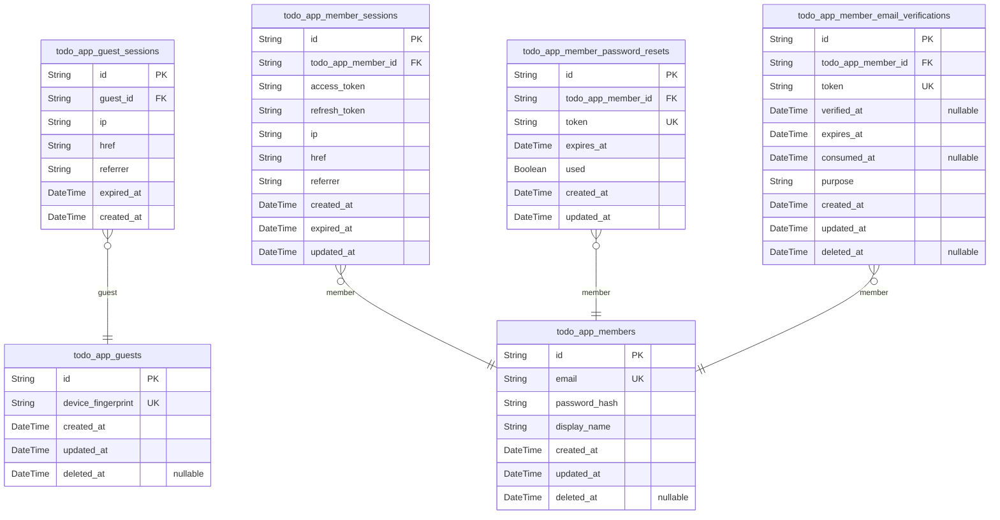
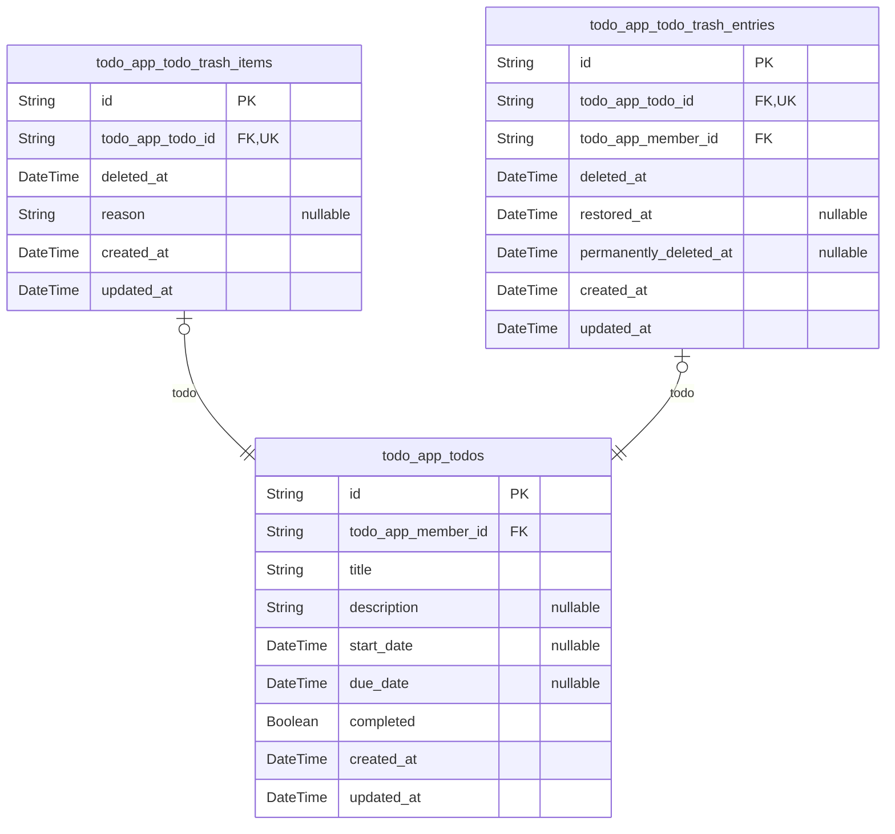
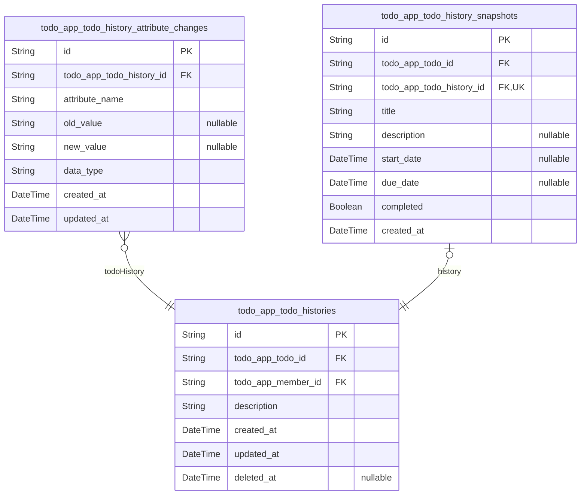

# Prisma Markdown

> Generated by [`prisma-markdown`](https://github.com/samchon/prisma-markdown)

- [Actors](#actors)
- [Todos](#todos)
- [TodoHistories](#todohistories)

## Actors

### `todo_app_guests`

Temporary guest accounts identified by device fingerprint for
unauthenticated access to sign-up and login screens.

Guest accounts are created automatically for visitors who have not yet
authenticated. They provide temporary access to the application's entry
points (sign-up and login screens) without requiring authentication
credentials. Each guest account is associated with a unique device
fingerprint to prevent duplicate guest sessions from the same device.

Guest accounts are automatically cleaned up after a configurable period
of inactivity. They cannot access any todo data, user profiles, or
application functionality beyond the entry points. Guest sessions are
tracked separately in [todo_app_guest_sessions](#todo_app_guest_sessions).

These accounts serve as a temporary identity layer for anonymous users,
allowing them to interact with authentication interfaces before creating
or logging into member accounts.

Properties as follows:

- `id`: Primary Key.
- `device_fingerprint`
  > Unique identifier derived from device characteristics (browser
  > fingerprint, IP, user agent). Used to prevent duplicate guest accounts
  > from the same device and to track guest sessions across visits.
- `created_at`: Timestamp when this guest account was automatically created.
- `updated_at`
  > Timestamp when this guest account was last updated (typically when
  > associated sessions are created or refreshed).
- `deleted_at`
  > Timestamp when this guest account was deleted (nullable for potential
  > soft delete cleanup). Guest accounts may be automatically purged after
  > expiration periods.

### `todo_app_guest_sessions`

Temporary session tokens for guest access to entry points without
authentication credentials. This table tracks guest user sessions for
auditing temporary unauthenticated access to sign-up and login screens.

Each record represents a single guest session, which provides temporary
access to the application's entry points before authentication. Sessions
are automatically created when guests interact with the system and expire
after a configured time period for security.

Guest sessions differ from member sessions as they don't require
authentication credentials and provide limited access to system features,
primarily focusing on the registration and login workflows.

Properties as follows:

- `id`: Primary Key.
- `guest_id`
  > The guest user who owns this session. References {@link
  > todo_app_guests.id}.
- `ip`
  > IP address of the client device that initiated the guest session. Used
  > for security auditing and access pattern analysis.
- `href`
  > Full URL path where the guest session was created. Captures the specific
  > entry point used by the guest.
- `referrer`
  > HTTP Referrer header value indicating where the guest came from. May be
  > empty string for direct access.
- `expired_at`
  > Timestamp when this guest session expires and becomes invalid. After this
  > time, the session token can no longer be used for access.
- `created_at`
  > Timestamp when this guest session was created. Used for auditing and
  > session lifecycle tracking.

### `todo_app_members`

Registered member accounts with email and password authentication
credentials for managing personal todos.

Members represent authenticated users who can create, edit, delete, and
manage their personal todo lists. Each member has a unique email address
used for authentication and account identification. The password is
securely hashed and stored for verification during login.

Members own todos through the [todo_app_todos.todo_app_user_id](#todo_app_todos)
foreign key, allowing strict data isolation between user accounts.
Sessions for members are tracked in [todo_app_member_sessions](#todo_app_member_sessions),
while password reset and email verification tokens are managed separately
in dedicated tables.

This table serves as the foundation for user identity and access control
throughout the application.

Properties as follows:

- `id`: Primary Key.
- `email`: Unique email address used for authentication and account identification.
- `password_hash`: Securely hashed password for authentication verification during login.
- `display_name`
  > User-chosen display name for personal identification within the
  > application. Can be updated by the user.
- `created_at`
  > Timestamp when the member account was created. Used for account age
  > tracking and auditing.
- `updated_at`
  > Timestamp when the member account was last updated. Automatically updated
  > on profile changes.
- `deleted_at`
  > Timestamp when the member account was soft-deleted. Null for active
  > accounts, set when user initiates account deletion.

### `todo_app_member_sessions`

JWT session tokens for member authentication with access and refresh
token support.

This table stores authentication sessions for registered members. Each
session contains access and refresh JWT tokens that allow authenticated
access to the system. Sessions are created when members log in and expire
based on security policies.

Sessions track connection context including IP address, URL, and referrer
for security auditing. The access token is used for API authentication,
while the refresh token enables obtaining new access tokens without
re-authentication. Sessions are automatically expired based on configured
lifetimes to maintain security.

Each session belongs to exactly one [todo_app_members](#todo_app_members) record.
Members can have multiple active sessions concurrently for different
devices or browsers. When sessions expire, they become invalid for
authentication but remain in the database for audit purposes.

Business operations like logging out terminate sessions by marking them
as expired. The system checks session validity on every authenticated
request and rejects expired or invalid sessions.

Properties as follows:

- `id`: Primary Key.
- `todo_app_member_id`
  > Reference to the member account that owns this session. {@link
  > todo_app_members.id}.
- `access_token`
  > JWT access token used for API authentication. Contains member identity
  > and permissions encoded as a JSON Web Token.
- `refresh_token`
  > JWT refresh token used to obtain new access tokens without requiring
  > re-authentication. Stored securely for token rotation.
- `ip`
  > IP address from which the session was created. Used for security auditing
  > and anomaly detection.
- `href`
  > URL where the session was created. Captures the entry point to the
  > application.
- `referrer`
  > HTTP referrer header value indicating the previous page that led to
  > session creation.
- `created_at`
  > Timestamp when the session was created. Used for session lifetime
  > calculations and auditing.
- `expired_at`
  > Timestamp when the session expires and becomes invalid. Sessions are
  > automatically rejected after this time for security.
- `updated_at`
  > Timestamp when the session was last updated. Used for tracking session
  > modifications and audit purposes.

### `todo_app_member_password_resets`

Password reset tokens with expiration for member password recovery
workflows.

When a member forgets their password, the system generates a unique token
that can be used to reset the password. Each token has a limited validity
period and can only be used once. This table stores these temporary
tokens along with their expiration and usage status.

Tokens are generated as part of the password recovery flow and are
invalidated after use or expiration. The system can query this table to
validate reset tokens during password reset operations. Each token is
uniquely associated with a specific member account through the foreign
key relationship to [todo_app_members](#todo_app_members).

Properties as follows:

- `id`: Primary Key.
- `todo_app_member_id`: Member who requested password reset. [todo_app_members.id](#todo_app_members).
- `token`
  > Unique secure token for password reset link. This cryptographically
  > random string is included in reset emails and validated during password
  > reset operations.
- `expires_at`
  > Timestamp when this token expires and becomes invalid. Password resets
  > must be completed before this time.
- `used`
  > Whether this token has been used to successfully reset a password. Once
  > true, the token cannot be used again.
- `created_at`: Timestamp when this password reset token was generated.
- `updated_at`
  > Timestamp when this token record was last updated, typically when marked
  > as used.

### `todo_app_member_email_verifications`

Email verification tokens for member registration confirmation and
account security.

This table stores secure tokens sent to member email addresses for
verification purposes. Each token is uniquely generated and has a limited
validity period to ensure account security. Tokens are used for verifying
email ownership during registration and for security-related email
confirmation workflows. The table maintains a strict one-to-many
relationship with the member table to allow multiple verification
attempts over time.

[todo_app_members](#todo_app_members) create these tokens through authentication
workflows, and each token can be consumed exactly once during the
verification process. Expired or consumed tokens are retained for
security audit purposes but are no longer valid for verification.

Properties as follows:

- `id`: Primary Key.
- `todo_app_member_id`: The member who requested email verification. [todo_app_members.id](#todo_app_members).
- `token`
  > Secure verification token sent to the member's email address. This token
  > must be cryptographically secure and unique per verification attempt.
- `verified_at`
  > Timestamp when the email was successfully verified using this token. Null
  > indicates the token has not yet been used for verification.
- `expires_at`
  > Timestamp when this verification token expires and can no longer be used.
  > Tokens have a limited validity period for security reasons.
- `consumed_at`
  > Timestamp when the token was consumed (used for verification). This may
  > differ from verified_at if there are multiple verification attempts or if
  > the token is invalidated before verification.
- `purpose`
  > Purpose of the email verification (e.g., 'registration', 'email_change',
  > 'security_confirmation'). Defines the business context for the
  > verification request.
- `created_at`: Timestamp when the verification token was created and sent to the member.
- `updated_at`: Timestamp when this verification token record was last updated.
- `deleted_at`
  > Timestamp when this verification token was soft-deleted. Used for audit
  > trails and security compliance.

## Todos

### `todo_app_todos`

Main todo entities containing core task attributes and ownership
relationships. Each todo represents a personal task created by a member
with attributes like title, description, start date, due date, and
completion status.

Todos are the central business entity in the personal task management
system. Members can create, view, edit, mark as complete/incomplete, and
delete their todos. The system maintains strict data isolation ensuring
each member can only access their own todos. Edit history is tracked
separately by the TodoHistories component, while soft deletion is managed
through trash tables.

Key business rules:
- Each todo must have a title
- Due dates cannot be before start dates when both are provided
- Todos default to incomplete status when created
- All operations are scoped to the owning member

[todo_app_members.id](#todo_app_members) owns these todos, and {@link
todo_app_todo_histories.id} tracks their edit history.

Properties as follows:

- `id`: Primary Key.
- `todo_app_member_id`: Owning member's [todo_app_members.id](#todo_app_members).
- `title`
  > Descriptive title of the todo task. This is the primary identifier shown
  > in lists and must be provided.
- `description`
  > Optional detailed explanation or notes about the todo task. Can be empty
  > or omitted for simple todos.
- `start_date`
  > Optional planned start date and time for the todo task. When not
  > provided, the todo has no scheduled start time.
- `due_date`
  > Optional deadline date and time for completing the todo task. When not
  > provided, the todo has no specific due date. Business validation ensures
  > due_date is not before start_date when both are provided.
- `completed`
  > Indicates whether the todo task has been marked as complete. Defaults to
  > false for new todos. Members can toggle this status.
- `created_at`: Timestamp when the todo was created. Automatically set by the system.
- `updated_at`
  > Timestamp when the todo was last modified. Automatically updated by the
  > system on changes.

### `todo_app_todo_trash_items`

Stores todos that have been soft-deleted, enabling restoration.

This table tracks todos that users have deleted but not permanently
removed from the system. Each entry represents a todo moved to the trash,
preserving its data and edit history for potential restoration. The table
maintains a 1:1 relationship with [todo_app_todos](#todo_app_todos) through the
unique foreign key constraint.

When a user deletes a todo, the system creates a record here while
removing the todo from the normal todo list. Users can later view their
trash, restore deleted todos, or permanently delete them from this table.
The deletion timestamp represents when the todo was moved to trash, which
helps with chronological browsing of deleted items.

Properties as follows:

- `id`: Primary Key.
- `todo_app_todo_id`: The deleted todo's identifier. [todo_app_todos.id](#todo_app_todos).
- `deleted_at`
  > Timestamp when the todo was moved to trash. This field is required and
  > represents the deletion time for chronological sorting of trash items.
- `reason`
  > Optional note about why the todo was deleted. Users or the system can
  > record context about the deletion for future reference.
- `created_at`: Timestamp when this trash entry was created.
- `updated_at`: Timestamp when this trash entry was last modified.

### `todo_app_todo_trash_entries`

Records of todo soft deletions with timestamps and optional restoration
data.

This table tracks when todos are moved to the trash (soft deleted), when
they are restored, and when they are permanently deleted from the trash.
Each todo can have at most one trash entry record, establishing a 1:1
relationship with the main todo table. The table serves as an audit trail
for todo lifecycle management, recording who deleted the todo and when.

When a user deletes a todo, a record is created here with deleted_at set
to the current timestamp. If the user later restores the todo from trash,
restored_at is populated. If the user permanently deletes the todo from
trash, permanently_deleted_at is populated. This three-state tracking
allows for comprehensive trash management while maintaining data
isolation per user.

Properties as follows:

- `id`: Primary Key.
- `todo_app_todo_id`: The todo that was moved to trash. [todo_app_todos.id](#todo_app_todos).
- `todo_app_member_id`: The member who performed the deletion. [todo_app_members.id](#todo_app_members).
- `deleted_at`
  > Timestamp when the todo was moved to trash (soft deleted). This field is
  > always populated when the record is created.
- `restored_at`
  > Timestamp when the todo was restored from trash back to active status.
  > Null if the todo remains in trash or was permanently deleted.
- `permanently_deleted_at`
  > Timestamp when the todo was permanently deleted from trash. Null if the
  > todo is still in trash or was restored.
- `created_at`: Timestamp when this trash entry record was created.
- `updated_at`
  > Timestamp when this trash entry record was last updated (e.g., when
  > restored or permanently deleted).

## TodoHistories

### `todo_app_todo_histories`

Main table storing chronological history records of todo modifications.

Each record represents a single edit session where a user modified a
todo. This table serves as an audit trail for todo changes, capturing who
made the change, when it occurred, and providing a summary of what was
modified. The detailed attribute-level changes are stored in {@link
todo_app_todo_history_attribute_changes}, while complete state snapshots
are preserved in [todo_app_todo_history_snapshots](#todo_app_todo_history_snapshots).

History records are immutable once created and form the foundation for
todo change tracking and audit transparency.

Properties as follows:

- `id`: Primary Key.
- `todo_app_todo_id`: Reference to the todo that was modified. [todo_app_todos.id](#todo_app_todos)
- `todo_app_member_id`
  > Reference to the member who made the modification. {@link
  > todo_app_members.id}
- `description`
  > Summary description of what was changed in this edit session. Provides a
  > human-readable overview of the modification.
- `created_at`
  > Timestamp when this history record was created. Represents when the todo
  > modification occurred.
- `updated_at`
  > Timestamp when this history record was last updated. For audit trail
  > integrity, this should match created_at since history records are
  > immutable after creation.
- `deleted_at`
  > Timestamp when this history record was soft deleted. Null indicates the
  > record is active.

### `todo_app_todo_history_attribute_changes`

Individual attribute changes recorded within a single todo edit session.

Each row captures a single field modification that occurred during a todo
edit operation, such as title changes, description updates, due date
adjustments, or completion status toggles. This table provides granular
audit transparency by preserving both the old and new values for each
changed attribute, along with the data type and exact timestamp of the
change.

Attribute changes are automatically created as part of {@link
todo_app_todo_histories} record generation whenever a user edits a todo.
The table supports detailed change tracking for compliance and debugging
purposes while maintaining strict data isolation per user account through
its parent history relationship.

Note: Old and new values are stored as strings with appropriate data type
classification to enable type-aware display and comparison in audit
interfaces.

Properties as follows:

- `id`: Primary Key.
- `todo_app_todo_history_id`
  > Parent history record containing this attribute change. {@link
  > todo_app_todo_histories.id}.
- `attribute_name`
  > Name of the todo attribute that was changed, such as 'title',
  > 'description', 'start_date', 'due_date', or 'completed'.
- `old_value`
  > Previous value of the attribute before the edit. Null when the attribute
  > was newly added or had no previous value.
- `new_value`
  > New value of the attribute after the edit. Null when the attribute was
  > removed during the edit.
- `data_type`
  > Data type classification of the attribute values for proper display and
  > comparison. Values: 'string', 'boolean', 'datetime', 'text'.
- `created_at`
  > Timestamp when this attribute change was recorded. Matches the parent
  > history record creation time.
- `updated_at`
  > Timestamp when this record was last updated. Initially matches
  > created_at; updated if the attribute change metadata is corrected.

### `todo_app_todo_history_snapshots`

Complete todo state snapshots preserved at each edit point for audit
transparency.

Each record captures the full state of a todo immediately after an edit
operation, preserving all attributes (title, description, start date, due
date, completion status) at that point in time. This enables detailed
audit trails and allows users to see exactly what their todo looked like
after each modification.

The snapshot is linked to both the specific todo being modified and the
history entry that records the edit event. This dual relationship
supports both todo-centric history views ("show me all snapshots for this
todo") and edit-centric state preservation ("show me what the todo looked
like after this specific edit").

Snapshots are immutable records created automatically by the system
whenever a todo is modified. They serve as a permanent audit trail that
cannot be altered or deleted, ensuring transparency in todo evolution
over time.

Properties as follows:

- `id`: Primary Key.
- `todo_app_todo_id`
  > The todo whose state is captured in this snapshot. {@link
  > todo_app_todos.id}.
- `todo_app_todo_history_id`
  > The history entry that triggered this snapshot creation. {@link
  > todo_app_todo_histories.id}.
- `title`: The todo title at the time of snapshot creation.
- `description`: The todo description at the time of snapshot creation.
- `start_date`: The todo start date at the time of snapshot creation.
- `due_date`: The todo due date at the time of snapshot creation.
- `completed`: The todo completion status at the time of snapshot creation.
- `created_at`
  > Timestamp when this snapshot was created. Automatically generated by the
  > system.
