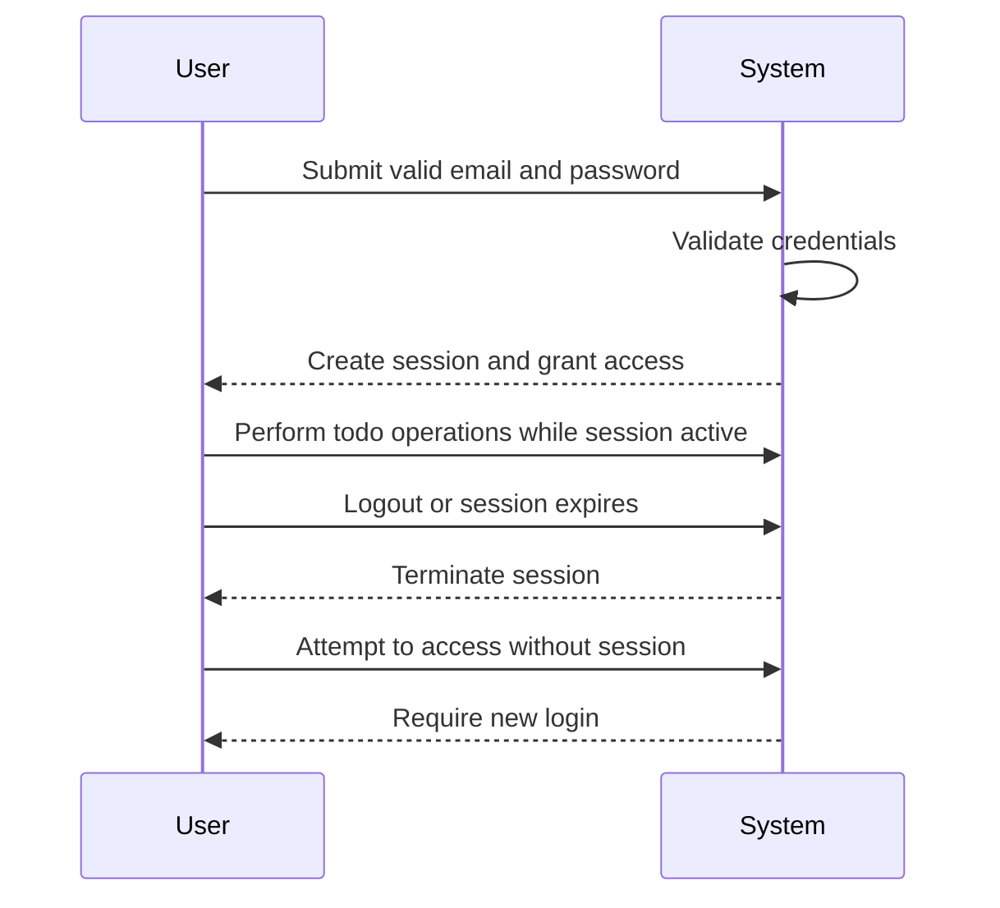
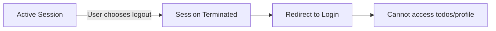

**todoApp — Actor definitions, permission matrix, authentication, session, account lifecycle**

Actor definitions, permission matrix, authentication, session, account lifecycle

# Actor Definitions

Define all user actor types with their identity, permissions, and access boundaries.

## guest Actor

The guest actor represents unauthenticated users who have not yet created an account or logged into the todo application. Guests have minimal access privileges and cannot perform any todo-related operations. They are limited to the initial application entry points where they can learn about the application's purpose. The primary capability for guests is to initiate the account creation process by navigating to the sign-up interface. Guests can also access the login screen if they already have an account. They cannot view any todos, profiles, or application data since these features require authentication. The guest actor transitions to a member actor upon successful account creation and login. This actor type ensures that private user data remains completely isolated from unauthorized access. All todo operations, viewing capabilities, and profile management are explicitly restricted for guest actors.

### Unauthenticated Access and Entry Points

A guest actor represents any user who has not yet authenticated with the todo application. Guests can only access the application's initial entry points, which are limited to the sign-up screen and login screen. From these interfaces, guests can initiate the account creation process or attempt to log into an existing account. Guests cannot view any todo data, user profiles, or application functionality beyond these entry points. All todo-related operations require authentication and are explicitly restricted for guest actors.

### Restricted Data Access Boundaries

Guest actors have no permission to view, access, or interact with any user-specific data within the application. This includes:

- No access to todo lists or individual todo details
- No ability to view user profiles (including their own or others)
- No access to todo history or edit records
- No visibility into trash or deleted items
- No ability to perform any filtering, sorting, or pagination operations

All user data remains completely isolated from guest actors to ensure privacy. The application enforces strict data access boundaries that prevent unauthorized viewing of any personal information.

### Authentication Requirement for Operations

Every operational feature in the todo application requires authentication. Guest actors are explicitly prohibited from performing any of the following operations:

- Creating, viewing, editing, or deleting todos
- Marking todos as complete or incomplete
- Accessing todo edit history
- Managing trash (restoring or permanently deleting items)
- Filtering or sorting todo lists
- Changing account passwords or deleting accounts
- Editing user profile information

Authentication is the mandatory gateway to all application functionality. Without successful login or account creation, users remain in the guest actor state with access only to the sign-up and login interfaces.

### Guest to Member Transition

The guest actor state is temporary and transitions to a member actor upon successful authentication. This transition occurs through one of two pathways:

1. **Account Creation**: When a guest successfully completes the sign-up process with a valid email and password, their actor type changes from guest to member.
2. **Login**: When a guest successfully logs into an existing account with valid credentials, their actor type changes from guest to member.

Once transitioned to member actor status, the user gains full access to their personal todo data and all associated functionality. The transition is irreversible within a single session—a user cannot revert to guest status without explicitly logging out. If authentication fails (invalid credentials, email not found, etc.), the user remains a guest actor.

## member Actor

The member actor represents authenticated users who have successfully created an account and logged into the todo application. Members have full access to all application features within their personal data boundaries. Each member can only access and manipulate their own todos, profiles, and application data. The system enforces strict data isolation where members cannot view, access, or share another user's information. Members can perform all todo operations including creation, viewing, editing, completion, deletion, and restoration. They have complete control over their personal profile including display name management. All member actions are scoped to their individual account with no cross-user visibility. This actor type embodies the application's core privacy principle of complete user data isolation. Members can manage their account lifecycle including password changes and account deletion. The member actor maintains persistent access to the application until they choose to log out or delete their account.

### Authenticated User Access

A member is a user who has successfully completed the registration process and logged into the system with their email and password.

**Identity Verification**:
- The system recognizes members by their authenticated session
- Members must have a valid email and password combination
- Authentication persists until the member logs out or their session expires

**Access Scope**:
- Members have access to all application features within their personal data boundaries
- All member actions are associated with their individual account identity
- The system maintains the member's identity throughout their session

### Personal Todo Management

Members have complete control over their personal todo items.

**Creation Rights**:
- Members can create new todo items with title, description, start date, and due date
- New todos are created within the member's personal todo collection

**Viewing Rights**:
- Members can view all their own todo items in paginated lists
- Members can view detailed information about any of their own todo items
- Members can filter their todo list by completion status
- Members can sort their todo list by creation date, start date, or due date

**Modification Rights**:
- Members can edit the title, description, start date, and due date of their own todo items
- Members can toggle the completion status of their own todo items
- Members can delete their own todo items (soft delete to trash)

**Trash Management**:
- Members can view their deleted todo items in the trash
- Members can restore deleted todo items from trash to the normal list
- Members can permanently delete todo items from the trash

### Individual Profile Control

Each member maintains a personal profile with specific attributes.

**Profile Attributes**:
- Display name: A user-chosen name for personal identification
- Email address: Used for authentication and account identification
- Account status: Indicates whether the account is active

**Profile Management**:
- Members can view their own profile information
- Members can edit their display name
- Members cannot view other members' profiles
- Members cannot edit other members' profiles

**Account Security**:
- Members can change their password
- Members can delete their own account
- Account deletion results in permanent removal of all associated data

### Strict Data Isolation Boundaries

The system enforces absolute separation between member data.

**Data Containment**:
- Each member's todos exist within their personal data container
- No member can access another member's todo container
- The system prevents any data leakage between member accounts

**Access Enforcement**:
- All data retrieval operations are filtered by member identity
- The system validates ownership before any data operation
- Cross-member data requests are rejected by the system

### Complete Privacy Enforcement

Member privacy is guaranteed by system design and operation.

**Visibility Control**:
- Members can only see their own todos
- There is no public sharing or collaborative features
- Other members cannot discover or access another member's data

**Privacy Guarantees**:
- The system provides no mechanism for viewing another user's todos
- No data sharing or export features exist between members
- All member interactions are strictly with their own data

**Privacy Boundary**:
- The application operates as multiple independent single-user instances
- Each member experiences the application as their private workspace
- System architecture prevents accidental or intentional data exposure

### Account-Scoped Operations

All member actions are limited to their individual account scope.

**Operation Boundaries**:
- Todo creation: New todos are automatically associated with the creating member
- Todo viewing: Members can only view their own todos
- Todo editing: Members can only edit their own todos
- Todo deletion: Members can only delete their own todos
- Profile management: Members can only manage their own profile

**Automatic Association**:
- When a member creates a todo, the system automatically assigns it to their account
- When a member views a todo list, the system automatically filters to show only their todos
- When a member performs any operation, the system validates ownership before proceeding

### Full Application Feature Access

Members have access to the complete set of application features.

**Core Features**:
- Todo creation with all available fields
- Todo viewing with filtering and sorting
- Todo editing with history tracking
- Todo completion status management
- Todo deletion and trash management
- Profile management and display name editing
- Account management including password changes
- Account deletion with data cleanup

**Feature Availability**:
- All features described in the requirements are available to members
- No features are restricted for authenticated members
- Members experience the full application functionality

### Authenticated Session Persistence

Members maintain continuous access through authenticated sessions.

**Session Characteristics**:
- Members remain authenticated until they explicitly log out
- The system remembers member identity across application interactions
- Session persistence enables seamless feature access

**Session Scope**:
- Each session is tied to a specific member account
- Sessions do not grant access to other members' data
- Session termination occurs when the member logs out or the session expires

**Continuous Access**:
- Members can perform multiple operations within a single session
- Session persistence eliminates the need for repeated authentication
- Members can leave and return to the application without losing access

### Individual Account Boundaries

Each member account represents an independent data silo.

**Account Structure**:
- One account per email address
- Each account contains its own todo collection
- Each account maintains its own profile information
- Accounts do not share data or resources

**Boundary Enforcement**:
- The system prevents cross-account data access
- No account can reference or link to another account's data
- Account operations cannot affect other accounts

**Independent Operation**:
- Each member works within their account boundaries
- Account actions have no impact on other members
- The system maintains complete separation between accounts

# Authentication Flows

Registration, login, logout, and session management from a user perspective.

## Registration and Login

Define user registration and login flows including validation and error handling.

### User Registration

### User Registration

Guests can register for a member account to use the todo application.

**Registration Flow:**
1. A guest provides an email address and password
2. The system validates the email format
3. The system ensures the email is not already registered
4. The system validates the password meets minimum security requirements
5. If all validations pass, the system creates a new member account
6. The user is automatically logged in upon successful registration

**Registration Requirements:**
- Email address is required and must be unique across all users
- Password is required and must meet security criteria
- Display name is not required during registration (can be set later in profile)
- Registration automatically creates an empty todo list for the new user

**Error Conditions:**
- If the email is already registered, registration fails
- If the email format is invalid, registration fails
- If the password does not meet security requirements, registration fails
- If any required field is missing, registration fails

### User Login

### User Login

Members can log in to access their personal todo application.

**Login Flow:**
1. A guest provides an email address and password
2. The system validates the credentials
3. If credentials match an existing member account, the system creates a session
4. The user is granted access to their personal todo workspace

**Login Requirements:**
- Email address and password are both required for login
- The system must verify the email exists in registered accounts
- The system must verify the provided password matches the stored credentials
- Successful login establishes an authenticated session
- The session allows access to the user's todos and profile

**Error Conditions:**
- If the email is not registered, login fails
- If the password is incorrect, login fails
- If either field is missing, login fails
- If the account has been deleted, login fails

### Authentication Principles

### Authentication Principles

The todo application uses email and password-based authentication for member access control.

**Authentication Model:**
- Email serves as the unique identifier for each user
- Password provides proof of identity
- Sessions maintain authentication state during application use
- Authentication is required for all todo management operations

**Authentication Scope:**
- Authentication grants access to the user's own data only
- Authentication does not provide access to other users' data
- Each authenticated session is isolated to a single user
- Authentication is required for viewing, creating, editing, and deleting todos

**Authentication Boundaries:**
- Guests can only access registration and login functions
- Members can access all personal todo functions
- There is no concept of shared or group authentication
- Authentication tokens are not shared between devices (each login creates a new session)

## Session and Logout

Define session behavior and logout from a user perspective.

### Session Management

### Session Management

When users successfully log in, the system creates a session that allows them to access their todos and profile.

The session remains active until the user logs out or the session expires due to inactivity.

Users can only have one active session at a time. If they log in from another device or browser, any existing session is terminated.

While a session is active, the user can perform all member actions: create, view, edit, complete, delete, and filter their todos, as well as edit their profile and manage their account.

If a session expires or is terminated, the user must log in again to continue using the application.

The system does not show other users' sessions or activity; each user's session is private and isolated.

### Logout Process

### Logout Process

Users can manually log out from any page while their session is active.

When a user logs out, the system immediately terminates their session and redirects them to the login screen.

After logout, the user cannot access their todos, profile, or any other member features until they log in again.

Logout does not affect the user's account, todos, or data—everything remains intact and unchanged.

Users can log out and log back in at any time without affecting their todo data.

If a user attempts to perform any member action after logging out, the system redirects them to the login screen.

Logout is a user-initiated action; there is no automatic logout except for session expiration due to inactivity.

### Account Security

### Account Security

Each user's session is protected and cannot be accessed by other users.

If a user changes their password while logged in, their current session remains active—they do not need to log in again immediately.

If a user changes their password and then logs out, they must use the new password to log in again.

When a user deletes their account, all their active sessions are immediately terminated, and they are logged out from all devices.

Users cannot access another user's session, even if they know the other user's email address.

The system prevents simultaneous login from multiple devices or browsers for the same account.

Users should log out from shared or public computers to protect their account security.

If a user forgets to log out on a shared device, the session will eventually expire due to inactivity, protecting their data.

Account security is maintained through strict session isolation: each user can only see and modify their own data during their session.

# Account Lifecycle

Account creation, deletion, and password management.

## Account Management

Define how users create accounts, delete accounts, and change passwords.

### Account Creation

### Account Creation

**Actor**: Guest (unauthenticated user)

**Purpose**: Allows new users to create an account in the system.

**Process**:
1. Guests provide a valid email address and password to register
2. The system validates the email is not already in use
3. The system creates a new user account with the provided credentials
4. The user is automatically logged in after successful account creation
5. An empty profile with a default display name is created for the new user

**Success Conditions**:
- A valid, unique email address is provided
- A valid password meeting system security requirements is provided

**Error Conditions**:
- If the email is already registered, the account creation fails
- If the password does not meet security requirements, the account creation fails
- If required information is missing, the account creation fails

**Post-Creation State**:
- User becomes a member (authenticated user)
- User can immediately create and manage todos
- User can edit their profile display name

**References**:
- Authentication flow details are defined in the Registration and Login unit
- User profile management is defined in the User Profile functional requirements

### Account Deletion

### Account Deletion

**Actor**: Member (authenticated user)

**Purpose**: Allows users to permanently delete their account and all associated data.

**Process**:
1. Authenticated users can initiate account deletion through their profile settings
2. The system requests confirmation before proceeding with deletion
3. Upon confirmation, the system permanently removes:
   - The user's account and credentials
   - All todos created by the user (including those in trash)
   - All edit history associated with the user's todos
   - The user's profile information
4. All data is permanently erased and cannot be recovered

**Scope of Deletion**:
- All user's todos are deleted, regardless of completion status
- Todos in trash are permanently deleted along with their edit history
- Empty trash is automatically cleared
- User's login session is terminated

**Success Conditions**:
- User must be authenticated and confirm the deletion request
- User must have valid active session

**Error Conditions**:
- If user is not authenticated, account deletion cannot be initiated
- If confirmation is not provided, deletion process is canceled

**Post-Deletion State**:
- User account no longer exists
- User becomes a guest (unauthenticated user)
- All user data is permanently removed from the system
- User can create a new account with the same email address (since previous account is gone)

### Password Change

### Password Change

**Actor**: Member (authenticated user)

**Purpose**: Allows users to change their account password for security purposes.

**Process**:
1. Authenticated users can access password change functionality through their profile settings
2. Users must provide their current password for verification
3. Users enter a new password and confirm it
4. The system validates the new password meets security requirements
5. Upon successful validation, the password is updated

**Verification Requirements**:
- Current password must be provided and match the user's stored credentials
- New password must be different from the current password
- New password must meet system security requirements
- New password confirmation must match the new password

**Success Conditions**:
- Current password verification succeeds
- New password meets all security requirements
- New password confirmation matches

**Error Conditions**:
- If current password is incorrect, password change fails
- If new password does not meet security requirements, password change fails
- If new password confirmation does not match, password change fails

**Post-Change Effects**:
- User's password is updated in the system
- User remains logged in with existing session
- All future logins require the new password

**Security Notes**:
- Password change requires current password verification to prevent unauthorized changes
- Session remains active after password change for user convenience