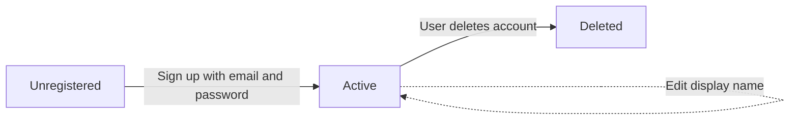
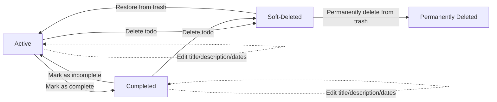
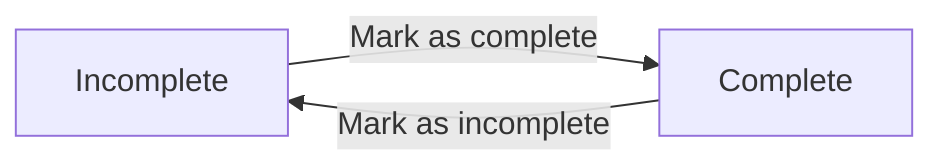
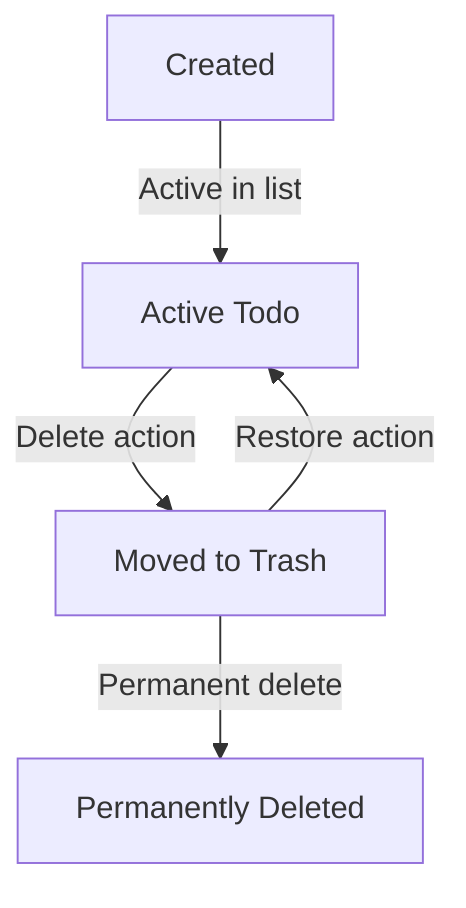
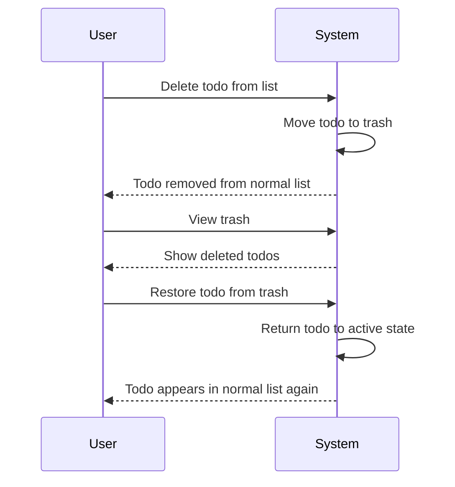

**todoApp — Business concepts, relationships, and states from user perspective**

Business concepts, relationships, and states from user perspective

# Domain Concepts

Describe what each concept means in the business domain and its key attributes.

## User Concept

A User represents an individual account holder in the multi-user Todo application. Each user has a unique email address that serves as their primary identifier for account access. The user maintains a display name that can be changed to personalize their identity within the application. The user's password provides secure authentication, though the system only stores a hashed version for security. Each user's data, including todos and edit history, is completely private and inaccessible to other users. The user can manage their own profile settings but cannot view any other user's information in this private application. The user account serves as the container for all todo-related activities, including creation, editing, completion, and deletion workflows.

### User Account Holder

A User is an individual account holder who can access and use the multi-user Todo application. The user creates their account by providing a unique email address and a password. Once authenticated, the user can perform all todo-related activities including creating, viewing, editing, completing, and deleting todos. The user's account serves as the secure container that holds all their personal todo data and edit history. The account remains active until the user chooses to delete it, at which point all associated data is permanently removed.

### Unique Email Identifier

Each user is uniquely identified by their email address within the application. The email address serves as the primary credential for authentication during both sign-up and login processes. No two users can share the same email address; each email must be unique across all registered accounts. The email address also functions as the user's primary contact identifier within the system, though in this private application, it is not used for communication with other users. The uniqueness of email addresses ensures that each user's data remains distinct and accessible only through the correct authentication credentials.

### Display Name Personalization

Each user has a display name that personalizes their identity within the application. The display name is a customizable string that the user can set and modify at any time. Unlike the email address, the display name does not need to be unique and can be shared by multiple users. The display name appears in user-facing interfaces to provide a friendly, personal identifier while maintaining the privacy of the user's email address. Users can change their display name as often as they wish without affecting their account's authentication or todo data.

### Password Authentication

Users authenticate to the application using a password associated with their email address. The password must be provided during both initial account creation and subsequent login attempts. For security purposes, the system does not store the actual password but rather a cryptographically hashed version of it. Users can change their password at any time through a secure process that requires knowledge of their current password. Password authentication ensures that only authorized individuals can access a user's private todo data, maintaining the application's privacy-focused design.

### Complete Data Privacy

Each user's data is completely private and inaccessible to other users. This privacy applies to all user-specific information including:
- User profile details (email address and display name)
- All todo items created by the user
- Todo edit history entries
- Trash contents
- Account settings and preferences

No user can view, access, modify, or share another user's data in any way. The application enforces strict data isolation between user accounts, ensuring that each user's todo activities remain confidential. This complete privacy is a fundamental characteristic of the application's design.

### Private Application Context

The multi-user Todo application is designed as a private application where users can only interact with their own data. While multiple users can have accounts in the same system, there are no features for sharing, collaboration, or viewing other users' information. The term "multi-user" refers only to the capability of hosting multiple independent user accounts within a single application instance, not to any form of user interaction or data sharing. Each user operates within their own isolated environment, unaware of and unable to access other users' activities or data.

### Account Container Role

The user account serves as the primary container for all todo-related data and activities. Within this container reside:
- The user's profile information (email and display name)
- All todo items created by the user
- Complete edit history for each todo
- Deleted todos in the trash
- Account preferences and settings

When a user account is deleted, the container and all its contents are permanently removed from the system. This includes todos in the normal list, todos in the trash, and all associated edit history. The container model ensures that user data is logically grouped and managed as a cohesive unit throughout the application lifecycle.

## Todo Concept

A Todo represents a personal task or item that a user wants to track and manage. Each todo has a required title that provides a brief description of the task. An optional description field allows users to add more detailed information about the todo. The start date attribute represents when work on the todo should or can begin, but can be left unspecified. The due date attribute indicates when the todo should be completed, providing a target timeframe. Every todo has a creation date that records when it was first created in the system. The completion status tracks whether the todo is currently marked as done or pending. Todos exist within a private context, accessible only to their owning user.

### Personal Task Tracking

A Todo represents a personal task or item that a user wants to track and manage within the application. It serves as the central unit of work that users create, monitor, and complete. Each todo encapsulates a specific piece of work, responsibility, or goal that the user wishes to remember and manage over time.

In the business domain, todos are private task records that help users organize their personal workload. They provide structure for tracking progress on individual tasks from inception through completion. The system maintains each todo as a discrete entity with associated attributes that define its purpose, timeframe, and current state.

Todos exist within the context of personal productivity management, where users need to track multiple concurrent tasks with varying priorities and deadlines. The todo concept enables users to maintain a comprehensive overview of their pending and completed work items.

### Core Attributes

Every todo has essential attributes that define its purpose and content within the business domain:

**Title**
- Represents a brief, descriptive summary of the task
- Is required for every todo creation
- Provides the primary identifier when viewing todo lists
- Typically a concise phrase that captures the todo's essence

**Description**
- Provides optional detailed information about the task
- Allows for expanded notes, specifications, or context
- May contain instructions, requirements, or additional details
- Supports richer task documentation when needed

The title-description distinction allows users to provide both quick-reference summaries and comprehensive details about their tasks, supporting different levels of task complexity and documentation needs.

### Time Attributes

Todos include several time-related attributes that help users manage task scheduling and tracking:

**Start Date**
- Represents the optional date when work on the todo should or can begin
- Provides a planned starting point for task execution
- When unspecified, indicates no particular start date constraint exists
- Helps users sequence and schedule their work

**Due Date**
- Indicates the optional target completion date for the todo
- Establishes a timeframe expectation for task completion
- When unspecified, indicates no specific deadline requirement
- Supports deadline-oriented task management

**Creation Date**
- Records when the todo was first created in the system
- Provides a chronological reference point for task inception
- Is automatically generated and cannot be modified
- Enables historical tracking and timeline analysis

These time attributes allow users to manage both the scheduling aspects (when to start, when to complete) and the historical tracking (when created) of their personal tasks.

### Status and Ownership

Two fundamental aspects define a todo's operational context within the business domain:

**Completion Status**
- Tracks whether the todo is currently marked as done or pending
- Represents a simple binary state: complete or incomplete
- Supports the core workflow of task execution tracking
- Enables users to monitor progress on their work items

**Private User Ownership**
- Each todo belongs exclusively to a single user
- Creates a completely private context where only the owning user can access the todo
- Establishes strict data boundaries between users
- Ensures personal task management remains confidential

The combination of completion status and private ownership creates a secure, personalized task management environment where users can track their work progress without concern for external visibility or interference.

## TodoHistory Concept

TodoHistory represents a chronological record of changes made to a todo over time. Each history entry captures a specific moment when the todo was edited or modified. The entry records what attributes were changed during that edit session, such as title updates. It also tracks what the new values became after the edit, preserving the evolution of the todo. The timestamp indicates exactly when the change occurred, creating an audit trail. History entries are maintained in order from most recent to oldest for easy review. The complete history provides transparency into how a todo has evolved since its creation. This concept supports accountability and tracking of todo modifications without exposing the edit process to other users.

### Chronological Change Record

A TodoHistory represents a chronological record of changes made to a todo over time. Each entry in the history captures a discrete edit event, maintaining the sequence in which modifications occurred. The history provides a timeline of how the todo has evolved since its creation, allowing users to track its development through various edit sessions. This chronological organization supports understanding the progression of a todo's attributes and states.

### Edit Session Capture

Each TodoHistory entry captures a complete edit session when a user modifies their todo. An edit session occurs whenever a user saves changes to a todo, regardless of how many attributes were modified. The system records what attributes were changed during that specific edit, creating a snapshot of the modifications made at that moment. If multiple attributes are changed in a single edit, they are recorded together in the same history entry.

### Attribute Change Tracking

TodoHistory entries track which specific attributes of a todo were modified during an edit. The system records changes to the following attributes when they occur:

- **Title changes**: When the todo's title is updated
- **Description changes**: When the description content is modified
- **Start date changes**: When the start date is set, modified, or cleared
- **Due date changes**: When the due date is set, modified, or cleared

Only attributes that were actually changed during the edit are recorded in the history entry. Unchanged attributes are not mentioned in the entry.

### New Value Preservation

For each attribute changed during an edit, the TodoHistory entry records the new value that resulted from the modification. This preserves the state of the todo after each edit, creating a historical record of what the todo became. The preserved values show:

- **What the title was changed to** (if the title was modified)
- **What the description was changed to** (if the description was modified)
- **What the start date was changed to** (if the start date was modified)
- **What the due date was changed to** (if the due date was modified)

This preservation allows users to see exactly how their todo looked after each edit, not just what was changed.

### Timestamp Audit Trail

Each TodoHistory entry includes a timestamp that records exactly when the edit was made. This timestamp creates an audit trail that answers:

- **When** the edit occurred
- **In what sequence** edits were made relative to each other
- **How much time** passed between edits

The timestamp is automatically generated by the system at the moment the edit is saved, ensuring accuracy and preventing user manipulation of the audit trail.

### Reverse Chronological Ordering

TodoHistory entries are organized in reverse chronological order when displayed to users. This means:

- The most recent edit appears first
- Older edits appear further down the list
- Users can see what changed most recently without scrolling
- The ordering provides immediate context about recent modifications

This presentation order supports users in understanding the most current state of their todo and tracking recent changes more easily than chronological ordering would allow.

### Complete Evolution Transparency

The complete TodoHistory provides full transparency into how a todo has evolved from creation to its current state. Users can:

- See every edit ever made to the todo
- Track how each attribute has changed over time
- Understand the progression from initial creation through all modifications
- Identify patterns in how the todo has been refined

This transparency gives users confidence that no modifications are hidden or omitted from the historical record.

### Modification Accountability

TodoHistory creates accountability for all modifications made to todos. Because:

- Every edit is recorded with a timestamp
- All changed attributes are documented
- The new values are preserved
- The complete history is available for review

Users can verify what changes were made and when they occurred. This accountability supports trust in the system's record-keeping and provides users with a reliable audit trail of their todo management activities.

# Domain Relationships

Describe how concepts relate to each other from a business perspective.

## Conceptual Relationships

Describe how concepts relate to each other in business terms.

### User-Todo Relationship

### User-Todo Relationship

A **relationship** exists between a user and their todos, where each user owns multiple todos, and each todo is owned by exactly one user. This is a one-to-many **association** representing complete **ownership** of todos by users.

**Business Perspective:**
- A user creates todos as personal tasks for their own use
- Each todo is automatically linked to the user who created it
- Users cannot access or modify todos belonging to other users
- When a user deletes their account, all their todos are permanently removed from the system

This relationship ensures data privacy and establishes clear boundaries for task management within the application.

### Todo-TodoHistory Association

### Todo-TodoHistory Association

Each todo maintains a chronological record of changes through its **association** with todo history entries. A todo **has-many** history records that document each edit, while each history record **belongs-to** exactly one todo.

**Business Perspective:**
- Every modification to a todo creates a new history entry
- The history preserves the exact state of the todo after each edit
- Users can review the complete edit timeline for any of their todos
- When a todo is permanently deleted, its entire history is also removed

This association provides auditability and transparency for todo modifications, allowing users to track how their tasks have evolved over time.

### User-TodoHistory Relationship

### User-TodoHistory Relationship

A secondary **relationship** exists between users and todo history entries. Each history record **belongs-to** the user who performed the edit, establishing accountability for changes.

**Business Perspective:**
- History entries identify which user made each edit
- This reinforces the principle that users can only modify their own todos
- The system tracks user actions without exposing this information to other users
- This relationship supports the privacy model where users cannot access other users' data

While users cannot directly view or manage history entries as standalone entities, this relationship ensures that all changes are properly attributed within the system's privacy framework.

### Ownership Model

### Ownership Model

The application implements a strict **ownership** model where users have exclusive control over their personal data. This model governs all **relationships** and **associations** between business concepts.

**Business Perspective:**
- Users own their todos and cannot share or delegate access
- Users own their todo history records as byproducts of their actions
- **Ownership** determines visibility, modification rights, and deletion authority
- All data access is filtered through the ownership model
- Account deletion triggers removal of all owned data, including todos in trash and their histories

This ownership-centric approach ensures that the multi-user nature of the application does not compromise individual privacy or data security. Each user operates within their own isolated data space.

## Lifecycle and Retention

Describe concept lifecycle states and transitions only. Detailed retention/recovery policies belong in 05-non-functional. Operation details belong in 03-functional-requirements.

### User Account Lifecycle

### User Account Lifecycle

A user account progresses through several distinct states from creation to final deletion:

#### Account States
1. **Unregistered** - No account exists
2. **Active** - Account is fully functional with the user able to perform all operations
3. **Deletion Pending** - Account deletion has been requested but not yet processed (if applicable)
4. **Deleted** - Account and all associated data have been permanently removed

#### State Transitions

#### Key Business Concepts
- Users can only access their own data while in the Active state
- Account deletion triggers automatic permanent deletion of all associated todos and todo history
- There is no intermediate "inactive" or "suspended" state - accounts are either active or deleted
- Password changes and display name edits do not change the account's fundamental lifecycle state

### Todo Lifecycle States

### Todo Lifecycle States

Each todo progresses through a lifecycle that determines its visibility and recoverability:

#### Todo States
1. **Active** - Todo is visible in the main todo list and can be edited, completed, or deleted
2. **Completed** - Todo is marked as complete but remains in the active list
3. **Soft-Deleted** - Todo has been deleted and moved to the trash, but can be restored
4. **Permanently Deleted** - Todo and its history have been removed from the system

#### State Transitions

#### Key Business Concepts
- Completed todos remain in the active list and retain all functionality except the completion status toggle direction
- The trash serves as an intermediate recovery buffer before permanent deletion
- Edit history continues to accumulate for active and completed todos
- Permanently deleted todos have their edit history removed as well

### Data Retention Concepts

### Data Retention Concepts

The system maintains data according to different retention policies based on entity type and state:

#### Retention Policies by Entity Type

| Entity Type | Active Retention | Soft-Deleted Retention | Permanent Deletion Trigger |
|-------------|------------------|------------------------|----------------------------|
| **User Account** | Indefinite while active | Not applicable | User-initiated account deletion |
| **Todo** | Indefinite while active/complete | Indefinite in trash | User-initiated permanent deletion from trash |
| **Todo History** | Lifetime of associated todo | Remains with todo in trash | Deleted when todo is permanently deleted |

#### Archival Concept
- The trash functions as an archival system for deleted todos
- Archived (soft-deleted) todos retain all their edit history
- Users can browse and manage their archived items in the trash
- There is no automatic archival of old or completed todos - they remain in the active list indefinitely

#### Deletion Policy Hierarchy
1. **User Account Deletion** → Deletes all associated todos and their history immediately
2. **Todo Permanent Deletion** → Deletes todo and its history from trash
3. **Todo Soft Deletion** → Moves todo to trash with history intact

#### Business Rules
- Users have complete control over when data is permanently deleted
- There are no automatic data purges or expiration policies
- Historical edit records are preserved as long as the parent todo exists
- The system never automatically deletes data without explicit user action

### Recovery Mechanisms

### Recovery Mechanisms

The system provides multiple recovery pathways based on the type of data and its current state:

#### Available Recovery Operations

| Scenario | Recovery Mechanism | Limitations |
|----------|-------------------|-------------|
| **Accidental todo deletion** | Restore from trash | Available while todo remains in trash |
| **Incorrect edit** | View edit history and manually correct | History shows changes but does not auto-revert |
| **Accidental completion** | Toggle completion status back to incomplete | No history of completion status changes |
| **User account deletion** | No recovery available | All associated data is permanently deleted |

#### Recovery Time Windows
- **Trash Recovery**: Unlimited - todos remain recoverable indefinitely while in trash
- **Edit History Recovery**: Unlimited - edit history is preserved for the lifetime of the todo
- **Account Recovery**: None - account deletion is immediate and irreversible

#### Business Implications
- The trash system provides a safety net for accidental deletions
- Edit history enables users to track changes and revert if needed
- There is no "undo" operation for most actions - users must explicitly reverse changes
- Account deletion is designed as a permanent, irreversible operation
- Recovery operations are user-initiated - the system does not auto-recover or prompt for recovery

#### Recovery Constraints
- Permanently deleted todos cannot be recovered
- Deleted edit history entries cannot be recovered
- There is no system-wide backup or snapshot recovery mechanism
- Recovery operations only affect the specific item being recovered

# Business Categories and State Flows

Business category classifications and state flow definitions.

## Business Category Definitions

Define all business category classifications with their allowed values and descriptions.

### Todo Completion Status Category

The system recognizes one primary business category for todos: Completion Status.

**Classification**: Todos are classified by their completion status, which indicates whether a todo has been finished.

**Allowed Values**:
- **Complete**: The todo has been marked as finished by the user
- **Incomplete**: The todo has not been marked as finished by the user

**Business Meaning**:
- Incomplete todos represent active work items that users are tracking
- Complete todos represent work items that users have finished
- The completion status can be toggled between these two values by users

**Initial State**: Newly created todos are always Incomplete by default

### Todo Lifecycle Status Category

Todos have a lifecycle status that indicates where they exist in the system's retention workflow.

**Classification**: Todos are classified by their lifecycle status based on user actions.

**Allowed Values**:
- **Active**: The todo exists in the user's normal todo list and can be viewed, edited, or marked complete
- **Trashed**: The todo has been soft-deleted by the user and exists only in the trash
- **Permanently Deleted**: The todo has been permanently removed from both the trash and the system

**Business Meaning**:
- Active todos are part of the user's current work tracking
- Trashed todos are temporarily removed from view but can be restored
- Permanently deleted todos are irrecoverably removed from the system

**Transition Rules**:
- Users can move todos from Active to Trashed
- Users can restore todos from Trashed back to Active
- Users can move todos from Trashed to Permanently Deleted
- There is no direct transition from Active to Permanently Deleted

### Todo Date Status Type

Todos may have date-related status types based on the presence or absence of time-based attributes.

**Classification**: Todos are classified by the presence of date fields, which affects how they appear in sorted lists.

**Allowed Values**:
- **Has Start Date**: The todo has a defined start date
- **Has Due Date**: The todo has a defined due date
- **No Start Date**: The todo does not have a start date
- **No Due Date**: The todo does not have a due date

**Business Meaning**:
- Start dates indicate when work on a todo should begin
- Due dates indicate when a todo should be completed
- Todos without start dates appear at the end when sorting by start date
- Todos without due dates appear at the end when sorting by due date

**Combination Rules**:
- A todo can have both start and due dates
- A todo can have only a start date
- A todo can have only a due date
- A todo can have neither start nor due date

### User Account Status Category

User accounts have a status that controls their access to the system.

**Classification**: User accounts are classified by their active status in the system.

**Allowed Values**:
- **Active**: The user account exists and can be used to log in
- **Deleted**: The user account has been deleted by the user

**Business Meaning**:
- Active accounts can access the system, manage todos, and perform all user operations
- Deleted accounts have all associated data permanently removed, including todos and todo histories

**Transition Rules**:
- Users can delete their own accounts
- Account deletion triggers permanent deletion of all associated todos and todo histories
- There is no account restoration or recovery mechanism

## State Transitions

Define valid state transition paths for stateful concepts.

### Todo Completion State Flow

### Todo Completion State Flow

A todo has two possible completion states: **incomplete** and **complete**. These states represent whether the todo has been finished or not.

#### State Definitions:
- **Incomplete**: The todo has not been marked as finished. This is the default state when a todo is created.
- **Complete**: The todo has been marked as finished.

#### User Perspective:
From the user's viewpoint, this is a simple toggle between two states. Users can mark a todo as complete or incomplete based on their progress.

The completion state is independent of other todo attributes (title, description, dates) and does not affect the todo's visibility in the normal list.

### Todo Lifecycle Workflow

### Todo Lifecycle Workflow

A todo follows a workflow through its lifecycle from creation to potential deletion. The workflow includes both active and deleted states.

#### Active State:
When a todo is created, it exists in the user's normal todo list. Users can view, edit, complete, or delete active todos.

#### Deleted State (Trash):
When a user deletes a todo, it moves to the trash. Deleted todos are not permanently removed but are no longer visible in the normal todo list.

#### Permanent Deletion:
From the trash, a todo can either be restored (returning to active state) or permanently deleted (removed from the system).

This workflow ensures users have a safety net for accidental deletions while maintaining data privacy.

### Completion Status Transition Rules

### Completion Status Transition Rules

The transition between completion states follows specific rules:

#### State Transition Requirements:
1. **From Incomplete to Complete**: Users can mark any incomplete todo as complete, regardless of other attributes (dates, description).
2. **From Complete to Incomplete**: Users can mark any complete todo as incomplete, returning it to an unfinished state.

#### No Restrictions:
- Date settings (start date, due date) do not restrict completion status changes
- A todo can be marked complete even if the start date is in the future
- A todo can be marked incomplete even if the due date has passed
- There is no limit on how many times a todo can switch between states

#### Transition Effects:
Changing completion status does not:
- Modify the todo's title, description, or dates
- Create a history entry (only edits to title, description, or dates create history)
- Affect the todo's position in trash or restoration eligibility

### Trash Restoration Workflow

### Trash Restoration Workflow

When a todo is deleted, it enters the trash with specific restoration capabilities.

#### Deletion Transition:
1. **Soft Delete**: When a user deletes a todo, it transitions from active state to deleted state
2. **Trash Visibility**: The todo becomes visible only in the user's trash list
3. **Preservation**: All todo attributes (title, description, dates, completion status) and edit history are preserved

#### Restoration Process:
1. **Restoration Action**: Users can select a todo from trash and restore it
2. **State Reversal**: The todo transitions from deleted state back to active state
3. **Full Recovery**: The todo returns to the normal list with all attributes intact

#### Permanent Deletion:
1. **Final Removal**: Users can permanently delete a todo from trash
2. **Complete Erasure**: The todo and all its edit history are permanently removed
3. **Irreversible Action**: Permanent deletion cannot be undone

