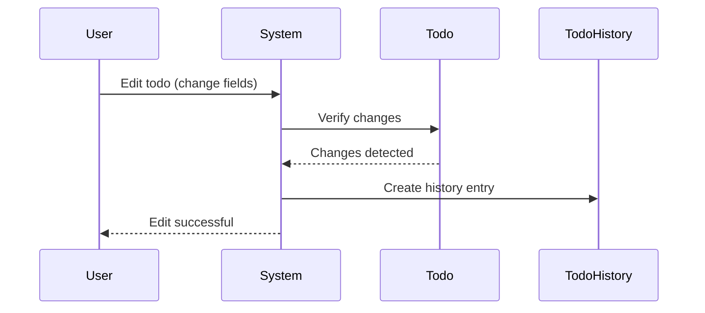
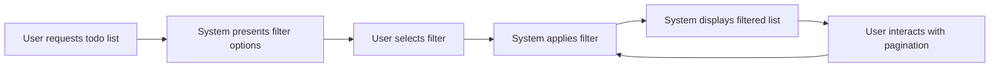
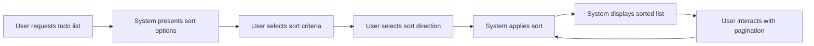
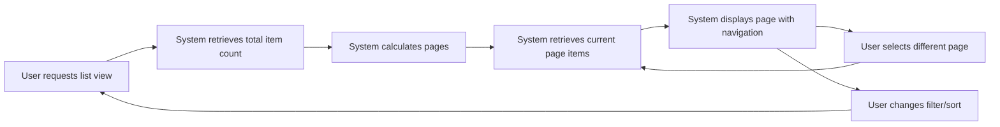

**todoApp — Business rules, validation constraints, data browsing expectations, error scenarios**

Business rules, validation constraints, data browsing expectations, error scenarios

# Domain Business Rules

Per-concept business rules, validation logic, and domain constraints.

## User Rules

Users must have a unique email address that serves as their primary identifier for authentication. Each user must have a password that meets security requirements, though the specific complexity rules are not defined in the requirements. Users have a display name that is editable but has no specified constraints on length or format. All user data is private to the individual, with no visibility to other users in the system. When a user deletes their account, all associated todos and todo histories are permanently removed from the system, ensuring complete data cleanup.

### Email Uniqueness and Identifier Role

### Email Uniqueness and Identifier Role

Every user's email address must be unique across the system. No two users can share the same email address.

When a new user attempts to sign up with an email address that is already registered, the system shall reject the request and indicate that the email is already in use.

When an existing user attempts to change their email address to one that is already registered by another user, the system shall reject the request and indicate that the email is already in use.

The email address serves as the primary identifier for user authentication. Users must use their email address (not display name or any other identifier) to log in to the system.

If a user forgets which email they used to register, there is no recovery mechanism provided in the requirements.

### Password Requirements and Management

### Password Requirements and Management

Users must provide a password when signing up. While the specific complexity rules (length, character types) are not defined in the requirements, the system must ensure that passwords are stored securely (though storage mechanisms are a technical detail, not a business rule).

When a user changes their password, the system must validate that the new password meets the same requirements as the initial password.

If a user attempts to change their password but provides an incorrect current password, the system shall reject the request and indicate that the current password is incorrect.

Password changes do not affect the user's authentication session - they remain logged in after changing their password.

There is no password recovery or reset mechanism defined in the requirements.

### Display Name Constraints and Editing

### Display Name Constraints and Editing

Users can edit their display name at any time. There are no constraints on the length, format, or content of the display name specified in the requirements.

Changing the display name does not affect the user's authentication credentials or email address.

The display name is for personal reference only and has no functional role in the system's operations.

If a user attempts to set their display name to an empty string or whitespace-only value, the system shall accept this as valid (no constraints specified).

### User Data Privacy and Isolation

### User Data Privacy and Isolation

All user data is completely private and isolated. Users cannot view, access, or interact with any data belonging to other users.

When listing todos, the system must only include todos owned by the currently authenticated user.

When viewing a specific todo, the system must verify that the todo belongs to the currently authenticated user before allowing access.

If a user attempts to access a todo that belongs to another user (even if they somehow obtain its identifier), the system shall reject the request and indicate that the todo cannot be found or accessed.

The same isolation applies to todo history entries - users can only view history for their own todos.

User profiles are completely private - users cannot view other users' profiles, display names, or any other profile information.

### Account Deletion and Data Cleanup

### Account Deletion and Data Cleanup

When a user deletes their account, the system must permanently remove all data associated with that user.

This includes:
- The user's profile information (email, password hash, display name)
- All todos created by the user, whether they are active, completed, or in the trash
- All edit history entries associated with the user's todos
- Any trash entries belonging to the user

Account deletion is irreversible. Once an account is deleted, there is no recovery mechanism for the user or their data.

If a user attempts to delete their account while not authenticated, the system shall reject the request.

Account deletion must complete successfully - partial deletions (where some user data remains) are not acceptable.

## Todo Rules

Todos must have a title; this is the only required field when creating a todo. Descriptions, start dates, and due dates are all optional fields that can be left empty. New todos are automatically marked as incomplete upon creation. Each todo belongs to exactly one user and cannot be accessed by any other users. When editing a todo, every change creates a history entry that records what was modified. Todos have a lifecycle that includes active, completed, and deleted states, with transitions between these states following specific business rules. Deleted todos are moved to a trash state rather than being immediately removed from the system.

### Todo Content Validation

**Title Requirement**
THE system SHALL require a title when creating a todo.

**Description Optionality**
THE system SHALL allow todo descriptions to be empty.

**Date Optionality**
THE system SHALL allow both start date and due date to be empty when creating a todo.

### Initial State Rules

**Default Completion Status**
WHEN a user creates a todo, THE system SHALL automatically mark it as incomplete.

### Ownership and Privacy Rules

**Single User Association**
WHERE a todo exists, THE system SHALL associate it with exactly one user account.

**Access Isolation**
THE system SHALL prevent users from accessing any todos not owned by them.

### Edit History Creation

**Automatic History Entry Creation**
WHEN a user edits a todo's title, description, start date, or due date, THE system SHALL create a history entry.

**History Field Recording**
WHERE a history entry is created, THE system SHALL record only the fields that were changed in that edit.

### Todo Lifecycle States

**Available States**
WHERE a todo exists, THE system SHALL maintain its completion status as either complete or incomplete.

**State Transitions**
THE system SHALL support users toggling a todo's completion status between complete and incomplete.

### Soft Delete Behavior

**Delete Operation**
WHEN a user deletes a todo, THE system SHALL NOT permanently remove the todo from the system.

**Access After Deletion**
WHERE a todo has been deleted, THE system SHALL NOT display it in the normal todo list.

**Trash Persistence**
THE system SHALL retain deleted todos in a separate trash state accessible only to the owner.

## TodoHistory Rules

Each todo history entry must be associated with exactly one todo. History entries are created automatically whenever any field of a todo is modified, capturing the change details. Each history entry records the exact timestamp when the edit occurred. The entry captures which specific fields were changed (title, description, start date, or due date) and what the new values are. History entries are permanently deleted when a todo is permanently removed from the trash. The system maintains a complete audit trail of all changes to todos, providing visibility into the evolution of each task. Users can only view history entries for their own todos, maintaining privacy of edit information.

### TodoHistory Association and Lifecycle

Each todo history entry must be associated with exactly one todo. When a todo is permanently deleted from the trash, all associated history entries are also permanently deleted. History entries cannot exist independently of their parent todo—they are always tied to the todo's lifecycle. Users can only access history entries through their associated todo; direct access to history entries without referencing the parent todo is not permitted.

The system maintains a complete audit trail of all changes to todos through these history entries, providing visibility into the evolution of each task over time.

### Automatic History Creation on Todo Edit

History entries are created automatically whenever any field of a todo is modified. The system detects changes in any of the following fields and creates a corresponding history entry:
- Title
- Description
- Start date
- Due date
- Completion status

No manual creation of history entries is permitted. The system must ensure that every edit operation that changes at least one field results in exactly one history entry being created. If an edit operation results in no actual changes to the todo fields, no history entry should be created.



### Timestamp and Field Change Recording

Each history entry records:
1. **Timestamp**: The exact date and time when the edit occurred, captured automatically at the moment the change is applied
2. **Changed fields**: Which specific fields were modified (title, description, start date, due date, or completion status)
3. **New values**: The exact values that were set for each changed field

If multiple fields are changed in a single edit operation, the history entry captures all changes together in a single timestamped record. The system does not record the previous values of fields—only the new values after the edit.

When the completion status is toggled (complete/incomplete), a history entry is created even though this is considered an edit rather than a field change in the traditional sense.

### User-Specific History Access Privacy

Users can only view history entries for their own todos. The system must enforce that:
- When a user requests todo history, the system verifies the user owns the parent todo
- If a user attempts to access history for a todo they don't own, the request is rejected
- History entries inherit the same privacy rules as their parent todos
- No user can view, access, or infer information about another user's todo history

The complete audit trail is private to the todo owner. There is no way for any user to see another user's edit history, even through indirect means like system reports or aggregated statistics.

### History Data Retention and Cleanup

History entries are permanently deleted when:
1. The parent todo is permanently deleted from the trash
2. A user's account is deleted (all todos and their histories are cleaned up)

The system must ensure that when a todo is permanently deleted, all associated history entries are also permanently and irrecoverably deleted. No orphaned history entries should remain in the system.

History entries for active todos (not deleted) are preserved indefinitely to maintain the complete audit trail. There is no automatic cleanup or archival of history entries based on age or count.

### History Entry Sorting and Display

When users view the edit history of a todo, history entries are sorted from most recent to oldest. This chronological reverse order (newest first) provides the most relevant recent changes at the top of the list.

Each history entry in the display shows:
- The timestamp of the edit
- Which fields were changed
- The new values for those fields

History entries are displayed in a paginated format when the number of entries exceeds the page size limit. The same pagination rules that apply to todo lists also apply to history lists.

### History Creation Constraints and Edge Cases

The system must handle the following edge cases:

1. **No-op edits**: If a user submits an edit that makes no actual changes to any field, no history entry is created
2. **Empty to non-empty**: Changing a field from empty (null) to a value creates a history entry
3. **Non-empty to empty**: Changing a field from a value to empty (null) creates a history entry
4. **Multiple simultaneous edits**: A single edit operation changing multiple fields creates one history entry capturing all changes
5. **Initial creation**: Todo creation does not create a history entry (history only tracks edits)
6. **Completion toggle**: Marking a todo as complete or incomplete creates a history entry with the new completion status

History entries should accurately reflect what was actually changed, not what the user attempted to change.

# Data Browsing Expectations

Business expectations for how users browse, find, and navigate through lists of data.

## List Browsing Expectations

Define business expectations for how users find, filter, and browse lists.

### Todo List Filtering Rules

### Todo List Filtering Rules

THE todoApp SHALL allow users to filter their todo list by completion status.

WHEN a user views their todo list, THE todoApp SHALL provide three filtering options:
- "All todos" - shows both complete and incomplete todos
- "Only complete todos" - shows only todos marked as complete
- "Only incomplete todos" - shows only todos marked as incomplete

IF a filter option is selected, THEN THE todoApp SHALL apply the selected filter to the displayed list.

IF no filter is explicitly selected, THEN THE todoApp SHALL default to showing "All todos".

WHERE filtering is applied, THE todoApp SHALL maintain the filter selection across pagination boundaries.

WHERE filtering is applied, THE todoApp SHALL ensure that only the user's own todos are visible in the filtered results.

IF a todo's completion status changes while a filter is applied, THEN THE todoApp SHALL update the filtered list accordingly (the todo may appear or disappear from view based on the current filter).




### Todo List Sorting Rules

### Todo List Sorting Rules

THE todoApp SHALL allow users to sort their todo list by different criteria.

WHEN a user views their todo list, THE todoApp SHALL provide sorting options for:
- Creation date (newest first or oldest first)
- Start date (earliest first or latest first)
- Due date (earliest first or latest first)

WHERE sorting by start date is selected, THE todoApp SHALL place todos without a start date at the end of the sorted list.

WHERE sorting by due date is selected, THE todoApp SHALL place todos without a due date at the end of the sorted list.

IF multiple sorting options could conflict, THEN THE todoApp SHALL apply the most recently selected sorting option.

WHERE sorting is applied, THE todoApp SHALL maintain the sort order across pagination boundaries.

WHERE sorting is applied, THE todoApp SHALL display the current sort criteria to the user.

IF a todo's date fields are edited while a sort is applied, THEN THE todoApp SHALL update the sort order accordingly (the todo may move to a different position in the sorted list).




### List Pagination Expectations

### List Pagination Expectations

THE todoApp SHALL display todo lists using pagination.

WHEN a user views their todo list, THE todoApp SHALL divide the list into pages.

WHEN a user views their trash list, THE todoApp SHALL divide the list into pages.

WHERE pagination is applied, THE todoApp SHALL display a limited number of items per page.

WHERE pagination is applied, THE todoApp SHALL provide navigation controls to move between pages.

WHERE pagination is applied, THE todoApp SHALL indicate the current page number and total pages (or total items).

WHERE pagination is applied, THE todoApp SHALL maintain any applied filters and sorting across page navigation.

IF filtering or sorting is changed while viewing a paginated list, THEN THE todoApp SHALL reset to the first page of the newly filtered/sorted results.

IF a todo is deleted, completed, or otherwise modified in a way that affects the current page count, THEN THE todoApp SHALL update the pagination display accordingly.




# Error Conditions

Business error scenarios and how the system should respond.

## Error Scenarios

Describe error conditions and expected system responses in natural language.

### Authentication and Account Error Scenarios

### Email Already Exists
If a user attempts to register with an email address that is already registered, the registration request is rejected.

### Incorrect Credentials
When a user attempts to log in with an email that does not exist in the system, the login request is rejected.
When a user attempts to log in with the correct email but an incorrect password, the login request is rejected.

### Password Change Requirements
If a user attempts to change their password but provides an incorrect current password, the password change request is rejected.
If a user attempts to change their password and the new password does not meet security requirements, the password change request is rejected.

### Account Deletion Authorization
If a user attempts to delete their account without being properly authenticated, the account deletion request is rejected.

### Display Name Edit Constraints
If a user attempts to change their display name to an empty value, the edit request is rejected.
If a user attempts to change their display name to a value containing prohibited characters, the edit request is rejected.

### Todo Operation Error Scenarios

### Todo Creation Validation
If a user attempts to create a todo without providing a title, the todo creation request is rejected.
If a user attempts to create a todo with a due date that is earlier than the start date, the todo creation request is rejected.

### Todo Access Violations
If a user attempts to view, edit, complete, or delete a todo that does not exist, the request is rejected.
If a user attempts to view, edit, complete, or delete a todo that belongs to another user, the request is rejected.

### Todo Editing Constraints
If a user attempts to edit a todo that has been permanently deleted (removed from trash), the edit request is rejected.
If a user attempts to edit a todo and provides invalid date values (e.g., due date earlier than start date), the edit request is rejected.

### Todo Completion Constraints
If a user attempts to mark a todo as complete that is already complete, the system maintains the current state (no error).
If a user attempts to mark a todo as incomplete that is already incomplete, the system maintains the current state (no error).

### Trash Operation Error Scenarios
If a user attempts to restore a todo from the trash that does not exist, the restore request is rejected.
If a user attempts to permanently delete a todo from the trash that does not exist, the deletion request is rejected.
If a user attempts to restore a todo from the trash that belongs to another user, the restore request is rejected.
If a user attempts to permanently delete a todo from the trash that belongs to another user, the deletion request is rejected.

### Data Browsing and Filtering Error Scenarios

```yaml
business_rules:
  - id: ERROR_PAGINATION_BOUNDARIES
    condition: "User requests a page number beyond total available pages"
    behavior: "System returns empty list or last available page"
    error_response: "Not an error condition - handled by default behavior"

  - id: ERROR_INVALID_PAGE_NUMBER
    condition: "User requests page number less than 1"
    behavior: "System treats it as page 1"
    error_response: "Not an error condition - handled by normalization"

  - id: ERROR_INVALID_FILTER_PARAMS
    condition: "User filters by unrecognized completion status"
    behavior: "System defaults to showing all todos"
    error_response: "Not an error condition - handled by default behavior"

  - id: ERROR_INVALID_SORT_PARAMS
    condition: "User sorts by unrecognized field"
    behavior: "System defaults to sorting by creation date"
    error_response: "Not an error condition - handled by default behavior"

  - id: ERROR_INVALID_SORT_DIRECTION
    condition: "User sorts with unrecognized direction"
    behavior: "System defaults to appropriate default direction for field"
    error_response: "Not an error condition - handled by default behavior"
```

### History Access Violations
If a user attempts to view the edit history of a todo that does not exist, the request is rejected.
If a user attempts to view the edit history of a todo that belongs to another user, the request is rejected.
If a user attempts to view the edit history of a todo that has been permanently deleted, the request is rejected.