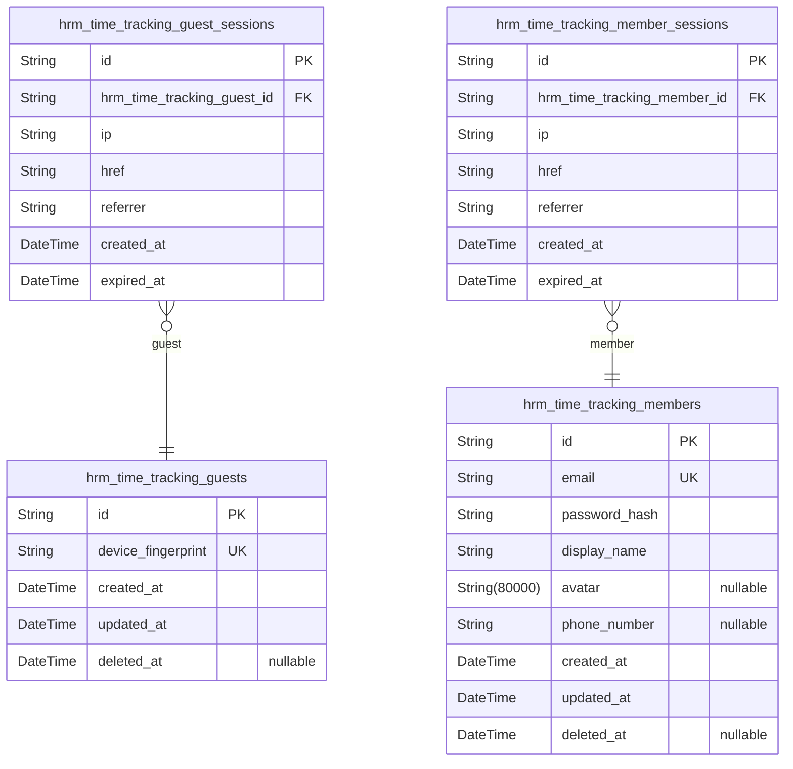
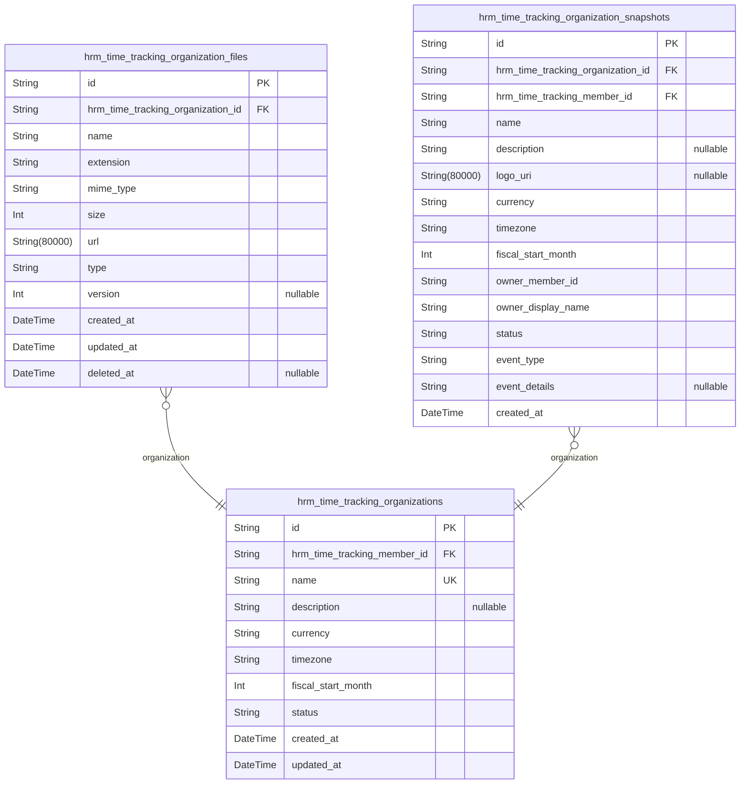
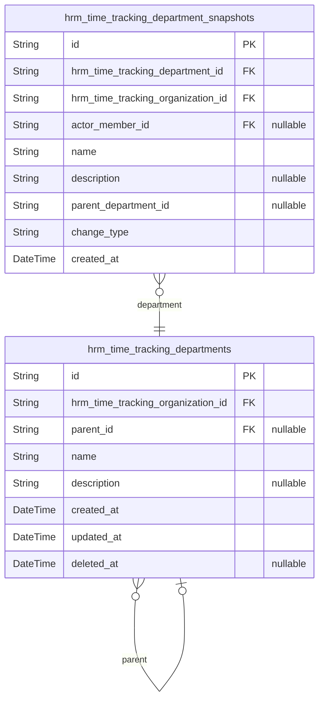
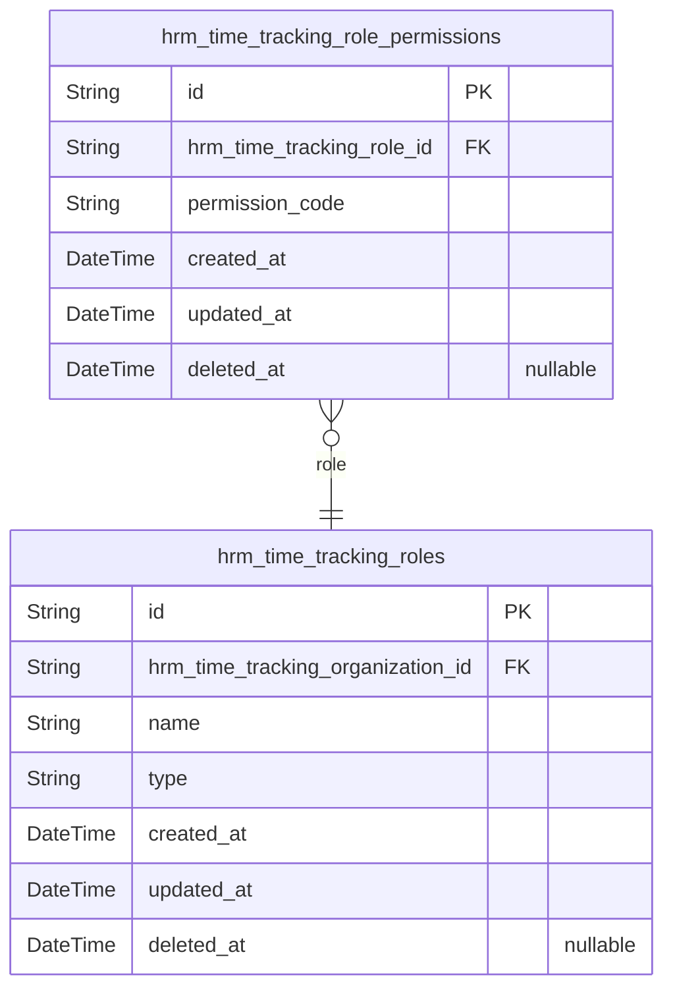
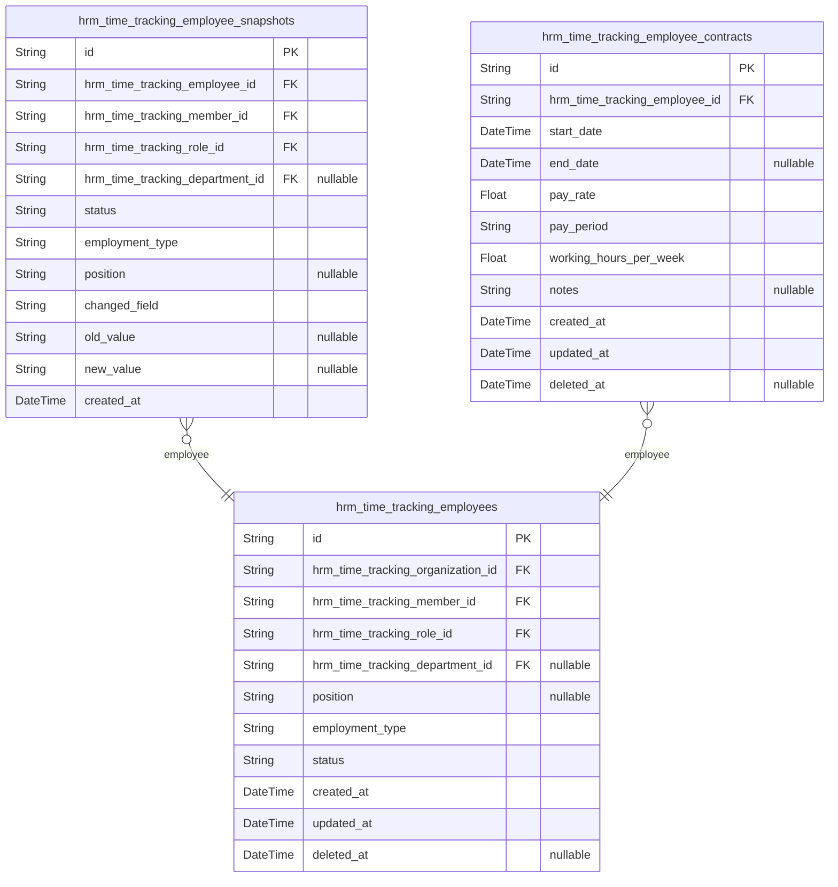
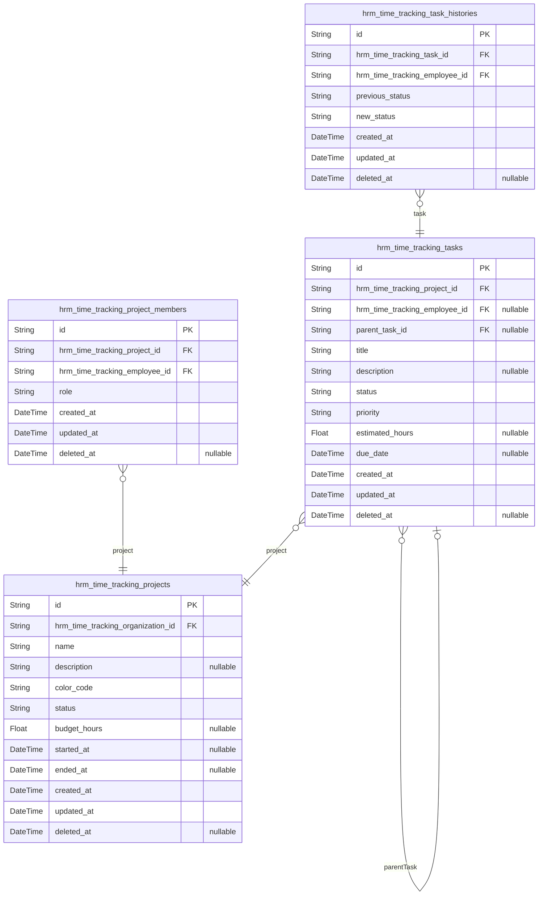
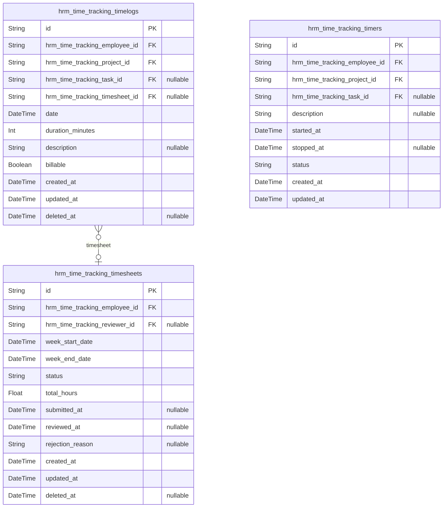
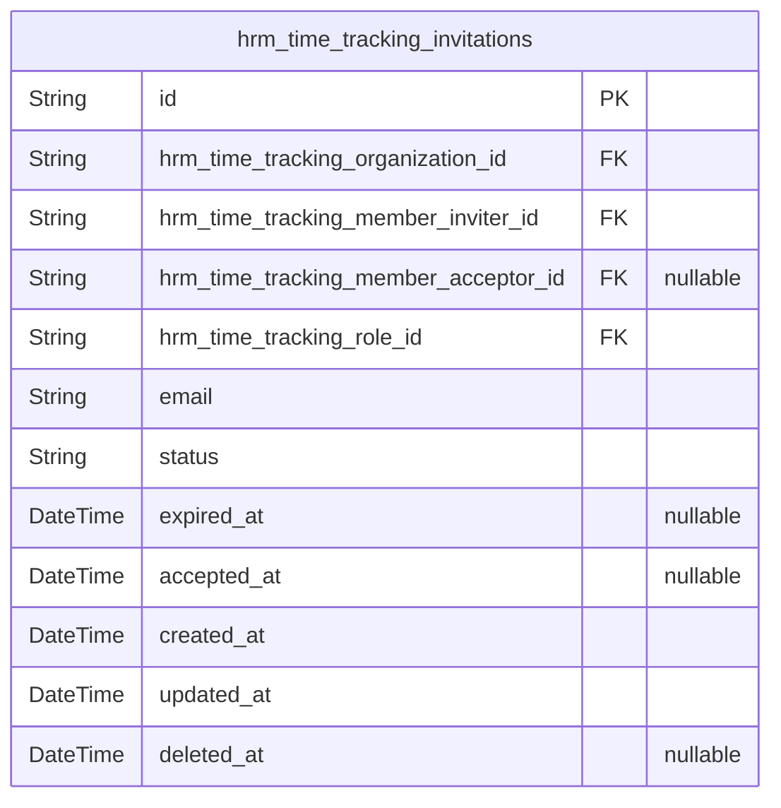
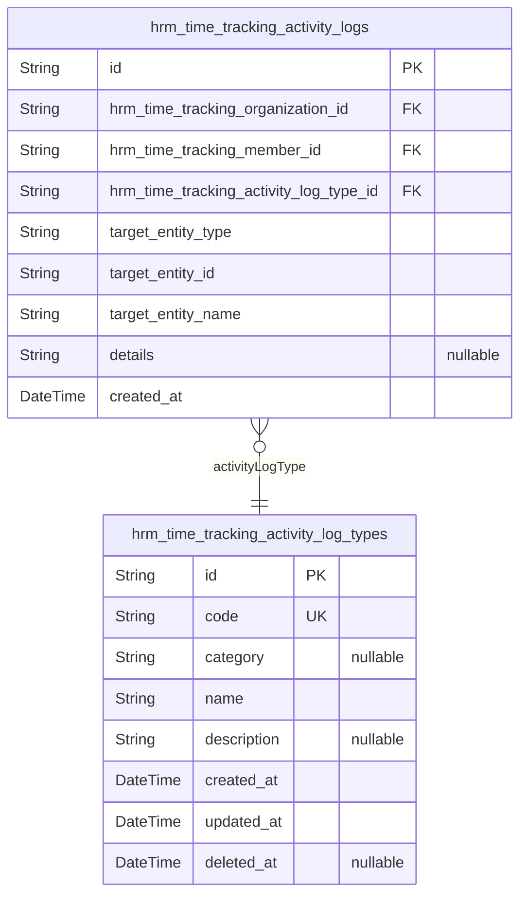

# Prisma Markdown

> Generated by [`prisma-markdown`](https://github.com/samchon/prisma-markdown)

- [hrm_time_tracking.users](#hrm_time_tracking.users)
- [hrm_time_tracking.organizations](#hrm_time_tracking.organizations)
- [hrm_time_tracking.departments](#hrm_time_tracking.departments)
- [hrm_time_tracking.roles](#hrm_time_tracking.roles)
- [hrm_time_tracking.employees](#hrm_time_tracking.employees)
- [hrm_time_tracking.projects](#hrm_time_tracking.projects)
- [hrm_time_tracking.time_tracking](#hrm_time_tracking.time_tracking)
- [hrm_time_tracking.invitations](#hrm_time_tracking.invitations)
- [hrm_time_tracking.activity_logs](#hrm_time_tracking.activity_logs)

## hrm_time_tracking.users

### `hrm_time_tracking_guests`

Temporary guest records identified by device fingerprint for anonymous
access tracking.

This table stores records for unauthenticated visitors who have not yet
established a recognized identity within the system. Each guest is
uniquely identified by a device fingerprint, enabling the system to
recognize returning anonymous users across browsing sessions before they
sign up or log in. Guest records are lightweight and temporary, serving
as the foundation for anonymous access tracking and the guest-to-member
transition flow.

Guests have no authentication credentials, no organization context, and
no access to protected features, as defined in the guest actor
specification. Their identifying information is limited to the device
fingerprint provided by the client. Once a guest successfully
authenticates via sign-up or login, they transition to a {@link
hrm_time_tracking_members} identity and this guest record is
soft-deleted.

The related [hrm_time_tracking_guest_sessions](#hrm_time_tracking_guest_sessions) table stores
temporary session tokens for guests, linked back to this table via
foreign key.

Properties as follows:

- `id`: Primary Key.
- `device_fingerprint`
  > Anonymous device identifier derived from client-side fingerprinting.
  >
  > This field uniquely identifies a guest's device across visits, allowing
  > the system to recognize returning anonymous users. The fingerprint is
  > generated client-side from browser and device characteristics and
  > transmitted with each request.
- `created_at`
  > Timestamp when the guest record was first created upon the initial
  > anonymous visit.
- `updated_at`: Timestamp when the guest record was last updated.
- `deleted_at`
  > Soft delete timestamp indicating the guest record is no longer active.
  > Set when the guest transitions to a member identity or the record is
  > purged during maintenance. Null indicates an active guest record.

### `hrm_time_tracking_guest_sessions`

Temporary session records for guest access, storing authentication tokens
with expiration tracking.

Each [hrm_time_tracking_guest_sessions](#hrm_time_tracking_guest_sessions) entry represents a single
authenticated session initiated by a [hrm_time_tracking_guests](#hrm_time_tracking_guests)
guest. Sessions are created upon guest identification and expire after a
defined period. A single guest may have multiple concurrent sessions
across different devices or browsers.

The table stores essential HTTP context at session creation time — the
client IP address, the current page URL (href), and the HTTP referrer —
enabling basic audit and security analysis. Session expiry is tracked via
the `expired_at` timestamp; expired sessions are rejected on subsequent
requests. This is an append-only table; sessions are never modified or
deleted once created.

Properties as follows:

- `id`: Primary Key. Unique identifier for each guest session record.
- `hrm_time_tracking_guest_id`
  > Foreign key referencing the [hrm_time_tracking_guests](#hrm_time_tracking_guests) guest who
  > owns this session.
  >
  > Each guest may have multiple active sessions across different devices or
  > browsers, establishing a one-to-many relationship between guest and
  > session records.
- `ip`
  > The IP address of the guest's client at the time the session was created.
  >
  > Used for basic security auditing and geographic analysis of access
  > patterns.
- `href`
  > The current page URL (document location) at the time the session was
  > created.
  >
  > Captures the entry point or landing page where the guest session was
  > initiated, useful for traffic source analysis.
- `referrer`
  > The HTTP Referer header value at the time the session was created.
  >
  > Indicates the previous page from which the guest arrived, enabling
  > analysis of navigation paths and external traffic sources.
- `created_at`
  > Timestamp indicating when this session was created.
  >
  > Used for session age calculation and audit purposes. This field is never
  > updated — sessions are append-only records.
- `expired_at`
  > Timestamp indicating when this session expires.
  >
  > Sessions past this timestamp are considered invalid and rejected by the
  > authentication system. Non-nullable by default for security — every
  > session must have a defined expiration.

### `hrm_time_tracking_members`

Registered user accounts representing the global identity of each person
on the platform.

Each [hrm_time_tracking_members](#hrm_time_tracking_members) record represents a person who
holds a platform account spanning all organizations they belong to. The
email address serves as the unique identifier across the entire platform
and is used together with a password hash for credential-based
authentication. Users interact with the system by authenticating with
their email and password, after which they select an organization context
to work within.

The global profile — display name, avatar image, and phone number — is
shared across all organizations the user belongs to. When a user updates
their display name or changes their avatar, the change takes effect
immediately in every organization they are a member of. This ensures a
consistent identity regardless of which organization context they are
currently working in.

User accounts and their associated personal data can be permanently
deleted when ownership conditions are satisfied (sole ownership must be
transferred or organization deleted first). For organizations where the
user was an employee but not the owner, the employee record is
deactivated while historical data is preserved.

Properties as follows:

- `id`: Primary key — unique identifier for each user account.
- `email`
  > The user's email address serving as their unique identifier across the
  > entire platform. Used for authentication (login) and communication
  > purposes. No two accounts can share the same email address.
- `password_hash`
  > The hashed representation of the user's password used for
  > credential-based authentication. Stored securely using a one-way hashing
  > algorithm; the original password is never stored in plaintext.
- `display_name`
  > The name shown throughout the platform when referring to the user, such
  > as in timelog entries, timesheet reviews, project member lists, and
  > activity log entries. Part of the global profile shared across all
  > organizations.
- `avatar`
  > Optional URL of the user's avatar image used for visual identification
  > across the user interface, appearing next to the user's name in lists,
  > comments, and profile views. Part of the global profile shared across all
  > organizations.
- `phone_number`
  > Optional contact phone number that can be stored for communication
  > purposes. Part of the global profile shared across all organizations.
- `created_at`: Timestamp when the user account was created upon successful registration.
- `updated_at`
  > Timestamp when the user account was last updated, such as after profile
  > edits or password changes.
- `deleted_at`
  > Timestamp when the user account was soft-deleted. When a user deletes
  > their account, the record is marked as deleted rather than immediately
  > removed, allowing for recovery or cleanup processes before permanent data
  > removal.

### `hrm_time_tracking_member_sessions`

JWT session tracking records for member authentication, storing the IP
address, page URL, and HTTP referrer at session creation time.

Each session belongs to exactly one [hrm_time_tracking_members](#hrm_time_tracking_members)
record. A member may have multiple concurrent sessions (e.g., logged in
from different devices or browsers). Sessions follow an append-only
lifecycle — once created, they are not updated but naturally expire based
on their [expired_at](#expired_at) timestamp. Expired sessions are filtered out
during authentication checks.

This table stores only session metadata. The actual JWT access and
refresh tokens are embedded in the session identifier and expiration
model. The [created_at](#created_at) and [expired_at](#expired_at) timestamps define
the session validity window, with [expired_at](#expired_at) being non-nullable
to enforce explicit expiration for security purposes.

Properties as follows:

- `id`: Primary Key - unique identifier for each member session record.
- `hrm_time_tracking_member_id`
  > Foreign key referencing the [hrm_time_tracking_members](#hrm_time_tracking_members) actor who
  > owns this session.
  >
  > Establishes the 1:N relationship where one member can have multiple
  > active sessions across different devices or browsers. This field is
  > always required — every session belongs to exactly one authenticated
  > member.
- `ip`
  > Client IP address at the time of session creation.
  >
  > Captured from the HTTP request source IP for audit and security
  > monitoring purposes. Stored as a plain string to support both IPv4 and
  > IPv6 formats.
- `href`
  > The page URL (path) where the member authenticated and the session was
  > created.
  >
  > Records the entry point URL for the session, useful for analytics and
  > understanding user navigation patterns.
- `referrer`
  > HTTP Referrer header value captured at session creation time.
  >
  > Indicates the previous page the member was on before authenticating,
  > useful for traffic source analysis and navigation flow understanding.
- `created_at`
  > Timestamp indicating when this session was created (member logged in).
  >
  > Used together with [expired_at](#expired_at) to determine the session validity
  > window. Sessions are append-only — this field is set once at creation and
  > never modified.
- `expired_at`
  > Timestamp indicating when this session expires.
  >
  > Always non-nullable for security — every session must have an explicit
  > expiration. Expired sessions are filtered out during authentication
  > validation. The system may also periodically purge expired session
  > records.

## hrm_time_tracking.organizations

### `hrm_time_tracking_organizations`

Core multi-tenant organization entity that serves as the tenant boundary
for all business operations within the time tracking system.

Each organization operates as an independent tenant with its own
employees, projects, tasks, timelogs, timesheets, departments, roles, and
all related data. Organization data is strictly isolated from all other
organizations. An organization is owned by a single {@link
hrm_time_tracking_members} user who created it and has full control over
settings, configuration, and lifecycle.

The `name` field is globally unique across all organizations. The
`status` field tracks the organization lifecycle: "active" for
operational organizations and "deleted" for terminated ones.
Organizations can only be deleted when all pending timesheets are
resolved and there are no active employee contracts. Upon deletion, all
associated data is permanently removed.

Configuration settings (`currency`, `timezone`, `fiscal_start_month`)
define the organization's operational context for financial calculations,
time reporting, and fiscal period boundaries.

Properties as follows:

- `id`: Primary Key.
- `hrm_time_tracking_member_id`
  > Foreign key to the [hrm_time_tracking_members](#hrm_time_tracking_members) user who owns this
  > organization and created it during sign-up.
  >
  > The owner has full control over organization settings, configuration
  > attributes, and lifecycle management including deletion. Only the owner
  > can edit or delete the organization.
- `name`
  > Globally unique organization display name used throughout the platform
  > for identification and branding. Must be unique across all organizations.
  > The system rejects organization creation or rename attempts that would
  > produce a duplicate name.
- `description`
  > Optional textual description of the organization's purpose, scope, or
  > background information. Free-form text with no length constraint beyond
  > reasonable UI limits.
- `currency`
  > Three-letter ISO 4217 currency code (e.g., "USD", "EUR", "KRW", "JPY")
  > used for financial calculations, pay rates, budget tracking, and cost
  > reporting across the organization.
- `timezone`
  > IANA timezone identifier (e.g., "America/New_York", "Asia/Seoul",
  > "Europe/London", "Australia/Sydney") used for date/time display,
  > timesheet week boundary calculations, reporting periods, and any
  > timezone-sensitive operations.
- `fiscal_start_month`
  > Numeric month (1=January through 12=December) indicating the start month
  > of the organization's fiscal year. Used for fiscal period calculations,
  > budget cycle reporting, and financial summaries.
- `status`
  > Organization lifecycle status indicating whether the organization is
  > "active" (operational, accepting employees/projects/time tracking) or
  > "deleted" (terminated by the owner).
- `created_at`
  > Timestamp of when this organization was first created during the user's
  > sign-up process.
- `updated_at`
  > Timestamp of the most recent modification to any organization attribute
  > or configuration setting.

### `hrm_time_tracking_organization_files`

File attachments for organizations storing metadata such as file type,
file size, storage URL/path, upload timestamp, and optional version
tracking for logo updates.

Each record represents a single uploaded file scoped within an
organization. Files serve various organizational purposes such as logo
images, identified by the type field. The table stores all relevant
metadata (original name, extension, MIME type, size in bytes, storage
URL) while keeping the actual file content in external storage. Optional
version tracking supports managing logo update history.

[hrm_time_tracking_organizations](#hrm_time_tracking_organizations) owns these file records and their
lifecycle — all files are cascade-deleted when the parent organization is
deleted. Soft deletion via deleted_at preserves data for recovery before
permanent cleanup.

Properties as follows:

- `id`: Primary Key.
- `hrm_time_tracking_organization_id`
  > Foreign key to the organization that owns this file.
  >
  > Each file is strictly scoped within a single {@link
  > hrm_time_tracking_organizations}. When the organization is deleted, all
  > associated file records are cascade-deleted. This field is required and
  > establishes the tenancy boundary for file access.
- `name`
  > Original filename of the uploaded file including its extension (e.g.,
  > 'company_logo.png').
- `extension`: File extension without the leading dot (e.g., 'png', 'jpg', 'pdf').
- `mime_type`
  > MIME type identifying the file format (e.g., 'image/png',
  > 'application/pdf', 'image/jpeg').
- `size`: File size in bytes.
- `url`
  > Storage URL or path where the file content is stored (e.g., S3 key, CDN
  > URL).
- `type`
  > Purpose or category of the file within the organization (e.g., 'logo',
  > 'report_attachment'). Determines how the file is used in business logic.
- `version`
  > Optional version number for tracking file updates. Used primarily for
  > logo images where versioning helps manage update history and cache
  > invalidation. Null for files without version tracking.
- `created_at`: Timestamp when the file record was created.
- `updated_at`: Timestamp when the file record was last updated.
- `deleted_at`
  > Timestamp for soft deletion. Null if the file record is active. Soft
  > deletion preserves data for potential recovery before permanent cleanup.

### `hrm_time_tracking_organization_snapshots`

Immutable point-in-time snapshots capturing organization state for
lifecycle audit trail.

Each snapshot records the complete state of an organization at a specific
moment when a significant event occurred, such as creation, settings
update, ownership transfer, or deletion. Snapshots include all
organization attributes (name, description, logo, currency, timezone,
fiscal start month), the owner reference, and the organization status at
that point in time, along with the actor who triggered the event and the
event type classification. This table is append-only — entries are never
modified or deleted, ensuring a reliable audit trail for organizational
governance.

Properties as follows:

- `id`: Primary key.
- `hrm_time_tracking_organization_id`
  > The organization that this snapshot captures state for.
  >
  > References the [hrm_time_tracking_organizations](#hrm_time_tracking_organizations) table. Each
  > snapshot belongs to a single organization and captures its complete
  > attributes at a specific point in time when a lifecycle event occurred.
- `hrm_time_tracking_member_id`
  > The member (user) who performed the action that triggered this snapshot.
  >
  > References the [hrm_time_tracking_members](#hrm_time_tracking_members) table. Identifies the
  > user whose action — creation, settings update, ownership transfer, or
  > deletion — caused the organization state to be captured. This provides
  > accountability for every organizational change.
- `name`
  > The organization name at the time this snapshot was taken.
  >
  > Denormalized from the organization to preserve the historical record of
  > what the organization was named at the moment of the event.
- `description`
  > The organization description at the time this snapshot was taken.
  >
  > Denormalized from the organization to preserve historical context. Null
  > if no description was set.
- `logo_uri`
  > The organization logo image URL at the time this snapshot was taken.
  >
  > Denormalized from the organization to preserve historical branding
  > information. Null if no logo was set.
- `currency`
  > The organization currency setting at the time this snapshot was taken.
  >
  > Denormalized from the organization. Examples: USD, EUR, KRW.
- `timezone`
  > The organization timezone setting at the time this snapshot was taken.
  >
  > Denormalized from the organization. Example: America/New_York, Asia/Seoul.
- `fiscal_start_month`
  > The organization fiscal start month at the time this snapshot was taken.
  >
  > Denormalized from the organization. Represented as an integer (1=January
  > through 12=December).
- `owner_member_id`
  > The member ID of the organization owner at the time this snapshot was
  > taken.
  >
  > Denormalized from the organization to preserve historical ownership
  > records. References the same user identity as the {@link
  > hrm_time_tracking_members} table.
- `owner_display_name`
  > The display name of the organization owner at the time this snapshot was
  > taken.
  >
  > Denormalized from the user profile to ensure the owner's identity is
  > preserved even if the user later changes their display name.
- `status`
  > The organization status at the time this snapshot was taken.
  >
  > Typical values include 'active' and 'deleted'.
- `event_type`
  > The type of event that triggered this snapshot.
  >
  > Classification of the action that caused the snapshot: 'created' for
  > organization creation, 'settings_updated' for configuration changes,
  > 'ownership_transferred' for owner change, 'deleted' for organization
  > deletion.
- `event_details`
  > Free-form contextual details about the event that triggered this snapshot.
  >
  > Optional field capturing additional context such as a summary of what
  > changed, e.g., 'Currency changed from USD to EUR' or relevant
  > identifiers.
- `created_at`
  > Timestamp when this snapshot was created.
  >
  > Records the exact moment the organization state was captured. This field
  > is immutable after creation.

## hrm_time_tracking.departments

### `hrm_time_tracking_departments`

Organizational departments that group employees by function, with
optional single-level parent-child hierarchy for sub-department
structuring.

Each [hrm_time_tracking_departments](#hrm_time_tracking_departments) belongs to exactly one {@link
hrm_time_tracking_organizations}, enforcing multi-tenant data isolation.
Departments serve as a filtering criterion when viewing the employee
list, allowing authorized users to narrow down employees by department. A
department can exist without any employees assigned.

The parent department relationship enables a single level of nesting.
When a parent department is soft-deleted, its child departments become
top-level departments — their parent reference is set to null. Department
deletion also sets the department reference to null on all affected
employees; employees are never deleted or deactivated as a side effect of
department removal.

Properties as follows:

- `id`: Primary Key.
- `hrm_time_tracking_organization_id`
  > The organization that owns this department.
  >
  > Every department belongs to exactly one {@link
  > hrm_time_tracking_organizations}, establishing the multi-tenant data
  > boundary. All department operations (create, read, update, delete, list)
  > are scoped within this organization context.
- `parent_id`
  > The parent department in a single-level hierarchy.
  >
  > When set, this department is a sub-department of the referenced parent
  > department. The hierarchy is limited to one level of nesting — a
  > sub-department cannot have its own sub-departments. When the parent
  > department is soft-deleted, this field is set to null, making the
  > sub-department a top-level department.
  >
  > This is a self-referential foreign key pointing to {@link
  > hrm_time_tracking_departments}.
- `name`
  > Human-readable name of the department (e.g., "Engineering", "Marketing",
  > "Human Resources").
  >
  > Must be unique within the organization. Displayed in employee records and
  > department selection lists throughout the UI.
- `description`
  > Optional explanatory text describing the department's function,
  > responsibilities, or purpose within the organization.
  >
  > May be empty or null.
- `created_at`
  > Timestamp when the department record was created.
  >
  > Set automatically on creation and never modified after.
- `updated_at`
  > Timestamp when the department record was last updated.
  >
  > Updated automatically whenever any field on the department changes.
- `deleted_at`
  > Timestamp when the department was soft-deleted.
  >
  > When a department is deleted, the system sets this timestamp rather than
  > physically removing the row. Employees referencing this department have
  > their department reference set to null. Soft deletion preserves audit
  > trail integrity while respecting the business rule that deleting a
  > department does not delete employees.

### `hrm_time_tracking_department_snapshots`

Point-in-time snapshots of department state for audit and history tracking.

This table records immutable snapshots of a {@link
hrm_time_tracking_departments} whenever it is created, updated, or
deleted. Each snapshot captures the complete department state (name,
description, parent department) at that moment, preserving historical
data even after the department is modified or removed.

The actor who performed the change is recorded via {@link
hrm_time_tracking_members} reference, and the organization is stored
directly on each snapshot for efficient organization-scoped queries
without requiring a join through the department table.

Properties as follows:

- `id`: Primary Key.
- `hrm_time_tracking_department_id`
  > The department that this snapshot captures state for.
  >
  > References [hrm_time_tracking_departments](#hrm_time_tracking_departments). Multiple snapshots may
  > exist for the same department, forming a chronological history of
  > changes.
- `hrm_time_tracking_organization_id`
  > The organization that owns the department at the time of this snapshot.
  >
  > Denormalized from the department for direct organization-scoped queries.
  > References [hrm_time_tracking_organizations](#hrm_time_tracking_organizations).
- `actor_member_id`
  > The member who performed the action that triggered this snapshot.
  >
  > References [hrm_time_tracking_members](#hrm_time_tracking_members). Nullable for
  > system-generated actions where no specific user was the actor.
- `name`: The department name at the time of this snapshot.
- `description`: The department description at the time of this snapshot, if any.
- `parent_department_id`
  > The ID of the parent department at the time of this snapshot, if any.
  >
  > Denormalized — not a foreign key constraint, as the parent department may
  > be deleted after this snapshot is taken. Captures the one-level nesting
  > hierarchy as it existed at snapshot time.
- `change_type`
  > The type of change that triggered this snapshot.
  >
  > One of: "created", "updated", "deleted". Distinguishes the lifecycle
  > event that caused the snapshot to be recorded.
- `created_at`: The timestamp when this snapshot was recorded.

## hrm_time_tracking.roles

### `hrm_time_tracking_roles`

Defines named permission sets within an organization, including three
immutable built-in roles (Owner, Manager, Employee) seeded at
organization creation and user-created custom roles with configurable
permission sets.

Each role belongs to exactly one [hrm_time_tracking_organizations](#hrm_time_tracking_organizations).
The `type` field distinguishes built-in roles (which cannot be deleted or
renamed) from custom roles (which can be created, edited, and deleted by
organization owners). Role names must be unique within the organization
to prevent ambiguity.

Permissions are assigned to roles via the {@link
hrm_time_tracking_role_permissions} junction table, which supports a
many-to-many relationship between roles and the 9 fixed system
permissions (org:manage, employee:manage, employee:view, project:manage,
project:view, time:manage, time:approve, time:view_all, report:view).

Each [hrm_time_tracking_employees](#hrm_time_tracking_employees) is assigned exactly one role,
which governs their permissions within the organization. Role assignments
can be changed by users with `employee:manage` permission. Built-in roles
cannot be deleted; custom roles can only be deleted if no employees are
currently assigned to them.

Properties as follows:

- `id`: Primary key.
- `hrm_time_tracking_organization_id`
  > Foreign key to the organization that owns this role. Every role is scoped
  > within exactly one organization, enforcing multi-tenant data isolation.
  >
  > Built-in roles (Owner, Manager, Employee) are seeded automatically when
  > an organization is created. Custom roles are created by organization
  > owners or users with `org:manage` permission. Deleting an organization
  > cascades to all its associated roles.
- `name`
  > Display name of the role. For built-in roles, this is one of "Owner",
  > "Manager", or "Employee". For custom roles, this is a user-defined name
  > that must be unique within the organization.
  >
  > Built-in role names are immutable and cannot be changed by any user.
  > Custom role names can be edited by users with `org:manage` permission.
- `type`
  > Classification distinguishing immutable system-defined roles from
  > user-managed custom roles.
  >
  > - `built_in`: One of the three seeded roles (Owner, Manager, Employee).
  > Cannot be deleted or renamed by any user.
  > - `custom`: User-created role with configurable permissions. Can be
  > created, renamed, and deleted by organization owners, provided no active
  > employees are currently assigned to it.
- `created_at`
  > Timestamp when this role was created. For built-in roles, this is set at
  > organization creation time when the three default roles are seeded. For
  > custom roles, this is set when an organization owner creates the role
  > through the role management interface.
- `updated_at`
  > Timestamp when this role was last modified. Tracks updates to role
  > properties such as name changes (custom roles only) or metadata updates.
  > Built-in roles should never have their name or type changed, and ideally
  > their updated_at remains unchanged after creation.
- `deleted_at`
  > Timestamp when this role was soft-deleted. Only applies to custom roles —
  > built-in roles cannot be deleted under any circumstances.
  >
  > When null, the role is active and can be assigned to employees. When set,
  > the role is considered deleted and cannot be assigned to new employees.
  > The system enforces that a custom role cannot be deleted if any active
  > employees are currently assigned to it. Soft deletion preserves
  > referential integrity with historical employee records and activity log
  > entries that reference this role.

### `hrm_time_tracking_role_permissions`

Junction table mapping individual system permissions to roles within an
organization.

Each row associates one [hrm_time_tracking_roles](#hrm_time_tracking_roles) with one
permission code from the 9 fixed system permissions (org:manage,
employee:manage, employee:view, project:manage, project:view,
time:manage, time:approve, time:view_all, report:view). This enables the
many-to-many relationship between roles and permissions, allowing custom
roles to have configurable permission sets while built-in roles (Owner,
Manager, Employee) receive their predefined permission sets at
organization creation.

The composite unique constraint on (hrm_time_tracking_role_id,
permission_code) ensures no role has duplicate permission assignments.
When a role is deleted, its associated permission mappings are
cascade-deleted.

Properties as follows:

- `id`: Primary Key.
- `hrm_time_tracking_role_id`
  > Foreign key to the role this permission belongs to.
  >
  > Each row associates exactly one permission code with one {@link
  > hrm_time_tracking_roles}. When a role is deleted, all its permission
  > mappings are cascade-deleted.
- `permission_code`
  > The permission code assigned to the role.
  >
  > One of 9 fixed system permissions: org:manage, employee:manage,
  > employee:view, project:manage, project:view, time:manage, time:approve,
  > time:view_all, report:view. Built-in roles (Owner, Manager, Employee)
  > receive predefined sets of these permissions at organization creation,
  > while custom roles have configurable selections by users with org:manage
  > permission.
- `created_at`: Timestamp when this role-permission mapping was created.
- `updated_at`: Timestamp when this role-permission mapping was last updated.
- `deleted_at`
  > Soft delete timestamp. If set, this role-permission mapping is considered
  > deleted.

## hrm_time_tracking.employees

### `hrm_time_tracking_employees`

Employee records representing user membership within an organization.
Employees bridge a [user account](#hrm_time_tracking_members) with an
[organization](#hrm_time_tracking_organizations), granting the user
permissions and access within that organization's multi-tenant boundary.

Each employee is assigned exactly one {@link hrm_time_tracking_roles
role} defining their permissions. An employee may optionally belong to a
[department](#hrm_time_tracking_departments) for structural grouping.
The employee's employment type (full-time, part-time, contractor, intern)
and status (active, deactivated) determine their participation in time
tracking operations.

An employee can have multiple {@link hrm_time_tracking_employee_contracts
contracts} over time (only one active at a time) and is linked to
historical snapshots via {@link hrm_time_tracking_employee_snapshots
employee snapshots}. Deactivated employees retain all historical data
(timelogs, timesheets, contracts) but cannot create new time entries.

Properties as follows:

- `id`: Primary key for the employee record.
- `hrm_time_tracking_organization_id`
  > Foreign key to the [organization](#hrm_time_tracking_organizations)
  > this employee belongs to. All employee operations are scoped within this
  > organization's multi-tenant boundary.
- `hrm_time_tracking_member_id`
  > Foreign key to the [user account](#hrm_time_tracking_members) that
  > owns this employee record. A single user may be an employee in multiple
  > organizations, but only once per organization (enforced by unique
  > constraint).
- `hrm_time_tracking_role_id`
  > Foreign key to the [role](#hrm_time_tracking_roles) assigned to this
  > employee. Each employee has exactly one role defining their permissions
  > within the organization.
- `hrm_time_tracking_department_id`
  > Optional foreign key to the {@link hrm_time_tracking_departments
  > department} this employee belongs to. Null when the employee is not
  > assigned to any department.
- `position`
  > Job position or title of the employee within the organization (e.g.,
  > "Software Engineer", "Team Lead"). Optional field providing
  > organizational context about the employee's function.
- `employment_type`
  > Classification of the employee's work arrangement. Allowed values:
  > full-time, part-time, contractor, intern. Determines compensation model
  > and work schedule expectations.
- `status`
  > Current operational status of the employee record. Allowed values:
  > active, deactivated. Active employees can log time, submit timesheets,
  > and access organization features. Deactivated employees are blocked from
  > time tracking operations but their historical data (timelogs, timesheets,
  > contracts) is preserved.
- `created_at`
  > Timestamp when the employee record was first created within the
  > organization.
- `updated_at`
  > Timestamp when the employee record was last modified, including role
  > changes, department reassignments, position updates, employment type
  > changes, or status transitions.
- `deleted_at`
  > Soft delete timestamp indicating the employee record has been
  > deactivated. Null when the employee is active. Deactivated employees
  > retain all historical data (timelogs, timesheets, contracts) but cannot
  > perform time tracking operations.

### `hrm_time_tracking_employee_snapshots`

Immutable point-in-time snapshots capturing employee record state changes
for audit trail purposes.

Each snapshot records the full state of an {@link
hrm_time_tracking_employees} record at the moment of a significant
change, including denormalized employee attributes (status,
employment_type, position) and foreign key references to the employee's
role and department assignments at that time. Change metadata fields
(`changed_field`, `old_value`, `new_value`) identify what was modified
and the before/after values.

This table serves as an immutable audit trail for employee record
changes, enabling historical review of all modifications to an employee's
record throughout their lifecycle within an organization. Snapshots are
created automatically on events such as status transitions (active ↔
deactivated), role re-assignments, employment type changes, and position
or department updates.

Properties as follows:

- `id`: Primary key.
- `hrm_time_tracking_employee_id`
  > Foreign key to the [hrm_time_tracking_employees](#hrm_time_tracking_employees) record whose state
  > is captured by this snapshot.
- `hrm_time_tracking_member_id`
  > Foreign key to the [hrm_time_tracking_members](#hrm_time_tracking_members) record representing
  > the authenticated user who performed the change that triggered this
  > snapshot.
- `hrm_time_tracking_role_id`
  > Foreign key to the [hrm_time_tracking_roles](#hrm_time_tracking_roles) record representing
  > the employee's role assignment at the time this snapshot was taken. This
  > captures the role state as it was when the change occurred, preserving
  > the historical role assignment for audit purposes.
- `hrm_time_tracking_department_id`
  > Foreign key to the [hrm_time_tracking_departments](#hrm_time_tracking_departments) record
  > representing the employee's department assignment at the time this
  > snapshot was taken. Nullable because employees may not be assigned to any
  > department.
- `status`
  > The employee's status at the time this snapshot was taken. Possible
  > values are "active" and "deactivated".
- `employment_type`
  > The employee's employment type at the time this snapshot was taken.
  > Possible values are "full-time", "part-time", "contractor", and "intern".
- `position`
  > The employee's position or job title at the time this snapshot was taken.
  > Nullable because employees may not have a position set.
- `changed_field`
  > The name of the employee record field that was modified, triggering this
  > snapshot. Possible values include "status", "role_id", "employment_type",
  > "department_id", and "position".
- `old_value`
  > The previous value of the changed field before the modification. Nullable
  > because the initial snapshot when an employee is first created has no
  > prior state to record.
- `new_value`
  > The new value of the changed field after the modification. Nullable when
  > the change clears a previously set value (e.g., removing a department
  > assignment or clearing a position field).
- `created_at`
  > Timestamp recording when this snapshot was created, capturing the exact
  > moment of the employee record change.

### `hrm_time_tracking_employee_contracts`

Employment contracts documenting pay terms, working hours, pay period,
and duration for each employee.

Each contract belongs to exactly one [hrm_time_tracking_employees](#hrm_time_tracking_employees).
An employee may have multiple contracts over time, forming a complete
compensation history. Only one contract can be active (end_date IS NULL)
per employee at any given time. When a new contract is created, the
system automatically ends the previous active contract by setting its
end_date to the day before the new contract's start_date.

Contracts follow a lifecycle: active contracts (end_date IS NULL) can be
edited by authorized users to update compensation terms; past contracts
(end_date IS NOT NULL) become immutable historical records preserving the
employee's pay history accurately.

Properties as follows:

- `id`: Primary Key.
- `hrm_time_tracking_employee_id`
  > Foreign key to the employee who owns this contract.
  >
  > Each contract is owned by exactly one [hrm_time_tracking_employees](#hrm_time_tracking_employees)
  > and records that employee's pay terms for a specific time period. An
  > employee may have multiple contracts over their employment history
  > forming a gapless timeline, but only one contract can be active (end_date
  > IS NULL) at any given time.
- `start_date`
  > The date when this contract becomes effective.
  >
  > This required field marks the beginning of the contract term. The unique
  > constraint on (hrm_time_tracking_employee_id, start_date) ensures no two
  > contracts for the same employee start on the same day. When a new
  > contract is created, the system uses its start_date to automatically end
  > the previous active contract by setting its end_date to the day before.
- `end_date`
  > The date when this contract ends.
  >
  > When null, the contract is currently active (ongoing with no
  > predetermined end). When set, the contract has ended on this date. Only
  > one contract per employee can have a null end_date at any time. The
  > system automatically sets this field on the previously active contract
  > when a new contract is created, setting it to the day before the new
  > contract's start_date to ensure gapless coverage. Users with
  > employee:manage permission can also set or update this field on active
  > contracts.
- `pay_rate`
  > The monetary compensation rate for this contract.
  >
  > Represents the pay amount per the specified pay_period unit. For example,
  > if pay_period is 'hourly' and pay_rate is 25.00, the employee earns
  > $25.00 per hour worked. If pay_period is 'monthly' and pay_rate is
  > 4000.00, the employee earns $4,000.00 per month. Required field with
  > numeric precision.
- `pay_period`
  > The time unit for the pay_rate.
  >
  > One of: hourly, daily, weekly, monthly. Determines how the pay_rate value
  > is interpreted (e.g., hourly = rate per hour worked, monthly = fixed
  > amount per month). Validated at the application layer against the allowed
  > set of values.
- `working_hours_per_week`
  > The expected number of working hours per week under this contract.
  >
  > Used for scheduling, capacity planning, and overtime calculations. A
  > typical value is 40 for full-time employees. Required field recorded per
  > contract since working arrangements may change between contracts.
- `notes`
  > Optional notes about this contract.
  >
  > May contain additional terms, conditions, or remarks about the employment
  > arrangement such as specific benefits, location details, equipment
  > provisions, or special provisions not covered by the structured fields.
- `created_at`: Timestamp when this contract record was created.
- `updated_at`
  > Timestamp when this contract record was last updated.
  >
  > Active contracts (end_date IS NULL) can be updated by users with
  > employee:manage permission to modify pay rate, pay period, working hours,
  > end date, or notes. Past contracts (end_date IS NOT NULL) are immutable
  > and should not receive updates.
- `deleted_at`
  > Timestamp when this contract was soft-deleted.
  >
  > When set, the contract is considered deleted but retained for historical
  > record and audit purposes. Past contracts that are immutable may still be
  > soft-deleted for data management purposes.

## hrm_time_tracking.projects

### `hrm_time_tracking_projects`

Work initiatives within an organization that serve as containers for time
tracking, task management, and reporting activities.

Each project belongs to exactly one {@link
hrm_time_tracking_organizations} and provides the primary organizational
unit for logging time, creating tasks, and tracking budgets. Projects
follow a lifecycle status flow: active (accepting new timelogs and
tasks), archived (preserving data but blocking new entries), or completed
(finished state with all data preserved). The color_code field enables
visual differentiation in the user interface. Optional budget_hours
supports budget vs. actual reporting comparisons. Optional started_at and
ended_at define the project's time window for timeline and scheduling
views. Soft deletion via deleted_at preserves historical data integrity
for associated timelogs, tasks, and timesheets when projects are removed.

Properties as follows:

- `id`: Primary key for the project.
- `hrm_time_tracking_organization_id`
  > The organization that owns this project.
  >
  > All project data is scoped to the owning organization. Users can only see
  > and manage projects within their currently selected organization context.
  > This FK establishes the multi-tenancy boundary for project data.
- `name`
  > Display name of the project.
  >
  > Shown in project lists, timelog selectors, task views, and reports. Must
  > be a non-empty string.
- `description`
  > Optional detailed description of the project's purpose, scope, or goals.
  >
  > Visible on the project detail page and in project selection dropdowns.
- `color_code`
  > Hex color code for visual UI differentiation (e.g., '#FF5733').
  >
  > Used to visually distinguish projects in the interface, such as in
  > timelog entries, project cards, and Gantt-like views.
- `status`
  > Current lifecycle status of the project.
  >
  > Valid values: 'active' (accepting new timelogs and tasks), 'archived' (no
  > new timelogs or tasks, but data preserved), 'completed' (finished state,
  > no new entries, data preserved). Archived and completed projects preserve
  > all existing timelogs, tasks, and project member data.
- `budget_hours`
  > Optional total estimated hours budgeted for this project.
  >
  > Used in project budget reports to compare planned vs. actual hours.
  > Projects without a budget value are excluded from budget utilization
  > calculations.
- `started_at`
  > Optional planned or actual start date of the project.
  >
  > Represents when work on the project begins or began. Used for timeline
  > views, project scheduling, and planning reports.
- `ended_at`
  > Optional planned or actual end date of the project.
  >
  > Represents when the project is expected to or did conclude. Used for
  > timeline views, project scheduling, and planning reports.
- `created_at`: Timestamp when the project record was first created.
- `updated_at`: Timestamp when the project record was last modified.
- `deleted_at`
  > Timestamp when the project was soft-deleted.
  >
  > Soft deletion preserves historical data integrity for associated
  > timelogs, tasks, and timesheets. A non-null value indicates the project
  > has been removed from active use but its historical data remains intact
  > for reporting and audit purposes.

### `hrm_time_tracking_project_members`

Junction table linking employees to projects with an assigned role.

Each row represents one employee's membership in one project,
establishing the employee's right to log time against that project and be
assigned tasks within it. The assigned role controls the level of
authority the employee has within the project context.

This table enforces the many-to-many relationship between {@link
hrm_time_tracking_employees} and [hrm_time_tracking_projects](#hrm_time_tracking_projects), with
the constraint that an employee can have at most one membership per
project (enforced by the composite unique index).

When a project member is removed from a project, the record is
soft-deleted rather than hard-deleted to preserve historical assignee
data on tasks.

Properties as follows:

- `id`: Primary key.
- `hrm_time_tracking_project_id`
  > Foreign key to the project this membership belongs to.
  >
  > References [hrm_time_tracking_projects](#hrm_time_tracking_projects). Establishes which project
  > the employee is assigned to and can log time against.
- `hrm_time_tracking_employee_id`
  > Foreign key to the employee who is a member of the project.
  >
  > References [hrm_time_tracking_employees](#hrm_time_tracking_employees). Establishes which
  > employee gains access to the project for time logging and task
  > assignment.
- `role`
  > Assigned role of this employee within the project.
  >
  > Valid values are "member" (standard project participant with time logging
  > and task viewing permissions) and "project-lead" (elevated permissions
  > including task management within the project). Determines the scope of
  > actions the employee can perform in the project context.
- `created_at`: Timestamp when this project membership was created.
- `updated_at`: Timestamp when this project membership was last updated.
- `deleted_at`
  > Timestamp when this project membership was soft-deleted (employee removed
  > from project). Null indicates the membership is still active.

### `hrm_time_tracking_tasks`

Discrete work items within a project that represent specific units of
work to be completed.

Each task belongs to exactly one [hrm_time_tracking_projects](#hrm_time_tracking_projects) and
tracks its progress through a linear status flow (open → in-progress →
completed → closed). Tasks support priority levels (low, medium, high,
urgent) for importance ranking, and can optionally be assigned to a
specific [hrm_time_tracking_employees](#hrm_time_tracking_employees) who must be a member of the
task's parent project. Tasks support one level of subtask nesting through
an optional self-referencing parent task relationship. Every status
change is recorded as an immutable {@link
hrm_time_tracking_task_histories} entry for full audit trail coverage.

Properties as follows:

- `id`: Primary key.
- `hrm_time_tracking_project_id`
  > The project this task belongs to.
  >
  > Every task is scoped to exactly one project. Tasks cannot exist outside a
  > project context.
- `hrm_time_tracking_employee_id`
  > The employee assigned to complete this task.
  >
  > When assigned, the employee must be a member of the task's parent project
  > (enforced through [hrm_time_tracking_project_members](#hrm_time_tracking_project_members)). An
  > unassigned task has no designated owner.
- `parent_task_id`
  > The parent task that this task is a subtask of.
  >
  > Supports exactly one level of nesting — a subtask cannot itself have
  > child tasks. A task without a parent is a top-level task.
- `title`
  > A brief summary of the work to be done.
  >
  > This is the primary human-readable identifier for the task, displayed in
  > task lists, project boards, and assignment views.
- `description`
  > Detailed instructions, context, or notes about the work.
  >
  > Provides additional information beyond the title to help the assigned
  > employee understand the scope and requirements of the task.
- `status`
  > The current progress state of the task following a linear lifecycle.
  >
  > Allowed values: open (work not yet started, default), in-progress (work
  > actively being performed), completed (work finished awaiting review),
  > closed (fully resolved). Tasks progress forward through this sequence and
  > cannot skip statuses.
- `priority`
  > The relative importance level of the task.
  >
  > Allowed values: low (minor or nice-to-have), medium (standard importance,
  > default), high (important, should be addressed soon), urgent (critical,
  > requires immediate attention).
- `estimated_hours`
  > A rough projection of the effort required to complete the task, measured
  > in hours.
  >
  > This is a planning estimate and does not constrain actual time logged
  > against the task.
- `due_date`
  > The deadline by which the task should be completed.
  >
  > Used for task prioritization and schedule tracking. Past due dates are
  > allowed — indicating overdue tasks.
- `created_at`: Timestamp when the task was created.
- `updated_at`
  > Timestamp when the task was last updated.
  >
  > Updated automatically on any field change including status transitions,
  > priority changes, reassignments, and description edits.
- `deleted_at`
  > Timestamp when the task was soft-deleted.
  >
  > Null indicates the task is active. Soft deletion preserves referential
  > integrity with historical timelogs and task history entries.

### `hrm_time_tracking_task_histories`

Immutable audit trail recording each task status change.

Each entry captures a single status transition for a {@link
hrm_time_tracking_tasks} entity, including the previous and new status
values, the timestamp of the change, and the {@link
hrm_time_tracking_employees} who performed the change. This table
provides a complete, chronological history of all task status transitions
within the organization.

TaskHistory entries are append-only — once created, they cannot be
modified or deleted, ensuring a reliable audit trail for task lifecycle
governance.

Properties as follows:

- `id`: Primary Key.
- `hrm_time_tracking_task_id`
  > Foreign key to the [hrm_time_tracking_tasks](#hrm_time_tracking_tasks) entity whose status
  > changed.
  >
  > Each task history entry belongs to exactly one task, recording a single
  > status transition in the task's lifecycle.
- `hrm_time_tracking_employee_id`
  > Foreign key to the [hrm_time_tracking_employees](#hrm_time_tracking_employees) who performed the
  > status change.
  >
  > Identifies the employee who initiated the task status transition,
  > providing accountability for the change.
- `previous_status`
  > The status value of the task before the change occurred.
  >
  > Captures the source state of the transition, allowing reconstruction of
  > the complete task status history. Valid values include: open,
  > in-progress, completed, closed.
- `new_status`
  > The status value of the task after the change occurred.
  >
  > Captures the destination state of the transition, completing the
  > before-and-after record for each status change. Valid values include:
  > open, in-progress, completed, closed.
- `created_at`
  > Timestamp when this task history entry was created.
  >
  > Indicates exactly when the task status change occurred, providing
  > chronological ordering for the audit trail.
- `updated_at`
  > Timestamp of the last update to this entry.
  >
  > For immutable task history records, this value is set equal to created_at
  > at creation time and does not change thereafter. Maintained for
  > consistency with the standard temporal field pattern across all entities.
- `deleted_at`
  > Timestamp when this entry was soft-deleted, if applicable.
  >
  > For immutable audit records, this field remains permanently null as
  > entries are never deleted. Maintained for consistency with the standard
  > temporal field pattern.

## hrm_time_tracking.time_tracking

### `hrm_time_tracking_timelogs`

Time entries recording work done by an employee on a specific date for a
project, with duration in minutes, optional task, optional description,
and billable flag.

A timelog represents a discrete time entry that captures the work
performed by an [Employee](#hrm_time_tracking_employees) on a
specific date for a given [Project](#hrm_time_tracking_projects).
Each timelog records the duration in minutes, optionally links to an
associated [Task](#hrm_time_tracking_tasks) within that project, and
provides a description of the work performed. The billable flag indicates
whether the logged time is chargeable.

Timelogs can be grouped into weekly {@link hrm_time_tracking_timesheets
Timesheets} for submission and approval. When a timesheet is approved,
all included timelogs become locked and cannot be edited or deleted.
Timelogs may also be created automatically when an employee stops a
[Timer](#hrm_time_tracking_timers).

Properties as follows:

- `id`: Primary key for the timelog record.
- `hrm_time_tracking_employee_id`
  > Foreign key to the [Employee](#hrm_time_tracking_employees) who
  > logged this time entry.
  >
  > Each timelog belongs to exactly one employee. Employees can only create
  > timelogs for themselves, but users with time:manage permission can edit
  > or delete any employee's timelogs.
- `hrm_time_tracking_project_id`
  > Foreign key to the [Project](#hrm_time_tracking_projects) against
  > which this time is logged.
  >
  > Each timelog must reference a project that the employee is assigned to
  > via a ProjectMember record. Archived or completed projects cannot receive
  > new timelogs.
- `hrm_time_tracking_task_id`
  > Foreign key to the optional [Task](#hrm_time_tracking_tasks)
  > associated with this timelog.
  >
  > When specified, the task must belong to the same project referenced by
  > hrm_time_tracking_project_id. This allows granular tracking of time spent
  > on specific work items within a project.
- `hrm_time_tracking_timesheet_id`
  > Foreign key to the optional {@link hrm_time_tracking_timesheets
  > Timesheet} that includes this timelog.
  >
  > Timelogs are grouped into weekly timesheets for submission and approval.
  > When a timesheet is approved, all included timelogs become locked and
  > cannot be edited or deleted. Timelogs that are not yet part of any
  > timesheet have a null value here.
- `date`
  > The date on which the work was performed.
  >
  > This represents the calendar date when the work actually occurred, not
  > the date the timelog was created. Used for filtering and reporting by
  > date range.
- `duration_minutes`
  > The duration of the time entry in minutes.
  >
  > Must be a positive integer value. When a timelog is created by stopping a
  > [Timer](#hrm_time_tracking_timers), the duration is calculated from
  > the timer's elapsed time and rounded to the nearest minute.
- `description`
  > Free-text description of the work performed during this time entry.
  >
  > Provides context about what was done, such as specific work completed,
  > meetings attended, or deliverables produced. Supports full-text search
  > for finding specific timelogs.
- `billable`
  > Indicates whether this time entry is billable to a client or project
  > budget.
  >
  > Defaults to true. Billable hours count toward billed hours for reporting
  > and invoicing. Non-billable time entries are tracked for internal
  > reporting purposes only (e.g., internal meetings, administrative tasks,
  > training).
- `created_at`: Timestamp when the timelog record was created.
- `updated_at`: Timestamp when the timelog record was last updated.
- `deleted_at`
  > Timestamp indicating soft deletion of this timelog.
  >
  > When set, the timelog is considered deleted but preserved for historical
  > integrity. Timelogs that are part of submitted or approved timesheets
  > cannot be deleted.

### `hrm_time_tracking_timesheets`

Weekly timesheet aggregating an employee's timelogs for a
Monday-to-Sunday work period, with status workflow for approval.

Each [hrm_time_tracking_timesheets](#hrm_time_tracking_timesheets) belongs to exactly one {@link
hrm_time_tracking_employees} and enforces a unique constraint ensuring at
most one timesheet per employee per work week. The status field tracks
the lifecycle through draft, submitted, approved, and rejected states.
When a timesheet is approved, all associated timelogs become locked
(non-editable, non-deletable). When rejected, the timesheet returns to
draft status with a required rejection reason, allowing the employee to
modify and resubmit.

The total_hours field is automatically computed from the duration of all
included timelogs and updated when timelogs are added or removed from the
timesheet. Review metadata (reviewed_at, reviewer reference,
rejection_reason) is populated during approval or rejection events.

Properties as follows:

- `id`: Primary Key — unique identifier for each timesheet record.
- `hrm_time_tracking_employee_id`
  > Foreign key to the [hrm_time_tracking_employees](#hrm_time_tracking_employees) who owns this
  > timesheet.
  >
  > Each timesheet belongs to exactly one employee who creates, owns, and
  > submits it for approval.
- `hrm_time_tracking_reviewer_id`
  > Foreign key to the [hrm_time_tracking_members](#hrm_time_tracking_members) who reviewed
  > (approved or rejected) this timesheet.
  >
  > Set when an authorized member with time:approve permission performs an
  > approval or rejection action. Null until the timesheet is reviewed.
- `week_start_date`
  > The Monday date marking the start of the work week this timesheet covers.
  >
  > Together with employee_id, forms a unique constraint ensuring at most one
  > timesheet per employee per work week.
- `week_end_date`
  > The Sunday date marking the end of the work week this timesheet covers.
  >
  > Always six days after week_start_date. Used for display and query
  > filtering purposes.
- `status`
  > Current workflow status of the timesheet. One of: draft, submitted,
  > approved, rejected.
  >
  > - draft: The timesheet is being composed; timelogs can be added or
  > removed.
  > - submitted: The timesheet is awaiting review; timelogs within it are
  > locked from edits.
  > - approved: The timesheet has been approved; all included timelogs are
  > permanently locked.
  > - rejected: The timesheet was rejected and returned to draft state for
  > modifications.
  >
  > Transition rules: draft→submitted, submitted→approved,
  > submitted→rejected→draft.
- `total_hours`
  > Total hours calculated by summing the duration of all timelogs included
  > in this timesheet.
  >
  > Automatically recomputed when timelogs are added to or removed from the
  > timesheet. Stored as a denormalized value for query performance, as
  > explicitly required by the business specification.
- `submitted_at`
  > Timestamp when the timesheet was submitted for approval (status changed
  > to submitted).
  >
  > Null until the first submission.
- `reviewed_at`
  > Timestamp when the timesheet was reviewed (approved or rejected).
  >
  > Set when a reviewer performs an approval or rejection action. Null until
  > reviewed.
- `rejection_reason`
  > Reason provided by the reviewer when rejecting the timesheet.
  >
  > Required when rejecting a submitted timesheet. Null if the timesheet has
  > not been rejected or is still in draft/submitted/approved state.
- `created_at`: Timestamp when the timesheet record was first created as a draft.
- `updated_at`
  > Timestamp when the timesheet was last modified.
  >
  > Updated on status transitions, timelog additions or removals, and
  > metadata changes.
- `deleted_at`
  > Soft delete timestamp. Null indicates the record is active.
  >
  > When set, the timesheet is considered deleted but retained for historical
  > auditing purposes.

### `hrm_time_tracking_timers`

Live time tracking session owned by an employee for recording work
duration in real-time.

Each timer session belongs to exactly one {@link
hrm_time_tracking_employees} and references a {@link
hrm_time_tracking_projects} (required) with an optional {@link
hrm_time_tracking_tasks} within that project. An employee can have at
most one running timer at any time — this constraint is enforced at the
application layer rather than the database level.

The timer lifecycle consists of three states tracked by the `status`
field: **running** (actively counting from `started_at`), **stopped**
(timelog created with calculated duration), and **discarded** (session
abandoned, no timelog created). While running, the employee can edit the
description, project, and task assignment. There is no automatic stop —
the timer continues indefinitely until the employee explicitly stops or
discards it.

Properties as follows:

- `id`: Primary Key.
- `hrm_time_tracking_employee_id`
  > Foreign key referencing the [hrm_time_tracking_employees](#hrm_time_tracking_employees) who owns
  > this timer session.
  >
  > The owning employee controls the timer lifecycle — start, stop, discard,
  > and edit operations are performed by the timer's owner. An employee can
  > have at most one timer in the "running" status at any time.
- `hrm_time_tracking_project_id`
  > Foreign key referencing the [hrm_time_tracking_projects](#hrm_time_tracking_projects) associated
  > with this timer session.
  >
  > The project is required when starting a timer and can be edited while the
  > timer is running. When the timer is stopped, the created timelog inherits
  > this project reference. The project must be active at the time of timer
  > creation.
- `hrm_time_tracking_task_id`
  > Foreign key optionally referencing a [hrm_time_tracking_tasks](#hrm_time_tracking_tasks)
  > within the selected project.
  >
  > When specified, the task must belong to the selected project. The task
  > assignment can be edited while the timer is running. When the timer is
  > stopped, the created timelog inherits this task reference.
- `description`
  > Optional free-text description of what the employee is working on during
  > this timer session.
  >
  > The description can be edited while the timer is running. When the timer
  > is stopped, this description is carried over to the created timelog.
- `started_at`
  > Timestamp indicating when the timer was started and began counting
  > elapsed time.
  >
  > This is set once on timer creation and never modified. The elapsed
  > duration for timelog creation is calculated as `(stopped_at -
  > started_at)` when the timer is stopped, rounded to the nearest minute.
- `stopped_at`
  > Timestamp indicating when the timer session ended.
  >
  > A null value indicates the timer is currently running (status =
  > "running"). A non-null value indicates the timer has been resolved —
  > either stopped (timelog created) or discarded. Together with
  > `started_at`, used to calculate the total elapsed duration when needed.
- `status`
  > Current lifecycle state of the timer session.
  >
  > Valid values are **"running"** (actively counting, `stopped_at` is null),
  > **"stopped"** (stopped by employee — a timelog was created), and
  > **"discarded"** (abandoned by employee — no timelog was created). Once
  > set to "stopped" or "discarded", the status is final and cannot
  > transition back to "running".
- `created_at`
  > Timestamp when this timer record was created (when the timer was started
  > by the employee).
- `updated_at`
  > Timestamp when this timer record was last modified.
  >
  > Updated when the timer's description, project, or task changes while
  > running, or when the timer is stopped or discarded.

## hrm_time_tracking.invitations

### `hrm_time_tracking_invitations`

Records onboarding requests sent by organization members to external
email addresses, tracking the full lifecycle from pending to accepted,
expired, or cancelled.

Each [hrm_time_tracking_invitations](#hrm_time_tracking_invitations) is created when an
organization member with `employee:manage` permission invites an email
address that has no existing [hrm_time_tracking_members](#hrm_time_tracking_members) account.
When the invited email already belongs to a registered member, no
invitation record is created — the member is directly added to the {@link
hrm_time_tracking_organizations} following the auto-join rule defined in
the Invitation lifecycle.

Invitations track their lifecycle through status transitions: from
`pending` (initial state after sending to a new email) to `accepted`
(when the recipient signs up and the member is auto-added to the
organization), `expired` (after the configured validity period elapses
without acceptance), or `cancelled` (when an administrator manually
revokes the invitation before acceptance). Each invitation records the
inviting member, the target organization, the role to assign upon
acceptance, and optionally the accepting member.

Properties as follows:

- `id`: Primary key.
- `hrm_time_tracking_organization_id`
  > The organization that sent this invitation.
  >
  > Each invitation belongs to exactly one organization. The organization is
  > the tenancy boundary within which the invitation is created and its
  > lifecycle managed.
- `hrm_time_tracking_member_inviter_id`
  > The member who sent this invitation.
  >
  > References the authenticated user who performed the invite action. This
  > member must have the `employee:manage` permission within the target
  > organization to create invitations.
- `hrm_time_tracking_member_acceptor_id`
  > The member who accepted this invitation by signing up with the invited
  > email address.
  >
  > Set when the invitation transitions to `accepted` status. Null until
  > acceptance occurs, as the invited person does not yet have a member
  > account at the time of invitation creation.
- `hrm_time_tracking_role_id`
  > The role assigned to the new employee when the invitation is accepted.
  >
  > This role is specified at the time the invitation is sent and determines
  > the new employee's permissions within the target organization upon
  > joining.
- `email`
  > The email address to which this invitation was sent.
  >
  > Used to match pending invitations when a user signs up with this email
  > address. Comparison should be case-insensitive.
- `status`
  > Current lifecycle status of the invitation.
  >
  > One of: `pending` (initial state, awaiting recipient sign-up), `accepted`
  > (recipient signed up and was added to the organization), `expired`
  > (validity period elapsed without acceptance), or `cancelled` (manually
  > revoked by an administrator before acceptance).
- `expired_at`
  > Timestamp when this invitation expired.
  >
  > Set when the invitation transitions to `expired` status. Null if the
  > invitation has not yet expired.
- `accepted_at`
  > Timestamp when this invitation was accepted.
  >
  > Set when the invitation transitions to `accepted` status. Null until
  > acceptance occurs.
- `created_at`: Timestamp when this invitation record was created.
- `updated_at`: Timestamp when this invitation was last updated.
- `deleted_at`
  > Timestamp when this invitation was soft-deleted. Null if the invitation
  > is active.

## hrm_time_tracking.activity_logs

### `hrm_time_tracking_activity_logs`

Immutable audit trail entries recording significant organizational actions.

Each entry captures a single auditable event within an organization,
including the timestamp of occurrence, the actor (member) who performed
the action, the action type classification, and references to the target
entity. Entries are created automatically by the system whenever a
significant action occurs (employee lifecycle events, contract changes,
project operations, task status transitions, timesheet workflow events,
role assignments). Once created, entries are never modified or deleted —
they form a permanent, tamper-proof audit trail for organizational
governance.

Activity log entries strictly belong to exactly one organization. Only
users with the org:manage permission within that organization can view
its activity log. Entries support filtering by action type, actor member,
and date range for investigation and compliance purposes.

Properties as follows:

- `id`: Primary key for the activity log entry.
- `hrm_time_tracking_organization_id`
  > Foreign key to the organization this activity log entry belongs to.
  >
  > Each activity log entry is strictly scoped to exactly one organization.
  > Users can only view entries within their currently selected organization
  > context, enforcing data isolation between organizations. When an
  > organization is deleted, all associated activity log entries are
  > permanently removed.
- `hrm_time_tracking_member_id`
  > Foreign key to the member who performed the action.
  >
  > Identifies the user whose action triggered this activity log entry. The
  > actor's identity (display name and email) is preserved as part of the
  > immutable record — even if the user account is later deactivated or
  > deleted, the activity log entry remains intact and continues to display
  > the original actor's identity.
- `hrm_time_tracking_activity_log_type_id`
  > Foreign key to the activity log type classification.
  >
  > Categorizes the action into a predefined action type (e.g., employee
  > invited, project created, timesheet approved). The action type
  > classification enables filtering and grouping of activity log entries for
  > audit and investigation purposes.
- `target_entity_type`
  > Type of the business entity that was acted upon.
  >
  > Identifies the kind of entity targeted by the action (e.g., Employee,
  > Contract, Project, Task, Timesheet, Role). Used in conjunction with
  > targetEntityId to uniquely reference the affected entity. Stored as a
  > string rather than a foreign key because the target could reference any
  > of several entity types.
- `target_entity_id`
  > UUID of the business entity that was acted upon.
  >
  > Identifies the specific entity instance that was affected by the action.
  > Used in conjunction with targetEntityType to uniquely reference the
  > affected entity. This field stores the entity's UUID but is not a formal
  > foreign key constraint since the target could be any of several entity
  > types.
- `target_entity_name`
  > Human-readable name of the target entity at the time of the action.
  >
  > Stores the display name or title of the entity (e.g., employee name,
  > project name, task title) as it existed when the action occurred. This
  > field is intentionally denormalized — it preserves the entity's name even
  > if the entity is later renamed or deleted, ensuring the audit record
  > remains meaningful over time.
- `details`
  > Free-form contextual information about the action.
  >
  > Captures a human-readable summary of what changed, such as status
  > transitions, modified values, or relevant identifiers. Examples include
  > 'Status changed from draft to submitted', 'Pay rate updated from $40/hr
  > to $45/hr', or 'Role changed from Employee to Manager'. This field is
  > nullable as some action types may not require additional context beyond
  > the action type and target reference.
- `created_at`
  > Timestamp when the action occurred and the entry was created.
  >
  > Records the exact moment the action was performed, used for chronological
  > ordering and date range filtering. Displayed in the organization's
  > configured timezone. Since activity log entries are immutable, this
  > timestamp never changes after creation.

### `hrm_time_tracking_activity_log_types`

Lookup table enumerating all action type classifications used by {@link
hrm_time_tracking_activity_logs} entries.

Each record defines a distinct action category such as employee lifecycle
events (employee.invited, employee.deactivated, employee.reactivated),
contract events (contract.created, contract.edited), project lifecycle
events (project.created, project.archived, project.completed,
project.deleted), task status changes (task.status_changed), timesheet
workflow events (timesheet.submitted, timesheet.approved,
timesheet.rejected), and role assignment events (role.assigned,
role.changed).

These types are system-defined and seeded during organization
initialization — users cannot create, modify, or delete them directly.
The code field uses a stable dot-notation format ({category}.{action})
for consistent identification across the audit system.

Properties as follows:

- `id`: Primary key.
- `code`
  > Unique action type identifier using dot notation (e.g.,
  > "employee.invited", "project.created", "timesheet.approved",
  > "role.assigned").
  >
  > This code serves as the stable reference key used by {@link
  > hrm_time_tracking_activity_logs} entries to classify recorded actions.
  > The format follows the pattern {category}.{action} for consistent
  > identification across the audit system.
- `category`
  > Logical grouping category for this action type (e.g., "employee",
  > "contract", "project", "task", "timesheet", "role").
  >
  > Used for filtering and organizing action types by the business domain
  > they belong to. This enables organization managers to filter the activity
  > log by specific categories of actions.
- `name`
  > Human-readable display name for this action type (e.g., "Employee
  > Invited", "Project Created", "Timesheet Approved").
  >
  > Provides a user-friendly label shown in the activity log UI when
  > displaying log entries, making it easy for organization managers to
  > understand what action was performed.
- `description`
  > Detailed explanation of what this action type represents and when it is
  > recorded.
  >
  > Provides context for organization administrators to understand the
  > purpose and trigger conditions of each action type. For example,
  > "employee.invited" is recorded when a user with employee:manage
  > permission invites a new employee to the organization.
- `created_at`
  > Timestamp when this action type record was created.
  >
  > System-defined types are seeded during organization initialization and
  > this timestamp reflects when the record was first inserted into the
  > database.
- `updated_at`
  > Timestamp when this action type record was last updated.
  >
  > Updated if the action type definition (name or description) is modified
  > during system updates. This field tracks the history of changes to the
  > reference data.
- `deleted_at`
  > Timestamp when this action type record was soft-deleted, or null if the
  > record is still active.
  >
  > System-defined action types are typically never deleted, but this field
  > provides a safety mechanism should a system update need to retire an
  > action type while preserving referential integrity with existing activity
  > log entries.
