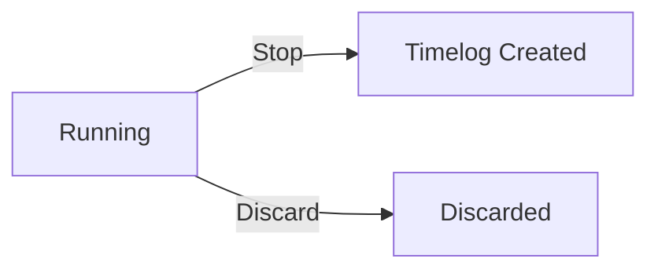
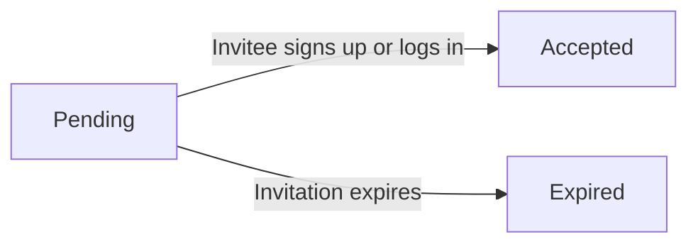
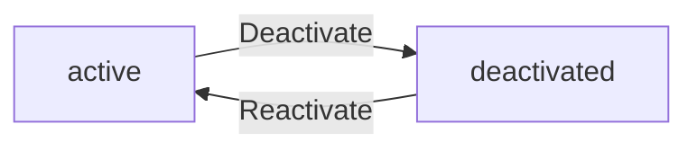
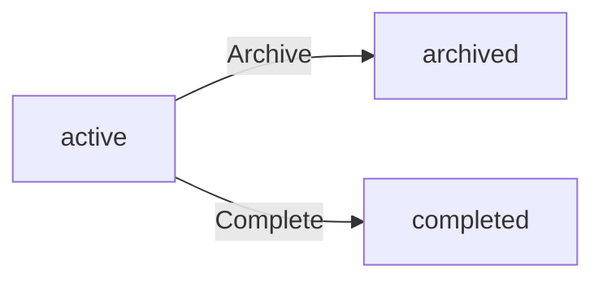
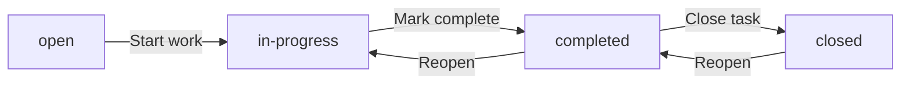
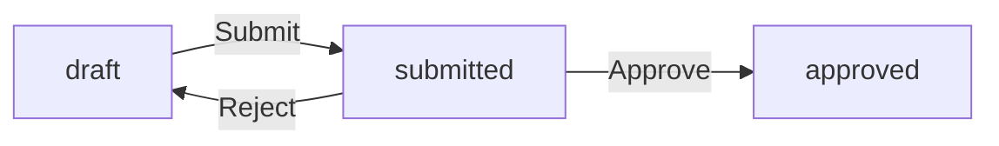
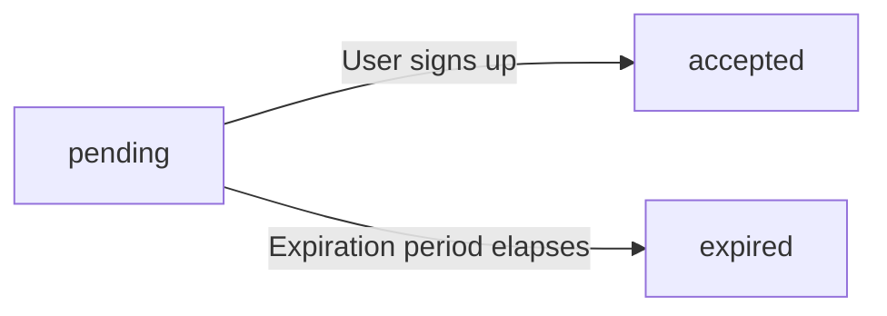

**hrmTimeTracking — Business concepts, relationships, and states from user perspective**

Business concepts, relationships, and states from user perspective

# Domain Concepts

Describe what each concept means in the business domain and its key attributes.

## Organization Concept

An Organization is the central multi-tenant entity in the platform. Each organization operates as an independent business unit with its own employees, projects, and data. The organization has a name that identifies it to users and a description that provides additional context. A logo image can be uploaded for visual brand representation within the platform. The organization uses a specific currency such as USD, EUR, or KRW that applies to all pay rates and financial reporting. A timezone setting ensures all time-based data such as timelogs and timesheets are interpreted correctly for that business. The fiscal start month defines the beginning of the organization's financial year for reporting and budgeting purposes. Each organization is created by an owner during initial sign-up and that owner retains full control over organization settings.

### Organization as a Multi-Tenant Entity

An organization is the central multi-tenant business entity in the platform. Each organization operates as a fully independent unit with its own employees, projects, departments, roles, contracts, timelogs, timesheets, and all associated data. Data isolation is strict: employees in one organization cannot see data from another organization. Users who belong to multiple organizations only see data for their currently selected organization context. Each organization is created during initial sign-up by a user who becomes its owner. The organization serves as the container and ownership boundary for all business operations within the platform.

### Organization Attributes and Settings

Each organization has the following attributes and configuration settings:

- **Organization name**: A human-readable identifier that distinguishes the organization within the platform. Displayed throughout the user interface.
- **Organization description**: A textual summary providing additional context about the organization's purpose or business.
- **Logo image**: A visual brand image uploaded for display within the platform's interface.
- **Currency**: The monetary unit used for all pay rates and financial reporting within the organization. Examples include USD, EUR, and KRW.
- **Timezone**: The time zone setting that governs how all time-based data such as timelogs and timesheets are interpreted and displayed for the organization's business operations.
- **Fiscal start month**: The month that marks the beginning of the organization's financial year, used for budgeting, reporting, and financial period calculations.

### Organization Ownership and Lifecycle

Each organization is owned by the user who created it during sign-up. The owner has full control over organization settings and can edit all configuration attributes. An organization can be deleted by its owner only when two conditions are met simultaneously: all pending timesheets in the organization are resolved (approved or rejected), and there are no active employee contracts in the organization. When an organization is deleted, all associated data including employees, projects, tasks, timelogs, timesheets, departments, roles, contracts, invitations, and activity logs are permanently removed. The owner's user account remains intact but is no longer associated with any organization.

## User Concept

A User represents a person who has a global account on the platform. Each user signs up with an email address and a password that serve as their primary authentication credentials. The user has a display name that appears throughout the platform when referring to that individual. An avatar image can be provided for visual identification across the user interface. A phone number can be stored as an additional contact detail. The user profile is global, meaning it is shared across all organizations the user belongs to — changes to the display name or avatar are reflected everywhere. A single user can be associated with multiple organizations as an employee, and their identity remains consistent regardless of which organization context they are working in.

### User Concept

A User represents a person who holds a global account on the platform. The user account serves as the central identity that spans all organizations the person belongs to. Each user is uniquely identified by their email address, which serves as the primary identifier throughout the system. Users interact with the platform by authenticating with their email and password, after which they select an organization context to work within.

### User Authentication Identity

Each user has an email address and a password that serve as their authentication credentials. The email address functions as the user's unique identifier across the entire platform — no two users can share the same email address. The password is a secret known only to the user and is used to verify their identity during login. Users can change their password at any time through their account settings.

### User Profile Attributes

Every user has a global profile consisting of three core attributes:

- **Display name**: The name shown throughout the platform when referring to the user, such as in timelog entries, timesheet reviews, project member lists, and activity log entries.
- **Avatar image**: An optional picture used for visual identification across the user interface, appearing next to the user's name in lists, comments, and profile views.
- **Phone number**: An optional contact number that can be stored for communication purposes.

These attributes are user-editable through the profile settings.

### Cross-Organization Profile Sharing

A user's profile — display name, avatar image, and phone number — is global and shared across all organizations the user belongs to. When a user updates their display name or changes their avatar, the change takes effect immediately in every organization they are a member of. This ensures a consistent identity: a user is recognized by the same name and picture regardless of which organization context they are currently working in. The profile is not per-organization; there is exactly one profile per user account.

### User Identity Across Organizations

A single user can belong to multiple organizations simultaneously. In each organization, the user is represented by an Employee record that associates their user account with that specific organization. However, the underlying user identity — their email, display name, avatar, and phone number — remains the same across all organizations. This means that when a user switches from one organization to another, their identity does not change; only their role, permissions, and available data change based on the selected organization's Employee record. The user's account persists independently of any single organization. Even if the user's employee record is deactivated in one organization, their global account remains active and their access to other organizations is unaffected.

## Employee Concept

An Employee represents a user's membership within a specific organization. It connects the global user account to an organization and defines that person's standing within that business. Each employee record has a reference to the user account and the role assigned to them in that organization. The employee can be associated with a department and have a position or title that describes their function. The employment type classifies the working relationship — full-time, part-time, contractor, or intern. Each employee has a status of either active or deactivated; active employees can participate in time tracking and project work while deactivated employees cannot perform those activities but their historical data is preserved. An employee can belong to only one organization through each membership record, but a user can have multiple employee records across different organizations.

### Employee Concept and Organization Membership

An Employee represents a user's membership within a specific organization. It is the bridge between a global user account and a business entity, defining that person's standing and participation within that organization. Each employee record is uniquely tied to one user account and one organization. A user can have multiple employee records across different organizations, but within a single organization, a user has exactly one employee record. This membership is what grants the user access to organization-specific features such as project work, time tracking, and timesheet submission.

### Employee Role Assignment

Each employee in an organization is assigned exactly one role (defined in [Role Concept]). The role determines the permissions the employee has within that organization — controlling what they can view, create, edit, approve, or manage. The available roles include three built-in roles (Owner, Manager, Employee) and any custom roles created by the organization owner. An employee's role can be changed over time by users who have the appropriate permission to manage employees.

### Employee Department and Position

An employee may be associated with a department within the organization (defined in [Department Concept]), which groups employees by functional area. The department association is optional — an employee may have no department assigned. Each employee may also have a position or title that describes their function within the organization (e.g., "Software Engineer", "Team Lead"). The position is a free-text label and is optional. Both the department and position can be updated over time as the employee's role within the organization evolves.

### Employment Type Classification

Each employee record classifies the working relationship through an employment type. There are four allowed values:

- **Full-time**: The employee works the organization's standard weekly hours. This is the typical ongoing employment arrangement.
- **Part-time**: The employee works fewer hours than the organization's standard, with a reduced weekly commitment.
- **Contractor**: The employee works on a contractual basis, typically for a defined scope or duration, and may not be subject to the same working hour policies as regular employees.
- **Intern**: The employee is in a temporary, typically learning-oriented position, often with a fixed duration and structured development goals.

The employment type is a categorization attribute that helps organize employees and can inform reporting, contract terms, and budgeting.

### Active and Deactivated Employee Status

Each employee record has a status that indicates whether the employee is currently participating in the organization's activities.

- **Active**: The employee can log time, submit timesheets, work on projects, and participate in all activities their role permits. This is the default status when an employee is added to the organization.
- **Deactivated**: The employee cannot log time, submit timesheets, or access organization features. However, all of the employee's historical data — including past timelogs, timesheets, contracts, and project assignments — is preserved in the system. A deactivated employee can be reactivated, restoring their ability to participate.

The status is independent of the employee's user account; a deactivated employee's user account remains active globally and can still access other organizations they belong to.

### Cross-Organization Employee Records

A single user account can have multiple employee records across different organizations. Each employee record is fully independent — the role, department, position, employment type, and status are scoped to that specific organization. This means:

- A user can be an active Manager in Organization A and a deactivated Contractor in Organization B simultaneously.
- Changes to the user's global profile (display name, avatar, phone number) are reflected across all organizations, but organization-specific attributes (role, department, status) are managed per organization.
- When accessing the platform, the user selects which organization to work in, and only the employee record for that organization governs their permissions and capabilities.

## Contract Concept

A Contract is a historical record of an employee's terms of employment within an organization. Each contract has a start date that marks when the employment terms took effect. An end date can be provided when the contract concludes; if the end date is null, the contract is considered ongoing. The pay rate is a numeric value that represents the employee's compensation, and the pay period defines how that rate is calculated — hourly, daily, weekly, or monthly. The working hours per week field specifies the expected weekly time commitment, such as 40 hours for a standard full-time arrangement. Optional notes can capture additional context about the contract terms. An employee can have multiple contracts over time, but only one contract can be active at any given moment, providing a clear historical record of changing employment terms.

### Contract Concept

A Contract is a historical record of an employee's terms of employment within an organization. It captures the specific compensation arrangement, time commitment expectations, and effective dates that define a particular period of the work relationship. Contracts provide an auditable trail of how an employee's terms have evolved over time — for example, a promotion, a pay raise, or a change from part-time to full-time employment. Each contract belongs to a single employee and documents the agreed-upon conditions for a specific interval of their tenure. Together, an employee's collection of contracts forms a gapless timeline of their employment term history, with each contract picking up where the previous one ended.

### Contract Attributes

Each contract includes the following attributes:

- **Start date** (required): The date on which the employment terms take effect. This marks the beginning of the contract period.
- **End date** (optional): The date on which the contract concluded. If no end date is provided (null), the contract is considered ongoing — meaning the employee is currently serving under those terms.
- **Pay rate** (required): A numeric value representing the employee's compensation under this contract. This is the amount paid per the defined pay period.
- **Pay period**: Defines how the pay rate is calculated. The following types are available:
  - **Hourly**: compensation calculated per hour worked
  - **Daily**: compensation calculated per day worked
  - **Weekly**: compensation calculated per week
  - **Monthly**: compensation calculated per calendar month
- **Working hours per week** (required): The expected weekly time commitment under this contract (e.g., 40 hours for a standard full-time arrangement).
- **Notes** (optional): Free-text field for additional context about the contract terms, such as special conditions or agreements.

### Active Contract Rule

An employee can have multiple contracts over their tenure with an organization, but at any given time, only one contract is considered active. The active contract is the one with the most recent start date that has no end date or has an end date in the future. When a new contract is created, it automatically becomes the active contract, and the previous active contract is considered ended — its end date is set to the day before the new contract's start date. This ensures a clear, gapless historical record of the employee's employment terms. Past contracts with an end date in the past are considered historical records and are immutable once finalized.

## Department Concept

A Department is an organizational unit within an organization that groups employees by function or team. Each department has a name that identifies it and a description that explains its purpose. Departments support one level of nesting through an optional parent department relationship, allowing organizations to represent a simple hierarchical structure. For example, a company might have an Engineering department as a parent with Frontend and Backend sub-departments as children. Employees can be associated with a department to indicate which part of the organization they belong to. When a department is removed, employees assigned to it are unlinked but are not deleted themselves. Departments help organize the workforce and can be used as a filtering criterion when viewing employee lists.

### Department Definition

A Department is an organizational unit within an organization that groups employees by function, team, or business area. Each department is identified by a **name** (required) that describes its function, such as "Engineering" or "Human Resources." A department also has a **description** (optional) that explains its purpose or scope in more detail. Departments belong to a single organization and help structure the workforce into logical groupings for management, reporting, and collaboration purposes.

### Department Hierarchy

Departments support a single level of nesting through an optional **parent department** relationship. A department can have at most one parent department, which itself must be another department within the same organization. This creates a two-level hierarchy: a parent department and its child departments. For example, an organization can have a "Sales" department and a "Marketing" department as separate top-level units, or it can have an "Engineering" department with "Frontend" and "Backend" as child departments. A department cannot be its own parent, and circular references are not permitted. The parent department relationship is optional; departments without a parent are considered top-level departments.

### Employee Department Assignment

An employee can be assigned to a single department within their organization, indicating which part of the organization they belong to. The employee's department assignment is part of their employee record (as defined in Employee Concept). Departments serve as a filtering criterion when viewing the employee list, allowing authorized users to narrow down the list of employees to those belonging to a specific department.

### Department Removal Effects

When a department is removed (deleted), the employees assigned to that department are not deleted or deactivated. Instead, the department reference in each affected employee's record is set to null, meaning those employees are no longer associated with any department. Child departments of the removed department are also affected: if a parent department is removed, its child departments become top-level departments (their parent reference is cleared). Removing a department has no effect on projects, tasks, timelogs, timesheets, contracts, or any other entity that references employees by their employee record rather than their department.

## Role Concept

A Role is a named set of permissions within an organization that defines what actions an employee can perform. Each organization has three built-in roles that cannot be deleted: Owner, Manager, and Employee. The Owner role provides full access to all features, including managing roles and members. The Manager role enables managing employees and projects, approving timesheets, and viewing reports. The Employee role is limited to tracking time, submitting timesheets, and viewing personal data. Organizations can also create custom roles beyond these built-in ones. Each custom role has a name and a collection of permissions selected from available options. Available permissions include managing organization settings, managing or viewing employees, managing or viewing projects, managing timelogs, approving timesheets, viewing all time data, and viewing reports. Each employee is assigned exactly one role, which determines their capabilities within the organization.

### Role Definition

A Role is a named permission set within an organization that governs what actions an employee can perform. Each role belongs to exactly one organization and has two attributes: a name and a collection of assigned permissions. The name is a human-readable label (e.g., "Project Coordinator") and the permission set is a subset of available permissions that defines the role's capabilities. Every employee in an organization is assigned exactly one role, which determines their access throughout the platform when operating within that organization.

### Built-in Roles

Every organization has three built-in roles that cannot be deleted or renamed: Owner, Manager, and Employee.

**Owner** — Grants unrestricted access to all features within the organization. Owners can manage organization settings, employees, projects, roles, and members. They can view all data, approve timesheets, and access all reports. The Owner role's permission set is fixed and cannot be modified.

**Manager** — Grants administrative capabilities for day-to-day operations. Managers can manage employees (add, edit, deactivate), manage projects and tasks, approve or reject timesheets, and view organization reports. A Manager cannot change organization settings, manage roles, or delete the organization.

**Employee** — Grants self-service capabilities limited to the employee's own data. Employees can track time, submit their own timesheets, view their own timelogs and timesheets, and view tasks assigned to them on projects they are members of. An Employee cannot view other employees' data, approve timesheets, or access organization reports.

### Custom Roles

Beyond the three built-in roles, organization owners can create custom roles to match specific business needs. Each custom role has a name and a permission set selected from the available permissions. Custom roles can be edited by organization owners at any time to adjust their permission set. A custom role can be deleted by an organization owner only if no employees are currently assigned to that role. This ensures that deleting a role does not leave employees without a defined permission set. Examples of custom roles include a "Project Lead" role with project management and task management permissions, or a "Payroll Manager" role with time viewing and reporting permissions.

### Permission Set

A role's permission set is a collection of individual permissions chosen from the following available permissions. Each permission grants access to a specific category of actions within the organization:

- **Organization Management (`org:manage`)** — Allows editing organization settings such as name, description, logo, currency, timezone, and fiscal start month. Also grants access to the activity log and the ability to delete the organization.
- **Employee Management (`employee:manage`)** — Allows inviting new employees, editing employee records (department, position, employment type), deactivating and reactivating employees, managing employee contracts, and changing role assignments.
- **Employee Viewing (`employee:view`)** — Allows viewing the employee list, employee details, and employee contracts.
- **Project Management (`project:manage`)** — Allows creating, editing, archiving, completing, and deleting projects and tasks, as well as assigning employees to projects.
- **Project Viewing (`project:view`)** — Allows viewing all projects and their tasks within the organization.
- **Time Management (`time:manage`)** — Allows editing or deleting any employee's timelogs, regardless of whether those timelogs belong to the acting user.
- **Time Approval (`time:approve`)** — Allows viewing all submitted timesheets and approving or rejecting them with a reason.
- **Time View All (`time:view_all`)** — Allows viewing all employees' timelogs and timesheets across the organization.
- **Report Viewing (`report:view`)** — Allows accessing organization-level reports including the Time Report, Project Budget Report, and Weekly Summary Report, as well as viewing the organization dashboard.

### Role-Based Access

Each employee in an organization is assigned exactly one role, which defines the boundary of what they can see and do. This role-based access model applies consistently across all features:

- An employee's role determines which menu items, pages, and actions are available to them when operating within the organization.
- Permissions are additive — having a permission grants the associated capabilities; not having it restricts them.
- The Owner role is a superset of all permissions; Manager and Employee roles have specific subsets.
- When a user switches between organizations (defined in [01-actors-and-auth.md]), their role in each organization is evaluated independently, and the available features change according to the role in the currently selected organization.
- Custom roles can mix permissions from different domains, allowing flexible configurations such as a role that can view employees and projects but not manage them.

## Project Concept

A Project is a work initiative within an organization that employees log time against. Each project has a name that identifies it and an optional description providing more detail. A color code is assigned for visual distinction in the user interface. The project status can be active, meaning it is currently accepting new timelogs, or archived or completed, meaning it is closed to new time entries while preserving existing ones. Budget hours can be set as an optional target for the total estimated effort. Optional start and end dates define the project's planned timeline. Projects organize work into logical units and serve as the primary categorization for time tracking. Employees who are members of a project can log time toward it, and project leads can manage tasks within their assigned projects.

### Project Overview

A Project is a work initiative within an organization that represents a logical unit of work requiring effort from employees. Projects serve as the primary categorization mechanism for time tracking — all timelogs are recorded against a specific project, enabling the organization to understand where time is being spent. Each project belongs to exactly one Organization (the multi-tenant entity within which the project exists). An organization can have many projects, and each project may have many employees assigned to it through project memberships (see [ProjectMember Concept](#projectmember-concept) for assignment details).

### Project Identity

Each project has several identity and descriptive attributes that distinguish it from other projects:

- **Project Name**: A required, human-readable label that identifies the project. The name serves as the primary identifier in user interfaces and project selection dialogues.
- **Project Description**: An optional textual description providing additional context about the project's purpose, goals, or scope. This helps employees understand what the project entails before logging time against it.
- **Project Color Code**: A required color value assigned to the project for visual distinction in the user interface. This color appears alongside the project name in project lists, task views, and timelog entries, helping users quickly identify projects at a glance.

### Project Status

A project's status defines its current operational state within the organization. The status determines whether the project can accept new time entries:

- **Active**: The project is currently ongoing and accepting new timelogs. Employees assigned to the project can log time against it and work on its tasks.
- **Archived**: The project has been moved to an inactive state. No new timelogs can be created against an archived project, but all existing timelogs, tasks, and historical data remain preserved and viewable.
- **Completed**: The project has been finished. Like archived projects, no new timelogs can be created against a completed project. Existing timelogs and task history are preserved as a permanent record of the work completed.

A project can only be in one status at a time. Transitions between statuses are managed through specific operations (defined in [03-functional-requirements](../03-functional-requirements.md)).

### Project Planning Attributes

Projects may carry optional planning attributes that define their expected scope and timeline:

- **Budget Hours**: An optional numeric value representing the total estimated effort for the project, measured in hours. This serves as a target against which actual logged hours can be compared, helping organizations track project progress and resource consumption.
- **Start Date**: An optional date indicating when the project is planned to begin or actually began.
- **End Date**: An optional date indicating when the project is planned to be completed. If both start and end dates are set, together they define the project's planned timeline.

These planning attributes are used in organizational reporting to assess whether projects are on track relative to their budget and schedule (see [Reports](../03-functional-requirements.md#reports) for reporting capabilities).

### Project Member Association

Employees are associated with projects through project memberships. Each project membership links an employee to a project and assigns a role — either **member** or **project-lead**. Project members can log time against the project and view its tasks and details. Project leads have additional capabilities to manage tasks within their assigned projects. An employee can be a member of multiple projects simultaneously, and a project can have many employees assigned to it. The full definition of project membership, including role capabilities and assignment rules, is documented in its own [ProjectMember Concept](#projectmember-concept) section.

## ProjectMember Concept

A ProjectMember represents the assignment of an employee to a project. It is the link that grants an employee access to log time and interact with a specific project. Each membership record connects an employee to a project and defines the employee's role within that project context. The project membership role can be either member or project-lead. A member can log time against the project and view its tasks. A project-lead has the additional ability to create and manage tasks within that project. An employee can be assigned to multiple projects simultaneously, and each project can have many employees assigned to it. Employees can view which projects they are assigned to, giving them visibility into where they can contribute their time.

### Project Member Concept

A ProjectMember is the business concept that represents an employee's assignment to a project within an organization. It establishes the link that determines which employees can interact with which projects. Without a project membership record, an employee has no access to a project — they cannot log time against it, view its tasks, or participate in project-related work.

Each project membership is unique to an employee-project pair. The same employee has a separate membership record for each project they are assigned to.

### Employee Project Assignment

Project membership is the mechanism through which employees are assigned to projects. A membership record connects a specific employee to a specific project, granting that employee the ability to contribute work to the project.

An employee can be assigned to multiple projects simultaneously, and each project can have many employees assigned to it. There is no limit on the number of employees per project or projects per employee — these are determined by business needs.

Employees who are not assigned to a project have no access to that project at all. They cannot view it, log time against it, or see its tasks.

### Member Role

The member role is one of two possible project-level roles an employee can hold within a project. An employee assigned as a member can:

- Log time against the project by creating timelogs that reference the project
- View the project's tasks
- View projects they are assigned to in their project list

The member role is the default project role. It is suitable for employees who contribute work to a project but are not responsible for managing its tasks.

### Project-Lead Role

The project-lead role is the elevated project-level role. An employee assigned as a project-lead has all the capabilities of a member, plus the additional authority to:

- Create tasks within the project
- Edit tasks within the project
- Manage task status transitions
- Update task attributes such as priority, estimated hours, due date, and employee assignment

A project-lead's task management authority is scoped to the projects where they hold this role. They cannot manage tasks in projects where they are only a member.

### Task Management Capability

The ability to manage tasks within a project is determined by the project membership role. This capability is granted at the project level, not globally:

- **Project-leads** have task management capability for their assigned projects. This includes creating, editing, and managing tasks, including status changes and employee assignments.
- **Members** do not have task management capability. They can view tasks but cannot create, edit, or change task status.

Task management capability is always scoped to the specific project. A project-lead in one project cannot manage tasks in another project where they are only a member.

### Multi-Project Assignment

An employee can be assigned to multiple projects within the same organization. Each assignment is an independent membership record with its own role assignment. This means:

- An employee can be a member in some projects and a project-lead in others
- An employee's role can differ across projects based on business needs
- Adding or removing an employee from one project does not affect their assignments to other projects
- An employee can see all projects they are assigned to, regardless of role

Multi-project assignment enables flexible resource allocation where employees contribute to multiple initiatives simultaneously.

### Project Access Scope

The project membership record defines the boundary of an employee's access to a project. This access scope includes:

- **Visibility**: The employee can see the project in their project list and view its details
- **Time tracking**: The employee can create timelogs referencing the project (only if their employment status is active and the project status is active)
- **Task interaction**: The employee can view tasks (members) or manage tasks (project-leads)

Access is exclusive — only employees with an active project membership record can interact with a project. Access is also bidirectional from the project perspective: when viewing a project's members, only employees with membership records are listed.

### Employee Project Visibility

Employees can view which projects they are assigned to. This visibility is personal and scoped to the employee's own assignments. When an employee views their project list, they see:

- All projects where they have an active membership record
- Their role (member or project-lead) within each project
- Project details such as name, description, color code, and status

An employee cannot see projects they are not assigned to. This ensures that employees only see the work they are involved in, maintaining focus and data privacy.

### Project Membership Record

Each project membership is a distinct record that captures the assignment of an employee to a project. The membership record defines:

- Which employee is assigned
- Which project they are assigned to
- What role they hold in that project (member or project-lead)

A membership record is active as long as it exists. Removing the record (by users with project:manage permission) revokes all access to the project. There is no concept of deactivating a membership — the employee is either assigned to the project or not.

Historical timelogs associated with a project are preserved even if the employee is later removed from the project. Removal only affects future access.

## Task Concept

A Task is a specific work item within a project that employees can be assigned to and log time against. Each task has a title that summarizes the work to be done and an optional description for more detail. The task status tracks progress through four states: open, in-progress, completed, and closed. A priority level of low, medium, high, or urgent indicates the task's importance. Estimated hours provide a rough effort projection. A due date can be set for deadline tracking. An assigned employee can be designated to own the task — this employee must be a project member. Tasks can have a parent task, supporting one level of nesting for subtask relationships. Each time a task's status changes, the system records a history entry capturing the change. Employees can view tasks in projects they are assigned to, giving them visibility into their work items.

### Task Definition and Core Attributes

A **Task** is a specific work item within a project that represents a discrete unit of work to be completed. Each task belongs to exactly one project and can be assigned to a single employee.

Each task has the following attributes:
- **Title** (required) — A brief summary of the work to be done.
- **Description** (optional) — Detailed instructions, context, or notes about the work.
- **Estimated hours** (optional) — A rough projection of the effort required to complete the task.
- **Due date** (optional) — A deadline by which the task should be completed.
- **Assigned employee** (optional) — The employee responsible for completing the task. When assigned, the employee must be a member of the task's parent project (defined in [ProjectMember Concept]). If no employee is assigned, the task remains unassigned until someone is designated.

### Task Status and Priority

Each task tracks its progress through a **status** that follows a linear lifecycle and a **priority** that indicates its relative importance.

**Status Flow**
A task progresses through four statuses in order:
- **Open** — The task has been created but work has not yet started.
- **In-progress** — Work on the task is actively being performed.
- **Completed** — The work is finished and awaits review or closure.
- **Closed** — The task is fully resolved and no further action is expected.

A newly created task starts in the **open** status. Tasks move forward through this sequence (open → in-progress → completed → closed) and cannot skip statuses.

**Priority Levels**
Each task has a priority level indicating its importance:
- **Low** — Minor or nice-to-have work.
- **Medium** — Standard importance (default).
- **High** — Important work that should be addressed soon.
- **Urgent** — Critical work requiring immediate attention.

### Task Relationships and History

**Parent Task and Subtask Relationship**
A task can reference another task as its **parent**, supporting one level of nesting. Tasks that have a parent task are considered **subtasks** of that parent. This allows breaking larger work items into smaller, trackable pieces. A parent task can have multiple subtasks, but a subtask cannot itself have subtasks (one level of nesting only).

**Status Change Recording**
Every time a task's status changes, the system records a **task history entry**. Each entry captures the timestamp of the change, the previous status, the new status, and the identity of the user who made the change. These entries form an audit trail of the task's progress over its lifecycle. The full structure of this history record is defined in [TaskHistory Concept].

## TaskHistory Concept

A TaskHistory entry is an audit record that captures each status change made to a task. Every time a task transitions from one status to another, the system creates a history record. Each entry contains the timestamp of when the change occurred. It records both the old status value before the change and the new status value after the change, providing a complete picture of the transition. The entry also identifies which user performed the status change. These records form an immutable chronological log of how a task progressed through its lifecycle. TaskHistory entries help stakeholders understand how work evolved over time and who made each change. They cannot be modified or deleted once created, preserving an accurate historical record.

### Task History Definition

A TaskHistory entry is a status change audit record that captures every transition a task makes from one status to another. Each time a task moves through its lifecycle — for example, from "open" to "in-progress" or from "completed" to "closed" — the system automatically creates a TaskHistory entry to record that transition. Together, these entries form a complete audit trail of the task's status evolution, enabling stakeholders to understand how work progressed through its lifecycle. TaskHistory is distinct from the ActivityLog (defined in its own section); while the ActivityLog records a broad range of organizational actions, TaskHistory is narrowly focused on task status changes only.

### Audit Record Contents

Each TaskHistory entry captures four pieces of information about a status transition:

- **Change Timestamp**: The exact date and time when the status change occurred, recorded automatically by the system at the moment of transition.
- **Old Status Value**: The status the task held before the change (e.g., "open", "in-progress"), providing a reference point for what the task's prior state was.
- **New Status Value**: The status the task moved to after the change (e.g., "completed", "closed"), documenting the resulting state.
- **Change Author Identification**: The user who performed the status change, recorded as a reference to their user account. This identifies who was responsible for advancing the task to its new state.

### Immutability and Chronological Order

TaskHistory entries are immutable records. Once created, they cannot be modified or deleted, preserving an accurate and tamper-proof historical account of all status changes. Entries are stored in chronological order by their change timestamp, forming a chronological audit log of every status transition the task has undergone. This ordered sequence enables stakeholders to trace the complete status transition history of a task from creation through to its current state, providing full visibility into how and when the task progressed through its lifecycle.

## Timelog Concept

A Timelog is an individual time entry that records how an employee spent their time on a specific project. Each timelog has a date indicating when the work occurred. The duration is measured in minutes and represents the amount of time spent. Every timelog must be associated with a project that the employee is assigned to. An optional task can be specified if the time should be attributed to a particular work item within the project. A description can be provided to explain what was done during that time period. The billable flag indicates whether the time should be charged to a client or counted as billable work; it defaults to true. Timelogs are the fundamental building blocks of time tracking and are collected into timesheets for approval. Employees can only create timelogs for themselves, and the editability of a timelog depends on whether it has been locked by an approved timesheet.

### Timelog as a Time Entry

A timelog is an individual time entry that records a discrete interval of work performed by an employee. It is the fundamental unit of time tracking within the platform — all time-based reporting, timesheet approvals, and project budget tracking ultimately derive from timelogs.

Each timelog captures a single, contiguous period of work on a specific date. Timelogs are the building blocks of timesheets: employees group their timelogs into weekly timesheets for submission and approval. A timesheet is a collection of timelogs belonging to the same employee and the same calendar week (Monday to Sunday).

### Timelog Fields

Each timelog contains the following information:

- **Date**: The calendar date on which the work was performed. This is the day the time entry belongs to, regardless of when it is logged.
- **Duration**: The amount of time spent, measured in minutes. For example, 90 minutes represents one and a half hours of work.
- **Project**: The project the work was done for. Every timelog must be associated with a project, and the employee must be assigned to that project.
- **Task**: An optional work item within the selected project. If specified, the timelog is attributed to a particular task, allowing more granular tracking within a project.
- **Description**: An optional free-text explanation of what was accomplished during the tracked time.
- **Billable Flag**: A boolean indicator that marks the time as billable (chargeable to a client) or non-billable (internal work, such as meetings or administration). The default value is true (billable). Employees can set this to false when logging time that should not be invoiced.

Timelogs do not store hourly rates or monetary values — those are derived from the employee's active contract at the time the timelog was recorded.

### Employee Self-Logging and Edit Restrictions

Employees create and manage their own timelogs. An employee can only log time for themselves — they cannot create timelogs on behalf of another employee.

Once a timelog is created, the employee who owns it can edit or delete it freely, subject to the following restriction:

- **Approved timesheet lock**: If a timelog is included in a timesheet that has been approved, the timelog becomes locked. Locked timelogs cannot be edited or deleted by anyone, including the employee who created them. This ensures that approved time records remain accurate and auditable.

Users with the `time:manage` permission can edit or delete any employee's timelogs, overriding the employee-only restriction, but they are still bound by the approved timesheet lock.

## Timesheet Concept

A Timesheet is a weekly collection of an employee's timelogs that goes through an approval process. Each timesheet covers a specific work week from Monday to Sunday, identified by the week start date and week end date. The timesheet has a status that reflects its position in the approval workflow: draft means the employee is still organizing their entries; submitted means it has been sent for review; approved means a reviewer has accepted it; and rejected means a reviewer has sent it back for modifications. The total hours field is calculated automatically from all included timelogs. The submitted at timestamp records when the employee sent the timesheet for review. The reviewed at timestamp and reviewed by fields capture when and who made the approval or rejection decision. A rejection reason is provided when a timesheet is rejected, explaining why it was not accepted. Once approved, all timelogs within the timesheet become locked and cannot be edited or deleted.

### Timesheet Business Concept

A Timesheet represents a weekly collection of an employee's timelogs that is submitted for review and approval. It serves as the mechanism for employees to report their logged hours and for managers to verify and approve that time. Each timesheet belongs to a single employee (the owner) and is scoped to the organization that employee belongs to. The timesheet follows a defined approval workflow lifecycle through four sequential statuses: draft, submitted, approved, or rejected.

### Weekly Time Collection Period

Each timesheet covers a fixed work week from Monday to Sunday. The week start date is always a Monday, and the week end date is always the following Sunday. The system identifies a timesheet by its week start date; an employee can have at most one timesheet per week (in any status). All timelogs belonging to that employee with dates falling within the Monday-to-Sunday range are eligible for inclusion in that week's timesheet. When an employee creates a draft timesheet for a week, the system automatically collects all timelogs for that employee within that week as the initial set of entries.

### Timesheet Statuses

A timesheet has exactly one of four statuses at any point in time:

- **Draft**: The employee is organizing their timelogs. Timelogs can be added or removed from a draft timesheet. The employee can modify their timelogs freely while in this status.
- **Submitted**: The employee has sent the timesheet to reviewers for approval. Timelogs in a submitted timesheet cannot be directly edited or deleted by the employee (changes require the timesheet to be rejected first or action by a user with time:manage permission).
- **Approved**: The reviewer has accepted the timesheet. All included timelogs become permanently locked (cannot be edited or deleted by anyone).
- **Rejected**: The reviewer has sent the timesheet back. It returns to draft status, allowing the employee to modify timelogs and resubmit.

### Submission and Review Timestamps

The timesheet records key timestamps to track the approval workflow:

- **Submitted at**: A timestamp recorded when the employee submits the draft timesheet for review. This marks the moment the timesheet enters the submitted status.
- **Reviewed at**: A timestamp recorded when a reviewer either approves or rejects the timesheet. This marks when the review decision was made.
- **Reviewed by**: Identifies the specific user (the reviewer) who performed the approval or rejection action. This provides accountability and an audit trail for the decision.

### Rejection Reason

When a reviewer rejects a submitted timesheet, they must provide a rejection reason. This is a text field explaining why the timesheet was not accepted — for example, missing timelogs, incorrect project assignments, or inaccurate durations. The rejection reason is visible to the employee whose timesheet was rejected, enabling them to understand what needs to be corrected before resubmitting. Rejection without a reason is not permitted.

### Total Hours Calculation

The total hours field on a timesheet is calculated automatically from the timelogs included in that timesheet. The calculation sums the duration (in minutes) of all included timelogs and converts the total to hours. For example, if three timelogs have durations of 120 minutes, 90 minutes, and 30 minutes, the total hours would be 4 hours. This field is recalculated whenever timelogs are added to or removed from the timesheet, ensuring it always reflects the current set of entries.

### Timelog Locking Upon Approval

When a timesheet is approved, all timelogs included in that timesheet become locked. A locked timelog cannot be edited (duration, description, project, task, or billable flag) and cannot be deleted. This ensures that approved time records remain immutable as a permanent historical record. Timelogs that are not yet part of an approved timesheet (belonging to a draft or submitted timesheet, or not yet added to any timesheet) remain editable by the employee or by users with time:manage permission.

## Timer Concept

A Timer is a live time tracking session that allows an employee to record time in real-time as they work. Each timer has a start timestamp that marks when the employee began working. The employee selects a project when starting the timer, and an optional task can be associated if the work is related to a specific work item. An optional description can capture what the employee is working on. The timer records the current session duration from start time to the present moment. An employee can have at most one active timer at any given time, preventing overlapping time tracking. The running timer continues indefinitely if the employee forgets to stop it — there is no automatic time-out. When the timer is stopped, a new timelog is created with the calculated duration rounded to the nearest minute. The timer can also be discarded entirely without creating any timelog.

### Timer Definition and Attributes

A Timer is a live time tracking session that allows an employee to record time in real-time as they work on a task. Each timer captures the following information:

- **Start timestamp**: the exact moment the employee began working (recorded automatically when the timer starts)
- **Project**: the project the employee is working on (selected when starting the timer)
- **Task**: an optional task within the selected project, used when the work is specific to a particular work item
- **Description**: optional free-text input describing what the employee is currently working on
- **Duration**: the elapsed time from the start timestamp to the current moment, calculated continuously while the timer is running

The timer represents an in-progress work session that has not yet been finalized as a completed timelog. Its purpose is to capture accurate, real-time duration data without requiring the employee to estimate time afterward.

### Timer States and Lifecycle

A timer exists in one of the following states:

**Running** — The timer is actively counting elapsed time from its start timestamp. While running, the employee can view the current duration and optionally update the description, project, or task assignment.

**Stopped (Timelog Created)** — The employee stops the timer. This creates a new timelog with the calculated duration (rounded to the nearest minute), the selected project and optional task, and the description. The timer session is then resolved and no longer active.

**Discarded** — The employee discards the timer without creating a timelog. No time entry is recorded, and the timer session is abandoned entirely.

### Timer Constraints and Relationships

**Relationships:**

- A Timer **belongs to** exactly one Employee. Each employee can have at most one active timer at any given time.
- A Timer **references** a Project (required) and optionally references a Task that belongs to that project.
- When stopped, a Timer **creates** one Timelog. The created timelog inherits the date, duration, project, task, and description from the timer session.

**Constraints:**

- **Single active timer limit**: An employee can have at most one timer in the Running state at any given time. Starting a new timer while another is running is not permitted.
- **No automatic stop**: A running timer does not stop automatically. If the employee forgets to stop the timer, it continues running indefinitely. There is no time-out or maximum duration limit.
- **Duration rounding**: When the timer is stopped, the elapsed duration is calculated and rounded to the nearest minute before creating the timelog.

## Invitation Concept

An Invitation is a pending request to bring a new employee into an organization. When an existing user invites someone by email, the system creates an invitation record. The invitation stores the email address of the invited person and the organization they are being invited to. The invitation status can be pending while waiting for the invitee to act, accepted when the invitee has joined the organization, or expired if the invitation is no longer valid. If the invited email already belongs to an existing user account, that user is directly added to the organization without needing to create a new account. If the email has no account, the invitation remains pending until the person signs up using that email, at which point they are automatically added to the pending organization.

### Invitation Definition & Attributes

An Invitation represents a pending request to bring a new person into an organization as an employee. It is created when a user with the employee:manage permission invites someone by providing their email address.

Each invitation has the following attributes:

- **Invited Email Address**: The email address of the person being invited. This is the key identifier used to resolve the invitation when the person signs up or logs in.
- **Target Organization**: The organization the person is being invited to join. Each invitation is scoped to exactly one organization.
- **Invitation Status**: The current state of the invitation, which can be pending, accepted, or expired (described in the sections below).
- **Created At**: The timestamp when the invitation was sent.
- **Accepted At**: The timestamp when the invitation was accepted (null if not yet accepted).
- **Expired At**: The timestamp when the invitation expired (null if not yet expired).

An invitation is always associated with one organization (the target organization) and one email address (the invitee). Multiple invitations for the same email address can exist across different organizations, but only one active (pending) invitation per email address per organization is allowed at a time.

### Invitation Statuses

Each invitation has a status that determines its current state and what actions are possible.

**Pending** – The invitation has been sent but the invitee has not yet acted upon it. A pending invitation is active and can be accepted when the invitee signs up or logs in.

**Accepted** – The invitation has been accepted. This occurs when the invitee joins the organization. Once accepted, the invitation cannot be modified or acted upon further.

**Expired** – The invitation is no longer valid. An invitation may expire after a defined period of inactivity (e.g., if the invitee never signs up). An expired invitation cannot be accepted.

### Existing User Auto-Join

When an invitation is sent to an email address that already belongs to an existing user account, the system performs an automatic join. The invited user is directly added to the organization as an employee without requiring the user to go through a sign-up process. The invitation status is set to accepted. The new employee record is created with the role specified when the invitation was sent.

### New User Sign-Up with Automatic Organization Addition

When an invitation is sent to an email address that has no associated user account, the invitation remains pending. When a person signs up using that email address, the system checks for any pending invitations associated with that email address. For each pending invitation found, the system automatically adds the new user to the corresponding organization as an employee. The invitation status is updated to accepted. This process ensures that new users are seamlessly added to all organizations that had previously invited them.

## ActivityLog Concept

An ActivityLog entry is a system audit record that captures significant actions performed within an organization. Each entry has a timestamp indicating when the action occurred. The user who performed the action is recorded as the actor. The action type describes what kind of operation was carried out, such as an employee being invited, deactivated, or reactivated; a contract being created or edited; a project being created, archived, completed, or deleted; a task status changing; a timesheet being submitted, approved, or rejected; or a role being assigned or changed. The target entity identifies which object the action was performed on, such as which employee, project, or timesheet. Additional details provide context about the action. ActivityLog entries provide an immutable, chronological record of important organizational events for auditing and review purposes.

### ActivityLog as a System Audit Record

An ActivityLog entry is a formal system audit record that captures significant actions performed within an organization. Each entry provides an immutable, chronological record of who did what, on which entity, and when. ActivityLog entries are read-only after creation — they cannot be modified or deleted, ensuring a reliable audit trail for organizational governance.

### ActivityLog Attributes

Each ActivityLog entry contains the following attributes:

- **Action Timestamp**: The date and time when the action occurred, recorded with second-level precision.
- **Actor Identification**: The user who performed the action, identified by their user account (display name and email).
- **Action Type Classification**: A categorical label describing the kind of operation that was performed (see Logged Action Types section).
- **Target Entity Reference**: The specific business entity that the action was performed on, identified by entity type (e.g., "Employee", "Project", "Timesheet") and the entity's unique identifier and name.
- **Action Details**: Free-form contextual information about the action, such as a summary of what changed (e.g., "Status changed from draft to submitted") or relevant identifiers.

These attributes together provide a complete picture of each auditable event.

### Logged Action Types

The system records the following categories of actions as ActivityLog entries:

**Employee Lifecycle Events**
- Employee invited to the organization
- Employee deactivated
- Employee reactivated

**Contract Events**
- Contract created for an employee
- Contract edited (changes to the current active contract)

**Project Lifecycle Events**
- Project created
- Project archived
- Project completed
- Project deleted

**Task Status Change Events**
- Task status changed (recorded as a single log entry per status change; detailed per-transition history is captured separately in TaskHistory entries, defined in the TaskHistory Concept section)

**Timesheet Workflow Events**
- Timesheet submitted for approval
- Timesheet approved
- Timesheet rejected (including the rejection reason)

**Role Assignment Events**
- Role assigned to an employee
- Role changed for an employee

Each action type is recorded with sufficient detail to understand what occurred without needing to consult the original entity.

### Scope and Isolation

ActivityLog entries are strictly scoped to an organization. Each entry belongs to exactly one organization. When a user views the activity log, they only see entries for their currently selected organization (organization context, as defined in the User Concept section). This ensures data isolation across organizations.

### Immutable Audit Trail and Organizational Event History

The ActivityLog serves as the organization's immutable audit trail and complete event history. Once an ActivityLog entry is created, it cannot be altered or deleted under any circumstances — not even by organization owners. This immutability ensures:

- A reliable, tamper-proof record of all significant organizational events
- Accountability for actions performed by users with elevated permissions
- The ability to reconstruct the sequence of events leading to any state in the system
- Compliance with internal auditing and record-keeping requirements

The ActivityLog preserves historical data even after the target entity is deleted. For example, if a project is deleted, the ActivityLog entry recording its creation and deletion remain accessible, providing a complete organizational event history.

# Domain Relationships

Describe how concepts relate to each other from a business perspective.

## Conceptual Relationships

Describe how concepts relate to each other in business terms.

### Organization Ownership and Containment

An **Organization** is owned by a single **User** — the user who created it during sign-up. This ownership is a permanent association unless the organization is deleted or ownership is transferred.

An Organization has-many **Employees** — each employee record represents a user's membership within the organization.

An Organization has-many **Departments** — organizational units that group employees.

An Organization has-many **Projects** — work initiatives scoped to that organization.

An Organization has-many **Roles** — permission sets that govern what employees can do.

An Organization has-many **Invitations** — pending employee invitations sent to external email addresses.

An Organization has-many **ActivityLog** entries — an audit trail of significant actions within the organization.

All these entities belong-to the Organization and are strictly isolated — data from one organization is never visible to another.

### User-Organization Association

A **User** is a global account that can belong-to multiple **Organizations**. The association between a user and an organization is established through an **Employee** record — the user does not directly belong to an organization without an employee record.

A User may own zero or more Organizations (as the original creator). When a user owns an organization, they automatically hold the "Owner" role in that organization's employee record.

When a user logs in, they select which organization they want to work in. All subsequent actions are scoped to the selected organization context. The user can switch between organizations without logging out.

A User has-many **Employee** records — one for each organization they belong to. These employee records connect the user's global identity to organization-specific data such as role, department, contracts, timelogs, and timesheets.

### Employee Relationships

An **Employee** belongs-to a **User** (the global account) and belongs-to an **Organization** (the business entity). Together, this association represents a user's membership within a specific organization.

An Employee has-one **Role** — the permission set that determines what the employee can do within the organization.

An Employee has-many **Contracts** — a historical record of employment terms, with only one contract active at any time.

An Employee has-many **Timelogs** — individual time entries the employee logs for work performed.

An Employee has-many **Timesheets** — weekly collections of timelogs submitted for approval.

An Employee has at most one active **Timer** — a live tracking session that captures time in real-time.

An Employee is assigned to many **Projects** via **ProjectMember** records — the bridge entity that links employees to the projects they work on.

### Contract-Employee Relationship

A **Contract** belongs-to an **Employee** and represents a specific period of employment with defined terms. An employee has-many contracts over time, creating a historical record of employment terms.

The relationship has a lifecycle constraint: at most one contract can be active for an employee at any given time. When a new contract is created, it automatically ends the previous active contract by setting its end date to the day before the new contract's start date.

Past contracts are immutable historical records — they cannot be edited once they are no longer the active contract.

### Department Hierarchy and Employee Association

A **Department** belongs-to an **Organization** and optionally references a parent **Department**, enabling one level of nesting (a child department cannot have its own child).

A Department has-many **Employees** — employees can be assigned to a department, representing their organizational unit.

When a department is deleted, the employee-department association is removed (set to null), but the employees themselves are not deleted.

### Role-Organization and Role-Employee Assignment

A **Role** belongs-to an **Organization** — each organization has its own independent set of roles. Three roles are built-in (Owner, Manager, Employee) and cannot be deleted. Additional custom roles can be created by the organization owner.

A Role has-many **Employees** assigned to it — each employee in the organization has exactly one role. This is a many-to-one relationship from the employee's perspective: many employees can share the same role, but each employee has only one role.

### Project Containment and Relationships

A **Project** belongs-to an **Organization** and serves as a container for work-related entities:

- A Project has-many **Tasks** — individual work items within the project.
- A Project has-many **ProjectMembers** — employees assigned to the project.
- A Project has-many **Timelogs** — time entries logged against this project.

Archived or completed projects cannot receive new timelogs, but existing timelogs belonging to the project are preserved as historical records.

### Staffing Relationship (ProjectMember)

A **ProjectMember** is a bridge association between an **Employee** and a **Project**. It belongs-to both entities, establishing that an employee is assigned to work on a project.

Each ProjectMember has an assigned role within the project: **member** or **project-lead**. Project leads can manage tasks within their project, while regular members can be assigned tasks.

An Employee can be assigned to many projects (has-many ProjectMember records). A Project has-many employees assigned to it (has-many ProjectMember records).

### Task Hierarchy and Audit Trail

A **Task** belongs-to a **Project** and may optionally have a parent **Task**, creating a one-level nesting (subtasks). A parent task can have-many child tasks, but a child task belongs-to only one parent.

A Task may be assigned to an **Employee** — but only if that employee is a **ProjectMember** of the task's project.

A Task has-many **TaskHistory** entries — an audit trail of status changes. Each TaskHistory entry belongs-to exactly one Task.

### Timesheet-Timelog Collection

A **Timesheet** belongs-to an **Employee** and represents a weekly collection of timelogs (Monday to Sunday).

A Timesheet has-many **Timelogs** — the timelogs included in that timesheet for that specific week.

A Timesheet may be reviewed-by a **User** (the person who approved or rejected it), establishing the reviewer relationship only when the timesheet reaches final disposition.

Timelogs belong-to a Timesheet only when they are part of that timesheet. Timelogs not yet included in any timesheet have no timesheet association.

### Timer Ownership

A **Timer** belongs-to an **Employee** and represents a live time tracking session. The relationship is constrained: at most one active timer can exist per employee at any time.

When a timer is stopped, it creates a **Timelog** belonging to the same employee. The timer's project and task associations carry over to the created timelog.

### Invitation and ActivityLog Relationships

An **Invitation** belongs-to an **Organization** and represents a pending request for a user to join. When the invited email matches a user who signs up, the invitation establishes an association from the user to the organization (creating an Employee record).

An **ActivityLog** entry belongs-to an **Organization** and records who performed what action, on which entity. Each entry references the actor (**User**), the target entity type and ID, and contains descriptive details about the action.

## Lifecycle and Retention

Describe concept lifecycle states and transitions only. Detailed retention/recovery policies belong in 05-non-functional. Operation details belong in 03-functional-requirements.

### Organization Lifecycle

An organization begins in the **active** state upon creation during a user's initial sign-up.

While active, the organization operates normally with all its employees, projects, and data. The organization owner can edit its settings and manage all aspects of the business.

An organization transitions to a **deleted** state when the owner initiates deletion. This transition is only permitted when:
- All pending timesheets within the organization are resolved (approved or rejected)
- There are no active employee contracts

Upon deletion:
- All employees, projects, tasks, timelogs, timesheets, departments, roles, invitations, and activity logs belonging to the organization are permanently removed
- The organization record itself is permanently removed
- The owner's user account remains but is no longer associated with any organization

### Employee Lifecycle

An employee record has two lifecycle states: **active** and **deactivated**.

When a user is invited and added to an organization (either immediately or after accepting an invitation), the employee record is created in the **active** state. Active employees can log time, submit timesheets, view projects, and perform all functions permitted by their assigned role.

An employee transitions from **active** to **deactivated** when a user with `employee:manage` permission deactivates them. While deactivated:
- The employee cannot log time or submit timesheets
- Historical data (timelogs, timesheets, contracts) is preserved

A deactivated employee can be **reactivated** back to the **active** state by a user with `employee:manage` permission. This restores the employee's ability to log time and submit timesheets.

When a user account is globally deleted, any employee records associated with that user in other organizations are marked as **deactivated** rather than deleted, preserving historical data for those organizations.

### Contract Lifecycle

Each contract has two lifecycle states: **active** and **ended**.

A contract becomes **active** when a user with `employee:manage` permission creates it. An employee can have at most one active contract at any point in time.

A contract transitions from **active** to **ended** automatically when a new contract is created for the same employee. The previous active contract's end date is set to the day before the new contract's start date. The contract then becomes an immutable historical record.

Past (ended) contracts are preserved for historical reference and cannot be modified.

### Project Lifecycle

A project progresses through three states: **active**, **archived**, and **completed**.

A project begins in the **active** state when created. Active projects can receive new timelogs and be modified by authorized users.

When a project is no longer actively worked on, it can be transitioned to **archived** state by a user with `project:manage` permission. When archived:
- Archived projects cannot receive new timelogs
- Existing timelogs on archived projects are preserved
- Archived projects can be viewed but not edited for time tracking

A project can be transitioned to **completed** state when all work is finished. Like archived projects:
- Completed projects cannot receive new timelogs
- Existing timelogs are preserved

A project can also be **deleted** (permanently removed) only if it has no timelogs associated with it. Deletion is an irreversible transition out of any lifecycle state.

### Task Lifecycle

A task progresses through four states: **open**, **in-progress**, **completed**, and **closed**.

A task begins in the **open** state when created. From open, it can transition to **in-progress** when work begins.

From in-progress, a task can transition to **completed** when the work is done. From completed, it can transition to **closed** as final closure.

Each status change is recorded in a task history entry that captures: the timestamp of the change, the previous status, the new status, and who performed the change. This history provides an immutable audit trail of the task's lifecycle.

Tasks can also move backward through the lifecycle (e.g., from in-progress back to open) as business needs dictate.

### Timesheet Lifecycle

A timesheet progresses through four lifecycle states: **draft**, **submitted**, **approved**, and **rejected**.

A timesheet begins as a **draft** when an employee creates it for a specific work week (Monday to Sunday). The draft automatically includes all timelogs for that employee in that week.

From **draft**, an employee can **submit** the timesheet for approval, transitioning it to the **submitted** state. A timesheet cannot be submitted if it has no timelogs, or if another timesheet for the same week is already submitted or approved.

From **submitted**, a user with `time:approve` permission can:
- **Approve** the timesheet, transitioning it to **approved** state
- **Reject** the timesheet with a rejection reason, transitioning it back to **draft** state

When a timesheet reaches the **approved** state:
- All included timelogs become locked and cannot be edited or deleted
- The reviewed timestamp and reviewer are recorded

When a timesheet is **rejected** (returns to **draft**):
- The employee can modify the included timelogs and resubmit
- The rejection reason is recorded for the employee's reference

A **draft** timesheet can be modified by adding or removing timelogs. Once submitted, the timelog set is locked until rejection returns it to draft.

### Timer Lifecycle

A timer has two lifecycle states: **running** and **stopped**.

A timer begins **running** when an employee starts it with a selected project (and optionally a task). An employee can have at most one running timer at any time.

A running timer can transition in the following ways:
- **Stopped (creates a timelog)** — when the employee stops the timer, a timelog with the calculated duration (rounded to the nearest minute) is automatically created
- **Discarded** — when the employee discards the timer, no timelog is created, and the timer session is abandoned

If an employee forgets to stop their timer, it continues running indefinitely with no automatic stop.

While **running**, the timer's description, project, and task can be edited by the employee.

### Invitation Lifecycle

An invitation has three lifecycle states: **pending**, **accepted**, and **expired**.

An invitation begins in the **pending** state when a user with `employee:manage` permission invites an email address that does not yet have an account. The invitation is associated with the target organization.

From **pending**, an invitation transitions to:
- **Accepted** — when the invited person signs up with that email address, they are automatically added to the organization as an active employee
- **Expired** — if the invitation remains unaccepted (expiration is determined by the organization's policy, defined in the non-functional requirements)

An invitation can also be **accepted** immediately when the invited email already has an existing account — in this case, the user is added directly without a pending invitation period.

### User Account Lifecycle

A user account has two lifecycle states: **active** and **deleted**.

A user account begins in the **active** state upon successful registration with email and password. The account persists across all organizations the user belongs to and maintains a global profile (display name, avatar, phone number).

A user can delete their own account, transitioning it to the **deleted** state. This is only permitted when:
- If the user is the sole owner of an organization, they must first transfer ownership to another user or delete that organization

Upon deletion:
- The user's account and global profile are permanently removed
- Employee records associated with this user in other organizations are marked as **deactivated** (their historical timelogs, timesheets, and contracts are preserved)
- Organizations the user owned and have been deleted are permanently removed with all their data

# Business Categories and State Flows

Business category classifications and state flow definitions.

## Business Category Definitions

Define all business category classifications with their allowed values and descriptions.

### Employee Employment Type Classification

The employment type is a business classification that describes the nature of an employee's working relationship with the organization. The following values are defined:

- **Full-time**: The employee works a standard full-time schedule as defined by the organization. Typically associated with the standard working hours per week specified in the employee's contract.
- **Part-time**: The employee works fewer hours than the organization's full-time standard. The specific working hours per week are defined in the employee's contract.
- **Contractor**: The employee is engaged as an independent contractor rather than a direct employee. May have different tax, benefit, and legal implications within the organization.
- **Intern**: The employee is engaged in a temporary, educational work arrangement. Typically limited duration and may have different working hour constraints.

Each employee record must have exactly one employment type. The employment type is set when the employee record is created and can be updated by users with employee management permissions.

### Employee Status Classification

The employee status classification represents whether an employee is currently active or deactivated within the organization. The following values are defined:

- **Active**: The employee can log time, submit timesheets, access projects and tasks, and use all features permitted by their assigned role. Active employees appear in employee listings and project member assignments.
- **Deactivated**: The employee cannot log time or submit timesheets. Deactivated employees retain their historical data (timelogs, timesheets, contracts) for record-keeping purposes. They do not appear in active employee listings but their records are preserved. Deactivated employees can be reactivated by users with employee management permissions.

Each employee record must have exactly one status. New employees default to active status upon joining the organization.

### Pay Period Classification

The pay period classification defines how an employee's pay rate is calculated. This classification is part of each employee contract and determines the unit of measurement for the pay rate value. The following values are defined:

- **Hourly**: The pay rate is expressed as an amount per hour worked. The total pay is calculated by multiplying hours worked by the hourly rate.
- **Daily**: The pay rate is expressed as an amount per day worked. The total pay is calculated by multiplying days worked by the daily rate.
- **Weekly**: The pay rate is expressed as an amount per week worked. The total pay is calculated based on weeks worked.
- **Monthly**: The pay rate is expressed as an amount per month. A fixed monthly amount regardless of exact hours worked within the month.

Each contract must have exactly one pay period value. Different contracts for the same employee may use different pay period classifications.

### Project Status Classification

The project status classification represents the lifecycle stage of a project within the organization. The following values are defined:

- **Active**: The project is currently ongoing. Employees assigned to the project can log time against it, create and update tasks, and manage project activities. Active projects appear in all project listings.
- **Archived**: The project has been set aside but not completed. No new timelogs can be created for archived projects. Existing timelogs on archived projects are preserved for historical reference. Tasks within archived projects cannot receive new timelogs.
- **Completed**: The project has been finished. No new timelogs can be created for completed projects. Existing timelogs are preserved. Projects marked as completed indicate the work has reached its intended conclusion.

Each project must have exactly one status. Newly created projects default to active status.

### Task Status Classification

The task status classification represents the completion stage of a task within a project. The following values are defined:

- **Open**: The task has been created but work has not yet begun. The task is available for assignment and scheduling.
- **In-progress**: Work on the task is currently underway. The task is actively being worked on by the assigned employee.
- **Completed**: The task work has been finished. The task deliverable has been completed according to requirements.
- **Closed**: The task has been fully closed after completion. No further work or changes are expected.

Each task must have exactly one status. New tasks default to open status. Status changes are recorded in the task history for audit purposes.

### Task Priority Classification

The task priority classification represents the urgency and importance level of a task. This classification helps employees and managers determine which tasks should be addressed first. The following values are defined:

- **Low**: The task has minimal urgency. It can be scheduled flexibly without time-sensitive pressure.
- **Medium**: The task has standard urgency. It should be addressed within a reasonable timeframe.
- **High**: The task has elevated urgency. It should be prioritized over medium and low priority tasks.
- **Urgent**: The task requires immediate attention. It supersedes all other task priorities and may have critical deadlines or blockers.

Each task must have exactly one priority level. New tasks default to medium priority unless otherwise specified.

### Timesheet Status Classification

The timesheet status classification represents the approval workflow stage of a weekly timesheet. The following values are defined:

- **Draft**: The timesheet has been created but not yet submitted for approval. The employee can add or remove timelogs from the timesheet. Draft timesheets are editable by the employee.
- **Submitted**: The timesheet has been sent for approval. The employee cannot modify the timesheet or its included timelogs while under review. The timesheet is visible to users with time approval permissions.
- **Approved**: The timesheet has been approved by a user with time approval permissions. All timelogs included in the approved timesheet are locked and cannot be edited or deleted. The timesheet is final and closed.
- **Rejected**: The timesheet has been rejected by a user with time approval permissions. A rejection reason is provided. The timesheet returns to draft status, allowing the employee to modify and resubmit.

Each timesheet must have exactly one status. New timesheets default to draft status.

### Project Role Classification

The project role classification defines an employee's responsibilities and permissions within a specific project. This classification applies to project members. The following values are defined:

- **Member**: A standard project participant. The employee can view the project and its tasks, log time against the project, and view their assigned tasks. Members do not have task management privileges over other members' tasks.
- **Project-lead**: A lead role within the project. Project leads can manage tasks within their assigned project, including creating, editing, and updating task statuses for all tasks in the project. This role carries elevated task management responsibility within the project scope.

Each project membership must have exactly one project role. The role can be changed by users with project management permissions.

### Invitation Status Classification

The invitation status classification represents the lifecycle stage of a pending employee invitation. The following values are defined:

- **Pending**: The invitation has been sent but the recipient has not yet accepted it. The invitation remains active and awaiting a response. Users with employee management permissions can see pending invitations.
- **Accepted**: The recipient has signed up or logged in with the invited email address and has been added to the organization. The invitation is considered fulfilled.
- **Expired**: The invitation has exceeded its validity period without acceptance. The invitation is no longer valid and cannot be used to join the organization.

Each invitation must have exactly one status. New invitations default to pending status.

### Billable Classification

The billable classification is a boolean flag on timelogs that indicates whether the logged time is billable to a client or project budget. The following values are defined:

- **Billable (true)**: The time entry is chargeable. The hours count toward billed hours for reporting and invoicing purposes. Billable hours are tracked separately in time reports and project budget reports.
- **Non-billable (false)**: The time entry is not chargeable. The hours are tracked for internal reporting but do not count as billable hours. Examples include internal meetings, administrative tasks, or training time.

Each timelog must have exactly one billable value. New timelogs default to billable (true) unless the employee explicitly marks them as non-billable.

## State Transitions

Define valid state transition paths for stateful concepts.

### Employee Status Transition

Each employee in an organization has a status of **active** or **deactivated**.

- An employee starts as **active** upon invitation acceptance or manual creation
- A user with `employee:manage` permission can **deactivate** an active employee
- A user with `employee:manage` permission can **reactivate** a deactivated employee

**Behavioral implications:**
- Deactivated employees cannot log time, submit timesheets, or start timers
- Historical data (timelogs, timesheets, contracts) belonging to deactivated employees is preserved
- Reactivation restores full system access

### Project Status Transition

Each project has a status of **active**, **archived**, or **completed**.

- A project is created with the status **active**
- A user with `project:manage` permission can **archive** an active project
- A user with `project:manage` permission can **complete** an active project

**Behavioral implications:**
- **Archived** and **completed** projects cannot receive new timelogs
- Existing timelogs on archived/completed projects are preserved and remain visible
- Archived and completed projects are terminal states — no transition back to active is supported

### Task Status Transition

Each task progresses through a status sequence of **open**, **in-progress**, **completed**, and **closed**.

- A task is created with the status **open**
- A project lead or user with `project:manage` permission can move a task **open** → **in-progress**
- A project lead or user with `project:manage` permission can move a task **in-progress** → **completed**
- A project lead or user with `project:manage` permission can move a task **completed** → **closed**
- A project lead or user with `project:manage` permission can reopen a task from **closed** back to **completed**, or from **completed** back to **in-progress**

**Status change history:** Each status transition creates a task history entry recording the timestamp, old status, new status, and who made the change (see [TaskHistory Concept in Module 1 Unit 1] for entity definition).

### Timesheet Status Transition

Each timesheet follows a review workflow with statuses of **draft**, **submitted**, **approved**, and **rejected**.

- A timesheet is created with the status **draft**
- An employee can **submit** a draft timesheet for approval
  - A timesheet cannot be submitted if it has no timelogs
  - A timesheet cannot be submitted if another timesheet for the same week is already submitted or approved
- A user with `time:approve` permission can **approve** a submitted timesheet
  - Approved timesheets lock all included timelogs — they cannot be edited or deleted
- A user with `time:approve` permission can **reject** a submitted timesheet
  - Rejection requires a reason
  - A rejected timesheet returns to **draft** status
  - The employee can modify timelogs and resubmit

### Invitation Status Transition

Each employee invitation follows a lifecycle with statuses of **pending**, **accepted**, or **expired**.

- An invitation is created with the status **pending** when the invited email has no existing user account
- If the invited email already has an account, the user is added directly (no invitation record created)
- When a user signs up with the invited email, the invitation transitions to **accepted** and the user is automatically added to the organization
- An invitation may become **expired** after a configurable period (if the invited user never signs up)

