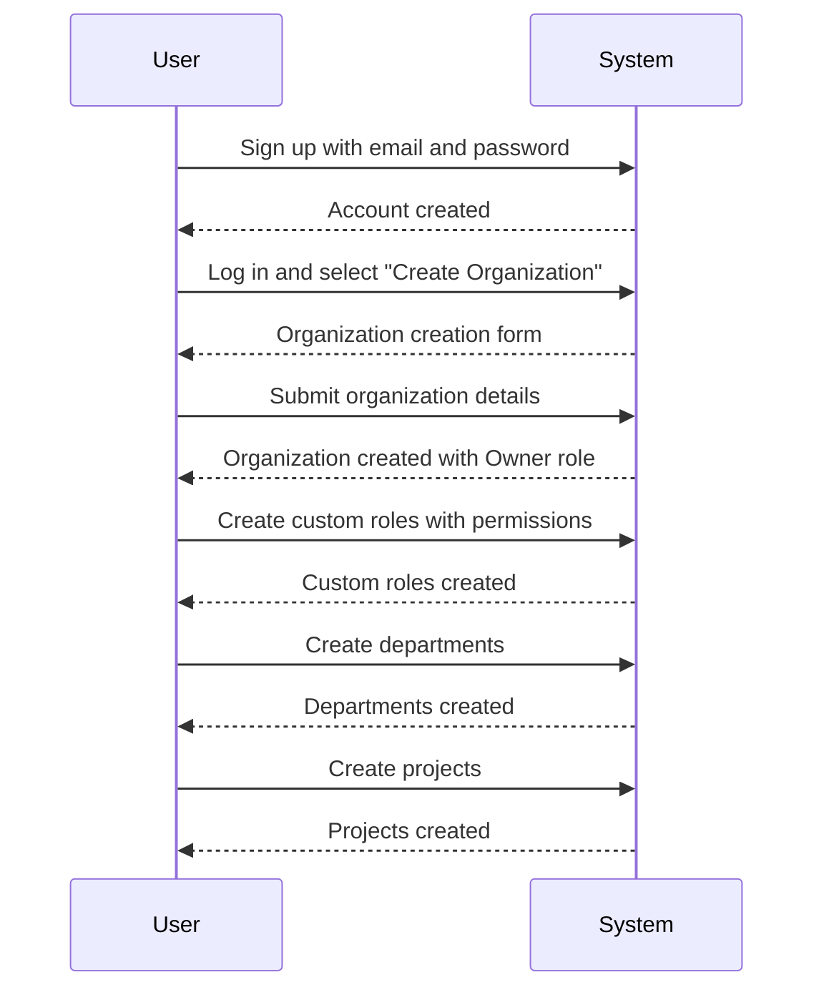
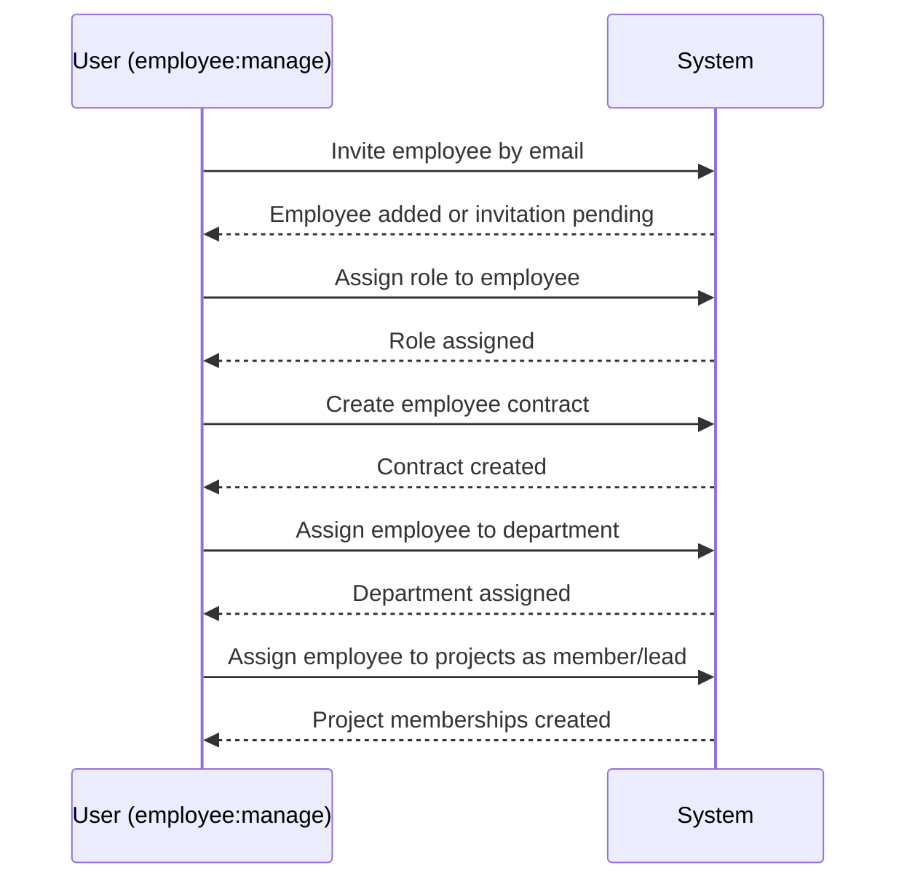
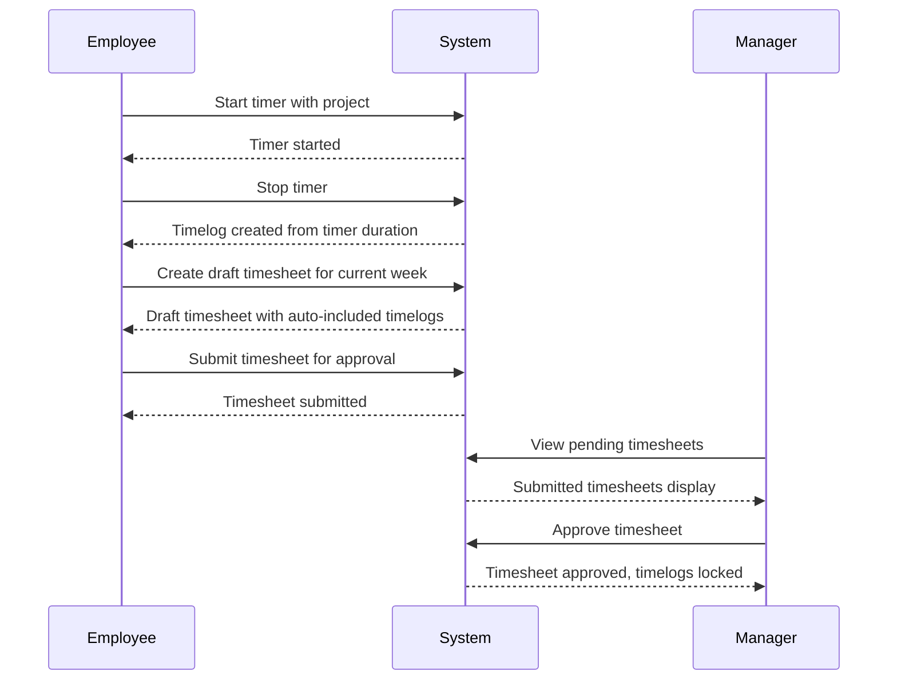
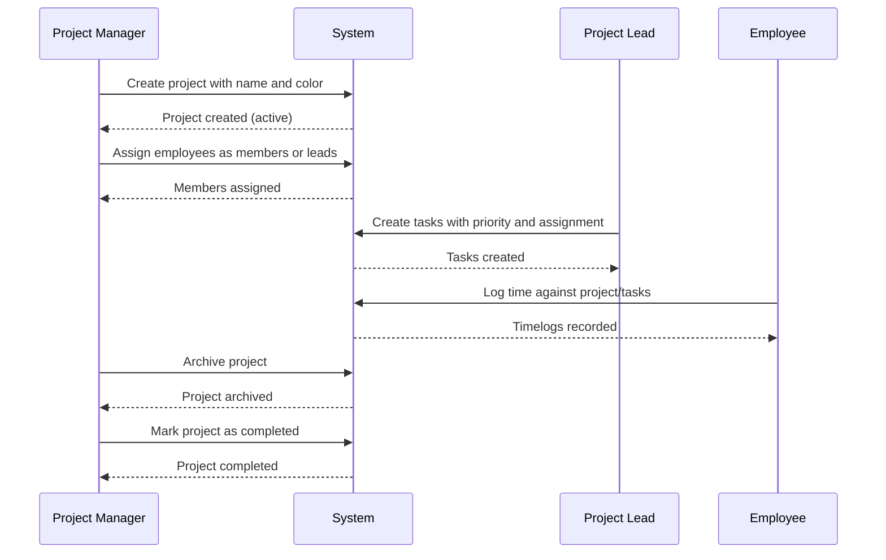
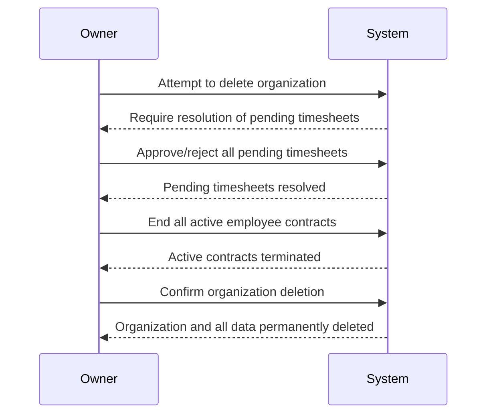
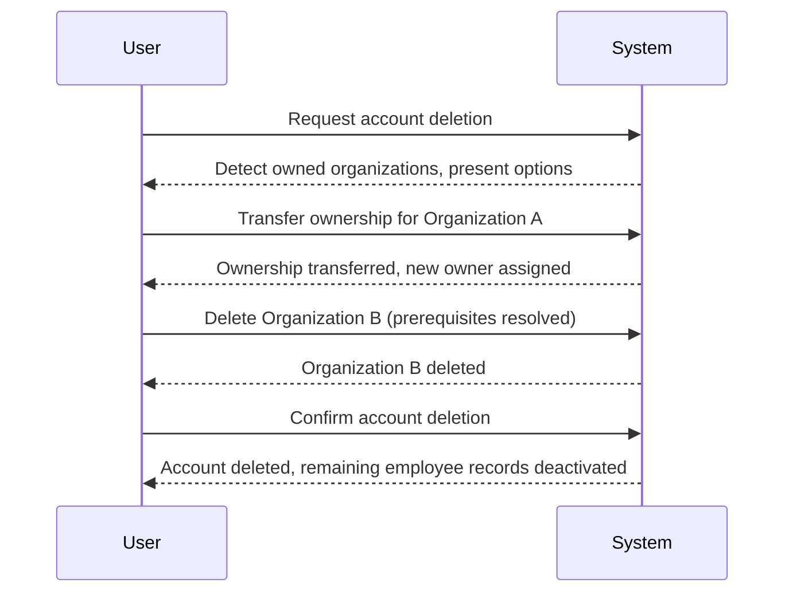
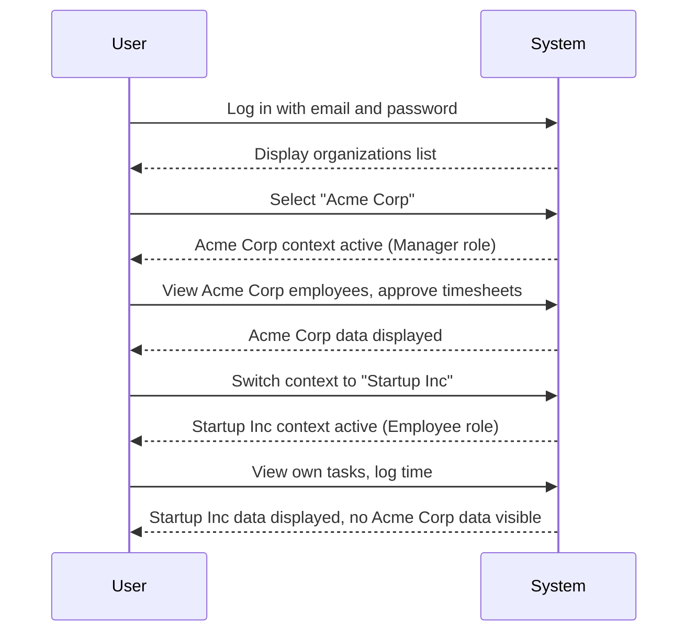
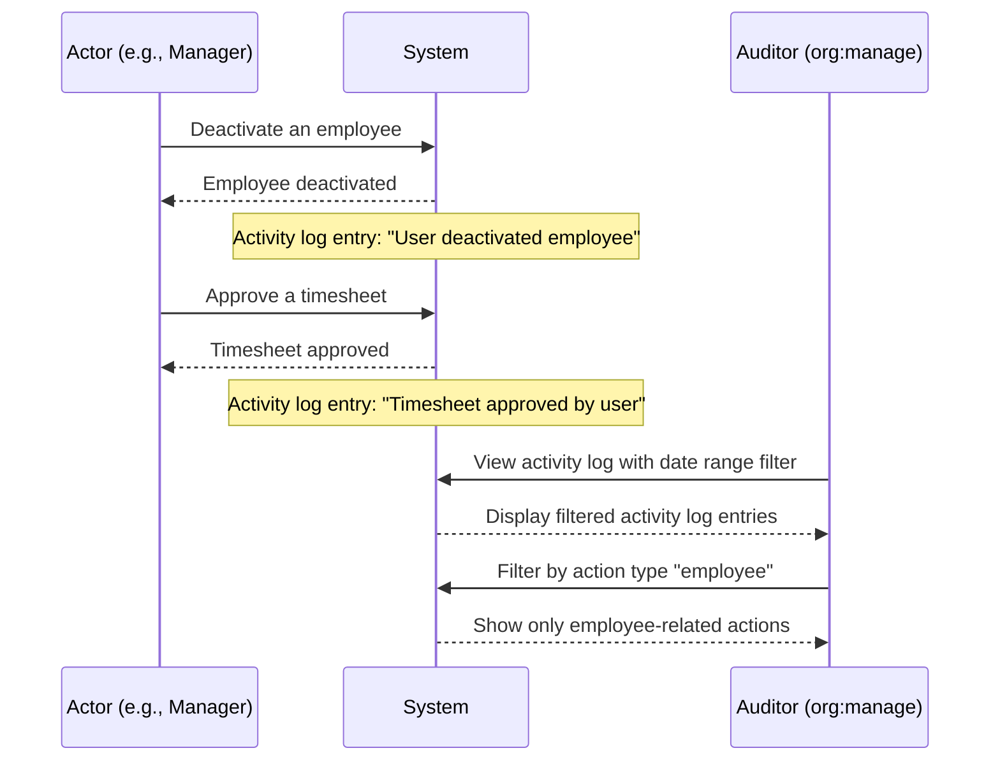
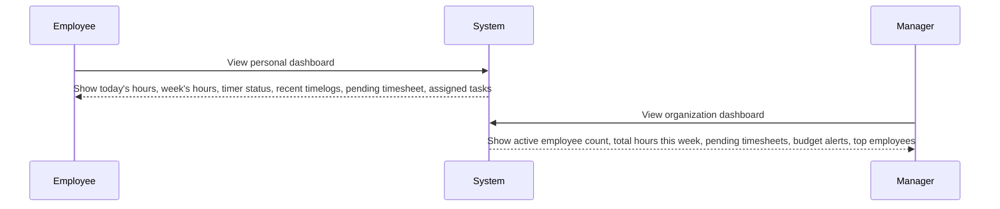
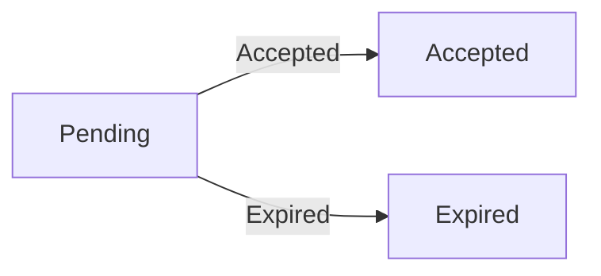

**hrmTimeTracking — What operations users can perform, use cases, business workflows**

What operations users can perform, use cases, business workflows

# Core Business Operations

What the system must do for each business concept.

## Organization Operations

Users create an organization during initial sign-up by providing a name, description, logo image, currency (e.g., USD, EUR, KRW), timezone, and fiscal start month. The organization operates as an independent tenant with its own employees, projects, and data — fully isolated from other organizations. Organization owners can edit the organization's settings including name, description, logo, currency, timezone, and fiscal start month at any time. Organization owners can delete their organization only when all pending timesheets have been resolved (approved or rejected) and there are no active employee contracts. When an organization is deleted, all related data — employees, projects, tasks, timelogs, and timesheets — are permanently removed. The owner's user account remains in the system but is no longer associated with any organization. Users who belong to multiple organizations can switch between them without logging out, and all actions are scoped to the currently selected organization context. The system ensures strict data isolation between organizations so employees in one organization cannot see data from another.

### Organization Creation During Sign-Up

THE system SHALL allow a new user to create an organization during the initial sign-up process by providing the following information:
- Organization name (required)
- Description (optional)
- Logo image (optional)
- Currency from a supported list (e.g., USD, EUR, KRW) (required)
- Timezone (required)
- Fiscal start month, chosen from January through December (required)

WHEN a user creates an organization, THE system SHALL automatically designate the creator as the organization owner with the Owner role (defined in [01-actors-and-auth.md - Owner Role]).

THE system SHALL treat each created organization as an independent tenant with complete data isolation from all other organizations.

WHEN organization creation completes, THE system SHALL immediately set the organization context to the newly created organization so the user can begin working within it.

WHERE the organization name is concerned, THE system SHALL allow names that are unique within reasonable bounds to avoid confusion among organization members, but uniqueness enforcement details are defined in [04-business-rules.md - Organization Validation Constraints].

### Organization Settings Editing

WHEN an organization owner accesses organization settings, THE system SHALL allow them to modify the following fields:
- Organization name
- Description
- Logo image
- Currency
- Timezone
- Fiscal start month

THE system SHALL persist all setting changes immediately upon confirmation.

THE system SHALL apply setting changes to the entire organization without disrupting any ongoing operations.

WHEN the currency is changed, THE system SHALL update the currency display for all financial information within the organization going forward. Historical financial data SHALL retain the currency value that was in effect at the time of recording.

WHEN the timezone is changed, THE system SHALL apply the new timezone for all date-time display and calculations within the organization going forward.

### Organization Deletion Prerequisites

WHEN an organization owner requests organization deletion, THE system SHALL verify the following prerequisites before proceeding:
1. All pending timesheets within the organization must be resolved — meaning every timesheet must be in either "approved" or "rejected" status. No timesheets may remain in "draft" or "submitted" status.
2. There must be no active employee contracts within the organization. All contracts must either be ended (with an end date) or absent.

IF either prerequisite is not met, THE system SHALL reject the deletion request (detailed rejection behavior is defined in [04-business-rules.md - Organization Deletion Error Scenarios]).

WHILE the prerequisites are not met, THE system SHALL allow the organization owner to view a summary of:
- Unresolved timesheets grouped by status (draft, submitted)
- Active employee contracts including the affected employee names

THE system SHALL allow the organization owner to navigate from the deletion screen to resolve the blocking items before attempting deletion again.

### Permanent Data Deletion Upon Organization Removal

WHEN all deletion prerequisites are satisfied and the organization owner confirms deletion, THE system SHALL permanently delete all organization-related data, including:
- All employee records and their associated contracts
- All projects, tasks, and task history
- All timelogs, timesheets, and timers
- All departments
- All roles (including built-in and custom)
- All project memberships
- All invitations
- All activity log entries
- All reports and dashboard data

THE system SHALL permanently remove all organization data from the system without any possibility of recovery. Data retention after deletion is defined in [05-non-functional.md - Data Retention and Recovery Policies].

THE system SHALL retain the owner's user account in the system after organization deletion. The owner SHALL still be able to log in with their email and password.

WHERE the owner's account after deletion is concerned, THE system SHALL clear the organization context and display that the user is no longer associated with any organization. The owner SHALL have the option to create a new organization or join an existing one via invitation.

### Multi-Tenant Data Isolation

THE system SHALL ensure strict data isolation between all organizations at all times.

WHEN a user performs any operation within an organization context, THE system SHALL restrict data access exclusively to data belonging to that organization.

THE system SHALL prevent any employee, manager, or owner of one organization from viewing, accessing, or acting upon data belonging to another organization, regardless of their role or permissions within either organization.

WHERE a user belongs to multiple organizations, THE system SHALL only display and allow interaction with data for the organization the user is currently working in.

THE system SHALL enforce organization-level data isolation on all operations — including but not limited to:
- Employee records and contracts
- Projects, tasks, and project memberships
- Timelogs, timesheets, and timers
- Departments
- Roles and permissions
- Activity logs
- Reports
- Invitations

### Organization Context Switching

WHEN a user belongs to multiple organizations, THE system SHALL allow the user to switch their current organization context without requiring logout or re-authentication.

WHEN a user switches organization context, THE system SHALL reload the interface and data scope to reflect the newly selected organization, applying the user's role and permissions within that specific organization.

THE system SHALL maintain the user's session credentials and authentication state across organization switches.

WHEN a user logs in and belongs to multiple organizations, THE system SHALL present the user with a list of their organizations and require the user to select one before proceeding to any organization-scoped operations.

WHEN a user logs in and belongs to only one organization, THE system SHALL automatically set the organization context to that organization without requiring a selection.

THE system SHALL display the currently active organization context prominently in the user interface so the user is always aware of which organization they are operating within.

## User Operations

Users sign up with an email and password to create a global account that can belong to multiple organizations. Users log in with their email and password, then select which organization to work in as their active context. A user can change their password at any time through their account settings. Users can switch between organizations they belong to without logging out — all subsequent actions are scoped to the selected organization. Each user has a global profile with a display name, avatar image, and phone number that is shared across all organizations they belong to. Users can edit their profile information at any time. Users can delete their own account, but if they are the sole owner of an organization, they must first transfer ownership to another user or delete the organization before proceeding. When a user account is deleted, their employee records in other organizations are marked as deactivated rather than removed, preserving historical data.

### User Registration

THE system SHALL allow a person to sign up by providing an email address and a password.

WHEN a person submits a registration request with an email address that already exists in the system, THE system SHALL reject the registration and notify the person that the email is already in use.

### User Login and Organization Selection

THE system SHALL allow a registered user to log in using their email address and password.

WHEN a user successfully logs in, AND the user belongs to at least one organization, THE system SHALL prompt the user to select one organization as their active work context before proceeding.

WHEN a user successfully logs in, AND the user does not belong to any organization, THE system SHALL direct the user to create a new organization or indicate that no organization memberships exist.

WHERE the user has selected an active organization context, THE system SHALL scope all subsequent operations and data visibility to that organization.

WHEN a user enters incorrect credentials, THE system SHALL reject the login attempt and notify the user that the email or password is invalid.

### Password Change

THE system SHALL allow a user to change their password at any time through their account settings.

WHEN a user requests a password change, THE system SHALL require the user to provide their current password for verification before accepting a new password.

WHEN the current password is verified successfully, THE system SHALL update the account with the new password.

IF the current password provided does not match the stored password, THEN THE system SHALL reject the password change and notify the user that the current password is incorrect.

### Organization Switching

THE system SHALL allow a user who belongs to multiple organizations to switch their active organization context without logging out.

WHEN a user switches to a different organization, THE system SHALL update the active context and re-scope all subsequent operations and data visibility to the newly selected organization.

WHILE the user is operating within an organization context, THE system SHALL only surface data belonging to that organization and enforce the permissions associated with the user's role in that organization.

### Global User Profile Management

THE system SHALL provide a global user profile that is shared across all organizations the user belongs to.

Each global user profile SHALL include a display name, an avatar image, and a phone number.

THE system SHALL allow a user to set and update their display name at any time.

THE system SHALL allow a user to upload, update, or remove their avatar image at any time.

THE system SHALL allow a user to set or update their phone number at any time.

WHEN a user updates any field in their global profile, THE system SHALL reflect the change across all organizations the user belongs to, since the profile is shared and not organization-specific.

### Account Deletion

THE system SHALL allow a user to delete their own account.

IF the user is the sole owner of one or more organizations, THEN THE system SHALL require the user to transfer ownership of each such organization to another existing user, or delete each organization entirely, before the account deletion can proceed.

WHEN a user requests account deletion while they own organizations that have other co-owners (not sole owner), THE system SHALL allow the deletion to proceed as long as the remaining owners can continue managing those organizations.

WHEN a user initiates account deletion, THE system SHALL deactivate all employee records belonging to that user across all organizations.

WHEN employee records are deactivated upon account deletion, THE system SHALL preserve all historical data associated with those employee records, including timelogs and timesheets.

WHEN a user's account is deleted, THE system SHALL remove the user's association with all organizations, but the organizations and their remaining data SHALL continue to exist independently.

## Employee Operations

Users with employee management permission can invite new employees to the organization by sending an invitation to their email address. If the invited email already has an existing user account, that user is immediately added to the organization as an employee. If the invited email has no account, a pending invitation is created, and when that person signs up with the same email, they are automatically added as an employee. Each employee record has a reference to the user account, a role in the organization, an optional department, an optional position or title, an employment type (full-time, part-time, contractor, intern), and a status (active or deactivated). Users with employee management permission can edit employee records to update department, position, and employment type. Employees can be deactivated, which prevents them from logging time or submitting timesheets while preserving their historical data. Deactivated employees can be reactivated at any time. Users with employee viewing permission can browse the employee list, which is paginated and supports filtering by department, employment type, and status, as well as searching by employee name.

### Employee Invitation

WHEN a user with employee:manage permission invites a new employee by providing an email address, THE system SHALL create an employee record for that user.

WHEN the invited email address belongs to an existing user account, THE system SHALL immediately create an active employee record in the organization, linked to that user account.

WHEN the invited email address has no existing user account, THE system SHALL create a pending invitation (see Invitation Operations). WHEN that person subsequently signs up using the same email, THE system SHALL automatically create an active employee record linked to the newly created user account.

A single employee invitation MUST NOT create duplicate employee records for the same user within the same organization.

### Employee Record Structure

Each employee record SHALL contain: a reference to the associated user account, the role assigned within the organization, the optional department, the optional position or job title, the employment type, and the employee status.

THE employee record SHALL always reference exactly one user account and one role.

THE available employment types SHALL be: full-time, part-time, contractor, and intern.

THE available employee statuses SHALL be: active and deactivated.

### Role Assignment

WHEN an employee record is created, THE system SHALL assign a role from the organization's available roles (defined in Role Operations).

WHEN a user with employee:manage permission changes an employee's role, THE system SHALL update the role assignment and record the change in the activity log (defined in ActivityLog Operations).

Each employee SHALL have exactly one role assigned at any time.

### Department and Position Assignment

WHEN creating or editing an employee record, THE system SHALL allow the assignment of an optional department from the organization's existing departments (defined in Department Operations).

WHEN creating or editing an employee record, THE system SHALL allow the assignment of an optional position or job title as free-text.

WHEN a department is deleted, THE system SHALL set the department field to null for all employees in that department (defined in Department Operations).

### Employment Type Selection

WHEN creating or editing an employee record, THE system SHALL allow selection of exactly one employment type from the available options: full-time, part-time, contractor, or intern.

THE employment type SHALL be a required field for every employee record.

### Editing Employee Records

WHEN a user with employee:manage permission edits an employee record, THE system SHALL allow updates to the department, position or title, employment type, and role assignment.

WHEN an employee record is edited, THE system SHALL record the change in the activity log, including what field was changed and by whom.

THE employee's user account reference SHALL NOT be editable — it is set at creation and immutable thereafter.

### Employee Deactivation Flow

WHEN a user with employee:manage permission deactivates an employee, THE system SHALL set that employee's status to deactivated.

WHILE an employee's status is deactivated, THE system SHALL block the employee from starting a timer (defined in Timer Operations), logging new timelogs, submitting timesheets, or accessing features that require active employee status.

WHEN an employee is deactivated, THE system SHALL NOT affect their existing project memberships, assigned tasks, or historical data.

THE system SHALL record the deactivation action in the activity log with timestamp and the user who performed it.

IF a user with employee:manage permission attempts to deactivate an already deactivated employee, THEN THE system SHALL reject the operation (error handling defined in Employee Error Scenarios).

### Historical Data Preservation on Deactivation

WHEN an employee is deactivated, THE system SHALL preserve all historical data associated with that employee, including: all past timelogs, all submitted and approved timesheets, all contracts (past and active), all project memberships, and all task assignments.

Deactivated employees' historical timelogs and timesheets SHALL remain visible to users with appropriate permissions (time:view_all, time:approve).

Deactivated employees' historical contracts SHALL remain visible to users with employee:view permission.

### Employee Reactivation

WHEN a user with employee:manage permission reactivates a deactivated employee, THE system SHALL set that employee's status back to active.

WHEN an employee is reactivated, THE system SHALL restore the employee's ability to start a timer, log timelogs, and submit timesheets.

WHEN an employee is reactivated, THE system SHALL restore access to any active project memberships and task assignments they had prior to deactivation.

THE system SHALL record the reactivation action in the activity log with timestamp and the user who performed it.

### Employee List Viewing

THE system SHALL provide a paginated list of all employees within the organization.

WHEN a user with employee:view permission accesses the employee list, THE system SHALL display each employee's display name, role, department, position, employment type, and status.

THE system SHALL allow filtering the employee list by department, employment type, and status.

THE system SHALL allow searching the employee list by employee name.

THE system SHALL support combined filters — for example, showing only active employees in a specific department.

### Employee Status Management

Every employee record SHALL have a status that is either active or deactivated at all times.

WHEN an employee record is first created (via invitation acceptance), THE system SHALL set the initial status to active.

Users with employee:manage permission SHALL be able to change an employee's status between active and deactivated as described in the deactivation and reactivation flows.

## Contract Operations

Users with employee management permission can create employment contracts for employees, each with a required start date, an optional end date (null means ongoing), a required pay rate, a pay period (hourly, daily, weekly, monthly), required working hours per week, and optional notes. Each employee can have multiple contracts as a historical record, but only one contract can be active at a time. Creating a new contract automatically ends the previous active contract by setting its end date to the day before the new contract starts. Users with employee management permission can edit the current active contract to update its details. Past contracts are treated as immutable historical records and cannot be edited. Employees can view their own contracts to see their pay rate, pay period, working hours, and employment timeline. Users with employee viewing permission can view any employee's contracts to review compensation history and employment terms.

### Contract Creation

Users with employee management permission can create employment contracts for employees. Each contract must include a start date and a pay rate (numeric value). The pay period must be selected from the following options: hourly, daily, weekly, or monthly. Working hours per week must be specified for each contract. An end date is optional — when omitted, the contract is considered ongoing with no predefined end. Contracts may include optional notes for additional context.

### Single Active Contract Rule

Each employee may have multiple contracts recorded over time, but only one contract can be active at any given time. When a new contract is created with a start date, the system automatically ends the previous active contract by setting its end date to the day before the new contract's start date. This ensures a continuous employment timeline without overlapping active periods.

### Active Contract Editing

Users with employee management permission can edit the currently active contract for an employee. Editable fields include pay rate, pay period, working hours per week, end date, and notes. Changes to the active contract update the employee's current employment terms.

### Past Contract Immutability

Contracts that have been ended — either by reaching their end date or by being superseded by a newer contract — become historical records. Past contracts cannot be edited. This preserves an accurate, immutable compensation history for each employee, allowing the organization to review previous pay rates, pay periods, and employment terms.

### Compensation History Tracking

Employees accumulate a compensation history through their contracts over time. Each contract records the pay rate, pay period, and working hours for a specific period, bounded by a start date and an optional end date. This history allows organizations to track how an employee's compensation and working arrangements have evolved.

### Contract Start and End Date Management

A contract's start date is required and defines when the employment terms take effect. An end date is optional — null means the contract is ongoing with no predetermined termination. When an end date is set, the contract is considered ended on that date. Users with employee management permission can set or update the end date on an active contract to end it early, or extend an active contract by clearing or moving the end date further.

### Employee Self-View of Contracts

Employees can view their own contracts to review their current and past compensation details. Each contract displays the pay rate, pay period, working hours per week, start date, end date (if set), and notes. This allows employees to understand their employment timeline, see how their pay has changed over time, and verify their current terms.

### Manager View of Employee Contracts

Users with employee viewing permission can view any employee's contracts. This provides managers with access to an employee's full compensation history, including current pay rate, pay period, working hours, contract dates, and notes. Managers can use this information for compensation reviews, budget planning, and employment verification.

## Department Operations

Users with organization management permission can create departments within the organization, each with a name, description, and an optional parent department supporting one level of nesting for hierarchical structure. Department creators can edit the department's name and description at any time. Users with organization management permission can delete departments from the organization. When a department is deleted, all employees assigned to that department have their department field set to null — employees are not deleted alongside the department. All employees in the organization can view the list of departments to see the organizational structure and department details. The parent department feature allows grouping related departments under a single umbrella, enabling basic organizational hierarchy without deep nesting complexity.

### Department Creation

THE system SHALL allow a user with organization management permission to create a department within the organization.

WHEN creating a department, THE system SHALL require a department name.

WHEN creating a department, THE system SHALL accept an optional description.

WHEN creating a department, THE system SHALL allow the user to optionally assign a parent department, limited to one level of nesting.

WHERE a parent department is assigned, THE system SHALL display the department as a child of its parent in the organizational structure.

### Department Editing

THE system SHALL allow a user with organization management permission to edit the name of an existing department.

THE system SHALL allow a user with organization management permission to edit the description of an existing department.

WHEN the department name is changed, THE system SHALL update the name across all references within the organization.

### Department Deletion

THE system SHALL allow a user with organization management permission to delete a department from the organization.

WHEN a department is deleted, THE system SHALL set the department field to null for all employees previously assigned to that department.

WHEN a department is deleted, THE system SHALL NOT delete any employees assigned to the department — all employee records are preserved.

WHEN a department is deleted, THE system SHALL preserve all other data (contracts, projects, timelogs, timesheets) associated with the employees who were in the deleted department.

### Department List Viewing

THE system SHALL allow all employees within an organization to view the list of departments.

THE system SHALL display the full organizational structure including department names, descriptions, and parent-child relationships.

THE system SHALL present the department hierarchy with one level of nesting, showing child departments grouped under their parent department.

THE system SHALL display each department's parent department name where one is assigned.

THE system SHALL NOT require any special permission for viewing the department list — all employees have access.

## Role Operations

Each organization has its own set of roles with three built-in roles that cannot be deleted: Owner (full access to all features), Manager (can manage employees and projects, approve timesheets, view reports), and Employee (can track time, submit timesheets, view own data). Organization owners can create custom roles by providing a name and selecting from a set of available permissions including organization management, employee management, employee viewing, project management, project viewing, time management, time approval, time viewing for all employees, and report viewing. Organization owners can edit custom roles to change their name or permission set at any time. Organization owners can delete custom roles only if no employees are currently assigned to them. Each employee in an organization is assigned exactly one role that determines their access and capabilities. Users with employee management permission can change an employee's role assignment as needed.

### Built-in Owner Role Operations

THE system SHALL grant the Owner role full access to all features within their organization.

WHEN a user holds the Owner role, THE system SHALL allow them to manage roles, including creating custom roles, editing custom roles, and deleting custom roles.

WHEN a user holds the Owner role, THE system SHALL allow them to manage organization members, including inviting employees and changing role assignments.

WHEN a user holds the Owner role, THE system SHALL allow them to perform all operations available across the platform, including organization settings management, project management, employee management, timesheet approval, report viewing, and activity log access.

### Built-in Manager Role Operations

WHEN a user holds the Manager role, THE system SHALL allow them to manage employees, including adding new employees, editing employee records, and deactivating employees.

WHEN a user holds the Manager role, THE system SHALL allow them to manage projects, including creating, editing, archiving, completing, and deleting projects.

WHEN a user holds the Manager role, THE system SHALL allow them to approve or reject submitted timesheets.

WHEN a user holds the Manager role, THE system SHALL allow them to view organization reports.

### Built-in Employee Role Operations

WHEN a user holds the Employee role, THE system SHALL allow them to track time by creating, editing, and deleting their own timelogs.

WHEN a user holds the Employee role, THE system SHALL allow them to submit timesheets for approval.

WHEN a user holds the Employee role, THE system SHALL allow them to view their own data, including their own timelogs, timesheets, contracts, and assigned tasks.

WHEN a user holds the Employee role, THE system SHALL prevent them from managing other employees, managing projects, approving timesheets, or viewing organization-wide reports.

### Custom Role Creation

WHEN an Organization Owner creates a custom role, THE system SHALL require a role name and a selection of permissions from the available permission set.

THE available permissions for selection SHALL include: organization management (org:manage), employee management (employee:manage), employee viewing (employee:view), project management (project:manage), project viewing (project:view), time management (time:manage), time approval (time:approve), time viewing for all employees (time:view_all), and report viewing (report:view).

WHERE a custom role is created, THE system SHALL assign the selected permissions to that role and make it available for employee assignment.

### Custom Role Editing

WHEN an Organization Owner edits a custom role, THE system SHALL allow them to change the role name.

WHEN an Organization Owner edits a custom role, THE system SHALL allow them to add or remove permissions from the role's permission set.

WHERE a custom role's permissions are updated, THE system SHALL apply the new permission set to all employees currently assigned to that role.

### Custom Role Deletion

WHEN an Organization Owner attempts to delete a custom role, THE system SHALL first verify that no employees are currently assigned to that role.

WHERE no employees are assigned to the custom role, THE system SHALL allow the deletion and remove the role from the organization.

WHERE employees are assigned to the custom role, THE system SHALL prevent the deletion and notify the Organization Owner that the role must be reassigned before deletion.

### Employee Role Assignment

THE system SHALL assign exactly one role to each employee within an organization.

WHEN an employee is invited to an organization, THE system SHALL require a role assignment as part of the invitation process.

WHEN a user with employee:manage permission changes an employee's role, THE system SHALL update the employee's role and permissions immediately.

WHERE an employee's role is changed, THE system SHALL revoke the previous role's permissions and grant the new role's permissions.

## Project Operations

Users with project management permission can create projects with a required name, optional description, required color code for UI display, a status (active, archived, completed), optional budget hours as total estimated hours, and optional start and end dates. Project creators and authorized users can edit project details including name, description, color code, budget hours, and dates. Users with project management permission can change a project's status to archived or completed, which prevents the project from receiving new timelogs while preserving existing timelogs. Users with project management permission can delete a project only if it has no timelogs associated with it. Users with project viewing permission can browse the project list, which is paginated and can be filtered by project status (active, archived, completed). The budget hours feature allows organizations to estimate and track effort against planned capacity for each project.

### Project Creation

THE system SHALL allow users with `project:manage` permission to create projects.

WHEN a user creates a project, THE system SHALL require a project name. WHEN a user creates a project, THE system SHALL require a color code for UI display purposes.

WHEN a user creates a project, THE system SHALL accept an optional description. WHEN a user creates a project, THE system SHALL accept optional budget hours representing the total estimated hours for the project. WHEN a user creates a project, THE system SHALL accept an optional start date and an optional end date. WHERE an end date is provided, THE system SHALL reject the project creation if the end date is earlier than the start date.

WHEN a project is created, THE system SHALL set its initial status to "active".

### Project Status Management

THE system SHALL support three project statuses: active, archived, and completed.

WHILE a project has status "active", THE system SHALL allow users with `project:manage` permission to change its status to "archived" or "completed".

WHILE a project has status "archived" or "completed", THE system SHALL reject any new timelogs being created for that project. WHILE a project has status "archived" or "completed", THE system SHALL preserve all existing timelogs associated with that project.

WHEN a project's status is changed, THE system SHALL record the change in the activity log.

### Project Editing

THE system SHALL allow users with `project:manage` permission to edit project details.

THE system SHALL allow editing of the project name, description, color code, budget hours, start date, and end date. WHERE the end date is edited to a date earlier than the start date, THE system SHALL reject the edit.

### Project Deletion

THE system SHALL allow users with `project:manage` permission to delete a project only if the project has no timelogs associated with it.

WHEN a user attempts to delete a project that has timelogs, THE system SHALL reject the deletion request.

### Project List Viewing

THE system SHALL allow users with `project:view` permission to view the list of all projects within their organization.

THE system SHALL paginate the project list. THE system SHALL allow users to filter the project list by project status (active, archived, or completed).

## ProjectMember Operations

Users with project management permission can assign employees to projects by creating project membership records. Each project membership links an employee to a project with an assigned role of either member or project-lead. An employee can be assigned to multiple projects simultaneously. Project leads have the authority to manage tasks within their assigned project, including creating and updating tasks. Users with project management permission can remove employees from projects at any time, which ends that employee's association with the project. Employees can view which projects they are assigned to, seeing their role and project details. The distinction between member and project-lead roles enables delegation of task management responsibilities within projects without granting full project management permissions.

### Project Membership Creation

THE system SHALL allow users with `project:manage` permission to assign an active employee to a project by creating a project membership record.

WHEN a project membership is created, THE system SHALL require the following information:
- The employee to assign (must be an active employee within the same organization)
- The project to assign to (must exist and belong to the same organization)
- The role within the project: either "member" or "project-lead"

WHERE the employee is already assigned to the project, THE system SHALL reject the creation request and notify the user that the employee is already a member of this project.

WHERE the employee has a deactivated status, THE system SHALL reject the creation request.

WHERE the employee belongs to a different organization than the project, THE system SHALL reject the creation request to enforce data isolation.

### Project Membership Role Assignment

THE system SHALL support two project membership roles: "member" and "project-lead".

WHEN a project membership is created, THE system SHALL record the assigned role as specified by the user creating the membership.

WHILE a project membership exists, THE system SHALL allow users with `project:manage` permission to change the role of an existing project member between "member" and "project-lead".

WHERE a user has `project:manage` permission, THE system SHALL allow them to change the role of any project member within projects they have access to.

THE system SHALL record the role assignment as part of the project membership record, not as an independent entity.

### Member vs Project-Lead Distinction

THE system SHALL distinguish project members by their assigned role: "member" or "project-lead".

WHERE an employee is assigned the "project-lead" role on a project, THE system SHALL grant them the authority to create tasks within that project.

WHERE an employee is assigned the "project-lead" role on a project, THE system SHALL grant them the authority to edit tasks within that project.

WHERE an employee is assigned the "project-lead" role on a project, THE system SHALL grant them the authority to update task statuses within that project.

WHERE an employee is assigned the "member" role on a project, THE system SHALL NOT grant them task management authority beyond viewing tasks and logging time against them.

THE system SHALL enforce that project-lead authority for task management is scoped only to the specific project where the employee holds the project-lead role.

### Project Lead Task Management Authority

WHEN an employee holds the "project-lead" role on a project, THE system SHALL allow them to perform the following operations on tasks within that project:
- Create tasks with title (required), description (optional), status, priority, estimated hours, due date, and assigned employee
- Edit tasks including title, description, priority, estimated hours, and due date
- Change task status between open, in-progress, completed, and closed
- Assign tasks to employees who are members of the project
- Set a parent task for subtask relationships (one level of nesting only)

WHERE a project lead assigns a task to an employee, THE system SHALL verify that the assigned employee is a current project member.

WHERE a project lead assigns a task to a non-member, THE system SHALL reject the assignment and notify the project lead.

THE system SHALL allow users with `project:manage` permission to perform the same task management operations as a project lead on any project, regardless of their own project membership role.

### Multiple Project Memberships per Employee

THE system SHALL allow an employee to be assigned to multiple projects within the same organization simultaneously.

WHEN an employee is a member of multiple projects, THE system SHALL treat each project membership independently, with its own role assignment.

WHEN an employee is a member of multiple projects, THE system SHALL allow them to log time against any of their assigned projects.

WHEN an employee is a member of multiple projects, THE system SHALL allow them to view tasks from all projects they are assigned to.

WHERE an employee has different roles on different projects (e.g., "member" on one project and "project-lead" on another), THE system SHALL enforce the role-specific permissions independently for each project.

### Employee Removal from Projects

WHEN a user with `project:manage` permission removes an employee from a project, THE system SHALL delete the project membership record.

WHEN an employee is removed from a project, THE system SHALL:
- No longer allow the employee to log time against that project
- No longer allow the employee to view the project in their assigned projects list
- Preserve any historical timelogs the employee had logged against that project (they remain as part of the timelog records)
- Preserve any tasks the employee was assigned to within that project (tasks remain but are no longer associated with the removed employee)

WHERE the removed employee has timelogs associated with the project, THE system SHALL NOT delete those timelogs.

WHERE the removed employee has open tasks assigned to them in the project, THE system SHALL clear the assignment on those tasks upon removal.

THE system SHALL allow a removed employee to be reassigned to the same project at a later time by a user with `project:manage` permission.

### Employee Self-View of Assigned Projects

WHEN an employee views their assigned projects, THE system SHALL display:
- The project name
- The project color code
- The project status (active, archived, or completed)
- The employee's role on the project ("member" or "project-lead")
- The project description (if any)
- The project start and end dates (if any)

WHEN an employee views their assigned projects, THE system SHALL only show projects within their currently selected organization context.

WHEN an employee views their assigned projects, THE system SHALL NOT show projects they are not a member of, even if they have `project:view` permission (project listing for those with `project:view` permission is covered separately under Project Operations).

WHERE an employee has been removed from a project, THE system SHALL no longer display that project in their assigned projects view.

## Task Operations

Project leads or users with project management permission can create tasks within a project, each with a required title, optional description, a status (open, in-progress, completed, closed), a priority (low, medium, high, urgent), optional estimated hours, optional due date, optional assigned employee who must be a project member, and an optional parent task for subtask relationships limited to one level of nesting. Project leads can edit tasks within their assigned project, including updating title, description, status, priority, estimated hours, due date, and assignment. Users with project management permission can edit any task across the organization. When a task's status changes, the system records a task history entry with the timestamp, old status, new status, and who made the change. Employees can view tasks in projects they are assigned to. Tasks can be filtered by status, priority, and assigned employee, and sorted by due date, priority, or creation date for efficient work organization.

### Task Creation

THE system SHALL allow project leads (as defined in ProjectMember Operations) and users with project:manage permission to create tasks within a project.

WHEN a task is created, THE system SHALL require a title and a priority selection from the following values: low, medium, high, urgent.

WHEN a task is created, THE system SHALL allow an optional description, optional estimated hours, and an optional due date to be provided.

WHEN a task is created, THE system SHALL allow an optional assignment to an employee, provided that employee is a member of the project (defined in ProjectMember Operations).

WHEN a task is created, THE system SHALL allow an optional parent task to be specified, WHERE the parent task belongs to the same project and the nesting is limited to one level of depth (a task cannot be a parent if it already has a parent task itself).

### Task Status Management

THE system SHALL maintain each task with one of the following status values: open, in-progress, completed, closed.

WHEN a task is created, THE system SHALL set its initial status to open.

WHILE a task exists, authorized users (as defined in "Task Editing" section) SHALL be able to change its status to any of the valid values.

WHEN a task's status changes, THE system SHALL automatically create a task history entry recording the timestamp, old status, new status, and the user who made the change (as defined in TaskHistory Operations).

### Task Editing

THE system SHALL allow project leads to edit tasks within projects they are assigned to as project-lead.

THE system SHALL allow users with project:manage permission to edit any task across the organization.

WHEN editing a task, authorized users SHALL be able to update the title, description, status, priority, estimated hours, due date, and assigned employee.

WHEN updating the assigned employee, THE system SHALL enforce that the new assignee is a member of the project.

WHEN updating the parent task, THE system SHALL enforce that the new parent task belongs to the same project and that the nesting remains at one level of depth.

### Task Viewing and Filtering

THE system SHALL allow employees to view tasks in projects they are assigned to.

THE system SHALL allow users with project:view permission to view all tasks across the organization.

WHEN viewing a list of tasks, THE system SHALL support filtering by status, priority, and assigned employee.

WHEN viewing a list of tasks, THE system SHALL support sorting by due date (ascending or descending), priority (from urgent to low or vice versa), and creation date (ascending or descending).

### Task Status Change Tracking

WHEN a task's status changes (as defined in "Task Status Management" section), THE system SHALL record a task history entry.

THE task history entry SHALL contain the timestamp of the change, the old status value, the new status value, and the user who performed the change (as defined in TaskHistory Operations).

WHERE task history exists for a given task, users with project:view permission or employees assigned to the project SHALL be able to view the history to review the task's progress timeline.

## TaskHistory Operations

The system automatically records a task history entry whenever a task's status changes, capturing the timestamp of the change, the previous status, the new status, and the user who performed the status change. Task history entries are created by the system in response to authorized user actions — they are never created, edited, or deleted manually by any user. Task history provides an immutable audit trail of all status transitions for each task, allowing reviewers to understand how work has progressed over time. Users with task viewing access can review the history of status changes for tasks they are permitted to see. The history enables tracking of when tasks moved from open to in-progress, in-progress to completed, or completed to closed, and who was responsible for each transition.

### Automatic Task History Creation on Status Change

THE system SHALL automatically create a task history entry each time a user with appropriate permissions changes a task's status.

WHEN a task status transitions from one valid status to another (for example, open to in-progress, in-progress to completed, or completed to closed), THE system SHALL generate a new task history entry recording the transition.

THE system SHALL create task history entries only in response to authorized task status changes. Task history entries SHALL NOT be created, modified, or deleted by any user through manual action.

Each status change SHALL produce exactly one task history entry. Duplicate entries for a single status change SHALL NOT be created.

THE system SHALL preserve all task history entries even after the associated task's status has changed again, maintaining a complete chronological record of every status transition the task has undergone.

### History Entry Attributes — Timestamp, Old Status, New Status, and Actor

Each task history entry SHALL record the following attributes:

- **Timestamp**: the exact date and time when the status change occurred
- **Old status**: the task's status immediately before the change
- **New status**: the task's status immediately after the change
- **Changed by**: the user who performed the status change

THE timestamp SHALL reflect the moment the system processed the status change, not a value supplied by the user.

THE old status and new status SHALL use the same set of valid status values defined for tasks: open, in-progress, completed, and closed.

THE changed by field SHALL reference the user account that authorized the status update through the system interface.

### Immutable Audit Trail for Tasks

All task history entries SHALL be immutable once created. No user, regardless of role or permission level, SHALL be able to edit, update, or delete any existing task history entry.

THE task history SHALL serve as a permanent audit trail of every status transition for the lifetime of a task. Historical entries SHALL be preserved even when:

- The task's status reverts to a previously held status
- The task is deleted
- The employee assigned to the task changes
- The project containing the task is archived or completed

THE immutability of task history entries SHALL ensure accountability for workflow state changes, providing a reliable record of who changed what status and when.

### Task History Viewing and Progress Timeline Review

Users with task viewing access SHALL be able to view the complete history of status changes for tasks they are permitted to see.

THE system SHALL display task history entries in chronological order, with the most recent status change listed first, enabling users to understand the complete progression of a task's lifecycle.

Each task history entry SHALL present the timestamp, the user who performed the change, the previous status, and the new status, allowing reviewers to understand the full context of each transition.

Users SHALL be able to review a task's status transition history to:

- Understand when work moved from one stage to the next
- Identify who moved a task through each stage of the workflow
- Determine how long a task remained in each status before transitioning
- Trace the complete lifecycle of a task from creation through completion

THE system SHALL provide the task history in a format suitable for review, such as a timeline or chronological list, without requiring users to access technical system logs.

### Workflow State Change Accountability

THE task history SHALL provide full accountability for all workflow state changes by recording the identity of the user who performed each status transition.

WHEN a task transitions between statuses, THE system SHALL ensure the changed by user is reliably captured and associated with the corresponding task history entry.

THE system SHALL support the use of task history entries for audit and review purposes, allowing managers and project leads to verify that status changes were performed by authorized personnel.

Task history entries SHALL remain associated with their task throughout the task's lifecycle, enabling traceability from a task's initial open status through all intermediate transitions to its final closed status.

## Timelog Operations

Employees can create timelogs to record time spent on work, specifying a date, duration in minutes, a project they are assigned to, an optional task belonging to that project, an optional description of what was done, and a billable flag that defaults to true. Employees can only create timelogs for themselves — they cannot log time on behalf of other employees. Employees can edit their own timelogs only if the timelog is not part of an approved timesheet, ensuring approved time records remain locked. Employees can delete their own timelogs only if the timelog is not part of any submitted or approved timesheet, protecting time records under review or already approved. Users with time management permission can edit or delete any employee's timelogs regardless of timesheet status. Users with time viewing permission can view all employees' timelogs across the organization. Timelogs are presented in a paginated list that can be filtered by date range, project, task, and billable status.

### Timelog Creation

Employees can create a timelog to record time spent on work activities. Each timelog requires a date, a duration in minutes, and a project — the project must be one the employee is assigned to (active membership). An optional task belonging to that project and an optional description of what was done may be provided. A billable flag is set automatically to true by default; employees may change it to false when creating the timelog if the work is non-billable. Employees can only create timelogs for themselves — the system does not allow an employee to log time on behalf of another employee.

### Timelog Editing

Employees can edit their own timelogs — including the date, duration, project, task, description, and billable flag — as long as the timelog has not been included in an approved timesheet. Once a timelog belongs to an approved timesheet, the employee cannot modify it. Users with the time management permission can edit any employee's timelogs regardless of the timelog's timesheet status, overriding the restriction on approved timesheets.

### Timelog Deletion

Employees can delete their own timelogs only if the timelog is not part of any submitted or approved timesheet. If a timelog belongs to a draft timesheet or is unassigned to any timesheet, the employee may delete it freely. Users with the time management permission can delete any employee's timelogs regardless of the timelog's association with submitted or approved timesheets, overriding the restriction.

### Timelog Viewing

Employees can view their own timelogs. Users with the time viewing permission can view all employees' timelogs across the organization, enabling supervisors and managers to review logged time without needing to access individual employee accounts.

### Timelog List and Filtering

Timelogs are presented in a paginated list. Employees and authorized viewers can filter the list by date range, project, task, and billable status (billable or non-billable). These filters can be combined to narrow down specific time entries.

## Timesheet Operations

Employees can create a draft timesheet for a specific work week from Monday to Sunday, which automatically includes all their timelogs for that week. Employees can add or remove timelogs from a draft timesheet to refine what is included. Employees can submit a draft timesheet for approval, but submission is blocked if the timesheet has no timelogs or if another timesheet for the same week is already submitted or approved. Users with time approval permission can view all submitted timesheets across the organization. Approvers can approve submitted timesheets, which locks all included timelogs so they cannot be edited or deleted. Approvers can reject submitted timesheets with a required rejection reason, which returns the timesheet to draft status so the employee can modify and resubmit. Each timesheet tracks its status (draft, submitted, approved, rejected), total hours calculated from included timelogs, submission timestamp, review timestamp, reviewer identity, and rejection reason. Employees can view their own timesheets, and the timesheet list is paginated with filtering by status and date range.

### Draft Timesheet Creation

THE system SHALL allow an employee to create a draft timesheet for a work week running from Monday to Sunday.

WHEN a draft timesheet is created, THE system SHALL automatically include all timelogs owned by the employee for that same Monday-to-Sunday period.

THE system SHALL allow at most one timesheet in any status per employee per work week. IF a timesheet already exists for the week, THE system SHALL reject the creation of a new draft.

### Draft Timesheet Modification

THE system SHALL allow an employee to add timelogs to or remove timelogs from their own draft timesheet.

WHEN adding a timelog, THE system SHALL require the timelog to belong to the same employee and the same work week.

WHEN removing a timelog from a draft, THE system SHALL disassociate the timelog from the timesheet while preserving the timelog as a standalone entry.

WHILE a timesheet is in submitted or approved status, THE system SHALL prevent the employee from adding or removing timelogs.

### Timesheet Submission for Approval

THE system SHALL allow an employee to submit a draft timesheet for approval.

WHEN an employee submits a draft timesheet, IF the timesheet contains no timelogs, THEN THE system SHALL reject the submission.

WHEN an employee submits a draft timesheet, IF another timesheet for the same work week is already in submitted or approved status, THEN THE system SHALL reject the submission.

WHEN submission succeeds, THE system SHALL set the timesheet status to "submitted", record the submission timestamp, and mark the timesheet as awaiting review.

WHILE a timesheet is in submitted status, THE system SHALL prevent the employee from editing or deleting timelogs within it.

### Timesheet Approval and Timelog Locking

THE system SHALL allow a user with time:approve permission (defined in [01-actors-and-auth.md](./01-actors-and-auth.md)) to view all submitted timesheets across the organization.

THE system SHALL allow the approver to approve a submitted timesheet. Upon approval, THE system SHALL set the timesheet status to "approved", record the review timestamp, and record the reviewer's identity.

WHEN a timesheet is approved, THE system SHALL lock all included timelogs — they shall not be editable or deletable (see [04-business-rules.md](./04-business-rules.md) for timelog locking rules).

### Timesheet Rejection and Draft Return

THE system SHALL allow a user with time:approve permission to reject a submitted timesheet.

WHEN rejecting a timesheet, THE system SHALL require the approver to provide a rejection reason. IF no rejection reason is provided, THE system SHALL reject the action.

WHEN rejection succeeds, THE system SHALL set the timesheet status to "draft", record the review timestamp, record the reviewer's identity, and record the rejection reason.

WHEN a timesheet returns to draft status after rejection, THE system SHALL allow the employee to modify the timelogs and resubmit the timesheet for approval.

### Timesheet Status Tracking and Metadata

THE system SHALL maintain each timesheet's status as one of: draft, submitted, approved, or rejected.

THE system SHALL calculate the total hours for a timesheet by summing the duration of all included timelogs. THE system SHALL update the total hours automatically when timelogs are added to or removed from a draft timesheet.

THE system SHALL record the following timestamps for each timesheet: creation timestamp, submission timestamp (set when status changes to submitted), and review timestamp (set when status changes to approved or rejected).

### Timesheet Viewing and Filtering

THE system SHALL allow an employee to view their own timesheets.

THE system SHALL allow a user with time:approve permission to view all employees' submitted timesheets.

THE system SHALL paginate the timesheet list (see [04-business-rules.md](./04-business-rules.md) for pagination rules).

THE system SHALL allow an employee to filter their own timesheet list by status (draft, submitted, approved, rejected) and by date range.

THE system SHALL allow a user with time:approve permission to filter the organization's submitted timesheet list by status and date range.

## Timer Operations

Employees can start a live timer to track time in real-time, requiring selection of a project they are assigned to, with an optional task and description. Each employee can have at most one active timer at a time — starting a new timer when one is already running is not permitted. The timer records the start timestamp, the selected project, optional task, and optional description. Employees can stop their active timer, which creates a timelog with the calculated duration rounded to the nearest minute based on the start and stop timestamps. Employees can discard their active timer without creating a timelog, effectively canceling the time tracking session. The timer continues running indefinitely if the employee forgets to stop it — there is no automatic stop mechanism. Employees can view their currently running timer to see what project and task they are tracking. Employees can edit the description, project, and task of a running timer without stopping it first.

### Timer Start

WHEN an employee starts a timer, THE system SHALL require the selection of a project that the employee is currently assigned to.

WHEN an employee starts a timer, THE system SHALL allow an optional task belonging to the selected project and an optional description.

WHEN an employee starts a timer while they already have an active timer, THE system SHALL reject the request and notify the employee that a timer is already running.

WHERE the employee is deactivated, THE system SHALL reject the timer start request.

### Running Timer Viewing

WHEN an employee requests to view their current timer, THE system SHALL display the running timer's start timestamp, selected project, selected task (if any), and description (if any).

WHEN no timer is currently running, THE system SHALL indicate that no active timer exists.

### Running Timer Editing

WHILE a timer is running, THE employee SHALL be able to edit the description, project, and task of the running timer without stopping it first.

WHEN an employee changes the project of a running timer, THE system SHALL only allow selecting a project the employee is assigned to.

WHEN an employee changes the task of a running timer, THE system SHALL only allow selecting a task belonging to the currently selected project.

### Timer Stop and Timelog Creation

WHEN an employee stops their active timer, THE system SHALL create a timelog with the calculated duration based on the start timestamp and the stop timestamp.

WHEN a timelog is created from a stopped timer, THE system SHALL round the duration to the nearest minute.

WHEN a timelog is created from a stopped timer, THE system SHALL populate the timelog with the date of the start timestamp, the project selected on the timer, the task (if any), and the description (if any).

WHEN a timelog is created from a stopped timer, THE system SHALL set the billable flag to true by default.

WHEN a timelog is created from a stopped timer, THE system SHALL associate the timelog with the employee who owned the timer.

### Timer Discard

WHEN an employee discards their active timer, THE system SHALL terminate the timer session without creating any timelog.

WHEN a timer is discarded, THE system SHALL allow the employee to start a new timer immediately.

### No Automatic Timer Stop

THE system SHALL not automatically stop a running timer under any circumstance. The timer continues running indefinitely until the employee manually stops or discards it.

## Invitation Operations

Users with employee management permission can invite new employees by sending an invitation to an email address. The invitation system checks whether the invited email already has an existing user account in the system. If the email is associated with an existing account, the user is immediately added to the organization as an employee with the specified role. If the email has no account, a pending invitation is created and stored, awaiting the recipient's sign-up. When a new user signs up with that email address, the system automatically checks for pending invitations and adds them to the corresponding organizations. This invitation-to-sign-up flow ensures that employees without accounts can be pre-approved and automatically onboarded. Invitations have a status that tracks whether they are pending, accepted, or expired, enabling administrators to manage the invitation pipeline.

### Employee Invitation by Email

Users with the `employee:manage` permission SHALL be able to invite a new employee to the organization by providing an email address and selecting a role from the organization's available roles.

WHEN a user initiates an invitation, THE system SHALL verify that the inviting user has the `employee:manage` permission within the current organization.

WHERE an invitation is created, THE system SHALL store the invited email address, the target organization, the selected role, a creation timestamp, and the current status.

THE system SHALL track which user created the invitation.

IF the invited email address is already associated with an active employee record in the same organization, THEN THE system SHALL reject the invitation.

IF the invited email address has an existing pending invitation for the same organization, THEN THE system SHALL reject the duplicate invitation.

### Existing User Auto-Addition on Invite

WHEN a user with the `employee:manage` permission invites an email address that already has an existing user account registered in the system, THE system SHALL automatically create an employee record for that user in the organization instead of creating a pending invitation.

THE system SHALL create the employee record with:
- The invited user's account as the employee reference
- The role specified in the invitation
- A status of "active"
- The department, position, and employment type fields left unset (to be filled by editing)

THE system SHALL record this action in the activity log as an "employee invited" action, including the inviting user, the invited user's name, and the assigned role.

The employee SHALL immediately be able to access the organization, view projects they are assigned to, and log time according to their role's permissions.

### Pending Invitation Creation for New Users

WHEN a user with the `employee:manage` permission invites an email address that does NOT have an existing user account in the system, THE system SHALL create a pending invitation with a status of "pending".

The pending invitation SHALL record the invited email address, the target organization, the selected role, the creation timestamp, and the inviting user.

WHERE the invitation is in "pending" status, THE system SHALL NOT create any employee record until the invited person signs up with that email address.

THE system SHALL make the invitation available for processing when the invited email address is used to register a new user account.

### Auto-Onboarding on Sign-Up with Invited Email

WHEN a new user signs up with an email address that has one or more pending invitations, THE system SHALL automatically process each pending invitation as part of the sign-up flow.

For each pending invitation, THE system SHALL:
1. Create an employee record for the newly registered user in the inviting organization with the role specified in the invitation
2. Set the employee record status to "active"
3. Change the invitation status from "pending" to "accepted"
4. Record an "employee invited" action in the activity log for each organization

The newly registered user SHALL immediately gain access to all organizations where they had pending invitations, with their assigned roles.

IF a user signs up with a different email address than the one used in the invitation, THEN THE system SHALL NOT process any pending invitations linked to the original email address.

### Invitation Status Tracking and Pipeline Management

Each invitation SHALL have exactly one of the following statuses:
- "pending" — the invitation has been created but the recipient has not yet signed up
- "accepted" — the recipient has signed up and been added to the organization as an employee
- "expired" — the invitation is no longer valid (expiration rules are defined in [04-business-rules.md])

WHERE an invitation exists, THE system SHALL track the creation timestamp and the current status.

Users with the `employee:manage` permission SHALL be able to view a list of all invitations for their organization.

The invitation list SHALL display for each invitation: the invited email address, the assigned role, the current status, the creation date, and (if accepted) the date it was accepted.

The invitation list SHALL be filterable by status (pending, accepted, expired).

Users with the `employee:manage` permission SHALL be able to cancel a pending invitation, which SHALL change its status to "expired".

Once an invitation has status "accepted" or "expired", its status SHALL NOT be changed further.

## ActivityLog Operations

The system automatically records significant actions as activity log entries including employee invitations, deactivations, and reactivations; contract creation and editing; project creation, archiving, completion, and deletion; task status changes; timesheet submissions, approvals, and rejections; and role assignments or changes. Each activity log entry captures the timestamp of the action, the user who performed it, the action type, the target entity (employee, contract, project, task, timesheet, role), and details about what changed. Activity log entries are created automatically by the system based on user actions — no user can manually create, edit, or delete log entries. Users with organization management permission can view the full activity log to audit what has happened in the organization. The activity log is presented in a paginated list that can be filtered by action type, user who performed the action, and date range for targeted auditing.

### Automatic Activity Log Entry Creation

THE system SHALL automatically create an activity log entry whenever a significant action is performed within the organization.

WHEN an action of a logged type occurs, THE system SHALL create an activity log entry capturing the action details.

THE system SHALL create activity log entries automatically based on user actions — no user may manually create, edit, or delete activity log entries.

### Logged Action Types for Employees, Contracts, and Projects

WHEN an employee is invited to the organization, THE system SHALL create an activity log entry with action type "employee invited".

WHEN an employee is deactivated, THE system SHALL create an activity log entry with action type "employee deactivated".

WHEN an employee is reactivated, THE system SHALL create an activity log entry with action type "employee reactivated".

WHEN a contract is created for an employee, THE system SHALL create an activity log entry with action type "contract created".

WHEN a contract is edited, THE system SHALL create an activity log entry with action type "contract edited".

WHEN a project is created, THE system SHALL create an activity log entry with action type "project created".

WHEN a project is archived, THE system SHALL create an activity log entry with action type "project archived".

WHEN a project is completed, THE system SHALL create an activity log entry with action type "project completed".

WHEN a project is deleted, THE system SHALL create an activity log entry with action type "project deleted".

### Logged Action Types for Tasks, Timesheets, and Roles

WHEN a task's status changes, THE system SHALL create an activity log entry with action type "task status changed".

WHEN a timesheet is submitted for approval, THE system SHALL create an activity log entry with action type "timesheet submitted".

WHEN a timesheet is approved, THE system SHALL create an activity log entry with action type "timesheet approved".

WHEN a timesheet is rejected, THE system SHALL create an activity log entry with action type "timesheet rejected".

WHEN a role is assigned to an employee, THE system SHALL create an activity log entry with action type "role assigned".

WHEN an employee's role is changed, THE system SHALL create an activity log entry with action type "role changed".

### Timestamp and Actor User Recording

EACH activity log entry SHALL record the timestamp of when the action occurred.

EACH activity log entry SHALL record the user who performed the action.

WHEN viewing an activity log entry, the timestamp SHALL be displayed in the organization's configured timezone (defined in [02-domain-model.md]).

IF the user who performed the action was later deactivated or their account was deleted, THE system SHALL still display the original actor's identity in the activity log entry — the actor information SHALL be preserved as part of the immutable record.

### Target Entity and Details Capture

EACH activity log entry SHALL record the target entity type (e.g., employee, contract, project, task, timesheet, role) and the target entity's identifier.

EACH activity log entry SHALL record details about what changed, including relevant information such as:
- For employee actions: the employee's name and the nature of the change
- For contract actions: the employee's name and key contract terms that changed
- For project actions: the project name and any status transitions
- For task actions: the task title, project name, and the old and new status values
- For timesheet actions: the employee's name, the week dates, and the reviewer's name (for approvals and rejections)
- For role actions: the employee's name and the old and new role names

### Immutable Audit Log Entries

THE system SHALL treat all activity log entries as immutable records.

No user SHALL be able to create, edit, or delete activity log entries manually under any circumstances.

WHEN the original target entity (e.g., a project or employee) is deleted from the organization, THE system SHALL preserve the related activity log entries to maintain the audit trail.

WHEN an organization is deleted (as described in [03-functional-requirements.md — Organization Operations]), THE system SHALL permanently delete all activity log entries associated with that organization.

### Organization Manager Activity Log Viewing

WHERE a user has the "org:manage" permission within the organization, THE system SHALL allow that user to view the full activity log.

WHEN a user without the "org:manage" permission attempts to view the activity log, THE system SHALL deny access and not display any activity log entries.

EACH user SHALL only see activity log entries for their currently selected organization (organization context), enforcing strict data isolation between organizations.

### Paginated Activity Log List

THE system SHALL present the activity log as a paginated list.

THE system SHALL display activity log entries in reverse chronological order (most recent first) by default.

THE system SHALL allow the user to navigate through pages of the activity log using standard pagination controls.

### Activity Log Filtering Capabilities

THE system SHALL allow users with access to the activity log to filter entries by action type, selecting one or more specific action types to view (e.g., only "employee invited" and "employee deactivated" actions).

THE system SHALL allow users to filter the activity log by the user who performed the action, showing only entries created by a selected user.

THE system SHALL allow users to filter the activity log by a date range, showing only entries whose timestamp falls within the specified start and end dates.

THE system SHALL allow users to combine multiple filters simultaneously (e.g., view all project-archived actions performed by a specific user within a specific date range).

### Organization Audit Trail

THE activity log SHALL serve as the complete audit trail for the organization, recording all significant actions in a single, chronological view.

THE audit trail SHALL cover actions across all domains including employees, contracts, projects, tasks, timesheets, and roles.

Users with "org:manage" permission SHALL be able to use the activity log to investigate what happened, when it happened, and who performed the action for any significant change within the organization.

# Error Scenarios and Edge Cases

Business-level error scenarios, edge case coverage, and expected system behaviors for exceptional conditions.

## Organization Error Scenarios

When an owner attempts to delete an organization, the system must first verify that all pending timesheets are resolved — every timesheet must be either approved or rejected. If any timesheet remains in draft or submitted status, the deletion is rejected and the owner is notified which timesheets are still pending. The system also checks that no active employee contracts exist; if there are employees with active contracts, the deletion is blocked and the owner must end or terminate those contracts first. Organization creation requires a unique name within the system — if a duplicate name is provided, the creation fails and the user is prompted to choose a different name. The currency field must be one of the supported values (e.g., USD, EUR, KRW); an unsupported currency causes the creation or update to be rejected with an explanation. If the fiscal start month is outside the valid range of 1 to 12, the system rejects the input. When the organization logo image exceeds supported size or format constraints, the upload fails and a descriptive message is returned. Updating organization settings with invalid timezone identifiers is rejected. Only the organization owner can perform edits or deletion — if a non-owner user attempts these operations, the system denies access with a permission error.

### Organization Deletion — Pending Timesheets Validation

WHEN an organization owner attempts to delete the organization, THE system SHALL verify that all pending timesheets are resolved — every timesheet must be in approved or rejected status.

IF any timesheet remains in draft or submitted status within the organization, THEN THE deletion SHALL be rejected and the system SHALL notify the owner which timesheets are still pending resolution.

### Organization Deletion — Active Contracts Validation

WHEN an organization owner attempts to delete the organization, THE system SHALL verify that no employee has an active contract — a contract is active when its end date is null or in the future.

IF any employee has an active contract, THEN THE deletion SHALL be rejected and the system SHALL inform the owner which employees have active contracts that must be ended or terminated first.

### Organization Creation — Duplicate Name Rejection

WHEN a user attempts to create an organization, THE system SHALL verify that the requested organization name is unique across all existing organizations.

IF the requested name matches an existing organization name, THEN THE creation SHALL be rejected and the system SHALL prompt the user to choose a different name.

### Organization Settings — Unsupported Currency Rejection

WHEN a user sets or updates the organization currency, THE system SHALL validate that the provided currency code is one of the supported values (e.g., USD, EUR, KRW).

IF the currency code is not in the supported list, THEN THE creation or update SHALL be rejected and the system SHALL return a descriptive message listing the accepted currency values.

### Organization Settings — Invalid Fiscal Start Month Rejection

WHEN a user sets or updates the organization's fiscal start month, THE system SHALL validate that the value is an integer between 1 and 12 (inclusive).

IF the fiscal start month is outside the valid range of 1 to 12, THEN THE creation or update SHALL be rejected.

### Organization Logo — Upload Constraint Enforcement

WHEN a user uploads a logo image for the organization, THE system SHALL validate the file against supported size and format constraints.

IF the logo image exceeds supported file size or is in an unsupported format, THEN THE upload SHALL fail and the system SHALL return a descriptive error message explaining the applicable constraints.

### Organization Settings — Invalid Timezone Identifier Rejection

WHEN a user sets or updates the organization timezone, THE system SHALL validate that the provided timezone identifier is a recognized and valid timezone (e.g., America/New_York, Asia/Seoul, Europe/London).

IF the timezone identifier is invalid or unrecognized, THEN THE update SHALL be rejected.

### Organization Edit or Delete — Non-Owner Access Denied

WHEN a user who is not the organization owner attempts to edit organization settings or delete the organization, THE system SHALL deny the operation.

IF a non-owner user attempts these operations, THEN THE system SHALL return a permission error indicating that only the organization owner can perform edits or deletion.

### Organization Data Isolation — Cross-Tenant Access Prevention

THE system SHALL ensure strict data isolation between organizations.

WHEN a user views or interacts with data under their selected organization context, THE system SHALL only display and operate on data belonging to that specific organization.

IF a request attempts to access data from an organization different from the currently selected context, THEN THE system SHALL reject the operation to prevent cross-tenant data exposure.

### Organization Creation — Minimum Required Fields

WHEN a user attempts to create a new organization, THE system SHALL require at minimum the following fields: organization name, currency, timezone, and fiscal start month.

IF any of these required fields are missing during organization creation, THEN THE creation SHALL be rejected and the system SHALL indicate which fields are required.

## User Error Scenarios

When a user attempts to delete their account while being the sole owner of an organization, the system blocks the deletion and informs the user that they must either transfer ownership to another user or delete the organization first. If the user is not the sole owner — meaning another user also holds the Owner role — the account deletion proceeds and the user's employee records in other organizations are automatically marked as deactivated. During sign-up, if the provided email address is already associated with an existing account, the registration is rejected and the user is prompted to log in instead. Password changes require the current password to be verified — if the current password is incorrect, the change is rejected. If the new password does not meet minimum security requirements (e.g., length or complexity), the system rejects the update with specific guidance. When logging in, if the email does not exist or the password does not match, a generic error message is returned to avoid revealing whether the email is registered. Account deletion also requires confirmation of the current password as a security measure. If a user attempts to switch to an organization they no longer belong to (e.g., after being deactivated), the system denies access to that organization context.

### Account Deletion — Sole Owner Restriction

WHEN a user attempts to delete their account, AND the user is the sole owner of one or more organizations, THEN THE system SHALL block the account deletion and inform the user that they must first transfer ownership to another user in each owned organization or delete the organizations entirely.

WHEN a user who is the sole owner of an organization transfers ownership to another user, THE system SHALL require the receiving user to have an active employee record in that organization.

WHEN a sole owner deletes their organization(s) to proceed with account deletion, THE system SHALL verify that all pending timesheets are resolved and no active employee contracts remain before allowing the organization deletion.

### Account Deletion — Password Confirmation

WHEN a user initiates account deletion, THE system SHALL require the user to provide their current password as a confirmation step.

IF the provided password does not match the user's current password, THEN THE system SHALL reject the account deletion request and return an error indicating the password is incorrect.

WHEN the password is confirmed successfully, THE system SHALL proceed with the account deletion process, including verifying sole ownership status (defined in [Account Deletion — Sole Owner Restriction]).

### Account Deletion — Cross-Organization Employee Deactivation

WHEN a user's account is successfully deleted, AND the user is an employee in other organizations, THEN THE system SHALL automatically mark all of the user's employee records in those organizations as deactivated.

WHEN an employee record is deactivated due to account deletion, THE system SHALL preserve all historical data including timelogs, timesheets, contracts, and task assignments associated with that employee (defined in [02-domain-model.md](./02-domain-model.md)).

IF a user deletes their account while being the sole owner of an organization, THEN THE system SHALL block the account deletion until the ownership transfer or organization deletion is completed (defined in [Account Deletion — Sole Owner Restriction]).

### User Registration — Duplicate Email Rejection

WHEN a user attempts to sign up with an email address that is already associated with an existing account, THEN THE system SHALL reject the registration request and prompt the user to log in instead.

THE system SHALL use a generic message indicating that the email is already registered, without revealing whether the account has been deactivated or is active.

WHEN a user attempts to sign up with an email that has a pending invitation to an organization (the email is registered but the invitation recipient has not yet signed up), THEN THE system SHALL allow the registration and automatically add the user to the pending organizations.

### Password Change — Current Password Verification

WHEN a user requests to change their password, THE system SHALL require the user to provide their current password for verification.

IF the provided current password is incorrect, THEN THE system SHALL reject the password change request and return an error indicating the current password is invalid.

THE system SHALL apply a reasonable delay between consecutive incorrect current password attempts to slow automated guessing.

### Password Change — Complexity Requirements

WHEN a user submits a new password during a password change, THE system SHALL validate the password against minimum security requirements including a minimum length requirement.

IF the new password does not meet the minimum length requirement, THEN THE system SHALL reject the update and inform the user of the minimum length requirement.

IF the new password does not meet the required complexity rules, THEN THE system SHALL reject the update and inform the user of the specific complexity rule that was not satisfied.

IF the new password matches the current password, THEN THE system SHALL reject the update and inform the user that the new password must differ from the current password.

### User Login — Generic Error Messages

WHEN a user attempts to log in with an email that does not exist in the system, THEN THE system SHALL return a generic error message indicating invalid credentials.

WHEN a user attempts to log in with an existing email but an incorrect password, THEN THE system SHALL return the same generic error message as for a non-existent email.

THE system SHALL ensure the login error message does not reveal whether the email address is registered or which specific field (email or password) is incorrect.

WHEN a user attempts to log in with valid credentials but a deactivated employee record in their selected organization context, THEN THE system SHALL deny access and inform the user their access to that organization has been revoked.

### Organization Context — Deactivated Employee Access Denial

WHEN a user who belongs to multiple organizations attempts to switch their active organization context to an organization where their employee record has been deactivated, THEN THE system SHALL deny the context switch and inform the user that they no longer have access to that organization.

THE system SHALL preserve the user's current active organization context when a switch to a deactivated organization is denied.

WHEN a user attempts to log in to an organization where their employee record has been deactivated, THEN THE system SHALL deny access to that organization and prompt the user to select a different organization where they have active access.

IF a user has no active employee records in any organization after account deactivations, THEN THE system SHALL allow the user to remain logged in with no active organization context and prompt them to create or join an organization.

## Employee Error Scenarios

When a user without the employee:manage permission attempts to invite, edit, or deactivate an employee, the system denies the operation with a permission error. Inviting an employee with an existing email that already belongs to the organization results in a duplicate membership error — the system informs the inviter that this user is already an employee. If the invited email is malformed or empty, the invitation request is rejected immediately. When deactivating an employee who is already deactivated, the system returns a conflict error indicating no change is needed. Deactivated employees attempting to log in and select the organization context are denied access and cannot log time or submit timesheets. Attempting to reactivate an employee who is already active results in a conflict error. Editing employee records with an invalid employment type (i.e., not full-time, part-time, contractor, or intern) causes the update to be rejected. When viewing the employee list with pagination, requesting an out-of-range page number returns an empty result set rather than an error. Searching for employees by name using empty or whitespace-only input returns all employees unfiltered. Applying multiple filters that produce no matching results returns an empty employee list.

### Permission Enforcement for Employee Management

THE system SHALL deny any employee management operation when the requesting user lacks the employee:manage permission. The affected operations include: inviting a new employee, editing an existing employee record, deactivating an employee, reactivating an employee, creating a contract for an employee, and editing a contract for an employee.

WHEN a user without the employee:manage permission attempts to invite a new employee, THEN the system SHALL reject the invitation with a permission denied error.

WHEN a user without the employee:manage permission attempts to edit an employee record, THEN the system SHALL reject the update with a permission denied error.

WHEN a user without the employee:manage permission attempts to deactivate or reactivate an employee, THEN the system SHALL reject the action with a permission denied error.

WHEN an employee attempts to deactivate their own employee record, THEN the system SHALL deny the self-deactivation operation and return an error indicating that self-deactivation is not permitted. Only users who hold the employee:manage permission may deactivate other employees.

### Employee Invitation Validation

WHEN a user attempts to invite a new employee using an email address that already belongs to an active employee in the same organization, THEN the system SHALL reject the invitation with a duplicate membership error and SHALL inform the inviter that this user is already an employee of the organization.

WHEN a user attempts to invite an email address that has a pending (unaccepted) invitation for the same organization, THEN the system SHALL reject the duplicate invitation and SHALL inform the inviter that an invitation is already pending for this email address.

WHEN a user attempts to invite an email address that does not follow valid email format — for example, missing the @ symbol, missing a domain portion, or containing invalid characters — THEN the system SHALL reject the invitation request immediately without creating any pending record.

WHEN a user attempts to invite an empty email address or one consisting only of whitespace characters, THEN the system SHALL reject the invitation request immediately with a validation error.

### Deactivation and Reactivation Edge Cases

WHEN a user with the employee:manage permission attempts to deactivate an employee who is already in the deactivated status, THEN the system SHALL return a conflict error indicating that the employee is already deactivated and no change is required.

WHEN a user with the employee:manage permission attempts to reactivate an employee who is already in the active status, THEN the system SHALL return a conflict error indicating that the employee is already active and no change is required.

WHEN an employee who has been deactivated is later reactivated, THEN the system SHALL restore the employee's ability to log time, submit timesheets, and access the organization context. All historical data — including past timelogs, timesheets, and contracts — from before the deactivation SHALL remain fully accessible.

### Deactivated Employee Access Restrictions

WHILE an employee is in the deactivated status, THE system SHALL prevent the employee from logging time or starting timelogs.

WHILE an employee is in the deactivated status, THE system SHALL prevent the employee from submitting timesheets or creating draft timesheets.

WHILE an employee is in the deactivated status, THE system SHALL prevent the employee from starting a live timer.

WHILE an employee is in the deactivated status, THE system SHALL deny the employee access to select the organization context for work-related operations.

IF a deactivated employee attempts to access the employee list, project list, or any organization-scoped data for the organization where they are deactivated, THEN THE system SHALL deny the operation. Historical data that the employee owned (their own timelogs, timesheets, and contracts) SHALL remain viewable to them but SHALL NOT be editable.

### Employment Type Validation

WHEN a user with the employee:manage permission creates an employee record without providing an employment type, THEN the system SHALL reject the creation with a validation error indicating that the employment type is required.

WHEN a user with the employee:manage permission attempts to set an employment type that is not one of the valid values — full-time, part-time, contractor, or intern — THEN the system SHALL reject the update with a validation error.

WHEN a user with the employee:manage permission provides a valid employment type during employee creation or update, THEN the system SHALL accept the value.

### Employee List Query Behavior

WHEN a user requests a page number for the employee list that exceeds the total number of available pages, THEN the system SHALL return an empty result set rather than returning an error.

WHEN a user requests the employee list with a page number less than 1, THEN the system SHALL return the first page of results.

WHEN a user searches the employee list by name using an empty string or a string consisting only of whitespace characters, THEN the system SHALL return all employees unfiltered by name, while still applying any other active filters such as department, employment type, or status.

WHEN a user applies a combination of filters — such as department, employment type, and status simultaneously — that produces no matching employees, THEN the system SHALL return an empty employee list.

WHEN a user applies a single filter that matches no employees, THEN the system SHALL return an empty employee list.

### Employee Record Edit Conflict Resolution

WHEN two users with the employee:manage permission attempt to edit the same employee record simultaneously, THEN the system SHALL process the first update successfully and SHALL return a conflict error for the second update. The system SHALL inform the second user that the employee record has been modified since they loaded it.

WHEN a user attempts to edit an employee record that has been deactivated by another user between the time they loaded the record and the time they submitted their edit, THEN the system SHALL reject the update with a conflict error.

WHEN a user attempts to edit an employee record and the employee's role has been changed by another user after the record was loaded, THEN the system SHALL reject the edit if the role field is being modified, and SHALL return a conflict error indicating the role has changed since the record was loaded.

## Contract Error Scenarios

When a user without employee:manage permission attempts to create or edit a contract, the system denies access with a permission error. Creating a contract without a required start date or pay rate causes the creation to be rejected with a validation message specifying which fields are missing. If the pay rate is zero or negative, the system rejects the contract as invalid. An invalid pay period value (not hourly, daily, weekly, or monthly) causes the contract creation to fail. If working hours per week is zero or negative, the contract is rejected. When creating a new contract while the employee already has an active contract, the system automatically ends the previous active contract by setting its end date to the day before the new contract's start date — if the new start date is before the current active contract's start date, the system rejects the request as it would create an impossible overlap. Attempting to edit a past contract that is no longer active is rejected because historical contracts are immutable records. Editing an active contract with an end date that precedes its start date is rejected. If an employee has no current contract and someone tries to edit a non-existent contract, a not-found error is returned.

### Contract Creation Access and Validation

THE system SHALL require the user to have the `employee:manage` permission to create a contract. WHEN a user without `employee:manage` permission attempts to create a contract, THE system SHALL deny the operation.

WHEN a user creates a contract, THE system SHALL require a start date and a pay rate. IF either the start date or pay rate is missing, THEN THE system SHALL reject the contract creation and indicate which fields are missing.

WHEN validating the pay rate, THE system SHALL reject the contract if the pay rate is zero or a negative value.

WHEN validating the pay period, THE system SHALL accept only the following values: hourly, daily, weekly, or monthly. IF an invalid pay period value is provided, THEN THE system SHALL reject the contract.

WHEN validating working hours per week, THE system SHALL reject the contract if the value is zero or negative.

### Contract Overlap Handling with Auto-Termination

WHEN a new active contract is created for an employee who already has an existing active contract, THE system SHALL automatically end the previous active contract by setting its end date to the day before the new contract's start date.

IF the new contract's start date is earlier than the existing active contract's start date, THEN THE system SHALL reject the creation, as it would result in an unresolvable chronological overlap.

### Contract Modification Restrictions

WHEN a user attempts to edit a contract that is no longer active (a past contract), THE system SHALL reject the operation because historical contracts are immutable records.

WHEN a user attempts to edit an active contract and provides an end date that precedes the contract's start date, THE system SHALL reject the edit as invalid.

WHEN a user attempts to edit a contract for an employee who has no existing contract, THE system SHALL return a not-found error, as no contract exists to modify.

## Department Error Scenarios

When a user without org:manage permission attempts to create, edit, or delete a department, the operation is denied with a permission error. Creating a department with a name that already exists within the same organization results in a duplicate name conflict — the system rejects the creation and suggests using a different name. If a department's parent department is set to itself, the system detects the circular reference and rejects the update. Nesting departments beyond one level (i.e., setting a grandchild department whose parent is itself a child of another department) is rejected because only one level of nesting is supported. Deleting a department that has child departments assigned to it is allowed — the system sets the child departments' parent to null rather than blocking the deletion. When a department is deleted, all employees assigned to that department have their department field set to null automatically; the employees themselves are not deleted. Attempting to edit a non-existent department returns a not-found error. Providing an empty department name on creation or edit causes the request to be rejected with a validation message.

### Department Creation Without org:manage Permission

WHEN a user who does not hold the `org:manage` permission attempts to create a department, THE system SHALL deny the operation and SHALL return a permission error. THE system SHALL NOT create the department and SHALL NOT make any changes to the organization's department structure.

### Duplicate Department Name Conflict

WHEN a user attempts to create a department with a name that already exists within the same organization, THE system SHALL reject the creation and SHALL return a conflict error. THE duplicate name check SHALL be case-insensitive and SHALL consider only departments within the same organization. THE system SHALL indicate that the department name is already in use and SHALL suggest the user choose a different name.

### Self-Referencing Parent Department

WHEN a user attempts to set a department's parent department to the department itself, THE system SHALL detect the self-reference as a circular reference and SHALL reject the update. THE department's parent field SHALL remain unchanged. No modification to the department hierarchy SHALL be applied.

### One-Level Nesting Violation

WHEN a user attempts to assign a parent department to a department that is already a child of another department, THE system SHALL reject the operation. Only top-level departments (departments with no parent) SHALL be eligible to become child departments of another department. The system SHALL enforce a maximum nesting depth of one level, meaning a department that already has a parent SHALL NOT be assigned as a parent to another department.

### Deleting a Department That Has Child Departments

WHEN a user deletes a department that has one or more child departments assigned to it, THE system SHALL allow the deletion. THE system SHALL automatically set the parent field of all child departments to null, promoting them to top-level departments. THE system SHALL NOT delete or modify any child departments as a result of the parent department deletion.

### Employee Department Set to Null on Department Deletion

WHEN a department is deleted, THE system SHALL automatically set the department field of all employees currently assigned to that department to null. THE system SHALL NOT delete, deactivate, or modify any employee records as a result of the department deletion. All employee data including contracts, timelogs, timesheets, project memberships, and assigned tasks SHALL remain fully intact.

### Editing a Non-Existent Department

WHEN a user attempts to edit a department that does not exist, THE system SHALL return a not-found error. This scenario applies when the department was previously deleted, was never created, or the provided identifier does not correspond to any existing department. THE system SHALL NOT apply any changes to the department hierarchy.

### Empty Department Name Validation

WHEN a user attempts to create or edit a department with an empty name, or a name consisting only of whitespace characters, THE system SHALL reject the request and SHALL return a validation error indicating that the department name is required and cannot be blank. THE system SHALL NOT create or update the department.

### Parent Department From a Different Organization

WHEN a user attempts to set a department's parent department to a department that belongs to a different organization, THE system SHALL detect the cross-organization reference and SHALL reject the update. All departments and their parent references SHALL remain within the same organization, enforcing strict data isolation between organizations.

### Department Description Length Constraints

WHEN a user attempts to create or edit a department with a description that exceeds the maximum allowed length, THE system SHALL reject the request and SHALL return a validation error. THE system SHALL enforce a reasonable maximum length for department descriptions to ensure consistent data storage and display across the organization.

## Role Error Scenarios

When a user without the Owner role attempts to manage roles (create, edit, or delete custom roles), the system denies access with a permission error. Attempting to delete a built-in role (Owner, Manager, or Employee) is rejected because these roles are system-protected and cannot be removed. When deleting a custom role, the system checks if any employees are currently assigned to that role — if employees are assigned, the deletion is blocked and the owner must reassign those employees to a different role first. Creating a custom role with a name that duplicates an existing role name (including built-in role names) within the same organization causes a conflict error. Editing a custom role to remove all permissions is allowed but results in a role with no functional access. Providing an empty role name on creation or edit is rejected. Attempting to edit a non-existent custom role returns a not-found error. When assigning a role to an employee, if the specified role does not exist within the organization, the assignment is rejected. Changing the Owner role assignment requires at least one other user to already hold the Owner role, otherwise the system prevents the change to avoid leaving the organization without an owner.

### Non-Owner Role Management Denied

WHEN a user who does not hold the Owner role attempts to create, edit, or delete a custom role, THE system SHALL deny the action and return a permission-denied error.

WHEN a user who does not hold the Owner role attempts to access the role management interface, THE system SHALL restrict access and not display role management options.

### Built-In Role Deletion Blocked

WHEN a user attempts to delete a built-in role (Owner, Manager, or Employee), THE system SHALL reject the operation and return an error indicating that built-in roles are system-protected and cannot be removed.

### Custom Role Deletion with Assigned Employees

WHEN a user attempts to delete a custom role, THE system SHALL check whether any employees are currently assigned to that role.

IF employees are assigned to the custom role, THEN THE system SHALL block the deletion and return an error indicating that the role must first be reassigned from all employees before deletion.

### Duplicate Role Name Conflict

WHEN a user attempts to create a custom role with a name that matches an existing role name (including built-in role names) within the same organization, THE system SHALL reject the creation and return a conflict error indicating that the role name already exists in the organization.

WHEN a user attempts to rename an existing custom role to a name that matches another role (including built-in roles) within the same organization, THE system SHALL reject the edit and return a conflict error.

### Empty Role Name Validation

WHEN a user attempts to create a custom role with an empty or blank name, THE system SHALL reject the creation and return a validation error indicating that the role name is required.

WHEN a user attempts to edit a custom role and set its name to an empty or blank value, THE system SHALL reject the update and return a validation error.

### Non-Existent Role Assignment

WHEN a user attempts to assign an employee to a role that does not exist within the organization, THE system SHALL reject the assignment and return a not-found error.

WHEN a user attempts to set a role during employee creation or editing, IF the specified role identifier does not correspond to a role belonging to the same organization, THEN THE system SHALL reject the operation.

### Owner Role Transfer with No Successor

WHEN a user attempts to change the Owner role assignment from the current owner to another employee, THE system SHALL verify that at least one other employee in the organization currently holds the Owner role.

IF no other employee holds the Owner role after the proposed change, THEN THE system SHALL block the change and return an error indicating that the organization must retain at least one owner at all times.

WHEN a user who is the sole owner of an organization attempts to deactivate their own employee record, THE system SHALL reject the deactivation and require that ownership be transferred to another employee first.

### Role with No Permissions Allowed

WHEN a user creates or edits a custom role and selects no permissions, THE system SHALL allow the operation and create a role with zero functional permissions. The role shall exist in the system but grant no access to any features.

### Editing Non-Existent Custom Role

WHEN a user attempts to edit a custom role that does not exist or has been deleted, THE system SHALL reject the operation and return a not-found error.

WHEN a user attempts to access the settings of a custom role that does not exist, THE system SHALL indicate that the role was not found.

### Cross-Organization Role Isolation

WHEN a user operates within one organization, THE system SHALL only display and allow selection of roles that belong to that same organization. Roles from other organizations SHALL NOT be visible or selectable.

WHEN a user from a different organization attempts to assign a role from another organization to an employee, THE system SHALL reject the assignment with an error indicating that cross-organization role operations are not permitted.

## Project Error Scenarios

When a user without project:manage permission attempts to create, edit, archive, complete, or delete a project, the system denies the operation. Creating a project without a required name or color code is rejected with a validation message specifying the missing fields. If the project status is set to an invalid value (not active, archived, or completed), the creation or update fails. Attempting to delete a project that has associated timelogs is blocked — the system informs the user that timelogs exist and deletion is not allowed. Providing budget hours with a negative value causes the project creation or update to be rejected. If the start date is after the end date, the system rejects the project configuration with a date conflict error. Adding timelogs to an archived or completed project is rejected because these projects cannot receive new time entries. Editing a non-existent project returns a not-found error. Filtering the project list by an invalid status value returns an empty result set. Setting duplicate project names within the same organization is allowed unless explicitly stated otherwise — projects are identified by unique identifiers, not names.

### Project Creation Without Project Manage Permission

WHEN a user who does not hold the project manage permission attempts to create a project, THEN the system SHALL deny the operation and inform the user that the project manage permission is required.

WHEN a user who does not hold the project manage permission attempts to edit, archive, complete, or delete an existing project, THEN the system SHALL reject the request regardless of whether the user can view the project.

### Missing Required Project Fields

WHEN a user attempts to create a project without providing a name, THEN the system SHALL reject the creation and notify the user that the project name is required.

WHEN a user attempts to create a project without providing a color code, THEN the system SHALL reject the creation and notify the user that the color code is required.

WHEN a user attempts to create a project without both the name and the color code, THEN the system SHALL reject the creation and present a notification identifying both missing fields.

### Invalid Project Status Value

WHEN a user attempts to create a project and provides a status value that is not one of "active", "archived", or "completed", THEN the system SHALL reject the creation and inform the user of the allowed status values.

WHEN a user attempts to edit a project and sets the status to a value that is not one of "active", "archived", or "completed", THEN the system SHALL reject the update and inform the user of the allowed status values.

WHEN a user submits a project update with an empty or missing status value, THEN the system SHALL reject the update because the status field must contain a valid value.

### Project Deletion Blocked by Existing Timelogs

WHEN a user with the project manage permission attempts to delete a project that has one or more associated timelogs, THEN the system SHALL block the deletion and inform the user that the project cannot be deleted because timelogs exist that reference it.

WHEN a project has timelogs recorded by any employee regardless of whether those employees are currently active or deactivated, THEN the deletion SHALL still be blocked because the presence of any timelog prevents project deletion.

### Negative Budget Hours Rejection

WHEN a user attempts to create a project and enters a negative value for budget hours, THEN the system SHALL reject the creation and notify the user that budget hours must be zero or a positive number.

WHEN a user attempts to edit a project and changes budget hours to a negative value, THEN the system SHALL reject the update and notify the user that budget hours must be zero or a positive number.

WHEN a user provides a budget hours value of exactly zero, THEN the system SHALL accept the value because zero budget hours is valid and indicates that no budget has been set for the project.

### Start Date After End Date Conflict

WHEN a user attempts to create a project and the start date is set to a date that is later than the end date, THEN the system SHALL reject the creation and inform the user that the start date must be on or before the end date.

WHEN a user attempts to edit a project and the modified start date is later than the end date, THEN the system SHALL reject the update and inform the user of the date conflict.

WHEN only one date is provided (a start date without an end date, or an end date without a start date), THEN the system SHALL accept the project because a single date cannot produce a date range conflict.

WHEN neither a start date nor an end date is set, THEN the system SHALL accept the project.

### Timelogs Blocked on Archived or Completed Projects

WHEN an employee attempts to create a timelog for a project whose status is "archived" or "completed", THEN the system SHALL reject the timelog creation and inform the employee that new time entries cannot be added to archived or completed projects.

WHEN an employee stops a running timer and the associated project has been archived or completed since the timer was started, THEN the system SHALL block the resulting timelog creation and inform the employee that the timer was running on a project that is no longer active.

WHEN a user with the time manage permission attempts to create a timelog on an archived or completed project on behalf of another employee, THEN the system SHALL reject the operation because this restriction applies to all users regardless of their permission level.

### Non-Existent Project Edit Attempt

WHEN a user attempts to edit, archive, complete, or delete a project using a project identifier that does not match any existing project within the current organization, THEN the system SHALL return a not-found notification.

WHEN a user attempts to view a project by an identifier that does not correspond to any project in the currently selected organization, THEN the system SHALL respond with a not-found notification and SHALL NOT disclose whether the project exists in a different organization.

### Invalid Status Filter Returns Empty

WHEN a user views the project list and applies a filter using a status value that is not one of "active", "archived", or "completed", THEN the system SHALL return an empty result set rather than returning all projects or applying a default filter.

WHEN a user applies a filter with a valid status value that matches no projects in the organization, THEN the system SHALL return an empty result set without raising an error because an empty result is a valid response to a filter with no matches.

### Project Data Isolation Across Organizations

WHEN a user belongs to multiple organizations and views the project list within one organization context, THEN the system SHALL display only the projects belonging to that specific organization and SHALL NOT display projects from other organizations.

WHEN a user attempts to access a project using a known project identifier from a different organization context, THEN the system SHALL treat the request as if the project does not exist and return a not-found notification and SHALL NOT reveal that the project identifier exists in another organization.

WHEN a user with the project manage permission attempts to assign an employee to a project and that employee belongs to a different organization, THEN the system SHALL reject the assignment because an employee can only be assigned to projects within their own organization.

## ProjectMember Error Scenarios

When a user without project:manage permission attempts to assign or remove an employee from a project, the system denies access with a permission error. Assigning an employee who is already a member of the project results in a duplicate membership conflict — the system rejects the assignment and informs the user that the employee is already assigned. Attempting to assign a deactivated employee to a project is rejected because deactivated employees cannot participate in project work. Assigning an employee from a different organization to a project is blocked to maintain data isolation across organizations. When removing an employee from a project, if the employee has open tasks assigned within that project, the system warns the user but allows the removal — however, the tasks remain assigned to the employee and may need reassignment. Attempting to remove an employee who is not a project member returns a not-found or conflict error. Setting a project member role to an invalid value (not member or project-lead) causes the assignment to be rejected. Assigning to a non-existent project returns a not-found error. Assigning a non-existent employee to a project is rejected.

### Permission Enforcement on Project Member Assignment

WHEN a user without the `project:manage` permission attempts to assign or remove an employee from a project, THEN THE system SHALL deny the operation and indicate that the user lacks the required permission.

WHEN a user without the `project:manage` permission attempts to change an existing project member's role, THEN THE system SHALL deny the operation and indicate that the user lacks the required permission.

### Duplicate Project Member Assignment

WHEN a user attempts to assign an employee who is already a member of the specified project, THEN THE system SHALL reject the assignment and inform the user that the employee is already assigned to that project.

THE duplicate membership detection SHALL consider the combination of employee and project — if the employee is already listed as a project member with any role (member or project-lead), the assignment is considered a duplicate.

### Deactivated Employee Project Assignment Blocked

WHEN a user attempts to assign an employee with a deactivated employment status to a project, THEN THE system SHALL reject the assignment and inform the user that deactivated employees cannot be assigned to projects.

THE system SHALL check the employee's current status at the time of the assignment request. Reactivated employees who have been restored to active status are eligible for project assignment.

### Cross-Organization Project Member Isolation

WHEN a user attempts to assign an employee who belongs to a different organization from the target project's organization, THEN THE system SHALL block the assignment and inform the user that employees from other organizations cannot be assigned to this project.

THE system SHALL validate that the employee's organization matches the project's organization before processing any assignment or removal request.

### Removing a Project Member with Open Assigned Tasks

WHEN a user removes an employee from a project, and that employee has open or in-progress tasks assigned to them within the project, THEN THE system SHALL display a warning to the user listing the affected tasks, but SHALL proceed with the removal.

AFTER the employee is removed from the project, any tasks that were assigned to the removed employee SHALL remain assigned to that employee and may need reassignment by a user with `project:manage` permission.

### Removing a Non-Existent Project Member

WHEN a user attempts to remove an employee who is not a member of the specified project, THEN THE system SHALL reject the operation and return an error indicating that the employee is not a member of that project.

### Invalid Project Member Role Value

WHEN a user attempts to assign or update a project member with a role value other than "member" or "project-lead", THEN THE system SHALL reject the assignment and inform the user that only "member" and "project-lead" roles are valid for project membership.

### Assigning to a Non-Existent Project

WHEN a user attempts to assign an employee to a project that does not exist, THEN THE system SHALL reject the assignment and inform the user that the specified project was not found.

### Assigning a Non-Existent Employee

WHEN a user attempts to assign an employee to a project where the employee record does not exist, THEN THE system SHALL reject the assignment and inform the user that the specified employee was not found.

### Project Lead Role Management Restrictions

WHEN a user assigns an employee as a project-lead, THE system SHALL recognize the project-lead role and grant that employee the authority to manage tasks within the project.

WHEN a project-lead attempts to assign or remove employees from the project, or change project member roles, THEN THE system SHALL deny the operation because only users with the `project:manage` permission can manage project membership.

WHEN a user with the `project:manage` permission changes a project-lead's role back to "member", THE system SHALL revoke the employee's task management authority for that project.

## Task Error Scenarios

When a user without project:manage permission and who is not a project lead attempts to create or edit tasks, the system denies access. Creating a task without a required title is rejected with a validation message. Setting the task priority to an unsupported value (not low, medium, high, or urgent) causes the creation or update to fail. If the task status is set to an invalid value (not open, in-progress, completed, or closed), the request is rejected. Setting a due date that is in the past is allowed — the system does not enforce future-only due dates but records the value as provided. Assigning a task to an employee who is not a project member is rejected because only project members can be assigned tasks. Creating a parent task reference that creates more than one level of nesting (i.e., assigning a parent task that itself has a parent) is rejected with a nesting depth error. Setting estimated hours to a negative value causes the task to be rejected. Attempting to edit a non-existent task returns a not-found error. Filtering or sorting by invalid field names results in an empty or unsorted result set.

### Task Creation Without Project:Manage Permission

WHEN a user who does not hold the `project:manage` permission and is not assigned as a project lead attempts to create a task, THE system SHALL deny the action and reject the request.

WHEN a user who does not hold the `project:manage` permission and is not assigned as a project lead attempts to edit an existing task, THE system SHALL deny the action and reject the request.

### Missing Task Title Validation

WHEN a user attempts to create a task without providing a title, THE system SHALL reject the request with a validation message indicating that a title is required.

WHEN a user attempts to update a task and clears or removes the title, THE system SHALL reject the request with a validation message indicating that a title is required.

### Invalid Task Priority Value

WHEN a user attempts to create or update a task with a priority value that is not one of the following: low, medium, high, or urgent, THE system SHALL reject the request.

THE system SHALL accept only the following priority values: low, medium, high, urgent.

### Invalid Task Status Value

WHEN a user attempts to create or update a task with a status value that is not one of the following: open, in-progress, completed, or closed, THE system SHALL reject the request.

THE system SHALL accept only the following status values: open, in-progress, completed, closed.

### Assigning Task to Non-Project Member

WHEN a user attempts to assign a task to an employee who is not a member of the task's project, THE system SHALL reject the request because only project members can be assigned tasks within that project.

### Exceeding One-Level Task Nesting

WHEN a user attempts to set a parent task for a task, and the designated parent task already has a parent task of its own, THE system SHALL reject the request with a nesting depth error because only one level of nesting (subtasks) is permitted.

THE system SHALL allow at most one level of parent-child nesting: a task may have a parent, but that parent must not itself have a parent.

### Self-Referencing Parent Task Rejection

WHEN a user attempts to set a task as its own parent task, THE system SHALL reject the request because a task cannot reference itself as a parent.

### Negative Estimated Hours Rejection

WHEN a user attempts to create or update a task with estimated hours set to a negative value, THE system SHALL reject the request.

### Non-Existent Task Edit Attempt

WHEN a user attempts to edit a task that does not exist, THE system SHALL return a not-found error and reject the request.

### Invalid Filter or Sort Field

WHEN a user attempts to filter the task list by a field name that is not recognized or supported, THE system SHALL return an empty result set.

WHEN a user attempts to sort the task list by a field name that is not recognized or supported for sorting, THE system SHALL return an unsorted result set (default ordering).

### Past Due Date Allowed Behavior

WHEN a user sets a task due date to a date in the past, THE system SHALL accept the value as provided without rejecting the request. The system does not enforce future-only due dates.

## TaskHistory Error Scenarios

TaskHistory entries are automatically recorded by the system whenever a task status changes — users cannot manually create, edit, or delete history entries. Attempting to directly create, update, or delete a TaskHistory record is rejected because these are read-only audit records. If a task status change occurs without a valid actor user (e.g., during system migrations or automated processes), the system records the change with a system identifier rather than failing silently. When viewing task history, filtering by an invalid date range (e.g., end date before start date) returns an empty result set. If the task itself is deleted, the associated TaskHistory entries are also removed as part of the task's data lifecycle — users should export or review history before deleting a task. Attempting to access task history for a task in a different organization returns an empty result due to data isolation. Pagination of history entries with an out-of-range page number returns an empty list. Viewing task history for a non-existent task returns a not-found error.

### Manual Task History Creation Rejected

WHEN a non-system process attempts to directly create a TaskHistory entry, THE system SHALL reject the request with an error indicating that history entries are system-generated only.

WHEN a user attempts to directly update or modify an existing TaskHistory entry, THE system SHALL reject the request with an error indicating that history entries are immutable audit records.

WHEN a user attempts to directly delete an individual TaskHistory entry, THE system SHALL reject the request with an error indicating that deletion of individual history entries is not supported.

TaskHistory entries are read-only audit records that are automatically created by the system only during task status change events (see [TaskHistory Operations] for automatic creation details).

### System Actor for Automated Status Changes

WHEN a task status change occurs through an automated workflow, system migration, bulk import, or any non-human-initiated process, THE system SHALL record the change with a default system identifier as the actor, rather than failing or leaving the actor field empty.

The system identifier SHALL be clearly distinguishable from human user identifiers in TaskHistory records, enabling administrators to differentiate automated status changes from human-initiated status changes in the audit trail.

This ensures that every task status change is captured in the audit trail with a valid actor, even when no human user is directly responsible for the change.

### Invalid Date Range Filter on History

WHEN a user provides a date range filter for viewing task history where the end date precedes the start date, THE system SHALL return an empty list of history entries.

THE system SHALL apply the user-provided filter literally without automatically swapping or correcting the date values — an inverted date range produces no results because no history entries can satisfy a time window that ends before it begins.

WHEN a user provides a date range filter where the start date equals the end date, THE system SHALL return history entries for that single day, as the range is valid.

### Task History Deletion with Task

WHEN a task is deleted (see [Task Operations] for task deletion rules), THE system SHALL permanently remove all associated TaskHistory entries as part of the task's data lifecycle.

IF a user has permission to delete a task, THEN THE system SHOULD provide means for the user to review or export the task's history before proceeding with deletion, as history data cannot be recovered after deletion.

IF a task is restored after deletion (where restoration is supported), THEN TaskHistory entries SHALL NOT be restored — deleted history is permanently removed alongside the task.

### Cross-Organization History Access Blocked

WHEN a user operating in one organization's context attempts to access task history for a task belonging to a different organization, THE system SHALL enforce data isolation and return an empty result set.

THE system SHALL apply organization-scoped data isolation (see [Data Isolation] in 05-non-functional) to every task history access request — no TaskHistory data from one organization is visible to users operating in a different organization context, even if the user has membership in both organizations.

### Task History Pagination Out-of-Range

WHEN a user requests a page number for task history that exceeds the total number of available pages, THE system SHALL return an empty list for that page rather than returning an error.

The empty list SHALL indicate to the user that there is no additional history to load, enabling seamless infinite-scroll or page-based navigation without error handling requirements.

### Non-Existent Task History Access

WHEN a user attempts to view task history for a task that does not exist (never created or already deleted), THE system SHALL return a not-found error indicating the task was not found.

WHEN a user attempts to view task history for a task that was deleted, THE system SHALL return a not-found error, as both the task and its associated TaskHistory entries have been permanently removed.

### Task History Immutability Enforcement

THE system SHALL enforce immutability for all TaskHistory entries — once a history entry is created during a task status change, no attribute (timestamp, old status, new status, or actor) may be modified, overwritten, or removed.

WHEN a task status change is subsequently reversed (e.g., from "completed" back to "in-progress"), THE system SHALL create a new TaskHistory entry documenting the reversal, rather than modifying or deleting the original entry that recorded the forward transition.

This ensures a complete and trustworthy audit trail where each status transition is permanently preserved in chronological order.

## Timelog Error Scenarios

When an employee attempts to create a timelog for a project they are not assigned to, the system rejects the entry with a project membership error. Employees can only create timelogs for themselves — attempting to create a timelog on behalf of another employee is blocked unless the user has time:manage permission. Editing a timelog that is part of an approved timesheet is rejected because approved timesheets lock all included timelogs. Deleting a timelog that is part of a submitted or approved timesheet is blocked — the timelog must be removed from the timesheet first (for draft or rejected timesheets) or cannot be deleted at all (for approved timesheets). Creating a timelog with a zero or negative duration in minutes is rejected. If the date is outside the employee's active employment period, the system may still allow the entry but the organization may have internal policies about this. Creating a timelog for a future date is allowed unless the organization has configured restrictions. Setting the billable flag is required and defaults to true if not provided. Editing a timelog to reassign it to a different project that the employee is not a member of is rejected. Filtering timelogs by an invalid date range returns an empty result set.

### Timelog Creation for Non-Assigned Project Rejected

WHEN an employee attempts to create a timelog for a project they are not assigned to as a project member, THE system SHALL reject the timelog entry. THE system SHALL notify the employee that they can only log time against projects they are assigned to.

### Self-Only Timelog Creation Enforcement

WHEN a user without the time:manage permission attempts to create a timelog on behalf of another employee, THE system SHALL reject the operation. THE system SHALL only allow employees to create timelogs for themselves. Users with the time:manage permission MAY create, edit, or delete any employee's timelogs.

### Editing Timelog in Approved Timesheet Blocked

WHEN an employee attempts to edit a timelog that is part of an approved timesheet, THE system SHALL reject the edit. Approved timesheets lock all included timelogs, making them immutable. Employees MAY edit their own timelogs only if the timelog is not part of an approved timesheet.

### Deleting Timelog in Submitted or Approved Timesheet

WHEN an employee attempts to delete a timelog that is part of a submitted or approved timesheet, THE system SHALL reject the deletion. IF the timelog is part of a draft or rejected timesheet, THE employee SHALL first remove the timelog from the timesheet before deleting it. IF the timelog is part of an approved timesheet, THE timelog SHALL remain permanently locked and cannot be deleted.

### Zero or Negative Duration Rejection

WHEN an employee attempts to create or edit a timelog with a duration of zero minutes or a negative duration, THE system SHALL reject the entry. THE system SHALL require all timelogs to have a positive duration value in minutes.

### Timelog Management Without time:manage Permission

WHEN a user without the time:manage permission attempts to edit or delete another employee's timelogs, THE system SHALL reject the operation. THE system SHALL restrict management of other employees' timelogs to users who hold the time:manage permission. Employees without this permission MAY only edit or delete their own timelogs, subject to the timelog's timesheet status.

### Timelog Project Reassignment Restriction

WHEN an employee attempts to edit a timelog to reassign it to a different project, THE system SHALL verify that the employee is a member of the target project. IF the employee is not a member of the target project, THE system SHALL reject the reassignment.

### Invalid Date Range Filter on Timelogs

WHEN a user applies an invalid date range filter when viewing timelogs—such as a start date that is after the end date—THE system SHALL return an empty result set. THE system SHALL accept any valid date range without restricting how far back or forward the dates may extend.

### Future Date Timelog Behavior

WHEN an employee creates a timelog with a future date, THE system SHALL allow the entry unless the organization has configured restrictions against future-date entries. THE system MAY allow organizations to configure whether future-date timelogs are permitted.

### Billable Flag Default Value

WHEN an employee creates a timelog without explicitly providing a billable flag, THE system SHALL set the billable flag to true by default. THE employee MAY change the billable flag when creating or editing a timelog, provided the timelog is not locked by an approved timesheet.

## Timesheet Error Scenarios

When an employee attempts to submit a timesheet with no timelogs, the system rejects the submission because a timesheet must contain at least one timelog. If an employee already has a submitted or approved timesheet for the same week, creating or submitting another timesheet for that week is rejected — only one active timesheet per week is allowed. Employees cannot approve or reject their own timesheets; only users with time:approve permission can perform these actions. When rejecting a timesheet, a rejection reason is required — if not provided, the rejection is rejected by the system and the reviewer is prompted to include a reason. Approving a timesheet locks all included timelogs, preventing further edits or deletions. Attempting to edit a timesheet that is already approved is rejected because approved timesheets are final. Once a timesheet is approved, it cannot be undone or reverted to draft. Adding timelogs from a different employee to a timesheet is rejected because timesheets are employee-specific. Creating a timesheet for a week that starts on a day other than Monday is rejected — the system enforces Monday-to-Sunday week boundaries. Viewing another employee's timesheets without time:view_all permission is blocked.

### Empty Timesheet Submission

IF an employee attempts to submit a timesheet that contains no timelogs, THEN the system SHALL reject the submission and SHALL notify the employee that a timesheet must contain at least one timelog before submission.

IF an employee attempts to submit a timesheet with zero total hours (no timelogs included), THEN the system SHALL reject the submission.

### Duplicate Weekly Timesheet

WHEN an employee attempts to create or submit a timesheet for a week that already has a submitted or approved timesheet, THEN the system SHALL reject the operation.

IF an employee already has a timesheet in "submitted" status for a given Monday-to-Sunday week, THEN the system SHALL block creation of another timesheet for that same week.

IF an employee already has a timesheet in "approved" status for a given week, THEN the system SHALL block creation or submission of any additional timesheet for that week.

### Self-Approval Restriction

IF an employee attempts to approve or reject their own timesheet, THEN the system SHALL reject the action.

WHEN a user with the "time:approve" permission performs approval or rejection on a timesheet, THEN the system SHALL verify that the reviewing user is not the owner of the timesheet before proceeding.

### Rejection Reason Requirement

WHEN a user with "time:approve" permission rejects a submitted timesheet, THEN the system SHALL require a rejection reason to be provided.

IF a rejection reason is not provided, THEN the system SHALL reject the rejection action and SHALL prompt the reviewer to include a reason.

### Timesheet Approval Locking Timelogs

WHEN a timesheet transitions to "approved" status, THEN the system SHALL lock all timelogs included in that timesheet.

IF an employee or a user with "time:manage" permission attempts to edit or delete a timelog that belongs to an approved timesheet, THEN the system SHALL block the operation.

### Approved Timesheet Edit Restriction

IF an employee attempts to add or remove timelogs from an approved timesheet, THEN the system SHALL reject the operation.

IF an employee attempts to resubmit an approved timesheet, THEN the system SHALL reject the operation because approved timesheets are final.

### Irreversible Approval

WHEN a timesheet has been approved, THEN the system SHALL not allow it to be reverted back to "draft" or "submitted" status.

IF a user with "time:approve" permission attempts to undo an approval, THEN the system SHALL reject the operation because approvals are irreversible.

### Cross-Employee Timelog Restriction

IF an employee attempts to add a timelog belonging to a different employee to their own timesheet, THEN the system SHALL reject the operation.

WHEN the system detects that a timelog being added to a timesheet has a different owner than the timesheet owner, THEN the system SHALL block the addition and SHALL notify the user that timesheets are employee-specific.

### Week Boundary Enforcement

IF an employee attempts to create a timesheet for a week that does not start on a Monday, THEN the system SHALL reject the creation.

WHEN an employee creates a draft timesheet, THEN the system SHALL validate that the provided week start date falls on a Monday and SHALL reject the request if it does not.

### Unauthorized Timesheet View Blocked

IF an employee attempts to view another employee's timesheets without the "time:view_all" permission, THEN the system SHALL block the request.

WHEN an employee views the timesheet list, THEN the system SHALL only return timesheets owned by that employee, unless the user has the "time:view_all" permission.

## Timer Error Scenarios

When an employee attempts to start a timer while they already have an active timer running, the system rejects the request because only one active timer per employee is allowed. The employee must stop or discard the existing timer before starting a new one. Starting a timer without selecting a project is rejected since a project is required. If the selected project is archived or completed, the timer cannot be started because those projects cannot receive new timelogs. Attempting to start a timer for a project the employee is not assigned to is rejected with a project membership error. Deactivated employees cannot start a timer — the system denies the request based on their employment status. When stopping a timer, if the system fails to calculate the duration (e.g., start timestamp is corrupted), the timelog creation fails and the employee is notified to contact support. Discarding a timer when no active timer exists returns a conflict error. Editing a running timer's project to an archived or completed project is rejected. Editing a running timer's task to a task belonging to a different project is rejected. Viewing timer status for a non-existent or already-stopped timer returns an empty result indicating no active timer.

### Multiple Active Timers Blocked

WHEN an employee attempts to start a new timer while another timer is currently active for the same employee, THEN THE system SHALL reject the request.

WHEN the system rejects a timer start due to an existing active timer, THE system SHALL notify the employee that they must stop or discard the existing timer before starting a new one.

THE employee SHALL choose one of the following options before starting a new timer:
- Stop the existing timer, which creates a timelog with the calculated duration
- Discard the existing timer, which does not create a timelog

### Timer Start Without Project Selection

WHEN an employee attempts to start a timer without specifying a project, THEN THE system SHALL reject the request.

THE project field SHALL be mandatory when starting a timer. An optional task and description may be provided, but the project selection is required and cannot be omitted.

WHEN the system rejects a timer start due to a missing project, THE system SHALL inform the employee that a project must be selected.

### Timer on Archived or Completed Project Rejected

WHEN an employee attempts to start a timer and selects a project whose status is archived or completed, THEN THE system SHALL reject the request.

Archived and completed projects SHALL not accept new timelogs. Since stopping a timer creates a timelog, timers SHALL not be started on projects with a status of archived or completed.

WHEN the system rejects a timer start due to an archived or completed project, THE system SHALL inform the employee that the selected project is not accepting new time entries.

### Timer Start for Non-Assigned Project

WHEN an employee attempts to start a timer for a project they are not assigned to as a project member, THEN THE system SHALL reject the request.

Employees SHALL only track time against projects where they are an active project member. This restriction applies to both live timer tracking and manual timelog entry.

WHEN the system rejects a timer start due to project membership, THE system SHALL inform the employee that they are not assigned to the selected project.

### Deactivated Employee Timer Blocked

WHEN an employee whose employee status is deactivated attempts to start a timer, THEN THE system SHALL reject the request.

Deactivated employees SHALL not log time or submit timesheets through any mechanism, including live timer tracking. This restriction ensures deactivated employees cannot create new timelogs.

WHEN the system rejects a timer start due to deactivated status, THE system SHALL inform the employee that their account is deactivated and unable to track time.

### Timer Stop Duration Calculation Failure

WHEN an employee stops their timer and THE system encounters a failure calculating the duration from the start timestamp, THEN THE system SHALL fail to create the timelog.

WHEN a timelog creation fails during timer stop, THE system SHALL notify the employee that the timelog was not created and SHALL preserve the timer record for investigation.

IF the timer's start timestamp is corrupted or invalid, THEN THE system SHALL direct the employee to contact support to recover the time entry.

### Discarding Non-Existent Active Timer

WHEN an employee attempts to discard a timer but no active timer exists for that employee, THEN THE system SHALL reject the request.

WHEN the system rejects a discard request due to no active timer, THE system SHALL inform the employee that there is no active timer to discard.

Employees SHALL only be able to discard a timer when one is currently running. If no timer is active, the discard action is not applicable.

### Editing Timer to Archived Project

WHEN an employee attempts to edit a running timer's project assignment to a project with a status of archived or completed, THEN THE system SHALL reject the change.

WHEN the system rejects a project change on a running timer, THE system SHALL inform the employee that the selected project is not available for time tracking.

A running timer's project SHALL be editable only to projects with an active status, preserving the invariant that timer stops always produce timelogs belonging to active projects.

### Editing Timer Task to Wrong Project

WHEN an employee attempts to edit a running timer's task assignment to a task belonging to a different project than the timer's currently selected project, THEN THE system SHALL reject the change.

WHEN the system rejects a task change due to project mismatch, THE system SHALL inform the employee that the selected task does not belong to the timer's current project.

The task assigned to a running timer SHALL always belong to the same project that the timer is tracking time for.

### Viewing Non-Existent Active Timer

WHEN an employee checks their currently running timer status and no active timer exists for that employee, THEN THE system SHALL return an empty result.

THE system SHALL return the same empty result in the following cases:
- The employee has never started a timer
- The employee has stopped their timer (timelog was created)
- The employee has discarded their timer (no timelog was created)

All of the above cases indicate that no active timer is running, and the system SHALL treat them identically.

## Invitation Error Scenarios

When a user without employee:manage permission attempts to send an invitation, the system denies access. Inviting an email address that already belongs to an active employee in the organization results in a duplicate membership error — the system informs the inviter that this user is already part of the organization. If the invited email is already associated with a pending invitation for the same organization, sending another invitation is rejected and the system indicates an invitation is already pending. Providing an invalid or malformed email address causes the invitation to be rejected immediately with a validation message. If an invited user signs up with a different email than the one invited, they are not automatically added to the organization — the invitation is tied to the specific email address. Invitations sent to an email that belongs to a user who was previously deactivated from the organization should be handled by reactivation rather than re-invitation, but if attempted via invitation, the system may treat it as a new pending request. Attempting to send an invitation to an email address that exceeds reasonable length limits is rejected. Invitations have no explicit expiration mentioned in the requirements, so they remain pending indefinitely until accepted. Viewing or managing invitations without appropriate permissions is blocked.

### Permission-Based Invitation Denials

WHEN a user who does not possess the `employee:manage` permission attempts to send an employee invitation to any email address, THE system SHALL deny the operation and inform the user that they lack the required permission.

WHEN a user who does not possess the `employee:manage` permission attempts to view pending invitations, THE system SHALL deny the operation and inform the user that they lack the required permission.

WHEN a user who does not possess the `employee:manage` permission attempts to cancel a pending invitation, THE system SHALL deny the operation and inform the user that they lack the required permission.

### Duplicate and Existing Membership Invitations

WHEN a user with `employee:manage` permission attempts to send an invitation to an email address that already belongs to an active employee within the same organization, THE system SHALL reject the invitation and inform the inviter that the person is already a member of the organization.

WHEN a user with `employee:manage` permission attempts to send an invitation to an email address that already has a pending invitation for the same organization, THE system SHALL reject the duplicate invitation and inform the inviter that an invitation is already pending for this email address.

### Invalid Email Address Rejection

WHEN a user with `employee:manage` permission attempts to send an invitation to an email address that does not conform to a valid email format (missing the @ symbol, missing domain, or containing invalid characters), THE system SHALL reject the invitation immediately and display a validation message indicating the email address is invalid.

WHEN a user with `employee:manage` permission attempts to send an invitation to an email address that exceeds reasonable length limits, THE system SHALL reject the invitation and inform the inviter that the email address is too long.

### Email Mismatch on Sign-Up

WHEN a user receives a pending invitation for a specific email address, but subsequently signs up for an account using a different email address than the one that was invited, THE system SHALL NOT automatically add that user to the organization. The invitation is tied exclusively to the specific invited email address, and only a sign-up using that exact email triggers the auto-onboarding.

IF a user signs up with the exact email address that has a pending invitation, THEN THE system SHALL automatically add the user to the organization as an active employee and mark the invitation as accepted.

### Deactivated Employee Re-Invitation

WHEN a user with `employee:manage` permission attempts to send an invitation to an email address that belongs to a previously deactivated employee of the same organization, THE system SHALL—rather than creating a new pending invitation—inform the inviter that the person already has a deactivated employee record and should be reactivated instead.

IF the inviter proceeds with the invitation despite the deactivated record, THE system SHALL treat it as a new pending invitation request while preserving the existing historical employee data.

### Indefinite Pending Invitation Lifespan

WHEN a pending invitation is created for an email address that has no existing user account, THE system SHALL keep the invitation active indefinitely with no automatic expiration. There is no time limit after which the invitation automatically expires or becomes invalid.

WHEN a user eventually signs up using the invited email address, THE system SHALL process all pending invitations associated with that email and add the user to all pending organizations.

### Cross-Organization Invitation Isolation

WHEN a user with `employee:manage` permission sends an invitation, THE system SHALL scope the invitation to the inviter's currently selected organization only. The invitation does not grant access to any other organization.

WHEN a pending invitation from one organization is accepted by the invited user, THE system SHALL enroll the user only in that specific organization. Other organizations that the inviter belongs to are not included.

WHEN a user views pending invitations for an organization, THE system SHALL only show invitations that were sent for that specific organization. Invitations from other organizations within the same multi-tenant platform are not visible.

## ActivityLog Error Scenarios

ActivityLog entries are automatically generated by the system for significant actions — users cannot manually create, edit, or delete activity log entries. Attempting to directly create, modify, or remove an ActivityLog record is rejected because these are immutable audit records. When a user without org:manage permission attempts to view the activity log, the system denies access with a permission error. If an action is performed by a user who is later deactivated or deleted, the activity log entry still preserves the original actor's identity as it existed at the time of the action. Filtering the activity log by an invalid action type returns an empty result set. When the activity log is filtered by date range and the end date precedes the start date, the system returns an empty result. Viewing the activity log for a different organization is blocked due to data isolation — each organization only sees its own entries. Paginating the activity log with an out-of-range page number returns an empty list. If a referenced entity (e.g., a project or employee) is deleted, the activity log entry remains as a historical record but the entity reference may show as deleted or unavailable. Searching for actions performed by a non-existent user returns an empty result set.

### Activity Log Auto-Generation Only

THE system SHALL automatically generate an activity log entry whenever a logged action occurs. Logged actions include: employee invited, deactivated, reactivated; contract created or edited; project created, archived, completed, deleted; task status changed; timesheet submitted, approved, rejected; role assigned or changed.

THE system SHALL NOT provide any operation for users to manually create, edit, or delete activity log entries.

WHEN a logged action occurs, THE system SHALL record a new activity log entry with a timestamp, the user who performed the action, the action type, the target entity type and identifier, and action details.

### Manual Activity Log Creation Rejected

IF a user attempts to directly create, modify, or remove an activity log entry through any interface, THEN THE system SHALL reject the request and return an error.

WHEN a user attempts to edit an existing activity log entry, THE system SHALL reject the request because activity log entries are immutable audit records that cannot be altered after creation.

IF a user attempts to delete an activity log entry, THE system SHALL reject the request — activity log entries remain as permanent historical records and cannot be removed.

### Activity Log View Without org:manage Permission

WHEN a user who does not have the org:manage permission attempts to view the activity log, THE system SHALL deny access with a permission error.

THE system SHALL only allow users with the org:manage permission to view the full activity log for their currently selected organization.

IF a user with org:manage permission attempts to view the activity log while scoped to an organization, THE system SHALL only display entries belonging to that organization.

### Deleted Actor Preserved in Activity Log

WHEN an action is performed by a user who is later deactivated or deleted from the organization, THE system SHALL preserve the original actor's identity as it existed at the time of the action in all historical activity log entries.

IF a deactivated or deleted user performed logged actions, THE system SHALL still display those activity log entries with the actor's identity and details as recorded at the time of the action.

THE system SHALL NOT remove, anonymize, or alter activity log entries when the associated actor is deactivated or deleted.

### Invalid Action Type Filter

WHEN a user filters the activity log by an action type value that does not match any known action type, THE system SHALL return an empty result set.

THE system SHALL validate filter values against the set of known action types: employee invited, employee deactivated, employee reactivated, contract created, contract edited, project created, project archived, project completed, project deleted, task status changed, timesheet submitted, timesheet approved, timesheet rejected, role assigned, role changed.

IF an invalid action type string is provided as a filter, THE system SHALL NOT return an error — instead it SHALL return an empty result set.

### Invalid Date Range on Activity Log

WHEN a user filters the activity log by a date range where the end date precedes the start date, THE system SHALL return an empty result set.

THE system SHALL NOT validate the order of start and end dates at the input stage — it SHALL treat any date range where the end date is before the start date as a range that matches zero entries.

IF a user provides only a start date without an end date, THE system SHALL filter entries from the start date onwards. IF a user provides only an end date without a start date, THE system SHALL filter entries up to and including the end date.

### Cross-Organization Activity Log Isolation

WHEN a user views the activity log while scoped to a specific organization, THE system SHALL only display activity log entries belonging to that organization.

IF a user belongs to multiple organizations and attempts to access activity log entries from a different organization than the currently selected one, THE system SHALL block access due to data isolation.

THE system SHALL enforce strict data isolation — activity log entries from one organization SHALL NEVER be visible to users operating under a different organization context, even if the same user belongs to both organizations.

### Activity Log Pagination Out-of-Range

WHEN a user requests a page of the activity log that is beyond the total number of available pages, THE system SHALL return an empty list for that page.

THE system SHALL NOT return an error when an out-of-range page number is requested — it SHALL return an empty list of entries.

THE system SHALL include pagination metadata (total number of entries, total pages, current page) in every paginated activity log response so that users can determine valid page ranges.

### Deleted Entity Reference in Activity Log

WHEN a referenced entity (such as a project, employee, or department) in an activity log entry is deleted, THE system SHALL preserve the activity log entry as a historical record.

IF a user views the activity log and an entry references a deleted entity, THE system SHALL display the entity as "deleted" or "unavailable" in the entry details, but SHALL still show all other information including the action performed, timestamp, and actor.

THE system SHALL NOT cascade-delete activity log entries when the referenced entities are deleted — all activity log entries SHALL remain intact regardless of referenced entity deletion.

### Non-Existent User Activity Search

WHEN a user searches or filters the activity log for actions performed by a non-existent user (a user who never existed or whose identifier does not match any known user), THE system SHALL return an empty result set.

IF a search filter specifies a user identifier that does not correspond to any known user in the organization, THE system SHALL return an empty result set rather than an error.

THE system SHALL NOT validate the existence of the specified user at the filter input stage — it SHALL simply return no matching results when no entries match the filter criteria.

# End-to-End User Scenarios

Cross-domain user scenarios that span multiple concepts, describing complete user journeys.

## Cross-Domain User Scenarios

Define end-to-end user scenarios that span multiple concepts, describing complete user journeys from start to finish.

### Organization Owner Onboarding Journey

This scenario covers a new user signing up, creating an organization, and performing initial configuration.

**Preconditions:** The user has no existing account.

**Steps:**

1. The user signs up with an email and password. A global user account is created.
2. The user logs in and is prompted to create an organization.
3. The user creates an organization providing a name, description, optional logo, currency (e.g., USD), timezone, and fiscal start month. The user becomes the Owner of the organization.
4. The system creates the built-in roles (Owner, Manager, Employee) for the organization.
5. The user (as Owner) creates custom roles with specific permission sets for future employees.
6. The user creates departments (e.g., Engineering, Marketing) with optional parent department relationships.
7. The user creates initial projects with name, color code, and optional budget hours.
8. The user edits their global profile (display name, avatar, phone number) which is shared across all organizations.

**Postconditions:** The organization is fully configured with roles, departments, and projects. The user can now invite employees.

**Sequence Diagram:**

### Employee Invitation and Onboarding Journey

This scenario covers inviting a new employee, creating their contract, assigning them a role, and adding them to projects.

**Preconditions:** The actor has the `employee:manage` permission. The organization exists with configured departments, roles, and projects.

**Steps:**

1. The actor invites an employee by entering their email address.
2. If the invited email has an existing account, the system immediately adds the user to the organization as an employee with a default role.
3. If the invited email has no account, the system creates a pending invitation. When the recipient signs up with that email, they are automatically added to the organization.
4. The actor assigns a role (e.g., Manager, Employee, or a custom role) to the employee.
5. The actor creates an employee contract with a start date, pay rate, pay period (e.g., monthly), working hours per week, and optional notes.
6. The actor assigns the employee to a department (optional).
7. The actor assigns the employee to one or more projects as a member or project-lead.
8. For projects where the employee is a project-lead, the employee can later manage tasks within those projects.

**Postconditions:** The employee has a role, contract, department, and project assignments. They can log time and access the system within their permission scope.

**Sequence Diagram:**

### Daily Timer-Based Time Tracking and Timesheet Approval Journey

This scenario covers an employee tracking time using the live timer, generating timelogs, submitting a timesheet for the week, and a manager reviewing and approving it.

**Actors:** Employee (time tracking), Manager/Approver (with `time:approve` permission)

**Part 1 — Employee Time Tracking:**

1. The employee navigates to the dashboard and views their active timer status (none running).
2. The employee starts a timer by selecting a project they are assigned to and optionally selecting a task and entering a description.
3. The employee works on the task. The timer continues running.
4. Later, the employee stops the timer. The system creates a timelog with the calculated duration (rounded to the nearest minute), the selected project, task, and description. The billable flag defaults to true.
5. The employee can edit the timelog's description or other fields as needed.
6. Steps 2–5 repeat throughout the week as the employee tracks time.

**Part 2 — Timesheet Submission:**

1. At the end of the week, the employee creates a draft timesheet for the current week (Monday to Sunday).
2. The system automatically includes all timelogs for that employee in that week.
3. The employee reviews the timelogs in the draft and may add or remove specific timelogs.
4. The employee submits the timesheet for approval. If the timesheet has no timelogs, the submission is rejected by the system.

**Part 3 — Manager Review and Approval:**

1. The manager (with `time:approve` permission) views pending submitted timesheets.
2. The manager reviews the employee's weekly timesheet, including total hours and individual timelogs.
3. The manager approves the timesheet. The system locks all included timelogs (cannot be edited or deleted).
4. Alternatively, the manager rejects the timesheet with a rejection reason. The timesheet returns to draft status, and the employee can modify and resubmit it.

**Postconditions:** If approved, timelogs are locked, timesheet status is "approved", and reviewed time is recorded. If rejected, timesheet returns to draft.

**Sequence Diagram:**

### Project Lifecycle Journey

This scenario covers the complete lifecycle of a project from creation through completion, including member assignments, task management, and time tracking.

**Actors:** Project Manager (with `project:manage` permission), Project Lead, Employees

**Phase 1 — Project Creation:**

1. The project manager creates a new project with a name (required), description (optional), color code (required), status set to "active", and optional budget hours, start date, and end date.
2. The project manager assigns employees to the project as members or project-leads.
3. Project leads can now manage tasks within the project.

**Phase 2 — Task Management:**

1. A project lead or project manager creates tasks with a title (required), priority (low/medium/high/urgent), and optional description, estimated hours, and due date.
2. Tasks are optionally assigned to employees who are project members.
3. Subtasks can be created (one level of nesting) by setting a parent task.
4. As work progresses, employees update task status from "open" → "in-progress" → "completed".
5. Each status change is recorded in the task history with a timestamp, old status, new status, and the user who made the change.

**Phase 3 — Time Tracking on the Project:**

1. Employees log time against the project (and optionally specific tasks) using timelogs or the live timer.
2. Timelogs are billable by default.
3. The project's actual hours accumulate.

**Phase 4 — Project Completion:**

1. The project manager archives the project. Archived projects cannot receive new timelogs but existing ones are preserved.
2. When all work is finalized, the project manager marks the project as "completed".
3. Project status reports (e.g., Project Budget Report) show budget hours vs. actual hours logged.

**Sequence Diagram:**

### Organization Deletion Journey

This scenario covers the complete process of deleting an organization, including prerequisites and consequences.

**Preconditions:** The actor is the Owner of the organization.

**Prerequisite Resolution Steps:**

1. The owner reviews all pending timesheets. For each pending timesheet, the owner either approves or rejects it until no timesheets are in "submitted" or "draft" status.
2. The owner reviews all employee contracts. For each employee with an active contract, the owner either terminates the contract (by setting an end date) or deactivates the employee.
3. Once all pending timesheets are resolved and there are no active employee contracts, the owner can proceed with deletion.

**Deletion Steps:**

1. The owner confirms the organization deletion.
2. The system permanently deletes all employees, projects, tasks, timelogs, timesheets, departments, roles, contracts, invitations, and activity logs associated with the organization.
3. The owner's user account remains but is no longer associated with any organization.

**Alternative — Transfer Ownership:** If the owner wants to keep the organization running, they can transfer ownership to another employee with the `org:manage` permission before initiating deletion.

**Postconditions:** The organization and all its data are permanently deleted. The owner's account persists and can create or join another organization.

**Sequence Diagram:**

### User Account Deletion with Organization Ownership Transfer Journey

This scenario covers a user deleting their global account when they own one or more organizations.

**Preconditions:** The user has a global account and is the sole owner of at least one organization.

**Steps:**

1. The user navigates to account settings and requests account deletion.
2. The system detects that the user is the sole owner of one or more organizations.
3. The system presents the user with options for each owned organization:
   - **Option A:** Transfer ownership to another employee in the organization.
   - **Option B:** Delete the organization (see Organization Deletion Journey for prerequisites).
4. For each organization where the user chooses to transfer ownership:
   - The user selects an existing employee to become the new owner.
   - The system assigns the Owner role to that employee.
   - The user's role in that organization changes to their original role (e.g., Employee) or they can be deactivated.
5. Once all organizations are handled (ownership transferred or organization deleted), the user confirms account deletion.
6. The system deletes the global user account.
7. For organizations where the user was an employee (but not owner), their employee records are marked as "deactivated". Historical data (timelogs, timesheets) is preserved.

**Alternative — No Ownership:** If the user does not own any organization, the account is deleted immediately. Employee records in other organizations are marked as deactivated.

**Postconditions:** The user account is deleted. Owned organizations either have new owners or are deleted. Employee records in other organizations are deactivated with preserved historical data.

**Sequence Diagram:**

### Organization Switching and Cross-Organization User Journey

This scenario covers a user who belongs to multiple organizations and switches between them without logging out.

**Preconditions:** The user has an account and belongs to at least two organizations (e.g., "Acme Corp" as a Manager, and "Startup Inc" as an Employee).

**Steps:**

1. The user logs in with email and password.
2. The system presents the list of organizations the user belongs to.
3. The user selects "Acme Corp" as their active organization context.
4. All subsequent actions are scoped to Acme Corp:
   - The user sees Acme Corp's employees, projects, and dashboard.
   - The user's role and permissions within Acme Corp apply (Manager).
5. The user performs Manager-level actions within Acme Corp (e.g., approves timesheets, views reports).
6. Without logging out, the user switches their organization context to "Startup Inc".
7. Immediately, the system scopes all actions to Startup Inc:
   - The user sees Startup Inc's employees, projects, and dashboard.
   - The user's role within Startup Inc (Employee) applies with limited permissions.
8. The user can switch back to Acme Corp at any time without re-authentication.

**Data Isolation:** While operating in Acme Corp context, the user cannot see any data from Startup Inc, and vice versa. The user's global profile (display name, avatar, phone number) remains the same across all organizations.

**Postconditions:** The user can freely switch between organizations. All actions remain strictly isolated per organization context.

**Sequence Diagram:**

### Activity Log Audit Trail Journey

This scenario covers how significant actions across the organization are automatically recorded and how authorized users can review the audit trail.

**Preconditions:** The actor has the `org:manage` permission.

**Steps:**

1. Over time, various users perform actions in the organization. Each significant action generates an activity log entry automatically. Logged actions include:
   - **Employee actions:** Employee invited, deactivated, reactivated
   - **Contract actions:** Contract created or edited
   - **Project actions:** Project created, archived, completed, deleted
   - **Task actions:** Task status changed
   - **Timesheet actions:** Timesheet submitted, approved, rejected
   - **Role actions:** Role assigned or changed
2. Each activity log entry records: timestamp of the action, the user who performed it, the action type, the target entity (e.g., "Employee: John Doe"), and details about what changed.
3. An auditor (with `org:manage` permission) navigates to the activity log.
4. The auditor views the paginated list of activity log entries, ordered by timestamp (newest first).
5. The auditor filters the activity log by:
   - **Action type:** e.g., select only timesheet-related actions
   - **User:** e.g., view actions performed by a specific employee
   - **Date range:** e.g., view actions from the past month
6. The auditor drills into a specific entry to see full details (e.g., a rejected timesheet showing the rejection reason).

**Postconditions:** The auditor can review the complete history of significant actions in the organization for compliance and tracking purposes.

**Sequence Diagram:**

### Employee Dashboard and Organization Dashboard Journey

This scenario covers how employees and managers view their respective dashboards for quick insights.

**Part 1 — Employee Personal Dashboard:**

1. An employee navigates to their personal dashboard.
2. The dashboard displays:
   - Hours logged today
   - Hours logged this week
   - Active timer status (if a timer is currently running, show the project and duration)
   - Recent timelogs (last 5 entries)
   - Pending timesheet status for the current week (draft, submitted, approved, or none)
   - Tasks assigned to the employee with status "open" or "in-progress"

**Part 2 — Organization Dashboard (for users with `report:view` permission):**

1. A manager navigates to the organization dashboard.
2. The dashboard displays:
   - Total active employees count
   - Total hours logged this week across all employees
   - Number of pending timesheets awaiting approval
   - Projects with budget utilization over 80% (for budget monitoring)
   - Top 5 employees by hours logged this week
3. From the dashboard, the manager can click through to detailed reports, pending timesheets for approval, or project details.

**Postconditions:** The employee has a quick overview of their current work status. The manager has visibility into organization-wide productivity and pending approvals.

**Sequence Diagram:**

# Real-time Events

WebSocket/SSE event definitions and subscription specifications.

## Organization Events

Organization events notify relevant users about changes to an organization's settings or lifecycle. When an organization owner updates the organization name, description, logo image, currency, timezone, or fiscal start month, an organization-updated event fires. This event is delivered to all employees currently active within that organization. When an organization is deleted, an organization-deleted event fires to all connected employees, after which their connections to that organization's event stream terminate. Organization events are scoped per organization — only users who have selected this organization as their current context receive these events. The event payload includes the organization identifier and the fields that changed. Subscription to organization events is automatic for all employees upon connecting to the real-time stream within an organization context. If a user belongs to multiple organizations, they receive organization events only for the organization they are currently viewing.

### Organization Settings Updated Event

WHEN an organization owner updates the organization name, description, logo image, currency, timezone, or fiscal start month, THE system SHALL emit an organization-settings-updated event to all employees currently connected to that organization's real-time event stream.

WHEN the organization-settings-updated event fires, THE system SHALL include the organization identifier and a list of the specific fields that changed, along with their new values.

### Organization Deleted Event

WHEN an organization owner deletes the organization, THE system SHALL emit an organization-deleted event to all employees currently connected to that organization's real-time event stream.

WHEN the organization-deleted event fires, THE system SHALL include the organization identifier in the event payload.

AFTER the organization-deleted event is delivered, THE system SHALL terminate all real-time connections for that organization's event stream, as the organization and its data are permanently removed.

### Automatic Event Subscription per Organization

WHEN an employee connects to the real-time stream within an organization context, THE system SHALL automatically subscribe that employee to all organization-scoped events for that organization, including organization-settings-updated and organization-deleted events.

THE employee SHALL NOT be required to manually subscribe to organization events — subscription is automatic upon connection.

Subscription to organization events persists for the duration of the employee's real-time connection session within that organization context.

### Organization Event Payload with Changed Fields

THE organization-settings-updated event payload SHALL include:
- The organization identifier
- A list of field names that were modified (e.g., "name", "description", "logo", "currency", "timezone", "fiscalStartMonth")
- The new value for each changed field

THE organization-deleted event payload SHALL include:
- The organization identifier
- No additional data fields, as the organization no longer exists

### Real-Time Notification for Organization Changes

THE system SHALL deliver organization events in real-time to all connected employees via the real-time event stream (WebSocket/SSE).

WHEN an organization event is emitted, THE system SHALL attempt delivery to all currently connected employees subscribed to that organization's event stream.

IF an employee is not currently connected to the real-time stream when an organization event fires, THEN that employee SHALL NOT receive the event retroactively upon reconnection — organization events are delivered in real-time only.

### Organization-Scoped Event Delivery

THE system SHALL scope all organization events to the organization they originate from.

WHEN the system emits an organization event, THE system SHALL deliver that event only to employees who have selected that organization as their current context.

Employees in one organization SHALL NOT receive organization events from another organization.

### Organization Context-Based Event Routing

THE system SHALL route organization events based on the employee's currently selected organization context at the time of connection.

WHEN a user belongs to multiple organizations and switches organization context, THE system SHALL route organization events only for the newly selected organization and SHALL cease routing events for the previously selected organization.

THE system SHALL maintain separate event streams per organization — a user connected to Organization A receives only Organization A's events, and upon switching to Organization B, receives only Organization B's events.

## User Events

User events propagate changes to a user's global profile across all organizations they belong to. When a user updates their display name, avatar image, or phone number, a user-profile-updated event fires. This event is delivered to all organizations where the user has an active employee record. Each organization's event stream receives the updated profile fields so that managers and coworkers see current information. When a user deletes their global account, a user-deleted event fires to all organizations where the user was an employee, and their employee records are marked as deactivated. Subscription to user events is organization-scoped — only users within the same organization as the affected user receive these events. The event payload includes the user identifier and the updated profile fields. Users also receive their own profile update events when they make changes, confirming the update propagated.

### User Profile Updated Event

When a user updates their global profile (display name, avatar image, or phone number), the system delivers a user-profile-updated event to all organizations where the user has an active employee record. The event payload contains the user identifier and the updated profile fields.

Users with `employee:view` permission within an affected organization receive these events, ensuring employees and managers see current profile information for their coworkers.

### User Account Deleted Event

When a user permanently deletes their global account, the system delivers a user-deleted event to all organizations where the user was an employee. Upon receiving this event, the affected organizations mark the user's employee records as deactivated, preserving their historical data (timelogs, timesheets) while preventing future activity. The event payload contains the user identifier.

### Cross-Organization Event Delivery

User events are propagated across all organizations to which the user belongs. When a user belongs to multiple organizations, a single profile update triggers separate event emissions to each organization's event stream. Each organization receives the event independently, and delivery to one organization does not affect delivery to another.

If the user deletes their account while belonging to multiple organizations, the user-deleted event is delivered to every organization where the user has an active or deactivated employee record.

### Organization-Scoped Event Subscription

Subscription to user events is scoped to the organization. Only users who are members of the same organization as the affected user receive user events from that organization. A user who belongs to multiple organizations receives user events only within their currently selected organization context.

For example, if Employee A belongs to Organization X and Organization Y, only members of Organization X receive events about Employee A's profile changes when viewed from Organization X's context.

### Self-Event Confirmation

When a user updates their own profile, the user-profile-updated event is delivered back to the user who made the change. This self-event serves as confirmation that the update was successfully propagated across all organizations the user belongs to. The user receives the same event payload containing their own user identifier and the updated profile fields, allowing the user's active sessions to refresh the displayed profile information.

## Employee Events

Employee events notify organization members about changes to employee records within the organization. When a user with employee:manage permission invites a new employee, an employee-invited event fires. When an employee is deactivated or reactivated, an employee-status-changed event fires, carrying the new status. When an employee's department, position, title, or employment type is edited, an employee-updated event fires. When an employee's role is changed by a user with employee:manage permission, an employee-role-changed event fires with the new role identifier. These events are delivered to all users who have employee:view permission or higher within the same organization. The affected employee also receives their own status change and role change events. Subscription is automatically granted to authorized roles. The event payload includes the employee identifier and the specific fields that changed. Deactivated employees stop receiving most events but may still receive limited notifications about their own status.

### Employee Invited Event

WHEN a user with employee:manage permission invites a new employee by email, THE system SHALL fire an employee-invited event.

THE employee-invited event payload SHALL include the employee identifier of the invited employee and the email address to which the invitation was sent.

WHERE a user within the same organization has employee:view permission or higher, THE system SHALL deliver the employee-invited event to that user.

### Employee Status Changed Event (Deactivated and Reactivated)

WHEN an employee is deactivated by a user with employee:manage permission, THE system SHALL fire an employee-status-changed event with the new status set to "deactivated".

WHEN a deactivated employee is reactivated by a user with employee:manage permission, THE system SHALL fire an employee-status-changed event with the new status set to "active".

THE employee-status-changed event payload SHALL include the employee identifier of the affected employee, the new status value, and the user identifier of the user who performed the deactivation or reactivation.

WHERE a user within the same organization has employee:view permission or higher, THE system SHALL deliver the employee-status-changed event to that user.

THE system SHALL deliver the employee-status-changed event to the affected employee whose status was changed, regardless of their current status.

### Employee Details Updated Event

WHEN an employee's department, position, title, or employment type is edited by a user with employee:manage permission, THE system SHALL fire an employee-updated event.

THE employee-updated event payload SHALL include the employee identifier of the affected employee and the specific fields that changed, along with their new values.

WHERE a user within the same organization has employee:view permission or higher, THE system SHALL deliver the employee-updated event to that user.

### Employee Role Changed Event

WHEN an employee's role is changed by a user with employee:manage permission, THE system SHALL fire an employee-role-changed event.

THE employee-role-changed event payload SHALL include the employee identifier of the affected employee and the new role identifier to which the employee was assigned.

WHERE a user within the same organization has employee:view permission or higher, THE system SHALL deliver the employee-role-changed event to that user.

THE system SHALL deliver the employee-role-changed event to the affected employee whose role was changed.

### Affected Employee Self-Notification

THE system SHALL deliver the following events to the affected employee themselves, in addition to delivery to authorized users with employee:view permission or higher:
- employee-status-changed events where the affected employee is the recipient
- employee-role-changed events where the affected employee is the recipient

WHEN an employee receives their own employee-status-changed event, THE system SHALL send the event to them even if they have a deactivated status, ensuring they are aware of their own deactivation or reactivation.

WHILE an employee has an active status, THE system SHALL also deliver employee-invited events and employee-updated events to them where they are the affected employee.

### Authorized Role Event Subscription

WHERE a user holds a role with employee:view permission or higher within their organization, THE system SHALL automatically grant them a subscription to all employee events, including employee-invited, employee-status-changed, employee-updated, and employee-role-changed.

WHEN a user's role is changed and they no longer have employee:view permission or higher, THE system SHALL revoke their subscription to employee events starting from the moment the role change takes effect.

THE system SHALL determine event subscription automatically based on the user's authorized role within the organization; no manual subscription configuration SHALL be required.

### Deactivated Employee Notification Restrictions

WHILE an employee has a status of "deactivated", THE system SHALL restrict their event notifications to only the following:
- employee-status-changed events where the affected employee is themselves
- employee-role-changed events where the affected employee is themselves

WHILE an employee has a status of "deactivated", THE system SHALL NOT deliver to them any employee events where they are not the affected employee, including:
- employee-invited events
- employee-status-changed events for other employees
- employee-updated events
- employee-role-changed events for other employees

WHEN a deactivated employee is reactivated, THE system SHALL restore their full event subscriptions, allowing them to receive all employee events they are authorized to access based on their role.

## Contract Events

Contract events inform relevant users about employment contract changes within the organization. When a user with employee:manage permission creates a new contract for an employee, a contract-created event fires. This event is important because creating a new contract automatically ends the previous active contract. When a user with employee:manage permission edits the currently active contract, a contract-updated event fires. Past contracts are immutable and cannot be edited, so no update events fire for historical contracts. Both the employee who owns the contract and users with employee:view permission receive these events. The event payload includes the contract identifier, the employee identifier, the new contract's start date, pay rate, pay period, working hours per week, and any notes. If the previous contract was auto-ended, an additional contract-ended event fires for the previous contract. Employees can use these events to stay informed about their own employment terms.

### Contract Created Event

WHEN a user with the employee:manage permission creates a new contract for an employee, THE system SHALL emit a contract-created event. This event fires in real-time, notifying relevant users that a new employment contract has been established.

The event payload SHALL include:
- Contract identifier — a unique identifier that distinguishes this contract from all others in the organization
- Employee identifier — a unique identifier for the employee who owns the contract
- Start date — the date the contract becomes effective
- Pay rate — the numeric pay rate value
- Pay period — the pay period type (hourly, daily, weekly, or monthly)
- Working hours per week — the contracted weekly working hours
- Notes — any optional notes associated with the contract

### Contract Updated Event

WHEN a user with the employee:manage permission edits the currently active contract for an employee, THE system SHALL emit a contract-updated event. This event fires in real-time, notifying relevant users that the employee's active contract terms have changed.

The system SHALL emit this event only for the currently active contract. Past contracts are immutable (as defined in the Historical Contracts — No Events section) and cannot trigger update events.

The event payload SHALL include:
- Contract identifier — a unique identifier for the updated contract
- Employee identifier — a unique identifier for the employee who owns the contract
- Updated fields — the set of changed values (pay rate, pay period, working hours per week, notes)

### Contract Ended Event for Previous Contract

WHEN a user with the employee:manage permission creates a new contract for an employee who already has an active contract, THE system SHALL automatically end the previous active contract by setting its end date to the day before the new contract's start date. IN THIS CASE, THE system SHALL emit a contract-ended event for the previous contract.

This event SHALL be emitted alongside the contract-created event for the new contract. Both events fire together so that recipients understand the complete contract transition: one contract has ended, and a new one has begun.

The event payload SHALL include:
- Contract identifier — a unique identifier for the ended contract
- Employee identifier — a unique identifier for the employee
- End date — the date the previous contract was ended (the day before the new contract's start date)

### Historical Contracts — No Events

Past contracts are immutable historical records. Once a contract has ended — either by reaching its end date or by being replaced by a new contract that triggers the auto-end mechanism — THE system SHALL NOT emit any events for that contract.

Specifically:
- THE system SHALL NOT emit contract-updated events for past contracts, as past contracts cannot be edited
- THE system SHALL NOT emit contract-ended events for already-ended contracts, as the end was already recorded when the event originally fired
- THE system SHALL NOT emit any other event types for historical contracts

Historical contract data is accessible only through direct contract viewing queries (as defined in Module 1's Contract Operations). No real-time event is generated for read or view operations on historical contracts.

### Event Subscription for Contract Events

The contract-created, contract-updated, and contract-ended events SHALL be delivered in real-time to the following users within the same organization:
- The employee who owns the contract — receives all contract events for their own contracts automatically
- Any user with the employee:view permission within the organization — receives all contract events for any employee's contracts

Employees use these events to stay informed about changes to their own employment terms, including when a new contract is created, their active contract is edited, or a previous contract is auto-ended due to a new contract.

Users with employee:view permission use these events to monitor contract changes across the organization, enabling them to track which employees have received contract changes without needing to actively query contract records.

## Department Events

Department events notify organization members about changes to the department structure. When a user with org:manage permission creates a department, a department-created event fires. When a department's name, description, or parent department is edited, a department-updated event fires. When a department is deleted, a department-deleted event fires. Deleting a department sets affected employees' department to null, so a separate employee-updated event may also fire for each affected employee. These events are delivered to all employees who have employee:view permission or higher. The event payload includes the department identifier, the updated fields, and in the case of deletion, the list of affected employee identifiers. Employees can subscribe to department events to stay aware of organizational restructuring. Subscription is automatic for all authorized users within the organization.

### Department Created Event

When a user with the `org:manage` permission creates a department, the system shall emit a **department-created** event.

This event notifies organization members that a new department has been added to the organizational structure. The event enables employees to stay informed about organizational restructuring as departments are established.

### Department Updated Event

When a user with the `org:manage` permission edits a department's name, description, or parent department, the system shall emit a **department-updated** event.

This event notifies organization members that the department's details have changed. The event reflects the updated fields so that subscribers can refresh their view of the department structure.

### Department Deleted Event

When a user with the `org:manage` permission deletes a department, the system shall emit a **department-deleted** event.

Additionally, because deleting a department sets the department field of affected employees to null, the system shall emit a separate **employee-updated** event for each employee whose department was cleared. This ensures that all parties aware of employee-to-department assignments receive appropriate notifications.

Affected employees (those whose department field was set to null) are individually included in the notification flow so they and their managers are aware of the change.

### Department Event Payload

Each department event (created, updated, deleted) shall include the following in its payload:

- **Department identifier** — the unique identifier of the department that was created, updated, or deleted
- **Updated fields** — for the department-updated event, the payload shall include which specific fields (name, description, parent department) changed and their new values
- **Affected employee identifiers** — for the department-deleted event, the payload shall include the list of employee identifiers whose department field was set to null as a result of the deletion

This payload structure provides recipients with sufficient context to update their local state without requiring additional queries.

### Event Subscription and Access

All employees who have the `employee:view` permission (or higher) within the organization shall automatically receive department events. Subscription is automatic — eligible employees do not need to take any action to subscribe.

Employees without `employee:view` permission shall not receive department events.

This access model ensures that organizational restructuring notifications reach all employees who are authorized to view employee and department information, while maintaining data isolation for those without such access.

## Role Events

Role events notify organization members about changes to the role and permission structure. When an organization owner creates a custom role, a role-created event fires. When an owner edits a custom role's name or permissions, a role-updated event fires. When an owner deletes a custom role (only possible if no employees are assigned to it), a role-deleted event fires. If a role's permission set changes, employees assigned to that role may lose or gain access to features in real-time. These events are delivered to all users with employee:view permission or higher. The event payload includes the role identifier, the role name, and the set of permissions that changed. Built-in roles (Owner, Manager, Employee) cannot be deleted, so no delete events fire for those. Subscription is automatic for authorized users. Role events help administrators and managers stay informed about permission changes affecting their team.

### Custom Role Created Event

WHEN an organization owner creates a custom role, THE system SHALL generate a role-created event.

THE role-created event SHALL include a payload containing:
- The role identifier
- The role name
- The complete set of permissions assigned to the new role

THE role-created event SHALL be delivered to all members of the organization who have the employee:view permission or a higher permission level.

WHERE a member receives the role-created event, THE member SHALL learn that a new role exists and what permissions it carries.

### Custom Role Updated Event

WHEN an organization owner edits a custom role's name or its assigned permissions, THE system SHALL generate a role-updated event.

THE role-updated event SHALL include a payload containing:
- The role identifier
- The updated role name
- The set of permissions that changed, including both added and removed permissions

THE role-updated event SHALL be delivered to all members of the organization who have the employee:view permission or a higher permission level.

### Custom Role Deleted Event

WHEN an organization owner deletes a custom role (permitted only if no employees are assigned to that role), THE system SHALL generate a role-deleted event.

THE role-deleted event SHALL include a payload containing:
- The role identifier of the deleted role
- The role name as it was at the time of deletion
- The set of permissions the deleted role carried

THE role-deleted event SHALL be delivered to all members of the organization who have the employee:view permission or a higher permission level.

### Built-in Role Immutability Event Handling

THE system SHALL NOT generate any role-deleted events for the three built-in roles: Owner, Manager, and Employee.

THE system SHALL NOT generate any role-updated events for built-in roles.

IF a user attempts to delete or modify a built-in role, THEN the request SHALL be rejected, and no role event SHALL be generated.

### Real-time Permission Propagation on Role Update

WHEN a custom role's permission set changes via a role-updated event, THE system SHALL propagate the updated permissions to all employees assigned to that role in real time.

IF an employee loses a permission due to a role update, THEN the employee SHALL immediately lose access to all features and operations guarded by that permission. No session refresh or manual action SHALL be required.

IF an employee gains a permission due to a role update, THEN the employee SHALL immediately gain access to the newly granted features and operations. No session refresh or manual action SHALL be required.

WHILE a role-updated event is being processed, THE system SHALL apply the permission changes to all affected employees simultaneously.

WHEN a role-created event fires, THE system SHALL make the role available for assignment immediately.

WHEN a role-deleted event fires, THE system SHALL remove the role from the organization, and no future assignments SHALL reference it.

## Project Events

Project events inform organization members about project lifecycle changes. When a user with project:manage permission creates a project, a project-created event fires. When a project's name, description, color code, budget hours, or dates are edited, a project-updated event fires. When a project is archived or completed, a project-status-changed event fires, carrying the new status. Since archived or completed projects cannot receive new timelogs, this event alerts employees to stop logging time against the project. When a project with no timelogs is deleted, a project-deleted event fires. Projects with existing timelogs cannot be deleted, so no delete event fires for those. These events are delivered to all users with project:view permission or higher, as well as project members. The event payload includes the project identifier and the specific fields that changed. Subscription is automatic for authorized users.

### Project Created Event

WHEN a user with project:manage permission creates a project, THE system SHALL fire a project-created event.

The event SHALL notify all users within the organization who have the project:view permission or higher, as well as all employees assigned as members of the newly created project.

Subscription to this event SHALL be automatic for authorized users — no manual subscription is required.

### Project Updated Event

WHEN a user with project:manage permission edits a project's name, description, color code, budget hours, start date, or end date, THE system SHALL fire a project-updated event.

The event SHALL be delivered to all users with project:view permission or higher, as well as all project members.

The event payload SHALL include the project identifier and the specific fields that were changed, enabling receivers to determine what was modified without comparing against a previous state.

### Project Status Changed Event (Archived / Completed)

WHEN a user with project:manage permission changes a project's status to archived, THE system SHALL fire a project-status-changed event with the new status value set to archived.

WHEN a user with project:manage permission changes a project's status to completed, THE system SHALL fire a project-status-changed event with the new status value set to completed.

The event SHALL carry the project identifier and the new status value (archived or completed) so that recipients can react accordingly.

Since archived and completed projects cannot receive new timelogs, this event serves as a real-time notification for employees to stop logging time against the affected project.

The event SHALL be delivered to all users with project:view permission or higher, as well as all project members, ensuring that anyone tracking time on the project is immediately informed.

### Project Deleted Event

WHEN a user with project:manage permission deletes a project that has no associated timelogs, THE system SHALL fire a project-deleted event.

Projects that have existing timelogs cannot be deleted, so no delete event fires for those projects.

The event SHALL be delivered to all users with project:view permission or higher, as well as all project members, so that affected employees are notified that the project no longer exists.

### Event Subscription and Delivery Rules

Subscription to project events SHALL be automatic for all authorized users. No manual subscription or configuration is needed.

The following users SHALL receive all project events:
- Users with the project:view permission or higher within the organization
- All employees assigned as members of the affected project (including both member and project-lead roles)

Project events SHALL be strictly scoped to the organization. A user who belongs to multiple organizations SHALL only receive project events for the organization they are currently working in.

The event payload for all project events SHALL include:
- The project identifier, allowing recipients to identify which project the event concerns
- The event type (created, updated, status-changed, deleted), so recipients can determine the nature of the change
- The specific fields that changed (for update and status change events), enabling targeted UI updates without full data refetch

The payload SHALL NOT include the full project entity's data — only the identifier and changed fields, to minimize payload size and processing overhead.

No project events SHALL be delivered to users who do not have project:view permission or higher, ensuring data isolation across organizations and unauthorized access prevention.

## ProjectMember Events

ProjectMember events notify users about employee assignments to projects. When a user with project:manage permission assigns an employee to a project with a role of member or project-lead, a project-member-added event fires. When an employee is removed from a project, a project-member-removed event fires. When an assigned employee's role within the project changes (from member to project-lead or vice versa), a project-member-role-changed event fires. These events are delivered to the affected employee, the project lead, and all users with project:view permission or higher. The event payload includes the project identifier, the employee identifier, and the assigned role. When an employee is removed from a project, they lose access to project tasks and timelogs associated with that project. The removed employee receives the removal event so they are aware of the change. Subscription is automatic for authorized users.

### Project Member Added Event

WHEN a user with project:manage permission assigns an employee to a project with the role of member or project-lead, THEN THE system SHALL fire a project-member-added event.

THE project-member-added event payload SHALL include the project identifier, the employee identifier, and the assigned role (member or project-lead).

### Project Member Removed Event

WHEN a user with project:manage permission removes an employee from a project, THEN THE system SHALL fire a project-member-removed event.

THE project-member-removed event payload SHALL include the project identifier and the employee identifier.

WHEN a project-member-removed event fires, THE removed employee SHALL immediately lose access to the project's tasks and timelogs.

### Project Member Role Changed Event

WHEN a user with project:manage permission changes an employee's role within a project from member to project-lead or from project-lead to member, THEN THE system SHALL fire a project-member-role-changed event.

THE project-member-role-changed event payload SHALL include the project identifier, the employee identifier, and the new assigned role (member or project-lead).

### Event Delivery and Subscription

WHERE a user has project:view permission or higher, THE system SHALL automatically subscribe that user to project-member events for all projects within the organization.

WHEN a project-member-added event fires, THE system SHALL deliver the event to:
- The affected employee who was assigned to the project
- All project leads of the project
- All users with project:view permission or higher

WHEN a project-member-removed event fires, THE system SHALL deliver the event to:
- The affected employee who was removed
- All project leads of the project
- All users with project:view permission or higher

WHEN a project-member-role-changed event fires, THE system SHALL deliver the event to:
- The affected employee whose role changed
- All project leads of the project
- All users with project:view permission or higher

### Real-Time Project Access Change Notification

THE system SHALL deliver project-member events in real-time to all subscribed recipients.

WHEN a project-member-added event is delivered to the affected employee, THE affected employee SHALL immediately be able to access the project, view its tasks, and log timelogs against it (subject to their role permissions).

WHEN a project-member-removed event is delivered to the affected employee, THE affected employee SHALL be notified of the removal and their access to the project tasks and timelogs SHALL be revoked.

WHEN a project-member-role-changed event is delivered to the affected employee, THE affected employee's capabilities within the project SHALL update to reflect the new role (member or project-lead).

## Task Events

Task events notify project members and authorized users about task-related changes within a project. When a project lead or user with project:manage permission creates a task, a task-created event fires. When a task's title, description, priority, estimated hours, due date, assigned employee, or parent task is edited, a task-updated event fires. When a task's status changes between open, in-progress, completed, or closed, a task-status-changed event fires. This status change is also recorded in task history separately. When a task with no timelogs is deleted, a task-deleted event fires. These events are delivered to all project members, the assigned employee (if any), and users with project:view permission. The event payload includes the task identifier, the project identifier, and the specific fields that changed. Employees can use these events to stay updated on tasks assigned to them. Subscription is automatic for project members and authorized users.

### Task Created Event

When a project lead or a user with project:manage permission creates a task, THE system SHALL fire a task-created event in real-time.

WHEN a task-created event fires, THE system SHALL deliver the event to all project members of the parent project.

WHEN a task-created event fires and the task has an assigned employee, THE system SHALL deliver the event to the assigned employee.

WHEN a user has project:view permission within the organization, THE system SHALL allow the user to receive task-created events for projects they are subscribed to.

THE task-created event payload SHALL include the task identifier and the project identifier of the parent project.

### Task Updated Event

When a project lead or a user with project:manage permission edits a task's title, description, priority, estimated hours, due date, assigned employee, or parent task, THE system SHALL fire a task-updated event in real-time.

WHEN a task-updated event fires, THE system SHALL deliver the event to all project members of the parent project.

WHEN a task-updated event fires and the task has an assigned employee, THE system SHALL deliver the event to the assigned employee.

WHEN a user has project:view permission within the organization, THE system SHALL allow the user to receive task-updated events for projects they are subscribed to.

THE task-updated event payload SHALL include the task identifier, the project identifier, and the specific fields that changed along with their new values.

### Task Status Changed Event

When a task's status transitions between open, in-progress, completed, or closed, THE system SHALL fire a task-status-changed event in real-time.

WHEN a task-status-changed event fires, THE system SHALL deliver the event to all project members of the parent project.

WHEN a task-status-changed event fires and the task has an assigned employee, THE system SHALL deliver the event to the assigned employee.

WHEN a user has project:view permission within the organization, THE system SHALL allow the user to receive task-status-changed events for projects they are subscribed to.

THE task-status-changed event payload SHALL include the task identifier, the project identifier, the previous status, and the new status.

### Task Deleted Event

When a project lead or a user with project:manage permission deletes a task that has no associated timelogs, THE system SHALL fire a task-deleted event in real-time.

WHEN a task-deleted event fires, THE system SHALL deliver the event to all project members of the parent project.

WHEN a task-deleted event fires and the task had an assigned employee, THE system SHALL deliver the event to that employee.

WHEN a user has project:view permission within the organization, THE system SHALL allow the user to receive task-deleted events for projects they are subscribed to.

THE task-deleted event payload SHALL include the task identifier and the project identifier of the deleted task.

### Real-Time Task Assignment Notification

WHEN a task is created with an assigned employee, THE system SHALL notify that employee in real-time via the task-created event delivered to their active session.

WHEN a task's assigned employee is changed, THE system SHALL notify both the newly assigned employee and the previously assigned employee in real-time via a task-updated event delivered to their active sessions.

WHEN a task's status changes while it has an assigned employee, THE system SHALL notify the assigned employee in real-time via a task-status-changed event delivered to their active session.

Employees SHALL receive task events automatically without requiring manual subscription to specific tasks.

### Task Event Subscription Scope

Project members SHALL be automatically subscribed to all task events (created, updated, status-changed, deleted) for projects they are members of.

Users with project:view permission SHALL be automatically subscribed to all task events for projects within their organization that they have visibility into.

Employees assigned to a task who are not project members SHALL still receive task events for that specific task, in addition to project members receiving the same events.

Subscription SHALL be automatic based on the user's project membership, task assignment, or permission level — no manual subscription configuration is required.

## TaskHistory Events

TaskHistory events notify project members and authorized users about task status change records. Each time a task's status changes, a task-history-created event fires, complementing the task-status-changed event. The task history entry records the timestamp of the change, the old status, the new status, and the user who made the change. These events are delivered to all project members, the task's assigned employee, and users with project:view permission. The event payload includes the task history identifier, the task identifier, the old and new status values, the timestamp, and the actor's user identifier. This allows users to see an audit trail of status changes in real-time without having to poll for updates. Subscription is automatic for all users who can view the parent task. TaskHistory events are read-only — no create, update, or delete events fire for modifying existing history records since they are immutable audit records.

### Task History Created Event

When a task's status changes, the system SHALL automatically generate a Task History entry and fire a `task-history-created` event. The event SHALL fire immediately upon the status change being committed. The event complements the `task-status-changed` event on the task itself but provides the full audit trail record of the transition. No manual trigger for creating task history events exists — they SHALL be generated exclusively by status transitions on tasks.

### Event Payload Contents

The `task-history-created` event payload SHALL contain the following information: the task history entry identifier, the parent task identifier, the old status value before the change, the new status value after the change, the timestamp of when the status change occurred, and the user identifier of the actor who performed the status change. The old status and new status values SHALL use the same vocabulary as task statuses: open, in-progress, completed, and closed. The timestamp SHALL reflect the exact moment the status change was recorded. The actor user identifier SHALL identify which user made the status change, allowing recipients to trace who performed each transition.

### Event Delivery and Subscription Rules

The `task-history-created` event SHALL be delivered to all users who can view the parent task. This includes all project members of the project the task belongs to, the employee assigned to the task (if any), and any users within the organization who have the `project:view` permission. Subscription SHALL be automatic for all eligible users — no explicit subscription action is required. When an employee is assigned to a task, they SHALL automatically begin receiving task history events for that task. When a user's project:view permission is granted, they SHALL automatically receive task history events for all tasks across the organization.

### Immutability of History Records

Task History entries SHALL be immutable records. Once a task history entry is created, it SHALL NOT be editable or deletable. Consequently, no update events or delete events exist for task history records. The system SHALL only fire `task-history-created` events. Users SHALL NOT receive any task-history-updated or task-history-deleted events. This immutability guarantees that the audit trail of task status changes remains tamper-proof and reliable for historical review.

## Timelog Events

Timelog events inform users about time entries created, edited, or deleted within the organization. When an employee creates a timelog, a timelog-created event fires. When an employee edits their own timelog (only if the timelog is not part of an approved timesheet), a timelog-updated event fires. When an employee deletes their own timelog (only if the timelog is not part of any submitted or approved timesheet), a timelog-deleted event fires. Users with time:manage permission can edit or delete any employee's timelogs, and those actions also trigger corresponding events. These events are delivered to the timelog owner, users with time:view_all permission, and users with time:manage permission. The event payload includes the timelog identifier, the employee identifier, the date, duration in minutes, project identifier, optional task identifier, description, and billable flag. Subscription is automatic for authorized roles. Managers can use these events to monitor time entries as they happen.

### Timelog Created Event

When an employee creates a timelog, the system fires a timelog-created event in real-time.

The event payload includes:
- Timelog identifier and employee identifier
- Date, duration in minutes, and project identifier
- Optional task identifier and description
- Billable flag

The timelog-created event is delivered to the following recipients:
- The timelog owner (the employee who created the timelog)
- All users with the `time:view_all` permission within the organization
- All users with the `time:manage` permission within the organization

Events are scoped to the organization where the timelog was created. Users belonging to multiple organizations only receive events for the organization they are currently working in.

### Timelog Updated Event

When a timelog is edited, the system fires a timelog-updated event in real-time.

Edit operations trigger events only under the following conditions:
- Employees can edit their own timelogs only if the timelog is not part of an approved timesheet
- Users with `time:manage` permission can edit any employee's timelogs, and those edits also trigger the event

If a timelog is part of an approved timesheet, no edit is permitted and consequently no update event fires.

The event payload includes all updated fields with their new values:
- Timelog identifier and employee identifier
- Date, duration in minutes, and project identifier
- Optional task identifier and description
- Billable flag

The timelog-updated event is delivered to the same recipients as the timelog-created event: the timelog owner, users with `time:view_all` permission, and users with `time:manage` permission.

### Timelog Deleted Event

When a timelog is deleted, the system fires a timelog-deleted event in real-time.

Delete operations trigger events only under the following conditions:
- Employees can delete their own timelogs only if the timelog is not part of any submitted or approved timesheet
- Users with `time:manage` permission can delete any employee's timelogs, and those deletions also trigger the event

If a timelog is part of a submitted or approved timesheet, no deletion is permitted and consequently no delete event fires.

The event payload includes:
- Timelog identifier and employee identifier
- Date, duration in minutes, and project identifier
- Optional task identifier (present if the deleted timelog had a task)
- Billable flag

The timelog-deleted event is delivered to the same recipients: the timelog owner, users with `time:view_all` permission, and users with `time:manage` permission.

### Real-Time Subscription and Monitoring

Subscription to timelog events is automatic for authorized roles. No manual subscription is required.

Users with any of the following roles or permissions automatically receive timelog events:
- The timelog owner (the employee identified in the timelog)
- Users assigned the `time:view_all` permission within the organization
- Users assigned the `time:manage` permission within the organization

Users with `time:manage` permission receive events for timelog updates and deletions performed by themselves on any employee's timelogs, as well as events triggered by employees' own actions on their timelogs.

Managers and users with `time:view_all` permission can use these events to monitor time entries across the organization as they happen in real-time, enabling oversight of time tracking activity without manual refreshing.

## Timesheet Events

Timesheet events notify users about timesheet lifecycle changes throughout the approval workflow. When an employee submits a draft timesheet for approval, a timesheet-submitted event fires. When a user with time:approve permission approves a submitted timesheet, a timesheet-approved event fires. Approved timesheets lock all included timelogs, so a timelog-locked event may accompany this. When a user with time:approve permission rejects a submitted timesheet with a rejection reason, a timesheet-rejected event fires. Rejected timesheets return to draft status, allowing the employee to modify and resubmit. When an employee creates a draft timesheet for a specific week, a timesheet-draft-created event fires. These events are delivered to the timesheet owner and all users with time:approve permission. The event payload includes the timesheet identifier, the employee identifier, the week start and end dates, the new status, the total hours, and for rejections, the rejection reason. Users with time:approve permission see all timesheet events for the organization.

### Timesheet Status Change Event Emission

WHEN an employee submits a draft timesheet for approval, THE system SHALL emit a **timesheet submitted** event.

WHEN a user with the `time:approve` permission approves a submitted timesheet, THE system SHALL emit a **timesheet approved** event.

WHEN a user with the `time:approve` permission rejects a submitted timesheet with a rejection reason, THE system SHALL emit a **timesheet rejected** event.

WHEN an employee creates a new draft timesheet for a specific week, THE system SHALL emit a **timesheet draft created** event.

Each event SHALL fire immediately upon the corresponding action and SHALL correspond to a single timesheet status transition: draft → submitted → approved, or draft → submitted → rejected.

### Timesheet Event Payload

Each timesheet status change event SHALL include a payload containing:
- The timesheet identifier
- The employee identifier (timesheet owner)
- The week start date (Monday)
- The week end date (Sunday)
- The new timesheet status
- The total hours calculated from all timelogs included in the timesheet

THE **timesheet submitted** event payload SHALL also include the submitted timestamp.

THE **timesheet approved** event payload SHALL also include the approved timestamp and the identifier of the user who approved the timesheet.

THE **timesheet rejected** event payload SHALL also include the rejection reason (text explaining why the timesheet was rejected), the rejected timestamp, and the identifier of the user who rejected the timesheet.

THE **timesheet draft created** event payload SHALL also include the created timestamp.

### Timesheet Event Delivery and Subscriptions

THE system SHALL deliver every timesheet status change event to the timesheet owner (the employee who owns the timesheet).

THE system SHALL deliver every timesheet status change event to all users who possess the `time:approve` permission within the same organization.

WHEN a **timesheet rejected** event is emitted, THE system SHALL deliver the rejection reason (included in the payload) to the timesheet owner so they understand why the timesheet was returned and can modify and resubmit it.

WHEN a **timesheet approved** event is emitted, THE system SHALL notify the timesheet owner that their timesheet has been approved and their timelogs are now locked.

THE system SHALL NOT deliver timesheet events to users who are neither the timesheet owner nor a user with the `time:approve` permission within the same organization.

### Timelog Locked Event on Timesheet Approval

WHEN a timesheet is approved, THE system SHALL also emit a **timelog locked** event alongside the **timesheet approved** event.

THE **timelog locked** event payload SHALL include:
- The timesheet identifier
- The list of timelog identifiers that have been locked
- The employee identifier (timesheet owner)
- The week start date and week end date

THE **timelog locked** event SHALL be delivered to the timesheet owner and all users with the `time:approve` permission within the same organization.

WHEN a **timelog locked** event is emitted, the corresponding timelogs SHALL become immutable — editing and deletion SHALL be prevented (as enforced by business rules defined in [04-business-rules.md]).

### Real-Time Timesheet Approval Workflow Event Loop

THE system SHALL support a complete real-time event notification loop for the timesheet approval workflow as follows:

1. An employee creates a draft timesheet for a weekly period — THE system emits a **timesheet draft created** event — delivered to the timesheet owner and all users with `time:approve` permission.

2. The employee submits the draft for approval — THE system emits a **timesheet submitted** event — users with `time:approve` permission receive the event and can act on the submitted timesheet.

3. A user with `time:approve` approves the timesheet — THE system emits a **timesheet approved** event and a **timelog locked** event — the timesheet owner is notified of the approval and which timelogs are now locked.

4. A user with `time:approve` rejects the timesheet with a rejection reason — THE system emits a **timesheet rejected** event — the timesheet owner is notified of the rejection along with the reason, so they can modify and resubmit.

THE system SHALL emit each event in real-time immediately after the corresponding action is completed.

THE system SHALL ensure that events are emitted in the correct chronological order matching the actual sequence of actions in the approval workflow.

## Timer Events

Timer events notify relevant users about live time tracking sessions. When an employee starts a timer, a timer-started event fires. This is important because each employee can have at most one active timer at a time, so starting a new timer implies no other timer is running. When an employee stops their timer, a timer-stopped event fires. Stopping the timer creates a timelog with the calculated duration rounded to the nearest minute. When an employee discards their timer without creating a timelog, a timer-discarded event fires. When an employee edits the description, project, or task of a running timer, a timer-updated event fires. The timer owner receives all timer events for their own sessions. Users with time:view_all permission can see which employees are currently running timers. The event payload includes the timer identifier, the employee identifier, the start timestamp, the project identifier, and optionally the task identifier and description. For stopped timers, the payload also includes the created timelog identifier and calculated duration.

### Timer Started Event

When an employee starts a timer (single-active-timer constraint permitting), a **timer-started event** fires. The event payload includes:

- The timer identifier
- The employee identifier (the timer owner)
- The start timestamp (when the timer was started)
- The project identifier (the project selected when starting)
- The task identifier, if a task was selected (optional)
- The description, if one was provided (optional)

The system enforces the single-active-timer constraint before firing this event — if a timer cannot be started because the employee already has an active timer, no event fires.

### Timer Stopped Event

When an employee stops their running timer, a **timer-stopped event** fires. Stopping the timer creates a timelog with the calculated duration (rounded to the nearest minute) and generates a timelog identifier.

The event payload includes:

- The timer identifier
- The employee identifier (the timer owner)
- The start timestamp (when the timer was originally started)
- The project identifier
- The task identifier, if one was selected (optional)
- The description, if one was provided (optional)
- The created timelog identifier (the timelog generated from the timer duration)
- The calculated duration in minutes (the elapsed time from start to stop, rounded to the nearest minute)

### Timer Discarded Event

When an employee discards their running timer without creating a timelog, a **timer-discarded event** fires. The event payload includes:

- The timer identifier
- The employee identifier (the timer owner)
- The start timestamp (when the timer was originally started)
- The project identifier
- The task identifier, if one was selected (optional)
- The description, if one was provided (optional)

No timelog identifier or duration is included, as discarding the timer means no timelog is created.

### Timer Updated Event

When an employee edits the description, project, or task of a running timer, a **timer-updated event** fires. The event payload includes:

- The timer identifier
- The employee identifier (the timer owner)
- The start timestamp (unchanged — the timer continues running)
- The project identifier (updated value)
- The task identifier, if one is now selected (optional, updated value)
- The description (updated value)

### Timer Event Delivery and Visibility

**Event delivery to timer owner**: All timer events (timer-started, timer-stopped, timer-discarded, timer-updated) are delivered to the timer owner — the employee whose timer generated the event. Each employee receives events only for their own timers.

**Visibility for users with time:view_all permission**: Users with the time:view_all permission can see which employees are currently running timers. This visibility includes for each active timer:

- The employee identifier of the timer owner
- The start timestamp
- The project identifier
- The task identifier, if one is associated (optional)
- The description, if one was provided (optional)

When a timer-started event fires, the active timer becomes visible to users with time:view_all permission. When a timer-stopped or timer-discarded event fires, the timer is removed from the visible active-timer list for users with time:view_all permission. When a timer-updated event fires, the visible timer information is updated for users with time:view_all permission.

## Invitation Events

Invitation events notify organization members about pending and accepted employee invitations. When a user with employee:manage permission invites a new employee by email, an invitation-created event fires. If the invited email does not yet have an account, a pending invitation is created. When the invited user signs up with that email, they are automatically added to the organization, and an invitation-accepted event fires. If an invitation expires without being accepted, an invitation-expired event fires. These events are delivered to all users with employee:manage permission within the organization. The event payload includes the invitation identifier, the invited email address, the status (pending, accepted, or expired), and the timestamp of the event. When an invitation is accepted, the payload also includes the new employee identifier. Subscription is automatic for authorized roles. Managers can use these events to track the progress of pending invitations and take follow-up actions if needed.

### Invitation Created Event

When a user with the `employee:manage` permission invites a new employee by email, the system fires an **invitation-created** event in real time.

The event payload includes:
- The invitation identifier
- The invited email address
- The invitation status ("pending")
- The timestamp of the invitation creation

This event is delivered to all users within the same organization who hold the `employee:manage` permission. This enables authorized managers to immediately know when a new invitation has been issued, without manually polling the invitation list.

### Invitation Accepted Event

When a pending invitation transitions to accepted status, the system fires an **invitation-accepted** event in real time. Acceptance occurs in two scenarios:
- If the invited email already belongs to an existing user account, acceptance occurs immediately upon invitation creation.
- If the invited email does not yet have an account, acceptance occurs when the user signs up with that email and is automatically added to the organization.

The event payload includes:
- The invitation identifier
- The invited email address
- The invitation status ("accepted")
- The timestamp of acceptance
- The new employee identifier (the employee record created for the invited user within the organization)

The inclusion of the new employee identifier enables receiving users to navigate directly to the new employee's profile or assign them to tasks without performing additional lookups.

### Invitation Expired Event

When a pending invitation reaches its expiration date without being accepted, the system fires an **invitation-expired** event in real time.

The event payload includes:
- The invitation identifier
- The invited email address
- The invitation status ("expired")
- The timestamp of expiration

Users with `employee:manage` permission receive this event and can use it to identify stale invitations that require follow-up action, such as re-sending the invitation or removing the pending record.

### Pending Invitation Tracking via Events

Users with `employee:manage` permission can track pending invitations in real time by consuming the invitation event stream. The event stream provides a live view of:
- Which invitations are still in pending status (no invitation-accepted or invitation-expired event has been received for them yet)
- Which invitations were recently accepted (the event payload includes the new employee identifier for immediate follow-up)
- Which invitations have expired and may require re-sending or removal

By aggregating invitation events, managers can build a real-time summary showing the current count of pending, accepted, and expired invitations for their organization. This eliminates the need to manually refresh or query the invitation list to determine the status of outstanding invitations.

### Real-time Invitation Status Delivery and Subscription

All invitation lifecycle events — invitation-created, invitation-accepted, and invitation-expired — are delivered in real time through the system's event channel. Delivery is restricted to users within the same organization who hold the `employee:manage` permission. Subscription to these events is automatic for authorized roles; no manual opt-in or configuration is required.

The following diagram illustrates the invitation lifecycle and the events fired at each transition:

For invited users who already have an existing account, the invitation-created and invitation-accepted events fire in rapid succession as the system bypasses the pending state entirely. Receiving systems should handle this edge case by processing both events rather than assuming a waiting period between them.

## ActivityLog Events

ActivityLog events provide real-time notifications about significant actions recorded in the system. When an employee is invited, deactivated, or reactivated, an activity-log-created event fires. When a contract is created or edited, an activity-log-created event fires. When a project is created, archived, completed, or deleted, an activity-log-created event fires. When a task status changes, an activity-log-created event fires. When a timesheet is submitted, approved, or rejected, an activity-log-created event fires. When a role is assigned or changed, an activity-log-created event fires. All these actions generate activity log entries, and each entry triggers a real-time event. These events are delivered to all users with org:manage permission who can view the full activity log. The event payload includes the activity log identifier, the timestamp, the actor user identifier, the action type, the target entity type and identifier, and any relevant details. Subscription is automatic for organization owners and users with org:manage permission.

### Activity Log Created Event

When the system records an activity log entry, an activity-log-created event fires in real-time. This event notifies authorized users about the action as soon as it is recorded.

The activity-log-created event fires for every significant action that generates an activity log entry, including employee invitations, deactivations, and reactivations; contract creation or editing; project creation, archiving, completion, or deletion; task status changes; timesheet submission, approval, or rejection; and role assignment or changes.

### Employee Action Events

WHEN an employee is invited, deactivated, or reactivated, the system SHALL fire an activity-log-created event. The event payload SHALL include the action type ("employee.invited", "employee.deactivated", or "employee.reactivated") and the target employee identifier.

WHEN a contract is created or edited, the system SHALL fire an activity-log-created event. The event payload SHALL include the action type ("contract.created" or "contract.updated") and the target contract identifier.

### Project Action Events

WHEN a project is created, archived, completed, or deleted, the system SHALL fire an activity-log-created event. The event payload SHALL include the action type ("project.created", "project.archived", "project.completed", or "project.deleted") and the target project identifier.

### Task Status Change Events

WHEN a task's status changes, the system SHALL fire an activity-log-created event. The event payload SHALL include the action type ("task.status_changed"), the target task identifier, the old status, and the new status.

### Timesheet Action Events

WHEN a timesheet is submitted, approved, or rejected, the system SHALL fire an activity-log-created event. The event payload SHALL include the action type ("timesheet.submitted", "timesheet.approved", or "timesheet.rejected") and the target timesheet identifier. For rejected timesheets, the payload SHALL also include the rejection reason.

### Role Change Events

WHEN a role is assigned to an employee or an employee's role is changed, the system SHALL fire an activity-log-created event. The event payload SHALL include the action type ("role.assigned" or "role.changed"), the target employee identifier, and both the previous role and the new role.

### Event Payload Structure

Each activity-log-created event SHALL include the following payload:

- **Activity log identifier**: unique identifier of the activity log entry
- **Timestamp**: the time when the action was recorded
- **Actor user identifier**: the user who performed the action
- **Action type**: a string identifying the type of action (e.g., "employee.invited", "project.created", "timesheet.approved")
- **Target entity type**: the type of entity affected (e.g., "employee", "project", "timesheet", "task", "contract", "role")
- **Target entity identifier**: the unique identifier of the entity affected
- **Details**: any additional contextual information relevant to the action (e.g., rejection reason for timesheet rejection, old and new status for task changes, old and new role for role changes)

### Event Subscription and Delivery

Subscription to activity-log-created events is automatic for all users who have the org:manage permission within an organization. No manual subscription setup is required.

Each event is scoped to a single organization. Users with the org:manage permission receive events only for actions that occur within their currently selected organization context. Events from one organization are never delivered to users operating in a different organization context, preserving data isolation.