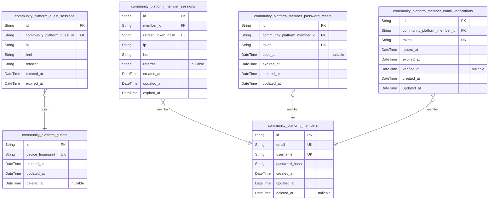
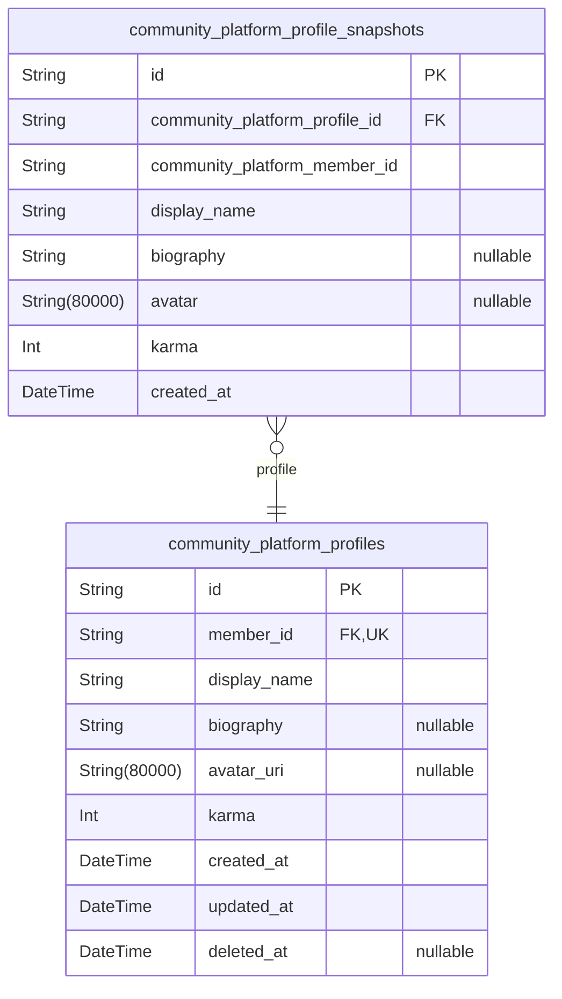
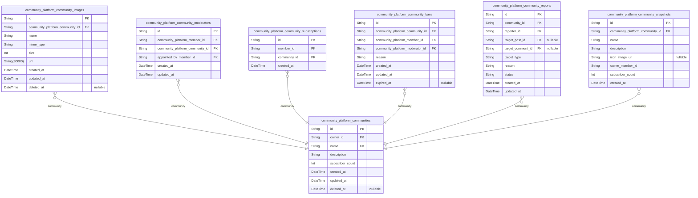
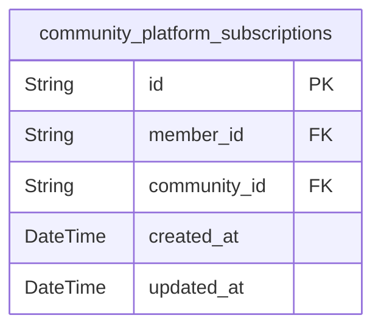
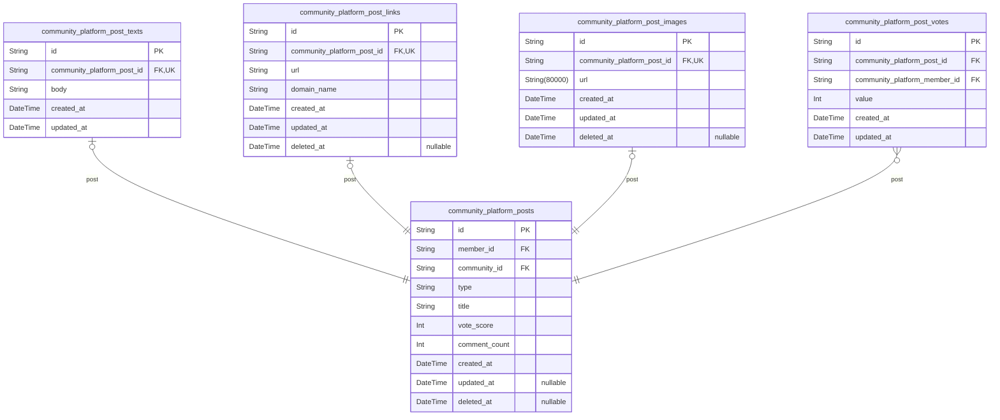
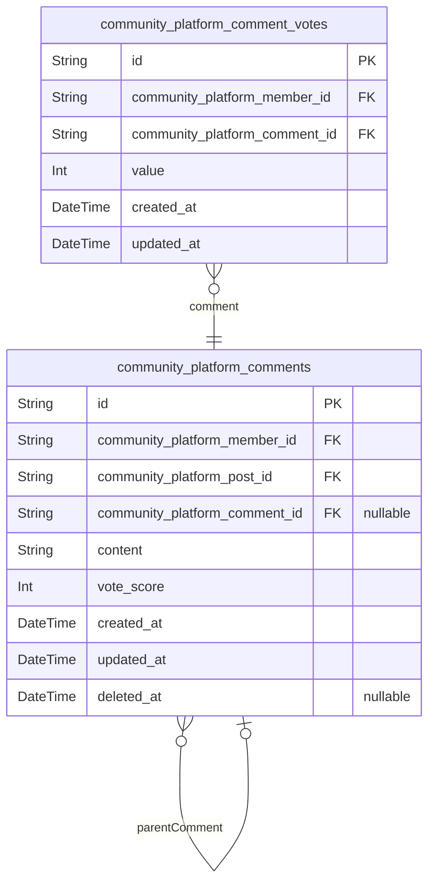
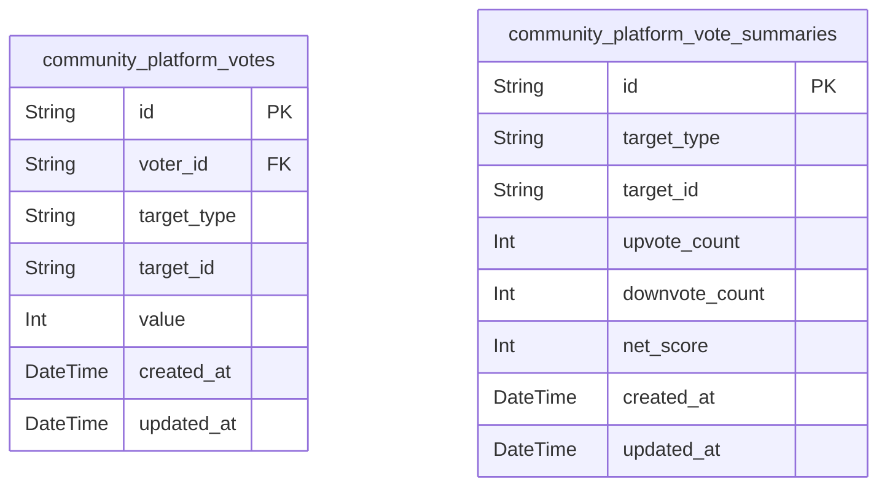
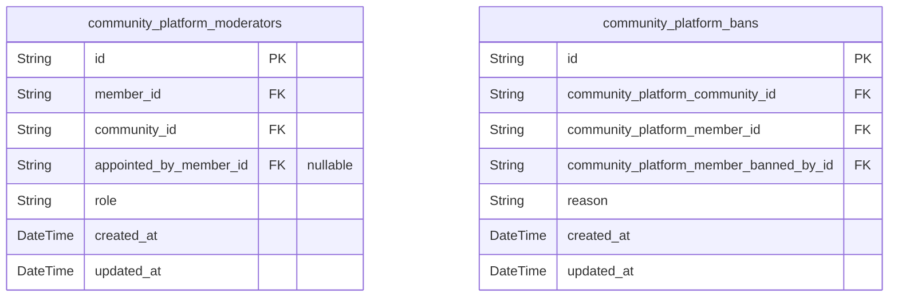
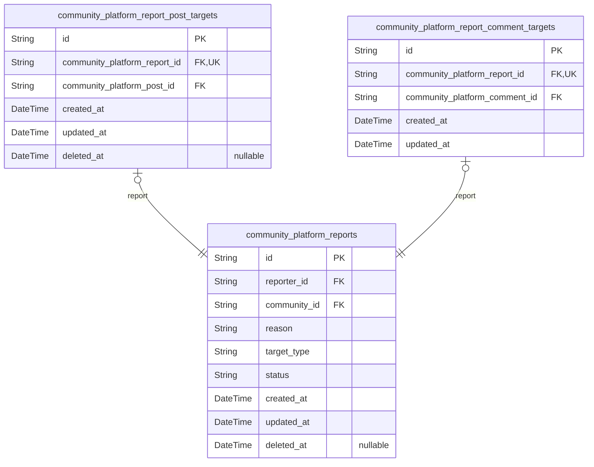

# Prisma Markdown

> Generated by [`prisma-markdown`](https://github.com/samchon/prisma-markdown)

- [authorization](#authorization)
- [profiles](#profiles)
- [communities](#communities)
- [subscriptions](#subscriptions)
- [posts](#posts)
- [comments](#comments)
- [votes](#votes)
- [moderation](#moderation)
- [reports](#reports)

## authorization

### `community_platform_guests`

Temporary guest accounts for unauthenticated visitors browsing the platform.

Each guest is identified by a device fingerprint or anonymous identifier,
allowing the system to recognize returning guests without requiring
registration or authentication credentials. Guests have no email,
password, or other authentication fields since they represent
unauthenticated access. One guest may have multiple {@link
community_platform_guest_sessions} over time.

Guests can browse public content including the Popular Feed, Community
Feed, user profiles, and individual posts and comments. They cannot
create posts, comments, votes, subscriptions, reports, or access the
personalized Home Feed.

Properties as follows:

- `id`: Primary key.
- `device_fingerprint`
  > Unique device fingerprint or anonymous identifier used to recognize a
  > returning guest without authentication.
  >
  > Assigned by the client (e.g., browser fingerprinting, local storage UUID)
  > and sent with each request. Enables the system to maintain continuity for
  > guest browsing across visits.
- `created_at`
  > Timestamp when this guest record was first created, corresponding to the
  > guest's first visit to the platform.
- `updated_at`: Timestamp of the most recent update to this guest record.
- `deleted_at`
  > Soft-delete timestamp. When set, the guest record is considered expired
  > and inactive. Null indicates the guest account is still active and
  > recognized for returning visits.

### `community_platform_guest_sessions`

Temporary session tokens for guest access to public content.

Each [community_platform_guest_sessions](#community_platform_guest_sessions) record represents a single
browsing session established when a guest accesses the platform. Sessions
are identified by IP address and the page the guest was visiting (href),
along with the referrer for analytics. Sessions have a fixed expiration
time (expired_at) after which the guest must establish a new session.
This table is append-only — once created, session records are never
modified or deleted, providing an audit trail of guest browsing activity.

Properties as follows:

- `id`: Primary Key.
- `community_platform_guest_id`
  > Foreign key to the [community_platform_guests](#community_platform_guests) record this session
  > belongs to.
  >
  > Each session is associated with exactly one guest identity. A guest may
  > have multiple concurrent sessions, each tracked independently.
- `ip`
  > IP address of the guest at the time the session was established.
  >
  > Used for basic analytics and geographic routing. Stored as a string to
  > accommodate both IPv4 and IPv6 addresses.
- `href`
  > The URL of the page the guest was visiting when the session was created.
  >
  > Records the entry point of the guest's browsing session for analytics and
  > navigation context.
- `referrer`
  > The HTTP Referer header value indicating the previous page the guest
  > navigated from.
  >
  > Used for traffic source analysis and understanding how guests discover
  > the platform. Stored as empty string when no referrer is available.
- `created_at`
  > Timestamp when the guest session was created.
  >
  > Indicates when the guest began their browsing session and is used for
  > session lifetime calculations and audit purposes.
- `expired_at`
  > Timestamp when the guest session expires.
  >
  > After this time, the session is no longer valid and the guest must
  > establish a new session. Expiration enforces session security and
  > prevents indefinite guest sessions.

### `community_platform_members`

Registered member accounts with email and password authentication
credentials.

Each [community_platform_members](#community_platform_members) represents an authenticated user
of the platform. Members register using a unique email address and choose
a unique username that identifies them publicly. Authentication is
performed via email and password (stored as a secure hash).

Members can create communities, publish posts and comments, vote on
content, subscribe to communities, moderate content, and report
violations. A member has a one-to-one {@link community_platform_profiles
profile} for public display information. Account deletion is supported
via soft-delete with the {@link community_platform_members#deleted_at
deleted_at} field, allowing recovery within a retention window.

Properties as follows:

- `id`: Primary key. Uniquely identifies a registered member account.
- `email`
  > Email address used for login and account communication.
  >
  > Must be unique across all members. The system validates email format
  > during registration and requires email verification via {@link
  > community_platform_member_email_verifications} before the account is
  > fully active. Cannot be changed after registration.
- `username`
  > Unique public username that identifies the member across the platform.
  >
  > Chosen during registration. Must be unique across all members. Displayed
  > alongside posts, comments, and profiles. Cannot be changed after
  > registration.
- `password_hash`
  > Securely hashed password for email-based authentication.
  >
  > Stored using a strong one-way hashing algorithm (e.g., bcrypt). Never
  > stored in plaintext. Updated when the member changes their password via
  > the password change flow.
- `created_at`
  > Timestamp when this member account was created.
  >
  > Set automatically upon successful registration. Used for account
  > lifecycle management and data retention calculations.
- `updated_at`
  > Timestamp when this member account was last updated.
  >
  > Updated on any change to the member record (e.g., password change). Used
  > for conflict detection and audit purposes.
- `deleted_at`
  > Timestamp when this member account was soft-deleted.
  >
  > Null indicates an active account. When set, the account is considered
  > deleted: the member cannot log in, their content is hidden, but data is
  > retained for a recovery window per platform retention policy. Cascading
  > deletion applies to related content (posts, comments, etc.) per business
  > rules.

### `community_platform_member_sessions`

JWT session tokens with access and refresh token support for member
authentication.

Each session represents an active login for a {@link
community_platform_members} actor, storing a hashed refresh token for
secure token rotation and an expiration timestamp for automatic session
timeout. The refresh token hash enables lookup and invalidation during
refresh and logout operations. The client IP, current page URL (href),
and referrer are captured for audit and session metadata purposes.

Properties as follows:

- `id`: Primary Key.
- `member_id`
  > Foreign key to the [community_platform_members](#community_platform_members) actor who owns this
  > session.
  >
  > Establishes the 1:N relationship where one authenticated member can have
  > multiple concurrent active sessions across different devices or browsers.
- `refresh_token_hash`
  > SHA-256 hash of the JWT refresh token for secure token storage and lookup.
  >
  > Storing a hash rather than the raw token prevents token theft in the
  > event of a database breach. The hash is used to verify refresh token
  > validity during token rotation operations and session validation.
- `ip`: IP address of the client device at the time of session creation.
- `href`
  > URL of the page where the session was initiated, captured from the
  > client's current location.
- `referrer`
  > HTTP Referer header value indicating the previous page the user visited
  > before initiating the session.
  >
  > Nullable because not all HTTP requests include a referrer header (e.g.,
  > direct URL entry, bookmarks, or privacy-preserving browser settings).
- `created_at`: Timestamp when the session was created upon successful member login.
- `updated_at`
  > Timestamp when the session was last modified.
  >
  > Updated on refresh token rotation to track the most recent activity
  > associated with this session. Enables monitoring of session refresh
  > patterns.
- `expired_at`
  > Timestamp when the session automatically expires.
  >
  > After this time, the refresh token is no longer valid and the member must
  > re-authenticate. The expiration deadline is set at session creation time.

### `community_platform_member_password_resets`

Password reset tokens for member account recovery.

Each token is associated with exactly one {@link
community_platform_members} member and carries a hashed token value, a
mandatory expiration timestamp, and an optional usage timestamp. Tokens
are created during the password reset flow and are either consumed
(used_at set) or expire naturally. Expired or consumed tokens remain in
the database for audit purposes but are no longer valid for password
reset. This table is append-only: once created, no fields are updated
except used_at when the token is consumed.

Properties as follows:

- `id`: Primary key.
- `community_platform_member_id`
  > The member account this password reset token belongs to.
  >
  > Each token is tied to exactly one [community_platform_members](#community_platform_members)
  > member and can only be used to reset that member's password.
- `token`
  > Cryptographically hashed password reset token value.
  >
  > Stored as a secure hash (not plaintext). Used to verify the reset link
  > presented by the user against stored tokens. The unique constraint
  > prevents accidental token collisions and provides fast lookup.
- `used_at`
  > Timestamp when this token was successfully used to reset the member's
  > password.
  >
  > Null indicates the token has not been used yet. Once set, the token is
  > considered consumed and cannot be reused even if not yet expired.
- `expired_at`
  > Timestamp after which this token is no longer valid for password reset.
  >
  > Tokens have a finite lifespan (typically 15-60 minutes) as a security
  > measure. Expired tokens cannot be used for password reset even if used_at
  > is null.
- `created_at`
  > Timestamp when this password reset token was created.
  >
  > Set automatically on token generation. Used for audit, token lifecycle
  > management, and determining which token is the most recent for a given
  > member.
- `updated_at`
  > Timestamp when this record was last updated.
  >
  > Updated automatically when used_at transitions from null to a non-null
  > value (token consumption). Otherwise remains equal to created_at.

### `community_platform_member_email_verifications`

Email verification tokens for confirming member email addresses during
registration.

This table stores verification tokens generated when a {@link
community_platform_members} registers or their email address is updated.
Each token is a time-limited credential that proves ownership of the
email address. The token is hashed for secure storage. Once the member
clicks the verification link, the `verified_at` timestamp is recorded,
and the token is marked as consumed. Expired tokens are periodically
cleaned up.

Tokens have a one-to-many relationship with members — a member may have
multiple verification tokens over their lifetime if they request
re-verification or change their email address. Only the most recent
unexpired and unverified token is considered active at any given time.

Properties as follows:

- `id`
  > Primary Key. Auto-generated UUID identifying this email verification
  > record.
- `community_platform_member_id`
  > Foreign Key to the [community_platform_members](#community_platform_members) whose email address
  > is being verified.
  >
  > Each token belongs to exactly one member. A member may have multiple
  > verification tokens over time if they request email re-verification or
  > change their email address.
- `token`
  > Hashed verification token value sent to the member's email address.
  >
  > The token is securely hashed before storage. When the member clicks the
  > verification link in their email, the raw token is hashed and compared
  > against this value for authentication.
- `issued_at`
  > Timestamp when this verification token was issued and sent to the member.
  >
  > Used to determine which token is the most recent active verification
  > request.
- `expired_at`
  > Timestamp after which this verification token expires and can no longer
  > be used.
  >
  > Tokens have a limited validity window (e.g., 24 hours) for security
  > purposes. Expired tokens are ignored during verification and may be
  > cleaned up.
- `verified_at`
  > Timestamp when the member successfully verified their email address using
  > this token.
  >
  > Null until the token is used for successful verification. Once set, the
  > token is considered consumed and cannot be reused.
- `created_at`: Timestamp when this email verification record was created.
- `updated_at`: Timestamp when this email verification record was last updated.

## profiles

### `community_platform_profiles`

User profiles storing public identity attributes and cumulative karma
score for community platform members.

Each [community_platform_members](#community_platform_members) has exactly one profile (1:1
relationship), created automatically upon member registration. The
profile serves as the member's public-facing identity within the
platform, carrying their display name, biography text, avatar image, and
total karma score reflecting how the community has received their
contributions.

Profiles are viewable by all actors (guests and members) and editable
only by the owning member. Karma is a denormalized aggregate updated
whenever votes are cast on the member's posts or comments, increasing by
1 for upvotes and decreasing by 1 for downvotes.

Properties as follows:

- `id`: Primary Key.
- `member_id`
  > Foreign key referencing [community_platform_members](#community_platform_members). Establishes a
  > strict 1:1 relationship where each member has exactly one profile,
  > enforced via unique constraint.
  >
  > When a member account is deleted, the associated profile is also removed
  > (cascade delete).
- `display_name`
  > The user's chosen public display name shown alongside their posts and
  > comments throughout the platform. This is distinct from the unique
  > username used for authentication and may differ from it.
- `biography`
  > Short free-form biography text where the user can describe themselves.
  > Visible on the profile page to introduce the user to visitors. Optional
  > field — members may choose not to set a biography.
- `avatar_uri`
  > URI pointing to the user's avatar image file. Provides quick visual
  > recognition in feeds, post listings, and comment threads. Optional field
  > — members may choose not to set an avatar.
- `karma`
  > Cumulative karma score representing the net sum of all upvotes minus all
  > downvotes received across the member's posts and comments. Starts at 0
  > and can be positive, zero, or negative. Denormalized from vote aggregates
  > for efficient reads on profile pages and content displays.
- `created_at`
  > Timestamp when the profile was first created (automatically upon member
  > registration).
- `updated_at`
  > Timestamp when the profile was last updated (display name, biography,
  > avatar, or karma changes).
- `deleted_at`
  > Timestamp when the profile was soft-deleted due to account deletion. Null
  > indicates the profile is active. Soft deletion supports potential
  > recovery within data retention periods.

### `community_platform_profile_snapshots`

Point-in-time snapshots of user profile state for audit trail, rollback,
and retention period recovery support.

Each record captures the complete set of profile attributes — display
name, biography text, avatar image reference, and cumulative karma score
— at the moment the snapshot was taken. Snapshots are immutable records
that enable reconstruction of any user's profile history over time.

This table is append-only: records are never modified or deleted after
creation. Multiple snapshots may exist per profile, each identified by
its unique creation timestamp. Queries typically filter by {@link
community_platform_members} or [community_platform_profiles](#community_platform_profiles)
combined with [#created_at](##created_at) for chronological ordering.

Properties as follows:

- `id`: Primary Key.
- `community_platform_profile_id`
  > Foreign key to the [community_platform_profiles](#community_platform_profiles) entity being
  > snapshotted.
  >
  > Associates this snapshot record with the profile whose state was captured
  > at the time of creation. Multiple snapshots may reference the same
  > profile, each recording a different point in time.
- `community_platform_member_id`
  > Denormalized foreign key reference to the {@link
  > community_platform_members} entity that owns the profile.
  >
  > Included for direct lookup and query efficiency when retrieving all
  > snapshots associated with a specific member without requiring a join
  > through the profiles table.
- `display_name`
  > The profile's display name at the time the snapshot was taken.
  >
  > Captures the user-chosen public-facing name displayed on their profile
  > page.
- `biography`
  > The profile's biography text at the time the snapshot was taken.
  >
  > Captures the user-written self-description displayed on their profile
  > page. May be null if no biography was set.
- `avatar`
  > The URI reference to the profile's avatar image at the time the snapshot
  > was taken.
  >
  > Captures the user's chosen profile picture. May be null if no avatar was
  > set.
- `karma`
  > The user's cumulative karma score at the time the snapshot was taken.
  >
  > Captures the net sum of all upvotes minus downvotes received on the
  > user's posts and comments. Can be negative.
- `created_at`
  > Timestamp indicating when this snapshot was created.
  >
  > Records the exact moment the profile state was captured. Used for
  > chronological ordering and time-based queries such as "show snapshots
  > taken within the retention period."

## communities

### `community_platform_communities`

Core community entity representing a user-created group within the platform.

Each community is uniquely identified by its name, which serves as the
community's canonical identifier for routing and display. Communities are
owned by a single [community_platform_members](#community_platform_members) who becomes the
owner upon creation. The owner has full moderation authority and can
appoint additional moderators via the {@link
community_platform_community_moderators} junction table.

Communities contain posts ([community_platform_posts](#community_platform_posts)), track
subscribers via the [community_platform_community_subscriptions](#community_platform_community_subscriptions)
junction table, and enforce membership rules through bans recorded in the
[community_platform_community_bans](#community_platform_community_bans) table. Reports submitted
against content within the community are tracked in {@link
community_platform_community_reports}.

Soft deletion is supported via the deleted_at field, allowing community
recovery within the retention window defined by platform policy.

Properties as follows:

- `id`: Primary Key.
- `owner_id`
  > Foreign key to the [community_platform_members](#community_platform_members) who created and
  > owns this community.
  >
  > The owner has the highest moderation authority and can appoint or remove
  > moderators, manage bans, and delete the community. This relationship is
  > mandatory — every community must have exactly one owner.
- `name`
  > Unique canonical name of the community used for routing and display.
  >
  > Must be unique across all communities on the platform. Community names
  > are used in URLs and search queries, and serve as the primary
  > human-readable identifier.
- `description`
  > Descriptive text explaining the community's purpose, rules, and
  > guidelines.
  >
  > Displayed on the community's main page to inform potential subscribers
  > about the community's focus and moderation policies.
- `subscriber_count`
  > Denormalized count of active subscribers for efficient feed display.
  >
  > Updated whenever a user subscribes or unsubscribes. Maintained as a
  > denormalized field to avoid expensive COUNT queries on the {@link
  > community_platform_community_subscriptions} table during community
  > listing and browsing operations.
- `created_at`
  > Timestamp when the community was first created.
  >
  > Used for chronological sorting in community listings and feeds.
- `updated_at`
  > Timestamp when the community was last modified.
  >
  > Updated whenever the community's name, description, or icon is changed.
- `deleted_at`
  > Timestamp indicating soft deletion of the community.
  >
  > When set, the community is considered deleted but remains in the database
  > for a retention period to allow potential recovery. Null indicates the
  > community is active.

### `community_platform_community_images`

Stores uploaded icon image file records for communities, including file
metadata and storage location.

Each record represents one uploaded icon image belonging to a specific
[community_platform_communities](#community_platform_communities). Communities may have multiple
icon image records over time as icons are replaced, with the most recent
record (by created_at) representing the current active icon. This table
serves as the file storage reference layer, linking community identity to
physical image files in external storage.

Soft deletion via deleted_at allows for potential recovery within
configured retention periods before permanent removal.

Properties as follows:

- `id`: Primary key.
- `community_platform_community_id`
  > The community this icon image belongs to.
  >
  > Each image is associated with exactly one community. A community may have
  > multiple icon records over time as icons are updated, linked through this
  > foreign key to [community_platform_communities](#community_platform_communities).
- `name`
  > Original filename of the uploaded icon image, as provided by the uploader.
  >
  > Used for display and identification purposes in administrative interfaces.
- `mime_type`
  > MIME type of the uploaded image file (e.g., image/png, image/jpeg,
  > image/webp).
  >
  > Determines how the file should be served and processed by the storage
  > layer and content delivery system.
- `size`
  > File size of the uploaded icon image in bytes.
  >
  > Used for storage capacity tracking, bandwidth estimation, and upload
  > validation.
- `url`
  > Storage URL or path pointing to the physical icon image file in external
  > storage.
  >
  > This URL is used to retrieve and serve the image to clients. The actual
  > file is stored in an external file storage system (e.g., S3, local
  > filesystem), not within the database itself.
- `created_at`
  > Timestamp when this icon image record was created.
  >
  > Used to determine the current active icon: the most recent created_at for
  > a given community represents the current icon. Also used for
  > chronological sorting.
- `updated_at`
  > Timestamp when this icon image record was last updated.
  >
  > Tracks modifications to file metadata or storage location for audit
  > purposes.
- `deleted_at`
  > Timestamp when this icon image record was soft-deleted.
  >
  > Null indicates the record is active. Soft deletion allows recovery within
  > the configured retention period before permanent removal.

### `community_platform_community_moderators`

Junction table linking registered members to communities as appointed
moderators, excluding the community owner who holds separate inherent
authority.

Each row represents one member's moderator appointment within a specific
community. A member may hold moderator roles in multiple communities, and
a community may have multiple appointed moderators. The unique constraint
on (member, community) enforces one moderator appointment per member per
community.

Moderator appointments are managed through the community's moderation
system: the community owner can appoint and remove moderators, and
existing moderators can appoint additional moderators. Only the owner can
remove moderators. When a moderator appointment is removed, the row is
deleted (hard delete) since removed assignments are not retained
historically per the [community_platform_moderators](#community_platform_moderators) lifecycle.

The community owner is not recorded in this table — the owner's authority
is inherent and tracked separately in the moderation component's {@link
community_platform_moderators} table with role classification.

Properties as follows:

- `id`: Primary Key.
- `community_platform_member_id`
  > Foreign key to the [community_platform_members](#community_platform_members) table identifying
  > the member appointed as a moderator of the community.
  >
  > Each member can have at most one moderator appointment per community,
  > enforced by the unique constraint on (member_id, community_id).
- `community_platform_community_id`
  > Foreign key to the [community_platform_communities](#community_platform_communities) table
  > identifying the community where the member holds a moderator role.
  >
  > A community can have multiple moderators appointed by the owner or by
  > other moderators.
- `appointed_by_member_id`
  > Foreign key to the [community_platform_members](#community_platform_members) table identifying
  > the member who appointed this moderator.
  >
  > The appointing member may be the community owner or another existing
  > moderator, since both owners and moderators can appoint additional
  > moderators per the moderation system rules.
- `created_at`: Timestamp indicating when this moderator appointment was created.
- `updated_at`: Timestamp of the last update to this moderator appointment record.

### `community_platform_community_subscriptions`

Junction table tracking active member subscriptions to communities.

Each record represents one member's subscription to one community,
created when the member subscribes and deleted entirely when they
unsubscribe (subscriptions are not retained historically). A unique
constraint on (member_id, community_id) enforces the
one-subscription-per-member-per-community business rule.

This table is referenced by post creation logic (requires subscription to
post) and by the home feed feature (shows posts from subscribed
communities only).

Properties as follows:

- `id`: Primary Key.
- `member_id`
  > Foreign key to the [community_platform_members](#community_platform_members) who subscribed to
  > the community.
  >
  > Identifies the member that initiated this subscription relationship. Each
  > member can subscribe to multiple communities, resulting in multiple rows
  > per member_id.
- `community_id`
  > Foreign key to the [community_platform_communities](#community_platform_communities) that the member
  > subscribed to.
  >
  > Identifies the community that was subscribed to. Each community can have
  > many subscribers, resulting in multiple rows per community_id.
- `created_at`
  > Timestamp when the subscription was created (when the member subscribed
  > to the community).
  >
  > Since subscriptions are deleted on unsubscribe without retention, this
  > field serves as the subscription's only temporal marker. It is used for
  > sorting subscribers by recency and for feed ordering.

### `community_platform_community_bans`

Records banned members within a community, tracking who was banned, by
which moderator or owner, and the reason for the ban.

Each ban is scoped to exactly one community and one member. A member may
be banned from multiple communities, and each community may ban multiple
members, but a unique constraint ensures a member can have at most one
active ban per community. Bans are recorded with a mandatory reason and a
timestamp. An optional expiration timestamp is supported for future
time-bounded ban functionality.

When a moderator or owner bans a user, the system creates a record
referencing the banned member ([community_platform_members](#community_platform_members)) via
`bannedMember`, the banning authority ({@link
community_platform_members}) via `bannedBy`, and the community ({@link
community_platform_communities}) via `community`. Unbanning removes the
record entirely.

Properties as follows:

- `id`: Primary key for the ban record.
- `community_platform_community_id`
  > Foreign key to the community where the ban is enforced.
  >
  > References [community_platform_communities](#community_platform_communities). A community can have
  > many banned members.
- `community_platform_member_id`
  > Foreign key to the member who is banned.
  >
  > References [community_platform_members](#community_platform_members). A member can be banned
  > from multiple communities.
- `community_platform_moderator_id`
  > Foreign key to the moderator or owner who issued the ban.
  >
  > References [community_platform_members](#community_platform_members) since both moderators and
  > the owner (who may not be in the moderators table) can ban users. A
  > moderator can ban many users across communities.
- `reason`
  > Free-text reason provided by the moderator or owner explaining why the
  > member was banned from the community. Displayed in the banned users list.
- `created_at`
  > Timestamp when the ban was placed. Used for displaying ban date in the
  > banned users list and for chronological sorting.
- `updated_at`
  > Timestamp when the ban record was last modified. Included for consistency
  > with standard temporal field conventions. Bans are rarely updated after
  > creation.
- `expired_at`
  > Optional timestamp indicating when the ban automatically expires. If set,
  > the ban is considered lifted after this time without requiring manual
  > unbanning. Null means the ban persists indefinitely until manually
  > removed.

### `community_platform_community_reports`

Community-scoped content reports submitted by members flagging posts or
comments that potentially violate community standards.

Reports are the formal complaint mechanism within a community. Each
report targets exactly one piece of content ({@link
community_platform_posts} or [community_platform_comments](#community_platform_comments)) and is
submitted by a [member](#community_platform_members). Reports are
scoped to the [community](#community_platform_communities) where the
reported content was published and are visible only to that community's
moderators.

Reports progress through a three-state workflow: "pending" (awaiting
moderator review), "approved" (moderator agreed — reported content is
deleted), or "dismissed" (moderator disagreed — content remains
unchanged). Dismissed reports are permanently removed from the active
report list. Multiple reports on the same content are allowed as
independent submissions.

Properties as follows:

- `id`: Primary key.
- `community_id`
  > The community where the reported content was published.
  >
  > Every report is scoped to exactly one community. This FK establishes the
  > community context for moderation access control — only moderators of this
  > community can view, approve, or dismiss the report.
- `reporter_id`
  > The member who submitted this report.
  >
  > Each report records its author for accountability. The reporter's
  > identity is visible to moderators during review. If the reporter's
  > account is later deleted, the report remains visible to moderators with
  > an indicator that the reporter is no longer active ({@link
  > community_platform_members}).
- `target_post_id`
  > The post being reported, if this report targets a post.
  >
  > Exactly one of {@link
  > community_platform_community_reports.target_post_id} or {@link
  > community_platform_community_reports.target_comment_id} must be non-null,
  > determined by the {@link
  > community_platform_community_reports.target_type} discriminator. When the
  > report is approved, the referenced post is deleted from the platform.
- `target_comment_id`
  > The comment being reported, if this report targets a comment.
  >
  > Exactly one of {@link
  > community_platform_community_reports.target_post_id} or {@link
  > community_platform_community_reports.target_comment_id} must be non-null,
  > determined by the {@link
  > community_platform_community_reports.target_type} discriminator. When the
  > report is approved, the referenced comment and all its nested replies are
  > deleted.
- `target_type`
  > Discriminator field indicating whether this report targets a post or a
  > comment.
  >
  > Allowed values are "post" (targeting [community_platform_posts](#community_platform_posts)) or
  > "comment" (targeting [community_platform_comments](#community_platform_comments)). This field
  > determines which of {@link
  > community_platform_community_reports.target_post_id} or {@link
  > community_platform_community_reports.target_comment_id} is non-null.
- `reason`
  > Free-text explanation provided by the reporter describing why the content
  > is being reported.
  >
  > This field is required and must contain non-whitespace characters. It
  > enables moderators to understand the nature of the violation when
  > reviewing the report.
- `status`
  > Current resolution state of this report.
  >
  > Allowed values: "pending" (awaiting moderator review), "approved"
  > (moderator agreed — reported content has been deleted), "dismissed"
  > (moderator disagreed — content remains unchanged and report is removed
  > from the active queue).
- `created_at`: Timestamp when this report was submitted.
- `updated_at`
  > Timestamp when this report was last modified (e.g., when a moderator
  > approved or dismissed it).

### `community_platform_community_snapshots`

Point-in-time snapshot of a community's mutable identity attributes for
audit and change history tracking.

This table captures the complete state of a {@link
community_platform_communities} community's mutable identity attributes —
name, description, icon image, owner, and subscriber count — at the time
the snapshot was taken. Each record is immutable and append-only,
providing an auditable trail of changes over the community's lifetime.

The `community_platform_community_id` foreign key associates each
snapshot with its parent community. Denormalized fields (`name`,
`description`, `icon_image_uri`, `owner_member_id`, `subscriber_count`)
preserve the exact state at snapshot creation time, independent of
subsequent changes to the parent community record or member account
deletion. The `created_at` timestamp records when each snapshot was
generated, enabling chronological traversal of state changes.

Properties as follows:

- `id`: Primary key.
- `community_platform_community_id`
  > The community that this snapshot captures the state of.
  >
  > Each snapshot belongs to exactly one {@link
  > community_platform_communities}, recording that community's identity
  > attributes at a specific point in time. Multiple snapshots may reference
  > the same community, creating an ordered historical trail.
- `name`: The community's unique name as it appeared at the time of this snapshot.
- `description`
  > The community's description text as it appeared at the time of this
  > snapshot.
- `icon_image_uri`
  > The storage URI of the community's icon image at the time of this
  > snapshot. Null if no icon had been set yet when the snapshot was taken.
- `owner_member_id`
  > Denormalized member ID of the community owner at the time of this
  > snapshot. Stored as a plain UUID rather than a foreign key to preserve
  > the historical owner identity independently of any future member account
  > deletion.
- `subscriber_count`: The community's subscriber count at the time of this snapshot.
- `created_at`
  > Timestamp when this snapshot was recorded. Used for chronological
  > ordering of snapshots.

## subscriptions

### `community_platform_subscriptions`

Tracks active member subscriptions to communities. Each record represents
one member's subscription to one community.

This junction table enables core platform features including home feed
filtering (showing posts only from communities the user is subscribed to)
and posting authorization (requiring subscription before a member can
create posts in a community). Subscription records are hard-deleted upon
unsubscription, as cancelled subscriptions are not retained historically
— there is no subscription lifecycle beyond active/inactive.

A unique constraint on ([community_platform_members](#community_platform_members), {@link
community_platform_communities}) enforces the business rule that each
member can have at most one subscription to any given community. A
composite index on (community_id, member_id) supports efficient
community-based queries such as subscriber count retrieval and subscriber
listing.

Properties as follows:

- `id`: Primary key identifying this subscription record.
- `member_id`
  > Foreign key to the [community_platform_members](#community_platform_members) table identifying
  > the subscribing member.
- `community_id`
  > Foreign key to the [community_platform_communities](#community_platform_communities) table
  > identifying the community being subscribed to.
- `created_at`
  > Timestamp when the subscription was created (when the member subscribed
  > to the community).
- `updated_at`: Timestamp when the subscription record was last updated.

## posts

### `community_platform_posts`

Core post entity representing user-created content within a community.

Each post belongs to a single [community_platform_communities](#community_platform_communities) and
is authored by a [community_platform_members](#community_platform_members). A post must have a
title and be classified as one of three types: text, link, or image. The
type-specific content (full text body, URL with domain, or image
reference) is stored in dedicated 1:1 child tables: {@link
community_platform_post_texts}, [community_platform_post_links](#community_platform_post_links),
and [community_platform_post_images](#community_platform_post_images). Vote score and comment count
are denormalized for efficient feed display without requiring
aggregations on every read. Posts support soft deletion via deleted_at to
preserve referential integrity with dependent comments and votes until
permanent removal.

Properties as follows:

- `id`: Primary Key.
- `member_id`
  > Foreign key to the [community_platform_members](#community_platform_members) who authored this
  > post.
  >
  > Only registered members can create posts. The author retains ownership
  > for editing and deletion of their own posts. Community moderators may
  > override author-only deletion within their moderated communities.
- `community_id`
  > Foreign key to the [community_platform_communities](#community_platform_communities) this post
  > belongs to.
  >
  > Each post is scoped to exactly one community. The community determines
  > the visibility scope for feeds and which moderators can manage the post.
  > Cascading deletion of a community removes all its posts.
- `type`
  > Post type discriminator indicating the content format.
  >
  > Valid values are text, link, and image. This field determines which 1:1
  > child table contains the type-specific content. Text posts have body
  > content in [community_platform_post_texts](#community_platform_post_texts), link posts have a URL
  > in [community_platform_post_links](#community_platform_post_links), and image posts have an image
  > file reference in [community_platform_post_images](#community_platform_post_images).
- `title`
  > The required title of the post.
  >
  > Every post must have a title regardless of its type. The title is
  > displayed prominently in feed previews and the full post view, serving as
  > the primary identifier for the content.
- `vote_score`
  > Denormalized net vote score (total upvotes minus total downvotes) for
  > efficient feed display.
  >
  > Updated reactively when votes are cast, changed, or removed. Can be
  > positive, zero, or negative. Used for Hot, Top, and Controversial feed
  > sorting algorithms. Stored denormalized to avoid costly aggregation
  > queries on every feed load.
- `comment_count`
  > Denormalized total number of comments on this post, including nested
  > replies at all depths.
  >
  > Updated reactively when comments are created or deleted. Displayed in
  > feed previews and the full post view to indicate discussion activity.
  > Stored denormalized to avoid recursive COUNT queries across the entire
  > comment tree.
- `created_at`
  > Timestamp when the post was originally created, set on post creation.
  >
  > Used for chronological feed sorting (New sort option) where most recently
  > created posts appear first. Displayed as relative time in feeds and the
  > full post view.
- `updated_at`
  > Timestamp when the post was last edited by its author.
  >
  > Updated whenever the author edits the post's title or content. Null if
  > the post has never been edited, matching the requirement that no edit
  > timestamp is recorded for unedited posts.
- `deleted_at`
  > Soft delete timestamp indicating the post has been removed from public
  > view.
  >
  > When set, the post is hidden from all feeds and community views. Comments
  > and votes referencing this post are also hidden from public display. The
  > record is retained to support potential recovery and cascading permanent
  > deletion when the retention period expires.

### `community_platform_post_texts`

Stores the full text body content for text-type posts.

This model holds the textual content for posts whose type is 'text'. Each
row has a 1:1 relationship with a single [community_platform_posts](#community_platform_posts)
entry, enforced by the unique constraint on the foreign key. Only
text-type posts have an associated record in this table; link-type and
image-type posts do not.

Properties as follows:

- `id`: Primary key.
- `community_platform_post_id`
  > Foreign key to the associated post.
  >
  > Establishes a 1:1 relationship with [community_platform_posts](#community_platform_posts).
  > Only text-type posts reference a row in this table. The unique constraint
  > ensures each text post has exactly one body content record.
- `body`
  > Full text body content of the post.
  >
  > Contains the complete textual content written by the author for text-type
  > posts. This field is mandatory and may contain multi-line formatted text.
- `created_at`
  > Timestamp when the text body was created.
  >
  > Set automatically when this record is first created alongside the parent
  > post.
- `updated_at`
  > Timestamp when the text body was last modified.
  >
  > Updated whenever the post author edits the text content of their post.

### `community_platform_post_links`

Stores the target URL for link-type posts (posts with type='link'), along
with the extracted domain name for efficient feed list display.

Each row is a 1:1 child of [community_platform_posts](#community_platform_posts), created only
when the parent post's type is 'link'. The url field holds the full
external URL, while domain_name stores the extracted domain (e.g.,
"youtube.com") to avoid repeated URL parsing at query time, supporting
the feed display requirement of showing the domain name alongside link
posts. When the parent post is soft-deleted, this record is also
soft-deleted via deleted_at.

Properties as follows:

- `id`: Primary Key.
- `community_platform_post_id`
  > Foreign key to the parent [community_platform_post](#community_platform_post) this link
  > content belongs to. Enforces a 1:1 relationship — exactly one link record
  > per link-type post.
- `url`
  > The full target URL of the link-type post (e.g.,
  > "https://www.youtube.com/watch?v=abc123"). Must be a valid URL pointing
  > to external content.
- `domain_name`
  > Extracted domain name from the URL for feed list display (e.g.,
  > "youtube.com", "github.com"). Stored separately to avoid repeated URL
  > parsing at query time, supporting the feed display requirement of showing
  > the domain name alongside link posts in feeds.
- `created_at`
  > Timestamp when this link record was created, matching the parent post's
  > creation time.
- `updated_at`: Timestamp when this link record was last updated.
- `deleted_at`
  > Soft delete timestamp. When the parent post is deleted, this link record
  > is also soft-deleted rather than immediately removed.

### `community_platform_post_images`

Image file reference for image-type posts, linking to an external file
storage system.

This table stores a single uploaded image per image-type post in a 1:1
relationship with [community_platform_posts](#community_platform_posts). When a user creates
an image-type post, the uploaded image is stored in the external file
storage system and a reference URI is recorded here. This separation
keeps the core post table free of type-specific columns, maintaining
clean 3NF compliance by distributing content-type-specific data across
dedicated subsidiary tables (texts, links, images).

Properties as follows:

- `id`: Primary Key.
- `community_platform_post_id`
  > Foreign key to the parent post.
  >
  > Each image-type post has exactly one image reference, enforced by the
  > unique constraint. References [community_platform_posts](#community_platform_posts).
- `url`
  > External storage URI pointing to the uploaded image file.
  >
  > This URI references the image stored in the external file storage system,
  > used for serving the image in post feeds, detail views, and thumbnails.
  > The format follows the storage system's addressing scheme (e.g., S3 URL,
  > CDN path).
- `created_at`
  > Timestamp when this image reference was created.
  >
  > Set automatically when the image-type post is created and the image is
  > uploaded.
- `updated_at`
  > Timestamp when this image reference was last updated.
  >
  > Updated when the post's image is replaced or metadata is modified.
- `deleted_at`
  > Soft delete timestamp for this image reference.
  >
  > When a post is deleted, this field records when the image reference was
  > removed. The actual image file deletion in external storage is handled by
  > the storage system's lifecycle policies.

### `community_platform_post_votes`

Records member votes on posts with directional values (+1 for upvote, -1
for downvote).

Each row represents one member's vote on one post. The unique constraint
on `[community_platform_post_id](#community_platform_post_id)` and `{@link
community_platform_member_id}` enforces the business rule that each
member may cast at most one vote per post (section 125). Changing a vote
updates the `value` field and `updated_at` timestamp. Removing a vote
deletes the row entirely.

The vote `value` drives the post's net vote score calculation and the
content author's karma adjustment (sections 123, 124).

Properties as follows:

- `id`: Primary key.
- `community_platform_post_id`
  > Foreign key to the post being voted on.
  >
  > Establishes the relationship between this vote record and its target
  > post. All votes on a given post can be queried through this FK.
- `community_platform_member_id`
  > Foreign key to the member who cast this vote.
  >
  > Identifies the voting user. Used to enforce one-vote-per-member-per-post
  > uniqueness, and to aggregate a member's voting history.
- `value`
  > Vote direction: +1 for upvote (approval), -1 for downvote (disapproval).
  >
  > Only +1 and -1 are valid values. This field is mutable — when a member
  > changes their vote (e.g., upvote to downvote), the value is updated
  > in-place.
- `created_at`: Timestamp of when this vote was initially cast.
- `updated_at`
  > Timestamp of the last modification to this vote record. Updated when a
  > member changes their vote value or any other field.

## comments

### `community_platform_comments`

Represents a comment attached to a [post](#community_platform_posts)
within the community platform. Comments are user-authored responses that
support unlimited nested threading through a self-referential parent
relationship.

Each comment belongs to exactly one post and is authored by exactly one
[member](#community_platform_members). Comments can be top-level
(directly on a post) or replies to another comment, with no limit on
nesting depth. The denormalized vote_score enables efficient sorting by
Best, New, or Controversial without aggregating votes on every read. Soft
deletion via deleted_at preserves reply thread structure while removing
the comment from display.

Properties as follows:

- `id`: Primary key.
- `community_platform_member_id`
  > Foreign key to the [member](#community_platform_members) who authored
  > this comment.
  >
  > Establishes the author relationship — each comment is written by exactly
  > one member, and a member can author many comments.
- `community_platform_post_id`
  > Foreign key to the [post](#community_platform_posts) this comment
  > belongs to.
  >
  > All comments, whether top-level or replies, are always associated with a
  > parent post. A post can have many comments.
- `community_platform_comment_id`
  > Foreign key to the parent [comment](#community_platform_comments)
  > that this comment replies to.
  >
  > Enables unlimited nested threading. Null for top-level comments directly
  > on a post. A comment can have many child replies, forming a tree
  > structure with no depth limit.
- `content`
  > The text content of the comment.
  >
  > Stores the full body of the comment as written by the author. Cannot be
  > empty.
- `vote_score`
  > Denormalized net vote score (upvotes minus downvotes) for this comment.
  >
  > Updated by vote operations to avoid aggregating {@link
  > community_platform_comment_votes} on every read. Enables efficient
  > sorting by Best (highest score first), New (ignored for sorting), and
  > Controversial (many votes with score near zero). Can be positive, zero,
  > or negative.
- `created_at`: Timestamp when the comment was first created.
- `updated_at`
  > Timestamp when the comment was last modified (e.g., after editing
  > content).
- `deleted_at`
  > Timestamp indicating soft deletion. Null when the comment is active.
  >
  > When a comment is deleted by its author or a moderator, this field is set
  > to the current time. Soft deletion preserves the reply thread structure —
  > child replies remain accessible, but the deleted comment's content is
  > hidden from display.

### `community_platform_comment_votes`

Records member votes (upvote/downvote) on comments, enforcing one vote
per member per comment.

Each row represents a single vote cast by a {@link
community_platform_members} on a [community_platform_comments](#community_platform_comments),
with a value of +1 for upvote or -1 for downvote. The unique constraint
on (member, comment) ensures one vote per member per comment, supporting
vote changes by updating the existing row's value. Deleting the row
removes the vote entirely. This table drives the comment vote score
calculation and the comment author's karma adjustments.

Votes are not versioned — only the most recent vote direction is stored.
Removing a vote deletes the row.

Properties as follows:

- `id`: Primary Key.
- `community_platform_member_id`
  > Foreign key to the [community_platform_members](#community_platform_members) who cast this vote.
  >
  > Identifies the authenticated member that voted on the comment. Together
  > with [community_platform_comment_id](#community_platform_comment_id), forms a unique constraint
  > enforcing one vote per member per comment.
- `community_platform_comment_id`
  > Foreign key to the [community_platform_comments](#community_platform_comments) that received this
  > vote.
  >
  > Identifies the comment being voted on. Together with {@link
  > community_platform_member_id}, forms a unique constraint enforcing one
  > vote per member per comment.
- `value`
  > Vote value: +1 for upvote, -1 for downvote.
  >
  > Determines the direction of the vote. Upvotes increase the comment's vote
  > score and the author's karma by 1. Downvotes decrease both by 1.
- `created_at`
  > Timestamp when the vote was first cast.
  >
  > Automatically set on creation to record when the vote was initially
  > placed.
- `updated_at`
  > Timestamp when the vote was last modified.
  >
  > Updated when a member changes their vote from upvote to downvote (or vice
  > versa) to reflect the updated value.

## votes

### `community_platform_votes`

Polymorphic votes cast by members on posts or comments, with upvote (+1)
or downvote (-1) values, enforcing one vote per member per target
content.

Each vote represents a member's reaction to a piece of content, either
approving (upvote, +1) or disapproving (downvote, -1). A vote targets
either a [community_platform_posts](#community_platform_posts) or a {@link
community_platform_comments}, identified by the target_type discriminator
and target_id UUID. A member can cast at most one vote on any given post
and at most one vote on any given comment. Re-voting replaces the
previous vote (upsert behavior), and removing a vote hard-deletes the
record.

The voter_id field establishes a required relationship to {@link
community_platform_members}, ensuring only authenticated members can
vote. The value field stores +1 or -1, enabling aggregate vote score
calculation (total upvotes minus total downvotes) and influencing the
content author's karma score.

Properties as follows:

- `id`: Primary Key.
- `voter_id`
  > Foreign key to the [community_platform_members](#community_platform_members) who cast this vote.
  > Establishes the voter identity and enables authorization checks (only
  > authenticated members can vote).
- `target_type`
  > Discriminator indicating the type of content this vote targets. Must be
  > either 'post' for votes on [community_platform_posts](#community_platform_posts) or 'comment'
  > for votes on [community_platform_comments](#community_platform_comments). Used together with
  > target_id to form a polymorphic reference.
- `target_id`
  > UUID of the target content this vote applies to. Combined with
  > target_type to form a polymorphic reference to either a {@link
  > community_platform_posts} or [community_platform_comments](#community_platform_comments).
- `value`
  > Vote value: +1 for upvote (increases content score and author karma by 1)
  > or -1 for downvote (decreases content score and author karma by 1).
  > Enforced at the application layer to only allow these two values.
- `created_at`: Timestamp when this vote was first cast.
- `updated_at`
  > Timestamp when this vote was last modified (e.g., changed from upvote to
  > downvote or vice versa).

### `community_platform_vote_summaries`

Precomputed vote score aggregates (net_score, upvote_count,
downvote_count) per target post or comment for efficient reads.

This summary table stores denormalized vote statistics for each post and
comment, avoiding expensive aggregate queries on the vote tables. Each
row represents the aggregated vote state of one target entity at the
current time. Updates are performed by application logic whenever a vote
is cast, changed, or removed.

The `target_type` field discriminates between posts ({@link
community_platform_posts}) and comments ({@link
community_platform_comments}). The unique constraint on (`target_type`,
`target_id`) ensures exactly one summary row per target entity.

Vote summaries are queried extensively by feed and detail view endpoints
to display vote scores, upvote counts, and downvote counts alongside
posts and comments without scanning individual vote records.

Properties as follows:

- `id`: Primary Key.
- `target_type`
  > Discriminator indicating whether this summary targets a post or a
  > comment. Value is "post" for post vote summaries or "comment" for comment
  > vote summaries. Used together with `target_id` to identify the target
  > entity.
- `target_id`
  > UUID of the target post ([community_platform_posts](#community_platform_posts)) or comment
  > ([community_platform_comments](#community_platform_comments)). Combined with `target_type` to
  > uniquely identify the target entity for this vote summary.
- `upvote_count`
  > Total number of upvotes cast on this target post or comment. Updated
  > whenever a vote is added, changed, or removed on the target.
- `downvote_count`
  > Total number of downvotes cast on this target post or comment. Updated
  > whenever a vote is added, changed, or removed on the target.
- `net_score`
  > Net vote score calculated as `upvote_count - downvote_count`. Positive
  > values indicate more approvals than disapprovals, zero indicates a tie or
  > no votes, negative values indicate more disapprovals than approvals.
- `created_at`
  > Timestamp when this summary row was first created, typically when the
  > first vote is cast on the target.
- `updated_at`
  > Timestamp when this summary row was last updated due to a vote being
  > cast, changed, or removed on the target.

## moderation

### `community_platform_moderators`

Junction table linking members to communities as moderators or owners,
with role classification and appointment tracking.

Each row represents one member holding a moderation role (owner or
moderator) in one community. The owner role is automatically assigned
upon community creation and carries the highest authority. Moderators are
appointed by the owner or by other moderators. A member can hold only one
role per community, enforced by a unique constraint on (member_id,
community_id).

Role hierarchy follows a two-tier structure: the owner holds unrestricted
administrative authority including the ability to appoint and remove
moderators and delete any content, while moderators hold delegated
authority limited to content deletion within their community and the
ability to appoint other moderators. Only the owner can remove
moderators. Removed assignments are hard-deleted per the lifecycle
policy.

References [community_platform_members](#community_platform_members) for the moderator or owner,
[community_platform_communities](#community_platform_communities) for the scoped community, and
self-references [community_platform_members](#community_platform_members) again via
appointed_by_member_id to track who appointed this moderator.

Properties as follows:

- `id`: Primary Key.
- `member_id`
  > Foreign key to the member who holds the moderator or owner role in this
  > community.
  >
  > Links to [community_platform_members](#community_platform_members). Each member can have at most
  > one role per community, enforced by the unique constraint on (member_id,
  > community_id).
- `community_id`
  > Foreign key to the community where this member holds a moderation role.
  >
  > Links to [community_platform_communities](#community_platform_communities). All moderation
  > privileges granted by this assignment are scoped to this community.
- `appointed_by_member_id`
  > Foreign key to the member who appointed this moderator.
  >
  > Links to [community_platform_members](#community_platform_members). Null for the owner role,
  > which is auto-assigned upon community creation. For moderators, this
  > tracks who appointed them — either the owner or another moderator
  > exercising their appointment authority.
- `role`
  > The moderation role held by this member in the community.
  >
  > Valid values are "owner" (highest authority, auto-assigned to the
  > community creator) and "moderator" (standard, appointed by the owner or
  > by other moderators). Determines the scope of privileges this member has
  > within the community.
- `created_at`
  > Timestamp when this moderator assignment was created.
  >
  > Set automatically upon assignment.
- `updated_at`
  > Timestamp when this moderator assignment was last updated.
  >
  > Updated automatically on any modification to the record.

### `community_platform_bans`

Records community-specific bans where moderators or the community owner
restrict a member's ability to create posts or write comments within a
single community.

Each ban entry links a [community_platform_members](#community_platform_members) (the banned
user) to a [community_platform_communities](#community_platform_communities) (the community),
recording who placed the ban ([community_platform_members](#community_platform_members) as the
banning moderator) and the reason provided. Per the Ban Concept, bans are
community-scoped — a ban in one community does not affect access to any
other community. Banned users retain read access to public content in
that community.

Per the Ban Lifecycle, bans transition from active to lifted state when a
moderator unbans the user. Lifted bans are not retained historically —
the record is hard-deleted upon unbanning. The unique constraint on
(community_id, member_id) ensures at most one active ban per user per
community at any time.

Properties as follows:

- `id`: Primary Key.
- `community_platform_community_id`
  > Foreign key to the [community_platform_communities](#community_platform_communities) where this ban
  > applies. Bans are scoped to a single community and do not affect a user's
  > access to any other community on the platform.
  >
  > References: [community_platform_communities](#community_platform_communities)
- `community_platform_member_id`
  > Foreign key to the [community_platform_members](#community_platform_members) who is being banned
  > from the community. The banned user loses the ability to create posts and
  > write comments in this community, though they may still view public
  > content.
  >
  > References: [community_platform_members](#community_platform_members)
- `community_platform_member_banned_by_id`
  > Foreign key to the [community_platform_members](#community_platform_members) (moderator or
  > community owner) who placed this ban. Both moderators and the community
  > owner have authority to ban users from their community, as defined in the
  > Moderator Role and Permissions.
  >
  > References: [community_platform_members](#community_platform_members)
- `reason`
  > The reason provided by the moderator or community owner when placing the
  > ban. This text is displayed in the banned users list and explains why the
  > user was restricted from posting or commenting in the community.
  >
  > Per Section 137 (Viewing the Banned Users List), the reason is visible to
  > moderators and the community owner when reviewing currently banned users.
- `created_at`
  > Timestamp when this ban was first placed. Displayed alongside the reason
  > in the banned users list, per Section 137 functional requirement.
- `updated_at`
  > Timestamp when this ban record was last updated. Captures the time of any
  > modifications to the ban details.

## reports

### `community_platform_reports`

Reports submitted by members flagging posts or comments that violate
community standards, tracked through a moderation review workflow from
pending to approved or dismissed.

Each report is filed by a [member](#community_platform_members)
against a post or a comment (discriminated via target_type) within a
specific [community](#community_platform_communities). The report
carries a free-text reason from the reporter and transitions through a
lifecycle: pending (awaiting review) → approved (content deleted by
moderator action) or dismissed (no action taken). Reports are visible
only to moderators of the scoped community.

This table serves as the main reporting entity. The actual foreign key to
the target content (post or comment) is stored in subtype tables {@link
community_platform_report_post_targets} and {@link
community_platform_report_comment_targets}, linked via a unique 1:1
relationship.

Properties as follows:

- `id`: Primary key for the report record.
- `reporter_id`
  > The [member](#community_platform_members) who submitted this report.
  >
  > Links the report to the reporting user for accountability and tracking of
  > submission history. Set at creation time and immutable afterward.
- `community_id`
  > The [community](#community_platform_communities) where the reported
  > content resides.
  >
  > Scopes the report to a specific community so only that community's
  > moderators can view and act on it. Set at creation time based on the
  > reported content's community affiliation.
- `reason`
  > Free-text explanation provided by the reporter describing why the content
  > violates community standards.
  >
  > Required at submission time. Used by moderators during review to
  > understand the nature of the violation.
- `target_type`
  > Discriminator indicating whether the reported content is a post ("post")
  > or a comment ("comment").
  >
  > Determines which subtype table ({@link
  > community_platform_report_post_targets} or {@link
  > community_platform_report_comment_targets}) holds the actual foreign key
  > to the reported content. Set at creation time and immutable.
- `status`
  > Current lifecycle state of the report.
  >
  > - "pending": Report submitted and awaiting moderator review.
  > - "approved": Moderator approved the report; the reported content was
  > deleted.
  > - "dismissed": Moderator dismissed the report; the reported content
  > remains unchanged.
  >
  > Transitions: pending → approved, pending → dismissed. Once resolved,
  > status is final.
- `created_at`: Timestamp when the report was submitted.
- `updated_at`: Timestamp of the last status change or field update.
- `deleted_at`
  > Soft-delete timestamp. When set, the report is considered permanently
  > removed from the system (e.g., after retention period expiry).

### `community_platform_report_post_targets`

Links a report to the reported post when the target content is a post.
Enforces a 1:1 relationship where each report can target at most one post
via a unique foreign key constraint on the report reference.

This table implements one branch of the polymorphic report targeting
pattern. A report targets either a post (via this table) or a comment
(via [community_platform_report_comment_targets](#community_platform_report_comment_targets)). The unique
constraint on `community_platform_report_id` guarantees that each report
links to at most one post target, preventing duplicate or conflicting
target assignments. Multiple distinct reports can independently target
the same post, enabling moderators to review all flags on a given post.

Soft deletion is supported via `deleted_at` for data retention and
recovery purposes in accordance with platform content lifecycle policies.
When a post is deleted, cascading effects remove associated report target
rows.

Properties as follows:

- `id`: Primary Key.
- `community_platform_report_id`
  > Foreign key referencing the [community_platform_reports](#community_platform_reports) this post
  > target belongs to. The unique constraint enforces a 1:1 relationship,
  > ensuring each report can target at most one post. When a report targets a
  > post, this row is created; the complementary comment target row must
  > remain absent, enforced by the mutually exclusive polymorphic pattern.
- `community_platform_post_id`
  > Foreign key referencing the [community_platform_posts](#community_platform_posts) being
  > reported. Multiple reports can independently target the same post across
  > different report submissions, enabling community moderators to aggregate
  > and review all flags on a given post.
- `created_at`
  > Timestamp in UTC indicating when this report-to-post link was created.
  > Set immediately upon report submission when a post is the target.
- `updated_at`
  > Timestamp in UTC indicating when this report-to-post link was last
  > updated.
- `deleted_at`
  > Soft deletion timestamp in UTC. If set, this report-to-post target is
  > considered deleted for data retention and recovery purposes. Null
  > indicates the link is active.

### `community_platform_report_comment_targets`

Links a [community_platform_reports](#community_platform_reports) to the reported {@link
community_platform_comments} when the target content is a comment.

Part of the polymorphic report targeting pattern alongside {@link
community_platform_report_post_targets}. A single report targets either a
post or a comment exclusively — this table handles the comment branch
with a 1:1 unique foreign key constraint on the report reference. A
comment may appear in multiple rows when reported by different users
across separate reports.

Properties as follows:

- `id`: Primary Key.
- `community_platform_report_id`
  > Foreign key to the [community_platform_reports](#community_platform_reports) this target entry
  > belongs to.
  >
  > Enforces a 1:1 relationship — each report may target exactly one post or
  > one comment, never both. The unique constraint ensures that a report
  > cannot have multiple target records of any type.
- `community_platform_comment_id`
  > Foreign key to the reported [community_platform_comments](#community_platform_comments).
  >
  > A comment can be reported by multiple users in separate reports, so this
  > field does not carry a unique constraint. Multiple rows may reference the
  > same comment when different reporters flag it independently.
- `created_at`: Timestamp when this report-to-comment link was created.
- `updated_at`: Timestamp when this report-to-comment link was last updated.
