**communityPlatform — Business concepts, relationships, and states from user perspective**

Business concepts, relationships, and states from user perspective

# Domain Concepts

Describe what each concept means in the business domain and its key attributes.

## User Concept

A User is a person who has an account on the platform. Each user is identified by their unique email address and a chosen unique username, which other community members see across the platform. The user account stores the email and password used for authentication, along with the username that represents the member publicly. Every user has a single karma score that reflects the quality of their contributions as judged by peer votes. When a user deletes their account, all their posts and comments are also removed from the platform entirely. Users can be subscribers to communities, allowing them to participate in those spaces. They can also be moderators of communities, holding privileges to manage content and enforce rules. A user may be banned from a specific community, which restricts their ability to post or comment there. Users can vote on posts and comments, influencing the content's visibility and the author's karma. Each user has a profile that carries their display name, biography, and avatar, which acts as their public identity.

### User Account

A **User Account** is a person's registered presence on the platform. Each user account is defined by three persistent attributes:

- **Email Address**: Used as the primary authentication credential and login identifier. Every email address on the platform must be unique — no two accounts may share the same email.
- **Username**: A publicly visible handle chosen during registration that represents the user across the platform. Every username on the platform must be unique — no two accounts may share the same username. The username appears alongside the user's posts, comments, and profile.
- **Authentication Credential**: A password stored alongside the email, enabling the user to log in. (Detailed in [01-actors-and-auth.md](./01-actors-and-auth.md))

**Account Deletion**: When a user deletes their account, the effect is comprehensive — all content authored by that user (every post they created, every comment they wrote) is permanently removed from the platform. The email address and username are released and become available for new account registrations.

### User Karma Score

Every user has a single **karma score** — a cumulative numeric value that aggregates how the community values the user's contributions. The karma score is not directly controllable by the user; it is driven entirely by peer voting behavior on content the user authored:

- When another user upvotes a post or comment written by this user, the author's karma increases by 1.
- When another user downvotes a post or comment written by this user, the author's karma decreases by 1.
- When another user removes their vote, the corresponding karma adjustment is reversed.
- The karma score can be negative (when downvotes exceed upvotes on the user's content).

The user's karma score is publicly visible on their profile page. (Voting mechanics are detailed in [Vote Concept]; the relationship between votes and karma is a business rule defined in [04-business-rules.md](./04-business-rules.md))

### User Community Relationships

A user may have several distinct types of relationships with each community on the platform. These relationships are mutually exclusive in specific ways and determine what the user can do within that community:

- **Subscriber**: A user may subscribe to a community, becoming a member of that community. Subscription is a prerequisite for creating posts in that community. A user may subscribe to multiple communities and may unsubscribe at any time. (Detailed in [Subscription Concept])
- **Moderator**: A user may be appointed as a moderator of a community, granting them content management privileges within that community. The user who creates a community is automatically the owner (highest authority moderator). A user may hold moderator roles in multiple communities. (Detailed in [Moderator Concept])
- **Banned**: A user may be banned from a specific community by its moderators. A banned user cannot create posts or write comments in that community, though they may still view publicly accessible content. Bans are community-specific — a ban in one community does not affect access to any other community. (Detailed in [Ban Concept])
- **No Relationship**: A user who has not subscribed, not been appointed as a moderator, and not been banned from a community has no formal relationship with it. Such users may still view publicly accessible content in that community.

### User as Platform Participant

Beyond account ownership and community affiliation, the user engages in platform activities through three core participation roles:

- **Content Author**: The user creates posts and writes comments. Every post and comment is attributed to the author via their username. Posts belong to a specific community and must be authored by a subscriber of that community. Comments belong to a specific post or as a reply to another comment, with unlimited nesting depth. When the user deletes their account, all authored content is removed. (Post and comment concepts are detailed in [Post Concept] and [Comment Concept])
- **Voting Participant**: The user may cast votes (upvote or downvote) on any post or comment. Each user may cast at most one vote per target. The user may change their vote from upvote to downvote (or vice versa) or remove their vote entirely. Voting influences the target's score and, for content authored by other users, affects that author's karma. (Detailed in [Vote Concept])
- **Profile Association**: Every user has exactly one profile that serves as their public-facing identity. The profile carries a display name, biography text, and avatar image, and is visible to all other users. The user may edit their own profile attributes. (Detailed in [Profile Concept])

## Profile Concept

A Profile is the public-facing identity of a user on the platform. Every user has exactly one profile that displays their chosen display name, a short biography describing themselves, and an avatar image that visually represents them. The profile acts as a personal landing page where other community members can learn about the user. The display name is the primary label shown alongside posts and comments, while the avatar provides quick visual recognition. The biography field allows users to share relevant information about their interests or background with the community. The profile page aggregates the user's total karma score, providing a summary of how their contributions have been received by others. It also lists all posts the user has created and all comments they have written, serving as an archive of their activity. These attributes together form the complete public persona of a user within the platform.

### Profile as a Public Identity

A Profile is the public-facing identity of a user on the platform. Every user has exactly one profile, which serves as their personal landing page where other community members can learn about them. The profile represents the user's public persona, distinguishing them from other members of the community through chosen identifiers and presented information. The profile belongs to exactly one user (defined in [User Concept]), and together they form a one-to-one relationship: each user has one profile, and each profile belongs to one user.

### Profile Attributes

A profile consists of three key attributes that together form the user's public representation:

- **Display Name**: The primary label shown alongside the user's posts and comments throughout the platform. This is a user-chosen name that appears publicly wherever the user contributes content. It may differ from the user's unique username (defined in [User Concept]) and provides flexibility for the user to present themselves under a preferred name within the community.

- **Biography Text**: A short, free-form text field where the user can describe themselves. This field allows users to share relevant information about their interests, background, or personality with other community members. It is visible on the user's profile page and provides context about who the user is.

- **Avatar Image**: An image that visually represents the user. The avatar provides quick visual recognition in feeds, post listings, and comment threads, allowing other users to identify the contributor at a glance. It is displayed on the user's profile page and alongside their posts and comments.

### Profile Page Content

The profile page is a dedicated page that aggregates the user's public information and activity history. It displays the following information:

- **Display Name, Biography, and Avatar**: The three profile attributes (defined in [Profile Attributes]) are shown prominently at the top of the page, introducing the user to visitors.

- **Karma Score**: The user's total karma score (defined in [User Concept]) is displayed on the profile page. This single number reflects how the community has received the user's contributions, increasing when their posts or comments receive upvotes and decreasing when they receive downvotes.

- **User Post History**: A list of all posts the user has created across all communities. This serves as an archive showing the user's content contributions to the platform.

- **User Comment History**: A list of all comments the user has written across all posts and communities. This provides a complete record of the user's discussion participation on the platform.

Together, the karma score, post history, and comment history form a user activity archive that allows other community members to understand the user's participation and contributions over time.

## Community Concept

A Community is a dedicated space within the platform where users gather around shared interests or topics. Each community has a unique name that distinguishes it from all others, a description that explains the community's purpose and guidelines, and an icon image that serves as its visual identifier. Communities are created by individual users who become the community's owner, holding the highest authority within that space. Every community maintains a subscriber count representing how many users have joined it. Communities serve as containers for posts, where subscribed members can share content relevant to the community's theme. They also have a set of moderators who help manage content and enforce community rules. A community can maintain a ban list of users who are restricted from participating. The community name appears alongside posts in feeds, helping users identify which space content belongs to. Communities are searchable by name, allowing users to discover and join spaces that interest them.

### Community Definition

A **Community** is a dedicated discussion space within the platform created by a user around a shared interest or topic. It serves as a themed discussion space where users gather to converse about specific subjects. Each community functions as a container for posts — all content shared within the community belongs to that space and appears under its identity when displayed in feeds and search results. Communities are user-created groups, meaning any registered user can create one. The creator becomes the community's owner (defined in [Moderator Concept]), holding the highest authority within that space. Users subscribe to communities to participate in discussions and see community-specific content in their home feed.

### Community Identity

Each community has three identity attributes that collectively distinguish it from all other communities on the platform:

- **Unique Community Name**: A name that no other community may share. The name appears alongside posts in feeds, search results, and on the community's dedicated page, helping users identify which space content belongs to.
- **Community Description**: A text field explaining the community's purpose, topic focus, and guidelines. This helps users understand what the community is about before subscribing or browsing.
- **Community Icon Image**: A visual identifier for the community. The icon serves as the community's avatar, appearing next to the community name in feeds, search results, and on the community's page. Together with the name, the icon provides immediate visual recognition.

### Community Ownership and Moderation

Every community has an ownership and moderation hierarchy:

- **Owner**: The user who created the community (defined in [Moderator Concept]). The owner holds the highest authority within the community.
- **Moderators**: Additional users appointed to help manage the community (defined in [Moderator Concept]). The owner can add and remove moderators. Moderators can also add other moderators, but cannot remove the owner or each other — only the owner can remove moderators.

The owner and moderators together form the community's moderation group. Their authority is scoped to the community they moderate — a moderator in one community has no authority in another.

### Community Membership State

A community tracks two membership-related aspects:

- **Subscriber Count**: A numeric attribute indicating how many users are currently subscribed to the community (defined in [Subscription Concept]). This count updates automatically as users subscribe or unsubscribe.
- **Ban List**: A list of users who are restricted from participating in the community (defined in [Ban Concept]). Each ban entry records the banned user, the reason for the restriction, and when the ban was applied. Banned users can still view content within the community but cannot create posts, write comments, or otherwise contribute.

### Community Discovery

Communities are publicly discoverable through two mechanisms:

- **Browse**: Users can view a list of all communities on the platform to explore available spaces.
- **Search**: Users can search for communities by their name to find spaces matching their interests.

When browsing or searching, each community displays its name, icon image, description, and subscriber count to help users evaluate whether to subscribe. Communities appear in discovery results regardless of whether the user is logged in or not.

## Post Concept

A Post is a piece of content shared by a user within a community. Every post has a required title that summarizes its topic. Posts come in three types: text posts containing written content, link posts containing a URL to external content, and image posts containing an uploaded image file. Each post belongs to exactly one community and is authored by exactly one user. A post carries a vote score representing the net sum of upvotes minus downvotes received from the community. It also has a comment count reflecting how many discussions have been started in response to it. The post's timestamps show when it was created and, if applicable, last edited. In feeds, text posts display the first portion of their content as a preview, image posts show a thumbnail, and link posts display the domain name of the linked URL. When viewed in detail, a post shows its full title, complete content, the author's username, the community name, its vote score, comment count, and how long ago it was posted.

### Post Concept

A Post is the primary content unit within a community. Users share information, opinions, or media by creating posts. Every post belongs to exactly one community and is authored by exactly one user. A post carries a title (required), a vote score reflecting community feedback, and a comment count indicating how many discussions have been initiated in response to it.

### Post Title Attribute

Every post has a title that summarizes its topic. The title is a required attribute and serves as the primary identifier for users browsing feeds. When displayed in any feed or detail view, the title is the most prominent piece of information shown alongside the post.

### Content Type Classification

Every post must be one of three content types, chosen by the user at creation time. The type governs what kind of content the post carries and how it is displayed in feeds and detail views:

- **Text post**: Contains written content as its body. In feed views, the first 200 characters of the content are displayed as a preview so users can read a snippet before clicking through.
- **Link post**: Contains a URL to external content. In feed views, the domain name extracted from the URL is displayed (e.g., "youtube.com", "github.com") so users can see where the link leads.
- **Image post**: Contains an uploaded image file. In feed views, a thumbnail of the image is displayed as a visual preview.

### Post Author

Each post is authored by exactly one user. The author's username is displayed alongside the post in feeds, detail views, and on the author's profile page (which lists all posts they have created, as defined in the Profile Concept). If the author deletes their account, all their posts are removed from the platform.

### Parent Community

Every post belongs to exactly one community. The community name is displayed alongside the post in feeds and detail views, allowing users to identify which community the post was shared in. Posts are listed under their parent community's feed and also appear in aggregated feeds such as the Popular Feed.

### Vote Score Attribute

Each post carries a vote score that represents the net sum of all upvotes minus all downvotes it has received from users (Vote Concept defines the voting mechanics — upvote value, downvote value, single vote per user). The vote score is displayed on the post in feeds and detail views, providing a quick indicator of the community's sentiment. The score can be positive, zero, or negative depending on community reception.

### Comment Count Attribute

Each post tracks the number of comments that have been written in response to it (Comment Concept defines the comment structure — written response, nested replies, unlimited threading). This count includes all comments at every nesting depth — replies to comments, and replies to those replies, are all included. The comment count is displayed alongside the post in feeds and detail views, giving users a sense of how much discussion the post has generated.

### Creation Timestamp

Every post records the date and time when it was originally created. This creation timestamp is used for chronological feed sorting (e.g., "new" sorting option where most recently created posts appear first) and is displayed in feeds as a relative time (e.g., "3 hours ago") so users know how recent the post is.

### Edit Timestamp

Since users can edit their own posts (as specified in the user requirements), the post records an edit timestamp indicating when it was last modified. This timestamp is updated whenever the author edits the post's title or content. If the post has never been edited, no edit timestamp is recorded.

### Post Previews in Feeds

When posts appear in any feed, they are displayed with a compact preview that varies by content type:

- **Text posts**: A preview showing the first 200 characters of the text content.
- **Image posts**: A thumbnail of the uploaded image.
- **Link posts**: The domain name extracted from the linked URL (e.g., "youtube.com", "reddit.com").

All post previews in feeds include the title, author username, community name, vote score, comment count, and relative time since posting, regardless of content type.

### Full Post View

When viewing a single post in its entirety (not in a feed), the following information is presented:

- The post's full title
- The complete content based on its type (full text for text posts, the clickable URL for link posts, the full image for image posts)
- The author's username
- The community name
- The current vote score
- The comment count
- The relative time since the post was created (e.g., "3 hours ago")

This view provides the complete picture of the post and serves as the entry point for reading and writing comments.

## Comment Concept

A Comment is a user written response to a post or to another comment within the platform. Comments enable conversation and discussion around posted content. Each comment contains the author's written content and can be made at any depth, with no limit on how deep threads can grow. Every comment is authored by a specific user and belongs to a parent post, even if it is a reply to another comment. Comments carry their own vote score, independently calculated from upvotes and downvotes, separate from the post they belong to. The creation time is tracked and displayed as a relative time. When deleted, the comment and its nested replies are removed. Each comment shows the author's username, the written content, the vote score, the time since posting, and any nested replies beneath it.

### Comment Definition

A Comment is a written response submitted by a user to participate in a discussion on the platform. Comments are the fundamental unit of conversation, enabling users to react to and discuss posted content. Every comment belongs to a broader discussion thread, where comments and their replies collectively form a threaded conversation structure beneath a post. Each comment is authored by exactly one user and belongs to a single parent post, regardless of its position in the reply chain.

### Comment Attributes

Each comment carries the following attributes:

- **Author**: The user who wrote the comment. Each comment has exactly one author.
- **Content**: The written text body of the comment.
- **Independent Vote Score**: A vote score calculated solely from upvotes and downvotes on that specific comment (vote mechanics are defined in Vote Concept). This score is separate and independent from the vote score of the parent post or any other comment.
- **Creation Timestamp**: The date and time when the comment was originally posted.
- **Relative Time Display**: The time elapsed since the comment was created is displayed in a human-readable relative format (e.g., "5 minutes ago", "2 hours ago", "3 days ago") rather than an absolute date and time.

### Reply Structure and Threading

Comments support unlimited nesting depth for replies, forming a threaded conversation tree.

- **Parent Post**: Every comment belongs to exactly one parent post, regardless of how deep it sits in the reply chain.
- **Parent Comment**: A comment that replies to an existing comment has that comment as its parent. Replies to a reply create further nesting.
- **Unlimited Threading**: There is no limit on how deep a reply chain can grow. A comment can reply to a reply to a reply, continuing indefinitely.
- **Nested Replies**: Each comment can have multiple child comments (direct replies) beneath it, creating a tree-like hierarchical structure where every node may branch into multiple sub-conversations.

### Comment Deletion Effect

When a user deletes their own comment, the comment and all of its nested replies are removed from the platform. This cascading deletion removes the entire subtree of replies beneath the deleted comment. The removal applies to all replies at any depth, ensuring that a deleted parent comment cannot leave orphaned child replies in the discussion thread.

## Vote Concept

A Vote is a user's expression of approval or disapproval toward a post or comment. Each vote has a value that is either positive, representing an upvote, or negative, representing a downvote. A user can cast at most one vote on any given post and at most one vote on any given comment. Every vote is linked to both the user who cast it and the target content being voted on. The vote value directly influences the author's karma score: upvotes increase karma while downvotes decrease it. A user may change their vote from upvote to downvote or vice versa, effectively replacing the previous vote with the opposite value. A user may also retract their vote entirely, removing their influence from both the content's score and the author's karma. The vote score on any piece of content is the simple total of all upvotes minus all downvotes.

### Vote Definition

A Vote is a business concept representing a user's directed expression of approval or disapproval toward a specific piece of content—either a post or a comment. Every vote establishes a three-way link between the voting user, the target content, and the chosen vote value. This link ensures that each user's stance on any given post or comment is recorded and traceable. The vote value determines whether the expression is positive (approval) or negative (disapproval).

### Upvote Value

An upvote is a vote with a positive value. It represents the voting user's approval of the target content—the voter finds the post or comment valuable, insightful, or agreeable. When a user upvotes a post or comment, the upvote adds 1 to the net score of that content and increases the content author's karma by 1.

### Downvote Value

A downvote is a vote with a negative value. It represents the voting user's disapproval of the target content—the voter finds the post or comment unhelpful, irrelevant, or disagreeable. When a user downvotes a post or comment, the downvote subtracts 1 from the net score of that content and decreases the content author's karma by 1.

### Single Vote Per User Per Target

A user may cast at most one vote on any given post and at most one vote on any given comment. This constraint applies independently to posts and comments, meaning a user can vote on a post and separately vote on any or all comments within that post. The system enforces this by recognizing that each unique combination of user and target content can have at most one active vote at any time.

### Post Voting and Comment Voting

A vote targets either a post or a comment, but never both simultaneously. This distinction defines two vote categories: post votes and comment votes. Post votes contribute to the post's net score and the post author's karma. Comment votes contribute to the comment's net score and the comment author's karma. The vote's target type (post or comment) is recorded alongside the vote value to maintain clear provenance.

### Karma Influence

Every vote cast on a user's content directly influences that user's overall karma score—a single cumulative metric per user. An upvote on a user's post or comment increases the author's karma by 1. A downvote on a user's post or comment decreases the author's karma by 1. This influence applies regardless of whether the vote is cast on a post or a comment, making karma a reflection of the community's overall assessment of the user's contributions. Karma can become negative when downvotes outweigh upvotes.

### Vote Change and Retraction

A user may change their existing vote on a post or comment from an upvote to a downvote or from a downvote to an upvote. Changing a vote effectively replaces the previous vote value with the opposite value, adjusting both the content's net score and the author's karma accordingly. A user may also retract their vote entirely, removing all influence from both the content's net score and the author's karma. After retraction, the user may cast a new vote on the same content at a later time, treating it as a fresh vote.

### Net Score Calculation

The net score of any post or comment is calculated as the total number of upvotes minus the total number of downvotes cast on that content. Each active upvote adds 1 to the score, and each active downvote subtracts 1 from the score. Votes that have been retracted do not contribute to this calculation. The net score can be positive, zero, or negative, and is displayed alongside content throughout the platform.

## Subscription Concept

A Subscription represents a user's decision to join and follow a specific community. When a user subscribes to a community, they establish a membership relationship that grants them the ability to create posts within that community. Each subscription links one user to one community and records when the subscription was established. Subscriptions are the basis for the home feed, which shows posts exclusively from communities the user has subscribed to. A user may subscribe to any number of communities and may also unsubscribe from any of them, ending the membership relationship. The total number of subscriptions a community has is reflected in its subscriber count, which is visible to anyone browsing communities. A user can view a personalized list of all communities they are currently subscribed to, helping them navigate their chosen spaces.

### Subscription Concept

A Subscription represents a deliberate choice by a user to join and follow a specific community. It creates a membership relationship that links one user to one community, granting the user access to participate by creating posts within that community. Each subscription is uniquely identified by the combination of user and community it connects.

### Membership Relationship and Community Membership

When a user subscribes to a community, they become a member of that community. This membership relationship is the foundation for community participation — only subscribed members may create posts in that community. The membership also serves as the basis for the home feed, which displays posts exclusively from communities the user has joined.

### Subscription Timestamp and Lifespan

Every subscription records when it was established, capturing the moment the user joined the community. A subscription persists until the user explicitly ends it. The unsubscribe action terminates the membership relationship, removing the user's ability to create posts in that community and excluding that community's posts from the user's home feed.

### Subscriber Count

Each community maintains a subscriber count that reflects the total number of active subscriptions to that community. This count is visible to anyone browsing communities, serving as an indicator of a community's popularity and reach.

### Multiple Subscriptions and Personal Subscription List

A user may subscribe to any number of communities, creating multiple simultaneous membership relationships. Users can view a personalized list of all communities they are currently subscribed to, which helps them navigate and access their chosen spaces directly.

## Moderator Concept

A Moderator is a user who has been granted administrative privileges within a specific community. The community creator automatically holds the owner role, which is the highest level of authority. Each moderator record tracks which user holds the role, which community they moderate, when they were added, and their role level distinguishing owners from regular moderators. The owner cannot be removed by any moderator, and regular moderators cannot remove one another, only the owner can revoke a moderator's position. Moderators hold the authority to delete any post or comment within their community and to ban or unban users. They also have access to view and act on reports made against content in their community, either approving them or dismissing them.

### Moderator

A Moderator is a user who has been granted administrative privileges within a specific community. Each moderator record links a user to the community they moderate and captures the following attributes:

- **User**: the individual who holds moderator status
- **Community**: the community over which the moderator has authority
- **Addition timestamp**: the date and time when the moderator role was assigned
- **Role level**: a classification that distinguishes the community owner from regular moderators

The community creator is automatically assigned the owner role level — this role is covered in [Community Concept]. Moderators may hold either the owner role level or the regular moderator role level.

### Moderator Role Hierarchy

The role level defines a strict hierarchy within each community:

- **Owner role level**: the highest authority. The community creator automatically holds this role (as defined in [Community Concept]). The owner cannot be removed by any moderator — this restriction is absolute.
- **Moderator role level**: a user appointed by the owner or by another existing moderator. Regular moderators cannot remove one another; only the owner has the authority to revoke a moderator's position.

**Appointment**: A moderator is appointed when an existing moderator (or the owner) grants the role to another user. The addition timestamp records when this assignment occurs.

The owner role level cannot be transferred, reassigned, or delegated to another user.

### Moderation Authority

Moderators hold the following authorities within their community:

**Content Moderation**
- Authority to delete any post within the community (defined in [Post Concept])
- Authority to delete any comment within the community (defined in [Comment Concept])

**User Management**
- Authority to ban a user from the community, preventing them from creating posts or comments (defined in [Ban Concept])
- Authority to unban a previously banned user, restoring their ability to post and comment

**Report Management**
- Authority to view all reports submitted against content within their community (defined in [Report Concept])
- Authority to approve a report, which results in deletion of the reported content
- Authority to dismiss a report, which keeps the content in place and removes the report from the active report list

These authorities are scoped strictly to the community the moderator is linked to, not to other communities on the platform.

## Ban Concept

A Ban is a restriction placed on a user that prevents them from participating in a specific community. When a user is banned from a community, they cannot create new posts or submit comments within that space, though they can still view the community's content. Each ban records which user was banned, which community imposed the ban, the reason for the ban, and when the ban was issued. Bans are created by community moderators or the owner as a moderation action against users who violate community rules or guidelines. A ban is specific to one community and does not affect the user's ability to participate in other communities across the platform. Moderators and the owner can lift a ban at any time, restoring the user's full participation rights in that community. The list of banned users is viewable by moderators to track who is currently restricted.

### Ban Concept

A Ban is a formal restriction placed on a specific user within a specific community. When a user is banned from a community, their participation rights in that community are limited — they cannot create new posts or submit comments within that space. The banned user retains read-only access, meaning they can still view the community's content, browse posts, and read comments. The restriction is community-specific (defined in [Community Concept]), meaning a ban in one community does not affect the user's ability to participate in any other community on the platform. Bans are imposed by those who hold a moderator role in the community.

### Ban Record Attributes

Each ban record captures the following information:

- **Banned User**: The user who is being restricted (defined in [User Concept]).
- **Banning Community**: The community where the restriction applies (defined in [Community Concept]).
- **Ban Reason**: A textual explanation describing why the user was banned, provided at the time the ban is imposed.
- **Ban Timestamp**: The date and time when the ban was imposed, recorded automatically by the system.

### Restricted Actions Under Ban

While a ban is in effect, the banned user faces the following restrictions within the banning community:

- **Post Creation Restriction**: The banned user cannot create new posts in the community.
- **Comment Creation Restriction**: The banned user cannot submit new comments or reply to existing comments in the community.
- **Read-Only Access**: Despite the restrictions above, the banned user can still view the community — browse posts, read comments, and see community content. The ban does not remove or hide content from the banned user's view.

These restrictions are specific to the banning community only. Outside of that community, the user retains full participation rights across the platform.

### Ban States

A ban has two possible states:

- **Active**: The ban is in effect — the restrictions on the user are actively enforced.
- **Lifted**: The ban has been removed — the user's full participation rights in the community are restored.

A ban begins in the Active state. When lifted, it transitions to the Lifted state. The ban record is retained (including the reason and timestamp) for historical tracking even after the ban is lifted, allowing review of past moderation actions.

### Banned User List

Each community maintains a list of users who are currently banned from that community. This list is separate from the subscriber list (defined in [Subscription Concept]) and includes only users who are actively restricted. The banned user list is viewable by those who hold moderation authority in the community, enabling them to track who is currently restricted and review past bans.

## Report Concept

A Report is a formal complaint submitted by a user about a post or comment they believe violates community rules or platform guidelines. When submitting a report, the user must provide a reason that explains why the content is being reported. Each report is linked to the reported content, the user who submitted it, and the reason provided. Reports are directed to the community's moderators, who review them and decide on an outcome. A report can be in one of two resolution states: approved, which means the moderator agreed with the report and the content has been deleted, or dismissed, meaning the moderator decided the content does not warrant removal. Once a report is dismissed, it is removed from the active report list. Reports provide a structured way for community members to flag problematic content so that moderators can maintain the quality and safety of the community.

### Report Concept Definition

A **Report** is a formal complaint mechanism that allows any user to flag a post or comment they believe violates community standards or platform guidelines. Each report is associated with the following attributes:

- **Reported Content**: The specific post or comment that is being flagged. A single report targets exactly one piece of content.
- **Reporting User**: The member who submitted the report. Each report records who submitted it. The reporting user's identity is visible to moderators during review.
- **Report Reason**: A required text explanation provided by the reporting user describing why the content is being reported.
- **Target Community**: The community to which the reported content belongs. Reports are scoped to a single community and directed to that community's moderators.
- **Resolution Status**: The current state of the report, which can be pending, approved, or dismissed.

A report is a distinct concept from a vote or a ban. While votes express approval or disapproval of content, and bans restrict user access to a community, a report is a formal complaint intended to trigger moderator intervention. Reports serve as the community's content flagging mechanism for maintaining safety and quality.

### Report Resolution States

A report exists in one of three resolution states that define its current status within the moderation workflow:

| State | Meaning | Effect on Content |
|-------|---------|-------------------|
| **Pending** | The report has been submitted and is awaiting moderator review. | No action has been taken on the reported content. |
| **Approved** | The moderator has reviewed and agreed that the content violates rules. | The reported content (post or comment) is deleted as a result. |
| **Dismissed** | The moderator has reviewed and determined the content does not warrant removal. | The reported content remains as-is, and the report is removed from the active report queue. |

Each state represents a distinct resolution outcome for a report. A dismissed report is no longer visible to moderators in the active report list.

# Domain Relationships

Describe how concepts relate to each other from a business perspective.

## Conceptual Relationships

Describe how concepts relate to each other in business terms.

### User and Profile Relationship

Every user has exactly one profile. This is an ownership relationship: the user owns their profile, and the profile exists only as long as the user exists. When a user deletes their account, the profile is also removed. The profile is the public-facing identity of the user and contains the display name, biography text, and avatar image that other users see when viewing posts, comments, or profile pages.

### User and Community Relationships

A user can have multiple relationships with a community:

**Ownership** — A user who creates a community becomes its owner. The owner has the highest authority within that community. A community has exactly one owner.

**Moderation** — The owner can appoint other users as moderators. Moderators help manage the community alongside the owner. A moderator's authority is tied to the specific community; the same user could moderate multiple communities.

**Subscription** — A user can subscribe to a community. Subscribing creates a membership relationship between the user and the community. A user may subscribe to any number of communities, and a community can have many subscribers. Subscription is required before a user can create posts in that community. The subscription records when the user joined.

### Community and Post Relationship

A community contains many posts. Each post belongs to exactly one community. This is a parent-child relationship: the community is the container, and posts live within it. When a post is created, it is associated with the community the user is posting in. Posts are visible on the community's feed, and also appear in the popular feed across all communities. Deleting a community is not described in the requirements, but posts are always created within the context of a specific community.

### Post and Comment Relationship

A post can have many comments. Each comment belongs to exactly one post. Within comments, there is a self-referential relationship: a comment can be a reply to another comment, and that parent comment can itself be a reply to another comment. There is no limit to how deep replies can nest. The top-level comments belong directly to the post; nested comments belong to their parent comment. This creates a threaded conversation tree under each post.

### User and Voting Relationship

A user can vote on posts and comments. Each vote belongs to a user and targets either a post or a comment (but not both). A user can cast only one vote per target — they may upvote, downvote, or have no vote on any given post or comment. Votes can be changed or removed. The votes on a user's posts and comments determine that user's karma score: upvotes increase karma, downvotes decrease it. The vote-to-karma relationship is indirect — karma is the aggregate result of all votes received.

### User and Reporting Relationship

A user can report a post or comment that they believe violates community standards. Each report belongs to the reporting user and targets either a post or a comment. The report is also associated with the community that contains the reported content. The report includes the reason provided by the reporting user. Reports are reviewed by the community's moderators.

### Community and Ban Relationship

A community can ban users who violate its rules. A ban links a banned user to a community and includes the reason for the ban. A banned user cannot create posts or comments in that community but can still view content. The owner or moderators of the community can ban and unban users, and can view the list of banned users.

### Aggregated Karma Relationship

Karma is not a separate entity but a derived value belonging to each user. It is calculated from all votes received across all of a user's posts and comments. Every upvote a user receives on any of their posts or comments adds 1 to their karma; every downvote subtracts 1. When a vote is removed, its effect on karma is reversed. Karma can be negative. This relationship connects users to their entire body of contributed content across all communities.

## Lifecycle and Retention

Describe concept lifecycle states and transitions only. Detailed retention/recovery policies belong in 05-non-functional. Operation details belong in 03-functional-requirements.

### Account Lifecycle

A user account exists in one of two states: active or deleted.

- **Active**: The default state upon registration. The user can perform all permitted actions.
- **Deleted**: A terminal state entered when the user permanently deletes their own account. All posts, comments, votes, subscriptions, moderator assignments, and reports associated with the account are permanently removed. Deleted accounts cannot be restored.

Transition:
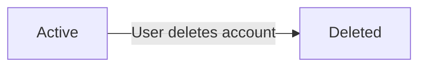

### Content Lifecycle

Posts and comments share a common lifecycle with two states: active and deleted.

- **Active**: The default state upon creation. Content is visible to users with appropriate access. Posts appear in feeds and comments appear under their parent post.
- **Deleted**: Entered when the author deletes their own content or when a moderator deletes content within their community. Deleted content is no longer visible to any user. Deleting a post cascades to all its comments. Deleted content cannot be restored.

Transitions:
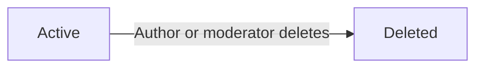

### Subscription Lifecycle

A subscription has two states: active and cancelled.

- **Active**: The user is subscribed and can create posts in the community. The subscriber count includes this user.
- **Cancelled**: The user has unsubscribed. The user may subscribe again in the future. Cancelled subscriptions are not retained historically.

Transition:
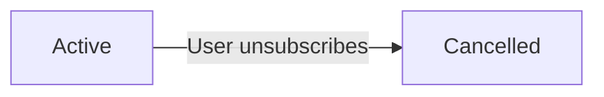

### Moderator Assignment Lifecycle

A moderator assignment linking a user to a community has two states: active and removed.

- **Active**: The user serves as a moderator or owner of the community with moderation authority.
- **Removed**: The assignment has been terminated by the owner. The user no longer has moderation privileges in that community. Removed assignments are not retained historically.

Transition:
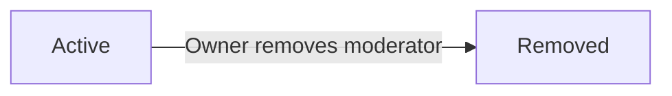

### Ban Lifecycle

A ban against a user in a community has two states: active and lifted.

- **Active**: The user is banned from the community and cannot create posts or comments within it. The user can still view content in that community.
- **Lifted**: The ban has been removed by a moderator. The user can resume creating posts and comments in that community. Lifted bans are not retained historically.

Transition:
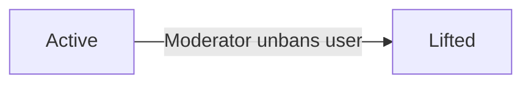

### Report Lifecycle

A report has three states: submitted, approved, and dismissed.

- **Submitted**: The default state upon creation. The report is visible to moderators of the community and includes the reported content, the reporting user, and the reason provided.
- **Approved**: A moderator has approved the report, which causes the reported content to be deleted. The report is resolved and no longer actionable.
- **Dismissed**: A moderator has dismissed the report without deleting the content. The report is removed from the active report list.

Transitions:
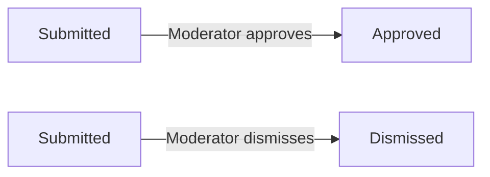

### Retention and Recovery Context

The platform does not support content archival, temporary suspension, or recovery features. The following states are terminal and irreversible:

- Deleted accounts: Permanently removed with all associated content. Cannot be restored.
- Deleted posts and comments: Permanently removed. Cannot be restored.
- Cancelled subscriptions: Not retained historically.
- Removed moderator assignments: Not retained historically.
- Lifted bans: Not retained historically.
- Approved or dismissed reports: Removed from the active report list and not retained.

Detailed data retention schedules, privacy policies, and recovery procedures are specified in [05-non-functional.md](./05-non-functional.md).

# Business Categories and State Flows

Business category classifications and state flow definitions.

## Business Category Definitions

Define all business category classifications with their allowed values and descriptions.

### Post Type Classification

Every post on the platform belongs to exactly one of three content types. This classification determines how the post's content is presented and stored.

| Allowed Value | Description |
|---------------|-------------|
| Text | The post contains written text content. When displayed in feeds, the first 200 characters are shown as a preview. |
| Link | The post contains a URL to external content. When displayed in feeds, the domain name of the URL is shown (e.g., "youtube.com"). |
| Image | The post contains an uploaded image. When displayed in feeds, a thumbnail of the image is shown. |

The post type is set at creation time and cannot be changed afterward.

### Vote Value Classification

A vote is classified by its direction, which determines its effect on the target post or comment's score and the author's karma.

| Allowed Value | Numeric Effect | Karma Effect |
|---------------|----------------|--------------|
| Upvote | Adds 1 to the vote score of the target post or comment | Increases the target author's karma by 1 |
| Downvote | Subtracts 1 from the vote score of the target post or comment | Decreases the target author's karma by 1 |

A user may cast only one vote per target (post or comment). The vote may be changed from one value to the other, or removed entirely. Removing a vote reverses both the score effect and the karma effect.

### Moderator Role Classification

Each community has a hierarchy of moderator roles. These roles define the level of authority a user has within the community.

| Role | Authority Level | Description |
|------|----------------|-------------|
| Owner | Highest | The user who created the community. The owner has full authority: they can add and remove moderators, delete any post or comment, ban and unban users, and manage reports. There is exactly one owner per community. |
| Moderator | Standard | A user appointed by the owner or by another moderator. Moderators can delete posts and comments, ban and unban users, and manage reports. Moderators cannot remove the owner and cannot remove other moderators. |

The owner role is automatically assigned to the community creator and cannot be transferred or revoked.

### Report Status Classification

Every report submitted against a post or comment follows a lifecycle defined by its status. The status indicates where the report is in the moderation workflow.

| Status | Description |
|--------|-------------|
| Pending | The report has been submitted and awaits review by a moderator. This is the initial status of all new reports. |
| Approved | A moderator has reviewed and approved the report. When a report is approved, the reported post or comment is deleted. The report is then closed. |
| Dismissed | A moderator has reviewed and determined the report is not actionable. The reported content is kept, and the report is removed from the active report list. |

A report transitions from "Pending" to either "Approved" or "Dismissed" by a moderator action. Once a report reaches "Approved" or "Dismissed", its status is final and cannot be changed.

## State Transitions

Define valid state transition paths for stateful concepts.

### User Account State Flow

A user account exists in one of two states: **Active** or **Deleted**.

**Transitions:**
- An account begins in **Active** state upon successful registration.
- A user may delete their own account at any time, transitioning it to **Deleted** state.
- When an account enters **Deleted** state, all associated content — including posts, comments, and votes — is also deleted immediately.
- The Deleted state is terminal; accounts cannot be restored or reactivated.

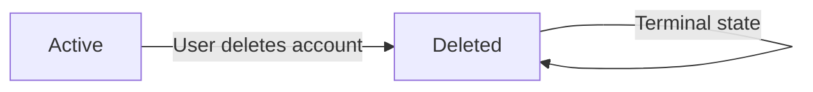

### Report State Flow

A report transitions through a review workflow managed by community moderators.

**States:**
- **Submitted** — The report has been filed by a user and awaits moderator review.
- **Approved** — A moderator has approved the report, resulting in automatic deletion of the reported content. The report is then closed.
- **Dismissed** — A moderator has dismissed the report. The reported content remains. Dismissed reports are removed from the report list.

**Transitions:**
- A report begins in **Submitted** state when a user submits it with a reason.
- A moderator may **Approve** a submitted report, moving it to **Approved** state. The reported content is deleted.
- A moderator may **Dismiss** a submitted report, moving it to **Dismissed** state. The report is removed from the active list.
- Both Approved and Dismissed are terminal states with no further transitions.

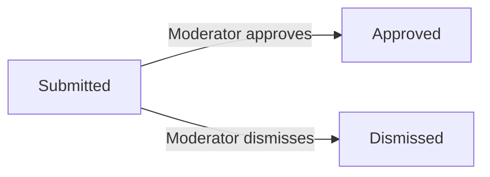

### Vote State Flow

A vote (cast by a user on a post or comment) can be created, changed, or removed.

**States:**
- **No Vote** — The user has not voted on the target content.
- **Upvote** — The user has cast an upvote (+1 to score).
- **Downvote** — The user has cast a downvote (-1 to score).

**Transitions:**
- From **No Vote**, a user may cast an upvote or a downvote.
- From **Upvote**, a user may change to **Downvote** or remove the vote entirely (returning to **No Vote**).
- From **Downvote**, a user may change to **Upvote** or remove the vote entirely (returning to **No Vote**).
- Each user may have at most one vote on a given post or comment at any time.

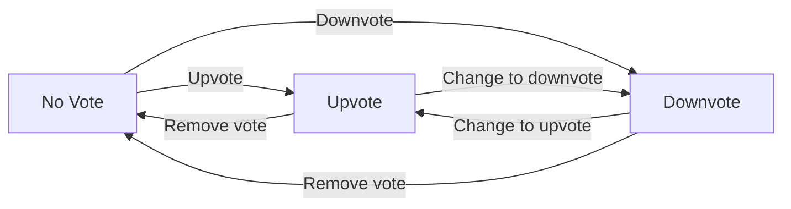

### Subscription State Flow

A user's subscription to a community is a binary relationship that can be toggled.

**States:**
- **Not Subscribed** — The user is not a subscriber of the community.
- **Subscribed** — The user is a subscriber of the community and may create posts in it.

**Transitions:**
- From **Not Subscribed**, a user may subscribe to the community, entering **Subscribed** state.
- From **Subscribed**, a user may unsubscribe from the community, returning to **Not Subscribed** state.
- Subscription state affects permission: only subscribed users may create posts in the community (defined in [01-actors-and-auth.md](./01-actors-and-auth.md)).

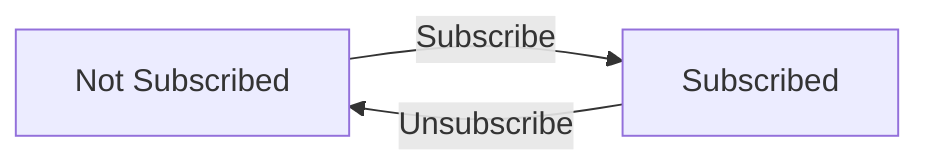

### Ban State Flow

A user's ban from a community is a moderation action that can be applied and reversed.

**States:**
- **Not Banned** — The user has full access to participate in the community.
- **Banned** — The user is restricted from creating posts or comments in the community, but may still view content.

**Transitions:**
- From **Not Banned**, a moderator may ban a user, moving them to **Banned** state with a recorded reason and timestamp.
- From **Banned**, a moderator may unban a user, returning them to **Not Banned** state.
- Ban state affects permission: banned users cannot create posts or comments in the community (defined in [04-business-rules.md](./04-business-rules.md)).

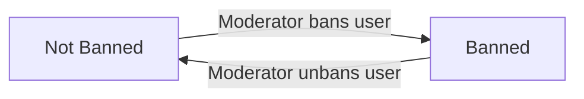