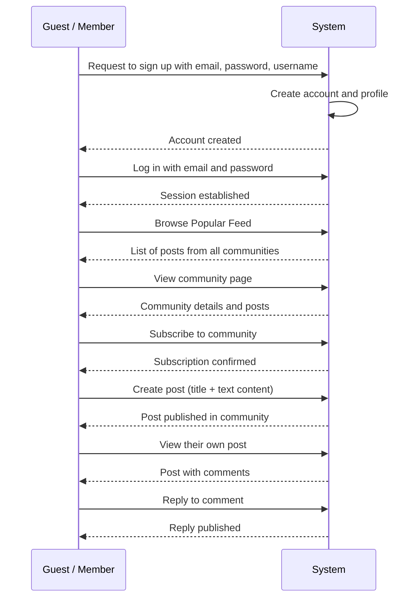
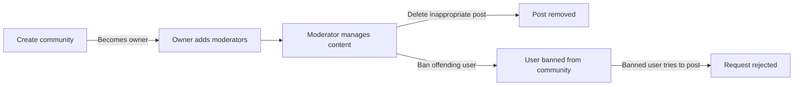
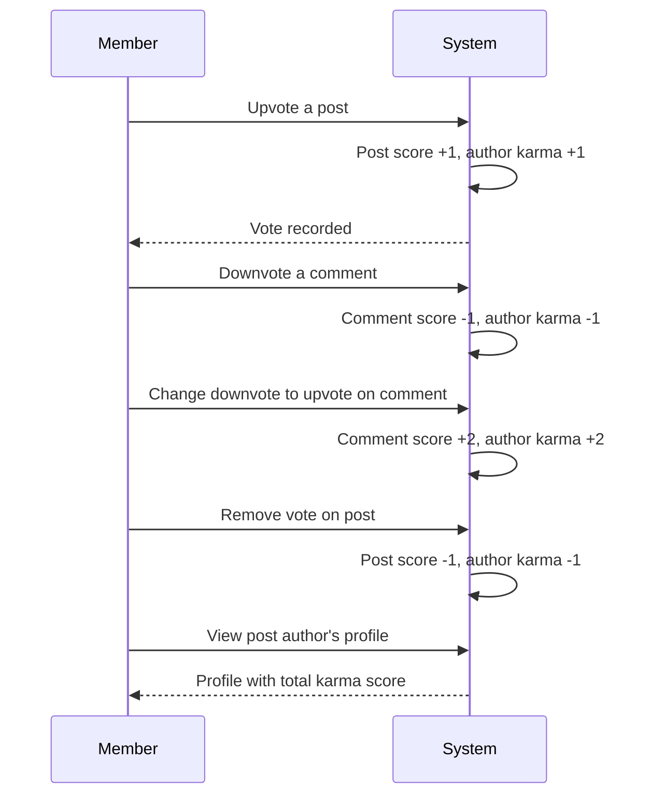
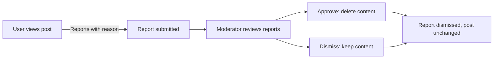
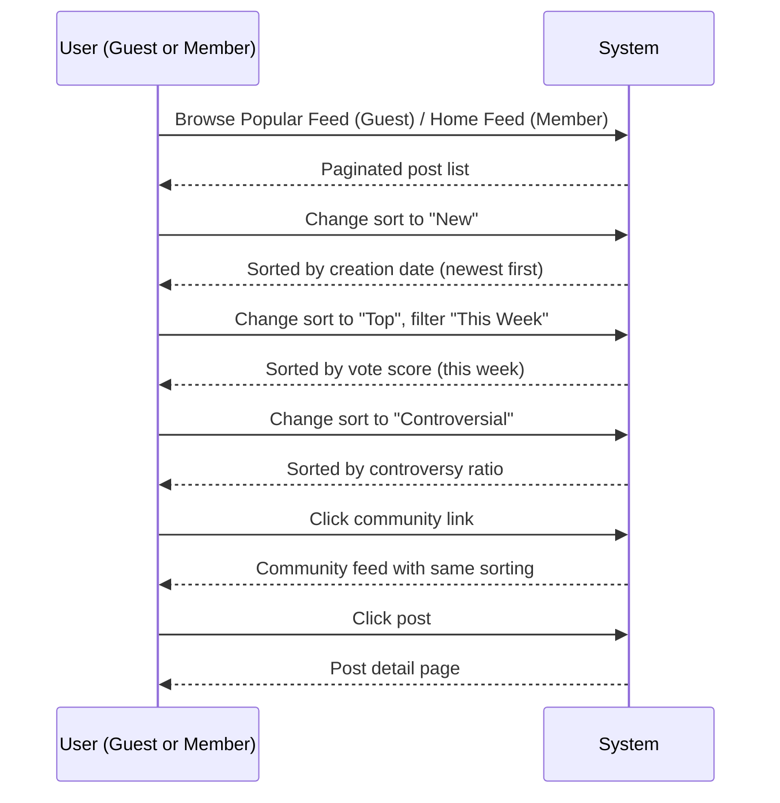

**communityPlatform — What operations users can perform, use cases, business workflows**

What operations users can perform, use cases, business workflows

# Core Business Operations

What the system must do for each business concept.

## User Operations

Users sign up for the platform using their email address and a chosen password. During sign up, each user must choose a unique username that identifies them across the platform. When a user signs up, the system creates their user account and prepares an empty user profile linked to that account. Users log in to the platform by providing their email and password, allowing them to access authenticated features such as creating posts and voting. If a user forgets or wishes to change their password, they can update it through their account settings. Users can permanently delete their own accounts, which triggers the removal of all their posts and comments from the platform. Account deletion is irreversible and removes all associated content. The system must reject sign up attempts where the email is already registered or the username is already taken. Login attempts with incorrect credentials must be rejected, preventing unauthorized access. Password changes require the user to provide their current password before setting a new one. Deleting an account requires confirmation to prevent accidental removal. These operations collectively manage the user lifecycle from registration through account deletion.

### User Registration

THE system SHALL allow a person to register as a user by providing an email address and a password.

THE system SHALL require each user to choose a unique username during registration. The username SHALL identify the user across the platform.

WHEN a registration attempt is submitted, THE system SHALL create a user account and automatically prepare an empty user profile linked to that account.

IF the submitted email address is already associated with an existing account, THEN THE system SHALL reject the registration.

IF the submitted username is already taken by another user, THEN THE system SHALL reject the registration.

### User Authentication

THE system SHALL authenticate a user by verifying their submitted email address and password against the stored credentials.

WHEN the email and password match a registered account, THE system SHALL grant the user access to authenticated features including creating posts and voting.

IF the submitted email does not match any registered account, THEN THE system SHALL reject the login attempt.

IF the submitted password does not match the stored password for the given email, THEN THE system SHALL reject the login attempt.

### Password Change

WHEN a user requests to change their password, THE system SHALL require the user to provide their current password before accepting the new password.

WHEN the current password matches the stored password, THE system SHALL update the account to use the new password.

IF the current password does not match, THEN THE system SHALL reject the password change request.

### Account Deletion

WHEN a user requests to delete their account, THE system SHALL require the user to confirm the deletion before proceeding.

WHEN account deletion is confirmed, THE system SHALL permanently delete the user account and remove all posts and comments authored by that user from the platform.

Account deletion SHALL be irreversible. Once completed, the deleted account and its associated content SHALL not be recoverable.

## Profile Operations

Upon user registration, a profile is automatically created for the user with default empty fields. Each user profile displays the user's display name, a bio text describing themselves, and an avatar image representing them visually. Users can view any other user's profile on the platform by navigating to that user's profile page. When viewing a profile, the system shows the user's display name, bio, and avatar. The profile page also displays the user's total karma score, which reflects the cumulative votes on their posts and comments. Additionally, the profile page lists all posts the user has created and all comments they have written, providing a complete view of their platform activity. Users can edit their own profile to update their display name, change their bio text, or upload a new avatar image. Users cannot edit another user's profile — only their own. Profile changes take effect immediately and are visible to anyone viewing the profile. If a user deletes their account, their profile and all associated content are removed along with the account.

### Automatic Profile Creation

WHEN a user successfully registers an account (defined in [User Operations]), THE system SHALL automatically create a profile for that user.

THE system SHALL initialize the new profile with an empty display name, empty bio text, and no avatar image.

### Viewing a User Profile

Any user (guest or member) SHALL be able to view any other user's profile on the platform.

WHEN viewing a user's profile, THE system SHALL display the profile's display name, bio text, and avatar image.

WHEN viewing a user's profile, THE system SHALL display the user's total karma score (defined in [Vote Operations]).

WHEN viewing a user's profile, THE system SHALL display all posts the user has created, ordered by creation date with the most recent first.

WHEN viewing a user's profile, THE system SHALL display all comments the user has written, ordered by creation date with the most recent first.

### Editing Your Own Profile

A member SHALL be able to edit their own profile.

WHEN editing their own profile, THE system SHALL allow the member to update their display name.

WHEN editing their own profile, THE system SHALL allow the member to update their bio text.

WHEN editing their own profile, THE system SHALL allow the member to upload a new avatar image or replace their existing avatar image.

WHEN a member attempts to edit another user's profile, THE system SHALL reject the request.

### Account Deletion and Profile Removal

WHEN a user deletes their account (defined in [User Operations]), THE system SHALL remove that user's profile, including the display name, bio text, and avatar image, along with the account.

## Community Operations

Any registered user can create a new community on the platform. When creating a community, the user must provide a unique community name, a description explaining what the community is about, and an icon image to represent the community visually. The user who creates a community automatically becomes its owner, holding the highest authority within that community. All users, including those who are not logged in, can browse a complete list of all communities on the platform. Users can search for communities by typing part of the community name, and the system returns matching results. Each community displayed in the list or search results shows its current subscriber count, giving users a sense of the community's popularity. Community creation must reject duplicate names since the community name must be unique across the platform. The description and icon can be updated by the community owner or moderators. There is no delete operation for communities — once created, a community persists on the platform. Community browsing and search are available to all users regardless of login status.

### Community Creation

THE system SHALL allow any registered user to create a community.

THE system SHALL require the user to provide the following when creating a community:
- A community name that is unique across the platform
- A description text explaining the community's purpose
- An icon image to represent the community visually

THE system SHALL designate the user who creates a community as its owner.

WHEN a user attempts to create a community with a name that already exists, THE system SHALL reject the creation request.

WHEN a community is successfully created, THE system SHALL record the owner's identity and the creation time.

### Community Browsing and Search

THE system SHALL display a complete list of all communities to any user who visits the community directory.

THE system SHALL allow any user to search for communities by entering part of the community name and SHALL return matching results.

THE system SHALL show the subscriber count for each community when displayed in browse lists or search results.

THE system SHALL allow community browsing and searching to all users, including those who are not logged in.

## Post Operations

Users can create a post in any community they are subscribed to. Every post requires a title, which is mandatory and cannot be empty. Posts come in three types: text posts contain written content, link posts contain a URL pointing to external content, and image posts contain an uploaded image. When creating a text post, the user provides the textual content alongside the title. When creating a link post, the user provides the URL they wish to share. When creating an image post, the user uploads an image file. Users can edit their own posts after creation, updating the title or the content depending on the post type. Users can delete their own posts, which removes them from the platform entirely. When viewing a single post, users see the title, full content, the author's username, the community name, the current vote score, the comment count, and the time since the post was created. For text posts shown in feeds, only the first 200 characters of content are displayed. For image posts in feeds, a thumbnail of the image is shown. For link posts in feeds, the domain name extracted from the URL is displayed. Users cannot create posts in communities they are not subscribed to — the system rejects such attempts.

### Post Creation

THE community platform SHALL allow a member to create a post in any community they are subscribed to.

WHEN a member creates a post, THE community platform SHALL require a title that is not empty.

WHEN a member creates a post, THE community platform SHALL require the member to select one of the following post types:
- **Text post**: the member provides written content as the body of the post
- **Link post**: the member provides a URL pointing to external content
- **Image post**: the member uploads an image file

WHEN a member creates a text post, THE community platform SHALL accept the textual content alongside the title.

WHEN a member creates a link post, THE community platform SHALL accept a URL.

WHEN a member creates an image post, THE community platform SHALL accept an uploaded image file.

IF a member who is not subscribed to a community attempts to create a post in that community, THEN THE community platform SHALL reject the request.

### Post Editing

WHEN an author of a post submits changes, THE community platform SHALL allow the author to edit the title or the type-specific content of their own post.

THE community platform SHALL preserve the post type when editing — a text post cannot be changed to a link post or image post, and vice versa.

### Post Deletion

WHEN an author requests deletion of their own post, THE community platform SHALL remove the post from the platform entirely, including all associated content, votes, and comments.

### Single Post View

WHEN a user (guest or member) views a single post, THE community platform SHALL display the following details:
- The post title
- The full content (text, URL, or image depending on post type)
- The author's username
- The community name
- The current vote score (total upvotes minus total downvotes)
- The total number of comments on the post
- The time elapsed since the post was created (e.g., "3 hours ago")

### Post List Display

WHEN a user views a feed of posts (Home, Popular, or Community feed), THE community platform SHALL display for each post:
- The post title
- The author's username
- The community name
- The vote score
- The comment count
- The time elapsed since creation (e.g., "3 hours ago")

WHERE the post is a text post, THE community platform SHALL display only the first 200 characters of its content as a preview.

WHERE the post is an image post, THE community platform SHALL display a thumbnail of the uploaded image.

WHERE the post is a link post, THE community platform SHALL display the domain name extracted from the URL (e.g., "youtube.com").

## Comment Operations

Any user can write a comment on any post, regardless of which community the post belongs to. Users can also reply to any existing comment, creating threaded discussions. Replies to comments can themselves receive replies, with no limit on how deep the nesting can go. Each comment displays the author's username, the comment content, the vote score, and the time since the comment was posted. Nested replies are shown beneath their parent comment, preserving the conversation structure. Users can edit their own comments after posting, updating the content as needed. Users can delete their own comments, which removes them from the thread. Comments on a post can be sorted by different criteria: best (highest vote score first), new (most recent first), or controversial (many votes but score close to zero). All users, including those who are logged out, can view comments on any post. Comment creation does not require subscription to the community — any user can comment on any post.

### Comment Creation

WHEN a member views any post, THE communityPlatform SHALL allow the member to submit a comment on that post.

WHEN a member submits a comment on a post, THE communityPlatform SHALL create the comment and associate it with the member as its author.

WHEN a member submits a comment on a post, THE communityPlatform SHALL associate the comment with the post on which it was written.

Comment creation does not require the member to be subscribed to the community that owns the post.

### Comment Replies

WHEN a member views any existing comment, THE communityPlatform SHALL allow the member to submit a reply to that comment.

WHEN a member submits a reply to an existing comment, THE communityPlatform SHALL create the reply as a child of the parent comment.

THE communityPlatform SHALL support nested replies with no limit on the depth of the reply chain. A reply to a comment can itself receive replies, and those replies can receive further replies, continuing indefinitely.

### Comment Display

WHEN a member or guest views the comments on a post, THE communityPlatform SHALL display for each comment: the comment author's username, the comment content, the comment's vote score, and the time elapsed since the comment was posted (e.g., "3 hours ago").

THE communityPlatform SHALL display nested replies beneath their parent comment, preserving the threaded conversation structure so that the relationship between a comment and its replies is visually clear.

### Comment Editing

WHEN a member views one of their own comments, THE communityPlatform SHALL allow the member to edit the comment's content.

WHEN a member submits an edit to one of their comments, THE communityPlatform SHALL update the comment's content with the new text provided.

### Comment Deletion

WHEN a member views one of their own comments, THE communityPlatform SHALL allow the member to delete the comment.

WHEN a member deletes one of their comments, THE communityPlatform SHALL remove the comment from the thread display.

### Comment Sorting

WHEN a member or guest views the comments on a post, THE communityPlatform SHALL allow the user to choose a sorting method from the available options.

WHEN a user selects the "Best" sorting option, THE communityPlatform SHALL sort comments with the highest vote score appearing first.

WHEN a user selects the "New" sorting option, THE communityPlatform SHALL sort comments with the most recently created appearing first.

WHEN a user selects the "Controversial" sorting option, THE communityPlatform SHALL sort comments that have many votes but a score close to zero appearing first.

### Public Comment Viewing

WHEN a guest views any post, THE communityPlatform SHALL display the post's comments to the guest.

Comment viewing does not require the user to be logged in or authenticated. All comments on a post are visible to all users, including those who are not signed in.

## Vote Operations

Users can vote on both posts and comments by giving either an upvote or a downvote. An upvote increases the target's score by 1, while a downvote decreases it by 1. Each user can vote only once per post or comment — duplicate votes are not allowed. Users can change their vote at any time, for example switching from an upvote to a downvote or vice versa. Users can also remove their vote entirely, which adjusts the score back to what it would have been without the vote. A user's karma score is affected by votes on their content: when someone upvotes their post or comment, their karma increases by 1, and when someone downvotes, their karma decreases by 1. When a user removes their vote from someone's content, that person's karma adjusts accordingly. The vote score displayed on a post or comment represents the total number of upvotes minus the total number of downvotes. Users cannot vote on their own content. Users who are not logged in cannot vote on any content. Karma can become negative if a user receives more downvotes than upvotes across their content.

### Post Voting

WHEN a logged-in member submits an upvote on a post, THE system SHALL increase the post's vote score by 1.

WHEN a logged-in member submits a downvote on a post, THE system SHALL decrease the post's vote score by 1.

WHEN a logged-in member has already cast a vote on a post and changes their vote type (from upvote to downvote or from downvote to upvote), THE system SHALL adjust the post's vote score by 2 in the appropriate direction.

WHEN a logged-in member removes their existing vote from a post, THE system SHALL revert the post's vote score to what it would have been without that vote.

### Comment Voting

WHEN a logged-in member submits an upvote on a comment, THE system SHALL increase the comment's vote score by 1.

WHEN a logged-in member submits a downvote on a comment, THE system SHALL decrease the comment's vote score by 1.

WHEN a logged-in member has already cast a vote on a comment and changes their vote type (from upvote to downvote or from downvote to upvote), THE system SHALL adjust the comment's vote score by 2 in the appropriate direction.

WHEN a logged-in member removes their existing vote from a comment, THE system SHALL revert the comment's vote score to what it would have been without that vote.

### Vote Score Calculation

THE system SHALL calculate the net vote score of a post or comment as the total number of upvotes received minus the total number of downvotes received.

THE system SHALL display the net vote score alongside each post and comment wherever they appear in feeds, post detail views, and comment threads.

### Karma Effect of Voting

WHEN a logged-in member upvotes a post or comment, THE system SHALL increase the karma of the author of that post or comment by 1.

WHEN a logged-in member downvotes a post or comment, THE system SHALL decrease the karma of the author of that post or comment by 1.

WHEN a logged-in member removes their vote from a post or comment, THE system SHALL adjust the karma of the author by reversing the previous effect (subtract 1 if the removed vote was an upvote, add 1 if the removed vote was a downvote).

THE system SHALL allow karma to become negative when an author receives more downvotes than upvotes across all of their posts and comments.

THE system SHALL update karma immediately when a vote is cast, changed, or removed.

### Voting Restrictions

THE system SHALL allow each logged-in member to cast at most one vote per post and at most one vote per comment. Attempting a second vote on the same target SHALL be treated as a change of the existing vote.

WHEN a logged-in member attempts to upvote or downvote their own post, THE system SHALL reject the action.

WHEN a logged-in member attempts to upvote or downvote their own comment, THE system SHALL reject the action.

WHERE a user is not logged in (guest), THE system SHALL not permit any voting on posts or comments.

## Subscription Operations

Any registered user can subscribe to any community on the platform. Subscribing to a community adds that community to the user's personal feed and indicates their interest in its content. Users can unsubscribe from any community they are currently subscribed to, removing it from their personal feed. Users can view a complete list of all communities they are subscribed to, helping them manage their subscriptions. Subscription is required for creating posts in a community — users who are not subscribed cannot create new posts in that community. The subscriber count displayed on each community reflects the total number of users currently subscribed to it. Subscribing does not require any approval from the community owner or moderators — it is an automatic operation. Unsubscribing also takes effect immediately without any approval process. Users who are not logged in cannot subscribe to communities. There is no limit on how many communities a user can subscribe to.

### Subscribing to a Community

WHEN a logged-in member requests to subscribe to a community, THE system SHALL add the member to the community's subscriber list and increment the community's subscriber count by one immediately.

WHEN a logged-in member requests to subscribe to a community they are already subscribed to, THE system SHALL reject the request.

WHEN a guest (not logged-in) requests to subscribe to a community, THE system SHALL reject the request.

A member SHALL be able to subscribe to any community on the platform regardless of its size, activity level, or other characteristics.

A member SHALL be able to subscribe to an unlimited number of communities.

THE subscription SHALL take effect automatically and immediately without requiring approval from the community owner or any moderator.

THE subscription SHALL NOT require any confirmation step beyond the member's initial request.

### Unsubscribing from a Community

WHEN a logged-in member requests to unsubscribe from a community they are currently subscribed to, THE system SHALL remove the member from the community's subscriber list and decrement the community's subscriber count by one immediately.

WHEN a member requests to unsubscribe from a community they are not subscribed to, THE system SHALL reject the request.

THE unsubscription SHALL take effect automatically and immediately without requiring approval from the community owner or any moderator.

THE unsubscription SHALL NOT require any confirmation step beyond the member's initial request.

### Viewing Subscribed Communities

WHEN a logged-in member requests to view their subscribed communities, THE system SHALL return a list of all communities the member is currently subscribed to.

THE list SHALL include each community's name, icon image, and subscriber count for each listed community.

WHEN a member who has no subscriptions requests to view their subscribed communities, THE system SHALL return an empty list.

### Subscription Requirement for Posting

WHEN a logged-in member attempts to create a post in a community they are not subscribed to, THE system SHALL reject the request.

WHEN a logged-in member who is subscribed to a community attempts to create a post in that community, THE system SHALL permit the operation.

WHEN a guest (not logged-in) attempts to create a post in any community, THE system SHALL reject the request regardless of subscription status.

### Subscriber Count Tracking

EACH community SHALL display its current subscriber count, reflecting the total number of members currently subscribed to that community.

WHEN a member subscribes to a community, THE subscriber count SHALL increment by one automatically and immediately.

WHEN a member unsubscribes from a community, THE subscriber count SHALL decrement by one automatically and immediately.

WHEN a member's account is deleted (as defined in [User Operations — Account Deletion]), ALL their subscriptions SHALL be removed, and the subscriber counts of all communities they were subscribed to SHALL decrement accordingly.

## Moderator Operations

The user who creates a community automatically becomes its owner, holding the highest authority. The owner can add other users as moderators to help manage the community. The owner can also remove moderators from their position at any time. Moderators themselves can add other users as moderators, expanding the moderation team. However, moderators cannot remove the owner from their position — the owner is the only one who can step down or be removed. Moderators also cannot remove each other; only the owner has the authority to remove moderators. Moderators have the power to delete any post within their community, regardless of who created it. Moderators can also delete any comment within their community. These moderation actions help maintain community standards and enforce rules. The moderation team structure ensures a clear hierarchy with the owner at the top, moderators beneath, and clear rules about who can perform which administrative actions.

### Owner Role in Moderation

WHEN a community is created, THE system SHALL designate the creating user as the owner (defined in [03-functional-requirements.md > Community Operations]).

THE owner SHALL hold the highest moderation authority within their community, with unrestricted privileges to manage the moderation team and enforce community standards.

This role SHALL grant the owner all moderation privileges described in this section, plus additional administrative authority over the moderation team itself.

### Moderator Appointment and Removal

THE owner SHALL be able to appoint any user as a moderator of their community.

THE owner SHALL be able to remove any moderator from their position at any time, without requiring approval from any other party.

Moderators SHALL be able to appoint other users as moderators, thereby expanding the moderation team.

WHILE a moderator holds their position, they SHALL NOT be able to remove the owner. Only the owner may voluntarily relinquish or transfer ownership.

WHILE a moderator holds their position, they SHALL NOT be able to remove other moderators. Only the owner retains the authority to remove any moderator.

IF a moderator attempts to remove the owner or another moderator, THEN THE system SHALL reject the operation.

### Content Moderation by Moderators

Moderators SHALL have the authority to delete any post within their community, regardless of which user authored it.

Moderators SHALL have the authority to delete any comment within their community, regardless of which user wrote it.

WHEN a moderator deletes a post, THE system SHALL remove the post and all its associated comments from the community feed. The post SHALL also be removed from the author's profile page.

WHEN a moderator deletes a comment, THE system SHALL remove the comment and all its nested replies from the post's comment section.

THE owner SHALL also possess all content moderation privileges described in this section, including the ability to delete any post or any comment within their community.

### Moderation Hierarchy

THE moderation hierarchy SHALL consist of two tiers: the owner at the top level, and moderators at the level below.

THE owner SHALL hold unrestricted administrative authority, including the ability to appoint and remove moderators, and to delete any content within their community.

Moderators SHALL hold delegated authority limited to content deletion (posts and comments within their community) and the ability to appoint other moderators.

IF a lower-tier actor (moderator) attempts to perform an action reserved for the highest-tier actor (owner), such as removing the owner or removing another moderator, THEN THE system SHALL reject the operation.

This hierarchy SHALL apply per community independently; a user who is the owner of one community may be a regular member or moderator of another.

## Ban Operations

Moderators can ban users from their community as a moderation action. When a user is banned from a community, they cannot create new posts or write comments in that community. Banned users can still view content in the community — bans only restrict participation, not access. Moderators can unban previously banned users, restoring their ability to post and comment in the community. Moderators can view the complete list of banned users for their community, allowing them to see who is currently restricted. The ban includes information about when the ban was placed and the reason for the ban, though the original requirements specify only the ability to ban and unban. Bans are community-specific — banning a user from one community does not affect their access to other communities. The owner of a community also has the same ban management capabilities as moderators. Banning does not remove existing content from the community — it only prevents future participation.

### Banning a User from a Community

WHEN a moderator or the community owner selects to ban a user from their community, THE system SHALL record the ban with a timestamp and prohibit the banned user from performing certain actions within that community.

WHEN a user is banned from a community, THE system SHALL prevent that user from creating new posts in that community.

WHEN a user is banned from a community, THE system SHALL prevent that user from writing new comments in that community.

WHILE a user is banned from a community, THE system SHALL allow the user to still view all content in that community including posts, comments, and community details. The ban restricts participation only, not access.

### Unbanning a User

WHEN a moderator or the community owner selects to unban a previously banned user, THE system SHALL remove the ban restriction, restoring the user's ability to create posts and write comments in that community.

### Viewing the Banned Users List

WHEN a moderator or the community owner views the banned users list for their community, THE system SHALL display all currently banned users along with the reason for the ban and the date and time when the ban was placed.

### Community-Specific Ban Scope

WHEN a user is banned from a specific community, THE system SHALL restrict the ban to that community only. The ban SHALL NOT affect the user's ability to access, subscribe to, post in, or comment on any other community on the platform. Bans are scoped to the individual community where they were issued.

### Owner Ban Management

THE community owner SHALL have the same ban management capabilities as moderators. The owner SHALL be able to ban users from their community, unban users, and view the list of banned users.

## Report Operations

Any user can report a post or comment that they believe violates community standards or platform rules. When reporting content, the user must provide a reason explaining why they are reporting it. Reports are submitted to the community's moderators for review. Moderators can view all pending reports for their community, seeing what content was reported, who reported it, and the reason provided. Each report shows the reported content itself, the reporting user, and the textual reason for the report. Moderators can approve a report, which deletes the reported content from the platform. Alternatively, moderators can dismiss a report, which keeps the content as is and removes the report from the pending list. Once a report is dismissed, it is removed from the report list and is no longer visible to moderators. Reports can only be handled by moderators of the community where the content was posted — not by platform administrators or users who are not moderators.

### Report Submission

WHEN a member determines that a post or comment violates community standards, THE member SHALL be able to report that content.

WHEN a member initiates a report, THE system SHALL require the member to provide a textual reason explaining why the content is being reported.

WHEN a member submits a report with a reason, THE system SHALL register the report and associate it with the community where the reported content resides.

WHEN a member submits a report, THE system SHALL notify the community's moderators of the new pending report.

### Moderator Report Review

WHEN a moderator of a community accesses the report list, THE system SHALL display all pending reports for that community.

WHEN a moderator views a pending report, THE system SHALL display:
- The reported content (the full post or comment body)
- The username of the member who submitted the report
- The textual reason provided by the reporting member

WHEN a moderator reviews a report, THE moderator SHALL be able to either approve or dismiss it.

### Report Approval

WHEN a moderator approves a report, THE system SHALL delete the reported post or comment from the platform.

WHEN a moderator approves a report, THE system SHALL remove the report from the pending report list.

### Report Dismissal

WHEN a moderator dismisses a report, THE system SHALL leave the reported content unchanged on the platform.

WHEN a moderator dismisses a report, THE system SHALL remove the report from the pending report list permanently.

WHEN a report has been dismissed, THE system SHALL no longer display it to moderators in any report list view.

### Community-Scoped Report Handling

WHEN a report is submitted, THE system SHALL scope the report to the specific community where the reported post or comment was published.

WHEN a moderator accesses reports, THE system SHALL only display reports scoped to communities the moderator manages.

WHEN a member who is not a moderator of the relevant community attempts to access reports, THE system SHALL prevent access to the report list and individual report details.

# Error Scenarios and Edge Cases

Business-level error scenarios, edge case coverage, and expected system behaviors for exceptional conditions.

## User Error Scenarios

When a user signs up with an email that is already registered, the system must reject the request and inform the user that the email is already in use. Similarly, if a user chooses a username that another user already has, the system must reject the sign-up and notify them that the username is taken. For login, if a user provides an incorrect email or password combination, the system must deny access with a message indicating invalid credentials without revealing whether the email exists. When a user attempts to change their password, they must provide their current password first; if the current password is incorrect, the change is rejected. If the new password does not meet minimum security requirements, the system must reject the change and explain what is missing. During account deletion, if the user tries to confirm deletion without providing proper verification, the system must prevent the action. If the deletion process is interrupted partway, the system should either roll back or clearly indicate the partial state so the user can retry.

### Duplicate Email Registration

WHEN a user attempts to sign up with an email address that is already registered to an existing account, THEN THE system SHALL reject the registration request and inform the user that the email address is already in use. THE system SHALL NOT reveal whether the existing account is active or has been deleted. IF a user attempts to sign up with an email that was used for a previously deleted account, THEN THE system SHALL reject the registration and treat the email as already registered.

### Duplicate Username Registration

WHEN a user attempts to sign up with a username that is already taken by another active account, THEN THE system SHALL reject the registration request and notify the user that the username is unavailable. THE system SHALL NOT reveal alternative available usernames unless specifically requested by the user.

### Invalid Login Credentials

WHEN a user attempts to log in with an email and password combination that does not match any registered account, THEN THE system SHALL deny access with a message indicating invalid credentials. THE system SHALL use the same error message regardless of whether the email does not exist, the email exists with a wrong password, or the account has been deleted. THE system SHALL NOT reveal which specific credential was incorrect.

### Password Change with Incorrect Current Password

WHEN a user attempts to change their password and provides an incorrect current password, THEN THE system SHALL reject the password change request. THE system SHALL inform the user that the current password does not match without revealing how close the attempt was or how many attempts have been made.

### Password Change with Insufficient New Password

WHEN a user attempts to change their password and the new password does not meet the minimum security requirements, THEN THE system SHALL reject the change and inform the user of the specific requirements that were not met. THE system SHALL accept a revised new password without requiring the user to re-enter the current password, as long as the session remains active.

### Account Deletion Verification Failure

WHEN a user initiates account deletion but fails to complete required verification — such as providing incorrect password confirmation or declining the permanence acknowledgment — THEN THE system SHALL prevent the deletion action. THE user's account, profile, posts, comments, and all associated data SHALL remain intact and fully functional following the failed verification attempt.

### Interrupted Account Deletion

WHEN the account deletion process is interrupted partway due to network failure, session timeout, system error, or user navigation away from the process, THEN THE system SHALL roll back completely to the pre-deletion state. THE user SHALL be able to retry the deletion process from the beginning. THE system SHALL NOT delete any data as a result of the interrupted process.

## Profile Error Scenarios

When a user tries to edit another user's profile, the system must deny the request since only the profile owner can edit their own display name, bio, and avatar. If the user provides an empty display name, the system must reject the update since a display name is required. For avatar image upload, if the file format is unsupported or the file size exceeds the allowed limit, the system must reject the upload and inform the user of acceptable formats and size limits. When viewing a profile that does not exist, the system should return a clear message indicating the profile was not found rather than a generic error. If a user sets their bio text to the maximum allowed length and attempts to add more characters, the input must be truncated or rejected at the boundary. Edge cases include viewing your own profile versus another user's profile — the system must handle both scenarios identically without exposing edit controls to non-owners.

### Unauthorized Profile Edit Attempt

WHEN a member attempts to edit the display name, bio, or avatar of another user's profile, THE community platform SHALL reject the request.

WHEN a member attempts to edit their own display name, bio, or avatar, THE community platform SHALL allow the modification.

WHEN a guest (logged-out user) attempts to access profile edit functionality, THE community platform SHALL reject the request.

THE community platform SHALL NOT expose edit controls (display name field, bio editor, avatar uploader) to any user who is not the profile owner, including when viewing another user's profile page.

### Empty Display Name Rejection

WHEN a member submits a profile update with an empty display name, THE community platform SHALL reject the update.

WHEN a member submits a profile update with a display name containing only whitespace characters, THE community platform SHALL reject the update.

THE community platform SHALL preserve the existing display name when an update is rejected due to an empty value.

### Avatar File Format Validation

WHEN a member uploads an avatar image with an unsupported file format, THE community platform SHALL reject the upload.

THE community platform SHALL accept only common image formats for avatar uploads.

WHEN an avatar upload is rejected due to an unsupported format, THE community platform SHALL inform the member of the acceptable file formats.

THE community platform SHALL preserve the existing avatar image when an upload is rejected due to an unsupported format.

### Avatar File Size Validation

WHEN a member uploads an avatar image that exceeds the maximum allowed file size, THE community platform SHALL reject the upload.

WHEN an avatar upload is rejected due to exceeding the file size limit, THE community platform SHALL inform the member of the maximum allowed size.

THE community platform SHALL preserve the existing avatar image when an upload is rejected due to the file size limit.

### Non-Existent Profile Viewing

WHEN a user (guest or member) attempts to view a profile for a user account that does not exist, THE community platform SHALL return a clear message indicating that the profile was not found.

THE community platform SHALL distinguish between a profile not found condition and a generic system error, providing user-facing messaging that explains the profile does not exist.

### Own vs Other Profile Viewing

WHEN a member views their own profile, THE community platform SHALL display the same profile information (display name, bio, avatar, karma score, posts, comments) as when any other user views that profile.

WHEN a member views their own profile, THE community platform SHALL additionally display edit controls for the display name, bio, and avatar.

WHEN a member or guest views another user's profile, THE community platform SHALL NOT display any edit controls for that profile.

THE community platform SHALL handle viewing your own profile and viewing another user's profile identically in terms of the displayed profile information — only the presence of edit controls shall differ.

### Bio Text Length Boundary

WHEN a member submits a profile update where the bio text exceeds the maximum allowed length, THE community platform SHALL reject the update.

WHEN a bio text update is rejected due to exceeding the maximum length, THE community platform SHALL inform the member of the maximum character limit.

THE community platform SHALL preserve the existing bio text when an update is rejected due to length.

WHEN a member submits a bio text that is exactly at the maximum allowed length, THE community platform SHALL accept the update. No truncation shall occur; the submission must be either fully accepted or fully rejected.

## Community Error Scenarios

When a user attempts to create a community with a name that already exists, the system must reject the creation since community names must be unique. If the description text exceeds the allowed character limit, the creation must be rejected with an explanation. For the community icon image, unsupported file formats or oversized files must be rejected. When a user searches for a community by name and no match is found, the system should return an empty results list rather than an error. If a user tries to browse communities when there are none, the list should be empty. Edge cases include special characters in community names — the system must define which characters are allowed and reject names that violate these rules. If the community creator's account is deleted, ownership must be handled — the system should either transfer ownership or mark the community as ownerless since the original requirements state account deletion removes all posts and comments but do not specify community ownership transfer.

### Duplicate Community Name Rejection

WHEN a user attempts to create a community with a name that is already assigned to an existing community, THE system SHALL reject the creation request and notify the user that the community name is already taken.

### Community Description Character Limit

WHEN a user provides a description text for a new community that exceeds the maximum allowed character limit, THE system SHALL reject the creation request and inform the user of the maximum length requirement.

### Community Icon Image Format Validation

WHEN a user uploads an icon image for a community in an unsupported file format, THE system SHALL reject the upload and indicate which file formats are accepted.

### Community Icon File Size Exceeded

WHEN a user uploads an icon image for a community that exceeds the maximum allowed file size, THE system SHALL reject the upload and inform the user of the file size limit.

### No Search Results Handling

WHEN a user searches for communities by name and no matching community is found, THE system SHALL return an empty results list rather than displaying an error message.

### Empty Community List

WHEN a user browses the list of all communities but no communities exist on the platform, THE system SHALL display an empty list.

### Special Characters in Community Name Validation

WHEN a user attempts to create a community with a name containing characters outside the allowed character set, THE system SHALL reject the creation request and specify which characters and symbols are permitted.

### Community Ownership After Account Deletion

WHEN a user whose account is deleted was the owner of one or more communities, THE system SHALL handle the ownership transition by either transferring ownership to an existing moderator of that community or marking the community as ownerless. The specific approach shall be determined by platform policy. WHEN a community becomes ownerless, THE system SHALL record this state so that it can be reviewed.

### Ownerless Community Moderation Scope

WHILE a community has no owner due to the original owner's account deletion, THE system SHALL allow existing moderators to continue performing all standard moderation actions (deleting posts, deleting comments, banning and unbanning users, viewing reports). IF there are no moderators in an ownerless community, THEN THE system SHALL allow only viewing of content, and no moderation or ownership actions SHALL be available.

## Post Error Scenarios

When a user tries to create a post in a community they are not subscribed to, the system must reject the creation since subscribing is required. If the post title is empty or missing, the system must reject the request since title is required. For text posts, if the text content exceeds the maximum allowed length, the system must reject or truncate at the boundary. For link posts, if the URL is malformed or invalid, the system must reject the post. For image posts, if the uploaded image format is unsupported or exceeds size limits, the system must reject with a clear message. When a user tries to edit a post that belongs to another user, the system must deny access. When a user tries to delete a post that has already been deleted, the system should indicate the post was not found. Edge cases include viewing a post in a community that has since been deleted — the system should handle this gracefully by showing the post without community context or returning a not-found error.

### Post Creation — Subscription Requirement

WHEN a user attempts to create a post in a community, IF the user is not subscribed to that community, THEN THE system SHALL reject the creation request.

WHEN a user attempts to create a post in a community, IF the user is banned from that community, THEN THE system SHALL reject the creation request and indicate that the user is banned.

WHEN a user attempts to create a post in a community that does not exist, THEN THE system SHALL reject the creation request with a not-found indication.

### Post Creation — Missing or Invalid Title

WHEN a user attempts to create a post, IF the title is missing, empty, or contains only whitespace, THEN THE system SHALL reject the creation request with a message indicating that the title is required.

WHEN a user attempts to create a post, IF the title exceeds the maximum allowed length (defined in [04-business-rules.md](./04-business-rules.md)), THEN THE system SHALL reject the creation request.

### Text Post — Content Length Boundary

WHEN a user attempts to create a text post, IF the text content exceeds the maximum allowed length, THEN THE system SHALL reject the creation request with a message indicating the content length limit.

WHEN a user attempts to create a text post, IF the text content is empty, THEN THE system SHALL accept the post as a valid text post with no content.

The maximum allowed length for text post content is defined in [04-business-rules.md](./04-business-rules.md).

### Link Post — Invalid URL Rejection

WHEN a user attempts to create a link post, IF the provided URL is missing or empty, THEN THE system SHALL reject the creation request with a message that a URL is required.

WHEN a user attempts to create a link post, IF the provided URL is malformed (does not follow a valid web address format with a scheme and domain), THEN THE system SHALL reject the creation request with a message indicating the URL is invalid.

WHEN a user attempts to create a link post, IF the provided URL uses an unsupported scheme (not http or https), THEN THE system SHALL reject the creation request.

### Image Post — Unsupported Format Rejection

WHEN a user attempts to create an image post, IF the uploaded image file uses a format that is not supported by the system, THEN THE system SHALL reject the creation request with a message listing the accepted formats.

WHEN a user attempts to create an image post, IF no image file is provided, THEN THE system SHALL reject the creation request with a message that an image is required.

The supported image formats are defined in [04-business-rules.md](./04-business-rules.md).

### Image Post — File Size Limit

WHEN a user attempts to create an image post, IF the uploaded image file exceeds the maximum allowed file size, THEN THE system SHALL reject the creation request with a message indicating the file size limit.

The maximum file size for image posts is defined in [04-business-rules.md](./04-business-rules.md).

### Post Editing — Unauthorized Attempt

WHEN a user attempts to edit a post, IF the current user is not the author of that post, THEN THE system SHALL deny the edit request with a message that only the author can edit the post.

WHEN a user attempts to edit a post, IF the post does not exist or has been deleted, THEN THE system SHALL reject the request with a not-found indication.

WHEN a user attempts to edit a post in a community from which they have been banned, THEN THE system SHALL reject the edit request.

### Post Deletion — Already Deleted Post

WHEN a user attempts to delete a post, IF the post has already been deleted, THEN THE system SHALL indicate that the post was not found.

WHEN a user attempts to delete a post that does not exist, THEN THE system SHALL reject the request with a not-found indication.

WHEN a user attempts to delete a post authored by another user, IF the user is not a moderator of the community the post belongs to, THEN THE system SHALL deny the deletion request.

WHEN a user attempts to delete a post in a community from which they have been banned, THEN THE system SHALL reject the deletion request.

### Orphan Post from Deleted Community

WHEN a user attempts to view a post, IF the community that the post belongs to has been deleted, THEN THE system SHALL display the post without community context, showing the post title, content, author, vote score, comment count, and timestamp, but without a link or reference to the deleted community.

WHEN a user navigates to a post that belonged to a deleted community, THEN THE system SHALL load the full post details without indicating the community name or providing a community link.

## Comment Error Scenarios

When a user tries to write a comment on a post that has been deleted, the system must reject the action with a message that the post is no longer available. If a user tries to reply to a comment that has been deleted, the system must handle this gracefully — either allow the reply as a top-level comment or reject with an explanation. When a user tries to edit a comment that belongs to another user, the system must deny access. If a user tries to delete a comment that has already been deleted, the system should indicate the comment was not found. For deeply nested comment threads, the system must handle very long reply chains without performance degradation — there is no depth limit per requirements. When a banned user attempts to post a comment in a community where they are banned, the system must reject the action. Edge cases include attempting to write an empty comment — the system must define whether empty or whitespace-only comments are allowed and reject them if not.

### Commenting on a Deleted Post

IF a member attempts to write a comment on a post that has been deleted, THEN THE communityPlatform SHALL reject the action and inform the member that the post is no longer available for commenting.

WHEN a post is deleted, THE communityPlatform SHALL immediately prevent any new comments from being added to that post.

IF a member navigates to a deleted post via a direct link and attempts to use the comment input, THEN THE communityPlatform SHALL disable the comment input and display a message indicating the post has been removed.

### Replying to a Deleted Comment

IF a member attempts to reply to a comment that has been deleted, THEN THE communityPlatform SHALL allow the reply to be posted as a top-level comment on the parent post instead.

WHEN a member replies to a deleted comment, THE communityPlatform SHALL display a notice informing the member that the original comment was deleted, and their reply will be posted as a top-level comment.

IF a parent comment is deleted after replies have already been posted, THEN THE communityPlatform SHALL preserve all existing replies and display them as top-level comments under the parent post.

IF an entire chain of deleted comments exists and a member attempts to reply to the deepest visible ancestor, THEN THE communityPlatform SHALL post the reply as a reply to that visible ancestor comment.

### Unauthorized Comment Edit Attempt

IF a member attempts to edit a comment that belongs to another member, THEN THE communityPlatform SHALL reject the action with an access denied message.

WHEN a member views a comment they do not own, THE communityPlatform SHALL not display an edit option or any editing controls for that comment.

IF a member attempts to edit a comment via a direct action (such as a URL manipulation), THEN THE communityPlatform SHALL validate ownership before applying any changes and reject the request if the member is not the author.

### Deleting an Already-Deleted Comment

IF a member attempts to delete a comment that has already been deleted, THEN THE communityPlatform SHALL indicate that the comment was not found.

WHEN a member views a post page and attempts to delete a comment that was already removed by another action (such as moderator deletion), THEN THE communityPlatform SHALL treat this as a not-found scenario rather than an error.

IF a member deletes a comment and then immediately refreshes the page and attempts to delete the same comment again, THEN THE communityPlatform SHALL reject the second attempt with a not-found message.

### Deeply Nested Comment Threads

WHEN a member replies to a comment, creating a new nesting level, THE communityPlatform SHALL allow replies at any depth without enforcing a maximum nesting limit.

WHEN displaying deeply nested comment threads, THE communityPlatform SHALL visually offset each nesting level to indicate the reply hierarchy.

IF a comment thread reaches a depth where horizontal space for indentation becomes constrained, THEN THE communityPlatform SHALL collapse very deep branches under an expandable link to preserve page readability.

WHEN a member adds a reply to a deeply nested comment, THE communityPlatform SHALL still display the full ancestor chain when viewing that reply's context.

### Banned User Comment Rejection

IF a member who is banned from a community attempts to write a comment on any post within that community, THEN THE communityPlatform SHALL reject the action and inform the member that they are banned from commenting in that community.

WHEN a banned member views a post in a community where they are banned, THE communityPlatform SHALL disable the comment input and display a message indicating the member is banned from this community.

IF a member is banned while their comment input is open or while they are typing a comment, THEN THE communityPlatform SHALL reject the submission when they attempt to post.

IF a previously banned member is subsequently unbanned, THEN THE communityPlatform SHALL restore their ability to comment in that community immediately after the unban action is applied.

### Empty Comment Content Rejection

IF a member attempts to submit a comment with no content (empty string), THEN THE communityPlatform SHALL reject the submission and display a message that comment content is required.

IF a member attempts to submit a comment containing only whitespace characters (spaces, tabs, line breaks), THEN THE communityPlatform SHALL reject the submission as if the content were empty.

WHEN a member focuses the comment input field, THE communityPlatform SHALL enable the submit button only after the member has entered at least one non-whitespace character.

### Comment Performance at Scale

WHEN a post has many comments, THE communityPlatform SHALL load and display comments in batches rather than loading all comments at once.

WHEN a member expands deeply nested comments, THE communityPlatform SHALL load child comments dynamically to avoid loading the entire thread at once.

IF a post contains a very large number of comments, THEN THE communityPlatform SHALL paginate the top-level comments and load additional top-level comments only when the member scrolls or clicks a load more option.

WHEN a member sorts comments (by best, new, or controversial), THE communityPlatform SHALL apply the sort to the loaded batch and fetch the next batch according to the selected sorting order.

## Vote Error Scenarios

When a logged-out user attempts to vote on a post or comment, the system must reject the action since voting requires authentication. If a user tries to vote on a post or comment that has been deleted, the system must reject the vote. When a user tries to vote more than once on the same post or comment without changing or removing their existing vote, the system must reject the duplicate vote. If a user tries to change their vote from upvote to downvote or vice versa, the system must allow it per requirements. When a user tries to remove their vote from a post or comment they never voted on, the system should either silently succeed or return a clear message that no vote existed. Edge cases include rapid successive vote changes — the system must ensure the final vote state is accurately recorded. When a deleted user's votes remain on posts or comments, the system should decide whether to keep or remove those votes since account deletion removes all posts and comments but vote handling for deleted accounts is not explicitly specified.

### Unauthenticated Vote Attempt

WHEN a user who is not logged in attempts to upvote or downvote a post or comment, THEN THE system SHALL reject the action and provide a clear indication that authentication is required.

WHEN a user who is not logged in attempts to change or remove their vote on a post or comment, THEN THE system SHALL reject the action.

### Voting on Deleted Content

WHEN a user attempts to upvote or downvote a post that has been deleted, THEN THE system SHALL reject the vote.

WHEN a user attempts to upvote or downvote a comment that has been deleted, THEN THE system SHALL reject the vote.

WHEN a user attempts to change or remove their vote on a post or comment that has been deleted, THEN THE system SHALL reject the action.

### Duplicate Vote Rejection

WHEN a user who has already upvoted a post attempts to upvote the same post again without first changing or removing their existing vote, THEN THE system SHALL reject the duplicate upvote.

WHEN a user who has already downvoted a post attempts to downvote the same post again without first changing or removing their existing vote, THEN THE system SHALL reject the duplicate downvote.

WHEN a user who has already voted on a comment attempts to cast the same vote type on the same comment again without first changing or removing their existing vote, THEN THE system SHALL reject the duplicate vote.

### Vote Change from Upvote to Downvote (and Vice Versa)

WHEN a user who previously upvoted a post or comment requests a downvote on the same target, THEN THE system SHALL accept the change and adjust the vote score accordingly (decrease by 2 — removing the upvote and adding a downvote).

WHEN a user who previously downvoted a post or comment requests an upvote on the same target, THEN THE system SHALL accept the change and adjust the vote score accordingly (increase by 2 — removing the downvote and adding an upvote).

### Removing a Non-Existent Vote

WHEN a user attempts to remove their vote from a post or comment on which they have not previously voted, THEN THE system SHALL silently succeed (no error) without changing any vote score or karma value.

The system SHALL treat removal of a non-existent vote as a no-op — idempotent and safe to call regardless of whether a vote exists.

### Rapid Successive Vote Changes

WHEN a user submits multiple vote actions (upvote, downvote, remove) on the same post or comment in rapid succession, THEN THE system SHALL process each action in order and ensure the final recorded vote state accurately reflects the last successful action.

WHEN two conflicting vote requests from the same user on the same target arrive near-simultaneously, THEN THE system SHALL process them sequentially and apply only the final resolved state, preventing vote score drift or double-counting.

### Deleted User Votes Handling

WHEN a user deletes their account, THEN THE system SHALL remove all votes cast by that user from all posts and comments.

WHEN a user's votes are removed due to account deletion, THEN THE system SHALL recalculate the vote scores of all affected posts and comments to reflect the removal of those votes.

WHEN a user's votes are removed due to account deletion, THEN THE system SHALL recalculate the karma scores of all users whose posts or comments were affected by the removed votes.

### Karma Adjustment on Vote Removal

WHEN a user removes their upvote from a post or comment, THEN THE system SHALL decrease the post or comment author's karma by 1.

WHEN a user removes their downvote from a post or comment, THEN THE system SHALL increase the post or comment author's karma by 1.

WHEN a user changes their vote from upvote to downvote, THEN THE system SHALL decrease the post or comment author's karma by 2 (removing the +1 upvote karma and applying -1 downvote karma).

WHEN a user changes their vote from downvote to upvote, THEN THE system SHALL increase the post or comment author's karma by 2 (removing the -1 downvote karma and applying +1 upvote karma).

WHEN a user's account is deleted and their votes are removed, THEN THE system SHALL recalculate all affected karma scores to reflect the removal of each vote's contribution.

## Subscription Error Scenarios

When a logged-out user attempts to subscribe to a community, the system must reject the action since subscribing requires authentication. If a user tries to subscribe to a community that does not exist, the system must return a not-found error. When a user tries to subscribe to a community they are already subscribed to, the system must handle this gracefully — either silently succeed or notify the user they are already subscribed, but should not create a duplicate subscription. If a user tries to unsubscribe from a community they are not subscribed to, the system should either silently succeed or return a clear message that no subscription existed. When a user tries to subscribe to a community that has been deleted, the system must reject the action. Edge cases include viewing the list of subscribed communities when the user has none — the system should return an empty list. When a user deletes their account, their subscriptions should be removed along with their account data.

### Unauthenticated Subscribe Attempt

WHEN a user who is not logged in attempts to subscribe to a community, THEN the system SHALL reject the action.

WHEN a user who is not logged in attempts to unsubscribe from a community, THEN the system SHALL reject the action.

WHEN a user who is not logged in attempts to view their subscribed communities list, THEN the system SHALL reject the action.

### Subscribing to Non-Existent Community

WHEN a logged-in user attempts to subscribe to a community that does not exist, THEN the system SHALL reject the action.

WHEN a logged-in user attempts to unsubscribe from a community that does not exist, THEN the system SHALL reject the action.

### Duplicate Subscription Handling

WHEN a logged-in user attempts to subscribe to a community they are already subscribed to, THEN the system SHALL not create a duplicate subscription and SHALL silently succeed as if the subscription was successful.

WHEN a logged-in user attempts to subscribe to a community they are already subscribed to, THEN the system SHALL return the existing subscription (defined in [01-actors-and-auth.md]) without change.

### Unsubscribing Without Existing Subscription

WHEN a logged-in user attempts to unsubscribe from a community they are not subscribed to, THEN the system SHALL silently succeed without error.

WHEN a logged-in user attempts to unsubscribe from a community they are not subscribed to, THEN the system SHALL not create or remove any subscription record (defined in [02-domain-model.md]).

### Subscribing to Deleted Community

WHEN a logged-in user attempts to subscribe to a community that has been deleted, THEN the system SHALL reject the action.

WHEN a user attempts to view the subscriber count of a deleted community, THEN the system SHALL indicate that the community no longer exists rather than displaying subscriber data.

### Empty Subscribed Communities List

WHEN a logged-in user who has no subscriptions views their list of subscribed communities, THEN the system SHALL return an empty list.

WHEN a logged-in user who has no subscriptions views their list of subscribed communities, THEN the system SHALL not return an error and SHALL display a message indicating no subscriptions exist.

### Subscription Removal on Account Deletion

WHEN a user deletes their account, THEN the system SHALL remove all subscription records (defined in [02-domain-model.md]) associated with that user.

WHEN a user deletes their account, THEN the subscriber counts of all communities they were subscribed to SHALL decrease accordingly.

WHEN a user deletes their account, THEN the system SHALL not affect the subscription status of other users in those communities.

## Moderator Error Scenarios

When a user who is not the owner tries to add a moderator, the system must reject the action since only the owner can add moderators per requirements. However, moderators can also add other moderators — if a non-moderator tries to add a moderator, the system must reject. When a moderator tries to remove the owner, the system must reject the action since moderators cannot remove the owner. When a moderator tries to remove another moderator, the system must reject the action since only the owner can remove moderators. If the owner tries to remove themselves as a moderator, the system must handle this — the owner role cannot be removed, only transferred. When a user who is not a moderator tries to delete a post or comment in a community, the system must reject the action. Edge cases include when the owner's account is deleted — the system must decide what happens to moderator roles since account deletion removes the user but the community ownership transfer is not specified.

### Non-Owner Adding Moderator Rejection

IF a user who is not the owner of a community attempts to add a moderator, THEN THE system SHALL reject the action and notify the user that only the community owner can add moderators.

IF a user who is neither the owner nor a moderator of a community attempts to add a moderator, THEN THE system SHALL reject the action and notify the user that moderator addition requires at least the moderator role.

This includes the edge case where the owner's account has been deleted — no other user may act as owner to add moderators, and the request is rejected.

### Non-Moderator Adding Moderator Rejection

IF a non-moderator member of a community attempts to add another user as a moderator, THEN THE system SHALL reject the action since only the owner and moderators may add new moderators.

IF a guest user (not logged in) attempts to add a moderator to any community, THEN THE system SHALL reject the action as guests cannot perform moderation actions.

Boundary condition: when the community has only one moderator (the owner) and the owner has not delegated moderator privileges, only the owner may add additional moderators — any other user's attempt is rejected.

### Moderator Removing Owner Rejection

IF a moderator attempts to remove the owner from the moderator list of their community, THEN THE system SHALL reject the action and notify the moderator that the owner cannot be removed by other moderators.

IF a moderator attempts to change the owner's role to a regular moderator role, THEN THE system SHALL reject the action since the owner role carries immutable ownership rights that cannot be altered by any user other than the owner themselves transferring ownership.

Conflict resolution: the owner retains their moderator authority regardless of any attempted removal by other moderators, and the owner's moderator entry persists in the moderator list.

### Moderator Removing Other Moderator Rejection

IF a moderator attempts to remove another moderator (who is not the owner) from a community, THEN THE system SHALL reject the action and notify the moderator that only the owner can remove moderators.

IF a moderator attempts to demote another moderator's role or change their permissions, THEN THE system SHALL reject the action since no moderator can modify another moderator's status.

Edge case: IF two moderators are added at the same time by the owner, THEN neither moderator can remove the other — only the owner can perform removal operations on either of them.

### Owner Self-Removal Handling

IF the owner attempts to remove themselves from the moderator list of their own community, THEN THE system SHALL reject the action since the owner role is intrinsic to community ownership and cannot be removed unless ownership is transferred.

Validation rule: the owner's moderator entry in the community is permanent and cannot be deleted. The owner always retains their role and cannot voluntarily relinquish it without transferring the community.

Boundary condition: since the requirements do not specify an ownership transfer mechanism, the owner's role persists indefinitely. The system does not allow a community to exist without an owner.

### Non-Moderator Deleting Community Content

IF a user who is not a moderator of a community attempts to delete a post that belongs to that community (and the user is not the post author), THEN THE system SHALL reject the action and notify the user that only moderators can delete other users' content in the community.

IF a user who is not a moderator of a community attempts to delete a comment that belongs to that community (and the user is not the comment author), THEN THE system SHALL reject the action and notify the user that only moderators can delete other users' comments in the community.

Edge case: IF a user is both a moderator of Community A and a regular member of Community B, THEN the user CAN delete content in Community A but CANNOT delete content in Community B — moderator privileges are scoped per community.

### Owner Deletion Impact on Moderation

IF the owner of a community deletes their user account, THEN THE system SHALL handle the following consequences:
- The owner's user account and all associated content (posts, comments) are deleted as per account deletion rules
- The community itself continues to exist with its posts and comments preserved
- The community's moderator list is cleared of all moderators (including the deleted owner)
- The community enters a state with no owner — this is permitted as a transitional state
- No user can perform owner-level actions (adding/removing moderators) while the community lacks an owner
- Existing moderators who were added by the deleted owner are also removed, since their moderator role depended on the owner's action

Edge case: IF a new user wants to adopt an ownerless community, THE system does not support this action per the current requirements — the community remains without an owner indefinitely.

Validation rule: account deletion by the owner cascades to remove all moderator entries in communities they owned, preventing stale moderator relationships.

### Moderator Action on Own Content

IF a moderator performs a moderation action on their own post or comment within their community, THEN THEIR action as a content author is governed by the same rules as any regular user:
- THE moderator can edit or delete their own content as any author can
- THE moderator CANNOT bypass their own content from standard moderation review by other moderators

Conflict resolution: IF another moderator approves a report against a moderator's own content, THEN the content is deleted regardless of the author's moderator status — the moderator role does not provide immunity from moderation.

Boundary condition: IF a moderator is also a banned user in their own community, THEN their ban as a member takes priority — they cannot create posts or comments despite their moderator role. However, they retain their moderation capabilities (deleting other users' content, viewing reports).

## Ban Error Scenarios

When a non-moderator tries to ban a user from a community, the system must reject the action since only moderators can ban users. If a moderator tries to ban a user who is already banned, the system should handle this gracefully — either notify that the user is already banned or silently succeed. When a moderator tries to unban a user who is not currently banned, the system should either silently succeed or return a clear message that no ban exists. If a banned user attempts to create a post in the community where they are banned, the system must reject the action. Similarly, if a banned user attempts to write a comment in that community, the system must reject it. However, banned users can still view content in the community per requirements. When a moderator tries to ban the community owner, the system must reject the action since the owner cannot be banned from their own community. Edge cases include viewing the banned users list when there are no bans — the system should return an empty list.

### Non-Moderator Ban Attempt Rejection

WHEN a user who is not a moderator of a community attempts to ban another user from that community, THE system SHALL reject the ban request.

WHEN a user who is not a moderator of a community attempts to unban a user from that community, THE system SHALL reject the unban request.

WHEN a user who is not a moderator of a community attempts to view the banned users list for that community, THE system SHALL reject the view request.

### Banning Already Banned User

WHEN a moderator attempts to ban a user from a community where that user is already banned, THE system SHALL notify the moderator that the user is already banned and SHALL reject the duplicate ban request.

THE system SHALL NOT create a duplicate ban record for a user who is already banned from the community.

### Unbanning Non-Banned User

WHEN a moderator attempts to unban a user from a community where that user is not currently banned, THE system SHALL return a message indicating that no active ban exists for that user and SHALL reject the unban request.

### Banned User Creating Post Rejection

WHEN a banned user attempts to create a post in the community from which they are banned, THE system SHALL reject the post creation request.

IF a banned user is currently subscribed to the community, THEN WHEN they attempt to create a post, THE system SHALL still reject the request despite the active subscription.

### Banned User Writing Comment Rejection

WHEN a banned user attempts to create a comment on any post within the community from which they are banned, THE system SHALL reject the comment creation request.

WHEN a banned user attempts to reply to an existing comment within the community from which they are banned, THE system SHALL reject the reply creation request.

### Banned User Viewing Content Allowance

WHILE a user is banned from a community, THE system SHALL allow that user to view posts and comments within the community.

WHILE a user is banned from a community, THE system SHALL allow that user to browse the community feed and access individual post pages within that community.

### Banning Community Owner Rejection

WHEN any user including a moderator attempts to ban the owner of a community from their own community, THE system SHALL reject the ban request.

THE system SHALL return a message indicating that the community owner cannot be banned from their own community.

### Empty Banned Users List

WHEN a moderator views the banned users list for a community that has no currently banned users, THE system SHALL return an empty list.

THE system SHALL display the empty banned users list without any error.

## Report Error Scenarios

When a user tries to report a post or comment without providing a reason, the system must reject the report since a reason is required. If a user tries to report content that has already been deleted, the system should reject the report as the content no longer exists. When a user tries to report a post or comment they cannot view, the system must reject the action. If a user tries to report the same content multiple times, the system should handle this — either allow each report with its own reason or notify that the content has already been reported. When a moderator tries to approve a report that has already been dismissed, the system should indicate the report is no longer available. Similarly, when a moderator tries to dismiss a report that has already been approved, the system should indicate the action was already taken. When a moderator from another community tries to view reports for a community they do not moderate, the system must deny access. Edge cases include reports on content where the reporter's account is deleted before the report is reviewed — the report should remain visible to moderators showing that the reporter is no longer active.

### Report Without Reason Rejection

When a user attempts to submit a report on a post or comment without providing a reason, the system must reject the report submission.

When a user attempts to submit a report with only whitespace as the reason, the system must reject the report submission.

### Reporting Deleted Content

When a user attempts to report a post that has already been deleted, the system must reject the report because the target content no longer exists.

When a user attempts to report a comment that has already been deleted, the system must reject the report because the target content no longer exists.

### Reporting Inaccessible Content

When a user attempts to report a post or comment that they do not have permission to view, the system must reject the report. This includes content in communities where the user has been banned, content that was deleted before the report attempt, or any content the user cannot access under the platform's visibility rules.

### Duplicate Report Handling

When a user attempts to report the same post more than once, the system must allow each duplicate report as a separate submission with its own reason text. Each report is tracked independently in the report list.

When a user attempts to report the same comment more than once, the system must allow each duplicate report as a separate submission with its own reason text.

### Approving an Already Dismissed Report

When a moderator attempts to approve a report that has already been dismissed, the system must reject the approval action and indicate that the report is no longer available for action.

### Dismissing an Already Approved Report

When a moderator attempts to dismiss a report that has already been approved, the system must reject the dismissal action and indicate that the action has already been taken on the report.

### Unauthorized Cross-Community Report Viewing

When a moderator attempts to view the report list for a community they do not moderate, the system must deny access and reject the request.

When a moderator attempts to approve or dismiss a report belonging to a community they do not moderate, the system must deny access and reject the action.

### Deleted Reporter Account Scenario

When a report was submitted by a user whose account has since been deleted, the system must keep the report visible to moderators of the relevant community.

When a moderator views a report submitted by a deleted account, the system must display the report reason and reported content, and must indicate that the reporter is no longer active.

### Report List Empty State

When a community has no pending reports against any of its posts or comments, the system must display an empty state indicating there are no reports to review.

When a moderator has dismissed or approved all reports for their community, the system must display an empty state indicating there are no pending reports.

# End-to-End User Scenarios

Cross-domain user scenarios that span multiple concepts, describing complete user journeys.

## Cross-Domain User Scenarios

Define end-to-end user scenarios that span multiple concepts, describing complete user journeys from start to finish.

### New User Onboarding and First Post

**Actor**: Guest → Member

**Precondition**: The user is not logged in.

**End-to-End Flow**:

1. The guest navigates to the sign-up page.
2. The guest provides an email address, a password, and chooses a unique username. The guest submits the registration form.
3. The system validates the inputs and creates the user account. A profile is automatically created with the chosen username as the initial display name.
4. The member logs in using their email and password.
5. The member browses the Popular Feed to discover communities across the platform.
6. The member finds a community of interest and views the community page.
7. The member subscribes to the community.
8. The member creates a new post in the community — choosing a text post with a title and content.
9. Other members view the post, upvote it, and leave comments.
10. The original member returns to their post, reads comments, and replies to a comment.

### Community Creation and Moderation Workflow

**Actor**: Member

**Precondition**: The member is logged in and does not yet own any community.

**End-to-End Flow**:

1. The member navigates to the community creation page.
2. The member provides a unique community name, a description, and optionally uploads an icon image.
3. The system creates the community and automatically assigns the member as its owner.
4. The owner views their community and sees the subscriber count (initially zero aside from themselves).
5. The owner adds another member as a moderator to help manage the community.
6. A moderated member (scenario): A member in the community creates a post that violates community guidelines.
7. The moderator views the post, sees it does not belong, and deletes it.
8. A repeat offender continues posting inappropriate content. The moderator bans that user from the community.
9. The banned user attempts to create a new post in the community. The system rejects the request.
10. The banned user can still view posts in the community but cannot interact.

### Voting and Karma Lifecycle

**Actor**: Member

**Precondition**: The member is logged in and viewing a post they have not voted on.

**End-to-End Flow**:

1. The member reads a post in a feed and decides to upvote it. The post's vote score increases by 1. The post author's karma increases by 1.
2. The member reads a comment on that post and downvotes it (they disagree). The comment's vote score decreases by 1. The comment author's karma decreases by 1.
3. The member reconsiders their downvote on the comment, changes their vote to an upvote. The comment's score adjusts: it increases by 2 from its previous state (removing the downvote adds 1, adding an upvote adds 1). The comment author's karma adjusts accordingly.
4. The member decides to remove their vote on the post entirely. The post's score decreases by 1. The post author's karma decreases by 1.
5. The member views the post author's profile page and sees their total karma score — reflecting all votes across all their posts and comments.

### Reporting and Moderation Resolution

**Actor**: Member, Moderator

**Precondition**: A post exists in a community. The member is logged in.

**End-to-End Flow**:

1. The member views a post that they believe violates community guidelines.
2. The member reports the post, providing a reason explaining the violation.
3. The system records the report and associates it with the community. The reported post is not removed or hidden — it remains visible pending review.
4. A moderator of the community navigates to the report management page and views all pending reports.
5. The moderator sees the reported post, the reporter's identity, and the reason given.
6. The moderator reviews the content. Two outcomes are possible:
   - **Approve**: The moderator agrees the content violates guidelines. The post is deleted. The report is resolved.
   - **Dismiss**: The moderator disagrees the content violates guidelines. The report is removed from the pending list. The post remains unchanged.
7. After resolution, the moderator sees a clean report list with only unresolved reports remaining.

### Account Deletion and Cascading Removal

**Actor**: Member

**Precondition**: The member is logged in and has created posts, comments, and votes across multiple communities.

**End-to-End Flow**:

1. The member navigates to their account settings and requests account deletion.
2. The system prompts for confirmation, warning that all associated content will be permanently removed.
3. The member confirms the deletion.
4. The system performs the following operations atomically:
   - All posts created by the member are deleted from their respective communities.
   - All comments written by the member are deleted from their respective posts.
   - All votes cast by the member are removed, causing vote scores and author karma values to adjust.
   - All subscriptions held by the member are removed; subscriber counts decrease accordingly.
   - The member's profile is deleted.
   - The user account is deleted.
5. Other users viewing communities where the member had posted will see those posts and comments as removed.
6. Vote scores on affected content are recalculated to reflect the removed votes. Karma scores of content authors are adjusted.
7. The member is logged out and can no longer access the platform with those credentials.

### Feed Browsing Across Sorting Modes

**Actor**: Guest, Member

**Precondition**: The user is on the platform, either logged in (member) or not (guest).

**End-to-End Flow**:

1. **Guest browsing**: A guest arrives on the platform and sees the Popular Feed showing posts from all communities. The guest can scroll through paginated results.
2. The guest changes sorting from "Hot" to "New". The feed refreshes, showing the most recently created posts first.
3. The guest changes sorting to "Top" and selects "This Week" as the time filter. The feed shows posts with the highest vote scores created within the last week.
4. The guest changes sorting to "Controversial". The feed shows posts with many votes but a score close to zero.
5. The guest clicks on a community name to view its Community Feed. The feed shows only posts from that community, with the same sorting options available.
6. **Member browsing**: A member logs in and navigates to the Home Feed. This feed shows only posts from communities the member is subscribed to.
7. The member cycles through all sorting options (Hot, New, Top with various time filters, Controversial) and sees each feed correctly reordered.
8. The member clicks on a post title from any feed to view the full post detail page.

# File Storage

File upload capabilities, media processing, and storage requirements.

## File Upload and Management

Define file upload capabilities, supported formats, processing requirements, and access control for stored files.

### File Storage and Association

WHEN a user uploads an image file (as a profile avatar, community icon, or image post), THE system SHALL persistently store the file and associate it with the corresponding entity (user profile, community, or post).

WHEN an entity (profile, community, or post) is displayed and requires an image, THE system SHALL retrieve and serve the stored file associated with that entity.

WHERE a profile or community does not have an associated image file, THE system SHALL display a system-provided default placeholder image instead.

WHEN a stored image file is requested for display, THE system SHALL serve it in a format suitable for web consumption regardless of the original upload format.

### File Replacement and Re-upload

WHEN a user uploads a new image file for a profile avatar, community icon, or image post that already has an existing image, THE system SHALL replace the previously stored file with the newly uploaded image.

WHEN a file is replaced, THE system SHALL disassociate the old file from the entity and associate the new file instead.

### File Deletion on Entity Removal

WHEN a user deletes their account, THE system SHALL delete all stored image files associated with that user's profile avatar and all image posts created by that user.

WHEN a community is deleted, THE system SHALL delete the stored icon image file associated with that community.

WHEN a post is deleted, THE system SHALL delete the stored image file associated with that post, if the post is an image post.

WHEN a file is deleted as a result of entity removal, THE system SHALL fully remove the stored file such that it is no longer accessible or retrievable.