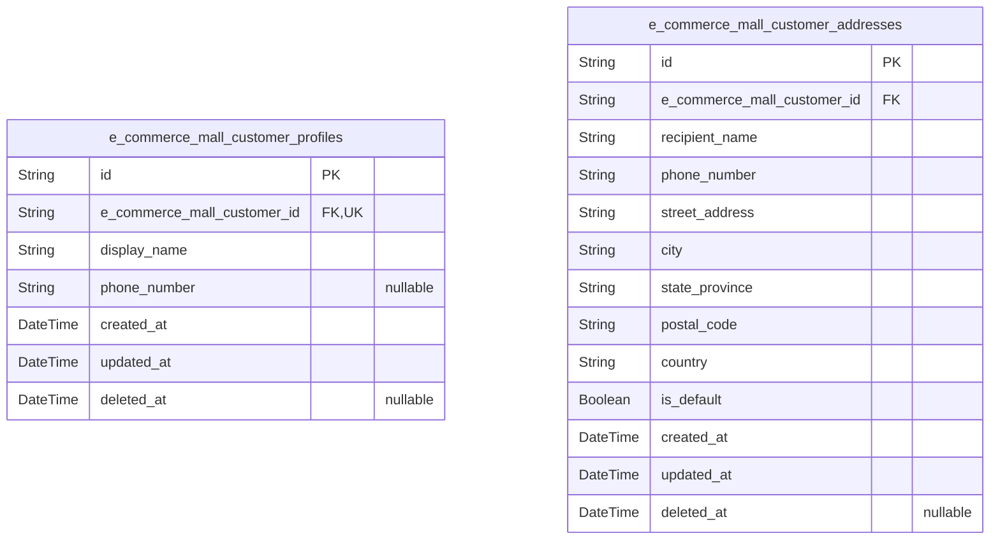
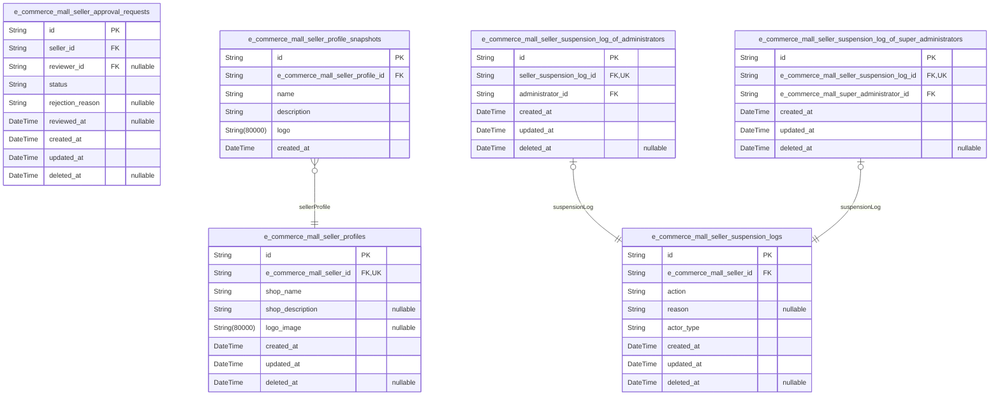
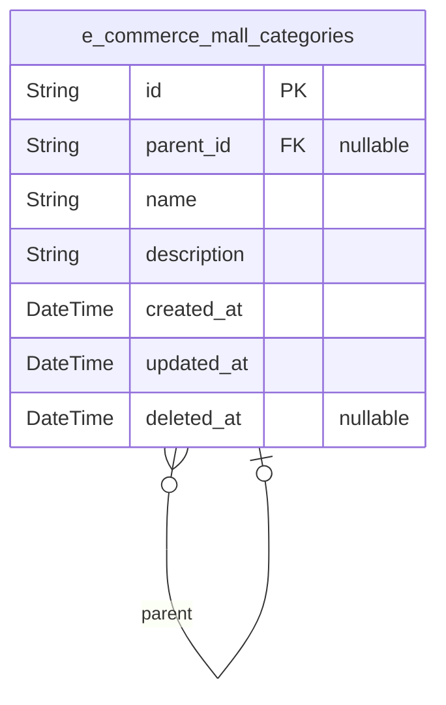
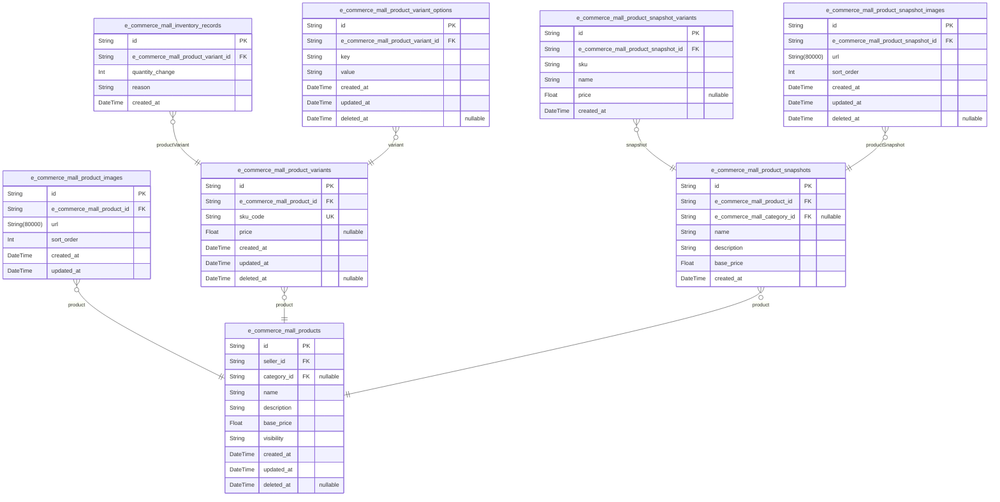
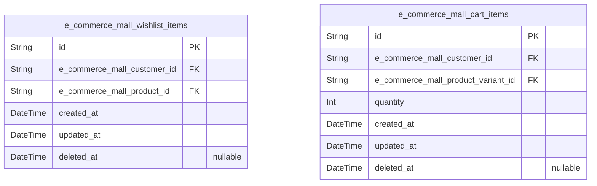
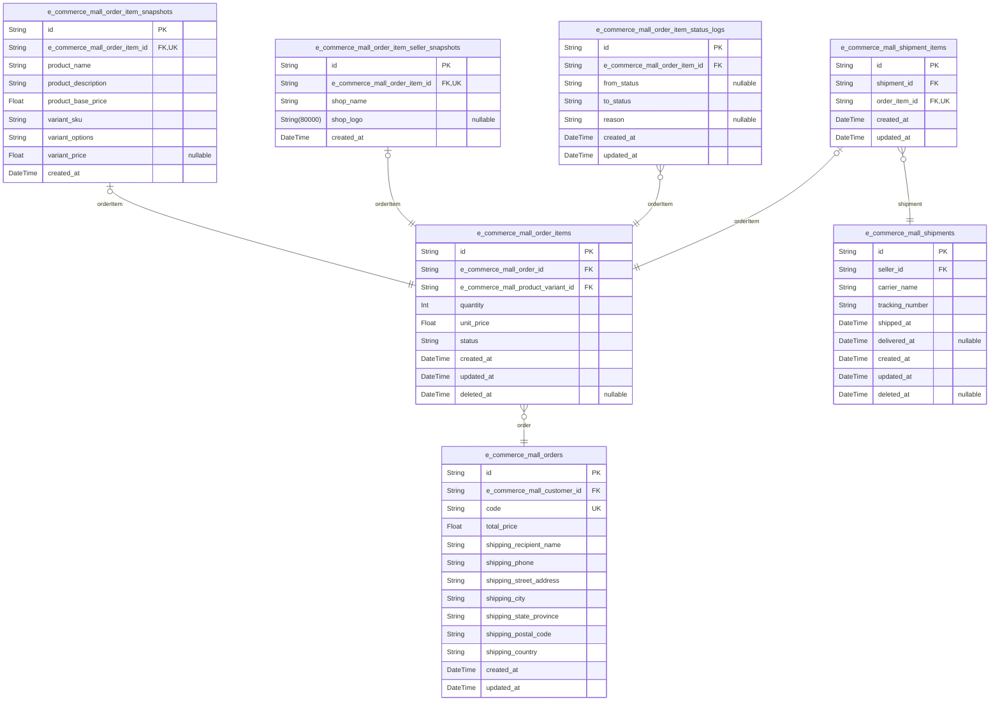
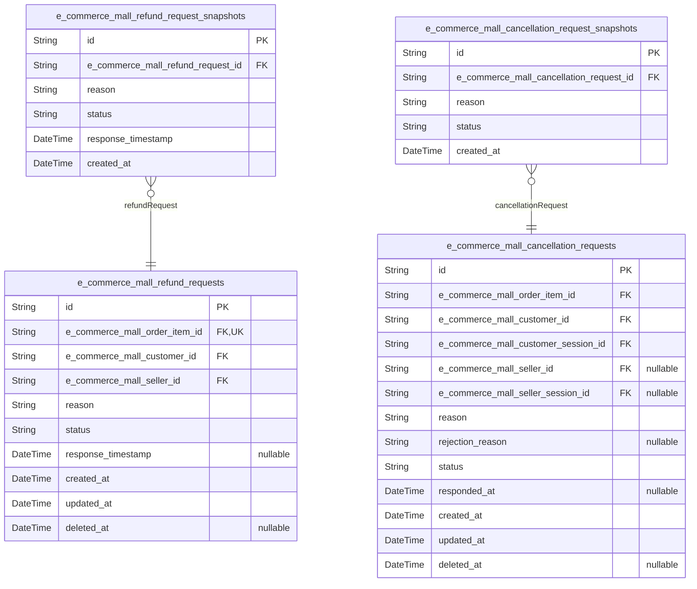
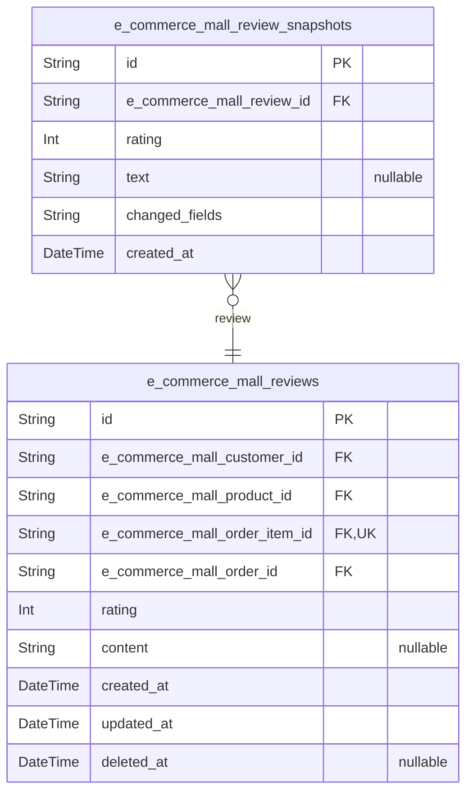
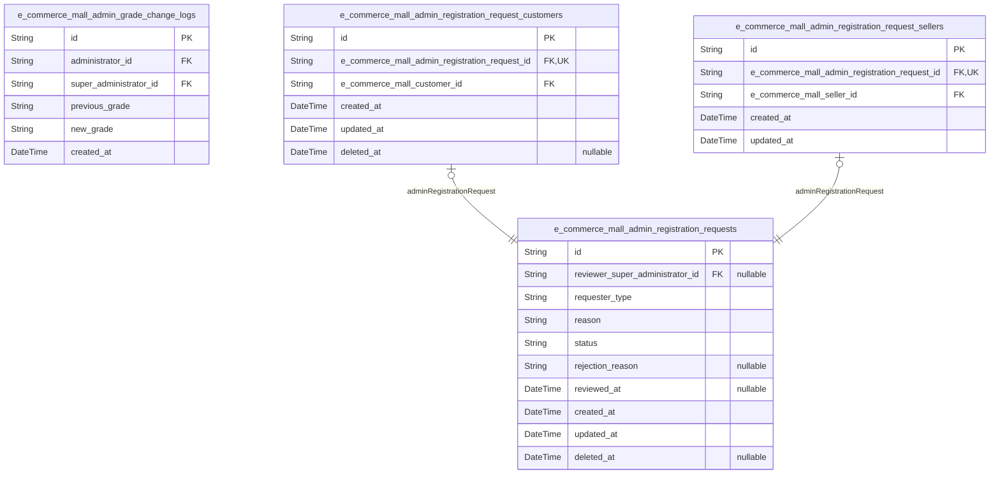

# Prisma Markdown

> Generated by [`prisma-markdown`](https://github.com/samchon/prisma-markdown)

- [actors](#actors)
- [customers](#customers)
- [sellers](#sellers)
- [categories](#categories)
- [products](#products)
- [wishlists_and_carts](#wishlists_and_carts)
- [orders](#orders)
- [cancellations_and_refunds](#cancellations_and_refunds)
- [reviews](#reviews)
- [administrators](#administrators)

## actors

```mermaid
erDiagram
"e_commerce_mall_guests" {
  String id PK
  String device_identifier UK
  DateTime created_at
  DateTime updated_at
  DateTime deleted_at "nullable"
}
"e_commerce_mall_guest_sessions" {
  String id PK
  String e_commerce_mall_guest_id FK
  String ip
  String href
  String referrer
  DateTime created_at
  DateTime expired_at
}
"e_commerce_mall_customers" {
  String id PK
  String email UK
  String password_hash
  DateTime created_at
  DateTime updated_at
  DateTime deleted_at "nullable"
  DateTime banned_at "nullable"
}
"e_commerce_mall_customer_sessions" {
  String id PK
  String e_commerce_mall_customer_id FK
  String ip
  String href
  String referrer
  DateTime created_at
  DateTime expired_at
}
"e_commerce_mall_customer_password_resets" {
  String id PK
  String e_commerce_mall_customer_id FK
  String code UK
  DateTime expired_at
  DateTime used_at "nullable"
  DateTime created_at
  DateTime updated_at
}
"e_commerce_mall_sellers" {
  String id PK
  String email UK
  String password_hash
  String approval_status
  DateTime created_at
  DateTime updated_at
  DateTime deleted_at "nullable"
}
"e_commerce_mall_seller_sessions" {
  String id PK
  String e_commerce_mall_seller_id FK
  String ip
  String href
  String referrer
  DateTime created_at
  DateTime expired_at
}
"e_commerce_mall_seller_password_resets" {
  String id PK
  String e_commerce_mall_seller_id FK
  String token_hash UK
  DateTime created_at
  DateTime updated_at
  DateTime expired_at
  DateTime used_at "nullable"
}
"e_commerce_mall_administrators" {
  String id PK
  String email UK
  String password_hash
  DateTime created_at
  DateTime updated_at
  DateTime deleted_at "nullable"
}
"e_commerce_mall_administrator_sessions" {
  String id PK
  String e_commerce_mall_administrator_id FK
  String ip
  String href
  String referrer
  DateTime created_at
  DateTime expired_at
}
"e_commerce_mall_administrator_password_resets" {
  String id PK
  String e_commerce_mall_administrator_id FK
  String code UK
  DateTime created_at
  DateTime updated_at
  DateTime expired_at
  DateTime used_at "nullable"
}
"e_commerce_mall_administrator_audit_logs" {
  String id PK
  String e_commerce_mall_administrator_id FK
  String action_type
  String target_type
  String target_id
  String reason "nullable"
  DateTime created_at
  DateTime updated_at
  DateTime deleted_at "nullable"
}
"e_commerce_mall_super_administrators" {
  String id PK
  String e_commerce_mall_administrator_id FK,UK
  String email UK
  String password_hash
  DateTime created_at
  DateTime updated_at
  DateTime deleted_at "nullable"
}
"e_commerce_mall_super_administrator_sessions" {
  String id PK
  String super_administrator_id FK
  String ip
  String href
  String referrer
  DateTime created_at
  DateTime expired_at
}
"e_commerce_mall_super_administrator_password_resets" {
  String id PK
  String e_commerce_mall_super_administrator_id FK
  String code UK
  DateTime expired_at
  DateTime used_at "nullable"
  DateTime created_at
  DateTime updated_at
  DateTime deleted_at "nullable"
}
"e_commerce_mall_super_administrator_audit_logs" {
  String id PK
  String e_commerce_mall_super_administrator_id FK
  String action
  String target_type
  String target_id
  String reason "nullable"
  DateTime created_at
}
"e_commerce_mall_guest_sessions" }o--|| "e_commerce_mall_guests" : guest
"e_commerce_mall_customer_sessions" }o--|| "e_commerce_mall_customers" : customer
"e_commerce_mall_customer_password_resets" }o--|| "e_commerce_mall_customers" : customer
"e_commerce_mall_seller_sessions" }o--|| "e_commerce_mall_sellers" : seller
"e_commerce_mall_seller_password_resets" }o--|| "e_commerce_mall_sellers" : seller
"e_commerce_mall_administrator_sessions" }o--|| "e_commerce_mall_administrators" : administrator
"e_commerce_mall_administrator_password_resets" }o--|| "e_commerce_mall_administrators" : administrator
"e_commerce_mall_administrator_audit_logs" }o--|| "e_commerce_mall_administrators" : administrator
"e_commerce_mall_super_administrators" |o--|| "e_commerce_mall_administrators" : administrator
"e_commerce_mall_super_administrator_sessions" }o--|| "e_commerce_mall_super_administrators" : superAdministrator
"e_commerce_mall_super_administrator_password_resets" }o--|| "e_commerce_mall_super_administrators" : superAdministrator
"e_commerce_mall_super_administrator_audit_logs" }o--|| "e_commerce_mall_super_administrators" : superAdministrator
```

### `e_commerce_mall_guests`

Temporary guest accounts identified by device or browser fingerprint for
unauthenticated access to the authentication boundary (login and
registration pages only).

Guests represent unauthenticated users who have not yet logged into the
platform. Per platform policy, they are restricted to the authentication
boundary — the only accessible pages are the login page and the sign-up
(registration) page. Guests have zero permissions across all domains
(products, categories, orders, reviews, addresses, cart, wishlist, seller
profiles, and administration).

Guest accounts are identified by device fingerprint rather than email and
password credentials. Upon successful authentication via login or
registration, the guest transitions to the authenticated actor role
([e_commerce_mall_customers](#e_commerce_mall_customers), [e_commerce_mall_sellers](#e_commerce_mall_sellers),
[e_commerce_mall_administrators](#e_commerce_mall_administrators), or {@link
e_commerce_mall_super_administrators}). Guest records serve as temporary
identities for session tracking, rate limiting, and CSRF protection on
auth-related pages only. Active guest records with no associated login
transition may be periodically cleaned up per data retention policy.

Properties as follows:

- `id`: Primary key for the guest account record.
- `device_identifier`
  > Unique device or browser fingerprint identifier used to recognize an
  > unauthenticated guest across visits to the authentication boundary (login
  > and registration pages). This identifier enables session continuity, rate
  > limiting, and CSRF protection for unauthenticated users. Each distinct
  > device or browser gets exactly one guest record. The value is collected
  > on the client side via fingerprinting techniques and transmitted to the
  > server on auth page requests.
- `created_at`
  > Timestamp when this guest account record was first created, typically on
  > the first page load of the login or registration page from an
  > unrecognized device.
- `updated_at`
  > Timestamp when this guest account record was last updated, typically on
  > subsequent visits from the same device within the guest lifetime window.
- `deleted_at`
  > Timestamp when this guest account was soft-deleted or expired for data
  > retention purposes. Null indicates the guest record is still active and
  > recognized. Soft-delete allows retaining guest data for analytics,
  > security auditing, and rate-limit history before permanent cleanup.

### `e_commerce_mall_guest_sessions`

Temporary session tokens for guest access with expiration tracking.

Guests are unauthenticated users who have not logged into the platform.
Each guest session is created when a guest accesses the authentication
boundary (login or registration pages) and tracks the guest's activity
context including IP address, current page URL, and referrer for security
monitoring and analytics.

Sessions are automatically invalidated upon guest-to-actor transition
(registration or login) or when the session expires. Expired sessions are
periodically cleaned up. This table works with {@link
e_commerce_mall_guests} to manage temporary guest identities.

Properties as follows:

- `id`: Primary Key.
- `e_commerce_mall_guest_id`
  > Foreign key to the [e_commerce_mall_guests](#e_commerce_mall_guests) table identifying the
  > guest user who owns this session.
  >
  > Each guest may have multiple concurrent sessions. When a guest
  > transitions to a registered actor (customer) via registration or login,
  > all their guest sessions are invalidated.
- `ip`
  > IP address of the guest at the time of session creation.
  >
  > Used for security monitoring, rate limiting, and audit purposes. Not
  > nullable as every HTTP request originates from an IP address.
- `href`
  > Full URL of the page the guest is currently accessing within the
  > authentication boundary.
  >
  > Captures the current page context for session tracking. Limited to login
  > and registration pages per the guest actor restrictions.
- `referrer`
  > HTTP Referrer header value indicating the previous page URL from which
  > the guest navigated.
  >
  > Used for analytics and navigation flow tracking within the authentication
  > boundary.
- `created_at`
  > Timestamp when the guest session was first created.
  >
  > Used for session age calculation, expiration enforcement, and session
  > lifecycle management.
- `expired_at`
  > Timestamp indicating when this session expires and becomes invalid.
  >
  > Set at session creation time. After expiration, the guest is required to
  > obtain a new session. Non-nullable for security reasons to ensure all
  > sessions have a definite expiration boundary.

### `e_commerce_mall_customers`

Registered customer accounts with email and password authentication
credentials.

This table represents customer identities on the platform. Each customer
signs up with a unique email address and password hash for secure
authentication. Customer accounts support standard auth flows including
registration, login, password changes, and account deletion. On account
deletion, the record is soft-deleted (deleted_at is set) to preserve
associated order history, reviews, and snapshots as required by business
policy.

Administrators can ban customer accounts by setting {@link
e_commerce_mall_customers.banned_at}, which revokes login access until
the ban is lifted.

[e_commerce_mall_customer_sessions](#e_commerce_mall_customer_sessions) tracks active login sessions
for each customer. [e_commerce_mall_customer_password_resets](#e_commerce_mall_customer_password_resets)
manages password recovery flows. {@link
e_commerce_mall_customer_profiles} stores the customer's display name and
phone number as a separate 1:1 entity. {@link
e_commerce_mall_customer_addresses} holds shipping addresses owned by the
customer.

Properties as follows:

- `id`: Primary Key.
- `email`
  > Unique email address used as the customer's login identifier and primary
  > contact method.
  >
  > Must be a valid email format. Used for authentication and order-related
  > communications. Cannot be changed once set.
- `password_hash`
  > Bcrypt hash of the customer's password for secure authentication.
  >
  > Never stored in plain text. Used to verify login credentials against
  > provided passwords.
- `created_at`
  > Timestamp when the customer account was created.
  >
  > Automatically set on record creation. Used for account age tracking and
  > sort ordering.
- `updated_at`
  > Timestamp when the customer account was last modified.
  >
  > Updated automatically on any field change such as password changes.
  > Enables change tracking and concurrency awareness.
- `deleted_at`
  > Soft-delete timestamp indicating when the customer deleted their account.
  >
  > When set, the customer cannot log in. Associated orders, reviews, and
  > snapshots are preserved per business requirements. The customer's profile
  > data is deleted, but order history retains references to this record for
  > historical integrity.
- `banned_at`
  > Timestamp indicating when an administrator banned this customer account.
  >
  > When set, the customer's login access is revoked. The account remains in
  > the system with all associated data preserved. An administrator can lift
  > the ban by setting this field back to null.

### `e_commerce_mall_customer_sessions`

Customer login session tracking table that records each authenticated
session's metadata and expiration.

Each session belongs to exactly one [e_commerce_mall_customers](#e_commerce_mall_customers) and
captures the IP address, page URL (href), and HTTP referrer at the time
of authentication. Sessions have a defined expiration time after which
they are no longer valid, enforcing security through mandatory session
expiry. This table serves as an append-only audit trail for customer
authentication events, managed through auth flows rather than direct CRUD
operations.

Properties as follows:

- `id`: Primary Key.
- `e_commerce_mall_customer_id`
  > Foreign key to the customer who owns this session.
  >
  > References [e_commerce_mall_customers.id](#e_commerce_mall_customers). Each session belongs to
  > exactly one customer, and a customer may have multiple concurrent
  > sessions across different devices or browsers, establishing a one-to-many
  > relationship.
- `ip`
  > IP address of the client device at the time of session creation.
  >
  > Captured for security auditing and suspicious activity detection. Stored
  > as a string to support both IPv4 and IPv6 address formats.
- `href`
  > The full URL (href) of the page from which the customer authenticated.
  >
  > Captures the entry point for the session, useful for understanding
  > customer navigation patterns and troubleshooting authentication issues.
- `referrer`
  > HTTP Referrer header value captured at the time of session creation.
  >
  > Indicates the previous page the customer visited before the
  > authentication page, useful for traffic source analysis and security
  > auditing.
- `created_at`
  > Timestamp when this session was created and the customer authenticated.
  >
  > Set automatically at session creation time. Used for session lifecycle
  > management and audit trail purposes.
- `expired_at`
  > Timestamp after which this session is no longer valid.
  >
  > Mandatory expiration enforced by default. Once expired, the session
  > cannot be used for authenticated access and the customer must
  > re-authenticate.

### `e_commerce_mall_customer_password_resets`

Stores password reset tokens issued to customers for account recovery via
email-based reset flow.

Each record represents one reset request initiated by a customer who has
forgotten their password. The token value is stored as a cryptographic
hash - the plain token is only delivered through the reset email or link.
Tokens have a configurable expiration duration and can only be used once.
Once consumed or expired, the token becomes invalid for subsequent use,
preventing replay attacks.

References [e_commerce_mall_customers](#e_commerce_mall_customers) to associate each reset
request with the customer account.

Properties as follows:

- `id`: Primary key.
- `e_commerce_mall_customer_id`
  > The customer who requested this password reset token.
  >
  > References the [e_commerce_mall_customers](#e_commerce_mall_customers) table to associate each
  > reset request with a specific customer account. A customer can have
  > multiple reset tokens over time, but typically only the most recent
  > unexpired and unused token is valid for password reset.
- `code`
  > The hashed password reset token value used to verify reset requests.
  >
  > Stored as a cryptographic hash for security. The plain token value is
  > delivered to the customer via email or link and is never stored in the
  > database. During password reset, the provided plain token is hashed and
  > compared against this value for verification.
- `expired_at`
  > Timestamp after which this reset token is no longer valid.
  >
  > Tokens expire after a configurable duration from creation as a security
  > measure to limit the window of vulnerability. Expired tokens cannot be
  > used to reset passwords regardless of whether they have been consumed.
- `used_at`
  > Timestamp when this token was successfully used to reset the password.
  >
  > Once a token is used, it becomes invalid for subsequent use regardless of
  > whether it has expired. Null indicates the token has not been consumed
  > yet. This prevents replay attacks where an intercepted token could be
  > reused.
- `created_at`: Timestamp when this password reset token was created.
- `updated_at`: Timestamp when this record was last updated.

### `e_commerce_mall_sellers`

Registered seller accounts with email and password authentication
credentials and current approval status.

Each seller actor represents a user who operates a shop on the platform.
Sellers authenticate using their email and password. Upon registration, a
seller account is assigned an approval status of "pending" and must be
approved by an administrator before accessing any selling features.

The seller's current approval status is stored directly on this table for
efficient access. The full approval request lifecycle — including
rejection reasons and reviewer references — is tracked in the {@link
e_commerce_mall_seller_approval_requests} table.

When a seller deletes their account, the record is soft-deleted
(deleted_at is set) rather than physically removed, preserving order
history, snapshots, and other related records as required by platform
policy and legal retention requirements.

Properties as follows:

- `id`: Primary Key.
- `email`
  > Email address used as the unique login identifier for the seller account.
  >
  > Used for authentication during login and as the primary contact email for
  > order-related communications. Must be unique across all seller accounts
  > to prevent duplicate registrations.
- `password_hash`
  > Bcrypt hash of the seller's password for secure authentication.
  >
  > Never stored in plaintext. Used to verify the seller's identity during
  > login and password change flows.
- `approval_status`
  > Current approval status of the seller account.
  >
  > Possible values are "pending" (awaiting administrator review upon initial
  > registration or resubmission after rejection), "approved" (registration
  > accepted, seller can use all selling features), and "rejected"
  > (registration declined). Default is "pending" upon initial registration.
- `created_at`: Timestamp when the seller account was created.
- `updated_at`
  > Timestamp when the seller account was last updated, including approval
  > status changes, password changes, and profile edits.
- `deleted_at`
  > Timestamp when the seller account was soft-deleted.
  >
  > Null indicates the account is active. When a seller deletes their
  > account, this field is set to the deletion timestamp rather than
  > physically removing the record. This preserves order history, product
  > snapshots, customer reviews, and other related records as required by
  > platform policy and legal retention requirements.

### `e_commerce_mall_seller_sessions`

JWT session tokens with access and refresh token support for seller
authentication.

Each record represents an active login session for a {@link
e_commerce_mall_sellers} actor. Sessions are created upon successful
authentication via email and password. Per platform requirements, a
session persists across pages and actions until explicit logout, seller
account deletion, or administrator action. Suspended sellers can still
log in with restricted access (suspension does not invalidate sessions),
while banned sellers cannot log in.

Session fields capture the IP address, current page URL (href), and HTTP
referrer at login time for security auditing and geographic analysis of
login origins. Expiration is enforced via the `expired_at` timestamp;
sessions beyond this timestamp are treated as invalid for authentication
purposes. The composite index on (seller_id, created_at) optimizes
queries for listing a seller's active sessions sorted by newest first.

Properties as follows:

- `id`: Primary Key.
- `e_commerce_mall_seller_id`
  > Foreign key to the [e_commerce_mall_sellers](#e_commerce_mall_sellers) actor that owns this
  > session.
  >
  > Each session belongs to exactly one seller. On seller account deletion,
  > associated sessions are invalidated per the account lifecycle. Suspended
  > sellers retain valid sessions per requirements — suspension does not
  > invalidate existing sessions or prevent new login.
- `ip`
  > IP address of the seller at the time of login.
  >
  > Captured from the HTTP request source IP for security auditing, anomaly
  > detection, and geographic analysis of login locations.
- `href`
  > Current page URL (href) at the time the session was created.
  >
  > Records the page the seller was on during login, useful for post-login
  > redirect tracking and session audit trails.
- `referrer`
  > HTTP referrer header value captured at session creation.
  >
  > Indicates the originating page from which the seller navigated to the
  > login page. Used for analytics, marketing attribution, and security
  > monitoring.
- `created_at`
  > Timestamp when this session was created.
  >
  > Set at login time. Used as the session start time for duration
  > calculations and session listing sorted by newest first.
- `expired_at`
  > Timestamp when this session expires and becomes invalid.
  >
  > Non-nullable by default for security. After this timestamp, the session
  > is considered invalid and the seller must re-authenticate. The duration
  > is determined by the system's session TTL policy. Expired sessions are
  > retained for audit purposes but excluded from authentication checks.

### `e_commerce_mall_seller_password_resets`

Password reset tokens with expiration for seller account recovery.

Each seller can request multiple password resets over time. When a seller
requests a password reset, a token is generated and its hash is stored
securely. The token is valid until its expiration time or until it is
used. Once used, the `used_at` timestamp records when the password was
actually changed. Expired or used tokens cannot be used to reset
passwords.

Only the most recent valid (unused and unexpired) token should be
considered active for each seller to prevent replay attacks.

[e_commerce_mall_sellers](#e_commerce_mall_sellers) owns these reset tokens.

Properties as follows:

- `id`: Primary Key.
- `e_commerce_mall_seller_id`
  > Foreign key to the [e_commerce_mall_sellers](#e_commerce_mall_sellers) table. Identifies the
  > seller who requested this password reset.
  >
  > A seller can have multiple password reset requests over time, but only
  > one valid (unused and unexpired) token should be active at any given time
  > for security.
- `token_hash`
  > SHA-256 hash of the password reset token sent to the seller's email.
  > Never stores the raw token for security. Used to validate reset requests
  > by comparing the hash of the submitted token against this stored value.
- `created_at`
  > Timestamp when this password reset token was created and the reset email
  > was sent to the seller.
- `updated_at`
  > Timestamp when this password reset record was last updated. Updated when
  > the token is consumed (used_at is set) or when other mutable state
  > changes.
- `expired_at`
  > Timestamp after which this reset token expires and can no longer be used.
  > Typically set to a short duration (e.g., 1 hour) after creation for
  > security purposes.
- `used_at`
  > Timestamp when this reset token was actually used to change the seller's
  > password. Null if the token has not been used yet. Once set, the token is
  > considered consumed and cannot be reused.

### `e_commerce_mall_administrators`

Registered administrator accounts with platform oversight privileges for
managing categories, sellers, and orders.

Administrators authenticate using email and password credentials to
access the administrative dashboard. Administrator accounts are distinct
from customer and seller accounts and represent the platform's governance
role.

Administrators manage seller registrations (approval, rejection, and
suspension), product categories (creation, editing, and deletion),
product oversight (viewing all products and deleting policy-violating
products), order oversight (force-cancellation and force-refund of
items), and user management (banning and unbanning customers and
sellers).

Administrator grades include regular and super administrator. Super
administrator accounts are managed in {@link
e_commerce_mall_super_administrators}. Grade promotions and demotions are
tracked in [e_commerce_mall_admin_grade_change_logs](#e_commerce_mall_admin_grade_change_logs). Session
persistence is handled in [e_commerce_mall_administrator_sessions](#e_commerce_mall_administrator_sessions).

Properties as follows:

- `id`: Primary Key.
- `email`
  > Unique email address used as the login identifier for administrator
  > authentication. Must be a valid email format and is used for
  > credential-based login.
- `password_hash`
  > Hashed password credential stored securely using a strong hashing
  > algorithm (e.g., bcrypt) for administrator authentication. Never stores
  > the plain-text password.
- `created_at`: Timestamp when the administrator account was created.
- `updated_at`
  > Timestamp when the administrator account was last updated, reflecting the
  > most recent modification to any account field.
- `deleted_at`
  > Timestamp when the administrator account was soft-deleted. Null indicates
  > the account is active. Soft deletion preserves data integrity for audit
  > trails and historical records.

### `e_commerce_mall_administrator_sessions`

JWT session tokens with access and refresh token support for
administrator authentication.

An administrator session is created upon successful authentication and
persists until the administrator logs out, their account is banned, or
their account is deleted. Each session records the IP address, request
URL, and referrer at the time of creation. Sessions have an expiration
time for security purposes. Administrators may have multiple active
sessions across different devices or browsers.

Properties as follows:

- `id`: Primary Key.
- `e_commerce_mall_administrator_id`
  > Foreign key referencing the [e_commerce_mall_administrators](#e_commerce_mall_administrators) who
  > owns this session.
  >
  > Each session belongs to exactly one administrator. An administrator may
  > have multiple active sessions simultaneously across different devices or
  > browsers.
- `ip`: The IP address of the client device at the time of session creation.
- `href`
  > The URL visited by the administrator when the session was created, used
  > for session audit trails.
- `referrer`
  > The referrer URL from which the administrator navigated to the platform,
  > recorded for security audit purposes.
- `created_at`: Timestamp when the session was created upon successful authentication.
- `expired_at`
  > Timestamp when the session expires. Sessions are invalidated after this
  > time for security purposes, requiring re-authentication.

### `e_commerce_mall_administrator_password_resets`

Password reset tokens for administrator account recovery.

Each record represents a time-limited password reset request initiated by
an administrator who has forgotten their password. Tokens are linked to
the [e_commerce_mall_administrators](#e_commerce_mall_administrators) actor who requested the reset
and include a unique reset code with expiration timestamp. Once a token
is used to successfully reset the password, the `used_at` timestamp is
recorded. Expired or used tokens are ignored during validation, and
administrators may have multiple reset tokens over time — old tokens
remain in the database as an audit trail but are functionally invalid.

Properties as follows:

- `id`: Primary key of the password reset token record.
- `e_commerce_mall_administrator_id`
  > Foreign key to the [e_commerce_mall_administrators](#e_commerce_mall_administrators) actor who
  > requested this password reset.
  >
  > Links the reset token to the administrator account that initiated the
  > password recovery process. An administrator can have multiple password
  > reset tokens over time as old tokens expire and new ones are requested,
  > forming a 1:N relationship.
- `code`
  > Unique password reset token code.
  >
  > A cryptographically random string generated at creation time and sent to
  > the administrator's registered email. This code is used to verify the
  > identity of the person requesting the password reset. Must be unique
  > across all reset tokens to prevent replay attacks and token collision.
- `created_at`
  > Timestamp when this password reset token was created.
  >
  > Set at the moment the reset request is initiated and the token is
  > generated.
- `updated_at`
  > Timestamp when this password reset token was last modified.
  >
  > Updated when the token is marked as used (`used_at` is set).
- `expired_at`
  > Expiration timestamp for this password reset token.
  >
  > After this time, the token is no longer valid for password reset
  > operations. Standard expiration window is typically 1-24 hours from
  > creation. Expired tokens are stored in the database for audit purposes
  > but are ignored during validation.
- `used_at`
  > Timestamp when this password reset token was consumed.
  >
  > Set when the token is successfully used to reset the administrator's
  > password. Null indicates the token has not been used yet (still valid if
  > within expiration window). Once set, the token cannot be reused.

### `e_commerce_mall_administrator_audit_logs`

Immutable append-only audit trail recording actions performed by regular
administrators on the platform.

Each record captures which administrator performed what action ({@link
e_commerce_mall_administrators}), on which target entity (target_type and
target_id), and optionally the reason provided. This provides a complete,
tamper-evident history of administrative actions for accountability and
dispute resolution purposes.

Actions recorded include force-cancelling and force-refunding order
items, banning/unbanning customers, suspending/unsuspending sellers,
approving/rejecting seller registrations, deleting products for policy
violations, and creating/editing/deleting categories. The log is
append-only — records are never modified or deleted after creation.

Properties as follows:

- `id`: Primary Key.
- `e_commerce_mall_administrator_id`
  > Foreign key to [e_commerce_mall_administrators](#e_commerce_mall_administrators) identifying which
  > administrator performed the action.
  >
  > Establishes the relationship between each audit log entry and the
  > administrator account that executed the action. The administrator's
  > identity is captured at the time of the action via this reference for
  > accountability purposes.
- `action_type`
  > The type of administrative action performed.
  >
  > Examples include: force_cancel_order_item (forcibly cancelling a paid
  > order item), force_refund_order_item (forcibly refunding a delivered
  > order item), ban_customer, unban_customer, suspend_seller,
  > unsuspend_seller, approve_seller (approving a seller registration),
  > reject_seller (rejecting a seller registration), delete_product (removing
  > a product for policy violations), create_category, edit_category, and
  > delete_category.
- `target_type`
  > The type of entity that was the target of this administrative action.
  >
  > Examples include: order_item, customer, seller, product, category,
  > seller_approval_request, and admin_registration_request. This field
  > enables entity-scoped queries of audit history.
- `target_id`
  > The UUID identifier of the specific entity that this action was performed
  > on.
  >
  > Stores the ID of the affected entity (e.g., order_item_id, customer_id,
  > seller_id, product_id, or category_id), enabling cross-referencing with
  > the affected record for audit trail completeness.
- `reason`
  > Optional textual explanation provided by the administrator for why this
  > action was taken.
  >
  > Required for certain actions such as seller registration rejections and
  > customer bans to provide transparency and justification for the
  > administrative decision. May be null for self-explanatory actions.
- `created_at`
  > Timestamp indicating when this audit log entry was created.
  >
  > Represents the exact moment the administrator action was performed and
  > recorded in the audit trail.
- `updated_at`
  > Timestamp of the last update to this audit log entry.
  >
  > While audit logs are append-only and immutable in practice, this field
  > follows the standard temporal field convention consistently across all
  > platform entities.
- `deleted_at`
  > Timestamp indicating when this audit log entry was soft-deleted, if
  > applicable.
  >
  > Audit logs are generally never deleted in practice, but this field
  > follows the standard temporal field convention for consistency across all
  > platform entities.

### `e_commerce_mall_super_administrators`

Super administrator accounts with elevated privileges for approving admin
registration requests and managing administrator roles.

Super administrators are the highest-privilege actors on the platform.
They are promoted from existing [e_commerce_mall_administrators](#e_commerce_mall_administrators) by
other super administrators and retain all regular administrator
capabilities (seller management, category management, product oversight,
order oversight, user management) plus exclusive authority over the
administrator hierarchy. Each super administrator has a 1:1 relationship
with the regular administrator account from which they were promoted.

Super administrators authenticate using an email address and password
combination. The no-self-demotion rule ensures governance accountability:
a super administrator cannot demote themselves and must request demotion
from another super administrator, preventing unilateral abandonment of
oversight responsibilities.

Properties as follows:

- `id`: Primary Key.
- `e_commerce_mall_administrator_id`
  > Foreign key referencing the [e_commerce_mall_administrators](#e_commerce_mall_administrators)
  > account from which this super administrator was promoted.
  >
  > This 1:1 relationship ensures that every super administrator has a
  > corresponding regular administrator identity, maintaining the governance
  > chain where super administrators start as regular administrators before
  > receiving elevated privileges. A super administrator cannot exist without
  > a corresponding administrator record.
- `email`
  > Super administrator login email address. Must be unique across all super
  > administrator accounts and used as the authentication identifier along
  > with the password hash. This is distinct from the underlying
  > administrator's email to allow separate credentials at the super
  > administrator level.
- `password_hash`
  > Hashed password for super administrator authentication. Stored securely
  > using a strong hashing algorithm and never exposed in API responses or
  > logs. Used in combination with the email field for credential-based
  > login.
- `created_at`
  > Timestamp when the super administrator account was created, corresponding
  > to when the administrator was promoted to super administrator status by
  > an existing super administrator.
- `updated_at`
  > Timestamp when the super administrator account was last updated, tracking
  > modifications such as password changes or profile updates.
- `deleted_at`
  > Timestamp when the super administrator account was soft-deleted. Null
  > indicates the account is active. Soft deletion preserves audit trail
  > integrity for historical governance records, such as past promotions,
  > demotions, and administrator requests that involved this super
  > administrator.

### `e_commerce_mall_super_administrator_sessions`

JWT session tokens with access and refresh token support for super
administrator authentication.

Each record represents a login session for a {@link
e_commerce_mall_super_administrators}. Sessions track the client IP
address, the request origin (href), the HTTP referrer, and have a
mandatory expiration time for security. Sessions are append-only audit
records — they are never deleted, only allowed to expire naturally.

Properties as follows:

- `id`: Primary Key.
- `super_administrator_id`
  > Foreign key to the [e_commerce_mall_super_administrators](#e_commerce_mall_super_administrators) actor
  > table.
  >
  > Identifies which super administrator this session belongs to. Each super
  > administrator can have multiple concurrent active sessions.
- `ip`
  > Client IP address at the time of session creation.
  >
  > Used for security auditing and identifying the origin of authenticated
  > requests.
- `href`
  > The full request URL (href) from which the session was initiated.
  >
  > Captured for audit trail purposes to track the origin of login requests.
- `referrer`
  > HTTP Referer header value at the time of session creation.
  >
  > Captured for audit trail and analytics purposes to track how users reach
  > the login page.
- `created_at`: Timestamp when the session was created (login time).
- `expired_at`
  > Timestamp when the session expires and becomes invalid.
  >
  > Sessions have a mandatory expiration time for security purposes. Expired
  > sessions are no longer accepted for authentication but are preserved in
  > the database for audit trail completeness.

### `e_commerce_mall_super_administrator_password_resets`

Password reset tokens for super administrator account recovery.

Each record represents a password reset request initiated for a super
administrator. When a super administrator requests a password reset
(forgot password flow), a unique token is generated and stored with an
expiration time. The token is used to verify the reset request before
allowing the password update. This table follows the same pattern as
other actor password reset tables in the system.

Tokens have a mandatory security expiration (`{@link
e_commerce_mall_super_administrator_password_resets.expired_at}`) after
which they can no longer be used. Once a token is successfully consumed
for a password change, `{@link
e_commerce_mall_super_administrator_password_resets.used_at}` is recorded
to prevent token reuse. Soft deletion (`{@link
e_commerce_mall_super_administrator_password_resets.deleted_at}`) is
supported for administrative cleanup and data retention compliance.

Properties as follows:

- `id`: Primary Key.
- `e_commerce_mall_super_administrator_id`
  > Foreign key to the super administrator who requested this password reset.
  >
  > Each reset token belongs to exactly one super administrator. A super
  > administrator can have multiple password reset tokens over time, forming
  > a 1:N relationship where the super administrator is the parent and
  > password reset records are the children.
- `code`
  > Unique password reset token string used for verification.
  >
  > This is a securely generated random token that authenticates the password
  > reset request. The token is included in the password reset link sent to
  > the super administrator's email. Tokens must be unique across all records
  > to prevent collision and must be validated against expiration before
  > allowing password update.
- `expired_at`
  > Timestamp when this password reset token expires and becomes invalid.
  >
  > Reset tokens have a limited validity period for security purposes. Once
  > `[e_commerce_mall_super_administrator_password_resets.expired_at](#e_commerce_mall_super_administrator_password_resets)`
  > has passed, the token can no longer be used to change the password. This
  > expiration helps mitigate the risk of token interception or prolonged
  > exposure.
- `used_at`
  > Timestamp when this password reset token was successfully consumed to
  > change the password.
  >
  > When a super administrator successfully completes a password reset using
  > this token, the `{@link
  > e_commerce_mall_super_administrator_password_resets.used_at}` field
  > records the moment of consumption. An unused token has a null value. Once
  > set, the token cannot be reused for another password reset, preventing
  > replay attacks.
- `created_at`
  > Timestamp when this password reset token record was created.
  >
  > Records when the super administrator requested the password reset and the
  > token was generated and stored.
- `updated_at`
  > Timestamp when this password reset token record was last modified.
  >
  > Tracks updates to the record, such as when `{@link
  > e_commerce_mall_super_administrator_password_resets.used_at}` is set upon
  > successful token consumption. Also updated on soft deletion.
- `deleted_at`
  > Timestamp when this password reset token was soft-deleted.
  >
  > Soft deletion allows administrative cleanup while preserving the audit
  > trail. A non-null value indicates the record has been logically deleted.
  > Expired or consumed tokens may be soft-deleted during cleanup operations.

### `e_commerce_mall_super_administrator_audit_logs`

Immutable audit trail recording all actions performed by super
administrators.

Each record captures a single action executed by a {@link
e_commerce_mall_super_administrator}, including the action type, the
target entity details, and the reason provided. This log covers both
super-administrator-exclusive actions (admin promotions and demotions per
Section 30) and all regular administrator actions (seller management,
category management, product oversight, order oversight, and user
management per Section 31) that super administrators perform by virtue of
retaining regular administrator powers.

The polymorphic target pattern using target_type and target_id allows
this single table to reference any entity on the platform, including
[e_commerce_mall_administrators](#e_commerce_mall_administrators), [e_commerce_mall_sellers](#e_commerce_mall_sellers),
[e_commerce_mall_customers](#e_commerce_mall_customers), [e_commerce_mall_products](#e_commerce_mall_products), and
[e_commerce_mall_orders](#e_commerce_mall_orders).

Properties as follows:

- `id`: Primary Key.
- `e_commerce_mall_super_administrator_id`
  > The super administrator who performed the logged action.
  >
  > References the [e_commerce_mall_super_administrators](#e_commerce_mall_super_administrators) actor account
  > that executed the action. This establishes the chain of accountability
  > for all governance actions on the platform, including admin promotions,
  > demotions, and all retained regular administrator powers.
- `action`
  > The type of action performed by the super administrator.
  >
  > Examples include 'admin_promotion', 'admin_demotion',
  > 'admin_request_approval', 'admin_request_rejection', 'seller_approval',
  > 'seller_rejection', 'seller_suspension', 'seller_unsuspension',
  > 'customer_ban', 'customer_unban', 'seller_ban', 'force_cancel',
  > 'force_refund', 'product_deletion', 'category_creation',
  > 'category_edition', 'category_deletion'.
- `target_type`
  > The entity type of the target affected by the action.
  >
  > Polymorphic discriminator used alongside target_id to reference any
  > platform entity. Possible values include 'administrator', 'seller',
  > 'customer', 'product', 'order', 'category', and
  > 'admin_registration_request'.
- `target_id`
  > The unique identifier of the target entity affected by the action.
  >
  > Used together with target_type to polymorphically reference any entity on
  > the platform. For example, if target_type is 'administrator', this is the
  > ID of the [e_commerce_mall_administrators](#e_commerce_mall_administrators) record that was promoted
  > or demoted.
- `reason`
  > The reason provided by the super administrator for performing the action.
  >
  > Optional human-readable explanation capturing the rationale behind
  > governance decisions. This is particularly relevant for actions such as
  > admin request rejections, seller suspensions, customer bans, and product
  > deletions where justification is required for accountability.
- `created_at`
  > Timestamp when this audit log entry was created, recording when the super
  > administrator performed the action.
  >
  > This is the only temporal field as audit log entries are immutable and
  > never updated or deleted.

## customers

### `e_commerce_mall_customer_profiles`

Customer profile information including display name for public visibility
on reviews and phone number for order-related communication.

Each customer has exactly one profile record, forming a 1:1 relationship
with [e_commerce_mall_customers](#e_commerce_mall_customers). The display name is the name
shown publicly on product reviews, allowing customers to be recognized
without revealing their email address. The phone number is a contact
number stored for order-related communication such as delivery
coordination.

Both attributes are editable by the customer. When a customer deletes
their account, their profile information is deleted per the data
retention policy. The [e_commerce_mall_reviews](#e_commerce_mall_reviews) entity handles
anonymization of review authorship separately, not through this profile
table.

Properties as follows:

- `id`: Primary Key.
- `e_commerce_mall_customer_id`
  > Foreign key referencing the [e_commerce_mall_customers](#e_commerce_mall_customers) actor
  > table. Establishes a 1:1 relationship where each customer has exactly one
  > profile and each profile belongs to exactly one customer. This FK is
  > unique to enforce the 1:1 constraint.
- `display_name`
  > The customer's publicly visible name displayed on product reviews and
  > other public-facing areas. Allows customers to be recognized by other
  > users without revealing their email address. Must be provided for every
  > customer profile.
- `phone_number`
  > Contact phone number for order-related communication such as delivery
  > coordination by shipping carriers. Optional field that can be left empty
  > or updated by the customer.
- `created_at`
  > Timestamp when this profile was initially created, set at the time of
  > customer registration.
- `updated_at`
  > Timestamp of the most recent update to any profile field (display name or
  > phone number). Updated automatically on each modification.
- `deleted_at`
  > Timestamp of soft deletion. When a customer deletes their account, their
  > profile information is soft-deleted (fields are cleared or marked as
  > deleted) rather than hard-deleted. This preserves referential integrity
  > with historical records. Null when the profile is active.

### `e_commerce_mall_customer_addresses`

Customer shipping addresses for order delivery.

Each address belongs to a single [e_commerce_mall_customers](#e_commerce_mall_customers) and
contains full recipient and location details: recipient name, phone
number, street address, city, state/province, postal code, and country. A
customer may have multiple addresses, but only one address can be marked
as the default shipping address at any time (enforced at the application
layer).

When a customer places an order, the selected shipping address is
captured at the time of checkout and preserved as part of the order
record. Addresses support soft deletion via `deleted_at` to maintain
referential integrity with historical orders while allowing customers to
manage their active address list.

Properties as follows:

- `id`: Primary key for the customer address record.
- `e_commerce_mall_customer_id`
  > Foreign key to the [e_commerce_mall_customers](#e_commerce_mall_customers) who owns this
  > address.
  >
  > Establishes the parent-child relationship where a customer can have
  > multiple shipping addresses. This field is required and immutable after
  > creation.
- `recipient_name`
  > Full name of the recipient for this shipping address.
  >
  > This is the person who will receive the delivery at this address. It may
  > differ from the customer's display name.
- `phone_number`
  > Contact phone number for the recipient at this address.
  >
  > Used by delivery carriers to contact the recipient for successful
  > delivery coordination.
- `street_address`
  > Street-level address including building name, apartment/unit number, and
  > street name.
  >
  > This is the primary location line for delivery routing.
- `city`: City or municipality name for this shipping address.
- `state_province`: State, province, or region name for this shipping address.
- `postal_code`
  > Postal or ZIP code for this shipping address used by postal services for
  > delivery routing.
- `country`: Country name for this shipping address.
- `is_default`
  > Flag indicating whether this address is the customer's default shipping
  > address.
  >
  > Only one address per customer can be the default at any given time. This
  > constraint is enforced at the application layer. When a customer checks
  > out, the default address is pre-selected as the shipping destination if
  > no other address is explicitly chosen.
- `created_at`: Timestamp when this address record was created.
- `updated_at`: Timestamp when this address record was last updated.
- `deleted_at`
  > Timestamp when this address was soft-deleted.
  >
  > When non-null, the address is considered deleted and should not appear in
  > active address listings. Historical orders that used this address retain
  > the data via their own snapshots.

## sellers

### `e_commerce_mall_seller_profiles`

Shop profile information for each seller including shop name,
description, and logo image.

Each [e_commerce_mall_sellers](#e_commerce_mall_sellers) account has exactly one profile
record that defines their public-facing merchant identity. The shop name
appears alongside products in search results, category listings, and
product detail pages. The shop description and logo are displayed on the
seller's public profile page for customers to view.

Edits to this profile are preserved as immutable snapshots in {@link
e_commerce_mall_seller_profile_snapshots} for audit and dispute
resolution. When a seller deletes their account, this profile is
soft-deleted (deleted_at is set) but the data is retained so the shop
name and seller identity remain visible in past order snapshots for
historical and legal purposes.

Properties as follows:

- `id`: Primary Key.
- `e_commerce_mall_seller_id`
  > Foreign key to the [e_commerce_mall_sellers](#e_commerce_mall_sellers) table.
  >
  > Establishes the 1:1 relationship between a seller's authentication record
  > and their shop profile. Each seller has exactly one profile, enforced by
  > the unique constraint. This field is required — every seller must have a
  > profile upon approval.
- `shop_name`
  > The public-facing brand name of the seller's store.
  >
  > This name appears alongside products in search results, category
  > listings, product detail pages, and is preserved in order history
  > snapshots even after the seller's account is deleted.
- `shop_description`
  > A textual description of the seller's business displayed on the seller's
  > public profile page for customers to read when learning about the
  > merchant.
- `logo_image`
  > URI of the image representing the seller's brand.
  >
  > Displayed on the seller's public profile alongside the shop name and
  > description.
- `created_at`: Timestamp when this profile was first created.
- `updated_at`: Timestamp when this profile was last updated.
- `deleted_at`
  > Timestamp when the seller's account was deleted.
  >
  > When set, the profile is considered soft-deleted. The data is preserved
  > for order history and legal purposes even after the seller account is
  > removed from the system.

### `e_commerce_mall_seller_approval_requests`

Tracks seller registration approval requests through the review lifecycle.

Each request is submitted by a [e_commerce_mall_sellers](#e_commerce_mall_sellers) account
pending administrator review. The request progresses through statuses as
defined in the Seller Approval Status Classification: "pending" (awaiting
administrator review), "approved" (registration accepted), or "rejected"
(registration declined with a reason provided by the administrator).

When rejected, the seller may submit a new registration request, which
creates a new approval record. The rejection reason provided by the
administrator is stored and visible to the seller for transparency. A
reference to the reviewing [e_commerce_mall_administrators](#e_commerce_mall_administrators) is
recorded when the review is completed, along with the review timestamp.

Properties as follows:

- `id`: Primary Key.
- `seller_id`
  > The seller who submitted this registration approval request.
  >
  > References [e_commerce_mall_sellers](#e_commerce_mall_sellers). Each seller can have multiple
  > approval requests over time if they resubmit after a rejection.
- `reviewer_id`
  > The administrator who reviewed and decided on this approval request.
  >
  > References [e_commerce_mall_administrators](#e_commerce_mall_administrators). Set when an
  > administrator approves or rejects the request. Remains null while the
  > request is in "pending" status.
- `status`
  > Current status of this approval request.
  >
  > Possible values: "pending" (awaiting administrator review, the initial
  > state upon submission), "approved" (seller registration accepted, seller
  > can access all selling features), or "rejected" (registration declined
  > with a reason provided by the administrator).
- `rejection_reason`
  > Administrator's reason for rejecting this registration request.
  >
  > Required when status is "rejected". Remains null for "pending" and
  > "approved" requests. Visible to the seller so they understand why their
  > registration was declined, as described in the seller registration and
  > approval workflow.
- `reviewed_at`
  > Timestamp when an administrator reviewed this request.
  >
  > Set when the status transitions from "pending" to either "approved" or
  > "rejected". Remains null while the request is pending review.
- `created_at`: Timestamp when this approval request was submitted by the seller.
- `updated_at`
  > Timestamp of the most recent update to this approval request record.
  >
  > Updated automatically whenever the request's status, rejection reason,
  > reviewer assignment, or other mutable fields change.
- `deleted_at`
  > Soft delete timestamp. Null indicates the record is active. Set when the
  > associated seller account is deleted.

### `e_commerce_mall_seller_profile_snapshots`

Immutable point-in-time records preserving the state of a {@link
e_commerce_mall_seller_profiles} before each profile edit. Each snapshot
captures the shop name, shop description, and logo image as they existed
prior to modification, enabling audit trails, dispute resolution, and
historical reconstruction of seller identity.

Snapshots are created automatically before every seller profile edit
operation. They are immutable and cannot be modified or deleted by any
user, including administrators and super administrators. Sellers can view
snapshots of their own profile, while administrators can view snapshots
of any seller profile on the platform. Snapshots are preserved
indefinitely even after the seller account is deleted.

Properties as follows:

- `id`: Primary Key.
- `e_commerce_mall_seller_profile_id`
  > Reference to the seller profile that was snapshotted. Identifies which
  > seller's profile state is preserved at the time of this snapshot.
  >
  > Each snapshot belongs to exactly one seller profile, and a seller profile
  > can have many snapshots over its lifetime as the seller makes edits.
- `name`
  > Shop name at the time this snapshot was taken.
  >
  > This field preserves the seller profile's shop name value before the edit
  > was applied, allowing historical review of how the shop name changed over
  > time.
- `description`
  > Shop description at the time this snapshot was taken.
  >
  > This field preserves the seller profile's shop description value before
  > the edit was applied, allowing historical review of how the shop
  > description changed over time.
- `logo`
  > Logo image URL at the time this snapshot was taken.
  >
  > This field preserves the seller profile's logo image URL before the edit
  > was applied, allowing historical review of how the logo changed over
  > time.
- `created_at`
  > Timestamp when this snapshot was created.
  >
  > Records exactly when the profile edit occurred, providing the temporal
  > reference point for the preserved state. Snapshots are ordered by this
  > timestamp to reconstruct the chronological sequence of profile changes.

### `e_commerce_mall_seller_suspension_logs`

Audit log recording seller suspension and unsuspension actions performed
by administrators or super administrators.

Each record captures a single action (suspend or unsuspend) taken against
a [e_commerce_mall_sellers](#e_commerce_mall_sellers) account, including the reason provided
by the acting administrator. The actor identity is tracked via
polymorphic subtype tables: {@link
e_commerce_mall_seller_suspension_log_of_administrators} for regular
administrators and {@link
e_commerce_mall_seller_suspension_log_of_super_administrators} for super
administrators, using an actor_type discriminator field.

This log is append-only and immutable, providing a complete audit trail
for dispute resolution and platform governance reviews.

Properties as follows:

- `id`: Primary Key.
- `e_commerce_mall_seller_id`
  > Foreign key to the [e_commerce_mall_sellers](#e_commerce_mall_sellers) account that was
  > suspended or unsuspended.
  >
  > Each log entry references exactly one seller account affected by the
  > administrative action.
- `action`
  > The action performed on the seller account.
  >
  > Valid values are "suspend" to revoke selling privileges or "unsuspend" to
  > restore full selling functionality. This field captures the type of
  > administrative action taken.
- `reason`
  > Free-text explanation provided by the administrator or super
  > administrator for performing this suspension or unsuspension action.
  >
  > May be null if the acting administrator did not provide a reason.
- `actor_type`
  > Discriminator field identifying which actor type performed this action.
  >
  > Valid values are "administrator" for {@link
  > e_commerce_mall_administrators} or "super_administrator" for {@link
  > e_commerce_mall_super_administrators}. Join with the corresponding
  > subtype table using the log primary key to retrieve the specific actor
  > identity.
- `created_at`
  > Timestamp when this suspension or unsuspension action was recorded.
  >
  > Auto-set on creation. Establishes chronological order of administrative
  > actions against a seller account.
- `updated_at`
  > Timestamp when this record was last modified.
  >
  > For this immutable audit log, this value is set equal to created_at on
  > creation and never changes. Included for schema consistency.
- `deleted_at`
  > Soft delete timestamp. Always null for this immutable audit log as
  > records are never removed.
  >
  > Included for schema consistency across all business entity tables.

### `e_commerce_mall_seller_suspension_log_of_administrators`

Polymorphic subtype table resolving which regular administrator performed
a seller suspension or unsuspension action.

This table implements the polymorphic actor pattern for {@link
e_commerce_mall_seller_suspension_logs}. When the parent suspension log's
`actorType` discriminator equals "administrator", this table provides the
1:1 link to the specific [e_commerce_mall_administrators](#e_commerce_mall_administrators) who
executed the action. The sibling subtype {@link
e_commerce_mall_seller_suspension_log_of_super_administrators} handles
the "superAdministrator" discriminator value.

The unique constraint on `seller_suspension_log_id` enforces the 1:1
relationship, ensuring each suspension log is resolved to exactly one
actor subtype record.

Properties as follows:

- `id`: Primary Key.
- `seller_suspension_log_id`
  > Foreign key to the parent [e_commerce_mall_seller_suspension_logs](#e_commerce_mall_seller_suspension_logs)
  > record this subtype entry belongs to.
  >
  > The unique constraint enforces a 1:1 relationship: each suspension log
  > can have at most one administrator subtype record. When the parent log's
  > `actorType` is "administrator", this record must exist.
- `administrator_id`
  > Foreign key to the [e_commerce_mall_administrators](#e_commerce_mall_administrators) who performed
  > the seller suspension or unsuspension action.
  >
  > Identifies the specific regular administrator responsible for executing
  > the action recorded in the parent suspension log entry. This field is
  > never null because this subtype table only exists when a regular
  > administrator performed the action.
- `created_at`: Timestamp when this subtype record was created.
- `updated_at`: Timestamp when this subtype record was last updated.
- `deleted_at`: Timestamp for soft deletion. Null indicates the record is active.

### `e_commerce_mall_seller_suspension_log_of_super_administrators`

Subtype table resolving the polymorphic performer reference for super
administrator actions recorded in {@link
e_commerce_mall_seller_suspension_logs}. Each record links a suspension
log entry to the specific [e_commerce_mall_super_administrator](#e_commerce_mall_super_administrator) who
performed the suspension or unsuspension action.

This table is part of a polymorphic ownership pattern where {@link
e_commerce_mall_seller_suspension_logs} uses an actor_type discriminator
field to distinguish between regular administrators and super
administrators as performers. The 1:1 unique foreign key constraint on
the suspension log reference ensures that each suspension log entry has
at most one super administrator performer subtype record.

Sibling table: {@link
e_commerce_mall_seller_suspension_log_of_administrators} handles the
regular administrator case.

Properties as follows:

- `id`: Primary Key.
- `e_commerce_mall_seller_suspension_log_id`
  > Foreign key to the parent [e_commerce_mall_seller_suspension_logs](#e_commerce_mall_seller_suspension_logs)
  > entry. Establishes a 1:1 relationship where each suspension log record
  > can be linked to at most one super administrator subtype record. The
  > unique constraint prevents multiple subtype records from pointing to the
  > same suspension log entry.
- `e_commerce_mall_super_administrator_id`
  > Foreign key to the [e_commerce_mall_super_administrator](#e_commerce_mall_super_administrator) who
  > performed the suspension or unsuspension action. References the super
  > administrator actor from the authorization component, identifying which
  > super administrator executed the action recorded in the parent suspension
  > log entry.
- `created_at`
  > Timestamp when this subtype record was created, indicating when the link
  > between the suspension log entry and the super administrator was
  > established.
- `updated_at`: Timestamp of the most recent update to this record.
- `deleted_at`
  > Soft delete timestamp. When set, indicates that this subtype association
  > has been logically removed while preserving the parent suspension log
  > entry and the super administrator record.

## categories

### `e_commerce_mall_categories`

Product classification categories forming a two-level parent-child
hierarchy for organizing products into meaningful collections for
browsing and searching.

Each category has a name and description. A parent category represents a
broad grouping (e.g., "Electronics"), while subcategories represent more
specific classifications within the parent (e.g., "Smartphones"). Only
one level of nesting is supported — a subcategory cannot have further
subcategories. A category can exist without a parent as a top-level
category.

Categories are managed exclusively by administrators ({@link
e_commerce_mall_administrators}). When an administrator deletes a
category, products assigned to it become uncategorized — their category
association is lost but the products remain visible in search results.
Historical product snapshots preserve the category assignment at the time
of each snapshot, ensuring audit trails remain intact.

Customers can browse the full list of all categories with parent-child
relationships visible for hierarchical navigation on the product catalog.

Properties as follows:

- `id`: Primary key.
- `parent_id`
  > Self-referencing foreign key to the parent category in a two-level
  > hierarchy. Null for top-level categories that serve as broad groupings.
  >
  > A parent category (e.g., "Electronics") can have multiple subcategories
  > (e.g., "Smartphones", "Laptops"). Only one level of nesting is supported
  > — a subcategory cannot itself be a parent to further subcategories. The
  > parent_id must always reference a top-level category (a row where
  > parent_id is null) to enforce the two-level depth constraint.
  >
  > When a parent category is deleted (soft delete), its subcategories become
  > orphaned: their parent_id is set to null, effectively promoting them to
  > top-level categories.
- `name`
  > Short descriptive label identifying the category (e.g., "Electronics",
  > "Clothing"). The name is the primary identifier visible to customers when
  > browsing categories and must clearly convey what type of products belong
  > here.
- `description`
  > Textual explanation of what types of products belong in this category.
  > Helps customers understand the scope of the category and decide whether
  > to browse its contents when navigating the product catalog.
- `created_at`: Timestamp when the category was first created by an administrator.
- `updated_at`
  > Timestamp when the category was last modified by an administrator —
  > including changes to name, description, or parent relationship.
- `deleted_at`
  > Timestamp when the category was soft-deleted by an administrator. When
  > deleted, products assigned to this category become uncategorized. Soft
  > deletion preserves referential integrity with existing product references
  > and snapshot records that may still reference this category ID.

## products

### `e_commerce_mall_products`

Core product entity representing a sellable item on the e-commerce
platform, owned by a seller and assigned to a category. Products contain
basic descriptive information (name, description, base price) and a
visibility state controlling their appearance in search results and
category listings. A product must have at least one {@link
e_commerce_mall_product_variants variant} to be purchasable; products
with no variants are visible but shown as unavailable.

**Visibility states**: "visible" (default — appears in search results and
category listings), "unavailable_but_visible" (no variants exist, shown
as unavailable for purchase), "deleted" (seller or administrator deleted,
hidden from all listings), "suspended" (seller account suspended by
administrator, hidden from listings and non-purchasable until suspension
is lifted).

**Ownership and lifecycle**: Each product belongs to a single {@link
e_commerce_mall_sellers seller}. Sellers can edit their products (each
edit triggers a {@link e_commerce_mall_product_snapshots product
snapshot}) and delete them provided no pending order items exist for any
variant. Administrators can delete any product (e.g., for policy
violations) or suspend sellers (which hides all their products). When a
category is deleted, the product's category_id is set to null and it
becomes uncategorized but remains visible in search.

Properties as follows:

- `id`: Primary Key.
- `seller_id`
  > Foreign key to the [seller](#e_commerce_mall_sellers) who owns this
  > product. Establishes product ownership — a seller can have many products,
  > and each product belongs to exactly one seller. Required at creation
  > time. When a seller deletes their account, their products are
  > soft-deleted (visibility set to "deleted").
- `category_id`
  > Foreign key to the [category](#e_commerce_mall_categories) assigned
  > to this product for catalog organization. Products are assigned to a
  > category at creation time (can be a top-level category or a subcategory).
  > Nullable because when an administrator deletes a category, all products
  > previously assigned to that category become uncategorized (category_id
  > set to null) but remain visible in search results.
- `name`
  > Product display name shown in search results, category listings, wishlist
  > views, and on the product detail page. Used for full-text search when
  > customers search by product name. Required at creation time.
- `description`
  > Detailed textual description of the product shown on the product detail
  > page. Provides customers with information about features, specifications,
  > usage instructions, and other relevant details. Required at creation
  > time.
- `base_price`
  > Base price of the product in the platform's currency. This price serves
  > as the default price displayed on listing pages and is used when a
  > product variant does not specify a price override. Displayed as a price
  > range on listing pages when variants have different prices.
- `visibility`
  > Current visibility state controlling the product's appearance in search
  > results and category listings. Valid values: "visible" (default, appears
  > normally in all listings), "unavailable_but_visible" (no variants exist,
  > shown as unavailable for purchase but still visible), "deleted" (seller
  > or administrator soft-deleted, hidden from all customer-facing listings),
  > "suspended" (seller account suspended by administrator, hidden from
  > listings and cannot be purchased until suspension is lifted).
- `created_at`: Timestamp when this product was first created and listed on the platform.
- `updated_at`
  > Timestamp of the most recent update to this product's fields. Updated
  > whenever the seller edits any product attribute (name, description, base
  > price, category assignment).
- `deleted_at`
  > Timestamp when this product was soft-deleted (visibility set to
  > "deleted"). Null until the product is deleted. After deletion, the
  > product no longer appears in search results or category listings. Used
  > for data retention and potential recovery.

### `e_commerce_mall_product_images`

Images belonging to a product with a URL reference to the stored image
file and a sort order determining display sequence.

Each product can have multiple images. The image with the lowest
sort_order (typically 0) serves as the main thumbnail displayed in search
results, category listings, and wishlist pages. All images are displayed
on the product detail page in ascending sort_order order.

Image changes are captured in [e_commerce_mall_product_snapshots](#e_commerce_mall_product_snapshots)
via the [e_commerce_mall_product_snapshot_images](#e_commerce_mall_product_snapshot_images) table for
historical preservation, following the Snapshot Principle. When a seller
deletes an image, the record is hard-deleted from this table but the
snapshot retains the historical state. No soft delete is required because
snapshots serve as the immutable audit trail.

Properties as follows:

- `id`: Primary Key.
- `e_commerce_mall_product_id`
  > Foreign key to the product this image belongs to.
  >
  > A product can have multiple images. When a product is deleted, all its
  > associated images are also removed via cascade. This establishes the
  > parent-child relationship between [e_commerce_mall_products](#e_commerce_mall_products) and
  > this table.
- `url`
  > URL pointing to the stored image file on the platform's file storage
  > system.
  >
  > This URL is used to fetch and render the image across the platform
  > including search results, category listings, product detail pages, and
  > wishlist displays, as specified in the Image URL Attribute requirement.
- `sort_order`
  > Display order of this image within the product's image set, with 0
  > indicating the main thumbnail image.
  >
  > The image with the lowest sort_order (typically 0) serves as the main
  > thumbnail displayed in search results, category listings, wishlist, and
  > as the primary image on the product detail page. Images are displayed in
  > ascending order of this field.
- `created_at`: Timestamp when this image record was created.
- `updated_at`
  > Timestamp when this image record was last updated, typically when the
  > sort_order is changed through image reordering.

### `e_commerce_mall_product_variants`

Specific purchasable configuration of a product identified by a globally
unique SKU code and a set of option values (e.g., color, size) with an
optional price override.

Each [e_commerce_mall_product_variant](#e_commerce_mall_product_variant) belongs to exactly one
[e_commerce_mall_product](#e_commerce_mall_product). A product must have at least one variant
to be purchasable — products with no variants are shown as unavailable.
The variant's current stock quantity is derived by summing the quantity
changes of all [e_commerce_mall_inventory_record](#e_commerce_mall_inventory_record)s for that
variant.

Variant lifecycle includes In Stock (stock quantity > 0), Out of Stock
(stock quantity = 0), and Deleted (soft-deleted via `deleted_at`). When a
variant is edited, a snapshot is automatically created preserving the
previous state for audit and dispute resolution. A variant cannot be
deleted if it has any order items with status "paid" referencing it.

Properties as follows:

- `id`: Primary Key — unique identifier for the product variant.
- `e_commerce_mall_product_id`
  > Foreign key to the parent [e_commerce_mall_product](#e_commerce_mall_product) that this
  > variant belongs to.
  >
  > Each variant is a specific configuration of exactly one product. Deleting
  > the parent product cascades to delete all its variants.
- `sku_code`
  > Globally unique SKU (Stock Keeping Unit) code identifying this variant
  > across the entire platform.
  >
  > Duplicates are rejected at the database level via a unique index. The SKU
  > code is required and must be unique across all variants.
- `price`
  > Optional price override for this variant. If set, this price is used
  > instead of the parent product's base price.
  >
  > When null, the variant inherits the product's base price. This allows
  > variants with different pricing (e.g., a larger size costing more) while
  > maintaining a base price for the product.
- `created_at`: Timestamp when this variant was first created.
- `updated_at`
  > Timestamp when this variant was last modified. Updated on every field
  > change including SKU, price, or option value edits.
- `deleted_at`
  > Soft-delete timestamp. When set, the variant is considered deleted — it
  > is removed from product listings and cannot be added to cart.
  >
  > Deleted variants remain in the database for historical reference (order
  > items, snapshots). Null indicates the variant is active.

### `e_commerce_mall_inventory_records`

Append-only stock change history for product variants.

Each record captures a single inventory movement — either positive
(restocking, return, cancellation restoration) or negative (customer
order, manual adjustment). The current stock quantity of a {@link
e_commerce_mall_product_variants} is derived by summing the
`quantity_change` values of all its inventory records.

Records are automatically created by the system during order placement,
cancellation approval, and refund approval. Sellers may also create
manual records for restocking or inventory adjustments. All records are
immutable — once created, they cannot be edited or deleted, ensuring a
complete audit trail.

Properties as follows:

- `id`: Primary key.
- `e_commerce_mall_product_variant_id`
  > The [e_commerce_mall_product_variants](#e_commerce_mall_product_variants) whose stock quantity was
  > changed.
  >
  > Each inventory record belongs to exactly one product variant. All records
  > for a given variant form its complete stock history, and the current
  > stock quantity is calculated by summing all `quantity_change` values
  > across these records.
- `quantity_change`
  > The change in stock quantity for this inventory movement.
  >
  > Positive values represent stock increases (e.g., restocking, cancellation
  > restoration, refund restoration). Negative values represent stock
  > decreases (e.g., customer purchase, manual adjustment for loss). The
  > current stock of the parent variant is the sum of all quantity_change
  > values across all its inventory records.
- `reason`
  > Textual explanation of why the stock change occurred.
  >
  > Provides business context for each inventory movement, such as "seller
  > restock", "order placed - Order #12345", "cancellation approved -
  > Cancellation #67890", "refund approved - Refund #11121", "damaged item
  > removed from inventory", or "inventory count correction".
- `created_at`
  > Timestamp when this inventory change was recorded.
  >
  > Establishes the chronological ordering of stock movements for audit trail
  > purposes.

### `e_commerce_mall_product_snapshots`

Immutable historical records preserving the complete product-level state
at the moment of each product edit.

This model captures the product name, description, base price, and
category assignment as they existed when a snapshot was triggered.
Together with its child tables {@link
e_commerce_mall_product_snapshot_variants} and {@link
e_commerce_mall_product_snapshot_images}, it provides an authoritative
record of a product listing's appearance at any past point in time for
dispute resolution and audit purposes.

Snapshots are created automatically whenever a seller edits their
product. They are immutable — once created, the data stored in a snapshot
can never be modified or deleted, ensuring a permanent audit trail
preserved even after the source product is deleted.

Each snapshot belongs to exactly one [e_commerce_mall_products](#e_commerce_mall_products) and
may reference the [e_commerce_mall_categories](#e_commerce_mall_categories) assignment as it
existed at snapshot time. If the category is later deleted by an
administrator, the snapshot still records what category the product
belonged to at capture time.

Properties as follows:

- `id`: Primary key — unique identifier for each product snapshot record.
- `e_commerce_mall_product_id`
  > Foreign key to the [e_commerce_mall_products](#e_commerce_mall_products) that this snapshot
  > captures the state of.
  >
  > A product may have many snapshots over its lifetime, each triggered by a
  > seller edit. This field links the snapshot to its source product for
  > historical querying. Snapshots are preserved even after the source
  > product is deleted.
- `e_commerce_mall_category_id`
  > Foreign key to the [e_commerce_mall_categories](#e_commerce_mall_categories) that the product
  > belonged to at snapshot time.
  >
  > Nullable because administrators may later delete the category from the
  > system. The snapshot preserves the category assignment as it existed at
  > capture time for historical accuracy.
- `name`
  > The product name as it appeared at snapshot time.
  >
  > This is a denormalized copy of the product's name at the moment the
  > snapshot was taken, ensuring historical accuracy even if the product name
  > is later changed or the product is deleted.
- `description`
  > The product description as it appeared at snapshot time.
  >
  > This is a denormalized copy of the product's description text at the
  > moment the snapshot was taken, preserving the exact listing copy
  > customers saw for dispute resolution.
- `base_price`
  > The product base price as it appeared at snapshot time.
  >
  > This is a denormalized copy of the product's base price at the moment the
  > snapshot was taken, ensuring historical pricing records are available for
  > financial auditing and dispute resolution.
- `created_at`
  > Timestamp indicating when this snapshot was created.
  >
  > This serves as the chronological reference point and corresponds to the
  > exact moment the product edit was saved. Snapshots are ordered by this
  > timestamp for historical browsing. As snapshots are immutable, this field
  > is never updated.

### `e_commerce_mall_product_snapshot_variants`

Immutable variant configurations preserved as part of a parent product
snapshot for historical reference.

Each record captures the complete state of a single product variant (SKU
code, option values, and price) at the moment the parent {@link
e_commerce_mall_product_snapshots} was created. When a seller edits a
product, a product snapshot is created which atomically preserves all
variants (via this table) and images (via {@link
e_commerce_mall_product_snapshot_images}) as they existed before the
edit.

These snapshot variant records are immutable and survive the deletion of
the original variant or product, ensuring a complete audit trail for
dispute resolution, policy enforcement, and historical reference. Sellers
can view snapshots of their own product variants, and administrators can
view snapshots of any variant on the platform.

Properties as follows:

- `id`: Primary Key.
- `e_commerce_mall_product_snapshot_id`
  > Foreign key to the parent product snapshot that this variant snapshot
  > belongs to.
  >
  > Each variant snapshot is part of exactly one {@link
  > e_commerce_mall_product_snapshots}. A single product snapshot captures
  > all variants of the product at that point in time, creating a one-to-many
  > relationship between the product snapshot and its variant snapshots.
- `sku`
  > The unique SKU code of the variant as it existed at the time of snapshot
  > creation.
  >
  > This is the variant's stock-keeping unit identifier preserved for
  > historical tracking. The SKU enables traceability of which specific
  > variant configuration was available at any point in time, supporting
  > order fulfillment verification and inventory audit.
- `name`
  > The display name combining the variant's option values (e.g., 'Red /
  > Large') as it appeared at the time of snapshot creation.
  >
  > This field stores the human-readable description of the variant's
  > configuration — such as color, size, or other distinguishing options — in
  > a formatted display format. It serves as the historical record of what
  > options the variant offered at that specific point in time.
- `price`
  > The variant's own price at the time of snapshot creation, if it had one.
  >
  > A variant can optionally override the product's base price with its own
  > price. This field captures that override value. If null, it means the
  > variant did not have its own price and the product's base price
  > (preserved in the parent [e_commerce_mall_product_snapshots](#e_commerce_mall_product_snapshots))
  > applied to this variant at that time.
- `created_at`
  > Timestamp of when this variant snapshot was created, which corresponds to
  > the moment the parent product snapshot was generated upon a product edit.
  >
  > This timestamp establishes the historical context of when the variant's
  > state was captured. It matches the {@link
  > e_commerce_mall_product_snapshots.created_at} of the parent snapshot.

### `e_commerce_mall_product_snapshot_images`

Preserved image URLs and display order within a parent product snapshot.

When a product is edited, the system captures the complete state of all
product images at that moment. Each row in this table stores one
historical image's URL and its sort order within the parent {@link
e_commerce_mall_product_snapshots} record. This enables full
reconstruction of how a product's images appeared at any point in time.

These records are immutable — they are created atomically as part of the
parent product snapshot and are never modified or deleted.

Properties as follows:

- `id`: Primary Key.
- `e_commerce_mall_product_snapshot_id`
  > Foreign key to the parent product snapshot that this image belongs to.
  >
  > Each product snapshot captures the complete state of a product at the
  > time of an edit, including all images. This field links each preserved
  > image to its parent snapshot record.
- `url`
  > The historical image URL preserved at the time of the product snapshot.
  >
  > This stores the exact URL (typically a file storage reference) of the
  > product image as it existed when the parent product snapshot was created.
- `sort_order`
  > Display order of this image within the parent snapshot's image collection.
  >
  > Lower values indicate higher priority. The first image (sort_order = 0)
  > serves as the thumbnail. The sort order reflects the arrangement of
  > images at the time the snapshot was taken.
- `created_at`
  > Timestamp when this snapshot image record was created.
  >
  > Since snapshot records are immutable, this field indicates when the image
  > state was captured as part of the parent product snapshot.
- `updated_at`
  > Timestamp of the most recent update to this record.
  >
  > For immutable snapshot records, this value equals created_at since these
  > records are never modified after creation.
- `deleted_at`
  > Timestamp indicating soft deletion, or null if the record is active.
  >
  > Snapshot records are immutable and cannot be deleted, so this field is
  > always null for preserved product snapshot images.

### `e_commerce_mall_product_variant_options`

Key-value pairs storing product variant option values (e.g., color="Red",
size="Large") for 1NF compliance.

Each option belongs to exactly one {@link
e_commerce_mall_product_variants} and stores a single attribute of that
variant's configuration. The combination of variant and option key is
unique, ensuring each variant has at most one value per option type.

This table replaces what would otherwise be a JSON or array field on the
variant, providing proper relational integrity, indexability, and
queryability for individual option values. Soft deletion is supported for
pruning obsolete option definitions without losing historical referential
integrity.

Properties as follows:

- `id`: Primary key for this product variant option record.
- `e_commerce_mall_product_variant_id`
  > Foreign key to the [e_commerce_mall_product_variants](#e_commerce_mall_product_variants) that this
  > option belongs to.
  >
  > Establishes a many-to-one relationship where each variant can have
  > multiple option key-value pairs defining its configuration dimensions
  > (e.g., color, size, material).
- `key`
  > The option name identifying this attribute dimension (e.g., "color",
  > "size", "material").
  >
  > Combined with the variant FK, this forms a unique constraint ensuring
  > each variant has at most one value per option type.
- `value`
  > The option value describing this dimension for the variant (e.g., "Red",
  > "Large", "Cotton").
  >
  > Represents the actual selection for the option key within this specific
  > variant's configuration.
- `created_at`: Timestamp when this variant option record was created.
- `updated_at`: Timestamp when this variant option record was last updated.
- `deleted_at`
  > Timestamp when this variant option record was soft-deleted, if applicable.
  >
  > Supports pruning obsolete option definitions while preserving historical
  > referential integrity for order snapshots and audit records. Null
  > indicates the record is active.

## wishlists_and_carts

### `e_commerce_mall_wishlist_items`

Customer-saved products for future purchase consideration.

A [e_commerce_mall_wishlist_items](#e_commerce_mall_wishlist_items) represents a customer's intent
to save a product for future purchase without committing to a purchase.
Unlike a cart item which expresses purchase intent, a wishlist item
expresses saving intent. Each item is associated with exactly one
customer via [e_commerce_mall_customers](#e_commerce_mall_customers) and references a product
as a whole (not a specific variant) via [e_commerce_mall_products](#e_commerce_mall_products).

Customers cannot save the same product more than once, enforced by a
unique constraint on the customer and product pair. The wishlist displays
live product data (name, price range, images) that updates dynamically as
the seller edits the product. Items are ordered by creation date with
newest additions appearing first.

Items can be removed manually by the customer at any time, or
automatically when the underlying product is deleted by the seller. Both
removal scenarios are tracked via soft delete for data integrity.

Properties as follows:

- `id`: Primary key for the wishlist item.
- `e_commerce_mall_customer_id`
  > Foreign key to the customer who owns this wishlist item.
  >
  > Each wishlist item belongs to exactly one customer. A customer can have
  > many wishlist items, forming a personal wishlist collection. A customer
  > cannot save the same product more than once, enforced by the unique
  > constraint on (customer_id, product_id).
  >
  > References [e_commerce_mall_customers](#e_commerce_mall_customers).
- `e_commerce_mall_product_id`
  > Foreign key to the product saved in this wishlist item.
  >
  > The wishlist references a product as a whole, not a specific variant. The
  > displayed product information (name, price range, images) updates
  > dynamically from the live product record. If the underlying product is
  > deleted by the seller, all associated wishlist items are automatically
  > removed (soft-deleted).
  >
  > References [e_commerce_mall_products](#e_commerce_mall_products).
- `created_at`
  > Timestamp when the wishlist item was created.
  >
  > Used for ordering the wishlist display with newest additions appearing
  > first.
- `updated_at`
  > Timestamp when the wishlist item was last updated.
  >
  > Updated on soft delete or any future state changes.
- `deleted_at`
  > Soft delete timestamp for wishlist item removal.
  >
  > When a customer manually removes a product from their wishlist, or when
  > the underlying product is deleted by the seller triggering automatic
  > removal, this field is set to the current timestamp. The record is
  > preserved for data integrity, but excluded from normal customer-facing
  > queries.

### `e_commerce_mall_cart_items`

Product variants with quantities that customers intend to purchase during
checkout.

Each cart item represents a customer's intent to purchase a specific
quantity of a single {@link e_commerce_mall_product_variants product
variant}. Cart items are always managed through the customer's cart
context and serve as temporary holding records before order placement.
When a customer adds the same variant multiple times, quantities are
combined into a single cart item rather than creating duplicate entries.
Unavailable variants (deleted or out of stock) are marked as unavailable
in the cart and excluded from checkout. Cart items are removed upon
successful order placement or explicit customer removal.

Properties as follows:

- `id`: Primary Key.
- `e_commerce_mall_customer_id`
  > Foreign key to the [customer](#e_commerce_mall_customers) who owns
  > this cart item.
  >
  > Each cart item belongs to exactly one customer. A customer can have many
  > cart items. When the customer places an order, cart items for the
  > purchased variants are removed from the cart.
- `e_commerce_mall_product_variant_id`
  > Foreign key to the {@link e_commerce_mall_product_variants product
  > variant} selected for this cart item.
  >
  > Each cart item represents intent to purchase a specific product variant
  > (SKU). The variant's current price is used for cart display calculations.
  > If the variant becomes deleted or out of stock, the cart item is marked
  > as unavailable and excluded from checkout.
- `quantity`
  > Quantity of the product variant the customer intends to purchase.
  >
  > Must be a positive integer. When a customer adds the same variant to an
  > existing cart item, the quantities are combined by increasing the
  > existing item's quantity by the newly requested quantity. If the quantity
  > is set to zero during modification, the cart item is removed.
- `created_at`: Timestamp when the cart item was first created.
- `updated_at`: Timestamp when the cart item was last modified (e.g., quantity change).
- `deleted_at`
  > Timestamp of soft deletion, if the cart item has been removed.
  >
  > When a customer removes a cart item, it is soft-deleted rather than
  > physically deleted to preserve records of removed items.

## orders

### `e_commerce_mall_orders`

Customer orders containing purchased items from one or more sellers with
a calculated total price and a shipping address snapshot captured at
checkout.

Each order belongs to exactly one {@link e_commerce_mall_customers
customer} and is created upon successful payment completion. The order
contains one or more [order items](#e_commerce_mall_order_items) that
track individually purchased product variants with independent statuses
(paid, shipped, delivered, cancelled, refunded). Since items from
different sellers can exist in the same order, fulfillment is handled
through separate [shipments](#e_commerce_mall_shipments) per seller.

The total price is calculated at order creation from the sum of all order
item subtotals and does not change afterward. The shipping address is a
snapshot copy of the customer's selected address at checkout — it is not
linked to the customer's current address records and does not change when
the customer edits or deletes their addresses.

The overall order status is derived from the independent statuses of its
constituent order items and is not stored independently. The order status
computation follows these rules: paid (all items paid), shipped (at least
one shipped, none delivered), delivered (all delivered), cancelled (all
cancelled), refunded (all refunded), or partially completed (mixed
terminal states).

Orders and their associated data are permanently preserved even after the
customer deletes their account, for seller record-keeping and legal
purposes.

Properties as follows:

- `id`: Primary Key.
- `e_commerce_mall_customer_id`
  > Foreign key to the customer who placed this order.
  >
  > Each order belongs to exactly one customer who is the purchaser. This
  > relationship is preserved even after the customer deletes their account —
  > the order record remains for historical and legal purposes per the data
  > preservation policy.
- `code`
  > Unique order number assigned at order creation for customer reference and
  > communication purposes.
  >
  > This is a human-readable identifier used in order confirmation emails,
  > shipment notifications, and customer support interactions.
- `total_price`
  > Total price of the order calculated as the sum of all order item
  > subtotals at the time of order creation.
  >
  > This value is immutable after creation and does not change even if
  > individual items are later cancelled or refunded. It represents the
  > original transaction amount and serves as the authoritative financial
  > record of the purchase.
- `shipping_recipient_name`
  > Snapshot of the shipping recipient's full name as provided at checkout.
  >
  > This is a copy made at order creation time and is not linked to the
  > customer's current address records. The address snapshot ensures
  > historical accuracy even if the customer later modifies or deletes their
  > addresses.
- `shipping_phone`
  > Snapshot of the shipping contact phone number as provided at checkout.
  >
  > This is a copy made at order creation time and is not linked to the
  > customer's current address records.
- `shipping_street_address`
  > Snapshot of the shipping street address as provided at checkout.
  >
  > This is a copy made at order creation time and is not linked to the
  > customer's current address records.
- `shipping_city`
  > Snapshot of the shipping city as provided at checkout.
  >
  > This is a copy made at order creation time and is not linked to the
  > customer's current address records.
- `shipping_state_province`
  > Snapshot of the shipping state or province as provided at checkout.
  >
  > This is a copy made at order creation time and is not linked to the
  > customer's current address records.
- `shipping_postal_code`
  > Snapshot of the shipping postal code as provided at checkout.
  >
  > This is a copy made at order creation time and is not linked to the
  > customer's current address records.
- `shipping_country`
  > Snapshot of the shipping country as provided at checkout.
  >
  > This is a copy made at order creation time and is not linked to the
  > customer's current address records.
- `created_at`: Timestamp when the order was created upon successful payment completion.
- `updated_at`
  > Timestamp when the order was last updated (e.g., when order items change
  > status affecting the derived overall order status).

### `e_commerce_mall_order_items`

Individual purchased product variants within a customer order, with
quantity, unit price snapshot, and per-item status tracking.

Each order item represents a specific product variant that was purchased
as part of a customer order. When a customer purchases multiple units of
the same variant, they are consolidated into a single order item with a
quantity attribute. The unit price captures the variant's price at the
time of purchase as a historical record that does not change even if the
seller later updates the variant's current price.

**Status Lifecycle**: Each order item has its own independent status
tracking its fulfillment progress. The status begins as `paid` upon
successful order placement, transitions to `shipped` when the seller
creates a shipment containing the item, and to `delivered` when the
customer confirms delivery or the 14-day auto-delivery period expires.
Items in `paid` status may be cancelled (transitioning to `cancelled`),
and items in `delivered` status may be refunded within 7 days
(transitioning to `refunded`). Once an item reaches `cancelled` or
`refunded`, no further status changes occur. Refer to the Order Item
Status Classification for detailed allowed values and lifecycle rules.

**Relationships**: Each order item belongs to exactly one {@link
e_commerce_mall_orders} and references one {@link
e_commerce_mall_product_variants}. Order items are grouped into {@link
e_commerce_mall_shipments} through the {@link
e_commerce_mall_shipment_items} junction table. Each order item may have
at most one [e_commerce_mall_cancellation_requests](#e_commerce_mall_cancellation_requests), one {@link
e_commerce_mall_refund_requests}, and one {@link
e_commerce_mall_reviews}. Order-time snapshots preserving product,
variant, and seller profile state at the time of purchase are stored in
[e_commerce_mall_order_item_snapshots](#e_commerce_mall_order_item_snapshots) and {@link
e_commerce_mall_order_item_seller_snapshots}.

Properties as follows:

- `id`: Primary Key.
- `e_commerce_mall_order_id`
  > Foreign key to the [e_commerce_mall_orders](#e_commerce_mall_orders) that contains this
  > order item. Establishes the parent-child relationship between an order
  > and its constituent line items. All items within the same order share the
  > same shipping address and customer association.
  >
  > When the order is created, each purchased variant becomes a separate
  > order item linked to this order. The order's overall status is derived
  > from the statuses of all its order items.
- `e_commerce_mall_product_variant_id`
  > Foreign key to the [e_commerce_mall_product_variants](#e_commerce_mall_product_variants) that was
  > purchased. Identifies the specific product variant (SKU) the customer
  > bought at the time of order placement.
  >
  > Through this variant association, the order item is indirectly linked to
  > the parent product, the seller who owns the product, and the product's
  > category. This relationship enables per-item operations such as
  > individual cancellation, refund, and review submission.
- `quantity`
  > The number of units of this product variant purchased in this order item.
  > Multiple units of the same variant from the same customer order are
  > consolidated into a single order item with the total quantity — they are
  > not created as separate line items.
  >
  > The subtotal for this order item is calculated as `quantity * unit_price`
  > at the application layer.
- `unit_price`
  > The unit price of the product variant at the time of purchase, recorded
  > as a historical snapshot. This price is captured once at order placement
  > and does not change even if the seller later updates the variant's
  > current price.
  >
  > This field is a business record — not a derived or calculated value. It
  > preserves exactly what the customer agreed to pay per unit at the time of
  > the transaction.
- `status`
  > The current fulfillment status of this order item, tracked independently
  > per item. Allowed values:
  >
  > - `paid`: Payment completed, awaiting seller to ship
  > - `shipped`: Seller has dispatched the item via a carrier
  > - `delivered`: Customer confirmed delivery or 14-day auto-confirmation
  > elapsed
  > - `cancelled`: Item cancelled before shipping (via cancellation request
  > approval)
  > - `refunded`: Item refunded after delivery (via refund request approval)
  >
  > Status transitions are forward-only. Once an item reaches `cancelled` or
  > `refunded`, no further changes occur. The {@link
  > e_commerce_mall_order_item_status_logs} table records the history of all
  > status changes for audit purposes.
- `created_at`
  > Timestamp when this order item was created upon successful order
  > placement and payment confirmation.
- `updated_at`
  > Timestamp when this order item was last updated, typically reflecting
  > status transitions (e.g., paid→shipped, shipped→delivered).
- `deleted_at`
  > Timestamp when this order item was soft-deleted. Null indicates the
  > record is active.
  >
  > Order items are preserved indefinitely for order history and legal
  > purposes even after account deletion. This field supports internal
  > cleanup workflows if needed.

### `e_commerce_mall_order_item_snapshots`

Immutable record preserving the exact product and variant details as they
existed at the moment of purchase for each order item.

Each [e_commerce_mall_order_items](#e_commerce_mall_order_items) has exactly one product-variant
snapshot created at the time of order placement. This snapshot captures
the product name, description, base price, variant SKU, option values,
and variant price at the historical moment of purchase. Together with the
seller snapshot ([e_commerce_mall_order_item_seller_snapshots](#e_commerce_mall_order_item_seller_snapshots)), it
ensures a complete audit trail of what was purchased.

Snapshots are immutable and cannot be deleted or modified, ensuring
financial audit compliance and enabling accurate dispute resolution even
if the seller later edits or deletes the product or variant.

Properties as follows:

- `id`: Primary Key.
- `e_commerce_mall_order_item_id`
  > Foreign key to the [e_commerce_mall_order_items](#e_commerce_mall_order_items) that this snapshot
  > belongs to. Establishes a one-to-one relationship where each order item
  > has exactly one product-variant snapshot created at purchase time.
- `product_name`
  > Name of the product at the time of purchase, preserved from the product
  > snapshot. This ensures the historical product name is available even if
  > the seller later renames the product.
- `product_description`
  > Description of the product at the time of purchase, preserved from the
  > product snapshot for historical reference and dispute resolution.
- `product_base_price`
  > Base price of the product at the time of purchase, preserved from the
  > product snapshot. Records the listed price before any variant-specific
  > price override.
- `variant_sku`
  > SKU code of the purchased variant at the time of purchase, preserved from
  > the variant snapshot for inventory tracking and identification.
- `variant_options`
  > Human-readable representation of the variant option values (e.g., 'Color:
  > Red, Size: Large') at the time of purchase, preserved from the variant
  > snapshot. Stored as a formatted string to capture the exact option
  > combination the customer selected.
- `variant_price`
  > Optional variant-specific price override at the time of purchase. Null if
  > the variant did not override the product's base price. Together with
  > product_base_price, this captures what the customer actually paid per
  > unit.
- `created_at`
  > Timestamp when this snapshot was created, which corresponds to the time
  > of order placement. Used for chronological audit and dispute timing.

### `e_commerce_mall_order_item_seller_snapshots`

Immutable snapshot preserving the seller's shop name and logo at the time
of purchase for each order item.

This table captures the seller profile state (shop name and logo) as it
existed when an order was placed, ensuring historical order records
accurately reflect the seller's identity at the time of the transaction.
Even if the seller later changes their shop name or logo, the snapshot
preserves the original values for dispute resolution, audit, and
historical reference.

Each [e_commerce_mall_order_items](#e_commerce_mall_order_items) has exactly one seller snapshot,
created automatically at order placement time. These snapshots are
immutable and cannot be modified or deleted, providing a permanent audit
trail of the seller's identity at the point of sale.

Snapshots are viewable by the customer who placed the order, the seller
who sold the items, and administrators for order history review and
dispute resolution purposes.

Properties as follows:

- `id`: Primary Key.
- `e_commerce_mall_order_item_id`
  > Foreign key to the [e_commerce_mall_order_items](#e_commerce_mall_order_items) this seller
  > snapshot belongs to.
  >
  > Establishes a 1:1 relationship where each order item has exactly one
  > seller snapshot, created at order placement time to preserve the seller's
  > shop identity for historical record-keeping and dispute resolution.
- `shop_name`
  > The seller's shop name at the time of purchase.
  >
  > Preserved from the seller's profile at the moment the order was placed.
  > This ensures that even if the seller later changes their shop name, the
  > historical order record reflects the name as it appeared to the customer
  > at checkout.
- `shop_logo`
  > URL of the seller's shop logo image at the time of purchase.
  >
  > Preserved from the seller's profile at the moment the order was placed.
  > Nullable because a seller may not have set a logo image at the time of
  > the transaction.
- `created_at`
  > Timestamp when this seller snapshot was created.
  >
  > Set at the time of order placement to record when the seller profile
  > state was captured. Immutable after creation, providing a chronological
  > reference point for the snapshot.

### `e_commerce_mall_order_item_status_logs`

Tracks the history of status changes for each order item. Each record
represents a single status transition from one status to another,
providing a complete audit trail for all order item lifecycle events.

This log is essential for compliance and dispute resolution, as it
records when and why each status change occurred. The `created_at`
timestamp of the "shipped" status entry is used to calculate the 14-day
auto-delivery timeout — if a customer does not manually confirm delivery
within 14 days of shipping, the order item is automatically transitioned
to "delivered".

Each record belongs to exactly one [e_commerce_mall_order_items](#e_commerce_mall_order_items)
and records the `from_status` (previous state, null for the initial
"paid" status) and `to_status` (new state). The `reason` field captures
the cause of the transition, such as "shipment_created" for shipping or
"auto_delivery_timeout" for automatic delivery confirmation.

Properties as follows:

- `id`: Primary Key.
- `e_commerce_mall_order_item_id`
  > Foreign key to the order item whose status changed.
  >
  > The parent [e_commerce_mall_order_items](#e_commerce_mall_order_items) that this log entry
  > tracks. Each order item can have multiple status log entries, one for
  > each transition in its lifecycle, ordered chronologically by
  > `created_at`.
- `from_status`
  > The previous status before the transition, or null if this is the initial
  > status entry ("paid").
  >
  > Used to reconstruct the complete state history of an order item. Null for
  > the very first log entry when the item is created with status "paid",
  > representing that there was no prior state.
- `to_status`
  > The new status after the transition.
  >
  > Valid values include: "paid", "shipped", "delivered", "cancelled",
  > "refunded". This field represents the next state in the order item's
  > lifecycle and is used to derive the overall order status.
- `reason`
  > Optional description of why the status change occurred.
  >
  > Examples include: "shipment_created" (when shipped via a shipment),
  > "customer_delivery_confirmation" (customer confirmed delivery),
  > "auto_delivery_timeout" (14-day auto-delivery), "cancellation_approved"
  > (seller approved cancellation), "refund_approved" (seller approved
  > refund), "administrator_force_cancel" or "administrator_force_refund"
  > (admin actions). Provides audit context for each transition.
- `created_at`
  > Timestamp when this status change was recorded.
  >
  > For "shipped" status entries, this timestamp is the reference point for
  > the 14-day auto-delivery window. If no delivery confirmation is received
  > within 14 days of this timestamp, the item is automatically transitioned
  > to "delivered".
- `updated_at`
  > Timestamp when this log entry was last modified.
  >
  > This field is included for consistency with the standard temporal field
  > pattern. In practice, status log entries are immutable once created and
  > this value will equal `created_at`.

### `e_commerce_mall_shipments`

Shipments represent physical packages dispatched by sellers to fulfill
customer orders. Each shipment groups one or more order items from the
same seller into a single package with shared carrier name, tracking
number, and shipped timestamp.

Shipments belong to the seller who created and dispatched them ({@link
e_commerce_mall_sellers}). The seller selects which of their sold order
items to include in each shipment (via the {@link
e_commerce_mall_shipment_items} junction table handled by another agent),
enters the carrier name and tracking number, and upon creation all
bundled order items automatically transition to shipped status.

Delivery confirmation is performed per-shipment: when the customer
confirms receipt of the package, all order items within that shipment
transition to delivered status simultaneously. If the customer does not
confirm delivery within 14 days of the shipped timestamp, automatic
delivery processing marks the shipment as delivered. The delivered_at
field records this confirmation timestamp.

Properties as follows:

- `id`: Primary key uniquely identifying this shipment record.
- `seller_id`
  > Foreign key to the [e_commerce_mall_sellers](#e_commerce_mall_sellers) who created and
  > dispatched this shipment.
  >
  > Each shipment is associated with exactly one seller who packs the items,
  > selects the shipping carrier, enters the tracking information, and hands
  > the package to the carrier. Different sellers always ship separately —
  > order items from different sellers cannot be combined into the same
  > shipment.
- `carrier_name`
  > Name of the shipping carrier company responsible for delivering this
  > package. Examples include local postal services, courier companies, or
  > logistics providers. Entered by the seller when the shipment is created
  > and displayed to the customer for package tracking purposes.
- `tracking_number`
  > Unique tracking identifier assigned by the carrier for this package.
  > Together with carrier_name, this enables the customer to monitor the
  > package's transit status through the carrier's tracking system.
- `shipped_at`
  > Timestamp recording when the seller dispatched this package.
  > Automatically set when the seller creates the shipment and enters the
  > tracking information. Serves as the official dispatch time and marks the
  > starting point for the 14-day auto-delivery window.
- `delivered_at`
  > Nullable timestamp indicating when the customer confirmed delivery of
  > this package, or when automatic delivery processing occurred after 14
  > days from shipped_at. When set, all order items within this shipment
  > transition to delivered status simultaneously. Remains null while the
  > package is in transit.
- `created_at`: Timestamp when this shipment record was created.
- `updated_at`
  > Timestamp of the last update to this shipment record. Updated when
  > delivery is confirmed or auto-delivery processing occurs.
- `deleted_at`
  > Soft delete timestamp. When set, the shipment record is considered
  > deleted but historical data is preserved for order history and audit
  > purposes.

### `e_commerce_mall_shipment_items`

Junction table linking order items to their parent shipment within a
seller's fulfillment group.

A shipment can contain one or more order items from the same seller. This
junction table records which order items are packed together in each
shipment package. Each order item can be assigned to at most one shipment
at a time, enforced by a unique constraint on {@link
e_commerce_mall_order_items}. Items from different sellers are never
linked to the same shipment.

When a shipment is created by a seller, all associated order items
transition to "shipped" status. When delivery is confirmed per shipment,
all items in the shipment transition to "delivered" status together.

Properties as follows:

- `id`: Primary Key.
- `shipment_id`
  > Foreign key to the [e_commerce_mall_shipments](#e_commerce_mall_shipments) shipment that
  > contains this order item. A single shipment can bundle multiple order
  > items from the same seller into one package.
- `order_item_id`
  > Foreign key to the [e_commerce_mall_order_items](#e_commerce_mall_order_items) order item
  > included in this shipment. Each order item can be assigned to at most one
  > shipment at a time, enforced by the unique constraint. This ensures an
  > order item is never split across multiple packages.
- `created_at`
  > Timestamp when this shipment-item association was created, indicating
  > when the seller assigned the order item to the shipment.
- `updated_at`: Timestamp when this shipment-item association was last updated.

## cancellations_and_refunds

### `e_commerce_mall_cancellation_requests`

Customer-initiated requests to cancel a paid order item before shipping.

Each [e_commerce_mall_cancellation_requests](#e_commerce_mall_cancellation_requests) represents a formal
request submitted by a customer who wishes to cancel a specific {@link
e_commerce_mall_order_items}. Cancellation is handled per individual
order item, not per entire order, allowing some items to be cancelled
while others continue processing normally.

The request can only be created for an order item in the paid status
(payment completed, not yet shipped). The customer provides a free-form
reason explaining why they wish to cancel, which is recorded immutably
upon submission and cannot be modified later.

The [e_commerce_mall_sellers](#e_commerce_mall_sellers) who owns the product variant
associated with the order item is responsible for reviewing and
responding to the request. The seller may approve or reject the request,
optionally providing a rejection reason. When the seller responds, a
snapshot capturing the complete request state is recorded in {@link
e_commerce_mall_cancellation_request_snapshots} for audit and dispute
resolution.

If approved, the order item transitions to cancelled status and stock is
restored via a positive inventory record on the corresponding product
variant. If rejected, the order item continues processing normally.
Requests remain in pending status indefinitely if the seller does not
respond.

Properties as follows:

- `id`: Primary Key.
- `e_commerce_mall_order_item_id`
  > Foreign key to the [e_commerce_mall_order_items](#e_commerce_mall_order_items) that this
  > cancellation request targets.
  >
  > Each CancellationRequest belongs to exactly one OrderItem. The
  > association is established when the customer selects a specific item from
  > their order to cancel. The order item must be in the paid status for a
  > cancellation request to be created. Through this association, the request
  > is indirectly linked to the product variant purchased in that item, the
  > customer who placed the order, and the seller who owns the product.
- `e_commerce_mall_customer_id`
  > Foreign key to the [e_commerce_mall_customers](#e_commerce_mall_customers) who submitted this
  > cancellation request.
  >
  > Identifies the customer who initiated the cancellation. This is the same
  > customer who owns the order containing the target order item. Used for
  > authorization checks (only the owning customer can cancel their items)
  > and for listing the customer's cancellation request history.
- `e_commerce_mall_customer_session_id`
  > Foreign key to the [e_commerce_mall_customer_sessions](#e_commerce_mall_customer_sessions) associated
  > with the customer at the time of submission.
  >
  > Records which customer session was used when the cancellation request was
  > submitted. Provides an audit trail linking the request submission to an
  > authenticated session for security and dispute resolution purposes.
- `e_commerce_mall_seller_id`
  > Foreign key to the [e_commerce_mall_sellers](#e_commerce_mall_sellers) who responded to this
  > cancellation request.
  >
  > References the seller who reviewed the request and made the approval or
  > rejection decision. This seller is the owner of the product variant
  > associated with the target order item. This field is null until the
  > seller responds, at which point it is set along with the status
  > transition.
- `e_commerce_mall_seller_session_id`
  > Foreign key to the [e_commerce_mall_seller_sessions](#e_commerce_mall_seller_sessions) associated
  > with the seller at the time of response.
  >
  > Records which seller session was used when the cancellation request was
  > responded to. Provides an audit trail linking the response action to an
  > authenticated seller session for security and dispute resolution
  > purposes. This field is null until the seller responds.
- `reason`
  > Free-form text provided by the customer explaining why they wish to
  > cancel the order item.
  >
  > The reason is submitted by the customer at the time of request creation
  > and is recorded immutably. It cannot be modified after submission. The
  > reason is visible to the seller who reviews the request and serves as the
  > basis for the seller's decision to approve or reject.
- `rejection_reason`
  > Optional free-form text provided by the seller explaining why the
  > cancellation request was rejected.
  >
  > If the seller rejects the cancellation request, they may optionally
  > provide a reason explaining their decision. This field is null when the
  > request is in pending or approved status. It is only populated when the
  > seller rejects the request with a justification.
- `status`
  > Current status of the cancellation request in its lifecycle.
  >
  > Valid values are: pending (initial state, awaiting seller response),
  > approved (seller accepted the cancellation), and rejected (seller
  > declined the cancellation). The status begins as pending upon submission
  > and transitions to either approved or rejected when the seller responds.
  > Once a final status (approved or rejected) is set, it cannot be changed.
  > These states align with the cancellation request status classification.
- `responded_at`
  > Timestamp indicating when the seller responded to this cancellation
  > request.
  >
  > Records the exact date and time when the seller either approved or
  > rejected the request. This field is null until the seller responds. The
  > timestamp is used for the seller response snapshot and for calculating
  > response time metrics.
- `created_at`
  > Timestamp when this cancellation request was created.
  >
  > Indicates when the customer submitted the request. Used for sorting and
  > filtering the customer's cancellation history chronologically.
- `updated_at`
  > Timestamp when this cancellation request was last updated.
  >
  > Updated whenever any field of this record changes, most notably when the
  > seller responds (transitioning status, setting responded_at, seller_id,
  > seller_session_id, and optionally rejection_reason).
- `deleted_at`
  > Soft delete timestamp.
  >
  > Indicates when this cancellation request record was logically deleted.
  > Cancellation requests are typically preserved for audit purposes, but
  > this field supports any future data retention policies requiring soft
  > deletion.

### `e_commerce_mall_refund_requests`

Customer-initiated requests to obtain a refund for a specific delivered
order item within the 7-day refund window.

Each refund request targets a single [e_commerce_mall_order_items](#e_commerce_mall_order_items)
that has been delivered. The customer submits the request with a textual
reason explaining why they seek a refund. The {@link
e_commerce_mall_sellers} who owns the product variant in that order item
must respond by either approving or rejecting the request.

When the seller responds (approves or rejects), a snapshot of the refund
request state is created in {@link
e_commerce_mall_refund_request_snapshots} to preserve the reason, the
decision, and the response time for audit and dispute resolution.
Approved requests trigger a financial reversal and automatic stock
restoration via a positive inventory record on the associated product
variant.

Properties as follows:

- `id`: Primary Key.
- `e_commerce_mall_order_item_id`
  > Foreign key to the delivered order item that the customer wishes to
  > refund.
  >
  > Each refund request targets exactly one order item. This references
  > [e_commerce_mall_order_items](#e_commerce_mall_order_items) and follows the per-item refund model
  > where individual items within an order are refunded independently.
- `e_commerce_mall_customer_id`
  > Foreign key to the customer who submitted this refund request.
  >
  > Only the customer who purchased the order item can initiate a refund
  > request for it. This references [e_commerce_mall_customers](#e_commerce_mall_customers) for
  > ownership tracking.
- `e_commerce_mall_seller_id`
  > Foreign key to the seller who owns the product variant in the refunded
  > order item and must respond to the request.
  >
  > The seller reviews the refund reason and decides whether to approve or
  > reject the request. This references [e_commerce_mall_sellers](#e_commerce_mall_sellers) for
  > seller dashboard and notification purposes.
- `reason`
  > Textual explanation provided by the customer describing why they are
  > requesting a refund for the delivered order item.
  >
  > This reason is captured when the request is created and is preserved in
  > the snapshot when the seller responds.
- `status`
  > Current state of the refund request.
  >
  > Possible values: "pending" (awaiting seller response), "approved" (seller
  > approved the refund), or "rejected" (seller denied the request). Pending
  > is the initial status; Approved and Rejected are terminal states. A
  > snapshot is created when the status changes to either terminal state.
- `response_timestamp`
  > Timestamp of when the seller responded to the refund request by either
  > approving or rejecting it.
  >
  > This field remains null while the request is in "pending" status and is
  > set at the moment the seller makes a decision. The value is captured in
  > the snapshot for audit purposes.
- `created_at`: Timestamp of when this refund request record was created.
- `updated_at`: Timestamp of the most recent update to this refund request record.
- `deleted_at`
  > Soft delete timestamp. When set, the refund request is considered deleted
  > but the record is preserved for audit and legal purposes.

### `e_commerce_mall_refund_request_snapshots`

Immutable snapshots preserving the state of a {@link
e_commerce_mall_refund_requests} at the moment the seller responds
(approves or rejects).

Each snapshot captures the refund reason provided by the customer, the
seller's decision (approved or rejected), and the timestamp of the
response. These snapshots are created automatically when a seller
responds to a refund request, providing an immutable audit trail for
dispute resolution. Snapshots are append-only records that cannot be
modified or deleted after creation.

Properties as follows:

- `id`: Primary Key.
- `e_commerce_mall_refund_request_id`
  > Foreign key to the [e_commerce_mall_refund_requests](#e_commerce_mall_refund_requests) that this
  > snapshot belongs to.
  >
  > Each snapshot captures the state of a specific refund request at the
  > moment the seller responds, preserving the customer's reason, the
  > seller's decision, and the response time for audit and dispute
  > resolution.
- `reason`
  > The refund reason provided by the customer, preserved at snapshot time to
  > capture what the customer stated when requesting the refund.
  >
  > This field is denormalized intentionally — it records the customer's
  > stated reason as it existed when the seller responded, providing an
  > immutable record for audit purposes.
- `status`
  > The seller's decision captured in this snapshot. One of 'approved' or
  > 'rejected'.
  >
  > When a seller responds to a refund request, this field records whether
  > the request was approved (resulting in refund and stock restoration via a
  > positive inventory record) or rejected (no refund issued, the item
  > remains in its delivered state). This is a terminal status — once set, it
  > cannot be changed.
- `response_timestamp`
  > The date and time when the seller responded to the refund request,
  > preserved at snapshot time for audit and dispute resolution.
- `created_at`
  > The date and time when this snapshot record was created. Snapshots are
  > immutable and cannot be modified or deleted after creation, providing a
  > reliable audit trail for historical reference.

### `e_commerce_mall_cancellation_request_snapshots`

Immutable record of a [e_commerce_mall_cancellation_requests](#e_commerce_mall_cancellation_requests) state
at the moment of seller response.

When a seller approves or rejects a cancellation request, this snapshot
captures the request's reason and resulting status (approved or rejected)
at that moment. Snapshots are created automatically and retained
indefinitely for audit and dispute resolution purposes, in accordance
with the Snapshot Principle.

This table forms part of the per-order-item exception handling workflow
alongside [e_commerce_mall_refund_request_snapshots](#e_commerce_mall_refund_request_snapshots).

Properties as follows:

- `id`: Primary Key.
- `e_commerce_mall_cancellation_request_id`
  > Foreign key to the parent [e_commerce_mall_cancellation_requests](#e_commerce_mall_cancellation_requests)
  > that this snapshot belongs to.
  >
  > Each snapshot records the state of its parent cancellation request at the
  > precise moment the seller responded (approved or rejected). A single
  > cancellation request may have multiple snapshots over its lifecycle.
- `reason`
  > The cancellation reason provided by the customer, captured from the
  > request state at the time of seller response.
  >
  > This preserves what the customer originally submitted, ensuring the
  > historical record remains accurate even if the parent request's data were
  > to change (though in practice, the reason is not modified after
  > submission).
- `status`
  > The cancellation request status after the seller's response, as recorded
  > at snapshot creation time.
  >
  > Possible values are "approved" (seller accepted the cancellation) or
  > "rejected" (seller declined the cancellation). This field documents the
  > decision outcome for audit and dispute resolution purposes.
- `created_at`
  > Timestamp when this snapshot was created, recording exactly when the
  > seller responded to the cancellation request.
  >
  > This serves as the chronological anchor for the snapshot, enabling
  > time-ordered queries of state changes per cancellation request.

## reviews

### `e_commerce_mall_reviews`

Customer reviews and ratings (1-5 stars) for purchased products after
delivery.

Each review enforces a constraint of one review per product per order per
customer, preventing duplicate feedback from the same purchase. Reviews
belong to the customer who wrote them ({@link
e_commerce_mall_customers}), the product being reviewed ({@link
e_commerce_mall_products}), and the specific order item ({@link
e_commerce_mall_order_items}) that triggered review eligibility after
delivery confirmation.

Rating is a required 1-5 star integer value representing customer
satisfaction. Text content is optional for detailed feedback. Soft
deletion via `deleted_at` excludes the review from the product's average
rating calculation while preserving the record for audit. When a customer
deletes their account, the review remains visible on the product detail
page with the author anonymized to 'deleted user'.

Properties as follows:

- `id`: Primary Key.
- `e_commerce_mall_customer_id`
  > Foreign key to the customer who authored this review.
  >
  > Links to [e_commerce_mall_customers](#e_commerce_mall_customers) to identify the review author.
  > When the customer deletes their account, this reference is preserved but
  > the display name is anonymized to 'deleted user' on the product detail
  > page while the review content remains visible.
- `e_commerce_mall_product_id`
  > Foreign key to the product being reviewed.
  >
  > Links to [e_commerce_mall_products](#e_commerce_mall_products) to identify which product this
  > review belongs to. Used for displaying reviews on the product detail page
  > sorted by newest first and for calculating the product's average rating
  > from non-deleted reviews.
- `e_commerce_mall_order_item_id`
  > Foreign key to the specific order item that triggered review eligibility.
  >
  > Links to [e_commerce_mall_order_items](#e_commerce_mall_order_items) to enforce that reviews can
  > only be created when the order item status has reached 'delivered'. Each
  > order item can have at most one review, providing a 1:1 relationship.
- `e_commerce_mall_order_id`
  > Foreign key to the order containing the purchased item.
  >
  > Links to [e_commerce_mall_orders](#e_commerce_mall_orders) to support the unique constraint
  > of one review per customer per product per order. This enables
  > enforcement of the business rule that a customer may write at most one
  > review for the same product within the same order, even if multiple
  > variants of that product were purchased.
- `rating`
  > Star rating value from 1 (lowest satisfaction) to 5 (highest
  > satisfaction).
  >
  > Required numeric value indicating the customer's satisfaction level with
  > the purchased product. Used alongside content to provide comprehensive
  > product feedback.
- `content`
  > Optional free-text description providing detailed feedback about the
  > product.
  >
  > Can include the customer's experience, product quality assessment, or any
  > other relevant information. Supports full-text search via GIN index for
  > finding reviews by content keywords.
- `created_at`
  > Timestamp when the review was initially created.
  >
  > Used for sorting reviews on the product detail page with newest-first
  > ordering.
- `updated_at`
  > Timestamp of the last update to this review.
  >
  > When a review is edited, a snapshot is automatically created before this
  > timestamp is updated, preserving the previous state for audit purposes.
- `deleted_at`
  > Soft-delete timestamp indicating when the review was deleted by its
  > author.
  >
  > When set, the review is no longer displayed on the product detail page
  > and is excluded from the product's average rating calculation. Review
  > snapshots created during edits are preserved and remain accessible to
  > administrators even after deletion.

### `e_commerce_mall_review_snapshots`

Immutable historical snapshots preserving previous review states (rating
and text) on each edit, plus the initial state on creation.

Each snapshot captures the exact state of a {@link
e_commerce_mall_reviews} at a specific point in time, preserving the
rating value and text content that existed before an edit was applied. An
initial snapshot is also created when the review is first written,
recording the original state with a 'created' change marker.

Snapshots are created automatically by the system before any review edit
is committed. The [changedFields](#changedFields) field records which attribute(s)
were modified in the edit that triggered the snapshot — 'rating', 'text',
'rating_and_text', or 'created' for the initial snapshot.

Snapshots are immutable and cannot be deleted. They are retained
indefinitely even after the original review is deleted or the customer
deletes their account. They can be viewed by the review author and by
administrators for dispute resolution purposes.

Properties as follows:

- `id`: Primary Key.
- `e_commerce_mall_review_id`
  > The [e_commerce_mall_reviews](#e_commerce_mall_reviews) that this snapshot belongs to.
  >
  > Each snapshot preserves the state of a single review at a specific point
  > in time, capturing the rating value and text content that existed before
  > an edit was applied.
- `rating`
  > The rating value (1–5 stars) preserved in this snapshot.
  >
  > Represents the review's rating at the moment the snapshot was captured.
  > This is the previous rating value before an edit was applied, or the
  > initial rating for the 'created' snapshot.
- `text`
  > The text content preserved in this snapshot.
  >
  > Represents the review's free-text description at the moment the snapshot
  > was captured. Nullable because text is optional in reviews — a review may
  > have a rating without any accompanying text.
- `changed_fields`
  > Indicates which fields were changed in the edit that triggered this
  > snapshot.
  >
  > Valid values include 'rating', 'text', 'rating_and_text', and 'created'.
  > The 'created' value is used for the initial snapshot taken when a review
  > is first written, while the other values describe which attribute(s) were
  > modified in subsequent edits.
- `created_at`
  > Timestamp indicating when this snapshot was created.
  >
  > Records the precise moment when the snapshot was captured, establishing a
  > chronological reference point for the preserved review state. Snapshots
  > are ordered by this timestamp to reconstruct the full edit history of a
  > review.

## administrators

### `e_commerce_mall_admin_registration_requests`

Records of user submissions requesting administrator privileges on the
platform.

Any registered [customer](#customer) or [seller](#seller) may submit a request to
become an administrator by providing a textual reason. {@link
superAdministrator} users review pending requests and may either approve
(granting the requester regular administrator status) or reject (denying
the request with an optional rejection reason).

Each request tracks its lifecycle through pending, approved, and rejected
states. The requester identity is polymorphically resolved through
dedicated subtype tables using a discriminator field. Reviewer actions
are attributed to the super administrator who processed the request, and
rejection reasons are preserved for transparency and resubmission
guidance.

Properties as follows:

- `id`: Primary key for the administrator registration request.
- `reviewer_super_administrator_id`
  > The [superAdministrator](#superAdministrator) who reviewed and resolved this
  > registration request.
  >
  > Set when a super administrator either approves or rejects the request.
  > Remains null while the request is in pending status awaiting review.
- `requester_type`
  > Discriminator field identifying the type of actor who submitted this
  > administrator registration request.
  >
  > Valid values are "customer" and "seller", corresponding to the two actor
  > types that may apply for administrator privileges. This field enables
  > polymorphic resolution through the appropriate subtype table.
- `reason`
  > Textual explanation provided by the requester explaining why they wish to
  > become an administrator.
- `status`
  > Current lifecycle status of the registration request.
  >
  > Valid values: "pending" (awaiting super administrator review), "approved"
  > (requester was granted regular administrator status), "rejected" (request
  > was denied by the reviewing super administrator).
- `rejection_reason`
  > Optional textual explanation provided by the reviewing super
  > administrator when rejecting a registration request.
  >
  > Present only when status is "rejected". Provides transparency to the
  > requester and guidance for resubmission.
- `reviewed_at`
  > Timestamp indicating when a super administrator reviewed and resolved
  > this registration request.
  >
  > Set when the request transitions from pending to approved or rejected.
  > Remains null while the request is pending.
- `created_at`
  > Timestamp indicating when this registration request was submitted by the
  > requester.
- `updated_at`
  > Timestamp indicating the last time this registration request record was
  > modified.
- `deleted_at`
  > Timestamp indicating when this registration request was soft-deleted, if
  > applicable.
  >
  > May be used for archival or cleanup purposes.

### `e_commerce_mall_admin_grade_change_logs`

Immutable audit trail recording grade promotions and demotions of
administrators.

Each record captures a grade change event where a {@link
e_commerce_mall_super_administrator} promotes a regular {@link
e_commerce_mall_administrator} to super administrator, or demotes a super
administrator back to regular grade. This log serves as the authoritative
history for all administrator grade transitions on the platform.

Records are append-only and never modified or deleted, ensuring a
complete and tamper-evident audit trail for governance oversight. Per
business rules, a super administrator cannot demote themselves, so the
actor is always a different super administrator than the target.

Properties as follows:

- `id`: Primary Key.
- `administrator_id`
  > Foreign key to the [e_commerce_mall_administrators](#e_commerce_mall_administrators) whose grade was
  > changed.
  >
  > Identifies the target administrator who was promoted or demoted by this
  > grade change event.
- `super_administrator_id`
  > Foreign key to the [e_commerce_mall_super_administrators](#e_commerce_mall_super_administrators) who
  > performed the grade change.
  >
  > Only super administrators have the authority to promote or demote other
  > administrators. Self-demotion is prohibited, so the actor is always a
  > different super administrator than the target.
- `previous_grade`
  > The administrator grade before the change.
  >
  > Possible values are "regular" for regular administrator and "super" for
  > super administrator.
- `new_grade`
  > The administrator grade after the change.
  >
  > Possible values are "regular" for regular administrator and "super" for
  > super administrator.
- `created_at`
  > Timestamp when this grade change event was recorded.
  >
  > Records are immutable and never modified after creation.

### `e_commerce_mall_admin_registration_request_customers`

One-to-one subtype table linking {@link
e_commerce_mall_admin_registration_requests} to customer actors who
submitted them.

This table forms the customer branch of a polymorphic requester pattern.
When a customer actor submits an administrator registration request, a
record is created here with a unique foreign key to the parent
registration request. The parent uses a `requester_type` discriminator to
distinguish between customer and seller submitters.

The unique constraint on `e_commerce_mall_admin_registration_request_id`
enforces the 1:1 relationship, ensuring each registration request can
have at most one customer subtype record. A customer may have multiple
records here over time if they submit multiple registration requests
(e.g., after a previous request was rejected).

Properties as follows:

- `id`: Primary Key.
- `e_commerce_mall_admin_registration_request_id`
  > Foreign key to the parent {@link
  > e_commerce_mall_admin_registration_requests}. This unique FK enforces the
  > 1:1 relationship, ensuring each registration request links to at most one
  > customer subtype record.
  >
  > Used together with the parent's `requester_type` discriminator field to
  > resolve the polymorphic requester identity.
- `e_commerce_mall_customer_id`
  > Foreign key to the [e_commerce_mall_customers](#e_commerce_mall_customers) actor who submitted
  > the administrator registration request. Identifies which customer made
  > the request.
  >
  > A customer may have multiple records here over time (e.g., submitting a
  > new request after a previous rejection).
- `created_at`
  > Timestamp when this subtype record was created, linking the customer to
  > the registration request.
- `updated_at`: Timestamp when this subtype record was last updated.
- `deleted_at`
  > Soft delete timestamp. If set, this customer subtype link has been
  > logically deleted.

### `e_commerce_mall_admin_registration_request_sellers`

One-to-one subtype table linking admin registration requests to seller
actors who submitted them.

Used for polymorphic requester resolution via a requester_type
discriminator on the parent {@link
e_commerce_mall_admin_registration_requests} table. When a seller actor
submits an admin registration request, this table stores the FK reference
to the seller and ensures exactly one subtype record exists per request
via the unique FK constraint. Alongside the companion {@link
e_commerce_mall_admin_registration_request_customers} table, this enables
polymorphic ownership without nullable actor FKs on the parent table.

Properties as follows:

- `id`: Primary Key.
- `e_commerce_mall_admin_registration_request_id`
  > Foreign key to the admin registration request that this seller subtype
  > record belongs to.
  >
  > Enforces a 1:1 relationship via a unique constraint, ensuring exactly one
  > seller subtype record exists per admin registration request submitted by
  > a seller actor.
- `e_commerce_mall_seller_id`
  > Foreign key to the seller actor who submitted the admin registration
  > request.
  >
  > References the [e_commerce_mall_sellers](#e_commerce_mall_sellers) table (from the actors
  > component) to establish which seller account made the request. One seller
  > may have multiple registration request attempts over time.
- `created_at`
  > Timestamp when this subtype record was created.
  >
  > Set at the same time the parent admin registration request is created.
- `updated_at`
  > Timestamp when this subtype record was last updated.
  >
  > Updated if any field in this subtype record is modified.
