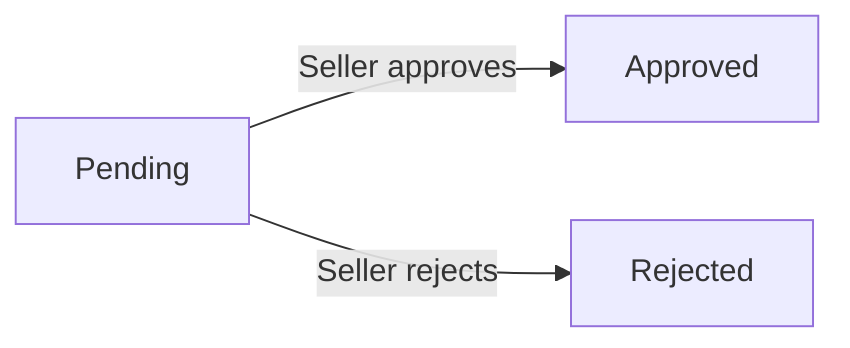
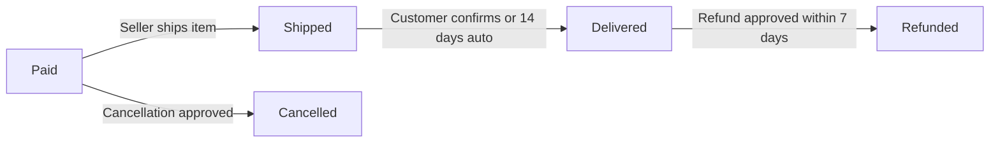
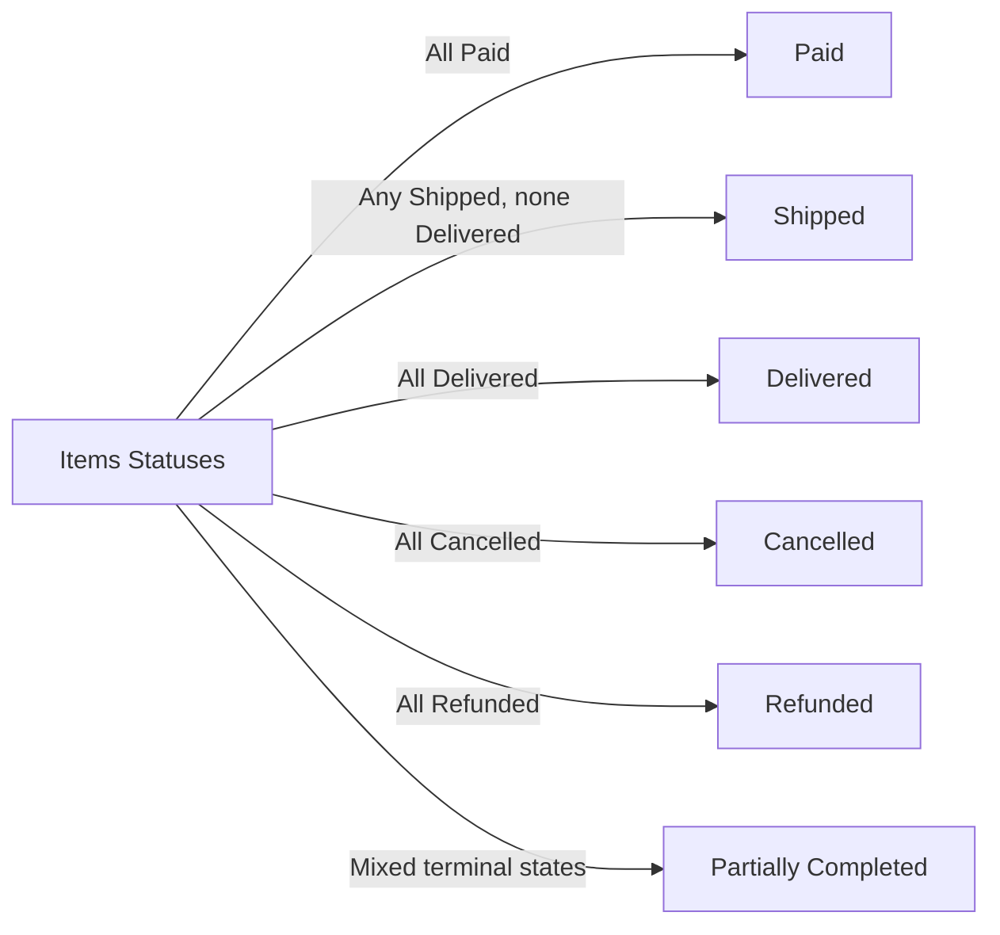
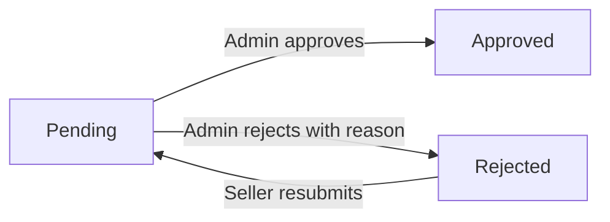
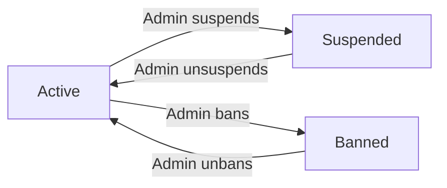
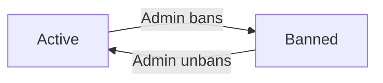
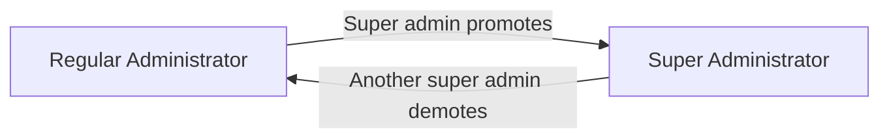

**eCommerceMall — Business concepts, relationships, and states from user perspective**

Business concepts, relationships, and states from user perspective

# Domain Concepts

Describe what each concept means in the business domain and its key attributes.

## Customer Concept

A Customer is a registered user of the platform who can browse products, make purchases, and interact with sellers. Every customer must create an account to use any platform features, meaning there is no guest browsing capability. A customer is identified by their email address, which serves as their login credential along with a password they set during registration. Each customer has a display name that appears publicly, for example on their reviews. Customers also have a phone number stored in their profile for order-related communication. Customers can store multiple shipping addresses, each containing recipient details and location information, with the ability to designate one as the default. When a customer deletes their account, their profile information is removed, but their past orders and order history remain preserved for seller records and legal compliance. Reviews written by a deleted customer are also preserved but are displayed as written by a "deleted user" rather than linked to an account. The customer concept is central to the platform as all shopping activity — cart, wishlist, orders, and reviews — is tied to an individual customer account.

### Customer Identity

A Customer is the core identity on the platform, representing a registered user who can browse products, make purchases, and interact with sellers. Every person using the platform must be a customer — there is no guest browsing capability, meaning all platform usage requires a customer account.

Each customer is uniquely identified by their email address, which also serves as their login credential. Alongside the email, customers have a password that authenticates their identity during login. The email address is the primary identifier for a customer account and must be unique across the platform.

A customer's identity persists throughout their activity on the platform. All shopping activity — cart contents, wishlist items, orders placed, and reviews written — is tied to the customer's account identity. This means customer actions are always traceable to a specific account while the account is active.

### Customer Profile Attributes

Each customer has a profile containing two editable attributes:

- **Display name**: The name that appears publicly on the platform, for example on product reviews. This allows customers to be recognized by other users without revealing their email address.
- **Phone number**: A contact number stored in the customer's profile for order-related communication, such as delivery coordination.

These attributes are editable by the customer, meaning the display name and phone number can be updated as needed. The profile information represents how the customer presents themselves publicly and how they can be contacted for their orders.

Customers also manage shipping addresses associated with their account. A customer can own multiple shipping addresses (detailed in the Address concept), and each address is linked to the customer who created it. This relationship means addresses are not shared between customers — each customer has their own set of addresses for delivering their orders.

### Account Deletion & Data Preservation

When a customer deletes their account, the following data preservation rules apply:

- **Profile information removal**: The customer's personally identifiable information — email, display name, and phone number — is deleted from the platform. The account can no longer be used to log in.
- **Order history retention**: The customer's past orders and order items are preserved in the system. This data is retained for seller record-keeping and legal compliance purposes. Preserved orders remain visible to sellers and administrators, but are no longer linked to an active customer account.
- **Review preservation with anonymization**: Reviews written by the customer before deletion are preserved on the product pages to maintain review integrity and usefulness for other customers. However, the review's association with the customer's identity is removed — the review is displayed as written by "deleted user" rather than tied to a named account. The review content and rating remain as they were at the time of writing.

This means customer account deletion removes personal data while preserving business records (orders and reviews) that other users and sellers depend on. The preserved data is disassociated from the deleted identity.

## Seller Concept

A Seller is a registered merchant who creates and sells products on the platform. Sellers sign up using an email address and password, similar to customers, but their accounts require administrator approval before they can begin selling. Each seller has a shop name that is displayed to customers alongside their products and in order records. Sellers also maintain a shop description and a logo image that represent their brand identity. A seller's approval status can be pending, approved, or rejected, and if rejected there is an accompanying rejection reason visible to the seller. Sellers have ownership of the products they create, and those products are associated with the seller's shop name. Seller accounts can only be deleted under specific conditions: no pending orders exist for their products and no pending cancellation or refund requests. When a seller deletes their account, their product listings are removed, but order history and snapshots are preserved, including the shop name as it appeared in past orders. Seller profiles are publicly viewable by customers who want to learn more about the merchant behind a product.

### Seller Definition and Business Identity

A Seller is a registered merchant identity on the platform — distinct from a Customer — who creates and sells products to end consumers. Each Seller has three core profile attributes that define their merchant identity:

- **Shop Name**: The public-facing brand name of the seller's store. This name appears alongside products in search results, category listings, product detail pages, and is preserved in order history snapshots even after the seller's account is deleted.
- **Shop Description**: A textual description of the seller's business, displayed on the seller's public profile for customers to read when learning about the merchant.
- **Logo Image**: An image representing the seller's brand, displayed on the seller's public profile alongside the shop name and description.

A seller registers using an email address and password (authentication flows are defined in [01-actors-and-auth.md](./01-actors-and-auth.md)).

### Seller Approval Lifecycle

A newly registered seller cannot begin selling immediately. Their account must pass through an administrator approval process before they can create products and accept orders. The approval lifecycle involves three states:

- **Pending**: The seller has submitted their registration and is waiting for an administrator to review their request. While in this state, the seller cannot create products or perform selling operations.
- **Approved**: An administrator has reviewed and approved the registration. The seller can now create products, receive orders, and operate their shop normally.
- **Rejected**: An administrator has reviewed and declined the registration. When this occurs, a **rejection reason** (text explaining why the request was denied) is recorded and made visible to the seller. Rejected sellers may submit a new registration request for reconsideration.

These statuses are tracked as part of the seller's account state and are distinct from a seller's suspension status (defined in [01-actors-and-auth.md](./01-actors-and-auth.md)).

### Seller Product Ownership

Sellers own the products they create. Each product (defined in [Product Concept](./02-domain-model.md#product-concept)) is associated with its creating seller, meaning:

- The seller controls which products appear in their catalog
- The seller's shop name is displayed alongside every product they list
- Only the owning seller (or administrators) can modify or delete the seller's products, subject to business rules (defined in [04-business-rules.md](./04-business-rules.md))

This ownership relationship preserves accountability: customers know which merchant is responsible for each product they purchase, and order records link back to the seller who provided each item.

### Seller Account Deletion and Data Preservation

A seller may delete their account, but only under specific conditions:

- The seller must have no pending order items in "paid" or "shipped" status for any of their products
- The seller must have no pending cancellation or refund requests for any of their products

When a seller's account is deleted, the following occurs:

- **Products are removed**: All of the seller's product listings are deleted from the platform. They no longer appear in search results or category listings.
- **Order history is preserved**: Past orders containing the seller's products remain in the system. The order records and order item snapshots (defined in [Snapshot Concept](./02-domain-model.md#snapshot-concept)) preserve the seller's shop name, product details, and pricing as they appeared at the time of purchase.
- **Seller identity in records**: The shop name associated with past orders is retained in snapshots for seller record-keeping and legal purposes, even though the seller account no longer exists.

### Public Seller Profile

Every approved seller has a public profile that customers can view. The public seller profile displays:

- Shop name
- Shop description
- Logo image

Customers access seller profiles from product detail pages (where the seller's shop name is linked). The profile provides transparency, allowing customers to learn about the merchant before making a purchase. Seller profile attributes are mutable — the seller can edit their shop name, description, and logo — and each edit creates a snapshot to preserve the previous state (defined in [Snapshot Concept](./02-domain-model.md#snapshot-concept)).

## Category Concept

A Category is a classification that organizes products into meaningful groups for browsing and searching. Each category has a name that identifies the group and a description that explains what type of products belong in it. Categories can have subcategories, but only one level of nesting is supported, meaning a subcategory cannot itself have further subcategories. Categories are created and managed exclusively by platform administrators, not by sellers or customers. Products are assigned to a category during creation, and customers can browse all available categories to find products within a specific classification. When a category is deleted by an administrator, the products that were assigned to it become uncategorized, meaning they lose their category association. Categories can be organized into a parent-child structure where the parent category represents a broad grouping and the child (subcategory) represents a more specific classification within it. Customers can view the full list of all categories to navigate the product catalog.

### Category Concept

A Category is a business concept that represents a classification group used to organize products into meaningful collections for browsing and searching. Categories form the backbone of the product catalog organization system, enabling customers to navigate the platform's inventory by thematic groupings rather than browsing every product individually.

### Category Attributes

Each category has two attributes:

- **Name**: A short, descriptive label that identifies the category (e.g., "Electronics", "Clothing"). The name is the primary identifier visible to customers when browsing categories.
- **Description**: A textual explanation of what types of products belong in this category. The description helps customers understand the scope of the category and decide whether to browse its contents.

These attributes are set when a category is created and can be modified by administrators.

### Category Hierarchy

Categories can be organized into a two-level parent-child hierarchy:

- A **parent category** represents a broad grouping of products (e.g., "Electronics").
- A **subcategory** represents a more specific classification within the parent (e.g., "Smartphones" under "Electronics").
- Only one level of nesting is supported, meaning a subcategory cannot itself have further subcategories.
- A category can exist without a parent (top-level category).
- A parent category can have multiple subcategories.

This hierarchy enables the platform to present a structured product catalog where customers can drill down from broad classifications to specific product types.

### Category Lifecycle and Administration

Categories are exclusively managed by platform administrators. Sellers and customers cannot create, edit, or delete categories.

**Product assignment**: When creating a product, the seller assigns it to a category. Products can be assigned to either a top-level category or a subcategory.

**Deletion behavior**: When an administrator deletes a category, all products that were assigned to that category lose their category association and become uncategorized. Uncategorized products remain visible in search results but are not listed under any category browsing view.

### Category Browsing for Customers

Customers can view the complete list of all available categories, presented as a product catalog navigation structure. The category list shows both parent categories and their subcategories, organized to reflect the hierarchy. Customers can select a specific category to view only the products assigned to that classification.

## Product Concept

A Product is an item that a seller creates and offers for sale on the platform. Every product has a name that identifies the item, a description that provides details about what is being sold, a base price that serves as the starting price, and an assigned category for classification. Products belong to the seller who created them, establishing clear ownership for order processing and inventory management. A product can have multiple images that visually represent the item, with the first image serving as the main thumbnail displayed in search results and listings. Products can also have multiple variants representing different configurations such as size or color. A product must have at least one variant to be purchasable; products with no variants appear in search results but are marked as unavailable. Products are visible in search results and category listings unless they have been deleted by the seller or hidden by an administrator. Each time a product is edited, a snapshot is created to preserve the previous state, ensuring a complete history of changes is maintained.

### Product Definition

A **Product** is an item that a seller creates and offers for sale on the e-commerce platform. Each product belongs to the seller who created it, establishing clear ownership for order processing, inventory management, and customer inquiries. Products are the core unit of commerce on the platform — customers browse, search, and purchase products. Products are visible in search results and category listings unless deleted by the seller or hidden by an administrator.

### Product Attributes

Every product has the following attributes:

- **Product Name** (required): A human-readable identifier for the item that appears in search results, listings, cart, and order records.
- **Product Description** (required): Detailed textual information about what the item is, its features, and specifications.
- **Base Price** (required): The starting price of the product expressed in the platform's currency. This serves as the default price. If a product has variants with their own prices (defined in ProductVariant Concept), the base price may be overridden by variant-specific pricing.
- **Category** (required): The classification grouping assigned to the product (defined in Category Concept).

### Category Assignment

Every product must be assigned to a category at creation time. Categories provide the organizational structure for browsing and filtering products. A product can be assigned to either a top-level category or a subcategory (one level of nesting only, as defined in Category Concept). If an administrator deletes a category, products previously assigned to that category become uncategorized but remain visible in search results.

### Product Image Association

A product can have multiple images that visually represent the item. Images are ordered by their sort position, with the first image (lowest sort order) serving as the **thumbnail image** displayed in search results, category listings, and wishlist views. All images are displayed on the product detail page. Image changes (additions, reordering, deletions) are captured in product snapshots.

### Variant Requirement for Purchase

A product must have at least one variant (defined in ProductVariant Concept) to be purchasable by customers. Variants represent specific configurations of a product, such as different sizes or colors. A product with no variants is visible in search results and on its detail page but is displayed as **unavailable** — customers cannot add it to their cart or purchase it.

### Product Visibility States

A product can exist in one of the following visibility states:

- **Visible**: The product appears in search results and category listings. This is the default state.
- **Unavailable but visible**: The product has no variants, so it appears in search results but is marked as unavailable for purchase.
- **Deleted**: The seller or an administrator has deleted the product. Deleted products no longer appear in search results or category listings.
- **Suspended (hidden)**: An administrator has suspended the seller's account. The product is hidden from search results and category listings and cannot be purchased until the suspension is lifted.

### Product Snapshot Preservation

Whenever a product is edited (name, description, category, base price, or images), a **product snapshot** is created to preserve the previous state of the product. Each product snapshot records:

- The timestamp of when the change was made
- All product fields as they existed before the edit (name, description, category, base price, images)
- Snapshots of all product variants as they existed at that moment (defined in Snapshot Concept)

Product snapshots are immutable and cannot be deleted. They are preserved even after the product itself is deleted. Sellers can view snapshots of their own products, and administrators can view snapshots of any product on the platform.

## ProductVariant Concept

A ProductVariant is a specific configuration of a product that represents a distinct option combination available for purchase. Each variant has a unique SKU code that identifies it within the platform, making it traceable for inventory and order purposes. Variants have option values that describe the configuration, such as color being "Red" and size being "Large" for a clothing item. A variant can have its own price that may override the product's base price, allowing different configurations to be priced differently. Each variant has a stock quantity that represents how many units are currently available, managed through inventory history records. A product must have at least one variant to be purchasable; customers select a specific variant when adding an item to their cart. When a variant's stock reaches zero, it is shown as out of stock and cannot be added to a cart. Variants can be edited by the seller, and each edit creates a snapshot to preserve the previous configuration. Variants can also be deleted by the seller, but only if there are no pending orders or cancellation or refund requests associated with that variant.

### ProductVariant Definition and Identity

A ProductVariant is a specific configuration of a product that represents a distinct combination of options available for purchase. Each variant is uniquely identified within the platform by its SKU code, which enables traceability in orders and inventory management.

Each variant has option values that describe its configuration — for example, a clothing item might have a variant with color "Red" and size "Large". These option values distinguish one variant from another within the same product.

Each variant belongs to exactly one product (defined in [Product Concept]). A product may have multiple variants.

### Variant Pricing

A variant may have its own price that can override the product's base price (defined in [Product Concept]). This allows different configurations of the same product to be priced differently, such as a larger size costing more than a smaller size. If no variant price is set, the product's base price applies to that variant.

### Stock and Availability

Each variant has a stock quantity representing how many units are currently available for purchase. The stock quantity is managed through inventory history records (defined in [InventoryRecord Concept]), where each addition or subtraction is recorded with a reason and timestamp. Inventory tracking is performed per variant independently of other variants of the same product.

A product must have at least one variant to be considered purchasable. If a product exists but has no variants, it remains visible in search results but is shown as unavailable for purchase.

When a variant's stock quantity reaches zero, the variant is shown as out of stock. Out of stock variants cannot be added to a cart by customers.

### Variant Integrity and Historical Preservation

When a seller edits a variant — changing the SKU code, option values, or price — a snapshot is automatically created to preserve the previous configuration (defined in [Snapshot Concept]). This snapshot is stored immutably for historical reference and dispute resolution.

A seller can delete a variant only if there are no pending order items (with status "paid" or "shipped") and no pending cancellation or refund requests associated with that variant. If conditions are met, the variant and its inventory records are removed.

### Variant in the Purchasing Flow

Customers select a specific variant when adding an item to their cart (defined in [CartItem Concept]), not just the product itself. The chosen variant determines the applicable price (whether the variant's own price or the product's base price), and the stock availability check. When an order is placed, the specific variant is recorded in the order item (defined in [OrderItem Concept]) to preserve exactly which configuration was purchased.

## ProductImage Concept

A ProductImage is a visual representation of a product that helps customers understand what they are purchasing. Product images are uploaded by the seller and associated with a specific product. Each image has a URL that links to the actual image file stored on the platform. Images have a sort order that determines their display sequence, with the first image serving as the main thumbnail shown in search results, category listings, and wishlist views. A product can have multiple images, and customers can view all of them on the product detail page to get a comprehensive visual understanding of the item. Sellers can reorder their product images to control which image appears first as the primary thumbnail. When a product is edited and images change, those changes are captured in a product snapshot to preserve the visual state at that point in time. Product images can be individually deleted by the seller as needed.

### ProductImage Concept and Visual Representation

A ProductImage is a digital photograph or illustration that visually represents a product listed on the platform. Its primary business purpose is to help customers understand what a product looks like before making a purchase decision. ProductImages are owned by the seller who uploaded them and are associated with exactly one product. Each image provides a visual perspective of the product, such as different angles, color variations, or usage scenarios.

### Image URL Attribute

Each ProductImage has an image URL attribute that serves as the location reference for retrieving and displaying the image file. When a customer views a product on any page of the platform (search results, category listings, product detail page, wishlist), the system uses this URL to fetch and render the image. The URL points to the stored copy of the image on the platform's file storage system.

### Sort Order Attribute

Each ProductImage has a sort order attribute that determines the display sequence of images for a product. Images are shown in ascending order of their sort order value. The image with the lowest sort order value is the first image displayed across the platform. This attribute is how sellers control which image appears as the primary visual and how all remaining images are arranged.

### Thumbnail and Product Detail Page Display

The first image (lowest sort order) serves as the **thumbnail image** for the product. This thumbnail appears in all list-style views: search result listings, category browsing pages, and wishlist views. When a customer opens a product detail page, all images associated with the product are displayed, allowing the customer to browse through every uploaded visual to get a complete understanding of the item.

### Multiple Images and Reordering Capability

A product can have multiple ProductImages associated with it. Sellers can upload several images to showcase their product from different perspectives or highlight various features. Sellers can reorder images by changing their sort order values. Reordering does not delete or replace existing images; it only changes their display sequence. This gives sellers full control over which image serves as the primary thumbnail and how remaining images are sequenced.

### Image Deletion by Seller

Sellers can delete individual ProductImages from their products. When an image is deleted, it is permanently removed from the product and no longer appears in any display context, including thumbnail views, search results, category pages, wishlist views, and the product detail page. Deletion of an image is considered a product change and is captured in a product snapshot.

### Image Snapshot Preservation

When images are added, reordered, or deleted, the state of all images at that point in time is preserved in a product snapshot. This means:

- If a seller changes which image is the primary thumbnail through reordering, the previous image arrangement is recorded in a snapshot.
- If a seller deletes an image, the complete image set before deletion is recorded in a snapshot.
- Snapshots allow sellers and administrators to review what images were associated with a product at any historical point.
- Snapshots are immutable and cannot be deleted, ensuring a complete audit trail of all visual changes to a product over time.

## Address Concept

An Address is a shipping destination that a customer stores for use during checkout. Each address contains the recipient's name, a phone number for delivery contact, a street address for the physical location, a city, a state or province, a postal code, and a country. Customers can maintain multiple addresses in their account, allowing them to ship to different locations such as home, work, or a friend's address. One address can be designated as the default shipping address, which is preselected during checkout for convenience. Addresses belong to the customer who creates them, and each customer manages their own set of addresses. Addresses are used exclusively during the checkout process; once an order is placed, the shipping address used for that order is fixed and cannot be changed. Customers can edit the details of their existing addresses or delete addresses they no longer need.

### Address Concept

An address is a shipping destination that a customer stores in their account for use during checkout. Each address represents a physical location where orders can be delivered. Addresses belong exclusively to the customer who creates them, and the customer is responsible for ensuring the address details are accurate. Addresses serve as reference data during the checkout process — once an order is placed, the address used for that order is recorded with the order and cannot be changed.

### Address Attributes

Each address contains the following details:

- **Recipient name**: The name of the person or organization receiving the delivery at this address.
- **Phone number**: A contact phone number for the recipient, used by delivery carriers to communicate about the shipment.
- **Street address**: The physical street or building location for delivery, including street number, building name, apartment or unit number, and any other location-specific details.
- **City**: The city or municipality where the delivery destination is located.
- **State or province**: The state, province, or regional administrative division where the delivery destination is located.
- **Postal code**: The postal or ZIP code assigned to the delivery area by the postal system.
- **Country**: The country where the delivery destination is located.

### Default Shipping Address

A customer can designate one of their addresses as the default shipping address. The default address serves as the preselected option during checkout, streamlining the ordering process. Only one address can be the default at any given time. If a customer sets a different address as the default, the previously default address becomes a regular address. A customer may choose to have no default address, in which case no address is preselected during checkout.

### Customer Address Ownership

Each address is owned by a single customer. A customer can maintain multiple addresses in their account, allowing them to ship to different locations such as their home, workplace, or a friend's address. Customers manage their own set of addresses independently — addresses are not shared between customers. A customer can edit the details of their existing addresses or remove addresses they no longer need. When a customer deletes their account, their addresses are deleted along with their profile information.

### Checkout Address Selection

When placing an order, the customer selects one of their saved addresses as the shipping destination for that order. If the customer has set a default address, it is preselected automatically. The customer may choose any of their saved addresses regardless of which one is the default. The address selected at checkout is recorded with the order and becomes a permanent part of the order record. After the order is placed, the shipping address cannot be changed.

## CartItem Concept

A CartItem represents a specific product variant that a customer intends to purchase, stored temporarily in their shopping cart. Each cart item has a quantity that indicates how many units of that variant the customer wants to buy. When a customer adds the same variant to their cart again, the quantities are combined into a single cart item rather than creating a separate entry. Each cart item displays the product name, the specific variant options selected, the individual price, the quantity desired, and the subtotal for that line item. Cart items are associated with a specific customer and are visible only to that customer. If a variant's stock falls below the cart quantity, a warning is shown to alert the customer. If a variant becomes unavailable (deleted or out of stock), the cart item is marked as unavailable. Unavailable cart items cannot be included in checkout. The cart also shows a total price that sums all cart items.

### CartItem Concept, Attributes, and Customer Association

A CartItem represents a customer's temporary intent to purchase a specific product variant. It is a non-binding placeholder that exists only during active shopping sessions and is cleared when the customer places an order containing those variants. CartItems do not reserve inventory or guarantee availability.

Each CartItem refers to exactly one ProductVariant — not a product as a whole — and carries a quantity attribute indicating how many units of that variant the customer intends to purchase. The quantity is a positive whole number.

When a customer adds the same variant to their cart and a CartItem for that variant already exists, the two quantities are combined into the existing CartItem rather than creating a separate entry. For example, if a CartItem already has a quantity of 2 and the customer adds 3 more of the same variant, the quantity becomes 5. This combining behavior ensures each variant appears as a single line in the cart.

For display purposes, each CartItem contains or references the following information: the product name (from the associated Product), the specific variant option values (such as color and size), the individual price of the variant, the desired quantity, and the subtotal calculated as price multiplied by quantity.

The cart has a total price that is the sum of all available CartItem subtotals. Unavailable CartItems (defined in CartItem States and Checkout Restrictions) are excluded from this calculation. The total price is recalculated whenever any CartItem's quantity or price changes.

Each CartItem is associated with exactly one Customer. A customer's cart is the collection of all CartItems linked to their account. CartItems are private to that customer and are not visible to any other customer, seller, or administrator.

### CartItem States and Checkout Restrictions

A CartItem has two special states that affect its behavior:

**Low Stock Warning State** — When the current stock quantity of the associated ProductVariant is less than the quantity specified in the CartItem, the CartItem enters a low stock warning state. In this state, a visual alert is displayed alongside the CartItem to inform the customer that available inventory may be insufficient to fulfill the intended purchase. The CartItem remains otherwise functional — it is still selectable and can proceed to checkout as long as some stock remains.

**Unavailable Variant Marking** — If the associated ProductVariant becomes unavailable because the variant has been deleted by the seller or its stock has reached zero, the CartItem is marked as unavailable. The CartItem remains visible in the customer's cart so the customer can review what was previously added, but it is clearly distinguished from available items through a visual indicator that the variant can no longer be purchased.

**Checkout Restriction for Unavailable Items** — CartItems that are marked as unavailable cannot participate in the checkout process. When the customer initiates checkout, any unavailable CartItems are excluded from the order and the customer is informed that those items must be removed before checkout can proceed. This restriction applies only to unavailable CartItems; all other CartItems proceed normally.

## WishlistItem Concept

A WishlistItem represents a product that a customer has saved for future consideration. Unlike cart items, wishlist items reference products rather than specific variants, allowing customers to save an entire product for later without committing to a particular configuration. Each wishlist item is associated with the customer who saved it and the product they saved. Customers can view their wishlist, which is paginated and shows the saved products. A wishlist item is automatically removed if the seller deletes the underlying product, keeping the wishlist clean of unavailable items. Customers can manually remove products from their wishlist at any time. The wishlist serves as a bookmarking tool that helps customers keep track of products they are interested in but are not yet ready to purchase.

### WishlistItem Concept

A WishlistItem represents a customer's intent to save a product for future purchase consideration. It serves as a personal bookmarking tool that allows customers to keep track of products they are interested in without committing to a purchase. Unlike a cart item, which expresses purchase intent, a wishlist item expresses saving intent. Customers use the wishlist to curate a collection of products they may want to buy at a later time, helping them organize their shopping research and revisit products they found interesting.

### WishlistItem Target Reference

A WishlistItem references a product as a whole, not a specific variant. When a customer saves a product to their wishlist, they save the entire product listing rather than selecting a particular combination of options (e.g., a specific color or size). This distinction is important: customers do not need to decide on variant details at the wishlist stage. The product reference means the wishlist displays the full product with all its available variants, price range, and options. If the product is later viewed from the wishlist, the customer can then choose a specific variant for purchase.

### WishlistItem Customer Association

Each WishlistItem is associated with exactly one customer — the customer who saved the product. A customer can have many wishlist items, forming a personal wishlist collection. Each product can appear in the wishlists of many different customers simultaneously, with each customer having their own independent wishlist item for that product. A customer cannot save the same product to their wishlist more than once. If a product is already in the customer's wishlist, attempting to save it again has no effect — the item already exists.

### WishlistItem View Experience

Customers can view their wishlist as a paginated list of saved products. The wishlist view displays the products themselves (not specific variants), showing each product's current information including its name, main image, price range, and seller. The view is ordered by the date the product was saved, with newest additions appearing first. Because the wishlist references the live product record, the displayed information updates dynamically as the seller edits the product — including price changes, stock availability, and new images.

### WishlistItem Removal

A WishlistItem can be removed in two ways:

- Manual removal: The customer can remove a product from their wishlist at any time by explicitly deleting it. This is an intentional action by the customer to clean up or reorganize their wishlist.
- Automatic removal: If a seller deletes the underlying product from the platform, all wishlist items referencing that product are automatically removed. This ensures the wishlist does not display unavailable or deleted products, keeping the customer's view clean.

In both cases, the wishlist item is permanently removed. The customer can add the product back to their wishlist later if it becomes available again (for automatic removal cases where the product may be recreated).

## Order Concept

An Order represents a completed purchase transaction that a customer has made on the platform. Each order has a unique order number for identification and reference. The order has a total price that sums all items purchased within it. An order contains one or more order items, and each order item represents a purchased variant from a seller. An order can contain items from multiple different sellers, and each item within the order has its own independent status. The overall order status is derived from the status of its individual items. If all items are paid, the order is paid. If any item is shipped and none delivered, the order is shipped. If all items are delivered, the order is delivered. If all items are cancelled, the order is cancelled. If all items are refunded, the order is refunded. Mixed states result in a partially completed status. Each order is associated with a specific customer who made the purchase and includes the shipping address that was selected at checkout. The shipping address is fixed once the order is placed.

### Order Concept

An Order represents a completed purchase transaction made by a customer on the platform. Each order is created when the customer successfully completes checkout and payment, capturing the customer's intent to purchase specific items from one or more sellers. The order serves as the authoritative record of the transaction and is used for fulfillment, tracking, and historical reference.

### Order Attributes

Each order has the following key attributes:

- **Order Number**: A unique identifier assigned to each order for reference and communication purposes. The order number distinguishes one order from another.
- **Total Price**: The sum of all order item prices within the order. The total price is calculated at the time of order creation and does not change afterward.
- **Customer Association**: Every order belongs to exactly one customer who placed it (defined in [Customer Concept]).
- **Shipping Address**: The address selected by the customer at checkout. The shipping address is captured and fixed at the moment the order is placed and cannot be changed afterward.

### Order Items and Multi-Seller Support

An order contains one or more order items (defined in [OrderItem Concept]). Each order item represents a purchased product variant with a specific quantity and price captured at the time of purchase.

An order can contain items from multiple different sellers. For example, a single order may include a product from Seller A and a different product from Seller B. When items belong to different sellers, they are fulfilled through separate shipments (defined in [Shipment Concept]), with each seller managing their own packaging and delivery independently.

### Derived Order Status

The overall order status is derived from the independent statuses of its individual order items (defined in [OrderItem Concept]).

The derivation rules are:

- **paid**: All items have status "paid"
- **shipped**: At least one item has status "shipped" and no items have status "delivered"
- **delivered**: All items have status "delivered"
- **cancelled**: All items have status "cancelled"
- **refunded**: All items have status "refunded"
- **partially completed**: Items are in mixed states that do not match any single status above (e.g., some delivered and some refunded, or some shipped and some delivered)

The overall order status provides a single high-level view of the order's progress, while each item retains its own independent status for granular tracking.

## OrderItem Concept

An OrderItem represents a specific product variant that was purchased within an order. Each order item has a quantity and a price, which preserve the purchase details at the time of the transaction. If a customer buys multiple units of the same variant, they are consolidated into a single order item with the combined quantity. Each order item has its own independent status that tracks its fulfillment progress through the lifecycle: paid, shipped, delivered, cancelled, or refunded. Order items are associated with both the customer who purchased them and the seller who sold them. Each order item can be individually cancelled or refunded without affecting other items in the same order. When an order item is created, a snapshot of the product and variant is saved to preserve exactly what was purchased, and a snapshot of the seller's profile is also saved to preserve the shop name and logo at that moment. Order items are grouped into shipments when the seller ships them.

### OrderItem Definition

An OrderItem represents a specific product variant that was purchased as part of an order. Each order item captures exactly what a customer bought and under what terms.

**Purchased Variant Representation**
Each order item references a specific product variant (defined in ProductVariant Concept) at the time of purchase. If a customer buys three units of the same variant, they are consolidated into a single order item with a quantity of three — not three separate line items.

**Quantity Attribute**
The quantity attribute records how many units of a specific variant were purchased in this order item. A single order item always represents multiple units of the same variant; it never mixes different variants.

**Price Attribute**
The price attribute records the unit price of the variant at the time of purchase. This is a historical record and does not change even if the variant's current price is later updated. The subtotal for the order item is calculated as quantity multiplied by this unit price.

**Customer and Seller Association**
Each order item is associated with both:
- The customer who purchased it (via the parent order)
- The seller who sold it (via the product variant's owning seller)

This dual association allows customers to view their purchased items and sellers to manage items they need to fulfill, while also enabling per-item actions such as individual cancellation or refund.

### Order Item Status

Each order item has its own independent status that tracks its fulfillment progress. The status is per-item, meaning items within the same order can be at different stages of fulfillment.

**Status Values**

| Status | Meaning |
|--------|---------|
| Paid | Payment has been completed. The item is waiting for the seller to ship it. |
| Shipped | The seller has shipped the item as part of a shipment. |
| Delivered | The item has been delivered to the customer. |
| Cancelled | The item was cancelled (before shipping). |
| Refunded | The item was refunded (after delivery). |

**Status Lifecycle**
An order item progresses through its lifecycle as follows:
- Created with status "paid" upon successful order placement.
- Changes to "shipped" when the seller includes it in a shipment and provides tracking information.
- Changes to "delivered" when the customer confirms delivery or the auto-delivery period expires.
- Items with status "paid" may be cancelled, moving to "cancelled".
- Items with status "delivered" may be refunded, moving to "refunded".

Once an item reaches "cancelled" or "refunded", no further status changes occur for that item.

**Relationship to Overall Order Status**
The overall order status is derived from the statuses of all its order items (defined in Order Concept). Individual item status changes drive the overall order status, not the other way around.

### Order Item Snapshot Preservation

When an order item is created at the time of purchase, the system preserves snapshots to ensure the exact state of the purchase is permanently recorded for future reference, dispute resolution, and record-keeping.

**Product and Variant Snapshot**
A snapshot of the purchased product and its variant is saved with each order item. This snapshot preserves:
- The product's name, description, and base price at the time of purchase
- The variant's SKU code, option values, and price at the time of purchase

This ensures that even if the seller later edits or deletes the product or variant, the historical record of what was sold is permanently preserved.

**Seller Profile Snapshot**
A snapshot of the seller's profile is also saved with each order item. This snapshot preserves:
- The shop name at the time of purchase
- The shop logo at the time of purchase

This ensures that even if the seller later changes their shop name or logo, the historical record shows the seller identity as it appeared at the time of the transaction.

**Snapshot Immutability**
These snapshots are immutable and cannot be deleted or modified (as defined in Snapshot Concept). They are viewable by the customer, the seller, and administrators for order history review and dispute resolution.

### Order Item Grouping into Shipments

Order items are grouped into shipments when the seller fulfills them. A shipment represents a physical package sent by a seller.

**Same-Seller Grouping**
A shipment can contain one or more order items, but only if those items belong to the same seller. Items from different sellers are always shipped in separate shipments.

**Seller Flexibility**
The seller decides how to group their order items into shipments:
- A seller may bundle multiple order items into a single shipment
- A seller may ship each order item individually as a separate shipment

**Shared Tracking**
All order items within the same shipment share the same tracking information (carrier name and tracking number, as defined in Shipment Concept). When a shipment is created, all items in it transition to "shipped" status simultaneously.

**Delivery Confirmation Scope**
Delivery confirmation is performed per shipment. When a customer confirms delivery of a shipment, all order items within that shipment transition to "delivered" status together.

## Shipment Concept

A Shipment is a physical package sent by a seller that contains one or more order items. Each shipment has a carrier name that identifies the shipping company used, a tracking number that allows the package to be tracked during transit, and a shipped timestamp recording when the package was sent. A seller can choose to ship order items individually in separate packages or bundle multiple items from the same seller into a single shipment. Different sellers always ship separately, so items from different sellers are never combined in the same shipment. All items within a single shipment share the same tracking information and carrier. When a shipment is created, all items included in it change status to shipped. A shipment is associated with the seller who sent it and the order items it contains. Customers can view tracking information for each shipment and confirm delivery per shipment rather than per individual item.

### Shipment Definition

A shipment is a physical package that a seller sends to a customer. A shipment contains one or more order items that are packed together for delivery. Each shipment represents a single package that travels from the seller to the customer through a shipping carrier. The shipment is the unit of physical delivery tracking — the customer receives one package per shipment and confirms delivery per shipment.

### Carrier Name

Each shipment is associated with a carrier name that identifies the shipping company responsible for delivering the package. Common examples include local postal services, courier companies, or logistics providers. The carrier name is entered by the seller when the shipment is created and is displayed to the customer for tracking purposes.

### Tracking Number

Each shipment has a tracking number that uniquely identifies the package within the carrier's tracking system. The tracking number is provided by the seller when the shipment is created and allows the customer to monitor the package's transit status. The tracking number, together with the carrier name, enables the customer to look up the current location and delivery status of their package.

### Shipped Timestamp

Each shipment records a shipped timestamp indicating when the package was dispatched by the seller. This timestamp is automatically recorded when the seller creates the shipment and enters the tracking information. The shipped timestamp serves as the official record of when the items left the seller's possession and began transit to the customer.

### Bundled Shipment Grouping

When preparing to ship, a seller can choose to bundle multiple order items into a single shipment. This means items from the same seller that are ready to ship around the same time can be packed together in one package. The seller has the flexibility to decide which items to include in each shipment — they can group items together or ship them individually in separate packages as they prefer.

### Seller Separate Shipment Rule

Different sellers always ship their items separately. Order items belonging to different sellers cannot be combined into the same shipment, even if they are part of the same customer order. This rule exists because each seller manages their own inventory, packing, and shipping process independently. As a result, a single customer order containing items from multiple sellers will result in multiple shipments — one per seller.

### Shared Tracking Information

All order items that are included in the same shipment share the same carrier name and tracking number. There is no need for individual tracking per item within a shipment because they travel together as one package. The customer uses the single tracking number provided for the shipment to track the delivery of all items contained within it.

### Shipped Status Transition

When a seller creates a shipment and records the carrier name and tracking number, all order items included in that shipment automatically transition to a shipped status. This status change is a direct consequence of the shipment being dispatched — the items are no longer awaiting shipment and are now in transit. The shipped timestamp recorded at this moment serves as the official dispatch time.

### Seller Shipment Association

Each shipment is associated with the seller who created and dispatched it. The seller is responsible for packing the items, selecting the carrier, entering the tracking information, and ensuring the package is handed to the carrier. The shipment association allows the seller to manage their outgoing packages and allows the customer and administrators to identify which seller sent which package.

### Per-Shipment Delivery Confirmation

Delivery confirmation is performed per shipment, not per individual order item. When a customer confirms that a package has been received, all order items within that shipment are marked as delivered simultaneously. This approach aligns with the physical delivery process — a single package arrives at once, so all items inside it are received together. After confirmation, each item's status transitions to delivered.

## CancellationRequest Concept

A CancellationRequest is a formal request made by a customer to cancel a specific order item that has not yet been shipped. Each cancellation request includes a reason provided by the customer explaining why they want to cancel. The request has a status that tracks whether it is pending, approved, or rejected by the seller. When the seller responds to the request, a snapshot of the request state is created at that moment. Cancellation requests can only be made for order items that are in the paid status, meaning the item has been paid for but not yet shipped. If the seller approves the cancellation, the item is cancelled and refunded, and the stock quantity for that variant is restored. If rejected, the customer is informed and the item continues processing normally. Each cancellation request is associated with a specific order item and the seller who needs to respond.

### CancellationRequest Concept

A CancellationRequest is a formal request initiated by a customer who wishes to cancel a specific order item that has not yet been shipped. Each CancellationRequest represents a customer's intention to cancel their purchase for a particular item, along with their explanation for doing so. The request is directed to the seller of that item, who reviews it and decides whether to accept or decline. The lifecycle of a CancellationRequest follows status transitions defined through the request status tracking mechanism.

### Per-Item Cancellation

Cancellation is handled per individual order item, not per entire order. Each CancellationRequest is associated with exactly one order item. A customer can submit separate cancellation requests for different items within the same order, and each request is evaluated independently by the respective seller. This allows some items in an order to be cancelled while others continue processing normally.

### Cancellation Reason Attribute

Each CancellationRequest includes a reason attribute provided by the customer at the time of submission. The reason is free-form text that explains why the customer wishes to cancel the order item. The reason is recorded immutably as part of the request record and is visible to the seller who must respond to the request. The reason cannot be modified after submission.

### Request Status Tracking

A CancellationRequest has a status attribute that tracks its current position in the lifecycle. The status follows the same tracking mechanism defined in [RefundRequest Concept > Request Status Tracking], using the same set of permissible values: pending, approved, and rejected. The status begins as pending upon submission and transitions to either approved or rejected when the seller responds. Once a final status is set, it cannot be changed.

### Pending, Approved, and Rejected States

The status of a CancellationRequest has exactly three permissible states. Pending indicates the request has been submitted by the customer and is awaiting the seller's response. Approved indicates the seller has accepted the request, allowing the item to be cancelled and its stock restored. Rejected indicates the seller has declined the request, and the order item continues processing normally. These states are shared with the RefundRequest concept (defined in [RefundRequest Concept]) as a common status pattern.

### Seller Response Snapshot

When a seller responds to a CancellationRequest — by either approving or rejecting it — a snapshot of the request state is created at that moment. This seller response snapshot (conforming to the Snapshot Principle defined in [Snapshot Concept]) records the timestamp of the response, the action taken (approval or rejection), and the complete state of the request at the time of the response. This preserves an immutable record of the seller's decision for dispute resolution purposes.

### Paid Status Requirement

A CancellationRequest can only be created for an order item that is currently in the paid status. This means the item has been paid for by the customer but has not yet been shipped by the seller. Once an order item transitions to a shipped status or beyond (shipped, delivered), cancellation is no longer available and the customer must use the refund process instead (defined in [RefundRequest Concept]).

### Stock Restoration on Approval

If a seller approves a CancellationRequest, the associated order item is cancelled and the stock quantity for the corresponding product variant is restored. An inventory record (per the inventory management rules defined in [InventoryRecord Concept]) is automatically created with a positive quantity change equal to the cancelled item's quantity, and the reason is recorded as resulting from the cancellation approval.

### Order Item Association

Each CancellationRequest belongs to exactly one OrderItem. The association is established when the request is created by the customer selecting a specific item from their order to cancel. Through this order item association, the CancellationRequest is also indirectly linked to the product variant purchased in that item, the customer who placed the order, and the seller who owns the product (defined in [OrderItem Concept] and [Conceptual Relationships]).

### Seller Response Responsibility

The seller who owns the product variant associated with the order item is responsible for responding to each CancellationRequest. The seller reviews the customer's reason and decides whether to approve or reject the request. Sellers can view all pending CancellationRequests for their products. If the seller does not respond, the request remains in pending status indefinitely with no automatic resolution.

## RefundRequest Concept

A RefundRequest is a formal request made by a customer to receive a refund for a delivered order item. Each refund request includes a reason provided by the customer explaining why they want a refund. The request has a status that tracks whether it is pending, approved, or rejected by the seller. When the seller responds, a snapshot of the request state is created. Refund requests can only be made for order items that have been delivered and only within seven days of that item's delivery. If the seller approves the request, the item is refunded and the stock quantity for that variant is restored. If rejected, the customer is informed and no refund is issued. Each refund request is associated with a specific order item and the seller who needs to respond. Similar to cancellation requests, refunds are handled per individual item, not per entire order.

### RefundRequest Definition and Attributes

A RefundRequest is a formal request submitted by a customer to receive a refund for a specific order item. Refunds are handled per individual item, not per entire order — each refund request targets a single order item.

Each RefundRequest is associated with:

| Association | Description |
|-------------|-------------|
| Order item | The specific delivered item the customer seeks to refund |
| Seller | The seller who owns the product variant in that order item and must respond to the request |

Each RefundRequest has the following attributes:

| Attribute | Description |
|-----------|-------------|
| Reason | A text explanation provided by the customer describing why they are requesting a refund |
| Status | Tracks the current state of the request (pending, approved, or rejected) — follows the same pattern as CancellationRequest status tracking |
| Response timestamp | The date and time when the seller responded to the request (approved or rejected) |

When the seller responds to a refund request (either approving or rejecting it), a snapshot of the request state is created to preserve a record of the reason, the decision, and the response time. This snapshot is immutable.

### Refund Request Eligibility and State Transitions

A RefundRequest transitions through the following states:

- **Pending**: The customer has submitted the refund request with a reason. The request awaits the seller's decision. No action has been taken yet.
- **Approved**: The seller has approved the refund request. When approved, two actions occur automatically: the item is refunded (financial reversal) and the stock quantity for the associated product variant is restored (via a positive inventory record).
- **Rejected**: The seller has rejected the refund request. The customer is informed of the rejection and no refund is issued.

**Eligibility Conditions**

A refund request can only be created when both of the following conditions are met:

1. **Delivered status**: The order item's status must be "delivered" — refunds are not available for items that are still in transit, not yet shipped, or already cancelled.
2. **Seven-day window**: The request must be submitted within seven calendar days of the item's delivery date. After this window expires, the customer may no longer submit a refund request for that item.

## Review Concept

A Review is feedback written by a customer about a product they have purchased and received. Each review has a required rating from one to five stars that indicates the customer's satisfaction level and an optional text description providing detailed feedback. Reviews can only be written after the order item status has become delivered, ensuring that only customers who actually received the product can leave feedback. A customer can write at most one review per product per order, preventing duplicate reviews from the same purchase. Reviews are displayed publicly on the product detail page, sorted by newest first, helping other customers make informed purchasing decisions. The average rating shown for a product is calculated from all non-deleted reviews. Reviews can be edited by the customer who wrote them, and each edit creates a snapshot preserving the previous version. Customers can also delete their own reviews, though snapshots of the review are preserved. When a customer deletes their account, their reviews remain but are displayed as from a deleted user.

### Review Definition and Eligibility

A Review is a piece of feedback written by a customer about a product they have purchased and received. It represents the customer's assessment of the product and helps inform other shoppers.

Each review contains two components:

- **Rating** (required): A numeric value on a one-to-five star scale indicating the customer's satisfaction level. One star represents the lowest satisfaction and five stars represent the highest satisfaction.
- **Text description** (optional): A free-text field where the customer can provide detailed feedback about the product, their experience, or any other relevant information.

Reviews belong to the customer who wrote them and the product they were written about. Each review is also associated with the specific order item that triggered the review eligibility.

A customer may only write a review when the following conditions are met:

- The order item corresponding to the purchased product has a status of "delivered". This ensures that only customers who have actually received the product can leave feedback.
- The customer has not already written a review for the same product within the same order. A customer may write at most one review per product per order, preventing duplicate reviews from the same purchase.

If either condition is not satisfied, the system does not permit the customer to create a review.

### Review Display

Reviews are displayed publicly on the product detail page so that all visitors can view them.

**Newest first sorting**: Reviews are sorted by creation date with the most recent review appearing first. This ensures the most up-to-date feedback is seen first.

**Average rating calculation**: The product's average rating is calculated from all non-deleted reviews associated with that product. The average is computed as the sum of all star ratings divided by the number of non-deleted reviews. This average rating is displayed on the product detail page alongside the total count of reviews.

The product detail page shows both the average rating and the total review count, giving customers a sense of both product quality and how many people have reviewed it.

### Review Lifecycle

**Editing and Snapshots**: A customer may edit their own review after it has been created. When a review is edited:

- The rating and/or text description are updated to the new values.
- A snapshot of the review is automatically created before the edit is applied. This snapshot preserves the previous state of the review, including the previous rating value and text content.
- The snapshot records the timestamp of when the change was made, what was changed (rating, text, or both), and the values before and after the change.
- Snapshots are immutable and cannot be deleted. They can be viewed by the customer who wrote the review and by administrators for dispute resolution purposes.

**Deletion**: A customer may delete their own review at any time. When a review is deleted:

- The review is no longer displayed on the product detail page.
- The deleted review is excluded from the average rating calculation.
- Snapshots of the review (created during edits) are preserved and remain accessible to administrators.

**Account Deletion Behavior**: When a customer deletes their entire account, their reviews are handled differently from deletion of individual reviews:

- The reviews themselves are preserved and remain displayed on the product detail page.
- The reviews are not removed from average rating calculations.
- The review author is displayed as "deleted user" instead of the customer's display name, protecting the former customer's identity while preserving the review content for the community.

## InventoryRecord Concept

An InventoryRecord is an individual entry that tracks a change to the stock quantity of a specific product variant. Each inventory record has a quantity change value, which can be positive for restocking events or negative for orders and adjustments. Each record includes a reason explaining why the stock was adjusted, providing transparency into inventory movements. Every record also has a timestamp recording when the change occurred. The current stock quantity of a variant is calculated by summing all its inventory records, rather than being stored as a single updatable value. Inventory records are automatically created when orders are placed, reducing stock with the purchased quantity. Records are also automatically created when cancellations or refunds are approved, restoring stock with a positive quantity. Sellers can manually create inventory records to add stock through restocking or to subtract stock through adjustments. Sellers can view the full history of inventory records for each variant to audit all stock movements.

### InventoryRecord (Concept and Attributes)

An InventoryRecord is a business record that tracks a change to the stock quantity of a specific product variant. Each InventoryRecord belongs to a single ProductVariant, and a variant can have many inventory records over its lifetime.

Each InventoryRecord has the following attributes:

- **Quantity Change**: A numeric value indicating how much the stock quantity changed. A positive value represents an increase in stock (e.g., restocking, return). A negative value represents a decrease in stock (e.g., customer purchase, inventory adjustment for loss).
- **Reason**: A textual description explaining why the stock was changed. The reason provides business context for each inventory movement, such as "seller restock", "order placed", "cancellation approved", "refund approved", or "manual adjustment".
- **Timestamp**: The date and time when the inventory change was recorded. This establishes a chronological record of all stock movements.

### Stock Quantity Derivation

The current stock quantity of a product variant is not stored as a single value. Instead, it is calculated by summing the quantity change values of all InventoryRecords belonging to that variant. This calculation-based approach ensures a complete, auditable trail of every change that contributed to the current stock level.

**Automatic Records:** InventoryRecords are created automatically in the following scenarios:

- **Order Placement**: When an order is placed successfully, a negative InventoryRecord is automatically created for each purchased variant, reducing stock by the purchased quantity. The reason records the associated order.
- **Cancellation Approval**: When a cancellation request is approved, a positive InventoryRecord is automatically created, restoring the stock quantity that was deducted at the time of order. The reason records the associated cancellation.
- **Refund Approval**: When a refund request is approved, a positive InventoryRecord is automatically created, restoring the stock quantity for the refunded item. The reason records the associated refund.

**Manual Records:** Sellers can also create InventoryRecords manually:

- **Restocking**: A seller can create a positive InventoryRecord to add stock, specifying the quantity being added and a reason (e.g., "new shipment received from supplier").
- **Adjustment**: A seller can create a negative InventoryRecord to subtract stock for losses or corrections, specifying the quantity and a reason (e.g., "damaged item removed from inventory", "inventory count correction").

When the calculated stock quantity reaches zero, the variant is considered out of stock and cannot be purchased.

### Inventory History Audit

Sellers can view the complete history of InventoryRecords for each of their product variants. The history is presented as a chronological list showing every stock movement, including the quantity change, the reason, and the timestamp of each change. This provides sellers with full transparency into all inventory movements, enabling them to audit stock changes, investigate discrepancies, and verify that all changes were legitimate. Inventory records are immutable once created — they cannot be edited or deleted, ensuring the integrity of the audit trail.

## Snapshot Concept

A Snapshot is an immutable record that preserves the state of data at a specific point in time whenever it is modified. The snapshot principle exists because the platform handles money transactions, so all data modifications must be recorded for dispute resolution and historical reference. Each snapshot has a timestamp recording when it was created, a snapshot type indicating what kind of data was captured, and snapshot data containing the preserved values. Snapshots are created for products whenever they are edited, preserving all product fields and associated variant snapshots. Snapshots are created for seller profiles whenever the shop name, description, or logo is changed. Snapshots are created for order items at the time of purchase, preserving the product, variant, and seller profile state. Snapshots are created for reviews whenever they are edited. Snapshots are also created for cancellation and refund requests when a seller responds. Snapshots are immutable and cannot be deleted under any circumstances. Relevant parties such as the owning seller or administrators can view snapshots for dispute resolution. Snapshots are preserved even after the original data is deleted.

### Snapshot Concept and Purpose

A Snapshot is an immutable record that preserves the exact state of business data at a specific point in time. Because the platform handles financial transactions, every data modification that could affect order history, pricing, or accountability must be captured in a snapshot. The primary purpose of snapshots is to enable dispute resolution: when a customer, seller, or administrator needs to verify what a product listing, seller profile, or review said at a past moment, the snapshot provides an authoritative record that cannot be altered. Snapshots are never deleted under any circumstances, ensuring a permanent audit trail for the lifetime of the platform.

### Snapshot Attributes

Every snapshot contains three intrinsic attributes. The **timestamp** records precisely when the snapshot was created, establishing a chronological reference point. The **snapshot type** indicates what category of data was captured (such as a product snapshot, seller profile snapshot, order item snapshot, review snapshot, cancellation request snapshot, or refund request snapshot), enabling snapshots to be filtered and grouped by kind. The **snapshot data** contains the preserved values of all relevant fields at the moment of capture — for example, a product snapshot stores the product name, description, category, base price, and images, along with the state of all variants at that moment.

### Snapshot Creation Triggers

Snapshots are created automatically whenever specified data is modified. A **product edit snapshot** is created every time a seller edits their product, preserving all product fields and any associated variant snapshots at that moment. A **seller profile edit snapshot** is created whenever a seller changes their shop name, shop description, or logo image. An **order item purchase snapshot** is created at the time an order is placed, preserving the product, variant, and seller profile state as they existed at the moment of purchase — this ensures that historical order records reflect what was actually shown and agreed upon. A **review edit snapshot** is created whenever a customer edits their review text or rating. A **cancellation response snapshot** is created when a seller responds to a cancellation request, recording the request state at the time of response. Similarly, a **refund response snapshot** is created when a seller responds to a refund request.

### Snapshot Retention and Post-Deletion Preservation

Snapshots are retained indefinitely and cannot be deleted by any actor on the platform, including administrators. This retention policy applies even after the original data is deleted. For example, if a seller deletes their product, all product snapshots and variant snapshots associated with that product remain accessible. If a customer deletes their account, their review snapshots are preserved. If a seller deletes their account, order item snapshots that captured their shop name and logo are preserved in past order records. This ensures that the historical record remains complete for dispute resolution, financial auditing, and legal compliance purposes. Snapshots can be viewed by the owning seller or by administrators when investigating disputes.

# Domain Relationships

Describe how concepts relate to each other from a business perspective.

## Conceptual Relationships

Describe how concepts relate to each other in business terms.

### Customer Ownership and Associations

A **customer** is the central entity that owns and manages their personal data and shopping activity.

**Owned entities (strong ownership — deleted with customer):**
- **Address**: A customer can have multiple shipping addresses. Each address belongs to exactly one customer. When a customer deletes their account, their addresses are deleted.
- **CartItem**: A customer has exactly one cart containing multiple cart items. Each cart item belongs to one customer and references a specific product variant. When a customer deletes their account, their cart items are deleted.
- **WishlistItem**: A customer has a wishlist of saved products. Each wishlist item belongs to one customer and references a product (not a variant). When a customer deletes their account, their wishlist items are deleted.

**Associated entities (preserved after account deletion):**
- **Order**: A customer places orders. Each order belongs to exactly one customer. Orders and their items are preserved when the customer deletes their account.
- **Review**: A customer writes reviews for purchased products. Each review belongs to one customer and is associated with one product and one order item. Reviews are preserved but anonymized as "deleted user" when the customer deletes their account.

### Seller Ownership and Associations

A **seller** owns and manages their shop, products, and fulfillment.

**Owned entities (strong ownership — deleted with seller):**
- **Product**: A seller creates and manages products. Each product belongs to exactly one seller. When a seller deletes their account, their products (including variants, images, and inventory records) are deleted from listings.
- **Shipment**: A seller creates shipments for their order items. Each shipment belongs to exactly one seller.

**Preserved entities (kept after seller account deletion):**
- **OrderItem**: Order items containing the seller's products are preserved along with their snapshots. The seller's shop name in past orders is preserved.
- **CancellationRequest**: Cancellation requests for the seller's order items are preserved.
- **RefundRequest**: Refund requests for the seller's order items are preserved.

### Product and Variant Hierarchy

A **product** is the core sellable entity with a hierarchy of images and variants beneath it.

**Product has-many relationships:**
- **ProductVariant**: A product can have multiple variants. Each variant belongs to exactly one product. A product must have at least one variant to be purchasable. When a product is deleted, all its variants are also deleted.
- **ProductImage**: A product can have multiple images. Each image belongs to exactly one product. The first image by sort order serves as the product thumbnail. When a product is deleted, all its images are also deleted.
- **Review**: A product can have multiple reviews written by different customers for different order items.

**Product belongs-to relationships:**
- **Seller**: Each product belongs to exactly one seller (its creator and owner).
- **Category**: Each product optionally belongs to a category. Products in a deleted category become uncategorized.

### Variant Relationship Network

A **product variant** is the purchasable unit with the most operational relationships across the system.

**Variant belongs-to:**
- **Product**: Each variant belongs to exactly one product. A variant cannot exist without its parent product.

**Variant is referenced by (has-many from variant's perspective):**
- **CartItem**: Multiple cart items across different customer carts can reference the same variant. Each cart item belongs to one customer and references one variant with a quantity.
- **OrderItem**: Multiple order items across different orders can reference the same variant. Each order item represents a purchased quantity of that variant at a specific price.
- **InventoryRecord**: Each variant has a history of inventory records that track its stock quantity changes. Every stock change (restock, order placement, cancellation, refund, adjustment) creates an inventory record linked to the variant.

### Order and OrderItem Structure

An **order** captures a completed purchase and contains multiple items that may belong to different sellers.

**Order belongs-to:**
- **Customer**: Each order belongs to exactly one customer (the purchaser).
- **Address**: Each order has a shipping address recorded at checkout. This address is a snapshot copy — it is not linked to the customer's current addresses and does not change when the customer edits their addresses.

**Order has-many:**
- **OrderItem**: An order contains one or more order items. Each order item represents a specific product variant with a quantity and price paid. Items from different sellers can exist in the same order.

**OrderItem relationships:**
- **Belongs to Order**: Each order item belongs to exactly one order.
- **Refers to Variant**: Each order item references the product variant that was purchased.
- **Belongs to Shipment (optional)**: An order item can be assigned to a shipment. Items from different sellers cannot be in the same shipment.
- **Has one CancellationRequest (optional)**: An order item can have at most one cancellation request at a time.
- **Has one RefundRequest (optional)**: An order item can have at most one refund request at a time.
- **Has one Review (optional)**: A delivered order item can have at most one review.

### Category Hierarchy

A **category** organizes products into a two-level hierarchy.

**Category self-referential relationship:**
- A category can have one parent category, making it a subcategory. The nesting is limited to one level — subcategories cannot have their own subcategories.
- A category with no parent is a top-level category.

**Category has-many:**
- **Product**: A category can contain multiple products. Products can be assigned to either a top-level category or a subcategory.

**Product belongs-to:**
- Each product is optionally assigned to exactly one category. If a product's category is deleted, the product becomes uncategorized.

### Shipment and Delivery Associations

A **shipment** represents a physical package sent from a seller to a customer.

**Shipment belongs-to:**
- **Seller**: Each shipment is created by exactly one seller. All items in a shipment come from the same seller.

**Shipment has-many:**
- **OrderItem**: A shipment contains one or more order items. Items within a shipment share the same carrier and tracking number. Items from different sellers are never in the same shipment.

**Shipment's delivery relationship:**
- A shipment transitions from "shipped" to "delivered" when the customer confirms delivery of that shipment, or automatically after 14 days from the shipping date. All order items in the shipment change status together.

### Snapshot Associations

A **snapshot** preserves the state of an entity at a specific point in time for dispute resolution and record-keeping.

**Snapshot is associated with (snapshot belongs-to these entities):**
- **Product**: When a product is edited, a snapshot captures all product fields including images and variant snapshots.
- **ProductVariant**: Product snapshots include variant snapshots. When a variant is edited independently, a separate variant snapshot is also created.
- **Seller Profile**: When a seller edits their shop name, description, or logo, a snapshot is created.
- **OrderItem**: When an order is placed, snapshots of the purchased product, variant, and seller profile are saved with the order item.
- **Review**: When a review is edited, a snapshot of the review content is created.
- **CancellationRequest**: When a seller responds (approves or rejects) to a cancellation request, a snapshot of the request state is created.
- **RefundRequest**: When a seller responds to a refund request, a snapshot of the request state is created.

**Snapshot characteristics:** Each snapshot records the timestamp of the change, what was changed, and the values before and after. Snapshots are immutable, cannot be deleted, and are preserved even after the associated entity is deleted.

### Inventory and Stock Tracking

An **inventory record** tracks every change to a variant's stock quantity.

**InventoryRecord belongs-to:**
- **ProductVariant**: Each inventory record is associated with exactly one variant. Every variant has zero or more inventory records that form its complete stock history.

**InventoryRecord is created by (has-many causes):**
- **Restocking**: Sellers add stock, creating a record with a positive quantity change.
- **Order placement**: The system automatically creates a negative inventory record.
- **Order cancellation or refund**: The system automatically creates a positive inventory record to restore stock.
- **Manual adjustments**: Sellers subtract inventory, creating a record with a negative quantity change.

**Relationship to current stock:** The current stock quantity of a variant is the sum of all its inventory records' quantity changes. When the sum reaches zero, the variant is out of stock.

## Lifecycle and Retention

Describe concept lifecycle states and transitions only. Detailed retention/recovery policies belong in 05-non-functional. Operation details belong in 03-functional-requirements.

### Customer Account Lifecycle

A customer account progresses through up to three states during its lifetime:

- **Active**: The default state upon successful registration. The customer can log in and use all platform features.
- **Banned**: An administrator places the customer in this state. A banned customer cannot log in. An administrator may restore the account to Active state (unban).
- **Deleted**: The customer initiates account deletion. Once deleted, the account cannot be reactivated or recovered. The customer must register a new account to use the platform again.

**Transitions**:
- Active → Banned: by administrator action (ban)
- Banned → Active: by administrator action (unban)
- Active → Deleted: by customer request (account deletion)

### Seller Account Lifecycle

A seller account progresses through up to six states during its lifetime:

- **Pending**: Initial state upon registration. The seller cannot sell, create products, or access seller features until approved.
- **Approved**: Administrator has approved the registration. The seller can create products, manage inventory, process orders, and use all seller features.
- **Rejected**: Administrator has rejected the registration. The seller can view the rejection reason and submit a new registration request, which moves the account back to Pending state.
- **Suspended**: Administrator has suspended the account. Products are hidden from listings, but the seller can still process existing orders (ship items, respond to cancellation/refund requests). The seller cannot create or edit products. An administrator may restore the account to Approved state (unsuspend).
- **Banned**: Administrator has banned the account. The seller cannot log in. Existing orders remain for processing by administrators.
- **Deleted**: The seller initiates account deletion (only permitted when no pending orders or cancellation/refund requests exist). Once deleted, the account cannot be reactivated. The seller must register a new account.

**Transitions**:
- Pending → Approved: by administrator action
- Pending → Rejected: by administrator action (with reason)
- Rejected → Pending: by seller submitting a new registration request
- Approved → Suspended: by administrator action
- Suspended → Approved: by administrator action (unsuspend)
- Approved → Banned: by administrator action
- Any non-deleted state → Deleted: by seller request (subject to conditions)

### Product and Variant Lifecycle

**Product Lifecycle States:**

- **Active**: The product is visible in search and category listings. If it has at least one variant with positive stock, it is purchasable.
- **Unavailable**: The product has no variants. It remains visible in listings but is shown as unavailable and cannot be purchased.
- **Deleted**: The seller or an administrator deletes the product (seller deletion is subject to conditions — no pending orders or cancellation/refund requests for any variant). The product is removed from search and category listings. Product snapshots are preserved permanently.

**Transitions**:
- Active → Unavailable: when the last variant is deleted
- Unavailable → Active: when a variant is added
- Active/Unavailable → Deleted: by seller or administrator action

**Product Variant Lifecycle States:**

- **In Stock**: The variant has stock quantity greater than zero and can be added to cart.
- **Out of Stock**: The variant's stock quantity is zero. It is shown as out of stock and cannot be added to cart.
- **Deleted**: The seller deletes the variant (subject to conditions — no pending orders or cancellation/refund requests for that variant). Deleted variants are removed from product listings.

**Transitions**:
- In Stock ↔ Out of Stock: based on inventory quantity changes (restocking, orders, adjustments)
- Any state → Deleted: by seller action (subject to conditions)

### Order Item Lifecycle

Each order item progresses through independent states:

- **Paid**: Initial state upon successful payment. The item is waiting for the seller to ship.
- **Shipped**: The seller has included the item in a shipment with tracking information.
- **Delivered**: The customer has confirmed delivery, or 14 days have passed since shipping without customer confirmation.
- **Cancelled**: The customer requested and the seller approved cancellation while the item was in Paid state. Stock is restored via inventory record.
- **Refunded**: The customer requested and the seller approved a refund while the item was in Delivered state (within 7 days of delivery). Stock is restored via inventory record.

**Transitions**:
- Paid → Shipped: seller creates a shipment containing this item
- Paid → Cancelled: seller approves cancellation request (only when status is Paid)
- Shipped → Delivered: customer confirms delivery or 14-day auto-confirmation
- Delivered → Refunded: seller approves refund request (only within 7 days of delivery)
- Any state → (force cancelled/refunded): by administrator force action

Cancellation and refund requests each have their own independent lifecycle (Pending → Approved/Rejected), detailed in [CancellationRequest Concept] and [RefundRequest Concept].

### Order Lifecycle (Derived)

The overall order status is derived automatically from the statuses of its constituent order items:

- **Paid**: All items are in Paid state (none shipped yet).
- **Shipped**: At least one item is in Shipped state and no items are in Delivered state.
- **Delivered**: All items are in Delivered state.
- **Cancelled**: All items are in Cancelled state.
- **Refunded**: All items are in Refunded state.
- **Partially Completed**: Items are in mixed states (e.g., some delivered and some refunded).

The order itself does not have independently managed state transitions — its status is a computed value based on its items.

### Data Deletion and Preservation Upon Account Removal

When accounts or entities are deleted, the following rules govern what data is removed versus preserved:

**Customer Account Deletion:**
- **Deleted**: Profile information (display name, phone number), addresses, cart items, wishlist items
- **Preserved**: Order history and order records (for seller records and legal purposes), reviews (shown as "deleted user" rather than removed)

**Seller Account Deletion:**
- **Deleted**: Products (removed from listings), product images
- **Preserved**: Order history and order snapshots, shop name in past order records, product snapshots

**Product Deletion:**
- **Deleted**: All variants, inventory records, product images — removed from search and category listings
- **Preserved**: Product snapshots, references in past order items

**General Principle:** Data directly related to completed transactions (orders, order items, shipments) is never deleted. Snapshots are never deleted. Customer-facing data that is no longer needed (profile info, addresses) is deleted when the owning account is removed.

Detailed retention timelines and legal recovery policies are defined in [05-non-functional.md].

### Snapshot Preservation and Archival

Snapshots are immutable records that preserve the state of data at a specific point in time. Their lifecycle is straightforward:

- **Creation**: A snapshot is created whenever editable data is modified (product edits, variant edits, seller profile edits, order item purchase, review edits, cancellation/refund request responses).
- **Active Access**: Snapshots can be viewed by owners (sellers for their product snapshots, customers for their order snapshots) and administrators for dispute resolution.
- **Archival**: Snapshots are never deleted, even when the source entity (product, seller account) is deleted. They are preserved permanently for audit and dispute resolution purposes.
- **Recovery**: Snapshots are not used to restore or roll back data to previous states. They serve as historical records only — the platform does not support reverting to a snapshot.

Detailed archival storage policies and retention periods are defined in [05-non-functional.md].

# Business Categories and State Flows

Business category classifications and state flow definitions.

## Business Category Definitions

Define all business category classifications with their allowed values and descriptions.

### Order Item Status Classification

Each order item in the system has a status that tracks its lifecycle from purchase through delivery or cancellation. The allowed values and their meanings are:

| Status | Description |
|--------|-------------|
| Paid | Payment has been completed and the seller is expected to fulfill the item |
| Shipped | The seller has dispatched the item via a carrier |
| Delivered | The customer has confirmed receipt or 14 days have elapsed since shipping |
| Cancelled | The item was cancelled before shipping, with stock restored |
| Refunded | The item was returned or refunded after delivery, with stock restored |

An order item progresses through these statuses in a forward direction only. Once delivered, an item cannot be cancelled; it may only be refunded. Cancelled and refunded are terminal statuses.

### Order Status Classification

The overall order status is derived from the statuses of its constituent order items. It is not stored independently but computed from the collection of item statuses.

| Status | Condition |
|--------|-----------|
| Paid | All items have status "paid" |
| Shipped | At least one item is "shipped" and none are "delivered" |
| Delivered | All items have status "delivered" |
| Cancelled | All items have status "cancelled" |
| Refunded | All items have status "refunded" |
| Partially Completed | Items exist in multiple terminal states (e.g., some delivered, some refunded) |

### Seller Approval Status Classification

Seller registrations require administrator approval before the seller can operate on the platform. Each seller registration request has one of the following approval statuses:

| Status | Description |
|--------|-------------|
| Pending | The registration has been submitted and is awaiting administrator review |
| Approved | The seller has been approved and can create products and process orders |
| Rejected | The seller was rejected with a provided reason; they may submit a new registration request |

A rejected seller who submits a new registration request returns to the "pending" status.

### Cancellation Request Status Classification

When a customer requests cancellation of an order item, the request follows this status lifecycle:

| Status | Description |
|--------|-------------|
| Pending | The cancellation request has been submitted and is awaiting the seller's response |
| Approved | The seller has approved the cancellation; the item is cancelled and refunded |
| Rejected | The seller has rejected the cancellation; the item continues processing normally |

Pending is the initial status. Approved and rejected are terminal statuses. A snapshot is created when the seller responds.

### Refund Request Status Classification

When a customer requests a refund for a delivered order item, the request follows this status lifecycle:

| Status | Description |
|--------|-------------|
| Pending | The refund request has been submitted and is awaiting the seller's response |
| Approved | The seller has approved the refund; the item is refunded and stock is restored |
| Rejected | The seller has rejected the refund; the item remains in its delivered state |

Pending is the initial status. Approved and rejected are terminal statuses. A snapshot is created when the seller responds.

### Administrator Grade Classification

Administrators are classified into two grades that determine their level of authority on the platform:

| Grade | Description |
|-------|-------------|
| Regular Administrator | Can manage seller approvals, categories, product oversight, order oversight, and user management |
| Super Administrator | Has all regular administrator permissions plus the ability to promote or demote other administrators |

Only super administrators can approve or reject administrator registration requests. A super administrator cannot demote themselves.

### Seller Account Status Classification

Each seller account has an operational status that determines their ability to conduct business on the platform:

| Status | Description |
|--------|-------------|
| Active | The seller can create products, process orders, and operate normally |
| Suspended | The seller's products are hidden from listings; they can still fulfill existing orders but cannot create or edit products |

Sellers who are banned (from user management) cannot log in at all, which supersedes the account status.

### Customer Account Status Classification

Each customer account has an operational status:

| Status | Description |
|--------|-------------|
| Active | The customer can browse, purchase, and use all platform features |
| Banned | The customer cannot log in; their account is disabled by an administrator |

Banned customers' reviews and order history remain visible on the platform.

### Product Availability Status Classification

A product's availability to customers is determined by the state of its variants:

| Status | Condition |
|--------|-----------|
| Available | The product has at least one variant with stock quantity greater than zero |
| Unavailable | The product has no variants at all; it appears in search as "unavailable" and cannot be purchased |
| Out of Stock | The product has variants but all variants have zero stock; variants cannot be added to cart |

## State Transitions

Define valid state transition paths for stateful concepts.

### Order Item Status Flow

Each order item follows an independent lifecycle through the following states:

**States:**
- Paid - Payment completed, awaiting seller to ship
- Shipped - Seller has dispatched the item via a shipment
- Delivered - Customer has confirmed delivery or 14 days have passed since shipping
- Cancelled - Item cancelled via a cancellation request (only from Paid state)
- Refunded - Item refunded via a refund request (only from Delivered state)

**Forward flow (Paid to Shipped to Delivered):**
- An item transitions from Paid to Shipped when the seller creates a shipment containing that item and enters tracking information.
- An item transitions from Shipped to Delivered when the customer confirms delivery for its shipment, or automatically 14 days after the shipment was created (whichever comes first).

**Cancellation flow (Paid to Cancelled):**
- An item in Paid status can be cancelled if the customer submits a cancellation request and the seller approves it.
- Cancellation cannot be performed once the item has moved to Shipped.

**Refund flow (Delivered to Refunded):**
- An item in Delivered status can be refunded if the customer submits a refund request within 7 days of delivery and the seller approves it.
- Refund applies only to items that have been delivered.

### Order Status Flow

The overall order status is derived from the statuses of its individual order items. The order does not have its own independent state machine - it is a computed status.

**Derivation rules:**
- If all items are Paid, the order status is Paid
- If at least one item is Shipped and none are Delivered, the order status is Shipped
- If all items are Delivered, the order status is Delivered
- If all items are Cancelled, the order status is Cancelled
- If all items are Refunded, the order status is Refunded
- If items exist in a mix of terminal states (e.g., some Delivered, some Refunded), the order status is Partially Completed

### Cancellation Request Status Flow

A cancellation request is created per order item and follows a three-state lifecycle:

**States:**
- Pending - The request has been submitted by the customer and awaits the seller response
- Approved - The seller has approved the cancellation; the item transitions to Cancelled and stock is restored
- Rejected - The seller has rejected the cancellation; the item remains in its current state (Paid)

**Transitions:**
- A request starts in Pending when the customer submits a cancellation reason for a Paid item.
- The seller responds by either approving or rejecting the request.
- Once responded, a snapshot of the request state is created (recording the reason, decision, and timestamp).
- Approved and Rejected are terminal states - no further transitions are possible.

### Refund Request Status Flow

A refund request is created per order item and follows a three-state lifecycle:

**States:**
- Pending - The request has been submitted by the customer and awaits the seller response
- Approved - The seller has approved the refund; the item transitions to Refunded and stock is restored
- Rejected - The seller has rejected the refund; the item remains in its current state (Delivered)

**Transitions:**
- A request starts in Pending when the customer submits a refund reason for a Delivered item (within 7 days of delivery).
- The seller responds by either approving or rejecting the request.
- Once responded, a snapshot of the request state is created.
- Approved and Rejected are terminal states.

### Seller Approval Status Flow

Seller registrations require administrator approval before the seller can begin selling on the platform.

**States:**
- Pending - The seller has submitted their registration and awaits administrator review
- Approved - The administrator has approved the registration; the seller can now create products and sell
- Rejected - The administrator has rejected the registration with a reason; the seller cannot sell

**Transitions:**
- A new seller registration starts in Pending.
- An administrator can approve the request, moving it to Approved.
- An administrator can reject the request (with a reason), moving it to Rejected.
- A rejected seller can submit a new registration request, which creates a new request starting in Pending again.
- Once Approved, the status is terminal (the seller is active until suspended or banned).

### Seller Suspension and Ban Status Flow

Sellers can be suspended or banned by administrators, affecting their platform access and product visibility.

**States:**
- Active - The seller is fully operational; products are visible and purchasable
- Suspended - The seller products are hidden and cannot be purchased; the seller can still process existing orders
- Banned - The seller cannot log in; existing orders remain for processing

**Transitions:**
- An Active seller can be suspended by an administrator. When suspended, the seller products are hidden from search and category listings, cannot be purchased, and the seller cannot create or edit products. The seller can still process existing orders (ship items, respond to cancellation and refund requests).
- A Suspended seller can be unsuspended by an administrator, returning to Active status with full product visibility.
- An Active seller can be banned by an administrator. A banned seller cannot log in, and their remaining orders are handled by administrators.
- A Banned seller can be unbanned by an administrator, returning to Active status.

### Customer Ban Status Flow

Administrators can control customer account access.

**States:**
- Active - The customer can log in and use all customer features
- Banned - The customer cannot log in

**Transitions:**
- An Active customer can be banned by an administrator. A banned customer loses login access.
- A Banned customer can be unbanned by an administrator, restoring full account access.

### Administrator Grade Flow

Administrators have two grades: regular administrator and super administrator. Grade changes are managed exclusively by super administrators.

**Grades:**
- Regular Administrator - Can manage sellers, categories, products, orders, and users within defined permissions
- Super Administrator - Has all regular administrator permissions, plus the ability to approve new administrator requests and change administrator grades

**Transitions:**
- A regular administrator can be promoted to super administrator by a super administrator.
- A super administrator can be demoted to regular administrator by another super administrator.
- A super administrator cannot demote themselves.

