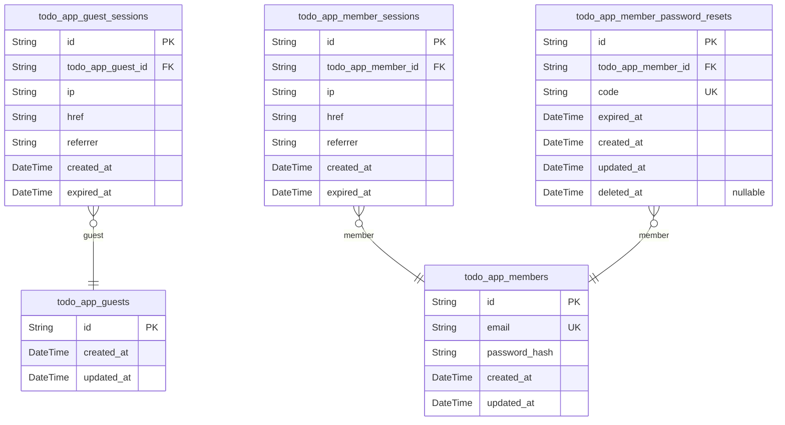
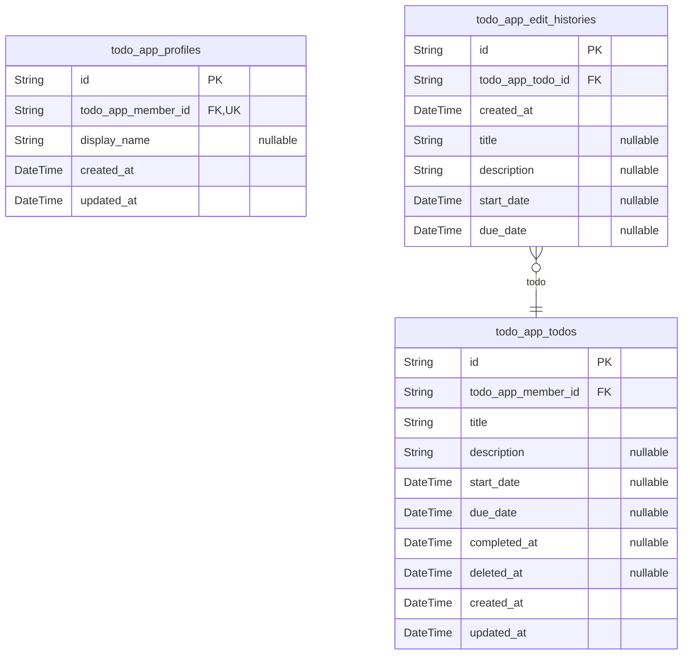

# Prisma Markdown

> Generated by [`prisma-markdown`](https://github.com/samchon/prisma-markdown)

- [todo_identity](#todo_identity)
- [todo](#todo)

## todo_identity

### `todo_app_guests`

Stores temporary guest identifiers for unauthenticated visitors.

Guests are anonymous users who have not yet signed up or logged into the
application. Each guest record represents a unique unauthenticated
visitor tracked by the system. Guest records do not store any personal
information, credentials, or persistent user data — they serve only as
lightweight identifiers for anonymous sessions. When a guest transitions
to a [todo_app_members](#todo_app_members) account via sign-up or login, or when their
session expires, the guest record is hard-deleted in accordance with the
policy that all guest data is discarded without recovery.

Guest session details such as tokens, IP addresses, and expiration
timestamps are stored separately in [todo_app_guest_sessions](#todo_app_guest_sessions),
which maintains a one-to-many relationship with this table.

Properties as follows:

- `id`
  > Primary Key. A unique identifier generated for each unauthenticated guest
  > visitor.
- `created_at`
  > Creation timestamp of this guest record. Set automatically when the guest
  > identifier is first created to track when the anonymous session began.
- `updated_at`
  > Last update timestamp of this guest record. Updated whenever the guest
  > record is modified.

### `todo_app_guest_sessions`

Temporary session tokens for anonymous guest visitors, tracking their
browsing activity with expiration-based security.

Each [todo_app_guests](#todo_app_guests) can have multiple guest sessions over time,
each representing a separate anonymous visit to the application. Sessions
are append-only — once created, they are never modified or deleted. When
a session expires (based on `expired_at`), the guest must establish a new
session. The session records the client IP address, the current page URL
(`href`), and the referring page URL (`referrer`) for basic analytics and
security auditing. Expired sessions remain in the database as an audit
trail.

Properties as follows:

- `id`: Primary Key — uniquely identifies each guest session token.
- `todo_app_guest_id`
  > Foreign key to the [todo_app_guests](#todo_app_guests) table. Identifies the guest
  > whose anonymous session this token belongs to.
  >
  > Each guest can have multiple sessions over time, each representing a
  > separate browsing visit. This establishes the 1:N relationship between a
  > guest and their session history.
- `ip`
  > Client IP address of the guest at session creation time. Used for basic
  > security auditing and rate-limiting analysis.
- `href`
  > Current page URL that the guest was accessing when the session was
  > established. Records the entry point of the session.
- `referrer`
  > The HTTP referrer URL indicating which page directed the guest to the
  > application. Empty string if no referrer was provided.
- `created_at`
  > Timestamp when the guest session was created and the session token became
  > valid.
- `expired_at`
  > Timestamp indicating when this guest session expires. After this time,
  > the session token is no longer valid, and the guest must establish a new
  > session. Non-nullable for security — every session has a defined
  > expiration boundary.

### `todo_app_members`

Core authentication table storing registered member accounts with email
and password credentials.

Each member is uniquely identified by their email address, which serves
as the login identifier and cannot be changed after account creation.
Authentication is password-based using a securely hashed password.
Profile data such as display name is stored in the `{@link
todo_app_profiles}` table in a one-to-one relationship.

Members own all their todos (`[todo_app_todos](#todo_app_todos)`), edit history
entries (`[todo_app_edit_histories](#todo_app_edit_histories)`), and active sessions (`{@link
todo_app_member_sessions}`). Password recovery is managed through `{@link
todo_app_member_password_resets}`.

Account deletion is a hard delete — when a member deletes their account,
this record and all associated data (todos, edit history, sessions,
profile) are permanently removed with no recovery possible.

Properties as follows:

- `id`: Primary key — unique identifier for each member account.
- `email`
  > Unique email address serving as the member's login identifier and
  > identity anchor. Used during authentication and to enforce data ownership
  > boundaries across all domain entities. Cannot be changed after account
  > creation. Must be unique across all members.
- `password_hash`
  > Securely hashed representation of the member's password, computed using a
  > strong one-way hashing algorithm (e.g., bcrypt). Used during login to
  > verify the member's identity against the provided password.
- `created_at`
  > Timestamp indicating when the member account was created, set
  > automatically upon successful registration.
- `updated_at`
  > Timestamp indicating when the member account record was last modified,
  > updated automatically on password changes or other credential updates.

### `todo_app_member_sessions`

Stores authenticated member login sessions with origin tracking and
expiration.

The [todo_app_member_sessions](#todo_app_member_sessions) table records each authenticated
session for a [todo_app_members](#todo_app_members) actor. Each session captures the
member's IP address, the page URL (href) where the session was initiated,
and the HTTP referrer. Sessions have a creation timestamp and a mandatory
expiration timestamp for security. When a session expires, the member
must re-authenticate to obtain a new session. This table follows the
standard session pattern and is append-only — sessions are never modified
after creation.

Properties as follows:

- `id`: Primary key.
- `todo_app_member_id`
  > Foreign key to the [todo_app_members](#todo_app_members) table identifying the
  > authenticated member who owns this session.
  >
  > Each session belongs to exactly one member. A member may have multiple
  > concurrent sessions, each tracked independently.
- `ip`
  > IP address from which the session was initiated.
  >
  > Used for audit logging and identifying the geographical/network origin of
  > the session request.
- `href`
  > Full URL of the page where the session was initiated.
  >
  > Captures the member's entry point URL for audit and analytics purposes.
- `referrer`
  > HTTP Referer header value from the session initiation request.
  >
  > Indicates the previous page the member visited before starting this
  > session, useful for navigation flow analysis.
- `created_at`
  > Timestamp when the session was created.
  >
  > Set at session initiation and never modified.
- `expired_at`
  > Timestamp when the session expires and becomes invalid.
  >
  > Members must re-authenticate after expiration. This field is always set
  > (non-nullable) for security purposes, ensuring all sessions have a finite
  > lifetime.

### `todo_app_member_password_resets`

Stores password reset tokens with expiration timestamps for password
recovery workflows.

Each [todo_app_members](#todo_app_members) can request a password reset, which
generates a unique token with an expiration time. The token is used to
verify the member's identity before allowing them to set a new password.
Once used or expired, the token becomes invalid.

Properties as follows:

- `id`: Primary Key.
- `todo_app_member_id`
  > The member who requested this password reset.
  >
  > References [todo_app_members](#todo_app_members) as the owner of this reset request.
- `code`
  > Unique reset token used to verify the reset request.
  >
  > Generated cryptographically and sent to the member's email for
  > verification.
- `expired_at`
  > Timestamp when this reset token expires.
  >
  > After expiration, the token can no longer be used to reset the password.
- `created_at`: Timestamp when this reset token was created.
- `updated_at`: Timestamp when this reset token was last updated.
- `deleted_at`
  > Soft delete timestamp. If set, this reset token is considered deleted or
  > consumed.

## todo

### `todo_app_profiles`

One-to-one profile extension for [todo_app_members](#todo_app_members), storing the
display name.

Each member has exactly one profile, created alongside the member account
at registration. The display name is optional at signup but can be set or
updated later through profile management. The profile is permanently
deleted when the member deletes their account — there is no soft-delete
or trash lifecycle for profiles.

This table stores only display name data. Authentication and identity
fields (email, password_hash) reside in the parent {@link
todo_app_members} table. The 1:1 relationship is enforced by a unique
constraint on [todo_app_profiles.todo_app_member_id](#todo_app_profiles).

Properties as follows:

- `id`: Primary key.
- `todo_app_member_id`
  > Foreign key referencing the owning member's account in {@link
  > todo_app_members}. Enforces the exclusive 1:1 relationship — each member
  > has exactly one profile.
- `display_name`
  > Member's display name shown on their profile. Optional at account
  > creation (section [19]) but can be set or changed later through profile
  > management (section [11]).
- `created_at`: Timestamp when this profile was created, set at account registration.
- `updated_at`
  > Timestamp when this profile was last updated, typically when the display
  > name is changed.

### `todo_app_todos`

Core todo items created and managed by a member within their private
workspace.

Each [todo_app_todos](#todo_app_todos) belongs to exactly one {@link
todo_app_members} and represents a personal task tracked by the user. A
todo has a required title and optional description, start date, and due
date (stored as date-only values — the time component is semantically
ignored). Todos default to an incomplete state upon creation; completion
is tracked via a nullable `completed_at` timestamp, where a non-null
value indicates the task is complete. The `deleted_at` field enables
soft-delete lifecycle management: active todos have `deleted_at IS NULL`,
while deleted todos reside in the trash. Restoring a todo clears
`deleted_at`, and permanent deletion removes the record entirely along
with its associated edit histories.

Sorting behavior: when sorting by start_date or due_date ascending,
records with null values appear at the end. Filtering supports completion
status (all, complete, incomplete) via the `completed_at` field.

Properties as follows:

- `id`: Primary key.
- `todo_app_member_id`
  > Foreign key referencing the [todo_app_members](#todo_app_members) who owns this todo.
  >
  > Each todo is owned by exactly one member. The member's identity is
  > immutable after creation. This relationship enforces strict data
  > isolation — a member can only access todos where their ID matches this
  > field.
- `title`
  > Title of the todo item.
  >
  > Must be a non-empty string. This is the primary visible label of the todo
  > and is required at creation time.
- `description`
  > Optional detailed description of the todo.
  >
  > Provides additional context beyond the title. Can be left empty or
  > omitted at creation.
- `start_date`
  > Optional start date for the todo (date-only value; time component is
  > semantically ignored).
  >
  > When sorting by start date ascending, todos with a null start_date appear
  > after all todos that have a start_date set.
- `due_date`
  > Optional due date for the todo (date-only value; time component is
  > semantically ignored).
  >
  > When sorting by due date ascending, todos with a null due_date appear
  > after all todos that have a due_date set.
- `completed_at`
  > Timestamp indicating when the todo was marked as complete.
  >
  > A null value means the todo is incomplete. A non-null value means the
  > todo is complete, with the timestamp recording when the completion toggle
  > occurred.
- `deleted_at`
  > Timestamp indicating when the todo was soft-deleted and moved to trash.
  >
  > A null value means the todo is active and visible in the normal todo
  > list. A non-null value means the todo is in the trash. Restoring the todo
  > clears this field. Permanent deletion removes the record entirely.
- `created_at`: Timestamp when the todo was created.
- `updated_at`: Timestamp when the todo was last updated.

### `todo_app_edit_histories`

Audit log entries recording each edit made to a [todo_app_todos](#todo_app_todos).

Each entry captures the timestamp of when the edit occurred and the new
values for any fields that were modified during that edit. Fields that
remained unchanged are recorded as null. History entries are immutable
after creation and are sorted from most recent to oldest. When a todo is
permanently deleted, its associated edit history entries are also
cascade-deleted.

Edit history is only accessible to the member who owns the parent todo,
maintaining strict data isolation between users as defined in the data
ownership policies.

Properties as follows:

- `id`: Primary Key.
- `todo_app_todo_id`
  > Foreign key to the [todo_app_todos](#todo_app_todos) that this edit history entry
  > belongs to.
  >
  > Each history entry is owned by exactly one todo. When the parent todo is
  > permanently deleted, all associated edit history entries are
  > cascade-deleted. The todo itself is owned by a member, and access to this
  > history is restricted to that member only.
- `created_at`
  > Timestamp of when the edit was made.
  >
  > Used for sorting history entries from most recent to oldest, as required
  > by the edit history viewing workflow.
- `title`
  > The new title value after the edit.
  >
  > Null if the title was not changed during this edit.
- `description`
  > The new description value after the edit.
  >
  > Null if the description was not changed during this edit.
- `start_date`
  > The new start date value after the edit.
  >
  > Null if the start date was not changed during this edit. Date-only values
  > are stored with time set to midnight.
- `due_date`
  > The new due date value after the edit.
  >
  > Null if the due date was not changed during this edit. Date-only values
  > are stored with time set to midnight.
