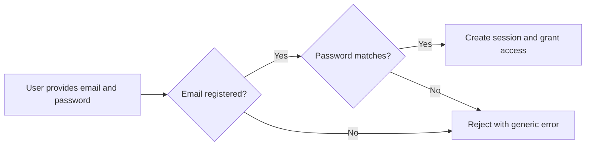

**todoApp — Actor definitions, permission matrix, authentication, session, account lifecycle**

Actor definitions, permission matrix, authentication, session, account lifecycle

# Actor Definitions

Define all user actor types with their identity, permissions, and access boundaries.

## guest Actor

The guest actor represents any unauthenticated visitor who has not yet signed up or logged into the application. Guests have the most restricted set of permissions and can only access the sign-up and login pages. They cannot view, create, edit, delete, or interact with any todo items or user profiles. The guest actor's identity is not tied to a specific user account, so the system treats them as anonymous until they provide valid credentials. If a guest attempts to access any protected page such as the todo list, trash, or profile settings, the system redirects them to the login page. Guests who attempt to navigate directly to a protected URL receive an access-denied response and are prompted to authenticate. Once a guest successfully signs up or logs in, they transition to the member actor role and gain full access to their own data. The guest actor exists only in an unauthenticated session state and has no persistent data associated with them.

### Guest Actor Definition

The guest actor represents any unauthenticated visitor who has not yet signed up or logged into the application. Guests interact with the system through an anonymous session that carries no user identity. No persistent data is associated with a guest session — the system does not store preferences, history, or any state tied to the guest. Once the guest closes their browser or their session expires, any temporary session state is discarded without recovery.

### Access Boundaries

Guests have the most restricted set of permissions in the application. They cannot view, create, edit, delete, or interact with any todo items, user profiles, or any other protected resources. Guests cannot access:
- The todo list or any individual todo
- The trash or deleted items
- Profile settings or account management
- Any other user's data or profile
All protected pages are inaccessible to guests. The only operations available to a guest are accessing the sign-up page and the login page.

### Sign-up and Login Page Access

Guests can access the sign-up page to create a new account. On the sign-up page, they provide an email address and password to register as a new member; providing a display name is optional. Guests can also access the login page to authenticate with existing credentials. The sign-up and login pages are the only two pages in the application that guests are permitted to view and interact with.

### Protected Page Redirect and Access Denied

If a guest attempts to access any protected page — such as the todo list, trash, profile settings, or any URL that requires authentication — the system redirects them to the login page. If a guest navigates directly to a protected URL (e.g., by typing a URL or following a bookmark), the system returns an access-denied response and displays a prompt asking the guest to authenticate before proceeding.

### Actor Role Transition

A guest transitions from the guest actor role to the member actor role when they successfully complete one of the following:
- Signing up: The guest provides a valid email and password, creates a new account, and is authenticated into the new member session.
- Logging in: The guest provides valid credentials for an existing account and is authenticated into the existing member session.
Once the transition occurs, the guest session is replaced by the authenticated member session. The guest actor exists only in an unauthenticated state and has no persistent data carried over to the member actor.

## member Actor

The member actor represents an authenticated user who has successfully signed up and logged into the application. Members have full access to their own data including todos, edit history, trash, and profile settings. Each member is identified by their unique email address and is authenticated via a password-based login. Members can view and edit their own profile display name, manage their password, and delete their account if desired. The member actor cannot access any other user's todos, profiles, or data as the application enforces strict privacy boundaries between accounts. Members operate within a private workspace where they can create, view, edit, complete, delete, and restore their own todo items. Every action performed by a member is scoped to their own user identity, and the system records their edits in the todo's history. If a member's session expires or they log out, they revert to the guest actor role and must re-authenticate to regain access. The member actor is the primary user role in the application with all functional capabilities centered around personal todo management.

### Member Actor Definition

The member actor represents an authenticated user of the Todo application. Any individual who has completed the sign-up process and successfully logged in is a member. Members are the primary users of the system and operate within a strictly private, personal workspace. A member's identity is tied to their registered email address, and all actions performed while authenticated are attributed to that member. When a member logs out or their session expires, they transition to the guest actor role and lose access to their data until they re-authenticate.

### Email Identity

Each member is uniquely identified by their email address. The email address serves as the member's public-facing identifier for authentication purposes. No two members can share the same email address. The email address and password are established at the time of registration (defined in [Registration and Login]); the display name is optional at signup. The email address cannot be changed after account creation. The system uses the email address to recognize the member during login and to enforce data ownership boundaries — every todo, edit history entry, and profile setting is associated with the member's email identity.

### Password-Based Authentication

Members authenticate using a password associated with their email address. The password is selected by the member at registration and can be changed later through the account management flow (defined in [Account Management]). The system verifies the member's identity by confirming that the provided password matches the registered email address. Authentication is a prerequisite for accessing any member-only features, including viewing, creating, editing, completing, deleting, and restoring todos. Without successful password-based authentication, a user remains in the guest actor role with no access to member data.

### Private Workspace

Every member has a private workspace that contains only their own todos, edit history, and trash. The workspace is created upon the member's first login and persists until the member deletes their account. Within this workspace, the member has full visibility and control over their todo items. No other member or guest can access, view, or interact with this workspace. The private workspace is the exclusive environment where the member performs all personal todo management activities.

### Own Data Access

Members have exclusive access to their own data, including all todos they have created (both active and deleted), their edit history, their profile information, and their account settings. A member can view, modify, and manage any of their own todos and their associated data. Under no circumstances can a member access another member's data, and no mechanism exists to share, transfer, or expose data between members. This access is available only while the member holds an active authenticated session.

### Profile Management Capability

Members can manage their own profile, specifically their display name. The display name is visible only to the member themselves — the application does not expose profiles to other users. Profile editing is a self-service capability available to authenticated members through their account settings. Members cannot view or modify any other member's profile information.

### Account Deletion Capability

Members have the capability to permanently delete their own account. When an account is deleted, all associated data including todos, edit history, and trash contents are permanently removed from the system. Account deletion is irreversible and can only be performed by the member themselves while authenticated. The detailed process for account deletion is defined in [Account Management].

### Privacy Boundaries

Strict privacy boundaries exist between all member accounts. Each member operates in complete isolation from every other member. There is no functionality to view, search for, or interact with another member's data, profile, or activity. Members cannot see how many other users exist on the platform, cannot view other members' display names, and cannot access any todos or edit history belonging to other accounts. These privacy boundaries are enforced at all times, regardless of authentication status.

### Session-Based Access

A member's access to their data is gated by an active authenticated session. The session is established upon successful login and persists until the member logs out, the session expires, or the account is deleted. While the session is active, the member can perform all permitted operations within their private workspace. The session also defines the duration of uninterrupted access — after session expiry, the member is reverted to the guest role and must re-authenticate to regain access. Session management details, including session duration and logout behavior, are defined in [Session and Logout].

### Role Transition from Guest to Member

A user begins as a guest actor with no access to any member data. Upon successful registration and login, the guest transitions to a member actor. This transition is unidirectional from the system's perspective: a user goes from unauthenticated (guest) to authenticated (member) by providing valid credentials. The transition grants the user all member capabilities and creates their private workspace context. Conversely, when a member logs out or their session expires, they revert to the guest role, losing access to their private workspace until they re-authenticate.

### Re-Authentication Requirement

Members who lose their authenticated session — whether through logout, session expiration, or browser closure — must re-authenticate by providing their email address and password to regain access to their private workspace. There is no persistent or automatic re-authentication mechanism. Re-authentication re-establishes the member's session and restores full access to their todos, edit history, trash, and profile settings. Until re-authentication occurs, the user remains in the guest role with access limited to the sign-up and login pages only.

### Personal Todo Management Scope

The member actor is responsible for managing their own personal todo items. The scope of this management includes creating new todos with a title and optional description, start date, and due date; viewing their todo list with pagination and filtering; viewing individual todo details; toggling completion status; editing todo fields; deleting todos (soft delete to trash); viewing trash; restoring todos from trash; and permanently deleting todos from trash. All of these operations are performed within the member's private workspace and are associated with the member's identity. The detailed functional requirements for each operation are defined in [03-functional-requirements.md].

### Edit History Recording Under Member Identity

Every edit operation performed by a member on one of their todos is automatically recorded in that todo's edit history. Each history entry captures the member's previous values, including what the title, description, start date, and due date were changed from, along with a timestamp of when the edit was made. The edit history is owned by the todo and is accessible only to the member who owns that todo. The history is sorted from most recent to oldest. This recording is automatic — no explicit action is required from the member to create history entries.

# Authentication Flows

Registration, login, logout, and session management from a user perspective.

## Registration and Login

Define user registration and login flows including validation and error handling.

### Registration

Guests (as defined in [guest Actor]) can register for a new account by providing:

- An email address (required) — serves as the user's unique identifier within the system
- A password (required) — used for subsequent authentication
- A display name (optional) — the name displayed on the user's profile

Upon successful registration:
- A new member account is created and linked to the provided email address
- The user is automatically authenticated (a session is created as defined in [Session and Logout])
- The user is granted access to their private workspace

Registration is rejected if:
- The email address is already associated with an existing account
- The password does not meet the minimum requirements (defined in [04-business-rules.md])

When registration is rejected, the system indicates the reason for the failure so the user can correct their input.

### Login

Registered members (as defined in [member Actor]) can log in to access their account by providing:

- Their registered email address
- Their password

The system verifies the provided email and password against stored account credentials.

Upon successful login:
- A session is created (as defined in [Session and Logout])
- The user is granted access to their private workspace, including their todos, profile, and account management features

Login is rejected if:
- The email address does not match any registered account
- The password does not match the stored password for the given email address

The system returns a generic error message when credentials are invalid, without disclosing whether the email address or the password was incorrect.

### Authentication Flow

Authentication is the process of verifying a user's identity by confirming their credentials (email and password) to grant access to their private workspace.

The authentication flow proceeds as follows:

1. The user provides their email address and password
2. The system checks whether the email address corresponds to a registered member account
3. If the email address exists, the system verifies that the provided password matches the stored password for that account
4. If both checks pass, the user is authenticated and a session is established (as defined in [Session and Logout])
5. If either check fails, authentication is denied with a generic error

Authentication rules:
- Only guests can register; members are already authenticated
- Only members can log in; guests do not have credentials to verify
- A single failed authentication attempt does not lock the account

## Session and Logout

Define session behavior and logout from a user perspective.

### Session Behavior

When a member successfully logs in, the system creates an active session that persists until the member logs out. During an active session, the system recognizes the member and authorizes them to access and manage their own todos and account settings.

The session remains active across page visits or interactions without requiring the member to re-enter their credentials. The system maintains the session for a reasonable duration of inactivity before expiring it automatically. If a session expires due to inactivity, the member is required to log in again to create a new session.

### Logout Process

A member can log out at any time by requesting to end their current session. When a member logs out:

- The system immediately ends the active session
- The member is no longer recognized as authenticated
- Access to todo data and account features is no longer granted until the member logs in again
- No data loss occurs — all todos and edit history are preserved

The logout process is explicit and intentional; a member is never logged out automatically during active use. After logout, the member is returned to the unauthenticated (guest) experience and can only access the sign-up page and login page.

### Session Security

The system ensures that each session is uniquely tied to a single member. A session cannot be transferred, shared, or used by another member or by a guest.

If a member changes their password (as described in Module 3 - Account Management), all existing sessions for that member are invalidated, requiring the member to log in again with the new password. This ensures that a password change immediately secures all active access points.

If a member deletes their account (as described in Module 3 - Account Management), the session is immediately terminated and cannot be resumed.

# Account Lifecycle

Account creation, deletion, and password management.

## Account Management

Define how users create accounts, delete accounts, and change passwords.

### Account Creation

A new user account is created when a person provides an email address, a password, and a display name. The display name is required at sign-up alongside the email address and password. The email address identifies the account and must not already be in use by another user. Upon successful creation, the person becomes a member actor (defined in [01-actors-and-auth.md > member Actor]) and is granted full ownership of their private workspace.

The account stores the following information upon creation:
- The email address provided during sign-up
- A secured representation of the password
- The display name provided during sign-up

### Account Deletion

A member user can request permanent deletion of their own account. When deletion is confirmed:
- All todos owned by the user are permanently removed, including todos in the trash
- All edit history entries belonging to those todos are permanently removed
- The account credentials (email address and password) are permanently removed
- The user is logged out of any active sessions

Once the deletion process completes, the account cannot be recovered. Any future attempt to sign up with the same email address is treated as a new account creation.

### Password Change

A member user can change their account password at any time. To change the password, the user must provide their current password for verification. If the current password is correct, the system updates the password to the new value. If the current password is incorrect, the password change request is rejected. After a successful password change, the user remains logged in to their current session.