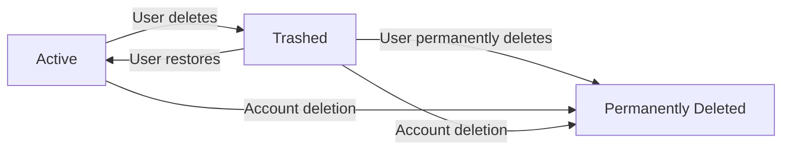
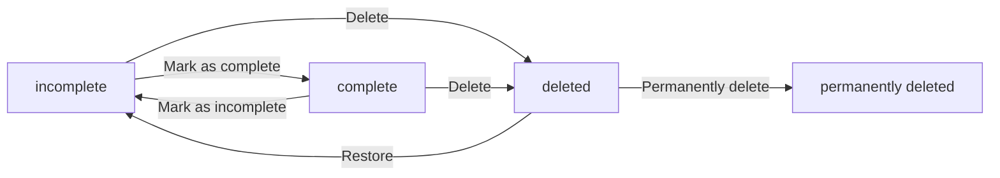

**todoApp — Business concepts, relationships, and states from user perspective**

Business concepts, relationships, and states from user perspective

# Domain Concepts

Describe what each concept means in the business domain and its key attributes.

## User Concept

A User represents an individual account holder who owns and manages their own todos within the application. Each User is identified by their email address, which serves as their unique sign-in credential. The User also maintains a password for authentication and a display name that appears throughout the application. A User is the sole owner of their data — todos, edit histories, and trash contents all belong to a specific User and are inaccessible to other Users. The domain treats the User as the primary entity around which all privacy and ownership rules revolve. A User's account holds their profile information as well as all associated todo items they create. There is no sharing or visibility between different User accounts, making each User a completely isolated data owner.

### User as a Business Concept

A User represents a single account holder in the todo application. Each User corresponds to one real person who manages their personal tasks and activities. The User is the central entity around which all privacy and data ownership rules are structured. No User can operate without an account, and every action within the application — creating, viewing, editing, deleting todos — is performed within the context of a specific User. From a business perspective, the User is the sole customer of the system; there are no organizational accounts, team accounts, or shared profiles.

### User Attributes and Identity

Each User is identified by their **email address**, which serves as their unique, non-changeable identifier within the system. No two Users can share the same email address. The User authenticates using a **password** associated with their account, which can be changed by the User at any time.

Every User has a **display name** that appears within their own interface and serves as a personalized label for their profile. The display name is **required at signup** — each User must provide it when creating their account. After signup, the display name can be edited by the User at any time.

These three attributes — email address, password, and display name — constitute the User's **profile information**. The profile is private and cannot be viewed by anyone other than the owning User.

### User as Data Owner

A User is the sole and exclusive owner of all data associated with their account. This includes:

- All todos the User creates
- All edit history records belonging to those todos
- All items currently in the User's trash

Each User's data is completely isolated from every other User. There is no mechanism for one User to view, access, search, or interact with another User's todos, edit histories, trash, or profile information. The **user–todo ownership relationship** is one-to-many: a User can own many todos, and each todo belongs to exactly one User.

When a User deletes their account (including all todos and trash items), the system treats that User's data as permanently removed with no recovery path. This reinforces the concept that each User operates within a fully private, self-contained data boundary.

## Todo Concept

A Todo represents a task or item that a User creates to track something they need to do or remember. Each Todo has a title that is always required — this is the core identifier of the todo item. A Todo may optionally have a description providing additional details, a start date indicating when work begins, and a due date indicating the deadline. Every Todo has a completion status that tracks whether the task is done or still open — newly created todos always start as incomplete. The Todo also records its creation date and maintains its own edit history. A Todo can be in one of two lifecycle states: active (visible in the normal todo list) or deleted (moved to trash after soft deletion). Each Todo belongs exclusively to one User and cannot be accessed by any other User.

### Todo as a Task Item

A Todo represents a task or action item that a User creates to track something they need to accomplish or remember. Each Todo is a self-contained unit of work that carries essential information about what needs to be done, when it should be started, and by when it must be completed. The Todo is the core data object in the application — every interaction a User has with the system revolves around creating, viewing, updating, or managing their Todos.

### Todo Attributes

Every Todo has the following attributes:

- **Title**: A required attribute that serves as the primary identifier of the todo. Every todo must have a title — it is the minimal information needed to create a todo item.
- **Description**: An optional free-form text field that allows the User to add additional details, notes, or context about the task. This can be left empty when creating a todo.
- **Start Date**: An optional date indicating when the task is scheduled to begin. This can be left empty if no specific start date is needed.
- **Due Date**: An optional date indicating the deadline by which the task should be completed. This can be left empty if there is no deadline.
- **Completion Status**: A binary indicator that tracks whether the task is done or still open. A newly created todo always starts with a completion status of **incomplete**. The status can later be toggled between complete and incomplete.
- **Creation Date**: The date and time when the todo was first created. This is automatically recorded by the system and cannot be modified by the User.

### Todo Lifecycle States

Each Todo exists in one of two lifecycle states:

- **Active**: The todo is visible in the normal todo list. The User can view, edit, complete, or delete it. This is the default state for all newly created todos.
- **Deleted**: The todo has been removed from the normal todo list through a soft deletion. It moves to the trash area where the User can either restore it back to active or permanently erase it. While in the deleted state, the todo cannot be edited, completed, or viewed through the normal todo list — it is only accessible through the trash view.

### User-Todo and Edit History Ownership

Each Todo belongs exclusively to a single User (ownership defined in [User Concept]). The owning User has full control over their todos — only they can view, create, edit, complete, delete, or restore their own todos. No other User can access or interact with a Todo that belongs to another User.

Each Todo also owns its own collection of edit history entries (defined in [EditHistory Concept]). Whenever the Todo's attributes are changed, a new history entry is recorded and associated with that specific todo. The edit history remains with the todo throughout its lifecycle — even when the todo is in the deleted state, the history entries persist until the todo is permanently deleted.

## EditHistory Concept

An EditHistory represents a recorded snapshot of changes made to a Todo whenever its content is modified. Each EditHistory entry captures exactly when the edit was made and what the title, description, start date, and due date were changed to at that point. This means every field change is tracked individually — if only the title changed, the history records the new title value while the other fields reflect their unchanged values. EditHistory entries belong to a specific Todo and are ordered from most recent to oldest, providing a chronological record of how the todo evolved over time. The domain treats EditHistory as a child entity of its parent Todo — when a Todo is permanently deleted, all its associated edit history entries are also removed. EditHistory is read-only from the user perspective: entries are automatically created by the system whenever an edit occurs and cannot be manually created, modified, or deleted.

### EditHistory Domain Concept and Business Meaning

EditHistory is a business concept that represents a snapshot of a Todo's state before an edit occurred. Each entry records what the todo looked like just prior to the modification, serving as an audit trail of changes over time.

**Purpose**: The EditHistory concept exists to provide transparency and accountability — users can review how their todo evolved, see what values were changed, and understand when changes happened. It answers the question "what did this todo look like before I made that change?"

**Nature**: EditHistory is a passive, archival concept. Entries are never actively used during normal todo operations (viewing, completing, editing). They are only accessed when a user explicitly chooses to review the edit history of a specific todo. The entries themselves are immutable once created.

**Scope**: Only field-level edits to a Todo's core attributes (title, description, start date, due date) generate history entries. Operations such as completing, deleting, or restoring a todo do not create EditHistory entries, as these are status or lifecycle changes rather than content edits.

### EditHistory Key Attributes

Each EditHistory entry captures a complete before-edit snapshot of a Todo. The entry records the following attributes:

| Attribute | Description |
|-----------|-------------|
| **Edit timestamp** | The exact date and time when the edit was saved. This is automatically recorded by the system and cannot be set or modified by any user. It establishes when the historical snapshot was taken. |
| **Previous title** | The value of the todo's title immediately before the edit was applied. If the edit created the title for the first time (the todo previously had no title — this is not possible as title is required), this would reflect the previous state. Since title is always required, this field always contains a value. |
| **Previous description** | The value of the todo's description immediately before the edit was applied. If the description was empty before the edit, this field records an empty value. This allows tracking both additions and removals of description content. |
| **Previous start date** | The value of the todo's start date immediately before the edit was applied. If no start date was set, this field is empty. This allows tracking when a start date is added, changed, or removed. |
| **Previous due date** | The value of the todo's due date immediately before the edit was applied. If no due date was set, this field is empty. This allows tracking when a due date is added, changed, or removed. |

Each history entry captures all four previous-attribute values regardless of which attribute(s) actually changed. Even if only the description was modified, the entry still records the preceding title, start date, and due date values as they stood before the edit. This ensures each entry is a complete before-snapshot, not a partial change log.

### EditHistory Lifecycle, Ordering, and Relationships

**Child entity relationship**: EditHistory is a child entity of Todo (defined in Todo Concept). Each Todo may have zero or more EditHistory entries. A newly created Todo has no edit history — entries accumulate only as the owner edits the todo over its lifetime. An EditHistory entry cannot exist without its parent Todo.

**Automatic entry creation**: EditHistory entries are created automatically by the system whenever a user edits a Todo's title, description, start date, or due date. The user cannot manually create, duplicate, or import history entries. The entry is generated at the exact moment the edit is saved, capturing the before-edit state of all four attributes.

**Read-only nature**: Once created, EditHistory entries are immutable. Users cannot modify, delete individual entries, reorder them, or clear the history. The entries are permanent records preserved for the lifetime of the parent Todo.

**Cascading deletion**: When a Todo is permanently deleted (removed from trash), all its EditHistory entries are also permanently deleted. This cascading deletion is automatic and unconditional — history entries cannot be preserved without their parent Todo. Soft deletion (moving a todo to trash) does not remove EditHistory entries; they persist and remain accessible as long as the todo exists in the system.

**Chronological ordering**: EditHistory entries are ordered chronologically from most recent to oldest. When a user views the edit history of a todo, the most recent edit appears first, followed by progressively older entries. This ordering is maintained automatically by the system based on the edit timestamp and cannot be changed by the user.

**Chronological change record**: Taken together, the ordered entries form a complete chronological record of how the todo evolved. By comparing consecutive entries, a user can determine exactly what changed in each edit — the previous values of the first-matching entry compared against the current state of the todo (or against the next more recent entry) reveals the changes made at each step.

# Domain Relationships

Describe how concepts relate to each other from a business perspective.

## Conceptual Relationships

Describe how concepts relate to each other in business terms.

### User–Todo Ownership Relationship

Each User owns multiple Todo items. This is a one-to-many relationship from the user's perspective: a User **has many** Todo items, and each Todo **belongs to** exactly one User. The ownership is established at the moment of creation — when a User creates a new Todo, it is automatically associated with that User and cannot be transferred to another User. This ownership is the foundation of the application's privacy model: a User may only view, edit, delete, or otherwise interact with Todos they own.

### Todo–EditHistory Relationship

Each Todo has a history of changes recorded over time. A Todo **has many** EditHistory entries, and each EditHistory entry **belongs to** exactly one Todo. When a User edits a Todo's title, description, start date, or due date, a new EditHistory entry is created and associated with that Todo. The association is permanent: an EditHistory entry belongs to its parent Todo for the lifetime of the Todo. If a Todo is permanently deleted, its associated EditHistory entries are also removed.

### Conceptual Entity Map

The application has three business concepts connected through clear ownership relationships:

| Entity | Owned By | Has Children |
|--------|----------|-------------|
| User | — | Many Todos |
| Todo | Exactly one User | Many EditHistory entries |
| EditHistory | Exactly one Todo | — |

**Key characteristics of these relationships:**
- **Ownership is exclusive**: A Todo belongs to one User only. There is no sharing, transferring, or collaborative ownership of Todos.
- **Ownership is hierarchical**: User → Todo → EditHistory. Each level cascades from the one above it.
- **Ownership is permanent for EditHistory**: Once an EditHistory entry is recorded, its association with its parent Todo never changes.
- **Cascade scope**: When a User deletes their account, all Todos (including those in the trash) are permanently deleted, and consequently all EditHistory entries are removed as well.

## Lifecycle and Retention

Describe concept lifecycle states and transitions only. Detailed retention/recovery policies belong in 05-non-functional. Operation details belong in 03-functional-requirements.

### Todo Lifecycle States

A todo passes through three lifecycle states:

| State | Description |
|-------|-------------|
| **Active** | The todo is visible in the user's normal todo list. It may be either incomplete or complete (defined in Business Category Definitions). |
| **Trashed** | The todo has been deleted by its owner. It is no longer visible in the normal todo list but appears in the trash view. The todo and its edit history are preserved. |
| **Permanently Deleted** | The todo and all its associated edit history have been erased from the system. This state is irreversible. |

**Lifecycle Flow:**

### Deletion Policy

When a user deletes a todo from the normal todo list, the todo enters the **Trashed** state (soft delete). The todo and its full edit history remain in the system. Trashed todos continue to be owned by the same user and subject to the same privacy rules — no other user can view them.

When a user permanently deletes a todo from the trash, the todo and its associated edit history are removed from the system entirely. This action is irreversible.

When a user deletes their account, all their todos — including those in the Trashed state — are permanently deleted along with their edit histories.

### Recovery from Trash

A user may restore a trashed todo at any time. When restored, the todo returns to the **Active** state and reappears in the user's normal todo list. The todo's attributes (title, description, start date, due date, completion status) and edit history are preserved exactly as they were before deletion.

Restoration does not create an edit history entry — it is a lifecycle operation, not an edit.

### Account Deletion Impact

Account deletion is a distinct process (detailed in 01-actors-and-auth.md). From the domain perspective, when a user's account is deleted:

1. All **Active** todos (including both incomplete and complete) are permanently deleted.
2. All **Trashed** todos are permanently deleted.
3. All associated **EditHistory** records are permanently deleted.
4. No trace of the user's todos or their history remains in the system.

This policy applies equally regardless of whether individual todos were in Active or Trashed state at the time of account deletion.

# Business Categories and State Flows

Business category classifications and state flow definitions.

## Business Category Definitions

Define all business category classifications with their allowed values and descriptions.

### Todo Completion Status

The **completion status** is a classification that indicates whether a todo has been finished by its owner.

**Allowed values:**

| Value | Description |
|-------|-------------|
| `incomplete` | The todo has not yet been completed. This is the default status when a todo is created. |
| `complete` | The todo has been marked as finished by its owner. |

This status is toggled by the owner between the two values (see [Module 3 > State Transitions] for the transition flow). Only one value applies at a time.

### Todo Deletion Status

The **deletion status** is a classification that determines whether a todo is visible in the normal todo list or has been moved to the trash.

**Allowed values:**

| Value | Description |
|-------|-------------|
| `active` | The todo is visible in the normal todo list. All newly created todos start with this status. |
| `deleted` | The todo has been soft-deleted and is only visible in the trash list. It no longer appears in the normal todo list. |

While deleted, the todo and its edit history still exist in the system and can be restored to `active` or permanently removed. The distinction between soft-delete and permanent delete is covered in [Lifecycle and Retention].

### Filter Option for Todo List

The **filter option** is a classification that allows the owner to narrow which todos appear in their list view.

**Allowed values:**

| Value | Description |
|-------|-------------|
| `all` | All non-deleted todos are shown regardless of completion status. |
| `complete` | Only completed todos are shown. |
| `incomplete` | Only incomplete todos are shown. |

This classification applies only to the normal todo list view. Filtering rules and pagination behavior are defined in [04-business-rules.md].

### Sort Preference for Todo List

The **sort preference** is a classification that controls the ordering of todos in the list view. It consists of two dimensions: a field to sort by and a direction.

**Allowed sort fields:**

| Field | Description |
|-------|-------------|
| `creation date` | The date and time when the todo was created. |
| `start date` | The optional start date set by the owner. |
| `due date` | The optional due date set by the owner. |

**Allowed directions:**

| Direction | Description |
|-----------|-------------|
| `newest first` / `earliest first` | Ascending order (earliest or newest depending on context). |
| `oldest first` / `latest first` | Descending order (oldest or latest depending on context). |

For sorting by start date or due date, todos without a value for that field appear at the end of the list. Detailed sorting behavior is specified in [04-business-rules.md].

## State Transitions

Define valid state transition paths for stateful concepts.

### Todo State Transitions Overview

The Todo entity has three primary states and one terminal state. All valid state transitions are illustrated below:

- **incomplete**: Default state for newly created todos. The todo is displayed in the normal todo list.
- **complete**: The todo has been finished by the user. It remains visible in the normal todo list.
- **deleted**: The todo has been soft-deleted and moved to the trash. It no longer appears in the normal todo list.
- **permanently deleted**: Terminal state. The todo and its associated edit history are irreversibly removed from the system.

### Completion Status Transition

A todo can transition between incomplete and complete through a simple toggle mechanism:

- **incomplete → complete**: Triggered when the user marks a todo as complete. The completion status switches to completed.
- **complete → incomplete**: Triggered when the user marks a completed todo as incomplete. The completion status switches back to incomplete.

These are the only two valid transitions between completion states. There is no automated or time-based transition — the status changes only upon explicit user action. The toggle is reversible and carries no additional side effects beyond changing the completion status.

### Deletion State Transition Workflow

A todo enters the deleted state when the user performs a deletion action from the normal todo list. The following transitions govern the deletion workflow:

- **incomplete → deleted** or **complete → deleted**: Triggered when the user deletes a todo. The todo is soft-deleted and moved to the trash. Its completion status is preserved during this transition.
- **deleted → incomplete**: Triggered when the user restores a deleted todo from the trash. The todo returns to the normal todo list with its preserved completion status.
- **deleted → permanently deleted**: Triggered when the user permanently deletes a todo from the trash. This transition is terminal — the todo and its full edit history (as defined in [Module 1 > EditHistory Concept]) are irreversibly removed from the system.

A todo in the deleted state is excluded from the normal todo list and the filtered/sorted views of active todos, but remains visible in the trash list. A todo in the permanently deleted state is no longer accessible or viewable in any list.