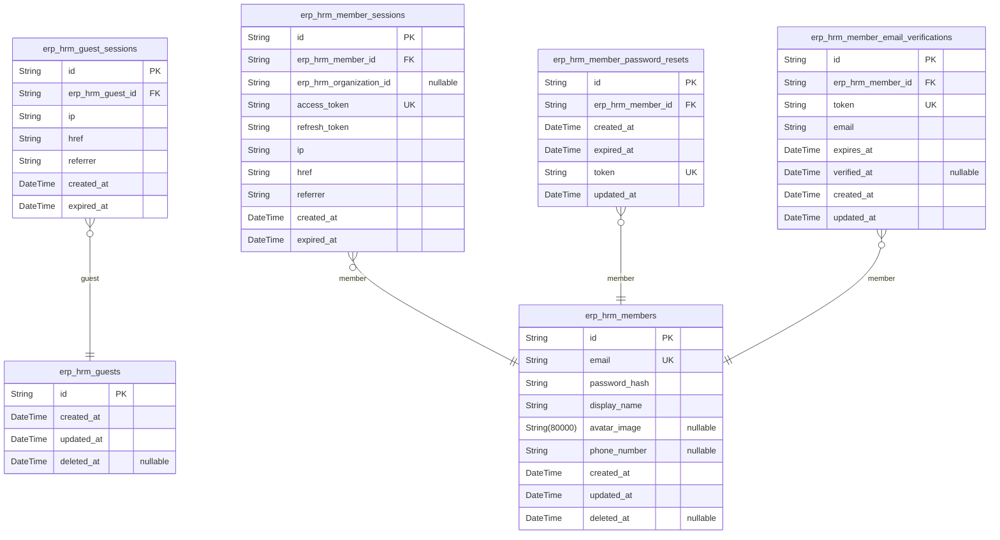
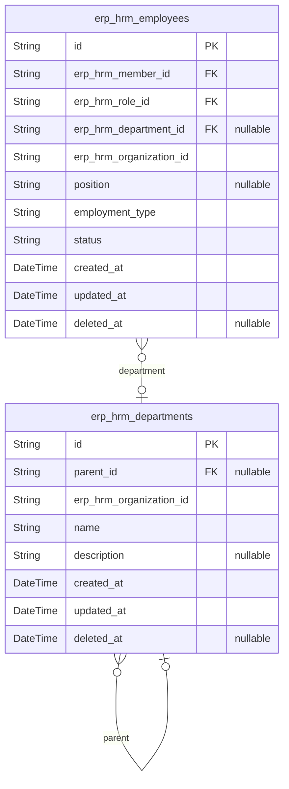
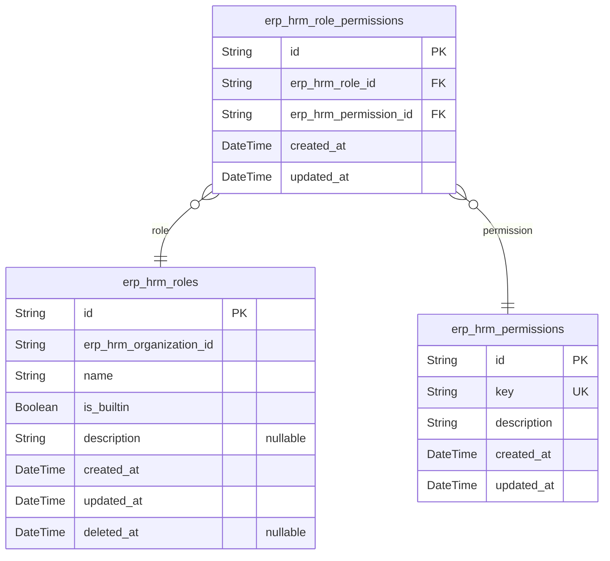
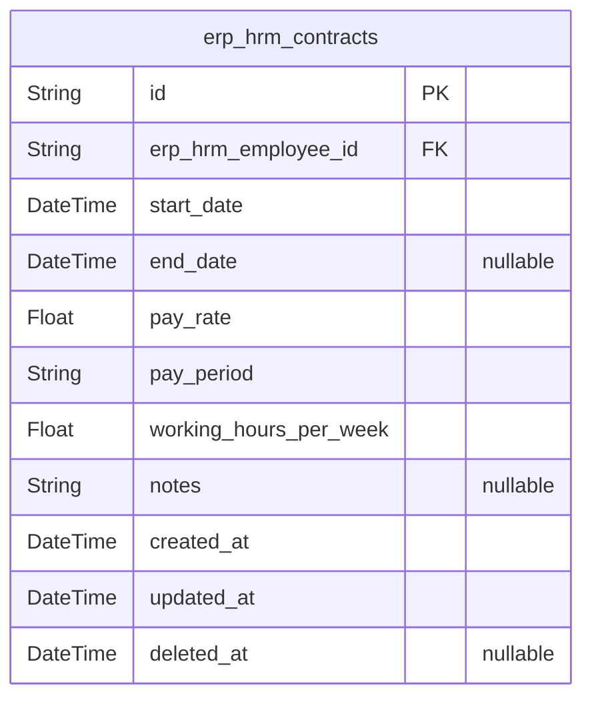
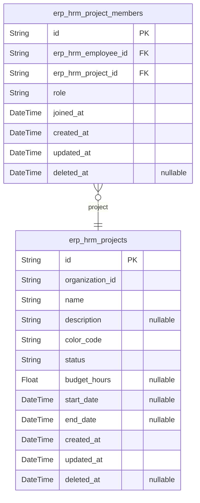
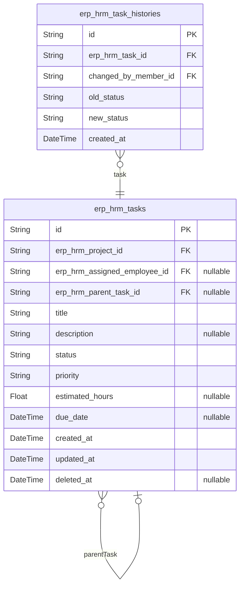
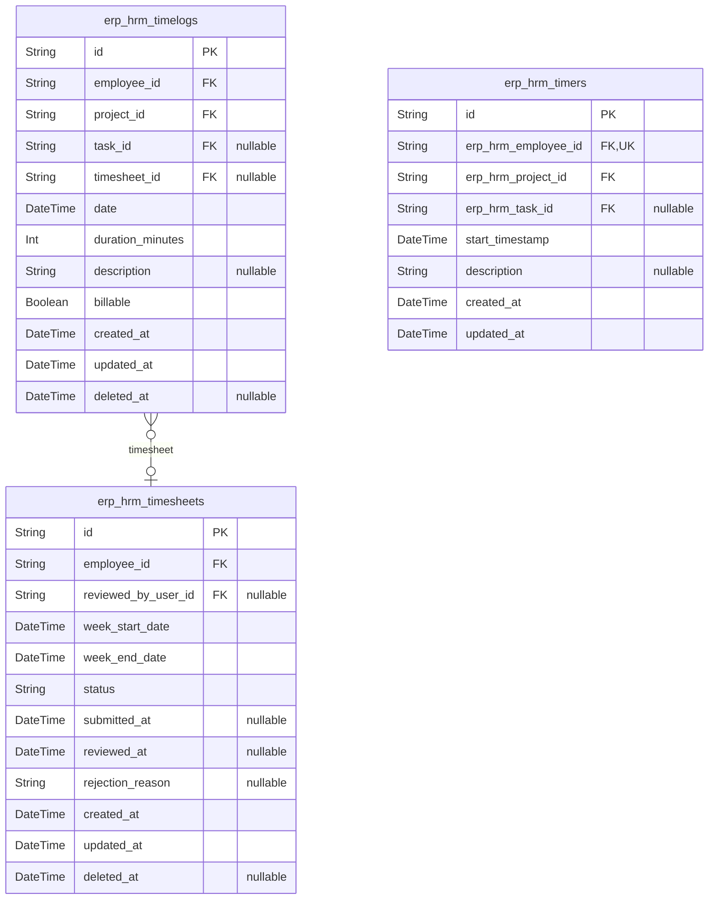
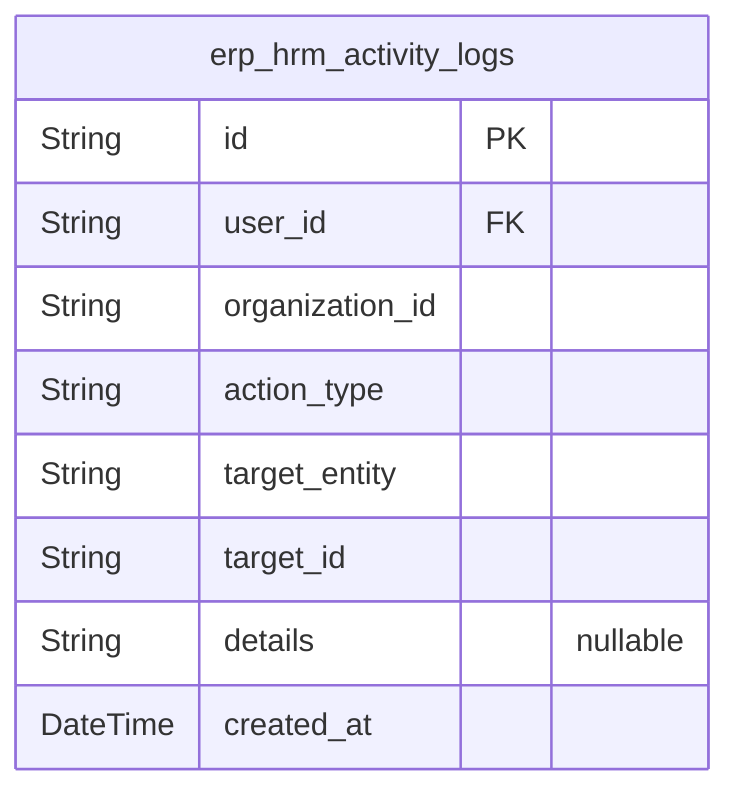

# Prisma Markdown

> Generated by [`prisma-markdown`](https://github.com/samchon/prisma-markdown)

- [authorization](#authorization)
- [employee](#employee)
- [role](#role)
- [contract](#contract)
- [project](#project)
- [task](#task)
- [timetracking](#timetracking)
- [activitylog](#activitylog)

## authorization

### `erp_hrm_guests`

Temporary guest identifiers for anonymous visitors with no
system-recognized identity.

Represents the guest actor — an unauthenticated visitor who has not
provided credentials. Guests possess no distinguishing characteristics
beyond the identifier itself and carry no privileges. The guest record
exists only transiently to anchor [erp_hrm_guest_sessions](#erp_hrm_guest_sessions) for the
public authentication surface (sign-up and login only).

Guests transition to [erp_hrm_members](#erp_hrm_members) through either login with an
existing account or sign-up with a new account. Upon transition, the
guest identity is superseded by the member identity. Guest identifiers
may be cleaned up after session expiration without authentication.

Properties as follows:

- `id`: Primary Key.
- `created_at`
  > Timestamp when the guest identifier was created.
  >
  > Marks the moment an anonymous visitor first contacted the system before
  > any authentication attempt.
- `updated_at`
  > Timestamp when the guest identifier was last updated.
  >
  > Reflects the most recent interaction by the anonymous visitor.
- `deleted_at`
  > Soft delete timestamp for guest cleanup.
  >
  > Allows the system to mark guest identifiers for removal when they are no
  > longer needed, such as after successful transition to {@link
  > erp_hrm_members} or after session expiration without authentication.

### `erp_hrm_guest_sessions`

Ephemeral session tokens for guest access to the public authentication
surface, covering sign-up and login only.

Each session belongs to a [erp_hrm_guests](#erp_hrm_guests) record and captures the
connection context — IP address, page URL, and referrer — at the time the
session was established. Sessions are append-only; once created, they are
not mutated.

Sessions carry a mandatory expiration timestamp for security. Expired
sessions are not valid for authentication and should be purged
periodically. A guest may hold multiple concurrent sessions across
different devices or browsing contexts.

Properties as follows:

- `id`: Primary Key.
- `erp_hrm_guest_id`
  > Reference to the anonymous guest identity that owns this session.
  >
  > Links to [erp_hrm_guests](#erp_hrm_guests), establishing the guest context for
  > authentication surface access. Each guest may have multiple concurrent
  > sessions.
- `ip`
  > IP address from which the guest session was initiated.
  >
  > Captured at session creation for audit and security purposes.
- `href`
  > Full URL of the page the guest was visiting when the session was created.
  >
  > Provides context for the authentication flow entry point.
- `referrer`
  > HTTP Referrer header value captured at session creation.
  >
  > Indicates the page or external source that directed the guest to the
  > authentication surface.
- `created_at`
  > Timestamp when the session was created.
  >
  > Records the moment the anonymous guest began interacting with the public
  > authentication surface.
- `expired_at`
  > Timestamp when the session expires and becomes invalid.
  >
  > NOT NULL by default for security — every guest session has an explicit
  > expiration boundary. Expired sessions must not be honored for any
  > authenticated operation.

### `erp_hrm_members`

Registered user accounts with email and password authentication, serving
as the identity foundation for all platform access. Members carry a
global profile shared across all organizations they belong to.

Each member authenticates via email and password during the sign-up or
login flow described in [erp_hrm_guests](#erp_hrm_guests). Upon successful
authentication, a member session is created ({@link
erp_hrm_member_sessions}) that tracks the currently selected organization
context. The global profile — display name, avatar image, and phone
number — is visible across all organizations the member belongs to,
ensuring a consistent identity regardless of which organization context
is active.

Membership in organizations is indirect: a member belongs to
organizations through [erp_hrm_employees](#erp_hrm_employees) records, each of which
links the member to a specific organization with a role assignment. This
allows a single member to hold different roles across multiple
organizations while maintaining a single set of authentication
credentials and profile information.

Account deletion is handled via soft delete through the deleted_at
timestamp. When a member deletes their account, their employee records in
other organizations are deactivated and the member can no longer
authenticate.

Properties as follows:

- `id`
  > Primary key uniquely identifying the member account across all
  > organizations.
- `email`
  > The member's email address used for authentication and as the primary
  > contact identifier.
  >
  > Must be unique across all member accounts. Used during login for
  > credential matching and during sign-up to check for existing accounts.
  > Also serves as the target for organization invitations — when an
  > invitation is sent to an email matching an existing member, the member is
  > automatically added to the inviting organization.
- `password_hash`
  > Hashed representation of the member's password for credential
  > verification during authentication.
  >
  > Never stored or transmitted in plaintext. Used exclusively during the
  > login flow to validate the member's identity. Password changes are
  > handled through the [erp_hrm_member_password_resets](#erp_hrm_member_password_resets) flow.
- `display_name`
  > The member's visible name shown across the platform in all organizations
  > they belong to.
  >
  > Part of the global profile that is shared across all organizations.
  > Displayed in employee lists, project member views, task assignments,
  > activity logs, and all other contexts where the member's identity is
  > shown.
- `avatar_image`
  > Optional URI pointing to the member's avatar image for visual
  > identification.
  >
  > Part of the global profile. When set, this image is displayed alongside
  > the member's name throughout the platform. When null, a default
  > placeholder is used.
- `phone_number`
  > Optional contact phone number for the member.
  >
  > Part of the global profile. Stored as a free-text string to accommodate
  > international number formats.
- `created_at`: Timestamp when the member account was created through the sign-up flow.
- `updated_at`
  > Timestamp of the most recent modification to the member's account or
  > profile.
- `deleted_at`
  > Timestamp marking when the member requested account deletion (soft
  > delete).
  >
  > When set, the account is considered deleted: authentication is denied,
  > and the member's employee records in other organizations are deactivated.
  > The timestamp preserves the deletion record for audit and potential
  > recovery within the retention window.

### `erp_hrm_member_sessions`

JWT access and refresh token pairs for member authentication, tracking
the currently selected organization context per session.

Each session represents a single authenticated login by a member. When a
member logs in, the system issues a JWT access token and a refresh token,
stores them in this table, and records the member's selected organization
context. The access token is validated on every authenticated API request
to identify the calling member and their active organization scope.

Members can switch organizations without logging out — the organization
context is updated in-place. Sessions expire based on the `expired_at`
timestamp, after which the tokens become invalid and the member must
re-authenticate.

Properties as follows:

- `id`: Primary key uniquely identifying this member session record.
- `erp_hrm_member_id`
  > Reference to the authenticated member who owns this session.
  >
  > Every session belongs to exactly one member. A member may have multiple
  > active sessions across different devices or browsers.
- `erp_hrm_organization_id`
  > Reference to the organization currently selected as this session's active
  > context.
  >
  > All API requests within this session are scoped to this organization for
  > data isolation. Members can switch their organization context
  > mid-session, which updates this field. Nullable to accommodate edge cases
  > where a member loses membership in the selected organization before
  > switching context.
- `access_token`
  > JWT access token issued at session creation, used as a Bearer token for
  > authenticating API requests.
  >
  > This token is short-lived and validated on every authenticated request.
  > It carries the member's identity and organization context as claims.
- `refresh_token`
  > JWT refresh token used to obtain a new access token when the current one
  > expires, without requiring the member to log in again.
  >
  > This token has a longer lifespan than the access token and is rotated
  > during the refresh flow.
- `ip`
  > IP address of the client that initiated this session, captured at login
  > time for security auditing.
- `href`
  > The full URL of the page from which the member initiated the login,
  > captured for audit and redirect purposes.
- `referrer`
  > The HTTP Referer header value captured at login time, indicating the page
  > that referred the member to the login flow.
- `created_at`
  > Timestamp when this session was created — the moment the member
  > successfully authenticated.
- `expired_at`
  > Timestamp when this session expires and its tokens become invalid.
  >
  > After this point, the member must re-authenticate to obtain a new
  > session. This field is NOT NULL by default to enforce mandatory session
  > expiration for security.

### `erp_hrm_member_password_resets`

Password reset tokens with expiration for the password change and
recovery flow.

Each token is uniquely generated when a [erp_hrm_members](#erp_hrm_members) requests
a password reset. The system sends the token to the member's email
address, and the member must present the token to verify their identity
before changing their password.

Tokens are time-limited and expire at the moment specified in expired_at.
Expired tokens cannot be used for authentication. Once a password is
successfully reset using a token, the token should be deleted to prevent
reuse.

Properties as follows:

- `id`: Primary Key.
- `erp_hrm_member_id`
  > Reference to the [erp_hrm_members](#erp_hrm_members) who requested this password
  > reset token.
  >
  > Establishes ownership of the reset token. When the member completes the
  > password reset flow, the token is consumed and deleted.
- `created_at`
  > Timestamp when this password reset token was generated and sent to the
  > member.
- `expired_at`
  > The exact date and time after which this token becomes invalid and can no
  > longer be used for password reset.
  >
  > Expired tokens are rejected during the password reset flow. This time
  > limit prevents indefinite use of a compromised token.
- `token`
  > Cryptographically secure unique token string sent to the member's email
  > for password reset verification.
  >
  > Must be globally unique across all active tokens. Presented by the member
  > to prove they have access to the registered email address before the
  > system allows password change.
- `updated_at`: Timestamp when this password reset token record was last modified.

### `erp_hrm_member_email_verifications`

Email verification tokens for confirming email ownership during sign-up,
enabling invitation matching for automatic organization enrollment.

When a guest completes the sign-up process, the system creates a {@link
erp_hrm_members} account and generates an email verification token stored
in this table. The token is delivered to the user's email address. Upon
successful verification, the system confirms email ownership and
automatically matches any pending [erp_hrm_invitations](#erp_hrm_invitations) associated
with the verified email address, enrolling the user into the inviting
organizations.

Each token has a limited lifespan defined by expires_at. Unverified
tokens that exceed their expiration are invalid and cannot be used. The
verified_at timestamp records when the user successfully confirmed their
email, providing an audit trail of the verification event. Once verified,
the token is consumed and cannot be reused.

Properties as follows:

- `id`: Primary Key.
- `erp_hrm_member_id`
  > Reference to the [erp_hrm_members](#erp_hrm_members) account whose email is pending
  > verification.
  >
  > Each email verification token belongs to exactly one member account. The
  > member account is created during sign-up before the verification token is
  > generated. A member may have multiple verification tokens over time if
  > they re-initiate the verification process or if previous tokens expire.
- `token`
  > Cryptographically secure unique token string delivered to the user's
  > email address for one-time verification use.
  >
  > The token serves as a single-use credential embedded in the verification
  > link. It must be globally unique across all verification records to
  > prevent collisions and ensure secure lookup.
- `email`
  > The email address being verified by this token.
  >
  > Stored redundantly with the member record to preserve the exact email
  > targeted by this verification attempt. This provides an immutable audit
  > trail — the email recorded here remains unchanged even if the member's
  > primary email is later modified.
- `expires_at`
  > Timestamp after which this verification token becomes invalid and can no
  > longer be used.
  >
  > Expired tokens are rejected during verification attempts. The expiration
  > duration is determined by system security policy to limit the window for
  > token misuse.
- `verified_at`
  > Timestamp recording when the user successfully verified their email
  > address using this token.
  >
  > Null while the token remains unused and unexpired. Once populated, the
  > token is considered consumed and cannot be reused. The verification event
  > triggers automatic matching of any pending [erp_hrm_invitations](#erp_hrm_invitations)
  > targeting the verified email address for automatic organization
  > enrollment.
- `created_at`
  > Timestamp when this verification token was generated and sent to the
  > user's email address.
- `updated_at`
  > Timestamp of the most recent modification to this record. Typically
  > updated when verified_at is populated upon successful verification.

## employee

### `erp_hrm_employees`

Central employee records bridging user accounts to organizations, holding
role assignment, optional department membership, position title,
employment type classification, and active/deactivated status.

Each employee represents one user's membership within one organization. A
user may be an employee in multiple organizations simultaneously, but
only once per organization. The employee record carries the user's
organization-specific identity: their assigned role, optional department,
and descriptive position.

**Lifecycle**: Employees are created through invitation acceptance or
direct assignment. Status transitions between active and deactivated
control access to time tracking and timesheet submission. Deactivated
employees retain all historical data (timelogs, timesheets, contracts)
but cannot create new entries. Deactivation is reversible via
reactivation.

Properties as follows:

- `id`: Primary Key.
- `erp_hrm_member_id`
  > Reference to the user account that owns this employee record.
  >
  > The user account provides authentication credentials and the global
  > profile (display name, avatar, phone) shared across all organizations.
  > Each user-member pair is unique within an organization — a user cannot
  > have duplicate employee records in the same organization.
- `erp_hrm_role_id`
  > Reference to the role assigned to this employee.
  >
  > Every employee must have exactly one role at all times. The role
  > determines the employee's permissions within the organization. The same
  > user may hold different roles in different organizations. Role assignment
  > can be changed by users with `employee:manage` permission, and the new
  > permissions take effect immediately.
- `erp_hrm_department_id`
  > Reference to the optional department this employee belongs to.
  >
  > Department assignment is purely organizational — it carries no inherent
  > permissions and is used for grouping and reporting. When a department is
  > deleted, this reference is cleared without affecting the employee record.
  > An employee can exist without a department.
- `erp_hrm_organization_id`
  > Reference to the organization that this employee belongs to.
  >
  > Establishes multi-tenancy scope. All employee data — timelogs,
  > timesheets, project assignments, contracts — is isolated within this
  > organization context.
- `position`
  > Job title or position name describing the employee's function within the
  > organization (e.g., "Software Engineer", "Marketing Lead").
  >
  > Purely descriptive — carries no inherent permissions. Free-text field for
  > organizational clarity and reporting purposes.
- `employment_type`
  > Classification of the employment relationship.
  >
  > Allowed values: `full-time`, `part-time`, `contractor`, `intern`. Used
  > for filtering and reporting. Determines how the employee appears in
  > workforce summaries and organizational charts.
- `status`
  > Current activity status of the employee within the organization.
  >
  > Allowed values: `active` (can log time, submit timesheets, participate in
  > projects), `deactivated` (cannot perform new actions but all historical
  > data is preserved). Deactivated employees can be reactivated.
  > Deactivation does not delete any associated records.
- `created_at`
  > Timestamp when the employee record was created — either through
  > invitation acceptance or direct assignment.
- `updated_at`
  > Timestamp of the most recent modification to this employee record,
  > including role changes, department reassignment, position updates,
  > employment type changes, and status transitions.
- `deleted_at`
  > Soft delete timestamp. When set, the employee record is considered
  > removed but retained for audit integrity. Set during organization
  > deletion cascades or account deletion cleanup.

### `erp_hrm_departments`

Organizational department hierarchy within an organization, providing a
purely structural grouping mechanism for employees.

Departments support a one-level parent-child nesting pattern: a
department may have an optional parent department, and any department
that serves as a parent to others cannot itself have a parent. This
constraint is enforced at the application layer, not through
database-level CHECK constraints.

Departments have no bearing on permissions or project access — they exist
solely as a structural grouping for employees. When a department is
deleted, affected employees have their department reference cleared
without removing the employee records themselves. A department with
children cannot be deleted until all child departments are either
reassigned or deleted first.

Departments are scoped to an organization and visible to all employees
within that organization regardless of role. Management operations
(create, edit, delete) require the org:manage permission.

Properties as follows:

- `id`: Primary Key.
- `parent_id`
  > Self-reference establishing the parent-child department hierarchy.
  >
  > Nullable — a department without a parent is a top-level department. When
  > set, the referenced department must not itself have a parent, enforcing
  > the one-level nesting constraint. A department cannot reference itself as
  > its own parent, nor can it reference any of its own children, preventing
  > circular relationships.
  >
  > When a department with children is deleted, all child departments must be
  > reassigned or deleted first before the parent can be removed.
- `erp_hrm_organization_id`
  > Reference to the organization this department belongs to.
  >
  > Each department is strictly scoped to a single organization as part of
  > the multi-tenancy data isolation model. All department operations are
  > bounded by the organization context.
- `name`
  > Department display name.
  >
  > Required at creation time and must be unique within the organization.
  > Used for display in department listings, employee records, and
  > organizational hierarchy views.
- `description`
  > Optional free-text description of the department's purpose or scope.
  >
  > Provides additional context for employees browsing the organizational
  > structure. May be updated independently of the department name.
- `created_at`
  > Timestamp when the department was created.
  >
  > Set automatically on creation and never modified thereafter.
- `updated_at`
  > Timestamp of the most recent modification to the department record.
  >
  > Updated automatically whenever the department's name, description, or
  > parent relationship changes.
- `deleted_at`
  > Soft deletion timestamp for data retention and recovery.
  >
  > When set, the department is considered deleted but its record is
  > preserved. Child departments must be reassigned or deleted before a
  > parent department can be soft-deleted.

## role

### `erp_hrm_roles`

Role definitions scoped to an organization, including the three immutable
built-in roles (Owner, Manager, Employee) and custom roles created by
organization owners.

Each role carries a set of permissions that define exactly what actions
the role holder is allowed to perform within the organization. The
permission set is stored via the role_permissions junction table linking
to the fixed permissions catalog.

Built-in roles are pre-configured upon organization creation and cannot
be deleted regardless of employee assignment. Custom roles can be
created, edited, and soft-deleted by owners, but deletion is rejected
while any employees are assigned to the role. Each employee in an
organization holds exactly one role at any given time, and the role's
permission set determines all access rights for that employee.

Properties as follows:

- `id`: Primary Key.
- `erp_hrm_organization_id`
  > Reference to the organization that owns this role.
  >
  > Scopes the role to a single organization for multi-tenancy isolation.
  > Combined with the role name to form a unique constraint ensuring no two
  > roles within the same organization share the same name.
- `name`
  > Human-readable role name that uniquely identifies the role within its
  > organization.
  >
  > Serves as the primary way users and administrators distinguish between
  > different roles. Must be unique within a single organization. Examples
  > include the three built-in names — Owner, Manager, Employee — and custom
  > names such as Finance Manager or Senior Developer.
- `is_builtin`
  > Indicates whether this role is one of the three built-in roles
  > provisioned automatically at organization creation.
  >
  > Built-in roles (Owner, Manager, Employee) are immutable — they can never
  > be deleted regardless of how many employees are assigned. Custom roles
  > have this flag set to false and may be soft-deleted when no employees are
  > assigned to them.
- `description`
  > Optional description explaining the role's intended purpose, scope, and
  > responsibilities within the organization.
  >
  > Provides context for organization owners and administrators when managing
  > roles, clarifying what level of access each role entails.
- `created_at`
  > Timestamp when the role was created.
  >
  > For built-in roles this matches the organization creation time. For
  > custom roles this reflects when the owner defined the role.
- `updated_at`
  > Timestamp when the role was last modified.
  >
  > Updated whenever the role's name, description, or permission set changes.
  > Permission changes take effect immediately for all employees assigned to
  > the role.
- `deleted_at`
  > Soft-delete timestamp for custom roles.
  >
  > Null for active roles. Set when an owner deletes a custom role that has
  > no employees assigned to it. Always null for built-in roles since they
  > are never deletable.

### `erp_hrm_permissions`

Fixed catalog of available permissions that can be granted to roles
within an organization.

This table seeds the nine built-in permissions covering organization
management, employee management, project management, time tracking,
approval workflows, and reporting. Each permission is identified by a
unique dot-notation key (e.g., "org:manage") and carries a human-readable
description of what access it grants. Permissions are immutable system
constants — they are never created, updated, or deleted at runtime.

Permissions are assigned to roles through the {@link
erp_hrm_role_permissions} junction table. The set of permissions a role
holds determines what operations members with that role can perform
within their organization context.

Properties as follows:

- `id`: Primary Key.
- `key`
  > Unique dot-notation identifier for this permission (e.g., "org:manage",
  > "employee:view").
  >
  > The key follows a `{domain}:{action}` convention and serves as the
  > canonical reference used in authorization checks throughout the system.
- `description`
  > Human-readable explanation of what operations this permission grants.
  >
  > Describes the scope of access in plain language so administrators can
  > understand what each permission enables when assigning roles.
- `created_at`: Timestamp when this permission was seeded into the system.
- `updated_at`
  > Timestamp of the last modification to this permission record. For the
  > fixed catalog, this is typically equal to created_at.

### `erp_hrm_role_permissions`

Many-to-many junction table linking roles to their granted permissions.

Each row represents one permission assigned to one role within an
organization. This junction enables the role-based access control system
where custom roles in [erp_hrm_roles](#erp_hrm_roles) aggregate a set of
permissions from the fixed catalog in [erp_hrm_permissions](#erp_hrm_permissions).
Employees inherit permissions through their role assignment in {@link
erp_hrm_employees}.

Built-in roles (Owner, Manager, Employee) have their permissions enforced
at the business logic layer and do not rely on this junction table. The
nine fixed permissions — org:manage, employee:manage, employee:view,
project:manage, project:view, time:manage, time:approve, time:view_all,
and report:view — are stored in the permission catalog.

Properties as follows:

- `id`: Primary Key.
- `erp_hrm_role_id`
  > Reference to the role receiving this permission grant.
  >
  > Links to [erp_hrm_roles](#erp_hrm_roles), establishing which role this permission
  > assignment belongs to. A role can have multiple permission grants,
  > together forming the complete permission set for that role.
- `erp_hrm_permission_id`
  > Reference to the permission being granted to the role.
  >
  > Links to [erp_hrm_permissions](#erp_hrm_permissions), indicating which specific
  > permission from the fixed catalog is assigned. A permission can be
  > granted to multiple roles simultaneously.
- `created_at`: Timestamp when this permission was assigned to the role.
- `updated_at`: Timestamp when this permission assignment record was last modified.

## contract

### `erp_hrm_contracts`

Employee employment contracts defining compensation terms including pay
rate, pay period, and working hours commitment.

Each employee can have multiple contracts over their tenure, creating a
complete historical record of all compensation arrangements. However,
only one contract is active at any given moment — the active contract is
determined at query time as the one with the most recent start_date on or
before the current date whose end_date is either absent (ongoing) or not
yet passed. When a new contract is created for an employee, it
automatically supersedes the previously active contract by virtue of its
later start_date.

Past contracts — those superseded by a newer contract or whose end_date
has passed — are immutable historical records. Only the current active
contract may be edited. This immutability preserves the integrity of the
employee's compensation history for auditing, compliance, and reference
purposes.

Properties as follows:

- `id`: Primary Key.
- `erp_hrm_employee_id`
  > The [Employee](#erp_hrm_employees) to whom this contract belongs.
  >
  > Each employee may have multiple contracts over time forming a historical
  > record, but only one contract is active at any given moment based on
  > start_date recency and end_date validity.
- `start_date`
  > The date when this contract's compensation terms take effect.
  >
  > Serves as the anchor point for determining which contract is active — the
  > active contract is the one with the most recent start_date on or before
  > the current date.
- `end_date`
  > The date when this contract's compensation terms expire.
  >
  > When absent (null), the contract is ongoing with no predetermined
  > termination date and remains in effect until superseded by a newer
  > contract or the employee leaves the organization. When present, the
  > contract is effective from start_date through end_date inclusive.
- `pay_rate`
  > The numeric amount the employee earns per unit of time as defined by the
  > pay_period.
  >
  > For example, 25.50 with an hourly pay_period means the employee earns
  > 25.50 currency units per hour worked.
- `pay_period`
  > The unit of time against which the pay_rate is measured.
  >
  > Supported values:
  > - hourly: pay_rate applies per hour worked
  > - daily: pay_rate applies per full workday
  > - weekly: pay_rate applies per full workweek
  > - monthly: pay_rate applies per calendar month
- `working_hours_per_week`
  > The employee's expected weekly time commitment under this contract.
  >
  > For example, 40 for a standard full-time arrangement, or 37.5 for a
  > slightly reduced schedule. This value informs budget calculations and
  > capacity planning across the organization.
- `notes`
  > Optional free-form notes recording additional details about the
  > compensation agreement.
  >
  > May include information such as bonus structures, overtime policies, or
  > special terms that fall outside the structured fields.
- `created_at`: Timestamp when this contract record was created in the system.
- `updated_at`
  > Timestamp when this contract record was last modified.
  >
  > Past contracts (those superseded or expired) become immutable and this
  > timestamp will not change after the contract ceases to be active.
- `deleted_at`
  > Soft delete timestamp for contracts that were created in error and
  > removed before being superseded.
  >
  > Contracts that have been superseded by a newer contract are preserved as
  > historical records rather than deleted.

## project

### `erp_hrm_projects`

Core project entity scoped to an organization, representing work
initiatives that employees track time against.

Each project belongs to exactly one organization and serves as the
required target for all timelogs. Projects progress through a status
lifecycle of `active` (accepting new time entries), `archived` (preserved
but frozen), or `completed` (finished and frozen).

Projects have optional budget hours for comparing planned effort against
actual logged hours in budget reports, and optional start/end dates for
timeline tracking. A color code enables visual distinction in the UI.

Employees are associated with projects through project_members, and work
is broken down into tasks within each project.

Properties as follows:

- `id`: Primary Key.
- `organization_id`
  > Reference to the organization that owns this project.
  >
  > Ensures strict multi-tenancy isolation — all project data, including its
  > tasks and timelogs, is scoped to a single organization.
- `name`
  > Project display name.
  >
  > Required identifier shown in project lists, timelog entry forms,
  > timesheet summaries, and reports.
- `description`
  > Optional detailed description of the project.
  >
  > Provides additional context about the project's purpose, scope, or goals
  > for team members.
- `color_code`
  > Color code for UI display.
  >
  > Used to visually distinguish projects in the interface, typically a hex
  > color value such as `#FF5733`.
- `status`
  > Current project lifecycle status.
  >
  > Controls whether the project accepts new time entries: `active` allows
  > new timelogs, while `archived` and `completed` freeze the project while
  > preserving existing records. New projects are created in `active` status.
- `budget_hours`
  > Optional total estimated hours budget for the project.
  >
  > Used in project budget reports to compare planned hours against actual
  > hours logged via timelogs. Projects without a budget are excluded from
  > budget utilization reports.
- `start_date`
  > Optional project start date.
  >
  > Marks the beginning of the project timeline for scheduling and reporting
  > purposes.
- `end_date`
  > Optional project end date.
  >
  > Marks the expected or actual completion date of the project.
- `created_at`
  > Timestamp when the project was created.
  >
  > Automatically set on creation and never modified.
- `updated_at`
  > Timestamp of the last modification to the project.
  >
  > Automatically updated on every change to project fields.
- `deleted_at`
  > Soft delete timestamp.
  >
  > Set when a project is deleted by a user with `project:manage` permission.
  > A project can only be deleted when it has no associated timelogs. Soft
  > deletion preserves referential integrity for historical tasks and
  > project_members records.

### `erp_hrm_project_members`

Junction table linking employees to projects with an assigned role and a
fixed joined-at timestamp.

Each row represents one employee's membership in one project within the
organization. The membership carries a role — either "member" for regular
participants or "project-lead" for those with task management authority.
The joined-at timestamp is set at creation and never changes, serving as
a permanent record of when the assignment began.

An employee can hold multiple memberships across different projects, and
a project can have multiple members. The unique constraint on employee
and project ensures no duplicate assignments. When a member is removed
from a project, the record is soft-deleted to preserve the historical
relationship for audit purposes.

Properties as follows:

- `id`: Primary Key.
- `erp_hrm_employee_id`
  > Reference to the employee assigned to the project.
  >
  > The employee must belong to the same organization as the project. This
  > relationship is the foundation of project participation — without this
  > link, an employee has no access to the project's tasks or time tracking
  > in the project context.
- `erp_hrm_project_id`
  > Reference to the project the employee is assigned to.
  >
  > The project must exist within the same organization as the employee. The
  > membership inherits the project's organization scope, and all
  > project-related operations — task assignment, time logging — are gated by
  > this relationship.
- `role`
  > The employee's role within the project.
  >
  > Two values are supported: "member" for regular project participants who
  > can track time and view assigned tasks, and "project-lead" for members
  > with elevated authority who can manage tasks within the project. Project
  > leads can create, edit, and assign tasks, while regular members have
  > view-only access to tasks they are not assigned to.
- `joined_at`
  > Immutable timestamp recording when the employee was assigned to the
  > project.
  >
  > Set at creation time and never updated. Serves as a permanent record of
  > when the membership relationship began, regardless of any subsequent role
  > changes or eventual removal from the project.
- `created_at`: Timestamp when this membership record was created.
- `updated_at`
  > Timestamp when this membership record was last updated, such as when the
  > assigned role is changed.
- `deleted_at`
  > Timestamp when the employee was removed from the project.
  >
  > Null while the membership is active. Set when a user with project:manage
  > permission removes the employee from the project. The record is
  > soft-deleted to preserve the historical relationship for audit purposes.

## task

### `erp_hrm_tasks`

Work units within a project with status workflow, priority, optional
assignee, and optional parent task for one-level subtask nesting.

Each task belongs to exactly one [erp_hrm_projects](#erp_hrm_projects) and tracks its
progress through four statuses: open, in-progress, completed, and closed.
Tasks can be assigned to a single employee who must be a member of the
parent project through [erp_hrm_project_members](#erp_hrm_project_members). A priority level
indicates relative urgency.

Tasks support one level of subtask nesting through a self-referencing
parent relationship. A task with a parent is a subtask; a parent task
cannot itself have a parent, enforcing a maximum depth of one. Every
status change is automatically recorded as an immutable entry in {@link
erp_hrm_task_histories}, creating a complete audit trail of the task's
lifecycle.

Properties as follows:

- `id`: Primary Key.
- `erp_hrm_project_id`
  > The project this task belongs to.
  >
  > Every task is scoped to exactly one project. Deleting a project cascades
  > to remove all its tasks and associated history entries. The project must
  > be in active status for new timelogs to be recorded against its tasks via
  > [erp_hrm_timelogs](#erp_hrm_timelogs).
- `erp_hrm_assigned_employee_id`
  > The employee assigned to work on this task.
  >
  > Optional assignment linking to an [erp_hrm_employees](#erp_hrm_employees) record. The
  > assigned employee must hold a membership in the task's parent project
  > through [erp_hrm_project_members](#erp_hrm_project_members). When an employee is removed from
  > the project, their task assignments within that project are cleared,
  > leaving the tasks unassigned.
- `erp_hrm_parent_task_id`
  > The parent task when this is a subtask, establishing a one-level nesting
  > hierarchy.
  >
  > Self-referencing relationship to [erp_hrm_tasks](#erp_hrm_tasks). Only one level of
  > nesting is permitted: a task that already has a parent cannot serve as a
  > parent to another task. The parent task must belong to the same project.
  > A task cannot reference itself as its parent. Subtask relationships are
  > independent of status — a parent and its subtasks can have different
  > statuses.
- `title`
  > The required title of the task.
  >
  > Serves as the primary identifier for the task in lists and views. Must
  > not be empty.
- `description`
  > Optional detailed description providing context about the task's purpose,
  > scope, or acceptance criteria.
- `status`
  > The current workflow status of the task.
  >
  > Allowed values: open (initial state, work not yet started), in-progress
  > (work actively underway), completed (deliverable finished), closed
  > (formally finalized). Every status change is automatically recorded in
  > [erp_hrm_task_histories](#erp_hrm_task_histories) with timestamp, old status, new status,
  > and the user who made the change.
- `priority`
  > The urgency level of the task.
  >
  > Allowed values: low, medium (default), high, urgent. Priority serves as
  > guidance for employees and managers on which tasks to address first. It
  > does not enforce scheduling behavior on its own.
- `estimated_hours`
  > Optional numeric estimate of the total hours expected to complete this
  > task.
  >
  > Must be a positive number when provided. Used for planning and can be
  > compared against actual logged hours in [erp_hrm_timelogs](#erp_hrm_timelogs).
- `due_date`
  > Optional deadline by which the task should be completed.
  >
  > Used for planning, sorting, and filtering. A task without a due date has
  > no fixed deadline.
- `created_at`
  > Timestamp when the task was created.
  >
  > Automatically set at creation. Used for chronological listing and audit
  > purposes.
- `updated_at`
  > Timestamp of the most recent modification to any task field.
  >
  > Automatically updated whenever the task's title, description, status,
  > priority, estimated hours, due date, assigned employee, or parent task is
  > changed.
- `deleted_at`
  > Timestamp of soft deletion.
  >
  > When set, the task is considered deleted and is excluded from normal
  > queries. Tasks are permanently removed only when their parent project is
  > deleted.

### `erp_hrm_task_histories`

Immutable audit trail recording every status transition of a {@link
erp_hrm_tasks Task}.

Each entry captures the old status before the transition, the new status
after, the timestamp of the change, and the {@link erp_hrm_members
member} who performed it. Entries are created automatically whenever a
task's status is updated and cannot be modified or deleted after
creation.

Task status values follow the defined workflow: open, in-progress,
completed, closed. The history provides a complete chronological record
of how each task moved through these states, enabling audit review and
workflow analysis.

Properties as follows:

- `id`: Primary Key.
- `erp_hrm_task_id`
  > Reference to the [Task](#erp_hrm_tasks) whose status changed.
  >
  > Establishes the parent-child relationship where each task accumulates
  > history entries over its lifetime. Querying history for a task returns
  > entries in chronological order by [created_at](#created_at).
- `changed_by_member_id`
  > Reference to the [member](#erp_hrm_members) who made the status
  > change.
  >
  > Identifies the authenticated user who triggered the status transition.
  > This could be a project lead updating a task in their project, or a user
  > with project:manage permission editing any task.
- `old_status`
  > The task status before the transition.
  >
  > One of: open, in-progress, completed, closed. Together with {@link
  > new_status}, this captures both the origin and destination of the state
  > change.
- `new_status`
  > The task status after the transition.
  >
  > One of: open, in-progress, completed, closed. Together with {@link
  > old_status}, this captures both the origin and destination of the state
  > change.
- `created_at`
  > Timestamp recording when the status change occurred.
  >
  > Serves as both the creation time of the history entry and the
  > point-in-time marker for the status transition. Entries are immutable
  > once created.

## timetracking

### `erp_hrm_timelogs`

Atomic time entries recording work performed by an employee on a specific
date.

Each timelog captures a duration in minutes against a required project
and an optional task within that project. Timelogs may be grouped into a
[erp_hrm_timesheets](#erp_hrm_timesheets) for weekly submission and approval. Once a
timesheet containing a timelog is approved, the timelog becomes
immutable. The billable flag, defaulting to true, distinguishes billable
from non-billable work for reporting purposes.

Timelogs are created by employees for their own work. Users with the
time:manage permission may edit or delete any employee's timelogs,
subject to timesheet locking constraints. Deletion is blocked when the
timelog belongs to a submitted or approved timesheet; editing is blocked
when the timelog belongs to an approved timesheet.

Properties as follows:

- `id`: Primary key uniquely identifying each timelog entry.
- `employee_id`
  > Reference to the [erp_hrm_employees](#erp_hrm_employees) who performed the work.
  >
  > Establishes ownership of the timelog. The employee must be active to
  > create new timelogs. Historical timelogs of deactivated employees are
  > preserved.
- `project_id`
  > Reference to the [erp_hrm_projects](#erp_hrm_projects) against which time is logged.
  >
  > The employee must be a project member to log time against the project.
  > Projects with archived or completed status cannot receive new timelogs,
  > though existing timelogs on such projects remain intact.
- `task_id`
  > Optional reference to a [erp_hrm_tasks](#erp_hrm_tasks) within the selected project.
  >
  > When specified, the task must belong to the same project referenced by
  > project_id. This allows granular time tracking at the task level within a
  > project.
- `timesheet_id`
  > Optional reference to the [erp_hrm_timesheets](#erp_hrm_timesheets) that groups this
  > timelog for weekly submission.
  >
  > When set, the timelog is part of a timesheet and subject to its workflow
  > constraints. When null, the timelog is ungrouped and freely editable by
  > its owner.
- `date`
  > The calendar date on which the work was performed.
  >
  > Stored as a datetime for consistency, but semantically represents a
  > date-only value. Used alongside duration_minutes for reporting and
  > timesheet week calculations.
- `duration_minutes`
  > The length of the work session in minutes.
  >
  > Must be a positive integer. Represents the total time worked; used in
  > aggregate calculations for timesheet total hours, project budget
  > tracking, and employee time reports.
- `description`
  > Optional free-text description of the work performed during this time
  > entry.
  >
  > Supports full-text search via GIN index, enabling employees and managers
  > to find timelogs by descriptive content.
- `billable`
  > Indicates whether this time entry is billable to the client.
  >
  > Defaults to true. Non-billable timelogs are excluded from billable hour
  > calculations in reports. Used by the time report and project budget
  > report to distinguish billable from non-billable hours.
- `created_at`
  > Timestamp when the timelog was initially created.
  >
  > Automatically set on creation and never modified.
- `updated_at`
  > Timestamp of the most recent modification to the timelog.
  >
  > Updated automatically on any field change. Tracked for audit and
  > synchronization purposes.
- `deleted_at`
  > Soft delete timestamp for timelog removal.
  >
  > When set, the timelog is considered deleted but retained for audit
  > purposes. Deletion is only permitted when the timelog is not part of a
  > submitted or approved timesheet.

### `erp_hrm_timesheets`

Weekly collections of timelogs (Monday to Sunday) progressing through
draft, submitted, approved, and rejected statuses with review tracking.

Each timesheet belongs to one employee and groups their timelogs for a
specific calendar week. The timesheet serves as the submission and
approval unit for time tracking — employees populate timesheets with
timelogs, submit them for review, and managers approve or reject them.
Approved timesheets lock all contained timelogs against further
modification.

A timesheet flows through the status workflow: [erp_hrm_timelogs](#erp_hrm_timelogs)
are added while in draft, the timesheet is submitted for review, then
either approved (locking timelogs) or rejected with a reason (returning
to draft for revision). An employee may have at most one timesheet per
calendar week, ensuring time for a given week is submitted and approved
only once.

Properties as follows:

- `id`: Primary Key.
- `employee_id`
  > The employee who owns this timesheet.
  >
  > References the [erp_hrm_employees](#erp_hrm_employees) record that identifies the
  > organization member whose timelogs are grouped into this timesheet. All
  > timelogs included in the timesheet must belong to this same employee.
- `reviewed_by_user_id`
  > The user who approved or rejected this timesheet.
  >
  > References the [erp_hrm_members](#erp_hrm_members) account of the manager or owner
  > who performed the review action. Set when the timesheet transitions to
  > approved or rejected status; null while in draft or submitted status.
- `week_start_date`
  > The Monday date marking the start of the timesheet's calendar week.
  >
  > Combined with week_end_date, this defines the Sunday-to-Sunday range that
  > determines which timelogs are eligible for inclusion. Used in the unique
  > constraint with employee_id to ensure one timesheet per employee per
  > week.
- `week_end_date`
  > The Sunday date marking the end of the timesheet's calendar week.
  >
  > Always exactly 6 days after week_start_date. Stored alongside
  > week_start_date for query convenience when filtering by date ranges that
  > may cross week boundaries.
- `status`
  > Current workflow status of the timesheet.
  >
  > Determines what actions are available: draft allows adding and removing
  > timelogs; submitted awaits review; approved locks all contained timelogs;
  > rejected returns to draft for revision with a mandatory rejection reason.
- `submitted_at`
  > Timestamp when the employee submitted this timesheet for review.
  >
  > Set when the timesheet transitions from draft to submitted status. Null
  > for timesheets that have never been submitted.
- `reviewed_at`
  > Timestamp when a reviewer approved or rejected this timesheet.
  >
  > Set simultaneously with reviewed_by_user_id when the timesheet
  > transitions to approved or rejected status. Null for timesheets still in
  > draft or submitted status.
- `rejection_reason`
  > Explanation provided by the reviewer when rejecting this timesheet.
  >
  > Required when status is rejected; null otherwise. Provides the employee
  > with context for why the timesheet was not approved and what changes are
  > needed before resubmission.
- `created_at`
  > Timestamp when this timesheet was initially created.
  >
  > Set automatically on creation and never modified.
- `updated_at`
  > Timestamp of the most recent modification to this timesheet.
  >
  > Updated automatically on any change including status transitions, timelog
  > additions or removals, and review actions.
- `deleted_at`
  > Soft deletion timestamp.
  >
  > When set, the timesheet is considered deleted but preserved for audit
  > purposes. Null for active timesheets.

### `erp_hrm_timers`

Live real-time tracking sessions with at most one active timer per
employee. Stopped timers create [erp_hrm_timelogs](#erp_hrm_timelogs); discarded
timers produce no record.

Each employee may have at most one active timer at any given moment,
enforced by a unique constraint on the employee reference. The timer
records the start timestamp, required project, optional task, and a
mutable description. Both the project and task assignments are editable
while the timer is running — the start timestamp remains unchanged when
these edits occur.

When the employee stops the timer, the elapsed duration is calculated
from the start timestamp, a [erp_hrm_timelogs](#erp_hrm_timelogs) record is created,
and this timer row is deleted. When the employee discards the timer, this
row is simply deleted with no resulting timelog.

Properties as follows:

- `id`: Primary Key.
- `erp_hrm_employee_id`
  > Reference to the [erp_hrm_employees](#erp_hrm_employees) who owns this timer.
  >
  > Enforced as unique to guarantee at most one active timer per employee.
  > When the employee stops or discards the timer, this row is deleted,
  > freeing the employee to start a new timer.
- `erp_hrm_project_id`
  > Reference to the [erp_hrm_projects](#erp_hrm_projects) against which time is being
  > tracked.
  >
  > The project must be one that the employee is assigned to as a project
  > member. This assignment is editable while the timer is running — if the
  > employee shifts focus to a different project, they can update this
  > reference without stopping and restarting the timer.
- `erp_hrm_task_id`
  > Optional reference to a specific [erp_hrm_tasks](#erp_hrm_tasks) within the
  > selected project.
  >
  > The task must belong to the project referenced by erp_hrm_project_id. If
  > the employee is working on the project in general without a particular
  > task, this may be left unspecified. This assignment is editable while the
  > timer is running.
- `start_timestamp`
  > The exact date and time when the employee began tracking.
  >
  > Serves as the reference point for calculating elapsed duration when the
  > timer is stopped. Remains unchanged when the project, task, or
  > description are edited while the timer is running.
- `description`
  > Free-text note describing what the employee is currently working on.
  >
  > Mutable throughout the timer's lifespan — the employee can update it at
  > any point while the timer is running to reflect changes in their
  > activity.
- `created_at`: Timestamp when the timer record was created in the database.
- `updated_at`
  > Timestamp when the timer record was last updated.
  >
  > Updated whenever the employee modifies the description, project, or task
  > assignment while the timer is running.

## activitylog

### `erp_hrm_activity_logs`

Immutable audit trail entries recording significant actions across the
organization for accountability and transparency.

Each entry captures who performed what action on which entity at what
time, providing a complete chronological record of operational changes.
The log is append-only — entries are never modified or deleted once
created.

Logged actions span the full organizational lifecycle: employee
invitations, activations, and deactivations; contract creation and
editing; project creation, archival, completion, and deletion; task
status transitions; timesheet submissions, approvals, and rejections; and
role assignments and changes. The user who performed the action is always
recorded, and every entry is scoped to a single organization.

The `details` field stores action-type-specific contextual information as
JSON, such as old and new values for status changes or rejection reasons
for timesheet rejections. The `target_entity` and `target_id` fields
together identify the specific business object affected by the action
through a polymorphic reference pattern.

Properties as follows:

- `id`: Primary key for the activity log entry.
- `user_id`
  > The authenticated user who performed the action, establishing individual
  > accountability for every recorded event.
  >
  > Every activity log entry is traceable to a specific user. This field is
  > never null — all logged actions must have a known actor.
- `organization_id`
  > The organization where the action occurred.
  >
  > Enforces multi-tenancy data isolation — activity logs are always scoped
  > to a single organization and users can only view logs for their currently
  > selected organization context.
- `action_type`
  > Category label classifying the nature of the action performed.
  >
  > Recognized types include: employee_invited, employee_deactivated,
  > employee_reactivated, contract_created, contract_edited, project_created,
  > project_archived, project_completed, project_deleted,
  > task_status_changed, timesheet_submitted, timesheet_approved,
  > timesheet_rejected, role_assigned, and role_changed.
- `target_entity`
  > The type of business object affected by the action.
  >
  > Examples: "employee", "contract", "project", "task", "timesheet", "role".
  > Together with `target_id`, this identifies the specific entity instance
  > that was created, modified, or transitioned.
- `target_id`
  > The unique identifier of the specific business object affected by the
  > action.
  >
  > This is a polymorphic reference — the actual table is determined by
  > `target_entity`. It is not a foreign key since it can point to multiple
  > different entity types.
- `details`
  > Optional contextual information stored as JSON, supplementing the action
  > record with action-type-specific data.
  >
  > Examples: old and new status values for task status changes, rejection
  > reasons for timesheet rejections, or contract terms for contract edits.
  > Null when no additional context is available.
- `created_at`
  > The exact date and time when the action was completed and this log entry
  > was recorded.
  >
  > This is the sole temporal field — activity log entries are immutable
  > append-only records that are never updated or deleted.
