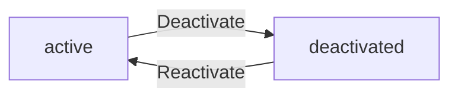
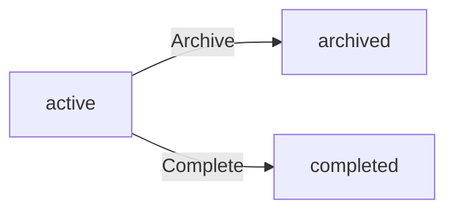
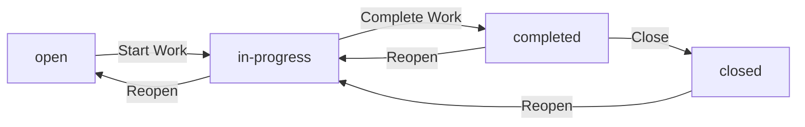
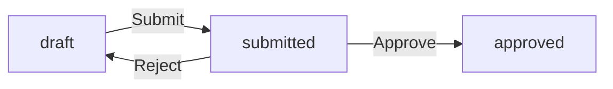
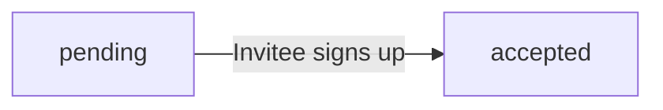
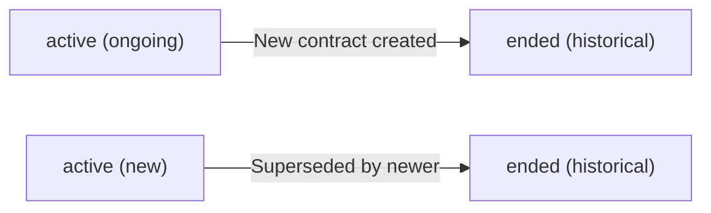
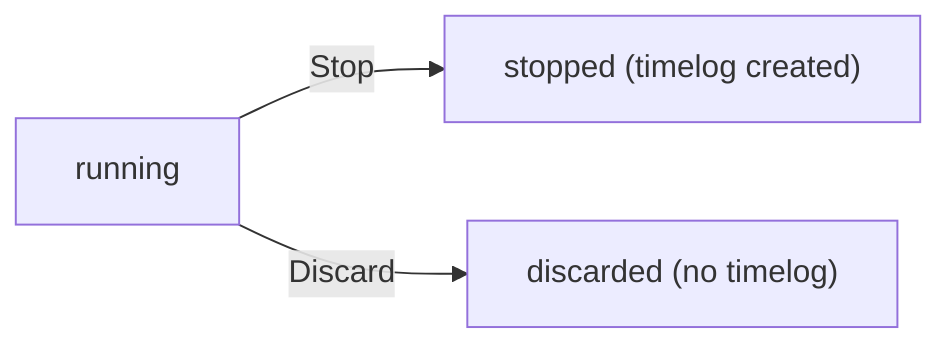

**erpHrm — Business concepts, relationships, and states from user perspective**

Business concepts, relationships, and states from user perspective

# Domain Concepts

Describe what each concept means in the business domain and its key attributes.

## Organization Concept

An Organization is the top-level business entity in the platform, representing a company or team that operates independently with its own data, employees, and projects. The platform supports multi-tenancy, meaning multiple organizations can coexist while keeping all data strictly isolated from one another. Each organization has a name that identifies it, an optional description providing context about its purpose, and a logo image for visual representation in the interface. Every organization also maintains operational settings: a currency (such as USD, EUR, or KRW) used for financial figures like pay rates, a timezone that governs how dates and times are interpreted for all members, and a fiscal start month that defines the beginning of the organization's financial year. An organization is created by a user during initial sign-up, and that user becomes the organization owner with full access. Organizations are the container within which all other entities — employees, departments, projects, timelogs, and timesheets — live, and no data crosses organization boundaries under any circumstances.

### Organization as a Multi-Tenant Container

The Organization is the top-level business entity in the platform. It represents an independent company or team that operates with complete autonomy over its own employees, projects, and data. The platform supports multi-tenancy, meaning multiple organizations can coexist while keeping all data strictly isolated from one another.

**Strict Data Isolation**: No data crosses organization boundaries under any circumstances. An employee in one organization cannot see or access data belonging to another organization, even if the same user is a member of both. A user who belongs to multiple organizations sees only the data of the currently selected organization at any given time. All entities — employees, departments, projects, timelogs, timesheets, contracts, roles, timers, activity logs, and invitations — live inside a single organization and are never shared across organizations.

### Organization Identity and Operational Settings

Every organization carries identity attributes that distinguish it within the platform and present it to its members:

- **Name**: A required name that identifies the organization. This is the primary label seen by members and displayed throughout the interface.
- **Description**: An optional free-text description that provides context about the organization's purpose, mission, or nature.
- **Logo Image**: An optional image that represents the organization visually. The logo supports branding and helps members recognize the organization they are currently working in, particularly when a user belongs to multiple organizations.

Each organization also maintains three operational settings that govern how business data is interpreted consistently for all members:

- **Currency**: The currency in which financial values are expressed across the organization, such as employee pay rates in contracts. Examples include USD (United States Dollar), EUR (Euro), and KRW (South Korean Won), among other common currencies.
- **Timezone**: The timezone that governs date and time interpretation for all members. This ensures that work dates, timesheet weeks (Monday through Sunday), and deadlines are interpreted consistently regardless of individual members' physical locations. Timelog dates and timesheet week boundaries are all evaluated in the organization's timezone.
- **Fiscal Start Month**: The month that marks the beginning of the organization's financial year. This setting is used for fiscal-year-based reporting and period calculations. For example, an organization with a fiscal start month of April treats the period from April through the following March as one fiscal year.

### Organization Ownership

Every organization has exactly one owner — the user who created the organization during initial sign-up. The owner is the first member of the organization and is automatically assigned the built-in Owner role, which grants full access to all features including managing roles, members, and organization settings.

The owner relationship is established at the moment of organization creation. Ownership can be transferred to another member of the organization when needed, such as when the current owner wishes to leave or delete their account. When an organization is deleted, the owner's user account persists but is no longer associated with any organization.

## User Concept

A User represents an individual person who has registered an account on the platform. Users authenticate with an email and password combination, which serve as their primary credentials. Beyond login credentials, each user maintains a global profile consisting of a display name that identifies them across organizations, an optional avatar image for visual recognition, and an optional phone number for contact purposes. This profile is shared across all organizations the user belongs to, so changing a display name in one organization context updates it everywhere. A user can belong to multiple organizations simultaneously, and each membership within an organization is represented by a separate Employee record. When logging in, the user selects which organization to work in, establishing an organization context that scopes all subsequent actions. A user is not inherently an employee of any organization — the Employee record is what grants the user a role, department, position, and the ability to track time within that organization.

### Authentication Identity

A User is an individual person who has registered an account on the platform. The User serves as the single authentication identity across all organizations — regardless of how many organizations a user belongs to, they log in once with the same email and password credentials.

The email address uniquely identifies the User in the system. No two users can share the same email. The password is a secret known only to the User and is used to verify their identity at login.

A User may exist without being an employee of any organization. The User record provides the authentication capability; the Employee record (defined in Employee Concept) provides the organizational membership and permissions.

### Global Profile

Each User has a global profile that is shared across every organization the user belongs to. The profile consists of:

- **Display name**: the name shown to other users across all organizations. This is the public-facing identity.
- **Avatar image**: an optional picture for visual recognition in the platform.
- **Phone number**: an optional contact number for the user.

Because the profile is global, any change to the display name, avatar image, or phone number takes effect immediately in every organization the user is a member of. For example, if a user updates their display name while working in Organization A, that new name also appears when the user switches to Organization B and when other members of Organization B view the user.

### Multi-Organization Membership

A User can belong to multiple organizations. Each membership within an organization is represented by a separate Employee record (defined in Employee Concept). The User record itself does not carry any organization-specific information — the Employee record holds the user's role, department, position, employment type, and status within that organization.

When a User logs in, they select which organization to work in. This choice establishes the organization context that scopes all subsequent actions: the projects they see, the tasks assigned to them, their timelogs, and their timesheets are all limited to the selected organization. The user can switch to a different organization at any time without logging out, and each switch changes the active Employee record and organization context.

This separation means the same person can be an Owner in one organization and an Employee in another, with entirely different permissions and data visible in each context.

## Employee Concept

An Employee represents a user's membership within a specific organization. It is the link between a User account and an Organization, carrying all organization-specific attributes. Each employee record holds an optional department assignment that places the person within the organization's structure, an optional position or title describing their job function, and an employment type that classifies the working arrangement as full-time, part-time, contractor, or intern. Every employee has a status that is either active or deactivated — active employees can log time and submit timesheets normally, while deactivated employees cannot perform new work but retain all their historical timelogs and timesheets for record-keeping. Each employee is assigned exactly one role within the organization, which determines what permissions and capabilities they have. An employee can be assigned to multiple projects as a project member, and their time entries are linked to their employee identity. The employee record is also the anchor for contracts, which define the pay terms for that person's work.

### User Membership and Organizational Identity

An employee record is the bridge between a global user account and an organization. A single user can be an employee of multiple organizations simultaneously, but each employee record exists within exactly one organization and represents that user's distinct membership there. All organization-specific attributes — department, position, employment type, status, role, and pay terms — belong to the employee record, not the user account. When a user switches their active organization context, a different employee record becomes active, providing the relevant identity, permissions, and data scope for that organization.

The employee record carries the user's organization-specific identity. While the user account holds globally shared attributes such as display name, avatar, and phone number, the employee record holds everything that is scoped to a particular organization. This separation allows a person to have different positions, departments, roles, and employment arrangements across different organizations without conflict.

### Department and Position

An employee may optionally be associated with a department (defined in Department Concept), placing them within the organizational structure for grouping and reporting purposes. The department assignment is not required — an employee can exist without a department. When a department is deleted, the department reference on affected employee records is cleared without affecting the employees themselves.

An employee also holds an optional position or job title that describes their function within the organization (for example, "Software Engineer" or "Marketing Lead"). The position field is free-text and carries no inherent permissions; it is purely descriptive for organizational clarity and reporting.

### Employment Type Classification

Every employee is classified under one of four employment types, which provides context for contract terms, reporting, and workforce planning:

- **Full-time**: A standard employee working the organization's regular schedule. Full-time contracts typically define the standard working hours per week (for example, 40 hours).
- **Part-time**: An employee working a reduced schedule compared to full-time, with proportionally fewer working hours per week defined in their contract.
- **Contractor**: An external worker engaged for a defined scope or period, not a permanent employee. Contractor arrangements may have different pay structures and contract terms.
- **Intern**: A temporary worker, often in a learning or transitional role, typically with a fixed-duration contract.

The employment type can be changed by users with the employee management permission. The classification itself does not enforce specific working hours — that is determined by the active contract.

### Employee Status: Active and Deactivated

An employee's status is either active or deactivated:

- **Active**: The normal working state. Active employees can log time entries, submit timesheets, be assigned to projects and tasks, and perform all functions permitted by their assigned role.
- **Deactivated**: A suspended or ended membership. Deactivated employees cannot log new time entries, submit timesheets, or be assigned new tasks or projects. However, all historical data — including past timelogs, timesheets, contracts, and project assignments — is fully preserved. A deactivated employee retains their complete history and can be reactivated later, restoring their active status without data loss.

Deactivation is distinct from account deletion. Deactivation is an organizational action that restricts the employee's current participation while preserving their record; the underlying user account continues to exist and may remain active in other organizations. Reactivation restores the employee to active status, and all previously preserved data becomes accessible again under the employee's current role.

### Role Assignment

Each employee is assigned exactly one role within their organization (defined in Role Concept). The role determines the employee's permissions — what they can view, create, edit, or approve within that organization. An employee cannot hold multiple roles simultaneously, nor can an employee exist without a role. Every employee must have a role assigned at the time their employee record is created.

The assigned role is organization-specific; the same user may hold different roles in different organizations — for example, an Owner in one organization and an Employee in another. The role assignment can be changed by users with the employee management permission. When a role assignment changes, the new role's permissions take effect immediately for that employee's subsequent actions. A custom role cannot be deleted while any employee is assigned to it.

### Contracts and Project Membership

The employee record serves as the anchor for two key relationships within the organization:

**Employment Contracts** — Each employee may have multiple contracts over time (defined in Contract Concept), representing the full history of their compensation terms. Only one contract is active at any given time. When a new contract is created for an employee, the previous active contract is automatically ended. Past contracts are preserved as an immutable historical record and cannot be edited. Contracts define the pay rate, pay period (hourly, daily, weekly, or monthly), and working hours per week for the employee.

**Project Membership** — An employee can be assigned to multiple projects simultaneously through project membership records (defined in ProjectMember Concept). Each project membership carries an assigned role within that project: either a regular member who can log time to the project, or a project lead who can additionally manage tasks within that project. Project membership is independent of the employee's organizational role — any employee, regardless of their organization-level role, can be a project member if assigned. When an employee is deactivated, their existing project memberships are preserved for historical reference and reporting.

## Role Concept

A Role defines the set of permissions and capabilities an employee has within an organization. Each role has a name that identifies it and a collection of permissions that enumerate exactly what actions the role holder can perform. Permissions are granular access rights such as managing the organization, managing employees, viewing employee details, managing projects, approving timesheets, and viewing reports. The platform provides three built-in roles that exist in every organization and cannot be deleted: Owner with full access to all features including role and member management, Manager who can manage employees and projects plus approve timesheets and view reports, and Employee who can track time, submit timesheets, and view only their own data. Organization owners can also create custom roles with any combination of the available permissions, allowing fine-grained access control tailored to the organization's needs. A custom role can be edited to adjust its permissions over time, and it can be deleted provided no employees are currently assigned to it. Each employee in the organization receives exactly one role, which directly controls what they can see and do.

### Role Name Identifier

A role is identified within an organization by its name. The role name serves as the primary way users and administrators recognize and distinguish between different roles. Role names must be unique within a single organization — no two roles in the same organization may share the same name. The name should clearly convey the intended level of access, such as "Finance Manager" or "Senior Developer."

### Permission Set and Granular Access Rights

Each role carries a set of permissions that define exactly what actions the role holder is allowed to perform within the organization. Permissions are granular access rights, meaning each permission controls a specific category of operation rather than providing blanket access.

The available permissions are:

- **org:manage** — allows editing organization settings, managing departments, and viewing the full activity log
- **employee:manage** — allows inviting new employees, editing employee records, deactivating and reactivating employees, and managing employee contracts
- **employee:view** — allows viewing the employee list, employee details, and employee contracts
- **project:manage** — allows creating, editing, archiving, completing, and deleting projects; creating and editing tasks; and assigning employees to projects
- **project:view** — allows viewing projects, tasks, and project memberships
- **time:manage** — allows editing or deleting any employee's timelogs
- **time:approve** — allows approving or rejecting submitted timesheets
- **time:view_all** — allows viewing all employees' timelogs and timesheets
- **report:view** — allows accessing organization-level reports including the time report, project budget report, and weekly summary report, as well as the organization dashboard

A custom role must have at least one permission selected from the predefined permission list. An empty permission set is not permitted for any custom role.

The permission set assigned to a role directly determines what the employee holding that role can see and do. Permissions are additive — granting a permission gives access; withholding it denies access.

### Built-in Roles

Every organization comes with three roles that are pre-configured and available immediately upon creation. These built-in roles cannot be deleted from the organization, ensuring there is always a baseline access structure.

**Owner Role**

The Owner role grants full access to every feature and permission within the organization. Owners can manage organization settings, manage employees, manage roles, create and edit custom roles, assign roles, manage projects and tasks, approve or reject timesheets, edit any timelog, view all reports, and access the activity log. The Owner role is the only role that can manage roles and delete the organization.

**Manager Role**

The Manager role is designed for oversight and team supervision. Managers can manage employees (invite, edit, deactivate), manage projects and tasks, approve or reject submitted timesheets, and view organization reports. Managers do not have access to organization settings management, role management, or the activity log.

**Employee Role**

The Employee role is the standard role for individual contributors who track their time. Employees can log time entries, start and stop timers, submit timesheets for approval, and view their own data — including their own timelogs, timesheets, contracts, assigned projects, and assigned tasks. Employees cannot view other employees' data, manage projects, approve timesheets, or access reports.

### Custom Roles

Organization owners can create custom roles tailored to the organization's specific needs. A custom role has a unique name and a selected set of permissions chosen from the available permissions list. At least one permission is required when creating a custom role; the owner can pick any combination beyond the minimum, enabling fine-grained access control for different positions in the organization.

Custom roles can be edited after creation. The owner can change the role's name and add or remove permissions as the organization's needs evolve. When a custom role's permissions are changed, all employees assigned to that role immediately receive the updated permission set.

A custom role can be deleted if and only if no employees are currently assigned to it. If even one employee holds the role, the deletion is not allowed — the employee must first be reassigned to a different role.

### Role Assignment and Access Control

Each employee in an organization is assigned exactly one role at any given time. This single role determines all of the employee's permissions within the organization. There is no concept of multiple overlapping roles for a single employee — the role encapsulates the complete access profile.

Role-based access control means that every action an employee attempts is evaluated against the permissions granted by their assigned role. The system checks whether the role includes the required permission before allowing the action to proceed. Employees cannot perform any action outside the scope of their role's permission set.

A role assignment can be changed by any user who holds the employee:manage permission. When an employee's role changes, the new role's permissions take effect immediately for that employee's subsequent actions.

## Contract Concept

A Contract represents an employment agreement between the organization and an employee, defining the compensation terms and working hours. Each employee can have multiple contracts over time, forming a historical record of changing pay arrangements, but only one contract can be active at any given moment. A contract is defined by a required start date marking when the terms take effect, and an optional end date — when the end date is absent, the contract is ongoing with no predetermined termination. The pay rate is a numeric value that, combined with the pay period, determines how the employee is compensated: pay periods can be hourly, daily, weekly, or monthly. The contract also specifies working hours per week, a required figure such as 40 hours, which establishes the employee's expected time commitment. An optional notes field allows recording additional details about the agreement. Once a contract is no longer active — superseded by a newer contract — it becomes an immutable historical record that cannot be altered, preserving the integrity of past compensation arrangements for auditing and reference.

### Compensation Structure

A contract defines the compensation terms governing how the organization pays the employee. The pay rate is a numeric value representing the amount the employee earns per unit of time. The pay period determines the unit against which the pay rate is measured. Four pay periods are supported:

- **Hourly**: the pay rate applies per hour worked
- **Daily**: the pay rate applies per full workday
- **Weekly**: the pay rate applies per full workweek
- **Monthly**: the pay rate applies per calendar month

Regardless of the pay period, the contract also specifies the working hours per week — a required figure that establishes the employee's expected weekly time commitment (for example, 40 hours for a standard full-time arrangement). This value informs budget calculations and capacity planning across the organization.

A contract may include optional notes for recording additional details about the compensation agreement, such as bonus structures, overtime policies, or special terms that fall outside the structured fields.

### Contract Duration

Every contract has a required start date, which marks the day the compensation terms take effect. The start date is the anchor point for the contract's validity and is used when determining which contract is active at any given time.

A contract may optionally have an end date. When an end date is present, the contract is effective only from the start date through the end date inclusive. When the end date is absent, the contract is considered ongoing — it has no predetermined termination and remains in effect until superseded by a newer contract or the employee leaves the organization.

An ongoing contract (no end date) is not the same as a permanent guarantee of employment. It simply means the compensation terms continue indefinitely under these conditions until explicitly changed.

### Contract Lifecycle

An employee may have multiple contracts over their tenure, creating a historical record of all compensation arrangements. However, only one contract can be active at any given moment. The active contract is the one whose start date is the most recent among all contracts for that employee whose start date is on or before the current date and whose end date is either absent or not yet passed.

When a new contract is created for an employee, it automatically supersedes the previously active contract. The superseded contract becomes part of the employee's historical contract record.

Past contracts — those that have been superseded or have reached their end date — are immutable. Once a contract is no longer active, its terms cannot be changed. This immutability preserves the integrity of the employee's compensation history, ensuring that past pay rates, pay periods, and working hour commitments remain an accurate and unalterable record for auditing, compliance, and reference purposes.

## Department Concept

A Department represents a structural grouping within an organization, used to categorize employees by functional area or team. Each department has a name that identifies it and an optional description providing additional context about the department's purpose or responsibilities. Departments support one level of nesting through an optional parent department reference, allowing organizations to model simple hierarchies such as a parent department with child sub-departments. An employee's department assignment is optional — not every employee needs to belong to a department. Departments serve primarily as an organizational tool for filtering and grouping employees in lists and reports. When a department is removed, the employees who were assigned to it simply lose their department association rather than being affected in any other way. Departments exist independently of projects and roles, meaning an employee's department has no bearing on what projects they can access or what permissions they hold.

### Core Concept and Purpose

A Department is an organizational grouping within a company that categorizes employees by functional area or team — such as Engineering, Sales, or Human Resources. It serves purely as a structural organization tool for grouping employees, with no bearing on access control, permissions, or project assignments. Departments exist to make the employee list browsable and reportable by functional breakdown. An organization may define as many or as few departments as needed, and some organizations may choose not to use departments at all.

### Attributes and Hierarchy

Each department is identified by a name that distinguishes it from other departments in the same organization. An optional description may provide additional context about the department's purpose or responsibilities.

Departments support one level of parent-child nesting. A department may reference an optional parent department, forming a simple hierarchy such as "Engineering" with a child department "QA." Nesting is limited to one level — a child department cannot itself serve as a parent to another department. A department without a parent is considered a top-level department.

### Employee Relationship and Independence

An employee's department assignment is optional — employees are not required to belong to any department. When an employee is assigned to a department, it reflects their functional grouping for organizational purposes only.

The employee list can be filtered by department, allowing managers and viewers to narrow the employee roster to a specific functional group.

A department has no influence over project access. An employee's ability to view projects, log time against them, or manage tasks is determined entirely by their project memberships and role permissions — never by their department.

Similarly, a department has no relationship to role permissions. An employee's role and its associated permissions operate independently of whatever department the employee belongs to.

When a department is removed, employees who belonged to it simply lose their department association. No employee records, timelogs, timesheets, contracts, or any other data are affected. The employees continue to function normally within the organization, just without a department label.

## Project Concept

A Project represents a body of work within an organization that employees track time against. Each project has a required name that identifies it and an optional description that provides context about its goals or scope. A color code is required for each project, serving as a visual identifier in the user interface to help distinguish projects at a glance. Every project has a status that indicates its current phase: active projects are ongoing and accept new timelogs, archived projects are preserved for reference but no longer accept new time entries, and completed projects represent finished work with similarly locked time tracking. A project may optionally define a budget in total estimated hours, which enables comparison between planned effort and actual time logged. Projects may also have optional start and end dates to frame the expected timeline. Projects contain tasks that break the work into smaller units, and employees are assigned to projects through project memberships that grant them access to log time and, in some cases, manage tasks within the project.

### Project Definition and Purpose

A project represents a body of work within an organization that employees track time against. Projects serve as the primary grouping mechanism for time tracking — when an employee logs time, they must associate each entry with a project. This allows the organization to understand where effort is being spent across different initiatives and to compare planned effort against actual time logged. Projects exist independently within an organization and provide the structural backbone for organizing tasks, assigning employees, and generating time-based reports.

### Project Attributes

Every project has a core set of attributes that define its identity and scope:

- **Name** (required): A descriptive label that identifies the project within the organization. The name is the primary way users recognize and reference a project.
- **Description** (optional): Free-form text providing additional context about the project's goals, scope, or purpose. It helps team members understand what the project encompasses.
- **Color code** (required): A visual identifier used in the user interface to help distinguish projects at a glance. Color codes are typically displayed as a swatch or accent alongside the project name.
- **Budget hours** (optional): The total estimated hours planned for the project. When set, this enables comparison between planned effort and actual time logged, surfacing in budget-related reports. Projects without budget hours are simply tracked without budget comparison.
- **Start date** (optional): The date when the project is expected to begin or when work commenced.
- **End date** (optional): The date when the project is expected to conclude. A project may have a start date without an end date, or vice versa.

### Project Status

Every project has a status that indicates its current phase in the project lifecycle. The three possible statuses are:

- **Active**: The project is ongoing. Employees assigned to the project can log time against it, and new timelogs are accepted. This is the default status for newly created projects and represents normal operation.
- **Archived**: The project is no longer active but its data is preserved for reference. No new timelogs can be created against an archived project, but all existing timelogs, tasks, and historical data remain accessible. Archiving is typically used for projects that are on hold or have been superseded.
- **Completed**: The project has been finished. Like archived projects, completed projects do not accept new timelogs, but all existing data is preserved. Completed status signals that the work reached its intended conclusion.

Only active projects accept new time entries. Both archived and completed projects retain their historical timelogs, tasks, and membership records intact.

### Project Relationships

A project connects to several other business concepts within the organization:

- **Tasks**: A project contains tasks that break the work into smaller, manageable units. Tasks are defined in the Task Concept (Module 1, Unit 8) and can be assigned to specific employees who are project members, tracked by status and priority, and optionally organized into a one-level parent-child hierarchy.
- **Employee assignment via project membership**: Employees are associated with a project through project memberships. Each project membership links one employee to one project with an assigned role — either member (who can log time) or project-lead (who can additionally manage tasks within the project). An employee may hold memberships across multiple projects simultaneously. Project memberships are defined in the ProjectMember Concept (Module 1, Unit 7).
- **Timelogs**: A project is the required target entity for timelogs. Every timelog must reference a project, ensuring that all time entries are organized by the work they contribute to. Timelogs are defined in the Timelog Concept (Module 1, Unit 10). A project may have many timelogs associated with it over its lifetime, and these timelogs form the basis of time-based reporting and budget tracking.

## ProjectMember Concept

A ProjectMember represents the assignment of an employee to a project, establishing the relationship that allows the employee to log time against that project. Each project membership links a specific employee to a specific project and carries an assigned role that determines the employee's level of responsibility within the project. The assigned role can be either a regular member who can log time and view the project's tasks, or a project lead who additionally can manage tasks within the project — creating, editing, and tracking task progress. An employee can hold memberships in multiple projects simultaneously, each with its own assigned role. The membership also records when the employee joined the project, providing a timestamp for historical reference. Project membership is a prerequisite for an employee to appear in task assignment options and for their timelogs to reference the project. Removing an employee from a project revokes their ability to log new time against it but does not delete any historical timelogs they previously recorded.

### ProjectMember Definition

A project membership — referred to as ProjectMember — represents the assignment of an employee to a project within the organization. It is the link that connects a specific employee to a specific project, enabling the employee to participate in that project's work. Without this link, an employee has no relationship to a project and cannot interact with it.

Each project membership carries the following attributes:

- **Employee**: the assigned individual (defined in Employee Concept)
- **Project**: the project the employee is assigned to (defined in Project Concept)
- **Assigned role**: the employee's level of responsibility within the project, either "member" or "project-lead"
- **Joined at**: the timestamp recording when the employee was assigned to the project

The joined-at timestamp serves as a permanent record of when the relationship began. It does not change over the lifetime of the membership and remains fixed even if the employee's role within the project is later changed.

### Assigned Roles and Responsibilities

Each project membership carries one of two assigned roles that define the employee's level of responsibility within the project:

**Member Role**

An employee assigned as a member holds a contributor-level role. Members can log time against the project through timelogs and can view the project's tasks. The member role grants participation rights — the ability to do work and see what work is tracked — but does not grant authority to manage the project's task structure or other members.

**Project-Lead Role**

An employee assigned as a project-lead holds an elevated responsibility. In addition to all capabilities of a member (logging time and viewing tasks), a project-lead can manage tasks within the project. Task management includes creating new tasks, editing existing task details, changing task statuses, and tracking overall task progress. The project-lead role designates project-level responsibility — an individual accountable for organizing and overseeing the work within that specific project.

The assigned role is specific to each project membership. An employee who is a project-lead on one project may be a regular member on another project simultaneously, since each project membership carries its own role independently.

### Membership as a Prerequisite

Project membership serves as a gate for several interactions within the system. An employee cannot perform the following actions for a project unless they hold a valid project membership for that project:

**Time Logging**

An employee must be a member of a project to log time against it. When creating a timelog, the system only presents projects where the employee has an active membership. This ensures that timelogs are always associated with projects the employee is authorized to work on.

**Task Assignment**

An employee must be a member of a project to be assigned to a task within that project. When assigning a task to an individual, the system only presents employees who hold a project membership for the task's parent project. This prevents tasks from being assigned to individuals who have no relationship to the project and ensures that only participating team members receive work assignments.

In both cases, the membership link serves as the prerequisite — it must exist before either time or tasks can be associated with the employee in the context of that project.

### Membership Lifecycle

**Joining a Project**

An employee gains project membership when they are assigned to a project. The joined-at timestamp is recorded at the moment of assignment and remains immutable thereafter. An employee can hold memberships in multiple projects simultaneously. Each membership is independent — joining one project has no effect on memberships in other projects, and the assigned role in one project does not influence the assigned role in another.

**Removal from a Project**

An employee can be removed from a project, which ends their membership. Removal does not retroactively affect data: all historical timelogs the employee previously recorded against that project remain intact and visible in reports, timesheets, and the activity log. Removal only affects future actions — the former member can no longer log new time against the project and can no longer be assigned to tasks within it.

**Role Changes**

An employee's assigned role within a project can be changed — for example, promoting a member to project-lead or demoting a project-lead to member. The joined-at timestamp is unaffected by role changes. The employee retains the same membership; only their level of responsibility within the project is adjusted.

## Task Concept

A Task represents a discrete unit of work within a project, breaking larger project goals into manageable, trackable items. Each task has a required title that summarizes what needs to be done and an optional description that provides detailed instructions or context. Tasks move through a defined status lifecycle: open for newly created tasks not yet started, in-progress when work has begun, completed when the work is finished, and closed as a terminal state for tasks that are fully resolved. Every task has a priority level — low, medium, high, or urgent — that communicates its relative importance and helps employees prioritize their work. Tasks may optionally carry an estimated hours figure for planning, a due date for deadline tracking, and an assignment to a specific employee who must be a member of the parent project. Tasks support one level of nesting through an optional parent task reference, enabling simple subtask relationships where a parent task can have child subtasks but a subtask cannot have its own subtasks. An employee can only be assigned to a task if they are already a member of the project that contains it.

### Task Definition and Purpose

A task represents a discrete unit of work within a project. Tasks decompose larger project goals into smaller, individually manageable items that can be tracked, assigned, prioritized, and completed. Each task belongs to exactly one project and cannot exist independently of it. Tasks serve as the bridge between project planning and daily execution — employees log time against tasks, and managers use tasks to monitor project progress at a granular level.

### Task Attributes

Every task has a title that is required and describes what needs to be accomplished. An optional description provides additional context, instructions, or acceptance criteria for the work. Tasks carry an optional estimated hours value used for planning and forecasting; this is a numeric figure representing the anticipated effort required. An optional due date may be set to indicate when the task should be completed. Every task has a status and a priority, defined in the sections below. Tasks also track the project they belong to, an optional assigned employee, and an optional parent task for subtask relationships.

### Task Status Lifecycle

A task progresses through a defined set of statuses representing its state in the work lifecycle:

- **Open**: The initial state for newly created tasks. The task has been defined but work has not yet started. Open tasks are visible to project members and appear in assigned employees' dashboards.
- **In-progress**: Work on the task has begun. An employee has started executing the task. In-progress tasks are actively tracked and appear prominently in dashboards.
- **Completed**: The work itself is finished. The task outcome has been delivered according to its requirements. Completed tasks remain visible for reference but are no longer considered active work.
- **Closed**: A terminal state indicating the task is fully resolved and requires no further attention. A task may move to closed from completed once the outcome has been reviewed and accepted, or directly from other statuses if the task is no longer relevant. Closed tasks are considered archived — they are retained for historical reference but excluded from active task views by default.

When a task's status changes, the transition is recorded in the task history (defined in Task History Concept), capturing which user made the change and the old and new statuses.

### Task Priority Levels

Every task is assigned a priority level that communicates its relative importance and urgency. Four priority levels exist:

- **Low**: The task has minimal urgency. It can be addressed when higher-priority work is complete. Suitable for improvements, nice-to-have features, or non-critical adjustments.
- **Medium**: The task has normal importance. It should be completed in a reasonable timeframe but does not demand immediate attention. This is the default priority for most operational tasks.
- **High**: The task is important and should be addressed promptly. Delaying this task may impact project timelines or stakeholder expectations. High-priority tasks warrant focused attention.
- **Urgent**: The task requires immediate action. It represents critical work that cannot be postponed without significant negative consequences. Urgent tasks take precedence over all other priorities.

Priority helps employees order their work and helps managers identify tasks that need escalation or reallocation.

### Task Assignment

A task may optionally be assigned to a specific employee who is responsible for its execution. Assignment is not mandatory — unassigned tasks represent work that is available for any project member to pick up. When a task is assigned, the assigned employee must already be a member of the project containing the task (defined in Project Member Concept). An employee who is not a project member cannot be assigned to any task within that project. Assignment to a single employee means only one person is accountable for the task at any given time.

### Subtask Nesting

Tasks support one level of parent-child nesting through an optional parent task reference. A task may have a parent task, establishing a simple hierarchy where the parent represents a broader work item and its children represent the specific steps needed to complete it. A task that serves as a parent may have multiple child subtasks. However, a subtask cannot be a parent to further subtasks — the nesting is limited to exactly one level. This constraint prevents overly complex hierarchies and keeps task structures manageable. Subtasks inherit their project context from the parent task; a subtask always belongs to the same project as its parent.

## TaskHistory Concept

A TaskHistory entry is a record of a status change for a task, forming an audit trail of how the task progressed through its lifecycle. Each entry captures the exact timestamp when the change occurred, the previous status the task held before the change, and the new status it transitioned to. The entry also identifies the user who made the change, providing accountability for task progression. TaskHistory entries are created automatically whenever a task's status field is modified — from open to in-progress, from in-progress to completed, or any other valid transition. These records accumulate over the life of a task, allowing anyone with access to the task to review its full history of status transitions. TaskHistory entries are immutable once created, serving as a permanent audit record. They are particularly useful for understanding how long a task spent in each status phase and who was responsible for moving the work forward.

### TaskHistory as an Audit Trail

A TaskHistory entry serves as a permanent audit trail that records every status change a task undergoes throughout its lifecycle. Each time a task moves from one status to another — for example, from "open" to "in-progress" or from "in-progress" to "completed" — the system automatically captures a record of that transition. These records accumulate over time, forming a complete chronological history of the task's progression. Once created, a TaskHistory entry is immutable; it cannot be modified or deleted by any user. This immutability ensures the audit trail remains trustworthy as a source of truth for task progression. The collection of TaskHistory entries for a given task provides a full picture of how the work evolved, including who moved the task forward at each step and how long each status phase lasted.

### Attributes of a TaskHistory Entry

Each TaskHistory entry captures the following information about a status change event:

- **Timestamp**: The exact date and time when the status change occurred. This is recorded automatically by the system at the moment the task's status field is modified.
- **Old Status**: The status the task held before the transition. This comes from the set of valid task statuses: open, in-progress, completed, or closed.
- **New Status**: The status the task transitioned to. Like the old status, this is one of the four valid task status values.
- **Changed by User**: The user who made the status change. This identifies the individual responsible for moving the task forward.

The system creates a TaskHistory entry automatically whenever a task's status is modified through any operation. No manual action is required to generate these records — they are a byproduct of the status change itself. Together, the timestamp, old status, new status, and user attributes provide a complete snapshot of each transition event, forming an indisputable record of when the task changed state, from what to what, and who initiated the change.

### Lifecycle Tracking and Accountability

TaskHistory entries enable stakeholders to track a task's progression through its entire lifecycle. By reviewing the full chronological sequence of entries for a task, one can see exactly how the task moved from creation (open status) through work (in-progress) to completion (completed or closed status). This tracking supports individual accountability: since every status change is attributed to a specific user, it is always clear who advanced the work at each step.

The entries also support status phase duration analysis. By comparing the timestamps of consecutive entries — for example, measuring the time between a transition to "in-progress" and the subsequent transition to "completed" — stakeholders can determine how long the task remained in each status phase. This analysis helps organizations understand workflow efficiency, identify bottlenecks where tasks stall in particular statuses, and evaluate how quickly work moves through the development pipeline. A task that spent three days in "open" but two weeks in "in-progress" may signal a workload or priority issue that warrants investigation.

## Timelog Concept

A Timelog is a single time entry recording work performed by an employee on a specific date. Each timelog captures the date when the work occurred and the duration in minutes, representing the total time spent. Every timelog must be associated with a project that the employee is assigned to as a project member, ensuring time is only logged against authorized work. A timelog may optionally reference a specific task within that project, allowing more granular tracking of effort. A description field lets the employee document what was accomplished during the logged time. Each timelog also carries a billable flag that defaults to true, indicating whether the logged time counts as billable work — this distinction matters for reporting and client invoicing scenarios. Timelogs belong exclusively to the employee who created them, and an employee can only create timelogs for themselves under normal circumstances. Once a timelog becomes part of an approved timesheet, it is locked and can no longer be edited or deleted, preserving the integrity of approved time records.

### Timelog Identity and Ownership

A timelog is a single time entry that records work performed by an employee. Each timelog belongs to exactly one employee — the employee who created it. Under normal circumstances, an employee may only create timelogs for themselves, meaning the owner of a timelog is always the same person who logged the time. This ownership is intrinsic and cannot be transferred to another employee. A timelog may be created manually by the employee entering their time, or it may be generated automatically when the employee stops a running timer (see Timer Concept). Regardless of how it is created, the timelog always belongs to the employee whose effort it represents.

### Timelog Core Attributes

Each timelog captures the date when the work occurred, recording which calendar day the effort was made. The duration is measured in minutes, representing the total amount of time spent on the work for that date. An optional description lets the employee document what was accomplished during the logged time. Each timelog also carries a billable flag that defaults to true, meaning the logged time is considered billable work unless explicitly marked otherwise. This billable distinction supports reporting scenarios where billable and non-billable hours must be tracked separately for invoicing or cost analysis purposes.

### Project and Task Association

Every timelog must be associated with a project. The employee may only log time against a project to which they are assigned as a project member (see ProjectMember Concept). This constraint ensures that time is recorded only against authorized work within the organization. A timelog may optionally reference a specific task within the associated project. If a task is referenced, it must belong to the same project as the timelog. This optional task association enables granular tracking of effort down to individual tasks, while allowing flexibility to log time at the project level when no particular task applies. A timelog cannot reference a task belonging to a different project.

### Timelog Locking

Once a timelog becomes part of an approved timesheet (see Timesheet Concept), it enters a locked state. In this locked state, the timelog is immutable — it cannot be edited or deleted by anyone, including the owning employee and users who otherwise have time management permissions. This locking mechanism preserves the integrity of approved time records, ensuring that audited and reported hours remain accurate over time. Timelogs that are not part of any approved timesheet remain in an unlocked state and are subject to normal modification rules.

## Timesheet Concept

A Timesheet is a collection of timelogs grouped by a specific calendar week, running from Monday to Sunday. Each timesheet is owned by a single employee and covers a defined week start date and week end date. The timesheet has a status that reflects where it is in the approval process: draft when the employee is still assembling and editing it, submitted when the employee has sent it for review, approved when a manager or owner has accepted it, and rejected when it has been sent back for revision. The total hours field is calculated automatically from the sum of all included timelog durations. When submitted, the timesheet records the submission timestamp. Upon review, it captures when it was reviewed, which user performed the review, and — in the case of rejection — a required rejection reason explaining why it was not accepted. A timesheet cannot be submitted if it contains no timelogs, and an employee cannot have multiple submitted or approved timesheets covering the same week. Once approved, all timelogs within the timesheet become locked and immutable.

### Timesheet Definition

A Timesheet represents a weekly collection of timelogs owned by a single employee. It groups all time entries for a specific calendar week, defined as running from Monday to Sunday. The timesheet serves as the unit of submission and approval for an employee's logged time — rather than approving individual timelogs one by one, employees bundle their weekly work into a timesheet and submit it for review.

The week definition is fixed: the week start date is always a Monday and the week end date is always the following Sunday. This is consistent across all organizations regardless of their configured timezone or fiscal calendar — the timesheet week is always Monday through Sunday.

### Timesheet Attributes

Each Timesheet carries the following attributes:

- **Week start date**: the Monday that begins the covered calendar week.
- **Week end date**: the Sunday that ends the covered calendar week.
- **Status**: a lifecycle state indicating where the timesheet is in the approval process (see Timesheet Statuses below).
- **Total hours**: the aggregate duration of all timelogs included in the timesheet, calculated automatically from the sum of each timelog's duration in minutes converted to hours. This is a derived value — it is not entered manually.
- **Submitted at**: a timestamp recording the exact moment the employee submitted the timesheet for review. This is set once upon submission and does not change.
- **Reviewed at**: a timestamp recording when the timesheet was acted upon — either approved or rejected. This is set once upon the review decision.
- **Reviewed by**: the user who performed the review (approval or rejection).
- **Rejection reason**: a text explanation that is required when the timesheet is rejected. It describes why the timesheet was not accepted, so the employee understands what to correct before resubmitting. This attribute is only present on rejected timesheets.

### Timesheet Statuses

A Timesheet moves through four distinct statuses during its lifecycle:

- **Draft**: the initial, editable state. The timesheet is being assembled by the employee. Timelogs can be freely added to or removed from a draft timesheet. The employee has not yet submitted it for review.

- **Submitted**: the timesheet has been sent by the employee and is awaiting review by someone with approval authority. In this state, the timesheet is locked from further edits by the employee. It can only be acted upon by a reviewer — either approved or rejected.

- **Approved**: the timesheet has been reviewed and accepted. This is a terminal state. Upon approval, all timelogs contained within the timesheet become locked and immutable — they can no longer be edited or deleted by anyone.

- **Rejected**: the timesheet has been reviewed and sent back for revision. A rejection reason is required, explaining why it was not accepted. The timesheet returns to draft status, allowing the employee to modify its contents and resubmit.

### Timesheet Relationships

A Timesheet has the following relationships within the domain:

- **Owned by one Employee**: each timesheet belongs to exactly one employee, who is its owner. The employee creates the timesheet, populates it with timelogs, and submits it for review.

- **Contains many Timelogs**: a timesheet groups together multiple timelogs from the same employee that fall within its Monday-to-Sunday week range. A timelog may belong to at most one timesheet. Once the timesheet is approved, all contained timelogs are locked and cannot be modified.

- **Reviewed by one User**: when a timesheet is approved or rejected, it references the user who performed that review action. This may be a manager or owner within the organization.

- **Week uniqueness constraint**: an employee cannot have more than one timesheet in the submitted or approved status for the same calendar week. This ensures that time for a given week is submitted and approved only once.

## Timer Concept

A Timer represents a live, real-time time tracking session that an employee has started but not yet stopped. Each employee can have at most one active timer at any given moment, preventing overlapping tracking sessions. The timer records the exact start timestamp when tracking began, the project against which time is being tracked, and optionally a specific task within that project. A description field allows the employee to note what they are working on during the session. While the timer is running, the employee can modify the description, the project, or the task if they switch focus. The timer continues indefinitely until the employee takes action — there is no automatic stop mechanism, so an employee who forgets to stop their timer will accumulate a long-running session. When the employee stops the timer, a new timelog is created automatically with the duration calculated from the elapsed time between start and stop, rounded to the nearest minute. The employee also has the option to discard the timer entirely, in which case no timelog is created and the session is simply abandoned.

### Timer Definition

A Timer represents a live, real-time tracking session that an employee initiates to record work as it happens, rather than logging time retroactively. Unlike a timelog — which captures a completed work period — a Timer captures an ongoing, unstopped session.

The defining characteristic of a Timer is its exclusivity: each employee may have at most one active timer at any given moment. If an employee has a timer already running, they must stop it or discard it before starting a new one. This constraint ensures that an employee's tracked time does not overlap and that there is no ambiguity about which session is currently active.

### Timer Attributes

A Timer records the following information:

- **Start timestamp**: The exact date and time when the employee began tracking. This serves as the reference point for calculating elapsed duration once the timer is stopped.

- **Project** (required): The project against which time is being tracked. The project must be one that the employee is assigned to as a project member.

- **Task** (optional): A specific task within the selected project. The task must belong to the selected project. If the employee is working on the project in general without a particular task, this may be left unspecified.

- **Description**: A free-text note describing what the employee is working on. This field is mutable throughout the timer's lifespan — the employee can update it at any point while the timer is running to reflect changes in what they are doing.

Additionally, both the project and the task are editable while the timer is running. If an employee shifts focus from one project or task to another, they can update the timer's project and task assignments on the fly rather than stopping and restarting. The start timestamp remains unchanged when these edits occur; only the project, task, and description are affected.

### Timer States and Outcomes

A Timer exists in one of two states: **running** (actively counting time) or **ended** (stopped or discarded).

While running, the Timer has no automatic stop mechanism. It continues indefinitely, tracking elapsed time from the start timestamp until the employee takes explicit action. An employee who forgets to stop their timer will accumulate a session spanning a potentially long period — the system does not intervene to cap or terminate the session.

When the employee chooses to end the timer, two outcomes are possible:

- **Stop**: The timer is stopped, and a new timelog is created automatically. The timelog's duration is calculated as the difference between the stop time and the start timestamp, then rounded to the nearest minute. The timelog carries over the project, task, and description from the timer at the moment of stopping. After the timelog is created, the timer ceases to exist as an entity — it has been consumed into the resulting timelog.

- **Discard**: The timer is abandoned without creating any timelog. No record of the tracked time is preserved, and the session is simply deleted. This outcome is useful when the employee started a timer accidentally or decides the tracked session should not contribute to their time records.

## ActivityLog Concept

An ActivityLog entry is a permanent record of a significant action that occurred within an organization, serving as an audit trail for compliance and oversight. Each entry captures the exact timestamp when the action took place and identifies the user who performed it, establishing accountability. The action type categorizes what happened — examples include inviting an employee, deactivating or reactivating an employee, creating or editing a contract, creating a project, archiving or completing a project, deleting a project, changing a task's status, submitting a timesheet, approving or rejecting a timesheet, and assigning or changing an employee's role. The target entity field identifies which business object was affected — such as a specific employee, project, task, or timesheet. An optional details field may carry additional context, such as the old and new values for a change or a rejection reason. Activity log entries are immutable once created and accumulate over the organization's lifetime. They are visible only to users with the organization management permission.

### Definition and Purpose

An activity log entry is a permanent audit trail record that captures a significant business action within an organization. It serves as the authoritative historical record for compliance, oversight, and traceability, allowing organization management to review who did what and when. Each entry is created automatically by the system when a tracked action occurs — no user manually creates activity log entries. Once recorded, the entry becomes a permanent fixture of the organization's history.

### Core Attributes

Every activity log entry has the following attributes:

- **Timestamp**: The exact date and time when the action occurred, recorded at the moment the action completes.
- **Performing User**: Identifies the user who performed the action, establishing individual accountability for every recorded event.
- **Action Type**: A category label that classifies the nature of the action (see "Action Types" section below for all recognized types).
- **Target Entity**: Identifies the specific business object affected by the action — such as an employee record, project, contract, task, timesheet, or role — providing a clear reference to what was changed.
- **Details**: Optional contextual information that supplements the action record, such as old and new values for a change event or a reason given for a decision.

### Action Types

The system recognizes the following action type categories, each logged when the corresponding operation completes:

- **Employee Invited**: Recorded when a new employee invitation is sent, identifying the invited email address.
- **Employee Deactivated**: Recorded when an employee's status changes to deactivated.
- **Employee Reactivated**: Recorded when a previously deactivated employee is reactivated.
- **Contract Created**: Recorded when a new employment contract is created for an employee.
- **Contract Edited**: Recorded when an active contract's terms are modified.
- **Project Created**: Recorded when a new project is created.
- **Project Archived**: Recorded when a project's status changes to archived.
- **Project Completed**: Recorded when a project's status changes to completed.
- **Project Deleted**: Recorded when a project is permanently removed.
- **Task Status Changed**: Recorded when a task transitions from one status to another.
- **Timesheet Submitted**: Recorded when an employee submits a draft timesheet for approval.
- **Timesheet Approved**: Recorded when a timesheet is approved by an authorized reviewer.
- **Timesheet Rejected**: Recorded when a timesheet is rejected, typically including the rejection reason in the details field.
- **Role Assigned**: Recorded when an employee's role is changed or initially assigned.

### Target Entity Reference

The target entity field identifies the business object that was affected by the recorded action. The entity type varies by action:

- For employee-related actions (invited, deactivated, reactivated), the target is the employee record.
- For contract actions (created, edited), the target is the contract.
- For project actions (created, archived, completed, deleted), the target is the project.
- For task status changes, the target is the task.
- For timesheet actions (submitted, approved, rejected), the target is the timesheet.
- For role changes (assigned or changed), the target is the employee whose role was modified.

This linkage allows viewing all activity history related to a specific business object.

### Details Field

The details field provides optional contextual information that enriches the activity log entry beyond the basic action type and target. Examples of contextual information include:

- **Old and new values**: For a task status change, the previous status and the new status. For a role change, the previous role name and the new role name.
- **Rejection reasons**: When a timesheet is rejected, the reason provided by the reviewer.
- **Descriptive notes**: Additional information relevant to the action, such as the department or position assigned to an employee.

This field is not required for every action type — it is populated only when meaningful context exists beyond the action type and target entity.

### Immutability

Activity log entries are immutable once created. No user — including organization owners — can edit or delete an activity log entry after it has been recorded. This immutability guarantees the integrity of the audit trail and ensures the historical record cannot be tampered with. Activity log entries accumulate over the lifetime of the organization and are preserved as long as the organization exists.

### Access and Visibility

Activity log entries are visible only to users who hold the organization management permission within the organization. Employees without this permission cannot view any activity log entries. Managers and regular employees do not see the activity log in their interface. The activity log can be browsed as a paginated list and can be filtered by action type, performing user, and date range, as described in the functional requirements and business rules.

## Invitation Concept

An Invitation represents a pending request to bring a new person into an organization as an employee. Each invitation is keyed by the email address of the person being invited, which serves as the unique identifier for matching against existing or future user accounts. The invitation carries a status that tracks where it is in its lifecycle — it remains pending until the invited person either uses it or it expires. The invited at timestamp records when the invitation was sent, providing a reference for how long it has been outstanding. When the invited email address already belongs to an existing user account, the invitation is resolved immediately by adding that user to the organization. When the email address does not yet have an account, the invitation waits in a pending state, and the system recognizes it when that person eventually signs up — automatically adding them to the organization at that point. Invitations are organization-specific, meaning a person invited to one organization has no visibility into or access to any other organization.

### Invitation Concept and Attributes

An invitation is a pending request sent by an organization to bring a person on board as an employee. It serves as a bridge between the organization and the future or existing user, allowing the organization to extend membership before the person has an account.

Each invitation is uniquely identified by the recipient's email address within the organization — meaning the same email address cannot have more than one pending invitation to the same organization. The email address acts as the matching key for linking the invitation to a user account.

The invitation carries three key attributes:

- **Recipient email address**: The identifier of the person being invited. This is the primary matching field used to connect the invitation with an existing user account or to recognize the invitation when a new user signs up.
- **Invitation status**: Tracks where the invitation is in its lifecycle (see Invitation Statuses below).
- **Invited at timestamp**: Records the moment when the invitation was originally sent, providing a reference for how long the invitation has been outstanding.

Every invitation belongs to exactly one organization and is scoped to that organization. An invitation sent from one organization has no bearing on or visibility into any other organization.

### Invitation Statuses

An invitation can be in one of the following statuses:

- **Pending**: The invitation has been sent but the recipient has not yet joined the organization. This state applies when the invited email address does not correspond to any existing user account. The invitation waits in this state until either the person creates an account with that email address (at which point the invitation is automatically resolved) or the invitation is otherwise handled.
- **Resolved**: The invitation has been fulfilled — the invited person has been added to the organization as an employee. This occurs either immediately when the email matches an existing user, or upon the invited person's sign-up. Once resolved, the invitation is no longer active.

### Invitation Resolution by Email Matching

Invitations are resolved through email matching between the invitation's recipient email address and the user accounts registered in the system. There are two distinct resolution paths:

**Immediate Resolution for Existing Users**: When an invitation is sent to an email address that already belongs to a registered user account, the invitation is resolved immediately. The existing user is added directly to the organization as an employee without any further action required from either party. In this case, the invitation transitions to the resolved status without ever entering the pending state.

**Deferred Resolution for New Sign-Ups**: When an invitation is sent to an email address that does not match any existing user account, the invitation enters the pending state. It remains pending until the invited person creates an account using that email address. At the moment of sign-up, the system recognizes all pending invitations associated with that email address across all organizations and automatically resolves each one — adding the new user as an employee to every organization that invited them. This automatic joining ensures that invited users do not need to accept invitations manually after creating their account.

# Domain Relationships

Describe how concepts relate to each other from a business perspective.

## Conceptual Relationships

Describe how concepts relate to each other in business terms.

### Organization Ownership Structure

The Organization is the top-level container in the system and serves as the root of the ownership hierarchy. All domain data — employees, departments, projects, roles, invitations, and activity logs — exist within the context of a single Organization and cannot span across organizations.

An Organization has many of each of the following:

- **Employees**: individuals who work for the organization. Each Employee record links the organization to a User account and holds organization-specific information such as role, department, and employment type.
- **Departments**: organizational groupings used to categorize employees by functional area or team.
- **Projects**: bodies of work that employees track time against. Each project contains tasks and has assigned members.
- **Roles**: permission sets that define what employees can do within the organization. Three built-in roles (Owner, Manager, Employee) always exist and additional custom roles can be created.
- **Invitations**: pending requests sent to email addresses inviting people to join the organization.
- **Activity Log Entries**: audit records of significant actions that occur within the organization.

Data isolation is strict: all entities belonging to one Organization are invisible and inaccessible to members of any other Organization. When an Organization is deleted, all associated employees, projects, tasks, timelogs, timesheets, departments, roles, invitations, and activity log entries are permanently removed. The User accounts of former members are not deleted — only their association with the organization is severed.

### User-Organization Association via Employee

A User becomes associated with an Organization through an Employee record. The Employee record serves as the bridge between the global User account and organization-specific membership.

Key characteristics of this relationship:

- Each Employee record belongs to exactly one Organization and references exactly one User account.
- A single User can have Employee records in multiple organizations. When logged in, the User selects which Organization context to work in, and all actions are scoped to that organization through the corresponding Employee record.
- The User's global profile (display name, avatar image, phone number) is shared across all organizations they belong to. However, the User's role, department, position, employment type, and contract history are specific to each Employee record and therefore specific to each Organization.
- When an Employee is deactivated, the User account remains intact. The deactivated Employee record preserves all historical data (timelogs, timesheets) but the User can no longer log time or submit timesheets in that Organization.
- When a User deletes their account, all their Employee records are marked as deactivated in their respective organizations.

### Employee Central Relationships

An Employee belongs to one Organization and is the central entity connecting to several related concepts.

**Role Assignment**: Each Employee is assigned exactly one Role within their Organization. The Role defines what the Employee can do. Role assignment can be changed by users with permission to manage employees.

**Department Placement**: An Employee can optionally belong to one Department. When a Department is deleted, all employees in that Department have their department assignment cleared — the employees themselves are not removed.

**Contract History**: An Employee has many Contracts over time, forming a historical employment record. At most one Contract can be active at any given moment. Contracts are specific to the Employee and organization; they do not exist independently.

**Project Membership**: An Employee can be assigned to multiple Projects through ProjectMember records. Each ProjectMember links one Employee to one Project with a specific assigned role (member or project-lead).

**Time Tracking Ownership**: An Employee owns their Timelogs, Timesheets, and Timer. An Employee can only create and manage their own time data unless a user with elevated permissions acts on their behalf.

### Contract Ownership and History

A Contract belongs to exactly one Employee and represents an employment agreement between the organization and that Employee.

Ownership rules:

- A Contract cannot exist without an associated Employee. If an Employee is deactivated, their Contracts are preserved as historical records.
- An Employee can have multiple Contracts over time, but only one can be active at any point.
- When a new Contract is created for an Employee, the previous active Contract is automatically ended: its end date is set to the day before the new Contract's start date.
- Past Contracts — those with an end date in the past or those superseded by a newer Contract — become immutable. They cannot be edited and serve as a permanent historical record of the Employee's compensation terms over time.
- The current active Contract (the one with no end date, or the most recent one) can be edited by users with permission to manage employees.

### Project, Membership, and Task Hierarchy

A Project belongs to one Organization and acts as the container for Tasks, Project Members, and Timelogs.

**Project Membership**: The relationship between Projects and Employees is modeled through ProjectMember records. Each ProjectMember links exactly one Employee to exactly one Project and carries an assigned role of either "member" or "project-lead." An Employee can be assigned to multiple Projects, and a Project can have multiple Employees assigned. The project-lead role grants authority to manage tasks within that specific project.

**Task Containment**: A Project has many Tasks. Each Task belongs to exactly one Project and represents a discrete unit of work within that project. Tasks cannot exist without a parent Project. When a Project is deleted (which is only possible if no timelogs exist against it), all its Tasks and TaskHistory records are also removed.

**Time Logging**: A Project has many Timelogs. Employees log time against Projects they are assigned to as members. When a Project is archived or completed, it stops accepting new timelogs but all existing timelogs are preserved.

**Assignment Validation**: A Task can only be assigned to an Employee who is already a member of the Task's parent Project. This ensures assignments remain within the project's team.

### Task Structure, Nesting, and History

A Task belongs to exactly one Project and represents a discrete unit of work within that project.

**Parent-Child Nesting**: Tasks support one level of nesting through an optional parent Task relationship. A parent Task can have many child Tasks (subtasks), but a child Task cannot itself have subtasks — the nesting is limited to one level.

**Employee Assignment**: A Task can optionally be assigned to one Employee. The assigned Employee must already be a member of the Task's parent Project (via a ProjectMember record). If no Employee is assigned, the Task is unassigned.

**Status Change History**: Every time a Task's status changes, a TaskHistory entry is created. Each TaskHistory entry belongs to one Task and records:

- The timestamp when the change occurred
- The old status before the transition
- The new status after the transition
- The User who made the change

TaskHistory entries are created automatically and cannot be edited or deleted. They provide a complete audit trail of how a Task evolved over time.

**Time Tracking**: A Task can have many Timelogs associated with it. When an Employee logs time against a Task, the Timelog references both the Task and its parent Project.

### Time Tracking Data Relationships

The time tracking domain consists of three interconnected concepts: Timelogs, Timesheets, and Timers. Each relates to the others through ownership and containment.

**Timelog**: A Timelog is the atomic unit of time tracking. It belongs to one Employee (who performed the work) and one Project (where the work was done). It can optionally reference a Task within that Project. A Timelog also can optionally belong to a Timesheet — when an Employee creates a draft Timesheet for a week, the relevant Timelogs become part of that Timesheet.

**Timesheet**: A Timesheet is a weekly collection owned by one Employee. It covers a specific Monday-to-Sunday week and contains many Timelogs, all of which must belong to the same Employee and fall within the Timesheet's week date range. A Timesheet records who reviewed it (reviewed by) and when it was reviewed. When a Timesheet is approved, all its contained Timelogs become locked — they cannot be edited or deleted. If a Timesheet is rejected, the Timelogs remain editable and the Employee can modify and resubmit.

**Timer**: A Timer is a live tracking session. Each Employee can have at most one active Timer at any time. The Timer references a Project and optionally a Task. When the Timer is stopped, it creates a new Timelog with the duration calculated from the start timestamp to the stop time. When the Timer is discarded, no Timelog is created and the tracking data is lost. The Timer belongs to exactly one Employee.

### Activity Log as Organizational Audit Trail

Activity Log Entries capture significant actions for audit purposes. Each entry belongs to one Organization and references the User who performed the action.

Each Activity Log entry records:

- When the action occurred (timestamp)
- Who performed it (the User)
- What type of action it was (action type, such as employee invited, timesheet approved, project created)
- Which entity was affected (target entity)
- Additional contextual details

The Activity Log is a permanent, append-only record. Entries cannot be edited or deleted by any user. They are retained for the lifetime of the Organization and are removed only when the Organization itself is deleted.

### Invitation Lifecycle and Association

An Invitation belongs to one Organization and represents a pending request for someone to join. Each Invitation is identified by an email address and tracks its current status.

Invitation lifecycle:

- When a user with permission to manage employees sends an invitation, an Invitation with status "pending" is created.
- If a User account with the matching email already exists, the Invitation is resolved immediately and an Employee record is created, linking the User to the Organization.
- If no account exists with that email, the Invitation remains pending until someone signs up with that email. At that point, the Invitation is resolved and the new User is automatically added to the Organization as an Employee.
- The resolved Invitation links the User to the Organization through the newly created Employee record.

## Lifecycle and Retention

Describe concept lifecycle states and transitions only. Detailed retention/recovery policies belong in 05-non-functional. Operation details belong in 03-functional-requirements.

### Organization Lifecycle

An organization exists in one of two states: **active** or **deleted**.

An organization becomes active immediately upon creation during a user's initial sign-up. While active, the organization operates fully — employees can be invited, projects can be created, time can be tracked, and timesheets can be processed.

An organization can transition to deleted only when two conditions are met:
- All timesheets within the organization are resolved (either approved or rejected)
- There are no active employee contracts in the organization

When an organization is deleted, all associated data — employees, projects, tasks, timelogs, timesheets, departments, roles, contracts, invitations, project memberships, task histories, activity logs, and timesheet review records — is permanently removed. The owner's user account is preserved but no longer associated with any organization.

There is no archival or recovery path for a deleted organization. Deletion is irreversible from a business perspective.

### Employee Lifecycle

An employee record follows a lifecycle with the following states: **pending** (via invitation), **active**, and **deactivated**.

**Invitation Flow**: When a user with employee management permission invites an individual by email, a pending invitation is created. If the email already belongs to an existing user account, the employee record becomes active immediately. If the email does not yet have an account, the invitation remains pending. When that person later signs up with the matching email, the pending invitation is resolved and the employee record becomes active.

**Active State**: An active employee can log time, submit timesheets, be assigned to projects and tasks, and have an active contract. This is the normal operating state.

**Deactivation**: An employee can be transitioned from active to deactivated. A deactivated employee cannot log time or submit timesheets. All historical data — timelogs, timesheets, contracts, and activity log entries — belonging to the deactivated employee is preserved. Deactivated employees can be reactivated, returning them to the active state.

**Account Deletion Impact**: When a user deletes their account, their employee records in all organizations they belong to are transitioned to deactivated rather than being deleted, preserving organizational history.

### Contract Lifecycle

A contract represents an employment agreement between the organization and an employee. Each employee can have multiple contracts over time as a historical record, but only one contract can be **active** at any given moment.

A contract becomes active when it is created with a start date. A contract without an end date is considered ongoing. A contract transitions to **ended** when its end date is reached or when a newer contract is created for the same employee.

When a new contract is created for an employee, the previously active contract is automatically ended — its end date is set to the day before the new contract's start date. This ensures there are no overlapping active contracts.

Past contracts (those with an end date in the past) are immutable historical records. They cannot be edited. Only the current active contract can be modified.

Contracts are preserved as part of the employee's historical employment record. They are only removed if the entire organization is deleted.

### Project Lifecycle

A project exists in one of four states: **active**, **archived**, **completed**, or **deleted**.

**Active**: The default state when a project is created. Active projects accept new timelogs, can have tasks created within them, and employees can be assigned as project members.

**Archived**: A project can be transitioned from active to archived. Archived projects no longer accept new timelogs, but existing timelogs and all project data are preserved. The project remains visible in reports and lists.

**Completed**: A project can be transitioned from active to completed. Like archived projects, completed projects no longer accept new timelogs, but existing data is preserved. Completed represents a project that reached its natural end, while archived represents a project set aside before completion.

**Deleted**: A project can be deleted only if it has no timelogs associated with it. Once deleted, the project and all its tasks, task histories, and project memberships are permanently removed.

There is no transition path from archived or completed back to active, but projects in these states can still be deleted if they satisfy the no-timelogs condition.

### Task Lifecycle

A task's status progresses through defined states: **open**, **in-progress**, **completed**, and **closed**.

**Open**: The initial state when a task is created. It has been defined but work has not yet started.

**In-Progress**: Indicates that work on the task has begun. An employee has started actively working toward completion.

**Completed**: The task's deliverable has been finished. It awaits final review or closure.

**Closed**: The task is formally closed and no further work is expected. A closed task is considered final.

Every status change is recorded as a task history entry, capturing the timestamp of the change, the previous status, the new status, and the user who made the change. This creates a complete audit trail of the task's progression.

Tasks can have one level of subtasks through a parent task relationship. The parent task and subtask can have independent statuses, though typically a parent task is completed or closed only after all subtasks are resolved.

Tasks are preserved as part of the project's data. They are only removed when the parent project is deleted.

### Timesheet Lifecycle

A timesheet progresses through four states: **draft**, **submitted**, **approved**, and **rejected**.

**Draft**: The initial state. A timesheet is created as a draft for a specific week (Monday through Sunday). In draft state, timelogs can be added to or removed from the timesheet. The employee can freely modify the timesheet's contents.

**Submitted**: The employee submits the draft for review. A timesheet cannot be submitted if it contains no timelogs. A timesheet also cannot be submitted if another timesheet for the same week is already submitted or approved (one timesheet per employee per week). Once submitted, the timesheet enters the approval queue.

**Approved**: A reviewer with approval permission approves the submitted timesheet. When a timesheet is approved, all timelogs included in it become locked — they can no longer be edited or deleted. The timesheet records who approved it and when.

**Rejected**: A reviewer rejects the submitted timesheet, providing a required rejection reason. The timesheet returns to draft status, and the employee can modify its contents (add or remove timelogs) and resubmit. The rejection history — including the reviewer and reason — is preserved.

The timesheet lifecycle records key timestamps: when it was submitted, when it was reviewed (approved or rejected), and by whom. These form part of the organization's audit trail.

Timesheets are preserved as historical records. They are only removed if the entire organization is deleted.

### Timer Lifecycle

A timer is a live time-tracking session with a simple lifecycle: **running**, **stopped**, or **discarded**.

**Running**: An employee starts a timer by selecting a project (required) and optionally a task. An employee can have at most one timer running at any time. The timer records the start timestamp and continues running until the employee takes action. If an employee forgets to stop the timer, it continues running indefinitely — there is no automatic stop.

**Stopped**: When an employee stops the timer, a timelog is automatically created with the elapsed duration (rounded to the nearest minute). The timelog captures the project, task, and description from the timer. The timer itself is consumed and no longer exists as an independent entity.

**Discarded**: An employee can discard the running timer. No timelog is created. The timer is simply removed without any record of the elapsed time.

An employee can modify the description and the selected project or task of a running timer before stopping or discarding it. Once stopped or discarded, the timer cannot be recovered.

### Invitation Lifecycle

An invitation exists in two states: **pending** and **accepted**.

**Pending**: When a user with employee management permission sends an invitation to an email address that does not yet have a user account, a pending invitation is created. The invitation records the target email address, the organization it belongs to, and when it was sent. A pending invitation waits for the recipient to sign up.

**Accepted**: When a person signs up with an email address matching a pending invitation, the invitation is resolved. An employee record is created in the organization, and the invitation transitions to accepted. The new user is automatically added to the organization.

If a user signs up with an email that has pending invitations in multiple organizations, all matching invitations are resolved, and the user is added to all inviting organizations.

Invitations are preserved until resolved. They are removed only if the entire organization is deleted.

### Data Deletion and Preservation Overview

The platform applies deletion policies consistently across domain concepts. The following summarizes what happens when various entities are removed:

**Organization Deletion (Cascading Removal)**: When an organization is deleted, all data belonging to that organization is permanently removed. This includes employees, departments, projects, tasks, task histories, timelogs, timesheets, project memberships, contracts, roles, invitations, activity logs, and timers. The organization owner's user account is preserved but dissociated.

**User Account Deletion (Soft Deactivation)**: When a user deletes their account, their employee records across all organizations are marked as deactivated rather than deleted. Historical data — timelogs, timesheets, contracts, activity log entries for actions they performed — is preserved. The organization retains a complete historical record.

**Project Deletion (Conditional)**: A project can only be deleted if it has no timelogs. This prevents accidental loss of time-tracking data. When deleted, tasks, task histories, and project memberships are also removed.

**Timelog Deletion (Timesheet-Aware)**: A timelog can be deleted only if it is not part of a submitted or approved timesheet. This protects approved time-tracking data from removal.

**Timesheet Deletion**: Timesheets can be removed while in draft state. Submitted, approved, or rejected timesheets are preserved as part of the audit trail.

**Historical Preservation**: The following are always preserved unless the organization is deleted: task history entries, activity log entries, past contracts, deactivated employee records, and timesheet review records. These form the organization's permanent audit trail.

Detailed data retention periods, archival policies beyond the core lifecycle, and recovery procedures are defined in 05-non-functional.

# Business Categories and State Flows

Business category classifications and state flow definitions.

## Business Category Definitions

Define all business category classifications with their allowed values and descriptions.

### Employment Type Classification

Each employee record carries an employment type that describes the nature of their working arrangement with the organization.

The allowed values are:

| Value | Description |
|-------|-------------|
| full-time | Standard full-time employee working the organization's normal weekly hours |
| part-time | Employee working fewer than the standard full-time weekly hours |
| contractor | External contractor engaged for specific work, not a regular employee |
| intern | Temporary intern, typically for a fixed period or learning arrangement |

Only one employment type is assigned to an employee at any given time. Users with `employee:manage` permission can change an employee's employment type.

### Employee Status Classification

Each employee record has a status that determines whether the employee is currently active within the organization.

The allowed values are:

| Value | Description |
|-------|-------------|
| active | The employee is currently active and can perform all permitted actions, including logging time and submitting timesheets |
| deactivated | The employee has been deactivated and cannot log time or submit timesheets. Historical data (timelogs, timesheets) is preserved. The employee can be reactivated later |

Deactivation does not delete the employee record or their associated data. Reactivation restores the employee to active status.

### Pay Period Classification

Each employee contract specifies a pay period that defines the basis for calculating compensation.

The allowed values are:

| Value | Description |
|-------|-------------|
| hourly | Compensation calculated per hour worked |
| daily | Compensation calculated per day worked |
| weekly | Compensation calculated per week worked |
| monthly | Compensation calculated per month worked |

The pay period, combined with the pay rate, determines how an employee's compensation is computed. The pay period is set per contract and may change between contracts.

### Project Status Classification

Each project has a status that indicates its current phase and whether new timelogs can be recorded against it.

The allowed values are:

| Value | Description |
|-------|-------------|
| active | The project is ongoing and accepts new timelogs |
| archived | The project has been archived and does not accept new timelogs. Existing timelogs are preserved |
| completed | The project has been completed and does not accept new timelogs. Existing timelogs are preserved |

Both archived and completed statuses prevent new timelogs from being created against the project. The distinction between archived and completed is for organizational clarity: completed indicates the work finished as planned, while archived indicates the project was set aside.

### Project Member Role Classification

Each project membership assigns a role that determines what the employee can do within the project.

The allowed values are:

| Value | Description |
|-------|-------------|
| member | Standard project member who can log time against the project and view its tasks |
| project-lead | Project lead who can manage tasks within the project in addition to logging time and viewing tasks |

An employee assigned to a project always holds exactly one of these roles. Project leads can create and edit tasks within their project but require `project:manage` permission for project-level changes.

### Task Status Classification

Each task has a status that reflects its current stage in the workflow.

The allowed values are:

| Value | Description |
|-------|-------------|
| open | The task has been created but work has not yet begun |
| in-progress | Work on the task is actively underway |
| completed | The work for the task is finished |
| closed | The task has been reviewed and formally closed. A completed task may be reopened by moving it back to open |

Every change to a task's status is recorded as a TaskHistory entry, capturing the old status, new status, timestamp, and the user who made the change.

### Task Priority Classification

Each task has a priority that indicates its relative urgency or importance.

The allowed values are:

| Value | Description |
|-------|-------------|
| low | Task is not time-sensitive and can be addressed after higher-priority work |
| medium | Task has normal priority |
| high | Task should be addressed promptly |
| urgent | Task requires immediate attention and should be prioritized above all others |

Priority can be changed as the task's circumstances evolve. Priority does not enforce any scheduling behavior on its own; it serves as guidance for employees and managers.

### Timesheet Status Classification

Each timesheet has a status that tracks its position in the submission and approval workflow.

The allowed values are:

| Value | Description |
|-------|-------------|
| draft | The timesheet is being prepared by the employee. Timelogs can be added or removed freely. The draft is not yet submitted for review |
| submitted | The timesheet has been submitted for approval and is awaiting review by a user with `time:approve` permission. The employee cannot modify the timesheet while it is submitted |
| approved | A reviewer has approved the timesheet. All timelogs included in the timesheet are locked and cannot be edited or deleted |
| rejected | A reviewer has rejected the timesheet, returning it to draft status. A rejection reason is required. The employee can modify and resubmit |

A timesheet cannot be submitted if another timesheet for the same employee and week is already submitted or approved.

### Invitation Status Classification

Each invitation to join an organization has a status reflecting its current state.

The allowed values are:

| Value | Description |
|-------|-------------|
| pending | The invitation has been sent to the email address but the recipient has not yet signed up. The invitation remains open indefinitely |
| resolved | The recipient has signed up with the invited email address. The user account is automatically linked to the organization, and the invitation is marked as resolved |

A resolved invitation results in the invited user becoming an employee of the organization. If the recipient already has an account at the time of invitation, the invitation is resolved immediately and the user is added to the organization.

### Activity Log Action Type Classification

The activity log records significant actions within the organization. Each entry carries an action type that categorizes what occurred.

The recorded action types are:

| Value | Description |
|-------|-------------|
| employee.invited | A new employee was invited to the organization |
| employee.deactivated | An employee was deactivated |
| employee.reactivated | A previously deactivated employee was reactivated |
| contract.created | A new employee contract was created |
| contract.edited | An existing contract was modified |
| project.created | A new project was created |
| project.archived | A project was moved to archived status |
| project.completed | A project was moved to completed status |
| project.deleted | A project was permanently deleted |
| task.status_changed | A task's status was changed. The details capture old and new status values |
| timesheet.submitted | A timesheet was submitted for approval |
| timesheet.approved | A submitted timesheet was approved |
| timesheet.rejected | A submitted timesheet was rejected |
| role.assigned | An employee's role was assigned or changed |

Each entry includes the timestamp, the user who performed the action, the target entity, and any relevant details.

## State Transitions

Define valid state transition paths for stateful concepts.

### Employee Status Transitions

An employee record has one of two statuses: **active** or **deactivated**.

Employees start in the active status when they join the organization. Users with the employee management permission can deactivate an employee, which prevents the employee from logging time or submitting timesheets. All historical data — timelogs, timesheets, contracts — is preserved when an employee is deactivated.

A deactivated employee can be reactivated by users with the employee management permission, restoring their ability to log time and submit timesheets.

**Rules governing transitions:**

- Only a user with the employee management permission may trigger a status change (deactivation or reactivation).
- Deactivation does not delete or alter any historical records.
- An active employee can log time, submit timesheets, and be assigned to projects and tasks.
- A deactivated employee cannot create timelogs, submit timesheets, or be assigned to new projects or tasks. Existing project and task assignments remain but are effectively suspended.

### Project Status Transitions

A project has one of three statuses: **active**, **archived**, or **completed**.

When a project is first created, it begins in the active status and can receive new timelogs from assigned employees. Users with the project management permission may transition an active project to either archived or completed status.

Once a project is archived or completed, it can no longer accept new timelogs. Existing timelogs on the project are preserved and remain visible in reports and timesheets.

A project can only be deleted (removed entirely) if it has no timelogs associated with it. Deletion is not a status transition — it permanently removes the project record.

**Rules governing transitions:**

- Only a user with the project management permission may archive or complete a project.
- The transition from active to archived or completed is one-way. The requirements do not define a path back to active.
- An active project accepts new timelogs, task creation, and member assignments.
- An archived or completed project rejects new timelogs but preserves all existing data.
- Deleting a project is a separate operation (not a status transition) and is only permitted when no timelogs exist for the project.

### Task Status Transitions

A task has one of four statuses: **open**, **in-progress**, **completed**, or **closed**.

A newly created task starts in the open status. The typical progression is: a task is picked up and moved to in-progress, completed when work is finished, then closed when the outcome is finalized.

Every status change is recorded in the task history, capturing the timestamp, the old status, the new status, and the user who made the change. This creates a complete audit trail of the task's lifecycle.

Project leads can change the status of any task within their project. Users with the project management permission can change the status of any task across all projects.

**Rules governing transitions:**

- A task can move backward from in-progress to open if work is paused or reassigned.
- A completed task can be reopened back to in-progress if further work is needed.
- A closed task can be reopened back to in-progress.
- Each transition produces a task history entry, regardless of direction.
- The open-to-in-progress transition typically indicates an employee has begun working on the task.
- The completed-to-closed transition indicates final sign-off or acceptance.

### Timesheet Workflow

A timesheet progresses through a defined workflow with four statuses: **draft**, **submitted**, **approved**, and **rejected**.

An employee creates a draft timesheet for a specific week (Monday to Sunday). The draft automatically includes all timelogs for that employee within that week. While in draft status, the employee can add or remove timelogs freely.

When ready, the employee submits the draft for review. A timesheet cannot be submitted if it contains no timelogs, and cannot be submitted if another timesheet for the same week is already submitted or approved.

A user with the time approval permission reviews the submitted timesheet and either approves or rejects it. Approval locks all included timelogs — they cannot be edited or deleted thereafter. Rejection requires a reason and returns the timesheet to draft status, allowing the employee to make adjustments and resubmit.

**Rules governing transitions:**

- Only the timesheet owner (the employee) may submit a draft.
- Only a user with the time approval permission may approve or reject a submitted timesheet.
- Rejection must include a textual reason.
- Once approved, the timesheet status is final — no further transitions are permitted.
- Approved timesheets lock all included timelogs against editing or deletion.
- Rejected timesheets return to draft; the employee can modify timelogs and submit again.
- Only one timesheet per employee per week can be in submitted or approved status at any time.

### Invitation Lifecycle

An invitation represents a pending request for an external person to join an organization. Invitations are keyed by email address.

When a user with the employee management permission invites someone by email, one of two things happens:

- If the email is already associated with an existing user account, the user is immediately added to the organization as an employee. No invitation record persists.
- If the email has no associated account, a pending invitation is created. When that person later signs up with the invited email address, they are automatically added to the organization and the invitation is resolved.

**Rules governing transitions:**

- An invitation is only created when the invited email does not belong to an existing user.
- The invitation transitions from pending to accepted automatically when the invitee creates an account with the matching email.
- Once accepted, the invitation is effectively resolved — the person becomes an active employee in the organization.
- Invitations that are never accepted remain pending indefinitely unless explicitly managed (the requirements do not specify cancellation or expiry).

### Contract Lifecycle

An employee may have multiple contracts over time, but only one contract is active at any given moment.

A contract's lifecycle is determined by its dates: the start date marks when the contract takes effect, and the end date marks when it ceases. A contract with no end date (null) is considered ongoing and remains the active contract until replaced.

When a new contract is created for an employee, the previously active contract is automatically ended — its end date is set to the day before the new contract's start date. This ensures no overlap and enforces the one-active-contract rule.

Past contracts (those with an end date in the past or that have been superseded) become immutable historical records. They cannot be edited.

**Rules governing transitions:**

- A contract is considered active when its start date has been reached and it has no end date, or its end date is in the future.
- Only the current active contract can be edited by users with the employee management permission.
- Creating a new contract automatically ends the previous active contract by setting its end date.
- Past contracts are immutable — they serve as a permanent historical record of employment terms.
- An employee with no contracts has no active contractual relationship, but this does not affect their employee status (active or deactivated).

### Timer State Flow

A timer represents a live time-tracking session. Each employee may have at most one active timer at any time.

An employee starts a timer by selecting a project (required) and optionally a task within that project and a description. The timer records the start timestamp and the associated project, task, and description.

While the timer is running, the employee can edit the description, project, or task. If the employee forgets to stop the timer, it continues running indefinitely — there is no automatic stop mechanism.

When the employee stops the timer, the system calculates the elapsed duration (rounded to the nearest minute) and creates a timelog with that duration, project, task, and description. The timer session ends.

The employee may also discard the timer. Discarding ends the timer session without creating a timelog — no time is recorded.

**Rules governing transitions:**

- An employee cannot start a new timer while an existing timer is running. The current timer must be stopped or discarded first.
- Stopping the timer creates a timelog whose date is the date when the timer was started, and whose duration is the elapsed time rounded to the nearest minute.
- Discarding the timer produces no timelog and discards the elapsed time permanently.
- The employee can modify the description, project, or task of a running timer at any time before stopping or discarding.
- There is no pause mechanism — the timer is either running or it is ended (stopped or discarded).