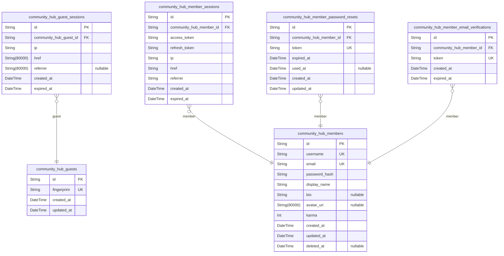
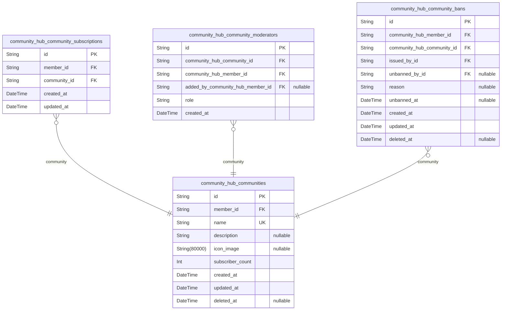
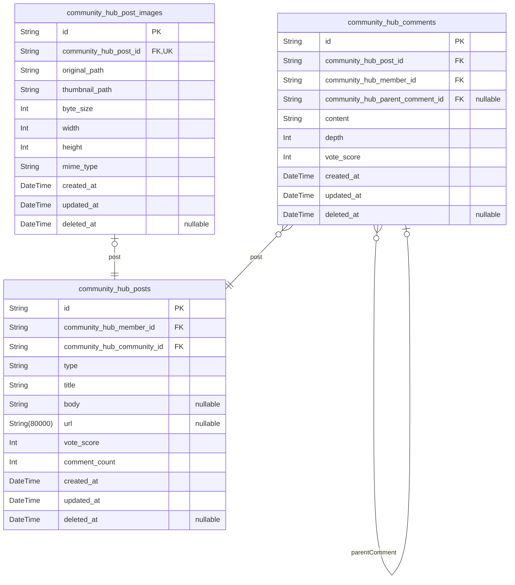
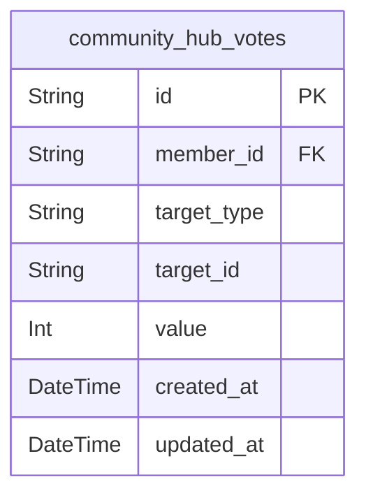
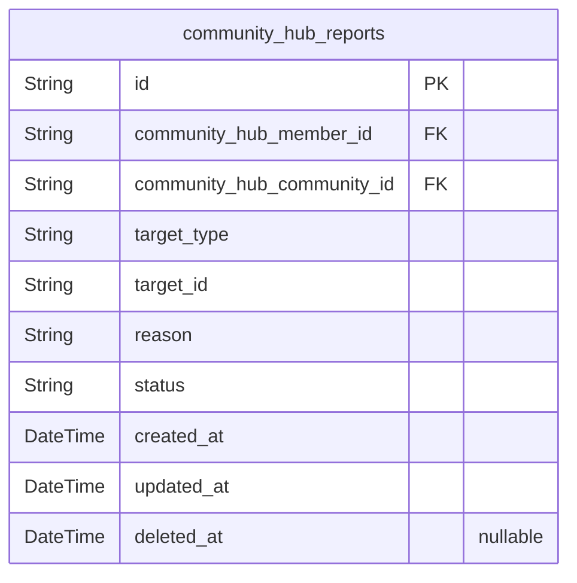

# Prisma Markdown

> Generated by [`prisma-markdown`](https://github.com/samchon/prisma-markdown)

- [authorization](#authorization)
- [community](#community)
- [content](#content)
- [engagement](#engagement)
- [report](#report)

## authorization

### `community_hub_guests`

Temporary guest accounts representing anonymous visitors identified by
device fingerprint for unauthenticated browsing access.

Guests operate under a strict read-only access model as defined in the
[guest actor](#community_hub_guests) requirements. Each guest record
is created implicitly when an unauthenticated visitor first accesses the
platform and is identified by a device fingerprint hash. Guests have no
persistent identity, username, profile, or credentials — they exist
solely to anchor browsing sessions and serve as the lowest-privilege tier
in the platform's authorization hierarchy.

Guest sessions are managed through the {@link
community_hub_guest_sessions} table, which references the guest record
via foreign key. When a guest session expires and no active sessions
remain, the guest record itself may be pruned.

Properties as follows:

- `id`: Primary key uniquely identifying each guest record in the system.
- `fingerprint`
  > Device fingerprint hash used to identify returning guest visitors without
  > requiring authentication.
  >
  > The fingerprint is computed from browser and device characteristics to
  > provide a stable anonymous identifier. A unique constraint ensures each
  > device maps to at most one guest record, preventing duplicate guest
  > creation for the same device.
- `created_at`
  > Timestamp when the guest record was first created upon initial platform
  > access.
- `updated_at`
  > Timestamp when the guest record was last updated, reflecting the most
  > recent interaction with the platform.

### `community_hub_guest_sessions`

Temporary session tokens for guest browsing sessions with expiration.

Each session represents a single guest browsing period identified by the
guest's device fingerprint. Sessions are append-only records created when
a guest begins browsing and automatically expire after a configured
duration. The session stores the client IP address for security auditing,
the current page URL where the session originated, and the referring URL
for traffic source analysis.

Sessions belong to a [community_hub_guests](#community_hub_guests) record, allowing
multiple concurrent or sequential sessions per guest device. Expired
sessions are retained for audit purposes but no longer grant access.

Properties as follows:

- `id`: Primary Key.
- `community_hub_guest_id`
  > Reference to the guest account this session authenticates.
  >
  > Links to [community_hub_guests](#community_hub_guests) identified by device fingerprint. A
  > single guest may have multiple sessions over time or across devices.
- `ip`
  > IP address of the guest client at session creation time.
  >
  > Stored as a string to accommodate both IPv4 and IPv6 formats. Used for
  > security auditing and abuse prevention.
- `href`
  > Full URL of the page the guest was visiting when the session was created.
  >
  > Provides context for where the guest entered the platform and enables
  > redirect-back behavior after authentication prompts.
- `referrer`
  > Referring URL that led the guest to the current page.
  >
  > Captures traffic source information for analytics. Null when the guest
  > navigated directly without a referring page (e.g., typed URL or
  > bookmark).
- `created_at`
  > Timestamp when the guest session was created.
  >
  > Marks the beginning of the guest browsing period.
- `expired_at`
  > Timestamp when the session expires and becomes invalid.
  >
  > Not null by default for security — all sessions must have a finite
  > lifetime. After expiration, the guest must establish a new session to
  > continue browsing.

### `community_hub_members`

Registered member accounts with authentication credentials, public
profile, and karma reputation score.

Each member is identified by a unique username visible across the
platform and authenticates via email and password. The member actor
inherits all read-only capabilities of [community_hub_guests](#community_hub_guests) and
gains full authenticated access: creating and managing posts in
subscribed communities, writing comments and nested replies, voting on
content, subscribing to communities, creating communities, and performing
moderation actions where authorized.

Profile fields (`display_name`, `bio`, `avatar_uri`) form the
public-facing identity shown on the member's profile page alongside their
[community_hub_posts](#community_hub_posts), [community_hub_comments](#community_hub_comments), and total
karma. The `karma` score is a single integer modified by vote cascades
from the [community_hub_votes](#community_hub_votes) system — incremented by upvotes,
decremented by downvotes, and adjusted when votes are changed or removed.

Soft deletion via `deleted_at` supports account deletion while preserving
referential integrity for existing content. When an account is deleted,
all associated posts and comments are also removed per platform policy.

Properties as follows:

- `id`: Primary Key.
- `username`
  > Unique public identifier for the member, visible to all users across the
  > platform.
  >
  > Must be unique across all member accounts. Used for display alongside
  > posts, comments, and in community member listings. Registration is
  > rejected if the chosen username is already in use.
- `email`
  > Email address used for authentication and account recovery.
  >
  > Must be unique across all member accounts and follow valid email format.
  > Used as the login credential alongside `password_hash`. Registration and
  > login are rejected if the email is missing, invalid, or already
  > registered.
- `password_hash`
  > Hashed password credential for member authentication.
  >
  > Never exposed in API responses. Compared against user-supplied password
  > during login. Can be changed through the password change flow with {@link
  > community_hub_member_password_resets}.
- `display_name`
  > Public display name shown on the member's profile page.
  >
  > Distinct from `username` — this is the human-readable name displayed
  > prominently on the profile, while `username` serves as the unique system
  > identifier. Editable at any time by the member.
- `bio`
  > Short biographical text displayed on the member's profile page.
  >
  > Optional free-text field where members can describe themselves. May be
  > empty or null. Editable at any time by the member.
- `avatar_uri`
  > URI pointing to the member's avatar image displayed on their profile and
  > alongside their content.
  >
  > Optional image reference. May be null when no avatar has been set.
  > Editable at any time by the member.
- `karma`
  > Cumulative reputation score reflecting the net total of all votes
  > received on the member's posts and comments.
  >
  > Incremented by 1 when any [community_hub_posts](#community_hub_posts) or {@link
  > community_hub_comments} authored by this member receives an upvote.
  > Decremented by 1 when receiving a downvote. Adjusted accordingly when
  > votes are changed or removed. Karma can be negative. Displayed on the
  > member's public profile.
- `created_at`: Timestamp when the member account was created through registration.
- `updated_at`
  > Timestamp when the member account was last modified, including profile
  > edits, password changes, and karma adjustments.
- `deleted_at`
  > Timestamp when the member account was deleted.
  >
  > Null for active accounts. When set, indicates the account has been
  > soft-deleted. Deleted accounts are excluded from authentication and
  > platform interaction, but their content may be retained according to data
  > retention policies.

### `community_hub_member_sessions`

JWT access and refresh token storage for authenticated member sessions.

Each session represents a single authenticated login by a {@link
community_hub_members member}. The session stores the JWT access token
and refresh token used for authentication, along with request context
information (IP address, page URL, and referrer). Sessions have a fixed
expiration time after which the tokens become invalid.

A member may have multiple concurrent sessions across different devices
or browsers. The composite index on member and creation time supports
efficient session listing and cleanup operations.

Properties as follows:

- `id`: Primary Key.
- `community_hub_member_id`
  > Reference to the authenticated [member](#community_hub_members) who
  > owns this session.
  >
  > Each session belongs to exactly one member. A member may have many
  > concurrent sessions. This field is indexed together with created_at for
  > efficient per-member session queries and stale session cleanup.
- `access_token`
  > JWT access token issued at login for authenticating API requests.
  >
  > Short-lived token used by the client to prove authentication on each
  > request. Validated by the auth middleware against signature and
  > expiration.
- `refresh_token`
  > JWT refresh token for obtaining new access tokens without
  > re-authentication.
  >
  > Longer-lived than the access token. Allows the client to request a fresh
  > access token when the current one expires, extending the session without
  > requiring the member to log in again.
- `ip`
  > IP address of the client that initiated the session.
  >
  > Captured at login time for audit and security monitoring. Useful for
  > detecting suspicious session activity across different geographic
  > locations.
- `href`
  > Full URL of the page the member was on when the session was created.
  >
  > Provides context about where the login occurred, useful for redirect
  > flows after authentication and security auditing.
- `referrer`
  > Referrer URL indicating the page that led the member to the login page.
  >
  > Captures the HTTP Referer header value at session creation time for
  > traffic source analysis and security auditing.
- `created_at`
  > Timestamp when the session was created.
  >
  > Set at the moment of successful login authentication. Used together with
  > the member ID for listing sessions in chronological order and identifying
  > stale sessions for cleanup.
- `expired_at`
  > Timestamp when the session expires and tokens become invalid.
  >
  > Not nullable by default for security — every session must have a defined
  > expiration. After this time, both the access token and refresh token are
  > considered invalid. The auth middleware rejects requests with expired
  > sessions.

### `community_hub_member_password_resets`

Password reset tokens for secure password recovery flows.

Each token is cryptographically generated and linked to a specific {@link
community_hub_members} record. Tokens have an absolute expiration
timestamp and are marked as used once consumed, preventing replay
attacks. A single member may have multiple reset tokens over time — for
example, requesting a new reset before the previous one expires.

Properties as follows:

- `id`: Primary Key.
- `community_hub_member_id`
  > The [community_hub_members](#community_hub_members) who requested the password reset.
  >
  > Identifies which member account the reset token is authorized to recover.
  > Each member may have multiple reset tokens over time.
- `token`
  > Cryptographically secure one-time reset token.
  >
  > This token is sent to the member's registered email address and must be
  > presented to authorize a password change. Each token is globally unique
  > to prevent collision and guessing attacks.
- `expired_at`
  > Absolute expiration timestamp for the reset token.
  >
  > After this timestamp, the token is invalid and cannot be used to reset
  > the password. Expiration limits the window of vulnerability if a token is
  > intercepted.
- `used_at`
  > Timestamp when the token was consumed to successfully reset the password.
  >
  > Null indicates the token has not yet been used. Once set, the token is
  > considered consumed and cannot be reused, preventing replay attacks.
- `created_at`: Timestamp when this reset token was generated.
- `updated_at`: Timestamp when this reset token record was last modified.

### `community_hub_member_email_verifications`

Email verification tokens for confirming member email addresses during
registration.

When a guest registers a new account via [community_hub_members](#community_hub_members),
an email verification token is generated and stored in this table. The
token is sent to the member's email address and must be presented back to
confirm ownership of the email. Each token has a limited lifetime defined
by expired_at; once expired, the token is invalid and a new verification
must be requested.

A member may have multiple verification tokens over time if they request
re-verification or if previous tokens expire.

Properties as follows:

- `id`: Primary Key.
- `community_hub_member_id`
  > The [member](#community_hub_members) whose email address is being
  > verified.
  >
  > Each verification token belongs to exactly one member. A member may have
  > multiple verification tokens over time, representing re-verification
  > attempts or token renewals after expiration.
- `token`
  > Unique verification token sent to the member's email address.
  >
  > This cryptographically random string is included in the verification
  > email link. When the member clicks the link, the token is extracted and
  > matched against this table to confirm email ownership.
- `created_at`: Timestamp when the verification token was generated and sent.
- `expired_at`
  > Timestamp when the verification token expires and becomes invalid.
  >
  > After this time, the token can no longer be used for email verification
  > and a new token must be requested.

## community

### `community_hub_communities`

Core community entity representing user-created discussion spaces that
serve as organizational containers for posts.

Communities are the primary grouping mechanism on the platform. Each
community has a unique case-insensitive name for discovery via search and
browsing, an optional description explaining its purpose, and an optional
icon image for visual identification. Communities are created by
authenticated members who become permanent owners with full governance
authority.

Community ownership is immutable — the creating user holds supreme
authority over the community, including the ability to appoint and remove
moderators (see [community_hub_community_moderators](#community_hub_community_moderators)), manage
subscriptions (see [community_hub_community_subscriptions](#community_hub_community_subscriptions)), and
issue bans (see [community_hub_community_bans](#community_hub_community_bans)). The owner cannot
be removed from their position by any other user.

The subscriber_count field caches the total number of active
subscriptions to the community for display performance. This count
increments when a user subscribes and decrements when a user
unsubscribes, keeping the community's public subscriber total accurate.
The count is visible to all users, both authenticated and
unauthenticated.

Properties as follows:

- `id`: Primary key uniquely identifying each community.
- `member_id`
  > Reference to the [community_hub_members](#community_hub_members) who created and owns this
  > community.
  >
  > The owner holds the highest authority over the community and is
  > responsible for its management. Ownership is established at the moment of
  > community creation and remains with that user permanently. The owner has
  > full control over community governance, including the ability to appoint
  > and remove moderators.
- `name`
  > Unique case-insensitive name identifying the community across the
  > platform.
  >
  > Serves as the primary means of community discovery and identification.
  > Users search for communities by name, and the name appears in community
  > listings, post feeds, and community detail views. Uniqueness is enforced
  > at the database level with case-insensitive comparison handled at the
  > application layer.
- `description`
  > Optional text describing the community's purpose, topic, or rules.
  >
  > Displayed on the community's detail page to inform potential subscribers
  > about what the community is about. May contain markdown or plain text.
- `icon_image`
  > Optional URL to the community's icon image for visual identification.
  >
  > Displayed alongside the community name in listings, feeds, and the
  > community detail page. Stored as a URI reference to the uploaded image
  > file.
- `subscriber_count`
  > Cached count of active subscriptions to this community.
  >
  > Denormalized for feed display performance — avoids counting subscriptions
  > on every community listing query. Increments when a user subscribes via
  > [community_hub_community_subscriptions](#community_hub_community_subscriptions) and decrements when a user
  > unsubscribes. This count is publicly visible and serves as a measure of
  > the community's reach and popularity.
- `created_at`: Timestamp when the community was created.
- `updated_at`
  > Timestamp when the community was last updated, including description or
  > icon changes.
- `deleted_at`
  > Soft-delete timestamp. When set, the community is considered deleted and
  > excluded from search results and listings, though existing content
  > relationships are preserved.

### `community_hub_community_subscriptions`

Represents a user's membership in a community through subscription. When
a user subscribes to a community, a subscription record is created,
linking the user to the community and enabling post creation within that
community.

A subscription is the prerequisite for creating posts in a community per
[community_hub_communities](#community_hub_communities). Users must be subscribed before they
can contribute content. The subscription also determines which
communities appear in the user's home feed, which aggregates posts
exclusively from subscribed communities.

Subscriptions are managed through subscribe and unsubscribe operations.
Subscribing when already subscribed is treated as a no-op; unsubscribing
when not subscribed is also a no-op. When a user unsubscribes, the
subscription record is permanently removed, but all content the user
previously created in the community is preserved. Community ownership is
unaffected by unsubscription.

Each subscription links exactly one [community_hub_members](#community_hub_members) to
exactly one [community_hub_communities](#community_hub_communities). A user may hold
subscriptions to many communities with no limit, and a community may have
subscriptions from many users.

Properties as follows:

- `id`: Primary Key.
- `member_id`
  > Reference to the subscribing member.
  >
  > Identifies the [community_hub_members](#community_hub_members) who created this
  > subscription. A member's subscriptions determine their home feed content
  > and which communities they can post in.
- `community_id`
  > Reference to the community being subscribed to.
  >
  > Identifies the [community_hub_communities](#community_hub_communities) that the member is
  > joining. The community's subscriber count is derived from the number of
  > active subscription records referencing it.
- `created_at`
  > Timestamp when the subscription was created, marking when the member
  > joined the community.
- `updated_at`: Timestamp when the subscription record was last modified.

### `community_hub_community_moderators`

Community governance roles associating members with communities as either
owner or moderator, forming the two-tier authority hierarchy that powers
all moderation capabilities.

The owner role is automatically assigned to the community creator at
creation time and represents the highest authority — the owner cannot be
removed from the role by any other user, cannot be banned from their own
community, and holds exclusive rights to add and remove moderators. The
moderator role is appointed by the owner or by existing moderators and
grants content moderation privileges scoped to this community, including
the ability to delete posts, delete comments, manage bans, and manage
reports.

Each member may hold at most one role per community, enforced through a
unique constraint. When a member is removed from the role, the record is
deleted entirely and all moderation privileges are immediately revoked.
When a member deletes their account, all moderator records across all
communities are removed. Historical moderation actions performed by a
former moderator are preserved independently of the role record.

See [community_hub_communities](#community_hub_communities) for the community being governed
and [community_hub_members](#community_hub_members) for both the member holding the role
and the member who performed the appointment.

Properties as follows:

- `id`: Primary Key.
- `community_hub_community_id`
  > The community where this moderator role is held.
  >
  > Each role is scoped to exactly one community. A member holding a role in
  > one community does not gain any authority in other communities unless
  > separately assigned a role there. When the community is deleted, all
  > moderator records are removed.
  >
  > See [community_hub_communities](#community_hub_communities) for the governed community.
- `community_hub_member_id`
  > The member who holds this moderator or owner role.
  >
  > This identifies the user granted governance authority within the
  > community. A member may hold a role in multiple communities
  > simultaneously, each represented by a separate record.
  >
  > See [community_hub_members](#community_hub_members) for the role-holding member.
- `added_by_community_hub_member_id`
  > The member who performed the appointment, adding this user to the
  > moderator list.
  >
  > For owner records this field is null — the owner role is automatically
  > assigned by the system when the community is created, not through a user
  > action. For moderator records, this identifies the member (owner or
  > moderator) who added them.
  >
  > See [community_hub_members](#community_hub_members) for the appointing member.
- `role`
  > The governance role type within the two-tier hierarchy.
  >
  > Valid values are 'owner' (community creator, highest authority, cannot be
  > removed or banned by anyone, has exclusive right to remove moderators)
  > and 'moderator' (appointed role with content moderation privileges
  > including post deletion, comment deletion, ban management, and report
  > management, can add other moderators but cannot remove the owner or other
  > moderators).
  >
  > The role is immutable after creation — to change a member's role, the
  > existing record is removed and a new one is created if needed.
- `created_at`
  > The moment when this moderator role was assigned.
  >
  > For owners, this matches the community creation time. For moderators,
  > this is when the appointment was made.

### `community_hub_community_bans`

Records user bans issued by community moderators or the owner,
restricting the banned user from creating posts or comments while
preserving view access to community content.

The ban links a [member](#community_hub_members) (the banned user), a
[community](#community_hub_communities), and the moderator or owner
who issued the ban. Each ban takes immediate effect: the banned user
cannot create new posts or write comments in the community, but may still
browse and view all content. Existing posts and comments by the banned
user are preserved and remain visible.

An optional reason documents the rationale for the ban and is visible to
other moderators when reviewing the banned users list. Unban is tracked
within the same record via unbanned_at and unbanned_by_id, providing a
complete audit trail of ban-unban cycles. A user may be banned, unbanned,
and banned again from the same community, with each cycle producing a
distinct record.

Ban scope is strictly limited to the community where it was issued. A ban
in one community has no effect on the user's standing or permissions in
any other community.

Properties as follows:

- `id`: Primary Key.
- `community_hub_member_id`
  > Reference to the [member](#community_hub_members) who is banned from
  > the community.
  >
  > Identifies the user subject to the ban's restrictions. While the ban is
  > active (unbanned_at is null), this user cannot create posts or write
  > comments in the target community.
- `community_hub_community_id`
  > Reference to the [community](#community_hub_communities) from which
  > the member is banned.
  >
  > The ban's restrictions apply only within this community. The banned user
  > retains full access to all other communities on the platform.
- `issued_by_id`
  > Reference to the [member](#community_hub_members) (moderator or
  > owner) who issued the ban.
  >
  > Identifies the moderator or community owner who performed the ban action.
  > The issuing member must hold a moderator role or ownership in the target
  > community at the time the ban is issued.
- `unbanned_by_id`
  > Reference to the [member](#community_hub_members) (moderator or
  > owner) who lifted the ban.
  >
  > Set when a moderator or owner unbans the user. Null while the ban is
  > active. Together with unbanned_at, this provides a complete audit trail
  > of who reversed the ban and when.
- `reason`
  > Optional explanation for why the ban was issued.
  >
  > When provided by the moderator, this documents the rationale behind the
  > ban and is visible to other moderators of the community when reviewing
  > the banned users list. May be null if no reason was given.
- `unbanned_at`
  > Timestamp when the ban was lifted.
  >
  > Null while the ban is active. When set, indicates the ban has been
  > resolved and the user's posting and commenting privileges in the
  > community are restored. Used together with unbanned_by_id to track the
  > unban action.
- `created_at`
  > Timestamp when the ban was issued.
  >
  > Records the date and time the moderator performed the ban action.
  > Displayed in the banned users list visible to community moderators and
  > the owner.
- `updated_at`
  > Timestamp of the most recent modification to this ban record.
  >
  > Updated when the ban is lifted (unbanned_at and unbanned_by_id are set).
- `deleted_at`
  > Soft-delete timestamp for the ban record.
  >
  > Typically null. May be set when the associated community is deleted or
  > the ban record is removed for administrative reasons, preserving
  > historical data while excluding it from active queries.

## content

### `community_hub_posts`

User-created posts published within communities, serving as the central
unit of content on the platform.

Each post belongs to exactly one [community_hub_communities](#community_hub_communities) and is
authored by exactly one [Member](#community_hub_members). Both
relationships are immutable — established at creation and never changed.
Posts support three mutually exclusive content types determined by the
type field: text posts use the body field for written content, link posts
use the url field for external references, and image posts associate with
a [community_hub_post_images](#community_hub_post_images) record for uploaded images. The type
is set at creation and cannot be modified afterward.

The title is the only required content field and serves as the post's
primary label across all views. The denormalized vote_score and
comment_count fields enable efficient feed display without expensive
aggregate queries on every page load. Soft deletion is supported via the
deleted_at timestamp, preserving data integrity while hiding removed
content from public views.

Properties as follows:

- `id`: Primary Key.
- `community_hub_member_id`
  > The [Member](#community_hub_members) who authored and published this
  > post.
  >
  > The author relationship is immutable — it is established when the post is
  > created and cannot be transferred or changed. The author retains ongoing
  > control over their post, including the ability to edit or delete it. The
  > author's username appears publicly alongside the post in all feeds and on
  > the post detail page.
- `community_hub_community_id`
  > The [community_hub_communities](#community_hub_communities) where this post resides.
  >
  > The community relationship is immutable — established at creation and
  > never changed. The community determines where the post appears: in the
  > community's own feed, in the home feeds of subscribed members, and in the
  > popular feed when the post gains traction. The community name is
  > displayed alongside the post in all feed views.
- `type`
  > The content type of this post, determining which type-specific field
  > holds the primary content.
  >
  > Must be exactly one of three values: "text" for written body content,
  > "link" for an external URL reference, or "image" for an uploaded image.
  > The type is set at creation time and cannot be changed afterward. A post
  > cannot be more than one type at once.
- `title`
  > The required title of the post, serving as the primary label that
  > summarizes its content.
  >
  > The title is the minimal identifying element without which a post cannot
  > exist. It is visible in all feed views, on the post detail page, and in
  > search results.
- `body`
  > The written body content for text-type posts.
  >
  > Contains free-form text that conveys the author's message, story,
  > question, or discussion prompt. Only meaningful when type is "text"; null
  > for link and image posts. In post list views, the first portion of the
  > body text is shown as a preview.
- `url`
  > The external URL for link-type posts.
  >
  > Points to content elsewhere on the web and serves as the post's primary
  > payload. Only meaningful when type is "link"; null for text and image
  > posts. In post list views, the domain name extracted from the URL is
  > displayed so readers know where the link leads before clicking.
- `vote_score`
  > The denormalized net vote score reflecting aggregate community sentiment
  > on this post.
  >
  > Each upvote adds one and each downvote subtracts one. The score can be
  > positive, zero, or negative. This field is kept in sync with {@link
  > community_hub_votes} and directly affects the post's visibility in sorted
  > feeds — particularly in hot, top, and controversial rankings.
- `comment_count`
  > The denormalized running tally of how many [community_hub_comments](#community_hub_comments)
  > have been written on this post, including all nested replies at any
  > depth.
  >
  > Provides an immediate sense of how much discussion the post has generated
  > when displayed in feeds and on the post detail page.
- `created_at`
  > Timestamp when the post was originally published.
  >
  > Serves as the basis for showing relative timestamps (e.g., "3 hours ago")
  > in all post displays and is the primary sort key for the "new" feed
  > ordering.
- `updated_at`: Timestamp of the most recent edit to this post.
- `deleted_at`
  > Soft deletion timestamp.
  >
  > When set, the post is considered deleted and hidden from public views,
  > but the record is preserved for data integrity and moderation audit
  > purposes. Null means the post is active and visible.

### `community_hub_post_images`

Image file metadata for image-type posts.

Stores the storage paths, dimensions, file size, and MIME type for images
attached to [community_hub_posts](#community_hub_posts) of the image type. Each image
post has exactly one image record, enforced by a unique foreign key
constraint on the post reference.

This table is separated from posts to isolate file storage concerns —
enabling independent image lifecycle management, storage capacity
planning, and cleanup operations without coupling to the post's content
fields.

Properties as follows:

- `id`: Primary Key.
- `community_hub_post_id`
  > Reference to the parent post this image belongs to.
  >
  > Establishes a 1:1 relationship with [community_hub_posts](#community_hub_posts) — only
  > image-type posts have an associated image record, and each such post has
  > exactly one.
- `original_path`
  > File system path or storage key to the originally uploaded image file.
  >
  > Used to retrieve the full-resolution image for detail views and downloads.
- `thumbnail_path`
  > File system path or storage key to the generated thumbnail version of the
  > image.
  >
  > Used for feed list displays and previews where full-resolution images are
  > unnecessary, reducing bandwidth and improving load times.
- `byte_size`
  > Size of the original uploaded image file in bytes.
  >
  > Used for storage capacity tracking, quota enforcement, and bandwidth
  > estimation.
- `width`
  > Pixel width of the original uploaded image.
  >
  > Used by clients for responsive rendering and layout calculations without
  > needing to load the full image first.
- `height`
  > Pixel height of the original uploaded image.
  >
  > Used alongside width for aspect ratio calculations and responsive
  > rendering.
- `mime_type`
  > MIME type of the uploaded image file, e.g. "image/jpeg", "image/png",
  > "image/webp".
  >
  > Determines how the image is served to clients and which codecs the
  > browser should use for decoding.
- `created_at`
  > Timestamp when the image record was created.
  >
  > Set automatically when the image is first uploaded and the metadata
  > record is persisted.
- `updated_at`
  > Timestamp when the image record was last updated.
  >
  > Reflects the most recent modification to any metadata field, such as
  > thumbnail regeneration or image replacement.
- `deleted_at`
  > Timestamp when the image was soft-deleted.
  >
  > Set when the parent post is deleted or the image is replaced. Null for
  > active images. Enables recovery workflows and deferred cleanup of stored
  > files.

### `community_hub_comments`

Comments and nested replies on posts forming an unlimited-depth
conversation tree.

Each comment belongs to exactly one [post](#community_hub_posts) and
is authored by a single [member](#community_hub_members). Top-level
comments initiate a discussion thread on a post, while replies continue
an existing thread through a self-referential parent relationship with no
depth limit.

The cached `depth` field tracks nesting level for efficient tree
rendering: zero for top-level comments, incrementing by one at each reply
level. The denormalized `vote_score` reflects the community's evaluation
through upvotes and downvotes managed by [community_hub_votes](#community_hub_votes). The
score can be negative when downvotes exceed upvotes, and updates as votes
are cast, changed, or removed.

Soft deletion via `deleted_at` preserves conversation structure: when a
parent comment is soft-deleted, child replies persist as orphaned threads
under the post by having their `community_hub_parent_comment_id` set to
null. When a post is hard-deleted, all associated comments are
permanently removed by cascade. When a member account is permanently
deleted, all comments authored by that member are removed by cascade.

Properties as follows:

- `id`: Primary Key.
- `community_hub_post_id`
  > The post this comment belongs to.
  >
  > Every comment is published within a single {@link community_hub_posts
  > post} and cannot be moved to another post. When the post is permanently
  > deleted, all its comments are removed by cascade delete.
- `community_hub_member_id`
  > The member who authored this comment.
  >
  > References the [member](#community_hub_members) who wrote the
  > comment. When a member account is permanently deleted, all comments
  > authored by that member are removed by cascade delete.
- `community_hub_parent_comment_id`
  > The parent comment this comment replies to, forming the conversation tree.
  >
  > Null for top-level comments that start a new thread directly on the post.
  > Non-null for replies that continue an existing thread, referencing
  > another [comment](#community_hub_comments) as the parent. When the
  > parent comment is soft-deleted, this reference is set to null so the
  > reply persists as an orphaned thread under the post.
- `content`
  > The body text of the comment conveying the author's thoughts.
  >
  > This is the core substance of the comment — the full written response
  > from the author, whether directed at the post or another comment.
  > Required for every comment; a comment cannot exist without content.
- `depth`
  > Cached nesting depth of this comment within the conversation tree.
  >
  > Zero for top-level comments that start a new thread on the post. Each
  > level of reply increments the depth by one. Stored as a denormalized
  > cache for efficient tree rendering and depth-limited queries without
  > recursive traversal.
- `vote_score`
  > Denormalized vote score reflecting the community's evaluation of this
  > comment.
  >
  > Calculated as total upvotes minus total downvotes, managed by the {@link
  > community_hub_votes engagement system}. Can be negative when downvotes
  > exceed upvotes. Updated when votes are cast, changed, or removed on this
  > comment. Also affects the author's karma score in {@link
  > community_hub_members}.
- `created_at`
  > Timestamp when the comment was posted.
  >
  > Set automatically on creation and immutable thereafter. Used for
  > chronological sorting (New) and displaying comment recency in
  > conversation threads.
- `updated_at`
  > Timestamp of the most recent modification to this comment.
  >
  > Updated automatically whenever the comment's content is edited by its
  > author.
- `deleted_at`
  > Soft-delete timestamp indicating when the comment was removed by its
  > author or a moderator.
  >
  > When set, the comment is considered deleted and its content should be
  > hidden from display, though the record persists to maintain conversation
  > tree structure for orphaned replies. Null while the comment is active.

## engagement

### `community_hub_votes`

Records member votes on posts and comments with upvote or downvote
direction.

Each vote represents a single member's evaluation of a specific piece of
content — either a [post](#community_hub_posts) or a {@link
community_hub_comments comment}. The polymorphic target is identified by
target_type and target_id, allowing the voting system to span multiple
content types while maintaining a single consistent vote model.

Vote direction is captured as an integer value: 1 for upvote and -1 for
downvote. A unique constraint on (member_id, target_type, target_id)
enforces the one-vote-per-user-per-target invariant. Members can change
their vote direction at any time, which updates the value and the
updated_at timestamp without altering the original created_at timestamp
(see Vote Creation Timestamp).

Members can remove their vote entirely by deleting the record. Vote value
changes cascade to affect the content author's karma score in {@link
community_hub_members} and the target's denormalized vote score.

Properties as follows:

- `id`: Primary Key.
- `member_id`
  > The [member](#community_hub_members) who cast this vote.
  >
  > Identifies the authenticated user who evaluated the target content. Each
  > member can have at most one vote per target, enforced by the unique
  > constraint on (member_id, target_type, target_id). When a vote is removed
  > or changed, the member's karma is adjusted accordingly.
- `target_type`
  > Discriminator identifying the type of content being voted on.
  >
  > Allowed values are "post" for [posts](#community_hub_posts) and
  > "comment" for [comments](#community_hub_comments). Combined with
  > target_id, this forms the polymorphic reference to the voted content.
  > Part of the unique constraint ensuring one vote per user per target.
- `target_id`
  > Identifier of the specific content item being voted on.
  >
  > References either a [post](#community_hub_posts) or a {@link
  > community_hub_comments comment} depending on the target_type value.
  > Together with target_type and member_id, this field participates in the
  > unique constraint that prevents duplicate votes on the same target by the
  > same member.
- `value`
  > The numeric direction of the vote.
  >
  > 1 represents an upvote (adds 1 to the target's vote score and the
  > author's karma). -1 represents a downvote (subtracts 1 from the target's
  > vote score and the author's karma). Can be changed at any time by the
  > voting member, which updates the updated_at timestamp while preserving
  > the original created_at voting moment.
- `created_at`
  > Timestamp of the original vote creation.
  >
  > Records the moment the member first cast their vote on this target. This
  > value never changes, even when the vote direction is later altered from
  > upvote to downvote or vice versa, enabling temporal analysis of voting
  > activity across the platform.
- `updated_at`
  > Timestamp of the most recent vote direction change.
  >
  > Updated whenever the member modifies their vote from upvote to downvote
  > or vice versa. Initially set to the same value as created_at when the
  > vote is first created.

## report

### `community_hub_reports`

User-submitted content reports flagging posts or comments for moderator
review.

Reports are the primary community governance tool that enables members to
bring problematic content to the attention of moderators. Each report is
filed by a member against either a post or a comment within a specific
community, with a required free-text reason explaining why the content
should be reviewed.

Reports follow a three-status workflow tracked through the status field:
pending (awaiting moderator review), approved (content deleted, report
resolved), and dismissed (content kept, report removed from active list).
Only moderators of the community where the flagged content resides can
change a report's status.

The target is polymorphic, referencing either a {@link
community_hub_posts} or a [community_hub_comments](#community_hub_comments) through the
target_type discriminator and target_id reference. The reporter is a
[community_hub_members](#community_hub_members) account, and the report is scoped to a
[community_hub_communities](#community_hub_communities) so that only moderators of that
community can review and act on it.

Properties as follows:

- `id`: Primary Key.
- `community_hub_member_id`
  > The member who filed this report. References {@link
  > community_hub_members}. Establishes accountability so the reporting
  > mechanism cannot be abused anonymously.
- `community_hub_community_id`
  > The community where the flagged content resides. Scopes the report so
  > that only moderators of this community can review and resolve it.
  > References [community_hub_communities](#community_hub_communities).
  >
  > Stored directly on the report rather than derived through the target
  > content to preserve the community reference after content deletion. When
  > a report is approved and the flagged content is removed, this field
  > ensures the report remains scoped for audit.
- `target_type`
  > Discriminator identifying the type of content being reported. Allowed
  > values are "post" for [community_hub_posts](#community_hub_posts) or "comment" for {@link
  > community_hub_comments}.
- `target_id`
  > The unique identifier of the reported content. References either a {@link
  > community_hub_posts} or a [community_hub_comments](#community_hub_comments) record based on
  > the target_type discriminator.
- `reason`
  > The free-text reason provided by the reporting member explaining why the
  > content should be reviewed. Required — a report cannot be submitted
  > without this reason.
- `status`
  > The current stage of the report in the moderation workflow. Three values:
  > "pending" (awaiting moderator review, the default state when created),
  > "approved" (moderator confirmed the report, content deleted, report
  > resolved), and "dismissed" (moderator determined no action warranted,
  > content kept, report removed from active list). Only moderators of the
  > target community can change this status.
- `created_at`
  > Timestamp when the report was filed. Used by moderators to prioritize
  > older reports and to display relative timestamps in report lists.
- `updated_at`
  > Timestamp of the last status change or modification to the report.
  > Updated whenever a moderator approves or dismisses the report.
- `deleted_at`
  > Soft-delete timestamp for administrative removal. Reports are typically
  > resolved through the status lifecycle rather than deleted, but this field
  > supports edge cases where a report must be purged entirely.
