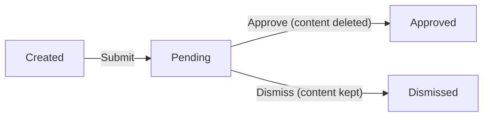
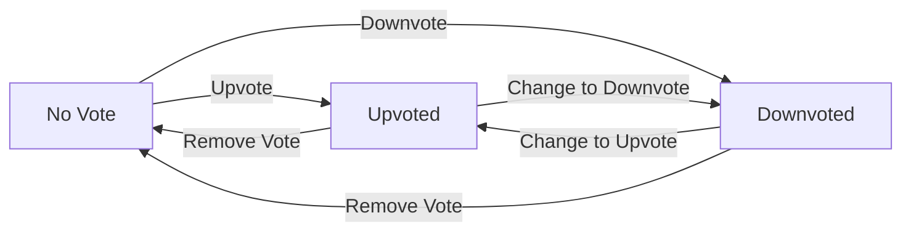
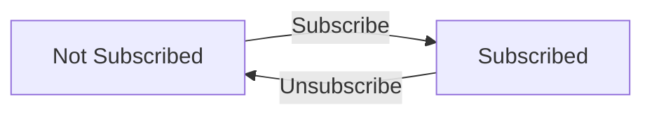
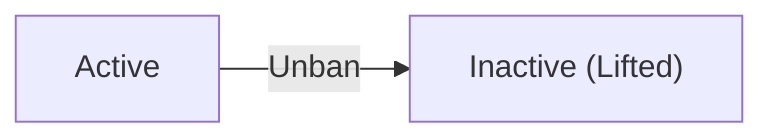
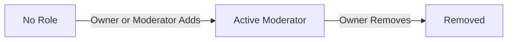

**communityHub — Business concepts, relationships, and states from user perspective**

Business concepts, relationships, and states from user perspective

# Domain Concepts

Describe what each concept means in the business domain and its key attributes.

## User Concept

A User represents a registered person on the community platform. Each user has a unique username that identifies them publicly across the platform. Behind the scenes, users authenticate using an email address and a password. Beyond the core account credentials, every user has a profile consisting of a display name that can differ from the username, a bio text for self-description, and an avatar image serving as their visual identity. A user also carries a karma score, which is a single number reflecting the community's collective reception of their posts and comments. Karma can be positive, negative, or zero depending on how other users have voted on their contributions. The user is the central actor who creates communities, writes posts, leaves comments, casts votes, and participates in moderation.

### Registered User Identity

A User represents a person who has registered an account on the platform. Registration creates a persistent identity that links all of the user's contributions — posts, comments, votes, communities they own, and communities they subscribe to. The user account is the foundation for participation: only registered users can create content, vote, subscribe to communities, and take on moderation roles.

**Username**

Every user selects a unique username during registration. The username serves as the user's public identifier across the entire platform. No two users can share the same username. The username appears alongside every post and comment the user makes, and on their public profile page.

**Email**

The email address is used for authentication. It is unique across the platform — no two accounts can be registered with the same email.

**Password**

The password is a secret credential tied to the user's email. It is set during registration and must be provided alongside the email to authenticate the user. The password can be changed by the account holder at any time.

**Account Lifecycle**

A user account begins when a person completes registration. The account persists until the user chooses to delete it. When a user deletes their account, all of their posts and comments are also removed from the platform.

### User Profile

Each user has a profile that presents information about them to other users on the platform. The profile is viewable by other users.

A user's profile page displays:
- Their display name, bio, and avatar
- Their total karma score
- A list of all posts they have created
- A list of all comments they have written

**Display Name**

The display name is the name shown on the user's public profile, and it can differ from the username. While the username is a fixed identifier used across the platform, the display name lets users express how they want to be known in a more personal way. Users can edit their own display name at any time.

**Bio**

The bio is a free-text section on the user's profile where they can describe themselves, share interests, or provide any information they choose. It is optional — a user may leave it empty. Users can edit their own bio at any time.

**Avatar**

The avatar is an image that represents the user visually. It appears on the user's profile page and alongside their posts and comments. Users can upload or change their avatar at any time.

### Karma Score

Every user has a single karma score — one number that reflects how other members of the community have received their contributions. Karma is a running total that changes as other users vote on the user's posts and comments.

When another user upvotes the user's post or comment, the user's karma increases by 1. When another user downvotes the user's post or comment, the user's karma decreases by 1. If a voter removes their vote entirely, the karma adjusts accordingly — the previous effect is reversed.

Karma can be positive, negative, or zero. A positive karma score indicates that the user's contributions have received more upvotes than downvotes overall. A negative score means downvotes outweigh upvotes. The karma total is computed across all of the user's posts and comments on the platform and is displayed on the user's public profile page.

## Community Concept

A Community is a user-created group centered around a specific topic or interest. Each community has a unique name that serves as its primary identifier on the platform, ensuring no two communities share the same name. A description text explains the community's purpose and what kind of content belongs there. An icon image provides a recognizable visual symbol for the community. Every community has an owner, who is the user that originally created it and holds the highest authority over its management. The community also tracks a subscriber count, which is the total number of users who have joined the community. Communities serve as the organizational containers for posts, grouping related content together and forming the backbone of the platform's content structure.

### Community Definition and Identity

A community is a user-created topic group that serves as a gathering place around a shared interest or subject. Communities are the central organizing structure of the platform — they define the spaces where conversations happen and content is shared.

Each community has a unique name that acts as its primary identity on the platform. No two communities can share the same name, ensuring that each community is distinctly recognizable and discoverable. The name is chosen at the time of community creation and serves as the permanent identifier for that community throughout its lifetime.

A community's identity is also conveyed through its description and icon, which together tell users what the community is about and make it visually distinct in listings and search results.

### Community Attributes

Every community has a description text that explains its purpose, topic, and the kind of content members should contribute. The description helps users decide whether to join and guides what discussions are appropriate within the community.

A community also has an icon image that serves as its visual symbol. The icon appears alongside the community name in browsing lists, search results, and on the community's own page, giving each community a recognizable visual identity.

Communities track a subscriber count — a number that reflects how many users are currently subscribed to the community (see Subscription Concept). The subscriber count is visible to all users and provides a quick indicator of the community's size and popularity. The count increases when a user subscribes and decreases when a user unsubscribes.

### Community Ownership

Every community has an owner — the user who originally created it. The owner holds the highest authority over the community and is responsible for its management. Ownership is established at the moment of community creation and remains with that user permanently, even if other governance roles are assigned (see Moderator Concept).

The owner has full control over community governance, including the ability to appoint and remove moderators. The owner cannot be removed from their position by any other user, making their role the ultimate source of authority within the community.

### Community as Content Container

A community acts as the organizational container for all posts created within it. Every post belongs to exactly one community, and the community's feed displays only posts that were created under it (see Post Concept).

This containment relationship means that a community defines the scope of its content — when users browse a community, they see only the posts that belong to it. The community also serves as the boundary for moderation actions: posts and comments within a community are subject to that community's moderators and rules (see Moderator Concept, Ban Concept, Report Concept).

## Post Concept

A Post is a piece of content created by a user and published within a specific community. Every post must have a title, which is a required field that summarizes the post. A post must be exactly one of three types: a text post with body content written by the author, a link post containing an external URL, or an image post with an uploaded image file. Each post is tied to a single author who wrote it and a single community where it lives. Posts carry a vote score derived from the net total of upvotes and downvotes cast by other users, as well as a comment count tracking how many comments have been written on the post. The post also records when it was created, which determines its age and influences feed ordering.

### Post Definition and Identity

A post is the central unit of user-generated content on the platform. It represents a single piece of shared material created by a user and published within a specific community. Every post must have a title, which is required and serves as the primary label that summarizes what the post is about. Without a title, the post cannot exist — the title is the minimal identifying element that distinguishes one post from another. The title is visible in all feed views, on the post detail page, and in search results.

### Post Content Types

Every post belongs to exactly one of three mutually exclusive content types. The type determines what form the post's primary content takes and how it is displayed.

**Text Post**: A text post contains written body content composed by the author. The body is free-form text that conveys the author's message, story, question, or discussion prompt. In post list views, the first portion of the body text is shown as a preview.

**Link Post**: A link post contains an external URL that points to content elsewhere on the web. The URL is the post's primary payload. In post list views, the domain name extracted from the URL is displayed so readers know where the link leads before clicking.

**Image Post**: An image post contains an uploaded image file provided by the author. The image is the post's primary content. In post list views, a reduced-size thumbnail of the image is shown as a preview.

The type is set at creation time and cannot be changed afterward. A post cannot be more than one type at once.

### Post Ownership and Belonging

Every post is associated with exactly one author and exactly one community. These two relationships are fundamental and immutable — they are established when the post is created and cannot be transferred or changed.

The **author** is the user who wrote and published the post. The author's identity is publicly visible: their username appears alongside the post in all feeds, on the post detail page, and in search results. The author retains ongoing control over their post, including the ability to edit or delete it.

The **community** is the topic-based group where the post resides. A post lives within exactly one community, and that community determines where the post appears: in the community's own feed, in the home feeds of users subscribed to that community, and in the popular feed when the post gains traction. The community name is displayed alongside the post in all feed views.

### Post Measurable Attributes

Beyond its title and content, every post carries several measurable attributes that reflect how the community has engaged with it and when it came into existence.

**Vote Score**: The vote score is a single number representing the net total of all votes cast on the post. Each upvote adds one to the score, and each downvote subtracts one. The score can be positive, zero, or negative. This score directly affects the post's visibility in sorted feeds — particularly in hot, top, and controversial rankings.

**Comment Count**: The comment count is a running tally of how many comments have been written on the post, including all nested replies at any depth. When someone views a post in a list or on its detail page, the comment count gives an immediate sense of how much discussion the post has generated.

**Creation Time**: The creation time records when the post was originally published. It serves as the basis for showing relative timestamps (such as "3 hours ago") in all post displays, and it is the primary sort key for the "new" feed ordering.

## Comment Concept

A Comment is a written response by a user on a post or as a reply to another comment. Every comment has content text that conveys the user's thoughts, and it is always authored by a single user. Comments carry a vote score reflecting how other users have evaluated them through upvotes and downvotes. Each comment also records when it was created, allowing readers to understand its recency. A defining characteristic of comments is their tree structure: comments can be replies to other comments, and those replies can themselves receive replies, creating nested conversation threads with no depth limit. The depth of a comment indicates how many levels deep it sits within the reply chain, starting from the top-level comment directly on the post.

### Comment Definition and Purpose

A Comment is a user's written response within the platform, either directed at a post or at another comment. A comment on a post starts a new conversation thread at the top level of that post's discussion. A comment replying to another comment continues an existing conversation thread, allowing users to engage in back-and-forth dialogue within a single post's discussion space.

### Comment Attributes

Every comment carries the following attributes:

- **Content**: The body text of the comment, conveying the user's thoughts. This is the core substance of the comment.
- **Author**: The single user who wrote the comment. Each comment is always tied to exactly one author (see User concept).
- **Vote Score**: A numeric value reflecting how the community has evaluated the comment through upvotes and downvotes (see Vote concept). The score represents total upvotes minus total downvotes and can be negative.
- **Creation Time**: The moment when the comment was posted, allowing readers to understand its recency in the conversation.

### Nested Reply Structure

Comments are organized in a tree structure beneath each post, forming conversation threads.

A **top-level comment** is a direct response to a post — it has no parent comment and sits at depth zero, starting a new thread of discussion.

A **reply comment** responds to an existing comment — its parent. A reply sits one depth level deeper than its parent. Replies can themselves receive further replies, and this nesting can continue with **no limit on depth**. The platform does not restrict how deep a conversation thread can grow.

The **depth level** of a comment indicates its position in the reply chain relative to the original post. A top-level comment is at depth zero. A reply to a top-level comment is at depth one. A reply to that reply is at depth two, and so on.

All comments within a post — top-level and nested replies at all depths — together form the complete **conversation thread** for that post. When viewing a post, users see comments organized by their reply relationships, with nested replies visually indented under their parent comments.

## Vote Concept

A Vote represents a single user's directional evaluation of either a post or a comment. Each vote has a value indicating whether it is an upvote or a downvote. The vote is always linked to one specific user who cast it and one specific target, which can be either a post or a comment. There is a strict rule that each user may have at most one vote per target. When a vote is cast or changed, it affects two scores in the system: the vote score of the target content and the karma score of the content's author. The vote also records when it was created, which can be relevant for tracking voting patterns. A vote can be removed entirely, which reverses its effects on both the target score and the author's karma.

### Vote Definition and Value Direction

A Vote is a domain concept that represents a single user's directional evaluation of content. Each vote expresses one of two possible sentiments: positive approval (an upvote) or negative disapproval (a downvote). The vote's value is strictly directional — an upvote contributes a positive one (+1) toward the evaluated content's aggregate score, while a downvote contributes a negative one (-1). The vote value is always exactly one of these two directions; there is no neutral or zero-value vote.

### Vote–Target Binding

Every Vote is bound to exactly one target. The target must be either a post or a comment — a vote cannot target both simultaneously and cannot target any other type of entity in the system. In addition to the target, each vote is bound to exactly one user: the user who cast it. This dual binding — one user plus one target — jointly establishes the vote's identity within the domain. A user may cast votes on many different targets over time, each vote being an independent binding of that user to a particular post or comment.

### One Vote Per User Per Target

The domain enforces a strict invariant: a given user may have at most one vote on any given target. If a user who has already voted on a post or comment attempts to cast another vote on that same target, no second vote is created. Instead, the existing vote's value changes to reflect the new direction, preserving the one-vote-per-target rule. This invariant applies independently to each target — a user may vote on many distinct posts and many distinct comments, but never more than once on the same post or the same comment.

### Vote Score and Karma Impact

The vote score of any target — whether a post or a comment — is derived from the aggregate of all votes cast on it. Each upvote adds one to the score; each downvote subtracts one from the score. The resulting score reflects the net sentiment across all users who voted on that content and can be zero or negative if downvotes exceed upvotes.

Separately from the target's score, every vote has a corresponding effect on the karma of the content's author. When an upvote is cast, the author's karma increases by one. When a downvote is cast, the author's karma decreases by one. These two derived values — target vote score and author karma — are both calculated from the same underlying vote data and remain consistent with each other at all times.

### Vote Removal and Reversal

A Vote can be removed entirely by the user who originally cast it. When a vote is removed, the vote ceases to exist and its prior effects are fully reversed: the target's vote score adjusts by the opposite of the removed vote's value, and the content author's karma adjusts in the same opposite direction. Specifically, if the removed vote was an upvote, the target score decreases by one and the author's karma decreases by one; if the removed vote was a downvote, the target score increases by one and the author's karma increases by one. After removal, the user returns to a state of having no vote on that target and may subsequently cast a new vote on the same target if desired.

### Vote Creation Timestamp

Every Vote records the date and time when it was first cast — the moment the user initially committed their evaluation to the target. This creation timestamp reflects the original voting moment and does not change if the vote's value is later altered from upvote to downvote or vice versa. The timestamp enables temporal understanding of voting activity across the platform, such as identifying when a user began engaging with particular content.

## Subscription Concept

A Subscription represents a user's declared membership in a community. It establishes the relationship between a user and a community, signaling that the user wants to be part of that community's audience. A subscription records when the user joined the community. It also carries a notification preference indicating whether the user wishes to receive notifications about activity in that community. Being subscribed to a community is a prerequisite for creating posts within it; users who are not subscribed cannot contribute posts, though they can still browse and read content. Each subscription contributes to the community's subscriber count, which is publicly visible and serves as a measure of the community's popularity and reach.

### Subscription Definition and Purpose

A subscription represents a user's declared membership in a community. It is the mechanism by which a user signals their interest in being part of a community's audience. When a user subscribes to a community, they become a member of that community's audience — they can contribute posts and their subscription is counted toward the community's public subscriber total.

A subscription is a relationship between exactly one user and exactly one community. A user may hold subscriptions to many communities, and a community may have subscriptions from many users. The subscription itself carries no indication of the subscriber's standing or reputation within the community; it simply records the fact of membership.

### Subscription Attributes

Each subscription records the moment the user joined the community — the subscription date. This date tracks when the membership began and remains unchanged for the lifetime of the subscription.

A subscription also carries a notification preference. The subscriber may choose whether they want to receive notifications about activity in the subscribed community. This preference can be adjusted at any time after subscribing. If no explicit choice is made, notifications are enabled by default upon subscribing.

### Subscription and Posting

Being subscribed to a community is a prerequisite for creating posts within it. A user who is not subscribed to a community cannot create a post there. Unsubscribed users may still browse communities and view posts and read content within any community.

### Subscriber Count

Each active subscription contributes exactly one to the community's subscriber count. The subscriber count is a publicly visible number displayed on the community's page. It represents the total number of users currently subscribed to that community.

When a new user subscribes, the count increases by one. When a user unsubscribes, the count decreases by one. The subscriber count serves as a measure of the community's reach and popularity on the platform, visible to all users — both logged-in and logged-out.

## Report Concept

A Report is a formal flag raised by a user against a post or comment that they believe violates community standards or platform rules. Every report includes a required reason in the form of text that explains why the content is being reported. The report identifies who filed it, providing accountability in the reporting process, and references the specific post or comment that is being flagged. A report has a status that tracks where it stands in the moderation workflow. The report also records when it was created. Reports are visible to moderators of the community where the flagged content resides, serving as a tool for community governance and content quality enforcement.

### Report Definition and Purpose

A report is a formal flag that a user raises against a post or comment they believe violates community standards. Reports are the primary mechanism through which community members bring problematic content to the attention of moderators. Each report is tied to the community where the flagged content resides — only moderators of that community can review and act on the report.

Reports serve as a community governance tool. They enable collective oversight of content quality by allowing any member to flag material they consider inappropriate. Through reporting, communities can self-regulate without requiring every moderator to manually scan every piece of content. A report does not automatically remove content; it simply notifies moderators, who then decide whether action is warranted.

### Report Attributes

Every report carries a required reason provided by the reporting user. The reason is free-text explaining why the user believes the content should be reviewed. A report cannot be submitted without this reason.

The report records the identity of the reporter — the user who filed it. The reporter is always a registered member of the platform (never a guest). This establishes accountability so that the reporting mechanism cannot be abused anonymously.

Each report targets exactly one piece of content: either a post or a comment, never both. The report references the specific content being flagged, allowing moderators to locate it immediately.

The report also records its creation time — the moment when it was filed. This helps moderators prioritize older reports and understand how long a report has been awaiting review.

### Report Status Lifecycle

A report has a status that indicates where it stands in the moderation workflow. Three statuses exist:

- **Pending**: The default state when a report is first created. The report appears in the community's active report list, awaiting moderator review.
- **Approved**: The moderator confirms the report is valid. The flagged content is deleted, and the report is considered resolved. It is no longer shown in the active report list.
- **Dismissed**: The moderator determines the report does not warrant action. The flagged content is kept intact. The report is removed from the active report list and is considered resolved.

Only moderators of the community where the flagged content resides can change a report's status. The reporting user cannot modify or retract a submitted report. Once a report is approved or dismissed, it is resolved and no longer requires moderator attention.

Detailed state transition rules — including who can trigger each transition and under what conditions — are described in the State Transitions section (Module 3).

## Ban Concept

A Ban is a restriction placed by a community moderator on a specific user, preventing that user from actively participating in the community. The ban records a reason explaining why the user was banned, providing transparency in moderation decisions. It captures when the ban was imposed, marking the start of the restriction period. A ban may also record when it was lifted, indicating that the user's participation rights have been restored. While banned, the user cannot create new posts or write comments in that community, though they retain the ability to browse and view all content. Bans are specific to one community; a user banned from one community may still participate freely in others.

### Ban Definition

A Ban is a restriction placed by a community moderator on a specific user, preventing that user from actively participating in the given community. The ban links together three business concepts: the restricted user, the community they are restricted from, and the moderator who imposed the restriction. A ban is a moderation enforcement mechanism — it is the recorded outcome of a moderator's decision to limit a user's participation rights within a single community. The ban remains in effect until explicitly lifted.

### Ban Attributes

A ban carries the following business attributes:

- **Reason**: A text explanation describing why the user was banned. The reason provides accountability and transparency, documenting the justification behind the moderation action.
- **Start Time**: The date and time when the ban was imposed. This marks when the user's participation restrictions begin.
- **Lift Time**: The date and time when the ban was lifted, if applicable. A ban may be permanent — in which case no lift time is recorded — or temporary, where a lift time is set when a moderator unbans the user. While the lift time is absent, the ban is considered active.

### Effects of Being Banned

While a user is actively banned from a community, the following restrictions apply:

- The banned user cannot create new posts in that community.
- The banned user cannot write comments or replies on any post in that community.
- The banned user retains the ability to browse and view all content within the community, including posts, comments, and community information.

The ban does not retroactively affect the user's existing posts or comments — those remain visible unless separately removed through moderation.

### Ban Scope

A ban is always community-specific. It applies only to the community where it was issued and does not extend to any other community on the platform. A user banned from one community remains free to participate in all other communities. The ban does not affect the user's overall account standing, their karma score, or their ability to use platform features outside the banned community.

## Moderator Concept

A Moderator is a user who has been granted authority to manage and govern a specific community. The role distinguishes between the owner and regular moderators. The owner is the user who created the community and holds the highest level of authority; this role cannot be transferred or stripped by other moderators. Regular moderators are appointed by the owner or by other moderators and have the power to manage content and users within the community, though they cannot remove the owner or remove other moderators. Each moderator assignment records the role type and when the user was appointed, establishing a clear governance timeline for the community.

### Governance Hierarchy

Every community has a two-tier governance structure consisting of exactly one owner and zero or more regular moderators. The owner sits at the top of this hierarchy with full authority over the community. Regular moderators are appointed beneath the owner and share management responsibilities, but their authority is subordinate to the owner's.

A user may hold a moderator role in many communities simultaneously. The same user can be the owner of one community and a regular moderator in another — each role is scoped to a single community and does not confer authority across communities.

The governance hierarchy for a given community is independent of any other community. No user holds platform-wide moderator authority; all governance is community-scoped.

### Owner Role

The owner is the user who created the community. This role is permanent and cannot be transferred to another user. The owner holds the highest level of authority within the community.

The owner cannot be removed from the community by any other user, including other moderators. The owner cannot be banned from their own community. The owner retains full access and authority for the lifetime of the community.

If the owner voluntarily deletes their account, the community and all its content are also deleted (see 05-non-functional for retention policies).

### Regular Moderator Role

A regular moderator is a user appointed to help govern a community. Regular moderators have the authority to manage content within their community, including deleting posts and comments, banning users, and handling reports.

Regular moderators have the following limitations relative to the owner:
- A regular moderator cannot remove the owner from their role.
- A regular moderator cannot remove another regular moderator. Only the owner can remove regular moderators.
- A regular moderator cannot ban the owner from the community.

Regular moderators can, however, appoint additional regular moderators — meaning the moderator team can grow organically without requiring the owner's direct involvement in every appointment.

### Moderator Appointment

When a user is made a moderator of a community, the appointment records two pieces of information: the role type (owner or regular moderator) and the date and time when the appointment occurred. This establishes a clear governance timeline for the community, showing when each moderator was granted authority.

The owner role is automatically assigned at community creation — the creating user becomes owner immediately and their appointment time matches the community's creation time.

Regular moderators are appointed by either the owner or another regular moderator. Each appointment records the identity of the user who performed the appointment, creating an auditable chain of governance decisions.

# Domain Relationships

Describe how concepts relate to each other from a business perspective.

## Conceptual Relationships

Describe how concepts relate to each other in business terms.

### Ownership Relationships

Users own the communities they create. When a user creates a community, they become its owner with the highest level of authority within that community.

Users own the posts they author. The author of a post has exclusive control over editing and deleting that post.

Users own the comments they write. The author of a comment has exclusive control over editing and deleting that comment.

The community owner, acting as a moderator, can delete any post or comment within their community regardless of individual authorship.

When a user deletes their account, all communities they own and all content within those communities are removed.

### Content Hierarchy (Belongs-To and Has-Many)

Each post belongs to exactly one community. A community has many posts. Posts cannot exist independently of a community.

Each comment belongs to exactly one post. A post has many comments. Comments cannot exist independently of a post.

A comment may belong to a parent comment, forming a reply. A comment may have many child replies, with no depth limit on nesting. A top-level comment has no parent.

A user has many posts across communities they are subscribed to. A user's profile displays all posts they have authored.

A user has many comments across posts they can access. A user's profile displays all comments they have written.

When a post is deleted, all comments belonging to that post are also deleted. When a comment is deleted, all child replies belonging to that comment are also deleted.

### Membership and Governance Associations

A subscription is an association between a user and a community. It represents the user's membership and is required for creating posts in that community. A user may subscribe to many communities, and a community may have many subscribers.

A moderator role is an association between a user and a community, representing a governance position. The community owner holds the owner role by default. Additional moderator roles can be added and removed by the owner. A moderator role grants the ability to moderate content and manage users within that community. A user may hold moderator roles in multiple communities.

A ban is an association between a user and a community, representing a restriction issued by a moderator. A banned user cannot create posts or comments in that community but can still view content. A user may be banned from multiple communities simultaneously. A ban may be lifted by a moderator.

### Interaction Relationships

A vote is an association between a user and a target, which may be either a post or a comment. Each vote has a direction: an upvote (adds one to score) or a downvote (subtracts one from score). A user may cast at most one vote per target. A user's vote on a target can be changed or removed entirely.

A report is an association between a reporting user and reported content, which may be either a post or a comment. Each report exists within the community that contains the reported content. Reports include a reason provided by the reporting user and have a status that reflects whether the report has been acted upon by a moderator.

Vote scores on posts and comments are derived from the aggregate of all votes on that target. A user's karma score is derived from the net effect of all votes on the user's posts and comments.

## Lifecycle and Retention

Describe concept lifecycle states and transitions only. Detailed retention/recovery policies belong in 05-non-functional. Operation details belong in 03-functional-requirements.

### User Account Lifecycle

A user account exists in one of two states: **active** or **deleted**.

When a user completes the sign-up process, the account is created and immediately becomes active. An active account allows the user to perform all operations permitted by their actor role.

When a user chooses to delete their account, the account transitions to the deleted state. Account deletion triggers a cascading effect: all posts authored by that user and all comments authored by that user are also deleted. The account's profile (display name, bio, avatar) is no longer accessible.

Once deleted, the account cannot be recovered by the user. The username previously held by the deleted account may or may not become available for reuse — this is governed by the retention policy (see Retention and Deletion Policies).

### Content Lifecycle (Posts and Comments)

Posts and comments share a similar lifecycle. Each exists in one of two states: **active** or **deleted**.

A post or comment is created in the active state and is immediately visible to users with appropriate access. While active, the author may edit its content. Editing does not change the state.

A post or comment can transition to the deleted state through three paths:

- **Author deletion**: The author chooses to delete their own post or comment.
- **Moderator deletion**: A moderator of the post's community deletes the post or comment as a moderation action.
- **Cascading account deletion**: When a user deletes their account, all of that user's posts and comments transition to the deleted state.
- **Report approval**: When a moderator approves a report against a post or comment, the reported content transitions to the deleted state.

A deleted post is no longer visible in feeds or when accessed directly. A deleted comment is no longer visible under its parent post. If a comment had nested replies from other users, the behavior of those replies when the parent comment is deleted is determined by the deletion policy (see Retention and Deletion Policies).

### Community Lifecycle

A community is created by any user and immediately becomes **active**. There is no draft, pending, or archived state for communities in the current system.

While active, the community is listed in the community directory, appears in search results, and accepts posts from subscribed members. Its subscriber count is visible to all users.

The original requirements do not define a deletion or deactivation path for communities. A community, once created, persists indefinitely unless a deletion mechanism is introduced in a future version.

### Vote Lifecycle

A vote represents a user's single evaluation of a post or comment. A vote can exist in one of three states relative to its target: **upvoted**, **downvoted**, or **no vote** (the absence of a vote).

When a user upvotes a target for the first time, an upvote is cast. The target's vote score increases by one and the author's karma adjusts accordingly. When a user downvotes, a downvote is cast with the opposite effect.

A user may change their vote at any time:

- Changing from upvote to downvote removes the upvote effect and applies the downvote effect, resulting in a net change of −2 to the vote score and a corresponding karma adjustment for the author.
- Changing from downvote to upvote reverses this with a net change of +2.
- Removing a vote entirely transitions the user to the "no vote" state, reversing the original vote's effect on both the vote score and the author's karma.

A vote is always tied to a specific user and a specific target. A user may only hold one vote state per target at any given time.

### Subscription Lifecycle

A subscription represents a user's membership in a community. It exists in one of two states: **subscribed** or **unsubscribed** (no active subscription).

When a user subscribes to a community, a new subscription is created. The subscription records the time of subscription. While subscribed, the user may create posts in that community and the community's posts appear in the user's home feed.

When a user unsubscribes, the subscription is removed and the user loses the ability to create posts in that community. Posts from the community no longer appear in the user's home feed. The user may re-subscribe at any time, creating a new subscription with a new subscription time.

Unsubscribing does not delete any posts or comments the user previously created in that community.

### Report Lifecycle

A report represents a user's flagging of content for moderator review. A report progresses through states: **pending**, **approved**, or **dismissed**.

When a user submits a report with a reason against a post or comment, the report is created in the pending state. Pending reports are visible to moderators of the community the reported content belongs to.

A moderator may take one of two actions on a pending report:

- **Approve**: The report transitions to the approved state. The reported content (post or comment) is deleted. The report's purpose is fulfilled.
- **Dismiss**: The report transitions to the dismissed state. The reported content remains unchanged. Dismissed reports are removed from the report list and are no longer visible to moderators.

Once a report reaches the approved or dismissed state, it does not transition further.

### Ban Lifecycle

A ban restricts a user from participating in a specific community. A ban exists in one of two states: **active** or **lifted**.

When a moderator bans a user from a community, the ban is created in the active state with a recorded reason and start time. While the ban is active, the banned user cannot create posts or comments in that community. The banned user can still view all content in the community.

When a moderator unbans a user, the ban transitions to the lifted state. The unban time is recorded. The user regains the ability to create posts and comments in the community.

A ban applies only to the specific community where it was issued. A user banned from one community may still participate in other communities normally.

### Moderator Role Lifecycle

A moderator role grants a user governance authority within a specific community. It exists in one of two states: **active** or **removed**.

When a community is created, the creator automatically receives the owner role — the highest moderator authority. The owner may add other users as moderators, creating active moderator roles with a recorded appointment time.

Moderators may also add other moderators. However, the following removal rules apply:

- Only the owner can remove a moderator.
- Moderators cannot remove the owner.
- Moderators cannot remove other moderators.

When a moderator is removed, their moderator role transitions to the removed state. The user remains a member of the community and may still participate as a regular user (creating posts and comments if not banned).

### Deletion Policy Overview

The platform defines several deletion paths, each with distinct scope:

**Author-initiated deletion**: When a user deletes their own post or comment, only that specific item is deleted. Other users' replies to that item are not necessarily deleted — their handling depends on whether they are standalone content or dependent on the deleted parent.

**Moderator-initiated deletion**: A moderator deleting a post or comment in their community performs the same removal as an author deletion, but on behalf of community governance.

**Report-approved deletion**: When a moderator approves a report, the reported content is deleted. This is functionally equivalent to a moderator deletion, triggered through the reporting workflow.

**Account deletion cascade**: When a user deletes their account, all posts and comments authored by that user across all communities are deleted. This is the broadest deletion path, as it spans the entire platform rather than a single community or content item.

**Content removal from feeds**: Deleted posts no longer appear in any feed (home, popular, or community). Deleted comments no longer appear in comment threads. Vote scores and karma adjustments from votes on deleted content may or may not be reversed — see Retention and Deletion Policies.

### Retention, Archival, and Recovery

The original requirements specify that content is deleted when users or moderators take deletion actions. No archival mechanism is described: deleted content is removed from user-facing views.

**Retention**: Content remains available as long as neither the author nor a moderator deletes it and the author's account remains active. No automatic expiration or time-based cleanup is specified in the original requirements.

**Archival**: No archival state or mechanism is defined. Communities, posts, and comments do not transition to an archived state based on age or inactivity. All active content remains equally accessible.

**Recovery**: The original requirements do not describe any recovery mechanism for deleted content. Once content is deleted through any path (author deletion, moderator deletion, report approval, or account cascade), it is not recoverable by the user.

Detailed policies governing data retention periods, backup and recovery procedures, and permanent removal from storage are addressed in the Non-Functional Requirements (05-non-functional).

# Business Categories and State Flows

Business category classifications and state flow definitions.

## Business Category Definitions

Define all business category classifications with their allowed values and descriptions.

### Post Type Classification

Every post belongs to exactly one of three types, chosen at creation:

- **Text Post**: Contains written text content. The full text is displayed when viewing the post. In post lists, the first 200 characters of the content are shown as a preview.
- **Link Post**: Contains a URL pointing to an external resource. In post lists, the domain name of the URL (for example, "youtube.com") is displayed rather than the full URL.
- **Image Post**: Contains an uploaded image. In post lists, a thumbnail of the image is shown. When viewing the full post, the image is displayed at its full size.

The post type determines what content is required and how the post appears in feeds and detail views.

### Vote Value Classification

A vote represents a user's evaluation of a post or comment. Each vote has exactly one of two values:

- **Upvote**: Expresses approval of the content. An upvote increases the target's vote score by 1 and increases the content author's karma by 1.
- **Downvote**: Expresses disapproval of the content. A downvote decreases the target's vote score by 1 and decreases the content author's karma by 1.

A vote's value can be changed from upvote to downvote or vice versa. A vote can be removed entirely, which reverses the effect on both the vote score and the author's karma.

### Report Status Classification

A report moves through the following statuses during its lifecycle:

- **Pending**: The report has been submitted by a user but no moderator has acted on it yet. Pending reports appear in the community's report list for moderators to review.
- **Approved**: A moderator has reviewed the report, agreed with it, and the reported content has been deleted as a result. The report is removed from the active report list upon approval.
- **Dismissed**: A moderator has reviewed the report and decided not to take action. The reported content remains unchanged. The report is removed from the active report list upon dismissal.

Once approved or dismissed, a report cannot be re-opened or changed to a different status.

### Moderator Role Classification

A moderator role within a community has one of two levels of authority:

- **Owner**: The user who created the community automatically becomes its owner. The owner holds the highest authority — they can add and remove moderators, and cannot be removed from their role by anyone. There is exactly one owner per community. The owner can perform all moderator actions: delete posts, delete comments, ban users, unban users, and manage reports.
- **Moderator**: A user appointed by the owner or by another moderator to help manage the community. Moderators can delete any post or comment in the community, ban and unban users, and manage reports. Moderators can add other moderators but cannot remove the owner or remove other moderators — only the owner can remove moderators.

### Feed Type Classification

The platform provides three distinct feed types for browsing posts:

- **Home Feed**: Shows posts only from communities the user is currently subscribed to. Available only to logged-in users (members).
- **Popular Feed**: Shows posts from all communities across the entire platform, regardless of subscription. Available to everyone, including guests who are not logged in.
- **Community Feed**: Shows posts from a single specific community only. Available to everyone, including guests.

All three feed types support the same set of sort options and share the same paginated post list display format.

### Sort Option Classification

All post feeds support four sorting approaches:

- **Hot**: Recent posts that have received many upvotes appear first. This balances recency with community engagement.
- **New**: Most recently created posts appear first, regardless of vote count or engagement.
- **Top**: Posts with the highest vote score appear first. This sort supports a time filter to narrow results: today, this week, this month, this year, or all time.
- **Controversial**: Posts that have received many total votes (both upvotes and downvotes) but whose score is close to zero appear first. This surfaces content that divides opinion.

Comments on a single post can be sorted using a related but distinct set of options:

- **Best**: Comments with the highest vote score appear first.
- **New**: Most recently created comments appear first.
- **Controversial**: Comments with many total votes but a score close to zero appear first.

Post sorting and comment sorting operate independently — the sort option chosen for a feed does not affect how comments within a post are sorted, and vice versa.

## State Transitions

Define valid state transition paths for stateful concepts.

### Report State Transitions

A report tracks the lifecycle of a user flagging content for moderator review. When a user submits a report, it enters the **pending** state and appears in the community's report list. Moderators resolve pending reports through one of two actions:

- **Approve**: A moderator approves the report, which deletes the reported content and moves the report to the **approved** state.
- **Dismiss**: A moderator dismisses the report, which keeps the reported content intact and moves the report to the **dismissed** state.

Once a report reaches the approved or dismissed state, it is removed from the active report list and cannot transition further.

### Vote State Transitions

A vote represents a user's evaluation of a post or comment. A vote moves through the following states:

- **No vote**: The default state — the user has not voted on the content.
- **Upvote**: The user has cast a positive vote, adding 1 to the content's score and increasing the author's karma by 1.
- **Downvote**: The user has cast a negative vote, subtracting 1 from the content's score and decreasing the author's karma by 1.

A user can transition between states at any time:
- From no vote, the user can upvote or downvote.
- From an upvote, the user can change to a downvote (vice versa).
- From either upvote or downvote, the user can remove the vote entirely, returning to no vote.

When a vote changes or is removed, the author's karma adjusts accordingly.

### Subscription State Transitions

A subscription is the relationship between a user and a community. It has two states:

- **Not subscribed**: The user has no subscription to the community. The user can browse the community's content but cannot create posts in it.
- **Subscribed**: The user is a member of the community. The user gains the ability to create posts in that community and the community appears in their home feed.

Users can freely transition between these states by subscribing or unsubscribing at any time. The community's subscriber count increases when a user subscribes and decreases when a user unsubscribes.

### Ban State Transitions

A ban restricts a user from participating in a specific community. It transitions through two states:

- **Active**: The ban is in effect. The banned user cannot create posts or comments in the community but can still view all content.
- **Inactive (lifted)**: The ban has been lifted by a moderator. The user regains full participation rights in the community.

When a moderator bans a user, the ban enters the active state and the user is added to the community's banned user list. When a moderator unbans a user, the ban transitions to inactive and the user is removed from the banned user list.

### Moderator Role State Transitions

A moderator role grants governance authority to a user within a specific community. The role has two states:

- **Active**: The user holds moderator privileges, including the ability to delete posts and comments, ban and unban users, and manage reports within that community.
- **Removed**: The user no longer holds moderator privileges in the community.

Moderator roles follow these transition rules:
- The community owner can add any user as a moderator, moving them to the active state.
- The community owner can remove any moderator, moving them to the removed state.
- Moderators can add other users as moderators, moving them to the active state.
- Moderators cannot remove the owner.
- Moderators cannot remove each other — only the owner can remove a moderator.

