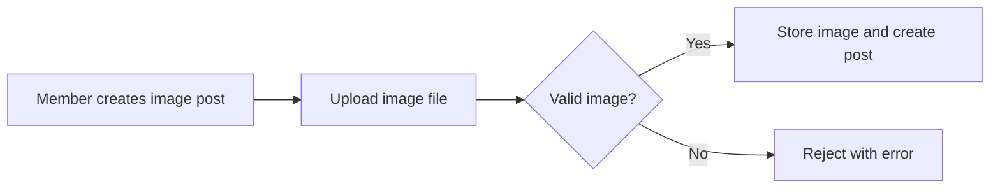

**communityHub — What operations users can perform, use cases, business workflows**

What operations users can perform, use cases, business workflows

# Core Business Operations

What the system must do for each business concept.

## User Operations

A visitor can sign up by providing an email address, a password, and a unique username. The system rejects signup attempts if the email or username is already taken. Once registered, users log in using their email and password combination. Authenticated users can change their password at any time by supplying their current password and a new one. Users can also permanently delete their own account; when this happens, every post and comment the user ever authored is also removed from the platform. Each user has a public profile page displaying their display name, bio text, and avatar image. Users can edit their own display name, bio, and avatar whenever they wish. Any user — logged in or not — can visit another user's profile to see that user's display name, bio, avatar, total karma score, a list of all their posts, and a list of all their comments. Karma is a single number that reflects the net upvotes and downvotes a user has received across all their contributions.

### User Registration

Visitors can register for an account by providing an email address, a password, and a unique username. The email and password are used for subsequent login, while the username serves as the user's public identity on the platform.

THE system SHALL allow a visitor to create an account by supplying an email address, a password, and a username.

THE system SHALL require the username to be unique across the entire platform.

IF the provided email address is already associated with an existing account, THEN THE system SHALL reject the registration attempt and inform the visitor that the email is already in use.

IF the provided username is already taken by another account, THEN THE system SHALL reject the registration attempt and inform the visitor that the username is unavailable.

IF a required field — email, password, or username — is missing or empty, THEN THE system SHALL reject the registration attempt.

### User Login

Registered users authenticate by providing the email address and password they used during signup. A successful login establishes an authenticated session, granting the user access to member-only features.

THE system SHALL authenticate a user when the user supplies a matching email address and password combination.

IF the email does not correspond to any registered account, THEN THE system SHALL reject the login attempt.

IF the password does not match the one associated with the provided email, THEN THE system SHALL reject the login attempt.

### Password Change

Authenticated users can change their password at any time. To do so, the user must confirm their identity by providing their current password before setting a new one.

WHEN an authenticated user supplies their current password and a new password, THE system SHALL update the account to use the new password for all future logins.

IF the current password supplied does not match the account's existing password, THEN THE system SHALL reject the password change request.

IF the user is not authenticated, THEN THE system SHALL deny the password change request.

### Account Deletion

Authenticated users can permanently delete their own account. Because all contributions belong to the user, deleting the account also removes everything the user has created on the platform.

WHEN an authenticated user confirms account deletion, THE system SHALL permanently remove the user account.

WHEN an account is deleted, THE system SHALL also delete all posts authored by that user.

WHEN an account is deleted, THE system SHALL also delete all comments authored by that user.

IF the user is not authenticated, THEN THE system SHALL deny the account deletion request.

### View User Profile

Every user has a public profile page accessible to all visitors — both logged-in members and guests. The profile presents the user's identity, self-described information, and a summary of their platform activity.

THE system SHALL display a user's profile page showing their display name, bio text, and avatar image.

THE system SHALL display the user's total karma score on their profile page.

THE system SHALL display a list of all posts created by the user on their profile page.

THE system SHALL display a list of all comments written by the user on their profile page.

THE system SHALL make every user's profile page visible to all visitors, regardless of whether the visitor is authenticated or not.

WHEN a user views their own profile, THE system SHALL present the same information — display name, bio, avatar, karma score, posts list, and comments list — as it does for any other profile.

### Edit Profile

Authenticated users can update the personal information displayed on their public profile: their display name, bio text, and avatar image.

THE system SHALL allow an authenticated user to update their display name.

THE system SHALL allow an authenticated user to update their bio text.

THE system SHALL allow an authenticated user to upload or replace their avatar image.

IF the user is not authenticated, THEN THE system SHALL deny any profile edit request.

IF a user attempts to edit another user's profile, THEN THE system SHALL deny the request.

### Karma System

Karma is a single aggregated score that reflects the net reception of a user's contributions across the entire platform. It is not manually set or adjusted by any user; it changes automatically as other users vote on the user's posts and comments.

THE system SHALL maintain exactly one karma score per user.

WHEN another user upvotes a post or comment authored by the user, THE system SHALL increase the author's karma score by one.

WHEN another user downvotes a post or comment authored by the user, THE system SHALL decrease the author's karma score by one.

WHEN a voter removes their upvote from a post or comment, THE system SHALL decrease the author's karma score by one.

WHEN a voter removes their downvote from a post or comment, THE system SHALL increase the author's karma score by one.

WHEN a voter changes their vote from upvote to downvote, THE system SHALL decrease the author's karma score by two (removing the original upvote effect and applying the downvote effect).

WHEN a voter changes their vote from downvote to upvote, THE system SHALL increase the author's karma score by two (removing the original downvote effect and applying the upvote effect).

THE system SHALL allow a user's karma score to be negative.

## Community Operations

Any authenticated user can create a new community by providing a unique name, a description, and an icon image. The name must not already be in use by another community. The user who creates the community automatically becomes its owner with full authority over it. Visitors and logged-in users alike can browse a list of all communities on the platform. Users can search for communities by name to quickly find specific ones. Each community displays its current subscriber count so viewers can gauge its popularity. When viewing a community, users see the community name, description, icon, and how many people subscribe to it. There is no built-in operation to rename a community or transfer ownership through normal user actions — the owner role is tied to the creator. Communities serve as containers for posts, and only subscribers may create posts within them.

### Community Creation

THE system SHALL allow any authenticated user to create a new community by providing a unique name, a description, and an icon image.

The community name is required. The description and icon image are optional.

WHEN a user submits a community creation request, THE system SHALL check that the community name is not already in use by another community.

IF the community name is already in use, THEN THE system SHALL reject the creation request and inform the user that the name is taken.

IF the community name is not provided, THEN THE system SHALL reject the creation request.

WHEN a community is successfully created, THE system SHALL automatically assign the creating user as the owner of that community. The owner role is permanently tied to the creator and cannot be transferred to another user through any normal user action.

### Community Browsing and Discovery

THE system SHALL provide a browsable list of all communities on the platform.

Both guests and authenticated users SHALL be able to browse the full community list without restriction. No login is required to view the list of communities.

THE system SHALL allow users to search for communities by name. WHEN a user enters a search query, THE system SHALL return communities whose names match the query.

IF the search query matches no communities, THEN THE system SHALL return an empty result set.

Each community entry in the list SHALL display the community name, icon, and current subscriber count.

### Community Details View

THE system SHALL provide a detailed view for each individual community.

WHEN a user views a specific community, THE system SHALL display:
- The community name
- The community description
- The community icon image
- The current subscriber count

The community detail page SHALL be accessible to all visitors, including guests who are not logged in. No authentication is required to view community details.

### Community as Post Container

Each community SHALL serve as a container for posts, organizing content by topic or interest area.

Only users who are subscribed to a community SHALL be permitted to create posts within that community. Unsubscribed users and guests cannot create posts in the community.

Browsing and viewing posts within a community does not require a subscription. All visitors, including guests and unsubscribed users, may view posts within a community.

The posts contained in a community SHALL be viewable through the community feed, which displays posts from that specific community.

### Subscriber Count

THE system SHALL maintain and display a subscriber count for each community that reflects the total number of active subscriptions to that community.

WHEN a user subscribes to a community, THE system SHALL increase the subscriber count by one.

WHEN a user unsubscribes from a community, THE system SHALL decrease the subscriber count by one.

IF a subscriber deletes their account, THEN THE system SHALL decrease the subscriber count for each community they were subscribed to.

The subscriber count SHALL be visible on the community list, community detail page, and in search results without requiring authentication.

## Post Operations

A user can create a post only in a community they are subscribed to. Every post must have a title, which is required. The post type determines what additional content is needed: a text post requires text content, a link post requires a URL, and an image post requires an uploaded image. The author of a post can edit it later, changing the title, content, or image as needed. Authors can also delete their own posts, which removes the post and all its associated comments from the platform. When viewing a single post, users see the title, full content, author username, community name, vote score, comment count, and when it was posted. There are three feed views for browsing posts: the home feed shows posts only from communities the logged-in user subscribes to, the popular feed shows posts from all communities across the platform and is accessible to everyone, and the community feed shows posts from one specific community, also available to everyone. All three feeds support four sorting options: hot surfaces recent posts with many upvotes first, new shows the most recently created posts first, top ranks by highest vote score with time filters for today, this week, this month, this year, and all time, and controversial surfaces posts that have many votes but a score close to zero. All feeds are paginated so users can load more posts as they scroll. In a post list, each entry displays the title, author username, community name, vote score, comment count, and relative time since posting, along with a content preview: the first 200 characters for text posts, a thumbnail for image posts, and the domain name for link posts.

### Post Creation

THE communityHub SHALL allow a member to create a post in any community they are subscribed to.

THE communityHub SHALL require a title for every post.

THE communityHub SHALL support three post types: text, link, and image. The post type determines what additional content is required.

WHERE the post type is text, THE communityHub SHALL require text content as the body of the post.

WHERE the post type is link, THE communityHub SHALL require a URL. The URL must be a valid web address.

WHERE the post type is image, THE communityHub SHALL require an uploaded image file.

THE communityHub SHALL automatically associate the newly created post with the creating user as its author and with the target community.

IF the title is missing, THEN THE communityHub SHALL reject the creation request.

IF the member is not subscribed to the target community, THEN THE communityHub SHALL reject the creation request.

IF the post type is text and no text content is provided, THEN THE communityHub SHALL reject the creation request.

IF the post type is link and no URL is provided, THEN THE communityHub SHALL reject the creation request.

IF the post type is image and no image is uploaded, THEN THE communityHub SHALL reject the creation request.

### Post Editing

THE communityHub SHALL allow the author of a post to edit the post's title.

THE communityHub SHALL allow the author of a post to edit the post's content. For a text post, this means the text body. For a link post, this means the URL. For an image post, this means replacing the uploaded image.

IF a user who is not the author attempts to edit a post, THEN THE communityHub SHALL reject the request.

### Post Deletion

THE communityHub SHALL allow the author of a post to delete their own post.

WHEN a post is deleted, THE communityHub SHALL also remove all comments associated with that post.

IF a user who is not the author attempts to delete a post, THEN THE communityHub SHALL reject the request.

Note: Moderators can also delete posts in their community, as defined in the Moderator Operations requirements.

### Post Detail View

THE communityHub SHALL display the following information when a user views a single post:

- The post title
- The full content (text body for text posts, the URL for link posts, the full image for image posts)
- The author's username
- The community name
- The current vote score
- The total comment count
- The date and time when the post was created

THE communityHub SHALL make the post detail view available to all users, including guests.

### Home Feed

THE communityHub SHALL provide a home feed that displays posts only from communities the currently logged-in user is subscribed to.

THE communityHub SHALL make the home feed available only to logged-in members.

IF a guest attempts to access the home feed, THEN THE communityHub SHALL deny access.

### Popular Feed

THE communityHub SHALL provide a popular feed that displays posts from all communities across the platform.

THE communityHub SHALL make the popular feed available to all users, including guests.

### Community Feed

THE communityHub SHALL provide a community feed that displays posts from one specific community.

THE communityHub SHALL make the community feed available to all users, including guests.

### Post Feed Sorting

THE communityHub SHALL support the following sorting options for all post feeds (home, popular, and community):

**Hot** — THE communityHub SHALL sort posts by a combination of recency and vote activity, so that recent posts with many upvotes appear first.

**New** — THE communityHub SHALL sort posts by creation date, with the most recently created posts appearing first.

**Top** — THE communityHub SHALL sort posts by highest vote score first. THE communityHub SHALL support the following time filter options for the Top sort:
- Today
- This week
- This month
- This year
- All time

**Controversial** — THE communityHub SHALL sort posts that have a high number of total votes (upvotes plus downvotes) but a vote score close to zero, surfacing the most contested posts first.

THE communityHub SHALL apply the selected sort order and time filter (when applicable) before pagination.

### Post Feed Pagination

THE communityHub SHALL paginate all post feeds, dividing posts into pages of a fixed size.

THE communityHub SHALL allow users to navigate through pages to load additional posts.

THE communityHub SHALL preserve the selected sort order and time filter across all pages of a feed.

### Post List Display

THE communityHub SHALL display the following information for each post in any feed list:

- The post title
- The author's username
- The community name
- The current vote score
- The comment count
- The relative time since the post was created (for example, "3 hours ago")

WHERE the post is a text post, THE communityHub SHALL display the first 200 characters of the text content as a preview.

WHERE the post is an image post, THE communityHub SHALL display a thumbnail of the uploaded image.

WHERE the post is a link post, THE communityHub SHALL display the domain name extracted from the URL (for example, "youtube.com").

## Comment Operations

Any user can write a comment on any post they can view. Users can also reply directly to any existing comment, and those replies can themselves receive further replies with no depth limit — creating arbitrarily deep nested conversation threads. The author of a comment can edit its content at any time after posting. Authors can also delete their own comments, which removes them from the thread. When a comment receives replies, and the original comment is deleted, the replies may remain visible or be handled according to the platform's display rules for orphaned threads. Each comment displays the author's username, the comment content, its vote score, the time since it was posted, and any nested replies beneath it. Comments on a post can be sorted in three ways: best shows comments with the highest vote score first, new shows the most recent comments first, and controversial surfaces comments that have many votes but a score close to zero. Moderators of a community can also delete any comment within that community, regardless of authorship. A user's profile page aggregates all comments they have ever written, making their comment history publicly visible.

### Comment Creation

THE system SHALL allow a member to write a comment on any post they are permitted to view.

THE system SHALL require the comment content to be provided when creating a comment.

WHEN a comment is created, THE system SHALL associate it with the author, the target post, and the post's community.

WHEN a comment is created, THE system SHALL record the time of creation for display purposes.

### Comment Replies

THE system SHALL allow a member to reply directly to any existing comment on a visible post.

THE system SHALL support replies to replies with no limit on nesting depth, forming arbitrarily deep conversation threads.

WHEN a reply is created, THE system SHALL position it beneath the parent comment within the thread hierarchy.

THE system SHALL preserve the hierarchical relationship between a reply and its parent comment for the lifetime of the thread.

### Comment Editing

THE system SHALL allow the author of a comment to edit its content at any time after posting.

WHEN a comment is edited, THE system SHALL preserve the comment's position in the thread, its vote score, its existing replies, and its creation time.

THE system SHALL display an indication that a comment has been edited, distinguishing it from unedited comments.

### Comment Deletion

THE system SHALL allow the author of a comment to delete their own comment.

THE system SHALL allow moderators of a community to delete any comment within that community, regardless of authorship.

WHEN a parent comment that has replies is deleted, THE system SHALL retain the replies as orphaned comments that remain visible in the thread.

WHEN a parent comment is deleted, THE system SHALL display its orphaned replies with an indication that the parent comment is no longer available.

THE system SHALL remove a deleted comment's content from public display while preserving the thread structure for its orphaned replies.

### Comment Display

THE system SHALL display each comment with the author's username.

THE system SHALL display each comment with the comment content.

THE system SHALL display each comment with its vote score.

THE system SHALL display each comment with the relative time since it was posted, expressed in human-readable terms such as "3 hours ago."

THE system SHALL display nested replies beneath each comment, forming a visible conversation thread that reflects the reply hierarchy.

WHEN a parent comment has been deleted, THE system SHALL display its orphaned replies with a placeholder indicating the parent comment is no longer available.

### Comment Sorting

THE system SHALL support sorting comments on a post by Best, where comments with the highest vote score appear first.

THE system SHALL support sorting comments on a post by New, where the most recently created comments appear first.

THE system SHALL support sorting comments on a post by Controversial, where comments that have received many votes but whose vote score is close to zero appear first.

THE system SHALL apply the selected sort order only to top-level comments, while nested replies remain ordered chronologically beneath their respective parent comments.

### Comment History on User Profile

THE system SHALL display all comments a user has written on that user's profile page.

THE system SHALL make a user's comment history visible to the public, including guests who are not logged in.

WHEN displaying a user's comment on their profile, THE system SHALL show the comment content, the post it belongs to, the community of that post, the vote score, and the relative time since the comment was posted.

## Vote Operations

Users can upvote any post or comment, which adds one point to its vote score. Users can also downvote any post or comment, which subtracts one point from its vote score. Each user may cast only one vote per post or per comment — a user cannot upvote and downvote the same item simultaneously. If a user has already voted and tries to vote again, the system instead changes their existing vote: an upvote switches to a downvote, or a downvote switches to an upvote. Users can also remove their vote entirely, which cancels the score adjustment — the item's vote score returns to what it was before that user voted. The vote score displayed on any post or comment is the net total of all upvotes minus all downvotes. Voting also affects karma: when someone upvotes a user's post or comment, that user's karma increases by one; when someone downvotes it, karma decreases by one; and when a vote is removed, karma adjusts accordingly by subtracting or adding back the point. Karma can go negative if a user receives more downvotes than upvotes across their contributions.

### Casting a Vote

WHEN a member upvotes a post or comment, THE communityHub SHALL add one point to that item's vote score.

WHEN a member downvotes a post or comment, THE communityHub SHALL subtract one point from that item's vote score.

WHILE a member has already cast a vote on a specific post or comment, THE communityHub SHALL reject any additional vote in the same direction on that same item. Each member may hold at most one vote — either an upvote or a downvote or none — per post or per comment.

### Changing an Existing Vote

WHEN a member casts an upvote on a post or comment they have already downvoted, THE communityHub SHALL replace the existing downvote with the new upvote. The item's vote score shall increase by two points, reflecting both the removal of the downvote penalty (plus one) and the application of the upvote bonus (plus one).

WHEN a member casts a downvote on a post or comment they have already upvoted, THE communityHub SHALL replace the existing upvote with the new downvote. The item's vote score shall decrease by two points, reflecting both the removal of the upvote bonus (minus one) and the application of the downvote penalty (minus one).

### Removing a Vote

WHEN a member removes their vote from a post or comment, THE communityHub SHALL reverse the score adjustment that the removed vote had applied: if the removed vote was an upvote, the vote score decreases by one; if the removed vote was a downvote, the vote score increases by one. After removal, the member returns to having no vote on that item.

### Vote Score Calculation

THE communityHub SHALL compute the displayed vote score for any post or comment as the net total of all upvotes cast on that item minus all downvotes cast on that item.

### Karma Impact from Voting

WHEN a member upvotes a post or comment, THE communityHub SHALL increase the content author's karma score by one.

WHEN a member downvotes a post or comment, THE communityHub SHALL decrease the content author's karma score by one.

WHEN a member removes their upvote from a post or comment, THE communityHub SHALL decrease the content author's karma score by one, reversing the increase that was applied when the upvote was cast.

WHEN a member removes their downvote from a post or comment, THE communityHub SHALL increase the content author's karma score by one, reversing the decrease that was applied when the downvote was cast.

WHEN a member changes their vote from upvote to downvote, THE communityHub SHALL decrease the content author's karma score by two (reversing the upvote increase and applying the downvote decrease).

WHEN a member changes their vote from downvote to upvote, THE communityHub SHALL increase the content author's karma score by two (reversing the downvote decrease and applying the upvote increase).

THE communityHub SHALL allow a user's karma score to be negative when they have received more downvotes than upvotes across all their posts and comments.

## Subscription Operations

Any authenticated user can subscribe to any community they are interested in. Subscribing adds the community to the user's personal subscription list and increases the community's subscriber count by one. A user must be subscribed to a community in order to create posts within it — attempting to post in an unsubscribed community is rejected. Users can unsubscribe from a community at any time, which removes the community from their subscription list and decreases the subscriber count by one. Unsubscribing does not delete any posts the user already made in that community; existing posts remain intact. Users can view a list of all communities they are currently subscribed to, which serves as a personal directory of their followed communities. The home feed relies on subscriptions to determine which communities' posts to show — only posts from subscribed communities appear in a logged-in user's home feed. There is no limit on how many communities a user can subscribe to. The subscriber count shown on each community reflects the total number of active subscriptions at that moment.

### Subscribe to a Community

WHEN an authenticated user chooses to subscribe to a community, THE system SHALL add the community to the user's subscription list.

THE system SHALL increase the community's subscriber count by one upon a successful subscription.

A user may subscribe to any community on the platform; there is no restriction on which communities a user can subscribe to.

IF the user is already subscribed to the community, THEN THE system SHALL treat the subscription request as a no-op — no duplicate subscription is created and the subscriber count remains unchanged.

### Subscription as Prerequisite for Posting

WHEN an authenticated user attempts to create a post in a community, THE system SHALL verify that the user is currently subscribed to that community.

IF the user is not subscribed to the community, THEN THE system SHALL reject the post creation request. The user must first subscribe to the community before they can create posts within it.

A subscription is required for creating posts only; reading and viewing content in any community does not require a subscription.

### Unsubscribe from a Community

WHEN an authenticated user chooses to unsubscribe from a community, THE system SHALL remove the community from the user's subscription list.

THE system SHALL decrease the community's subscriber count by one upon a successful unsubscription.

A user may unsubscribe from a community at any time.

THE system SHALL preserve all posts and comments the user previously created in the community after unsubscribing. Existing content is not deleted when a user unsubscribes.

IF the user is not subscribed to the community, THEN THE system SHALL treat the unsubscription request as a no-op.

WHERE a user who unsubscribes is also the owner of the community, THE system SHALL retain the user's ownership of the community. Unsubscribing does not transfer or revoke community ownership.

### View Subscribed Communities

WHEN an authenticated user requests a list of their subscribed communities, THE system SHALL return all communities the user is currently subscribed to.

This list serves as the user's personal directory of followed communities, showing each community with its name, description, icon, and subscriber count.

If the user has no subscriptions, the list is empty.

### Home Feed Dependency on Subscriptions

WHEN a logged-in user views their home feed, THE system SHALL include only posts from communities the user is subscribed to.

Posts from communities the user is not subscribed to are excluded from the home feed, regardless of their popularity or recency.

Guests and logged-out users do not have a home feed; the home feed is available only to authenticated users with at least one subscription.

### Subscription Capacity and Count Display

THE system SHALL allow a user to subscribe to any number of communities without a limit.

The subscriber count displayed for each community SHALL reflect the total number of active subscriptions at that moment.

WHEN subscriptions are created or removed, THE system SHALL update the displayed subscriber count accordingly so that it always matches the current number of active subscribers.

## Report Operations

Any user can report any post or comment they believe violates community standards or platform rules. When filing a report, the reporting user must provide a reason in text form explaining why the content should be reviewed. Moderators of the community where the reported content resides can view the full list of all reports submitted for their community. Each report entry shows the reported content itself, the username of the user who filed the report, and the reason they provided. Moderators have two actions available for each report: they can approve the report, which results in the reported content being deleted from the platform, or they can dismiss the report, which keeps the content intact. Dismissed reports are removed from the active report list so they no longer appear to moderators. There is no limit on how many reports a user can file. Reports are scoped to the community where the content resides — moderators of one community cannot see reports from another community unless they also moderate that community.

### Reporting Content

THE system SHALL allow any authenticated user to report any post or comment on the platform.

WHEN a user submits a report, THE system SHALL require a reason provided as text. IF the reason is missing or empty, THEN THE system SHALL reject the report.

THE system SHALL associate every report with the community where the reported content resides.

THE system SHALL impose no limit on the total number of reports a single user may file across the platform.

### Viewing Reports

THE system SHALL restrict report visibility to moderators of the community where the reported content resides. Moderators of one community SHALL NOT see reports from another community unless they also moderate that community.

WHEN a moderator views the report list for their community, each report entry SHALL display:
- The reported content (the post or comment that was flagged)
- The username of the user who filed the report
- The reason text provided by the reporting user

THE system SHALL make the report list available only to authenticated users who hold a moderator role in the relevant community. Guests and regular members without a moderator role SHALL NOT access any report list.

### Resolving Reports

THE system SHALL provide moderators with two resolution actions for each report: approve or dismiss.

WHEN a moderator approves a report, THE system SHALL delete the reported content (the post or comment) from the platform.

WHEN a moderator dismisses a report, THE system SHALL keep the reported content intact without modification.

THE system SHALL remove dismissed reports from the active report list so they no longer appear when moderators view pending reports for the community.

## Ban Operations

Moderators of a community can ban any user from that community. Banning prevents the affected user from creating new posts or writing new comments within that community. Banned users can still view all content in the community — the ban only restricts contribution, not visibility. Moderators can also unban a previously banned user, restoring their ability to post and comment. Moderators can view the full list of all users currently banned from their community, allowing them to keep track of enforcement actions. A ban applies only to the specific community where it was issued; being banned from one community does not affect the user's standing in any other community. Bans can include a reason noting why the user was banned, though the original requirements do not mandate that the reason be visible to the banned user. When a user is banned, any existing posts or comments they previously made in that community remain visible unless separately removed by a moderator. The act of banning does not automatically delete past content.

### Ban a User from a Community

THE communityHub SHALL allow moderators and the owner to ban any user from their community.

WHEN a moderator or owner initiates a ban, THE communityHub SHALL record the identity of the user being banned, the community from which they are banned, the moderator who issued the ban, and the date and time the ban was issued.

WHERE a reason is provided by the moderator, THE communityHub SHALL record the ban reason. The reason documents why the user was banned and is visible to moderators of the community.

WHEN a ban is issued, THE communityHub SHALL immediately enforce the ban's restrictions on the affected user within that community.

### Effects of a Ban on User Capabilities

WHILE a user is banned from a community, THE communityHub SHALL prevent that user from creating any new posts in the community.

WHILE a user is banned from a community, THE communityHub SHALL prevent that user from writing any new comments or replies on posts in the community.

WHILE a user is banned from a community, THE communityHub SHALL continue to allow the user to view all posts, comments, and other publicly accessible content in the community. The ban restricts only contribution, not visibility.

### Scope of a Ban

THE communityHub SHALL apply each ban exclusively to the specific community in which it was issued.

THE communityHub SHALL NOT affect the banned user's standing, permissions, or ability to participate in any other community. Being banned from one community has no effect on the user's membership, posting ability, commenting ability, or any other rights in other communities.

### Existing Content After a Ban

WHEN a user is banned from a community, THE communityHub SHALL preserve all posts and comments the user previously created in that community. Existing content remains visible to all users who have permission to view it.

THE communityHub SHALL NOT automatically delete or hide any past posts or comments as a result of issuing a ban. The act of banning does not remove previously contributed content.

### Unban a User from a Community

THE communityHub SHALL allow moderators and the owner to unban a previously banned user from their community.

WHEN a user is unbanned, THE communityHub SHALL immediately restore the user's ability to create posts and write comments in that community.

WHEN a user is unbanned, THE communityHub SHALL record the date and time the unban occurred and the moderator who performed the unban action.

### Viewing Banned Users

THE communityHub SHALL allow moderators and the owner to view a list of all users currently banned from their community.

THE communityHub SHALL display for each banned user: the username, the date the ban was issued, the moderator who issued the ban, and the ban reason if one was provided.

## Moderator Operations

The user who creates a community automatically becomes its owner, holding the highest authority within that community. The owner can add other users as moderators, granting them moderation privileges. The owner can also remove any moderator from their role at any time. Moderators, in turn, can add additional moderators to the community, expanding the moderation team. However, there are strict limits on removal authority: moderators cannot remove the owner under any circumstance, and moderators cannot remove other moderators — only the owner has the power to remove a moderator. This creates a two-tier hierarchy where the owner sits above all moderators, and all moderators are peers to one another in terms of removal authority. Beyond managing roles, moderators can delete any post in their community regardless of authorship, delete any comment in their community, and manage bans as described in the ban operations. Moderators also handle the report workflow: they review reports, decide whether to approve them (deleting the reported content) or dismiss them. All moderation actions are scoped to the specific community where the moderator holds their role.

### Community Ownership Assignment

THE system SHALL automatically assign the user who creates a community as its owner.

WHEN a user successfully creates a community, THE system SHALL designate that user as the owner of the newly created community with full moderator privileges.

Ownership is permanent unless the owner transfers it or deletes their account; the owner cannot be demoted or removed by any other user.

### Moderator Role Hierarchy

THE system SHALL maintain a two-tier hierarchy within each community: the owner sits at the top tier, and all moderators occupy the second tier as peers.

THE system SHALL recognize the owner as the highest authority in the community, with all privileges of a moderator plus exclusive rights to add and remove moderators.

WHILE a user holds the owner role, THE system SHALL prevent any other user from removing or demoting that owner.

All moderators within a community SHALL be peers to one another in terms of removal authority; no moderator may remove another moderator.

### Adding Moderators

THE system SHALL allow the community owner to add any user as a moderator of their community.

THE system SHALL allow existing moderators to add any user as a moderator of the community.

WHEN a user is added as a moderator, THE system SHALL grant them moderation privileges scoped to that community, including the ability to delete posts, delete comments, manage bans, and manage reports.

IF a user who is already a moderator is added again, THEN THE system SHALL treat the request as having no effect.

### Removing Moderators

THE system SHALL allow only the community owner to remove a moderator from their community.

THE system SHALL prevent moderators from removing the owner under any circumstance.

THE system SHALL prevent moderators from removing other moderators.

IF the owner attempts to remove a user who is not a moderator, THEN THE system SHALL reject the request.

IF a user attempts to remove the owner, THEN THE system SHALL reject the request regardless of the requesting user's role.

IF a moderator attempts to remove another moderator, THEN THE system SHALL reject the request.

WHEN a moderator is removed, THE system SHALL revoke all moderation privileges for that user in that community immediately.

### Post Moderation

THE system SHALL allow moderators of a community to delete any post within that community, regardless of who authored it.

WHEN a moderator deletes a post, THE system SHALL remove it from all feeds and make it inaccessible to regular users.

THE system SHALL permit moderators to delete posts created by any user, including other moderators, but shall not allow deletion of posts authored by the owner unless the owner is acting as the moderator performing the deletion.

IF a non-moderator attempts to delete a post they did not author, THEN THE system SHALL reject the request.

### Comment Moderation

THE system SHALL allow moderators of a community to delete any comment on any post within that community, regardless of who authored it.

WHEN a moderator deletes a comment, THE system SHALL remove it from the comment thread and make it inaccessible to regular users.

THE system SHALL permit moderators to delete nested replies and top-level comments alike.

IF a non-moderator attempts to delete a comment they did not author, THEN THE system SHALL reject the request.

### Report Management

THE system SHALL allow moderators to view all reports submitted for content within their community.

THE system SHALL display each report with the reported content, the username of the user who submitted the report, and the reason provided.

THE system SHALL allow moderators to approve a report. WHEN a moderator approves a report, THE system SHALL delete the reported content (post or comment).

THE system SHALL allow moderators to dismiss a report. WHEN a moderator dismisses a report, THE system SHALL keep the reported content intact and remove the report from the report list.

THE system SHALL ensure that dismissed reports are no longer visible in the community's report list.

IF the reported content has already been deleted by another moderator or by its author, THEN THE system SHALL allow the report to be dismissed.

### Moderation Scope

THE system SHALL scope all moderation actions to the specific community where the moderator holds their role.

WHEN a user holds a moderator role in one community, THE system SHALL NOT grant that user any moderation privileges in any other community unless they are separately assigned a role there.

THE system SHALL restrict each moderator's ability to delete posts, delete comments, manage bans, and manage reports exclusively to the community where they serve as a moderator.

IF a moderator attempts to perform a moderation action in a community where they do not hold a role, THEN THE system SHALL reject the request.

# Error Scenarios and Edge Cases

Business-level error scenarios, edge case coverage, and expected system behaviors for exceptional conditions.

## User Error Scenarios

When a visitor attempts to sign up with an email address already registered by another user, the system rejects the request and informs them the email is already in use. Similarly, choosing a username that another user already holds causes the signup to fail with a message that the username is taken. Both email and password are required during signup — omitting either field results in immediate rejection. During login, entering an incorrect password for an existing email produces an error indicating invalid credentials without revealing whether the email itself is registered. A logged-out visitor who attempts to change a password or delete an account is denied access entirely. When changing passwords, the user must provide their current password; if the current password does not match, the change is rejected. A user attempting to delete their account while they are the sole owner of a community faces a conflict — the system prevents deletion until the community is either transferred or deleted. Upon successful account deletion, all posts, comments, and votes the user created across every community are permanently removed.

### Signup Error Scenarios

IF a visitor attempts to sign up with an email address that is already registered to another user, THEN THE system SHALL reject the request and inform the visitor that the email address is already in use.

IF a visitor attempts to sign up with a username that is already taken by another user, THEN THE system SHALL reject the request and inform the visitor that the username is already taken.

IF a visitor attempts to sign up without providing an email address, THEN THE system SHALL reject the request.

IF a visitor attempts to sign up without providing a password, THEN THE system SHALL reject the request.

IF a visitor provides an empty password during signup, THEN THE system SHALL reject the request.

### Login Error Scenarios

IF a user attempts to log in with an email address that is not registered, THEN THE system SHALL reject the request with a generic message indicating invalid credentials, without disclosing whether the email address is registered.

IF a user attempts to log in with a registered email address but an incorrect password, THEN THE system SHALL reject the request with the same generic invalid credentials message, without revealing which part of the credentials is incorrect.

### Password Change Error Scenarios

IF a visitor who is not logged in attempts to change a password, THEN THE system SHALL deny the request entirely.

IF a logged-in user provides an incorrect current password when attempting to change their password, THEN THE system SHALL reject the change.

### Account Deletion Error Scenarios

IF a visitor who is not logged in attempts to delete an account, THEN THE system SHALL deny the request entirely.

IF a user attempts to delete their account while they are the sole owner of one or more communities, THEN THE system SHALL prevent deletion and inform the user that the communities must be transferred or deleted first.

WHEN a user's account is successfully deleted, THE system SHALL permanently remove all posts, comments, and votes that the user created across every community.

## Community Error Scenarios

When a user attempts to create a community with a name that already exists, the system rejects the request and prompts them to choose a different unique name. Creating a community without providing a name results in immediate rejection since the name is mandatory. A community description and icon may be left empty, but the name and creator are always required. If a logged-out visitor tries to create a community, the system denies the action and requires them to log in. When searching for communities, an empty search query returns no matches; the system does not produce an error but simply shows no results. If a user searches for a community name that does not exist, the system displays an empty results list rather than an error. A community owner who deletes their own account without first transferring ownership leaves the community in a state the system must resolve — either by preventing the deletion or by dissolving the community. Browsing all communities when none have been created yet displays an empty list without any error message.

### Duplicate Community Name Rejection

IF a user attempts to create a community with a name that already exists on the platform, THEN THE system SHALL reject the request and prompt the user to choose a different unique name.

THE system SHALL enforce community name uniqueness across the entire platform; no two communities may share the same name regardless of who creates them.

### Missing Community Name During Creation

IF a user attempts to create a community without providing a name, THEN THE system SHALL reject the request immediately.

THE system SHALL require the user to supply a name before the community creation can proceed; a community cannot exist without a name.

### Optional Description and Icon Fields

THE system SHALL allow a community description to be left empty when creating a community.

THE system SHALL allow a community icon image to be omitted when creating a community.

WHEN a community is created without a description or icon, THE system SHALL still create the community successfully, recording only the name and the creating user as the owner.

### Unauthenticated Community Creation Denied

WHEN a logged-out visitor attempts to create a community, THE system SHALL deny the action entirely.

THE system SHALL require authentication before any community creation request is processed, and SHALL deny the request with an indication that login is required.

### Empty Search Query Returns No Matches

WHEN a user submits a community search with an empty query, THE system SHALL return no matching results.

THE system SHALL NOT produce an error message for an empty search query; it SHALL simply display an empty results state.

### No-Match Search Results Display Empty

IF a user searches for a community name that does not match any existing community on the platform, THEN THE system SHALL display an empty results list.

THE system SHALL NOT produce an error message when no communities match the search; it SHALL present the empty results without signaling a failure condition.

### Ownerless Community Resolution

WHEN a community owner initiates account deletion while still owning one or more communities, THE system SHALL resolve the conflict by either preventing the account deletion until all owned communities have their ownership transferred to another user, or by dissolving all owned communities as part of the account deletion process.

IF the system dissolves a community due to owner account deletion, THEN THE system SHALL remove the community and all its associated posts, comments, subscriptions, bans, and moderator roles.

### Empty Community Browse List

WHEN no communities have been created yet and a user browses the full community list, THE system SHALL display an empty list.

THE system SHALL NOT produce an error message for an empty community list; it SHALL indicate to the user that no communities exist yet rather than signaling a failure condition.

## Post Error Scenarios

A user attempting to create a post in a community they are not subscribed to is rejected — subscription is mandatory before posting. Creating a post without a title is rejected outright since the title is required for every post type. When a user provides a post type that is not one of text, link, or image, the system refuses the creation. For a text post, the text content must be supplied; omitting it results in rejection. For a link post, a valid URL must be provided, and the system rejects malformed or missing URLs. For an image post, an image file must be uploaded; creation fails if no image is attached. Only the original author may edit or delete a post — any other user, including moderators attempting to edit rather than delete, is blocked from editing. When viewing a deleted post, the system shows a removal notice rather than the original content. A banned user can still view posts within the community but cannot create new ones. The Home Feed is available only to logged-in users; a logged-out visitor receives an access denial when attempting to reach it. The Popular Feed and Community Feed remain available to everyone including logged-out visitors.

### Post Creation Error Scenarios

#### Subscription Requirement

WHEN a member attempts to create a post in a community they are not subscribed to, THE system SHALL reject the request with a notification that subscription is required.

#### Missing Title

IF a post creation request omits the title, THEN THE system SHALL reject the request. The title is mandatory for all post types.

#### Invalid Post Type

IF the post type provided is not one of text, link, or image, THEN THE system SHALL reject the creation request. Only these three post types are recognized.

#### Text Post Missing Content

WHEN a text post is submitted without text content, THE system SHALL reject the request. A text post must include its textual body.

#### Link Post Malformed or Missing URL

WHEN a link post is submitted, THE system SHALL verify that a URL is provided and that it is well-formed. IF the URL is missing or malformed, THEN THE system SHALL reject the request.

#### Image Post Missing Image File

WHEN an image post is submitted without an uploaded image file, THE system SHALL reject the request. An image post requires an attached image.

### Post Modification Error Scenarios

#### Non-Author Edit Attempt

IF a user attempts to edit a post they did not author, THEN THE system SHALL deny the edit. Only the original author may edit a post. This restriction applies to all users, including moderators; moderators may delete posts in their community but may not edit posts authored by others.

#### Deleted Post Display

WHEN a user views a post that has been deleted, THE system SHALL display a removal notice in place of the original content. The post's title, community, author, and timestamp remain visible, but the content body is replaced with an indication that the post has been removed.

### Post Access Control Error Scenarios

#### Banned User Post Creation

WHEN a banned user attempts to create a post in the community from which they are banned, THE system SHALL reject the request. The ban prevents all posting activity within that community.

#### Banned User Viewing

WHILE a user is banned from a community, THE system SHALL still permit that user to view posts within the community. Bans restrict content creation and commenting only; read access is preserved.

#### Logged-Out Home Feed Access

IF a guest attempts to access the Home Feed, THEN THE system SHALL deny access. The Home Feed is available exclusively to authenticated members, as it depends on the member's subscription list.

### Feed Availability

#### Popular Feed Accessibility

THE system SHALL make the Popular Feed available to all visitors, including both guests and authenticated members. No authentication is required to browse the Popular Feed.

#### Community Feed Accessibility

THE system SHALL make every Community Feed available to all visitors, including both guests and authenticated members. A specific community's feed is publicly accessible without authentication.

## Comment Error Scenarios

A logged-out visitor attempting to write a comment on any post is denied and prompted to log in. When a user tries to comment on a post that has been deleted, the system rejects the attempt with a notice that the post is no longer available. Replying to a comment that was deleted before the reply is submitted results in rejection — the parent comment must exist at the time of submission. Only the original author may edit or delete a comment; any other user is blocked from both actions. Editing a comment to contain no content is treated as a validation error and rejected — every comment must have content. There is no system-imposed depth limit on nested replies, so deeply nested comment chains are permitted. A banned user can still view comments in the community where they are banned but cannot create new comments or edit existing ones. When sorting comments, if no comments exist for a post, the system displays an empty comment section rather than an error. Moderators may still delete any comment in their community regardless of authorship.

### Unauthenticated Comment Creation Denied

THE system SHALL deny comment creation by a guest or logged-out visitor on any post.

WHEN an unauthenticated user attempts to submit a comment, THE system SHALL reject the attempt and prompt the user to log in before proceeding.

### Commenting on Deleted Post Rejected

IF a user attempts to create a comment on a post that has been deleted, THEN THE system SHALL reject the attempt and display a notice that the post is no longer available.

THE system SHALL prevent all comment creation — both top-level comments and nested replies — on a post that no longer exists at the time of submission.

### Reply to Deleted Parent Comment Fails

WHEN a user attempts to reply to a comment that has been deleted before the reply is submitted, THE system SHALL reject the reply and notify the user that the parent comment is no longer available.

THE system SHALL verify that the parent comment exists at the moment of submission; replying to a comment deleted between page load and submission SHALL be rejected.

### Non-Author Comment Edit Denied

IF a user who is not the original author attempts to edit a comment, THEN THE system SHALL deny the edit operation.

Only the user who originally wrote the comment is permitted to edit its content. Any other authenticated user, including moderators attempting to edit (as distinct from delete), SHALL be blocked.

### Non-Author Comment Deletion Denied

IF a user who is not the original author attempts to delete a comment, THEN THE system SHALL deny the delete operation.

An exception to this rule is defined in the Moderator Deletion Overrides Authorship section below — moderators acting within their community may delete comments regardless of authorship.

### Empty Comment Content Rejected

WHEN a user creates or edits a comment and submits it with empty content or whitespace-only content, THE system SHALL reject the submission as a validation error.

Every comment MUST contain non-empty textual content. This rule applies to both initial comment creation and subsequent edits. Whitespace-only input SHALL be treated as empty content and rejected.

### No Depth Limit on Nested Replies

THE system SHALL impose no depth limit on nested comment replies.

Users may reply to any comment, and replies to those replies may continue indefinitely. The system SHALL support deeply nested comment chains without rejecting replies due to depth. The display of such chains is a presentation concern and does not constrain the ability to reply at any depth.

### Banned User Comment Creation Blocked

WHEN a user who is banned from a community attempts to create a new comment on a post within that community, THE system SHALL reject the attempt.

A banned user SHALL NOT create top-level comments or nested replies on any post in the community from which they are banned. The ban applies to all comment creation actions — new comments and replies alike — within the affected community.

### Banned User Comment Viewing Allowed

WHILE a user is banned from a community, THE system SHALL still allow that user to view comments on posts within that community.

A ban restricts creation and editing of comments but does not restrict read-only access. Banned users may browse comment threads, view nested replies, and apply any available comment sorting option just as any other viewer can.

### Empty Comment Section on Sort

WHEN a user sorts comments on a post that has no comments, THE system SHALL display an empty comment section rather than an error message.

This behavior SHALL apply regardless of the sorting option selected — best, new, or controversial — and regardless of the user's authentication status. An empty comment section is a normal state and SHALL NOT trigger any error condition or warning.

### Moderator Deletion Overrides Authorship

WHEN a moderator deletes a comment in their community, THE system SHALL process the deletion regardless of who authored the comment.

Moderator deletion SHALL override the normal restriction that only the comment author may delete their own comments. This includes deleting comments authored by any user, including other moderators, within the moderator's community.

## Vote Error Scenarios

A logged-out visitor attempting to upvote or downvote any post or comment is denied — voting requires authentication. When a user tries to vote on content that has been deleted, the system rejects the vote with a notice that the content is no longer available. A user who has already voted cannot submit a second vote in the same direction; duplicate upvotes or downvotes are discarded with no change. However, a user may switch their vote from upvote to downvote or vice versa, which updates the vote value and adjusts the score accordingly. Removing a vote entirely resets the user's stance and adjusts both the content score and the author's karma. If a user attempts to remove a vote that was never cast, the operation is treated as a no-op without error. Voting on one's own post or comment is permitted — the system does not block self-voting — and the author's karma is affected as normal. When a vote is cast or changed, the author's karma updates by the net difference: plus one for a new upvote, minus one for a new downvote, and a two-point swing when switching between upvote and downvote. If the content author has deleted their account, vote changes on their remaining content no longer affect anyone's karma.

### Unauthenticated Voting Denied

WHEN a guest attempts to upvote or downvote any post or comment, THE system SHALL deny the request and indicate that authentication is required to vote.

This applies to all vote operations — casting a new vote, switching an existing vote, and removing a vote — regardless of the content or community.

### Voting on Deleted Content Rejected

WHEN a user attempts to vote on a post or comment that has been deleted, THE system SHALL reject the vote and notify the user that the content is no longer available.

This rejection applies equally to upvotes, downvotes, vote switches, and vote removals targeting deleted content. The system does not allow any vote operation on content that no longer exists.

### Duplicate Vote in Same Direction Discarded

IF a user attempts to submit an upvote on content they have already upvoted, THEN THE system SHALL discard the request with no change to the vote score or the author's karma.

IF a user attempts to submit a downvote on content they have already downvoted, THEN THE system SHALL discard the request with no change to the vote score or the author's karma.

The duplicate vote is silently ignored — the existing vote remains in place and no error is raised.

### Vote Switching Between Directions

WHEN a user who previously upvoted a post or comment changes their vote to a downvote, THE system SHALL update the vote record to reflect the new direction, decrease the content's vote score by two (removing the previous +1 and applying the new -1), and adjust the content author's karma accordingly.

WHEN a user who previously downvoted a post or comment changes their vote to an upvote, THE system SHALL update the vote record to reflect the new direction, increase the content's vote score by two (removing the previous -1 and applying the new +1), and adjust the content author's karma accordingly.

A vote switch counts as a change to the existing vote, not as a new vote. The one-vote-per-user-per-content rule remains satisfied.

### Vote Removal Resetting User Stance

WHEN a user removes their existing vote on a post or comment, THE system SHALL delete the vote record, adjust the content's vote score to remove the vote's contribution, and update the content author's karma to reflect the removal.

Removing an upvote decreases the content's vote score by one and decreases the author's karma by one. Removing a downvote increases the content's vote score by one and increases the author's karma by one. After removal, the user returns to a neutral stance with no vote recorded against that content.

IF a user attempts to remove a vote on content they have never voted on, THEN THE system SHALL treat the operation as a no-op without generating an error or making any changes to scores or karma.

### Self-Voting Permitted

WHEN a user votes on their own post or comment, THE system SHALL process the vote identically to a vote from any other user.

The system does not block or restrict self-voting. Upvoting one's own content increases the content's vote score and the author's karma by one. Downvoting one's own content decreases the content's vote score and the author's karma by one. Vote switching and removal on one's own content follow the same rules and produce the same karma adjustments as on any other user's content.

### Karma Impact from Vote Operations

WHEN a user casts a new upvote on a post or comment, THE system SHALL increase the content author's karma score by one.

WHEN a user casts a new downvote on a post or comment, THE system SHALL decrease the content author's karma score by one.

WHEN a user switches an existing upvote to a downvote, THE system SHALL decrease the content author's karma score by two — accounting for the removal of the previous +1 and the application of the new -1.

WHEN a user switches an existing downvote to an upvote, THE system SHALL increase the content author's karma score by two — accounting for the removal of the previous -1 and the application of the new +1.

WHEN a user removes an upvote, THE system SHALL decrease the content author's karma score by one.

WHEN a user removes a downvote, THE system SHALL increase the content author's karma score by one.

Karma adjustments are applied atomically with the vote operation so that the karma score always reflects the current state of all votes.

### Vote on Content of Deleted Author

IF the author of a post or comment has deleted their account, THEN any subsequent vote operations — including new votes, vote switches, and vote removals — on that author's remaining content SHALL update the content's vote score as normal but SHALL NOT affect any karma score.

The deleted author's karma score is no longer tracked, and no adjustments are applied. The content itself retains its vote score and continues to appear in feeds and listings with that score.

## Subscription Error Scenarios

A logged-out visitor attempting to subscribe to any community is denied — authentication is required. When a user tries to subscribe to a community they are already subscribed to, the system treats it as a no-op and does not create a duplicate subscription. Unsubscribing from a community the user is not currently subscribed to similarly produces no error and changes nothing. A community owner who unsubscribes remains the owner of the community; unsubscribing does not transfer or revoke ownership. If a community is deleted, all subscriptions to it are removed, and the community no longer appears in any user's subscription list. A user viewing their subscription list while not subscribed to any communities sees an empty list rather than an error. The system imposes no limit on how many communities a user may subscribe to. When a user deletes their own account, all their subscriptions are removed as part of the cascading deletion. A banned user retains their subscription but still cannot create posts or comments in that community.

### Unauthenticated Subscription Denied

THE system SHALL deny subscription requests from unauthenticated visitors. A user must be logged in before attempting to subscribe to any community. IF a logged-out visitor attempts to subscribe to a community, THEN THE system SHALL reject the request and indicate that authentication is required.

### Duplicate Subscription Handling

WHEN an authenticated user attempts to subscribe to a community to which they are already subscribed, THE system SHALL treat the request as a no-op. No duplicate subscription record is created, and no error is produced. The user's subscription status remains unchanged.

### Unsubscribe from Non-Subscribed Community

WHEN an authenticated user attempts to unsubscribe from a community to which they are not currently subscribed, THE system SHALL treat the request as a no-op. No error is produced, and the system state remains unchanged.

### Owner Unsubscribing Without Ownership Loss

WHEN a community owner unsubscribes from their own community, THE system SHALL remove the subscription but preserve the ownership relationship. Unsubscribing does not transfer, revoke, or otherwise alter the owner's authority over the community. The owner retains full moderator privileges and highest-authority status regardless of subscription state.

### Subscription Cleanup on Community Deletion

WHEN a community is deleted, THE system SHALL remove all subscriptions associated with that community. The deleted community SHALL no longer appear in any user's subscription list. Users who were subscribed to the deleted community SHALL not receive any error or notification regarding the removal.

### Empty Subscription List Display

WHEN an authenticated user views their subscription list and has no active subscriptions, THE system SHALL display an empty list rather than producing an error. The empty state is a valid and expected condition.

### No Subscription Count Limit

THE system SHALL NOT impose any limit on the number of communities a user may subscribe to. Users may subscribe to an unlimited number of communities without restriction.

### Subscription Cleanup on Account Deletion

WHEN a user deletes their own account, THE system SHALL remove all subscriptions belonging to that user as part of the account deletion process. This cleanup is cascading and requires no additional action from the user.

### Banned User Retains Subscription

WHEN a user is banned from a community, THE system SHALL preserve their existing subscription to that community. The banned user retains the subscription but remains prohibited from creating posts or writing comments in that community. IF the user is later unbanned, their subscription SHALL remain intact and their posting and commenting abilities SHALL be restored.

### Subscription Required for Posting

THE system SHALL require an active subscription before allowing a user to create a post in a community. IF an authenticated user attempts to create a post in a community to which they are not subscribed, THEN THE system SHALL reject the request. (Full error handling for this scenario is defined in the Post Error Scenarios section.)

## Report Error Scenarios

A logged-out visitor attempting to report any post or comment is denied — authentication is required for reporting. When a user submits a report without providing a reason, the system rejects it because the reason text is mandatory. A user who tries to report the same post or comment multiple times should be prevented from duplicate reporting to avoid spam. Reporting one's own post or comment is permitted since moderation is community-driven and does not distinguish by authorship. If a user reports content that has already been deleted by its author or a moderator before the report is reviewed, the report becomes moot and is dismissed automatically. A moderator attempting to view reports for a community they do not moderate is denied access. When a moderator approves a report, the reported content is deleted and the report is considered resolved. Dismissing a report removes it from the report list without affecting the underlying content. If no reports exist for a community, the moderator sees an empty report list. Reporting content from a community where the reporting user is banned is permitted, as reporting is separate from posting privileges.

### Report Submission Authorization

THE system SHALL require authentication for all report submissions. Any user who is not authenticated and attempts to report a post or comment is denied.

IF a user who is not authenticated attempts to report a post or comment, THEN the system SHALL reject the request and indicate that authentication is required.

THE system SHALL permit users who are banned from a community to report posts and comments within that same community. Reporting privileges are separate from posting and commenting privileges and remain intact during a ban.

### Report Submission Validation

IF a user submits a report without providing a reason, THEN the system SHALL reject the request. The reason text is mandatory for every report.

IF a user attempts to report the same post or comment that they have already reported with a pending or unresolved report, THEN the system SHALL reject the duplicate report. Each user may have at most one active report per target content at any given time.

THE system SHALL allow users to report their own posts and comments. Self-reporting is permitted because moderation decisions are based on community rules and content evaluation, not authorship.

### Report Resolution

IF the reported content has been deleted by its author or a moderator before the report is reviewed, THEN the system SHALL automatically dismiss the report. The dismissal occurs because the content is no longer available and no further action is required.

WHEN a moderator approves a report, THE system SHALL delete the reported content and mark the report as resolved. Approval indicates that the moderator agrees the content violates community standards and should be removed.

WHEN a moderator dismisses a report, THE system SHALL preserve the reported content as-is and remove the report from the community's report list. Dismissal indicates that the moderator finds the content acceptable under community rules.

WHEN a report is dismissed — either by moderator action or automatic dismissal due to deleted content — THE system SHALL remove the report from the community's report list. Dismissed reports are no longer visible to moderators.

### Moderator Report Access

IF a user who is not a moderator of a community attempts to view reports for that community, THEN the system SHALL deny access. Only users with a moderator role in the community may view its reports.

IF no reports exist for a community, THEN the system SHALL present the moderator with an empty report list. The system SHALL indicate that there are currently no reports to review rather than displaying an error.

## Ban Error Scenarios

A non-moderator attempting to ban a user from a community is denied — only moderators and the owner can ban users. A moderator trying to ban the community owner is rejected because the owner holds the highest authority and cannot be banned by anyone. Similarly, a moderator cannot ban another moderator within the same community; only the owner holds authority over other moderators. A moderator who attempts to ban a user who is already banned sees no change or receives a notification that the user is already banned. Banning a user who has never interacted with the community is permitted as a preemptive restriction. When unbanning a user, the moderator must target a currently banned user; attempting to unban someone not banned results in no error but changes nothing. A non-moderator attempting to unban is denied. Banned users can still view all content in the community, including posts and comments, but cannot create new posts or comments. A banned user who attempts to post or comment receives an explicit rejection indicating they are banned from that community. If the community is deleted, all ban records associated with it are removed. The list of banned users is only visible to moderators and the owner of the community.

### Ban Authorization Errors

#### Non-Moderator Ban Attempt

IF a user who is not a moderator or owner of a community attempts to ban another user from that community, THEN the system SHALL reject the request with an authorization error.

#### Owner Ban Immunity

IF any user, including moderators, attempts to ban the community owner, THEN the system SHALL reject the request. The owner holds the highest authority in a community and cannot be banned by anyone, including other moderators.

#### Moderator Cannot Ban Another Moderator

IF a moderator attempts to ban another moderator within the same community, THEN the system SHALL reject the request. Only the community owner holds authority over moderators.

### Ban State Handling

#### Duplicate Ban

IF a moderator or owner attempts to ban a user who is already banned from the community, THEN the system SHALL treat the request as a no-op — no change occurs and no error is raised.

#### Preemptive Ban

WHEN a moderator or owner bans a user who has never interacted with the community (no posts, no comments, no prior subscription), THEN the system SHALL accept the ban as a valid preemptive restriction. The user is prevented from creating posts or comments in that community going forward.

### Unban Authorization Errors

#### Non-Moderator Unban Attempt

IF a user who is not a moderator or owner of a community attempts to unban a banned user, THEN the system SHALL reject the request with an authorization error.

#### Unbanning a Non-Banned User

IF a moderator or owner attempts to unban a user who is not currently banned from the community, THEN the system SHALL treat the request as a no-op — no change occurs and no error is raised.

### Banned User Content Viewing

WHILE a user is banned from a community, THE system SHALL allow that user to view all publicly accessible content within the community, including posts, comments, the community profile, and post feeds. Banning only restricts the ability to create new content; it does not revoke read access to existing content.

### Banned User Posting and Commenting Rejection

#### Post Creation Rejection

IF a banned user attempts to create a post in the community they are banned from, THEN the system SHALL explicitly reject the request with a clear indication that the user is banned from that community.

#### Comment Creation Rejection

IF a banned user attempts to write a comment on any post within the community they are banned from, THEN the system SHALL explicitly reject the request with a clear indication that the user is banned from that community.

### Ban Records and Community Deletion

WHEN a community is deleted, THE system SHALL remove all ban records associated with that community. Any users who were banned from the deleted community are no longer subject to those ban restrictions, as the community no longer exists.

### Banned User List Visibility

THE system SHALL restrict access to the list of banned users for a community to the community owner and its moderators only. Non-moderator members and guests SHALL NOT be able to view the banned user list.

## Moderator Error Scenarios

A non-moderator attempting to add or remove a moderator is denied — only existing moderators and the owner can manage the moderation team. When an owner attempts to remove themselves from the moderator list, the system rejects it; the owner cannot abdicate their ownership through moderator removal. A moderator who tries to remove the owner is blocked since the owner holds the highest authority. A moderator attempting to remove another moderator is denied because this action is reserved exclusively for the owner. Adding a user who is already a moderator results in no change — the system prevents duplicate moderator assignments. If the only moderator besides the owner is removed, the owner remains as the sole authority in the community. When a moderator is removed, they lose all moderation privileges immediately, including the ability to view reports, delete content, and ban users. The owner can always add new moderators regardless of how many currently exist. A banned user can still be added as a moderator, as moderation privileges are distinct from participation privileges. If a user serving as a moderator deletes their account, the moderator record is removed. Moderator actions such as deleting posts and banning users remain valid even after the moderator who performed them is later removed from the role.

### Non-Moderator Access Denied

IF a user who is not a moderator or the owner of the community attempts to add a moderator, THEN THE system SHALL reject the request.

IF a user who is not a moderator or the owner of the community attempts to remove a moderator, THEN THE system SHALL reject the request.

THE system SHALL only permit moderator addition and removal actions when initiated by a user who currently holds either an active moderator role or the owner role in that community.

### Owner Self-Removal Rejected

IF the owner of a community attempts to remove themselves from the moderator list, THEN THE system SHALL reject the request.

THE system SHALL prevent the owner from abdicating their ownership through the moderator removal operation. The owner must transfer ownership or delete the community to relinquish their authority — removal through the moderator management interface is not permitted.

### Moderator Removing Owner Denied

WHILE a user holds the owner role in a community, THE system SHALL block any moderator from removing that owner from the moderator list.

THE system SHALL recognize the owner as the highest authority and SHALL reject any removal attempt from a moderator, regardless of how long the moderator has served or how many moderators collectively attempt the action.

### Moderator Removing Another Moderator Denied

IF a moderator attempts to remove another moderator from the community, THEN THE system SHALL reject the request.

THE system SHALL reserve moderator removal exclusively for the community owner. Moderators SHALL only be able to add other moderators; they SHALL NOT have the authority to remove any moderator, including those they themselves added.

### Duplicate Moderator Assignment Is No-Op

IF a user who already holds a moderator role in the community is added as a moderator again, THEN THE system SHALL treat the request as a no-op and SHALL complete without error.

THE system SHALL prevent duplicate moderator assignments for the same user within the same community. No additional moderator record SHALL be created, and no change SHALL occur to the user's existing moderation privileges.

### Sole Moderator Removal Leaves Owner Alone

WHEN the owner removes the only other moderator serving in the community, THE system SHALL leave the owner as the sole authority figure.

THE system SHALL maintain the community's moderation functionality with only the owner present. The owner SHALL continue to hold all moderation powers and SHALL retain the ability to add new moderators at any time.

### Moderator Privilege Revocation on Removal

WHEN a moderator is removed from their role by the owner, THE system SHALL revoke all moderation privileges immediately upon removal.

The former moderator SHALL lose the ability to view the report list for the community.
The former moderator SHALL lose the ability to delete posts and comments within the community.
The former moderator SHALL lose the ability to ban or unban users from the community.
The former moderator SHALL lose the ability to add other moderators.

THE system SHALL enforce the privilege revocation without delay — the former moderator SHALL have no grace period or residual access to moderation functions.

### Banned User Can Be Added as Moderator

THE system SHALL permit a user who is currently banned from a community to be added as a moderator of that community.

THE system SHALL treat moderation privileges as distinct from participation privileges. A banned user serving as a moderator SHALL be able to perform all moderation actions — deleting content, banning users, viewing reports — but SHALL remain unable to create posts or write comments in the community while the ban is active.

IF the banned user is later unbanned, THEN their participation privileges SHALL be restored alongside their existing moderation role.

### Moderator Record Removed on Account Deletion

WHEN a user who holds a moderator role in any community deletes their account, THE system SHALL remove all moderator records associated with that user.

The moderator record SHALL be deleted from every community where the user served as a moderator. The community SHALL continue to function with its remaining moderators and owner.

### Historical Moderator Actions Preserved After Removal

WHEN a moderator is removed from their role, THE system SHALL preserve all moderation actions they performed while holding the role.

Posts and comments deleted by the former moderator SHALL remain deleted and SHALL NOT be restored.
Bans issued by the former moderator SHALL remain in effect and SHALL NOT be automatically lifted.
Reports approved or dismissed by the former moderator SHALL retain their resolved status and SHALL NOT revert to pending.
Users who were unbanned by the former moderator SHALL remain unbanned.

THE system SHALL maintain a complete and immutable record of which moderator performed each action, regardless of whether that moderator currently holds the role.

### Owner Retains Full Authority at All Times

THE system SHALL guarantee that the community owner retains full authority at all times.

THE system SHALL allow the owner to add new moderators regardless of the current number of moderators serving in the community — there SHALL be no upper limit on moderator count.

THE system SHALL allow the owner to remove any moderator at any time at their sole discretion, without requiring approval from other moderators.

The owner SHALL have access to all moderation functions at all times: viewing reports, deleting content, banning and unbanning users, and managing the moderator team.

No moderator action SHALL be able to reduce, suspend, or override the owner's authority. The owner role SHALL be permanent for the lifetime of the community and SHALL only end when the owner deletes their account or the community is deleted.

# End-to-End User Scenarios

Cross-domain user scenarios that span multiple concepts, describing complete user journeys.

## Cross-Domain User Scenarios

Define end-to-end user scenarios that span multiple concepts, describing complete user journeys from start to finish.

### New User Onboarding Journey

This scenario describes the complete journey of a new user joining the platform, from account creation to publishing their first post.

**Step 1 — Account Creation**

THE system SHALL allow a guest to sign up by providing an email address, a password, and a unique username.

IF the email address or username is already in use, THEN the system SHALL reject the sign-up with an indication of which field caused the conflict.

**Step 2 — Profile Setup**

THE system SHALL allow the newly registered user to set a display name, a bio text, and an avatar image on their profile.

WHERE the user chooses not to set a display name, bio, or avatar, THE system SHALL still allow normal platform usage with those fields left empty.

**Step 3 — Community Discovery**

THE system SHALL allow the logged-in user to browse the list of all communities.

THE system SHALL allow the user to search for communities by name.

THE system SHALL display each community's subscriber count in search results and browsing lists.

**Step 4 — First Subscription**

THE system SHALL allow the user to subscribe to any community they discover.

WHEN the user subscribes to a community, THE system SHALL increment that community's subscriber count.

**Step 5 — First Post Creation**

THE system SHALL allow the user to create a post in any community they are subscribed to.

THE system SHALL require a title for every post.

THE system SHALL require the user to choose one of three post types: text post with text content, link post with a URL, or image post with an uploaded image.

**Step 6 — Receiving First Vote**

WHEN another user votes on the new user's first post or comment, THE system SHALL adjust the new user's karma score: increasing by 1 for an upvote, decreasing by 1 for a downvote.

**End-to-End Verification**

After completing this journey, the user profile page SHALL display the display name, bio, avatar, total karma score, all posts created, and all comments written by that user.

### Community Participation Journey

This scenario describes how an established user discovers and engages with a community through the platform's feed system.

**Step 1 — Feed Browsing**

The system SHALL provide three feed views:
- **Home Feed**: posts only from communities the logged-in user is subscribed to
- **Popular Feed**: posts from all communities across the platform, available to everyone including guests
- **Community Feed**: posts from one specific community, available to everyone

THE system SHALL support sorting each feed by: Hot (recent posts with many upvotes first), New (most recently created first), Top (highest vote score first with a time filter of today, this week, this month, this year, or all time), and Controversial (posts with many votes but a score close to zero first).

THE system SHALL paginate all feed results.

**Step 2 — Post Discovery**

WHEN displaying a post in any feed list, THE system SHALL show: the title, the author username, the community name, the vote score, the comment count, the time since posted in relative terms (such as "3 hours ago"), and type-specific preview content (first 200 characters of text for text posts, thumbnail for image posts, domain name for link posts).

**Step 3 — Post Viewing and Engagement**

WHEN a user views a single post, THE system SHALL display: the title, full content, author, community, vote score, comment count, and when it was posted.

THE system SHALL allow the user to upvote or downvote the post. Each user may vote only once per post, may change their vote direction, and may remove their vote entirely.

**Step 4 — Comment Participation**

THE system SHALL allow the user to write a comment on the post.

THE system SHALL allow the user to reply to any existing comment, with no depth limit on nested replies.

WHEN displaying comments, THE system SHALL show each comment's author, content, vote score, time since posted, and nested replies. Comments SHALL be sortable by: Best (highest vote score first), New (most recent first), and Controversial (many votes but score close to zero).

**Step 5 — Community Subscription Management**

THE system SHALL allow the user to view a list of all communities they are subscribed to.

THE system SHALL allow the user to unsubscribe from any community. Unsubscribing SHALL preserve the user's existing posts and comments in that community.

### Content Moderation Journey

This scenario describes the complete moderation lifecycle: reporting problematic content, moderator review, and managing banned users.

**Step 1 — Reporting Content**

THE system SHALL allow any logged-in user to report any post or comment.

WHEN reporting, THE system SHALL require the user to provide a reason as text describing why the content should be reviewed.

**Step 2 — Moderator Report Review**

THE system SHALL allow moderators of a community to view all reports submitted for content within their community.

WHEN displaying a report, THE system SHALL show: the reported content (post or comment), the username of who reported it, and the reason text provided.

**Step 3 — Report Resolution**

THE system SHALL allow a moderator to approve a report, which deletes the reported content.

THE system SHALL allow a moderator to dismiss a report, which keeps the content and removes the report from the report list.

**Step 4 — User Banning**

THE system SHALL allow moderators to ban a user from their community.

WHEN a user is banned from a community, THE system SHALL prevent that user from creating posts or writing comments in that community, while still allowing them to view content.

**Step 5 — Ban Management**

THE system SHALL allow moderators to view the list of all banned users for their community.

THE system SHALL allow moderators to unban a user, restoring their ability to create posts and write comments in the community.

**Moderator Hierarchy Enforcement**

The community creator SHALL automatically become the owner with the highest authority.

THE system SHALL allow the owner to add and remove moderators.

WHEN a moderator attempts to remove the owner or another moderator, THE system SHALL reject the request. Only the owner may remove moderators.

THE system SHALL allow moderators to add other moderators.

### Voting and Karma Journey

This scenario traces how votes flow through the system and affect a user's karma score across posts and comments.

**Step 1 — Casting a Vote**

THE system SHALL allow a logged-in user to upvote a post or comment, adding 1 to its vote score.

THE system SHALL allow a logged-in user to downvote a post or comment, subtracting 1 from its vote score.

THE system SHALL enforce one vote per user per piece of content (post or comment).

**Step 2 — Changing a Vote**

THE system SHALL allow a user to change their vote from upvote to downvote on the same content. The vote score SHALL adjust by subtracting 2 (removing the original +1 and applying -1).

THE system SHALL allow a user to change their vote from downvote to upvote on the same content. The vote score SHALL adjust by adding 2 (removing the original -1 and applying +1).

**Step 3 — Removing a Vote**

THE system SHALL allow a user to remove their vote entirely from a post or comment.

WHEN a vote is removed, THE system SHALL adjust the content's vote score accordingly: removing an upvote decreases the score by 1, removing a downvote increases the score by 1.

**Step 4 — Karma Calculation**

Every user SHALL have a single karma score, calculated as the net total of all upvotes received on their posts and comments minus all downvotes received on their posts and comments.

WHEN someone upvotes a user's post or comment, THE system SHALL increase that user's karma by 1.

WHEN someone downvotes a user's post or comment, THE system SHALL decrease that user's karma by 1.

WHEN someone removes their vote from a user's content, THE system SHALL adjust that user's karma accordingly: decreasing by 1 if an upvote was removed, increasing by 1 if a downvote was removed.

THE system SHALL allow karma to be negative.

**Step 5 — Karma Visibility**

THE system SHALL display a user's total karma score on their profile page alongside their display name, bio, avatar, posts, and comments.

### Account Lifecycle Journey

This scenario describes how a user manages their account over time, including password changes and account deletion with cascading effects.

**Step 1 — Password Change**

THE system SHALL allow a logged-in user to change their password.

**Step 2 — Profile Editing**

THE system SHALL allow a user to edit their own display name, bio text, and avatar image at any time.

**Step 3 — Post and Comment Management**

THE system SHALL allow a user to edit the content of their own posts.

THE system SHALL allow a user to delete their own posts.

THE system SHALL allow a user to edit the content of their own comments.

THE system SHALL allow a user to delete their own comments.

**Step 4 — Account Deletion**

THE system SHALL allow a user to delete their account.

WHEN an account is deleted, THE system SHALL also delete all posts and comments authored by that user.

**Step 5 — Guest Access**

THE system SHALL allow guests (logged-out users) to view the Popular Feed and any Community Feed, including all posts, comments, user profiles, and community listings.

THE system SHALL deny guests the ability to create posts, write comments, vote, subscribe to communities, create communities, report content, or perform any moderation actions.

# File Storage

File upload capabilities, media processing, and storage requirements.

## File Upload and Management

Define file upload capabilities, supported formats, processing requirements, and access control for stored files.

### Image Upload for Posts

THE system SHALL allow a member to upload an image file when creating an image-type post.

WHEN a member creates an image post, THE system SHALL require exactly one image file to be attached. The image file MUST be provided; an image post without an image file is rejected.

THE system SHALL associate the uploaded image with the post as its primary content.

WHEN a member edits their own image post, THE system SHALL allow replacing the existing image with a new upload. If a new image is provided during editing, THE system SHALL replace the previous image and discard the old file.

IF an upload fails due to file corruption or an unsupported format, THEN THE system SHALL reject the post creation and inform the member that the image could not be processed.

### Avatar and Community Icon Upload

WHEN a member edits their profile, THE system SHALL allow uploading an image file as their avatar.

WHEN a member creates a community, THE system SHALL allow uploading an image file as the community icon.

WHEN a community owner edits their community, THE system SHALL allow replacing the existing icon with a new image upload.

THE system SHALL treat avatar and icon uploads as optional; a profile without an avatar or a community without an icon is permitted.

IF an invalid or unsupported image file is provided, THEN THE system SHALL reject the upload and preserve any previously set image.

### Thumbnail Generation

WHEN an image is uploaded for an image post, THE system SHALL automatically generate a thumbnail version of the image.

THE system SHALL use the thumbnail when displaying image posts in any feed listing, as specified in Post List Display requirements.

WHEN the full image is requested (e.g., viewing a single post), THE system SHALL serve the original uploaded image at its full resolution.

WHEN an image post's image is replaced during editing, THE system SHALL generate a new thumbnail for the replacement image and discard the old thumbnail.

### File Storage

THE system SHALL persistently store all uploaded image files including:
- Post images (original and thumbnail)
- User avatar images
- Community icon images

THE system SHALL maintain the association between each stored file and its owning entity (post, user profile, or community).

THE system SHALL store files in a manner that prevents unauthorized direct access; files SHALL only be retrievable through the system's access pathways.

IF a file storage operation fails, THEN THE system SHALL reject the associated user action (post creation, profile update, or community creation) and inform the user that the upload could not be completed.

### File Access and Delivery

THE system SHALL serve uploaded images for display to any user, including guests, when those images are part of viewable content.

THE system SHALL deliver thumbnail images in feed listings to optimize loading performance.

THE system SHALL deliver the original full-resolution image when a single post is viewed in detail.

Avatar images and community icons SHALL be served wherever user profiles and community information are displayed.

IF a requested file no longer exists (e.g., the associated content was deleted), THEN THE system SHALL return an indication that the image is unavailable rather than an error page.

### File Cleanup on Deletion

WHEN a member deletes their own image post, THE system SHALL remove both the original uploaded image and its generated thumbnail from storage.

WHEN a member deletes their account, THE system SHALL remove all image files associated with that member, including post images, their thumbnails, and the avatar image, in accordance with the account deletion policy.

WHEN a community is deleted, THE system SHALL remove the community icon image from storage.

WHEN a member replaces their avatar or a community owner replaces the community icon, THE system SHALL remove the previously stored image file.

IF file removal fails (e.g., the file is not found), THEN THE system SHALL complete the deletion operation without blocking the user action and log the discrepancy for later resolution.