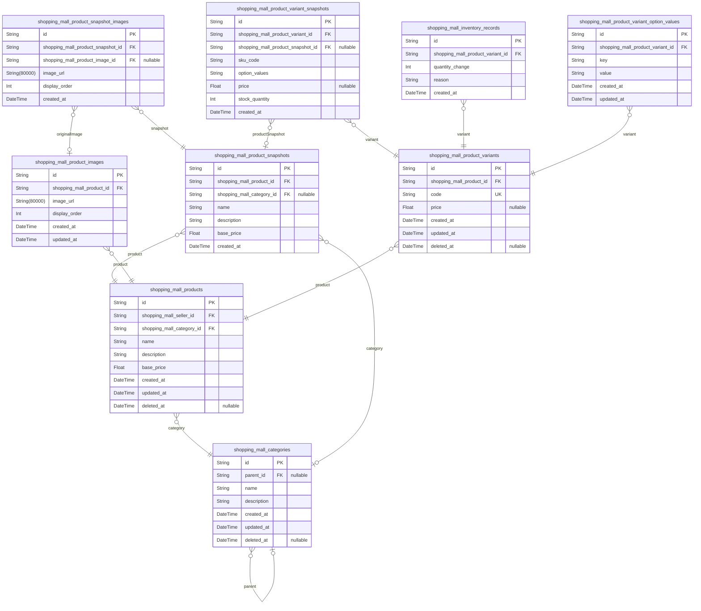
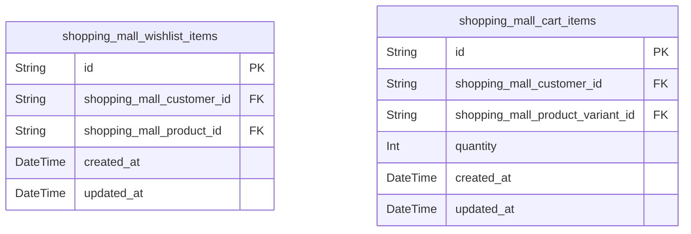
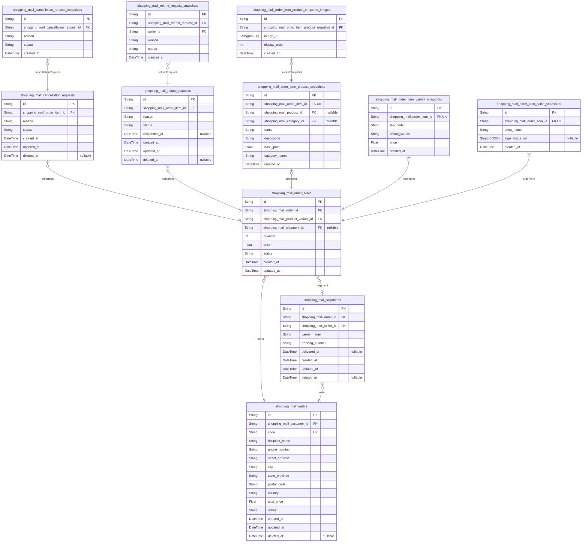
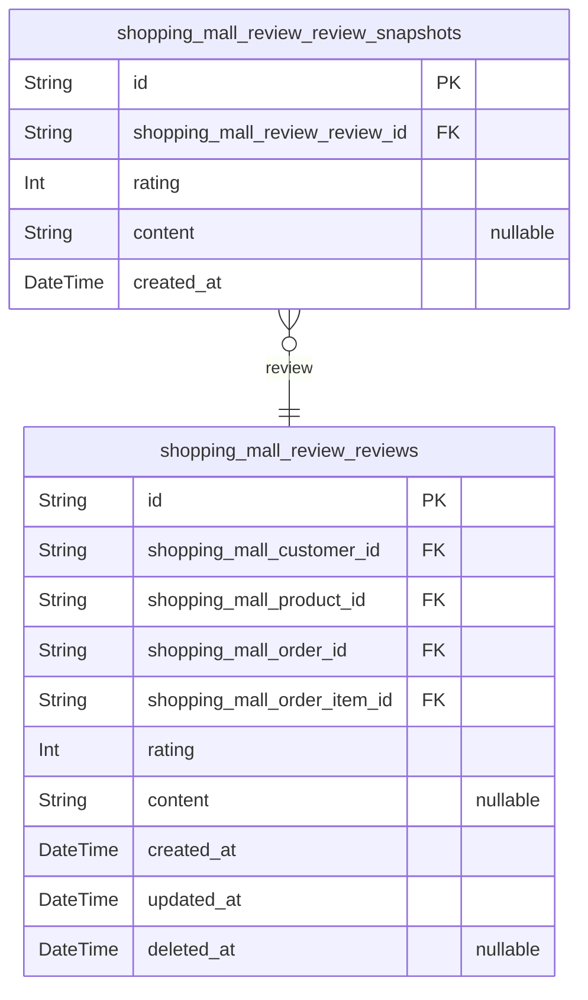

# Prisma Markdown

> Generated by [`prisma-markdown`](https://github.com/samchon/prisma-markdown)

- [shopping_mall_auth](#shopping_mall_auth)
- [shopping_mall_product](#shopping_mall_product)
- [shopping_mall_shopping](#shopping_mall_shopping)
- [shopping_mall_order](#shopping_mall_order)
- [shopping_mall_review](#shopping_mall_review)

## shopping_mall_auth

```mermaid
erDiagram
"shopping_mall_guests" {
  String id PK
  String device_fingerprint UK
  DateTime created_at
  DateTime updated_at
  DateTime deleted_at "nullable"
}
"shopping_mall_guest_sessions" {
  String id PK
  String shopping_mall_guest_id FK
  String ip
  String href
  String referrer
  DateTime created_at
  DateTime expired_at
}
"shopping_mall_customers" {
  String id PK
  String email UK
  String password_hash
  String display_name
  String phone_number "nullable"
  DateTime banned_at "nullable"
  DateTime created_at
  DateTime updated_at
  DateTime deleted_at "nullable"
}
"shopping_mall_customer_sessions" {
  String id PK
  String shopping_mall_customer_id FK
  String ip
  String(80000) href
  String referrer
  DateTime created_at
  DateTime expired_at
}
"shopping_mall_customer_password_resets" {
  String id PK
  String shopping_mall_customer_id FK
  String token UK
  DateTime expired_at
  DateTime created_at
}
"shopping_mall_customer_email_verifications" {
  String id PK
  String shopping_mall_customer_id FK
  String token UK
  DateTime expired_at
  DateTime created_at
}
"shopping_mall_sellers" {
  String id PK
  String email UK
  String password_hash
  String approval_status
  String rejection_reason "nullable"
  DateTime suspended_at "nullable"
  DateTime banned_at "nullable"
  DateTime created_at
  DateTime updated_at
  DateTime deleted_at "nullable"
}
"shopping_mall_seller_sessions" {
  String id PK
  String seller_id FK
  String ip
  String href
  String referrer
  DateTime created_at
  DateTime expired_at
}
"shopping_mall_seller_password_resets" {
  String id PK
  String shopping_mall_seller_id FK
  String token UK
  DateTime expired_at
  DateTime created_at
  DateTime updated_at
}
"shopping_mall_admins" {
  String id PK
  String email UK
  String password_hash
  String grade
  DateTime created_at
  DateTime updated_at
  DateTime deleted_at "nullable"
}
"shopping_mall_admin_sessions" {
  String id PK
  String shopping_mall_admin_id FK
  String ip
  String href
  String referrer
  DateTime created_at
  DateTime expired_at
}
"shopping_mall_admin_password_resets" {
  String id PK
  String shopping_mall_admin_id FK
  String token UK
  String ip
  DateTime created_at
  DateTime expired_at
}
"shopping_mall_admin_audit_logs" {
  String id PK
  String shopping_mall_admin_id FK
  String action_type
  String target_entity_type
  String target_entity_id
  String old_value "nullable"
  String new_value "nullable"
  String reason "nullable"
  DateTime created_at
}
"shopping_mall_seller_profiles" {
  String id PK
  String shopping_mall_seller_id FK,UK
  String shop_name "nullable"
  String shop_description "nullable"
  String(80000) logo_image_uri "nullable"
  DateTime created_at
  DateTime updated_at
}
"shopping_mall_seller_profile_snapshots" {
  String id PK
  String shopping_mall_seller_profile_id FK
  String shop_name
  String shop_description
  String(80000) logo_image "nullable"
  DateTime created_at
}
"shopping_mall_guest_sessions" }o--|| "shopping_mall_guests" : guest
"shopping_mall_customer_sessions" }o--|| "shopping_mall_customers" : customer
"shopping_mall_customer_password_resets" }o--|| "shopping_mall_customers" : customer
"shopping_mall_customer_email_verifications" }o--|| "shopping_mall_customers" : customer
"shopping_mall_seller_sessions" }o--|| "shopping_mall_sellers" : seller
"shopping_mall_seller_password_resets" }o--|| "shopping_mall_sellers" : seller
"shopping_mall_admin_sessions" }o--|| "shopping_mall_admins" : admin
"shopping_mall_admin_password_resets" }o--|| "shopping_mall_admins" : admin
"shopping_mall_admin_audit_logs" }o--|| "shopping_mall_admins" : admin
"shopping_mall_seller_profiles" |o--|| "shopping_mall_sellers" : seller
"shopping_mall_seller_profile_snapshots" }o--|| "shopping_mall_seller_profiles" : sellerProfile
```

### `shopping_mall_guests`

Temporary guest accounts for unauthenticated visitors to the platform.

A guest is any person visiting the e-commerce platform who has not yet
logged in or registered for an account. The guest actor represents the
unauthenticated state and serves solely as an entry point for
authentication — guests can only access the login and registration pages.
All product browsing, searching, category viewing, and shopping features
are unavailable to guests.

Each guest is identified by a unique {@link device_fingerprint device
fingerprint}, which allows the platform to associate session tokens and
track visitors before they transition into a registered role (customer,
seller, or administrator). Guest accounts are temporary and may be
cleaned up periodically.

Properties as follows:

- `id`: Primary Key.
- `device_fingerprint`
  > Unique device fingerprint identifying the guest visitor.
  >
  > This fingerprint is generated from client-side device characteristics
  > (e.g., browser, OS, screen resolution) and serves as the primary identity
  > mechanism for unauthenticated visitors. It allows the platform to
  > associate [session tokens](#shopping_mall_guest_sessions) and
  > maintain continuity across page visits before the guest registers or logs
  > in.
- `created_at`: Timestamp when the guest account was first created (first visit).
- `updated_at`: Timestamp when the guest account was last updated (e.g., last visit).
- `deleted_at`
  > Timestamp when the guest account was cleaned up or expired.
  >
  > Null for active guests. Set when the guest account is removed during
  > periodic cleanup of inactive temporary accounts.

### `shopping_mall_guest_sessions`

Temporary session tokens for guest visitors, bound to device fingerprint
for access to login and registration pages.

Sessions are created when an unauthenticated visitor first accesses the
platform, identified by device fingerprint stored in {@link
shopping_mall_guests}. Each session records the IP address, current page
URL (href), and referring page for audit and security purposes. Sessions
have a short expiration period for security — expired sessions must be
re-established through a new guest identification flow.

Sessions are append-only audit trail records. They are never updated or
soft-deleted once created; instead, new sessions are issued when needed
and old sessions naturally expire. The [shopping_mall_guests](#shopping_mall_guests) actor
owns these sessions, and querying sessions by guest with creation-time
ordering is the primary access pattern.

Properties as follows:

- `id`: Primary Key.
- `shopping_mall_guest_id`
  > Reference to the [shopping_mall_guests](#shopping_mall_guests) actor that owns this
  > session.
  >
  > Each session is bound to exactly one guest identified by device
  > fingerprint. A guest may have multiple sessions over time as sessions
  > expire and are re-established.
- `ip`
  > IP address of the guest at the time of session creation.
  >
  > Captured for audit and security purposes, enabling geographic and
  > network-level analysis of access patterns.
- `href`
  > The current page URL (href) the guest was on when the session was
  > established.
  >
  > Provides context about the entry point into the platform and aids in
  > debugging access flow issues.
- `referrer`
  > The referring page URL (referrer header) that led the guest to the
  > current page.
  >
  > Useful for traffic source analysis and understanding how guests discover
  > the platform.
- `created_at`
  > Timestamp when the session was created.
  >
  > Marks the beginning of the session's lifetime. Used in conjunction with
  > expired_at to determine valid session windows.
- `expired_at`
  > Timestamp when the session expires and is no longer valid.
  >
  > NOT NULL by default for security — every session has an explicit
  > expiration boundary. Sessions past this timestamp must be re-established
  > through a new guest identification flow.

### `shopping_mall_customers`

Registered customer accounts with email and password authentication,
display name, optional phone number, ban status tracking, and soft-delete
support for account lifecycle.

Customers register with an email and password, then authenticate via
login. The email serves as the unique login identifier across all
customer accounts. Password is stored as a cryptographic hash using
bcrypt or argon2. Each customer has a display_name set at registration
and an optional phone_number editable through profile management.

The banned_at field records when an administrator has banned this
customer account. A non-null value means the customer cannot log in. A
null value indicates the account is in good standing. Banned customers'
existing orders and reviews remain intact.

Soft deletion via deleted_at implements the account lifecycle: when a
customer deletes their account, profile information is discarded but
orders and order history are preserved for seller records and legal
purposes. Reviews authored by deleted customers persist but are displayed
as authored by a 'deleted user'.

Related authentication tables: [shopping_mall_customer_sessions](#shopping_mall_customer_sessions)
manages JWT sessions with access and refresh tokens, {@link
shopping_mall_customer_password_resets} handles password recovery tokens,
and [shopping_mall_customer_email_verifications](#shopping_mall_customer_email_verifications) manages
registration confirmation tokens.

Properties as follows:

- `id`: Primary key identifying the customer account.
- `email`
  > Customer's email address used as the login identifier. Must be unique
  > across all customer accounts.
- `password_hash`
  > Cryptographic hash of the customer's password for authentication. Stored
  > using a secure hashing algorithm such as bcrypt or argon2.
- `display_name`
  > Public display name shown on reviews, profile pages, and across the
  > platform. Set at registration and editable by the customer.
- `phone_number`
  > Customer's phone number for contact purposes. Optional and editable by
  > the customer through profile management.
- `banned_at`
  > Timestamp when an administrator banned this customer account. A non-null
  > value indicates the customer is banned and cannot log in. Null means the
  > account is in good standing.
- `created_at`: Timestamp when the customer account was registered.
- `updated_at`
  > Timestamp of the most recent modification to any field on this customer
  > record.
- `deleted_at`
  > Soft-deletion timestamp. When set, the customer account is considered
  > deleted — profile information is discarded but orders and reviews are
  > preserved. Reviews authored by deleted customers display as 'deleted
  > user'. Null means the account is active.

### `shopping_mall_customer_sessions`

JWT session tokens for customer authentication with access and refresh
token support.

Records each successful customer login as a session, tracking the client
IP, originating page, and referrer. The session persists until the
customer explicitly logs out, the session expires, or the system
terminates it (password change, account deletion, or ban).

Each session belongs to exactly one [shopping_mall_customers](#shopping_mall_customers)
record. A customer may have multiple concurrent sessions across different
devices. Session termination — whether by logout, password change, or ban
— is reflected by updating `expired_at` to the current time.

JWT access tokens and refresh tokens are generated at the application
layer from this session record. Token lifecycle (issuance, rotation,
revocation) is managed in application code, with the session serving as
the authoritative record of an active authentication.

Properties as follows:

- `id`: Primary Key.
- `shopping_mall_customer_id`
  > Reference to the authenticated [shopping_mall_customers](#shopping_mall_customers) record.
  >
  > Establishes the 1:N relationship where a customer may have multiple
  > active sessions across different devices. Not unique — multiple session
  > records can reference the same customer.
- `ip`
  > Client IP address captured at the moment of session establishment.
  >
  > Used for security auditing and identifying unusual login patterns across
  > sessions.
- `href`
  > The page URL from which the customer initiated login.
  >
  > Provides context for the authentication event — useful for tracking entry
  > points and detecting suspicious login origins.
- `referrer`
  > The HTTP Referer header value at the time of login.
  >
  > Captures the referring page for forensic analysis of authentication
  > flows. May be empty if no referrer was sent.
- `created_at`
  > Timestamp when the session was established after successful
  > authentication.
  >
  > Marks the beginning of the session. Used in conjunction with `expired_at`
  > to determine the session's active window.
- `expired_at`
  > Timestamp when the session expires or was terminated.
  >
  > Set initially to the planned expiration (e.g., 7 days from creation).
  > Updated to the current timestamp when the session is terminated early —
  > by customer logout, password change, account deletion, or ban. A session
  > is considered active only while the current time is before `expired_at`.
  >
  > NOT NULL by default for security: every session must have a definite
  > expiry.

### `shopping_mall_customer_password_resets`

Password reset tokens with expiration for customer account recovery.

Each token is generated when a customer requests a password reset through
the "forgot password" flow. The token is sent to the customer's
registered email and, when submitted alongside a new password, authorizes
the password change without requiring the current password — unlike the
authenticated password change flow described in the password change
requirements.

Tokens are bound to a specific [shopping_mall_customers](#shopping_mall_customers) record,
are single-use, and expire automatically at [expired_at](#expired_at). This
table is append-only — tokens are never updated, only created and
consumed or left to expire. A customer may have multiple reset tokens
over time from repeated reset requests.

Properties as follows:

- `id`: Primary Key.
- `shopping_mall_customer_id`
  > The customer who requested this password reset.
  >
  > References [shopping_mall_customers](#shopping_mall_customers). A single customer may
  > accumulate multiple reset tokens over time (e.g., repeated
  > forgotten-password requests), but only the most recent unexpired token
  > should be honored for any given reset attempt.
- `token`
  > Cryptographically secure random token string used to verify the reset
  > request.
  >
  > This token is embedded in the password reset link sent to the customer's
  > email. It must be unique across all active tokens to ensure each reset
  > link is valid for exactly one use and to prevent collision-based attacks.
- `expired_at`
  > The timestamp after which this token is no longer valid.
  >
  > Tokens carry a fixed validity window from creation (e.g., 1 hour). Once
  > expired, the token cannot be used to authorize a password change, and the
  > customer must initiate a new reset request to obtain a fresh token.
- `created_at`
  > Timestamp when the password reset token was generated.
  >
  > Used alongside [expired_at](#expired_at) to calculate the token's remaining
  > validity period and to support chronological listing of a customer's
  > reset history.

### `shopping_mall_customer_email_verifications`

Email verification tokens for customer registration confirmation.

When a visitor registers a customer account, the system generates a
unique verification token and sends it to the provided email address. The
customer confirms their email by clicking a link containing this token.
Each token is bound to a specific [shopping_mall_customers](#shopping_mall_customers) record
and has a mandatory expiration time for security.

Tokens are created during registration and looked up once during
verification. After successful verification the token is consumed
(hard-deleted); expired tokens are rejected and may be cleaned up. No
updates are ever applied — this table follows a create-and-consume
lifecycle.

Properties as follows:

- `id`: Primary Key.
- `shopping_mall_customer_id`
  > The customer account this verification token belongs to.
  >
  > References [shopping_mall_customers](#shopping_mall_customers). A customer may have multiple
  > verification tokens over time (e.g., if they re-register or request a new
  > verification email).
- `token`
  > The unique verification token string embedded in the verification link
  > sent to the customer's email.
  >
  > Must be cryptographically random and sufficiently long to prevent
  > guessing. Used for exact-match lookup when the customer clicks the
  > verification link.
- `expired_at`
  > The timestamp after which this token is considered invalid.
  >
  > Tokens past their expiration must be rejected during verification. A
  > reasonable expiration window (e.g., 24 hours) balances security with user
  > experience.
- `created_at`
  > The timestamp when this verification token was generated.
  >
  > Set at the moment of customer registration or when a new verification
  > email is requested.

### `shopping_mall_sellers`

Registered seller accounts with email and password authentication,
administrator approval workflow, suspension control, and ban support.

Each seller account represents a merchant who can create and manage
products after administrator approval. The approval workflow determines
selling access: sellers in "pending" state await review, "approved"
sellers have full access to product management and order processing, and
"rejected" sellers can view the rejection reason and resubmit. A seller
account carries a 1:1 relationship with a {@link
shopping_mall_seller_profiles} that holds the shop name, description, and
logo image.

Suspension hides the seller's products from search and catalog listings
while preserving the ability to process existing orders. Banning prevents
login entirely. Both states are represented by nullable timestamps — null
means the seller is not under that restriction. Account deletion uses
soft-delete via deleted_at, preserving order history and snapshots for
buyer records and legal compliance.

Properties as follows:

- `id`: Primary Key.
- `email`
  > Seller's email address used for login and platform communication.
  >
  > Must be unique across all seller accounts. Used as the primary
  > authentication identifier alongside password_hash.
- `password_hash`
  > Bcrypt-hashed password for seller authentication.
  >
  > Never exposed in API responses. Password changes go through the password
  > reset flow managed by [shopping_mall_seller_password_resets](#shopping_mall_seller_password_resets).
- `approval_status`
  > Current state of the administrator approval workflow.
  >
  > Allowed values: "pending" — seller registration submitted and awaiting
  > administrator review, no selling access; "approved" — administrator has
  > granted full selling privileges including product creation, order
  > processing, and dashboard access; "rejected" — administrator has denied
  > the registration, seller can view rejection_reason and submit a new
  > registration request which restarts the workflow from "pending".
- `rejection_reason`
  > Administrator-provided explanation for rejecting the seller's
  > registration.
  >
  > Only populated when approval_status is "rejected". Displayed to the
  > seller so they understand what to address before resubmitting. Null for
  > "pending" and "approved" sellers.
- `suspended_at`
  > Timestamp when an administrator suspended the seller's account.
  >
  > When set: the seller's products are hidden from search and category
  > listings, products cannot be purchased, but the seller can still log in
  > and process existing orders. New product creation and editing are
  > blocked. Null means the seller is not suspended.
- `banned_at`
  > Timestamp when an administrator banned the seller's account.
  >
  > When set: the seller cannot log in at all. Existing orders remain
  > preserved. More severe than suspension — banned sellers have no platform
  > access. Null means the seller is not banned.
- `created_at`: Timestamp when the seller account was registered.
- `updated_at`
  > Timestamp of the last modification to this seller record, including
  > approval status changes, suspension, ban, or profile updates.
- `deleted_at`
  > Soft-delete timestamp for seller account deletion.
  >
  > Deletion is only permitted when: no order items in "paid" or "shipped"
  > status, no pending cancellation requests, and no pending refund requests.
  > When deletion proceeds, products are removed from listings, the seller
  > profile is deleted, but order history and all associated snapshots are
  > preserved. Null means the account is active.

### `shopping_mall_seller_sessions`

JWT session tokens for seller authentication with access and refresh
token support.

Each record represents a single seller login session, created when a
seller successfully authenticates with email and password. The session
captures security-relevant context including the IP address from which
the login originated, the page (href) the seller was on at login, and the
referring page (referrer) that led to the authentication flow.

Sessions are append-only — they are never modified after creation.
Expiration is enforced via the [expired_at](#expired_at) timestamp which is
always set (NOT NULL) to ensure sessions have a bounded lifetime for
security. The JWT access token and refresh token lifecycle (issuance,
rotation, revocation) is managed at the application layer; this table
serves as the authoritative record that a session exists and when it
expires.

Belongs to exactly one [seller](#shopping_mall_sellers) through the
[seller_id](#seller_id) foreign key. Querying sessions for a specific seller
sorted by recency is the primary access pattern, supported by the
composite index on [seller_id, created_at].

Properties as follows:

- `id`
  > Primary Key.
  >
  > Unique identifier for each seller session record. Generated at session
  > creation time.
- `seller_id`
  > Reference to the authenticated [seller](#shopping_mall_sellers) who
  > owns this session.
  >
  > Each session belongs to exactly one seller. A seller may have multiple
  > concurrent sessions (e.g., logged in from multiple devices or browsers).
  > Deleting a seller cascades to remove all associated sessions.
- `ip`
  > IP address of the client that initiated the login.
  >
  > Recorded for security auditing and anomaly detection. Captured from the
  > HTTP request at authentication time.
- `href`
  > The full URL of the page the seller was on when they initiated login.
  >
  > Provides context for the authentication flow, enabling post-login
  > redirection back to the originally requested page.
- `referrer`
  > The HTTP Referer header value at login time, indicating the page that
  > referred the seller to the login page.
  >
  > Useful for understanding navigation flows and detecting suspicious login
  > patterns.
- `created_at`
  > Timestamp when the session was created.
  >
  > Represents the moment of successful seller authentication. Set once at
  > session creation and never modified.
- `expired_at`
  > Timestamp when the session expires and becomes invalid.
  >
  > Always set (NOT NULL) to enforce bounded session lifetime as a security
  > measure. The application layer rejects requests bearing tokens associated
  > with expired sessions. Expiration may be extended through refresh token
  > rotation at the application level without modifying this record.

### `shopping_mall_seller_password_resets`

Password reset tokens for seller account recovery.

Each token is created when a seller initiates the password reset flow.
The token is sent to the seller's email and must be presented to complete
the password change. Tokens are single-use and expire after {@link
expired_at}. A seller may have multiple reset tokens over time — the most
recent non-expired token is the active one.

Related to [shopping_mall_sellers](#shopping_mall_sellers) via {@link
shopping_mall_seller_id}. The token itself is cryptographically random
and stored as a unique string to prevent collisions.

Properties as follows:

- `id`: Primary Key.
- `shopping_mall_seller_id`
  > The seller who requested this password reset.
  >
  > References [shopping_mall_sellers](#shopping_mall_sellers). A seller may have multiple
  > password reset tokens over time as they request resets at different
  > points.
- `token`
  > Cryptographically random reset token sent to the seller's email.
  >
  > This token must be presented to verify ownership of the email address and
  > authorize the password change. Stored as a unique string to prevent
  > accidental collisions.
- `expired_at`
  > Timestamp after which this token is no longer valid.
  >
  > Tokens are time-limited for security. After this time, the token cannot
  > be used and the seller must request a new password reset.
- `created_at`
  > Timestamp when the password reset token was generated.
  >
  > Recorded at the moment the seller initiates the password reset flow.
- `updated_at`
  > Timestamp of the last modification to this record.
  >
  > Typically updated when the token is consumed (marked as used) during a
  > successful password change.

### `shopping_mall_admins`

Platform administrator accounts with email/password authentication and a
two-grade hierarchy distinguishing regular administrators from super
administrators.

Each administrator authenticates using a unique email address and
password hash. The grade field determines the administrator's authority
level: regular administrators manage day-to-day platform operations such
as category management, seller approval, and order oversight, while super
administrators have the additional capability to promote or demote other
administrators and approve or reject administrator promotion requests.

This is a root actor model in the authorization component. Child models —
[shopping_mall_admin_sessions](#shopping_mall_admin_sessions), {@link
shopping_mall_admin_password_resets}, and {@link
shopping_mall_admin_audit_logs} — reference this table to establish
administrator identity for session tracking, password recovery, and audit
trails respectively. The model supports soft deletion via the deleted_at
timestamp, allowing administrator accounts to be deactivated while
preserving historical audit records.

Properties as follows:

- `id`: Primary Key.
- `email`
  > Unique email address used for administrator login authentication.
  >
  > Must be a valid email format. Enforced as unique across all administrator
  > accounts to prevent duplicate registrations.
- `password_hash`
  > Hashed password credential for administrator authentication.
  >
  > Stored using a cryptographically secure one-way hashing algorithm. The
  > raw password is never stored or logged.
- `grade`
  > Administrator authority grade determining the scope of administrative
  > privileges.
  >
  > Set to "regular" for standard administrators who manage categories,
  > approve sellers, oversee orders, and manage users. Set to "super" for
  > elevated administrators who additionally can promote or demote other
  > administrators and approve administrator promotion requests submitted via
  > [shopping_mall_admin_requests](#shopping_mall_admin_requests).
- `created_at`: Timestamp when the administrator account was created.
- `updated_at`
  > Timestamp when the administrator account was last modified.
  >
  > Updated on any change to the account, including password changes and
  > grade promotions or demotions.
- `deleted_at`
  > Soft deletion timestamp marking when the administrator account was
  > deactivated.
  >
  > When set, the account is considered deleted and cannot be used for
  > authentication. This preserves the administrator's identity in historical
  > [shopping_mall_admin_audit_logs](#shopping_mall_admin_audit_logs) records. Null while the account is
  > active.

### `shopping_mall_admin_sessions`

JWT session tokens for administrator authentication with access and
refresh token support.

Tracks authenticated login sessions for [shopping_mall_admins](#shopping_mall_admins).
Each session records the IP address, current page (href), and referral
source (referrer) at the time of creation, enabling security auditing of
administrator access patterns. Sessions have a mandatory expiration
timestamp (expired_at) — when expired, the session is invalidated and the
administrator must re-authenticate.

Sessions are append-only audit records and are not directly mutable by
administrators. They are managed through authentication flows: created on
successful login, invalidated on logout or expiration, and queryable for
security review. The composite index on administrator and creation time
supports efficient listing of an administrator's recent session history.

Properties as follows:

- `id`: Primary Key.
- `shopping_mall_admin_id`
  > Reference to the authenticated [shopping_mall_admins](#shopping_mall_admins) who owns this
  > session.
  >
  > Establishes the session's ownership. A session always belongs to exactly
  > one administrator — sessions are never shared across accounts. When an
  > administrator is deleted, their sessions are cascaded for removal.
- `ip`
  > IP address of the administrator at the time of session creation.
  >
  > Captures the originating IP for security auditing and anomaly detection.
  > If multiple sessions originate from geographically distant IPs in a short
  > timeframe, this may indicate credential compromise.
- `href`
  > The page URL the administrator was viewing when the session was created
  > or refreshed.
  >
  > Used for redirect-after-login flows: after successful authentication, the
  > administrator can be returned to the page they originally requested. Also
  > serves as an audit trail of administrative entry points.
- `referrer`
  > The referring URL that led the administrator to the login page.
  >
  > Typically the previous admin page or an external source. May be empty for
  > direct navigation. Used for understanding administrator navigation
  > patterns and access paths.
- `created_at`
  > Timestamp when the session was created.
  >
  > Marks the beginning of the authenticated session. Together with
  > expired_at, defines the session's valid time window.
- `expired_at`
  > Timestamp when the session expires.
  >
  > NOT NULL by default to enforce security. After this time, the session is
  > invalid and the administrator must re-authenticate. The expiration window
  > is set at session creation and may be extended on activity (sliding
  > expiration).

### `shopping_mall_admin_password_resets`

Password reset tokens for administrator account recovery.

Each token is issued when an administrator requests a password reset and
is sent via email. The token is single-use — once consumed during the
password change flow, it should be invalidated. Tokens have a mandatory
expiration timestamp for security.

Each record belongs to exactly one [shopping_mall_admins](#shopping_mall_admins) record.
An administrator may have multiple reset tokens over time (e.g., if they
request multiple resets or previous tokens expire unused). The IP address
of the reset request is recorded for security auditing.

Properties as follows:

- `id`: Primary Key.
- `shopping_mall_admin_id`
  > Reference to the administrator account requesting the password reset.
  >
  > Links to [shopping_mall_admins](#shopping_mall_admins). Each password reset token belongs
  > to exactly one administrator. An administrator may have multiple reset
  > tokens over time.
- `token`
  > The unique reset token string sent to the administrator via email.
  >
  > Used to verify the reset request during the password change flow. Must be
  > cryptographically secure and unique across all tokens.
- `ip`
  > The IP address from which the password reset was requested.
  >
  > Recorded for security auditing and abuse detection. Captured at the
  > moment the reset request is initiated.
- `created_at`
  > Timestamp when the password reset token was created.
  >
  > Marks the beginning of the token's validity period.
- `expired_at`
  > Timestamp when the password reset token expires.
  >
  > After this time, the token is invalid and cannot be used for password
  > changes. Mandatory for security — tokens must have a bounded lifetime.

### `shopping_mall_admin_audit_logs`

Immutable append-only audit trail of sensitive administrator actions.

Records every privileged action performed by administrators on the
platform. Tracked actions include seller lifecycle management (approval,
rejection, suspension, unsuspension), user ban operations (customer and
seller ban/unban), administrator hierarchy changes (promotion and
demotion), administrator application review (approval and rejection of
[shopping_mall_admin_requests](#shopping_mall_admin_requests)), order overrides (force-cancel and
force-refund at both order and item level), product deletion by
administrators, and category management (create, edit, delete).

Each entry captures the acting administrator via a foreign key to {@link
shopping_mall_admins}, the action type categorizing the operation, the
target entity identified by a type discriminator and plain UUID
reference, before-and-after state values for change auditing, and an
optional reason for actions requiring justification (rejections, bans).

This table serves as the platform's accountability mechanism — all
entries are immutable and never updated or deleted. The polymorphic
target reference intentionally avoids foreign key constraints so that
audit records persist even when target entities are removed from the
system. Only the created_at timestamp is recorded; updated_at and
deleted_at are omitted by design.

Properties as follows:

- `id`: Primary Key.
- `shopping_mall_admin_id`
  > The administrator who performed the audited action.
  >
  > References [shopping_mall_admins](#shopping_mall_admins). Every audit entry must be
  > traceable to a specific administrator for accountability. This
  > relationship is not nullable — all audit log entries require an
  > identified actor.
- `action_type`
  > The category of administrative action performed.
  >
  > Values include: approve_seller, reject_seller, suspend_seller,
  > unsuspend_seller, ban_customer, unban_customer, ban_seller, unban_seller,
  > promote_admin, demote_admin, approve_admin_request, reject_admin_request,
  > force_cancel_order, force_cancel_order_item, force_refund_order,
  > force_refund_order_item, delete_product, create_category, edit_category,
  > delete_category.
- `target_entity_type`
  > The type of entity targeted by the action.
  >
  > Values include: seller, customer, admin, seller_approval, admin_request,
  > order, order_item, product, category. Used in conjunction with
  > target_entity_id to form a polymorphic reference to the affected entity
  > without requiring foreign key constraints, allowing audit records to
  > persist after target deletion.
- `target_entity_id`
  > The unique identifier of the entity targeted by the action.
  >
  > This is a plain UUID reference, not a foreign key — the target may belong
  > to any of several entity types (determined by target_entity_type), and
  > audit records must be preserved even after the target entity is deleted
  > from the system.
- `old_value`
  > The state or value before the action was applied.
  >
  > Captured at the moment of the action for before-and-after comparison.
  > Nullable — some actions (e.g., ban operations on previously unbanned
  > users) may not have a meaningful previous state to record.
- `new_value`
  > The state or value after the action was applied.
  >
  > Represents the result of the administrative action. Used alongside
  > old_value to reconstruct what changed. Nullable — some actions may
  > produce outcomes not easily serialized as a single value.
- `reason`
  > The justification or explanation provided by the administrator for the
  > action.
  >
  > Required for rejection actions (reject_seller, reject_admin_request) and
  > ban operations (ban_customer, ban_seller) per platform policy. Nullable
  > for actions where justification is not mandatory, such as approvals and
  > unsuspensions.
- `created_at`
  > Timestamp when the administrative action was performed.
  >
  > This is an append-only immutable table — records are never updated or
  > soft-deleted, so updated_at and deleted_at are intentionally omitted.

### `shopping_mall_seller_profiles`

1:1 seller profile extension holding the shop name, description, and logo
image.

Every edit to this profile creates an immutable snapshot in {@link
shopping_mall_seller_profile_snapshots}, preserving the previous shop
name, description, and logo for historical accuracy and dispute
resolution. When a seller account is deleted, this profile is also
deleted, but all snapshots are preserved so that past order records
retain accurate seller information.

The profile is created alongside the seller account. Shop name is
optional at registration and can be updated after administrator approval.
Customers can view this profile to see the seller's shop name,
description, and logo on product pages and the seller profile page.

Properties as follows:

- `id`: Primary key identifying the seller profile record.
- `shopping_mall_seller_id`
  > Foreign key to the parent [shopping_mall_sellers](#shopping_mall_sellers) account.
  >
  > Unique constraint enforces the 1:1 relationship — each seller has exactly
  > one profile, and each profile belongs to exactly one seller.
- `shop_name`
  > The seller's shop name displayed to customers on product pages, order
  > histories, and search results.
  >
  > Optional at registration and can be updated after administrator approval.
  > When edited, a snapshot is created in {@link
  > shopping_mall_seller_profile_snapshots} before the value is changed.
- `shop_description`
  > A descriptive text about the seller's shop, visible on the seller profile
  > page.
  >
  > Optional. Can include information about the seller's brand, product
  > focus, or policies. When edited, a snapshot is created in {@link
  > shopping_mall_seller_profile_snapshots} before the value is changed.
- `logo_image_uri`
  > URI pointing to the seller's shop logo image, displayed on product pages
  > and the seller profile.
  >
  > Optional. When edited, a snapshot is created in {@link
  > shopping_mall_seller_profile_snapshots} before the value is changed.
- `created_at`
  > Timestamp when the seller profile was initially created, set at seller
  > account registration.
- `updated_at`
  > Timestamp of the most recent modification to any profile field (shop
  > name, description, or logo). Automatically updated on every edit.

### `shopping_mall_seller_profile_snapshots`

Immutable snapshots of seller profile state created on every edit,
preserving the previous shop name, description, and logo image.

Each snapshot captures the complete state of a {@link
shopping_mall_seller_profiles} record at the moment before an edit was
applied. The `shop_name`, `shop_description`, and `logo_image` fields are
denormalized from the profile to ensure historical accuracy — once a
snapshot is created, it never changes, even if the profile is later
modified or deleted.

Snapshots are never deleted. They persist after profile deletion, seller
account removal, and across all lifecycle events. This guarantees that
order item seller snapshots and any audit references remain valid
indefinitely for dispute resolution and historical integrity.

Properties as follows:

- `id`
  > Primary Key.
  >
  > Unique identifier for each snapshot record.
- `shopping_mall_seller_profile_id`
  > Reference to the seller profile whose state this snapshot captures.
  >
  > Links to [shopping_mall_seller_profiles](#shopping_mall_seller_profiles). Every snapshot belongs to
  > exactly one profile. This is a 1:N relationship — a profile can
  > accumulate many snapshots over its edit history.
- `shop_name`
  > The shop name as it appeared at the moment this snapshot was taken.
  >
  > Denormalized from [shopping_mall_seller_profiles](#shopping_mall_seller_profiles). Preserved
  > exactly as-is for historical accuracy, regardless of subsequent edits.
- `shop_description`
  > The shop description as it appeared at the moment this snapshot was taken.
  >
  > Denormalized from [shopping_mall_seller_profiles](#shopping_mall_seller_profiles). Preserved
  > exactly as-is for historical accuracy, regardless of subsequent edits.
- `logo_image`
  > The logo image URL as it appeared at the moment this snapshot was taken.
  >
  > Denormalized from [shopping_mall_seller_profiles](#shopping_mall_seller_profiles). May be null if
  > the seller had not uploaded a logo at the time of the snapshot.
- `created_at`
  > Timestamp when this snapshot was created.
  >
  > Records the exact moment the snapshot was taken. Snapshots are immutable
  > — they have no `updated_at` or `deleted_at` fields as they are never
  > modified or removed once persisted.

## shopping_mall_product

### `shopping_mall_categories`

Product classification categories with name, description, and optional
parent category for one-level nesting.

Categories organize products into a two-tier hierarchy: top-level
categories and their subcategories. Each category has exactly two
defining attributes — a name and a description. Categories carry no
images, banners, display ordering, or decorative attributes.

Created and managed exclusively by {@link shopping_mall_admins
administrators}. Sellers select a category (or subcategory) when creating
products. Categories with subcategories serve as grouping parents; only
leaf-level categories typically receive products, though the schema
allows products at any category level.

Soft-deleted via deleted_at to preserve referential integrity for
existing products linked to the category.

Properties as follows:

- `id`: Primary Key.
- `parent_id`
  > Reference to the parent category for one-level nesting hierarchy.
  >
  > Null for top-level categories. When set, establishes a parent-child
  > relationship where the parent category groups its subcategories. Only one
  > level of nesting is supported — a category with a parent cannot itself be
  > a parent to further subcategories. This constraint is enforced at the
  > application layer, not in the database schema.
- `name`
  > Short, human-readable label identifying the category (e.g.,
  > "Electronics", "Clothing").
  >
  > Used in product listings, search filters, and navigation. Category names
  > help sellers decide where to list their products and help customers
  > understand the category's scope.
- `description`
  > Contextual explanation of what types of products belong in this category.
  >
  > Guides sellers in placing products correctly and helps customers
  > understand what they can expect to find within the category. Plain text
  > without formatting.
- `created_at`: Timestamp when the category was created by an administrator.
- `updated_at`
  > Timestamp of the most recent modification to the category's name or
  > description.
- `deleted_at`
  > Soft-deletion timestamp set when an administrator removes the category.
  >
  > Null while the category is active. When set, the category is excluded
  > from listings and cannot receive new products, but existing product
  > references remain intact for historical accuracy.

### `shopping_mall_products`

Products created by sellers for sale on the platform.

Each product belongs to a [seller](#shopping_mall_sellers) who
manages its listing and to a [category](#shopping_mall_categories)
that organizes it for customer browsing. The base price serves as the
default price, which individual {@link shopping_mall_product_variants
variants} can override with their own price.

Products without any variants are visible in search and category listings
but displayed as unavailable for purchase. Product edits are tracked via
[snapshots](#shopping_mall_product_snapshots), which capture the
complete state at the moment of each edit including all images and
variant states.

Soft deletion via `deleted_at` hides the product from search and listings
while preserving order history and snapshots. Deleting a product cascades
to its variants and inventory records.

Properties as follows:

- `id`: Primary Key.
- `shopping_mall_seller_id`
  > Reference to the [seller](#shopping_mall_sellers) who created and
  > owns this product.
  >
  > Establishes seller ownership — only the owning seller can edit, manage
  > variants, upload images, or delete the product. Administrators can also
  > delete any product for policy violations.
- `shopping_mall_category_id`
  > Reference to the [category](#shopping_mall_categories) classifying
  > this product.
  >
  > Required at creation — every product must belong to a category.
  > Categories organize products for customer browsing and search filtering.
  > Administrators manage the available categories.
- `name`
  > Display name of the product as shown in search results, category
  > listings, and the product detail page.
  >
  > Must be descriptive and unique enough for customers to identify the
  > product. Included in {@link shopping_mall_product_snapshots product
  > snapshots} when edited.
- `description`
  > Detailed description of the product including features, specifications,
  > and other information helpful to customers.
  >
  > Supports rich text for formatted presentation on the product detail page.
  > Included in [product snapshots](#shopping_mall_product_snapshots)
  > when edited.
- `base_price`
  > Default price of the product before any variant-specific overrides.
  >
  > Individual [variants](#shopping_mall_product_variants) can override
  > this with their own price. When a variant has no price override, this
  > base price is used as the purchase price. Required at product creation.
- `created_at`
  > Timestamp when the product was first created.
  >
  > Set automatically on creation and never modified.
- `updated_at`
  > Timestamp of the most recent update to any product field.
  >
  > Automatically updated on every edit, including name, description,
  > category, or base price changes.
- `deleted_at`
  > Soft deletion timestamp indicating when the product was removed from
  > listings.
  >
  > When set, the product no longer appears in search results or category
  > listings, is automatically removed from all customer wishlists, and its
  > variants become unavailable for purchase. The product record and its
  > [snapshots](#shopping_mall_product_snapshots) are preserved for
  > historical order accuracy and audit purposes.

### `shopping_mall_product_snapshots`

Immutable snapshots capturing the complete product state at the moment of
each edit.

Each snapshot records the product's name, description, category, and base
price as they existed just before the edit was applied, preserving the
previous state for audit and dispute resolution. These snapshots are
created automatically whenever a seller modifies any field of their
[shopping_mall_products](#shopping_mall_products).

Snapshots are append-only and immutable — they can never be modified or
deleted, even when the parent product or category is removed. Related
image data is preserved through {@link
shopping_mall_product_snapshot_images}, and variant state at snapshot
time is captured via [shopping_mall_product_variant_snapshots](#shopping_mall_product_variant_snapshots),
which link back to this snapshot record.

Querying snapshots by product in chronological order is the primary
access pattern. Relevant parties (the owning seller and administrators)
can view the full snapshot history for any product.

Properties as follows:

- `id`: Primary Key.
- `shopping_mall_product_id`
  > Reference to the [shopping_mall_products](#shopping_mall_products) whose state is captured
  > in this snapshot.
  >
  > Establishes a 1:N relationship — each product may have many snapshots
  > recording its edit history. This foreign key is never null because every
  > snapshot must belong to exactly one product.
- `shopping_mall_category_id`
  > Reference to the [shopping_mall_categories](#shopping_mall_categories) assigned to the product
  > at the moment this snapshot was taken.
  >
  > Nullable to accommodate scenarios where the referenced category is later
  > deleted by an administrator — the snapshot must survive independently. In
  > such cases, this field becomes null while the snapshot record itself is
  > preserved.
- `name`
  > Denormalized copy of the product's name as it existed at the moment of
  > snapshot creation.
  >
  > Preserved for historical accuracy so that the product's display name at
  > any point in its edit history can be retrieved even after subsequent
  > modifications or product deletion.
- `description`
  > Denormalized copy of the product's full description text as it existed at
  > the moment of snapshot creation.
  >
  > Preserved for historical accuracy alongside the name, enabling complete
  > reconstruction of how the product appeared to customers at any point in
  > time.
- `base_price`
  > Denormalized copy of the product's base price as it existed at the moment
  > of snapshot creation.
  >
  > Stored as a double to accommodate decimal currency values. This is the
  > price before any variant-level overrides, preserved for historical
  > reference.
- `created_at`
  > Timestamp recording when this snapshot was created — i.e., when the
  > corresponding product edit occurred.
  >
  > Snapshots are ordered by this timestamp to reconstruct the product's edit
  > chronology. Immutable after creation.

### `shopping_mall_product_snapshot_images`

Image URLs captured within {@link shopping_mall_product_snapshots product
snapshots}, preserving display order and image state at the time of
product edit.

Each record represents one product image as it existed when the snapshot
was created. The image URL and display order are denormalized here to
ensure historical accuracy regardless of later modifications or deletions
of the originating [product images](#shopping_mall_product_images).
Multiple snapshot images belong to a single product snapshot, ordered by
`display_order` to reconstruct the gallery layout at the snapshot moment.

These records are immutable — created once when the snapshot is taken and
never updated. They persist even when the original product, product
images, or the parent snapshot are deleted, providing a durable audit
trail for dispute resolution.

Properties as follows:

- `id`: Primary Key.
- `shopping_mall_product_snapshot_id`
  > Reference to the [product snapshot](#shopping_mall_product_snapshots)
  > that contains this image record.
  >
  > Each product snapshot can contain multiple snapshot image records — one
  > for each image associated with the product at the time of the edit that
  > triggered the snapshot. Non-nullable: every snapshot image must belong to
  > exactly one snapshot.
- `shopping_mall_product_image_id`
  > Reference to the originating {@link shopping_mall_product_images product
  > image} that this snapshot record was derived from.
  >
  > Provides traceability back to the original image for audit purposes.
  > Nullable because the original product image may be deleted by the seller
  > after the snapshot is created — snapshots must survive deletion of their
  > source entities. When null, the record remains identifiable through its
  > denormalized `image_url` and `display_order`.
- `image_url`
  > The URL of the product image as it existed at the moment of snapshot
  > creation.
  >
  > This is a denormalized copy of the original image URL, preserved to
  > ensure the snapshot remains meaningful even if the original image is
  > later deleted or its URL changes. Non-nullable — a snapshot image record
  > without a URL would be meaningless.
- `display_order`
  > The display order of this image within the product gallery at the moment
  > of snapshot creation.
  >
  > Lower values appear first. The first image (display_order = 0) served as
  > the main thumbnail in search and listing views. Preserving this order
  > allows reconstructing the exact gallery layout as it appeared when the
  > snapshot was taken.
- `created_at`
  > Timestamp when this snapshot image record was created.
  >
  > Matches the `created_at` of the parent {@link
  > shopping_mall_product_snapshots product snapshot} since snapshot images
  > are always created together with their parent snapshot. Immutable — never
  > updated after creation.

### `shopping_mall_product_images`

Gallery images belonging to a [product](#shopping_mall_products),
each with a display order for visual arrangement.

Each product can have multiple images forming a visual gallery. The image
with the lowest `display_order` value appears first and serves as the
main thumbnail image in search results and category listings. Sellers can
reorder images by adjusting display positions.

When a product is edited, all current image URLs and their display orders
are captured in a separate {@link shopping_mall_product_snapshot_images
product snapshot}, preserving the gallery state at that point in time for
historical reference. Deleting an image removes it from the active
gallery but does not affect previously created snapshots.

Properties as follows:

- `id`: Primary Key.
- `shopping_mall_product_id`
  > Reference to the [product](#shopping_mall_products) that owns this
  > image.
  >
  > Establishes the 1:N relationship where one product can have many gallery
  > images. Deleting a product cascades to remove all its images.
- `image_url`
  > URL locating the stored image file.
  >
  > This is the fundamental attribute of a product image — every product
  > image has exactly one image URL. The URL serves as the image's identity,
  > used by the system to retrieve and render visual content in product
  > galleries, search results, and category listings.
- `display_order`
  > Position of this image within the product's gallery.
  >
  > Determines the visual ordering of images. The image with the lowest
  > `display_order` value is presented first and serves as the main thumbnail
  > in search results, category listings, and product cards. Sellers can
  > reorder images by adjusting this value across the image set.
- `created_at`
  > Timestamp when the image was added to the product gallery.
  >
  > Recorded automatically at creation time for audit and sorting purposes.
- `updated_at`
  > Timestamp of the most recent modification to this image record.
  >
  > Updated automatically whenever the `display_order` or other attributes
  > change.

### `shopping_mall_product_variants`

Purchasable SKU variants of a [product](#shopping_mall_products),
each representing a specific combination of option values (e.g., "Red /
Large"). Variants carry an optional price override and serve as the
inventory-tracked, cart-added, and order-placed unit of the product
catalog.

Each variant is identified by a globally unique SKU code. The option
values that define the variant (such as color and size) are stored in the
child table [shopping_mall_product_variant_option_values](#shopping_mall_product_variant_option_values) as
key-value pairs. The variant's price, when set, overrides the parent
product's base price; when null, the product base price applies. Stock
quantity is never stored directly on the variant — it is derived on
demand by summing all {@link shopping_mall_inventory_records inventory
records} for the variant, following the ledger-based inventory model
where every stock change is an append-only record.

Variants support soft deletion via `deleted_at`. A deleted variant is
excluded from product listings, search results, and cart operations, but
existing [order items](#shopping_mall_order_items) and {@link
shopping_mall_cart_items cart items} retain their foreign key references
for historical accuracy. A product must have at least one non-deleted
variant to be purchasable.

Every edit to a variant creates a {@link
shopping_mall_product_variant_snapshots snapshot} preserving the previous
state, including the SKU code, option values, and price at the moment of
change. Variants cannot be deleted while they have pending order items
(paid or shipped status) or pending cancellation/refund requests.

Properties as follows:

- `id`: Primary Key.
- `shopping_mall_product_id`
  > Reference to the parent [product](#shopping_mall_products) that this
  > variant belongs to.
  >
  > Every variant must belong to exactly one product. Deleting a product
  > cascades to soft-delete all its variants.
- `code`
  > Globally unique SKU (Stock Keeping Unit) code that identifies this
  > variant across the entire platform.
  >
  > The SKU code is the primary external identifier for the variant, used by
  > sellers for inventory management and by the system for order processing
  > and cart operations. It must be unique across all variants, not just
  > within a product.
- `price`
  > Optional price override for this specific variant.
  >
  > When set, this price replaces the parent {@link shopping_mall_products
  > product}'s base price for all purchases of this variant. When null, the
  > product's base price is used. This allows sellers to charge different
  > prices for different option combinations (e.g., a larger size may cost
  > more).
- `created_at`: Timestamp when this variant was created.
- `updated_at`
  > Timestamp when this variant was last modified.
  >
  > Updated on any field change including price, code, or option values.
  > Every update triggers creation of a {@link
  > shopping_mall_product_variant_snapshots snapshot} preserving the previous
  > state.
- `deleted_at`
  > Timestamp when this variant was soft-deleted.
  >
  > When non-null, the variant is considered deleted: it is excluded from
  > product listings and cannot be added to carts or purchased. Existing
  > [order items](#shopping_mall_order_items) and {@link
  > shopping_mall_cart_items cart items} retain their references for
  > historical integrity. A variant can only be deleted when it has no
  > pending order items or cancellation/refund requests.

### `shopping_mall_product_variant_snapshots`

Immutable snapshots of product variant state at each edit, preserving the
complete variant data at the moment of change.

Created in two scenarios: standalone on variant-only edits (SKU code,
option values, price, stock quantity changes) and as children of {@link
shopping_mall_product_snapshots} when the parent product is edited. Each
snapshot captures the full denormalized state of the variant — SKU code,
option values, price, and stock quantity — at the time the snapshot was
taken.

Snapshots are append-only and never deleted. They provide an immutable
audit trail for dispute resolution and historical accuracy, preserving
variant state even after the variant itself is modified or deleted. When
created as children of a product snapshot, linked via the nullable parent
snapshot reference; standalone variant edits have no parent product
snapshot.

Properties as follows:

- `id`: Primary Key.
- `shopping_mall_product_variant_id`
  > Reference to the [shopping_mall_product_variants](#shopping_mall_product_variants) variant whose
  > state this snapshot captures.
  >
  > Non-nullable — every variant snapshot must belong to a variant. When the
  > variant is deleted, snapshots are preserved for historical integrity.
- `shopping_mall_product_snapshot_id`
  > Reference to the parent [shopping_mall_product_snapshots](#shopping_mall_product_snapshots) when this
  > variant snapshot was created as part of a product-level edit.
  >
  > Nullable — variant snapshots created standalone (variant-only edits
  > without product changes) have no parent product snapshot. Non-null when
  > the snapshot is a child of a product snapshot during product editing.
- `sku_code`
  > The SKU code of the variant at the time of snapshot creation.
  >
  > Captures the unique identifier string used for the variant, preserved for
  > historical accuracy regardless of later SKU code changes.
- `option_values`
  > The option values of the variant at the time of snapshot creation.
  >
  > Represents the variant's attribute combination (e.g., "color: Red, size:
  > Large") as a single string. Preserved for historical accuracy regardless
  > of later option value changes.
- `price`
  > The variant-specific price at the time of snapshot creation.
  >
  > Nullable — a variant may use the parent product's base price without a
  > variant-level price override. When set, this overrides the product base
  > price for this specific variant. Preserved for historical accuracy.
- `stock_quantity`
  > The stock quantity of the variant at the time of snapshot creation.
  >
  > Represents the net stock level (sum of all {@link
  > shopping_mall_inventory_records}) at the moment the snapshot was taken.
  > Preserved for historical audit purposes.
- `created_at`
  > Timestamp when this snapshot was created.
  >
  > Marks the moment the variant edit occurred. Snapshots are immutable
  > append-only records — they are never updated or deleted after creation.

### `shopping_mall_inventory_records`

Append-only ledger tracking all inventory quantity changes for product
variants.

Each record represents a single inventory transaction — either an
increase (restock, cancellation restoration) or a decrease (order
placement, manual adjustment). Records are immutable once created and
serve as the authoritative source for stock calculation: the current
stock of any variant is the sum of all {@link
shopping_mall_product_variants} quantity_change values.

Inventory records are created automatically when orders are placed or
cancelled/refunded, and manually when sellers restock or adjust stock.
This ledger-based approach provides a complete, auditable history of
every stock movement.

Properties as follows:

- `id`: Primary Key.
- `shopping_mall_product_variant_id`
  > The product variant whose inventory is affected by this record.
  >
  > References [shopping_mall_product_variants](#shopping_mall_product_variants). Each inventory record
  > belongs to exactly one variant. Deletion of a variant cascades to all its
  > inventory records, as inventory history becomes irrelevant once the
  > variant is removed.
- `quantity_change`
  > The signed quantity change applied to the variant's stock.
  >
  > Positive values represent stock increases: seller restocking or automatic
  > restoration when an order is cancelled or refunded. Negative values
  > represent stock decreases: automatic deduction on order placement or
  > manual seller adjustments for loss/damage.
- `reason`
  > Human-readable explanation for this inventory change.
  >
  > Describes why the stock was adjusted. For automatic records created by
  > the system (order placement, cancellation, refund), this field captures
  > the triggering event. For manual records created by sellers, this field
  > contains the seller's provided reason.
- `created_at`
  > Timestamp when this inventory record was created.
  >
  > Represents the moment the inventory change took effect. Records are
  > immutable after creation, so this field also serves as the permanent
  > timestamp for the transaction.

### `shopping_mall_product_variant_option_values`

Key-value option pairs defining a variant's specific attribute
combination (e.g., color: "Red", size: "Large").

Each row stores a single option dimension for a variant. This is a 1NF
decomposition of what would otherwise be a composite or JSON
option_values field on the variant. A unique constraint on (variant_id,
key) ensures no duplicate option keys within the same variant.

Options are always managed through the parent {@link
shopping_mall_product_variants}. When a variant is edited, its option
values may be replaced in whole (delete and re-insert) or updated
individually. Deleting a variant cascades to its option values. Variant
snapshots (see [shopping_mall_product_variant_snapshots](#shopping_mall_product_variant_snapshots)) capture
the complete option values at the moment of the snapshot.

Properties as follows:

- `id`: Primary Key.
- `shopping_mall_product_variant_id`
  > Reference to the parent variant that this option value belongs to.
  >
  > Each [shopping_mall_product_variants](#shopping_mall_product_variants) can have multiple option
  > values, one per unique key (e.g., "color", "size"). Deleting a variant
  > cascades to all its option values.
- `key`
  > The option dimension name (e.g., "color", "size", "material").
  >
  > Together with variant_id, forms a unique constraint ensuring each
  > dimension appears at most once per variant. Typical keys are
  > product-specific attribute names that distinguish variants from each
  > other.
- `value`
  > The option dimension value (e.g., "Red", "Large", "Cotton").
  >
  > Represents the specific attribute value for this option dimension on the
  > parent variant. Combined with the key, this defines what makes this
  > variant distinct from other variants of the same product.
- `created_at`
  > Timestamp when this option value was first created.
  >
  > Set at the moment the variant is created with this option pair.
- `updated_at`
  > Timestamp when this option value was last modified.
  >
  > Updated when the parent variant is edited and the option value changes
  > (e.g., key renamed or value updated).

## shopping_mall_shopping

### `shopping_mall_wishlist_items`

Customer wishlist entries tracking products saved for future reference.

Each entry links a customer to a specific product they have saved to
their wishlist. Products are tracked at the product level, not the
variant level. A customer cannot add the same product to their wishlist
more than once — the composite unique constraint on customer and product
enforces this. Entries are automatically removed when the referenced
product is deleted by its seller, ensuring all customer wishlists stay
consistent.

Properties as follows:

- `id`: Primary Key.
- `shopping_mall_customer_id`
  > Reference to the [shopping_mall_customers](#shopping_mall_customers) who owns this wishlist
  > entry.
  >
  > Establishes the customer as the owner of the wishlist entry. Each
  > customer maintains an independent wishlist of saved products. When the
  > customer account is deleted, their wishlist entries are also removed.
- `shopping_mall_product_id`
  > Reference to the [shopping_mall_products](#shopping_mall_products) saved in the wishlist.
  >
  > Tracks the product at the product level, not the variant level. When the
  > referenced product is deleted by its seller, this wishlist entry is
  > automatically removed across all customer wishlists to maintain
  > referential integrity.
- `created_at`: Timestamp when the product was added to the wishlist.
- `updated_at`: Timestamp of the most recent update to this wishlist entry.

### `shopping_mall_cart_items`

Customer cart entries tracking specific product variants with selected
quantities.

Each cart entry links a customer to a specific {@link
shopping_mall_product_variants product variant} with a desired quantity.
When the same variant is added to the cart again, quantities are combined
into a single entry rather than creating duplicates. The cart is cleared
on successful order placement — all entries for the customer are removed
and converted into order items.

Variant availability is derived at query time: if the referenced variant
is soft-deleted or has insufficient stock to cover the cart quantity, the
item is marked as unavailable and the customer sees a warning. No derived
or computed fields are stored — the database holds only the customer,
variant reference, and quantity.

Properties as follows:

- `id`: Primary Key.
- `shopping_mall_customer_id`
  > Reference to the customer who owns this cart entry.
  >
  > Links to [shopping_mall_customers](#shopping_mall_customers). Each cart entry belongs to
  > exactly one customer. NOT NULL — cart items are always customer-scoped.
- `shopping_mall_product_variant_id`
  > Reference to the selected product variant (SKU) the customer wants to
  > purchase.
  >
  > Links to [shopping_mall_product_variants](#shopping_mall_product_variants). NOT NULL — product
  > variants use soft-delete, so the FK remains valid even when a variant is
  > marked as deleted. Availability warnings (deleted variant, out of stock)
  > are computed at query time rather than stored.
- `quantity`
  > Number of units of the variant the customer wants to purchase.
  >
  > Must be a positive integer. When the customer adds the same variant
  > again, this quantity is incremented rather than creating a duplicate
  > entry — enforced by the unique constraint on (customer_id,
  > product_variant_id).
- `created_at`: Timestamp when the cart entry was first created.
- `updated_at`: Timestamp when the cart entry was last updated (quantity changed).

## shopping_mall_order

### `shopping_mall_orders`

Customer orders capturing the complete transaction at the moment of
checkout.

The order is the root entity of the purchase lifecycle. It is created
when a customer completes checkout, freezing the shipping address and
total price as historical facts that never change regardless of later
modifications to the customer's saved addresses or product prices. Each
order belongs to exactly one [shopping_mall_customers](#shopping_mall_customers) and can
contain multiple [shopping_mall_order_items](#shopping_mall_order_items) spanning different
sellers.

**Shipping Address**: The recipient name, phone number, and full shipping
destination are denormalized into the order at creation. This ensures the
delivery destination is immutable — even if the customer later updates or
deletes their saved [addresses](#shopping_mall_auth), the order
retains exactly where it was shipped.

**Status Derivation**: The order status is derived from the statuses of
its constituent order items. When all items are paid, the order is
"paid"; when any item ships, it becomes "shipped"; when all items are
delivered, it becomes "delivered"; when all items are cancelled,
"cancelled"; when all items are refunded, "refunded"; and when items are
in mixed states, "partially_completed". The status is updated whenever
any item's status changes.

**Permanence**: Orders are permanent records preserved even after
customer account deletion — the order history remains intact for seller
and administrator reference. Only the customer link may be anonymized if
the account is removed.

Properties as follows:

- `id`: Primary Key.
- `shopping_mall_customer_id`
  > The customer who placed this order.
  >
  > References [shopping_mall_customers](#shopping_mall_customers). Every order is placed by
  > exactly one registered customer. The order persists even if the customer
  > account is later deleted — in such cases, the customer reference may be
  > anonymized while the order record itself remains.
- `code`
  > Human-readable order number for customer and administrator reference.
  >
  > Displayed in order history, confirmation pages, and communications.
  > Unique across all orders.
- `recipient_name`
  > Name of the person receiving the shipment.
  >
  > Frozen at order creation from the selected shipping address. Immutable
  > after the order is placed.
- `phone_number`
  > Contact phone number of the recipient for delivery coordination.
  >
  > Frozen at order creation from the selected shipping address. Immutable
  > after the order is placed.
- `street_address`
  > Street address line for the shipping destination.
  >
  > Frozen at order creation from the selected shipping address. Immutable
  > after the order is placed.
- `city`
  > City of the shipping destination.
  >
  > Frozen at order creation from the selected shipping address. Immutable
  > after the order is placed.
- `state_province`
  > State or province of the shipping destination.
  >
  > Frozen at order creation from the selected shipping address. Immutable
  > after the order is placed.
- `postal_code`
  > Postal or ZIP code of the shipping destination.
  >
  > Frozen at order creation from the selected shipping address. Immutable
  > after the order is placed.
- `country`
  > Country of the shipping destination.
  >
  > Frozen at order creation from the selected shipping address. Immutable
  > after the order is placed.
- `total_price`
  > Total transaction amount for the entire order at the time of purchase.
  >
  > Calculated as the sum of all order item prices multiplied by their
  > quantities at checkout. Frozen at order creation and never recalculated —
  > preserves the actual amount the customer paid regardless of later price
  > changes.
- `status`
  > Overall order status derived from the statuses of its constituent {@link
  > shopping_mall_order_items}.
  >
  > Possible values:
  > - "paid": all order items have status "paid"
  > - "shipped": at least one item is "shipped" and none have progressed to
  > "delivered"
  > - "delivered": all order items have status "delivered"
  > - "cancelled": all order items have status "cancelled"
  > - "refunded": all order items have status "refunded"
  > - "partially_completed": items are in mixed states (e.g., some delivered,
  > some cancelled)
  >
  > Updated automatically whenever any order item's status changes.
- `created_at`: Timestamp when the order was placed (checkout completion time).
- `updated_at`
  > Timestamp of the most recent modification to this order record, including
  > status changes triggered by item state transitions.
- `deleted_at`
  > Soft-delete timestamp. Orders are permanent records and are not normally
  > deleted — this field exists for administrative edge cases and data
  > retention policies.

### `shopping_mall_order_items`

Per-variant line items within a customer order, recording purchased
quantity and price at the moment of purchase with independent status
lifecycle.

Each [order item](#shopping_mall_order_items) represents a specific
[product variant](#shopping_mall_product_variants) purchased within
an [order](#shopping_mall_orders). The price is frozen at purchase
time, preserving historical accuracy regardless of later product or
variant price changes. Order items support multi-seller orders where each
seller manages only their own items through independent status
transitions.

**Status Lifecycle**

The status field tracks the item's progression through five states. Items
start as `paid` upon successful order placement. When a {@link
shopping_mall_shipments shipment} is created by the seller, all included
items transition to `shipped`. Upon delivery confirmation by the customer
— or automatically after 14 days — items become `delivered`. A `paid`
item can be cancelled through a {@link
shopping_mall_cancellation_requests cancellation request}; if approved by
the seller, the status becomes `cancelled`. A `delivered` item can be
refunded through a [refund request](#shopping_mall_refund_requests)
(within 7 days of delivery); if approved, the status becomes `refunded`.

**Price Preservation**

The price field captures the variant's unit price at the time of order
creation. This value is immutable and serves as the authoritative record
for what the customer paid, even if the seller later adjusts the
variant's price or the product's base price. Combined with the quantity,
the price allows accurate order total reconstruction at any future point.

**Historical Integrity**

Order items are preserved indefinitely as part of the customer's purchase
history. Three types of snapshots — product state, variant state, and
seller profile — are captured at order creation and stored in dedicated
snapshot tables, ensuring the full context of each purchase remains
auditable even after products are modified or sellers delete their
accounts.

Properties as follows:

- `id`: Primary Key.
- `shopping_mall_order_id`
  > The [order](#shopping_mall_orders) this line item belongs to.
  >
  > Every order item is always part of exactly one order. The order provides
  > the customer context, shipping address, and overall order-level grouping.
  > Multiple order items within the same order may originate from different
  > sellers.
- `shopping_mall_product_variant_id`
  > The [product variant](#shopping_mall_product_variants) purchased in
  > this line item.
  >
  > This reference captures exactly which variant (SKU) the customer
  > purchased. Combined with the snapshot tables, it provides traceability
  > back to the specific product configuration at purchase time. Preserved
  > even if the variant or its parent product is later deleted by the seller.
- `shopping_mall_shipment_id`
  > The [shipment](#shopping_mall_shipments) that contains this order
  > item.
  >
  > Nullable because items start in `paid` status without any shipment
  > assignment. When the seller creates a shipment grouping items from the
  > same order, this reference is populated and the item transitions to
  > `shipped` status. All items in a shipment share the same carrier and
  > tracking information.
- `quantity`
  > The number of units of this variant purchased in this line item.
  >
  > When a customer adds the same variant to their cart multiple times, the
  > quantities combine into a single order item at checkout rather than
  > creating separate line items. For example, adding 2 units and then 3 more
  > of the same variant results in one order item with quantity 5.
- `price`
  > The unit price of the variant at the moment of order creation, frozen for
  > historical accuracy.
  >
  > This value is captured once at purchase time and never updated. It
  > represents the actual price the customer paid per unit, which may differ
  > from the current variant price if the seller later adjusts pricing.
  > Combined with quantity, it enables accurate order total calculation.
- `status`
  > The current lifecycle status of this individual order item.
  >
  > Tracks the item's progression through five states: `paid` (initial state
  > after order placement), `shipped` (assigned to a shipment by the seller),
  > `delivered` (confirmed by customer or auto-confirmed after 14 days),
  > `cancelled` (seller approved cancellation request while in `paid` state),
  > and `refunded` (seller approved refund request while in `delivered`
  > state, within 7 days of delivery).
  >
  > Each item transitions independently — different items within the same
  > order may have different statuses, reflecting partial fulfillment,
  > partial cancellation, and partial refund scenarios.
- `created_at`
  > Timestamp when this order item was created, coinciding with successful
  > order placement.
- `updated_at`
  > Timestamp of the most recent modification to this order item, including
  > status transitions (shipment assignment, delivery confirmation,
  > cancellation, or refund).

### `shopping_mall_shipments`

Seller-specific packages within an order, grouping {@link
shopping_mall_order_items} from the same seller with carrier and tracking
information.

Each shipment belongs to exactly one [shopping_mall_orders](#shopping_mall_orders) and is
created by exactly one [shopping_mall_sellers](#shopping_mall_sellers). When a shipment is
created, all associated order items transition to "shipped" status. The
shipment captures the carrier name and tracking number for customer
package tracking.

Delivery can be confirmed by the customer, which sets the delivered_at
timestamp and transitions all contained order items to "delivered"
status. If not manually confirmed, delivery is auto-confirmed 14 days
after the shipment was created (using created_at as the shipping
timestamp). The delivered_at field remains null until confirmation
occurs, serving as the delivery state indicator.

Different sellers always ship separately — items from different sellers
within the same order are never grouped into the same shipment. A single
seller may create multiple shipments for the same order if items are sent
in separate packages.

Properties as follows:

- `id`: Primary Key.
- `shopping_mall_order_id`
  > Reference to the [shopping_mall_orders](#shopping_mall_orders) this shipment belongs to.
  >
  > Every shipment is scoped to a single order. Multiple shipments can exist
  > for the same order when different sellers ship their items separately, or
  > when a single seller splits items across multiple packages.
- `shopping_mall_seller_id`
  > Reference to the [shopping_mall_sellers](#shopping_mall_sellers) who creates and sends this
  > shipment.
  >
  > Different sellers always ship separately — items from different sellers
  > within the same order are never grouped into the same shipment. A single
  > seller may create multiple shipments for the same order if items are sent
  > in separate packages.
- `carrier_name`
  > Name of the shipping carrier handling this shipment (e.g., "FedEx",
  > "UPS", "DHL").
  >
  > Entered by the seller at shipment creation and shared by all order items
  > in this shipment.
- `tracking_number`
  > Tracking number provided by the carrier for monitoring package delivery
  > progress.
  >
  > Entered by the seller at shipment creation and shared by all order items
  > in this shipment. Used by customers to track their packages through the
  > carrier's tracking system.
- `delivered_at`
  > Timestamp when delivery was confirmed, either manually by the customer or
  > automatically 14 days after shipment creation.
  >
  > Null until delivery is confirmed. Serves as the delivery state indicator
  > — a null value means the shipment is in transit (items are in "shipped"
  > status), while a non-null value means delivery is complete (items
  > transition to "delivered" status).
- `created_at`
  > Timestamp when the shipment was created and all contained order items
  > transitioned to "shipped" status.
  >
  > Also serves as the shipping timestamp for the 14-day auto-delivery
  > confirmation countdown.
- `updated_at`
  > Timestamp of the last modification to this shipment record, such as
  > tracking information updates or delivery confirmation.
- `deleted_at`
  > Soft delete timestamp for retention and recovery purposes.
  >
  > Null when the shipment is active. Set when the shipment record is
  > removed, preserving the data for audit and dispute resolution.

### `shopping_mall_cancellation_requests`

Per-item pre-shipment cancellation requests initiated by customers for
individual order items in "paid" status.

Customers create cancellation requests for order items that have been
paid but not yet shipped. Each request includes a reason text explaining
why cancellation is needed. The seller who owns the product reviews the
request and either approves or rejects it. On approval, the system
processes a refund and restores the variant's stock quantity via a
positive [shopping_mall_inventory_records](#shopping_mall_inventory_records) entry.

The request status tracks the workflow: newly created requests start as
"pending," and the seller's response transitions the status to either
"approved" or "rejected." When a seller responds, a {@link
shopping_mall_cancellation_request_snapshots} is created to capture the
request state at the moment of response for audit and dispute resolution.

Multiple cancellation requests may exist for the same order item,
allowing customers to re-request after a rejection. The customer who
created the request is reachable through the {@link
shopping_mall_order_items} → [shopping_mall_orders](#shopping_mall_orders) → customer
chain, and the responding seller is reachable through the order item →
product variant → product → seller chain, maintaining third normal form.

Properties as follows:

- `id`: Primary Key.
- `shopping_mall_order_item_id`
  > Reference to the [shopping_mall_order_items](#shopping_mall_order_items) being cancelled.
  >
  > Each cancellation request targets a single order item. The order item
  > must be in "paid" status (not yet shipped) for the cancellation to be
  > eligible. Multiple requests may reference the same order item, enabling
  > re-request after a prior rejection.
- `reason`
  > Customer-provided explanation for why the cancellation is being requested.
  >
  > This free-text field captures the customer's rationale, helping the
  > seller understand the context when deciding whether to approve or reject
  > the request. The reason text is preserved in {@link
  > shopping_mall_cancellation_request_snapshots} created at the time of
  > seller response.
- `status`
  > Current state of the cancellation request in the approval workflow.
  >
  > Valid values are "pending" (awaiting seller review), "approved" (seller
  > accepted the cancellation — triggers refund and stock restoration), and
  > "rejected" (seller declined the cancellation — order item remains in paid
  > status). New requests default to "pending."
- `created_at`: Timestamp when the cancellation request was submitted by the customer.
- `updated_at`
  > Timestamp when the cancellation request was last modified, including
  > status transitions upon seller response.
- `deleted_at`
  > Soft-delete timestamp. Populated when the cancellation request record is
  > removed, preserving the request for audit trails while hiding it from
  > active views.

### `shopping_mall_refund_requests`

Per-item post-delivery refund requests submitted by customers within 7
calendar days of delivery confirmation.

Each refund request targets a single [shopping_mall_order_items](#shopping_mall_order_items)
whose status is delivered and whose delivery was confirmed within the
preceding 7 days. The customer provides a free-text reason explaining why
the refund is sought. The responsible seller — identified through the
order item's product variant ownership chain — reviews the request and
may approve or reject it.

Refund requests progress through a three-state workflow: pending (initial
state upon submission, awaiting seller action), approved (seller accepts
the refund — triggers refund processing for that item and stock
restoration via a positive inventory record in {@link
shopping_mall_inventory_records}), or rejected (seller declines the
refund — no further action taken). The responded_at timestamp records the
exact moment of the seller's decision. Upon seller response, an immutable
snapshot of the request state is created in {@link
shopping_mall_refund_request_snapshots}, preserving the reason and status
at the time of decision for dispute resolution and audit.

If all items in an order are refunded, the parent order's derived status
transitions to refunded. Seller and customer identities are not
denormalized here — they are derived through the FK chain from the order
item through its parent order and product variant respectively.

Properties as follows:

- `id`: Primary Key.
- `shopping_mall_order_item_id`
  > Reference to the [shopping_mall_order_items](#shopping_mall_order_items) for which the refund
  > is being requested.
  >
  > The targeted order item must be in delivered status at the time of
  > request creation, and its delivery confirmation must have occurred within
  > the preceding 7 calendar days. The order item carries the purchased
  > quantity, price at purchase, and links to the product variant and seller
  > whose profile snapshots were captured at order creation time.
- `reason`
  > Customer-provided explanation for requesting the refund.
  >
  > This free-text field captures the customer's justification — for example,
  > product defect, not as described, changed mind after receiving the item,
  > or any other reason the customer wishes to communicate to the seller. The
  > reason text is preserved immutably in {@link
  > shopping_mall_refund_request_snapshots} when the seller responds.
- `status`
  > Current state of the refund request within the seller approval workflow.
  >
  > Valid values are: pending (awaiting seller review — initial state on
  > creation), approved (seller accepted the refund — triggers refund
  > processing and stock restoration via {@link
  > shopping_mall_inventory_records}), or rejected (seller declined the
  > refund — no further action taken, though the customer may submit a new
  > refund request within the remaining 7-day window).
- `responded_at`
  > Timestamp of when the seller submitted their approval or rejection
  > decision.
  >
  > Null while the request remains in pending status. Set to the exact moment
  > the seller's response is recorded, which also triggers creation of a
  > corresponding [shopping_mall_refund_request_snapshots](#shopping_mall_refund_request_snapshots) entry
  > capturing the full request state at the time of decision for audit
  > purposes.
- `created_at`
  > Timestamp of when the customer submitted the refund request.
  >
  > Used in conjunction with the order item's delivery confirmation timestamp
  > to validate that the request falls within the 7-calendar-day eligibility
  > window.
- `updated_at`
  > Timestamp of the most recent modification to this refund request record.
  >
  > Updated automatically whenever the record changes — including status
  > transitions when the seller responds and the responded_at field is set.
- `deleted_at`
  > Soft-delete timestamp for audit-preserving record removal.
  >
  > When non-null, the refund request is considered deleted from the
  > customer's and seller's active views but the record — along with its
  > associated [shopping_mall_refund_request_snapshots](#shopping_mall_refund_request_snapshots) — is retained
  > indefinitely for regulatory compliance and dispute resolution.

### `shopping_mall_order_item_product_snapshots`

Immutable snapshot of product data captured at order creation time.

Preserves the complete product state — name, description, category, and
base price — at the moment an order is placed. This ensures historical
order accuracy regardless of later product modifications or deletion by
the seller. Each [shopping_mall_order_items](#shopping_mall_order_items) has exactly one
product snapshot.

References the original [shopping_mall_products](#shopping_mall_products) and {@link
shopping_mall_categories} for traceability, while storing denormalized
values (name, description, base_price, category_name) for permanence.
Product images at the time of purchase are captured in the companion
[shopping_mall_order_item_product_snapshot_images](#shopping_mall_order_item_product_snapshot_images) table.

This table is immutable — records are created once and never updated or
deleted. They serve as the authoritative source for displaying product
information in historical orders and for dispute resolution.

Properties as follows:

- `id`: Primary Key.
- `shopping_mall_order_item_id`
  > Reference to the order item this product snapshot belongs to.
  >
  > Establishes a 1:1 relationship — each [shopping_mall_order_items](#shopping_mall_order_items)
  > has exactly one product snapshot capturing the product state at the time
  > of purchase.
- `shopping_mall_product_id`
  > Reference to the original product that was purchased.
  >
  > Nullable because the original [shopping_mall_products](#shopping_mall_products) may be
  > deleted by the seller after the order is placed. The denormalized fields
  > (name, description, base_price, category_name) preserve the product's
  > state at purchase time even when this reference becomes invalid.
- `shopping_mall_category_id`
  > Reference to the category the product belonged to at purchase time.
  >
  > Nullable because the original [shopping_mall_categories](#shopping_mall_categories) may be
  > deleted or restructured by administrators after the order is placed. The
  > denormalized `category_name` field preserves the category information for
  > historical accuracy.
- `name`
  > Product name as it appeared at the time of order placement.
  >
  > Preserved verbatim from the original product regardless of later edits,
  > ensuring historical accuracy in order records.
- `description`
  > Product description as it appeared at the time of order placement.
  >
  > Captures the full descriptive text from the original product at purchase
  > time.
- `base_price`
  > Base price of the product at the time of order placement.
  >
  > Preserved in the original currency unit. This is the product-level base
  > price, distinct from the variant-specific price recorded in {@link
  > shopping_mall_order_item_variant_snapshots}.
- `category_name`
  > Denormalized category name at the time of order placement.
  >
  > Preserved for historical accuracy even if the referenced category is
  > later renamed, restructured, or deleted. Provides a direct human-readable
  > category label for order history displays without requiring a join to the
  > categories table.
- `created_at`
  > Timestamp when this snapshot was created, corresponding to the order
  > creation time.
  >
  > Immutable — set once at order placement and never changed.

### `shopping_mall_order_item_variant_snapshots`

Immutable snapshot of variant data captured at order creation time,
preserving SKU code, option values, and price for historical order
accuracy.

Created when a customer places an order, this snapshot freezes the
variant state at the moment of purchase. Even if the original {@link
shopping_mall_product_variants} is later modified or deleted, this record
ensures that order history always reflects what was actually purchased.
The snapshot is append-only and never updated — it serves as an
auditable, tamper-proof record for dispute resolution and order
verification.

Each [shopping_mall_order_items](#shopping_mall_order_items) has exactly one variant snapshot,
establishing a 1:1 relationship. The snapshot captures the SKU code as
the unique product identifier within the seller's catalog, the option
values as a human-readable description of the variant's attributes (e.g.,
"Color: Red, Size: Large"), and the price at which the variant was sold.

Properties as follows:

- `id`: Primary Key.
- `shopping_mall_order_item_id`
  > Reference to the order item this variant snapshot belongs to.
  >
  > Each order item captures exactly one product variant at purchase time.
  > This 1:1 relationship ensures that every purchased variant has its state
  > preserved in immutable form, regardless of later changes to the original
  > [shopping_mall_product_variants](#shopping_mall_product_variants) record.
- `sku_code`
  > The SKU code of the variant at the time of order placement.
  >
  > Captures the unique stock-keeping unit identifier as it existed when the
  > order was created. Even if the seller later changes the SKU code on the
  > original variant, this snapshot preserves the original value for order
  > history and auditing.
- `option_values`
  > Human-readable description of the variant's option attributes at the time
  > of order placement.
  >
  > Stores the denormalized combination of option values (e.g., "Color: Red,
  > Size: Large") that distinguished this variant from others of the same
  > product. Preserved as a single string for historical accuracy — querying
  > individual option components is unnecessary for immutable snapshots.
- `price`
  > The price of the variant at the time of order placement.
  >
  > Records the exact amount the customer paid for this variant. This may
  > differ from the current price of the original variant if the seller later
  > adjusts pricing. Used for order total calculation and financial
  > reconciliation.
- `created_at`
  > Timestamp when this snapshot was created, which coincides with order
  > placement time.
  >
  > Since snapshots are append-only and immutable, this field represents both
  > the creation time of the snapshot record and the effective time of the
  > captured variant state.

### `shopping_mall_order_item_seller_snapshots`

Immutable snapshot of seller profile data captured at order creation time.

Records the seller's shop name and logo image as they appeared when an
order was placed. This ensures historical order accuracy — even if the
seller later changes their profile or deletes their account, past orders
display the original seller information. Each snapshot belongs to a
single [shopping_mall_order_items](#shopping_mall_order_items) and is created once during
checkout, never modified afterward.

Properties as follows:

- `id`: Primary Key.
- `shopping_mall_order_item_id`
  > Foreign key to the [shopping_mall_order_items](#shopping_mall_order_items) that this seller
  > profile snapshot was captured for.
  >
  > Establishes which order item this snapshot belongs to. Each order item
  > captures one seller profile snapshot at the moment of purchase to
  > preserve the seller's identity for historical accuracy.
- `shop_name`
  > The seller's shop name as recorded at the time of order creation.
  >
  > Denormalized from the seller's profile to preserve historical accuracy.
  > Even if the seller later changes their shop name or deletes their
  > account, past orders continue to display the original shop name.
- `logo_image_url`
  > URL of the seller's logo image as recorded at the time of order creation.
  >
  > Denormalized from the seller's profile to preserve historical accuracy.
  > May be null if the seller had not uploaded a logo at the time of
  > purchase.
- `created_at`
  > Timestamp when this seller profile snapshot was created.
  >
  > Set at order creation time and never modified. This records exactly when
  > the seller profile state was captured for historical reference.

### `shopping_mall_cancellation_request_snapshots`

Immutable state snapshots capturing cancellation request data at the
moment of seller response.

Each snapshot records the reason text and status of a {@link
shopping_mall_cancellation_requests} at the precise moment the seller
approves or rejects the cancellation. These snapshots serve as an
auditable history for dispute resolution and accountability. Snapshots
are immutable and cannot be modified or deleted, ensuring a permanent
record of every cancellation decision.

Properties as follows:

- `id`: Primary Key.
- `shopping_mall_cancellation_request_id`
  > Reference to the parent cancellation request.
  >
  > Links this snapshot to its originating {@link
  > shopping_mall_cancellation_requests}, establishing the ownership chain
  > for the audit trail.
- `reason`
  > The cancellation reason text as captured at the moment of seller response.
  >
  > This is the reason the customer originally submitted with the
  > cancellation request, preserved in its exact form at the time the seller
  > made their decision.
- `status`
  > The status of the cancellation request at the moment of seller response.
  >
  > Records whether the seller approved or rejected the cancellation,
  > providing a permanent record of the outcome for accountability and
  > dispute resolution.
- `created_at`
  > Timestamp when this snapshot was created.
  >
  > Records the exact moment the seller responded to the cancellation
  > request, serving as the chronological anchor for audit trail ordering.

### `shopping_mall_refund_request_snapshots`

Immutable state snapshots capturing refund request data at the moment of
seller response.

Created automatically when a seller approves or rejects a {@link
shopping_mall_refund_requests RefundRequest}, this snapshot preserves the
customer's reason text, the resulting status (approved or rejected), the
responding seller's identity, and the timestamp of the response. These
records are permanently locked — they cannot be modified or deleted by
any actor, including administrators.

This immutability supports the platform's accountability model for
monetary transactions. When a refund dispute arises between a buyer and
seller, the snapshot provides an auditable, verifiable record of exactly
what was requested, who decided the outcome, and when the decision was
made. Snapshots persist even if the parent refund request or the seller's
account is later deleted, ensuring the historical record remains intact
for legal compliance and dispute resolution.

Properties as follows:

- `id`: Primary key uniquely identifying this refund request snapshot.
- `shopping_mall_refund_request_id`
  > References the [RefundRequest](#shopping_mall_refund_requests) whose
  > state is captured in this snapshot.
  >
  > Identifies which refund request was modified when this snapshot was
  > created. Through this reference, the snapshot is traceable back to the
  > originating order item and the customer who filed the request.
- `seller_id`
  > References the [Seller](#shopping_mall_sellers) who responded to the
  > refund request.
  >
  > Identifies which seller approved or rejected the refund, establishing
  > accountability for the response decision. Preserved even if the seller's
  > account is later deleted.
- `reason`
  > The customer-written reason explaining why they are requesting a refund.
  >
  > Captured at the moment of the seller's response, preserving the exact
  > text the seller reviewed when making their approval or rejection
  > decision. This text is the customer's original explanation and is frozen
  > in the snapshot — later edits to the refund request (if any) do not alter
  > this captured value.
- `status`
  > The status of the refund request at the moment this snapshot was created.
  >
  > Records the seller's decision: "approved" indicating the refund was
  > accepted and payment will be returned with stock restored, or "rejected"
  > indicating the refund was denied. This is a terminal state — the refund
  > request does not transition further after this point.
- `created_at`
  > Timestamp recording when this snapshot was created, which corresponds to
  > the exact moment the seller responded to the refund request.
  >
  > Serves as the authoritative record of when the seller made their approval
  > or rejection decision, supporting timeline verification for dispute
  > resolution and the seven-day refund window calculation.

### `shopping_mall_order_item_product_snapshot_images`

Image URLs captured within an order item product snapshot, preserving the
display order and image state at the time of purchase.

Each {@link shopping_mall_order_item_product_snapshots order item product
snapshot} can have multiple images reflecting the product's gallery at
order time. These images are frozen at the moment of purchase and never
modified, ensuring historical accuracy even if the seller later changes
or deletes the original product images. The display_order field preserves
the gallery ordering as it existed at purchase time.

Properties as follows:

- `id`: Primary Key.
- `shopping_mall_order_item_product_snapshot_id`
  > Reference to the parent {@link shopping_mall_order_item_product_snapshots
  > order item product snapshot} that this image belongs to.
  >
  > Each product snapshot captures the complete product state at purchase
  > time and may include multiple images. Deleting a product snapshot
  > cascades to delete its images.
- `image_url`
  > URL pointing to the product image file.
  >
  > The image URL is captured at purchase time and preserved in the snapshot
  > for historical accuracy. Even if the seller later deletes or replaces
  > this image, this URL reference in the snapshot remains as a historical
  > record of what the product listing looked like at the time of purchase.
- `display_order`
  > Sequential ordering of images within the product gallery as presented at
  > purchase time.
  >
  > Lower values appear first. The first image (lowest display_order)
  > typically served as the main thumbnail image. This ordering is frozen at
  > snapshot time and reflects the gallery arrangement the customer saw when
  > placing the order.
- `created_at`
  > Timestamp when this snapshot image record was created.
  >
  > Set at order creation time when the order item product snapshot is
  > captured. Immutable after creation — snapshot data is never updated.

## shopping_mall_review

### `shopping_mall_review_reviews`

Customer product reviews with required 1-5 star rating and optional text
content.

Each review is written by a verified purchaser after the corresponding
[order item](#shopping_mall_order_items) reaches delivered status per
[product](#shopping_mall_products) eligibility rules. Reviews are
publicly visible on the product detail page, sorted newest first. The
uniqueness constraint enforces one review per customer per product per
order — a customer who purchases the same product across multiple orders
may write a separate review for each order.

When a review is edited, a {@link shopping_mall_review_review_snapshots
snapshot} captures the previous rating and content. When a review is
deleted, it is soft-deleted via `deleted_at` and excluded from public
display and average rating calculations, but its snapshots and data are
preserved for audit. When the authoring customer deletes their account,
the review remains but the author attribution shows as "deleted user".

Properties as follows:

- `id`: Primary Key.
- `shopping_mall_customer_id`
  > The customer who wrote this review.
  >
  > References [shopping_mall_customers](#shopping_mall_customers). Must be a verified purchaser
  > of the reviewed product with at least one order item in delivered status.
  > When the customer deletes their account, the review content and rating
  > are preserved but displayed as authored by a "deleted user".
- `shopping_mall_product_id`
  > The product being reviewed.
  >
  > References [shopping_mall_products](#shopping_mall_products). Reviews remain even if the
  > product is later deleted by its seller — the review data is preserved for
  > historical record.
- `shopping_mall_order_id`
  > The order containing the purchase that qualifies the customer to write
  > this review.
  >
  > References [shopping_mall_orders](#shopping_mall_orders). Combined with
  > `shopping_mall_customer_id` and `shopping_mall_product_id` in a unique
  > constraint to enforce one review per product per order. A customer may
  > write a separate review for each order in which they purchased the same
  > product.
- `shopping_mall_order_item_id`
  > The specific order item whose delivered status enabled this review.
  >
  > References [shopping_mall_order_items](#shopping_mall_order_items). Links the review to the
  > verified purchase line item that satisfied the delivery prerequisite. Not
  > part of the uniqueness constraint since a customer may purchase the same
  > product via multiple variants (order items) within a single order — only
  > one review is permitted in that case.
- `rating`
  > Star rating from 1 to 5 inclusive.
  >
  > Required for every review. A rating of 1 represents the lowest
  > satisfaction and 5 represents the highest. A review consisting solely of
  > a rating with no accompanying text content is valid. This value is used
  > in the product's average rating calculation as long as the review is not
  > soft-deleted.
- `content`
  > Optional written feedback describing the customer's experience with the
  > product.
  >
  > May be empty — a review with only a rating is fully acceptable. When
  > present, this field captures the customer's personal opinion at the time
  > of writing. Edits to this field trigger snapshot creation in {@link
  > shopping_mall_review_review_snapshots}.
- `created_at`: Timestamp when the review was first created.
- `updated_at`
  > Timestamp when the review was last modified.
  >
  > Updated on rating changes, content edits, and soft-deletion. Also used
  > for sorting reviews by recency on the product detail page.
- `deleted_at`
  > Soft delete timestamp.
  >
  > When set, the review is hidden from public view on the product detail
  > page and its rating is excluded from the product's average rating
  > calculation. The review data and any associated {@link
  > shopping_mall_review_review_snapshots} are preserved for audit. Customers
  > may delete only their own reviews.

### `shopping_mall_review_review_snapshots`

Immutable edit history record for [shopping_mall_review_reviews](#shopping_mall_review_reviews).
Captures the previous rating and text content of a review at the moment
of each edit, preserving a complete audit trail of all changes.

This snapshot is created automatically whenever a review is edited. It
records the state of the review before the edit took effect, enabling
historical reconstruction of what a review looked like at any point in
time. Snapshots are never deleted — they persist even when the parent
review is soft-deleted or the customer account is removed, ensuring
dispute resolution and audit integrity are maintained indefinitely.

The review's owner, product, and order associations are not duplicated
here because they are stable references retrievable through the parent
[shopping_mall_review_reviews](#shopping_mall_review_reviews) entity. Only the mutable content —
rating and text — is captured in each snapshot.

Properties as follows:

- `id`: Primary Key.
- `shopping_mall_review_review_id`
  > Reference to the parent [shopping_mall_review_reviews](#shopping_mall_review_reviews) entity whose
  > edit triggered the creation of this snapshot.
  >
  > Each snapshot is permanently bound to its parent review. This
  > relationship is non-nullable because every snapshot must belong to a
  > review, and it is non-unique because a single review can accumulate many
  > snapshots over its edit history.
- `rating`
  > The rating value of the review before the edit that created this
  > snapshot. Stored as an integer in the range 1 to 5, representing the star
  > rating that was replaced by the new value in the review edit.
- `content`
  > The text content of the review before the edit that created this snapshot.
  >
  > This field is nullable because review text content is optional. When a
  > review has no text content at the time of the edit, this field will be
  > null, indicating that only the rating changed or that a review without
  > text was modified.
- `created_at`
  > Timestamp recording when this snapshot was created, corresponding to the
  > exact moment the review edit occurred.
  >
  > This field serves as the chronological anchor for the audit trail.
  > Combined with the parent [shopping_mall_review_reviews](#shopping_mall_review_reviews) reference,
  > it allows reconstruction of the review's state at any point in its edit
  > history by finding the most recent snapshot before a given time.
