**shoppingMall — Business concepts, relationships, and states from user perspective**

Business concepts, relationships, and states from user perspective

# Domain Concepts

Describe what each concept means in the business domain and its key attributes.

## User Concept

A User represents any individual who has registered on the e-commerce platform. Registration is mandatory — there is no guest browsing. Every user signs up with an email address and a password, which serve as their credentials for logging into the platform. The user's role determines what they can do: a customer browses and purchases products, while a seller lists and manages their own products. A user can have a customer profile, a seller profile, or both, depending on their role. Administrators are users with elevated privileges — they manage categories, oversee products and orders, approve seller registrations, and moderate users. There are two grades of administrator: regular administrator and super administrator, with super administrators having additional authority to promote or demote other administrators. A user can be banned by an administrator, which prevents them from logging in. A banned customer cannot access any features, while a banned seller's existing orders remain intact. When a customer deletes their account, their profile information is deleted, but their orders and reviews are preserved for business and legal records. When a seller deletes their account, their products are removed from listings and their shop identity in past orders is preserved.

### Credentials

Every user on the platform is identified by an email address and authenticated by a password. The email address serves as the user's unique identifier — no two users may register with the same email. The password is a secret chosen by the user during registration and is required at every login to verify the user's identity. Together, the email and password form the sole authentication mechanism for accessing the platform.

### Registration Requirement

Registration is mandatory for all access to the platform. There is no guest browsing and no unauthenticated access to any feature, page, or listing. Every individual must complete the sign-up process with a valid email and password before they can perform any action on the platform. This requirement applies uniformly to all roles — customers, sellers, and administrators alike must first register as a user.

### User Roles

Each user has a role that determines their scope of activity on the platform. The supported roles are:

- **Customer**: browses products, manages a wishlist and shopping cart, places orders, writes reviews, and requests cancellations or refunds. A customer has an associated customer profile containing a display name and phone number.
- **Seller**: creates and manages products, processes orders for their items, handles shipping, and responds to cancellation and refund requests. A seller has an associated seller profile (shop name, description, logo) and may be subject to an approval process before they can sell.
- **Administrator**: oversees the platform by managing categories, approving or rejecting seller registrations, moderating users (including banning), overseeing products and orders, and reviewing administrator applications.

A single user account may hold multiple roles simultaneously. For example, a user can be both a customer and a seller, enabling them to purchase from other sellers while operating their own shop. The administrator role is independent of the customer and seller roles.

### Administrator Grades

The administrator role is divided into two grades: regular administrator and super administrator.

A **regular administrator** can manage categories and subcategories, approve or reject seller registrations (providing a rejection reason when declining), oversee all products and orders on the platform, force-cancel or force-refund individual order items or entire orders, view all customer and seller accounts, and ban or unban users.

A **super administrator** possesses all the capabilities of a regular administrator plus two exclusive authorities: promoting a regular administrator to super administrator, and demoting another super administrator to regular administrator. A super administrator cannot demote themselves.

Both grades share the same fundamental oversight capabilities over categories, products, orders, and users. The distinction lies solely in the authority to manage the administrator hierarchy itself.

### Banned State

A user can be placed into a banned state through an action taken by an administrator. While banned, the user is prevented from logging into the platform — their credentials are rejected at the authentication step, and they cannot access any feature.

For a banned **customer**, all access is effectively suspended. The customer cannot browse products, manage their cart, place orders, or perform any other action.

For a banned **seller**, existing orders placed before the ban remain in the system and continue to be processed. The seller can still fulfill their obligations for those orders: shipping items and responding to pending cancellation or refund requests. However, the seller cannot create new products, edit existing products, or access other seller-facing features. The seller's products remain visible in search results and category listings — banning does not affect product visibility. The banned seller cannot log in or create or edit products, but existing products stay in their current state. Only suspension hides products, not banning.

A ban is reversible. When an administrator lifts the ban (unbans the user), the user's login access and all role-based capabilities are restored to their pre-ban state.

### Customer Account Deletion

When a customer deletes their account, the following occurs:

- **Profile information** is permanently removed. The customer's display name, phone number, and all associated addresses are deleted from the platform.
- **Order history** is preserved. All orders placed by the customer, including their items, prices, statuses, and snapshots captured at the time of purchase, remain in the system. This retention serves seller record-keeping and legal compliance needs.
- **Reviews** are preserved but anonymized. Any review written by the deleted customer remains visible on the relevant product detail pages, but the author is shown as "deleted user" rather than under the original display name. The review's rating, text content, and snapshots are retained.

The customer's credentials (email and password) are removed, and the account can no longer be used to log in.

### Seller Account Deletion

When a seller deletes their account, the following occurs:

- **Products** are removed from the platform's active listings. They will no longer appear in search results, category browsing, or any other product listing. All variants and inventory records associated with those products are also deleted.
- **Seller profile** (shop name, description, and logo) is removed from the platform.
- **Order history** is preserved. All past orders containing the seller's items remain intact, and the seller's shop name and logo as captured in order item snapshots at the time of each purchase are retained. This ensures that past customers can still reference who they purchased from.
- **Order item snapshots** of the seller's profile remain immutable and preserved for dispute resolution and historical records.

The seller's credentials are removed and the account can no longer be used to log in. The seller must have no pending orders (items in "paid" or "shipped" status) and no pending cancellation or refund requests before account deletion is permitted.

## CustomerProfile Concept

A CustomerProfile represents the personal identity information that a customer maintains on the platform. It is separate from the core User account and contains display-oriented attributes that are visible to other users, such as sellers and administrators. The profile includes a display name, which is how the customer is shown across the platform — in reviews, on order records, and in any customer-facing context. The profile also includes a phone number, which is used for shipping-related communication and order contact purposes. When a customer deletes their account, this profile information is deleted along with it. The CustomerProfile is distinct from a SellerProfile; a user who is both a customer and a seller would have both profiles, each serving a different purpose. The display name does not need to be unique across the platform — it is simply a human-readable label for identification.

### Definition and Purpose

A CustomerProfile represents the personal identity that a customer maintains on the platform. It is a concept separate from the core User account: the User account handles authentication through email and password, while the CustomerProfile carries the human-facing attributes that identify the customer in public contexts. A customer's profile is visible to other platform users — sellers see the customer's identity on order records, other customers see it on reviews, and administrators see it in user management views.

The CustomerProfile is distinct from a SellerProfile. A user registered as both a customer and a seller possesses two separate profiles, each serving a different purpose: the CustomerProfile identifies them as a buyer, while the SellerProfile identifies their shop. The display name in a CustomerProfile does not need to be unique — it is a human-readable label for identification, not a unique system identifier.

### Display Name

The display name is the primary attribute of the CustomerProfile. It is the label shown whenever the customer's identity appears publicly on the platform: on review cards, on order records viewed by sellers, and in any customer-facing context. The display name is not used for authentication or system lookup; it serves purely as a human-readable identification label. Customers choose their own display name, and multiple customers may share the same display name without conflict.

### Phone Number

The phone number is a contact attribute within the CustomerProfile. It serves as the primary contact method for shipping-related communication — sellers and logistics partners may use this number when coordinating deliveries. The phone number is distinct from any phone numbers stored in shipping addresses; the profile phone number represents the customer's personal contact, while address phone numbers represent the recipient at a specific delivery location.

### Lifecycle

A CustomerProfile is created together with a customer's User account during registration. The profile exists as long as the customer's account exists. When a customer deletes their account, the CustomerProfile is deleted along with it — the display name and phone number are removed from the platform. However, the customer's identity in past orders, reviews, and other historical records is preserved through snapshots (defined in Snapshot Concept) taken at the time of those transactions. Reviews are shown as "deleted user" where the original profile data is no longer available, while order snapshots retain the customer's identity as it appeared at the time of purchase.

## SellerProfile Concept

A SellerProfile represents the public storefront identity of a seller on the platform. It contains three key attributes: a shop name, a shop description, and a logo image. The shop name is the primary identifier that customers see when browsing products — it appears on product listings, product detail pages, and order records. The shop description allows sellers to introduce their business and build trust with potential buyers. The logo image serves as the visual brand identity for the shop. Seller profiles are visible to customers, who can view them to learn more about the seller before making a purchase. Every modification to the seller profile creates a snapshot, preserving the previous state of the shop name, description, and logo at that moment. This snapshot principle ensures that when a customer purchases a product, the seller's profile at the time of purchase is captured and preserved as part of the order item's historical record.

### Shop Name

The shop name is the primary textual identifier of a seller's storefront on the platform. It is the name that customers encounter when browsing product listings, viewing product detail pages, reading reviews, and examining their order history. The shop name serves as the seller's public-facing brand name, distinct from the seller's private account credentials. In product listings and search results, the shop name appears alongside each product to indicate which seller is offering it. On a product detail page, the shop name is displayed and links to the seller's full profile. Within order records, the shop name is preserved at the time of purchase so that customers can identify which seller fulfilled each item even if the seller later changes their shop name.

### Shop Description

The shop description is a free-text field where sellers introduce their business to potential customers. It allows sellers to communicate their brand story, values, product specialties, shipping policies, or any other information that builds trust and informs purchasing decisions. The shop description is displayed on the seller's profile page, which is publicly visible to customers. It is a supplementary attribute to the shop name and logo, providing depth to the seller's storefront identity.

### Logo Image

The logo image is the visual emblem that represents a seller's brand on the platform. It serves as the graphical counterpart to the shop name, providing immediate visual recognition for customers. The logo appears on the seller's profile page and is captured in order item snapshots at the time of purchase, preserving the seller's visual brand identity as it existed when the transaction occurred. Together with the shop name and shop description, the logo forms the complete visual brand identity of the seller's storefront.

### SellerProfile as Storefront Identity

A seller profile collectively forms the public storefront identity of a seller on the platform. The three attributes—shop name, shop description, and logo image—work together to create the customer-visible brand. When customers browse the platform, they encounter the seller profile through multiple touchpoints: the shop name on product cards in search results and category pages, the full profile (including description and logo) on the seller's dedicated profile page, and a captured version of the profile in their order history. The seller profile is distinct from the seller's private user account; the profile is the outward-facing business presence, while the account is the internal credential and access mechanism. Customers do not see the seller's email, password, or approval status—only the storefront identity conveyed through the seller profile.

### Snapshot Relationship with Seller Profile

Every edit to a seller profile creates an immutable snapshot that preserves the previous state of the shop name, shop description, and logo image at that moment. This snapshot records what was changed, the values before and after the change, and when the change occurred. The snapshot mechanism (described in the Snapshot concept) ensures a complete auditable history of the seller's profile over time. These snapshots serve as the authoritative record for dispute resolution: if a seller substantially alters their shop name or branding after a transaction, the snapshot captured at the time of purchase provides the ground truth of what the customer saw and relied upon. Snapshots are preserved even if the seller later deletes their account, ensuring historical order records remain complete and accurate.

### Seller Profile in Order Records

When a customer places an order, the seller profile at that moment is captured and preserved as part of each order item's historical record. This purchase-time profile capture ensures that each order item contains a faithful representation of the seller's shop name, description, and logo as they existed when the transaction was made. This captured profile snapshot is stored with the order item and remains unchanged regardless of any subsequent edits the seller makes to their current profile. As a result, when customers review their past orders, they see the shop name and branding that were in effect at the time of purchase—not the seller's current branding. This mechanism supports transparency and provides a reliable reference for both customers and administrators in the event of questions or disputes about who the seller was and how they presented themselves at the time of sale.

## SellerApproval Concept

A SellerApproval represents the administrative review process that a seller must pass before they can list and sell products on the platform. When a seller registers, their account is not immediately active for selling — it enters a pending approval state. An administrator must review the registration and either approve or reject it. The approval record contains a status indicating whether the seller is pending, approved, or rejected. If the seller is rejected, a rejection reason is recorded so the seller can understand why and address the issue. The rejection reason is visible to the seller. Rejected sellers can submit a new registration request, which effectively resets their approval status back to pending. A seller who has not yet been approved cannot create products, though they can still perform other platform actions available to regular users. The SellerApproval is tied to the seller's user account and represents a gatekeeping mechanism to ensure that only vetted sellers operate on the platform.

### Gatekeeping Role and Administrator Review

A SellerApproval serves as the platform's gatekeeping mechanism for sellers. Before a seller can list products, receive orders, or otherwise operate as a merchant on the platform, their registration must be vetted through an administrator review. This ensures that only sellers who meet the platform's standards are permitted to sell.

The SellerApproval is tied directly to the seller's user account. When a user registers as a seller, a SellerApproval record is created in the pending state. Until an administrator approves that record, the seller cannot create products or make any of their products visible to customers. The seller retains access to all non-selling features of the platform (such as managing their profile or browsing) while awaiting approval.

Administrator review is the process by which an administrator examines a seller's registration and decides whether to grant selling privileges. The review results in either an approved or rejected status, and the administrator who performed the review is recorded for accountability.

### Approval Statuses and Tracking

A SellerApproval has one of three possible statuses, representing where the seller stands in the vetting process:

- **Pending**: The seller's registration has been submitted but no administrator has reviewed it yet. The seller is waiting for a decision and cannot sell.
- **Approved**: An administrator has reviewed and accepted the seller's registration. The seller is now permitted to create products, list them for sale, and receive orders.
- **Rejected**: An administrator has reviewed and declined the seller's registration. The seller cannot sell. A rejection reason is recorded (see Rejection Feedback and Resubmission).

Status tracking allows the seller to see their current approval status at any time. The seller can check whether they are pending, approved, or rejected, providing transparency into where they stand in the vetting process. If the seller is rejected, the rejection reason is also visible to them so they can understand the decision.

### Rejection Feedback and Resubmission

When a SellerApproval is in the rejected status, a rejection reason is recorded. This reason is a text explanation provided by the reviewing administrator, describing why the seller's registration was not accepted. The rejection reason is visible to the seller — this transparent feedback allows the seller to understand what needs to be corrected or addressed.

A rejected seller is not permanently barred from the platform. The seller can resubmit their registration for a new review. When a seller resubmits, their SellerApproval status resets to pending, and a new administrator review is required. The previous rejection reason remains part of the approval history but no longer represents the seller's current standing. This resubmission mechanism ensures that sellers who address the issues that led to rejection have a path to eventually sell on the platform.

## Address Concept

An Address represents a shipping destination that a customer maintains for receiving purchased products. Each address contains a comprehensive set of location attributes: the recipient's name, a phone number for delivery contact, the street address, the city, the state or province, the postal code, and the country. Customers can maintain multiple addresses, which allows them to ship orders to different locations such as home, work, or a gift recipient's address. One address can be designated as the default shipping address, which is pre-selected during checkout for convenience. Addresses are owned by a specific customer and are used during the checkout process when placing an order. Once an order is placed with a particular address, that shipping destination is locked to the order and cannot be changed afterwards — this ensures that the shipping destination for a completed purchase is always clear and immutable for both the customer and the seller.

### Address Attributes

An address is composed of several attributes that together define a complete shipping destination.

The **recipient name** identifies the person who will receive the shipment at the destination. This may be the customer themselves or a different person when shipping to a gift recipient, workplace, or family member. The recipient name is separate from the customer's display name — it belongs to the address, not to the customer profile.

The **delivery phone number** provides a contact number for the carrier or delivery personnel to reach the recipient if there are delivery issues. Like the recipient name, this phone number is specific to the address and may differ from the phone number stored in the customer's profile.

The **street address** specifies the physical location for delivery, including the building number, street name, and any apartment, suite, or unit details.

The **city** and **state or province** identify the municipality and regional subdivision of the address. Together with the street address, they pinpoint the delivery location within a country.

The **postal code** is the mail routing code for the delivery area. It helps carriers sort and route shipments efficiently.

The **country** specifies the nation where the address is located. It is a required attribute for every address.

Collectively, the recipient name, delivery phone number, and the full set of location fields (street address, city, state/province, postal code, and country) form the **delivery contact information** that a seller and carrier use to fulfill a shipment.

### Multiple Addresses and Default Designation

A customer can maintain **multiple shipping addresses**. This allows the customer to have addresses for different delivery scenarios — for example, a home address for personal orders, a workplace address for office deliveries, or a friend's address for gift shipments.

All addresses are **owned by the customer** who created them. An address cannot exist without an owning customer, and addresses are not shared between customers.

Among the customer's addresses, one can be designated as the **default shipping address**. The default address is the one the customer most commonly uses for orders. Only one address can be the default at any given time. Designating a new address as the default replaces the previous default designation — the previously default address remains as a saved address but is no longer the default.

If a customer has only one address, that address is automatically treated as the default. If the default address is deleted, the customer must designate a new default if they have other addresses remaining.

### Checkout and Order Immutability

When a customer proceeds to checkout, the **default shipping address is pre-selected** automatically. This saves the customer time by not requiring them to manually choose an address for every order. The customer can override the pre-selected address and choose any of their other saved addresses during checkout.

Once an order is placed, the selected shipping address becomes **immutable for that order**. The address is locked to the order record and cannot be changed after the order is confirmed. This immutability serves two purposes:

- It ensures that both the customer and the seller have a clear, unchanging record of where the purchased items were shipped.
- It supports dispute resolution by preserving the exact shipping destination at the time of purchase.

Even if the customer later edits or deletes the address from their saved addresses, the order retains the address as it was at the time the order was placed. Changes to a saved address do not retroactively affect any existing orders that used that address.

## Category Concept

A Category represents a classification used to organize products on the platform. Each category has a name and a description that explains what types of products belong in it. Categories support one level of nesting through subcategories, meaning a category can have a parent category, and a parent category can have multiple child subcategories. Deeper nesting beyond one level is not supported. Categories are managed exclusively by administrators — sellers and customers cannot create or modify them. Sellers must assign each of their products to a category when creating or editing a product listing. Customers browse categories to discover products, and categories serve as a filter option in product search. Products remain browsable by category until the category itself is deleted; when a category is deleted, products that belonged to it become uncategorized. Categories provide the structural backbone for product discovery and help customers navigate the marketplace efficiently.

### Category as Product Classification

A category is a classification label that organizes products within the marketplace. Instead of presenting products as a single undifferentiated list, categories group related products under a shared theme or product type. This classification structure is the primary mechanism for product discovery — customers navigate through categories to find what they are looking for, and categories provide a scalable way to browse the marketplace as the product catalog grows. Every product must belong to exactly one category at all times while it is active.

### Category Attributes

Each category has exactly two defining attributes: a name and a description. The name is a short, human-readable label that identifies the category (for example, "Electronics" or "Clothing"). The description provides additional context about what types of products belong in the category, helping sellers decide where to list their products and helping customers understand the category's scope. Categories do not carry images, banners, display ordering, or any decorative attributes — only the name and description define a category.

### Subcategory Nesting

Categories support a single level of hierarchical nesting through subcategories. A category may have one parent category, and a parent category may have multiple child subcategories. The category tree has a maximum depth of two levels: top-level categories (also called parent categories) and their immediate children (also called child categories or subcategories). Deeper nesting — such as a subcategory having its own sub-subcategory — is not supported. For example, "Electronics" can have child categories like "Laptops" and "Headphones," but "Laptops" cannot itself have children like "Gaming Laptops." A category with no parent is a top-level or parent category; a category that belongs to a parent is a child category or subcategory.

### Administrator-Only Control

Categories are owned and managed exclusively by administrators. Sellers and customers have no ability to create, modify, or delete categories. This centralized control ensures the category taxonomy remains consistent across the entire marketplace, prevents duplicate or overlapping classifications, and avoids sellers creating self-serving categories. Administrators alone decide the name and description of each category and determine the parent-child relationships within the category tree.

### Product-to-Category Assignment

Every product must be assigned to one category. A seller selects the category — either a top-level parent category or a child subcategory — when creating or editing a product listing. The assignment is mandatory; a product cannot exist on the platform without a category assignment while it is active. The category assignment determines where the product appears in the category browsing hierarchy: a product assigned to a parent category is visible when browsing that parent, and a product assigned to a subcategory is visible only when browsing that specific subcategory.

### Category's Role in Product Discovery

Categories serve two discovery functions in the marketplace. First, they provide the structural backbone for navigation — customers can browse the full category tree and select a category to see the products within it. When a customer selects a parent category, products assigned directly to that parent and products in all its child subcategories are included. When a customer selects a child subcategory, only products assigned to that specific subcategory are included. Second, categories act as a filter dimension in product search, allowing customers to narrow search results to products within a chosen category. These two functions together form the primary product discovery path on the platform.

### Uncategorized Products

When an administrator deletes a category, the category itself is removed from the platform and no longer appears in the category tree. Products that were assigned to the deleted category are not deleted. Instead, they lose their category assignment and become uncategorized. An uncategorized product remains in the system and may still appear in search results, but it is no longer reachable through category navigation. To restore category-based discoverability, an administrator must reassign the uncategorized product to a different, existing category.

## Product Concept

A Product represents an item that a seller offers for sale on the platform. Every product has a name and a description, both of which are required. The product must be assigned to a category, which can be a top-level category or a subcategory. A base price is also required — this is the default price of the product, though individual variants may override it with their own price. Products belong to the seller who created them, and only that seller can modify or delete the product. Products can have multiple images, which are reorderable and the first image serves as the main thumbnail displayed in listings and search results. A product must have at least one variant to be purchasable; products with no variants remain visible in search and category listings but are shown as unavailable. When a product is edited, a product snapshot is created that captures the complete state — including all fields and all variant states at that moment. If a product is deleted, all its variants and inventory records are also deleted, and the product no longer appears in search or category listings. Administrators can also delete products for policy violations, and suspended sellers have their products hidden from public view.

### Product Name and Description

A product has a name and a description, both of which are required. The name identifies the product to customers in search results, category listings, and on the product detail page. It is the primary label by which customers recognize and search for the product. The description provides detailed information about the product — what it is, its features, and any other selling points the seller wishes to communicate. Both the name and description are set by the seller when the product is created and can be edited later, with each edit triggering a snapshot.

### Category and Base Price

A product must be assigned to a category. The category can be a top-level category or a subcategory — nesting is limited to one level, meaning a subcategory cannot have its own children. The category organizes products for browsing and filtering. The base price is a required monetary value that serves as the default price for the product. Individual variants may override this base price with their own specific price (see ProductVariant concept). When displaying a product in listings and search results, if all variants share the same price the base price is shown; if variants have different prices, a price range from the lowest to the highest variant price is displayed instead.

### Seller Ownership

A product belongs exclusively to the seller who created it. The product is associated with the seller's shop, and the seller's shop name is displayed alongside the product in search results, category listings, and on the product detail page. Customers can navigate from the product to the seller's profile by clicking the shop name. Only the owning seller can modify or delete the product. When a product is purchased, a snapshot of the seller's profile at the time of purchase (including shop name and logo) is preserved within the order item, ensuring the historical record reflects the seller's brand as it appeared at that moment.

### Product Images and Thumbnail

A product can have multiple images, each with an associated display order. The image that appears first in the display order serves as the main thumbnail for the product. The thumbnail is used in product listings, search results, and any other condensed view where a visual representation of the product is needed. All images — not just the thumbnail — are displayed on the product detail page. The full lifecycle of product images, including uploading, reordering, and deletion, is described in the ProductImage concept. Any change to a product's images is captured in the product snapshot created on edit.

### Variants and Purchasability

A product must have at least one variant to be purchasable. Variants represent specific combinations of options — such as color and size — each identified by a unique SKU code and carrying its own price and stock quantity (see ProductVariant concept). A product with no variants remains visible to customers in search results and category listings, but is displayed as unavailable. An unavailable product can be viewed on its detail page, but customers cannot add it to their cart or complete a purchase. Sellers add variants to make a product available for purchase.

### Product Snapshots

Whenever a product is edited, a snapshot of its complete state is created before the change takes effect. The product snapshot captures all product fields at that moment — name, description, category, base price, and images — as well as the full state of every variant belonging to the product, including each variant's SKU code, option values, price, and stock quantity. This creates a complete historical record of the product and all its variants at any point in time. Snapshots are immutable: they cannot be modified or deleted. The owning seller can view snapshots of their own products, and administrators can view snapshots of any product. Snapshots are preserved indefinitely, even after the product itself is deleted.

### Product Deletion and Visibility

A seller can delete their own product, but only when certain conditions are met: there must be no pending order items — that is, items with paid or shipped status — for any variant of the product, and there must be no pending cancellation or refund requests for any variant. When a product is deleted, all of its variants and their inventory records are also deleted. A deleted product no longer appears in search results or category listings. Product snapshots, however, are retained even after deletion and remain viewable by the seller and administrators.

Administrators have broader deletion authority: they can delete any product on the platform for policy violations, regardless of whether there are pending orders or requests for its variants. The same consequences apply — variants and inventory records are removed, the product disappears from public view, and snapshots are preserved.

### Suspension Visibility

When a seller's account is suspended by an administrator, all of that seller's products are hidden from public view. Hidden products do not appear in search results or category listings, and customers cannot purchase them. The seller retains the ability to process existing orders — shipping items, responding to cancellation requests, and responding to refund requests — but cannot create new products or edit existing ones while suspended. When the suspension is lifted by an administrator, the seller's products become visible again in search results and category listings.

## ProductImage Concept

A ProductImage represents a visual asset associated with a specific product. Each image has an image URL pointing to the stored file and a display order that determines its position among the product's image set. The display order is significant because the first image — the one with the lowest display order value — serves as the main or thumbnail image shown in search results and product listing pages. Sellers can upload multiple images per product and freely reorder them to control which image appears first. Images can also be deleted individually from a product. All image changes — adding, reordering, or deleting — are included in the product snapshot mechanism. This means that when a product snapshot is created, the exact set and order of images at that moment is preserved. Product images are visible to customers on the product detail page, where all images are displayed, as well as in search results and category listings where only the main image is shown.

### Image URL

The image URL is the fundamental attribute of a product image. It is a reference that locates the stored image file. Every product image has exactly one image URL. This URL serves as the image's identity — it is what the system uses to retrieve and render the visual content. Without a valid image URL, a product image has no visual substance.

### Display Order

Every product image carries a display order value. This value is a numeric position indicator that controls the image's sequence within the product's image set. Images are ordered from lowest to highest display order value. The display order is significant because it determines two things: which image is the main image (the one with the lowest display order), and the gallery sequence shown on the product detail page.

### Main Image and Thumbnail

The image with the lowest display order value is designated as the main product image. The main image serves a dual purpose: it is both the primary image on the product detail page and the thumbnail image used in compact views. Specifically, the main image is the single image that appears in search results and category listing pages as a visual preview. On the product detail page, the main image is displayed most prominently at the top of the image gallery.

### Image Gallery

A product can be associated with multiple product images. The collection of all images belonging to a product is the product's image gallery. The gallery is sequenced according to each image's display order (defined in Display Order). On the product detail page, the full gallery provides customers with multiple visual perspectives of the product. In listing contexts — search results and category pages — only the main image thumbnail is shown, not the full gallery.

### Images in Product Snapshots

Product images are part of the product's data that is preserved when a product snapshot is created. The snapshot captures the complete set of images at the moment of creation: all image URLs and their display order values. This frozen state is independent of any later image additions, reordering, or deletions. Even after the product itself is deleted, the image data within the snapshot remains preserved for audit and dispute resolution purposes.

## ProductVariant Concept

A ProductVariant represents a specific purchasable version of a product, defined by a combination of options such as color and size. Each variant has a SKU code, which is a unique identifier used by the seller to track inventory and distinguish variants. The variant carries option values — for example, color Red and size Large — which describe the specific configuration that distinguishes it from other variants of the same product. Each variant has its own price, which can override the product's base price; if no override is set, the variant defaults to the base price. The variant also tracks stock quantity, which starts at zero when the variant is first created and changes over time through inventory records. A product can have multiple variants, and at least one variant must exist for the product to be purchasable. When a variant is deleted, it is removed along with its inventory records, but only if there are no pending orders or unresolved cancellation and refund requests tied to it. Variant edits create snapshots — each product snapshot includes snapshots of all variants, preserving the complete state of the product and its options at that moment in time.

### SKU Code and Variant Identification

Each product variant is assigned a SKU code — a unique identifier within the seller's catalogue that distinguishes one variant from all others. The SKU code is required when creating a variant and may be edited by the seller over time. The SKU code serves as the primary way for sellers to track and reference specific variants in their inventory, shipping, and order management workflows. No two variants belonging to the same seller may share the same SKU code.

### Option Values and Variant Configuration

A product variant is defined by a specific combination of option values. Options represent the dimensions along which a product varies — common examples include color (e.g., Red, Blue, Black) and size (e.g., Small, Medium, Large), though sellers may define any options they choose. Each variant records its particular combination of option values. The full set of variants for a product collectively represents all available configurations customers can choose from. For example, a t-shirt product may have variants for "Red / Small", "Red / Large", "Blue / Small", and "Blue / Large". When a variant is edited, any changes to its option values are captured in a snapshot (defined in Snapshot Concept).

### Variant-Specific Pricing

Each variant carries its own price, which may be set independently of the product's base price. When a variant's price is explicitly set, it overrides the base price for that specific variant only. If no variant-specific price is provided, the variant inherits the product's base price. This allows sellers to charge different amounts for different configurations — for example, a Large size may cost more than a Small size, or a premium color may carry an upcharge. The price displayed to customers on product listings reflects either the lowest variant price, the highest variant price, or a range when variants have differing prices.

### Stock Quantity and Inventory Tracking

Each variant maintains its own stock quantity, which begins at zero when the variant is first created. Stock quantity changes over time through inventory records (defined in InventoryRecord Concept). The current stock level is the net sum of all inventory records for that variant — positive records represent restocking, negative records represent orders placed or manual adjustments. The stock quantity determines availability: when stock reaches zero, the variant is displayed as "out of stock" and cannot be added to a customer's cart. Sellers can view the full history of stock changes for each variant through its inventory records.

### Variants Per Product and Purchasability

A product may have multiple variants, each representing a distinct purchasable unit. The variant — not the product — is the actual unit a customer adds to their cart and purchases. A product must have at least one variant to be purchasable. Products with no variants remain visible in search results and category listings but are shown as "unavailable", signaling to customers that the product exists but cannot yet be ordered. Products with at least one in-stock variant are purchasable for those variants only.

### Variant Snapshots

Whenever a variant is edited — whether its SKU code, option values, or price change — a snapshot is created to preserve the previous state. The snapshot records what was changed, the values before and after the change, and when the change occurred. Variant snapshots are included within product-level snapshots: when a product snapshot is created (due to a product edit), it also captures the complete state of all variants at that moment. This dual-level snapshot structure ensures the full configuration of a product and its purchasable options can be reconstructed at any historical point. Snapshots are immutable and retained even if the variant or product is later deleted (see Snapshot Concept).

### Variant Deletion Constraints

A seller may delete a variant only when there are no pending order items in "paid" or "shipped" status for that variant, and no pending cancellation or refund requests tied to it. These constraints protect customers with active purchases from having their ordered variant removed. When a variant is deleted, all of its inventory records are also removed. Deleted variants no longer appear in product listings or search results. Variant deletion is also subject to the product-level deletion rules (defined in Product Concept): deleting a product deletes all of its variants.

## InventoryRecord Concept

An InventoryRecord represents a single change to the stock quantity of a specific product variant. Unlike snapshots which preserve editable data history, inventory records form a ledger of quantity movements. Each record contains a quantity change — a positive number for additions such as restocking, or a negative number for subtractions such as order placements or manual adjustments. Every record includes a reason explaining why the change occurred, such as manual restock, order purchase, order cancellation refund, or loss adjustment. A timestamp records exactly when the change happened, providing an auditable trail. The current stock of a variant is not stored as a single number but is calculated by summing all inventory records for that variant. This ledger approach ensures that every stock change is traceable and cannot be silently overwritten. Order placement automatically generates a negative record to decrease stock, while order cancellation and refund both generate positive records to restore stock. Sellers can manually create records for restocking or adjusting inventory, and they can view the full history of all records for any variant.

### Ledger Nature of Inventory Records

An inventory record is not a balance — it is a ledger entry. Each record represents exactly one discrete change to a variant's stock, and the collection of all records for a variant forms a complete, append-only ledger of every stock movement from the variant's creation onward. No record can be modified or removed once created; the only way to change the stock picture is to add a new record. Because the ledger is append-only, every entry provides a permanent, individually traceable link in the chain of stock movements. The current stock quantity of a variant is never stored as a standalone number. Instead, it is calculated on demand by summing all of that variant's inventory records — positive entries add to the total and negative entries subtract from it — so the stock at any moment is the net result of the entire ledger. This design guarantees that every stock change can be audited from the first record to the present, leaving no gap or overwrite that could obscure how a particular stock level was reached.

### Positive and Negative Entries

Every inventory record carries a quantity change that is signed: a positive number or a negative number. A positive-valued record means stock was added to the variant. A negative-valued record means stock was removed from the variant. The sign is the record's built-in way of answering whether the change increased or decreased availability, without needing to consult external context. The magnitude (the absolute value of the number) represents how much was added or removed. Positive entries arise from deliberate restocking, from manual corrections that increase stock, or from automated reversals when an order item's stock needs to be returned. Negative entries arise from customer purchases that reduce available stock, or from manual adjustments that account for loss, damage, or other reductions. The sign convention is consistent across the entire platform: positive always means stock-in, negative always means stock-out.

### Restocking Records

A restocking record is a manually created inventory record with a positive quantity change. It represents a deliberate act by the seller to add stock to a variant — for example, receiving a new shipment from a supplier, returning previously reserved items to sellable inventory, or any other scenario where more units become available for purchase. The seller supplies a reason at the time of creation, describing why the stock was added, such as "new shipment received" or "returned items to stock." Restocking records are the primary mechanism for sellers to increase the available quantity of their products outside of automated cancellations or refunds, and they carry the same permanence and immutability as every other inventory record.

### Manual Adjustment Records

A manual adjustment record is an inventory record created by a seller that can carry either a positive or negative quantity change, accompanied by a seller-supplied reason. It is the catch-all mechanism for correcting stock discrepancies that do not fit into restocking or order-driven changes. Examples include: adjusting stock downward after discovering damaged or expired items during a physical count, correcting an earlier counting error that overstated or understated the actual inventory, or writing off lost goods. The seller's reason explains the specific circumstance — such as "damaged in storage," "inventory count correction," or "expired product disposal" — so that anyone reviewing the ledger later can understand why a non-order, non-restock adjustment was made. Manual adjustment records share the same append-only, immutable properties as all other inventory records.

### Order-Triggered Deductions

When a customer successfully places an order, the system automatically creates a negative inventory record for each purchased variant. The quantity deducted equals the ordered quantity of that variant. This record is system-generated — no seller action is required — and its reason is assigned automatically to identify the originating order (for example, by referencing the order number). The deduction happens at the moment of order creation, ensuring that the stock ledger immediately reflects the reduced availability. Because the record is permanent and the stock is calculated from the ledger sum, the deduction is auditable: tracing it back to the specific order that caused it is straightforward.

### Cancellation and Refund Restorations

Two automated events restore stock through positive inventory records: cancellation approval and refund approval. When a seller approves a cancellation request for an order item whose status was "paid" (not yet shipped), a positive inventory record is created for that item's variant, restoring the exact quantity that was previously deducted at order placement. When a seller approves a refund request for an order item whose status was "delivered," a positive inventory record is likewise created, returning the quantity to available stock. In both cases, the reason is assigned automatically by the system to link the restoration back to the specific cancellation or refund request, and no seller intervention is needed to create these records. The stock restoration is permanent and auditable, just like every other ledger entry.

### Reason and Timestamp

Every inventory record carries two contextual attributes in addition to the signed quantity: a reason and a timestamp. The reason describes why the quantity change occurred. For manually created records (restocking and manual adjustments), the seller provides the reason at the time of entry. For system-generated records (order placement deductions, cancellation restorations, refund restorations), the system assigns the reason automatically, embedding a reference to the triggering order, cancellation request, or refund request. The timestamp records the exact date and time when the change was recorded, whether entered manually by a seller or generated automatically by the system. Together, the reason and timestamp answer the two questions any auditor or seller would ask: what happened, and when did it happen.

### Variant-Level Tracking and Full History Visibility

Inventory records are maintained at the variant level. Each product variant owns its own independent ledger — a separate, self-contained sequence of records that has no direct connection to other variants of the same product. This means stock movements are tracked with variant-level granularity: a "Red / Large" variant's records and calculated stock are entirely separate from a "Blue / Small" variant's records, even if both belong to the same product. Sellers can view the complete, unaltered history of all inventory records for any variant they own, presented in chronological order from oldest to newest. The history shows each entry's quantity change (with its positive or negative sign), reason, and timestamp, allowing the seller to reconstruct the full story of stock movements and to audit any discrepancy back to its source entry.

## WishlistItem Concept

A WishlistItem represents a product that a customer has saved for future consideration. The wishlist operates at the product level, not the variant level — customers save an entire product rather than a specific variant. Each wishlist item records which product was saved and when it was added. Wishlist items belong to a specific customer, forming that customer's personal collection of interested products. The wishlist is paginated when displayed, meaning items are shown in pages rather than all at once. If a product is deleted by the seller — for any reason, including account deletion or policy violation — it is automatically removed from all wishlists that contain it. This prevents customers from having wishlist entries pointing to products that no longer exist. The wishlist is a personal browsing aid; it does not reserve products or affect pricing or stock.

### WishlistItem Definition and Attributes

A WishlistItem represents a product that a customer has bookmarked for future consideration. It serves as a personal browsing aid — a way for customers to save products they find interesting and revisit them later.

**Product-Level Saving**

The wishlist operates at the product level, not the variant level. When a customer adds an item to their wishlist, they save the entire product rather than a specific variant with particular options (such as color or size). The wishlist is about tracking interest in a product, not committing to a purchase configuration.

**Key Attributes**

- **Product Reference**: Each WishlistItem points to a single product. The product is the subject of the customer's interest.
- **Added Timestamp**: Each WishlistItem records when the product was added to the wishlist. This timestamp allows the wishlist to be sorted chronologically, showing the most recently saved products first.
- **Customer Ownership**: Each WishlistItem belongs to exactly one customer. Together, all WishlistItems belonging to a customer form that customer's personal collection of interested products. No other customer can see or access another customer's wishlist.

**What the Wishlist Is Not**

The wishlist is a personal bookmarking tool only. It does not:

- **Reserve Stock**: Saving a product to the wishlist does not hold or reserve any inventory. Stock can sell out while a product sits in the wishlist.
- **Lock Prices**: Prices may change between when a product is saved and when the customer views it again. The wishlist reflects the current live price, not the price at the time of saving.
- **Create Purchase Obligations**: There is no commitment to buy and no seller notification that a product has been wishlisted.

### WishlistItem Display and Lifecycle

**Paginated Display**

When a customer views their wishlist, items are displayed in pages rather than all at once. The wishlist is paginated, meaning the customer navigates through pages of results. Each page shows a limited number of items, typically sorted by the most recently added first. For each product in the wishlist, the display includes the product's main image, name, base price (or price range if variants differ), seller shop name, and average rating — consistent with how products appear in search and category listings.

**Automatic Removal on Product Deletion**

If a product is deleted by its seller for any reason — whether voluntarily, upon seller account deletion, or due to an administrator's policy enforcement — it is automatically removed from all wishlists that contain it. This ensures that customers never encounter wishlist entries pointing to products that no longer exist on the platform. The removal is silent and immediate; the customer simply sees that the product is no longer in their wishlist the next time they view it.

**WishlistItem Lifecycle**

A WishlistItem has a simple lifecycle: it is created when a customer adds a product to their wishlist, it persists as long as the product exists, and it is removed either when the customer explicitly removes it or when the referenced product is deleted. There is no editing of a WishlistItem — the only operations are adding and removing. Since the wishlist references products (not copies or snapshots), the displayed information always reflects the current state of the live product.

## CartItem Concept

A CartItem represents a line in a customer's shopping cart, linking a specific product variant with a desired quantity. Unlike the wishlist, cart items are variant-specific — the customer must select exactly which variant they want to purchase. Each cart item tracks the variant, the quantity the customer intends to buy, and when it was added to the cart. If the same variant is added again, the quantities are combined into a single cart item rather than creating a duplicate line. The cart displays the product name, variant options, unit price, quantity, and a subtotal calculated as price multiplied by quantity. A running total of all cart items is also shown. The cart validates stock availability: if a variant's current stock is less than the cart quantity, a warning is displayed to the customer. If a variant becomes out of stock or is deleted by the seller, the corresponding cart item is marked as unavailable and cannot proceed to checkout. Cart items are removed upon successful order placement for the purchased variants.

### Variant-Specific Selection

A cart item represents a line in the customer's shopping cart that links to a specific product variant. Unlike wishlist items, which reference a product at a high level, a cart item requires the customer to select an exact variant — the particular combination of options such as color and size — before adding it to the cart. This ensures that when the customer proceeds to purchase, the precise variant they want is already identified. The cart item carries the product name and variant option values for display purposes, so the customer can see at a glance which specific variant each line represents.

### Quantity and Same-Variant Combination

Each cart item holds a quantity, representing the number of units of that variant the customer intends to purchase. The quantity is set by the customer at the time of adding the item to the cart and can be adjusted later. If the customer adds the same variant to the cart when it already exists as a cart item, the quantities are combined into a single line rather than creating a duplicate entry. For example, if the cart already contains 2 units of "Red / Large" and the customer adds 3 more, the result is one cart item with a quantity of 5.

### Subtotal and Running Cart Total

Each cart item displays a subtotal, which is calculated by multiplying the variant's unit price by the quantity. The cart also shows a running total — the sum of all cart item subtotals — so the customer can see the total cost of everything in the cart before proceeding to checkout. The unit price used for the subtotal is the current price of the variant at the time of viewing. If a variant has its own price set, that price is used; otherwise, the product's base price applies.

### Stock Availability and Unavailable Items

The cart validates stock availability against each cart item. If the current stock quantity of a variant is less than the cart item's quantity, a warning is displayed to the customer indicating that insufficient stock is available. If a variant's stock reaches zero, the corresponding cart item is marked as unavailable. A cart item is also marked as unavailable if the referenced variant has been deleted by the seller. Unavailable items are visually distinguished in the cart and cannot be included in checkout — the customer must either remove them or, in the case of low stock, adjust the quantity before placing an order. Out-of-stock variants cannot be added to the cart in the first place.

### Cart Item Lifecycle

Each cart item records a timestamp of when it was added to the cart, which can be used to show the customer how long an item has been waiting. The cart item remains in the cart until one of the following occurs: the customer manually removes it, or the order is successfully placed for that variant. Upon successful order placement, the purchased cart items are automatically removed from the cart. Other cart items — those for variants that were not purchased in that order — remain in the cart unaffected. If the variant or product is deleted by the seller, the cart item stays in the cart but is marked as unavailable (see Stock Availability and Unavailable Items).

## Order Concept

An Order represents a completed purchase transaction made by a customer. Each order has a unique order number for identification and reference. The order records the total price — the sum of all order items at their purchased prices — and a shipping address that was selected during checkout. The shipping address is locked to the order once placed and cannot be changed. An order consists of one or more order items, each representing a purchased product variant. These items can come from different sellers, meaning a single order can contain products from multiple shops. The order has an overall status that is derived from the statuses of its individual items: paid when all items are paid, shipped when any item is shipped, delivered when all items are delivered, cancelled when all items are cancelled, refunded when all items are refunded, and partially completed in mixed states where some items are delivered and others are cancelled or refunded. Orders are paginated when listed and are sorted newest first.

### Order Identification and Summary

Every order is assigned a unique order number upon creation. This number serves as the primary reference for customers, sellers, and administrators when discussing or looking up a specific order. The order number is generated by the system and is unique across the entire platform.

The order also records a total price — the sum of all its order items at their purchased prices. The total price reflects the amount the customer paid at checkout and does not change after the order is placed, even if underlying product prices are later modified by sellers.

### Order Items and Multi-Seller Structure

An order contains one or more order items. Each order item represents a purchased product variant with a specific quantity and the price at the time of purchase (defined in OrderItem Concept). If a customer buys three units of the same variant, they are represented as one order item with quantity three, not three separate items.

Order items within a single order can come from different sellers. This means a customer may purchase from multiple shops in one checkout, and the resulting order will contain items from each of those sellers. Each seller is only responsible for the order items belonging to their own products — order processing, shipping, cancellation, and refund handling are all managed at the individual item level.

### Shipping Address

The shipping address is selected by the customer during checkout from their saved addresses or a newly provided one. Once the order is placed, the shipping address becomes locked to the order and cannot be modified. This ensures that the delivery destination is fixed for record-keeping, dispute resolution, and shipment processing purposes.

### Order Status Derivation

The overall status of an order is derived from the statuses of its individual order items. It is not set independently but calculated based on the state of all items within the order.

The derivation follows these rules:

- **Paid**: When every order item has the status "paid," the order status is "paid." This is the initial state after successful payment.
- **Shipped**: When at least one order item has the status "shipped" and no item has yet been delivered, the order status is "shipped."
- **Delivered**: When every order item has the status "delivered," the order status is "delivered." This means all items across all shipments have been confirmed as delivered.
- **Cancelled**: When every order item has the status "cancelled," the order status is "cancelled." This occurs when all items have been successfully cancelled.
- **Refunded**: When every order item has the status "refunded," the order status is "refunded." This occurs when all items have been refunded.
- **Partially Completed**: When the order items are in a mix of final states — for example, some items are "delivered" while others are "cancelled" or "refunded" — the order status is "partially completed." This status indicates that the order reached a terminal state but with varied outcomes across its items.

The overall status changes automatically as individual item statuses progress. Customers, sellers, and administrators all see this derived status when viewing the order.

### Order Listing

When customers view their order history, the list of orders is sorted with the newest orders appearing first. This ensures that customers can quickly find their most recent purchases.

The order list is paginated, meaning orders are divided into pages of a fixed size. Customers navigate through pages to browse their full order history rather than loading all orders at once. Each order entry in the list displays the order number, the date the order was placed, the total price, and the overall derived order status.

## OrderItem Concept

An OrderItem represents a single line within an order, capturing a specific product variant that was purchased along with its quantity. Each order item records the quantity purchased — if a customer buys three of the same variant, it is consolidated into one order item with quantity three. The order item stores the price at the time of purchase, ensuring that historical pricing is preserved even if the product or variant price changes later. Order items carry their own individual status, which is independent of other items in the same order. The possible item statuses are: paid, shipped, delivered, cancelled, and refunded. Because items from different sellers coexist in the same order, each item can be individually cancelled or refunded without affecting the others. When a shipment is created, order items are grouped together — items from the same seller can be bundled into one shipment. Order items are the granular unit for tracking, shipping, cancellation, and refund operations.

### Purchased Quantity

An order item represents the quantity of a specific product variant that a customer has purchased. When a customer buys multiple units of the same variant within a single order, those units are consolidated into one order item with the total quantity rather than appearing as separate line items. For example, purchasing three units of the same red, large t-shirt results in a single order item with quantity three. This consolidation simplifies the order structure and aligns with how customers naturally think about their purchases — they are buying an item in a certain quantity, not creating separate entries for each unit. The quantity on an order item is fixed once the order is placed and does not change even if the underlying variant's stock quantity is later adjusted.

### Price at Purchase and Historical Price Preservation

Each order item stores the price of the variant at the moment the order was placed. This is referred to as the price at purchase and is distinct from the variant's current price, which sellers may change at any time. The price at purchase is locked at order creation and is never modified, ensuring that the customer always knows exactly what they paid regardless of subsequent price adjustments by the seller. This historical price preservation serves several business purposes: customers can review their past spending accurately, sellers have a reliable record of revenue per transaction, and any disputes about pricing can be resolved by referencing the original purchase price rather than the current listing price. Even if the product or variant is later deleted, the price at purchase remains intact within the order item record.

### Individual Item Status and Independent Lifecycle

Every order item carries its own status that is independent of other items in the same order. This means one item can be shipped while another is still awaiting shipment, or one item can be cancelled while the rest proceed normally. The order item's lifecycle — from payment through potential shipping, delivery, cancellation, or refund — is managed at the item level, not the order level. This independent lifecycle is essential because an order may contain items from multiple sellers, each operating on their own schedule and making their own fulfillment decisions. A decision about one item (such as cancelling it) does not force the same outcome on other items in the order. The overall order status is derived by aggregating the statuses of all its items, but each item's own status remains the source of truth for that individual purchase line.

### Item Status Values

An order item can be in one of five statuses, representing its position in the post-purchase lifecycle:

- **Paid**: The customer's payment has been confirmed and the item is waiting for the seller to begin shipping. This is the initial status assigned when the order is successfully created.

- **Shipped**: The seller has packaged and dispatched the item as part of a shipment. The item transitions to this status when a shipment containing it is created by the seller (see Shipment Concept).

- **Delivered**: The item has reached the customer. This status is reached either when the customer confirms delivery of the containing shipment or automatically after 14 days from the shipping date if no confirmation is provided.

- **Cancelled**: The item's purchase has been cancelled before shipping. The customer requested cancellation while the item was in "paid" status, the seller approved the request, and the payment was refunded for that item. Stock is restored as a result.

- **Refunded**: The item was delivered and subsequently refunded. The customer requested a refund within the allowed window after delivery, the seller approved the request, and the payment was returned. Stock is restored as a result.

### Cross-Seller Order Items

A single order can contain order items from different sellers. This is a natural consequence of the shopping cart model — a customer may add products from multiple sellers to their cart and check out in one transaction. Despite sharing the same order, items from different sellers are treated independently: each seller only sees and manages their own items, shipments from different sellers are always handled separately, and cancellation or refund decisions made by one seller do not affect another seller's items. The order serves as a unifying container for the customer's purchase experience (one order number, one total, one shipping address), while each order item maintains its own seller association for fulfillment purposes.

### Shipment Grouping

Order items are organized into shipments when sellers dispatch their products. Items from the same seller within an order can be bundled into a single shipment or shipped individually at the seller's discretion. Items from different sellers can never be part of the same shipment — each seller always ships their own goods separately. The grouping of order items into a shipment is what triggers the status transition from "paid" to "shipped" for all included items simultaneously. All items in the same shipment share common tracking information, including the carrier name and tracking number, and are delivered together when the customer or the automatic process confirms delivery. An order item belongs to exactly one shipment or is not yet assigned to any shipment if it is still awaiting dispatch.

### Granular Operations Unit

The order item is the finest unit at which all post-purchase operations are performed. Every action in the order lifecycle — tracking fulfillment progress, initiating and resolving cancellation requests, initiating and resolving refund requests, confirming delivery, and managing inventory adjustments — operates at the order item level. This granularity means a customer can cancel one item while keeping others, request a refund for a single delivered item, or track each item's status independently. It also means sellers process each item's fulfillment, cancellation, and refund decisions individually. Administrators likewise exercise oversight at the item level, with the ability to force-cancel or force-refund specific items within an order. The order item's role as the granular operations unit ensures that complex orders with mixed item statuses can be managed precisely and fairly for all parties involved.

## Shipment Concept

A Shipment represents a physical package that a seller sends to a customer containing one or more purchased items. Each shipment is tied to a specific seller — different sellers always ship separately, producing distinct shipments even within the same order. A shipment can bundle multiple order items from that seller into a single package, or the seller can choose to ship items individually. The shipment records the carrier name — such as the shipping company handling delivery — and a tracking number that allows the customer to follow the package's journey. A timestamp records when the shipment was created and handed off to the carrier. Once a shipment is created, all order items included in it transition to shipped status. Customers can view the tracking information for each shipment and confirm delivery. Delivery confirmation applies to the entire shipment: when a customer confirms delivery, all items in that shipment become delivered. If the customer does not actively confirm, delivery is automatic after fourteen days from the shipping date.

### Shipment Definition

A shipment is a physical package that a seller sends to a customer containing one or more purchased items. Each shipment is owned by a single seller — a shipment cannot contain items from multiple sellers. When a customer places an order that includes items from different sellers, those items are shipped separately, producing distinct shipments. This means a single order may result in multiple shipments, each handled independently by its respective seller. The shipment belongs to the order and the order item references its shipment.

### Shipment Contents

A shipment groups one or more order items together for physical delivery. The seller decides whether to bundle multiple order items into a single shipment or to ship each item individually. All items within a shipment must belong to the same seller. The relationship between a shipment and its order items is one-to-many: a shipment can contain multiple order items, but each order item belongs to at most one shipment. Items that have not yet been assigned to a shipment remain in paid status awaiting the seller's shipping action.

### Shipment Attributes

Each shipment carries two identifying pieces of tracking information. The carrier name identifies the shipping company or delivery service handling the package (for example, a courier or postal service). The tracking number is a unique identifier assigned by the carrier that allows the package's journey to be followed. A shipment also records a timestamp indicating when it was created and handed off to the carrier. This timestamp marks the point at which the shipment and its contained items transition to in-transit status.

### Shipment States

A shipment begins its lifecycle when the seller creates it. At creation, all order items included in the shipment immediately transition to shipped status. The shipment is then in transit. The final state is reached through delivery confirmation. Delivery confirmation applies to the entire shipment as a unit — when a customer confirms delivery, every item within that shipment becomes delivered. If the customer does not actively confirm delivery, the system automatically transitions all items in the shipment to delivered status after fourteen days have passed from the shipment creation timestamp. This automatic mechanism ensures that orders reach a terminal state even without customer action.

### Tracking Visibility

Customers can view tracking information for each shipment associated with their orders. This includes the carrier name and tracking number, enabling the customer to independently follow the physical package's progress. The tracking information is available from the moment the shipment is created until and after delivery is confirmed. Sellers also have visibility into the tracking details of shipments they have created.

## CancellationRequest Concept

A CancellationRequest represents a customer's request to cancel a specific order item before it has been shipped. Only items with a paid status — meaning payment has been completed but the seller has not yet shipped — are eligible for cancellation. Each request includes a reason, written by the customer, explaining why they want to cancel. The request has a status that tracks its lifecycle: it starts as pending when submitted, and can be either approved or rejected by the seller of that item. A timestamp records when the request was made. When the seller responds, the request state is captured in a snapshot, preserving the reason, status change, and timing. If approved, the order item becomes cancelled, the payment for that item is refunded, and the stock quantity is restored through an inventory record. If rejected, the order item remains in paid status and continues normal processing. Cancellation requests apply per item, not per entire order — the remaining items in the order are unaffected.

### CancellationRequest Definition and Scope

A CancellationRequest represents a customer's formal request to cancel a specific order item before the seller has shipped it. Each request targets exactly one order item — cancellation is handled per item, not per entire order. This means a single order may have multiple independent cancellation requests, one for each item the customer wishes to cancel. The remaining items in the order are unaffected by any individual cancellation request.

### CancellationRequest Attributes

Each CancellationRequest has the following attributes:

- **Reason**: A text explanation written by the customer describing why they want to cancel the item.
- **Status**: The current state of the request in its lifecycle (see Status Values below).
- **Requested At**: A timestamp recording when the customer submitted the request.
- **Responded At**: A timestamp recording when the seller approved or rejected the request. This is absent until the seller responds.

The reason, requested-at timestamp, and initial pending status are set when the request is created. The responded-at timestamp and updated status are set when the seller acts on the request.

### CancellationRequest Status Values

The status of a CancellationRequest moves through a defined lifecycle:

- **Pending**: The initial state after the customer submits the request. The seller has not yet reviewed or responded.
- **Approved**: The seller has accepted the request. The order item transitions to cancelled status, and downstream effects — refund and stock restoration — are triggered.
- **Rejected**: The seller has declined the request. The order item remains in paid status and continues normal processing toward shipment.

These three values — pending, approved, and rejected — are the only valid statuses for a cancellation request.

### Eligibility: Paid Status and Pre-Shipment Only

A CancellationRequest can only be created for an order item whose status is paid — meaning payment has been completed but the seller has not yet shipped. Items that have already been shipped (status shipped or delivered) are not eligible. Items that have already been cancelled or refunded are also ineligible. This constraint ensures cancellation applies only during the window between payment and shipment.

### Seller Response and Snapshot Creation

When the seller responds to a CancellationRequest — either approving or rejecting it — an immutable snapshot is created. This snapshot preserves the request state at the moment of response, including the reason, the resulting status (approved or rejected), the responded-at timestamp, and the before-and-after values of the status field. The snapshot serves as an auditable record for dispute resolution, allowing both the customer and the seller to review the history of the request.

### Outcome on Approval

When a CancellationRequest is approved, several domain-level consequences occur:

- The targeted order item transitions to cancelled status.
- A refund is processed for the payment amount of that item only.
- The stock quantity of the associated product variant is restored through a positive inventory record.
- The remaining items in the order continue their normal processing — the order status is recalculated based on all its items, which may result in a partially completed state if some items remain active.
- If this was the last active item in the order, the entire order status becomes cancelled.

### Outcome on Rejection

When a CancellationRequest is rejected:

- The targeted order item remains in paid status.
- No refund is processed for that item.
- The stock quantity of the associated product variant is not restored.
- The order item continues its normal lifecycle, eligible for shipment by the seller.
- The customer may not submit another cancellation request for the same order item.

## RefundRequest Concept

A RefundRequest represents a customer's request to return and receive a refund for a specific order item that has already been delivered. Only items with a delivered status are eligible for a refund request, and the request must be made within seven days of the item being delivered. Each request includes a reason written by the customer explaining why they want a refund. The request has a status that tracks its resolution: it begins as pending and can be approved or rejected by the seller. A timestamp records when the request was submitted. When the seller responds — whether approving or rejecting — a snapshot is created that preserves the request state at that moment, including the reason, the status change, and the timing. If the refund is approved, the order item status becomes refunded, the payment is returned to the customer, and the stock quantity is restored through a positive inventory record. If rejected, the order item remains in delivered status. Refund requests, like cancellations, are per-item — the remaining items in the order are unaffected.

### Per-Item Refund Scope

A refund request applies to a single order item, not to the entire order. Each order item within an order can have its own independent refund request. If a customer wishes to refund multiple items from the same order, a separate refund request is created for each item. The remaining items in the order continue processing normally regardless of what happens to any individual refund request.

### Eligibility and Time Window

A refund request can only be created for an order item whose status is "delivered." A refund represents a post-delivery return — the customer has already received the item and now wishes to send it back and receive their money back. The refund request must be submitted within seven days from the date that specific order item was marked as delivered. If the seven-day window passes without a request, the item is no longer eligible for refund. This time window applies per item based on each item's individual delivery date.

### Refund Reason

Every refund request includes a reason written by the customer. The reason is a text field that explains why the customer wants to return the item and receive a refund. The reason is preserved as part of the refund request record and is visible to the seller when reviewing the request. When a snapshot is created upon seller response, the reason at that time is captured in the snapshot.

### Refund Request States

A refund request has three possible states:

- **Pending**: The initial state after the customer submits the request. The seller has not yet responded. The order item remains in "delivered" status while the request is pending.
- **Approved**: The seller has accepted the refund request. The order item status changes to "refunded," payment is returned to the customer, and stock is restored. This is a terminal state — an approved refund request does not transition further.
- **Rejected**: The seller has denied the refund request. The order item remains in "delivered" status. This is a terminal state — a rejected refund request does not transition further.

Only the seller of the order item can transition the request from pending to either approved or rejected.

### Seller Response and Snapshot Creation

When the seller responds to a refund request — either approving or rejecting it — a snapshot is created at that moment. The snapshot captures the refund request state, including the customer-written reason, the status change (from pending to approved or rejected), the seller who responded, and the timestamp of the response. This snapshot is immutable and preserved for dispute resolution purposes. Both the customer and seller can view the snapshot; administrators can also access it for oversight.

### Approval Outcomes

When a refund request is approved, two financial and inventory outcomes occur:

- **Payment returned**: The amount paid for that specific order item is returned to the customer. This refund is processed for the individual item only.
- **Stock restoration**: The stock quantity of the associated product variant is increased through a positive inventory record (defined in InventoryRecord Concept). This reflects the item being returned to inventory.

These outcomes apply only when the request is approved. If the request is rejected, no payment is returned and no stock change occurs. The order item remains in "delivered" status.

### Request Timestamp

Each refund request records the date and time when the customer submitted it. This timestamp serves two purposes: it establishes whether the request falls within the seven-day refund window (measured from the order item's delivery date), and it provides an auditable record of when the customer initiated the return process. The timestamp is preserved in the refund request and is included in any snapshot created upon seller response.

## Review Concept

A Review represents a customer's evaluation of a product they have purchased and received. A review can only be written for a product whose corresponding order item has reached delivered status. Each customer can write one review per product per order, preventing duplicate reviews for the same purchase. The review consists of a rating on a scale of one to five stars, which is required, and an optional text content where the customer can share detailed feedback. Reviews are publicly visible on the product detail page and are sorted newest first, helping other customers make informed purchasing decisions. A product's average rating is calculated from all non-deleted reviews. If a review is edited, a snapshot is created to preserve the original rating and text before the change. Reviews can be deleted by the customer who wrote them, but the associated snapshots remain preserved. When a customer deletes their account, their reviews are preserved and shown as written by a deleted user, ensuring that product ratings and feedback history are not lost.

### Review Definition and Core Attributes

A review represents a customer's evaluation of a product they have purchased and received. Each review belongs to exactly one customer and exactly one product.

The review has two core attributes:

- **Rating**: A star rating from one to five (inclusive). This is required for every review. A rating of one star represents the lowest satisfaction, and five stars represents the highest. A review consisting solely of a rating — with no accompanying text — is valid.
- **Text content**: Optional written feedback where the customer can describe their experience in detail. This field may be empty; a review with only a rating is fully acceptable.

A review's content reflects the customer's personal opinion at the time of writing. If the customer's opinion changes later, they may edit the review (see Review Lifecycle and Attribution).

### Review Eligibility and Constraints

A review is not freely writable — it is tied to verified purchases to maintain authenticity.

**Purchase verification**: To write a review, the customer must have an order containing at least one order item for that product. This establishes that the reviewer actually bought the product.

**Delivered status prerequisite**: The corresponding order item must have reached delivered status (defined in OrderItem Concept) before a review can be written. Reviews cannot be written for items still in paid, shipped, cancelled, or refunded status. This ensures reviews are based on actual product experience.

**One review per product per order**: A customer may write at most one review for a given product within a given order. If the customer purchases the same product across multiple orders, a separate review may be written for each order — reflecting a fresh evaluation for each repurchase. This constraint prevents duplicate reviews for a single purchase.

If a customer attempts to write a review without satisfying all three conditions, the review is not created.

### Review Lifecycle and Attribution

A review exists in one of two states: active or deleted. An active review is publicly visible; a deleted review is hidden from public view but preserved for audit purposes.

**Public visibility and sorting**: Active reviews are publicly visible on the product detail page. Any customer browsing the platform can see all active reviews for a product. Reviews are displayed newest first.

**Average rating**: Each product has an average rating derived from its active (non-deleted) reviews. The average is the arithmetic mean of all active review ratings for the product. Deleted reviews are excluded from this calculation. If a product has no active reviews, no average rating is displayed. The average updates whenever a new review is written, a rating is edited, or a review is deleted.

**Review snapshot on edit**: When a customer edits their review, a Snapshot (defined in Snapshot Concept) is created. The snapshot preserves the rating and text content as they were before the edit, along with the time of the change. These snapshots are immutable and cannot be deleted. They serve as an auditable record of the review's history.

**Deleted review preservation**: A customer may delete their own review. When deleted, the review is marked as deleted and no longer appears on the product detail page. Its rating is excluded from the average rating calculation. Any snapshots from prior edits remain preserved and accessible to administrators.

**Deleted user attribution**: When a customer deletes their account, their reviews are preserved. The review's content, rating, and date remain intact, but the author attribution changes — the review is shown as written by a "deleted user" instead of the original display name. This ensures that product ratings and feedback history are not lost when a user leaves the platform.

## AdminRequest Concept

An AdminRequest represents a user's application to become a platform administrator. Any user — whether currently a customer or a seller — can submit a request to gain administrative privileges. The request includes a reason written by the applicant explaining why they wish to become an administrator. The request has a status that tracks its progress through review: it starts as pending and can be approved or rejected by a super administrator. A timestamp records when the request was submitted. When a request is approved, the user becomes a regular administrator, gaining access to administrative functions such as category management, seller approval, product oversight, order oversight, and user management. Regular administrators can later be promoted to super administrator by an existing super administrator. The AdminRequest serves as the gateway for expanding the administrative team while ensuring that every new administrator is vetted by at least one super administrator.

### Administrator Application

An administrator application, called an AdminRequest, is how any user on the platform — whether currently a customer or a seller — asks to become a platform administrator. There are no preconditions on who may apply; any registered user can submit an application. The application serves as the sole gateway through which a regular user can gain administrative privileges.

When submitting an application, the user writes a reason in their own words explaining why they wish to become an administrator. This reason is a free-text explanation that helps the reviewing super administrator understand the applicant's motivation and qualifications. The application is recorded at the moment of submission with a timestamp indicating exactly when it was filed.

Once submitted, the application enters a review queue visible only to super administrators. It remains there until a super administrator acts on it. The existence of the application does not alter the applicant's current role or permissions — they continue as a customer or seller until (and unless) the application is approved.

### Application States

An administrator application exists in one of three states:

- **Pending**: The initial state after submission. The application is awaiting review by a super administrator. No action has been taken yet.
- **Approved**: A super administrator has reviewed the application and decided to grant the request. The applicant becomes a regular administrator.
- **Rejected**: A super administrator has reviewed the application and decided to deny the request. The applicant does not gain administrative privileges.

The vetting process ensures that every individual who becomes an administrator has been reviewed and approved by at least one super administrator. The super administrator who performs the review is identified in the application record, establishing accountability for the decision.

A rejected application does not prevent the user from submitting a new application later. There is no limit on how many times a user may apply.

### Application Lifecycle and Promotion Path

When an application is submitted, its timestamp records when the user initiated the process. If approved, a separate timestamp records when the review was completed.

Upon approval, the user immediately gains the role of regular administrator. As a regular administrator, they can perform administrative functions such as managing categories, approving or rejecting seller registrations, overseeing products and orders, and managing user accounts. However, regular administrators cannot review administrator applications or manage other administrators — those powers are reserved for super administrators.

A regular administrator can later be promoted to super administrator by an existing super administrator. This promotion is a separate action from the original application and represents a second level of vetting. Super administrators can also demote other super administrators back to regular administrator (but they cannot demote themselves).

This two-tier structure allows the administrative team to expand in a controlled manner: every new administrator is initially vetted through the application process, and further promotion to the higher grade requires additional trust demonstrated in the course of administrative work.

## Snapshot Concept

A Snapshot represents a frozen record of editable data at a specific point in time, created whenever that data is modified. The platform operates on a fundamental principle: because money is exchanged, all data changes must be recorded and traceable. Each snapshot captures what entity was changed, when the change occurred, and the state of the data before and after the modification. Snapshots are immutable — once created, they cannot be modified or deleted. They serve as an auditable trail for dispute resolution, allowing owners and administrators to review the history of any piece of editable data. The snapshot mechanism applies to products — preserving all fields including name, description, category, base price, and images along with snapshots of all variants. It applies to product variants individually — capturing SKU code, option values, and price. Seller profiles are also snapshotted, recording the shop name, description, and logo. Order items carry snapshots of the product, variant, and seller profile at the time of purchase, ensuring historical accuracy. Reviews are snapshotted on edit, preserving the original rating and text. Cancellation and refund requests create snapshots when the seller responds, capturing the reason and status change. Snapshots persist even after the original entity is deleted — for example, a deleted product's snapshots remain accessible to administrators.

### Snapshot Definition and Core Attributes

A snapshot is a frozen, point-in-time record of an entity's data created automatically whenever that entity is modified. It serves as an immutable historical record that cannot be altered or removed once created.

Each snapshot captures the following:

- **What changed**: the specific entity that was modified (e.g., a product, a variant, a seller profile, a review)
- **When the change occurred**: a timestamp recording the exact moment of modification
- **Before values**: the complete state of the entity's data prior to the change
- **After values**: the complete state of the entity's data following the change

The snapshot itself is permanently locked — it cannot be modified or deleted by any actor, including the entity owner or administrators. This immutability is foundational to the platform's integrity.

### Purpose: Accountability Through Auditability

Snapshots exist because the platform handles monetary transactions between buyers and sellers. Every financial exchange creates a need for verifiable historical truth.

The snapshot mechanism supports:

- **Auditable trail**: any change to any editable entity leaves a permanent record, creating a complete chain of modifications over time
- **Dispute resolution support**: when disagreements arise between parties (e.g., a customer claims a product description changed after purchase, or a seller disputes a refund reason), snapshots provide an objective historical reference
- **Money-exchange accountability**: both buyers and sellers can trust that the platform preserves what was promised, what was paid for, and what was delivered — because every change is traceable and permanent

Relevant parties — the entity owner and administrators — can view snapshots to verify the history of any piece of editable data.

### Snapshot Scope by Business Entity

The snapshot principle applies to the following business entities, each triggered by a specific modification event:

**Products** — When a seller edits any product field (name, description, category, base price, or images), a product snapshot is created. This snapshot includes the complete set of product fields and also contains snapshots of every variant belonging to that product at that moment. This preserves the full picture of the product and its purchasable options as they existed.

**Product Variants** — When a seller edits a variant (SKU code, option values, or price), a variant snapshot is created capturing those fields individually.

**Seller Profiles** — When a seller edits their shop name, description, or logo, a seller profile snapshot is created, preserving the storefront identity as it appeared.

**Order Items** — At the moment of purchase, a snapshot is saved with each order item. This purchase-time snapshot records the product's name, description, and price; the variant's options and price; and the seller's shop name and logo — all frozen as they were when the customer placed the order. These snapshots ensure that even if the seller later changes their product or branding, the customer's order history reflects exactly what was purchased.

**Reviews** — When a customer edits their review (rating or text content), a review snapshot is created preserving the original rating and text.

**Cancellation Requests** — When a seller responds to a cancellation request (approve or reject), a snapshot of the request is created, capturing the reason and the status change at the time of response.

**Refund Requests** — When a seller responds to a refund request (approve or reject), a snapshot of the request is created, capturing the reason and the status change at the time of response.

### Snapshot Persistence

Snapshots outlive the entities they record. When an entity is deleted — for example, a product removed by its seller or by an administrator, or a review deleted by its author — its associated snapshots continue to exist and remain accessible to parties authorized to view them (administrators, and in the case of product snapshots, the original seller).

This persistence ensures that even after data is removed from active use, the historical record remains intact for auditing, legal compliance, and dispute resolution. A deleted entity's snapshots provide the last known state and the complete modification history leading up to deletion.

# Domain Relationships

Describe how concepts relate to each other from a business perspective.

## Conceptual Relationships

Describe how concepts relate to each other in business terms.

### User-Centered Relationships

A user account serves as the central identity on the platform. When a user registers as a customer, a customer profile is created and linked to that user account — this is a one-to-one relationship. When a user registers as a seller, a seller profile is similarly created and linked. These profiles cannot exist independently of a user account; they are created with the account and removed when the account is deleted.

A user can maintain multiple shipping addresses. Each address belongs to exactly one user. One address can be designated as the default shipping address. When a user deletes their account, all their addresses are removed.

A user places orders over time. Each order belongs to exactly one user — the customer who placed it. A user can have many orders. When a customer deletes their account, orders and order history are preserved for seller records and legal purposes, but the customer's personal information is disassociated.

A user can save products to their wishlist. Each wishlist entry belongs to one user and references one product (not a specific variant). A user can have many wishlist items.

A user can add variants to their shopping cart. Each cart entry belongs to one user and references one product variant with a specified quantity. A user can have many cart items at a time.

### Seller and Product Ownership

A seller profile owns the products they create. Each product belongs to exactly one seller. A seller can have many products. This ownership grants the seller exclusive rights to edit, manage variants, upload images, and delete their own products — subject to order-related constraints (no pending order items or unresolved cancellation and refund requests on any variant).

Each product can have multiple images. Images belong to the product that owns them and are ordered for display — the first image serves as the main thumbnail. When a product is deleted, all its images are also deleted.

Each product can have multiple variants. Each variant represents a specific combination of option values (such as color and size) and belongs to exactly one product. A product must have at least one variant to be purchasable; products with no variants are visible in listings but shown as unavailable. When a product is deleted, all its variants and their inventory records are also deleted.

Each variant has its own stock quantity, managed through inventory records. Each inventory record belongs to one variant and represents a single quantity change — positive for restocking, negative for order deductions or manual adjustments. The current stock of a variant is the sum of all its inventory records. Order placement and cancellation or refund processing automatically create inventory records.

### Product Associations

Each product belongs to one category. A category can contain many products. Categories can have subcategories (one level of nesting), and a product can be assigned to either a parent category or a subcategory. When a category is deleted by an administrator, products in that category become uncategorized.

A product can receive reviews from customers who have purchased and received it. Each review belongs to one product and one user. A customer can write one review per product per order. When a user deletes their account, their reviews remain visible on the product detail page but the author is shown as a "deleted user."

A product can appear in many wishlists. The wishlist association is at the product level, not the variant level. When a product is deleted by the seller, it is automatically removed from all wishlists that reference it.

### Order Composition

An order is placed by a customer and contains one or more order items. Each order item represents a purchased product variant with a specific quantity. If a customer purchases multiple units of the same variant in one order, they are combined into a single order item with the accumulated quantity — not separate line items.

Order items within a single order can be from different sellers. Each order item carries its own status (paid, shipped, delivered, cancelled, refunded) and can be individually cancelled or refunded, independently of other items in the same order. The overall order status is derived from the statuses of all its items:

- If all items are paid, the order status is "paid."
- If any item is shipped and none are delivered yet, the order status is "shipped."
- If all items are delivered, the order status is "delivered."
- If all items are cancelled, the order status is "cancelled."
- If all items are refunded, the order status is "refunded."
- If items have mixed statuses, the order status is "partially completed."

At the moment of order placement, each order item captures a snapshot of the purchased product, the specific variant, and the seller's profile. This preserves the product name, description, variant options, price, shop name, and logo exactly as they existed at the time of purchase — ensuring that past orders always reflect what was actually bought, regardless of later edits or deletions.

An order item may be included in a shipment. A shipment is a physical package sent by one seller containing one or more of their order items from the same order. Items from different sellers are always shipped separately. A seller may choose to bundle multiple items into one shipment or ship them individually. All items within a shipment share the same carrier name and tracking number.

An order item in "paid" status can have a cancellation request. Each cancellation request belongs to one order item and includes a reason written by the customer. The seller who owns the product can approve or reject the request.

An order item in "delivered" status can have a refund request. Each refund request belongs to one order item and includes a reason written by the customer. The refund must be requested within 7 days of that item's delivery. The seller who owns the product can approve or reject the request.

### Snapshot Binding

Snapshots preserve the state of editable data before a change is made. The snapshot principle applies to products, product variants, seller profiles, order items, reviews, cancellation requests, and refund requests.

Each snapshot is bound to the entity it records. A product snapshot belongs to a product and preserves all product fields including images. A variant snapshot belongs to a variant and preserves its SKU code, option values, and price. When a product snapshot is created, it also includes snapshots of all variants at that moment, creating a complete historical record of the product and its variants at a point in time.

Order item snapshots are embedded within the order item itself and preserve the product, variant, and seller profile as they existed when the order was placed. Seller profile snapshots capture the shop name, description, and logo. Review snapshots capture the rating and text content. Cancellation and refund request snapshots capture the reason and status.

Snapshots are immutable — they cannot be edited or deleted after creation. Owners (sellers for their products, customers for their reviews) can view snapshots relevant to their owned entities. Administrators can view snapshots of any entity. Snapshots are preserved even after the source entity is deleted.

### Approval and Application Relationships

When a user registers as a seller, a seller approval record is created and linked to that user. The approval record tracks whether the registration is pending review, approved, or rejected. If rejected, the record stores the rejection reason provided by the reviewing administrator. An administrator must review and act on the approval before the seller can list products or operate on the platform. A rejected seller can submit a new registration, which creates a new approval record.

When any user — customer or seller — applies to become an administrator, an administrator request is created and linked to that user. The request records the applicant's reason for wanting to become an administrator and tracks whether it is pending, approved, or rejected. A super administrator must review and act on the request.

Administrators exist in two grades: regular administrator and super administrator. A super administrator can promote a regular administrator to super administrator, and can demote another super administrator to regular administrator. A super administrator cannot demote themselves.

## Lifecycle and Retention

Describe concept lifecycle states and transitions only. Detailed retention/recovery policies belong in 05-non-functional. Operation details belong in 03-functional-requirements.

### User Account Lifecycle

A user account progresses through three states: **active**, **banned**, and **deleted**.

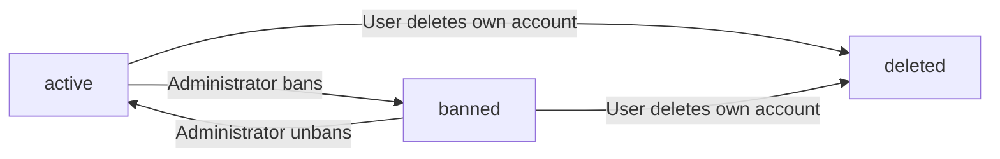

**Active State**

A user account becomes active immediately upon successful registration. An active account grants the user access to all features permitted by their role (customer or seller). For sellers, access to selling features depends on their seller approval status (defined in SellerApproval Concept).

**Banned State**

An administrator can place a user account into the banned state. While banned, the user cannot log in. Existing orders, reviews, and other historical records associated with the banned user remain unchanged. An administrator can restore a banned account back to the active state. Banning is available for both customer and seller accounts.

**Deleted State**

A user may delete their own account. The effects differ by role:

- **Customer deletion**: The customer's profile information (display name, phone number) is deleted. Their orders and order history are preserved for seller records and legal purposes. Their reviews are preserved but displayed as "deleted user." The customer's addresses are deleted.

- **Seller deletion**: A seller may only delete their account when they have no pending order items (in paid or shipped status) and no pending cancellation or refund requests. Upon deletion, the seller's products are deleted from listings, their profile information is removed, but order history and snapshots are preserved. The seller's shop name in past orders is preserved.

Once an account reaches the deleted state, it cannot be restored to active by the user or by an administrator. Historical records referencing the deleted user are retained according to the retention policies in 05-non-functional.

### Seller Approval Lifecycle

A seller approval request progresses through three states: **pending**, **approved**, and **rejected**.

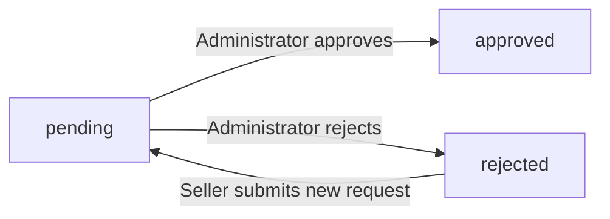

**Pending State**

When a seller registers, their approval request is created in the pending state. While pending, the seller cannot create products or access selling features. The seller can view their approval status.

**Approved State**

An administrator reviews the pending request and approves it. The seller gains full access to selling features: creating and managing products, processing orders, and responding to cancellation and refund requests.

**Rejected State**

An administrator reviews the pending request and rejects it. The administrator must provide a rejection reason. The seller can view the rejection reason. A rejected seller may submit a new registration request, which creates a new approval request in the pending state.

**Suspension (Separate from Approval)**

Separate from the approval lifecycle, an administrator may suspend an approved seller's account. When suspended:

- The seller's products are hidden from search and category listings
- The seller's products cannot be purchased
- The seller can still process existing orders (ship items, respond to cancellation and refund requests)
- The seller cannot create new products or edit existing products

An administrator can unsuspend the seller, restoring product visibility. Suspension and unsuspension occur outside the approval workflow and do not affect the approval status.

### Product and Variant Lifecycle

A product has three conceptual states from a visibility perspective: **active**, **hidden**, and **deleted**.

**Active State**

A product is active when it is created by a seller and not hidden or deleted. Active products appear in search results and category listings. A product must have at least one variant with stock to be purchasable; a product with no variants is visible but shown as "unavailable."

**Hidden State (Suspension)**

When an administrator suspends a seller, all of that seller's products enter the hidden state. Hidden products do not appear in search results or category listings and cannot be purchased. Existing order items for hidden products continue processing normally. Unsuspending the seller returns all products to the active state.

**Deleted State**

A seller may delete their own product only when there are no pending order items (paid or shipped status) for any variant of the product, and no pending cancellation or refund requests for any variant. An administrator may delete any product at any time. Upon deletion:

- The product and all its variants are deleted
- All inventory records for the product's variants are deleted
- The product no longer appears in search or category listings
- The product is automatically removed from all wishlists
- Product snapshots are preserved

**Variant Lifecycle**

A variant follows a similar pattern. A seller may delete a variant only when there are no pending order items for that variant and no pending cancellation or refund requests. Deleting a variant removes its inventory records. When stock quantity reaches zero, the variant is displayed as "out of stock" and cannot be added to the cart. This is a display state, not a deletion — the variant remains part of the product and becomes available again if stock is replenished.

### Order Item Lifecycle

Each order item progresses through its own lifecycle independently of other items in the same order. The lifecycle states are: **paid**, **shipped**, **delivered**, **cancelled**, and **refunded**.

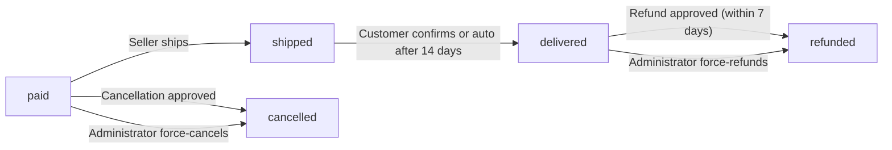

**Paid State**

An order item enters the paid state upon successful payment. In this state, the item awaits shipping by the seller. A customer may request cancellation of a paid item.

**Shipped State**

When a seller creates a shipment containing the item, the item transitions to the shipped state. The item now has associated tracking information shared with all items in the same shipment. Once shipped, the item can no longer be cancelled by the customer.

**Delivered State**

An item transitions to the delivered state when the customer confirms delivery of the shipment, or automatically after 14 days from the shipping date if the customer does not confirm. Once delivered, the customer may request a refund within 7 days.

**Cancelled State**

An item transitions to the cancelled state when a cancellation request is approved by the seller, or when an administrator force-cancels the item. The item's stock quantity is restored via an inventory record. A refund is processed for the cancelled item.

**Refunded State**

An item transitions to the refunded state when a refund request is approved by the seller, or when an administrator force-refunds the item. The item's stock quantity is restored via an inventory record. A refund is processed for the refunded item.

**Overall Order Status Derivation**

The overall order status is derived from its items:

- All items paid → order is "paid"
- Any item shipped (and none delivered) → order is "shipped"
- All items delivered → order is "delivered"
- All items cancelled → order is "cancelled"
- All items refunded → order is "refunded"
- Mixed states (e.g., some delivered, some refunded) → order is "partially completed"

### Cancellation Request Lifecycle

A cancellation request progresses through three states: **pending**, **approved**, and **rejected**.

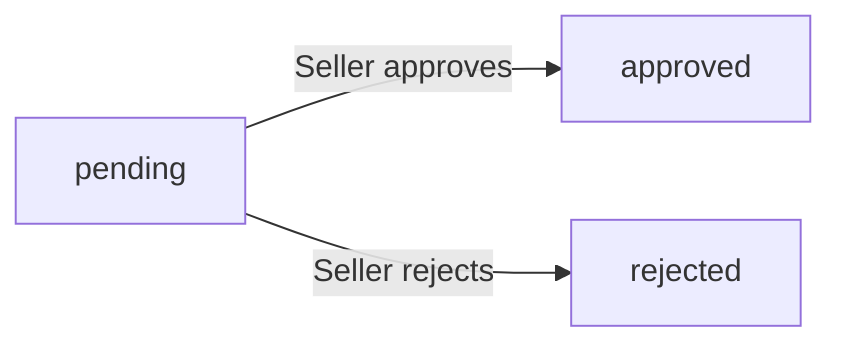

**Pending State**

A customer submits a cancellation request for an order item in the paid state, providing a reason. The request enters the pending state. The seller of that item is notified and can respond.

**Approved State**

When the seller approves the request, the order item transitions to the cancelled state. Stock quantities are restored, and a refund is processed for that item. A snapshot of the request is created at the time of the seller's response.

**Rejected State**

When the seller rejects the request, the order item remains in the paid state and continues processing normally. A snapshot of the request is created at the time of the seller's response.

Cancellation requests and their snapshots are preserved after resolution.

### Refund Request Lifecycle

A refund request progresses through three states: **pending**, **approved**, and **rejected**.

**Pending State**

A customer submits a refund request for an order item in the delivered state, provided the request is made within 7 days of delivery. The customer includes a reason. The request enters the pending state. The seller of that item is notified and can respond.

**Approved State**

When the seller approves the request, the order item transitions to the refunded state. Stock quantities are restored, and a refund is processed for that item. A snapshot of the request is created at the time of the seller's response.

**Rejected State**

When the seller rejects the request, the order item remains in the delivered state. A snapshot of the request is created at the time of the seller's response.

Refund requests and their snapshots are preserved after resolution.

### Review Lifecycle

A review has two primary states: **active** and **deleted**.

**Active State**

A review becomes active when a customer writes it for a product they have purchased and whose order item has reached the delivered state. A customer may write one review per product per order. Active reviews are displayed on the product detail page and contribute to the product's average rating.

A customer may edit their own active review. Each edit creates a snapshot preserving the previous content (rating and text). The review remains in the active state after editing.

**Deleted State**

A customer may delete their own review. A deleted review no longer appears on the product detail page and is excluded from the average rating calculation. Review snapshots created before deletion are preserved.

When a customer deletes their account, their reviews are preserved but displayed as "deleted user" — the review content remains, but the author is anonymized.

### Administrator Request Lifecycle

An administrator application request progresses through three states: **pending**, **approved**, and **rejected**.

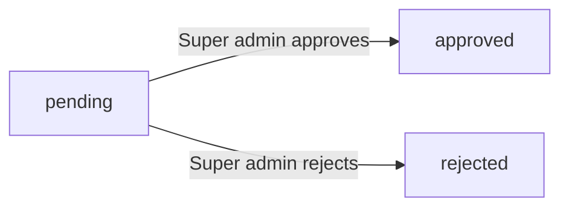

**Pending State**

Any user (customer or seller) may submit a request to become an administrator, providing a reason. The request enters the pending state. Super administrators can view the list of pending requests.

**Approved State**

A super administrator reviews and approves the request. The user becomes a regular administrator with access to administrative functions.

**Rejected State**

A super administrator reviews and rejects the request. The user remains in their current role.

**Administrator Promotion and Demotion**

A regular administrator can be promoted to super administrator by an existing super administrator. A super administrator can be demoted to regular administrator by another super administrator. A super administrator cannot demote themselves.

### Shipment Lifecycle

A shipment represents a physical package sent by a seller containing one or more order items. Its states are: **shipped** and **delivered**.

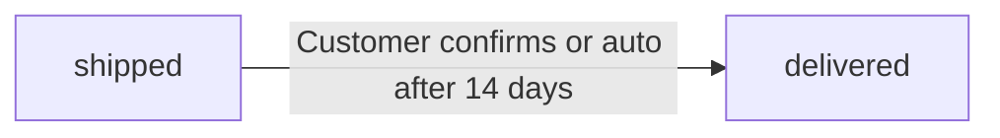

**Shipped State**

A shipment is created when a seller selects one or more of their order items to ship together, enters the carrier name and tracking number, and confirms. All items in the shipment immediately transition from paid to shipped state. The shipment enters the shipped state with a shipping timestamp.

**Delivered State**

The shipment transitions to delivered when the customer confirms receipt of the package, or automatically after 14 days from the shipping date. All items in the shipment transition to the delivered state at the same time.

### Snapshot Lifecycle

Snapshots are immutable historical records created whenever editable data is modified on the platform. Their lifecycle is unique: they have no state transitions.

**Creation**

A snapshot is created automatically when any of the following is modified:

| Entity Modified | What Is Captured |
|----------------|------------------|
| Product | Name, description, category, base price, images — plus snapshots of all variants at that moment |
| Product variant | SKU code, option values, price |
| Seller profile | Shop name, description, logo |
| Order item (at purchase) | Product, variant, and seller profile at time of order creation |
| Review | Rating, text content |
| Cancellation request | Reason, status changes |
| Refund request | Reason, status changes |

Each snapshot records: what entity was changed, when the change occurred, who made the change, and the values before and after the change.

**Immutability**

Once created, a snapshot cannot be modified or deleted by any user. Snapshots are preserved even after the original entity is deleted.

**Visibility**

Snapshots can be viewed by relevant parties:

- Owners (the seller or customer who made the change) can view snapshots of their own entities
- Administrators can view snapshots of any entity
- Snapshots support dispute resolution by providing an auditable trail of all changes

### Retention, Deletion Policy, and Recovery

This section provides a summary of what is preserved and what is removed when entities are deleted. Detailed retention periods, archival procedures, and recovery policies are defined in 05-non-functional.

**Preservation Rules**

When an entity is deleted, the following related data is preserved:

| Entity Deleted | Data Preserved |
|---------------|----------------|
| Customer account | Orders, order history, reviews (shown as "deleted user") |
| Seller account | Order history, snapshots, shop name in past orders |
| Product | Product snapshots, order items referencing the product (with snapshots), reviews |
| Product variant | Variant snapshots, order items referencing the variant (with snapshots) |
| Review | Review snapshots |
| Cancellation request | Request snapshots |
| Refund request | Request snapshots |

**Removal Rules**

When an entity is deleted, the following data is permanently removed:

| Entity Deleted | Data Removed |
|---------------|-------------|
| Customer account | Customer profile (display name, phone number), addresses |
| Seller account | Seller profile (shop name, description, logo), products and their variants, inventory records |
| Product | Product listing, all variants, all inventory records, wishlist references |
| Product variant | Variant listing, inventory records, cart references |
| Review | Review content from public display (no longer shown on product page) |

**Recovery Policy**

Deleted entities cannot be recovered by users themselves. Whether recovery is possible through administrator intervention is addressed in 05-non-functional.

**Automatic State Changes**

The platform enforces the following automatic lifecycle transitions without user action:

- Order items in the shipped state automatically transition to delivered after 14 days if the customer does not confirm delivery
- A product is automatically removed from all wishlists when deleted by the seller
- Items are removed from the customer's cart upon successful order placement
- Out-of-stock variants are marked as unavailable in the customer's cart

# Business Categories and State Flows

Business category classifications and state flow definitions.

## Business Category Definitions

Define all business category classifications with their allowed values and descriptions.

### User Role Classification

Every user on the platform belongs to exactly one role. The role determines what the user can do and how they are identified throughout the system.

**Allowed Values**

| Role | Description |
|------|-------------|
| Customer | A registered user who browses and purchases products. Each customer has a customer profile with a display name and phone number. |
| Seller | A registered user who operates a shop. Each seller has a seller profile with a shop name, description, and logo. Sellers require administrator approval before they can list products. |
| Administrator | A user with platform oversight privileges. Administrators can manage categories, review seller registrations, oversee orders, and manage user accounts. |
| Super Administrator | A higher grade of administrator with additional authority to approve or reject administrator requests and to promote or demote other administrators. |

Roles are mutually exclusive — a single user account cannot simultaneously be both a customer and a seller.

### Seller Approval Status

When a seller registers, their account enters an approval workflow managed by administrators. The approval status reflects where the seller is in this workflow.

**Allowed Values**

| Status | Description |
|--------|-------------|
| Pending | The seller has submitted their registration but an administrator has not yet reviewed it. The seller cannot list products while in this state. |
| Approved | An administrator has reviewed and accepted the seller's registration. The seller can now create products and operate their shop. |
| Rejected | An administrator has reviewed and declined the seller's registration. A rejection reason is provided. The seller cannot operate but may submit a new registration request. |

### Order Item Status

Each item within an order progresses through its own status independent of other items in the same order. An order item's status governs which actions are available for that item.

**Allowed Values**

| Status | Description |
|--------|-------------|
| Paid | Payment has been completed for this item. The seller has not yet shipped it. Cancellation can be requested while in this state. |
| Shipped | The seller has shipped this item as part of a shipment. Tracking information is available. The item is in transit to the customer. |
| Delivered | The customer has confirmed delivery, or 14 days have passed since shipping. A refund can be requested within 7 days of entering this state. |
| Cancelled | The item was cancelled — either by customer request approved by the seller, or by administrator action. Stock is restored and payment is refunded for this item. |
| Refunded | The item was refunded — either by customer request approved by the seller, or by administrator action. Stock is restored and payment is refunded for this item. |

### Order Status (Derived)

The overall order status is not set directly. It is derived from the statuses of all order items within the order.

**Allowed Values**

| Status | Derivation Rule |
|--------|----------------|
| Paid | All items in the order have status "paid". |
| Shipped | At least one item has status "shipped", no items have status "delivered", and not all items are cancelled or refunded. |
| Delivered | All items in the order have status "delivered". |
| Cancelled | All items in the order have status "cancelled". |
| Refunded | All items in the order have status "refunded". |
| Partially Completed | Items in the order have mixed terminal statuses — for example, some delivered and some refunded, or some cancelled and some delivered. |

### Request Status Classification

Cancellation requests, refund requests, and administrator application requests share a common status model. Each request type uses the same three status values.

**Allowed Values**

| Status | Description |
|--------|-------------|
| Pending | The request has been submitted and is awaiting a response from the responsible party (seller for cancellation and refund requests, super administrator for admin requests). |
| Approved | The responsible party has accepted the request. The action associated with the request is carried out (cancellation, refund, or administrator promotion). |
| Rejected | The responsible party has declined the request. No action is taken. For seller registrations, the rejected seller may submit a new request. |

Each request includes a reason written by the requester and, when responded to, a snapshot of the request state is preserved.

### Product Availability Classification

A product's availability determines whether customers can purchase it and how it appears in listings.

**Allowed Values**

| Classification | Description |
|----------------|-------------|
| Available | The product has at least one variant with stock greater than zero and is not hidden or deleted. It appears in search and category listings and can be purchased. |
| Out of Stock | The product has at least one variant but all variants have zero stock. It appears in listings but is marked as "out of stock" and variants cannot be added to cart. |
| Unavailable | The product has no variants at all. It appears in search results but is shown as "unavailable" and cannot be purchased. |

Additionally, a product is hidden from search and category listings if its seller is suspended or if an administrator has deleted the product.

### User Account Status

A user account's status governs whether the user can access the platform.

**Allowed Values**

| Status | Description |
|--------|-------------|
| Active | The user is in good standing and can log in and use the platform according to their role. |
| Banned | An administrator has banned the user. The user cannot log in. For sellers, existing orders remain and must still be processed. |
| Deleted | The user has deleted their own account. For customers, profile information is removed but orders and reviews are preserved (reviews shown as "deleted user"). For sellers, products are removed but order history and shop name in past orders are preserved. |

## State Transitions

Define valid state transition paths for stateful concepts.

### Seller Approval State Flow

The seller approval process governs whether a seller can access selling features on the platform.

**States:**
- **pending**: The seller has submitted a registration request and is awaiting administrator review.
- **approved**: An administrator has approved the seller, granting full selling capabilities.
- **rejected**: An administrator has rejected the seller, along with a rejection reason.

**Transition Rules:**
- A new seller registration always begins in the "pending" state.
- An administrator can move a "pending" approval to "approved."
- An administrator can move a "pending" approval to "rejected," providing a rejection reason.
- A "rejected" seller can submit a new registration request, which creates a new approval record in the "pending" state.
- Once "approved," the seller cannot be moved back to "pending" or "rejected" through this flow (suspension is a separate concern).

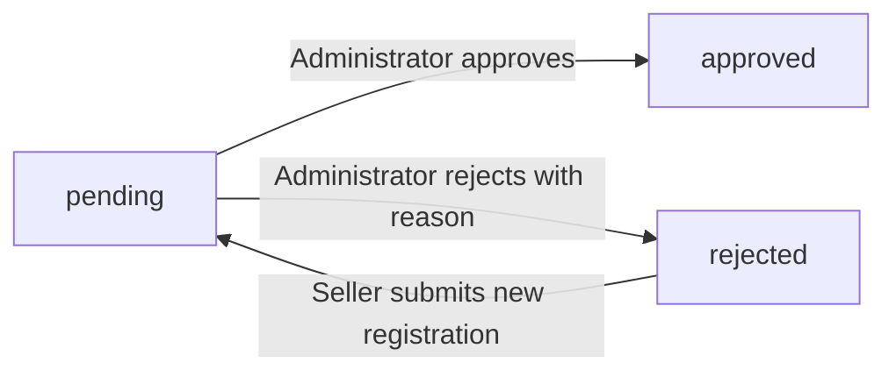

### Order Item State Flow

Each order item follows its own lifecycle independently of other items in the same order.

**States:**
- **paid**: Payment has been completed; the item is waiting for the seller to ship.
- **shipped**: The seller has shipped the item as part of a shipment.
- **delivered**: The item has been delivered to the customer.
- **cancelled**: The item was cancelled before shipping, and payment has been refunded.
- **refunded**: The item was delivered and later refunded after a refund request was approved.

**Transition Rules:**
- An order item starts in the "paid" state upon successful payment.
- From "paid," the item can transition to "shipped" when the seller includes it in a shipment.
- From "paid," the item can transition to "cancelled" if a cancellation request is approved.
- From "shipped," the item can transition to "delivered" when the customer confirms delivery or the 14-day auto-delivery period elapses.
- From "delivered," the item can transition to "refunded" if a refund request is approved (within the 7-day refund window).
- Once in "cancelled," "refunded," or "delivered" (without a refund), the item has reached a terminal state and cannot transition further.

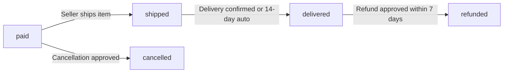

### Order State Derivation Flow

The overall order status is not independently set; it is derived from the states of all order items within the order. The derivation follows these rules:

**Derived States:**
- **paid**: All items in the order have the "paid" status.
- **shipped**: At least one item is "shipped" and no item has reached "delivered" or beyond.
- **delivered**: All items in the order have the "delivered" status.
- **cancelled**: All items in the order have the "cancelled" status.
- **refunded**: All items in the order have the "refunded" status.
- **partially completed**: The order contains items in mixed states (for example, some "delivered" and some "refunded," or some "cancelled" and some "delivered").

**Recalculation:**
- The order status is recalculated every time any order item changes status.
- The order status is read-only from the customer and seller perspective; it cannot be manually changed.

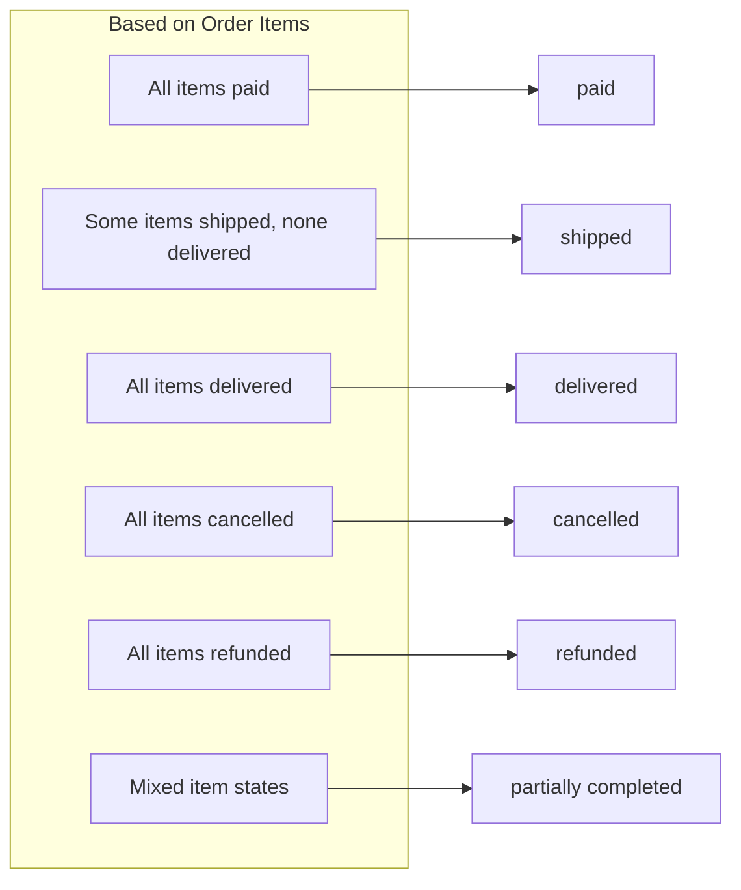

### Cancellation Request State Flow

A cancellation request is created by a customer for a specific order item and is subject to seller review.

**States:**
- **pending**: The customer has submitted a cancellation request and is awaiting the seller's response.
- **approved**: The seller has approved the cancellation; the item is cancelled and refunded.
- **rejected**: The seller has rejected the cancellation; the item continues in its current state.

**Transition Rules:**
- A request is created in the "pending" state.
- The seller can move a "pending" request to "approved." When approved, the order item transitions to "cancelled," stock is restored, and a refund is processed.
- The seller can move a "pending" request to "rejected." The order item remains unchanged.
- When the seller responds (approve or reject), a snapshot of the request state is created.
- "Approved" and "rejected" are terminal states; the request cannot be changed after the seller responds.

### Refund Request State Flow

A refund request is created by a customer for a delivered order item and is subject to seller review.

**States:**
- **pending**: The customer has submitted a refund request and is awaiting the seller's response.
- **approved**: The seller has approved the refund; the item is refunded.
- **rejected**: The seller has rejected the refund; the item remains delivered.

**Transition Rules:**
- A request is created in the "pending" state.
- The seller can move a "pending" request to "approved." When approved, the order item transitions to "refunded" and stock is restored.
- The seller can move a "pending" request to "rejected." The order item remains in "delivered" status.
- When the seller responds (approve or reject), a snapshot of the request state is created.
- "Approved" and "rejected" are terminal states.

### Administrator Request State Flow

Any user (customer or seller) can apply to become an administrator. Super administrators review these applications.

**States:**
- **pending**: The user has submitted an administrator application and is awaiting review.
- **approved**: A super administrator has approved the application; the user becomes a regular administrator.
- **rejected**: A super administrator has rejected the application.

**Transition Rules:**
- A new application starts in the "pending" state.
- A super administrator can move a "pending" application to "approved." The user gains regular administrator privileges.
- A super administrator can move a "pending" application to "rejected." The user remains in their current role.
- "Approved" and "rejected" are terminal states.

### User Account State Flow

A user account can be active, banned, or deleted. These states affect login capability.

**States:**
- **active**: The user can log in and use platform features according to their role.
- **banned**: An administrator has banned the user; the user cannot log in.
- **deleted**: The user has permanently deleted their account, or the account was removed.

**Transition Rules:**
- A newly registered user starts as "active."
- An administrator can move an "active" user to "banned."
- An administrator can move a "banned" user back to "active" (unban).
- A customer can delete their own account, moving from "active" to "deleted."
- A seller can delete their own account only if they have no pending order items and no pending cancellation or refund requests, moving from "active" to "deleted."
- "Deleted" is a terminal state; it cannot be reversed.
- When a user is deleted, their profile information is removed, but orders, reviews (shown as "deleted user"), and snapshots are preserved.

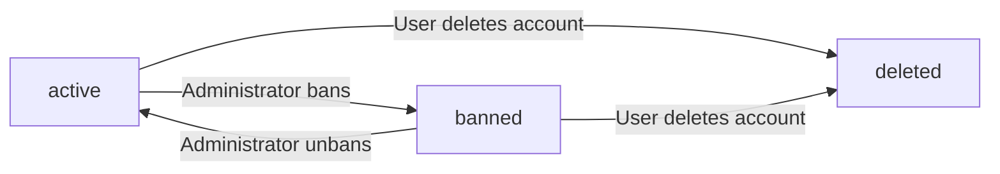

### Seller Suspension State Flow

A seller account can be suspended by an administrator independently of the user account state.

**States:**
- **active**: The seller operates normally; their products are visible and purchasable.
- **suspended**: The seller's products are hidden from search and category listings, cannot be purchased, and the seller cannot create or edit products. However, the seller can still process existing orders (ship items, respond to cancellation and refund requests).

**Transition Rules:**
- An approved seller starts as "active."
- An administrator can move an "active" seller to "suspended."
- An administrator can move a "suspended" seller back to "active" (unsuspend). Products become visible and purchasable again.
- Suspension does not affect the seller's ability to log in or manage their account.

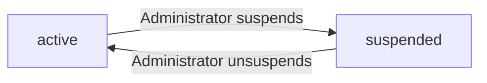

### Product and Variant State Flow

Products and variants can exist in visible, hidden, or deleted states.

**Product States:**
- **visible**: The product appears in search results and category listings and can be purchased (if it has at least one variant with stock).
- **hidden**: The product is hidden from search and category listings (due to seller suspension or administrator action) but still exists in the system.
- **deleted**: The product has been permanently removed from listings. The product, its variants, and inventory records are deleted. Existing snapshots are preserved.

**Product Transition Rules:**
- A newly created product starts as "visible."
- When the seller is suspended, all their products become "hidden."
- When the seller is unsuspended, all their products become "visible" again.
- A seller can delete their own product only if no variant has pending order items (paid or shipped) and no variant has pending cancellation or refund requests. The product then becomes "deleted."
- An administrator can delete any product for policy violations, moving it directly to "deleted."
- "Deleted" is a terminal state.

**Variant States:**
- **available**: The variant can be added to cart and purchased.
- **out of stock**: The variant's stock quantity is zero; it appears in product listings but cannot be added to cart.
- **deleted**: The variant has been permanently removed.

**Variant Transition Rules:**
- A newly created variant starts with a stock quantity of 0, making it "out of stock."
- When stock is added (via restocking), the variant becomes "available."
- When stock reaches 0 (via orders or adjustments), the variant becomes "out of stock."
- A seller can delete a variant only if it has no pending order items and no pending cancellation or refund requests. The variant then becomes "deleted."
- "Deleted" is a terminal state.

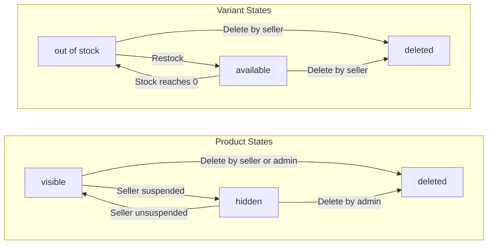

### Shipment State Flow

A shipment represents a physical package sent by a seller containing one or more order items.

**States:**
- **shipped**: The seller has created the shipment with tracking information; all items in the shipment have transitioned to "shipped."
- **delivered**: The customer has confirmed delivery or the 14-day auto-delivery period has elapsed; all items in the shipment have transitioned to "delivered."

**Transition Rules:**
- A shipment is created in the "shipped" state (there is no pre-shipment state).
- The shipment moves to "delivered" when the customer confirms delivery for that shipment.
- If the customer does not confirm, the shipment automatically moves to "delivered" after 14 days from the shipping date.
- "Delivered" is a terminal state.

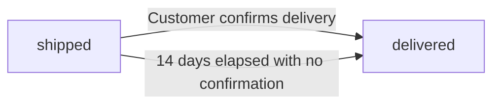

### Review State Flow

Reviews can be active or deleted, with snapshots preserved on edit.

**Review States:**
- **active**: The review is visible on the product detail page.
- **deleted**: The review has been removed from public display, but its snapshot is preserved.

**Transition Rules:**
- A newly written review starts as "active."
- The customer who wrote the review can delete it, moving it to "deleted."
- "Deleted" is a terminal state.
- When a review is edited, a snapshot of the previous version is created, but the review remains "active."
- Deleted reviews do not contribute to the product's average rating calculation.

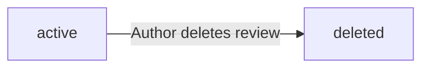

### Snapshot Immutability

Snapshots follow a distinct lifecycle: they are created once and never modified.

**Snapshot Lifecycle:**
- A snapshot is created at the moment editable data is modified.
- Once created, a snapshot is immutable — it cannot be edited or deleted by any user, including administrators.
- Snapshots record: when the change occurred, who made the change, and the values before and after the change.
- Snapshots are preserved even if the original entity is deleted (for example, product snapshots survive product deletion).
- Relevant parties — owners and administrators — can view snapshots for dispute resolution.

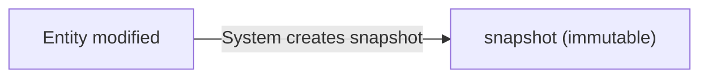