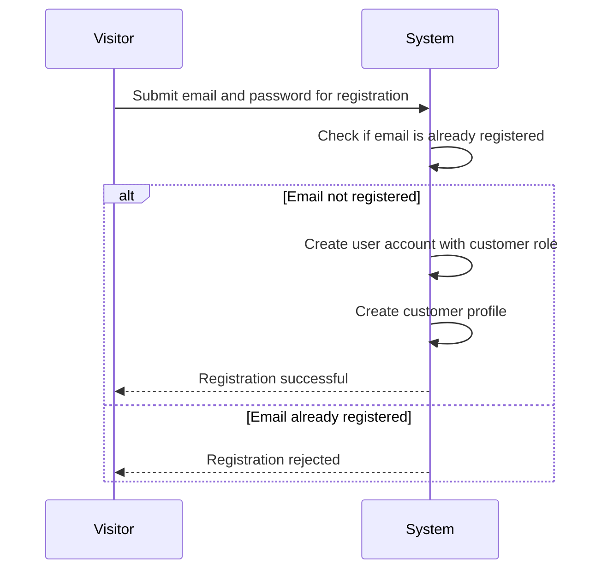
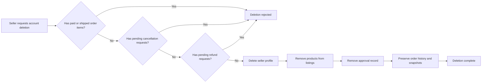
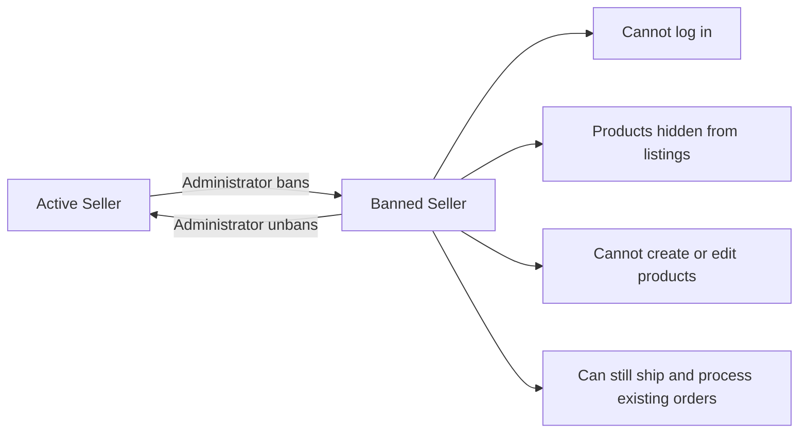
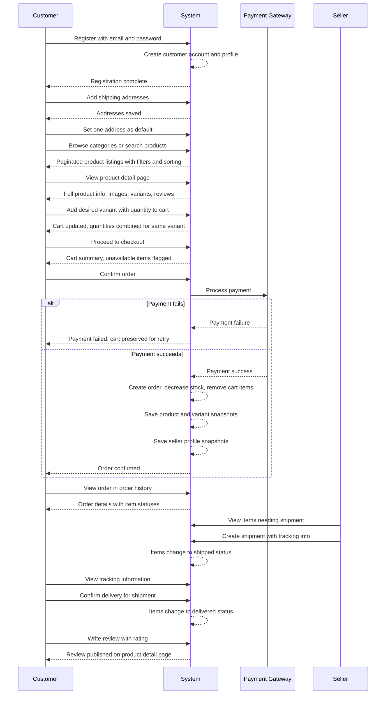
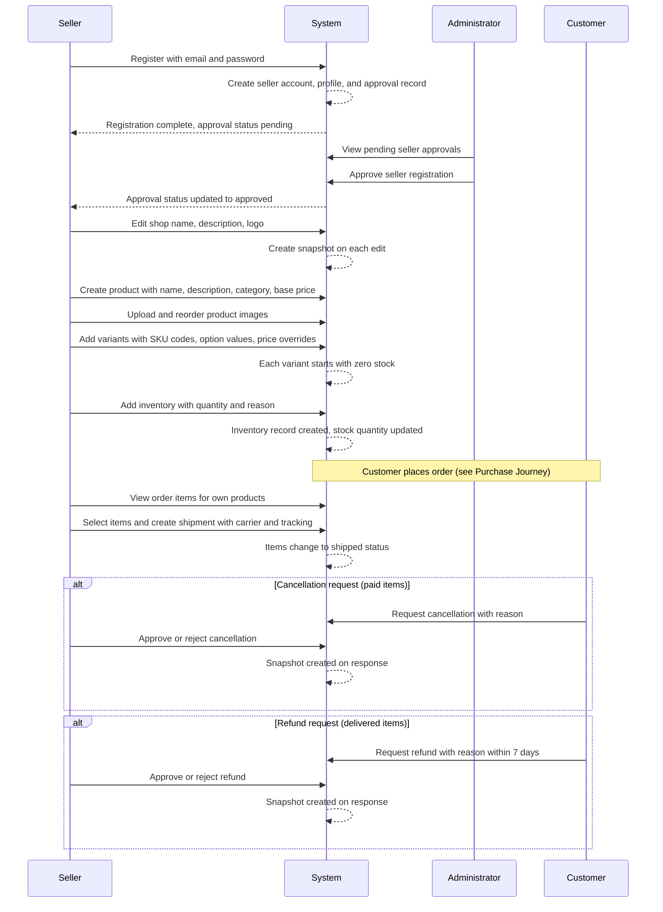
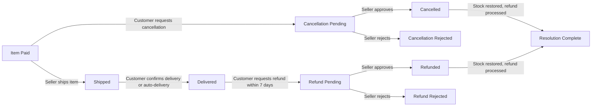
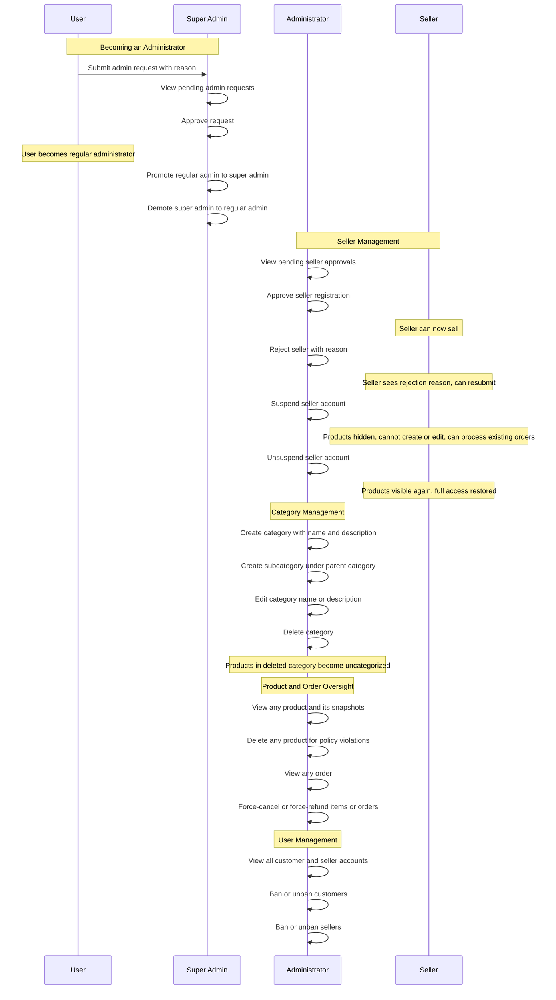
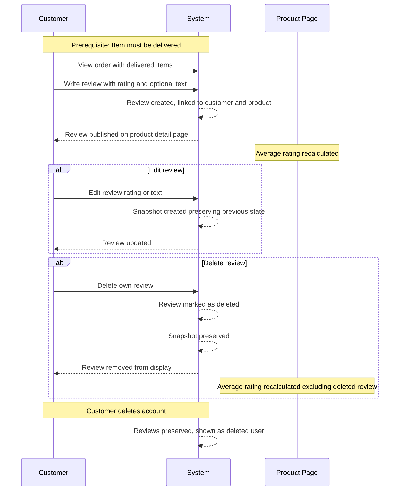

**shoppingMall — What operations users can perform, use cases, business workflows**

What operations users can perform, use cases, business workflows

# Core Business Operations

What the system must do for each business concept.

## User Operations

Users must register before accessing any platform features — there is no guest browsing. Customers register with an email and password, and sellers also register with an email and password. After registration, users log in using their email and password credentials. Once authenticated, users can change their password at any time. Customers can delete their own account; when they do, their profile information is permanently removed, but their orders and order history are preserved for seller records and legal purposes, and their reviews remain visible but are shown as authored by a deleted user. Sellers can delete their account only when they have no pending orders in paid or shipped status and no pending cancellation or refund requests. When a seller deletes their account, their products are removed from listings, but order history and snapshots are preserved, and their shop name in past orders is retained. Administrators can view all customer and seller accounts on the platform. Administrators can ban customers, preventing them from logging in, and can also unban customers. Similarly, administrators can ban and unban seller accounts; banned sellers cannot log in but their existing orders remain unaffected.

### Customer Registration

THE system SHALL allow a visitor to register as a customer by providing an email address and a password.

THE system SHALL reject the registration if the email address is already registered on the platform.

WHEN registration succeeds, THE system SHALL create a new user account with a customer role and automatically create a customer profile (defined in CustomerProfile Operations). The new customer is immediately able to log in and use all customer-facing features.

### Seller Registration

THE system SHALL allow a visitor to register as a seller by providing an email address and a password.

THE system SHALL reject the registration if the email address is already registered on the platform.

WHEN registration succeeds, THE system SHALL create a new user account with a seller role, automatically create a seller profile (defined in SellerProfile Operations), and automatically create a seller approval record with a status of "pending" (defined in SellerApproval Operations).

WHILE the seller approval status is "pending" or "rejected," THE system SHALL prevent the seller from creating products or selling on the platform. The seller can log in but cannot access seller-specific features until an administrator approves their registration.

### Login

THE system SHALL authenticate a registered user when they provide a matching email address and password.

WHEN the credentials match, THE system SHALL grant the user access to features appropriate to their role.

IF the email address is not found, THEN THE system SHALL reject the login.

IF the password does not match the stored credentials, THEN THE system SHALL reject the login.

IF the user account has been banned, THEN THE system SHALL reject the login regardless of whether the credentials are correct.

### Password Change

THE system SHALL allow an authenticated user to change their password.

To change the password, the user must provide their current password and a new password.

THE system SHALL verify that the current password matches the stored password before proceeding.

IF the current password is incorrect, THEN THE system SHALL reject the change.

WHEN the password change succeeds, THE system SHALL require the new password for all subsequent login attempts.

### Customer Account Deletion

THE system SHALL allow a customer to delete their own account at any time.

WHEN a customer deletes their account, THE system SHALL permanently remove:

- The customer's profile information (display name and phone number)
- The customer's shipping addresses
- The customer's wishlist items
- The customer's cart items

WHEN a customer deletes their account, THE system SHALL preserve:

- The customer's orders and order history for seller records and legal purposes
- The customer's reviews, which SHALL be displayed as authored by a "deleted user" with the review content, ratings, and snapshots remaining intact

After deletion, the customer can no longer log in. Data retention and recovery policies are defined in 05-non-functional.md.

### Seller Account Deletion

THE system SHALL allow a seller to delete their own account only when all of the following conditions are met:

- The seller has no order items in "paid" or "shipped" status for any of their products
- The seller has no pending cancellation requests for any of their order items
- The seller has no pending refund requests for any of their order items

IF any of these conditions is not met, THEN THE system SHALL reject the deletion. The seller must resolve all pending items before retrying.

WHEN a seller deletes their account, THE system SHALL:

- Remove the seller's profile information (shop name, shop description, and logo)
- Remove all of the seller's products from listings, including their images, variants, and inventory records
- Remove the seller's products from search results, category listings, and customer wishlists
- Remove the seller's approval record
- Preserve the seller's order history and snapshots for legal and record-keeping purposes
- Preserve the seller's shop name in past order records so that historical order records remain complete

### Administrator Viewing Customer Accounts

THE system SHALL allow an administrator to view a paginated list of all customer accounts on the platform.

The list SHALL include each customer's email address, display name, registration date, and ban status.

THE system SHALL allow an administrator to view the full details of a specific customer account, including the customer's profile information, order history, and reviews.

Viewing customer accounts does not modify any data. This operation is available to both regular administrators and super administrators.

### Administrator Viewing Seller Accounts

THE system SHALL allow an administrator to view a paginated list of all seller accounts on the platform.

The list SHALL include each seller's email address, shop name, approval status, registration date, and ban status.

THE system SHALL allow an administrator to view the full details of a specific seller account, including the seller's profile information, product listings, order items for their products, and snapshot history.

Viewing seller accounts does not modify any data. This operation is available to both regular administrators and super administrators.

### Customer Ban and Unban

THE system SHALL allow an administrator to ban a customer account.

WHEN a customer is banned, THE system SHALL:

- Prevent the banned customer from logging in. Any login attempt is rejected.
- Preserve existing orders belonging to the banned customer without modification.
- Keep the banned customer's reviews visible on product pages.

THE system SHALL allow an administrator to unban a previously banned customer.

WHEN a customer is unbanned, THE system SHALL restore the customer's ability to log in and use all customer-facing features as before.

The ban and unban actions are available to both regular administrators and super administrators.

### Seller Ban and Unban

THE system SHALL allow an administrator to ban a seller account.

WHEN a seller is banned, THE system SHALL:

- Prevent the banned seller from logging in. Any login attempt is rejected.
- Hide the banned seller's products from search results and category listings, making them unavailable for purchase by customers.
- Prevent the banned seller from creating new products, editing existing products, or managing their shop profile.
- Preserve the banned seller's existing orders without modification.
- Allow the banned seller to continue processing existing orders — they can ship items and respond to pending cancellation and refund requests. This ensures customers with active orders are not harmed by the seller's ban.

THE system SHALL allow an administrator to unban a previously banned seller.

WHEN a seller is unbanned, THE system SHALL:

- Restore the seller's ability to log in.
- Make the seller's products visible again in search results and category listings.
- Restore the seller's ability to create new products, edit existing products, and manage their shop profile.

The ban and unban actions are available to both regular administrators and super administrators.

## CustomerProfile Operations

Each customer has a profile that stores their display name and phone number. The profile is created automatically when a customer registers for an account. Customers can view their own profile to see their current display name and phone number. Customers can edit both their display name and phone number at any time through the profile editing feature. The display name is the public identity shown to other users on the platform, such as in reviews and order records. The phone number serves as a contact method for order-related communications. Customers cannot delete their profile independently — profile information is only removed when the customer deletes their entire account. When a customer deletes their account, the profile information is permanently deleted, though their orders and reviews are preserved under a deleted user designation.

### Automatic Profile Creation

THE shoppingMall SHALL automatically create a customer profile upon successful customer registration. The profile SHALL be associated with the registering customer's account. The profile SHALL be created with initially blank display name and phone number fields, which the customer can populate later through profile editing. The display name SHALL be required for a complete profile but is not required at the moment of profile creation. The profile SHALL be permanently linked to the customer's account for the lifetime of that account.

### Profile Viewing

THE shoppingMall SHALL allow a customer to view their own profile at any time while logged in. WHEN a customer requests to view their profile, THE shoppingMall SHALL display the current display name, phone number, and the email address associated with the account. THE shoppingMall SHALL NOT allow other customers to view another customer's profile information.

### Editing Profile Information

THE shoppingMall SHALL allow a customer to edit their own display name at any time while logged in. WHEN a customer submits an edit to their display name, THE shoppingMall SHALL update the display name to the new value. IF the customer submits a blank display name, THEN the shoppingMall SHALL reject the change and retain the previous display name. THE shoppingMall SHALL allow a customer to edit their own phone number at any time while logged in. WHEN a customer submits an edit to their phone number, THE shoppingMall SHALL update the phone number to the new value. The customer MAY edit the display name and phone number together in a single operation or independently.

### Display Name as Public Identity

THE shoppingMall SHALL display the customer's display name as their public identity wherever the customer's identity is shown to other users on the platform — including as the author of product reviews and as the customer name on order records visible to sellers fulfilling those orders. WHEN a customer deletes their account, THE shoppingMall SHALL replace the display name with the designation "deleted user" on all reviews authored by that customer, while preserving the review content and ratings. The phone number SHALL be used solely for order-related communications between the seller and the customer.

### Profile Deletion Tied to Account Deletion

THE shoppingMall SHALL delete a customer's profile information only when the customer deletes their entire account. WHEN a customer initiates account deletion, THE shoppingMall SHALL permanently remove the display name and phone number associated with the profile. THE shoppingMall SHALL NOT provide a standalone operation for deleting a profile independent of account deletion. Orders placed by the customer SHALL be preserved after profile deletion, retaining the order data for seller records and legal purposes. Reviews authored by the customer SHALL be preserved after profile deletion, with the display name replaced by "deleted user".

## SellerProfile Operations

Each seller has a profile containing their shop name, shop description, and logo image. The seller profile is created when a seller registers, though sellers cannot begin selling until their account is approved by an administrator. Sellers can view their own shop profile to see current information. Sellers can edit their shop name, shop description, and logo image at any time. Every edit to the seller profile creates an immutable snapshot that records the previous state, including when the change was made and the values before and after the modification. Customers can view seller profiles to learn about the shop behind the products they are considering. The seller profile information — shop name and logo — is also captured in order item snapshots at the time of purchase, preserving what the buyer saw when they made the purchase. When a seller deletes their account, their profile is removed but the shop name in past orders is preserved through those order item snapshots.

### Seller Profile Creation

WHEN a seller completes registration, THE shopping mall SHALL automatically create a seller profile containing the shop name, shop description, and logo image provided during registration.

WHILE a seller's account has not received administrator approval, THE shopping mall SHALL prevent the seller from creating products, editing products, or selling any goods on the platform. The seller profile remains visible to the seller but the seller has no selling capabilities until approval is granted.

THE shopping mall SHALL allow the seller to view their own profile at any time, including during the pending approval period.

### Seller Profile Editing

THE shopping mall SHALL allow sellers to update their shop name at any time.

IF the shop name is blank or empty, THEN the shopping mall SHALL reject the update and retain the existing shop name.

THE shopping mall SHALL allow sellers to update their shop description at any time. A shop description may be left empty.

THE shopping mall SHALL allow sellers to upload or replace their logo image at any time.

IF a logo image upload fails, THEN the shopping mall SHALL retain the existing logo image. The seller profile SHALL continue to display the previously uploaded logo until a successful replacement occurs.

WHEN a seller edits any profile field — shop name, shop description, or logo image — THE shopping mall SHALL create a snapshot of the profile state before the change is applied.

THE shopping mall SHALL allow a seller to edit multiple profile fields in a single update. WHEN multiple fields are edited together, THE shopping mall SHALL create one snapshot capturing the before state of all changed fields.

### Seller Profile Snapshots

WHEN a seller profile edit occurs, THE shopping mall SHALL create an immutable snapshot recording the previous state of the edited fields.

THE shopping mall SHALL record in each seller profile snapshot: which entity was changed (the seller profile), what specific fields were modified, the values of those fields before the change, the values of those fields after the change, when the change occurred, and which user made the change.

THE shopping mall SHALL prevent any modification or deletion of seller profile snapshots. Snapshots are permanent records that cannot be altered once created.

THE shopping mall SHALL allow a seller to view the snapshots of their own seller profile for dispute resolution or audit purposes.

THE shopping mall SHALL allow administrators to view snapshots of any seller profile on the platform for oversight purposes.

### Viewing Seller Profiles

THE shopping mall SHALL allow customers to view any seller's profile. The profile page SHALL display the seller's shop name, shop description, and logo image.

THE shopping mall SHALL display the seller's shop name alongside every product in search results and product listings.

THE shopping mall SHALL display the seller's shop name on the product detail page, with the shop name serving as a link to the seller's full profile page.

WHEN a customer views a seller's profile, THE shopping mall SHALL show the current shop name, description, and logo as of that moment. Snapshots of previous profile states are not visible to customers.

### Seller Profile in Order History

WHEN an order is placed and payment succeeds, THE shopping mall SHALL capture a snapshot of each seller's profile — including the shop name and logo image — and store it with the corresponding order item at the time of purchase.

THE shopping mall SHALL preserve the seller profile snapshot within each order item permanently. This ensures that the buyer sees the same shop name and logo they saw when making the purchase, regardless of any subsequent profile changes the seller makes.

IF a seller later changes their shop name or logo image, THEN the shopping mall SHALL NOT update any previously captured order item snapshots. Historical order records SHALL continue to display the shop name and logo as they were at the time of each purchase.

THE shopping mall SHALL allow customers to view the seller profile snapshot (shop name and logo) within the details of their past orders.

THE shopping mall SHALL allow sellers to view their own historical profile information as captured in order item snapshots for orders containing their products.

### Seller Profile Deletion

WHEN a seller deletes their account, THE shopping mall SHALL remove the seller profile, including the shop name, shop description, and logo image.

THE shopping mall SHALL NOT remove the seller's shop name from past order item snapshots when the seller deletes their account. The preserved shop name in order history remains visible to customers who purchased from that seller.

THE shopping mall SHALL preserve all seller profile snapshots created during the seller's lifetime, even after the seller deletes their account. These snapshots remain accessible to administrators for audit and dispute resolution purposes.

IF a seller deletes their account, THEN the shopping mall SHALL ensure that the seller's previously sold products and associated order histories remain intact, with the shop name preserved in those records through the order item snapshots.

## SellerApproval Operations

When a seller registers, their account is not immediately active for selling — it must go through an administrator approval process. A seller approval record is created automatically upon seller registration and has a status of pending. Sellers can view their own approval status at any time to see whether it is pending, approved, or rejected. Administrators can view the full list of pending seller approvals and review each registration. Administrators can approve a seller registration, which changes the status to approved and allows the seller to begin listing products and selling on the platform. Administrators can also reject a seller registration, but they must provide a rejection reason explaining why the registration was denied. When rejected, sellers can view the rejection reason so they understand what needs to be addressed. Rejected sellers are allowed to submit a new registration request, which creates a new approval record and restarts the review process. Administrators can also suspend seller accounts after they have been approved, which hides their products from search and category listings and prevents new purchases. Suspended sellers can still process existing orders — they can ship items and respond to cancellation and refund requests — but they cannot create new products or edit existing ones. Administrators can unsuspend seller accounts to restore their products to visibility.

### Automatic Seller Approval Record Creation

WHEN a seller completes registration, THE shopping mall SHALL automatically create a seller approval record for that seller with an approval status of "pending".

WHILE a seller's approval status is "pending", THE shopping mall SHALL prevent that seller from creating products, managing variants, managing inventory, or listing items for sale.

THE shopping mall SHALL allow sellers whose approval status is "pending" to log in, access their account, view their profile, and manage their account settings.

### Seller Viewing Own Approval Status and Rejection Reason

THE shopping mall SHALL allow a seller to view their own approval status at any time.

WHEN a seller views their approval status, THE shopping mall SHALL display one of the following values: "pending", "approved", or "rejected".

IF the approval status is "rejected", THEN THE shopping mall SHALL display the rejection reason provided by the administrator.

IF the approval status is "pending" or "approved", THEN THE shopping mall SHALL not display any rejection-related information.

### Administrator Reviewing Pending Seller Approvals

THE shopping mall SHALL allow administrators to view the full list of seller approval records that have an approval status of "pending".

WHEN viewing pending seller approvals, THE shopping mall SHALL display each seller's registration details for review, including the seller's shop name, the seller's email address, and the date the approval record was submitted.

### Administrator Approving Seller Registration

THE shopping mall SHALL allow administrators to approve a seller registration that has an approval status of "pending".

WHEN an administrator approves a seller registration, THE shopping mall SHALL change the approval record status to "approved" and record the date and time of the approval.

WHEN a seller's approval status becomes "approved", THE shopping mall SHALL allow that seller to create products, manage variants, manage inventory, and sell on the platform.

### Administrator Rejecting Seller Registration

THE shopping mall SHALL allow administrators to reject a seller registration that has an approval status of "pending".

WHEN an administrator rejects a seller registration, THE shopping mall SHALL require a rejection reason to be provided.

IF the administrator attempts to reject a seller registration without providing a rejection reason, THEN THE shopping mall SHALL reject the action and require a reason to proceed.

WHEN a rejection is processed, THE shopping mall SHALL change the approval record status to "rejected", store the rejection reason, and record the date and time of the rejection.

### Rejected Seller Submitting New Registration Request

THE shopping mall SHALL allow a seller whose approval status is "rejected" to submit a new registration request.

WHEN a rejected seller submits a new registration request, THE shopping mall SHALL create a new seller approval record with an approval status of "pending".

THE shopping mall SHALL preserve the previous rejected approval record and its rejection reason for historical reference.

WHEN the new approval record is created, THE shopping mall SHALL restart the administrator review process for that seller.

### Seller Account Suspension

THE shopping mall SHALL allow administrators to suspend a seller account that has been previously approved.

WHEN a seller account is suspended, THE shopping mall SHALL hide all products from that seller in search results and category listings.

WHEN a seller account is suspended, THE shopping mall SHALL prevent new purchases of products from that seller.

WHILE a seller is suspended, THE shopping mall SHALL prevent that seller from creating new products.

WHILE a seller is suspended, THE shopping mall SHALL prevent that seller from editing any of their existing products.

WHILE a seller is suspended, THE shopping mall SHALL prevent that seller from adding, editing, or deleting product variants.

THE shopping mall SHALL still allow a suspended seller to process existing orders, including shipping items and responding to cancellation requests.

THE shopping mall SHALL still allow a suspended seller to respond to refund requests for items that were delivered prior to or during the suspension period.

THE shopping mall SHALL still allow a suspended seller to log in, access their seller dashboard, and view their order management features.

### Seller Account Unsuspension

THE shopping mall SHALL allow administrators to unsuspend a previously suspended seller account.

WHEN a seller account is unsuspended, THE shopping mall SHALL restore all of that seller's products to visibility in search results and category listings.

WHEN a seller account is unsuspended, THE shopping mall SHALL restore that seller's ability to create new products.

WHEN a seller account is unsuspended, THE shopping mall SHALL restore that seller's ability to edit existing products and manage variants.

WHEN products become visible again after unsuspension, THE shopping mall SHALL make those products available for purchase once more.

## Address Operations

Customers can add multiple shipping addresses to their account for use during checkout. Each address contains the recipient name, phone number, street address, city, state or province, postal code, and country. Customers can view a list of all their saved addresses at any time. Customers can edit any of their existing addresses to update details such as a changed phone number or new street address. Customers can delete addresses they no longer need, removing them from their account. One address can be designated as the default shipping address, which is automatically selected during checkout for convenience. Customers can change which address is the default at any time. During the checkout process, customers must select a shipping address — either the default or another saved address — before placing the order. Once an order is placed, the shipping address associated with that order cannot be changed.

### Adding a Shipping Address

THE system SHALL allow a customer to add a shipping address to their account.

WHEN a customer provides all required address fields, THE system SHALL create a new shipping address associated with that customer.

Each shipping address SHALL include the following fields:
- Recipient name (required)
- Phone number (required)
- Street address (required)
- City (required)
- State or province (required)
- Postal code (required)
- Country (required)

IF a required field is missing, THEN THE system SHALL reject the request.

THE system SHALL allow a customer to add multiple shipping addresses to their account.

IF the customer has no existing addresses, THEN THE system SHALL automatically set the newly added address as the default shipping address.

IF the customer already has a default address, THEN adding a new address SHALL NOT change the existing default designation.

### Viewing Saved Addresses

THE system SHALL allow a customer to view a list of all shipping addresses saved to their account.

The list SHALL display for each address:
- Recipient name
- Phone number
- Street address
- City
- State or province
- Postal code
- Country
- Whether the address is the default shipping address

THE system SHALL display the default shipping address with a visual indicator distinguishing it from other addresses.

IF the customer has no saved addresses, THEN THE system SHALL indicate that no addresses are on file.

### Editing an Address

THE system SHALL allow a customer to edit any of their existing shipping addresses.

WHEN a customer updates one or more fields of an existing address, THE system SHALL save the changes and retain the updated values.

Each editable field SHALL be individually modifiable:
- Recipient name
- Phone number
- Street address
- City
- State or province
- Postal code
- Country

IF a required field is cleared or left blank during editing, THEN THE system SHALL reject the edit request and retain the previous value.

Editing an address SHALL NOT affect its default designation — an address preserves its default status through edits unless explicitly changed via the default address management operation.

Editing an address SHALL NOT affect orders that have already been placed with that address.

### Deleting an Address

THE system SHALL allow a customer to delete any of their saved shipping addresses.

WHEN a customer deletes an address, THE system SHALL remove it from their account permanently.

IF the deleted address was the default shipping address, THEN THE system SHALL clear the default designation and leave no default address set for that customer.

Deleted addresses SHALL NOT affect orders that were placed with that address before deletion — order records preserve the address details as they existed at the time of order placement.

### Default Address Management

THE system SHALL allow a customer to designate one of their saved addresses as the default shipping address.

WHEN a customer sets an address as default, THE system SHALL mark that address as the default and unmark any previously designated default address.

THE system SHALL enforce that at most one address per customer is designated as the default at any time.

WHEN a customer changes the default address to a different one, THE system SHALL transfer the default designation from the previous default to the newly selected address.

IF the customer's default address is deleted without setting a new one, THEN the system SHALL have no default address for that customer until the customer explicitly designates one.

During checkout, when no default address is set and the customer has saved addresses, THE system SHALL prompt the customer to select an address rather than proceeding with none.

### Address Selection at Checkout

THE system SHALL require the customer to select a shipping address during the checkout process before the order can be placed.

WHEN the customer enters the checkout flow, THE system SHALL present all saved shipping addresses for selection.

IF the customer has a default shipping address, THEN THE system SHALL pre-select the default address automatically.

IF the customer has no default address but has saved addresses, THEN THE system SHALL require manual selection before allowing the customer to proceed.

IF the customer has no saved addresses at all, THEN THE system SHALL require the customer to add a new shipping address before continuing with checkout.

THE system SHALL allow the customer to add a new address directly from the checkout flow without navigating away.

THE system SHALL display the selected address in the order summary before the customer confirms and places the order.

Only a single shipping address SHALL be selected per order.

### Address Immutability After Order Placement

THE system SHALL lock the shipping address associated with an order once the order is placed and payment succeeds.

WHEN an order is placed, THE system SHALL capture a snapshot of the selected shipping address with the order.

After order placement, THE system SHALL NOT allow the customer, the seller, or administrators to modify the shipping address on that order.

Subsequent edits or deletions of the customer's saved address profile SHALL NOT alter the shipping address recorded on any previously placed order.

IF a customer deletes an address from their account that was used in a past order, THEN the order SHALL retain the address details as they were at the time of ordering.

## Category Operations

Categories organize products on the platform into a structured hierarchy. Categories can have subcategories, but nesting is limited to one level only — a subcategory cannot have its own subcategories. Each category has a name and a description. Categories are created and managed exclusively by administrators; sellers and customers cannot create or modify categories. Administrators can create new categories with a name and description, and can also create subcategories under existing categories. Administrators can edit category names and descriptions to keep the catalog structure accurate and up to date. Administrators can delete categories when they are no longer needed; products that were in a deleted category become uncategorized. Customers can browse the complete list of all categories on the platform. Customers can also view all products within a specific category, enabling them to shop by browsing categories rather than searching. Subcategory products appear within their parent category browsing experience.

### Category Creation by Administrators

THE shopping mall system SHALL allow administrators to create new categories to organize products on the platform.

WHEN an administrator creates a category, THE system SHALL require a name and an optional description.

IF the category name is empty or missing, THEN THE system SHALL reject the creation request.

THE system SHALL store the newly created category and make it available for product assignment.

IF a non-administrator attempts to create a category, THEN THE system SHALL reject the request.

### Subcategory Creation

THE shopping mall system SHALL allow administrators to create subcategories under existing categories.

WHEN an administrator creates a subcategory, THE system SHALL require a parent category, a name, and an optional description.

THE system SHALL enforce a maximum nesting depth of two levels — a subcategory MAY have its own subcategories, but those sub-subcategories SHALL NOT have further subcategories.

IF an administrator attempts to create a category at the fourth level or deeper, THEN THE system SHALL reject the request.

THE system SHALL NOT allow a category to reference itself as its own parent, preventing circular references.

A subcategory SHALL inherit its parent category context for browsing purposes.

### Category Editing by Administrators

THE shopping mall system SHALL allow administrators to edit existing categories to keep the catalog structure accurate and up to date.

WHEN an administrator edits a category, THE system SHALL allow modification of the category name and description.

IF the edited category name is empty, THEN THE system SHALL reject the edit.

THE system SHALL apply the changes and make the updated category information available immediately for all users.

IF a non-administrator attempts to edit a category, THEN THE system SHALL reject the request.

### Category Deletion by Administrators

THE shopping mall system SHALL allow administrators to delete categories when they are no longer needed.

WHEN an administrator deletes a category, THE system SHALL remove the category from the category listing.

WHEN a category is deleted, THE system SHALL unlink all products that were assigned to that category — those products SHALL become uncategorized.

THE system SHALL NOT delete or modify the products themselves when their category is deleted; only the category assignment is removed.

IF a subcategory's parent category is deleted, the subcategory and its products SHALL also become uncategorized unless reassigned.

IF a non-administrator attempts to delete a category, THEN THE system SHALL reject the request.

### Category Browsing by Customers

THE shopping mall system SHALL allow customers to browse the complete list of all categories on the platform, providing a structured way to discover products.

WHEN a customer views the category list, THE system SHALL display all categories and their subcategories in a hierarchical manner, reflecting the parent-child relationship.

THE system SHALL allow customers to view all products within a specific category, enabling category-based shopping.

WHEN a customer views a parent category, THE system SHALL include products from both the parent category itself and all of its subcategories in the displayed results.

THE system SHALL require authentication for browsing categories and viewing products within a category.

## Product Operations

Sellers can create products to list on the platform after their account has been approved. Every product requires a name, a description, a category which can be a subcategory, and a base price. Products belong to the seller who created them and only that seller can edit or delete the product. Sellers can edit their own products at any time, modifying the name, description, category, or base price. Every edit to a product creates an immutable snapshot that preserves the complete state of the product at that moment, including all fields and associated images and variant snapshots. Sellers can delete their own products, but only when there are no pending order items in paid or shipped status for any variant of the product, and no pending cancellation or refund requests for any variant. Deleting a product also removes all its variants and inventory records, and the product no longer appears in search results or category listings. Products with no variants are visible in search but shown as unavailable for purchase. A product must have at least one variant to be purchasable. Sellers can view snapshots of their own products for reference. Administrators can view all products on the platform and can view snapshots of any product. Administrators can also delete any product for policy violations, and snapshots are preserved even after product deletion.

### Product Creation

THE system SHALL allow sellers to create products only after their seller account has been approved by an administrator.

THE system SHALL require the following fields for every product:
- Name (required)
- Description (required)
- Category (required) — the seller may select a category, including subcategories within one nesting level
- Base price (required)

THE system SHALL associate the newly created product with the seller who created it as the owner. Only the owning seller may edit or delete the product thereafter (see Product Editing and Product Deletion).

WHEN a product is successfully created, THE system SHALL make it visible in search results and category listings immediately, provided the product has at least one variant (see Product Availability and Purchase Eligibility).

### Product Editing

THE system SHALL allow a seller to edit only their own products. Editing may modify the product name, description, category, or base price.

WHEN a seller edits any field of a product, THE system SHALL create an immutable snapshot that records the complete state of the product at that moment. The product snapshot SHALL include:
- All product fields: name, description, category, and base price
- All product images and their display order at the time of the edit (see ProductImage Operations)
- Snapshots of every variant associated with the product at that moment, capturing each variant's SKU code, option values, price, and stock quantity (see ProductVariant Operations)

THE system SHALL preserve all product snapshots as an immutable history of changes. Snapshots cannot be modified or deleted by any party.

### Product Deletion

THE system SHALL allow a seller to delete their own products.

IF any variant of the product has one or more order items in "paid" or "shipped" status, THEN THE system SHALL reject the deletion request.

IF any variant of the product has one or more pending cancellation requests, THEN THE system SHALL reject the deletion request.

IF any variant of the product has one or more pending refund requests, THEN THE system SHALL reject the deletion request.

WHEN a product deletion is accepted, THE system SHALL:
- Delete all variants belonging to the product
- Delete all inventory records belonging to those variants
- Delete all product images belonging to the product
- Remove the product from all wishlists (see WishlistItem Operations)
- Remove the product from search results and category listings

THE system SHALL preserve all snapshots of the deleted product, its variants, and its images. These snapshots remain accessible to the owning seller and to administrators (see Product Snapshot Viewing).

### Product Availability and Purchase Eligibility

THE system SHALL display a product in search results and category listings even when the product has no variants.

WHILE a product has zero variants, THE system SHALL show the product as "unavailable" in all listings, indicating it cannot be purchased.

THE system SHALL require at least one variant for a product to be purchasable. A product with no variants cannot be added to a cart and cannot proceed through checkout.

### Product Snapshot Viewing

THE system SHALL allow a seller to view the complete snapshot history of their own products. Each snapshot shows the state of the product at a specific point in time, including all fields, images, and variant details as they existed at that moment.

THE system SHALL allow administrators to view the snapshot history of any product on the platform, regardless of ownership.

THE system SHALL preserve product snapshots even after the corresponding product has been deleted. Sellers and administrators SHALL continue to have access to snapshots of deleted products.

### Administrator Product Oversight

THE system SHALL allow administrators to view all products on the platform, including products belonging to any seller and products that are unavailable or hidden.

THE system SHALL allow administrators to delete any product for policy violations. Administrator-initiated product deletion follows the same deletion rules as seller-initiated deletion: all variants, inventory records, and images are removed, the product is removed from search and category listings, and all snapshots are preserved.

WHERE an administrator deletes a product for a policy violation, THE system SHALL process the deletion immediately without checking for pending order items, cancellation requests, or refund requests — the deletion proceeds regardless of the product's order state.

## ProductImage Operations

Sellers can upload multiple images for each product they own. Images help customers evaluate products visually before making a purchase decision. Sellers can reorder the images attached to a product, and the first image in the display order serves as the main or thumbnail image shown in search results and product listings. Sellers can delete images from their products when they are no longer needed or when they want to replace them with updated visuals. All image changes — including uploads, reordering, and deletions — are captured in product snapshots, so the complete image set at any point in time is preserved. When viewing a product listing, customers see the main thumbnail image alongside the product name, price, seller shop name, and average rating. On the product detail page, customers can view all images associated with the product.

### Uploading Images to a Product

Sellers can upload images to their own products so customers can visually evaluate the product before purchasing.

THE shopping mall SHALL allow a seller to upload multiple images to a product they own.

WHEN a seller uploads an image to a product, THE shopping mall SHALL associate the image with that product and assign it the next available display order position.

THE shopping mall SHALL set the first uploaded image as the main thumbnail image for the product.

IF an image upload fails for any reason, THEN THE shopping mall SHALL retain all existing images on the product unchanged.

### Viewing Product Images

Customers can view product images in search results, product listings, and on the product detail page.

THE shopping mall SHALL display the main thumbnail image — the first image in display order — for each product in search results.

THE shopping mall SHALL display the main thumbnail image for each product in category listing pages.

WHEN displaying a product listing card, THE shopping mall SHALL show the main image alongside the product name, base price or price range, seller shop name, and average rating.

THE shopping mall SHALL display all images associated with a product on the product detail page, in their display order.

IF a product has no images, THEN THE shopping mall SHALL display a placeholder image in search results and product listings.

### Reordering Product Images

Sellers can change the display order of their product images. The first image in the display order serves as the main thumbnail shown in search results and product listings.

THE shopping mall SHALL allow a seller to reorder images on a product they own by updating each image's display order position.

WHEN a seller reorders product images, THE shopping mall SHALL update the display order for all affected images as specified.

THE shopping mall SHALL use the image with the lowest display order position as the main thumbnail for the product.

WHEN the display order changes, THE shopping mall SHALL immediately reflect the new main thumbnail in search results and product listings.

### Deleting Product Images

Sellers can delete images from their products when the images are no longer needed.

THE shopping mall SHALL allow a seller to delete one or more images from a product they own.

WHEN an image is deleted from a product, THE shopping mall SHALL remove it and adjust the display order of the remaining images to maintain sequential ordering.

IF the deleted image was the main thumbnail — the first in display order — THEN THE shopping mall SHALL promote the next image in display order to become the new main thumbnail.

WHEN all images are deleted from a product, THE shopping mall SHALL display a placeholder image in search results and product listings for that product.

### Image Changes and Product Snapshots

All changes to a product's images are captured in product snapshots so the complete image set at any point in time is preserved.

WHEN an image is uploaded to a product, THE shopping mall SHALL capture the updated image set in a product snapshot.

WHEN images are reordered on a product, THE shopping mall SHALL capture the updated image set in a product snapshot.

WHEN an image is deleted from a product, THE shopping mall SHALL capture the updated image set in a product snapshot.

THE shopping mall SHALL preserve the complete image set — all image URLs and their display order — in each product snapshot.

THE shopping mall SHALL retain product snapshots even after the product or its images are deleted, so historical image data remains available for dispute resolution.

## ProductVariant Operations

A product can have multiple variants, each representing a specific combination of options such as color and size. Each variant has a unique SKU code that identifies it, option values describing the combination, and a stock quantity that starts at zero. Sellers can optionally set a price for each variant that overrides the product base price, allowing different pricing for different options. Sellers can add new variants to their existing products at any time. Sellers can edit variant details including the SKU code, option values, and price. Every variant edit creates a snapshot, preserving the variant state before the change. Sellers can delete variants, but only when there are no pending order items in paid or shipped status for that variant, and no pending cancellation or refund requests for that variant. When stock quantity reaches zero, the variant is displayed as out of stock and cannot be added to the cart. A product must have at least one variant to be purchasable; products with no variants are visible in search but shown as unavailable. During checkout, the customer must select a specific variant, not just a product.

### Variant Creation

Sellers can add variants to their existing products at any time. Each variant represents a specific combination of options such as color and size.

### Creating a Variant

THE system SHALL allow a seller to create a new variant for one of their own products. When creating a variant, the seller must provide a SKU code, option values describing the combination, and a stock quantity. The seller may optionally provide a price that overrides the product base price.

### SKU Code

THE system SHALL require a unique SKU code for each variant. The SKU code uniquely identifies the variant across the platform. WHEN a seller attempts to create a variant with a SKU code that already exists, THEN the system SHALL reject the request and inform the seller that the SKU code is already in use.

### Option Values

THE system SHALL require option values when creating a variant. Option values describe the specific combination the variant represents — for example, color "Red" and size "Large". WHEN a seller does not provide option values, THEN the system SHALL reject the request.

### Initial Stock Quantity

WHEN a new variant is created, THE system SHALL set its stock quantity to zero unless the seller explicitly provides an initial stock quantity at creation time. Stock quantity is managed through inventory records (defined in InventoryRecord Operations).

### Variant Price Override

THE system SHALL allow the seller to optionally set a price for the variant that overrides the product base price. WHEN a variant has a price set, THE system SHALL use the variant price for pricing calculations. WHEN a variant has no price set, THE system SHALL use the product base price as the default.

### Adding Variants to Existing Products

THE system SHALL allow a seller to add a new variant to any of their own products at any time. A product may have any number of variants.

### Variant Editing

Sellers can edit the details of their existing variants. Every edit creates a snapshot preserving the previous state.

### Editing Variant Details

THE system SHALL allow a seller to edit the SKU code, option values, and price of any variant belonging to their own products.

### Editing SKU Code

WHEN a seller edits the SKU code of a variant, THE system SHALL update the SKU code. THE system SHALL enforce the same uniqueness rule as during creation — the new SKU code must not already be in use by another variant.

### Editing Option Values

WHEN a seller edits the option values of a variant, THE system SHALL update the option values to the new combination.

### Editing Variant Price

WHEN a seller edits the price of a variant, THE system SHALL update the variant price. The seller may set the price to a new value or remove the price override so that the product base price applies again.

### Snapshot on Variant Edit

WHEN a variant is edited, THE system SHALL automatically create a snapshot of the variant state before the change. The snapshot SHALL record the variant's SKU code, option values, and price as they were immediately prior to the edit. The snapshot is immutable and cannot be deleted (as defined in Snapshot Operations).

### Variant Deletion

Sellers can delete their own variants, but only when no pending transactions depend on that variant.

### Deletion Conditions

THE system SHALL allow a seller to delete a variant belonging to their own product only when all of the following conditions are met:

- There are no order items with status "paid" or "shipped" for that variant.
- There are no pending cancellation requests for that variant.
- There are no pending refund requests for that variant.

### Pending Order Item Restriction

IF there is any order item with status "paid" or "shipped" that references the variant, THEN THE system SHALL reject the deletion request. The seller must wait until those order items have been delivered, cancelled, or refunded before deleting the variant.

### Pending Cancellation Request Restriction

IF there is any cancellation request in a pending state for the variant, THEN THE system SHALL reject the deletion request. The cancellation request must be resolved (approved or rejected) before the variant can be deleted.

### Pending Refund Request Restriction

IF there is any refund request in a pending state for the variant, THEN THE system SHALL reject the deletion request. The refund request must be resolved (approved or rejected) before the variant can be deleted.

### Deletion Outcome

WHEN a variant is deleted, THE system SHALL also delete all inventory records associated with that variant. Deleted variants SHALL no longer appear in product listings or search results. Snapshots of the deleted variant SHALL be preserved.

### Variant Availability and Display

The availability and display of variants depend on stock levels and whether a product has any variants at all.

### Out of Stock Display

WHEN a variant's stock quantity reaches zero, THE system SHALL display that variant as "out of stock" on the product detail page. The variant SHALL remain visible so customers can see all available options, but its stock status indicates it is currently unavailable.

### Out of Stock Cart Restriction

WHEN a variant is out of stock, THE system SHALL prevent customers from adding that variant to their cart. THE system SHALL display a clear indication that the variant cannot be added due to insufficient stock.

### Product Without Variants

WHEN a product has no variants, THE system SHALL still show the product in search results and category listings, but SHALL display it as "unavailable". The product detail page SHALL indicate that no variants are available for purchase.

### Purchase Requirement

THE system SHALL require a product to have at least one variant to be purchasable. A product with no variants cannot be added to the cart or purchased. The product must have at least one variant before any checkout involving that product can proceed.

### Variant Selection at Checkout

During the checkout process, the customer must select which variant they wish to purchase.

### Variant Selection Required

WHEN a customer proceeds to checkout, THE system SHALL require that each item in the cart is associated with a specific variant. Customers cannot add a product to the cart without selecting a variant. Each cart item SHALL reference the selected variant along with the chosen quantity.

### Variant-Level Purchasing

THE system SHALL process purchases at the variant level. When an order is placed, each order item SHALL correspond to a specific variant with a specific quantity. All pricing, stock deduction, and fulfillment SHALL operate on the individual variant.

## InventoryRecord Operations

Each product variant has its own stock quantity managed through inventory records rather than snapshots. Every inventory record documents a quantity change with a positive number for restocking and a negative number for orders or adjustments, along with a reason and a timestamp. The current stock of a variant is calculated by summing all of its inventory records. Sellers can add inventory by creating a restock record with a positive quantity and a reason explaining the restock event. Sellers can subtract inventory by creating an adjustment or loss record with a negative quantity and a reason. When a customer places an order, the system automatically creates a negative inventory record for each purchased variant, decreasing the available stock. When an order item is cancelled or refunded, the system automatically creates a positive inventory record to restore the stock quantity. Sellers can view the full inventory history for each variant, showing every quantity change, its reason, and when it occurred. This provides a complete audit trail of stock movements for the seller.

### Inventory Record Creation for Restocking

THE system SHALL allow a seller to create an inventory record for any product variant they own.

WHEN a seller creates a restock record, THE system SHALL record a positive quantity change on the variant's inventory, a reason describing the restock event, and a timestamp of when the record was created.

THE system SHALL require a reason for every inventory record created.

WHEN a restock record is created, THE system SHALL increase the variant's available stock by the recorded quantity.

### Inventory Record Creation for Stock Adjustment

THE system SHALL allow a seller to create an inventory record with a negative quantity change for any product variant they own to reflect stock adjustments or losses.

WHEN a seller creates an adjustment record, THE system SHALL record a negative quantity change, a reason describing the adjustment, and a timestamp.

THE system SHALL require a reason for every adjustment record.

IF the negative quantity change would cause the calculated stock to fall below zero, THEN THE system SHALL reject the adjustment record.

WHEN an adjustment record is created, THE system SHALL decrease the variant's available stock by the absolute quantity.

### Automatic Inventory Records from Order Transactions

WHEN a customer successfully places an order, THE system SHALL automatically create a negative inventory record for each purchased variant, reflecting the quantity sold, with the reason indicating the order placement and a timestamp of the order time.

WHEN a cancellation request for an order item is approved by the seller, THE system SHALL automatically create a positive inventory record for that variant, restoring the cancelled quantity, with the reason indicating the cancellation and a timestamp of the approval time.

WHEN a refund request for an order item is approved by the seller, THE system SHALL automatically create a positive inventory record for that variant, restoring the refunded quantity, with the reason indicating the refund and a timestamp of the approval time.

WHEN an administrator force-cancels an order item or order, THE system SHALL automatically create a positive inventory record to restore stock, with the reason indicating the administrative cancellation.

WHEN an administrator force-refunds an order item or order, THE system SHALL automatically create a positive inventory record to restore stock, with the reason indicating the administrative refund.

All automatically created inventory records SHALL include a timestamp recording when the record was created.

### Stock Quantity Calculation

THE system SHALL calculate the current stock quantity of a product variant by summing the quantity changes of all inventory records belonging to that variant.

WHILE the calculated stock is greater than zero, THE system SHALL display the variant as available for purchase.

WHILE the calculated stock is zero, THE system SHALL display the variant as out of stock.

THE system SHALL prevent customers from adding out-of-stock variants to the cart.

THE system SHALL recalculate stock after every inventory record is created, whether created manually by a seller or automatically by a transaction.

### Inventory History Viewing

THE system SHALL allow a seller to view the full inventory history for each product variant they own.

WHEN a seller views the inventory history of a variant, THE system SHALL display every inventory record belonging to that variant, showing the quantity change, the reason, and the timestamp for each record.

THE system SHALL order inventory history records by timestamp, from oldest to newest by default.

THE system SHALL present the inventory history as a complete and continuous audit trail of all stock movements for the variant, so that a seller can trace every stock change from the variant's creation to the present.

## WishlistItem Operations

Customers can save products they are interested in by adding them to their wishlist. The wishlist tracks products at the product level, not specific variants, so a customer saves a product as a whole rather than a particular size or color. Customers can view their wishlist at any time, and the list is paginated for easy browsing when many items are saved. The wishlist displays the product's main image, name, price, and seller information. Customers can remove products from their wishlist when they are no longer interested or after they have made a purchase. If a seller deletes a product from the platform, that product is automatically removed from all wishlists that contain it, keeping every customer's wishlist clean of unavailable items. The wishlist is personal to each customer and is not visible to other users or sellers.

### Adding Products to Wishlist

THE shopping mall system SHALL allow a customer to add a product to their wishlist from the product detail page.

WHEN a customer adds a product to their wishlist, THE system SHALL save the wishlist entry at the product level — not at the variant level. The wishlist records which product the customer is interested in, without reference to any specific variant, option combination, size, or color.

IF the customer attempts to add a product that is already present in their wishlist, THEN THE system SHALL not create a duplicate entry. The existing wishlist entry is preserved unchanged.

IF the customer attempts to add a product that has been deleted or hidden, THEN THE system SHALL reject the request.

WHERE the actor is not an authenticated customer, THE system SHALL prevent adding products to a wishlist. Only authenticated customers may perform this action.

### Viewing the Wishlist

THE shopping mall system SHALL allow a customer to view their own wishlist at any time.

The system SHALL display the wishlist with pagination so that customers who have saved many products can browse the list in manageable pages.

For each product in the wishlist, THE system SHALL display:
- The product's main image, which is the first image in display order and serves as a thumbnail
- The product's name
- The product's base price, or a price range if the product's variants have different prices
- The seller's shop name

The system SHALL ensure that each customer's wishlist is personal and private. One customer's wishlist SHALL NOT be visible to any other customer, seller, or other actor during normal operation.

WHEN a product in the wishlist has been deleted or hidden by the seller, THE system SHALL automatically exclude that product from the wishlist display.

WHEN a customer's wishlist contains no items, THE system SHALL indicate that the wishlist is empty.

### Removing Products from Wishlist

THE shopping mall system SHALL allow a customer to remove any product from their own wishlist at any time.

WHEN a customer removes a product from their wishlist, THE system SHALL delete the wishlist entry for that product, and the product shall no longer appear in the customer's wishlist.

WHEN a seller deletes a product from the platform, THE system SHALL automatically remove that product from every wishlist that contains it. This cleanup SHALL occur without requiring any action from the customers who had saved the product.

WHEN a seller's products are hidden due to account suspension, THE system SHALL treat the hidden products the same as deleted products for wishlist purposes — they SHALL be excluded from all wishlist displays.

WHERE the actor attempts to remove a product from another customer's wishlist, THE system SHALL prevent the action. Only the owning customer may remove products from their wishlist.

## CartItem Operations

Customers add items to their shopping cart by selecting a specific variant of a product and specifying a quantity. Unlike the wishlist, the cart operates at the variant level because the exact combination of options and pricing matters for purchase. If the same variant is added to the cart again, the quantities are combined into a single cart item rather than creating a separate line. Customers can view their cart at any time, with each item showing the product name, variant options, price, quantity, and subtotal. Customers can change the quantity of any item in their cart, increasing or decreasing the amount they wish to purchase. Customers can remove items from their cart entirely. The cart displays the total price of all items combined. If a variant's current stock is less than the quantity in the cart, a warning is shown to alert the customer that they may not be able to purchase the full quantity. If a variant is deleted by the seller or becomes out of stock, it is marked as unavailable in the cart and cannot be included in checkout.

### Adding a Variant to Cart

THE shoppingMall SHALL allow customers to add a specific product variant to their cart with a desired quantity.

WHEN a customer adds a variant to the cart, THE shoppingMall SHALL require identification of the specific variant and the quantity being added.

THE shoppingMall SHALL operate the cart at the variant level, not the product level. Each cart item represents a specific variant selection, ensuring the exact combination of options and pricing is captured for purchase.

IF the variant does not exist or has been deleted, THEN THE shoppingMall SHALL reject the add request.

### Combining Quantities for Same Variant

WHEN a customer adds a variant that is already present in their cart, THE shoppingMall SHALL combine the new quantity with the existing quantity into a single cart item.

THE shoppingMall SHALL NOT create a separate cart line for the same variant.

### Viewing the Cart

THE shoppingMall SHALL allow customers to view all items currently in their cart at any time.

WHEN displaying the cart, THE shoppingMall SHALL show for each item: the product name, the variant options (e.g., color and size), the unit price, the quantity, and the subtotal for that line.

THE shoppingMall SHALL calculate and display the total price of all items in the cart.

### Changing Item Quantity in Cart

THE shoppingMall SHALL allow customers to change the quantity of any item in their cart.

IF the customer sets the quantity to zero, THEN THE shoppingMall SHALL remove the item from the cart.

IF the new quantity is negative, THEN THE shoppingMall SHALL reject the change.

IF the new quantity exceeds the variant's current stock, THEN THE shoppingMall SHALL display a warning indicating that the full quantity may not be purchasable.

### Removing Items from Cart

THE shoppingMall SHALL allow customers to remove any individual item from their cart entirely.

WHEN an item is removed, THE shoppingMall SHALL no longer display it in the cart and it SHALL NOT be included in the total price calculation.

### Stock Insufficient Warning

WHILE the quantity of a cart item exceeds the current stock of the corresponding variant, THE shoppingMall SHALL display a warning to the customer indicating the stock shortfall.

THE shoppingMall SHALL update the warning whenever the customer views the cart and the stock condition has changed.

### Unavailable Items in Cart

IF a variant in the cart has been deleted by the seller, THEN THE shoppingMall SHALL mark the item as unavailable in the cart display.

WHILE a variant has zero stock, THE shoppingMall SHALL mark the item as unavailable in the cart display.

WHEN a customer proceeds to checkout, THE shoppingMall SHALL exclude all items marked as unavailable from the checkout process. Only available items with sufficient stock SHALL be eligible for checkout.

THE shoppingMall SHALL allow unavailable items to remain visible in the cart so that customers are aware they were previously added.

## Order Operations

Customers initiate the checkout process from their cart, and unavailable items are automatically excluded. The customer must select a shipping address — either the default address or another saved address — and review the order summary including the list of items, the shipping address, and the total price. After confirming, the customer places the order and payment is processed through an external payment gateway. If payment fails, the order is not created and the customer can retry. If payment succeeds, the order is created with a unique order number, the stock quantities for each purchased variant are decreased, the purchased items are removed from the cart, and each purchased variant becomes an order item with paid status. An order contains one or more order items, which can be from different sellers. The overall order status is derived from its items: paid when all items are paid, shipped when any item is shipped and none delivered, delivered when all items are delivered, cancelled when all items are cancelled, refunded when all items are refunded, and partially completed for mixed states. Customers can view a paginated list of all their orders sorted by newest first, with each order showing the order number, date, total price, and overall status. Customers can view the full details of any order including the list of items with their statuses, the shipping address, and all shipments with tracking information.

### Checkout Initiation

WHEN a customer initiates the checkout process from their cart, THE system SHALL begin checkout with all available items from the cart.

IF any items in the cart are unavailable — either because the variant has been deleted or is out of stock — THEN THE system SHALL automatically exclude those unavailable items from the checkout. THE system SHALL inform the customer which items were excluded and the reason for each exclusion.

WHEN presenting the checkout, THE system SHALL require the customer to select a shipping address. THE system SHALL present the customer's saved shipping addresses with the default address pre-selected. The customer may choose any saved address, including the default.

WHERE the customer has no saved shipping address at the time of checkout, THE system SHALL prompt the customer to add a shipping address before proceeding with the order.

WHEN the customer has selected a shipping address, THE system SHALL present an order summary for the customer to review before placement. The order summary SHALL include:

- The list of items with each item's product name, variant options, quantity, unit price, and subtotal
- The selected shipping address
- The total price of all items

### Payment Processing

WHEN the customer confirms the order from the order summary, THE system SHALL initiate payment processing through the external payment gateway.

IF the payment succeeds, THEN THE system SHALL proceed to create the order as described in the Order Creation section.

IF the payment fails, THEN THE system SHALL not create the order. THE system SHALL inform the customer that the payment failed and SHALL preserve the cart contents so the customer can retry payment.

WHEN a payment failure occurs, THE system SHALL allow the customer to attempt payment again without requiring the customer to re-add items to the cart or re-select the shipping address. The customer SHALL be returned to the order summary to confirm and retry.

### Order Creation

WHEN payment succeeds, THE system SHALL create an order with a unique order number.

WHEN the order is created, THE system SHALL decrease the stock quantity of each purchased variant by the ordered quantity. This decrease SHALL be recorded as a negative inventory record for each affected variant.

WHEN the order is created, THE system SHALL remove all purchased items from the customer's cart.

WHEN the order is created, THE system SHALL create an order item for each distinct purchased variant. Each order item SHALL have a status of "paid" and SHALL include:

- The quantity purchased
- The price at the time of purchase
- A snapshot of the product (name, description, category, base price, and images at that moment)
- A snapshot of the variant (SKU code, option values, and price at that moment)
- A snapshot of the seller's profile (shop name and logo at that moment)

THE system SHALL allow a single order to contain order items from different sellers. When a customer purchases items from multiple sellers in one checkout, all items SHALL be part of the same order.

### Order Status Determination

THE system SHALL derive the overall order status from the statuses of all order items within the order.

WHEN all order items in the order have a status of "paid," THE system SHALL set the overall order status to "paid."

WHEN at least one order item has a status of "shipped" and no order item has a status of "delivered," THE system SHALL set the overall order status to "shipped."

WHEN all order items in the order have a status of "delivered," THE system SHALL set the overall order status to "delivered."

WHEN all order items in the order have a status of "cancelled," THE system SHALL set the overall order status to "cancelled."

WHEN all order items in the order have a status of "refunded," THE system SHALL set the overall order status to "refunded."

WHEN order items have mixed statuses that do not satisfy any of the single-status conditions described above — for example, some items are delivered while others are refunded or cancelled — THE system SHALL set the overall order status to "partially completed."

### Order History Viewing

THE system SHALL allow customers to view a paginated list of all their orders.

WHEN displaying the order list, THE system SHALL sort orders by newest first, showing the most recently placed order at the top of the list.

WHEN displaying each order in the list, THE system SHALL show the order number, the date the order was placed, the total price, and the overall order status.

THE system SHALL allow customers to view the full details of any order they have placed.

WHEN displaying the full order details, THE system SHALL show:

- The list of order items, including for each item: the product name, the variant options, the quantity purchased, the price at the time of purchase, and the current item status
- The shipping address used for the order
- All shipments associated with the order, including the carrier name and tracking number for each shipment, and which order items are included in each shipment

## OrderItem Operations

Each order item represents a purchased product variant within an order, tracking the quantity purchased and the price at the time of purchase. If a customer buys three units of the same variant, it becomes a single order item with quantity three rather than three separate items. When an order item is created, a snapshot of the product and variant is saved, preserving the product name, description, variant options, and price as they were at the time of purchase. A snapshot of the seller's profile is also saved, preserving the shop name and logo at purchase time. Each order item has its own independent status that tracks its lifecycle: paid after successful payment, shipped when the seller dispatches it, delivered when the customer confirms receipt or after fourteen days automatically, cancelled when a cancellation is approved, and refunded when a refund is approved. Because order items can be from different sellers, each item can be individually cancelled or refunded without affecting the rest of the order. Sellers can view all order items for their products and filter them by status through their dashboard.

### Order Item Creation and Quantity Consolidation

THE shopping mall system SHALL create an order item for each unique product variant purchased within an order, recording the variant, the quantity purchased, and the price at the time of purchase.

WHEN a customer purchases three or more units of the same product variant within a single order, THE shopping mall system SHALL consolidate them into a single order item with the total quantity rather than creating multiple separate order items.

WHEN a customer purchases the same product variant across different products or different variants within the same order, THE shopping mall system SHALL create separate order items for each distinct variant.

THE shopping mall system SHALL record the price at the time of purchase for each order item, which SHALL remain fixed regardless of subsequent price changes to the product or variant.

### Purchase-Time Snapshots

WHEN an order item is created, THE shopping mall system SHALL capture a snapshot of the product, preserving the product name, description, category, and base price as they existed at the moment of purchase.

WHEN an order item is created, THE shopping mall system SHALL capture a snapshot of the product variant, preserving the SKU code, option values, and the price at the time of purchase.

WHEN an order item is created, THE shopping mall system SHALL capture a snapshot of the seller profile associated with the purchased product, preserving the shop name and logo image as they existed at the moment of purchase.

THE shopping mall system SHALL preserve all purchase-time snapshots for the lifetime of the order item, regardless of subsequent edits to the product, variant, or seller profile.

THE shopping mall system SHALL make purchase-time snapshots viewable to the customer who placed the order, the seller who owns the product, and administrators for dispute resolution purposes.

### Order Item Status Lifecycle

THE shopping mall system SHALL set the status of each newly created order item to "paid" immediately upon successful payment and order creation.

WHEN a seller creates a shipment containing the order item and enters tracking information, THE shopping mall system SHALL transition the order item status from "paid" to "shipped".

WHEN the customer confirms delivery for the shipment containing the order item, THE shopping mall system SHALL transition the order item status from "shipped" to "delivered".

IF the customer does not confirm delivery within 14 days from the shipment date, THEN THE shopping mall system SHALL automatically transition the order item status from "shipped" to "delivered".

WHEN a cancellation request for the order item is approved by the seller, THE shopping mall system SHALL transition the order item status from "paid" to "cancelled".

WHEN a refund request for the order item is approved by the seller, THE shopping mall system SHALL transition the order item status from "delivered" to "refunded".

THE shopping mall system SHALL support the following status values for each order item: "paid", "shipped", "delivered", "cancelled", and "refunded".

### Independent Order Item Management

THE shopping mall system SHALL track each order item's status independently from other order items within the same order, allowing different items to be at different stages of processing.

WHERE a customer has purchased items from multiple sellers within a single order, THE shopping mall system SHALL allow each seller to manage only their own order items independently.

THE shopping mall system SHALL allow a customer to request cancellation for an individual order item with status "paid" without affecting other order items in the order.

THE shopping mall system SHALL allow a customer to request a refund for an individual order item with status "delivered" without affecting other order items in the order.

WHEN one order item is cancelled or refunded, THE shopping mall system SHALL continue normal processing for all remaining order items in the same order.

THE shopping mall system SHALL derive the overall order status from the collective statuses of all order items within the order, recalculating it whenever any order item's status changes.

### Seller Order Item Dashboard

THE shopping mall system SHALL allow a seller to view all order items associated with their products across all orders.

THE shopping mall system SHALL allow a seller to filter their order items by status, supporting the filter values "paid", "shipped", "delivered", "cancelled", and "refunded".

WHEN a seller filters order items by a status, THE shopping mall system SHALL display only those order items matching the selected status.

THE shopping mall system SHALL present each order item in the seller's dashboard with the product name, variant options, quantity purchased, price at purchase, current status, and the order number it belongs to.

THE shopping mall system SHALL allow a seller to view the full details of an individual order item, including the purchase-time snapshots of the product, variant, and seller profile.

## Shipment Operations

A shipment represents a physical package sent by a seller containing one or more order items. Shipments are always per seller — items from different sellers are never bundled into the same shipment. A seller can choose to ship items individually, creating a separate shipment for each item, or bundle multiple items from the same order into one shipment. Sellers can view the order items for their products that are awaiting shipment, which are items in paid status. When ready to ship, the seller selects one or more of their items to include in a shipment and enters the tracking information, which consists of the carrier name and tracking number. All items included in the same shipment share the same tracking information. When a shipment is created, all items within it change their status to shipped. Customers can view tracking information for each shipment associated with their orders. Customers confirm delivery per shipment, not per individual item, and upon confirmation all items in that shipment change to delivered status. If the customer does not manually confirm delivery, all items in the shipment automatically change to delivered status fourteen days after the shipping date.

### Shipment Creation

THE system SHALL allow a seller to create a shipment representing a physical package.

THE system SHALL ensure that all order items within a single shipment belong to the same seller. Items from different sellers SHALL never be combined into the same shipment.

THE system SHALL allow a seller to choose between individual shipping — creating a separate shipment for each order item — or bundled shipping — combining multiple order items from the same order into a single shipment.

WHEN a seller requests to view items awaiting shipment, THE system SHALL display all order items belonging to that seller's products that are in "paid" status. Each displayed item SHALL include the relevant order information and variant details needed for fulfillment.

WHEN a seller selects one or more of their order items and enters the carrier name and tracking number, THE system SHALL create a shipment containing those items. Both the carrier name and tracking number are required.

WHEN a shipment is created, THE system SHALL change the status of every item within the shipment from "paid" to "shipped". THE system SHALL record the date and time of shipping for the shipment.

All items within the same shipment SHALL share the same carrier name and tracking number.

IF a seller attempts to include an order item belonging to another seller in a shipment, THEN THE system SHALL reject the shipment creation.

### Viewing Shipments by Seller

THE system SHALL allow a seller to view all shipments they have created for their products.

WHEN a seller views their shipments, THE system SHALL display for each shipment: the carrier name, tracking number, shipping date, the list of order items included in the shipment, and whether delivery has been confirmed or is still pending.

THE system SHALL allow a seller to filter their shipments by delivery status or by order.

### Viewing Tracking Information by Customer

THE system SHALL allow a customer to view tracking information for each shipment associated with their orders.

WHEN a customer views a shipment, THE system SHALL display: the carrier name, tracking number, shipping date, the list of order items included in the shipment, and whether delivery has been confirmed.

WHEN a customer accesses an order detail page, THE system SHALL list all shipments for that order with their respective items and tracking details.

### Delivery Confirmation

THE system SHALL allow a customer to confirm delivery per shipment, not per individual order item.

WHEN a customer confirms delivery of a shipment, THE system SHALL change the status of all order items within that shipment from "shipped" to "delivered".

IF the customer does not manually confirm delivery of a shipment within fourteen days from the shipping date, THEN THE system SHALL automatically change the status of all items within that shipment to "delivered".

THE system SHALL calculate the fourteen-day window from the date and time the shipment was created. After this period elapses without customer confirmation, delivery SHALL be considered complete and the automatic status transition SHALL occur.

## CancellationRequest Operations

Cancellation is handled at the order item level, not the entire order, allowing customers to cancel individual items while the rest of the order continues processing. Customers can request cancellation only for order items that are in paid status, meaning the item has been paid for but not yet shipped. The cancellation request must include a reason in text form explaining why the customer wants to cancel. The seller of that item receives the cancellation request and can choose to approve or reject it. When the seller responds to the request, a snapshot of the request state is created, recording the decision and when it was made. If the seller approves the cancellation, the item status changes to cancelled, a refund is processed for that item, and the stock quantity for the variant is restored through an automatic positive inventory record. If the seller rejects the cancellation, the item remains in paid status and continues toward shipment normally. Administrators can also force-cancel individual items or entire orders, which refunds the customer and restores stock. If all items in an order are cancelled, the overall order status becomes cancelled.

### Requesting Cancellation for an Order Item

THE system SHALL allow a customer to request cancellation for each order item individually within an order.

WHEN a customer requests cancellation, THE system SHALL require the customer to provide a reason as text explaining why the cancellation is requested.

WHILE an order item has the status "paid", THE system SHALL accept a cancellation request for that item.

IF an order item has any status other than "paid", THEN THE system SHALL reject the cancellation request.

WHEN a cancellation request is submitted, THE system SHALL create a cancellation request record linked to that order item, recording the reason and the time of the request.

THE system SHALL allow the remaining order items in the same order to continue processing normally while one item's cancellation is under review.

### Seller Responding to a Cancellation Request

THE system SHALL allow the seller who owns the product of the order item to view pending cancellation requests for their items.

WHEN the seller responds to a cancellation request, THE system SHALL require the seller to choose either approve or reject as the response.

WHEN the seller submits their response, THE system SHALL create a snapshot of the cancellation request, recording the response decision, the time the response was made, and the state of the request before and after the response.

THE system SHALL ensure that only the seller whose product is in the order item can approve or reject the cancellation request for that item.

### Cancellation Approval Outcomes

WHEN a seller approves a cancellation request, THE system SHALL change the order item status to "cancelled".

WHEN an order item is cancelled, THE system SHALL process a refund for that item only.

WHEN an order item is cancelled, THE system SHALL restore the stock quantity for the purchased variant by creating a positive inventory record equal to the quantity purchased in that order item.

THE system SHALL record the reason for the inventory restoration as related to the order item cancellation.

THE system SHALL ensure that the cancelled item's variant becomes available for purchase again after the stock is restored.

THE system SHALL preserve the product snapshot, variant snapshot, and seller profile snapshot that were saved with the order item at the time of purchase, even after cancellation.

### Cancellation Rejection Outcomes

WHEN a seller rejects a cancellation request, THE system SHALL keep the order item status as "paid".

WHEN a cancellation request is rejected, THE system SHALL allow the order item to continue toward shipment normally.

THE system SHALL allow the seller to proceed with shipping the item after rejecting the cancellation request.

IF a cancellation request is rejected and the item is later shipped, THEN THE system SHALL treat the item as a normal shipped item with no further cancellation possible.

### Administrator Force-Cancellation

THE system SHALL allow an administrator to force-cancel an individual order item regardless of the item's current status.

THE system SHALL allow an administrator to force-cancel an entire order, applying cancellation to all items within that order.

WHEN an administrator force-cancels an item or order, THE system SHALL process a refund to the customer for the cancelled items.

WHEN an administrator force-cancels an item or order, THE system SHALL restore the stock quantities for the affected variants by creating positive inventory records.

THE system SHALL record that the cancellation was performed by an administrator, distinguishing it from customer-requested cancellations.

### Order Status When All Items Are Cancelled

THE system SHALL evaluate the overall order status based on the statuses of all its order items after any item's status changes.

IF all items in an order have the status "cancelled", THEN THE system SHALL set the overall order status to "cancelled".

IF some items are cancelled and others remain in other statuses such as paid, shipped, delivered, or refunded, THEN THE system SHALL set the overall order status to "partially completed".

## RefundRequest Operations

Refund is handled at the order item level, not the entire order, so customers can request a refund for individual delivered items. A refund request can only be made for order items that are in delivered status. Customers must submit the refund request within seven days of that specific item being marked as delivered. The refund request must include a reason in text form explaining why the refund is being requested. The seller of that item receives the refund request and can choose to approve or reject it. When the seller responds, a snapshot of the request state is created, preserving the decision and the time it was made. If the seller approves the refund, the item status changes to refunded and the stock quantity for that variant is restored through an automatic positive inventory record. If the seller rejects the refund, the item remains in delivered status. The remaining items in the order are unaffected by one item being refunded. Administrators can also force-refund individual items or entire orders. If all items in an order are refunded, the overall order status becomes refunded.

### Requesting a Refund

THE system SHALL allow a customer to request a refund for an individual order item, not for an entire order. Each refund request targets exactly one order item.

WHEN a customer initiates a refund request, THE system SHALL verify that the order item has a status of "delivered." IF the order item is not in "delivered" status, THEN THE system SHALL reject the refund request.

WHEN a customer initiates a refund request, THE system SHALL verify that the current date is within seven calendar days of the order item's delivery date. IF the delivery date was more than seven days ago, THEN THE system SHALL reject the refund request as expired.

WHEN a customer submits a refund request, THE system SHALL require a reason in text form explaining why the refund is being requested. IF no reason is provided, THEN THE system SHALL reject the submission.

WHEN a refund request is submitted successfully, THE system SHALL associate the request with the customer who submitted it, the order item being refunded, and the seller who owns that item. The request SHALL have an initial status of "pending."

WHERE the customer has already submitted a pending refund request for the same order item, THE system SHALL prevent a duplicate refund request from being created.

### Seller Responding to a Refund Request

THE system SHALL allow the seller who owns the order item to view pending refund requests for their items.

WHEN a seller responds to a refund request, THE system SHALL allow the seller to either approve or reject the request.

WHEN the seller approves a refund request, THE system SHALL:
- Change the refund request status to "approved."
- Change the associated order item status to "refunded."
- Process the refund for that item.
- Create a positive inventory record for the variant associated with the order item, restoring the stock quantity.

WHEN the seller rejects a refund request, THE system SHALL:
- Change the refund request status to "rejected."
- Leave the associated order item in "delivered" status with no changes.

WHEN a seller responds to a refund request (either approving or rejecting), THE system SHALL automatically create a snapshot of the refund request state. The snapshot SHALL preserve the request's status after the response, the reason, and the time the response was made.

WHERE a seller approves or rejects a refund request for one order item, THE system SHALL not affect any other order items in the same order. Each remaining order item SHALL continue processing independently.

### Administrator Force-Refund

THE system SHALL allow administrators to force-refund individual order items without waiting for the seller's response or the seven-day refund window.

THE system SHALL allow administrators to force-refund an entire order, which SHALL apply the refund to all order items within that order.

WHEN an administrator force-refunds an individual order item, THE system SHALL:
- Change the order item status to "refunded."
- Process the refund for that item.
- Create a positive inventory record for the variant, restoring the stock quantity.
- Create a snapshot of the associated refund request state recording the administrator action.

WHEN an administrator force-refunds an entire order, THE system SHALL apply the same processing to every order item in that order: each item's status SHALL change to "refunded," refunds SHALL be processed, and stock quantities SHALL be restored for all variants involved.

WHERE an administrator force-refunds items or orders, THE system SHALL record that the action was performed by the administrator for audit and dispute resolution purposes.

### Order Status on Full Refund

WHEN all order items in an order have a status of "refunded," THE system SHALL change the overall order status to "refunded."

WHEN some but not all order items in an order are refunded, THE system SHALL derive the overall order status from the remaining items as described in Order Operations. For example, if some items are "refunded" and others are "delivered," the order status SHALL be "partially completed."

## Review Operations

Customers can write reviews for products they have purchased, but only after the order item for that product has reached delivered status. A customer can write one review per product per order, which prevents duplicate reviews for the same purchase. Each review must include a rating from one to five stars, and may optionally include text content for more detailed feedback. Reviews are publicly displayed on the product detail page and are sorted by newest first so that recent feedback is most visible. Customers can edit their own reviews at any time after writing them, and every edit creates an immutable snapshot preserving the previous rating and text content. Customers can delete their own reviews if they wish to remove their feedback, but the snapshots of those reviews are preserved for record-keeping. When a customer deletes their account, their reviews remain visible but are shown as authored by a deleted user. A product's average rating is calculated from all non-deleted reviews, providing potential buyers with an aggregate quality indicator. The total review count shown on the product detail page also reflects only non-deleted reviews.

### Writing a Review

WHEN a customer has an order item with status "delivered", THE system SHALL allow the customer to write a review for the product associated with that order item.

THE system SHALL restrict customers to one review per product per order. IF a customer attempts to write a second review for the same product and order combination, THEN THE system SHALL reject the request.

THE system SHALL require a rating from 1 to 5 stars for every review. IF no rating is provided or the rating is outside the 1-to-5 range, THEN THE system SHALL reject the request.

WHERE the customer provides text content, THE system SHALL store the optional text content alongside the rating. A review with only a rating and no text content is accepted.

IF the customer has not purchased and received the product (order item status is not "delivered"), THEN THE system SHALL reject the review request.

### Viewing Reviews on the Product Detail Page

THE system SHALL display all non-deleted reviews for a product on its detail page, showing the rating, optional text content, reviewer identity, and the date the review was written.

THE system SHALL sort reviews by newest first on the product detail page.

THE system SHALL calculate the product's average rating from all non-deleted reviews and display it on the product detail page.

THE system SHALL calculate the total review count from all non-deleted reviews and display it on the product detail page.

### Editing a Review

THE system SHALL allow a customer to edit only their own reviews at any time after the review is written.

WHEN a review is edited, THE system SHALL create an immutable snapshot recording the previous rating and text content before the changes take effect.

THE system SHALL preserve the review's original creation date and display the edit as an update rather than a new review. The review retains its position in the newest-first sort order based on its original creation date.

### Deleting a Review

THE system SHALL allow a customer to delete only their own reviews.

IF a review is marked as deleted, THEN THE system SHALL exclude it from the product's average rating calculation and from the total review count displayed on the product detail page.

IF a review is deleted, THEN THE system SHALL preserve all snapshots associated with that review. The snapshots remain available for dispute resolution and record-keeping purposes.

IF a deleted review had associated snapshots, THEN THE system SHALL retain those snapshots even after the review is deleted.

### Deleted User Review Handling

WHEN a customer deletes their account, THE system SHALL preserve all reviews written by that customer.

WHEN a customer account is deleted, THE system SHALL display the customer's preserved reviews as authored by a "deleted user" designation on the product detail page.

IF a review authored by a deleted user is itself a non-deleted review, THEN THE system SHALL continue to include it in the product's average rating and review count calculations.

## AdminRequest Operations

Any registered user, whether a customer or a seller, can submit a request to become an administrator. The request must include a reason in text form explaining why the user wants to become an administrator. Super administrators can view the list of all pending administrator requests. Super administrators can approve a request, which grants the user regular administrator status and gives them access to administrative functions on the platform. Super administrators can also reject a request if they determine the user should not become an administrator. There are two grades of administrator: regular administrator and super administrator. Super administrators have the additional authority to promote regular administrators to super administrator status. Super administrators can also demote other super administrators down to regular administrator status. A super administrator cannot demote themselves, preventing accidental loss of the highest administrative authority. The administrator request system ensures that administrative access is controlled and requires approval from existing super administrators.

### Submitting an Administrator Request

THE shoppingMall SHALL allow any registered user — whether a customer or a seller — to submit a request to become an administrator.

WHEN a user submits an administrator request, THE shoppingMall SHALL require a reason in text form explaining the user's motivation for seeking administrative access.

THE shoppingMall SHALL create an administrator request record with a status of "pending" upon submission.

THE shoppingMall SHALL record the date and time the request was submitted.

THE shoppingMall SHALL associate the request with the submitting user as the requester.

### Viewing Pending Administrator Requests

THE shoppingMall SHALL allow super administrators to view a list of all administrator requests that have a status of "pending."

THE shoppingMall SHALL display each pending administrator request showing the requester's identity and the reason the requester provided.

THE shoppingMall SHALL show the submission date for each pending request in the list.

WHERE a regular administrator attempts to view pending administrator requests, THE shoppingMall SHALL deny access.

### Approving an Administrator Request

THE shoppingMall SHALL allow super administrators to approve a pending administrator request.

WHEN a super administrator approves an administrator request, THE shoppingMall SHALL change the request status from "pending" to "approved."

WHEN a super administrator approves an administrator request, THE shoppingMall SHALL grant the requester regular administrator status, providing access to administrative functions on the platform.

THE shoppingMall SHALL record which super administrator reviewed and approved the request, along with the date and time of the approval.

### Rejecting an Administrator Request

THE shoppingMall SHALL allow super administrators to reject a pending administrator request.

WHEN a super administrator rejects an administrator request, THE shoppingMall SHALL change the request status from "pending" to "rejected."

WHEN a super administrator rejects an administrator request, THE shoppingMall SHALL NOT grant the requester any administrative status.

THE shoppingMall SHALL record which super administrator reviewed and rejected the request, along with the date and time of the rejection.

THE shoppingMall SHALL allow the rejected user to view the outcome of their request, including the rejected status.

### Administrator Grade Promotion

THE shoppingMall SHALL recognize two grades of administrator: regular administrator and super administrator.

THE shoppingMall SHALL allow super administrators to promote a regular administrator to super administrator status.

WHEN a super administrator promotes a regular administrator, THE shoppingMall SHALL upgrade that administrator's grade to super administrator.

WHERE an administrator has been promoted to super administrator, THE shoppingMall SHALL grant them the full authority associated with the super administrator grade, including the ability to approve and reject administrator requests, manage seller approvals, promote and demote other administrators, and perform all other administrative oversight functions.

### Administrator Grade Demotion

THE shoppingMall SHALL allow super administrators to demote another super administrator to regular administrator status.

WHEN a super administrator demotes another super administrator, THE shoppingMall SHALL downgrade that administrator's grade to regular administrator.

WHERE an administrator has been demoted to regular administrator, THE shoppingMall SHALL remove the elevated authority associated with the super administrator grade, restricting them to regular administrator functions only.

THE shoppingMall SHALL prevent a super administrator from demoting their own account. A super administrator may only demote other super administrators, never themselves.

## Snapshot Operations

Since this platform involves monetary transactions, all modifications to editable data must be recorded through snapshots. A snapshot is created automatically whenever editable data is modified, capturing the entity type, the specific entity that was changed, when the change occurred, what was changed, and the values before and after the modification. Snapshots are immutable and cannot be deleted by any user, ensuring a permanent and trustworthy audit trail. Snapshots apply to products including all their fields and images, product variants including SKU code, option values, and price, seller profiles including shop name, description, and logo, order items capturing product, variant, and seller profile at the time of purchase, reviews preserving rating and text content, cancellation requests recording the reason and status changes, and refund requests recording the reason and status changes. When a product is edited, the product snapshot includes snapshots of all variants at that moment, preserving the complete state of the product and its variants together. Sellers can view snapshots of their own products, providing them with a history of changes for their listings. Administrators can view snapshots of any product, giving them oversight capability for dispute resolution and policy enforcement. Snapshots are preserved even after the original entity is deleted, so the historical record remains intact regardless of the current state of the data.

### Automatic Snapshot Creation on Modification

THE system SHALL automatically create a snapshot WHEN any editable data belonging to a snapshot-tracked entity is modified.

THE system SHALL record in each snapshot the entity type of the data that was modified, identifying what kind of business concept the snapshot relates to.

THE system SHALL record in each snapshot the specific entity that was changed, uniquely identifying the individual record within that entity type.

THE system SHALL record in each snapshot when the change occurred, capturing the timestamp of the modification for audit and timeline purposes.

THE system SHALL record in each snapshot what was changed, describing which fields or attributes were modified in the operation.

THE system SHALL record in each snapshot the values before and after the modification, preserving the complete transition from the prior state to the new state for each changed field.

### Snapshot Immutability and Protection

THE system SHALL ensure that once created, a snapshot is immutable and cannot be altered by any actor.

THE system SHALL prevent any user — including customers, sellers, and administrators — from editing any snapshot.

THE system SHALL prevent any user — including customers, sellers, and administrators — from deleting any snapshot, guaranteeing a permanent and trustworthy audit trail.

### Product Snapshots

WHEN a product is edited, THE system SHALL create a product snapshot that includes all product fields, covering the name, description, category, and base price at the time of the change.

WHEN a product is edited, THE system SHALL include all product images in the product snapshot, preserving the set of images and their display order at the time of the change.

### Product Variant Snapshots

WHEN a product variant is edited, THE system SHALL create a product variant snapshot that includes the SKU code at the time of the change.

WHEN a product variant is edited, THE system SHALL include the option values in the product variant snapshot, preserving the combination of options (such as color and size) that define the variant.

WHEN a product variant is edited, THE system SHALL include the price in the product variant snapshot, recording the price at the time of the change.

### Composite Product-Variant Snapshots

WHEN a product snapshot is created due to a product edit, THE system SHALL also create snapshots of all variants belonging to that product at that moment.

THE system SHALL link each product-snapshot to its associated product-variant snapshots, preserving the complete state of the product and all its variants together at a single point in time.

THE system SHALL ensure that viewing a product snapshot allows the viewer to see the state of every variant as it existed at the time of that snapshot.

### Seller Profile Snapshots

WHEN a seller edits their shop name, shop description, or logo image, THE system SHALL create a seller profile snapshot.

THE system SHALL include the shop name in each seller profile snapshot.

THE system SHALL include the shop description in each seller profile snapshot.

THE system SHALL include the logo image in each seller profile snapshot, preserving the logo as it existed at the time of the change.

### Order Item Snapshots at Time of Purchase

WHEN an order is placed successfully, THE system SHALL create an order item snapshot for each purchased item.

THE system SHALL preserve in each order item snapshot the product details — including product name and description — as they existed at the time of purchase.

THE system SHALL preserve in each order item snapshot the variant details — including variant options and price — as they existed at the time of purchase.

THE system SHALL preserve in each order item snapshot the seller profile — including shop name and logo — as it existed at the time of purchase.

### Review Snapshots

WHEN a customer edits their review, THE system SHALL create a review snapshot.

THE system SHALL preserve the rating in each review snapshot, recording the star rating at the time of the change.

THE system SHALL preserve the text content in each review snapshot, recording the review text at the time of the change.

### Cancellation Request Snapshots

WHEN a seller responds to a cancellation request (by approving or rejecting it), THE system SHALL create a cancellation request snapshot.

THE system SHALL preserve the reason text in each cancellation request snapshot, recording the cancellation reason as it existed at the time of the response.

THE system SHALL preserve the status change in each cancellation request snapshot, recording the transition from the prior status to the new status at the time of the seller response.

### Refund Request Snapshots

WHEN a seller responds to a refund request (by approving or rejecting it), THE system SHALL create a refund request snapshot.

THE system SHALL preserve the reason text in each refund request snapshot, recording the refund reason as it existed at the time of the response.

THE system SHALL preserve the status change in each refund request snapshot, recording the transition from the prior status to the new status at the time of the seller response.

### Viewing Snapshots by Role

THE system SHALL allow a seller to view snapshots of their own products, providing a complete history of changes to their product listings.

THE system SHALL allow an administrator to view snapshots of any product on the platform, supporting oversight, dispute resolution, and policy enforcement.

### Snapshot Retention After Entity Deletion

THE system SHALL preserve snapshots even after the original entity is deleted.

IF a product is deleted by its seller or by an administrator, THEN THE system SHALL retain all existing product snapshots and product variant snapshots associated with that product.

IF a review is deleted by its author, THEN THE system SHALL retain all existing review snapshots.

IF a seller deletes their account and their profile is removed, THEN THE system SHALL retain all existing seller profile snapshots.

THE system SHALL ensure that historical records remain intact regardless of the current state of the original data, so that past transactions, disputes, and audit trails can always be reconstructed.

# Error Scenarios and Edge Cases

Business-level error scenarios, edge case coverage, and expected system behaviors for exceptional conditions.

## User Error Scenarios

When a customer attempts to register, the system rejects duplicate email addresses and requires both email and password to be provided. Login fails if the email does not exist or the password is incorrect; banned customers are blocked from logging in entirely and receive a clear message about their status. Password changes require the current password for verification; if the current password is wrong, the change is rejected. Customer account deletion removes profile information but preserves orders and reviews — reviews display as written by a deleted user. Seller account deletion is blocked if the seller has any pending orders in paid or shipped status, or any pending cancellation or refund requests; the seller must resolve all outstanding items before the account can be deleted. When a seller deletes their account, all products are removed from listings but order history and shop name in past orders are preserved. Administrator banning of a customer or seller prevents login immediately, but existing orders remain intact and viewable. Administrator suspension of a seller hides their products from search and category listings, prevents new purchases, but allows the seller to process existing orders and respond to pending requests.

### Registration Error Scenarios

WHEN a customer attempts to register with an email address that is already in use by another account, THE system SHALL reject the registration and inform the customer that the email is already registered.

WHEN a customer attempts to register without providing both an email and a password, THE system SHALL reject the registration and inform the customer of the missing required fields.

### Login Error Scenarios

WHEN a customer or seller attempts to log in with an email address that does not exist in the system, THE system SHALL reject the login attempt and inform the user that the credentials are invalid.

WHEN a customer or seller attempts to log in with a correct email but an incorrect password, THE system SHALL reject the login attempt and inform the user that the credentials are invalid.

WHEN a customer or seller who has been banned by an administrator attempts to log in, THE system SHALL reject the login attempt and inform the user that their account has been banned. Banned customers and banned sellers cannot log in, and the ban takes effect immediately upon being applied.

### Password Change Error Scenarios

WHEN a customer or seller attempts to change their password, THE system SHALL require the current password for verification. IF the current password provided is incorrect, THEN THE system SHALL reject the password change and inform the user that the current password is wrong.

WHEN a customer or seller attempts to change their password without providing a new password, THE system SHALL reject the change and inform the user that a new password is required.

### Customer Account Deletion Error Scenarios

WHEN a customer deletes their account, THE system SHALL delete their profile information but preserve their orders and order history for seller records and legal purposes.

WHEN a customer deletes their account, THE system SHALL preserve their reviews but display them as authored by a deleted user. The reviews remain visible to other customers on product detail pages.

### Seller Account Deletion Error Scenarios

WHEN a seller attempts to delete their account while they have pending order items in paid or shipped status for any product, THE system SHALL reject the account deletion. The seller must resolve all outstanding order items before the account can be deleted.

WHEN a seller attempts to delete their account while they have pending cancellation requests for any product, THE system SHALL reject the account deletion. The seller must respond to all pending cancellation requests before the account can be deleted.

WHEN a seller attempts to delete their account while they have pending refund requests for any product, THE system SHALL reject the account deletion. The seller must respond to all pending refund requests before the account can be deleted.

WHEN a seller successfully deletes their account, THE system SHALL remove all of the seller's products from listings. The products no longer appear in search results or category listings. The seller's shop name in past orders is preserved.

### Administrator Enforcement Error Scenarios

WHEN an administrator bans a customer or seller, THE system SHALL immediately block that user from logging in. The ban takes effect instantly and prevents any subsequent login attempts. Existing orders remain intact and viewable.

WHEN a seller is suspended by an administrator, THE system SHALL hide all of the seller's products from search results and category listings. The suspended seller's products cannot be purchased by customers.

WHILE a seller is suspended, THE system SHALL allow the seller to process existing orders, including shipping items and responding to cancellation requests and refund requests.

WHILE a seller is suspended, THE system SHALL prevent the seller from creating new products and editing existing products.

## CustomerProfile Error Scenarios

Editing a customer profile requires at least one field to be provided; empty submissions are rejected. The display name cannot be blank when updating; if a customer clears the name field, the system retains the previous value. Phone number updates accept various formats but the system rejects clearly invalid entries like empty strings. A customer without a profile record cannot browse — registration always creates the profile, so this edge case is prevented by design. When a customer account is deleted, the associated profile is removed entirely and can no longer be retrieved or displayed. Other users cannot view or edit another customer's profile; any attempt is denied as unauthorized access. Profile edits are straightforward operations that do not trigger snapshots, as the snapshot principle applies only to monetary or review-related data.

### Profile Update Validation

IF a customer submits a profile update with all fields blank, THEN THE system SHALL reject the submission. At least one field must contain a value for the update to proceed.

IF a customer submits a blank display name during a profile update, THEN THE system SHALL reject the display name change and retain the previous display name value.

IF a customer clears the display name field during a profile update, THEN THE system SHALL retain the previous display name value rather than storing an empty name.

IF a customer submits a phone number that is an empty string during a profile update, THEN THE system SHALL reject the phone number change as an invalid entry. The system SHALL retain the previous phone number value.

### Profile Lifecycle Behavior

WHEN a customer completes registration, THE system SHALL automatically create a customer profile associated with that account. This ensures that no customer exists without a profile record.

WHEN a customer deletes their account, THE system SHALL delete the associated customer profile entirely. The profile SHALL no longer be retrievable or displayable to any user after account deletion is processed.

### Profile Access Control

IF a user who is not the profile owner attempts to view another customer's profile, THEN THE system SHALL deny the request as unauthorized access.

IF a user who is not the profile owner attempts to edit another customer's profile, THEN THE system SHALL deny the request as unauthorized access.

### Profile Edit and Snapshot Policy

THE system SHALL NOT create a snapshot when a customer edits their profile. Profile edits involve straightforward updates to the display name and phone number, which fall outside the scope of the snapshot principle that applies only to monetary and review-related data.

## SellerProfile Error Scenarios

When a seller edits their shop name, the system requires a non-empty value; blank shop names are rejected. Shop descriptions can be updated freely but excessively long descriptions may be truncated for display purposes in listing pages. Logo image changes replace the previous logo; if the upload fails due to file size or format issues, the existing logo remains in place. Every edit to shop name, description, or logo creates a snapshot preserving the previous state — this includes partial edits where only one field changes. Customers viewing a seller profile see the current shop information; if the seller account is suspended, the profile remains visible but products are hidden. If a seller account is deleted, the shop name is preserved in past order item snapshots for historical accuracy. Unauthorized users cannot edit another seller's profile. Administrators can view seller profiles but cannot modify shop information.

### Shop Name Validation on Profile Edit

IF a seller submits a profile edit with a blank shop name, THEN the system SHALL reject the edit and return an error indicating that the shop name is required.

IF a seller submits a profile edit with only whitespace characters as the shop name, THEN the system SHALL treat it as blank and reject the edit.

WHEN a seller provides a valid non-empty shop name during profile editing, THE system SHALL accept the change and update the profile.

### Shop Description Length Handling

IF a seller submits a shop description that exceeds the display length limit, THEN the system SHALL truncate the description for display on product listing pages and search results while preserving the full description in the seller profile.

WHEN the truncated description is shown on listing pages, THE system SHALL append an ellipsis or similar indicator to signal the truncation to customers.

WHEN a customer views the full seller profile page, THE system SHALL display the complete untruncated shop description.

### Logo Upload Failure Handling

IF a seller attempts to upload a logo image and the upload fails due to file size, file format, or network issues, THEN the system SHALL reject the new image and retain the existing logo image unchanged.

WHEN a logo upload fails, THE system SHALL return an error message indicating the reason for the failure.

IF a seller with no existing logo attempts to upload one and the upload fails, THEN the system SHALL leave the profile without a logo image.

### Snapshot Creation on Profile Edit

WHEN a seller edits any field of their profile (shop name, shop description, or logo image), THE system SHALL automatically create a snapshot recording the previous state of all profile fields.

WHEN a seller edits only a single field of their profile and leaves other fields unchanged, THE system SHALL still trigger a full snapshot capturing the values before and after the change.

WHEN multiple profile fields are edited in a single operation, THE system SHALL create one snapshot that records the previous state of all changed fields.

WHEN a snapshot is created for a profile edit, THE system SHALL record when the change was made, which fields were changed, and the before and after values for each changed field.

### Profile Visibility During Seller Suspension

WHEN a seller account is suspended by an administrator, THE system SHALL keep the seller profile visible to customers.

WHEN a seller is suspended, THE system SHALL hide the seller's products from search results and category listings but SHALL continue to display the seller's shop name, description, and logo on the seller profile page.

WHEN a seller is unsuspended, THE system SHALL restore normal visibility of the seller's products without any change to the seller profile.

### Shop Name Preservation After Seller Deletion

WHEN a seller deletes their account, THE system SHALL preserve the shop name, shop description, and logo image as they existed at the time of deletion in all past order item snapshots for historical accuracy.

WHEN past orders are viewed after the seller has deleted their account, THE system SHALL display the preserved shop name and logo from the order item snapshot rather than attempting to reference the now-deleted seller profile.

IF a seller account is deleted, THEN the system SHALL retain the seller profile snapshots that were created for order items at the time of purchase.

### Unauthorized Profile Edit Prevention

IF a user attempts to edit a seller profile that they do not own, THEN the system SHALL deny the request.

IF a customer attempts to modify a seller's shop name, description, or logo, THEN the system SHALL reject the request as unauthorized.

IF a seller attempts to edit another seller's profile, THEN the system SHALL reject the request as unauthorized.

IF an administrator attempts to directly modify a seller's shop name, description, or logo, THEN the system SHALL reject the request — administrators may view seller profiles but have no authority to edit them.

## SellerApproval Error Scenarios

When a seller registers, their approval status starts as pending; they cannot create products or sell until approved. Sellers viewing their approval status see one of three states: pending, approved, or rejected. If rejected, the seller can view the rejection reason provided by the administrator; the reason is required when an administrator rejects a registration. Rejected sellers may submit a new registration request, which resets the approval status to pending for re-review. Administrators approving a seller must act on the pending request; attempting to approve an already-approved seller is redundant and ignored. If an administrator rejects a registration without providing a reason, the system requires the reason before the rejection can be finalized. A seller whose account was previously approved and later suspended does not need re-approval when unsuspended — the approval status remains approved throughout the suspension period. Administrators cannot approve or reject their own seller registration if they are also a seller.

### Pending Status and Product Creation Restriction

When a seller completes registration, the system shall automatically set the seller's approval status to pending.

While the seller's approval status is pending, the system shall prevent the seller from creating products.

If the seller attempts to create a product before administrator approval, then the system shall reject the request.

While the seller's approval status is pending, the system shall not allow the seller's products to appear in search results or category listings.

### Rejection Reason Requirements

When an administrator rejects a seller registration, the system shall require a rejection reason.

IF the administrator attempts to reject a registration without providing a reason, THEN the system shall block the rejection and require the reason before the rejection can be finalized.

When a seller's registration is rejected, the system shall make the rejection reason visible to that seller.

IF a rejected seller views their approval status, THEN the system shall display the rejection reason alongside the rejected status.

### Rejected Seller Resubmission

When a rejected seller submits a new registration request, the system shall reset the seller's approval status to pending.

IF a seller with rejected status submits a new registration request, THEN the system shall treat it as a fresh submission for administrator review.

When the status resets to pending upon resubmission, the system shall allow the administrator to approve or reject the new request independently of the previous decision.

IF a seller whose registration was previously rejected resubmits, THEN the previous rejection reason shall remain in the seller's history but the current status shall reflect the new pending submission.

### Redundant and Self-Approval Edge Cases

IF an administrator attempts to approve a seller whose approval status is already approved, THEN the system shall ignore the request as redundant without changing the seller's status.

IF an administrator who is also a seller attempts to approve their own seller registration, THEN the system shall reject the request.

### Suspension and Approval Status

When a seller is suspended by an administrator, the system shall preserve the seller's existing approval status.

IF a previously approved seller is suspended, THEN the system shall keep the approval status as approved throughout the suspension period.

When a suspended seller is unsuspended, the system shall not require re-approval; the seller retains the approved status that was preserved during suspension.

## Address Error Scenarios

Adding a shipping address requires all fields: recipient name, phone number, street address, city, state or province, postal code, and country. Submissions missing any required field are rejected with a prompt for the missing information. A customer can add multiple addresses but cannot create duplicate addresses with identical field values; the system warns if an identical address already exists. When setting a default address, the previous default is automatically unset so only one address holds the default designation at any time. Deleting the current default address without setting a new default first leaves the customer without a default; at checkout, the customer must explicitly select an address if no default exists. Editing an address to become identical to another existing address is permitted since different address records may serve different purposes. During checkout, the shipping address selection is mandatory; orders cannot be placed without a valid address. Once an order is placed, the shipping address is locked and cannot be changed, even if the original address record is later edited or deleted.

### Address Field Validation

THE system SHALL require every address submission to include all required fields: recipient name, phone number, street address, city, state or province, postal code, and country.

IF a customer submits an address with any required field missing, THEN THE system SHALL reject the submission and indicate which field must be provided.

IF a customer submits an address where all fields are empty or contain only blank characters, THEN THE system SHALL reject the submission as invalid.

### Duplicate Address Detection

WHEN a customer attempts to add a new address that has the same recipient name, phone number, street address, city, state or province, postal code, and country as an existing address belonging to the same customer, THE system SHALL warn the customer that an identical address already exists.

IF the customer acknowledges the warning and chooses to proceed, THEN THE system SHALL save the address despite the duplication.

IF the customer declines, THEN THE system SHALL not save the address.

### Default Address Management

THE system SHALL allow at most one address per customer to be designated as the default shipping address.

WHEN a customer sets an address as the default, THE system SHALL automatically remove the default designation from any previously designated default address, ensuring exactly one default address exists after the operation.

IF a customer has only one address and designates it as the default, THEN THE system SHALL accept the designation.

### Default Address Deletion

WHEN a customer deletes the currently designated default address without first setting another address as the default, THE system SHALL complete the deletion and leave the customer without a default shipping address.

IF the customer reaches checkout with no default address, THEN THE system SHALL require the customer to explicitly select a shipping address from their remaining saved addresses.

### Checkout Address Enforcement

THE system SHALL require the customer to select a shipping address before an order can be placed.

IF the customer has no saved addresses when attempting checkout, THEN THE system SHALL prompt the customer to add at least one address before proceeding.

IF the customer attempts to confirm an order without selecting a shipping address, THEN THE system SHALL reject the order and prompt the customer to select an address.

### Post-Order Address Immutability

WHEN an order is successfully placed, THE system SHALL permanently associate the selected shipping address with that order and prevent any further changes to the order's shipping address.

IF a customer edits an address record after an order has been placed using that address, THEN THE system SHALL not modify the shipping address already recorded with the placed order — the order retains the address exactly as it was at the time of placement.

IF a customer deletes an address record after an order has been placed using that address, THEN THE system SHALL not affect the shipping address already recorded with the placed order.

## Category Error Scenarios

Category creation is restricted to administrators only; customers and sellers attempting to create categories are denied. Each category requires both a name and description; empty names are rejected. Subcategories are limited to one level of nesting — attempting to create a subcategory under an existing subcategory is blocked. A category cannot be its own parent, preventing circular references. When an administrator deletes a category, all products previously assigned to it become uncategorized rather than being deleted. Products in an uncategorized state still appear in search results but are not browsable via any category listing. Editing a category name updates it across all product displays immediately. Deleting a parent category does not automatically delete its subcategories; subcategories survive but lose their parent relationship and become top-level categories. Customers browsing an empty category see a message indicating no products are available rather than an error.

### Unauthorized Category Creation

THE shopping mall platform SHALL restrict category creation to administrators only.

WHEN a customer or seller attempts to create a category, THE platform SHALL reject the request and inform the user that only administrators may perform this operation.

WHEN a guest attempts to create a category, THE platform SHALL reject the request entirely since guests are not authenticated.

### Empty Category Name Rejection

WHEN an administrator attempts to create or edit a category with an empty name, THE platform SHALL reject the request.

A category name consisting only of whitespace characters SHALL be treated as empty and rejected.

WHEN a category description is empty, THE platform SHALL still accept the request since description is not required for category validity.

### Subcategory Nesting Violation

THE platform SHALL limit subcategory nesting to a maximum depth of two levels below the root.

Top-level categories (depth 0) MAY contain subcategories at depth 1, and depth-1 subcategories MAY contain their own subcategories at depth 2. WHEN an administrator attempts to create a subcategory at depth 3 or deeper, THE platform SHALL reject the request.

The resulting category structure SHALL always be a flat list of top-level categories, each optionally containing up to two levels of nested subcategories.

WHEN an administrator edits a category to change its parent and the change would result in a depth exceeding 2, THE platform SHALL reject the edit.

IF a category already has its own subcategories, THEN THE platform SHALL still allow it to be moved under a top-level category as long as the resulting depth does not exceed 2.

### Circular Parent Reference Blocking

THE platform SHALL prevent any category from referencing itself as its own parent, whether directly or through a chain of relationships.

WHEN an administrator attempts to set a category as its own parent, THE platform SHALL reject the operation.

WHEN an administrator attempts to create a circular chain (e.g., Category A is parent of Category B, and then setting Category B as parent of Category A), THE platform SHALL detect the cycle and reject the operation.

WHEN a category is edited and the parent change would introduce a circular reference, THE platform SHALL block the edit and preserve the existing parent.

### Category Deletion — Product Unlinking

WHEN an administrator deletes a category, THE platform SHALL unlink all products from that category rather than deleting the products themselves.

Products previously assigned to the deleted category SHALL become uncategorized. Uncategorized products SHALL continue to exist in the system with all their data intact (name, description, base price, images, variants, inventory, and reviews).

WHEN a category containing subcategories is deleted, THE platform SHALL handle the subcategories according to the subcategory promotion rule (see Parent Category Deletion — Subcategory Promotion). Products assigned to those subcategories SHALL remain linked to their subcategories and SHALL NOT become uncategorized.

### Uncategorized Products in Search

WHERE products are uncategorized, THE platform SHALL still include them in product search results.

Uncategorized products SHALL appear in search results when they match the customer's search query, just as categorized products do. They SHALL also appear in price-range filtering and in-stock filtering results.

Uncategorized products SHALL NOT appear when a customer browses by category, since they have no category association. Customers SHALL still be able to access the full product detail page for an uncategorized product via search or a direct link.

### Parent Category Deletion — Subcategory Promotion

WHEN an administrator deletes a parent category, THE platform SHALL promote all of its direct subcategories (depth 1) to become top-level categories (depth 0).

Each promoted subcategory SHALL retain its name, description, and all products assigned to it. The promoted subcategory SHALL no longer be nested under any parent and SHALL appear in the top-level category listing.

IF a promoted subcategory itself has no products, THEN THE platform SHALL display the standard empty-category message when customers browse it.

WHEN an administrator deletes a subcategory at depth 1 that has no subcategories of its own, THE platform SHALL simply remove the subcategory and unlink its products to become uncategorized — no promotion occurs in this scenario.

WHEN an administrator deletes a subcategory at depth 1 that itself contains subcategories at depth 2, THE platform SHALL promote those depth-2 subcategories one level up to depth 1, preserving their names, descriptions, and product assignments.

WHEN an administrator deletes a subcategory at depth 2 (a leaf with no further nesting), THE platform SHALL simply remove it and unlink its products to become uncategorized.

### Empty Category Browsing Display

WHEN a customer browses a category that has no products, THE platform SHALL display a message indicating that no products are currently available in this category.

This message SHALL NOT be treated as an error. The customer SHALL still see the category name and description, along with the empty-state message, and SHALL be able to navigate back to the category listing or perform a search normally.

IF a category previously had products but they were all unlinked due to seller action or administrator action, THEN the empty-state message SHALL still apply when the remaining product count reaches zero.

### Category Edit — Immediate Display Propagation

WHEN an administrator edits a category name or description, THE platform SHALL immediately reflect the updated name and description across all product displays associated with that category.

Products belonging to the edited category SHALL show the new category name on their product detail pages, in search results, and in category listing views without delay.

IF a product belongs to a subcategory whose parent category is renamed, THEN the product SHALL continue to show the subcategory name — the parent category name change does not directly alter the product's displayed category unless the product is directly assigned to that parent category.

WHEN an administrator edits a category and the edit fails for any reason, THE platform SHALL leave the original category name and description unchanged across all displays.

## Product Error Scenarios

Product creation requires name, description, category, and base price; any missing required field causes the creation to be rejected. Sellers can only edit their own products; attempts to edit another seller's product are denied. Every product edit creates a snapshot capturing the complete state before the change. Product deletion is blocked if any variant has pending order items in paid or shipped status, or if there are pending cancellation or refund requests for any variant. When a product is deleted, all its variants and inventory records are also removed, and the product no longer appears in search results or category listings. However, product snapshots are preserved even after deletion for historical reference and dispute resolution. When an administrator suspends a seller, all that seller's products are hidden from search and category listings but remain in the database; customers with direct links to product pages also cannot view them. Unsuspending a seller restores product visibility immediately. A product with no variants remains visible in search but is displayed as unavailable for purchase.

### Missing Required Fields During Product Creation

WHEN a seller attempts to create a product without providing a name, THE system SHALL reject the creation.

WHEN a seller attempts to create a product without providing a description, THE system SHALL reject the creation.

WHEN a seller attempts to create a product without selecting a category, THE system SHALL reject the creation.

WHEN a seller attempts to create a product without providing a base price, THE system SHALL reject the creation.

IF more than one required field is missing, THEN THE system SHALL reject the creation and indicate all missing fields.

### Unauthorized Product Editing

WHEN a seller attempts to edit a product that they do not own, THE system SHALL deny the edit request.

WHEN an administrator attempts to edit a product they do not own, THE system SHALL deny the edit request (administrators may delete products for policy violations but not modify their content).

WHEN a suspended seller attempts to edit any of their products, THE system SHALL deny the edit request.

### Product Edit Snapshot Creation

WHEN a seller edits any field of their product — including name, description, category, or base price — THE system SHALL automatically create a snapshot capturing the complete state of the product before the change.

WHEN a seller edits any product image — including uploading a new image, reordering images, or deleting an image — THE system SHALL automatically create a snapshot capturing the complete state of the product and its images before the change.

WHEN a seller edits any variant of their product — including SKU code, option values, or price — THE system SHALL automatically create a snapshot capturing the complete state of the variant before the change.

WHERE a product edit modifies multiple fields at once, THE system SHALL still create a single snapshot that records all fields before the change.

### Product Deletion Blocking Conditions

WHEN a seller attempts to delete a product that has any variant with one or more order items in paid status, THE system SHALL block the deletion.

WHEN a seller attempts to delete a product that has any variant with one or more order items in shipped status, THE system SHALL block the deletion.

WHEN a seller attempts to delete a product that has any variant with a pending cancellation request, THE system SHALL block the deletion.

WHEN a seller attempts to delete a product that has any variant with a pending refund request, THE system SHALL block the deletion.

IF multiple blocking conditions apply simultaneously, THEN THE system SHALL indicate all applicable blocking reasons to the seller.

### Deleted Product Visibility

WHEN a product is deleted by its seller, THE system SHALL remove it from all search results.

WHEN a product is deleted by its seller, THE system SHALL remove it from all category listings.

WHEN a product is deleted by an administrator for a policy violation, THE system SHALL remove it from all search results and category listings in the same manner.

WHEN a deleted product is removed from the wishlist of every customer who had it saved, THE system SHALL ensure the product no longer appears in their wishlists.

### Snapshot Preservation After Deletion

WHEN a product is deleted, THE system SHALL preserve all existing product snapshots.

WHEN a product is deleted, THE system SHALL preserve all existing variant snapshots including product-snapshot-SKU records.

WHILE a product remains deleted, THE system SHALL retain its snapshots so that sellers may view snapshots of their own deleted products and administrators may view snapshots of any deleted product for historical reference and dispute resolution.

### Seller Suspension Impact on Products

WHEN an administrator suspends a seller, THE system SHALL hide all products belonging to that seller from search results.

WHEN an administrator suspends a seller, THE system SHALL hide all products belonging to that seller from category listings.

WHEN a customer attempts to view a product detail page of a suspended seller via a direct link, THE system SHALL prevent access and indicate the product is unavailable.

WHEN a suspended seller attempts to create a new product, THE system SHALL deny the creation.

WHEN a suspended seller attempts to edit an existing product, THE system SHALL deny the edit.

WHEN an administrator unsuspends a seller, THE system SHALL immediately restore visibility of all the seller's products in search results and category listings.

WHEN an administrator unsuspends a seller, THE system SHALL restore the seller's ability to create new products and edit existing products.

### Product Without Variants

WHEN a customer views a product listing — such as search results or a category page — that includes a product with no variants, THE system SHALL display that product as unavailable for purchase.

WHILE a product has no variants, THE system SHALL show it in search results and category listings but mark it as unavailable.

WHILE a product has no variants, THE system SHALL prevent customers from adding the product to their cart because a specific variant is required for cart operations.

WHEN a product has at least one variant, THE system SHALL restore its purchasable status in all listings immediately.

## ProductImage Error Scenarios

Sellers can upload multiple images for a product; if no images are uploaded, the product displays a placeholder or empty image area on listing pages. Images can be reordered, and the first image in order serves as the main thumbnail shown in search results and category listings. Deleting an image immediately removes it from the product display; if the main image is deleted, the next image in order becomes the new thumbnail. Image changes — including uploads, reordering, and deletions — are captured in product snapshots to preserve the visual state of the product at that time. Uploading an image that fails due to file size limits or unsupported formats leaves the existing image set unchanged. A seller cannot upload images to another seller's product. When a product is deleted, all associated images are removed along with the product. Administrators cannot modify product images but can view them as part of oversight.

### Product Display Without Images

WHEN a product has no images associated with it, THE system SHALL display a placeholder or empty image area in place of the thumbnail on search result listings, category listing pages, and the product detail page.

THE placeholder SHALL be visually distinguishable from actual product images so customers understand no image has been provided by the seller.

IF a product initially had images but all were deleted by the seller, THEN the system SHALL display the placeholder in the same manner as a product that never had images.

### Main Thumbnail Determination

THE system SHALL treat the image with the lowest display order (first position) as the main thumbnail for a product.

WHERE a product has one or more images, THE system SHALL use the first-ordered image as:
- The thumbnail in search result listings
- The thumbnail in category browsing pages
- The primary image shown on the product detail page

IF the display order of images is modified through reordering, THEN the system SHALL immediately reflect the new first-position image as the main thumbnail across all listing pages and the product detail page.

### Main Image Deletion and Succession

WHEN a seller deletes the main (first-ordered) image of a product, THE system SHALL immediately remove that image from the product display.

IF at least one other image remains after deleting the main image, THEN the system SHALL promote the image with the next-lowest display order to become the new main thumbnail.

IF the deleted image was the only image for the product, THEN the system SHALL display the placeholder on all listing pages and the product detail page.

THE promotion of the next image SHALL be reflected immediately in search results, category listings, and the product detail page without requiring any additional action from the seller.

### Image Changes Captured in Product Snapshots

WHEN a seller uploads one or more new images to a product, THE system SHALL create a product snapshot capturing all image URLs and their display order before the upload occurred.

WHEN a seller reorders images for a product, THE system SHALL create a product snapshot capturing all image URLs and their display order before the reorder occurred.

WHEN a seller deletes one or more images from a product, THE system SHALL create a product snapshot capturing all image URLs and their display order before the deletion occurred.

THE product snapshot SHALL preserve the complete visual state of the product, including all image references and their ordering, to support dispute resolution and audit needs.

IF a combination of image changes occurs in a single edit operation (e.g., adding some images while deleting others), THEN the system SHALL create a single snapshot reflecting the state before all changes were applied.

### Failed Image Upload Preserves Existing Images

WHEN a seller attempts to upload an image and the upload fails, THE system SHALL reject only the failing image.

If the upload failure is due to the image exceeding file size limits, THEN the system SHALL inform the seller of the size limit and reject the upload without altering the existing image set.

IF the upload failure is due to an unsupported image format, THEN the system SHALL inform the seller of the accepted formats and reject the upload without altering the existing image set.

THE existing images for the product SHALL remain unchanged and maintain their current display order when any upload fails.

IF a seller attempts a batch upload where some images succeed and others fail, THEN the system SHALL accept the successful uploads, reject only the failing ones, and inform the seller which images failed and why.

### Unauthorized Image Upload Denied

WHEN a user attempts to upload an image to a product they do not own, THE system SHALL reject the request.

IF the requesting user is not the seller who created the product, THEN the system SHALL deny the image upload operation.

IF the requesting seller's account is suspended, THEN the system SHALL deny the image upload even for products the seller owns.

Administrators SHALL be able to view product images as part of their oversight responsibilities but SHALL NOT be able to upload, reorder, or delete images on behalf of sellers.

### Product Deletion Cascades to Images

WHEN a seller deletes a product, THE system SHALL delete all images associated with that product as part of the product deletion process.

WHEN an administrator deletes a product for policy violations, THE system SHALL delete all images associated with that product.

THE deletion of images upon product deletion SHALL be irreversible — deleted images cannot be recovered through normal product restoration because deleted products are permanently removed from search and listing pages.

IF a product has images that were captured in existing snapshots, THEN those snapshot references to the images SHALL be preserved even though the live images are deleted, ensuring the snapshot history remains complete for audit purposes.

### Image Reorder and Thumbnail Display Update

WHEN a seller changes the display order of product images, THE system SHALL immediately update which image is treated as the main thumbnail based on the new ordering.

IF the reorder operation changes which image occupies the first position, THEN the system SHALL update the thumbnail displayed in:
- Search result listings
- Category browsing pages
- The product detail page primary image position
- Any other listing that displays the product's thumbnail

THE thumbnail display update SHALL occur without requiring cache clearing, page refresh, or any additional action from the seller or customers.

IF the reorder does not change the first-position image (e.g., reordering images in positions 2 through 5 only), THEN the main thumbnail SHALL remain unchanged across all displays.

## ProductVariant Error Scenarios

Each variant requires a unique SKU code; duplicate SKU codes within the same product are rejected. A variant must have option values defined; variants without option values are considered incomplete and rejected. The variant price is optional — if not set, the product base price is used instead. Stock quantity for a new variant starts at zero and must be increased through inventory restocking before it can be purchased. Editing a variant creates a snapshot capturing the previous SKU code, option values, and price. Variant deletion is blocked if there are pending order items in paid or shipped status for that variant, or if there are pending cancellation or refund requests for that variant. A product must have at least one variant to be purchasable; if a seller deletes the last remaining variant, the product becomes unavailable. When stock reaches zero, the variant is displayed as out of stock and cannot be added to the cart. Deleting a variant also removes its inventory history records. Sellers can only edit or delete variants belonging to their own products.

### Duplicate SKU Code Rejection

IF a seller attempts to create or update a product variant with a SKU code that already exists for another variant within the same product, THEN the system SHALL reject the request. Each variant within a product must have a unique SKU code.

### Variant Without Option Values Rejected

IF a seller provides a variant without any option values defined, THEN the system SHALL reject the variant as incomplete. A valid variant must have at least one option value — for example, color: "Red" or size: "Large".

### Variant Price Falls Back to Base Price

WHERE a product variant does not have its own price explicitly set, THE system SHALL use the product's base price when displaying or calculating the variant's price.

IF a seller explicitly sets a variant-specific price, THEN the system SHALL use the variant price instead of the product base price for that variant.

### New Variant Starts with Zero Stock

WHEN a new product variant is created, THE system SHALL set its stock quantity to zero. The variant SHALL remain unavailable for purchase until the seller creates an inventory record to restock it with a positive quantity.

### Variant Edit Creates Snapshot

WHEN a seller edits a product variant — including changes to its SKU code, option values, or price — THE system SHALL automatically create an immutable snapshot recording the previous values and the new values. The snapshot SHALL be preserved for dispute resolution purposes.

### Variant Deletion Blocked by Pending Orders

IF a seller attempts to delete a product variant that has one or more order items currently in "paid" or "shipped" status, THEN the system SHALL reject the deletion request. The seller must wait until all associated order items reach "delivered," "cancelled," or "refunded" status before the variant can be deleted.

### Variant Deletion Blocked by Pending Cancellation or Refund

IF a seller attempts to delete a product variant that has one or more pending cancellation requests or pending refund requests associated with its order items, THEN the system SHALL reject the deletion request. The seller must resolve — approve or reject — all such pending requests before the variant can be deleted.

### Last Variant Deletion Makes Product Unavailable

IF a seller deletes the last remaining variant of a product, THEN the system SHALL mark the product as unavailable for purchase. The product SHALL remain visible in search results and category listings, but SHALL be displayed with an "unavailable" indicator to customers.

### Zero Stock Variant Shown as Out of Stock

WHILE a product variant's stock quantity is zero, THE system SHALL display the variant as "out of stock" to customers on the product detail page and in any variant selection interface.

WHEN a variant's stock quantity reaches zero — whether from an order placement subtracting the last units or from a seller's inventory adjustment — THE system SHALL immediately update its display status to "out of stock."

### Out of Stock Variant Cannot Be Added to Cart

IF a customer attempts to add an out-of-stock variant to their shopping cart, THEN the system SHALL reject the request. A customer SHALL NOT be able to proceed with purchasing a variant that has no available stock.

### Variant Inventory Records Deleted with Variant

WHEN a product variant is deleted, THE system SHALL also delete all inventory history records associated with that variant. The current stock calculation for the parent product SHALL no longer include the deleted variant's inventory records.

### Unauthorized Variant Edit Denied

IF a seller attempts to edit or delete a product variant that belongs to a product owned by a different seller, THEN the system SHALL reject the request. A seller SHALL only be authorized to modify variants of products they own.

## InventoryRecord Error Scenarios

Inventory records track every stock change with a quantity and reason; records without a reason are rejected. Restocking adds positive quantity — the seller must provide both the quantity being added and the reason for the restock. Inventory adjustments and loss recording use negative quantities to subtract stock; the system prevents stock from going below zero by rejecting any adjustment that would result in negative total stock. Order placement automatically creates a negative inventory record for each purchased variant; if concurrent purchases cause overselling, the later order fails during stock validation. Order cancellation automatically creates a positive inventory record restoring the stock for the cancelled item. Similarly, approved refunds create positive inventory records. Current stock is always calculated by summing all inventory records for a variant — there is no stored current stock value that can become inconsistent. Sellers can view the full inventory history of their variants but cannot edit or delete any individual inventory record. Inventory records are immutable once created, preserving a complete audit trail.

### Inventory Record Requires Reason

THE system SHALL require a reason for every inventory record.

WHEN a seller submits an inventory record without a reason, THE system SHALL reject the record.

IF the reason text is empty or consists only of whitespace, THEN THE system SHALL reject the record as if no reason were provided.

IF a system-generated record (from order placement, cancellation, or refund) fails to produce a reason, THEN THE system SHALL still reject that record and the triggering operation SHALL fail as well.

### Restocking Adds Positive Quantity

WHEN a seller restocks a variant, THE system SHALL require the quantity to be a positive integer.

IF a seller submits a restock with a quantity of zero, THEN THE system SHALL reject the record.

IF a seller submits a restock with a negative quantity, THEN THE system SHALL reject the record and direct the seller to use the adjustment operation instead.

IF a seller submits a restock without specifying the quantity, THEN THE system SHALL reject the record.

WHEN restocking, THE system SHALL require both the quantity and the reason to be provided — missing either SHALL cause rejection.

### Negative Adjustment Cannot Cause Negative Stock

WHEN a seller submits an inventory adjustment with a negative quantity, THE system SHALL validate that the resulting total stock does not fall below zero.

THE system SHALL compute the projected stock by summing all existing inventory records for the variant plus the proposed negative adjustment.

IF the projected stock would be negative, THEN THE system SHALL reject the adjustment and notify the seller of the insufficient stock.

IF the seller submits a negative adjustment whose absolute value exceeds the current stock by any amount, THEN THE system SHALL reject it.

WHILE checking for negative stock, THE system SHALL use the sum of all existing records as the current stock — there is no cached or stored stock value to consult.

### Order Placement Creates Negative Inventory Record

WHEN a customer successfully places an order, THE system SHALL atomically create a negative inventory record for each purchased variant.

IF the inventory record creation fails for any variant in the order, THEN THE system SHALL roll back all inventory records for that order and the order SHALL fail.

THE system SHALL set the quantity change on each record to the negative of the purchased quantity.

THE system SHALL set the reason on each record to reference the order identifier.

IF an order item has a quantity of N, THEN THE system SHALL create exactly one inventory record with a quantity change of -N for that variant — not one record per unit.

### Concurrent Purchase Overselling Prevented

WHEN validating stock for order placement, THE system SHALL check that the current stock of each variant is sufficient to cover the requested quantity.

IF multiple customers attempt to purchase the same variant concurrently, THEN THE system SHALL process their stock validations sequentially to prevent overselling.

IF a concurrent purchase reduces the available stock below the requested quantity before validation completes, THEN THE system SHALL reject the later order and notify the customer that the variant is no longer available in the requested quantity.

THE system SHALL treat each order's stock validation and inventory record creation as a single atomic unit — both succeed or both fail, leaving no partial state.

### Cancellation Creates Positive Inventory Record

WHEN a cancellation request for an order item is approved, THE system SHALL automatically create a positive inventory record to restore the stock.

THE system SHALL create this record at the moment the cancellation is approved, not when the request is submitted.

IF the cancelled item had a quantity of N, THEN THE system SHALL create one inventory record with a quantity change of +N.

IF the inventory record creation fails during cancellation approval, THEN THE system SHALL reject the cancellation and the item SHALL remain in its previous state.

THE system SHALL set the reason on the record to reference the order item identifier and indicate cancellation as the cause.

### Refund Creates Positive Inventory Record

WHEN a refund request for an order item is approved, THE system SHALL automatically create a positive inventory record to restore the stock.

THE system SHALL create this record at the moment the refund is approved, not when the request is submitted.

IF the refunded item had a quantity of N, THEN THE system SHALL create one inventory record with a quantity change of +N.

IF the inventory record creation fails during refund approval, THEN THE system SHALL reject the refund and the item SHALL remain in its previous state.

IF a refund is approved after the 7-day window has expired by administrator force-refund, THEN THE system SHALL still create the positive inventory record as part of the force-refund process.

### Current Stock Calculated from Sum of Records

THE system SHALL calculate the current stock quantity of a variant solely by summing all inventory records for that variant.

THE system SHALL NOT store a separate current stock value — the sum of records is the sole source of truth.

WHEN any party requests the current stock of a variant, THE system SHALL compute the sum of all quantity change values across all inventory records for that variant at that moment.

IF no inventory records exist for a variant, THEN THE system SHALL report the current stock as zero.

IF the sum of all records for a variant results in a negative value due to a system error, THEN THE system SHALL treat the stock as zero for display purposes and raise an alert for administrator investigation.

### Inventory Records Are Immutable

THE system SHALL make every inventory record immutable once created.

IF any party attempts to modify an existing inventory record's quantity, reason, or timestamp, THEN THE system SHALL reject the modification.

IF any party attempts to delete an existing inventory record, THEN THE system SHALL reject the deletion.

THE system SHALL preserve all inventory records for the lifetime of the variant, including after the variant, product, or seller account is deleted.

IF a system process or administrator attempts to alter an inventory record directly, THEN THE system SHALL reject that attempt — the only way to correct stock is to create a new inventory record with an offsetting quantity change and an explanatory reason.

### Seller Cannot Edit or Delete Inventory Records

THE system SHALL deny sellers the ability to edit any inventory record.

THE system SHALL deny sellers the ability to delete any inventory record.

IF a seller attempts to modify or remove an inventory record, THEN THE system SHALL reject the request regardless of whether the seller owns the associated product.

THE system SHALL only permit sellers to create new inventory records through the restock and adjustment operations.

THE system SHALL ensure that automatically created inventory records — those from order placements, cancellations, and refunds — are equally non-editable and non-deletable by sellers.

### Full Inventory History Always Available

THE system SHALL make the complete inventory history of a variant viewable at all times.

WHEN a seller views the inventory history of one of their variants, THE system SHALL return all inventory records for that variant in chronological order, oldest first.

THE system SHALL include in each record: the quantity change, the reason, and the timestamp of when the record was created.

THE system SHALL include records created by all sources — manual restocks, manual adjustments, order placements, cancellations, and refunds.

THE system SHALL preserve inventory history even after a product or variant is deleted, allowing sellers and administrators to audit past stock movements.

IF a variant has a very large number of records, THEN THE system SHALL return the full history without truncation — inventory history is a complete audit trail, not a summary.

## WishlistItem Error Scenarios

Customers can add a product to their wishlist even without selecting a specific variant, since the wishlist tracks products rather than variants. Adding a product already in the wishlist results in a duplicate entry or a notification that the product is already saved; the system may reject the duplicate or silently ignore it. The wishlist is paginated; when a customer has many items, they navigate through pages rather than loading all at once. Removing a product from the wishlist is immediate and does not require confirmation. If a seller deletes a product, it is automatically removed from all wishlists that contain it — customers do not need to manually clean up dead entries. A customer cannot add another customer's product to their own wishlist on behalf of that other customer. Wishlist operations are private; no other user can view a customer's wishlist. There is no limit on the number of products a customer can add to their wishlist.

### Wishlist Tracks Products Not Variants

THE shopping mall system SHALL allow customers to add a product to their wishlist without selecting a specific variant. The wishlist operates at the product level, not the variant level.

IF a customer attempts to add a specific variant to the wishlist, THEN the system SHALL add the parent product instead, ignoring variant-specific selection.

### Duplicate Wishlist Entry Handling

WHEN a customer attempts to add a product that is already present in their wishlist, THE system SHALL reject the addition and notify the customer that the product is already saved.

IF the same product is already in the customer's wishlist, THEN the system SHALL NOT create a duplicate entry.

### Wishlist Pagination

WHEN a customer views their wishlist, THE system SHALL display items in a paginated format.

THE system SHALL support page-based navigation so that customers with many wishlist items can browse through pages rather than loading all items at once.

IF a customer requests a page number beyond the available range, THEN the system SHALL return an empty result set for that page.

### Product Deletion Auto-Removes from Wishlist

WHEN a seller deletes a product, THE system SHALL automatically remove that product from all customer wishlists that contain it.

THE system SHALL NOT require customers to manually clean up wishlist entries for deleted products. Customers SHALL NOT see dead or broken entries in their wishlist after a product has been deleted.

IF a customer views their wishlist after a product they had saved is deleted by its seller, THEN that product SHALL no longer appear in the wishlist.

### Wishlist Privacy

THE system SHALL ensure that each customer's wishlist is private and visible only to that customer.

IF any user attempts to view another customer's wishlist, THEN the system SHALL deny access.

WHEN a customer views their own wishlist, THE system SHALL display only wishlist items belonging to that customer.

### No Wishlist Size Limit

THE system SHALL impose no maximum limit on the number of products a customer can add to their wishlist.

IF a customer adds products repeatedly, THEN the system SHALL accept each addition without rejecting based on count.

### Immediate Wishlist Item Removal

WHEN a customer removes a product from their wishlist, THE system SHALL perform the removal immediately without requiring confirmation.

IF a customer requests removal of a wishlist item, THEN the system SHALL remove it and update the wishlist view without delay.

IF the customer attempts to remove a product that is not in their wishlist, THEN the system SHALL reject the request with an appropriate notification.

## CartItem Error Scenarios

Adding a variant to the cart requires selecting a specific variant and specifying a quantity; products without variants cannot be added. If the same variant is already in the cart, the new quantity is combined with the existing quantity rather than creating a separate cart line. When a customer views their cart, each item shows the product name, variant options, price, quantity, and subtotal. Changing the quantity to zero or a negative number is rejected; the customer must remove the item instead. If a variant's stock drops below the cart quantity, a warning is displayed to the customer but the item remains in the cart. If a variant is deleted by the seller, it is marked as unavailable in the cart and cannot proceed to checkout. Similarly, if a variant goes out of stock, it is marked as unavailable. The cart shows the total price of all available items; unavailable items are excluded from the total. Customers cannot add more items than the available stock for a variant; attempting to exceed stock triggers a validation error. Cart items persist across sessions for logged-in customers.

### Variant Selection Required for Cart Addition

IF a customer attempts to add a product to the cart without selecting a specific variant, THEN the system SHALL reject the request. The customer must choose exactly one variant before the item can be added.

IF a product has no variants at all, THEN the system SHALL reject any attempt to add that product to the cart, and the product SHALL be displayed as "unavailable" in search and listing views.

### Quantity Combination for the Same Variant

WHEN a customer adds a variant that is already present in their cart, THEN the system SHALL combine the newly requested quantity with the existing quantity in a single cart line. The system SHALL NOT create a duplicate cart line for the same variant.

### Zero or Negative Quantity Change Rejection

IF a customer attempts to change a cart item's quantity to zero, THEN the system SHALL reject the request. The customer SHALL be advised to remove the item from the cart instead.

IF a customer attempts to change a cart item's quantity to a negative number, THEN the system SHALL reject the request. Only positive quantity values are permitted in the cart.

### Stock Warning for Insufficient Quantity

WHILE the available stock of a variant is lower than the quantity held in the customer's cart, THE system SHALL display a warning to the customer indicating the stock shortfall. The cart item SHALL remain in the cart; it is not automatically removed or adjusted.

### Unavailable Variant Marking in Cart

IF a variant in a customer's cart is deleted by the seller, THEN the system SHALL mark that cart item as unavailable. The item SHALL remain visible in the cart but SHALL NOT be eligible to proceed to checkout.

IF a variant in a customer's cart becomes out of stock (stock quantity reaches zero), THEN the system SHALL mark that cart item as unavailable. The item SHALL remain visible in the cart but SHALL NOT be eligible to proceed to checkout.

### Unavailable Items Excluded from Cart Total

WHILE a cart contains items marked as unavailable (due to variant deletion or out-of-stock status), THE system SHALL exclude those unavailable items from the cart total price calculation. Only available items SHALL contribute to the displayed total.

### Stock Exceedance Prevention at Addition

IF a customer attempts to add a variant to the cart with a quantity that exceeds the current available stock of that variant, THEN the system SHALL reject the request with a validation error. The maximum addable quantity SHALL be limited to the available stock at the time of the request.

IF a customer adjusts the quantity of an existing cart item to a value exceeding the current available stock, THEN the system SHALL reject the adjustment with a validation error.

### Cart Persistence Across Sessions

WHEN a logged-in customer ends their session and later returns to the platform, THE system SHALL preserve all cart items from the previous session. The cart SHALL reflect the same items, quantities, and availability statuses as when the customer last accessed it, except that availability SHALL be re-evaluated against current stock levels and variant deletion status upon the customer's return.

## Order Error Scenarios

An order is only created after payment succeeds; if payment fails, no order record is created and the customer can retry payment without losing their cart contents. During checkout, the system validates that all cart items are still available and in stock; if any item has become unavailable since it was added to cart, checkout is blocked for those items. The customer must select a shipping address at checkout; if no address exists, the order cannot be placed. Once an order is created, the shipping address is locked and cannot be edited. Stock quantities are decreased atomically during order creation — if stock is insufficient for any variant at the moment of order placement, the entire order placement fails. Items from different sellers can coexist in a single order, and each order item tracks its own status independently. The overall order status is derived from the statuses of its items. Orders are paginated in the customer's order history and sorted newest first. An order with no remaining active items still exists as a historical record.

### Payment and Order Creation

THE system SHALL create an order record only after payment processing succeeds.

WHEN payment processing fails, THE system SHALL not create an order record and SHALL preserve all items in the customer's cart for retry.

WHEN payment fails, THE system SHALL allow the customer to retry payment without re-adding items to the cart.

IF payment fails, THEN THE system SHALL display a failure notification to the customer with the option to retry.

### Checkout Item Availability Validation

WHEN a customer initiates checkout, THE system SHALL validate that every item in the cart is still available for purchase.

IF any cart item has become unavailable (deleted variant, suspended seller's product, or seller banned) since it was added to the cart, THEN THE system SHALL block checkout for those unavailable items.

WHEN unavailable items are detected during checkout validation, THE system SHALL mark those items as unavailable in the cart and SHALL allow checkout to proceed only for the remaining available items.

### Shipping Address Requirement at Checkout

WHEN a customer initiates checkout, THE system SHALL require the customer to select a shipping address.

IF the customer has no saved shipping addresses, THEN THE system SHALL block the order from being placed and SHALL prompt the customer to add a shipping address.

IF the customer has a default shipping address, THEN THE system SHALL pre-select it during checkout while allowing the customer to choose a different saved address.

### Stock Validation at Order Placement

WHEN a customer confirms an order, THE system SHALL validate that the requested quantity for each variant does not exceed the available stock.

IF the stock for any variant is insufficient to fulfill the requested quantity at the moment of order placement, THEN THE system SHALL reject the entire order and SHALL notify the customer which items have insufficient stock.

WHEN stock validation fails, THE system SHALL not partially fulfill the order and SHALL preserve all cart items for the customer to adjust quantities.

### Shipping Address Immutability After Order

WHEN an order is successfully created, THE system SHALL lock the shipping address for that order.

WHILE an order exists, THE system SHALL not permit editing of the shipping address associated with that order.

### Multi-Seller Items in a Single Order

THE system SHALL allow order items from different sellers to coexist within a single order.

WHEN an order contains items from multiple sellers, THE system SHALL track each order item's status independently.

WHEN a partial cancellation or refund affects items from one seller, THE system SHALL not affect items from other sellers within the same order.

### Order Status Derivation from Item Statuses

WHILE all order items have a paid status, THE system SHALL derive the overall order status as paid.

WHILE any order item has a shipped status and no item has a delivered status, THE system SHALL derive the overall order status as shipped.

WHILE all order items have a delivered status, THE system SHALL derive the overall order status as delivered.

WHILE all order items have a cancelled status, THE system SHALL derive the overall order status as cancelled.

WHILE all order items have a refunded status, THE system SHALL derive the overall order status as refunded.

WHILE order items have mixed statuses (e.g., some delivered, some refunded, some cancelled), THE system SHALL derive the overall order status as partially completed.

### Order History Display and Preservation

WHEN a customer views their order history, THE system SHALL display orders paginated and sorted by newest first.

WHILE an order has no remaining active items (all items cancelled or refunded), THE system SHALL preserve the order as a historical record in the customer's order history.

IF an order contains only cancelled and refunded items, THEN THE system SHALL still display the order in the customer's order history with its derived status.

## OrderItem Error Scenarios

Each order item starts with a paid status once the order is created. An order item's status can only progress forward — shipped to delivered, or diverted to cancelled or refunded. Once an item is cancelled or refunded, it cannot be shipped or delivered. An item that has been shipped cannot be cancelled, only refunded after delivery. Individual items can be cancelled while others in the same order continue processing normally. The quantity of an order item is fixed at purchase time; partial cancellation of a quantity is not supported — the entire order item with its full quantity is cancelled together. When an item is cancelled, its stock is restored via a positive inventory record. When an item is refunded, its stock is also restored. Order item snapshots preserve the product name, variant options, seller shop name, and price at the time of purchase, allowing historical accuracy even if the original product or seller profile changes later. An order item assigned to a shipment changes status to shipped. Delivery is confirmed per shipment, updating all items in that shipment to delivered simultaneously.

### Order Item Initial Status on Order Creation

THE shopping mall system SHALL set each order item to "paid" status immediately upon successful order creation.

IF payment fails, THEN THE shopping mall system SHALL not create any order items.

WHEN an order is created, THE shopping mall system SHALL ensure every order item within that order starts with "paid" status and no other initial status.

### Cancelled Item Cannot Transition to Shipped

IF an order item has status "cancelled", THEN THE shopping mall system SHALL reject any attempt to include that item in a shipment.

WHEN a seller attempts to select items for a shipment, THE shopping mall system SHALL exclude cancelled items from the available items list.

IF a seller attempts to ship a cancelled item, THEN THE shopping mall system SHALL reject the shipment creation and inform the seller that the item has been cancelled.

### Shipped Item Cannot Be Cancelled — Refund Required

IF an order item has status "shipped", THEN THE shopping mall system SHALL reject any cancellation request for that item.

WHEN a customer requests cancellation of a shipped item, THE shopping mall system SHALL inform the customer that the item has already been shipped and can only be refunded after delivery.

IF an order item has status "shipped", THEN THE shopping mall system SHALL only allow a refund request after the item reaches "delivered" status.

### Individual Item Cancellation Within an Order

WHEN a customer requests cancellation of a single order item within an order, THE shopping mall system SHALL process that cancellation independently without affecting other items in the same order.

IF one order item is cancelled and others remain in "paid" or "shipped" status, THEN THE shopping mall system SHALL allow those remaining items to continue processing normally.

THE shopping mall system SHALL update the overall order status based on the combined statuses of all its items after each individual item status change.

### Full Quantity Cancellation — No Partial Cancellation

IF a customer requests cancellation of an order item, THEN THE shopping mall system SHALL cancel the entire order item with its full purchased quantity.

THE shopping mall system SHALL not support partial quantity cancellation of an order item.

IF a customer requests cancellation of only part of an order item's quantity, THEN THE shopping mall system SHALL reject the request and inform the customer that the entire item must be cancelled.

### Stock Restoration on Item Cancellation

WHEN an order item is cancelled, THE shopping mall system SHALL create a positive inventory record for the corresponding product variant equal to the full quantity of the cancelled order item.

THE shopping mall system SHALL set the reason on the inventory record to indicate the cancellation as the cause of the stock restoration.

IF the cancelled item is the only order item for that variant, THEN THE shopping mall system SHALL restore the variant's stock quantity to its pre-purchase level plus the cancelled quantity.

### Stock Restoration on Item Refund

WHEN an order item is refunded, THE shopping mall system SHALL create a positive inventory record for the corresponding product variant equal to the full quantity of the refunded order item.

THE shopping mall system SHALL set the reason on the inventory record to indicate the refund as the cause of the stock restoration.

IF a refund is processed for an item, THEN THE shopping mall system SHALL restore the stock regardless of whether the item was returned or not.

### Order Item Snapshot Preservation at Purchase

WHEN an order is created, THE shopping mall system SHALL capture a snapshot of each purchased product containing the product name, description, base price, and all product images at the time of purchase.

WHEN an order is created, THE shopping mall system SHALL capture a snapshot of each purchased product variant containing the SKU code, option values, and price at the time of purchase.

WHEN an order is created, THE shopping mall system SHALL capture a snapshot of the seller profile containing the shop name and logo image at the time of purchase.

THE shopping mall system SHALL store these snapshots with the order item and preserve them regardless of subsequent changes to the original product, variant, or seller profile.

IF the original product or seller profile is later modified or deleted, THEN THE shopping mall system SHALL continue to display the snapshot data for historical order accuracy.

### Shipment Assignment Transitions Item to Shipped Status

WHEN a seller creates a shipment and assigns order items to it, THE shopping mall system SHALL update the status of all assigned items from "paid" to "shipped".

IF any selected item is not in "paid" status, THEN THE shopping mall system SHALL reject the shipment creation and inform the seller which items are not eligible for shipping.

IF an item has already been assigned to another shipment, THEN THE shopping mall system SHALL prevent it from being included in a new shipment.

### Delivery Confirmation Updates All Items in a Shipment

WHEN a customer confirms delivery of a shipment, THE shopping mall system SHALL update the status of all order items within that shipment from "shipped" to "delivered" simultaneously.

IF the customer does not confirm delivery within 14 days of the shipment date, THEN THE shopping mall system SHALL automatically update all items in that shipment from "shipped" to "delivered".

WHEN delivery confirmation occurs (manual or automatic), THE shopping mall system SHALL set the delivery timestamp on the shipment record and all affected order items.

IF a shipment contains no order items, THEN THE shopping mall system SHALL reject the delivery confirmation request.

## Shipment Error Scenarios

A shipment can only contain order items from a single seller; attempting to include items from different sellers in one shipment is blocked. Sellers can only ship their own order items; shipping another seller's items is denied. When creating a shipment, the seller must provide carrier name and tracking number; shipments without tracking information are rejected. A shipment must include at least one order item; empty shipments cannot be created. Items already shipped or delivered cannot be included in a new shipment. Items that have been cancelled or refunded are also excluded from shipment creation. A seller can choose to bundle multiple items into one shipment or ship each item individually. When a shipment is created, all included items immediately change to shipped status. Customers confirm delivery per shipment, not per item; confirming delivery updates all items in that shipment to delivered status. If a customer does not confirm delivery within 14 days from the shipping date, all items in the shipment automatically change to delivered. Customers cannot confirm delivery for a shipment that has not yet been shipped.

### Cross-Seller Items Blocked in One Shipment

THE system SHALL reject any shipment that includes order items from more than one seller. A shipment represents a physical package from a single seller, and mixing items from different sellers in one shipment is not permitted. WHEN a seller attempts to create a shipment containing order items from multiple sellers, THE system SHALL block the request and inform the seller that cross-seller bundling is not allowed. Each seller must create separate shipments for their own items; the system enforces this by validating that all selected order items belong to the same seller before creating the shipment.

### Seller Cannot Ship Another Seller's Items

THE system SHALL verify that all order items selected for a shipment belong to the seller who is creating the shipment. WHEN a seller attempts to include order items that belong to another seller's products, THE system SHALL deny the request. IF a seller somehow obtains references to another seller's order items and tries to ship them, THEN THE system SHALL reject the shipment creation and not modify any item statuses. Each seller can only view and ship their own order items; the shipment creation process validates seller ownership for every selected item before proceeding.

### Tracking Information Required for Shipment

THE system SHALL require both a carrier name and a tracking number when creating a shipment. WHEN a seller attempts to create a shipment without providing carrier information, THE system SHALL reject the request. WHEN a seller attempts to create a shipment without providing a tracking number, THE system SHALL reject the request. IF either the carrier name or the tracking number is missing or blank, THEN THE system SHALL not create the shipment and SHALL inform the seller that tracking information is required. The tracking number and carrier name are stored together with the shipment and are shared across all items included in that shipment.

### Empty Shipment Creation Rejected

THE system SHALL require at least one order item to be included when creating a shipment. WHEN a seller attempts to create a shipment with no items selected, THE system SHALL reject the request and inform the seller that at least one item must be included. An empty shipment serves no business purpose and cannot be created. IF the seller attempts to create a shipment with an empty item list, THEN THE system SHALL not create the shipment and SHALL require the seller to select valid items before proceeding.

### Already Shipped Items Cannot Be Re-Shipped

THE system SHALL prevent items that have already been shipped from being included in a new shipment. WHEN a seller attempts to include an order item with status "shipped" in a new shipment, THE system SHALL reject the request. WHEN a seller attempts to include an order item with status "delivered" in a new shipment, THE system SHALL reject the request. IF any selected item has already been shipped or delivered, THEN THE system SHALL block the entire shipment creation and inform the seller which items are ineligible. An item can only belong to one shipment; once it has been shipped, it cannot be added to another shipment.

### Cancelled and Refunded Items Excluded from Shipment

THE system SHALL exclude order items with status "cancelled" or "refunded" from shipment creation. WHEN a seller attempts to include a cancelled item in a shipment, THE system SHALL reject the request. WHEN a seller attempts to include a refunded item in a shipment, THE system SHALL reject the request. IF any selected item has been cancelled or refunded, THEN THE system SHALL block the shipment creation and inform the seller which items are ineligible. Cancelled and refunded items do not require physical shipment, so they cannot be bundled into any shipment.

### Bundled or Individual Shipping Choice

THE system SHALL allow sellers to choose between shipping items individually or bundling multiple items into a single shipment. WHEN a seller bundles multiple items into one shipment, THE system SHALL assign the same carrier name and tracking number to all included items. WHEN a seller ships items individually, THE system SHALL create separate shipments, each with its own tracking information. IF a seller bundles items, THEN THE system SHALL verify that all selected items belong to the same seller (see cross-seller blocking rules). The choice to bundle or ship individually is made per shipment creation; a seller may use both approaches for items within the same order.

### Shipment Creation Sets Items to Shipped Status

THE system SHALL immediately update the status of all order items included in a shipment to "shipped" when the shipment is created. WHEN a shipment is successfully created with valid items and tracking information, THE system SHALL change each included order item's status from "paid" to "shipped". IF the status update fails for any individual item, THEN THE system SHALL not create the shipment and SHALL roll back any partial status changes. The shipment creation and item status updates occur atomically; all items are transitioned to "shipped" together or none are.

### Delivery Confirmation Per Shipment

THE system SHALL allow customers to confirm delivery per shipment, which updates all items within that shipment to "delivered" status. WHEN a customer confirms delivery for a shipment, THE system SHALL change the status of every order item in that shipment to "delivered". THE system SHALL update the shipment's delivered date to the time of confirmation. IF the shipment contains items from the same seller within the same order, THEN all items in the shipment are confirmed together. Customers confirm delivery at the shipment level, not per individual item within a shipment.

### Auto-Delivery After 14 Days

THE system SHALL automatically change all items in a shipment to "delivered" status 14 days after the shipping date if the customer has not confirmed delivery. WHEN 14 days have elapsed since the shipment was created (the shipping date) and the customer has not confirmed delivery, THE system SHALL automatically update all order items in that shipment to "delivered" status. THE system SHALL record the auto-delivery timestamp. IF the customer confirms delivery before the 14-day window expires, THEN the automatic delivery does not occur. The 14-day period begins from the moment the shipment is created and all items are set to "shipped".

### Unshipped Delivery Confirmation Blocked

THE system SHALL block delivery confirmation for any shipment that has not yet been created or whose items are not in "shipped" status. WHEN a customer attempts to confirm delivery for a shipment that does not exist or has not been shipped, THE system SHALL reject the request. IF the shipment's items are still in "paid" status (shipment not yet created), THEN THE system SHALL deny delivery confirmation and inform the customer that the items have not been shipped yet. Delivery confirmation is only available for shipments that have been created and whose items are in "shipped" status.

## CancellationRequest Error Scenarios

Customers can only request cancellation for order items with paid status; items that have already shipped, been delivered, cancelled, or refunded cannot be cancelled. The cancellation request must include a reason; empty reasons are rejected. A customer cannot submit multiple cancellation requests for the same order item — if a request is already pending, a duplicate submission is blocked. The seller of that item is the only one who can approve or reject the request; other sellers cannot act on it. When the seller responds, a snapshot of the request state is created to preserve the decision details. If approved, the item status changes to cancelled, stock is restored via a positive inventory record, and a refund is processed for that item only. If rejected, the item remains in paid status and continues processing. Administrators can force-cancel items regardless of the seller's response. If all items in an order are cancelled, the order status becomes cancelled. Cancellation requests for items belonging to a suspended seller are still processed normally.

### Cancellation Eligibility by Item Status

THE system SHALL permit a cancellation request only for order items whose status is "paid".

WHEN a customer attempts to cancel an order item that has already been shipped, THE system SHALL reject the request. The customer SHALL be informed that shipped items cannot be cancelled and a refund request may be submitted after delivery.

WHEN a customer attempts to cancel an order item that has already been delivered, THE system SHALL reject the request. The customer SHALL be informed that delivered items cannot be cancelled and a refund request may be submitted within the refund window.

WHEN a customer attempts to cancel an order item that is already in "cancelled" or "refunded" status, THE system SHALL reject the request. The customer SHALL be informed that the item is no longer in a cancellable state.

### Cancellation Reason Requirement

THE system SHALL require a reason to be submitted with every cancellation request.

IF the cancellation reason is empty or consists only of whitespace characters, THEN THE system SHALL reject the request and inform the customer that a reason is required.

THE system SHALL accept any non-empty reason text without further validation of its content.

### Duplicate Cancellation Prevention

THE system SHALL allow at most one active cancellation request per order item at any given time.

WHEN a customer submits a cancellation request for an order item that already has a pending cancellation request, THE system SHALL block the duplicate submission. The customer SHALL be informed that a cancellation request is already in progress for that item.

IF the existing cancellation request has been resolved (approved or rejected), THEN the customer may submit a new cancellation request, provided the order item remains in "paid" status.

### Seller-Only Cancellation Response Authorization

WHEN a cancellation request is submitted for an order item, THE system SHALL route the request exclusively to the seller who owns that item's product.

WHEN a seller who does not own the order item attempts to approve or reject the cancellation request, THE system SHALL deny the action. The seller SHALL be informed that only the item's owning seller is authorized to respond.

THE system SHALL NOT expose cancellation requests for one seller's items to any other seller.

### Cancellation Response Snapshot Creation

WHEN the owning seller approves or rejects a cancellation request, THE system SHALL automatically create a snapshot of the request. The snapshot SHALL capture: the request status immediately before the response, the new status after the response, the identity of the seller who responded, and the timestamp of the response.

IF the seller provides additional notes or comments with their response, THEN THE system SHALL include those notes in the snapshot.

THE system SHALL ensure the snapshot is immutable once created — no party may edit or delete it.

### Approved Cancellation Outcomes

WHEN a cancellation request is approved by the owning seller, THE system SHALL perform the following actions together:

First, THE system SHALL change the order item status to "cancelled".

Second, THE system SHALL create a positive inventory record for the item's variant. This record SHALL restore the stock quantity by the amount originally purchased for that order item.

Third, THE system SHALL initiate a refund for the cancelled item. The refund amount SHALL equal the price paid for that item multiplied by the purchased quantity.

IF the refund processing fails after the cancellation is approved, THEN THE system SHALL retry the refund. THE system SHALL NOT leave the item in an inconsistent state — the item SHALL remain in "cancelled" status once the stock is restored, and the refund SHALL be completed as soon as processing succeeds.

THE system SHALL ensure that only the cancelled order item is affected. All other items in the same order SHALL continue processing normally.

### Rejected Cancellation Handling

WHEN a cancellation request is rejected by the owning seller, THE system SHALL change the cancellation request status to "rejected".

The order item SHALL remain in "paid" status and continue its normal processing flow. The seller may proceed to ship the item.

THE system SHALL notify the customer of the rejection. Once an item is shipped, cancellation is no longer available — only refund requests apply after delivery.

### Administrator Force-Cancel Override

WHEN an administrator exercises force-cancel on an order item, THE system SHALL process the cancellation regardless of the current seller response status.

THE system SHALL apply the same outcomes as a seller-approved cancellation: the item status changes to "cancelled", stock is restored via a positive inventory record, and a refund is processed for that item.

IF the owning seller has already rejected the cancellation request for that item, THEN THE system SHALL still permit the administrator to force-cancel, overriding the seller's rejection.

THE system SHALL create a cancellation request snapshot recording that the cancellation was force-approved by an administrator. The snapshot SHALL include the administrator's identity and the timestamp of the action.

WHEN an administrator force-cancels an order item for which no cancellation request exists, THE system SHALL create a cancellation request on behalf of the administrator and immediately approve it, applying all standard approved cancellation outcomes.

### Order-Level Status on Full Cancellation

WHEN a cancellation is approved for an order item — whether by the seller or via administrator force-cancel — THE system SHALL evaluate the statuses of all remaining items in the order.

IF every item in the order has a status of "cancelled", THEN THE system SHALL set the overall order status to "cancelled".

IF some items are cancelled while others remain in other states (paid, shipped, delivered, refunded), THEN THE system SHALL set the overall order status according to the mixed-state derivation rules: if any item is shipped and none delivered, the order is "shipped"; if all items are delivered, the order is "delivered"; if all are refunded, the order is "refunded"; otherwise, the order is "partially completed".

### Suspended Seller Cancellation Processing

WHEN a seller account is suspended by an administrator, THE system SHALL continue to process cancellation requests for that seller's existing order items normally.

THE system SHALL permit suspended sellers to view cancellation requests for their order items, and to approve or reject those requests — processing existing orders remains permitted during suspension.

WHEN a suspended seller responds to a cancellation request, THE system SHALL create a response snapshot in the same manner as for an active seller.

IF an administrator force-cancels an item belonging to a suspended seller, THEN THE system SHALL process the force-cancellation identically to force-cancellation for any other seller, applying all standard approved cancellation outcomes.

## RefundRequest Error Scenarios

Customers can only request a refund for order items with delivered status; items in paid, shipped, cancelled, or already refunded status cannot be refunded. Refund requests must be submitted within 7 days of the item being delivered; requests after this window are rejected as expired. The refund request must include a reason; empty reasons are rejected. A customer cannot submit multiple refund requests for the same order item — duplicate pending requests are blocked. The seller of that item is the only one who can approve or reject the refund request. When the seller responds, a snapshot of the request state is created. If approved, the item status changes to refunded, stock is restored via a positive inventory record, and the refund is processed for that item only. If rejected, the item remains in delivered status. Administrators can force-refund items regardless of the seller's response or the 7-day window. If all items in an order are refunded, the order status becomes refunded. Refund requests for items belonging to a suspended seller are still processed normally.

### Refund Eligibility Validation

IF a customer requests a refund for an order item with a status other than "delivered," THEN the system SHALL reject the refund request.

WHEN a refund request is submitted for an item in "paid" status, THE system SHALL reject the request because the item has not been delivered yet.

WHEN a refund request is submitted for an item in "shipped" status, THE system SHALL reject the request because the item is still in transit.

WHEN a refund request is submitted for an item in "cancelled" status, THE system SHALL reject the request because cancelled items are handled through the cancellation process.

WHEN a refund request is submitted for an item already in "refunded" status, THE system SHALL reject the request because the item has already been refunded.

### Seven-Day Refund Window Expiration

IF a refund request is submitted more than 7 days after the order item's delivery date, THEN the system SHALL reject the request as expired.

WHEN calculating the refund window, THE system SHALL use the delivery confirmation date — either the date the customer confirmed delivery or the date delivery was automatically set 14 days after shipping if the customer did not confirm.

IF a refund request arrives exactly 7 days after delivery at the final moment of the window, THEN the system SHALL still accept it; if it arrives after the window closes, THE system SHALL reject it.

### Refund Reason Requirement

IF a refund request is submitted with an empty reason, THEN the system SHALL reject the request.

IF a refund request is submitted with a reason consisting only of whitespace characters, THEN the system SHALL reject the request.

THE system SHALL require a non-empty, non-whitespace reason text for every refund request before accepting it.

### Duplicate Refund Prevention

IF a customer attempts to submit a refund request for an order item that already has a pending refund request, THEN the system SHALL block the submission.

THE system SHALL check for any existing pending refund request on the order item before accepting a new one.

### Seller-Only Refund Response

IF a user who is not the seller of the order item attempts to approve or reject a refund request, THEN the system SHALL deny the action.

IF the customer who submitted the refund request attempts to respond to it, THEN the system SHALL deny the action — the requesting customer cannot approve or reject their own refund request.

IF a different seller attempts to respond to a refund request for an item they do not own, THEN the system SHALL deny the action.

### Snapshot on Refund Response

WHEN a seller approves a refund request, THE system SHALL create an immutable snapshot recording the approved state, the refund reason, the responding seller, and the timestamp of the response.

WHEN a seller rejects a refund request, THE system SHALL create an immutable snapshot recording the rejected state, the refund reason, the responding seller, and the timestamp of the response.

THE system SHALL not allow the snapshot to be edited or deleted after creation.

### Approved Refund Restores Stock

WHEN a refund request is approved, THE system SHALL create a positive inventory record for the refunded variant to restore the stock quantity.

WHEN a refund request is approved, THE system SHALL change the order item status to "refunded."

THE system SHALL process the refund only for the approved order item, leaving all other items in the same order unaffected.

### Rejected Refund Preserves Status

WHEN a refund request is rejected by the seller, THE system SHALL leave the order item in "delivered" status.

IF a refund request is rejected, THEN no stock restoration, no payment refund, and no status change SHALL occur for the order item.

THE system SHALL not allow the customer to submit a new refund request for the same order item after a rejection.

### Administrator Force-Refund Override

Administrators SHALL be able to force-refund an order item regardless of the item's current status or the 7-day refund window expiration.

WHEN an administrator force-refunds an item, THE system SHALL override any seller rejection and process the refund.

WHEN an administrator force-refunds an item, THE system SHALL change the order item status to "refunded," restore stock via a positive inventory record, and process the refund.

IF an administrator force-refunds an item that is outside the 7-day refund window, THEN the system SHALL still accept and process the refund.

### Order Status on All Items Refunded

WHEN every order item in an order has been refunded — whether through seller-approved refunds or administrator force-refunds — THE system SHALL set the overall order status to "refunded."

IF only some order items in an order are refunded while others remain in other statuses, THEN the system SHALL derive the overall order status as "partially completed."

### Suspended Seller Refund Processing

WHEN a refund request is submitted for an order item belonging to a suspended seller, THE system SHALL process the refund request without blocking it based on the seller's suspension status.

WHEN a suspended seller responds to a pending refund request, THE system SHALL accept and process the response normally.

THE system SHALL not prevent a refund request or its response solely because the seller's account is suspended.

## Review Error Scenarios

Customers can only write a review for products they have purchased, and only after that order item's status is delivered. Attempting to review a product that has not been purchased or whose item is not yet delivered is rejected. Each customer is limited to one review per product per order; submitting a second review for the same product and order is blocked. A review requires a rating between 1 and 5 stars; ratings outside this range are rejected. The text content of a review is optional — a review can consist of a rating alone. When a customer edits a review, a snapshot is created preserving the previous rating and text content. Customers can delete their own reviews, but the review is soft-deleted — the snapshot is preserved and the review may display as written by a deleted user if the customer also deletes their account. The product's average rating is calculated only from non-deleted reviews. Reviews are displayed on the product detail page sorted by newest first. A customer cannot edit or delete another customer's review.

### Review Eligibility Enforcement

WHEN a customer attempts to write a review for a product they have not purchased, THEN THE system SHALL reject the request.

WHEN a customer attempts to write a review for a product whose corresponding order item status is not "delivered," THEN THE system SHALL reject the request.

WHEN a customer attempts to write a second review for the same product within the same order, THEN THE system SHALL reject the request as a duplicate.

THE system SHALL limit each customer to one review per product per order.

### Rating Validation

IF the rating provided is less than 1 or greater than 5, THEN THE system SHALL reject the review submission.

THE system SHALL require a rating for every review submission.

### Review Content Requirements

THE system SHALL accept review submissions that consist of a rating without any text content.

THE system SHALL accept review submissions that include optional text content alongside the rating.

### Review Edit and Snapshot

WHEN a customer edits their own review, THE system SHALL create a snapshot recording the previous rating and text content before the change.

THE system SHALL allow customers to edit only their own reviews.

### Review Deletion and Snapshot Preservation

WHEN a customer deletes their own review, THE system SHALL preserve the snapshot associated with that review.

IF a customer deletes their account, THEN the system SHALL display that customer's reviews as written by "deleted user" while preserving the original review content and associated snapshots.

### Average Rating Calculation

THE system SHALL calculate a product's average rating using only non-deleted reviews.

IF all reviews for a product are deleted, THEN the system SHALL display no average rating for that product.

### Review Display Order

THE system SHALL display reviews on the product detail page sorted by newest first.

### Unauthorized Review Modification

IF a customer attempts to edit another customer's review, THEN THE system SHALL reject the request.

IF a customer attempts to delete another customer's review, THEN THE system SHALL reject the request.

THE system SHALL only allow the review's author to edit or delete their own review.

## AdminRequest Error Scenarios

Any user — customer or seller — can submit a request to become an administrator. The request must include a reason; submissions without a reason are rejected. A user cannot submit multiple pending requests; duplicate requests while one is still pending are blocked. Only super administrators can view the list of pending requests and approve or reject them. Regular administrators cannot approve or reject admin requests. When a super administrator approves a request, the user becomes a regular administrator. Super administrators can promote regular administrators to super administrator status. A super administrator can demote another super administrator to regular administrator, but cannot demote themselves. An administrator who is demoted retains their user account but loses administrative privileges. Promotions and demotions take effect immediately and do not require the affected user's consent.

### Admin Request Submission Errors

THE system SHALL reject an administrator request submission when the reason field is empty or missing.

WHEN a user submits an administrator request without providing a reason, THE system SHALL reject the submission and inform the user that a reason is required.

IF a user already has a pending administrator request, THEN THE system SHALL block any additional administrator request submissions from that user until the existing request is resolved.

WHEN a duplicate pending administrator request is submitted, THE system SHALL reject it and inform the user that a pending request already exists.

### Admin Request Authorization Errors

THE system SHALL restrict viewing of pending administrator requests to super administrators only.

IF a regular administrator attempts to view pending administrator requests, THEN THE system SHALL deny access.

IF a regular administrator attempts to approve or reject an administrator request, THEN THE system SHALL deny the action and inform them that only super administrators have this authority.

IF a customer or seller attempts to approve or reject any administrator request, THEN THE system SHALL deny the action.

WHEN a super administrator approves an administrator request, THE system SHALL change the requesting user's role to regular administrator.

### Admin Request Processing Outcomes

WHEN a super administrator rejects an administrator request, THE system SHALL record the rejection and allow the user to submit a new administrator request in the future.

IF a user's administrator request is rejected, THEN THE system SHALL allow that user to submit a new request with a new reason.

WHEN an administrator request is approved, THE system SHALL grant the user regular administrator privileges immediately.

THE system SHALL preserve the administrator request record after approval or rejection for audit purposes (see Snapshot Operations).

### Administrator Promotion and Demotion Errors

THE system SHALL allow super administrators to promote regular administrators to super administrator status.

WHEN a super administrator promotes a regular administrator, THE system SHALL grant super administrator privileges immediately without requiring the affected user's consent.

THE system SHALL allow super administrators to demote other super administrators to regular administrator status.

IF a super administrator attempts to demote themselves, THEN THE system SHALL reject the action and inform them that self-demotion is not permitted.

WHEN a super administrator is demoted to regular administrator, THE system SHALL revoke super administrator privileges immediately.

WHEN an administrator is demoted, THE system SHALL preserve their user account and any existing data (orders, reviews, products) intact while removing all administrative privileges.

## Snapshot Error Scenarios

Snapshots are created automatically whenever editable data tied to monetary transactions is modified — no user action is required to trigger a snapshot. Snapshots are immutable once created; neither the owner nor administrators can edit or delete them. Product snapshots capture all product fields including images and variant states at the moment of change. Product variant snapshots preserve SKU code, option values, and price. Seller profile snapshots capture shop name, description, and logo. Order item snapshots preserve the product, variant, and seller profile at the time of purchase. Review snapshots capture the previous rating and text when a review is edited. Cancellation and refund request snapshots preserve the reason and status changes when a seller responds. Snapshots remain accessible even after the original entity is deleted — product snapshots survive product deletion, as do variant and review snapshots. Snapshot viewing is restricted: sellers can view snapshots of their own products, administrators can view snapshots of any product, and customers can view their own order item snapshots. Attempting to tamper with or delete a snapshot is always rejected.

### Snapshot Creation Failure Scenarios

#### Automatic Snapshot Creation Triggered on Every Edit

WHEN a seller edits any field of their own product — including name, description, category, or base price — THE shoppingMall SHALL automatically create a product snapshot capturing all product fields including images and variant snapshots at that moment before the edit is applied.

WHEN a seller edits a product variant's SKU code, option values, or price, THE shoppingMall SHALL automatically create a variant snapshot capturing the variant's state before the edit.

WHEN a seller edits their shop name, shop description, or logo image, THE shoppingMall SHALL automatically create a seller profile snapshot before applying the change.

WHEN a customer edits their own review's rating or text content, THE shoppingMall SHALL automatically create a review snapshot capturing the previous rating and text before the edit.

WHEN a seller responds to a cancellation request by approving or rejecting it, THE shoppingMall SHALL automatically create a snapshot of the cancellation request state including the reason and status at the moment of response.

WHEN a seller responds to a refund request by approving or rejecting it, THE shoppingMall SHALL automatically create a snapshot of the refund request state including the reason and status at the moment of response.

WHEN an order is placed successfully, THE shoppingMall SHALL automatically create an order item snapshot preserving the product snapshot, variant snapshot, and seller profile snapshot at the time of purchase for each order item.

#### Snapshot Creation When Source Entity Is Unavailable

IF a product edit triggers an automatic product snapshot but one of the product's variants was deleted by a concurrent operation before the snapshot could capture it, THEN THE shoppingMall SHALL still create the product snapshot and SHALL record that the deleted variant was not captured.

IF a review edit triggers an automatic review snapshot but the review was deleted by the customer before the snapshot completed, THEN THE shoppingMall SHALL discard the snapshot creation — the review deletion takes precedence.

IF an order item snapshot attempts to capture a seller profile but the seller has just been deleted, THEN THE shoppingMall SHALL create the order item snapshot with the seller profile fields marked as unavailable — the order item itself is still preserved with all available data.

IF an automatic snapshot creation encounters a system-level processing failure that prevents the snapshot from being written, THEN THE shoppingMall SHALL still apply the underlying edit and SHALL log the snapshot failure — the edit is not rolled back due to snapshot failure alone.

### Snapshot Immutability Enforcement Error Scenarios

#### Snapshot Editing Rejection

IF any actor — including the seller who owns the entity, the customer who triggered the snapshot, an administrator, or a super administrator — attempts to edit any field of any snapshot, THEN THE shoppingMall SHALL reject the request and SHALL respond with a message indicating that snapshots are permanently immutable.

IF an automated system process, scheduled job, or maintenance operation attempts to modify any snapshot field, THEN THE shoppingMall SHALL reject the operation — immutability applies to all actors and all processes without exception.

IF an actor attempts to modify a snapshot by editing the original entity and expecting the snapshot to retroactively reflect the new values, THEN THE shoppingMall SHALL not propagate the edit to the snapshot — each snapshot remains a frozen record of the state at the exact moment it was captured.

IF an actor attempts to modify snapshot content by editing or deleting the user account whose identity is recorded in the snapshot, THEN THE shoppingMall SHALL preserve the recorded identity within the snapshot as it was at capture time.

#### Snapshot Deletion Rejection

IF any actor — including the seller, customer, administrator, or super administrator — attempts to delete any snapshot for any reason including policy enforcement, data cleanup, or dispute resolution, THEN THE shoppingMall SHALL reject the request.

IF a platform maintenance operation or automated data retention job attempts to purge snapshots, THEN THE shoppingMall SHALL reject the operation — snapshots cannot be deleted by any actor or process under any circumstance.

IF the original entity that a snapshot was created from is deleted, THEN THE shoppingMall SHALL preserve the snapshot and SHALL NOT cascade the deletion to the snapshot — deletion of the original entity does not affect snapshot existence.

IF an actor attempts to delete a snapshot indirectly by deleting the parent entity and expecting cascading deletion, THEN THE shoppingMall SHALL reject the cascading effect — snapshots survive independently of their source entities.

### Snapshot Survival After Entity Deletion Error Scenarios

#### Snapshot Accessibility After Product and Variant Deletion

WHEN a seller deletes a product, THE shoppingMall SHALL preserve all product snapshots and all variant snapshots associated with that product, and SHALL continue to allow authorized viewers — the owning seller and administrators — to access those snapshots for dispute resolution.

WHEN a seller deletes a product variant, THE shoppingMall SHALL preserve all variant snapshots for that variant, and those snapshots SHALL remain accessible as part of their parent product snapshots.

IF a seller requests to view a product snapshot for a product they own that has since been deleted, THEN THE shoppingMall SHALL return the snapshot with an indication that the original product is no longer active.

#### Snapshot Accessibility After Review Deletion

WHEN a customer deletes a review, THE shoppingMall SHALL preserve all snapshots of that review's previous content and SHALL make them accessible to administrators for dispute resolution.

IF an administrator requests to view a review snapshot for a review that has been deleted, THEN THE shoppingMall SHALL return the snapshot with an indication that the original review is no longer active.

#### Snapshot Accessibility After Account Deletion

WHEN a customer deletes their account, THE shoppingMall SHALL preserve all order item snapshots within their orders — including the product snapshots, variant snapshots, and seller profile snapshots captured at purchase time — for seller records and legal purposes.

WHEN a seller deletes their account, THE shoppingMall SHALL preserve all product snapshots for their former products and all order item snapshots containing their seller profile at purchase time.

IF a customer whose account was deleted attempts to view their order item snapshots, THEN THE shoppingMall SHALL reject the request — authentication is no longer possible for deleted accounts.

#### Snapshot Accessibility After Cancellation and Refund Request Resolution

WHEN a cancellation request is fully resolved — either approved or rejected — THE shoppingMall SHALL preserve all snapshots created during the seller's response for future audit.

WHEN a refund request is fully resolved — either approved or rejected — THE shoppingMall SHALL preserve all snapshots created during the seller's response for future audit.

### Snapshot Viewing Authorization Error Scenarios

#### Unauthorized Snapshot Access by Sellers

IF a seller requests to view a product snapshot for a product they do not own, THEN THE shoppingMall SHALL reject the request — sellers may only view snapshots of their own products.

IF a seller requests to view a variant snapshot for a variant belonging to another seller's product, THEN THE shoppingMall SHALL reject the request.

IF a seller requests to view a review snapshot for a review on another seller's product, THEN THE shoppingMall SHALL reject the request.

IF a seller requests to view a cancellation request snapshot for an order item belonging to another seller, THEN THE shoppingMall SHALL reject the request.

IF a seller requests to view a refund request snapshot for an order item belonging to another seller, THEN THE shoppingMall SHALL reject the request.

IF a seller requests to view another seller's seller profile snapshot, THEN THE shoppingMall SHALL reject the request.

#### Unauthorized Snapshot Access by Customers

IF a customer requests to view a product snapshot of any product, THEN THE shoppingMall SHALL reject the request — customers may only view order item snapshots within their own orders.

IF a customer requests to view a variant snapshot of any variant, THEN THE shoppingMall SHALL reject the request.

IF a customer requests to view a review snapshot for a review they did not write, THEN THE shoppingMall SHALL reject the request.

IF a customer requests to view an order item snapshot from an order they did not place, THEN THE shoppingMall SHALL reject the request.

IF a customer requests to view a cancellation request snapshot for an order they did not place, THEN THE shoppingMall SHALL reject the request.

IF a customer requests to view a refund request snapshot for an order they did not place, THEN THE shoppingMall SHALL reject the request.

IF a customer requests to view a seller profile snapshot of any seller, THEN THE shoppingMall SHALL reject the request.

#### Unauthorized Snapshot Access by Guests

IF a guest or unauthenticated user requests to view any snapshot of any type, THEN THE shoppingMall SHALL reject the request — snapshot access requires authentication.

#### Authorized Snapshot Access — Seller Viewing Own Product Snapshots

IF a seller requests to view a product snapshot for a product they own, THEN THE shoppingMall SHALL return the snapshot even if the product has been deleted.

IF a seller requests to view a variant snapshot for a variant belonging to their own product, THEN THE shoppingMall SHALL return the snapshot.

IF a seller requests to view a cancellation request snapshot for an order item they are responsible for, THEN THE shoppingMall SHALL return the snapshot.

IF a seller requests to view a refund request snapshot for an order item they are responsible for, THEN THE shoppingMall SHALL return the snapshot.

IF a seller requests to view their own seller profile snapshots, THEN THE shoppingMall SHALL return the snapshots.

#### Authorized Snapshot Access — Administrator Viewing Any Product Snapshot

IF an administrator requests to view a product snapshot for any product on the platform, THEN THE shoppingMall SHALL return the snapshot.

IF an administrator requests to view a variant snapshot for any variant on the platform, THEN THE shoppingMall SHALL return the snapshot.

IF an administrator requests to view any review snapshot on the platform, THEN THE shoppingMall SHALL return the snapshot.

IF an administrator requests to view any order item snapshot on the platform, THEN THE shoppingMall SHALL return the snapshot.

IF an administrator requests to view any cancellation request snapshot on the platform, THEN THE shoppingMall SHALL return the snapshot.

IF an administrator requests to view any refund request snapshot on the platform, THEN THE shoppingMall SHALL return the snapshot.

IF an administrator requests to view any seller profile snapshot on the platform, THEN THE shoppingMall SHALL return the snapshot.

#### Authorized Snapshot Access — Customer Viewing Own Order Item Snapshots

IF a customer requests to view the order item snapshot within an order they placed, THEN THE shoppingMall SHALL return the snapshot including the product snapshot, variant snapshot, and seller profile snapshot captured at purchase time.

# End-to-End User Scenarios

Cross-domain user scenarios that span multiple concepts, describing complete user journeys.

## Cross-Domain User Scenarios

Define end-to-end user scenarios that span multiple concepts, describing complete user journeys from start to finish.

### Complete Customer Purchase Journey

The complete customer purchase journey spans from initial registration through product discovery, checkout, payment, order tracking, delivery confirmation, and finally writing a review. This end-to-end scenario ties together multiple domain concepts and follows a chronological flow.

**Registration and Setup**

WHEN a new user registers with an email and password, THE system SHALL create a customer account and automatically create a customer profile for that account. THE system SHALL require registration before the user can access any shopping features.

WHERE the customer has registered, THE system SHALL allow the customer to add multiple shipping addresses. Each address SHALL include recipient name, phone number, street address, city, state or province, postal code, and country. THE system SHALL allow the customer to edit addresses, delete addresses, and set one address as the default shipping address.

**Product Discovery**

THE system SHALL allow the customer to browse all categories including subcategories, displaying a list of products within each category.

THE system SHALL allow the customer to search products by name. THE system SHALL support filtering search results by category, price range with minimum and maximum values, and in-stock products only. THE system SHALL support sorting search results by newest first, price low to high, and price high to low.

THE system SHALL display search results in paginated form. Each result SHALL show the main thumbnail image, product name, base price or price range if variants differ, seller shop name, and average rating.

**Product Evaluation**

THE system SHALL allow the customer to view a product detail page showing all images, product name, description, category, seller shop name linking to the seller profile, all variants with prices and stock status, average rating, total review count, and all reviews sorted by newest first.

WHERE the product detail page is displayed, THE system SHALL allow the customer to add the product to a wishlist for later consideration, at the product level rather than a specific variant.

**Cart Management**

WHEN the customer adds a specific variant with a desired quantity to the cart, THE system SHALL add the item. IF the same variant already exists in the cart, THEN THE system SHALL combine the quantities into a single cart line rather than adding a separate entry.

THE system SHALL display the cart with each item showing the product name, variant options, unit price, quantity, and subtotal, plus a running total of all items.

IF a variant's current stock is less than the quantity in the cart, THEN THE system SHALL display a warning. IF a variant is deleted or out of stock, THEN THE system SHALL mark it as unavailable in the cart.

THE system SHALL allow the customer to change item quantities and remove items from the cart.

**Checkout and Payment**

WHEN the customer proceeds to checkout, THE system SHALL present the cart summary and exclude unavailable items from the checkout process. THE system SHALL require the customer to select a shipping address or confirm the default address.

THE system SHALL allow the customer to review the order summary including the list of items with prices, the shipping address, and the total price before confirming.

WHEN the customer confirms the order, THE system SHALL process payment through an external payment gateway. IF payment fails, THEN THE system SHALL preserve the cart contents and allow the customer to retry payment. IF payment succeeds, THEN THE system SHALL create the order, decrease stock quantities for each purchased variant, remove the purchased items from the cart, save snapshots of each product, variant, and seller profile at the time of purchase, and set each order item to paid status.

**Order Tracking**

THE system SHALL allow the customer to view their order history, paginated and sorted by newest first. Each order SHALL display the order number, date, total price, and overall order status. THE system SHALL allow the customer to view full order details including the list of items with product name, variant, quantity, price, and item status, the shipping address, and the list of shipments with tracking information.

WHEN a seller creates a shipment with carrier name and tracking number, THE system SHALL change all items in that shipment to shipped status and make the tracking information visible to the customer.

WHEN the customer confirms delivery for a shipment, THE system SHALL change all items in that shipment to delivered status. IF the customer does not confirm delivery, THEN THE system SHALL automatically change items to delivered status after 14 days from the shipment creation.

**Review**

WHEN an order item reaches delivered status, THE system SHALL allow the customer to write a review for the corresponding product. THE system SHALL limit the customer to one review per product per order. Each review SHALL require a rating from 1 to 5 stars and may include optional text content. THE system SHALL display the review on the product detail page, sorted by newest first.

### Seller Onboarding and Fulfillment Journey

The seller journey covers the full lifecycle: registration, administrator approval, shop setup, product creation, inventory management, order fulfillment, and dispute handling.

**Registration and Approval**

WHEN a new user registers with an email and password as a seller, THE system SHALL create a seller account, a seller profile, and a seller approval record with pending status. THE system SHALL prevent the seller from creating products or selling until an administrator approves the registration.

THE system SHALL allow the seller to view their approval status at any time. IF the approval is rejected, THEN THE system SHALL display the rejection reason and allow the seller to submit a new registration request.

**Shop Setup**

WHERE the seller has been approved, THE system SHALL allow the seller to edit their shop name, shop description, and logo image. WHEN any of these fields is edited, THE system SHALL automatically create a snapshot preserving the previous state. THE system SHALL make the seller profile viewable by customers.

**Product Creation**

WHERE the seller has been approved, THE system SHALL allow the seller to create a product with a name, description, category selection limited to one level of nesting (including subcategories), and base price — all of which are required.

THE system SHALL allow the seller to upload multiple images for each product and reorder them, with the first image serving as the main thumbnail. THE system SHALL allow the seller to add variants, each with a unique SKU code, option values describing the variant combination, and an optional price override of the base price. Each variant SHALL start with a stock quantity of zero.

THE system SHALL allow the seller to edit their own products and variants. WHEN a product or variant is edited, THE system SHALL automatically create a snapshot. THE system SHALL capture all product fields including images and all variant fields in the snapshot.

THE system SHALL allow the seller to delete their own products only when no pending order items in paid or shipped status exist for any variant, and no pending cancellation or refund requests exist for any variant. WHEN a product is deleted, THE system SHALL also delete all its variants and inventory records, and the product SHALL no longer appear in search or category listings.

THE system SHALL allow the seller to delete their own variants only when no pending order items in paid or shipped status exist and no pending cancellation or refund requests exist for that variant. A product with at least one variant SHALL be purchasable. A product with no variants SHALL be visible in search but displayed as unavailable.

**Inventory Management**

THE system SHALL manage stock quantity through inventory history records. Each record SHALL contain a quantity change — positive for restocking and negative for orders or adjustments — a reason, and a timestamp. THE system SHALL calculate current stock as the sum of all inventory records for a variant.

THE system SHALL allow the seller to add inventory by restocking with a quantity and reason. THE system SHALL allow the seller to subtract inventory for adjustments or losses with a quantity and reason. WHEN an order is placed, THE system SHALL automatically create a negative inventory record. WHEN an order is cancelled or refunded with approval, THE system SHALL automatically create a positive inventory record.

IF a variant's stock reaches zero, THEN THE system SHALL display it as out of stock and prevent it from being added to any cart.

**Order Fulfillment**

THE system SHALL allow the seller to view all order items for their products, filterable by status. THE system SHALL allow the seller to select one or more items that are in paid status to include in a shipment.

WHEN creating a shipment, THE system SHALL require the seller to enter a carrier name and tracking number. All items in a single shipment SHALL share the same tracking information. THE system SHALL prevent the seller from including items from other sellers in the same shipment.

WHEN a shipment is created, THE system SHALL change all included items to shipped status.

**Dispute Handling**

THE system SHALL allow the seller to view pending cancellation requests for items in paid status and pending refund requests for items in delivered status. THE system SHALL allow the seller to approve or reject each request.

WHEN the seller responds to a cancellation or refund request, THE system SHALL automatically create a snapshot recording the response. IF approved, THEN THE system SHALL change the item status accordingly — to cancelled for cancellation requests or to refunded for refund requests — and SHALL restore stock through a positive inventory record.

### Order Dispute Resolution Journey

The dispute resolution journey covers both cancellation and refund flows. These are separate paths with distinct eligibility rules, but share a common structure: customer request, seller response, and automated stock restoration on approval. Administrators may also intervene with force actions.

**Cancellation Path**

WHEN an order item is in paid status and has not yet been shipped, THE system SHALL allow the customer to request cancellation for that item. THE system SHALL require the customer to provide a reason as text.

THE system SHALL direct the cancellation request to the seller of the item. THE system SHALL prevent the customer from submitting a duplicate cancellation request for the same item while a pending request exists.

THE system SHALL allow the seller to approve or reject the cancellation request. WHEN the seller responds, THE system SHALL automatically create a snapshot recording the request state at the moment of response.

IF the seller approves the cancellation, THEN THE system SHALL change the item status to cancelled, process a refund for that item, and restore the stock quantity through a positive inventory record. THE system SHALL NOT affect other items in the same order.

IF an item has already been shipped, THEN THE system SHALL reject any cancellation request for that item. Shipped items SHALL follow the refund path instead.

IF all items in an order are cancelled, THEN THE system SHALL set the overall order status to cancelled.

**Refund Path**

WHEN an order item reaches delivered status, THE system SHALL allow the customer to request a refund for that item within 7 days of the delivery. THE system SHALL require the customer to provide a reason as text.

IF the customer attempts to request a refund after the 7-day window has expired, THEN THE system SHALL reject the request.

THE system SHALL direct the refund request to the seller of the item. THE system SHALL prevent the customer from submitting a duplicate refund request for the same item while a pending request exists.

THE system SHALL allow the seller to approve or reject the refund request. WHEN the seller responds, THE system SHALL automatically create a snapshot recording the request state at the moment of response.

IF the seller approves the refund, THEN THE system SHALL change the item status to refunded, process a refund for that item, and restore the stock quantity through a positive inventory record. THE system SHALL NOT affect other items in the same order.

IF all items in an order are refunded, THEN THE system SHALL set the overall order status to refunded.

**Mixed Order Scenarios**

WHEN an order contains items from different sellers, THE system SHALL process cancellation and refund requests per item independently. One item may be cancelled while others proceed through shipment to delivery and beyond.

THE system SHALL derive the overall order status from its items as follows: IF all items are cancelled, THEN the order status SHALL be cancelled. IF all items are refunded, THEN the order status SHALL be refunded. IF some items are delivered and others are cancelled or refunded, THEN the order status SHALL be partially completed.

**Administrator Intervention**

WHERE an administrator performs oversight, THE system SHALL allow the administrator to force-cancel individual order items or entire orders. THE system SHALL allow the administrator to force-refund individual order items or entire orders. WHEN the administrator performs a force action, THE system SHALL refund the customer and restore stock through a positive inventory record.

### Administrator Management Journey

The administrator management journey spans multiple domains: managing administrator promotions, seller approvals, category organization, product and order oversight, and user account management.

**Becoming an Administrator**

THE system SHALL allow any registered user — customer or seller — to submit a request to become an administrator. THE system SHALL require the user to provide a reason as text.

THE system SHALL allow super administrators to view the list of pending administrator requests. THE system SHALL allow super administrators to approve or reject each request. WHEN a super administrator approves a request, THE system SHALL change the user to a regular administrator.

THE system SHALL recognize two administrator grades: regular administrator and super administrator. THE system SHALL allow super administrators to promote regular administrators to super administrator grade. THE system SHALL allow super administrators to demote other super administrators to regular administrator grade. THE system SHALL prevent a super administrator from demoting themselves.

**Seller Management**

THE system SHALL allow administrators to view the list of pending seller approvals. THE system SHALL allow administrators to approve seller registrations, enabling the seller to create products and sell. THE system SHALL allow administrators to reject seller registrations. WHEN rejecting, THE system SHALL require the administrator to provide a reason. THE system SHALL display the rejection reason to the rejected seller and allow them to submit a new registration request.

THE system SHALL allow administrators to suspend seller accounts. WHEN a seller is suspended, THE system SHALL hide the seller's products from search and category listings, prevent new purchases of those products, and block the seller from creating or editing products. THE system SHALL still allow the suspended seller to process existing orders — ship items, respond to cancellation requests, and respond to refund requests.

THE system SHALL allow administrators to unsuspend seller accounts. WHEN a seller is unsuspended, THE system SHALL restore product visibility and full account functionality.

**Category Management**

THE system SHALL allow administrators to create categories with a name and description. THE system SHALL allow administrators to create subcategories under parent categories, limited to one level of nesting. THE system SHALL allow administrators to edit category names and descriptions. THE system SHALL allow administrators to delete categories. WHEN a category is deleted, THE system SHALL unlink products from the category, making them uncategorized, without deleting the products themselves.

**Product and Order Oversight**

THE system SHALL allow administrators to view all products on the platform and access snapshots of any product. THE system SHALL allow administrators to delete any product for policy violations.

THE system SHALL allow administrators to view all orders on the platform. THE system SHALL allow administrators to force-cancel individual order items or entire orders, refunding the customer and restoring stock. THE system SHALL allow administrators to force-refund individual order items or entire orders, refunding the customer and restoring stock.

**User Management**

THE system SHALL allow administrators to view all customer accounts and all seller accounts. THE system SHALL allow administrators to ban customers, preventing banned customers from logging in. THE system SHALL allow administrators to unban customers, restoring login access. THE system SHALL allow administrators to ban sellers, preventing banned sellers from logging in while preserving existing orders. THE system SHALL allow administrators to unban sellers, restoring login access.

### Review and Feedback Journey

The review and feedback journey spans from product purchase through delivery to writing and managing reviews, connecting the customer and seller domains through shared product feedback.

**Review Eligibility**

WHEN an order item reaches delivered status, THE system SHALL allow the customer who purchased that item to write a review for the corresponding product. THE system SHALL permit one review per product per order. IF a customer purchases the same product across multiple orders, THEN THE system SHALL allow a separate review for each order.

IF a customer attempts to review a product they have not purchased and had delivered, THEN THE system SHALL reject the review.

**Review Content and Creation**

WHEN the customer writes a review, THE system SHALL require a rating from 1 to 5 stars. THE system SHALL allow optional text content. THE system SHALL associate the review with the customer who wrote it and the product being reviewed.

THE system SHALL display reviews on the product detail page, sorted by newest first. THE system SHALL calculate the product's average rating from all non-deleted reviews. THE system SHALL display the average rating and total review count on the product detail page and in product listings within search results and category pages.

**Review Editing**

THE system SHALL allow the customer to edit their own review, including changing the rating, text content, or both. WHEN a review is edited, THE system SHALL automatically create a snapshot preserving the previous review state, including what was changed and the values before and after the edit, along with when the change occurred.

**Review Deletion**

THE system SHALL allow the customer to delete their own review. WHEN a review is deleted, THE system SHALL mark it as deleted, remove it from the product detail page display, and exclude it from the average rating calculation. THE system SHALL preserve the snapshot of the review and SHALL prevent deletion of the snapshot.

**Account Deletion Impact**

WHEN a customer deletes their account, THE system SHALL preserve all their reviews. THE system SHALL display those reviews on the product detail page showing deleted user instead of the customer's display name. THE system SHALL preserve the review content and rating so other customers can still evaluate products. THE system SHALL also preserve the associated review snapshots.

# File Storage

File upload capabilities, media processing, and storage requirements.

## File Upload and Management

Define file upload capabilities, supported formats, processing requirements, and access control for stored files.

### File Upload

THE system SHALL allow authenticated sellers to upload image files.

WHEN a seller submits an image file for upload, THE system SHALL accept the file, validate it as a supported image type, and store it.

IF the file is not a supported image type, THEN THE system SHALL reject the upload and inform the seller.

IF the upload fails due to a system or network error, THEN THE system SHALL notify the seller and allow the seller to retry the upload.

THE system SHALL associate each successfully uploaded file with the uploading seller.

### Image Media

THE system SHALL support image files as the media type for uploads across the platform.

THE system SHALL serve uploaded images when requested by authorized viewers. Product images shall be visible to customers browsing products. Seller logo images shall be visible to customers viewing seller profiles.

THE system SHALL preserve uploaded images as part of snapshots when the associated entity data is modified, ensuring images are captured in the historical record.

### File Storage

THE system SHALL store all uploaded image files persistently.

WHEN a product is deleted by the seller or an administrator, THE system SHALL preserve the product images in existing snapshots while removing them from active product listings.

WHEN a seller deletes their account, THE system SHALL preserve their logo image in order item snapshots while removing the logo from the active seller profile.

THE system SHALL ensure that stored files associated with preserved snapshots remain accessible to authorized viewers (owners and administrators) for dispute resolution purposes, even after the source entity is deleted.

### File Association and Lifecycle

WHEN a seller uploads an image for a product, THE system SHALL attach the image to that product and assign it a display order.

WHEN a seller uploads a logo image for their seller profile, THE system SHALL attach the image to the seller profile as the current logo.

WHEN a seller deletes an image from a product, THE system SHALL detach the image from the active product listing. The image shall remain preserved in any existing product snapshots.

WHEN a seller replaces their logo image, THE system SHALL update the active seller profile to reference the new logo. The previous logo shall remain preserved in any existing seller profile snapshots and order item snapshots.

# External Integrations

Third-party API contracts, webhook handlers, and integration specifications.

## Integration Contracts

Define external API dependencies, authentication methods, request/response formats, and error handling for third-party integrations.

### Payment Gateway Integration

THE shopping mall platform SHALL integrate with an external payment gateway to process customer payments during order placement.

WHEN a customer confirms and places an order, THE system SHALL submit the payment details—including the order total amount—to the external payment gateway for processing.

IF the payment gateway responds with a successful payment confirmation, THEN THE system SHALL create the order, decrease stock quantities for each purchased variant, remove the purchased items from the customer's cart, and set each order item's status to "paid."

IF the payment gateway responds with a payment failure, THEN THE system SHALL NOT create the order and SHALL preserve the customer's cart contents for retry.

THE system SHALL receive a definitive success or failure response from the payment gateway for each payment attempt.

### Payment Processing Flow

WHEN a payment succeeds, THE system SHALL:

- Create an order record with a unique order number, total price, and placed-at timestamp
- Decrease stock quantities for each purchased variant by creating a negative inventory record
- Remove the purchased items from the customer's cart
- Set each purchased variant as an order item with status "paid"
- Create a snapshot of each purchased product and variant, preserving the product name, description, variant options, and price at the time of purchase
- Create a snapshot of each seller's profile, preserving the shop name and logo at the time of purchase

THE order SHALL be associated with the shipping address selected during checkout, and the shipping address SHALL be locked after order placement.

### Payment Failure and Retry

WHEN a payment fails, THE system SHALL preserve the customer's cart items, quantities, and selected shipping address so the customer can retry without re-entering information.

THE customer SHALL be able to retry the payment for the same cart contents.

IF repeated payment failures occur, THEN the cart SHALL remain intact and the customer may attempt payment again at a later time.