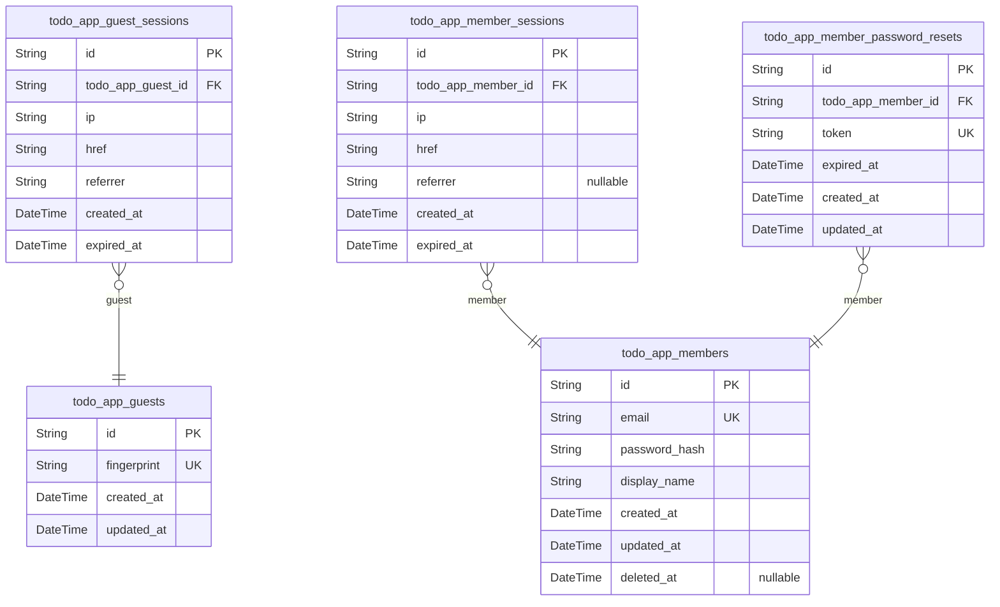
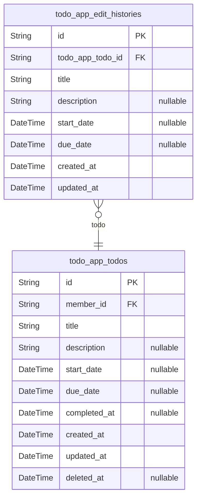

# Prisma Markdown

> Generated by [`prisma-markdown`](https://github.com/samchon/prisma-markdown)

- [system](#system)
- [todo_app](#todo_app)

## system

### `todo_app_guests`

Temporary guest identities for unauthenticated visitors.

Represents an anonymous visitor identified by device fingerprint before
authentication. Each guest identity is created when a person first visits
the application, providing a persistent but anonymous reference for
tracking session activity during signup and login flows. Once the visitor
authenticates, they transition to a [todo_app_members](#todo_app_members) identity.

Guest identities are ephemeral by nature — the system does not retain
guest information across extended periods without activity.

Properties as follows:

- `id`: Primary Key.
- `fingerprint`
  > Device fingerprint hash uniquely identifying the guest.
  >
  > A hashed representation of the visitor's device characteristics, used to
  > recognize returning unauthenticated visitors across visits. Must be
  > unique across all guest records to prevent duplicate identities.
- `created_at`: Timestamp when the guest identity was first recorded in the system.
- `updated_at`: Timestamp when the guest identity record was last updated.

### `todo_app_guest_sessions`

Temporary session tokens for guest access during signup and login flows.

Each session belongs to a single [todo_app_guests](#todo_app_guests) record and
tracks the IP address, current page URL (href), and referrer URL for
security auditing. Sessions are append-only and managed through
authentication flows. When a guest completes signup or login, the guest
transitions to member and the guest session is superseded by a member
session.

Properties as follows:

- `id`: Primary Key.
- `todo_app_guest_id`
  > Reference to the guest identity that this session belongs to.
  >
  > Establishes a 1:N relationship where one [todo_app_guests](#todo_app_guests) can have
  > multiple sessions over time.
- `ip`
  > IP address of the guest at the time of session creation.
  >
  > Used for security auditing and anomaly detection across sessions.
- `href`
  > Current page URL where the guest was located when the session was created.
  >
  > Captures the entry point context for the signup or login flow.
- `referrer`
  > Referrer URL indicating the previous page the guest navigated from.
  >
  > Provides additional context for traffic source analysis and security
  > auditing.
- `created_at`
  > Timestamp when the session was created.
  >
  > Marks the beginning of the guest's temporary authentication context.
- `expired_at`
  > Timestamp when the session expires.
  >
  > After this point the session is no longer valid and the guest must
  > re-authenticate. Defaults to NOT NULL for security, ensuring every
  > session has a finite lifetime.

### `todo_app_members`

Registered member accounts with email-based authentication, password
credentials, and personal display name.

[todo_app_member_sessions](#todo_app_member_sessions) track authenticated login sessions for
each member. {User Concept} defines the email as the unique identity
credential — no two members share the same email. The display name is a
personal label visible only to the member themselves, with no uniqueness
constraint across members.

When a member changes their password, all active sessions are ended
immediately. Account deletion permanently removes the member and cascades
to all owned [todo_app_todos](#todo_app_todos) and their {@link
todo_app_edit_histories}, as well as ending all active sessions.

Properties as follows:

- `id`: Primary Key.
- `email`
  > Unique email address serving as the member's primary identity credential
  > for login.
  >
  > Must be a valid email format. This is the canonical identifier for
  > authentication — members log in using their email and password
  > combination. Uniqueness is enforced at the database level.
- `password_hash`
  > Cryptographic hash of the member's password credential.
  >
  > Stored using a secure one-way hashing algorithm (bcrypt/argon2). The raw
  > password is never stored. Password changes replace this value and
  > invalidate all active sessions for the account.
- `display_name`
  > Personal label chosen by the member to represent themselves within their
  > own workspace.
  >
  > Unlike email, the display name does not need to be unique across members.
  > It is visible only to the owning member — cross-user visibility is
  > prohibited. Members can edit their display name at any time.
- `created_at`
  > Timestamp when the member account was created (registration completed).
  >
  > Set automatically at account creation and never changes.
- `updated_at`
  > Timestamp of the most recent modification to the member's account record.
  >
  > Updated automatically when fields such as display_name or password_hash
  > are changed.
- `deleted_at`
  > Timestamp when the member account was deleted.
  >
  > Account deletion is permanent in this system — the member and all
  > associated data are physically removed, and all active sessions are ended
  > immediately. This field supports the standard soft-delete temporal
  > pattern for potential recovery windows.

### `todo_app_member_sessions`

JWT session tokens for member authentication with access and refresh
token support.

Records each authenticated login session for [todo_app_members](#todo_app_members),
capturing the client's network context and the session's temporal bounds.
Each session is append-only and serves as an audit trail for member
authentication activity.

Sessions are created upon successful login or registration and remain
valid until their expiration timestamp. The system enforces session
expiry through the expired_at field — sessions past this timestamp are
considered terminated and cannot be used for authentication.

Each session is tied to exactly one member. A member may have multiple
concurrent sessions across different devices or browsers, each tracked
independently.

Properties as follows:

- `id`: Primary Key.
- `todo_app_member_id`
  > References the authenticated [todo_app_members](#todo_app_members) who owns this
  > session.
  >
  > Establishes the ownership chain for session validation — every
  > authenticated request must match a valid, non-expired session linked to
  > the requesting member.
- `ip`
  > Client IP address at the time of session creation.
  >
  > Captured from the request context during login or registration. Provides
  > audit trail information for security analysis and anomaly detection.
- `href`
  > Request URL path at the time of session creation.
  >
  > Records the endpoint or page that initiated the session. Provides context
  > for audit and debugging purposes.
- `referrer`
  > HTTP Referer header value at the time of session creation.
  >
  > Captures the referring page or source that led to the authentication
  > request. May be empty for direct navigation or API clients.
- `created_at`
  > Timestamp when the session was created.
  >
  > Set at the moment of successful authentication. Forms part of the
  > composite index with [todo_app_member_id](#todo_app_member_id) for efficient
  > chronological session listing.
- `expired_at`
  > Timestamp when the session expires and becomes invalid.
  >
  > Sessions past this timestamp are considered terminated. Set to NOT NULL
  > by default for security — every session must have a finite lifetime. The
  > application layer enforces expiry checks against this field during
  > request authentication.

### `todo_app_member_password_resets`

Password reset tokens with expiration for member password recovery.

Stores time-limited, cryptographically secure tokens issued when a {@link
todo_app_members} requests a password reset. Each token is globally
unique to prevent collisions and is consumed (hard-deleted) upon
successful password change or expired cleanup.

A member may have multiple active reset tokens concurrently — for
instance, if they request multiple resets before completing one. Tokens
become invalid after their expiration timestamp and must be rejected by
the system.

Properties as follows:

- `id`: Primary Key.
- `todo_app_member_id`
  > Reference to the [todo_app_members](#todo_app_members) account that requested the
  > password reset.
  >
  > Establishes a many-to-one relationship: a member may have multiple reset
  > tokens issued over time, but each token belongs to exactly one member
  > account.
- `token`
  > Cryptographically secure random token used to verify the reset request.
  >
  > This token is delivered to the member (e.g., via email) and must be
  > presented back to authorize the password change. Globally unique to
  > prevent any possibility of collision between concurrent or successive
  > reset requests.
- `expired_at`
  > Timestamp after which this reset token becomes invalid.
  >
  > Once this point in time passes, the token must not be accepted for
  > password change operations. The system should reject any reset attempt
  > using an expired token.
- `created_at`
  > Timestamp when this reset token was generated and issued.
  >
  > Records the moment the member initiated the password reset request.
- `updated_at`
  > Timestamp of the last modification to this reset token record.
  >
  > Updated if the token's expiration is extended or any metadata changes
  > occur.

## todo_app

### `todo_app_todos`

Individual task items belonging to authenticated members with title,
optional description, optional start and due dates, completion status,
soft-delete lifecycle, and creation timestamp.

Each todo belongs to exactly one [member](#todo_app_members). Todos
are completely private — members can only access their own todos. Newly
created todos default to incomplete. Members can toggle completion status
freely between incomplete and complete, edit any attribute (each edit
recorded in [todo_app_edit_histories](#todo_app_edit_histories)), soft-delete (moving to
trash), restore from trash, or permanently delete.

**Completion Status**: Tracked via the `completed_at` timestamp — NULL
indicates incomplete, a non-NULL value indicates the todo is complete and
records when it was marked complete. Toggling back to incomplete clears
this field.

**Soft-Delete Lifecycle**: The `deleted_at` field drives the trash
workflow. When NULL, the todo is active and appears in the normal todo
list. When set, the todo is in trash — hidden from the active list and
visible only in the dedicated trash view. Restoring clears `deleted_at`;
permanent deletion removes the row entirely along with all associated
[todo_app_edit_histories](#todo_app_edit_histories).

Properties as follows:

- `id`: Primary Key.
- `member_id`
  > Reference to the [member](#todo_app_members) who owns this todo.
  >
  > Every todo is scoped to exactly one member. The member has full ownership
  > — they alone can view, edit, toggle, soft-delete, restore, and
  > permanently delete this todo. No cross-member access exists.
- `title`
  > Short text describing the task. Required — a todo cannot exist without a
  > title.
- `description`
  > Longer text providing additional detail about the task. Optional — may be
  > left empty.
- `start_date`
  > The date when work on the task is intended to begin. Optional — may be
  > left unset.
  >
  > When both this and `due_date` are set, the service layer enforces that
  > `due_date` must not be earlier than `start_date`.
- `due_date`
  > The date by which the task should be completed. Optional — may be left
  > unset.
  >
  > When both this and `start_date` are set, the service layer enforces that
  > `due_date` must not be earlier than `start_date`.
- `completed_at`
  > Records when the todo was marked complete. NULL means the todo is
  > incomplete; a non-NULL timestamp means the todo is complete and captures
  > the exact completion time.
  >
  > Defaults to NULL (incomplete) on creation. Toggling between states sets
  > this to the current timestamp (complete) or clears it to NULL
  > (incomplete).
- `created_at`
  > Timestamp when this todo was first created. Set automatically on creation
  > and never changes.
- `updated_at`
  > Timestamp when this todo was last modified. Updated automatically on any
  > attribute change including completion toggles and soft-delete/restore
  > operations.
- `deleted_at`
  > Soft-delete timestamp. NULL indicates the todo is active; a non-NULL
  > value indicates the todo has been moved to the trash.
  >
  > Active todos appear in the normal todo list. Trashed todos are hidden
  > from the active list and visible only via the trash view. Restoring from
  > trash sets this back to NULL.

### `todo_app_edit_histories`

Immutable audit trail recording field-level snapshots of a {@link
todo_app_todos} after each edit.

Each entry captures the complete state of the todo's editable fields —
title, description, start date, and due date — at the moment the edit was
applied. Entries are append-only: once created, they cannot be modified
or individually deleted. The only removal path is cascade deletion when
the parent todo is permanently deleted from the trash.

Edit histories are presented to the user in reverse chronological order
(most recent first), supported by the composite index on parent todo and
creation timestamp.

Properties as follows:

- `id`: Primary Key.
- `todo_app_todo_id`
  > Reference to the parent [todo_app_todos](#todo_app_todos) whose edit produced this
  > history entry.
  >
  > Establishes the 1:N relationship where a todo can accumulate many edit
  > history entries over its lifetime. Deletion is cascaded: when the parent
  > todo is permanently deleted from the trash, all associated edit history
  > entries are removed along with it.
- `title`
  > The title of the todo after the edit was applied.
  >
  > Always populated because every todo must have a title per business rules.
- `description`
  > The description of the todo after the edit was applied.
  >
  > Nullable because the description field on the parent todo is optional and
  > may be left empty.
- `start_date`
  > The start date of the todo after the edit was applied.
  >
  > Nullable because the start date field on the parent todo is optional and
  > may be left unset.
- `due_date`
  > The due date of the todo after the edit was applied.
  >
  > Nullable because the due date field on the parent todo is optional and
  > may be left unset.
- `created_at`
  > Timestamp when this edit history entry was created, representing the date
  > and time the edit occurred.
  >
  > Set automatically at creation and never changes. Serves as both the
  > record's creation timestamp and the edit timestamp visible to the user in
  > the history listing.
- `updated_at`
  > Timestamp of the last update to this record.
  >
  > Set to the same value as created_at at creation time. Since edit history
  > entries are immutable and never modified after creation, this value
  > remains unchanged.
