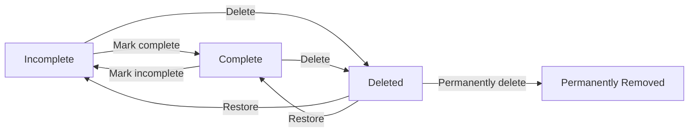
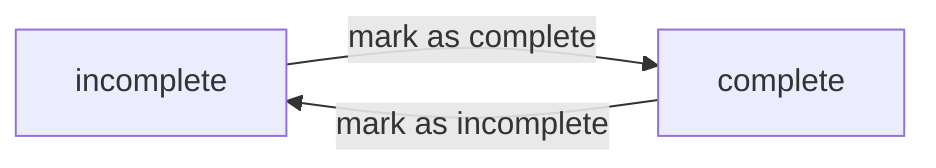
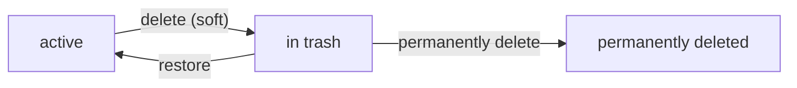
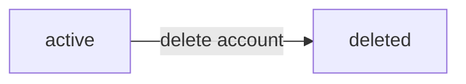

**todoApp — Business concepts, relationships, and states from user perspective**

Business concepts, relationships, and states from user perspective

# Domain Concepts

Describe what each concept means in the business domain and its key attributes.

## User Concept

A User represents a single person who owns and manages their personal todo items in the application. Each user is identified by a unique email address, which serves as their login credential along with a password. The user also has a display name that personalizes their experience within the application. The display name is the user's visible identity within their own private workspace. Users exist in complete isolation from one another — there is no concept of shared access, collaboration, or visibility between different users. This privacy boundary means each user's account is a self-contained environment where only they can see and interact with their own data. The application treats each user as the sole owner of everything they create, with no ability to grant access to others. When a user account is removed, everything associated with that user is also permanently gone, reinforcing the private and self-contained nature of each account.

### User Identity

A User represents a single person in the application. Each user is uniquely identified by their email address — no two users can share the same email. The email serves as the user's primary identity credential and is required for logging into the application.

In addition to the email, each user has a display name. The display name is a personal label the user chooses to represent themselves within their own workspace. Unlike the email, the display name does not need to be unique across users. The display name is visible only to the user themselves; other users cannot see it, as the application prohibits any form of cross-user visibility.

### Authentication Credential

Each user has a password associated with their account. The password is paired with the user's email to authenticate the user during login. The password is a secret known only to the user and is not visible to any other user. The user can change their password at any time while their account is active.

### Personal Workspace and Privacy Isolation

Each user operates within a completely private, self-contained workspace. There is no concept of shared access, collaboration, or any form of cross-user visibility in the application.

A user cannot view another user's profile, todos, edit histories, or any other data belonging to another user. Every item a user creates — including todos, their titles, descriptions, dates, completion statuses, and edit history entries — belongs exclusively to that user and is invisible to all other users.

The application treats each user as the sole owner of their entire workspace. There are no mechanisms for granting access to others, sharing items, or collaborating on tasks. The user's workspace functions as if no other users exist in the system. This isolation is a fundamental property of the application, not a configurable setting.

### Account Removal

A user can delete their own account. When an account is deleted, all data belonging to that user is permanently removed from the application. This includes:

- All todos, regardless of their state (active, completed, or in the trash)
- All edit history entries associated with those todos
- The user's profile information (email, password, display name)

Once an account is deleted, no recovery of any associated data is possible. The permanent removal extends the privacy principle: just as no other user can access a user's data during the account's lifetime, no residual data remains after the account is removed.

## Todo Concept

A Todo represents a single task or item that a user wants to track and manage. Every todo must have a title that describes what needs to be done — this is the only required piece of information. Beyond the title, a user can optionally provide a longer description with additional details about the task. A todo can also have a start date indicating when work on the task should begin, and a due date indicating the deadline by which it should be finished. Both dates are optional and can be left unset. When first created, a todo is always in the incomplete state. A todo transitions between two states: incomplete and complete, representing whether the task has been finished or still needs work. Each todo belongs to exactly one user and is entirely private to that user. A todo also carries a creation timestamp that records when it was first made. When a todo is deleted, it is not immediately removed but enters a soft-deleted state, moving it to the trash area where it can be recovered or permanently destroyed.

### Todo Definition

A todo represents a single task item that a user wants to track and manage. It is the core unit of work in the application — something the user intends to do, is currently working on, or has finished. Every todo is self-contained: it holds all the information needed to describe the task and track its progress from creation to completion or deletion.

### Todo Attributes

Each todo carries the following pieces of information:

- **Title** (required): A short text description of the task. Every todo must have a title; a todo cannot exist without one.
- **Description** (optional): A longer text providing additional detail about the task. May be left empty.
- **Start date** (optional): The date when work on the task is intended to begin. May be left unset.
- **Due date** (optional): The date by which the task should be completed. May be left unset.
- **Completion status**: Indicates whether the task is incomplete or complete (see Completion States below).
- **Creation timestamp**: Records the date and time when the todo was first created. This is set automatically and never changes.
- **Soft-delete status**: Indicates whether the todo has been moved to the trash (see Deletion Lifecycle below).

**Date constraint**: When both a start date and a due date are set on the same todo, the due date must not be earlier than the start date. If a member attempts to set a due date that is earlier than the start date, the system shall reject the request.

### Completion States

A todo follows a simple two-state model for completion: it is either incomplete or complete.

When first created, a todo is always incomplete by default. The user can toggle the completion status back and forth between the two states at any time — marking a complete todo as incomplete, or an incomplete todo as complete. There is no additional state beyond these two, and the toggle has no restrictions or preconditions.

### Ownership and Privacy

Each todo has exactly one owner — the user who created it. A todo is entirely private to its owner. No other user can view, access, or interact with the todo in any way. The ownership is permanent and cannot be transferred.

### Deletion Lifecycle

A todo can exist in two deletion-related states:

- **Active**: The todo appears in the user's normal todo list. This is the default state.
- **Soft-deleted**: The todo has been removed from the normal list but is not permanently erased. It resides in the trash area, where the owner can still view it, restore it back to active status, or permanently delete it.

When a todo is permanently deleted, it and all associated data (including its edit history) are completely and irreversibly removed. Once permanently deleted, the todo cannot be recovered.

The trash area is a separate view that lists only soft-deleted todos belonging to the user. It provides access to each deleted todo for restoration or permanent deletion decisions.

## EditHistory Concept

An EditHistory entry captures a snapshot of changes made to a todo at a specific moment in time. Every time any field of a todo is modified — whether title, description, start date, or due date — a new edit history entry is created. Each entry records exactly when the edit occurred, providing a timestamp that allows users to trace the timeline of changes. The entry stores what the title was changed to at that moment, what the description was changed to, what the start date was changed to, and what the due date was changed to. Each history entry is permanently tied to a single todo and has no meaning or existence independent of that todo. Entries are ordered from most recent to oldest, giving users a chronological view of how a todo has evolved over time. If a todo is permanently deleted, all of its edit history entries are also permanently removed — the history cannot exist without the todo it belongs to. Edit history is read-only from the user's perspective; entries are created automatically and cannot be modified or deleted individually.

### Snapshot Attributes

An edit history entry is a point-in-time record that captures the state of a todo's fields immediately after an edit. The entry stores four snapshot values: the title as it was after the edit, the description as it was after the edit, the start date as it was after the edit, and the due date as it was after the edit. Each of these snapshots reflects what the corresponding field became as a result of that specific edit — not the delta or the previous value, but the resulting value after the change was applied.

Alongside the field snapshots, every entry records an edit timestamp indicating the exact date and time the edit was made. This timestamp is what enables chronological reconstruction of the todo's history.

If a field was not changed during an edit, the corresponding snapshot still records the current value of that field at that moment. The snapshot always reflects the complete state of all four tracked fields after the edit, regardless of which fields were actually modified. This means that even when a user edits only the title, the entry still captures the description, start date, and due date as they stood at that moment.

### Relationship to Todo

Every edit history entry belongs to exactly one todo. An entry has no independent existence — it is always and only meaningful in the context of the todo it documents. There is no way to create, view, or reference an edit history entry without going through its parent todo.

An edit history entry is created automatically by the system whenever a user submits an edit to a todo, even when the user has not changed any field values. If a user opens the edit form and saves without modifying anything, the system still creates a new history entry. In that case, the entry records only the edit timestamp with no field snapshots. Users do not create history entries manually; the system handles creation transparently behind the scenes. Every edit submission — whether it results in changed fields or no changes at all — produces exactly one new history entry.

When a todo is permanently deleted from the trash, all of its edit history entries are also permanently deleted. This cascading deletion ensures that no orphaned history entries remain in the system — history cannot exist without the todo it belongs to. Conversely, when a todo is soft-deleted and moved to the trash, its edit history is preserved intact. If the todo is later restored from the trash, its existing history entries are restored along with it and remain available for viewing.

### Ordering and Access

Edit history entries for a todo are always presented in chronological order, with the most recent edit appearing first. This ordering allows users to read the history as a reverse timeline — starting from the latest changes and moving backward through earlier edits. The ordering is fixed and determined by the edit timestamp of each entry.

Edit history is entirely read-only from the user's perspective. Entries are created automatically by the system and cannot be modified, deleted individually, or reordered by users. The history serves as an immutable audit trail of changes, providing a transparent and trustworthy record of how a todo has evolved over time.

The collective set of entries forms a timeline of changes that tells the full story of a todo's evolution — from its original creation state through every subsequent edit, up to its current state.

# Domain Relationships

Describe how concepts relate to each other from a business perspective.

## Conceptual Relationships

Describe how concepts relate to each other in business terms.

### User and Todo Ownership

Each user owns their own set of todos. A user may have many todos; a todo belongs to exactly one user. This ownership is permanent — a todo cannot be transferred to another user, and no user can access another user's todos.

When a user creates a todo, the todo is automatically associated with that user. The user is considered the owner of the todo and has full control over it: viewing, editing, completing, deleting, restoring, and permanently deleting.

Because ownership is exclusive and private, there is no concept of shared or collaborative todos. Every todo in the system is tied to a single owner, and that owner is the only person who can interact with it.

If a user deletes their account, all todos they own are permanently removed from the system. This includes todos currently in the trash.

### Todo and Edit History Association

Each todo may have zero or more edit history entries. An edit history entry belongs to exactly one todo. This association is established automatically whenever an edit is made to the todo.

An edit history entry records a snapshot of the todo's mutable fields at the time of the edit: the title, description, start date, and due date as they were set during that edit. If a field was not changed in a given edit, the snapshot for that field is the same as its previous value.

Edit history entries are ordered from most recent to oldest, reflecting the chronological sequence of changes.

When a todo is permanently deleted from the trash, all associated edit history entries are also permanently removed. Restoring a todo from the trash preserves its edit history — the history entries remain intact and accessible.

## Lifecycle and Retention

Describe concept lifecycle states and transitions only. Detailed retention/recovery policies belong in 05-non-functional. Operation details belong in 03-functional-requirements.

### Todo Lifecycle

A todo moves through several states during its existence.

**States**

| State | Description |
|-------|-------------|
| Incomplete | The default state when a todo is first created. The task has not yet been finished. |
| Complete | The todo has been marked as finished by its owner. |
| Deleted | The todo has been soft-deleted and resides in the trash. It is not visible in the normal todo list. |
| Permanently Removed | The todo has been permanently deleted from the trash and no longer exists anywhere in the system. |

**Transitions**

The following diagram shows how a todo moves between states:

- A newly created todo starts in the **Incomplete** state.
- The owner can toggle between **Incomplete** and **Complete** at any time while the todo is active.
- Deleting a todo from the active list moves it to the **Deleted** state (trash). The todo retains all its data — including its completion status — while in the trash.
- Restoring a todo from the trash returns it to the active list. The todo's previous completion status (whichever it had before deletion) is preserved.
- Permanently deleting a todo from the trash moves it to **Permanently Removed**. This action is irreversible.

Detailed retention policies for deleted items are defined in [05-non-functional.md](./05-non-functional.md).

### User Account Lifecycle

A user account has two lifecycle states.

**States**

| State | Description |
|-------|-------------|
| Active | The user has a registered account and can use the application normally. |
| Deleted | The user has deleted their account. The account and all associated data are permanently removed. |

**Transitions**

- A user account becomes **Active** upon successful registration.
- When a user deletes their account, it moves to the **Deleted** state.
- Account deletion is irreversible.

**Cascading Effects of Account Deletion**

When a user deletes their account, all of the following are permanently removed:

- All active todos (both incomplete and complete)
- All deleted todos currently in the trash
- All edit history entries associated with any of the user's todos

No user data remains after account deletion.

### EditHistory Lifecycle

An edit history entry is a snapshot of changes made during a single edit operation on a todo.

**Creation**

An edit history entry is created each time the owner edits a todo. The entry records:

- The timestamp when the edit occurred
- The new title value, if the title was changed in that edit
- The new description value, if the description was changed in that edit
- The new start date value, if the start date was changed in that edit
- The new due date value, if the due date was changed in that edit

Edit history entries are immutable once created. They cannot be modified or deleted individually by the user.

**Removal**

An edit history entry is removed only when its parent todo is permanently deleted, either:

- When the user permanently deletes the todo from the trash, or
- When the user deletes their entire account

Edit history entries are not removed when a todo is soft-deleted (moved to trash). They remain associated with the todo throughout its time in the trash.

### Deletion Concepts

The system supports two levels of deletion, providing a safety net before permanent removal.

**Soft Delete**

A soft delete moves the todo to the **Deleted** state. The todo:

- No longer appears in the normal todo list or in any filtered/sorted views of active todos.
- Retains all its data: title, description, start date, due date, completion status, and edit history.
- Can be restored or permanently deleted from the trash.

**Trash**

The trash is a holding area for soft-deleted todos. Todos in the trash are in the **Deleted** state and remain there until either restored or permanently deleted.

**Permanent Deletion**

Permanent deletion removes the todo from the system entirely:

- The todo transitions to **Permanently Removed** and cannot be recovered by any means.
- All edit history entries associated with that todo are also permanently removed.

**Account-Level Cascading**

When a user deletes their entire account, permanent deletion is applied to all todos owned by that user — both active and those in the trash — along with all associated edit histories. This is equivalent to permanently deleting every todo individually.

**Restoration**

Restoration moves a todo from the **Deleted** state back to its previous active state (Incomplete or Complete). The todo's data and edit history remain fully intact. The todo is once again visible in the normal todo list and subject to all filtering and sorting rules.

# Business Categories and State Flows

Business category classifications and state flow definitions.

## Business Category Definitions

Define all business category classifications with their allowed values and descriptions.

### Completion Status Classification

The completion status classification defines whether a todo has been finished or remains pending.

**Allowed Values**:

| Value | Description |
|-------|-------------|
| complete | The todo has been finished |
| incomplete | The todo has not yet been finished |

A todo always has exactly one completion status. Newly created todos are incomplete by default. The completion status is a simple toggle: a todo can move from incomplete to complete, and from complete back to incomplete, any number of times.

### Deletion Status Classification

The deletion status classification defines whether a todo is active or has been moved to the trash.

**Allowed Values**:

| Value | Description |
|-------|-------------|
| active | The todo is not deleted and appears in the normal todo list |
| trashed | The todo has been soft-deleted and appears only in the trash |

A todo always has exactly one deletion status. Newly created todos are active by default. When a user deletes a todo, it becomes trashed rather than permanently removed. A trashed todo can be restored, which returns it to active status. Permanently deleting a trashed todo removes it and its edit history from the system entirely.

### Edit History Entry Classification

Each edit to a todo generates an edit history entry that captures a snapshot of what changed and when the edit occurred.

Each edit history entry records:

| Attribute | Description |
|-----------|-------------|
| Edit timestamp | When the edit was made |
| Title snapshot | What the title was changed to (recorded only if the title was modified) |
| Description snapshot | What the description was changed to (recorded only if the description was modified) |
| Start date snapshot | What the start date was changed to (recorded only if the start date was modified) |
| Due date snapshot | What the due date was changed to (recorded only if the due date was modified) |

An edit history entry belongs to exactly one todo. A todo accumulates one entry per edit over its lifetime. History entries are ordered from most recent to oldest. If a todo is permanently deleted, all its edit history entries are permanently deleted as well.

## State Transitions

Define valid state transition paths for stateful concepts.

### Todo Completion State

A todo has two completion states: **incomplete** and **complete**.

- Newly created todos are **incomplete** by default.
- A user can toggle a todo between these two states at any time.
- Marking an incomplete todo as complete changes its status to complete.
- Marking a complete todo as incomplete changes its status back to incomplete.
- The toggle has no restrictions — a todo may transition back and forth any number of times.
- The completion state does not affect whether a todo appears in the normal list or the trash.

### Todo Deletion Lifecycle

A todo moves through three states in its deletion lifecycle: **active**, **in trash**, and **permanently deleted**.

- **Active**: The todo appears in the user's normal todo list and can be viewed, edited, completed, or deleted.
- **In trash**: The todo no longer appears in the normal todo list. It can only be viewed in the trash list. While in trash, the todo cannot be edited or have its completion status toggled.
- **Permanently deleted**: The todo is removed from the system entirely. Its edit history is also deleted. This state is irreversible.

Valid transitions:

- **Active → In trash**: A user deletes their todo. This is a soft delete; the todo is not yet permanently removed.
- **In trash → Active**: A user restores a todo from the trash. The todo returns to the normal todo list with all its data and edit history intact.
- **In trash → Permanently deleted**: A user permanently deletes a todo from the trash. This action removes the todo and all its edit history irrevocably.

A todo cannot transition directly from active to permanently deleted — it must pass through the trash first.

### User Account Lifecycle

A user account has two states: **active** and **deleted**.

- **Active**: The user can log in, manage their profile, and use all application features.
- **Deleted**: The user account no longer exists. All data belonging to the user is permanently removed, including:
  - All active todos and their edit histories.
  - All todos in the trash.

Valid transition:

- **Active → Deleted**: A user requests deletion of their account. The system permanently removes the account and all associated data. This action is irreversible.

There is no transition back from deleted to active — once an account is deleted, it cannot be recovered.

