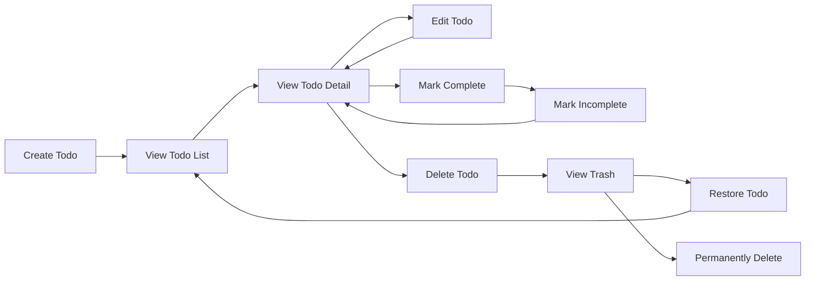

**todoApp — What operations users can perform, use cases, business workflows**

What operations users can perform, use cases, business workflows

# Core Business Operations

What the system must do for each business concept.

## User Operations

Users can sign up for the application by providing an email address and password. The email serves as the unique identifier for login. Users log into their account using their email and password credentials, and once authenticated they gain access to their private todo workspace. Users can change their password at any time, which updates their login credentials without affecting their todos or profile data. Each user maintains a profile containing a display name, and users can edit this display name whenever they wish. The display name is for the user's own reference and is not visible to any other user since this is a private application. Users can delete their account entirely, which triggers the permanent removal of all their todos, including any todos currently in the trash, along with all associated edit history records. Once an account is deleted, none of that user's data remains. Users cannot view, access, or interact with any other user's profile or data — every user's workspace is completely isolated.

### User Registration

A guest can register a new user account by providing an email address and a password. The email address serves as the unique identifier for the account and must not already be associated with an existing account.

**THE system SHALL allow a guest to create an account** by submitting an email address and a password. Both fields are required.

**IF the email address is already in use by an existing account, THEN THE system SHALL reject the registration.**

**WHEN registration is successful, THE system SHALL create the new user account** and authenticate the user as a member. The newly created account has no associated todos. The user may optionally set a display name after registration.

### User Login

A registered user logs into the application using their email address and password. Once authenticated, the user gains access to their private todo workspace and can perform all operations available to members.

**THE system SHALL authenticate a guest** when they provide a registered email address and the matching password. Upon successful authentication, the guest becomes an authenticated member.

**IF the email address is not registered or the password is incorrect, THEN THE system SHALL reject the login attempt.**

While authenticated, the member can access all operations scoped to their own account.

### Password Change

An authenticated member can change their account password at any time. Changing the password does not affect any of the user's todos, edit history records, or trash contents.

**THE system SHALL allow a member to change their password** by providing their current password and a new password. Both the current password and the new password are required.

**IF the current password does not match the account's stored password, THEN THE system SHALL reject the change.**

**WHEN the password change is accepted, THE system SHALL update the password** for subsequent login attempts. The previous password is no longer valid.

### Display Name Editing

Each user account has a display name that the user can view and edit. The display name is for the user's own reference and is not visible to any other user, as this is a private application with complete profile isolation.

**THE system SHALL allow a member to edit their display name** at any time. The display name may be set to any non-empty value.

**IF the provided display name is empty, THEN THE system SHALL reject the edit.**

**THE system SHALL allow a member to view their own display name.** No other user can view or access another user's display name or any other profile data.

### Account Deletion

A member can permanently delete their account. Account deletion triggers a cascade that removes all data associated with the user — including all todos (both active and in trash), all edit history records, and all profile information. Once deleted, none of the user's data remains in the system.

**THE system SHALL allow a member to request deletion of their own account.** The operation is irreversible.

**WHEN an account is deleted, THE system SHALL permanently remove** all of the following data belonging to that user:

- All active todos
- All todos in the trash (soft-deleted todos)
- All edit history entries associated with any of those todos
- The user's profile information (email, password, display name)

The deletion is atomic: either all data is removed, or the account remains intact with no partial removal. After deletion, the user can no longer log in, and the email address becomes available for new registrations.

### Profile Privacy and Isolation

Each user's workspace is completely isolated from every other user's workspace. There is no mechanism to view, access, or interact with another user's profile data or todos.

**THE system SHALL ensure that every member-accessible operation is scoped exclusively to the authenticated member's own data.** A member cannot retrieve, modify, or delete any resource belonging to another user.

**IF a member attempts to access another user's data by any means, THEN THE system SHALL deny the operation.**

Profile data — including the display name — is visible only to the owning user. No other user, whether authenticated or not, can see any portion of another user's profile. The application provides no sharing, collaboration, or visibility features between accounts.

## Todo Operations

Users can create a new todo by providing a title, which is required, along with an optional description, optional start date, and optional due date. Newly created todos are always set to incomplete by default. Users can view a paginated list of their own todos, where each entry displays the title, completion status, start date if set, due date if set, and the creation date. Users can also view a single todo in detail to see its full description and all other fields. A todo can be toggled between complete and incomplete at any time — this is a simple two-state switch with no additional workflow steps. Users can edit an existing todo to change its title, description, start date, or due date, and each edit is automatically recorded in the todo's edit history. Deleting a todo performs a soft delete, moving it to the trash rather than permanently removing it. Deleted todos no longer appear in the normal todo list. Users can view a separate paginated trash list showing all their soft-deleted todos, restore a todo from the trash back to the active list, or permanently delete a todo from the trash which also removes all its edit history. Users can filter their todo list by completion status — showing all todos, only complete ones, or only incomplete ones. Users can also sort their todo list by creation date, start date, or due date, each in ascending or descending order, with todos lacking a start date or due date appearing at the end of their respective sort orders. Every user's todos are entirely private and inaccessible to any other user.

### Todo Creation

### Todo Creation

THE todoApp SHALL require a title when a member creates a todo.

WHEN a member provides a title and submits the creation request, THE todoApp SHALL create a new todo with the provided title and set its completion status to incomplete.

WHERE a member provides a description, THE todoApp SHALL store it with the todo.

WHERE a member provides a start date, THE todoApp SHALL store it with the todo.

WHERE a member provides a due date, THE todoApp SHALL store it with the todo.

IF the title is missing or empty, THEN THE todoApp SHALL reject the creation request.

IF the due date is earlier than the start date, THEN THE todoApp SHALL reject the creation request.

The newly created todo SHALL belong exclusively to the creating member.

### Todo List View with Filtering and Sorting

### Todo List View

THE todoApp SHALL display a paginated list of the member's own active (non-deleted) todos.

Each todo in the list SHALL show its title, completion status, start date if set, due date if set, and creation date.

#### Filtering by Completion Status

THE todoApp SHALL allow members to filter their todo list by completion status.

WHEN a member selects the "all" filter, THE todoApp SHALL display both complete and incomplete todos.

WHEN a member selects the "complete" filter, THE todoApp SHALL display only todos marked as complete.

WHEN a member selects the "incomplete" filter, THE todoApp SHALL display only todos marked as incomplete.

#### Sorting

THE todoApp SHALL allow members to sort their todo list by creation date, start date, or due date.

Each sort option SHALL support both ascending and descending order.

WHEN sorting by creation date in ascending order, THE todoApp SHALL display the oldest todos first.

WHEN sorting by creation date in descending order, THE todoApp SHALL display the newest todos first.

WHEN sorting by start date, THE todoApp SHALL place todos without a start date at the end of the list regardless of sort direction.

WHEN sorting by due date, THE todoApp SHALL place todos without a due date at the end of the list regardless of sort direction.

### Single Todo Detail View

### Single Todo Detail View

WHEN a member requests to view a single todo, THE todoApp SHALL display all details of that todo including its title, description, completion status, start date, due date, and creation date.

IF the requested todo does not exist, THEN THE todoApp SHALL reject the request.

IF the requested todo belongs to another member, THEN THE todoApp SHALL reject the request.

### Completion Status Toggle

### Completion Status Toggle

THE todoApp SHALL allow a member to toggle the completion status of their own todo between complete and incomplete.

WHEN a member marks an incomplete todo as complete, THE todoApp SHALL update the todo's completion status to complete.

WHEN a member marks a complete todo as incomplete, THE todoApp SHALL update the todo's completion status to incomplete.

IF the requested todo does not exist, THEN THE todoApp SHALL reject the request.

IF the requested todo belongs to another member, THEN THE todoApp SHALL reject the request.

### Todo Editing and Edit History

### Todo Editing

THE todoApp SHALL allow a member to edit the title, description, start date, and due date of their own todo.

WHEN a member edits any field of a todo, THE todoApp SHALL update the todo with the new values and automatically create an edit history entry recording the changes.

Each edit history entry SHALL record the timestamp of the edit, the new title if changed, the new description if changed, the new start date if changed, and the new due date if changed.

IF the requested todo does not exist, THEN THE todoApp SHALL reject the edit request.

IF the requested todo belongs to another member, THEN THE todoApp SHALL reject the edit request.

IF the todo has been soft-deleted, THEN THE todoApp SHALL reject the edit request.

IF the due date is set earlier than the start date, THEN THE todoApp SHALL reject the edit request.

### Soft Delete and Trash Management

### Soft Delete

WHEN a member deletes a todo, THE todoApp SHALL perform a soft delete by moving the todo to the trash.

A soft-deleted todo SHALL no longer appear in the normal todo list.

IF the requested todo does not exist, THEN THE todoApp SHALL reject the delete request.

IF the requested todo belongs to another member, THEN THE todoApp SHALL reject the delete request.

### Trash List View

THE todoApp SHALL allow a member to view a paginated list of their own soft-deleted todos.

Each trashed todo in the list SHALL show its title, completion status, start date if set, due date if set, and creation date.

### Restore from Trash

WHEN a member restores a soft-deleted todo from the trash, THE todoApp SHALL return the todo to the active todo list with all its data and edit history intact.

IF the requested todo is not in the trash, THEN THE todoApp SHALL reject the restore request.

IF the requested todo belongs to another member, THEN THE todoApp SHALL reject the restore request.

### Permanent Delete from Trash

WHEN a member permanently deletes a todo from the trash, THE todoApp SHALL permanently remove the todo and all its associated edit history entries.

IF the requested todo is not in the trash, THEN THE todoApp SHALL reject the permanent delete request.

IF the requested todo belongs to another member, THEN THE todoApp SHALL reject the permanent delete request.

### Todo Privacy

### Todo Privacy

THE todoApp SHALL ensure that each member can only access their own todos.

IF a member attempts to view, edit, toggle, delete, restore, or permanently delete a todo belonging to another member, THEN THE todoApp SHALL reject the request.

There SHALL be no mechanism for a member to share, expose, or grant access to their todos to any other member.

## EditHistory Operations

Every time a user edits a todo, an edit history entry is automatically created to record the change. Each history entry captures when the edit was made and what each field was changed to — including the title if modified, the description if modified, the start date if modified, and the due date if modified. Fields that were not changed during an edit are not recorded with new values in that history entry, preserving a clear record of only what actually changed. Users can view the full edit history of any of their own todos, and the history entries are always sorted from most recent to oldest so the latest changes appear first. Edit history is read-only — users cannot manually create, modify, or delete individual history entries. The only way history entries are removed is when a user permanently deletes a todo from the trash, which cascades to remove all associated edit history records. This ensures that as long as a todo exists — whether active or in the trash — its complete edit trail remains available for review.

### Automatic History Entry on Todo Edit

WHEN an authenticated user edits any field of one of their own todos, THE todoApp SHALL automatically create a new edit history entry for that todo.

Each edit history entry SHALL record the date and time when the edit was made.

THE todoApp SHALL only include snapshot values in the history entry for fields that were actually changed during that specific edit. Fields that were not modified in the edit SHALL not be recorded with new values in that history entry.

THE todoApp SHALL create exactly one history entry per edit action, regardless of how many fields were changed in that edit.

### Edit History Field Snapshots

WHEN a user edits a todo and changes the title, THE todoApp SHALL capture a snapshot of the new title value in the corresponding edit history entry.

WHEN a user edits a todo and changes the description, THE todoApp SHALL capture a snapshot of the new description value in the corresponding edit history entry. This includes changing the description from empty to a value, changing a value to empty, or replacing an existing value with a different one.

WHEN a user edits a todo and changes the start date, THE todoApp SHALL capture a snapshot of the new start date value in the corresponding edit history entry. This includes setting a start date where none existed, clearing an existing start date, or changing it to a different date.

WHEN a user edits a todo and changes the due date, THE todoApp SHALL capture a snapshot of the new due date value in the corresponding edit history entry. This includes setting a due date where none existed, clearing an existing due date, or changing it to a different date.

### Viewing Edit History

THE todoApp SHALL allow an authenticated user to view the full edit history of any of their own todos.

WHEN displaying the edit history, THE todoApp SHALL sort history entries from most recent to oldest, so that the latest changes appear first.

Each history entry in the view SHALL display the edit timestamp along with any field snapshots that were recorded for that edit.

THE todoApp SHALL return an empty list of history entries for a todo that has never been edited.

### Read-Only Nature of Edit History

THE todoApp SHALL NOT allow users to manually create, modify, or delete individual edit history entries.

Edit history SHALL be entirely system-managed. The only operations that result in changes to edit history are:
- Automatic creation of an entry when a todo is edited.
- Cascading deletion of all entries when the associated todo is permanently removed from the trash.

THE todoApp SHALL treat edit history as a read-only record for all users, including the todo owner.

### Edit History Lifecycle

THE todoApp SHALL preserve the edit history for a todo as long as the todo exists, regardless of whether the todo is active or in the trash.

WHEN a user permanently deletes a todo from the trash, THE todoApp SHALL permanently delete all edit history entries associated with that todo. This deletion SHALL be irreversible.

THE todoApp SHALL NOT delete or alter edit history entries when a todo is moved to the trash (soft-deleted). The complete edit trail SHALL remain intact and viewable while the todo resides in the trash.

WHEN a todo is restored from the trash, its edit history SHALL remain fully intact and continue to be viewable.

# Error Scenarios and Edge Cases

Business-level error scenarios, edge case coverage, and expected system behaviors for exceptional conditions.

## User Error Scenarios

When a user attempts to sign up with an email address that is already registered, the system rejects the request and informs the user that the email is already in use. Login attempts with an incorrect password are denied, and the system does not reveal whether the email exists or the password was wrong to avoid exposing account information. Users changing their password must provide their current password; if the current password does not match, the change is rejected and the password remains unchanged. If a user submits an empty display name during profile editing, the system rejects the update because a display name is required. When a user attempts to delete their account, the system ensures all associated todos, trash entries, and edit histories are permanently removed in a single atomic operation — if any part of this cleanup fails, the entire deletion is rolled back and the account remains intact. A logged-out user cannot access any protected resources and must authenticate first. Users cannot view, access, or modify another user's profile information under any circumstance, and any attempt to do so results in an access denied response. If a user tries to change their password to the same current password, the system may warn them or simply accept it without creating unnecessary friction, but the password history is not a concern for this application's scope.

### Duplicate Email Rejection

WHEN a guest attempts to sign up with an email address that is already registered, THE system SHALL reject the request and inform the user that the email is already in use.

THE system SHALL NOT reveal whether an email address is registered in the system during any operation other than signup. This includes login attempts, where the system SHALL provide the same generic failure response regardless of whether the email exists or the password is incorrect.

### Incorrect Password Denial

WHEN a user provides incorrect credentials during login, THE system SHALL deny access.

THE system SHALL provide a single generic failure message that does not indicate whether the email address or the password was incorrect. This prevents an attacker from determining which email addresses are registered in the system.

### Password Change Validation

WHEN a member attempts to change their password and provides a current password that does not match the stored password, THE system SHALL reject the change request and leave the password unchanged.

WHEN a member changes their password to the same current password, THE system SHALL accept the request without error. No password history is maintained, so the operation completes successfully.

### Display Name Validation

WHEN a member attempts to set or update their display name to an empty or blank value, THE system SHALL reject the update.

THE system SHALL require a non-empty display name for all profile operations that modify it. An update that omits the display name entirely or provides only whitespace SHALL be rejected.

### Account Deletion Atomicity

WHEN a member deletes their account, THE system SHALL permanently remove all associated data — todos, trash entries, and edit histories — in a single atomic operation.

IF any part of the cleanup fails, THEN THE system SHALL roll back the entire deletion and keep the account fully intact. No partial deletion SHALL occur; the account remains accessible as if the deletion was never attempted.

### Authentication and Authorization Enforcement

WHEN an unauthenticated user attempts to access any protected resource, THE system SHALL deny access and require authentication before proceeding.

WHEN a member attempts to view or modify another member's profile information, THE system SHALL deny access. Profiles are private and only accessible by the owning member.

WHEN a member logs out, THE system SHALL immediately revoke access to all protected resources for that session. Any subsequent request using the expired session SHALL be denied as unauthenticated.

### Signup Validation Edge Cases

WHEN a guest submits a signup request missing the email address, THE system SHALL reject the request.

WHEN a guest submits a signup request missing the password, THE system SHALL reject the request.

IF the provided email address does not conform to a valid email format, THEN THE system SHALL reject the signup request.

IF the provided password is empty, THEN THE system SHALL reject the signup request.

## Todo Error Scenarios

Creating a todo without a title is rejected since title is the only required field; the system returns a clear validation message indicating that a title must be provided. If a user attempts to edit, complete, or delete a todo that belongs to another user, the system denies the operation with an access denied response, preserving the strict privacy boundary. Editing a todo that has already been soft-deleted cannot proceed — the user must first restore it from the trash before modifications are allowed. Marking a todo as complete that is already complete, or incomplete that is already incomplete, is a no-op and should either succeed silently or return the current state without error. When a user tries to delete a todo that is already in the trash, the system rejects the duplicate soft-delete to prevent confusion. Restoring a todo from trash that was never deleted or does not exist results in an appropriate error. Permanently deleting a todo from trash that no longer exists — perhaps already purged — produces a not found response. Sorting by start date or due date places todos without those dates at the end of the list, which is expected behavior and not an error, but the system should handle the null values gracefully without crashes. Filtering that yields zero results is not an error; the system returns an empty page. Requesting a page beyond the available range in any paginated list returns an empty result set rather than an error. If a user sets a start date that is later than the due date, the system should allow it with a warning or reject it depending on the business rule — but the intended behavior is to accept it since no explicit constraint prohibits this. A todo with an overly long title or description that exceeds reasonable bounds should be trimmed or rejected based on a defined length limit.

### Missing Title Rejection

IF a member attempts to create a todo without providing a title, THEN THE todoApp SHALL reject the request with a validation message indicating that the title is required.

Since the title is the sole required field for todo creation, any request submitted with an empty or absent title must be declined before processing.

### Cross-User Todo Access Denied

IF a member attempts to view, edit, complete, delete, or otherwise access a todo that belongs to another member, THEN THE todoApp SHALL deny the operation with an access-denied response.

This applies to all todo operations including viewing a single todo's details, toggling completion status, editing fields, soft-deleting, restoring from trash, permanently deleting, and viewing edit history. The privacy boundary is absolute — no member may interact with another member's todos under any circumstance.

### Editing Soft-Deleted Todo Blocked

IF a member attempts to edit a todo that is currently in the soft-deleted state (residing in trash), THEN THE todoApp SHALL reject the edit request.

A soft-deleted todo must be restored from the trash before any modifications — including title changes, description changes, start date changes, due date changes, or completion status toggles — can be applied. This ensures that the trash operates as a protected holding area where todos remain intact until either restoration or permanent deletion.

### Already Complete or Incomplete No-Op

IF a member marks a todo as complete when it is already complete, THEN THE todoApp SHALL either succeed silently or return the current state without producing an error.

IF a member marks a todo as incomplete when it is already incomplete, THEN THE todoApp SHALL either succeed silently or return the current state without producing an error.

These are no-op scenarios: the operation does not change the todo's state, and the system treats the request as benign rather than a violation.

### Duplicate Soft-Delete Rejection

IF a member attempts to soft-delete a todo that is already in the trash, THEN THE todoApp SHALL reject the request.

A todo can only be soft-deleted once. Once it resides in the trash, a second delete attempt is treated as a duplicate operation and declined to prevent confusion and preserve clear state transitions.

### Restore Nonexistent or Never-Deleted Todo Error

IF a member attempts to restore a todo from the trash that was never soft-deleted, THEN THE todoApp SHALL return an error indicating the restore operation is not applicable to the todo.

IF a member attempts to restore a todo from the trash that does not exist at all, THEN THE todoApp SHALL return a not-found error.

The restore operation is only valid for todos that are currently in the soft-deleted state. Todos in the active state or those that do not exist cannot be restored.

### Permanent Delete of Already Purged Todo

IF a member attempts to permanently delete a todo from the trash that no longer exists — for example, because it has already been purged in a prior operation — THEN THE todoApp SHALL return a not-found response.

Once a todo is permanently deleted (along with its edit history), all traces are removed from the system. Subsequent permanent-delete attempts targeting the same identifier produce a not-found result.

### Null Date Sort Handling

WHEN sorting the todo list by start date in ascending order, THE todoApp SHALL place todos without a start date at the end of the result set.

WHEN sorting the todo list by due date in ascending order, THE todoApp SHALL place todos without a due date at the end of the result set.

WHEN sorting in descending order for either date field, THE todoApp SHALL place todos without the respective date at the end of the result set.

This behavior is not an error condition — it is expected handling of absent date values that ensures the system operates gracefully without crashes or data corruption when date fields are null.

### Empty Filter Result and Pagination Boundaries

IF a filter returns zero matching todos, THEN THE todoApp SHALL return an empty page rather than an error.

IF a member requests a page number that exceeds the available pages in any paginated list — including the active todo list or the trash list — THEN THE todoApp SHALL return an empty result set rather than an error.

These are valid operational states, not exceptional conditions. The system responds with an empty collection when there is nothing to display, allowing the user interface to present appropriate empty-state messaging.

### Start Date After Due Date Acceptance

IF a member sets a start date that is later than the due date when creating or editing a todo, THEN THE todoApp SHALL accept the request without rejection.

No explicit business constraint prohibits a start date from being later than a due date. The system therefore does not enforce ordering between these two date fields, allowing members the flexibility to set dates as they see fit.

### Overly Long Title or Description Handling

IF a member provides a title or description that exceeds the maximum allowable length, THEN THE todoApp SHALL reject the request with a validation message indicating the length limit that was exceeded.

Maximum length limits for title and description are defined in the business rules (see 04-business-rules.md). Both creation and edit operations are subject to these limits. The system enforces them uniformly to prevent storage abuse and maintain data quality.

## EditHistory Error Scenarios

A user attempting to view the edit history of a todo that belongs to another user receives an access denied response, maintaining the application's privacy guarantees. If a user requests the edit history of a todo that does not exist or has been permanently deleted from the trash, the system returns a not found response — since permanent deletion also removes the associated edit history. Viewing the edit history of a todo that is currently in the trash but not yet permanently deleted is still allowed, as the history remains intact until the todo is purged. A todo that has never been edited has no history entries, and requesting its history returns an empty list rather than an error — this is a valid edge case for newly created todos. Each history entry only records the fields that actually changed during the edit; if only the title was modified, the description, start date, and due date snapshots should not appear as changed in that entry. When a user permanently deletes a todo from the trash and its edit history is removed, any subsequent attempt to access that history yields a not found result. If multiple edits occur in rapid succession, each edit creates a separate history entry with its own timestamp, and the system must preserve the chronological ordering from most recent to oldest. Concurrent edits by the same user on the same todo from multiple sessions are unlikely in a single-user-per-todo context, but the system should still handle each edit atomically to prevent partial history entries. A user restoring a todo from the trash does not create a new history entry because restoration is not an edit to the todo's content — it is a state change on the deletion status. When a user deletes their entire account, all edit history for all their todos is permanently removed, and no residual history entries should remain accessible.

### Cross-User History Access Denied

WHEN a user attempts to view the edit history of a todo that belongs to another user, THE system SHALL reject the request with an access denied response.

IF a user provides a todo identifier that exists but is owned by a different user, THEN THE system SHALL respond as if the todo does not exist, providing no indication that the todo belongs to someone else. This ensures the application's privacy guarantee that each user's data is completely private.

### History of Nonexistent or Permanently Deleted Todo

WHEN a user requests the edit history of a todo that does not exist, THE system SHALL return a not found response.

WHEN a user requests the edit history of a todo that has been permanently deleted from the trash, THE system SHALL return a not found response, as the edit history is removed alongside the todo during permanent deletion.

IF a user attempts to access edit history after the associated todo has been permanently purged from the trash, THEN THE system SHALL deny the request with a not found result. No distinction is made between a todo that never existed and one that was permanently deleted — both yield a not found outcome.

### Trashed Todo History Accessibility

WHILE a todo is in the trash but not yet permanently deleted, THE system SHALL allow the owning user to view its full edit history. The edit history remains intact throughout the soft-delete lifecycle and is only removed upon permanent deletion from the trash.

IF a user attempts to view the edit history of a trashed todo they own, THEN THE system SHALL return the complete history entries as they existed before the todo was moved to the trash.

### Empty History for Never-Edited Todos

WHEN a user requests the edit history of a todo that has never been edited, THE system SHALL return an empty list rather than an error.

THE system SHALL treat an empty history list as a valid and expected state, particularly for newly created todos that have undergone no edits since creation. An empty history list is not a failure condition and does not warrant an error response.

### Recording Only Changed Fields in History

WHEN a user edits a todo, THE system SHALL create a history entry that records only the fields that actually changed during that edit.

IF only the title is modified during an edit, THEN THE system SHALL record only the title change in that history entry, with the description, start date, and due date snapshots indicating no change occurred.

IF only the description is modified, THEN THE system SHALL record only the description change.

IF multiple fields are changed in a single edit, THEN THE system SHALL record snapshots for each changed field in a single history entry, while fields that were not modified show no change.

IF no fields are actually changed during an edit attempt, THEN THE system SHALL NOT create a new history entry, as there is no meaningful change to record.

### History Entry Ordering and Rapid Successive Edits

WHEN a user views the edit history of a todo, THE system SHALL present history entries sorted from most recent edit to oldest edit based on each entry's timestamp.

IF multiple edits occur in rapid succession on the same todo, THEN THE system SHALL create a separate history entry for each individual edit operation, each bearing its own distinct timestamp. The system SHALL preserve the chronological ordering so that when the history is viewed, the most recent edit appears first, followed by earlier edits in descending chronological order.

THE system SHALL ensure that no two history entries share the same timestamp when edits occur close together, so that the most-recent-to-oldest ordering remains deterministic.

### Restoration Creates No History Entry

WHEN a user restores a todo from the trash, THE system SHALL NOT create a new edit history entry for that restoration. Restoration is a change to the todo's deletion status, not a modification of its content fields — title, description, start date, and due date — and therefore does not qualify as an edit that warrants a history record.

IF a restored todo is subsequently edited, THEN future edits SHALL create history entries as normal, independent of the prior trash-and-restore lifecycle.

### Account Deletion Cascading History Removal

WHEN a user deletes their account, THE system SHALL permanently remove all edit history entries associated with every todo belonging to that user.

IF an account is deleted, THEN THE system SHALL ensure that no residual edit history entries remain accessible or retrievable for any of that user's todos. The cascading removal applies to edit history entries for todos in all states — active, completed, and those currently in the trash.

THE system SHALL treat any subsequent attempt to access edit history belonging to a deleted account's todos as a not found condition.

### Atomic Edit History Creation

WHEN a user edits a todo, THE system SHALL create the corresponding edit history entry atomically together with the todo update. Both the todo modification and the history entry SHALL succeed or fail as a single unit.

THE system SHALL prevent partial history entries by ensuring that either a complete history entry recording all changed fields is persisted alongside the updated todo, or no history entry is created at all in the event of a failure.

IF the edit operation fails for any reason — such as a validation error or a processing interruption — THEN THE system SHALL NOT leave a partial or incomplete history entry in the system. The history SHALL remain in the state it was in before the failed edit attempt.

IF the history entry creation itself fails while the todo update succeeds, THEN THE system SHALL roll back the todo update to maintain consistency between the todo and its edit history.

# End-to-End User Scenarios

Cross-domain user scenarios that span multiple concepts, describing complete user journeys.

## Cross-Domain User Scenarios

Define end-to-end user scenarios that span multiple concepts, describing complete user journeys from start to finish.

### Complete Todo Lifecycle

This scenario describes the full end-to-end journey of a todo from creation through permanent deletion, covering all lifecycle stages a member may perform.

**Creation Stage**

A member begins by creating a new todo. THE system SHALL accept a title as the only required field. WHERE the member provides a description, start date, or due date, THE system SHALL store those values with the todo. Upon creation, THE system SHALL set the completion status to incomplete. THE system SHALL associate the todo with the creating member and record the creation date.

**Viewing Stage**

When the member views their todo list, THE system SHALL display a paginated list containing each todo's title, completion status, start date (if set), due date (if set), and creation date. The member selects a specific todo to view its full detail, including the complete description. THE system SHALL display all fields of the selected todo.

**Editing Stage**

The member may edit the todo's title, description, start date, or due date at any time while the todo is active. Upon each edit, THE system SHALL update the todo's fields with the provided values. THE system SHALL create a history entry recording the edit timestamp and the new values of any fields that changed. THE system SHALL preserve unchanged fields as-is.

**Completion Toggle Stage**

The member may mark the todo as complete. THE system SHALL change the completion status to complete. The member may later mark the todo as incomplete. THE system SHALL change the completion status back to incomplete. This is a simple toggle between the two states with no additional restrictions.

**Deletion Stage**

The member may delete the todo. THE system SHALL perform a soft delete, removing the todo from the normal todo list. THE system SHALL preserve the todo and its edit history. The deleted todo becomes accessible only through the trash.

**Trash Management Stage**

The member may view their trash to see a paginated list of all soft-deleted todos. From the trash, the member may restore the todo — THE system SHALL return it to the normal todo list with all its fields and edit history intact. Alternatively, the member may permanently delete the todo from the trash. THE system SHALL remove the todo and all of its edit history permanently.

### Account Lifecycle with Cascading Deletion

This scenario describes the member's journey from initial registration through account deletion, including the cascading effect on all owned data.

**Registration**

A guest provides an email address and a password to sign up. THE system SHALL create a new user account with the provided email and password. THE system SHALL assign a display name to the account. The guest becomes a member upon successful registration.

**Profile Management**

The member may edit their display name at any time. THE system SHALL update the display name to the new value. The member may change their password by providing their current password and a new password. THE system SHALL verify the current password before applying the change. The member's email serves as their unique identifier for login.

**Account Deletion**

The member may choose to delete their account. WHEN the member requests account deletion, THE system SHALL permanently delete all of the member's data, including all active todos, all soft-deleted todos in the trash, and all edit history entries associated with those todos. THE system SHALL also delete the user account itself. Once completed, this action is irreversible — all data is permanently removed.

### Edit History Review Journey

This scenario follows a member through multiple edits of a todo and the subsequent review of its accumulated edit history.

**Initial Creation**

A member creates a todo with the title "Plan weekend trip" and an empty description. THE system SHALL create the todo with the provided title, no description, and a creation timestamp.

**First Edit — Add Description**

The member edits the todo to add a description: "Research hiking trails near the lake." THE system SHALL update the description field. THE system SHALL create a history entry recording the edit timestamp and the new description value. The title remains unchanged and is not recorded in this history entry.

**Second Edit — Set Dates**

The member edits the todo to set a start date and a due date. THE system SHALL update both date fields. THE system SHALL create a history entry recording the edit timestamp, the new start date, and the new due date. Fields that did not change (title, description) are not recorded in this history entry.

**Third Edit — Change Title**

The member edits the todo to change the title to "Plan camping trip" and updates the start date. THE system SHALL update the title and start date. THE system SHALL create a history entry recording the edit timestamp, the new title, and the new start date.

**History Review**

The member views the edit history of this todo. THE system SHALL display all history entries sorted from most recent to oldest. Each entry SHALL show the edit timestamp and the snapshots of whichever fields changed during that edit. The member can see the full progression of their todo over time.

### Trash Recovery and Cleanup

This scenario describes how a member manages their deleted todos through the trash, including selective restoration and permanent cleanup.

**Accumulating Trash**

Over time, a member deletes several todos. Each deletion is a soft delete — THE system SHALL move the todo to the trash while preserving the todo and its edit history. Deleted todos no longer appear in the normal todo list.

**Browsing the Trash**

The member navigates to the trash view. THE system SHALL display a paginated list of all the member's soft-deleted todos. The member can browse through pages of deleted todos to review what has been discarded.

**Selective Restoration**

The member finds a todo they wish to recover. THE system SHALL restore the todo to the normal todo list. After restoration, the todo SHALL appear in the member's active todo list with all its original fields, completion status, and edit history preserved exactly as they were before deletion.

**Selective Permanent Deletion**

The member decides to permanently remove another todo from the trash. THE system SHALL permanently delete the todo and all of its associated edit history entries. This action is irreversible — the todo and its history are completely removed from the system.