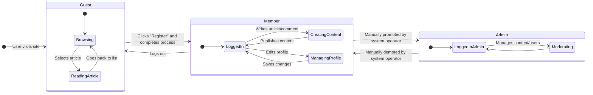

# User Actors, Permissions, and Authentication

## 1. Introduction

This document defines the user actors (roles), specifies their permissions, and details the authentication and account management requirements for the **discussionBoard** service. It is a critical resource for backend developers implementing the system's security, access control, and user lifecycle logic. The roles are designed to create a clear separation between anonymous visitors (`Guest`), registered content contributors (`Member`), and privileged system operators (`Admin`).

All requirements herein are specified using the **EARS (Easy Approach to Requirements Syntax)** format to ensure they are unambiguous, atomic, and testable. For further context on user journeys, refer to the `03-core-user-scenarios.md` document.

## 2. User Actor Definitions

The system will implement three distinct user actors:

*   **Guest**: An unauthenticated, anonymous user who can browse public content. Guests represent casual visitors who are consuming information without contributing.
*   **Member**: An authenticated user who has successfully registered and logged in. Members are the core of the community, with permissions to create and manage their own content (articles and comments).
*   **Admin**: A privileged, authenticated user with global administrative rights. Admins are responsible for moderating content, managing users, and ensuring the overall health and integrity of the platform.

## 3. User State Diagram

The following diagram illustrates the primary states and transitions for a user within the system.

## 4. Authentication and Account Management Requirements

This section defines the requirements for user authentication and self-service account management features available to Members.

### 4.1. User Registration
*   **EARS-AUTH-01**: WHEN a `Guest` provides a unique username, a valid email address, and a secure password, **THE** system **SHALL** create a new `Member` account with a "pending verification" status.
*   **EARS-AUTH-02**: WHEN a new account is created, **THE** system **SHALL** send an account verification link to the provided email address.
*   **EARS-AUTH-03**: **IF** the provided username or email already exists, **THEN** **THE** system **SHALL** reject the registration and notify the user of the conflict.
*   **EARS-AUTH-04**: WHEN a user clicks the verification link, **THE** system **SHALL** update the account status to "active" and log the user in.

### 4.2. User Login and Logout
*   **EARS-AUTH-05**: WHEN a user provides the correct credentials (username/email and password) for an "active" account, **THE** system **SHALL** authenticate them and establish a session.
*   **EARS-AUTH-06**: **IF** a user provides incorrect credentials, **THEN** **THE** system **SHALL** deny access and display a generic "Invalid credentials" message.
*   **EARS-AUTH-07**: **IF** a user attempts to log in with an account that is "pending verification" or "banned", **THEN** **THE** system **SHALL** deny access and provide a relevant status message.
*   **EARS-AUTH-08**: WHEN an authenticated `Member` or `Admin` requests to log out, **THE** system **SHALL** terminate their session.

### 4.3. Member Account Management
*   **EARS-AUTH-09**: **THE** system **SHALL** allow an authenticated `Member` to change their own password after confirming their current password.
*   **EARS-AUTH-10**: **THE** system **SHALL** allow an authenticated `Member` to update their own email address. **IF** the email is changed, **THEN** **THE** system **SHALL** require re-verification.

## 5. Guest Permissions

Guests have read-only access.

*   **EARS-PERM-G-01**: **THE** system **SHALL** allow `Guests` to view a list of all published articles.
*   **EARS-PERM-G-02**: **THE** system **SHALL** allow `Guests` to read the full content of any published article, including its file attachments.
*   **EARS-PERM-G-03**: **THE** system **SHALL** allow `Guests` to view all visible comments associated with an article.
*   **EARS-PERM-G-04**: **THE** system **SHALL** allow `Guests` to search for articles by title or content.
*   **EARS-PERM-G-05**: **IF** a `Guest` attempts to perform any action requiring authentication (e.g., create an article), **THEN** **THE** system **SHALL** block the action and prompt them to log in or register.

## 6. Member Permissions

A `Member` inherits all permissions of a `Guest` and has the following additional content management rights:

### 6.1. Article Management
*   **EARS-PERM-M-01**: WHEN a `Member` submits an article with a title and content, **THE** system **SHALL** create the article and assign the `Member` as its author.
*   **EARS-PERM-M-02**: **THE** system **SHALL** allow a `Member` to edit any article they have authored.
*   **EARS-PERM-M-03**: **THE** system **SHALL** allow a `Member` to delete any article they have authored.
*   **EARS-PERM-M-04**: **IF** a `Member` attempts to edit or delete another user's article, **THEN** **THE** system **SHALL** deny the request with an authorization error.

### 6.2. Comment Management
*   **EARS-PERM-M-05**: WHEN a `Member` submits a comment on an article, **THE** system **SHALL** create the comment and assign the `Member` as its author.
*   **EARS-PERM-M-06**: **THE** system **SHALL** allow a `Member` to edit any comment they have authored.
*   **EARS-PERM-M-07**: **THE** system **SHALL** allow a `Member` to delete any comment they have authored.
*   **EARS-PERM-M-08**: **IF** a `Member` attempts to edit or delete another user's comment, **THEN** **THE** system **SHALL** deny the request with an authorization error.

### 6.3. File Attachment
*   **EARS-PERM-M-09**: **WHILE** a `Member` is creating or editing an article they have authored, **THE** system **SHALL** allow them to attach and remove images and files as per the `06-file-attachment-requirements.md`.

## 7. Admin Permissions

An `Admin` inherits all permissions of a `Member` and has the following additional moderation and administration rights:

### 7.1. Global Content Moderation
*   **EARS-PERM-A-01**: **THE** system **SHALL** allow an `Admin` to edit the content of any article or comment on the platform.
*   **EARS-PERM-A-02**: **THE** system **SHALL** allow an `Admin` to delete any article or comment on the platform.
*   **EARS-PERM-A-03**: **THE** system **SHALL** allow an `Admin` to view content in any state (e.g., hidden, reported).

### 7.2. User Management
*   **EARS-PERM-A-04**: **THE** system **SHALL** allow an `Admin` to view a list of all registered users and their account details, including email, registration date, and account status.
*   **EARS-PERM-A-05**: **THE** system **SHALL** allow an `Admin` to view a specific user's activity, including a list of all articles and comments they have posted.
*   **EARS-PERM-A-06**: **THE** system **SHALL** allow an `Admin` to ban a `Member` account, which prevents the user from logging in.
*   **EARS-PERM-A-07**: **THE** system **SHALL** allow an `Admin` to lift a ban on a `Member` account.

### 7.3. Administrative Interface
*   **EARS-PERM-A-08**: **THE** system **SHALL** provide an `Admin` with access to a dedicated dashboard for performing all moderation and user management tasks.

## 8. Permission Summary Matrix

The following table summarizes the key permissions for each user actor.

| Feature / Action | Guest | Member | Admin |
|---|:---:|:---:|:---:|
| **--- Account ---** | | | |
| Register | ✅ | N/A | N/A |
| Login / Logout | ✅ | ✅ | ✅ |
| Change Own Password | ❌ | ✅ | ✅ |
| **--- Article ---** | | | |
| View Article List | ✅ | ✅ | ✅ |
| View Article Details | ✅ | ✅ | ✅ |
| Search Articles | ✅ | ✅ | ✅ |
| Create Article | ❌ | ✅ | ✅ |
| Edit Own Article | ❌ | ✅ | ✅ |
| Delete Own Article | ❌ | ✅ | ✅ |
| Edit Any Article | ❌ | ❌ | ✅ |
| Delete Any Article | ❌ | ❌ | ✅ |
| **--- Comment ---** | | | |
| View Comments | ✅ | ✅ | ✅ |
| Create Comment | ❌ | ✅ | ✅ |
| Edit Own Comment | ❌ | ✅ | ✅ |
| Delete Own Comment | ❌ | ✅ | ✅ |
| Edit Any Comment | ❌ | ❌ | ✅ |
| Delete Any Comment | ❌ | ❌ | ✅ |
| **--- Attachment ---** | | | |
| View Attachments | ✅ | ✅ | ✅ |
| Add/Remove on Own Article | ❌ | ✅ | ✅ |
| Add/Remove on Any Article | ❌ | ❌ | ✅ |
| **--- Administration ---** | | | |
| View User List | ❌ | ❌ | ✅ |
| View User Activity | ❌ | ❌ | ✅ |
| Ban / Un-ban User | ❌ | ❌ | ✅ |
| Access Admin Dashboard | ❌ | ❌ | ✅ |
