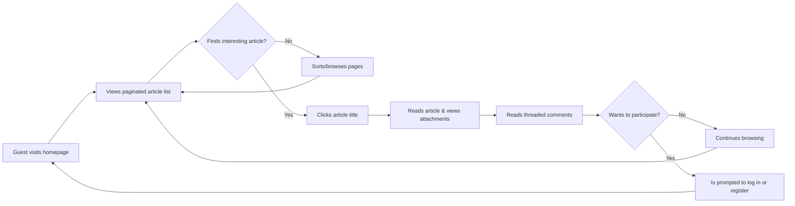

# Core User Scenarios

This document illustrates the primary user journeys on the discussion board. These scenarios provide context for the functional requirements by demonstrating how different user actors interact with the platform to achieve their goals. Each scenario is described from a user's perspective to offer a clear, narrative-driven guide for developers, ensuring the end product aligns with user expectations.

For detailed definitions of user roles and their specific permissions, please refer to the [User Actors and Permissions](./02-user-actors-and-permissions.md) document.

## Scenario 1: A Guest Explores the Discussions

**Actor**: A `Guest` (unauthenticated user).

**Goal**: To browse the latest discussions on economics and politics to evaluate the quality of the community and its content.

Alex, a university student studying political science, hears about this new discussion board from a professor and decides to check it out. He is not ready to create an account yet; he first wants to see if the platform hosts substantive conversations.

1.  Alex navigates to the discussion board's homepage. The interface is clean and minimalist.
2.  He is immediately presented with a paginated list of the most recent articles. Each entry in the list displays the article's **title**, the author's **username**, the **publication date**, and the **comment count**.
3.  He uses the sorting option at the top of the list to re-order the articles by "Most Popular" to see which topics are generating the most engagement.
4.  A title, "The Future of Global Trade Agreements," catches his eye. He clicks on this title.
5.  The system instantly loads the full article page. Alex reads the well-formatted content, which includes bolded text for emphasis and an embedded chart image that visualizes key economic data.
6.  Below the article, he finds the comments section, where contributions are displayed chronologically. He notices replies are indented, making it easy to follow specific conversational threads.
7.  He spends several minutes reading through the different perspectives, noting the respectful tone of the debate.
8.  As a guest, Alex cannot participate. A clear message at the bottom of the comments section states: "Log in or create an account to join the discussion." This serves as a call-to-action.

This journey highlights the critical read-only experience for unauthenticated users, which is designed to be seamless and demonstrate the platform's value to encourage registration.



## Scenario 2: A New User Registers and Becomes a Member

**Actor**: A `Guest` transitioning to a `Member`.

**Goal**: To create a personal account to actively participate in discussions.

Impressed with the content quality, Alex decides to join the community. He wants to reply to a comment and eventually post his own articles.

1.  From the prompt at the bottom of the comments, Alex clicks the "create an account" link.
2.  He is directed to a single, uncluttered registration form. The form requires three fields: a **unique username**, a **valid email address**, and a **password**.
3.  As he types his password, a small tooltip appears indicating the password must be at least 10 characters long and contain a mix of letters, numbers, and symbols.
4.  After filling out the form, he clicks "Register." The system validates the inputs and informs him that a verification email has been sent to his address to confirm ownership.
5.  Alex opens his email client, finds the email from the discussion board, and clicks the verification link within it.
6.  The link directs him back to the site, where a success message confirms, "Your account has been activated. Welcome!"
7.  The system automatically logs him in. The header of the site now shows his username and a "Log Out" button, replacing the previous "Log In" and "Register" links. He also now sees a "Create Article" button, signaling his new capabilities as a `Member`.

```mermaid
graph TD
    A["User clicks 