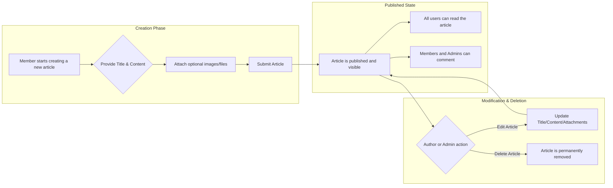

# Article Management Requirements

| Version | Date       | Author        | Changes                                                                                                                                                                                                                                                                                                                                                                                    | 
| :------ | :--------- | :------------ | :----------------------------------------------------------------------------------------------------------------------------------------------------------------------------------------------------------------------------------------------------------------------------------------------------------------------------------------------------------------------------------------- | 
| 1.0     | 2025-11-06 | AutoBE System | Initial draft.                                                                                                                                                                                                                                                                                                                                                                             | 
| 1.1     | 2025-11-06 | AutoBE System | - Enhanced detail across all sections for developer clarity.  - Added a detailed Article Data Model table with constraints.  - Refined EARS statements to include error responses.  - Added sorting options to the Article Reading section.  - Expanded the Article Search section.  - Added a new section for critical Non-Functional Requirements (Performance & Security). | 

## 1. Introduction

This document provides the detailed functional and non-functional requirements for the management of articles on the economic and political discussion board. Articles are the central content of the platform, serving as the starting point for all discussions. These specifications define the business logic for creating, reading, updating, deleting, and searching for articles. The requirements outlined here are intended for backend developers and focus exclusively on business rules, system behavior, and performance, not on user interface (UI) design.

This document answers the following key questions:
- What information is required to create an article?
- How are articles displayed, sorted, and filtered?
- Who has the right to edit or remove an article?
- What are the performance and security expectations?

All requirements are designed to be specific, measurable, and testable to ensure clarity and a successful implementation. For details on user roles and permissions mentioned herein, please refer to the **[02-user-actors-and-permissions.md](./02-user-actors-and-permissions.md)** document.

## 2. Article Data Model

An "Article" represents a post made by a user on the discussion board. The following table details its attributes from a business logic perspective.

| Attribute           | Data Type            | Constraints                                                                          | Description                                                                                             | 
| :------------------ | :------------------- | :----------------------------------------------------------------------------------- | :------------------------------------------------------------------------------------------------------ | 
| `id`                  | UUID                 | Primary Key, Auto-generated                                                          | Unique identifier for the article.                                                                      | 
| `title`               | String               | Mandatory, Min length: 5, Max length: 255 characters                                  | The brief, descriptive title of the article.                                                            | 
| `content`             | Text                 | Mandatory, Min length: 20 characters                                                 | The main body content of the article.                                                                   | 
| `authorId`            | UUID                 | Foreign Key (references User)                                                        | A reference to the **Member** who created the article.                                                  | 
| `createdAt`           | DateTime             | Auto-generated on creation                                                           | Timestamp indicating when the article was first saved.                                                  | 
| `updatedAt`           | DateTime             | Auto-updated on modification                                                         | Timestamp indicating when the article was last modified.                                                | 

Related data, such as attachments and comments, are managed as separate entities linked to the article. Refer to **[06-file-attachment-requirements.md](./06-file-attachment-requirements.md)** and **[05-comment-management-requirements.md](./05-comment-management-requirements.md)** for details.

## 3. Article Lifecycle Flow

The following diagram illustrates the lifecycle of an article from creation to potential deletion, including the key user actions.

## 4. Functional Requirements

This section details the specific requirements for each function related to article management using the **Easy Approach to Requirements Syntax (EARS)** format.

### 4.1. Article Creation

- **WHEN** a user who is not authenticated as a **Member** or **Admin** attempts to create an article, **THE** system **SHALL** deny the request with a `403 Forbidden` error.
- **WHEN** a **Member** initiates the article creation process, **THE** system **SHALL** require a `title` and `content`.
- **IF** the `title` is missing or fails validation (e.g., length constraints), **THEN THE** system **SHALL** reject the creation request with a `400 Bad Request` error and a message indicating the specific failure.
- **IF** the `content` is missing or fails validation, **THEN THE** system **SHALL** reject the creation request with a `400 Bad Request` error and a message indicating the specific failure.
- **WHEN** a **Member** successfully submits a new article, **THE** system **SHALL** record the creator as the article's `author`.
- **THE** system **SHALL** automatically set the `createdAt` and `updatedAt` timestamps to the time of creation.
- **WHERE** the creation request includes file attachments, **THE** system **SHALL** process and associate them with the article according to the rules in the **[06-file-attachment-requirements.md](./06-file-attachment-requirements.md)**.

### 4.2. Article Reading

#### 4.2.1. List View

- **THE** system **SHALL** display articles in a paginated list to all users.
- **THE** system **SHALL** display a maximum of 20 articles per page.
- **THE** system **SHALL** by default, sort the article list by `createdAt` in descending order (newest first).
- **THE** system **SHALL** provide optional sorting mechanisms to list articles by:
    - `createdAt` (ascending or descending).
    - `commentCount` (descending) to show most discussed articles.
- **WHEN** displaying an article in a list, **THE** system **SHALL** show its `title`, `author`'s username, `createdAt` timestamp, and the total count of comments.

#### 4.2.2. Detail View

- **WHEN** any user selects an article, **THE** system **SHALL** display the article's full `title` and `content`.
- **THE** system **SHALL** also display the `author`'s username, the `createdAt`, and the `updatedAt` timestamps.
- **WHERE** an article has associated file attachments, **THE** system **SHALL** provide metadata and secure links for users to download them.
- **WHERE** an article has comments, **THE** system **SHALL** display them according to the specifications in the **[05-comment-management-requirements.md](./05-comment-management-requirements.md)**.

### 4.3. Article Updating

- **WHEN** the user requesting an update is the article's `author` (a **Member**), **THE** system **SHALL** allow them to modify the `title`, `content`, and attachments.
- **WHEN** the user requesting an update is an **Admin**, **THE** system **SHALL** allow them to modify the `title`, `content`, and attachments of any article.
- **WHEN** a user who is not the `author` or an **Admin** attempts to update an article, **THE** system **SHALL** deny the request with a `403 Forbidden` error.
- **WHEN** an article is successfully updated, **THE** system **SHALL** update the `updatedAt` timestamp to the time of the modification.

### 4.4. Article Deletion

- **WHEN** the user requesting deletion is the article's `author` (**Member**), **THE** system **SHALL** permit the deletion.
- **WHEN** the user requesting deletion is an **Admin**, **THE** system **SHALL** permit the deletion of any article.
- **WHEN** a user who is not the `author` or an **Admin** attempts to delete an article, **THE** system **SHALL** deny the request with a `403 Forbidden` error.
- **WHEN** an article is deleted, **THE** system **SHALL** permanently remove the article and all its associated data, including:
    - All comments associated with the article.
    - All file attachment records and the files themselves from storage.
- **THE** system **SHALL** require a confirmation step before proceeding with a deletion to prevent accidental data loss.

### 4.5. Article Search

- **THE** system **SHALL** provide a search function available to all user roles.
- **WHEN** a user provides a search term, **THE** system **SHALL** return a paginated list of articles where the search term appears in either the `title` or the `content`.
- **THE** system **SHALL** enforce a minimum search term length of 3 characters.
- **IF** the search term is shorter than 3 characters, **THEN THE** system **SHALL** return a `400 Bad Request` error with an informative message.
- The search **SHALL** be case-insensitive.
- The search results **SHALL** be displayed in the same format as the main article list view, sorted by relevance or by `createdAt` (descending).
- **IF** a search yields no results, **THEN THE** system **SHALL** display a message indicating that no matching articles were found.

## 5. Non-Functional Requirements

### 5.1. Performance

- **WHEN** a user requests the article list view, **THE** system **SHALL** respond with the first page of results within 1.5 seconds.
- **WHEN** a user requests the detail view of an article (including comments and attachment metadata), **THE** system **SHALL** render the content within 2 seconds.

### 5.2. Security

- **THE** system **SHALL** sanitize all user-provided input (`title`, `content`) before it is stored or rendered to prevent Cross-Site Scripting (XSS) attacks.
- **THE** system **SHALL** validate that the user performing an update or delete action has the proper authority (**author** or **Admin**) on the server-side, never relying solely on client-side controls.
