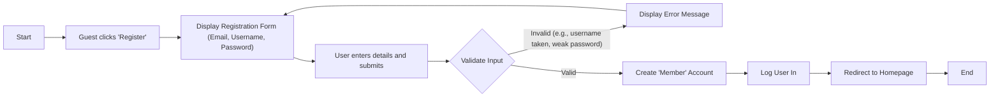
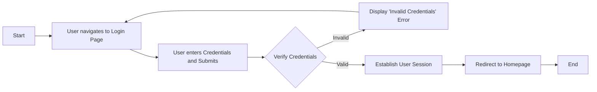
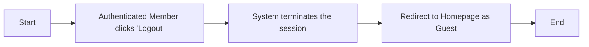
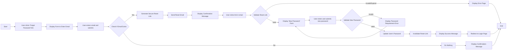

# User Authentication Scenarios

This document details the standard user authentication flows for the discussion board. It describes the step-by-step processes for user registration, login, logout, and password recovery from a user's perspective. These scenarios are based on the roles defined in the [User Actors and Permissions](./03-user-actors-and-permissions.md) document.

## User Registration

This scenario describes how a new user (`Guest`) creates an account to become a `Member`.

### Flow Description

A guest initiates the registration process to create a new account. They must provide a valid and unique email address, a unique username, and a secure password. Upon successful validation and submission, the system creates the account and logs the new member in, granting them access to member-only features.

### Flow Diagram

### Functional Requirements

*   **WHEN** a guest submits the registration form, **THE** system **SHALL** validate that the email address and username are unique and the password meets complexity requirements.
*   **IF** the submitted email address is already registered, **THEN THE** system **SHALL** display an error message indicating the email is in use.
*   **IF** the submitted username is already taken, **THEN THE** system **SHALL** display an error message indicating the username is in use.
*   **IF** the password does not meet the defined security criteria (e.g., length, character types), **THEN THE** system **SHALL** display an error message outlining the requirements.
*   **WHEN** registration input is successfully validated, **THE** system **SHALL** create a new user account with the `member` role.
*   **WHEN** a new account is created, **THE** system **SHALL** automatically log the user into the service.

## User Login

This scenario describes how an existing user signs into the service.

### Flow Description

A user provides their credentials (email or username and password) to access their account. If the credentials are correct, the system grants them access and establishes a session. If not, an error is shown, and access is denied.

### Flow Diagram

### Functional Requirements

*   **WHEN** a user submits login credentials, **THE** system **SHALL** verify them against the stored user records.
*   **IF** the credentials are valid, **THEN THE** system **SHALL** establish an authenticated session for the user.
*   **IF** the credentials are not valid, **THEN THE** system **SHALL** deny access and display a generic "Invalid credentials" error message.
*   **THE** system **SHALL** provide a link to the "Password Reset" flow on the login page for users who have forgotten their password.

## User Logout

This scenario describes how an authenticated member ends their session.

### Flow Description

An authenticated user chooses to log out. The system securely terminates their session, revokes their authenticated status, and returns them to the public view of the site as a guest.

### Flow Diagram

### Functional Requirements

*   **WHEN** an authenticated user initiates a logout action, **THE** system **SHALL** terminate the user's session.
*   **WHEN** a user's session is terminated, **THE** system **SHALL** redirect the user to the site's homepage with guest-level permissions.

## Password Reset

This scenario describes how a user can recover their account if they have forgotten their password.

### Flow Description

The user requests a password reset by providing their registered email address. The system sends an email containing a secure, one-time link to that address. The user follows the link to a page where they can set a new password. After successfully setting a new password, they can log in again.

### Flow Diagram

### Functional Requirements

*   **WHEN** a user requests a password reset for a specific email address, **THE** system **SHALL** send an email with a secure, time-limited password reset link to that address.
*   **IF** the email address provided by the user does not exist in the system, **THEN THE** system **SHALL** still display a generic confirmation message to prevent user account enumeration attacks.
*   **WHEN** a user navigates to the password reset link, **THE** system **SHALL** validate that the link is active and not expired.
*   **IF** the password reset link is valid, **THEN THE** system **SHALL** present the user with a form to set a new password.
*   **IF** the password reset link is invalid or expired, **THEN THE** system **SHALL** display an error page with instructions to initiate the process again.
*   **WHEN** a user successfully submits a new password, **THE** system **SHALL** update the user's credentials and permanently invalidate the used reset link.