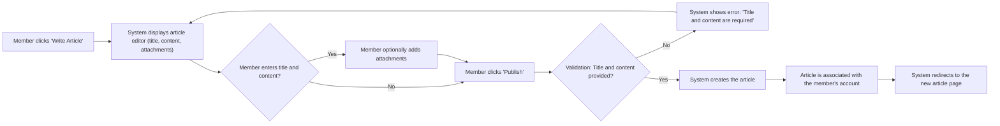
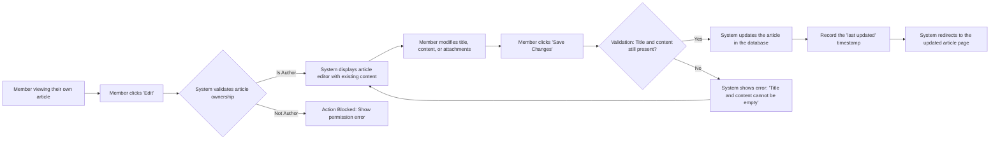
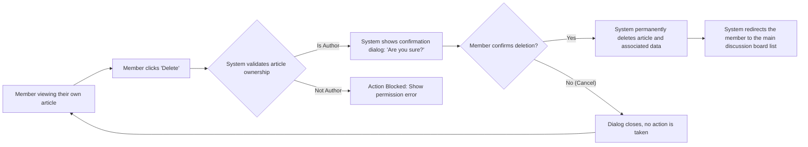

'''
# Article Management Scenarios

This document outlines the user interaction flows and system requirements for managing articles on the discussion board. These scenarios primarily focus on the capabilities of the "member" user actor.

## Creating a New Article

This scenario describes the process for an authenticated member to create and publish a new article. The system must provide a user-friendly way to input content and attach relevant files.

### Business Rules and Requirements
- **WHEN** a member initiates the creation of a new article, **THE** system **SHALL** present them with an interface to enter a title and content.
- **THE** system **SHALL** require a title for every new article.
- **THE** system **SHALL** require content for every new article.
- **WHERE** the user is a logged-in member, **THE** system **SHALL** allow the member to attach images and files to the article.
- For detailed rules regarding file uploads, please refer to the [File Attachment Requirements](./07-file-attachment-requirements.md).
- **WHEN** a member submits a valid new article, **THE** system **SHALL** record the article in the database, associating it with the member's user ID.
- **THE** system **SHALL** set the initial view count of a new article to 0.
- **THE** system **SHALL** record the creation timestamp for the article.

### User Flow Diagram

## Viewing an Article

This scenario covers how any user (guest or member) views a published article. The display should be clear, informative, and provide access to all associated content.

### Business Rules and Requirements

- **WHEN** a user selects an article to view, **THE** system **SHALL** increment the article's view count by one.
- **THE** system **SHALL** display the article's title, full content, the author's display name, and the creation/publication date.
- **THE** system **SHALL** display the current view count and the total number of comments.
- **IF** the article has attached images, **THEN THE** system **SHALL** display them within the article content.
- **IF** the article has attached files, **THEN THE** system **SHALL** provide downloadable links to them.
- **THE** system **SHALL** list all comments associated with the article below the main content.

### Display Components

| Element | Description |
|---|---|
| **Title** | The main title of the article. |
| **Author** | The display name of the member who created the article. |
| **Date** | The date and time the article was published. |
| **Content** | The full body of the article. |
| **View Count** | The number of times the article has been viewed. |
| **Attachments** | Embedded images and links to downloadable files. |
| **Comments** | A section displaying user-submitted comments. |

## Updating an Existing Article

This scenario details the process for a member to edit an article they have previously created. The system must ensure that only the original author can modify their content.

### Business Rules and Requirements

- **WHERE** the currently logged-in member is the author of the article, **THE** system **SHALL** allow them to initiate an update.
- **IF** a member attempts to edit an article they did not create, **THEN THE** system **SHALL** deny the request and show a "Permission Denied" error message.
- **WHEN** an author updates an article, **THE** system **SHALL** allow them to modify the title and content.
- **WHEN** an author updates an article, **THE** system **SHALL** allow them to add or remove attachments.
- **THE** system **SHALL** record the timestamp of the last update.
- **WHEN** the author saves the changes, **THE** system **SHALL** persist the updated content and display the modified article.

### User Flow Diagram

## Deleting an Article

This scenario outlines the process for an author to permanently remove their article from the discussion board. This action is irreversible and requires confirmation.

### Business Rules and Requirements

- **WHERE** the currently logged-in member is the author of the article, **THE** system **SHALL** allow them to initiate the deletion process.
- **IF** a member attempts to delete an article they did not create, **THEN THE** system **SHALL** deny the request and show a "Permission Denied" error message.
- **WHEN** a member initiates a deletion, **THE** system **SHALL** prompt for confirmation before proceeding.
- **IF** the member cancels the deletion, **THEN THE** system **SHALL** return them to the article page with no changes made.
- **WHEN** the member confirms the deletion, **THE** system **SHALL** permanently remove the article, its associated comments, and all attached files from the database.

### User Flow Diagram

'''