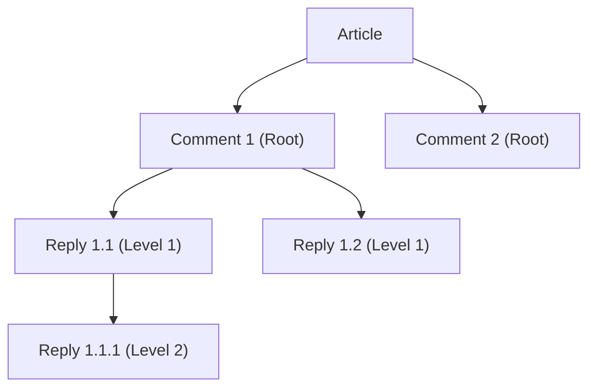

# 05. Comment Management Requirements

## 1. Introduction

This document provides the detailed functional requirements for the comment management system of the discussion board. Comments are the primary mechanism for user interaction and community engagement. These specifications define the business logic for creating, reading, updating, deleting, and nesting comments. The requirements are designed to be unambiguous and testable, providing a clear guide for backend development.

This document is closely related to and builds upon the following documents:
- **[User Actors and Permissions](./02-user-actors-and-permissions.md)**: For definitions of `Guest`, `Member`, and `Admin` roles.
- **[Article Management Requirements](./04-article-management-requirements.md)**: As comments are directly associated with articles.

## 2. Comment Entity Attributes

A "Comment" is a user-generated response attached to an article or another comment. The system shall represent each comment with the following attributes:

- **Comment ID**: A unique identifier for the comment.
- **Article ID**: A reference to the parent article.
- **Parent Comment ID**: A nullable reference to the parent comment if it is a reply.
- **Author ID**: A reference to the `Member` who created the comment.
- **Content**: The text body of the comment.
- **Status**: The current state of the comment (e.g., `VISIBLE`, `DELETED`).
- **Creation Timestamp**: The date and time when the comment was created.
- **Last Updated Timestamp**: The date and time when the comment was last modified.

## 3. Comment Lifecycle and Threading

The following diagrams illustrate the lifecycle of a comment and how comments are structured in threads.

### Comment Lifecycle

```mermaid
graph TD
    A['New Comment Submitted'] --> B{Has Replies?};
    
    subgraph 'Visible State'
        C['Comment is Visible'];
    end

    A --> C;
    C --> D['Deletion Requested by Author/Admin'];
    D --> B;
    B -->|'No'| E['Permanent Deletion (Hard-Delete)'];
    B -->|'Yes'| F['Content Replaced (Soft-Delete)'];

    subgraph 'End State'
        G['Record Removed'];
        H['Record Kept, Content Hidden'];
    end

    E --> G;
    F --> H;
```

### Comment Threading Structure



## 4. Functional Requirements

This section details the specific requirements for comment management using the EARS format.

### 4.1. Comment Creation

- **WHEN** a user who is a `Member` submits a comment to an article, **THE** system **SHALL** create a new comment record associated with the article and the member's account.
- **IF** a user who is a `Guest` attempts to create a comment, **THEN** **THE** system **SHALL** deny the request and prompt them to log in.
- **THE** system **SHALL** require comment `Content` to be non-empty.
- **IF** the `Content` is empty, **THEN** **THE** system **SHALL** reject the request and inform the user that a comment cannot be empty.
- **WHEN** a new comment is created, **THE** system **SHALL** set its `Status` to `VISIBLE` and record its `Creation Timestamp`.

### 4.2. Comment Reading and Display

- **THE** system **SHALL** display all comments with a `VISIBLE` status to any user (`Guest`, `Member`, or `Admin`) viewing an article.
- **THE** system **SHALL** display root-level comments (comments with no `Parent Comment ID`) in chronological order, with the oldest appearing first.
- **WHERE** an article has more than 20 root-level comments, **THE** system **SHALL** paginate the comment list, displaying a maximum of 20 root-level comments per page.
- **WHEN** displaying a comment, **THE** system **SHALL** also display its nested replies.

### 4.3. Comment Updating

- **WHERE** the requesting user is the `Author` of the comment, **THE** system **SHALL** permit them to update the comment's `Content`.
- **IF** a user who is not the original `Author` attempts to update a comment, **THEN** **THE** system **SHALL** deny the request.
- **IF** an `Admin` attempts to edit a comment, **THE** system **SHALL** permit the update for moderation purposes.
- **IF** an update is attempted more than 24 hours after the comment's `Creation Timestamp`, **THEN** **THE** system **SHALL** deny the request, unless the user is an `Admin`.
- **WHEN** a comment is successfully updated, **THE** system **SHALL** update the `Last Updated Timestamp`.

### 4.4. Comment Deletion (Soft and Hard Delete)

- **WHEN** the `Author` or an `Admin` requests to delete a comment, **THE** system **SHALL** process the deletion.
- **IF** a user who is not the `Author` or an `Admin` attempts to delete a comment, **THEN** **THE** system **SHALL** deny the request.
- **IF** a comment being deleted has no replies (no other comments list it as a `Parent Comment ID`), **THEN** **THE** system **SHALL** permanently remove the comment record from the database (hard-delete).
- **IF** a comment being deleted has one or more replies, **THEN** **THE** system **SHALL** perform a soft-delete by:
    1. Setting the comment's `Status` to `DELETED`.
    2. Replacing its `Content` with a marker (e.g., "[This comment has been deleted]").
    3. Disassociating the comment from the `Author ID`.

### 4.5. Nested Comments and Threading

- **WHEN** a `Member` submits a reply to an existing comment, **THE** system **SHALL** associate the new comment as a child by setting its `Parent Comment ID`.
- **THE** system **SHALL** visually indent replies under their parent comment to represent the conversation thread.
- **THE** system **SHALL** limit comment nesting to a maximum depth of 5 levels.
- **IF** a `Member` attempts to reply to a comment at the maximum nesting depth (level 5), **THEN** **THE** system **SHALL** prevent the creation of the reply.
- **IF** a user attempts to reply to a comment whose `Status` is `DELETED`, **THEN** **THE** system **SHALL** deny the request.