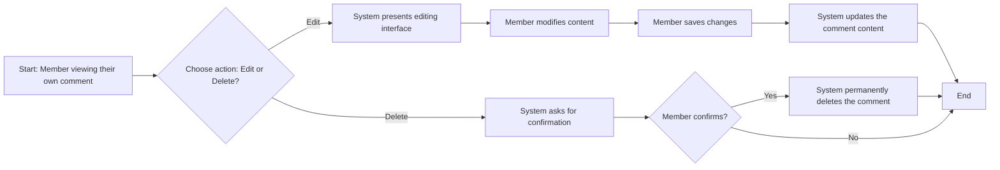

# Comment Management Scenarios

## Introduction

This document outlines the requirements and user-facing scenarios for comment management on the discussion board. Comments are a fundamental feature for enabling user interaction and discussion on articles. The following sections describe the complete lifecycle of a comment, from creation to potential deletion, from the perspective of the different user actors: `guest`, `member`, and `admin`.

These scenarios focus on the business logic and user flows. For a complete understanding of user permissions, please refer to the [User Actors and Permissions](./03-user-actors-and-permissions.md) document.

## Adding a Comment to an Article

Only authenticated members are permitted to add comments to articles. This functionality is the primary method for users to engage in discussions about the content presented.

### Scenario: A Member Adds a Comment

WHEN a `member` is viewing an article and submits a new comment, THE system SHALL save the comment content and associate it with the active article.

### Business Rules
- THE system SHALL require a user to be an authenticated `member` to post a comment.
- IF a `guest` attempts to add a comment, THEN THE system SHALL prompt them to log in or register.
- THE system SHALL require comment content to be non-empty.
- THE system SHALL link each new comment to the specific article it was posted on.

### Flow Diagram: Adding a Comment

```mermaid
graph LR
    A["Start: User viewing an article"] --> B{User is a "member"?};
    B -->|"Yes"| C["User writes a comment"];
    C --> D["User submits the comment"];
    D --> E{"Is comment content valid (not empty)?"};
    E -->|"Yes"| F["System saves the comment"];
    F --> G["System associates comment with article"];
    G --> H["System displays the new comment under the article"];
    H --> I["End"];
    
    B -->|"No (Guest)"| J["System prompts user to log in"];
    J --> I;
    E -->|"No"| K["System shows an error message (e.g., 'Comment cannot be empty')"];
    K --> C;
```

## Viewing Comments

All users, including guests, can view the comments posted on an article. This ensures that discussions are open and readable to everyone, encouraging new users to sign up and participate.

### Scenario: A User Views Comments on an Article

WHEN any user (`guest`, `member`, `admin`) views an article, THE system SHALL display all approved comments associated with that article.

### Business Rules
- THE system SHALL display comments in chronological order, with the oldest comment appearing first.
- THE system SHALL display the `member`'s username and the timestamp for each comment.
- THE system SHALL not display any comments that have been removed by a moderator.

## Editing a Comment

Members are allowed to edit their own comments to correct mistakes or clarify their thoughts. This capability is restricted to the original author of the comment to maintain the integrity of the conversation.

### Scenario: A Member Edits Their Own Comment

WHEN a `member` chooses to edit a comment they have previously posted, THE system SHALL present them with an interface to modify the comment's content and save the changes.

### Business Rules
- THE system SHALL only allow a `member` to edit their own comments.
- IF a `member` attempts to edit a comment posted by another user, THEN THE system SHALL prevent the action.
- WHEN a comment is successfully edited, THE system SHALL update its content and may display an "edited" indicator to other users.

## Deleting a Comment

Members can delete their own comments. Additionally, administrators have the authority to delete any comment as part of their content moderation duties.

### Scenario: A Member Deletes Their Own Comment

WHEN a `member` chooses to delete a comment they have posted, THE system SHALL ask for confirmation and then permanently remove the comment from the article's discussion.

### Business Rules
- THE system SHALL only allow a `member` to delete their own comments.
- WHEN a `member` confirms the deletion, THE system SHALL permanently remove the comment from view.
- WHERE an `admin` is performing moderation tasks, THE system SHALL allow the admin to delete any comment on any article. This action is further detailed in the [Content Moderation Requirements](./08-content-moderation-requirements.md).

### Flow Diagram: Editing or Deleting a Comment


```
