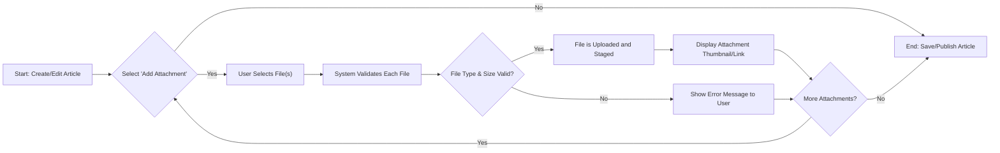

'''
# File Attachment Requirements

This document outlines the specific requirements for handling file and image attachments within the discussionBoard service. Attachments are a core feature, allowing members to enrich their articles with supplementary materials. These requirements are intended for the development team to ensure a consistent and secure implementation.

All attachment functionalities are linked to the process of managing articles, as detailed in the [Article Management Scenarios](./05-article-management-scenarios.md).

## General Rules

These rules apply to all types of files attached to an article.

*   **Permissions**: Only authenticated users with the `member` role can upload attachments. Guests can view and download attachments but cannot upload them.
*   **Association**: Attachments can only exist as part of an article. They cannot be uploaded to the system independently.
*   **File Size Limit**: Each individual file, regardless of type, must not exceed 10MB.
*   **Quantity Limit**: A single article can have a maximum of 5 attachments.

## Image Attachments

Image attachments are treated as visual content that can be embedded or previewed within an article.

*   **Supported File Types**: The system will accept common web-friendly image formats. Specifically, files with the extensions `.jpg`, `.jpeg`, `.png`, and `.gif` are permitted.
*   **Display**: Attached images should be clearly visible within the article view. The system should be capable of displaying a thumbnail preview that, when clicked, shows the full-size image.

## General File Attachments

General file attachments refer to any non-image file type that provides supplementary information.

*   **Supported File Types**: To balance utility and security, the system will accept a limited set of common document and compressed file formats. Specifically, files with the extensions `.pdf`, `.docx`, `.txt`, and `.zip` are permitted.
*   **Display**: Unlike images, general files will not be previewed directly. Instead, they will be presented as distinct downloadable links within the article. Each link should clearly display the full filename and its size (e.g., "Economic_Report_Q4.pdf (2.5MB)").

## Attachment Management

Members must be able to manage attachments during the lifecycle of an article.

*   **Creation**: WHEN a member is creating a new article, they can add, remove, and review attachments before publishing.
*   **Updating**: WHEN a member is editing an existing article, they can add new attachments (up to the quantity limit) or remove existing ones.
*   **Deletion**: If an article is deleted, all associated attachments stored in the system must also be permanently deleted to free up storage and prevent orphaned files.

## Functional Requirements (EARS Format)

This section provides a formal summary of the file attachment requirements.

*   **UB-1**: THE system SHALL associate attachments exclusively with an article.
*   **ED-1**: WHEN a `member` creates or updates an article, THE system SHALL provide an interface to upload one or more files.
*   **ED-2**: IF a user attempts to upload a file, THEN THE system SHALL validate the file against the defined type and size constraints.
*   **ED-3**: IF a file validation fails, THEN THE system SHALL display a clear error message to the user indicating the reason (e.g., "File size exceeds 10MB" or "File type .xyz is not supported").
*   **ED-4**: IF an article is permanently deleted, THEN THE system SHALL delete all associated attachments from storage.
*   **WH-1**: WHILE a `member` is in the process of creating or editing an article, THE system SHALL allow them to remove any of the currently staged attachments.
*   **OP-1**: WHERE an attachment is an image file (`.jpg`, `.jpeg`, `.png`, `.gif`), THE system SHALL display it as a visual preview within the article content.
*   **OP-2**: WHERE an attachment is a general file (`.pdf`, `.docx`, `.txt`, `.zip`), THE system SHALL display it as a downloadable link.
*   **OP-3**: WHERE an article has attachments, THE system SHALL allow any user with viewing permission (including `guest` and `member`) to download the attached files.

## Upload Process Flow

The following diagram illustrates the workflow for attaching a file to an article.

'''