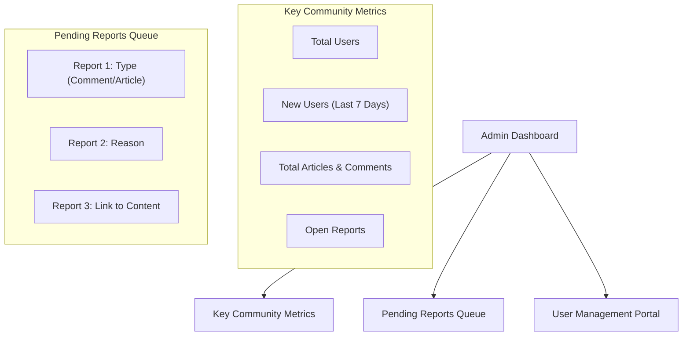

'''# 07. Moderation and Admin Functions

## 1. Introduction

For a discussion board centered on potentially contentious topics like economics and politics, robust moderation tools are not just a feature—they are a necessity for maintaining a productive and safe community. This document outlines the functional requirements for the administrative and moderation systems. These tools are designed to empower administrators to enforce community guidelines, manage users, and respond to issues efficiently.

The primary goal is to provide administrators with the necessary capabilities to ensure the discussion board remains a high-quality platform for debate and conversation, free from spam, abuse, and other disruptive behavior. All administrative actions must prioritize fairness, transparency, and accountability.

## 2. Guiding Principles for Moderation

All moderation activities shall be guided by the following principles:

*   **Accountability**: Every administrative action is traceable. The system must log all moderation actions to ensure that power is exercised responsibly.
*   **Proportionality**: The moderation action taken should be proportional to the severity of the rule violation. The system will provide a range of tools, from gentle warnings to permanent bans, to allow for nuanced responses.
*   **Transparency**: The rules of the community should be clear and easily accessible. While specific moderation actions may remain confidential, the process itself is transparent and rule-based.

## 3. Content Moderation

Content moderation features provide administrators with direct control over all articles and comments on the platform.

### 3.1. Article Moderation

#### Hiding Articles (Soft Deletion)

*   **WHEN** an `admin` views any article, **THE** system **SHALL** provide an option to "Hide" the article.
*   **IF** an `admin` hides an article, **THEN** **THE** system **SHALL** mark the article as hidden.
*   **A hidden article SHALL NOT** appear in any article lists (e.g., homepage, search results) for `guest` or `member` users.
*   **IF** a `guest` or `member` attempts to access a hidden article via a direct URL, **THEN** **THE** system **SHALL** respond with a "Not Found" error (e.g., HTTP 404).
*   **WHEN** an `admin` views a hidden article, **THE** system **SHALL** clearly display its "Hidden" status.

#### Un-hiding Articles

*   **WHEN** an `admin` views a hidden article, **THE** system **SHALL** provide an option to "Un-hide" the article.
*   **IF** an `admin` un-hides an article, **THEN** **THE** system **SHALL** restore its visibility to all users.

#### Deleting Articles (Hard Deletion)

*   **WHEN** an `admin` views an article, **THE** system **SHALL** provide an option to "Permanently Delete" it.
*   **WHEN** an `admin` initiates a deletion, **THE** system **SHALL** require confirmation in a secondary step (e.g., a modal dialog) to prevent accidental data loss.
*   **IF** deletion is confirmed, **THEN** **THE** system **SHALL** permanently remove the article, its associated comments, and any linked file attachments.

### 3.2. Comment Moderation

*   **WHEN** an `admin` views any comment, **THE** system **SHALL** provide options to "Hide" or "Permanently Delete" it.
*   **IF** a comment is hidden, **THEN** **THE** system **SHALL** make it invisible to `guest` and `member` users but remain visible to `admin` users.
*   **IF** a comment is deleted, **THEN** **THE** system **SHALL** permanently remove it and any of its nested replies.
*   **WHEN** an `admin` hides or deletes a comment or article, **THE** system **SHALL** allow the `admin` to record an internal reason for the moderation action, which is stored in the audit log.

## 4. User Management

User management tools allow administrators to investigate user behavior and take disciplinary action.

### 4.1. Viewing User Information and Activity

*   **THE** system **SHALL** provide `admin` actors with a user management interface accessible from the admin dashboard.
*   **THE** system **SHALL** display a searchable and paginated list of all registered `member` users.
*   **THE** system **SHALL** allow an `admin` to search for users by their username or email address.
*   **WHEN** an `admin` selects a user, **THE** system **SHALL** display a detailed profile view containing:
    *   User's username, email, registration date, and current status (e.g., Active, Banned).
    *   A list of all articles created by the user.
    *   A list of all comments made by the user.
    *   A summary of any reports filed against the user.
    *   A log of past moderation actions taken against the user.

### 4.2. User Sanctions (Banning)

*   **WHEN** an `admin` views a user's profile, **THE** system **SHALL** provide an option to "Ban" the user.
*   **WHEN** an `admin` initiates a ban, **THE** system **SHALL** require a reason for the ban to be entered for the audit log.
*   **THE** system **SHALL** allow an `admin` to specify a ban duration from a set of predefined options (e.g., 1 day, 7 days, 30 days, Permanent).
*   **IF** a user is banned, **THEN** **THE** system **SHALL** immediately invalidate all active sessions for that user.
*   **IF** a banned user attempts to log in, **THEN** **THE** system **SHALL** deny the login and display a generic message indicating that their account is suspended.

### 4.3. Lifting a Ban

*   **WHEN** viewing a banned user's profile, **THE** system **SHALL** provide an `admin` with an option to "Lift Ban".
*   **IF** a ban is lifted, **THEN** **THE** system **SHALL** restore the user's status to "Active" and allow them to log in again.

## 5. Admin Dashboard

The admin dashboard is the central hub for all moderation activities.



### 5.1. Key Metrics

*   **THE** Admin Dashboard **SHALL** display the following key metrics:
    *   Total number of registered `member` users.
    *   Number of new `member` sign-ups within the last 7 days.
    *   Total count of publicly visible articles and comments.
    *   Current number of open (unresolved) content reports.

### 5.2. Pending Reports Queue

*   **THE** Admin Dashboard **SHALL** display a list of the most recently reported items that are in an "Open" state.
*   **Each item in the queue SHALL** show the type of content (Article/Comment), the primary reason for the report, and a direct link to the content for review.

## 6. Content Reporting System

A user-driven reporting system is essential for community-led moderation.

### 6.1. User Reporting Process

*   **WHEN** a `member` is viewing an article or a comment, **THE** system **SHALL** provide a "Report" button.
*   **IF** a `member` clicks "Report", **THEN** **THE** system **SHALL** present a form with a predefined list of reasons (e.g., "Spam," "Hate Speech," "Off-Topic") and a text field for an optional description.
*   **WHEN** a report is submitted, **THE** system **SHALL** create a report record with an "Open" status, linked to the content and the reporter.
*   **THE** system **SHALL** not allow a user to report the same piece of content more than once.

### 6.2. Admin Review of Reports

*   **WHEN** an `admin` views content that has open reports, **THE** system **SHALL** display a clear indicator.
*   **THE** system **SHALL** allow an `admin` to view all reports for a piece of content.
*   **WHEN** an `admin` takes a moderation action (e.g., hide, delete) on a reported item, **THE** system **SHALL** automatically update all associated "Open" reports to a "Resolved" status.
*   **WHEN** an `admin` reviews a report but deems no action is necessary, **THE** system **SHALL** provide an option to "Dismiss" the report(s), changing their status from "Open" to "Dismissed".

## 7. Administrative Action Logging (Audit Log)

To ensure accountability, all administrative actions must be logged in an immutable audit trail.

```mermaid
graph LR
    subgraph "Admin Action"
      A["Admin: 