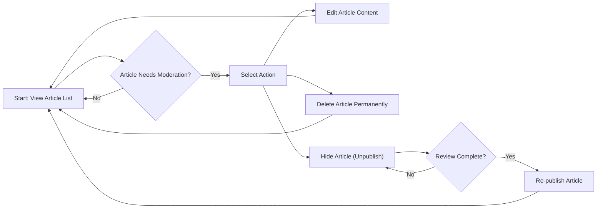
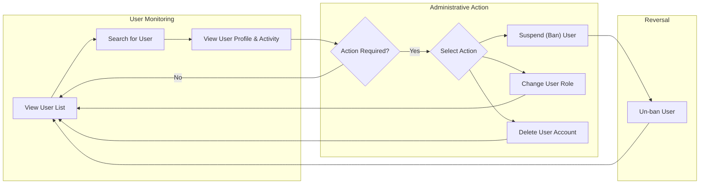

# Content Moderation Requirements

This document outlines the specific requirements for administrative functions related to content and user management on the discussion board. These tools are essential for maintaining a healthy and constructive community environment. All requirements specified herein apply to the **Admin** user actor, as detailed in the [User Actors and Permissions](./03-user-actors-and-permissions.md) document.

## Article Moderation

To ensure content quality and adherence to community guidelines, administrators require robust tools for managing articles.

### General Article Management
*   **THE** system **SHALL** provide Admins with a view of all articles on the platform, regardless of their public visibility status.
*   **WHEN** an Admin accesses the article management interface, **THE** system **SHALL** allow searching and filtering of articles by author, title, and creation date.
*   **WHEN** an Admin selects an article, **THE** system **SHALL** display its full content, including any attached files or images, for review.

### Content Enforcement
*   **WHEN** an Admin deems an article's content inappropriate or containing errors, **THE** system **SHALL** allow the Admin to edit the article's title and body.
*   **WHEN** an Admin determines an article severely violates community policy, **THE** system **SHALL** allow the Admin to permanently delete the article, which also removes all its associated comments and attachments.
*   **IF** an article needs to be temporarily removed from public view for review, **THEN THE** system **SHALL** provide a function for the Admin to "hide" or "unpublish" the article, making it invisible to Guests and Members but still accessible within the admin interface.
*   **WHILE** an article is in a "hidden" state, **THE** system **SHALL** allow an Admin to "re-publish" it, making it visible to all users again.

### Diagram: Article Moderation Flow

## Comment Moderation

Administrators must be able to manage comments to prevent spam, abuse, and off-topic discussions.

### General Comment Management
*   **WHEN** an Admin views an article, **THE** system **SHALL** allow the Admin to view all associated comments.
*   **THE** system **SHALL** enable Admins to search for specific comments within an article by the comment's author or its content.

### Content Enforcement
*   **IF** a comment contains inappropriate language, personal information, or is off-topic, **THEN THE** system **SHALL** allow the Admin to edit the comment's content.
*   **WHEN** an Admin identifies a comment that is spam or abusive, **THE** system **SHALL** allow the Admin to permanently delete the comment.
*   **IF** a comment requires review but not immediate deletion, **THEN THE** system **SHALL** provide a function for the Admin to "hide" the comment, making it invisible to Guests and Members but visible to Admins.

## User Management

Effective user management is critical for community safety and health. Administrators need tools to handle problematic users and manage roles.

### User Information and Monitoring
*   **THE** system **SHALL** provide Admins with a list of all registered users, including both `member` and `admin` roles.
*   **WHEN** an Admin needs to find a specific user, **THE** system **SHALL** allow searching by username or email address.
*   **WHEN** an Admin selects a user, **THE** system **SHALL** display a summary of that user's activity, including a list of articles and comments they have posted.

### User Status and Permissions Management
*   **IF** a user repeatedly violates community guidelines, **THEN THE** system **SHALL** allow an Admin to "ban" or "suspend" the user's account.
*   **WHILE** a user's account is banned, **THE** system **SHALL** prevent them from logging in and creating any new content (articles or comments).
*   **WHEN** a banned user's suspension period is over or the issue is resolved, **THE** system **SHALL** allow an Admin to "un-ban" the user, restoring their original privileges.
*   **WHERE** a user has demonstrated trustworthiness and responsibility, **THE** system **SHALL** allow an Admin to promote a `member` to an `admin` role.
*   **WHEN** an account is determined to be fraudulent or must be removed for legal reasons, **THE** system **SHALL** allow an Admin to permanently delete the user's account and all of their associated content.

### Diagram: User Management Flow

