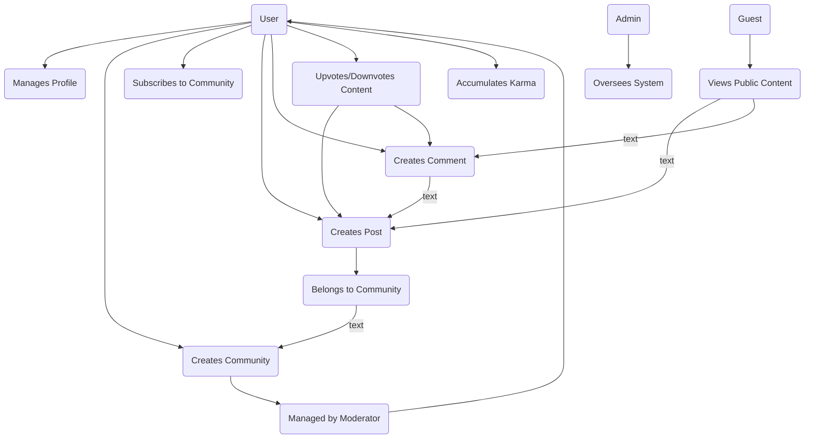

# Service Overview: Community Platform

## 1. Introduction

This document provides a high-level business and strategic overview of the "Community Platform," a service designed to function as a Reddit-like platform for user-driven content and discussion. The fundamental purpose of this platform is to empower users to create, moderate, and participate in interest-based communities. Users can share diverse content formats (text, links, images), engage in conversations through a nested commenting system, and influence content visibility via a voting mechanism. This platform aims to foster vibrant, focused communities by providing robust tools for self-governance and content curation, creating a space for authentic interaction and knowledge sharing.

## 2. Business Model

### 2.1. Business Justification

In the current digital landscape, many social media platforms prioritize broad, algorithm-driven content streams, often leading to diluted conversations and a lack of genuine community. The Community Platform addresses a clear market gap by providing a decentralized space where users can build and cultivate niche communities around specific interests, hobbies, or professional topics. The primary value proposition is to offer a more focused, community-centric experience, where content quality and relevance are determined by the members themselves, not by a global engagement algorithm. This fosters a sense of ownership and belonging that is often missing from larger, more impersonal platforms.

### 2.2. Revenue Strategy

To encourage initial growth and maximize user adoption, the platform will be launched as a free-to-use service without intrusive advertising. The long-term monetization strategy will be multi-faceted to ensure sustainability without compromising the core user experience:

1.  **Premium Memberships**: A subscription model offering enhanced features for a monthly or annual fee. Potential benefits include an ad-free experience, access to exclusive community customization tools (e.g., custom themes), special profile badges to denote supporter status, and the ability to create and join premium-only communities.
2.  **Platform "Coins"**: A virtual currency that users can purchase with real money and award to exceptional posts or comments. This system directly rewards content creators for their contributions and provides a revenue stream through the sale of coin packs. It also enhances user engagement by providing a way to show significant appreciation.
3.  **Promoted Posts**: A non-disruptive, clearly labeled advertising model. Businesses, creators, or other communities can pay to have their posts featured prominently on relevant community pages or the main feed, always marked as "Promoted" to maintain transparency.

### 2.3. Growth and User Acquisition

The growth strategy will focus on organic, community-led expansion. The platform's success is intrinsically linked to the quality and engagement level of its communities. Initial efforts will involve seeding the platform with a diverse range of foundational communities to attract a critical mass of users. From there, growth will be driven by:

*   **Word-of-Mouth**: Empowering users with excellent moderation and community-building tools will encourage them to invite others and champion the platform within their networks.
*   **Niche Community Focus**: Actively attracting users and groups who are looking for a dedicated space for interests that are underserved by mainstream social media platforms.
*   **Search Engine Optimization (SEO)**: Ensuring that all public community content is properly indexed and discoverable through external search engines like Google, driving significant organic traffic to the platform.

## 3. Core Platform Components

The platform is composed of several interconnected components that together facilitate a dynamic community experience. The following diagram illustrates the primary entities and their relationships.

## 4. Feature Overview

The platform will be built upon a set of core features designed to facilitate community creation, content sharing, and user interaction. These are the foundational pillars of the service.

*   **User Management & Profiles**: Secure user registration, authentication, and session management. Every user has a public profile that displays their activity history (posts and comments) and their accumulated Karma score.
*   **Community Creation & Management**: Registered members can create new communities (e.g., "subreddits"), define community-specific rules, customize its appearance, and moderate its content and members.
*   **Content Creation & Sharing**: Users can create posts within communities, with support for multiple content types: text-based discussions, external links with commentary, and direct image uploads.
*   **Voting System (Upvote/Downvote)**: A robust voting mechanism for both posts and comments. This system is the primary driver of content visibility and directly contributes to a user's reputation (Karma).
*   **Nested Commenting & Discussions**: A threaded, hierarchical reply system that allows for organized, multi-level conversations on posts, enabling deep and easy-to-follow discussions.
*   **User Karma & Reputation**: A reputation score for each user, calculated based on the net upvotes their posts and comments receive. Karma can be used to gate certain privileges, like community creation.
*   **Content Sorting & Discovery**: Dynamic sorting algorithms to organize posts within feeds. Users can sort posts by "Hot" (trending), "New," "Top" (highest-rated), and "Controversial" (most divisive).
*   **Community Subscriptions**: Users can subscribe to communities to create a personalized content feed on their homepage,聚合了they are interested in.
*   **Content Moderation & Reporting**: A system for users to report content that violates platform-wide or community-specific rules. Reports are sent to a queue for review by community moderators and system administrators.

## 5. Success Metrics

The success of the Community Platform will be measured by its ability to grow and sustain active, engaged communities. Key Performance Indicators (KPIs) will be tracked to monitor the platform's health and progress toward its business objectives.

*   **User Engagement & Retention**: 
    *   Daily Active Users (DAU) and Monthly Active Users (MAU).
    *   User Retention Rate: Percentage of new users who return after 1 day, 7 days, and 30 days.
    *   Session Duration: Average time spent on the platform per user session.

*   **Content & Community Growth**:
    *   Content Contribution Rate: Daily volume of new posts and comments.
    *   Community Creation Rate: The number of new communities created per week.
    *   Member Growth Rate: The average growth rate of members within the top 100 communities.

*   **Platform Health & Quality**:
    *   Moderation Efficiency: The average time-to-resolution for user-submitted reports of inappropriate content.
    *   Karma Distribution: The statistical distribution of Karma scores across the user base, indicating a healthy contribution ecosystem.