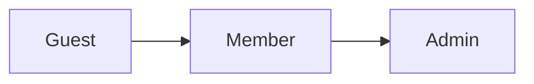

# User Actors and Permissions

## Introduction

This document defines the user actors (roles) for the community platform, details their specific permissions, and outlines the access control strategy. The purpose is to provide a clear and unambiguous specification for developers to build the system's authentication and authorization logic. Every functional requirement involving a user action must adhere to the permissions defined herein.

## User Actors Definition

The system will have three primary user actors, each with a distinct set of capabilities.

### Guest

A Guest is any user who has not authenticated with the system. They have limited, read-only access.

- **Description**: Unauthenticated visitor of the platform.
- **Capabilities**: Can browse public communities, view posts, and read comments.
- **Limitations**: Cannot create posts or comments, vote, subscribe to communities, create communities, or view user profiles.

### Member

A Member is a registered and authenticated user. This is the standard user role with access to all core community features.
- **Description**: Represents a standard registered user of the platform. Members can create communities, post content, comment, vote, and manage their own profile.
- **Capabilities**: Full participation in communities, including creating posts and comments, voting, subscribing, and creating new communities. They can manage their own content and profile.
- **Limitations**: Cannot access administrative functions, manage other users, or moderate content in communities where they are not a designated moderator.

### Admin

An Admin is a superuser with full system-wide privileges for maintenance, moderation, and user management.
- **Description**: Represents a system administrator with full platform privileges. Admins can manage users, oversee all communities, handle reported content, and perform system-wide maintenance.
- **Capabilities**: Can perform any action a Member can, plus manage users (e.g., ban), delete any post or comment, manage all communities, and access a dedicated moderation dashboard.
- **Limitations**: None within the scope of the platform's functionality.

## Actor Hierarchy

Permissions are inherited hierarchically. An Admin can do everything a Member can, and a Member can do everything a Guest can. This ensures a clear and logical structure for access control.

## Authentication and Authorization Strategy

Authentication and authorization SHALL be managed using JSON Web Tokens (JWT) to ensure stateless and secure sessions.

### JWT Specification
- **Access Token**: A short-lived token sent with each API request to authorize the user. 
  - **Payload**: Must contain `userId`, `role` (e.g., "member", "admin"), `iat` (issued at), and `exp` (expiration time).
  - **Expiration**: 15 minutes.
- **Refresh Token**: A long-lived token used to obtain a new access token without requiring the user to log in again.
  - **Storage**: Must be stored securely in an HttpOnly cookie to prevent XSS attacks.
  - **Expiration**: 30 days.

THE system SHALL require a valid JWT access token for any endpoint that is not explicitly public (Guest access).

## Permission Matrix

This matrix provides a detailed breakdown of permissions for each user actor across all major system actions.

| Feature                   | Action                                 | Guest | Member | Admin |
| ------------------------- | -------------------------------------- | :---: | :----: | :---: |
| **Authentication**        | Register Account                       |   ✅   |   ❌   |  ❌   |
|                           | Log In / Log Out                       |   ✅   |   ✅   |  ✅   |
|                           | View User Profile                      |   ❌   |   ✅   |  ✅   |
|                           | Edit Own User Profile                  |   ❌   |   ✅   |  ✅   |
| **Communities**           | Browse/View Communities                |   ✅   |   ✅   |  ✅   |
|                           | Create a new Community                 |   ❌   |   ✅   |  ✅   |
|                           | Subscribe/Unsubscribe from a Community |   ❌   |   ✅   |  ✅   |
|                           | Edit Community Settings (as Creator)   |   ❌   |   ✅   |  ✅   |
|                           | Delete a Community (as Creator)        |   ❌   |   ✅   |  ✅   |
|                           | Delete any Community                   |   ❌   |   ❌   |  ✅   |
| **Posts**                 | View Posts                             |   ✅   |   ✅   |  ✅   |
|                           | Create a Post (Text, Link, Image)      |   ❌   |   ✅   |  ✅   |
|                           | Edit Own Post                          |   ❌   |   ✅   |  ✅   |
|                           | Delete Own Post                        |   ❌   |   ✅   |  ✅   |
|                           | Delete Any Post                        |   ❌   |   ❌   |  ✅   |
| **Comments**              | View Comments                          |   ✅   |   ✅   |  ✅   |
|                           | Create a Comment                       |   ❌   |   ✅   |  ✅   |
|                           | Reply to a Comment (Nested)            |   ❌   |   ✅   |  ✅   |
|                           | Edit Own Comment                       |   ❌   |   ✅   |  ✅   |
|                           | Delete Own Comment                     |   ❌   |   ✅   |  ✅   |
|                           | Delete Any Comment                     |   ❌   |   ❌   |  ✅   |
| **Voting**                | Upvote/Downvote a Post                 |   ❌   |   ✅   |  ✅   |
|                           | Upvote/Downvote a Comment              |   ❌   |   ✅   |  ✅   |
| **Moderation**            | Report a Post or Comment               |   ❌   |   ✅   |  ✅   |
|                           | View Moderation Queue                  |   ❌   |   ❌   |  ✅   |
|                           | Action on Reported Content             |   ❌   |   ❌   |  ✅   |
|                           | Ban a User from the platform           |   ❌   |   ❌   |  ✅   |

## Role-Based Access Control (RBAC) Summary

The following requirements, written in EARS format, define the expected behavior of the system based on user roles.

### General Access
- **THE** system **SHALL** allow all users, including Guests, to view posts and comments in public communities.

### Guest Restrictions
- **WHEN** a `Guest` attempts to perform any action other than viewing content (e.g., voting, posting), **THE** system **SHALL** respond with an authentication error code (e.g., HTTP 401 Unauthorized).
- **IF** a `Guest` attempts to access a protected route (e.g., user profile settings), **THEN THE** system **SHALL** redirect them to the login page or return an authentication error.

### Member Permissions
- **WHERE** the user has the `Member` role, **THE** system **SHALL** allow them to create posts, comments, and new communities.
- **WHERE** the user has the `Member` role, **THE** system **SHALL** allow them to vote on posts and comments.
- **WHILE** a user is authenticated as a `Member`, **THE** system **SHALL** allow them to edit or delete their own posts and comments.

### Admin Privileges
- **WHERE** the user has the `Admin` role, **THE** system **SHALL** grant them access to all Member-level functionalities.
- **THE** `Admin` **SHALL** have permission to delete any post or comment on the platform, regardless of the original author.
- **THE** `Admin` **SHALL** have permission to ban a `Member` account, preventing them from logging in or participating.
- **IF** a non-Admin user attempts to access an administrative endpoint, **THEN THE** system **SHALL** return a forbidden error code (e.g., HTTP 403 Forbidden).