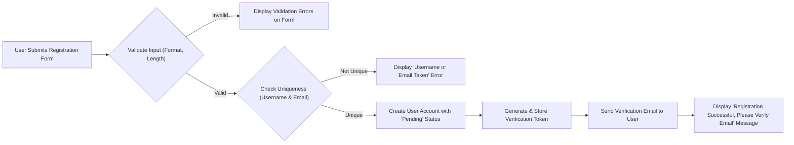

# 03 User Authentication and Profiles

## 1. User Registration Process

The user registration process allows new users to create a `member` account, enabling them to participate in the community.

### 1.1. Registration Form

*   THE system SHALL provide a registration form for new users to create an account.
*   The form SHALL require the following fields: Username, Email Address, and Password.

### 1.2. Input Validation and Rules

User input must be validated to ensure data integrity and security.

*   **Username**:
    *   THE system SHALL require usernames to be unique across the platform.
    *   IF a user attempts to register with a username that is already in use, THEN THE system SHALL display an error message indicating that the username is unavailable.
    *   THE system SHALL enforce that usernames are between 3 and 20 characters long.
    *   THE system SHALL enforce that usernames consist only of alphanumeric characters, underscores, and hyphens.
*   **Email Address**:
    *   THE system SHALL require a unique and valid email address for each user account.
    *   IF a user attempts to register with an email address that is already in use, THEN THE system SHALL display an error message.
    *   THE system SHALL validate that the provided email address follows a standard email format.
*   **Password**:
    *   THE system SHALL require user passwords to be at least 8 characters long.
    *   THE system SHALL require passwords to contain a mix of character types (e.g., uppercase, lowercase, numbers, special characters) to enforce strong password policies.
    *   THE system SHALL include a password confirmation field to ensure the user has typed their intended password correctly.
    *   IF the password and password confirmation fields do not match, THEN THE system SHALL display an error message.

### 1.3. Email Verification

To ensure users are reachable and to prevent spam accounts, an email verification step is mandatory.

*   WHEN a user successfully completes the registration form, THE system SHALL send an automated email with a unique verification link to the user's provided email address.
*   WHILE an account is pending email verification, THE system SHALL restrict the user's privileges (e.g., preventing them from posting, commenting, or voting).
*   WHEN the user clicks the verification link, THE system SHALL activate the user's account, granting them full `member` permissions.

### 1.4. Registration Flow Diagram

## 2. User Login and Session Management

This section describes the process for authenticating users and managing their sessions.

### 2.1. Login Process

*   THE system SHALL provide a login interface where users can authenticate using their registered username/email and password.
*   WHEN a user provides valid login credentials, THE system SHALL authenticate the user and grant them access to the platform.
*   IF a user provides invalid credentials, THEN THE system SHALL display a generic "Invalid username or password" error message without specifying which part was incorrect.
*   THE system SHALL implement a rate-limiting mechanism to temporarily lock an account after multiple failed login attempts from the same IP address or for the same user account.

### 2.2. Session Management

Sessions identify authenticated users across multiple requests. The system will use JSON Web Tokens (JWT) for session management.

*   THE system SHALL use JWT for managing user sessions.
*   WHEN a user successfully logs in, THE system SHALL issue a short-lived access token and a long-lived refresh token.
    *   **Access Token**: Grants access to protected resources. It should have a short expiration time (e.g., 15-30 minutes) to mitigate risks if compromised.
    *   **Refresh Token**: Used to obtain a new access token without requiring the user to log in again. It should have a longer expiration time (e.g., 7-30 days).
*   WHILE a user's access token is valid, THE system SHALL allow them to access all resources permitted to their role.
*   IF a user's access token is expired, THEN THE system SHALL reject the request and require a token refresh.
*   THE system SHALL provide a mechanism to automatically refresh the access token using the refresh token without interrupting the user experience.
*   WHEN a user explicitly logs out, THE system SHALL invalidate their session, ensuring the associated access and refresh tokens can no longer be used.

## 3. Password Management

This section covers requirements for users to manage their own passwords securely.

### 3.1. Password Storage

*   THE system SHALL store all user passwords in a securely hashed and salted format. Under no circumstances SHALL passwords be stored in plaintext.

### 3.2. Change Password

*   THE system SHALL allow an authenticated user to change their password.
*   WHEN a user initiates a password change, THE system SHALL require them to enter their current password for verification.
*   IF the current password provided is correct, THEN THE system SHALL allow the user to set a new password, which must adhere to the platform's password strength policies.

### 3.3. Forgot/Reset Password

*   THE system SHALL provide a "Forgot Password" feature for users who have lost access to their accounts.
*   WHEN a user requests a password reset, THE system SHALL ask for their registered email address.
*   IF the provided email address exists in the system, THEN THE system SHALL send an email containing a time-sensitive, single-use password reset link.
*   WHEN the user clicks the reset link, THE system SHALL direct them to a page where they can set a new password without needing to know their old one.

## 4. User Profile Page

The user profile page serves as a public-facing page that summarizes a user's identity and contributions to the platform.

### 4.1. Profile Content

*   THE system SHALL make user profiles publicly accessible via a URL structure like `/user/{username}`.
*   THE user profile page SHALL display the following public information:
    *   Username
    *   Account registration date (often referred to as "Cake Day").
    *   Post Karma: The total karma accumulated from all posts created by the user.
    *   Comment Karma: The total karma accumulated from all comments made by the user.
*   The profile page SHALL feature separate tabs or sections to display:
    *   A list of all posts submitted by the user.
    *   A list of all comments made by the user.

### 4.2. User-Facing Controls

*   WHERE the viewing user is the owner of the profile, THE system SHALL display account management options.
*   These options SHALL include, but are not limited to, a link to change the password and the ability to manage account privacy settings.
*   A user's email address SHALL only be visible to the user themselves on their own profile or account settings page.

## 5. Data Privacy Considerations

Protecting user privacy is a critical requirement.

### 5.1. Data Visibility

*   THE system SHALL NOT expose a user's email address, password hash, or any other sensitive personal information through public-facing pages or APIs.
*   THE system SHALL ensure that any user-specific data returned by the API is filtered based on the requester's permissions, distinguishing between the profile owner and other viewers.

### 5.2. Account Deletion

*   THE system SHALL provide users with the option to permanently delete their own account.
*   WHEN a user requests to delete their account, THE system SHALL present a confirmation step to prevent accidental deletion.
*   IF a user confirms the deletion, THEN THE system SHALL permanently delete all personal identifying information, including username, email, and hashed password.
*   Posts and comments created by the user SHALL NOT be deleted from the platform to maintain the integrity of conversations.
*   WHEN a user account is deleted, THE system SHALL disassociate all their created content (posts and comments) from their former username, displaying "[deleted]" or a similar placeholder as the author.