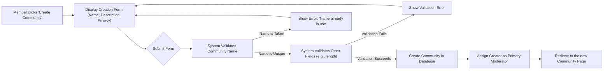
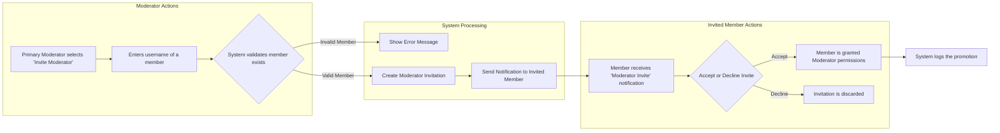

# Community Management

This document outlines the requirements for creating, managing, and discovering communities, which are the core organizational units of the platform. It details the processes for community creation, user membership (subscription), moderation, and settings configuration.

## 1. Community Creation

Any registered member can create a new community, provided they meet the karma requirements detailed in the [Karma and User Reputation](./07-karma-and-user-reputation.md) document. The creator of the community automatically becomes its first and primary moderator, with full permissions over that specific community.

### 1.1. Creation Process Flow

A `member` initiates the creation of a community by providing a unique name, a description, and setting its privacy level. The system validates this information before finalizing the creation.

### 1.2. Functional Requirements (EARS)

- **WHEN** a `member` submits the community creation form, **THE** system **SHALL** validate the uniqueness of the community name on a case-insensitive basis.
- **IF** the proposed community name already exists, **THEN** **THE** system **SHALL** reject the creation and return an error message stating, "This community name is already taken."
- **THE** community name **SHALL** be between 3 and 21 characters long.
- **THE** community name **SHALL** consist only of alphanumeric characters (a-z, 0-9) and may not contain spaces or special symbols.
- **THE** community description **SHALL** have a maximum length of 500 characters.
- **WHEN** a community is successfully created, **THE** system **SHALL** assign the creating `member` as the community's primary moderator with full permissions for that community.
- **WHEN** a community is created, **THE** system **SHALL** allow the creator to set an initial privacy level from a predefined list: "Public", "Restricted", or "Private".

## 2. Community Settings

Community moderators and system admins have the ability to manage the settings of a community to tailor its appearance, rules, and behavior.

### 2.1. Configurable Settings

| Setting              | Description                                                                 | Modifiable by (Moderator) | Modifiable by (Admin) |
| -------------------- | --------------------------------------------------------------------------- | :-----------------------: | :-------------------: |
| **Description**      | The public text describing the community's purpose.                         |             ✅            |           ✅          |
| **Community Rules**    | A list of rules for posting and commenting within the community.             |             ✅            |           ✅          |
| **Privacy Level**    | Controls who can view and participate in the community.                     |             ✅            |           ✅          |
| **Post Type**        | Restrict allowed post types (e.g., text-only, links-only).                  |             ✅            |           ✅          |
| **Profile Image**    | The avatar or icon for the community.                                       |             ✅            |           ✅          |
| **Banner Image**     | The header image displayed at the top of the community page.                |             ✅            |           ✅          |

### 2.2. Privacy Levels Explained

- **Public**: Content is visible to all users, including Guests. Any `member` can post or comment.
- **Restricted**: Content is visible to all users, including Guests. Only approved members of the community can create new posts.
- **Private**: Only approved members of the community can view content, create new posts, or comment. The community is hidden from all public discovery features.

### 2.3. Functional Requirements (EARS)

- **WHERE** the user is a moderator of the community OR an `admin`, **THE** system **SHALL** grant access to the community settings panel.
- **WHEN** a moderator submits changes to the community settings, **THE** system **SHALL** validate the inputs (e.g., description length) and apply the changes immediately.
- **IF** a community's privacy level is "Public", **THEN** **THE** system **SHALL** allow any `member` to post and comment.
- **IF** a community's privacy level is "Restricted", **THEN** **THE** system **SHALL** only allow approved members of that community to create posts, but allow any `member` to comment.
- **IF** a community's privacy level is "Private", **THEN** **THE** system **SHALL** prevent users who are not approved members from viewing, posting, or commenting in the community.

## 3. Subscribing and Unsubscribing

Members can "subscribe" to communities to follow their content. Subscribed communities' posts will appear on the user's personalized home feed.

### 3.1. Functional Requirements (EARS)

- **WHEN** a `member` subscribes to a "Public" or "Restricted" community, **THE** system **SHALL** add the community to the member's subscription list.
- **THE** system **SHALL** include posts from a member's subscribed communities in their main, personalized content feed.
- **WHEN** a `member` unsubscribes from a community, **THE** system **SHALL** remove the community from their subscription list and immediately cease showing its posts in their main feed.
- **WHEN** a `member` requests to subscribe to a "Private" community, **THE** system **SHALL** record the request and send a notification to the community's moderators for approval.
- **WHILE** a `member` is viewing a community page, **THE** system **SHALL** clearly indicate their current subscription status (e.g., "Subscribed" or "Subscribe").

## 4. Community Discovery

To foster growth and engagement, users must be able to find new communities of interest.

### 4.1. Functional Requirements (EARS)

- **THE** system **SHALL** provide a search functionality that allows users to find communities by matching text in their name.
- **THE** system **SHALL** extend search queries to match keywords within a community's description to improve discoverability.
- **THE** system **SHALL** provide a browsable list of communities sorted in descending order by the total number of subscribers.
- **THE** system **SHALL** provide a browsable list of newly created communities sorted in descending order by their creation date.
- **IF** a community is set to "Private", **THEN** **THE** system **SHALL** exclude it from all public discovery features (search results, top/new lists) for any user who is not an approved member of that community.

## 5. Moderator Roles and Permissions

Community moderation is handled by designated moderators for that specific community. This is a distinct role from the system-wide `admin`.

### 5.1. Moderator Hierarchy

- The creator of the community is the **Primary Moderator** and has irrevocable permissions over the community, which cannot be revoked by other moderators.
- Primary Moderators can invite other `members` to become **Moderators**.
- Primary Moderators can revoke moderator status from other moderators they have appointed.

### 5.2. Moderator Invitation Flow

### 5.3. Permissions Matrix (Community-Context)

| Action                             | Guest (Not Logged In) | Member     | Moderator  | Admin (System-Level) |
| ---------------------------------- | :-------------------: | :--------: | :--------: | :------------------: |
| **View Community (if Public)**     |           ✅          |     ✅     |     ✅     |          ✅          |
| **Subscribe to Community**         |           ❌          |     ✅     |     ✅     |          ✅          |
| **Create Post**                    |           ❌          |     ✅*    |     ✅     |          ✅          |
| **Comment on Post**                |           ❌          |     ✅*    |     ✅     |          ✅          |
| **Remove Post/Comment**            |           ❌          |     ❌     |     ✅     |          ✅          |
| **Ban User from Community**        |           ❌          |     ❌     |     ✅     |          ✅          |
| **Edit Community Settings**        |           ❌          |     ❌     |     ✅     |          ✅          |
| **Invite/Remove Moderators**       |           ❌          |     ❌     |     ✅**   |          ✅          |

`*` - A `member`'s ability to post/comment may be restricted based on the community's privacy level.
`**` - Only the Primary Moderator or moderators with specific permissions can manage other moderators.

### 5.4. Functional Requirements (EARS)

- **WHERE** the user is a Primary Moderator, **THE** system **SHALL** allow them to invite other members to become moderators.
- **WHILE** in a community they moderate, a `moderator` **SHALL** have the ability to remove any post or comment made by any user within that community.
- **IF** a `moderator` bans a `member` from their community, **THEN** **THE** system **SHALL** prevent that member from posting, commenting, or voting within that specific community indefinitely or until the ban is lifted by a moderator.
- **THE** `admin` **SHALL** have all the permissions of a community moderator in every community on the platform, providing a system-level override capability.
- **WHEN** a moderator removes a post or comment, **THE** system **SHALL** log the action, linking the moderator to the removal for auditing purposes.
- **WHEN** a moderator bans a user from the community, **THE** system **SHALL** create a ban record that includes the banned user, the moderator who issued the ban, the date, and an optional reason.
