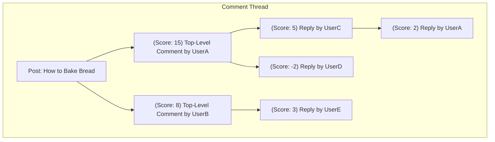
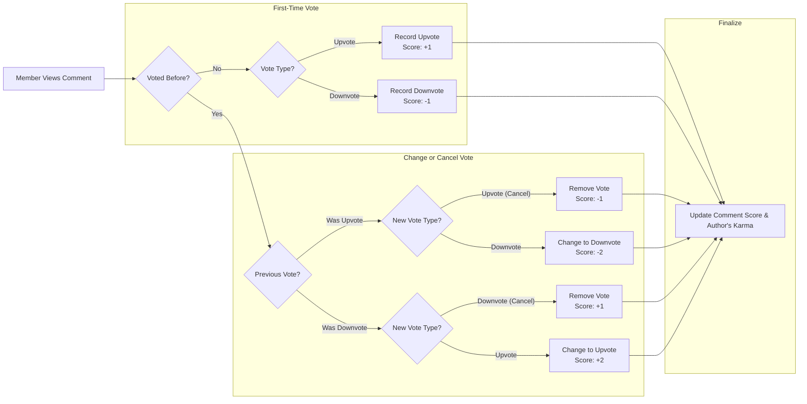

# 06. Commenting System Requirements

This document outlines the functional and business requirements for the commenting system of the community platform. It covers the complete lifecycle of a comment: creation, nested replies, editing, deletion, voting, and sorting. These specifications are intended for backend developers to ensure a consistent, robust, and feature-complete implementation.

This system is a core interactive component and is directly dependent on several other modules. For a complete understanding of related concepts, refer to:
- [02-user-actors-and-permissions.md](./02-user-actors-and-permissions.md) for user roles (`guest`, `member`, `admin`).
- [05-post-creation-and-interaction.md](./05-post-creation-and-interaction.md) for the posts that comments are attached to.
- [07-karma-and-user-reputation.md](./07-karma-and-user-reputation.md) for how voting on comments affects user karma.

## 1. Creating Comments

Authenticated members can engage in discussions on posts by leaving comments. This functionality is restricted to `member` roles to maintain accountability and prevent anonymous abuse.

### 1.1 Functional Requirements
- **EARS-CS-01**: THE system SHALL allow a `member` to add a comment to any post.
- **EARS-CS-02**: WHEN a `member` submits a new comment, THE system SHALL associate the comment with the parent post and the authoring `member`.
- **EARS-CS-03**: WHEN a new comment is created, THE system SHALL automatically cast an upvote from the author on their new comment, initializing the comment's score to 1.
- **EARS-CS-04**: IF a user who is not an authenticated `member` (i.e., a `guest`) attempts to create a comment, THEN THE system SHALL reject the action and respond with an authentication error (e.g., HTTP 401 Unauthorized).

### 1.2 Business Rules & Constraints
- **EARS-CS-05**: THE system SHALL enforce a maximum character limit of 10,000 characters for any single comment.
- **EARS-CS-06**: IF a `member` attempts to submit a comment exceeding the character limit, THEN THE system SHALL reject the submission and return an error message: "Comment must be 10,000 characters or less."
- **EARS-CS-07**: WHEN a `member` attempts to create a comment, THE system SHALL prevent the action if they have already created 5 comments within the last 1 minute. IF this limit is triggered, THE system SHALL return an error message indicating how long the user must wait.

## 2. Nested Comment Replies (Threading)

To facilitate organized and easy-to-follow conversations, the system must support infinitely nested comments (threading). A comment can be a direct response to a post (a top-level comment) or a reply to another comment (a child comment).

### 2.1 Comment Hierarchy Diagram

### 2.2 Functional Requirements
- **EARS-CS-08**: WHEN a `member` submits a reply to an existing comment, THE system SHALL create a new comment and link it as a child to the selected parent comment.
- **EARS-CS-09**: WHEN a post is viewed, THE system SHALL be capable of retrieving the entire comment thread, including all nested children, preserving the parent-child relationships.

## 3. Editing and Deleting Comments

Members can manage their own comments, and admins have override capabilities. These actions are subject to rules that protect conversation integrity.

### 3.1 Functional Requirements
- **EARS-CS-10**: WHERE the requesting user is the author of the comment, THE system SHALL permit them to edit the content of their comment.
- **EARS-CS-11**: WHERE the requesting user is the author of a comment OR an `admin`, THE system SHALL permit them to delete the comment.
- **EARS-CS-12**: WHEN a `member` deletes their comment, THE system SHALL replace the comment's text with the placeholder string `"[deleted]"` and disassociate it from the author's user profile.
- **EARS-CS-13**: WHEN a comment is deleted, THE system SHALL preserve all of its child comments (replies), which will remain attached to the `"[deleted]"` placeholder parent.
- **EARS-CS-14**: IF a comment is deleted by an `admin`, THE system SHALL perform the same deletion action as the author but SHALL record the admin's ID and a timestamp in a moderation log for auditing purposes.

### 3.2 Business Rules
- **EARS-CS-15**: THE system SHALL only allow a `member` to edit their comment within the first **one hour** of its original posting time.
- **EARS-CS-16**: IF a `member` attempts to edit their comment after the one-hour window has passed, THEN THE system SHALL deny the request with an error message: "Comments can only be edited within one hour of posting."

## 4. Upvoting and Downvoting Comments

Community members vote on comments to surface the most relevant responses. This is a core mechanic for comment ranking and user karma calculation.

### 4.1 Voting Logic Diagram

### 4.2 Functional Requirements
- **EARS-CS-17**: THE system SHALL restrict voting on comments to authenticated `members`.
- **EARS-CS-18**: THE system SHALL NOT allow a `member` to vote on their own comment.
- **EARS-CS-19**: WHEN a `member` interacts with a comment's vote buttons, THE system SHALL apply the score changes as defined in the Voting Logic Diagram (4.1).

## 5. Comment Display and Sorting

To help users find the most relevant discussions, comments must be sortable. The default sort order will be "Top" to prioritize quality content.

### 5.1 Sorting Options
| Sort Method | Description |
|---|---|
| **Top** (Default) | Ranks comments by their score (upvotes - downvotes) in descending order. |
| **New** | Ranks comments by their creation timestamp in descending order. |
| **Controversial** | Ranks comments by high vote volume with a close upvote-to-downvote ratio. |

### 5.2 Functional Requirements
- **EARS-CS-20**: THE system SHALL use "Top" as the default sorting method for displaying comments under a post.
- **EARS-CS-21**: WHEN a user selects the "New" sort option, THE system SHALL display all top-level comments in reverse chronological order.
- **EARS-CS-22**: WHEN a user selects the "Top" sort option, THE system SHALL display all top-level comments ordered by their score in descending order.
- **EARS-CS-23**: WHEN a user selects the "Controversial" sort option, THE system SHALL display top-level comments ranked by a controversy score that prioritizes high total vote counts and a balanced upvote/downvote ratio.
- **EARS-CS-24**: THE system SHALL apply the selected sort order only to top-level comments; replies within a thread SHALL always be displayed chronologically.

## 6. Notifications

To encourage active conversations, the system must notify users when their content receives engagement.

### 6.1 Functional Requirements
- **EARS-CS-25**: WHEN a `member`'s comment receives a direct reply from another user, THE system SHALL generate a notification for the author of the parent comment.
- **EARS-CS-26**: WHEN a `member`'s post receives a new top-level comment, THE system SHALL generate a notification for the author of the post.
- **EARS-CS-27**: THE notification SHALL include the username of the replier, a preview of the reply, and a direct link to the new comment.
- **EARS-CS-28**: THE system SHALL NOT generate a notification if a user replies to their own comment or post.

## 7. Edge Cases and System Interactions

This section defines system behavior for comments during specific events like user bans or content deletion.

- **EARS-CS-29**: IF a `member`'s account is banned, THEN THE system SHALL retain all of their existing comments but prepend the author's username with a `"[banned]"` tag.
- **EARS-CS-30**: WHEN a parent post is deleted, THE system SHALL retain all associated comments, but display a message in the post's content area indicating that "The original post has been deleted by the author."

## 8. Consolidated Requirements Summary

| ID | Requirement Description |
|---|---|
| EARS-CS-01 | THE system SHALL allow a `member` to add a comment to any post. |
| EARS-CS-02 | WHEN a `member` submits a new comment, THE system SHALL associate it with the parent post and author. |
| EARS-CS-03 | WHEN a new comment is created, THE system SHALL initialize its score to 1 with an author upvote. |
| EARS-CS-04 | IF a `guest` attempts to comment, THEN THE system SHALL respond with an auth error. |
| EARS-CS-05 | THE system SHALL enforce a 10,000 character limit for comments. |
| EARS-CS-06 | IF the character limit is exceeded, THEN THE system SHALL return a specific error message. |
| EARS-CS-07 | THE system SHALL limit `members` to 5 comments per minute. |
| EARS-CS-08 | WHEN a `member` replies to a comment, THE system SHALL link it as a child. |
| EARS-CS-09 | WHEN a post is viewed, THE system SHALL retrieve the full, nested comment thread. |
| EARS-CS-10 | WHERE user is the author, THE system SHALL permit them to edit their comment. |
| EARS-CS-11 | WHERE user is the author or `admin`, THE system SHALL permit them to delete a comment. |
| EARS-CS-12 | WHEN a `member` deletes their comment, THE system SHALL replace text and username with "[deleted]". |
| EARS-CS-13 | WHEN a comment is deleted, THE system SHALL preserve all its child comments. |
| EARS-CS-14 | IF an `admin` deletes a comment, THE system SHALL log the action. |
| EARS-CS-15 | THE system SHALL only allow comment edits within the first hour. |
| EARS-CS-16 | IF edit is attempted after one hour, THEN THE system SHALL return a specific error message. |
| EARS-CS-17 | THE system SHALL restrict comment voting to authenticated `members`. |
| EARS-CS-18 | THE system SHALL NOT allow a `member` to vote on their own comment. |
| EARS-CS-19 | WHEN voting, THE system SHALL apply score changes as per the Voting Logic Diagram. |
| EARS-CS-20 | THE system SHALL use "Top" as the default sort method for comments. |
| EARS-CS-21 | WHEN "New" sort is selected, THE system SHALL display comments in reverse chronological order. |
| EARS-CS-22 | WHEN "Top" sort is selected, THE system SHALL display comments ordered by score descending. |
| EARS-CS-23 | WHEN "Controversial" sort is selected, THE system SHALL rank by controversy score. |
| EARS-CS-24 | Replies within a thread SHALL always be displayed chronologically. |
| EARS-CS-25 | WHEN a comment receives a reply, THE system SHALL notify the parent comment's author. |
| EARS-CS-26 | WHEN a post receives a top-level comment, THE system SHALL notify the post's author. |
| EARS-CS-27 | THE notification SHALL include replier username, a preview, and a link. |
| EARS-CS-28 | THE system SHALL NOT generate notifications for self-replies. |
| EARS-CS-29 | IF a user is banned, their comments SHALL be marked with a `"[banned]"` tag. |
| EARS-CS-30 | WHEN a post is deleted, its comments SHALL remain visible with a placeholder for the post. |